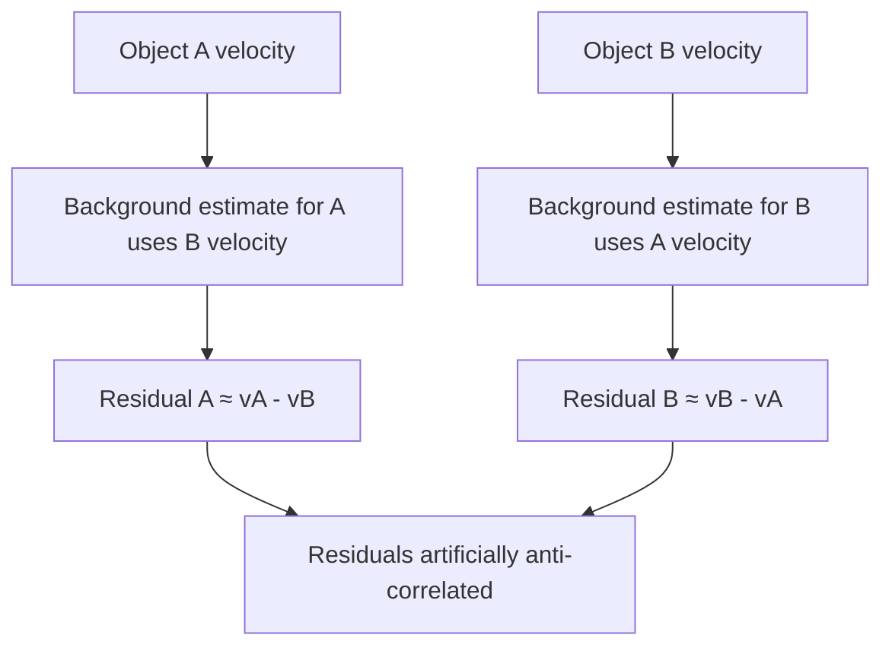

+++
title = "06: It Looked Like Flocking"
date = "2026-08-14T10:30:00+01:00"
draft = false
description = "Nearby Outlier structures move coherently. A spectacular ancestry effect survives multiple controls, then collapses when distance, time and local density are finally compared fairly."
weight = 6
series = ["Digital Life From First Principles"]
categories = ["Programming", "Artificial Life"]
tags = ["Digital Life", "Artificial Life", "Outlier", "Collective Motion", "Causality", "Controls", "Confounds", "Experimental Method"]
+++

The previous chapter was built around a warning.

A deliberately simple swarm had produced object-like forms, coherent-looking collective motion and a persistent measured regime without giving us anything we were prepared to call digital life.

Then we went back to Outlier.

And almost immediately saw structures moving together.

Not merely outward, as an expanding front would carry everything. Together — with what looked like coordination among structures sharing recent causal history.

The biological noun arrived immediately.

**Flocking.**

This time we knew exactly how dangerous the picture was.

But Outlier also gave us a reason to investigate rather than dismiss the impression. Published work had established causal self-replication, and our smaller run had independently recovered branching causal recurrence under its stated criterion.

We already possessed a causal graph.

Shared ancestry and motion could therefore be measured independently.

So the hypothesis was testable:

> **Do structures with shared causal history also show stronger dynamical coherence?**

The biological-looking interpretation therefore came with two independently measurable sides.

We turned the impression into a hypothesis and started measuring.

---

## What Would Flocking Mean?

Not: *are these things birds?*

We did not begin by trying to satisfy every formal definition from swarm biology or active-matter physics. We started with something much narrower and answerable:

> Do nearby persistent moving structures travel in unusually similar directions?

That is a measurement, and it needs three things: structures that persist long enough to have a direction, a way to compare directions, and a control.

Using the causal graph to follow plausible cluster continuations through time, we recovered 13,635 motion tracks lasting at least eight generations, yielding 633,808 motion observations.

Each observation gave us what the hypothesis required:

```text
position
velocity
time
causal identity
```

Here, `velocity` is not a variable inside Outlier. It is an operational measurement derived from the displacement of a tracked structure through time.

Comparing directions is simpler. For two velocity vectors, normalize both and take their dot product:

$$
A_{ij}
=
\frac{v_i}{|v_i|}
\cdot
\frac{v_j}{|v_j|}
$$

which lands between −1 and +1:

```text
+1  = same direction
 0  = no directional agreement
-1  = opposite directions
```

We compared structures moving at the same moment, at various spatial separations, using a spatial index rather than comparing every structure with every other one. That was partly a performance decision and partly a better experiment: structures on opposite sides of the universe tell us nothing about local collective motion.

Note the vocabulary discipline here, because it does the work later.

```text
flocking
```

is an interpretation.

```text
short-range directional alignment
```

is a measurement. The whole chapter is about the distance between those two lines.

---

## The First Result

At short distances, observed velocity alignment was approximately **0.74**, against a velocity-shuffled control that was much lower.



So the visual impression corresponded to a measurable feature of this run: an average near `0.74`, on a scale from `-1` to `+1`.

For now, that is all we should say.

Nearby tracked structures in this run move coherently.

Why they do so remains open.

What that *means* is a different question, and we had immediately created a new problem.

---

## Maybe Everything Is Simply Moving Outward

Outlier develops as an expanding structure. Nearby clusters may sit on the same expanding front, and two things being carried outward by the same expansion will have similar velocity vectors without any relationship to each other at all.

Picture two pieces of debris riding the same circular wave. Their velocities agree beautifully. They have never interacted, and neither is responding to the other in any way.

If that were the whole story, our 0.74 would be an elaborate way of measuring that Outlier grows.

The control is direct. For each position, compute its radial direction relative to the centre of the expansion:

$$
r_i
=
\frac{x_i-c}{|x_i-c|}
$$

then decompose each velocity into a radial component and a non-radial component, and discard the radial part. What remains is motion that is not explained by the global expansion. If the coherence was expansion, the residual alignment should collapse.

It did not:

```text
raw short-range alignment        = 0.7373
radial-subtracted alignment      = 0.7427
shuffled residual control        = 0.1933
```

Read those three numbers carefully, because this is the moment the investigation became serious.

The alignment did not merely survive removal of the global expansion field — it remained at essentially the same level. The small increase from `0.7373` to `0.7427` is not interpreted here.

The shuffled control on the same residuals sits at `0.1933`, so the residual alignment is not an artefact of the subtraction procedure producing spuriously agreeable vectors.



One explanation eliminated:

> **The observed coherence is not explained merely by every structure moving radially away from the original seed.**

At this point the flocking interpretation had become harder to dismiss.

The most obvious alternative explanation — simple radial expansion — had failed to account for the effect.

But we still did not know what produced the coherence.

Then the causal graph suggested an explanation.

---

## Shared Causal History

Chapter 4 left us with an uncomfortable published result: causal self-replication in Outlier can involve spatially separated components.

That does not establish that those components constitute one natural individual — we were careful about this, and remain careful about it. But it suggests a narrower and testable idea:

> **Does shared causal organization explain the apparent coordinated motion?**

If structures descending from a recent common ancestor remained dynamically coupled, then shared motion might reflect continuing causal organization rather than independent objects somehow "deciding" to coordinate.

That would be a much more interesting explanation.

It was an attractive hypothesis. It used infrastructure we already trusted, offered an explanation for a measurement we already had, and required no imported social mechanism from biology.

But it was still only a hypothesis.

So: do structures belonging to the same recent causal family move more coherently than structures assigned to different recent families?

### Assigning families

An earlier family definition based on four branches descending from one early `c2` left too few different-family observations to support a useful comparison.

So we strengthened it. Every cluster was assigned its **most recent identifiable `c2` ancestor**. A cluster that was itself `c2` began a new family; otherwise ancestry propagated through the causal graph.

The coverage was remarkable. Of 138,891 clusters, 138,132 received a recent `c2` ancestor, with only 10 ambiguous and 749 unassigned. Of the motion observations, 633,696 out of 633,808 carried a family label.



Almost every tracked moving structure in this run could therefore be assigned a recent `c2` ancestry label under this procedure.

That coverage was striking.

It explained exactly nothing about the motion.

A useful label is not an explanation.

---

## A Very Exciting Result

Comparing nearby structures after subtracting a local background flow, we found:

```text
same recent-c2 family         =  0.828
different recent-c2 family    = -0.349
```

That looked spectacular.

Related structures appeared strongly aligned at `0.828`.

Different-family structures appeared strongly anti-aligned at `-0.349`.

For a moment it looked as though causal families were behaving like distinct dynamical units.

But the negative result was almost *too* interesting.

Nothing in our hypothesis predicted that unrelated families should actively oppose one another.

That unexplained success was the clue.

### Our experiment was wrong

This is worth slowing down for.

To estimate the local environmental flow around object `A`, we averaged the velocities of nearby structures, excluding structures from `A`'s own family — sensibly, so that `A`'s relatives could not define the background against which `A` was judged.

Now consider comparing `A` from family α with `B` from family β. `B` is not in `A`'s family, so `B` contributes to `A`'s background estimate. And `A` is not in `B`'s family, so `A` contributes to `B`'s.

In the simplest case:

$$
r_A \approx v_A-v_B
$$

and:

$$
r_B \approx v_B-v_A
$$

so:

$$
r_B \approx -r_A
$$

We had built an anti-correlation into the estimator. The −0.349 was not a discovery about different families. It was a property of the arithmetic.



The measurement was partly using the tested pair to manufacture the background against which that same pair was evaluated.

The control itself had become a confound.

That matters because controls are not external guarantees of correctness. They are pieces of experimental machinery.

They can be wrong too.

### The stronger control

The fix is straightforward once the problem is visible. When testing a pair from families α and β, estimate the local background while excluding **both** families from both estimates. Now neither member of the tested pair can manufacture the other's residual.

Under this stronger control:

```text
Same recent c2 ancestor          0.746
Very close c2 ancestry           0.101
Close c2 ancestry                0.032
Distant c2 ancestry              0.135
Very distant c2 ancestry         0.081
```

The first category means that the pair shares the same most recent identified `c2` ancestor. The remaining categories group different-family pairs by genealogical separation in the causal graph; the exact bin definitions are given in the appendix.

“Different family” therefore does not mean “causally unrelated.” It means that the pair does not share the same most recent identified `c2` ancestor under this procedure.



The pathological negative number is gone, as it should be. But the main effect is still there, and it is enormous:

```text
same recent c2 ancestor    0.746
very close ancestry        0.101
                           -----
gap                        0.645
```

A gap of `0.645` on a scale bounded at `1.0`.

And look at what the apparent effect had already survived:

```text
ancestry derived from the causal graph
+
shuffled-motion control
+
radial-expansion control
+
a discovered estimator bug
+
a corrected estimator
```

---

## The Four-and-a-Half-Cell Problem

Structures sharing the same recent `c2` ancestor had a mean separation of about **4.5 cells**.

Structures in other causal groups were typically tens of cells apart.

Sit with that for a moment, because everything turns on it.

We had two variables that both track family membership. Same family means recently descended — and it also means *physically very close together*, because a structure and its recent causal descendants have not had time to get far apart. Different family, in this dataset, generally means far away.

And we already knew, from the very first measurement, that motion coherence depends strongly on distance. That was the finding: *short-range* alignment is high.

So:

```text
same family
↓
tends to mean closer

closer
↓
tends to mean more coherent
```

which produces:

```text
same family
↓
appears more coherent
```

even if ancestry contributed nothing to the difference.

The 0.645 gap might be measuring exactly one thing: that we had compared structures 4.5 cells apart against structures tens of cells apart, and discovered that closer structures move more similarly. Which we knew before we started.

Nothing about the `0.645` was fabricated.

Same-family pairs really did move more coherently than different-family pairs.

The problem was the sentence we wanted to attach to that number:

> **because they are related**

The measurement was real.

The causal interpretation was not yet identified.

The comparison was never able to answer the ancestry question, no matter how large the gap it produced. Comparing like with unlike gives you a difference. It does not tell you which of the differences is responsible.

So we needed to compare like with like.

---

## Distance Matching

The stronger comparison holds three measured differences fixed: when the pair was observed, how far apart its members were, and how crowded the surrounding region was. Local density was measured by the existing pair-construction pipeline using a 32-cell neighborhood and then binned for matching.

For each same-family pair, find different-family pairs occurring in the same:

```text
simulation-time bin
spatial-distance bin
local-density bin
```

— while continuing to use the pair-excluded background-flow correction from the previous stage. Then compare within each matched stratum, using equal numbers of same-family and different-family pairs, so that no stratum can dominate the result by virtue of being over-represented in one group.

Matching makes the comparison fair with respect to those measured variables. It does not eliminate every possible unmeasured difference in local environment.

The question becomes precise in a way it had not been before:

> At similar times, at similar distances, and in similar local environments, do members of the same `c2` causal family move more coherently than members of different families?

The underlying dataset contained 2,617,077 usable pair records. The matched analysis ultimately drew roughly 65,000 pairs from each group across hundreds of comparable strata.

The implementation details belong in the appendix.

One methodological detail does not: because the run had been preserved as a queryable experimental specimen, discovering the confound did not require rerunning the entire world. We could ask a better question of the same evidence.

That made correction cheap enough to actually happen.

The matched result across the full range of separations present in the data was:

```text
same-family         0.1515
different-family    0.1588
difference         -0.0073
```

The spectacular advantage had disappeared.

After matching on time, distance and local density, recent-family membership provided no additional positive coherence in this comparison. The pair-weighted point estimate was slightly negative.

That should have been the end.

It was not.

Matching answers a question only where both groups actually contain comparable observations — and we had not yet checked where that was true.

---

## Common Support

Matching cannot create comparison data where none exists.

If same-family pairs dominate one distance regime and different-family pairs dominate another, matching can only speak about the region where the two distributions overlap.

Outside that overlap there is no counterfactual comparison to recover.

A global-looking number can therefore answer a much narrower question than its formatting suggests.

Given what we had just learned about the 4.5-cell separation, this was not a hypothetical worry. Same-family pairs are concentrated at exactly the distances where different-family pairs are rarest.

So we kept all 2,617,077 pair records and measured the overlap directly, across distance bins:

```text
0–4
4–8
8–12
12–16
16–24
24–32
32–48
48–64
64–96
```

with a declared operational rule:

> **A distance bin must contain at least 100 same-family and 100 different-family raw pair records.**

The largest contiguous distance region satisfying that condition was:

```text
[4, 64) cells
```



This is a distance-support criterion. Inside that region, the matched analysis imposes a further requirement: a time × distance × density stratum contributes only when both same-family and different-family observations are present.

The shortest-distance regime, 0–4 cells, falls **outside** the primary distance-support region.

That changes what the analysis is entitled to say, and it changes it in both directions. We cannot claim matching has identified the ancestry effect at very short range. We also cannot claim it has ruled it out.

---

## Inside the Region We Can Actually Compare

Restricting to 4–64 cells, the raw descriptive data still favoured the ancestry interpretation:

```text
same-family mean         0.1732
different-family mean    0.1166
raw difference          +0.0566
```

Even after removing the extreme short-range regime, the raw comparison still favoured the ancestry interpretation.

Applying the matching procedure within this region — exact matching on time bin, distance bin and density bin, with equal numbers from each group per stratum:

```text
matched same-family mean        +0.150823
matched different-family mean   +0.157890
pair-weighted matched effect    -0.007067
```

across:

```text
64,948 matched pairs per group
659 matched strata
```

There are two useful summaries because they answer slightly different weighting questions.

The pair-weighted estimate gives larger matched strata more influence. If instead every matched stratum receives equal weight, the effect is:

```text
equal-stratum effect            -0.026463
```

The uncertainty analysis belongs to that equal-stratum estimand. Bootstrapping the 659 stratum-level effects — rather than treating individual pair records as independent — gave:

```text
95% stratum-bootstrap interval
[-0.066450, +0.012172]
```



Inside common support, the raw same-family advantage of `+0.0566` became a pair-weighted matched difference of `-0.007067`.

Nearly 65,000 matched pairs per group.

659 matched strata.

The large positive association had disappeared once the measured comparison became fair.

---

## How Dead Is It?

The central result does not depend on a significance threshold.

Inside the supported 4–64 cell region, the raw same-family/different-family difference was:

```text
+0.0566
```

After exact matching on time, distance and local density, the pair-weighted difference was:

```text
-0.0071
```

Giving every matched stratum equal weight produced:

```text
-0.0265
```

and bootstrapping those 659 stratum-level effects gave:

```text
95% interval
[-0.0665, +0.0122]
```

The earlier analysis had produced a much more spectacular contrast:

```text
same recent c2 ancestor     0.746
comparison                  0.101
                            -----
apparent gap                0.645
```

For scale, the upper bound of the equal-stratum bootstrap interval, `+0.0122`, is only about **1.9% as large as that earlier `0.645` contrast**.

That is not a formal claim that matching removed exactly 98.1% of one directly comparable effect. The earlier `0.645` contrast and the final binary matched estimand are not identical.

The directly comparable result is simpler:

> **Within the supported 4–64 cell region, a raw same-family advantage of `+0.0566` becomes `-0.0071` after matching on time, distance and local density. The equal-stratum estimate is also negative, with a stratum-bootstrap interval extending only to `+0.0122` on the positive side.**

The large ancestry-associated coherence effect we thought we had found does not survive the fair comparison.

One more check, because the distance-support threshold was our choice.

We repeated the analysis with minimum bin counts of 50, 100, 250 and 500. At 50, the supported distance region expands to 4–96 cells and the pair-weighted matched effect remains `−0.0058`. At 100, 250 and 500, the region remains 4–64 cells and the corresponding effect remains `−0.0071`.

The detailed equal-stratum estimates and bootstrap intervals are in the appendix.

The collapse is not a fragile consequence of one convenient support threshold.

---

## What Remains Unresolved

The 0–4 cell regime is a different matter, and we should be as precise about our ignorance as about our results.

Structures sharing a recent `c2` ancestor are concentrated at extremely short range. That is where the hypothesis would be most likely to be true, if it were true. It is also precisely where different-family controls are too sparse to construct the comparison.

So:

```text
same-family pairs
are common there

different-family controls
are too sparse for the same comparison
```

We cannot say ancestry has no effect at 0–4 cells. We cannot say it does. The correct status is **UNRESOLVED**, and converting an absence of adequate comparison into negative evidence would be the same category of error we have spent the chapter correcting — just pointing the other way.

`UNRESOLVED` is not an embarrassed version of `NO`.

It means the experiment does not contain the comparison required to answer the question.

That boundary is part of the result.

---

## So Was It Flocking?

Not on this evidence. But *no* is the wrong summary, and so is the defensive retreat to *well, we did measure something*.

The honest answer is layered:

```text
SHORT-RANGE MOTION COHERENCE
measured in this run, ~0.74; survives shuffled control

GLOBAL RADIAL EXPANSION AS SOLE EXPLANATION
rejected — coherence survives radial subtraction

LARGE CAUSAL-FAMILY COHERENCE EFFECT
collapses under distance / time / density matching

ADDITIONAL FAMILY-ASSOCIATED COHERENCE, 4–64 CELLS
not supported after matching on time, distance and local density

ANCESTRY EFFECT, 0–4 CELLS
unresolved — inadequate common support

BIOLOGICAL-STYLE FLOCKING
not established
```

The mistake was not seeing motion coherence.

The mistake was promoting it:

```text
coherent motion
→ ancestry-dependent coherence
→ coordinated causal family
→ flock
```

Three things that initially looked like one thing are now separable:

```text
motion coherence
≠
ancestry-dependent coherence
≠
flocking
```

---

## The Phenomenon Did Not Die

This is the part that matters most, and the part a discouraged investigator would get wrong.

**Short-range motion coherence is a measured feature of this run.** The estimate stands: `0.7373` raw and `0.7427` after radial subtraction, against a shuffled residual control of `0.1933`.

Nothing in the ancestry analysis removes that observation.

What collapsed was our explanation for it.

And it deserves more credit than the failure of our explanation might suggest. Remember what Outlier actually is at the substrate level:

```text
binary cells
local neighborhoods
one deterministic update rule
```

There is no velocity variable. No steering force. No alignment rule. No flocking controller. Nothing in those 512 bits mentions direction, neighbours-to-follow, or collective behaviour of any kind. Yet structures arise whose motion is strongly coherent at short range, and stays coherent when the most obvious global explanation is stripped out.

So the surviving phenomenon can be stated without importing a collective:

> **In this run, detected persistent structures exhibit strong short-range directional alignment, and global radial expansion alone does not explain that alignment.**

There is also a possibility we have not tested.

Perhaps the coherence belongs less to independent objects and more to a propagating spatial process through which our detected structures happen to move.

That would require a different experiment — for example, testing whether correlation develops a systematic lag with distance.

We did not run that experiment here.

So the idea remains exactly where it belongs:

> **open**

**The causal result from Chapter 4 is unchanged.** This needs saying explicitly, because failure has a way of spreading beyond its jurisdiction.

The flocking interpretation collapsing does not retract the 144 detected `c2` occurrences, the causal graph, or the branching return structure rooted in the earlier `c2`.

Our claim there remains what it was: branching causal recurrence under our stated causal criterion. The stronger published self-replication result remains the published result.

What failed was a specific attempted promotion — from *shared causal ancestry* to *coordinated collective unit*.

The ancestry assignments remain supported by the causal graph.

Within the supported comparison region, recent-family membership provides no detectable additional positive coherence after matching on time, distance and local density.

That is narrower than saying ancestry can have no relationship whatsoever to motion. Proximity itself may lie on a pathway connecting common history to shared dynamics, and this experiment was not designed to separate every such pathway.

Chapter 4 also left us with an unresolved question about individuality.

If components sharing causal ancestry had retained distinctive dynamical coherence after the controls, that would have strengthened the case that a causal family behaved as a meaningful unit.

That evidence did not survive.

So for the individuality question, Outlier leaves us in an interesting position:

```text
connected geometry
is not enough

causal ancestry alone
is not enough
```

---

## Where This Leaves Us

Every correction in this chapter found a problem in our own analysis rather than in the system. In retrospect each looks obvious. None was obvious before the evidence forced it.

The important number is not `0.645`.

It is what happened when we finally compared like with like.

We lost the flocking interpretation and kept the motion-coherence phenomenon.

Outlier's richness is both its strength and its limitation as an experimental instrument. Geometry, ancestry, distance, expansion and local environment all emerge together. Same-family tends to mean close. Close tends to mean coherent. Everything is expanding.

Every control in this chapter therefore tried to disentangle variables after the world had already produced them together.

Even careful matching left the most interesting very-short-range regime unresolved because the required controls were not present in the data.

Chapter 5 had already pointed toward another way to work:

> **build the comparison into the experiment before the world runs.**

A world where we can hold expansion fixed and vary coupling.

Where we can run the same system again with one mechanism removed and everything else unchanged.

Where *does history matter here?* can be answered by constructing two histories rather than searching an already entangled run for pairs that happen to differ in the right way.

That is not Outlier, and it is not a criticism of Outlier. It is a different instrument for a different job.

So the next move is to build a different kind of world.

Not a world containing:

```text
repair
memory
reproduction
individuality
collective motion
```

A world simple enough that if any of those ever appear, we will know what produced them.

Outlier showed us something important:

> **surprising causal organization can arise without us explicitly programming the organization itself.**

This chapter shows the other side of that richness.

When geometry, ancestry, motion, expansion and local environment emerge together, discovering a phenomenon can be easier than identifying its cause.

So we are going back to almost nothing.

One seed.

One world.

One rule.

And one question at a time.

The next experiment begins with a crystal.

**---**

## Experimental Note

All measurements in this chapter come from the same `512 × 512`, 1,600-generation Outlier run used for our earlier causal analysis.

The motion analysis produced 2,617,077 usable pair records. The final comparison first declared a raw distance-support region of `[4, 64)` cells, then matched same-family and different-family observations exactly within time, distance and local-density bins. Only strata containing both groups contributed to the matched analysis.

The pair-weighted matched estimate and the equal-stratum estimate are different estimands. The reported `[-0.0665, +0.0122]` interval comes from bootstrapping the 659 matched stratum-level effects, not the individual pair records.

That interval therefore describes uncertainty under this within-run stratum-bootstrap procedure. It does not measure variation across independent Outlier seeds, larger worlds, longer runs or alternative rule configurations.

The published causal study operated at `1024 × 1024` for 20,000 updates. Our experiment does not establish that the motion result generalizes to that larger regime.

Full tracking, family-assignment, background-flow, matching, support and resampling procedures are given in the appendix and accompanying experimental record.

**---**

## References

**[1]** Yang, B. *Emergence of Self-Replicating Hierarchical Structures in a Binary Cellular Automaton.* Artificial Life 31(1), 96–105 (2025). doi:10.1162/artl_a_00449

**[2]** Hintze, A. & Bohm, C. *Rethinking self-replication: detecting distributed selfhood in the Outlier cellular automaton.* npj Complexity 3, 11 (2026).
