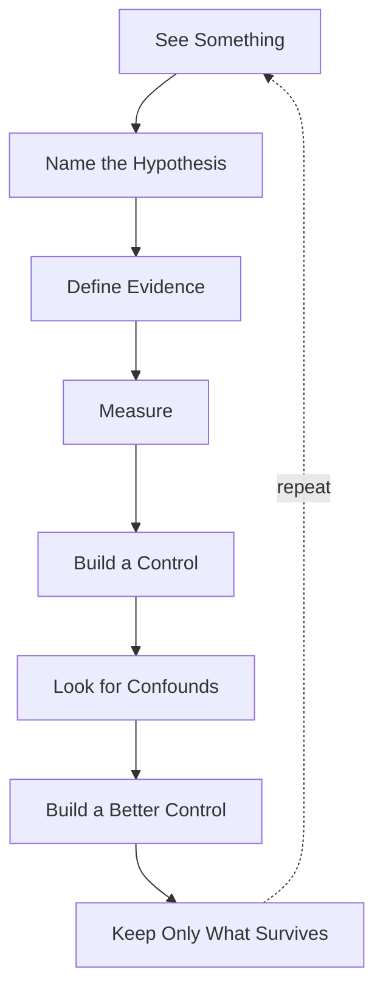

+++
title = "00: What Would Digital Life Mean?"
date = "2026-08-11T00:31:00+01:00"
draft = false
categories = ["Programming", "Artificial Life"]
tags = ["Digital Life", "Cellular Automata", "Artificial Life", "Emergence"]
+++

Suppose we wanted to build life in software.

What would we actually build?

Not a bird rendered on a screen.  
Not a creature with an animation loop.  
Not an AI assistant with a name, a face, and a `memory` database.

Something more fundamental.

A computational system in which some of the properties we associate with living things begin to arise from the operation of the system itself.

That sounds simple until we try to define what those properties are.

We might immediately reach for words such as:

```
structure
persistence
response
adaptation
repair
memory
reproduction
inheritance
evolution
```

Those words are useful.

They are also dangerous.

Because the easiest way to build something that looks like digital life is to put the vocabulary of life directly into the program.

We could write:

```python
class Metabolism:
    ...

class Memory:
    ...

class Reproduction:
    ...

class Organism:
    ...
```

and very quickly produce software that looks biologically inspired.

But we would have learned almost nothing.

Calling a method:

```python
reproduce()
```

does not establish reproduction.

Calling a number:

```python
energy
```

does not establish metabolism.

Writing state to disk does not automatically establish meaningful memory.

Copying a configuration does not establish inheritance.

Running an optimizer does not establish evolution.

The names are ours.

The evidence has to come from the system.

That is where this book begins.

---

## The Cargo Cult of Life

A cargo cult copies the visible form of something without reproducing the mechanism that made the original thing work.

Digital life has an obvious version of this problem.

We can copy the vocabulary of biology:

```
cell
organism
energy
fitness
birth
death
memory
inheritance
evolution
```

and then build software structures with those names.

The result may be complicated.

It may be beautiful.

It may even be useful.

But the terminology itself proves nothing.

So we will use a stricter rule.

> **We do not get to claim a life-like property merely because we implemented something with the same name.**

If we claim persistence, we must measure persistence.

If we claim regeneration, we must damage the system and measure what returns.

If we claim learning, some measurable performance must change because of experience.

If we claim inheritance, something useful must pass from one continuation or successor to another.

If we claim reproduction, visual resemblance between an earlier structure and a later one is not enough. We need evidence that the earlier organization participated causally in producing the later one.

And if we claim evolution, we will need to be precise about what varies, what persists, what is selected, and what actually changes over time.

The goal is not to make software sound alive.

The goal is to discover how far the evidence takes us.

---

## But There Is a Second Trap

Avoiding biological vocabulary is not enough.

There is another mistake we could make.

We could decide in advance what life must contain.

For example:

```
boundary
metabolism
death
reproduction
inheritance
selection
```

and then spend the rest of the book trying to manufacture those properties one by one.

That would be better than merely naming classes after them.

But it would still contain an assumption:

> that digital life must solve the same problems in the same way biological life does.

Why should it?

Biological organisms exist under very particular constraints.

They occupy physical bodies.  
Matter is expensive to rearrange.  
Copying an organism is difficult.  
Information transfer is limited.  
Bodies degrade.  
Individuals die.  
Acquired knowledge is only partially transferable.  
Lineages branch but generally do not merge.

Digital systems inhabit a different substrate.

Copies can be nearly free.  
State can be checkpointed.  
Processes can move between machines.  
Two lineages could fork and later merge.  
Acquired information can potentially be transferred directly.  
A process may be distributed across many locations.  
A digital system might grow without reproducing at all.

So this book will not begin with a checklist called:

```
REQUIREMENTS FOR LIFE
```

We do not know those requirements yet.

That is part of the experiment.

---

## We Are Not Building an Animal

For centuries, humans watched birds and tried to understand flight.

Birds have:

```
feathers
wings
muscles
bones
flapping motion
```

But successful aircraft did not require us to manufacture an artificial bird.

The important discoveries were deeper:

```
lift
drag
thrust
stability
control
```

Birds were evidence that flight was possible.

They were not a complete engineering specification.

Life may be similar.

Biology gives us extraordinary examples of living systems.

But biological organisms may contain many features that are consequences of their substrate rather than universal requirements for life.

So our task is not:

> Build a digital animal.

It is:

> **Discover the aerodynamics of digital life.**

What mechanisms actually matter?  
Which properties emerge naturally?  
Which familiar biological constraints disappear?  
Which new constraints replace them?  
And which things we assume are fundamental turn out merely to be solutions biology found for living in the physical world?

We should not answer those questions in advance.

---

## Start With Almost Nothing

To investigate them, we need a world simple enough that we can see what is happening.

Cellular automata are almost perfect.

A minimal cellular automaton can contain only:

```
state
+
local interaction
+
time
```

Imagine a row of cells.

Each cell contains only:

```
0
or
1
```

At every step, every cell looks at a small neighborhood and applies the same rule.

For example:

```
left   centre   right
  1       0       1

          ↓

       next state
```

Every cell performs the same operation.

There is no central controller.  
No global planner.  
No stored blueprint of the final pattern.  
No cell knows what the whole system is doing.

There is only:

```
local state
local interaction
repetition through time
```

And yet tiny mechanisms like these can produce remarkably complicated global behavior.

That makes them useful for a first question:

> **How much organization can arise without that organization being explicitly represented anywhere in the parts?**

---

## Complexity Does Not Have to Be Stored Explicitly

Consider a system with:

```
201 cells
2 possible states per cell
1 local transition rule
```

No cell stores:

```
triangle
wave
glider
organism
```

No cell knows where an interesting structure begins or ends.

No cell knows what the world will look like fifty steps later.

Each cell sees only a tiny neighborhood.

Yet repeated local interaction can produce:

```
triangles
waves
moving structures
persistent motifs
collisions
irregular regions
```

The apparent complexity exists at a scale above the individual rule application.

That is our first encounter with emergence.

But emergence itself is not yet life.

It is not even necessarily interesting.

---

## Surprise Is Cheap

A complicated-looking cellular automaton can be mesmerizing.

We can generate a beautiful spacetime diagram and immediately feel that something profound must be happening.

Maybe it is.

Maybe it is not.

Random noise can look complicated.  
A short-lived transient can look extraordinary just before disappearing.  
A periodic system can look chaotic if we observe too small a window.  
A pattern can resemble an organism without possessing any property beyond its geometry.

Humans are extremely good at turning motion into nouns.

We see:

```
a shape moved
```

and start saying:

```
it travelled
```

We see:

```
one shape became two
```

and start saying:

```
it reproduced
```

We see:

```
several structures moved together
```

and start saying:

```
they flocked
```

Those words may eventually be justified.

But the animation does not justify them.

So the book needs another rule.

> **Look first. Then try to destroy your own interpretation.**

---

## Our Experimental Method

The visual system gives us hypotheses.

The experiment decides what survives.

Our basic process will be:

```
SEE SOMETHING
↓
NAME THE HYPOTHESIS
↓
DEFINE WHAT WOULD COUNT AS EVIDENCE
↓
MEASURE IT
↓
BUILD A CONTROL
↓
LOOK FOR A CONFOUND
↓
BUILD A BETTER CONTROL
↓
KEEP ONLY WHAT SURVIVES
```

Or, more formally:

```
property
↓
mechanism
↓
implementation
↓
observation
↓
measurement
↓
controlled experiment
↓
bounded claim
```



The last step matters.

A result does not have to prove something enormous to be valuable.

Sometimes the correct conclusion will be:

> We observed persistent local motion coherence.

not:

> We discovered flocking.

Sometimes it will be:

> This structure restores part of its geometry after damage.

not:

> It regenerates like an organism.

The strength of the claim should follow the strength of the evidence.

---

## We Will Probably Be Wrong

This deserves to be explicit.

During this book we will form hypotheses that fail.

We will design controls that turn out to be inadequate.

We will find measurements that initially appear spectacular and later collapse when we discover a confound.

That is not a failure of the project.

That **is** the project.

A useful investigation often looks like:

```
interesting observation
↓
exciting explanation
↓
experiment
↓
apparently strong result
↓
new confound
↓
better experiment
↓
smaller claim
↓
better understanding
```

We are not trying to prove that digital life exists.

We are trying to discover which claims remain standing after we attack them.

---

## What Counts as a Thing?

Even our nouns will have to earn their place.

Suppose a pattern persists while moving through a cellular automaton.

Is it an object?

Perhaps.

Suppose the visible pattern disappears but an equivalent pattern reappears elsewhere.

Is it the same object?

Perhaps not.

Suppose two disconnected regions participate in one continuing causal process.

Are they two things?  
Or one distributed thing?

Suppose two structures look identical but have completely independent histories.

Are they the same kind of object?  
Yes.

Are they the same individual?  
Probably not.

These questions will matter later.

For now we will begin with simple geometric definitions because they are measurable.

But we should remember:

> **The visible boundary of a pattern may not be the true boundary of a digital individual.**

That is something we will have to discover experimentally.

---

## Persistence Is Not Enough

A program can persist indefinitely by doing nothing.

```python
while True:
    pass
```

It persists.

That tells us almost nothing.

Likewise, a cellular automaton can settle into a stable configuration and remain there forever.

So persistence is useful only when we ask a more precise question.

What exactly persists?  
A geometry?  
A relationship?  
A process?  
A causal organization?  
An ability?  
A piece of information?

And what happens when the system is disturbed?

Later we will deliberately damage structures that appear persistent.

Some will survive.  
Some will disappear.  
Some may continue but fail to restore their previous form.

Those are different properties.

We should not collapse them into one word.

---

## Reproduction May Not Be Fundamental

Biology makes reproduction look unavoidable.

Organisms die.  
Matter must be gathered.  
Bodies must be rebuilt.  
Lineages persist by producing new organisms.

Digital systems may not face the same constraint.

A process could simply continue.  
Or grow.  
Or fork.  
Or create a copy.  
Or checkpoint itself.  
Or merge with another process.  
Or transfer its acquired state directly.

So when we later investigate reproduction, we should not assume:

> Life requires offspring.

A better question is:

> **Under what computational conditions does reproduction become useful or necessary?**

Perhaps reproduction is fundamental to digital life.  
Perhaps it is merely one possible strategy.

We do not know yet.

---

## The Same Is True of Evolution

Evolution is one of the most powerful mechanisms known in biology.

But even here we must be careful.

Digital systems may be able to do things biological organisms generally cannot.

A successor might inherit:

```
acquired knowledge
learned parameters
search history
external memory
code modifications
```

directly.

Two branches might exchange what they learned.  
Several lineages might merge.  
Variation might be deliberate rather than random.  
Selection might be external, internal, or unnecessary.

So when we eventually investigate evolution, we will not assume that copying biological evolution is the only route to cumulative change.

We will ask a more general question:

> **How can useful organization accumulate through time in a computational substrate?**

Biological evolution is one answer.

Digital systems may have others.

---

## Why Begin With Cellular Automata?

Because cellular automata remove excuses.

If something interesting happens inside a giant neural network, explanation can easily disappear into millions or billions of parameters.

With a small automaton, we know the ingredients.

For an elementary cellular automaton:

```
one-dimensional grid
binary state
radius-1 neighborhood
one deterministic rule
synchronous update
```

That is almost the entire system.

We can:

```
inspect every state
replay every step
change one bit
run counterfactuals
compare neighboring rules
measure perturbations
```

When a claim fails, there are relatively few places for the explanation to hide.

That makes these systems useful not because they are realistic models of organisms.

They are useful because they are **experimental microscopes for emergence**.

---

## The First Experiment

We will begin with one of the smallest possible worlds.

A line of binary cells:

```
00000000001000000000
```

One active cell sits in the centre.

Every cell looks at:

```
left
centre
right
```

and uses the same transition rule.

Conceptually:

```
current generation
        ↓
local neighborhoods
        ↓
same rule everywhere
        ↓
next generation
```

Repeat this process.

Stack the generations vertically:

```
generation 0
generation 1
generation 2
generation 3
...
```

The horizontal axis becomes space.

The vertical axis becomes time.

The result is a spacetime diagram.

From an almost absurdly small mechanism, structure begins to appear.

That will be our first surprise.

---

## What We Will Not Do

Throughout this book we will resist shortcuts.

We will not say:

> This pattern looks organic, therefore it is alive.

We will not say:

> This system maintains a value, therefore it has homeostasis.

We will not say:

> This configuration was copied, therefore it reproduced.

We will not say:

> This optimization changed the system, therefore it evolved.

We will not say:

> These structures moved together, therefore they flocked.

Instead we will ask:

```
Compared with what?

Measured how?

What is the alternative explanation?

What control would distinguish them?

Does the effect survive perturbation?

Does it survive a stronger control?

What happens if we remove the proposed mechanism?

What is the smallest claim supported by the result?
```

Those questions matter more than the terminology.

---

## The Book Will Not Climb a Biological Ladder

We will encounter many familiar properties:

```
structure
persistence
identity
damage tolerance
repair
reproduction
inheritance
adaptation
evolution
```

But they should not be read as:

```
LEVEL 1
↓
LEVEL 2
↓
LEVEL 3
↓
ALIVE
```

They are experimental questions.

Some may turn out to be deeply important.  
Some may turn out to be consequences of biological constraints.  
Some may have completely different digital equivalents.  
And some may disappear from our final picture of digital life entirely.

The order in which we study them is a way to learn.

It is not a definition.

---

## The Real Question

At the end of this book, we may still refuse to say that anything we built is alive.

That would be a perfectly acceptable result.

What matters is whether we can say things such as:

```
this structure persists under these conditions

this pattern fails under this perturbation

this organization restores itself after this damage

this later structure is causally descended from that earlier one

this information improves future performance

this effect survives this control

this apparent behavior disappears when this confound is removed
```

Those are useful statements.

They give us somewhere solid to stand.

And if enough surprising properties survive enough attempts to explain them away, then eventually another question may become unavoidable.

Not:

> Does this look alive?

But:

> **What kind of thing have we actually built?**

That is the experiment.

---

In the next chapter we are going to do something slightly perverse.

Before building the smallest system in the book, we are going to look at some of the most spectacular artificial-life systems we can find.

We will let ourselves be impressed.

And then we will start taking things away.
