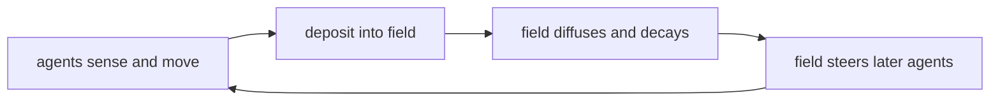

+++
title = "02: Look at This Thing"
date = "2026-08-14T09:30:00+01:00"
draft = false
description = "Calibrating the microscope. A continuous cellular automaton produces something that looks disturbingly like a creature. We strip it down to almost nothing, then rebuild a world in which the actors rewrite the conditions of their own future — and start deleting the parts to find out where the thing actually lives."
weight = 2
series = ["Digital Life From First Principles"]
categories = ["Programming", "Artificial Life"]
tags = ["Digital Life", "Artificial Life", "Lenia", "Cellular Automata", "Physarum", "Agent-Based Models", "Pattern Identity", "History Dependence", "Emergence"]
+++

Don't read anything yet.

Watch this.



Something is moving.

It appears to have a boundary. Different parts of it seem to behave differently: an edge that ripples, an interior that stays denser, a leading region that seems to pull the rest along. Its shape changes as it travels, and yet some larger organization survives those changes. Watch it for thirty seconds and you will start predicting what it is about to do.

If you saw this without context, biological language would arrive immediately.

A cell. A creature. An organism. Perhaps even an animal.

That reaction is useful. It is also the first thing this book has to take apart.

---

## Your Brain Has Already Invented an Object

Before knowing anything about the mechanism, most of us have already run through something like this:

```text
pattern
↓
persistent pattern
↓
moving persistent pattern
↓
thing
↓
creature
```

Notice how fast that happened, and notice how little was required to trigger it. Nothing in the simulation announced `I AM AN OBJECT`. Nothing marked where the supposed body begins or ends. Nothing certified that the pattern visible at one moment is the same individual as the pattern visible several moments later.

We supplied all of that.

So the first question of this book is not *is this alive?* That question is far too large to be useful yet. The first question is much smaller, and much more answerable:

> **Why does this look so much like a thing at all?**

---

## There Is No Creature Variable

Start with what is not in the program.

There is no object exposing `creature.move()` or `creature.keep_shape()`. There is no animation path, no skeleton, no set of joints, no controller issuing instructions like *keep the left side attached, push the front forward, restore the outline*. There is no variable called `position_of_creature`, and no field named `head` or `tail`.

What exists is closer to a grid of numbers:

```text
0.00  0.00  0.01  0.04  0.08
0.00  0.03  0.18  0.42  0.27
0.01  0.14  0.61  0.83  0.39
0.00  0.09  0.47  0.64  0.21
0.00  0.01  0.08  0.11  0.03
```

Each location holds a value. At every step, each location is updated according to the values around it, using the same law everywhere. That is the whole mechanism:

```text
current field
      ↓
local interaction
      ↓
local response
      ↓
next field
```

Again, and again, and again.

The family of systems this figure comes from is called **Lenia**, a continuous cellular automaton in which each location holds a value between `0` and `1` and interacts with a smooth weighted neighbourhood.[1] Lenia is well known precisely because so many of its patterns are easy to describe in biological language.

We will resist that language for now.

What we have actually observed is a persistent localized pattern. That description is less exciting. It is also something we can test.

The direction of explanation here is worth pausing on, because it runs backwards compared with ordinary software. Normally a programmer defines an object and the object then produces behaviour. Here:

```text
programmer defines local dynamics
        ↓
dynamics unfold
        ↓
localized organization appears
        ↓
we decide whether "object" is a useful description
```

That reversal is a large part of why artificial life is so compelling.

It is also why it is so easy to fool ourselves.

The object appears first in our perception. Only afterwards do we begin asking whether anything in the mechanism justifies treating that apparent boundary as a real unit of organization.

---

## What Is Actually Moving?

Look at the pattern travelling left to right.



The grid does not move. The individual locations do not travel. Location (40, 17) is exactly where it always was, holding whatever value the update rule most recently assigned it. Nothing is transported.

What happens instead is a chain of local reconstruction. State at one location influences nearby updates; a recognizable organization appears slightly farther over; those states influence the next updates; the recognizable organization appears farther over again.

Nothing corresponding to the visible creature has travelled through the grid.

The organization has propagated.

So when we say *the creature moved*, the operational description is:

> **a recognizable organization of state was repeatedly reconstructed at changing spatial coordinates**

Those two sentences describe the same visual event at different levels. One is intuitive and useful for noticing things. The other is operational and useful for measuring things. We will need both, all the way through this book. What matters is knowing, at any moment, which one we are using.

This is not a quirk of artificial life. A wave crosses the ocean without the water crossing the ocean. A flame persists while its constituent matter is continuously replaced, and nobody finds *the flame* a controversial noun. So there is a genuinely open possibility here: that identity does not require preserving the same material, and that persistence of organization is enough.

There is also a second possibility, equally open. We may simply be very good at seeing objects where no useful object exists.

The mistake would be deciding between them from the animation.

---

## The Most Dangerous Word Is "It"

Look at the sentences already used in this chapter.

> It moved. It changed shape. It persisted.

The word **it** is carrying an enormous amount of unearned weight. Before saying that something persists, we need a rule for deciding that the pattern at time *t* and the pattern at time *t+1* are instances of the same continuing organization. That rule might be based on shape similarity, or location, or trajectory, or internal structure, or causal continuity, or something we have not thought of.

We do not have that rule yet. Visual continuity is enough to raise the question. It is nowhere near enough to settle it.

And the question has teeth. What if connected geometry turns out not to be the correct boundary? What if two identical-looking structures have different histories? What if one continuing process occupies several disconnected regions?

So our first definition of *the thing* will remain deliberately provisional. We will use geometry while it works, and replace it if the experiments force us to.

A discipline that helps: keep two descriptions of the same event side by side.

**The tempting description**

```text
It moves.
It eats.
It heals.
It remembers.
It reproduces.
```

**The operational description**

```text
a localized organization is reconstructed at changing coordinates

field quantity is redistributed toward a region and away from others

a measured structural quantity returns toward its pre-perturbation value

a later response differs measurably because of an earlier state

a second structure appears whose form causally depends on the first
```

The left-hand column is how we notice phenomena worth investigating, and abandoning it would make us worse scientists, not better ones. The right-hand column is what we can actually test. Neither should quietly replace the other, and the failure mode of this entire field is the moment the first column starts getting reported as though it were the second.

---

## Now Take Almost Everything Away

The obvious hypothesis about the Lenia pattern is that its apparent creatureliness depends on the elaborate machinery. Continuous state. Two dimensions. Smooth kernels. Large neighbourhoods. Many parameters. Organism-like morphology.

If that hypothesis is right, stripping the machinery away should destroy the effect.

So strip it away. Two states instead of a continuum. One line instead of a plane. Three cells of neighbourhood instead of a smooth kernel. The entire law of the universe becomes an eight-entry lookup table, because with three binary neighbours there are only eight situations a cell can find itself in. Then start from a single active cell in an otherwise empty line, and stack each successive state underneath the last so that the vertical axis is time.


Structure appears. Regular on one side, irregular on the other, with fragments that organize and then break apart. Every pixel of it is fixed by the row above. No random numbers are involved anywhere, and the same initial state gives the same history every time.

The surprise is not that the picture looks complicated. It is that:

> **a locally trivial rule can produce global behaviour that is difficult to anticipate from inspection of the rule itself.**

No individual cell contains that structure. The rule contains no picture of the future. The initial condition contains almost nothing. What we are looking at exists only in the unfolding, which is already a hint worth carrying forward: the interesting object may not be something stored anywhere. It may be something that exists only by continuing to happen.

One correction before moving on, small here and large later. Behaviour belongs to an experimental configuration rather than to a mechanism in isolation. Initial state, boundary conditions, world size and update procedure all matter. So the honest form is never *Rule 30 does this* but *under this configuration, Rule 30 produced this history*. That qualification costs nothing when the configuration has five components. It will save us considerable trouble when it has fifty.

What this system does not give us is a thing. Point at a region of that diagram and ask whether it is the same object ten rows later, and there is no good answer. Nothing stays localized long enough to track.

For that we need one more example, and then we are done with lattices for a while.

Conway's Game of Life is a two-dimensional binary lattice in which each cell watches its eight neighbours. An active cell stays active with two or three active neighbours; an inactive cell becomes active with exactly three. That is the entire rule, and it contains no special case for any of the structures people have found in it. Now consider five cells:

```text
.#.
..#
###
```

Nothing in that configuration says *move diagonally*. There is no velocity and no direction variable.


And yet a recognizable organization translates diagonally across the grid, returning to its original configuration every four generations, displaced by one cell in each direction.

Ask what persisted across those four generations and the answer is bracing. Not the same cells; most of the originally active coordinates are now inactive. Not the same coordinates. Not even the same shape at every intermediate step. What persisted was a recurring sequence of local configurations and a fixed displacement.

Which separates two ideas that ordinary language keeps welded together.

**Material identity** asks whether the same components persist.

**Organizational identity** asks whether a recognizable pattern of relations persists through permitted changes.

The glider has almost no material identity across its motion. Its organization recurs with extraordinary precision.

> **In this system, recognizable organization can persist without persistent material identity.**

That is a small claim, and one of the load-bearing results of the book. We have not found an organism. We have found a kind of continuity that does not require one fixed body.

---

## What the Lattice Cannot Do

Both systems have now shown us the same thing from different angles. Trivial local mechanics generate global organization that no component represents, and that organization can persist while the material underneath it does not.

But there is something conspicuously absent from both, and it is easiest to see by asking a question neither system can answer.

Where did the glider go last week?

Not *where is it now*. Where has it **been**. Run a glider across an empty Life lattice for a thousand generations and every cell it crossed is exactly as it was before. The world is unmarked. Nothing about the glider's route survives its passage, so nothing about its past can influence any future glider, or influence its own future. The lattice is a stage. It records nothing.

That is a real limitation, and not a cosmetic one. Every question this book eventually wants to ask about memory, repair, individuality and inheritance involves the past exerting some grip on the future. In a system where activity leaves no residue, there is no past to find.

So we change the world rather than the rule.

Keep the local interaction. Keep the mindlessness of the components. But let the components write into the world they move through, and let what they write change what happens next.

---

## A World That Keeps What Happens To It

The system we will use is a **Physarum-inspired particle model**: a population of extremely simple mobile agents coupled to a scalar field they both read and write.[2]

The name deserves care. *Physarum polycephalum* is a slime mold that forms transport networks between food sources, and biologists have found it capable of some genuinely surprising behaviour, including navigation that appears to rely on the extracellular slime it has already deposited.[3] That work is the reason anyone thought to build models in this shape.

It is not evidence about the model. Biology is evidence, not specification. The organism suggested the mechanism; the computational system will have to earn its own claims. Nothing that follows is a demonstration about slime mold, and nothing established about slime mold licenses a conclusion here.

Each agent carries almost nothing:

```text
position
heading
three forward sensors
```

The environment is a single scalar field over a periodic grid. Eight fixed sources continually add to it, giving the world some structure that is not of the agents' making. Every step, in order:

```python
field += sources                               # eight fixed inputs

for agent in agents:
    left, ahead, right = sense(field, agent)   # three samples, 9 cells out
    turn(agent, left, ahead, right)            # straight if ahead is strongest,
                                               # otherwise 45 degrees toward the
                                               # stronger flank
    move(agent)                                # one cell forward
    deposit(field, agent.position)             # leave a trace

field = diffuse(field)                         # 3x3 mean
field = field * 0.9                            # decay
```

That is the whole system. Each agent samples the field at three points ahead of it and steers by comparison alone: carry on if the centre sample is strongest, otherwise turn 45° toward the stronger flank. Then step forward one cell and deposit a fixed amount where it lands. The field then blurs slightly and fades. Twenty thousand agents run this loop on a 400 × 400 grid.

There is no network in that code. No route, no path, no graph, no `Trail` class, no planner, no objective function, no notion of a source or a destination. There is a steering rule and a leaky field.

What the code does contain, and what the lattice systems did not, is a closed loop through the environment:

```text
agents
  ↓
change the field
  ↓
field retains a decaying trace
  ↓
trace changes what later agents do
  ↓
agents change the field again
```



The consequence is worth stating plainly, because it is the reason we changed systems.

> **The agents alter the conditions that determine their own future behaviour.**

In the lattice, the state of the world lived in the lattice. Here there are two coupled populations of state, one mobile and one spatial, and each is continually rewriting the other. This class of environment-mediated coordination has a technical name, **stigmergy**, borrowed from the study of social insects.[4] The name is a useful label for a mechanism. It settles nothing about what the mechanism produces.

---

## Watch the Network Appear


From a uniform random scatter of agents and an empty field, a dense mesh appears within a hundred steps. It then coarsens. Weak routes fade, strong routes thicken, redundant loops disappear, and by around fifteen hundred steps what remains is a sparse network of a few heavy channels anchored on the sources.

The vocabulary arrives immediately, exactly as it did with Lenia:

```text
trail
network
foraging
coordination
memory
organism
```

None of it has been earned yet. But before dismantling those words we should establish something more basic, because there is a dull explanation available that would make the whole system uninteresting: perhaps twenty thousand agents wandering anywhere would deposit something that looks structured.

The control is easy. Disable the sensors. Let the agents turn at random while everything else stays identical: same population, same deposition, same diffusion, same decay, same sources, same number of steps.

That is the rightmost panel above. It is a uniform haze with the sources visible in it and nothing else.

To compare the two we need a number. Take the share of the total field mass held by the densest 5% of cells. A perfectly uniform field scores 0.05; a field whose mass is concentrated into thin channels scores much higher.

```text
sensors disabled          0.153
sensors enabled           0.883
```

So the structure is a product of the feedback loop rather than of deposition, diffusion or the sources. Remove the agents' ability to read what has been written, and the writing stops meaning anything.

That gives us a first bounded claim:

> **Under this configuration, a population of locally acting agents coupled to a shared writable field produces persistent macroscopic organization that does not appear when the coupling is removed.**

Not memory. Not foraging. Not an organism. A concentration measure separated from its control by a wide margin, in a system with no representation of a network anywhere in it.

Now we can start attacking it.

---

## Where Is the Past?

Something about the past is clearly affecting the present. A network that took fifteen hundred steps to form is not a property of the current instant; it is the residue of everything the population has done. The obvious hypothesis is that the residue lives in the field, since the field is the thing that visibly accumulates.

That hypothesis is testable in the most direct way available. Delete the field.

All measurements below branch from a single checkpoint at step 1500, so every condition starts from an identical world and differs only in what was removed. Similarity between two networks is the correlation of their (lightly blurred) fields, which lets us ask a precise question: how much does the world at a later step still resemble the network that existed at the moment of surgery?

That question needs a floor. Two networks grown independently over the same eight sources already resemble each other somewhat, because they are solving the same geometry. Across four independent runs, pairwise similarity at step 1500 averaged **0.170** and never exceeded **0.231**. That band is what *no shared history* looks like in this system, and no result below counts for anything unless it clears it.

### Erase the field

Keep every agent: same positions, same headings, same population. Zero the field completely.

A highly similar route structure is back almost immediately.

```text
similarity to the pre-surgery network, 25 steps later

undisturbed continuation       0.911
field erased, agents kept      0.897
```

At a hundred steps: 0.750 against 0.743. At two hundred: 0.587 against 0.579. Within this trajectory and this similarity measure, erasing the accumulated field produced no detectable early loss relative to the undisturbed continuation.

The hypothesis was wrong, and the reason is measurable. At the moment of surgery, 98.6% of the agents were standing on the densest 5% of cells. They were not scattered across the world; they were sitting in the very channels the field described. Their positions are themselves a record of where the channels are, and one step is enough for them to redeposit the map they were standing on. After a single step the similarity was already 0.957.

So the past was not in the field. Or rather, it was not only in the field.

### Remove the agents instead

Reverse the surgery. Keep the field exactly as it was and delete the entire population, replacing all twenty thousand agents with naive ones at uniformly random positions and headings. Not one agent in the new population has ever existed before. Nothing in any of them encodes anything.

They inherit only a world that somebody else shaped.

```text
similarity to the pre-surgery network

                                    +25    +100   +200
field kept, population replaced    0.658   0.578  0.488
naive population, empty field      0.304   0.240  0.201
seed-noise null                             ~0.17
```

The new population reconstructs a substantial fraction of the earlier network, and does so far above what an equivalent population achieves starting from nothing.

The tempting sentence is that they remembered. They did not. They could not. They have no state that predates their creation by a single step. The disciplined statement is smaller and considerably more interesting:

> **The behaviour of a population depended on structure produced before any member of it existed.**

One more control is needed before that can stand, because the new agents might simply be doing better in *any* aged field, for reasons of density rather than route. So run the mirror condition: drop an equally naive population into a network grown independently, and measure it against both.

```text
                                        vs the field it was given    vs the other field
naive population, network A                      0.658                    0.297
naive population, network B                      0.619                    0.339
```

The effect is specific. Each new population reconstructs the particular network it was handed, not networks in general.


Each subsystem retains enough information to reconstruct substantial organization, although not equally well. Delete the field and the existing agent configuration rapidly regenerates a close version of the route structure. Delete the agents and the inherited field recruits a naive population back toward the particular historical network it was given. Delete both, and nothing in this measurement distinguishes the result from a fresh start.

The historical information required to reconstruct the organization is therefore not confined to either subsystem. Whatever carries that history, these interventions do not localize it uniquely to the agents or to the field.

That is a genuinely awkward result for the question we began with, because we have been looking for the thing, and what the interventions keep pointing at is not an object in either population. It is the relationship between them, maintained by a loop that runs through both.

Whether that deserves to be called memory is a question for a later chapter, and the word will have to work much harder than this to earn its place. What we have is history dependence: a persistent trace of earlier activity that measurably changes later behaviour, with a specificity control attached.

---

## Start Replacing the Material

The population swap was a single catastrophic event. The more interesting version is slower.

Let the network form. Then, every five steps, take 2% of the agents at random, delete them, and introduce the same number of naive agents at random positions with random headings. Never stop. Every agent carries a tag recording whether it was present at the moment turnover began, so we can watch the original population drain away.


It drains quickly.

```text
steps after onset     original agents remaining
       100                     67%
       200                     45%
       400                     20%
       800                    3.9%
      2000                  0.035%
```

By the end of the observation window, 7 agents out of 20,000 remain from the population that built the network. Everything else in the world is a stranger. Complete replacement was not reached inside the window, and the claim below is bounded accordingly.

Two measurements matter through that decline.

The first is whether the specific routes survive, and here the comparison must be against an undisturbed continuation rather than against zero, because this network is not static even when nothing is done to it. Left alone, it keeps rearranging: channels migrate, loops close, similarity to its own past at step 1500 falls to around 0.3 after two thousand steps and drifts near the null band. Route identity has a finite lifetime in this system regardless of what we do to it.

That separates two kinds of continuity that are easy to confuse. The **exact route configuration** can drift away even in an undisturbed run, while the broader **organized network regime** can persist. From here on, a claim that something is “the same” has to say which continuity is meant: similarity to a particular historical configuration, or persistence of the larger form of organization.

Against that reference, turnover costs surprisingly little for a surprisingly long time.

```text
similarity to the network at onset

steps    turnover    undisturbed    original agents left
  25       0.913        0.911              90%
 100       0.772        0.750              67%
 200       0.628        0.587              45%
 400       0.441        0.493              20%
 800       0.270        0.343             3.9%
```

Through the first few hundred steps, while four-fifths of the population is replaced, the two branches decline together. Afterwards both fall toward the null, the turnover branch somewhat faster. These are single runs per condition, so the sensible reading is that continuous replacement did not produce a large early effect on route similarity, not that the two conditions are identical.

The second measurement is whether there is still an organized network at all, and this one separates cleanly. Concentration in the turnover branch falls from 0.88 to about 0.49 over the first four hundred steps and then holds there, flat, for the remainder of the run. The undisturbed branch sits at 0.93. The no-feedback control sits at 0.153.

So the organization degrades and then stabilizes. The middle panel of the figure shows what that looks like: a dimmer, denser, more redundant network rather than an absence of one, which is roughly what a permanent supply of disoriented newcomers should produce.

That deficit invites an obvious reading, which is that continuous replacement injures the network and the injury accumulates. There is a competing explanation, and it is duller. At any moment a large fraction of the population has existed for only a few dozen steps, has not yet found a channel, and is depositing across open ground. That alone would depress a concentration measure without anything having been damaged.

The two explanations differ in what should happen if we stop. Accumulated injury persists. A standing cost disappears when the cost stops being paid.

So we stopped. After two thousand steps of turnover, replacement was switched off and nothing else was changed. Concentration rose from 0.490 to 0.581 within a hundred steps, to 0.724 within five hundred, and to 0.798 within a thousand, without regaining the undisturbed value inside the window.

Most of the deficit was therefore a standing cost of ongoing replacement rather than an accumulated wound. That is a smaller result than the one we might have preferred. It is the one the control supports.

Through all of it the network was being maintained rather than merely surviving. The agents holding those channels open at step 3500 are not the agents that dug them. They arrived at random, into a world already shaped, and were recruited into a structure they did nothing to design.

Stated with its boundaries visible:

> **Under this configuration, macroscopic organization persisted while 99.965% of the agent population was replaced, stabilizing at roughly half the concentration of an undisturbed control and more than three times that of a no-feedback control, with most of that deficit reversing once replacement stopped.**

Compare that with the glider. In the glider, fixed cells switched on and off while a pattern translated across them; the lattice itself never went anywhere. Here the mobile components can be deleted outright, one after another, until essentially none of the originals are left, and something recognizable is still there being held up by whoever happens to be present.

---

## What Survived

We did not establish any of this:

```text
organism
memory
intelligence
individuality
life
```

Several smaller things did survive the attempt to explain them away, and each is bounded to the configuration it was measured in:

```text
extremely simple local rules generate global organization
that no component represents

organization can persist without persistent material identity
(five cells, Game of Life)

agents coupled to a writable field produce structure that
vanishes when the coupling is removed
(0.883 against 0.153)

past activity leaves structure in the environment that
measurably changes the behaviour of agents that did not exist
when it was made
(0.658 against 0.304, with a specificity control)

historical dependence is recoverable from both the agent configuration
and the environmental field; either subsystem can reconstruct
substantial route-specific organization after the other is removed

organization persists while 99.965% of the components are
replaced, in degraded and stable form, and most of that
degradation reverses when replacement stops
```

Every one of those sentences is smaller than the sentence we wanted when we started.

The explanation kept shrinking. The phenomenon kept not going away.

---

## What Would We Have to Destroy?

We began by asking why a moving pattern looked like a thing.

The answer has been slowly getting worse. In Lenia the material did not travel with the apparent creature. In the glider the active cells were replaced every four generations. And in the last system components were deleted continuously across the observation window, until only seven original agents remained, without macroscopic organization disappearing.

Neither candidate substrate we pointed at proved uniquely necessary for reconstructing the observed organization.

Which leaves the question in an unfamiliar shape. Asking whether we can see the thing is useless, because we clearly can and it has not helped. Asking which part of the system is the thing is worse, because we removed each part in turn and the answer came back *not this one*. What is left has a definite experimental form:

> What would we have to destroy for it to stop being the same thing?

Every intervention in this chapter failed to find that boundary. Erasing the environmental trace failed. Replacing the entire population while preserving the field failed. Grinding away all but seven of the original components failed.

That is not a negative result. It is a specification for the next experiment, and it tells us what kind of system we need: one where damage has consequences we can measure, where a lineage can be followed rather than inferred, and where the question of whether two structures are the same individual has an answer that might be wrong.

The next system will not tempt us to invent an object.

It will tempt us to invent an organism, and it will look like it is reproducing.

---

## Experimental Note

Every measurement in the second half of this chapter comes from one implementation under one configuration: a 400 × 400 periodic grid, 20,000 agents, sensors 9 cells ahead at ±45°, a 45° turn, unit step, fixed deposition, 3 × 3 mean diffusion, 10% decay per step, and eight fixed sources. All interventions branch from a common checkpoint at step 1500 and are observed for 2000 steps, sampled every 25. Similarity is the Pearson correlation of Gaussian-blurred fields; concentration is the share of field mass in the densest 5% of cells. The null band comes from four independently seeded runs over the same source layout.

The turnover arm was run twice. The second run reproduced the step-1500 checkpoint exactly, at a correlation of 1.000000 with the first, before diverging under its own replacement draws; it supplied the recovery control, and the two arms ended with 7 and 5 original agents respectively. Every other condition was run once. The effects reported are large relative to the null band, but most conditions are single-run demonstrations under this configuration, not population-level estimates of effect size or robustness across seeds. Full protocols, discarded parameterizations and the runs that failed are in the appendix.

---

## References

**[1]** Chan, B. W-C. *Lenia: Biology of Artificial Life.* Complex Systems 28(3), 251–286 (2019).

**[2]** Jones, J. *Characteristics of Pattern Formation and Evolution in Approximations of Physarum Transport Networks.* Artificial Life 16(2), 127–153 (2010).

**[3]** Reid, C. R., Latty, T., Dussutour, A. & Beekman, M. *Slime mold uses an externalized spatial "memory" to navigate in complex environments.* PNAS 109(43), 17490–17494 (2012).

**[4]** Theraulaz, G. & Bonabeau, E. *A Brief History of Stigmergy.* Artificial Life 5(2), 97–116 (1999).
