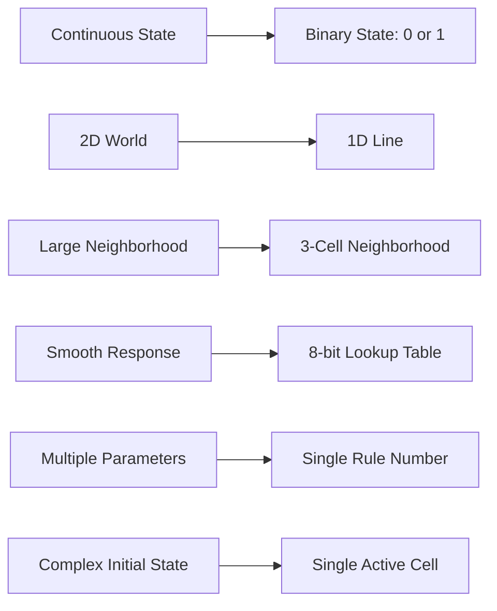

+++
title = "02: Remove Almost Everything"
date = "2026-08-11T01:08:00+01:00"
draft = false
description = "Strip digital life down to a line of binary cells, a three-cell neighborhood and one tiny deterministic rule."
series = ["Digital Life From First Principles"]
categories = ["Programming", "Artificial Life"]
tags = ["Digital Life", "Cellular Automata", "Elementary Cellular Automata", "Emergence", "Python"]
+++

In the previous chapter we started with something complicated.

A continuous field.  
Smooth local interactions.  
Localized structures.  
Motion.  
Deformation.  
Patterns that looked disturbingly creature-like.

That was useful because it gave us a mystery.

Now we are going to attack the mystery.

Not by adding more machinery.

By removing it.

Aggressively.

The question is:

> **How little machinery can remain before our intuition stops seeing organization?**

Start with something like Lenia.

Conceptually:

```text
continuous state
+
two-dimensional world
+
large local neighborhood
+
smooth spatial weighting
+
growth response
+
multiple parameters
+
repeated updates
```

Now remove things.



---

## Remove Continuous State

Lenia allows locations to contain values such as:

```text
0.00
0.13
0.47
0.81
1.00
```

Remove that.

Allow only:

```text
0
1
```

Nothing in between.

We could call those states:

```text
off / on
dead / alive
empty / occupied
white / black
```

but those names already begin to smuggle interpretation into the system.

For now:

```text
0
1
```

is enough.

The state tells us what a location contains.  
Nothing more.

---

## Remove a Dimension

The systems we just looked at lived in a two-dimensional field.

Remove that too.

Instead of:

```text
0 0 1 0 0
0 1 1 1 0
1 1 0 1 1
0 1 1 1 0
0 0 1 0 0
```

use:

```text
0 0 0 0 1 0 0 0 0
```

One line.

That is the entire world.

There is no:

```text
north
south
up
down
```

A cell has only a position along the line.

We have removed most of the geometry that made the previous chapter feel organism-like.

---

## Remove the Large Neighborhood

Now reduce what each cell is allowed to see.

Each location will inspect only:

```text
left
centre
right
```

Three cells.

For example:

```text
0 1 1
```

means:

```text
left    centre    right
  0        1        1
```

That is the centre cell's entire local universe.

It cannot see:

```text
ten cells away
the overall shape
the total population
the future
the past
```

unless information about those things reaches it through repeated local interactions.

This locality matters.

If large-scale structure appears, no individual cell can contain a complete description of it.

---

## Remove the Complicated Response

Lenia uses a smooth response to a weighted neighborhood field.

Remove that too.

Our new system gets a lookup table.

There are only eight possible three-cell binary neighborhoods:

```text
111
110
101
100
011
010
001
000
```

For each one, choose the next state of the centre cell.

For example:

```text
111 → 0
110 → 0
101 → 0
100 → 1
011 → 0
010 → 1
001 → 1
000 → 0
```

That is the entire local law.

No neural network.  
No optimizer.  
No hidden state.  
No biological mechanism.

Eight answers.

---

## Eight Bits Define the Local Universe

Write those outputs in order:

```text
00010110
```

As a binary number:

```text
00010110₂ = 22
```

So this rule is called:

> **Rule 22**

The name is useful because it is almost aggressively unromantic.

We have reduced the system to:

```text
binary state
+
one-dimensional world
+
three-cell neighborhood
+
eight-bit lookup table
```

That is nearly everything.

---

## Build It

Here is the complete update step:

```python
def step(state, rule):
    next_state = [0] * len(state)

    for i in range(len(state)):
        left = state[(i - 1) % len(state)]
        centre = state[i]
        right = state[(i + 1) % len(state)]

        neighborhood = (left << 2) | (centre << 1) | right
        next_state[i] = (rule >> neighborhood) & 1

    return next_state
```

There are only two tricks.

First:

```python
neighborhood = (left << 2) | (centre << 1) | right
```

turns the three bits into a number from `0` to `7`.

For example:

```text
101₂ = 5
```

Then:

```python
(rule >> neighborhood) & 1
```

extracts one bit from the rule number.

So:

```text
22
```

really is enough to encode the full transition law.

---

## Start With Almost Nothing

Now create a world:

```python
width = 81
state = [0] * width
state[width // 2] = 1
```

The initial condition is:

```text
........................................#........................................
```

One active cell.

Everything else is zero.

No random noise.  
No environment.  
No population.  
No agent.  
No organism.  
No memory.  
No objective.  
No fitness.

Just:

```text
one bit
```

in an otherwise empty world.

---

## Let Time Begin

Now repeat the rule:

```python
history = [state]

for _ in range(40):
    state = step(state, rule=22)
    history.append(state)
```

Every generation becomes another row:

```python
for row in history:
    print("".join("#" if cell else "." for cell in row))
```

The result begins with one active cell.

Then structure appears.


This is a **spacetime diagram**.

Horizontal position is space.  
Vertical position is time.  
Each row is the entire world at one moment.

The image is not a picture of a two-dimensional object.  
It is a picture of history.

---

## Nothing Is Moving Downward

This sounds obvious, but it matters.

The pattern appears to fall down the page.

Nothing is actually moving downward.

There is no downward direction in the world.

The vertical axis is:

```text
time
```

So:

```text
row 0 = world at t = 0
row 1 = world at t = 1
row 2 = world at t = 2
...
```

A temporal process has been converted into a spatial image.

This is already a reminder from Chapter 01:

> **The picture is not the mechanism.**

The image is a representation we constructed so that the process becomes easier to inspect.

We should never confuse those two levels.

---

## The Update Is Simultaneous

Every cell at:

```text
t + 1
```

is computed from the world at:

```text
t
```

Conceptually:

```text
current state
      ↓
compute every next value
      ↓
replace entire state
```

Not:

```text
change cell 1
      ↓
cell 2 sees changed cell 1
      ↓
cell 3 sees changed cell 2
```

Those systems would behave differently.

So even in this tiny model, the experiment is not defined by the eight-bit rule alone.

It also includes:

```text
update semantics
```

We are using synchronous updates.  
Every location sees the same moment of history.

---

## What Happens at the Edges?

This implementation contains:

```python
state[(i - 1) % len(state)]
state[(i + 1) % len(state)]
```

Modulo arithmetic makes the world wrap around.

The left edge touches the right edge.

Conceptually:

```text
... 0 1 0 0 1 ...
^                 ^
|_________________|
```

Topologically, the line is a ring.

That is not just a programming convenience.

We could instead choose:

```text
fixed-zero boundaries
reflective boundaries
an effectively infinite world
```

and eventually obtain different behavior.

The boundary is part of the experimental configuration.

That lesson will matter later.

Whenever we say:

> Rule X does Y

we should really mean something closer to:

> Rule X, under this initial condition, boundary condition, world size and update process, produced Y.

The observed behavior belongs to the whole experiment.  
Not merely to the rule number.

---

## Where Is the Pattern Stored?

Look at one cell.

It stores:

```text
0
```

or:

```text
1
```

Nothing else.

It does not store:

```text
its age
its history
its direction
its purpose
its parent
its neighborhood
the global pattern
```

The rule contains only eight output bits.

Yet the spacetime diagram can contain structure spanning:

```text
many cells
many generations
```

So where is that structure?

Not in a single cell.  
Not in a dedicated object.  
Not in a controller.  
Not as an explicit blueprint inside Rule 22.

The structure exists in:

> **the trajectory produced by repeated interaction between rule and state**

That is a much more useful statement than simply saying:

> complexity emerged.

We can point to exactly where the information is and is not represented.

---

## Rule Is Not Behavior

This distinction is going to matter throughout the book.

We have:

```text
RULE
```

and:

```text
STATE
```

The rule describes local transformation.  
The state describes the current world.

The same rule:

```text
22
```

can begin from:

```text
00000000100000000
```

or:

```text
00100111101000110
```

and produce different histories.

So:

```text
behavior = rule
```

is too simple.

A better description is:

```text
behavior =
    rule
    +
    initial condition
    +
    boundary condition
    +
    world size
    +
    update semantics
    +
    time
```

Later we may add:

```text
randomness
environment
learning
memory
interaction with other systems
```

But the principle is already visible here:

> **Behavior belongs to an experimental configuration.**

This will save us from many bad claims later.

---

## Tiny Local Space, Enormous Global Space

Each local neighborhood has only:

```text
8
```

possible configurations.

But a world of width `N` has:

```text
2^N
```

possible global states.

At width 20:

```text
2^20 = 1,048,576
```

At width 100:

```text
2^100
```

is enormous.

So locally:

```text
8 possibilities
```

while globally:

```text
an enormous configuration space
```

The same tiny local rule can therefore generate trajectories through a very large state space.

That mismatch is one reason small rules can surprise us.

The rule can be trivial to inspect while its long-run consequences are difficult to predict by inspection alone.

---

## There Are Only 256 Elementary Rules

The local-rule universe is tiny.

Eight neighborhoods.  
Two possible outputs for each.

Therefore:

```text
2^8 = 256
```

possible elementary binary radius-1 rules.

Every one fits between:

```text
0
```

and:

```text
255
```

This is extraordinary for our purposes.

We have a system where:

```text
the local mechanism space is completely enumerable
```

while:

```text
the resulting global trajectories can still be surprising
```

We do not have to sample the rule space.  
We can eventually test every rule.

That gives us something close to a complete experimental laboratory.

---

## What Did We Actually Remove?

Compare Chapter 01.

We had:

```text
continuous fields
two-dimensional geometry
smooth kernels
large neighborhoods
growth functions
moving localized structures
mass-conserving variants
```

Now we have:

```text
one dimension
two states
three-cell neighborhood
eight-bit rule
single active cell
```

We removed:

```text
continuous state
two-dimensional geometry
smooth spatial weighting
complex growth responses
multiple kernels
mass transport
organism-like morphology
```

What remains is almost embarrassingly small.

And yet the output is not completely trivial.

That is why elementary cellular automata matter to this book.

They let us ask a cleaner question than Lenia allowed:

> **How much global structure can be generated before almost every apparently necessary mechanism has been removed?**

---

## But Do Not Say "Emergence" Yet

Look at the Rule 22 image again.

It is tempting to say:

> Emergence!

But that word can become another label we award too cheaply.

So far we have shown only:

```text
a tiny deterministic local mechanism
```

producing:

```text
a larger structured history
```

That is interesting.

But we have not yet established:

```text
unpredictability
persistent objects
information transport
robustness
causal organization
adaptation
```

The spacetime diagram gives us another observation.  
It does not yet give us a theory.

So the next move is the same one we established in Chapter 00:

```text
SEE SOMETHING
↓
ASK WHAT IT MEANS
↓
MEASURE
↓
COMPARE
```

---

## Change One Number

Our implementation currently says:

```python
rule=22
```

Change it to:

```python
rule=30
```

Nothing else changes.

Same code.  
Same world size.  
Same initial condition.  
Same boundary condition.  
Same update semantics.

Only the eight-bit transition table changes.

Run it again.


The result changes dramatically.

The machine is still tiny.  
The mechanism is still deterministic.  
The rule is still only eight bits.

But now the trajectory becomes much harder to dismiss as simple repetition.

This is exactly what we wanted from the reduction.

We removed almost everything.  
The mystery survived.

Next:

> **The First Surprise.**
