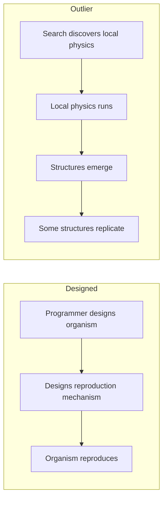
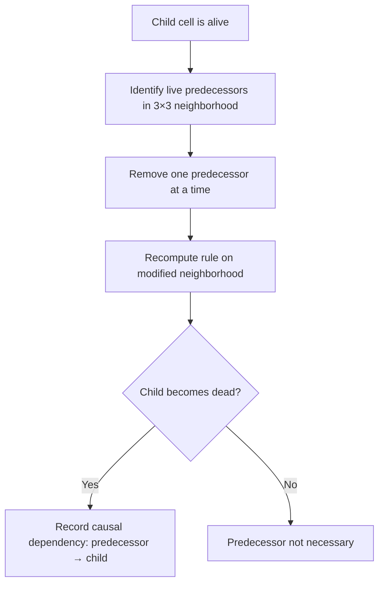

+++
title = "02: The Closest Thing We Have"
date = "2026-08-14T10:00:00+01:00"
draft = false
description = "We point the calibrated microscope at Outlier, a binary cellular automaton in which nobody designed the organism, and ask whether its apparent reproduction survives a causal test."
weight = 2
series = ["Digital Life From First Principles"]
categories = ["Programming", "Artificial Life"]
tags = ["Digital Life", "Artificial Life", "Outlier", "Cellular Automata", "Self-Replication", "Causality", "Ancestry"]
+++

We have learned not to trust the first noun.

Fine.

Now look at this.

---

The previous chapter used systems small enough that the temptation remained manageable. A glider can look uncannily like a moving thing, but five cells crossing a lattice leave plenty of distance between the observation and the word *organism*.

That was useful for calibration.

Now we remove that distance.

> **How far has computation already gone without anyone deliberately building the organism?**

Artificial life already contains systems that reproduce, evolve, conserve material, carry inherited information and generate structures nobody explicitly designed as organisms. Evoloops, Flow-Lenia, Genelife and more recent computational-life experiments each demonstrate different pieces of that territory.[1–4]

We are not going to survey them here. There are other books for that.

For our experiment, one system is unusually useful.

It is called **Outlier**.

And underneath everything we are about to see is an almost absurdly small rule.

---

## A Universe in 512 Bits

Every cell is `0` or `1`. Dead and alive are convenient names and entirely unnecessary ones; `OFF` and `ON` would do.

Each cell examines its `3 × 3` Moore neighbourhood, itself included. Nine binary cells means 2⁹ = 512 possible local configurations, and for each one the rule specifies whether the centre cell will be `0` or `1` on the next step.

Those 512 outputs define the local transition rule. The published Outlier rule is rotationally symmetric, and 220 of the 512 neighbourhood configurations produce an active centre cell on the next update.[5]

The rest of the universe comes from the cellular-automaton substrate itself: the grid, neighbourhood geometry, synchronous update and passage of time.

Note what is not in there. No `Organism`. No energy budget. No genome. No `reproduce()`. No fitness function. No population manager. No explicit representation of an individual.

There is binary state, a local neighbourhood, a transition rule and time.

The rule contributes only 512 output bits.

Everything organism-like that follows has to arise from those local dynamics rather than from an object model that already contains the answer.

The rule and a tiny `3 × 3` seed are published, so the system can be reproduced directly.[5] The decoding and verification details belong in the experimental record rather than in the main argument.

One lesson does belong here:

> **A beautiful result from the wrong implementation is still the wrong result.**

Before trusting anything Outlier appears to do, we first have to establish that we are actually running Outlier.

---

## Nobody Designed the Organism

This is the part that changes the temperature, and it needs stating precisely, because the sloppy version of it is false.

Outlier was discovered through an automated search across cellular-automaton rules, looking for dynamics conducive to open-ended evolution.[5] Humans wrote the search. Humans defined the space of rules, the substrate, the criteria and the experimental setup. Nothing here appeared independently of human design in any absolute sense, and anyone claiming otherwise is selling something.

What the search produced was a rule for a universe. What appeared *inside* that universe was not specified anywhere.

Compare the two routes:



In the first route, reproduction exists as an explicit operation because someone implemented it. Observing that operation later tells us little about whether reproduction can arise from lower-level dynamics.

Outlier is different.

There is no explicit reproduction operator to point at. There is only the local transition rule.

If a structure reproduces, the reproductive mechanism must therefore be realized through the unfolding dynamics rather than supplied as a pre-existing software abstraction.

That difference does not establish life.

It establishes something we need before the question of life is even worth asking:

> **the behaviour is not merely the execution of an operation we named reproduction in advance.**


---

## What Happens When You Run It

The published rule produces rich behaviour from sparse random initial conditions, and from the tiny seed.[5]

Small shape-changing clusters appear. Some clusters produce additional clusters. Some periodically duplicate. Several smaller structures can assemble into larger formations — and those formations can themselves replicate. Collections of them eventually form the boundary of a still larger expanding complex.


So the system contains organization at several levels at once:

```text
cells
  ↓
clusters
  ↓
replicating formations
  ↓
larger expanding complex
```

Replication appears at more than one scale, which is already stranger than anything in the previous chapter. The glider gave us one localized organization persisting through time. Here we have organizations built out of organizations, and duplication occurring at more than one level of that hierarchy.

It is worth being honest about the visual impression.

The glider was easy to keep at arm's length. Outlier is not.

Structures appear, interact, leave debris and produce further structures. Some persist long enough for regions of the world to acquire recognizable histories. The vocabulary we spent the previous chapter restraining starts returning almost automatically:

```text
parent
offspring
population
lineage
organism

---

## Why This Is Harder Than a Glider

In Chapter 1 the tracking problem was tractable because geometry recurred. A glider is a configuration that returns to itself after four steps, displaced by one cell. Localized, periodic, translating — and once we had defined the identity criterion, the detection algorithm followed from it.

Outlier presents a qualitatively harder problem:

```text
structures
↓
interactions
↓
descendants
↓
lineages
↓
population history
```

Each arrow in that chain is a place where an interpretation can be smuggled in. Calling something a *structure* presumes we know where it ends. Calling one structure a *descendant* of another presumes we know what produced what. Calling a set of related structures a *lineage* presumes both of the previous things and adds a claim about continuity.

Chapter 1 established the general rule:

```text
appearance
≠
mechanism
```

Applied here, it has a sharper form:

```text
similarity
≠
ancestry
```

Suppose we see this:

```text
time t

    A

time t + 500

    A     A
```

The sentence that arrives unbidden is *A reproduced*. But consider what else could produce that image. Perhaps both structures were produced independently by the surrounding dynamics. Perhaps the second would have appeared even if the first had never existed. Perhaps what we are calling two structures are two parts of one larger repeating process, and our detector split them.

Every one of those explanations is compatible with the same picture.

So reproduction cannot be established from the final geometry alone.

It requires ancestry, and ancestry is a **causal** claim:

```text
earlier organization exists
↓
its state contributes causally to later transitions
↓
a later candidate organization appears
↓
an appropriate counterfactual intervention
breaks that dependency

```

That is a much stronger statement, and — critically — it is one we can test.

---

## Counterfactual Causality

Because Outlier is a deterministic cellular automaton, we have an unusually clean opportunity. For every live cell at time `t+1`, we know exactly which `3 × 3` neighbourhood produced it. Nothing is hidden. There is no learned function, no floating-point state, no stochastic component.

So we can ask a question that is usually impossible to ask of a complex system:

> Which live cells in the preceding neighbourhood were actually necessary for this cell to become alive?

The test is mechanical. Take a live child cell. Remove one live predecessor from its neighbourhood. Re-evaluate the rule. If the child is now dead, that predecessor was necessary under this intervention. Repeat for every live predecessor, then for every live cell in the world, at every step.



This is not a complete theory of causality, and we should say so plainly. Where several predecessors are jointly sufficient, removing any one of them may change nothing, and the test will under-report. Redundancy and synergy are real, and a single-removal test does not see them.

Its limitations matter, but so does the improvement it gives us.

> Those two shapes look related.

is an impression.

> Under this defined intervention, removing this predecessor changes whether this later cell exists.

is a reproducible causal measurement.

The second does not solve causality in general. It gives us something much stronger than resemblance for this particular substrate.

Cell-level dependencies are far too numerous to reason about directly, so they are aggregated: cells into connected clusters, and cell-level causal dependencies into causal relationships between clusters.

```text
cluster at t
     ↓
cluster at t+1
     ↓
cluster at t+2
     ↓
...
```

with branching wherever one earlier organization contributes to several later ones.

The question has now changed completely.

Not:

> Does this later structure look like the earlier one?

but:

> **Can we trace a causal path by which the earlier organization contributed to producing the later one?**

Once we ask that question across the whole run, resemblance becomes a lineage graph.

---

## What the Graph Contained

In 2026, Arend Hintze and Clifford Bohm returned to Outlier and reconstructed causal ancestry at scale, on a `1024 × 1024` periodic world run for 20,000 updates.[6] The resulting analysis contained tens of millions of cluster instances and causal relationships.

Three things from that work matter here.

**Reproduction is causally real, and it branches.** Earlier structures could causally produce multiple later structures, which themselves participated in continuing lineages. This is a substantially stronger result than visual recurrence, and it is the one the rest of this chapter depends on.

**Replication is not the same as a successful lineage.**

The original seed cluster, `c0`, produced 433 causally descended copies within the first 10,000 updates.[6]

That sounds spectacular.

It was also not enough to make `c0` the enduring lineage.

Other structures proved more reproductively successful, including a cluster designated `c2`.

So another apparently simple word splits:

```text
can produce copies
≠
can sustain a lineage

That gives us a distinction worth keeping:

```text
replication
≠
successful long-term lineage
```

Producing another instance is not the same as founding a dynasty. It is a distinction biology would have taught us eventually, but it is striking to meet it in 512 bits of physics.

**The environment participates.** Replicators produced debris, collisions, fragments and recombinations, and some later replicating structures arose *through* those interactions. So the process is not:

```text
copy parent
```

It is closer to:

```text
replicating process
        ↓
interaction
        ↓
fragments
        ↓
collisions
        ↓
recombination
        ↓
new structures
```

Variation therefore does not need to arrive through a dedicated `mutate()` operation.

Collisions, fragments and recombinations can create new configurations through the ordinary dynamics of the world itself.

That is a much more substrate-native source of novelty than adding a mutation operator merely because biology has one.

---

## The Replicator Might Not Be a Body

Here is the finding that puts the most pressure on intuition.

A self-replicating organization in Outlier does not necessarily correspond to one compact connected cluster. Some causally reproducing structures consisted of multiple spatially separated components whose combined causal dynamics participated in reproduction.[6] The published work interprets this in terms of distributed, multi-component selfhood.[6]

Our evidence does not require us to adopt the stronger noun.

The narrower result is enough:

> **Causal self-replication can involve multiple spatially separated components.**

Notice what that does and does not say. It does not say those components constitute one natural individual. It says connectedness is not a sufficient criterion for finding the reproducing unit — that if you had gone looking only for compact bodies, you would have missed reproduction that was demonstrably occurring.

Chapter 1 gave us connected geometry as a useful first boundary.

Outlier immediately makes that boundary uncomfortable.

If a causally reproducing organization can span several disconnected components, then a detector that searches only for compact connected bodies can miss the very process it is supposed to find.

And it leaves us with a question the chapter is not going to answer:

> **If reproduction can be causally real while the reproducing unit is not a neat connected body, what exactly is the thing that reproduces?**

Resist the urge to resolve that. The temptation is to leap from *distributed causal reproduction* to *one distributed individual*, and there is no experiment here that licenses the jump. Individuality would require a criterion we do not yet have, and inventing one to fit the case we are looking at is how this field generates its worst results.

The question stays open. It gets much more difficult later, and much more interesting.

---

## Running It Ourselves

Published evidence tells us what Outlier has been shown to do.

We also want a specimen we control.

So we reconstructed the published rule and verified it before asking any scientific question of our own. The decoder had to produce all 512 transition cases, exactly 220 active outputs, and the published rotational symmetry.

The implementation details are in the experimental record.

The principle belongs in the chapter:

> **Verify the world before interpreting anything that happens inside it.**

A wrong decoder can still produce extraordinary animations.

It cannot produce evidence about Outlier.

**Scale is part of the experimental condition.** Our runs use a `512 × 512` world over 1,600 generations. The published causal study used `1024 × 1024` over 20,000 updates. That difference is not cosmetic: the earlier Outlier work reports a strong scale effect, with sparse random worlds smaller than roughly `512 × 512` failing to produce the larger replicating formations seen in the principal experiments.[5]

So we adopt a rule now, because it will matter enormously later:

> **A result obtained from a smaller or shorter Outlier run is a result about that run. It must not automatically be generalized to the full published regime.**

So everything we report from our own experiment carries its scope with it:

> **512 × 512 world, 1,600 generations, under the implementation and initial conditions described in the experimental record.**

That is our specimen.

It is not automatically Outlier in general.

The distinction matters most when the result becomes exciting.

---

## Finding c2 Again

Now we can ask our own version of the reproduction question.

The published seed is:

```text
.1.
111
..1
```

After two updates it produces a small structure — the one designated `c2` — which in our run had an area of 6 cells in a `3 × 3` bounding box.

The methodological choice here is worth pausing on. We did not go hunting for arbitrary shapes that seemed to repeat. That approach quietly guarantees a result: in a run containing over a hundred thousand clusters, *something* will recur, and whatever recurs most strikingly will feel like a discovery. Instead we derived the `c2` signature directly from the known initial seed, and only then searched the run for later occurrences of that specific structure, allowing translation and rotation.

The search found **144 `c2` occurrences** between `t = 2` and `t = 1598`.

That is an interesting observation.

It is not yet reproduction.

One hundred and forty-four copies could still be one hundred and forty-four independent products of the same underlying dynamics.

So recurrence now has to meet causation.

So we combined recurrence with the causal graph. For our run, that graph contained:

```text
138,891 clusters
196,466 causal edges
```

That number is itself a warning. The animation looks like a modest collection of discrete moving objects. Underneath the appearance is a network of nearly two hundred thousand dependencies, and our visual impression of "a few things moving around" was never a description of the mechanism.

For every `c2`, we then searched forward through the causal graph for later `c2` structures reachable through that causal history. Once recurrence was intersected with the causal graph, the original `c2` at `t = 2` connected into a branching history containing four later `c2` descendants. Across the run, the complete `c2` return graph contained 99 causal return edges.

Now the repeated shape had a history.


The figure shows a deliberately pruned family, because the full graph is unreadable as an illustration. The analysis uses the whole thing.

---

## This Time, the Interpretation Survives

It is worth being clear about what just happened, because it does not happen every time.

We began with an observation that looked like reproduction. We refused it, on the grounds that resemblance is not ancestry. We built a stronger test — counterfactual necessity at cell level, aggregated into a causal graph. We applied it to a structure whose identity was fixed in advance rather than chosen after the fact. And the reproduction claim did not collapse.

Within our run, the evidence for `c2` reproduction is not merely geometric recurrence. It is:

```text
structural recurrence
+
counterfactual causal ancestry
+
branching lineage
```

The bounded claim:

> **In our 512 × 512, 1,600-generation run, recurring `c2` structures participate in a branching causal return graph. Later occurrences of `c2` are reachable through measurable causal ancestry originating in earlier `c2` structures.**

That sentence is narrow, hedged and specific. It is also the strongest positive result in the book so far, and it deserves to be stated without apology.

Within this defined experiment, something stronger than resemblance survived.

Earlier `c2` organization participates measurably in producing later `c2` organization, and the resulting causal history branches.

In the operational sense we defined, **reproduction survived the test**.

No explicit reproduction function was written into the system. The capability arises from the local rule acting repeatedly through the cellular substrate.

That is exactly the kind of result this book was built to recognize.

That is a real result about what computation can support, and it was obtained by refusing the interpretation until it survived a test rather than by admiring the animation.

This is an important moment for the method.

If every interesting interpretation collapsed under scrutiny, we would merely have built a sophisticated debunking machine.

That is not what happened.

```text
appearance
↓
stronger definition
↓
causal test
↓
claim survives
```

---

## What This Does Not Establish

Discipline now, while the result is fresh and most attractive.

Causal self-replication is a strong result.

It is also only causal self-replication.

It does not, by itself, establish self-maintenance, adaptation, agency, memory, autonomy, individuality, open-ended evolution or life.

Those questions remain separate precisely because reproduction has now earned the right to stand on its own.

Note also what the multi-component finding did to our vocabulary. We can say reproduction occurred. We cannot yet say *what* reproduced, because the reproducing organization need not correspond to any object our eyes or our connected-component detector would isolate.

The supported result is narrower than any of the words we might reach for:

> **Very simple digital physics can support emergent structures for which causal analysis identifies genuine, branching and sometimes multi-component self-replication.**

That is already remarkable. It does not need embellishment, and embellishing it would cost us the only thing that makes it worth reporting.

---

## What We Should Take From This

Several lessons follow naturally from what we have just seen, and they will shape everything we build afterwards.

**Do not design the organism.** Define or discover local physics, then let candidate structures arise within it. The moment we implement `Organism.reproduce()`, any reproduction we subsequently observe is our own assumption returned to us.

**Do not assume one scale.** Interesting organization appeared at the level of cells, clusters, formations and larger complexes simultaneously, with replication at more than one of them. No scale announced itself as the privileged one.

**Do not equate connected geometry with causal organization.** Outlier gives us direct reason to distrust that shortcut: causal reproduction can involve spatially separated components.

Connectedness remains a useful measurement.

It has lost its claim to be the answer.

**Track causation.** Visual resemblance is not sufficient evidence for reproduction, inheritance, influence or ancestry. Where the substrate permits, reconstruct the dependencies. Outlier permits it completely, which is much of why it is so valuable.

**Let interactions matter.** Collision, fragmentation and recombination can create variation through the ordinary dynamics of the system.

Do not add a special mechanism merely because the biological vocabulary suggests one should exist.

---

## Evidence, Not Specification

There is a failure mode available here, and it is worth naming before we walk into it.

Having found a system that does something remarkable, the obvious move is to take that system and start bolting capabilities onto it. Give Outlier a memory. Give it an energy budget. Give it goals. See what happens.

That would simply build a new cargo cult on a more respectable foundation.

Chapter 00 established the principle in its biological form:

```text
biology is evidence, not specification
```

The same discipline applies now:

```text
Outlier is evidence, not specification
```

Outlier is not the ancestor of anything we build later. We are not going to copy its rule, its structures, its reproduction machinery, its geometry or its dynamics. Its value is as a demonstration of what the substrate can support without us explicitly specifying the resulting reproductive organization.

Outlier gives us evidence.

It does not give us the blueprint for what to build next.
 That is the useful part. The specific 512 bits that produced it are not.

We should be equally careful with the vocabulary Outlier invites. Words like *organism*, *individual*, *family*, *offspring*, *self* and *collective* become almost irresistible once an animation starts moving, and causal ancestry makes them feel newly legitimate. It has, after all, given us real ancestry. But real ancestry between clusters does not license a claim about individuals, and we should notice that the strongest result in this chapter — reproduction distributed across separate components — actively undermines the most natural reading of those words rather than supporting it.

---

## And Then We Noticed Something Else

We had just earned our strongest positive result.

The obvious interpretation had survived the stronger test.

That matters psychologically as well as scientifically. Once one exciting claim survives, the next exciting claim becomes easier to believe.

That is where the trouble starts.

Watching the same simulation, another pattern became difficult to ignore.

Structures seemed to move together.

Not simply as fragments carried by one expanding front, but with an apparent directional coherence that seemed especially strong among structures sharing recent causal history.

The biological noun arrived almost immediately.

**Flocking.**

We knew better than to trust it.

Unfortunately, we also had reasons to think it might be real.

So we did what the method requires:

```text
observation
↓
hypothesis
↓
measurement
↓
control
```

---

## References

**[1]** Sayama, H. & Nehaniv, C. L. *Self-Reproduction and Evolution in Cellular Automata: 25 Years After Evoloops.* Artificial Life 31(1), 81–95 (2025).

**[2]** Plantec, E., Hamon, G., Etcheverry, M., Chan, B. W-C., Oudeyer, P-Y. & Moulin-Frier, C. *Flow-Lenia: Emergent Evolutionary Dynamics in Mass Conservative Continuous Cellular Automata.* Artificial Life 31(2), 228–250 (2025). doi:10.1162/artl_a_00471

**[3]** Packard, N. H. & McCaskill, J. S. *Open-Endedness in Genelife.* Artificial Life 30(3), 356–389 (2024). doi:10.1162/artl_a_00426

**[4]** Agüera y Arcas, B. et al. *Computational Life: How Well-formed, Self-replicating Programs Emerge from Simple Interaction.* arXiv:2406.19108 (2024).

**[5]** Yang, B. *Emergence of Self-Replicating Hierarchical Structures in a Binary Cellular Automaton.* Artificial Life 31(1), 96–105 (2025). doi:10.1162/artl_a_00449

**[6]** Hintze, A. & Bohm, C. *Rethinking self-replication: detecting distributed selfhood in the Outlier cellular automaton.* npj Complexity 3, 11 (2026).
