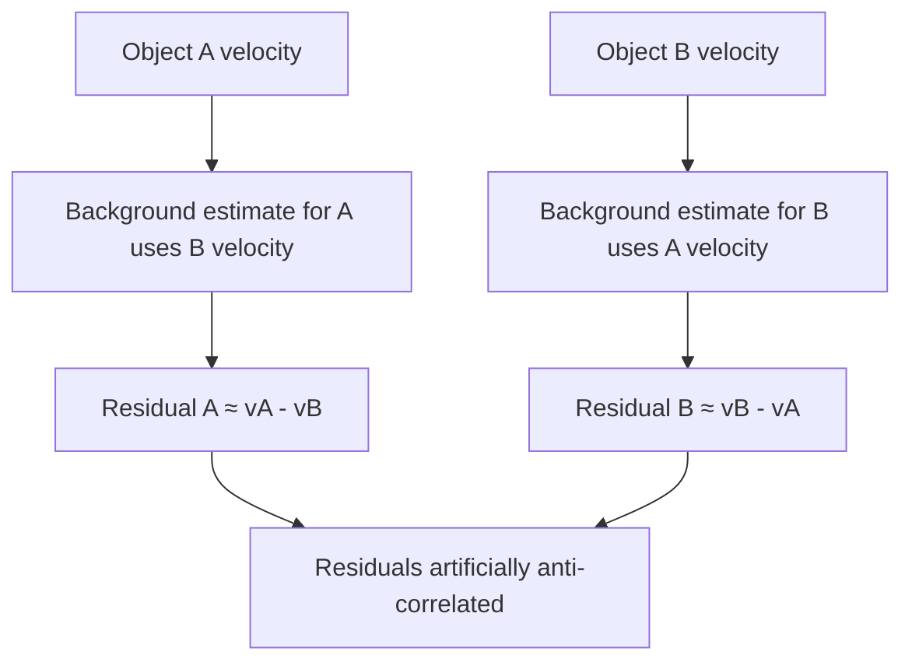
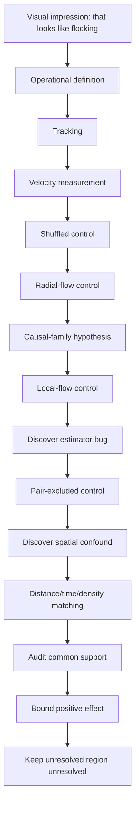

+++
title = "03: It Looked Like Flocking"
date = "2026-08-14T10:30:00+01:00"
draft = false
description = "Nearby Outlier structures appear to move together, and shared causal ancestry appears to explain it. A spectacular family effect survives two controls and then collapses under a third."
weight = 3
series = ["Digital Life From First Principles"]
categories = ["Programming", "Artificial Life"]
tags = ["Digital Life", "Artificial Life", "Outlier", "Collective Motion", "Causality", "Controls", "Confounds", "Experimental Method"]
+++

Groups of structures appeared to move together.

Not merely outward, as an expanding front would carry everything. Together — with what looked like coordination, among structures that had recently shared a causal history.

It looked remarkably like **flocking**.

We had spent two chapters training ourselves against exactly this reaction:

see motion
→ invent a noun
→ believe the noun.

But something had changed.

We had just watched one strong interpretation survive an attempt to destroy it. The reproduction result in Outlier was no longer based only on resemblance; within our experiment it was supported by branching causal ancestry.

The method had said **yes**.

That made the next exciting interpretation much easier to believe.

And there was a legitimate reason to take the observation seriously.

We already possessed a causal graph. We could identify recent shared ancestry independently of motion.

So the hypothesis was testable:

> **Do structures with shared causal history also show stronger dynamical coherence?**

For once, the biological-looking interpretation came with two independently measurable sides.

So we made the impression into a hypothesis, and started measuring.

---

## What Would Flocking Mean?

Not: *are these things birds?*

We did not begin by trying to satisfy every formal definition from swarm biology or active-matter physics. We started with something much narrower and answerable:

> Do nearby persistent moving structures travel in unusually similar directions?

That is a measurement, and it needs three things: structures that persist long enough to have a direction, a way to compare directions, and a control.

Using the causal graph to follow plausible cluster continuations through time, we recovered 13,635 motion tracks lasting at least eight generations, yielding 633,808 motion observations.

Each observation gave us what the hypothesis required:

```text
position
velocity
time
causal identity

Comparing directions is simpler. For two velocity vectors, normalize both and take their dot product:

$$
A_{ij}
=
\frac{v_i}{|v_i|}
\cdot
\frac{v_j}{|v_j|}
$$

which lands between −1 and +1:

```text
+1  = same direction
 0  = no directional agreement
-1  = opposite directions
```

We compared structures moving at the same moment, at various spatial separations, using a spatial index rather than comparing every structure with every other one. That was partly a performance decision and partly a better experiment: structures on opposite sides of the universe tell us nothing about local collective motion.

Note the vocabulary discipline here, because it does the work later.

```text
flocking
```

is an interpretation.

```text
short-range directional alignment
```

is a measurement. The whole chapter is about the distance between those two lines.

---

## The First Result

At short distances, observed velocity alignment was approximately **0.74**, against a velocity-shuffled control that was much lower.



So the visual observation was not imaginary.

There really was strong short-range directional coherence. An average near `0.74` on a scale running from `-1` to `+1` is not a subtle numerical residue.

For now, that is all we should say.

Something nearby is moving coherently.

Why it is doing so remains open.

What that *means* is a different question, and we had immediately created a new problem.

---

## Maybe Everything Is Simply Moving Outward

Outlier develops as an expanding structure. Nearby clusters may sit on the same expanding front, and two things being carried outward by the same expansion will have similar velocity vectors without any relationship to each other at all.

Picture two pieces of debris riding the same circular wave. Their velocities agree beautifully. They have never interacted, and neither is responding to the other in any way.

If that were the whole story, our 0.74 would be an elaborate way of measuring that Outlier grows.

The control is direct. For each position, compute its radial direction relative to the centre of the expansion:

$$
r_i
=
\frac{x_i-c}{|x_i-c|}
$$

then decompose each velocity into a radial component and a non-radial component, and discard the radial part. What remains is motion that is not explained by the global expansion. If the coherence was expansion, the residual alignment should collapse.

It did not:

```text
raw short-range alignment        = 0.7373
radial-subtracted alignment      = 0.7427
shuffled residual control        = 0.1933
```

Read those three numbers carefully, because this is the moment the investigation became serious.

The alignment did not merely survive removal of the global expansion field — it did not move. And the shuffled control on the same residuals sits at 0.1933, so the residual alignment is not an artefact of the subtraction procedure producing spuriously agreeable vectors.



One explanation eliminated:

> **The observed coherence is not explained merely by every structure moving radially away from the original seed.**

At this point the flocking interpretation had become harder to dismiss.

The most obvious alternative explanation — simple radial expansion — had failed to account for the effect.

But we still did not know what produced the coherence.

Then the causal graph suggested an explanation.

---

## Shared Causal History

Chapter 2 left us with an uncomfortable finding: several spatially disconnected clusters can participate in the same causal organization. What looks like three separate things may be three components of one causal process.

That does not establish that such components form a natural individual — we were careful about this, and remain careful about it. But it does suggest a narrower and testable idea:

> **Does shared causal organization explain the apparent coordinated motion?**

If structures descending from a recent common ancestor remained dynamically coupled, then shared motion might reflect continuing causal organization rather than independent objects somehow "deciding" to coordinate.

That would be a much more interesting explanation.

It was also still only a hypothesis.

That is an attractive hypothesis. It uses infrastructure we already trust, it explains a measurement we already have, and it does not require importing any social mechanism from biology.

So: do structures belonging to the same causal lineage move more coherently than structures that do not?

### Assigning families

The first family definition was too narrow. Starting from four branches descending from one early `c2` gave strong same-family alignment of 0.768 — and no useful different-family comparison, because almost nothing fell into the comparison group.

So we strengthened it. Every cluster was assigned its **most recent identifiable `c2` ancestor**. A cluster that was itself `c2` began a new family; otherwise ancestry propagated through the causal graph. Where equally close causal paths disagreed, the assignment was marked ambiguous rather than resolved by invention.

The coverage was remarkable. Of 138,891 clusters, 138,132 received a recent `c2` ancestor, with only 10 ambiguous and 749 unassigned. Of the motion observations, 633,696 out of 633,808 carried a family label.



Almost every tracked moving structure in this run could therefore be placed inside a recent branching causal history.

That was striking.

It also explained exactly nothing about the motion.

A variable existing is not the same thing as that variable causing the effect we care about.

---

## A Very Exciting Result

Comparing nearby structures after subtracting a local background flow, we found:

```text
same recent-c2 family         =  0.828
different recent-c2 family    = -0.349
```

That looked spectacular.

Related structures appeared strongly aligned at `0.828`.

Different-family structures appeared strongly anti-aligned at `-0.349`.

For a moment it looked as though causal families were behaving like distinct dynamical units.

But the negative result was almost *too* interesting.

Nothing in our hypothesis predicted that unrelated families should actively oppose one another.

That unexplained success was the clue.

### Our experiment was wrong

This is worth slowing down for.

To estimate the local environmental flow around object `A`, we averaged the velocities of nearby structures, excluding structures from `A`'s own family — sensibly, so that `A`'s relatives could not define the background against which `A` was judged.

Now consider comparing `A` from family α with `B` from family β. `B` is not in `A`'s family, so `B` contributes to `A`'s background estimate. And `A` is not in `B`'s family, so `A` contributes to `B`'s.

In the simplest case:

$$
r_A \approx v_A-v_B
$$

and:

$$
r_B \approx v_B-v_A
$$

so:

$$
r_B \approx -r_A
$$

We had built an anti-correlation into the estimator. The −0.349 was not a discovery about different families. It was a property of the arithmetic.



The measurement was partly using the tested pair to manufacture the background against which that same pair was evaluated.

The control itself had become a confound.

That matters because controls are not external guarantees of correctness. They are pieces of experimental machinery.

They can be wrong too.

### The stronger control

The fix is straightforward once the problem is visible. When testing a pair from families α and β, estimate the local background while excluding **both** families from both estimates. Now neither member of the tested pair can manufacture the other's residual.

Under this stronger control:

```text
Same recent c2 ancestor          0.746
Very close c2 ancestry           0.101
Close c2 ancestry                0.032
Distant c2 ancestry              0.135
Very distant c2 ancestry         0.081
```



The pathological negative number is gone, as it should be. But the main effect is still there, and it is enormous:

```text
same recent c2 ancestor    0.746
very close ancestry        0.101
                           -----
gap                        0.645
```

A gap of `0.645` on a scale bounded at `1.0`.

And look at what it had already survived:

```text
real causal ancestry
+
shuffled-motion control
+
radial-expansion control
+
a discovered estimator bug
+
a corrected estimator

---

## The Four-and-a-Half-Cell Problem

Structures sharing the same recent `c2` ancestor had a mean separation of about **4.5 cells**.

Structures in other causal groups were typically tens of cells apart.

Sit with that for a moment, because everything turns on it.

We had two variables that both track family membership. Same family means recently descended — and it also means *physically very close together*, because a structure and its recent causal descendants have not had time to get far apart. Different family, in this dataset, generally means far away.

And we already knew, from the very first measurement, that motion coherence depends strongly on distance. That was the finding: *short-range* alignment is high.

So:

```text
same family
↓
tends to mean closer

closer
↓
tends to mean more coherent
```

which produces:

```text
same family
↓
appears more coherent
```

with ancestry contributing nothing whatsoever.

The 0.645 gap might be measuring exactly one thing: that we had compared structures 4.5 cells apart against structures tens of cells apart, and discovered that closer structures move more similarly. Which we knew before we started.

Nothing about the `0.645` was fabricated.

Same-family pairs really did move more coherently than different-family pairs.

The problem was the sentence we wanted to attach to that number:

> **because they are related**

The measurement was real.

The causal interpretation was not yet identified.

The comparison was never able to answer the ancestry question, no matter how large the gap it produced. Comparing like with unlike gives you a difference. It does not tell you which of the differences is responsible.

So we needed to compare like with like.

---

## Distance Matching

The stronger comparison holds the confounds fixed. For each same-family pair, find different-family pairs occurring under approximately the same conditions, matching on:

```text
simulation time
spatial distance
local density
```

while continuing to use the pair-excluded background-flow correction from the previous stage. Then compare within each matched stratum, using equal numbers of same-family and different-family pairs, so that no stratum can dominate the result by virtue of being over-represented in one group.

The question becomes precise in a way it had not been before:

> At similar times, at similar distances, and in similar local environments, do members of the same `c2` causal family move more coherently than members of different families?

The underlying dataset contained 2,617,077 usable pair records. The matched analysis ultimately drew roughly 65,000 pairs from each group across hundreds of comparable strata.

The implementation details belong in the appendix.

One methodological detail does not: because the run had been preserved as a queryable experimental specimen, discovering the confound did not require rerunning the entire world. We could ask a better question of the same evidence.

That made correction cheap enough to actually happen.

The matched result:

```text
same-family         0.1515
different-family    0.1588
difference         -0.0073
```

The `0.645` advantage had disappeared.

After comparing pairs at similar times, distances and densities, same-family pairs were not more coherent. The point estimate was slightly negative.

That should have been the end.

It was not.

Matching answers a question only where both groups actually contain comparable observations — and we had not yet checked where that was true.

---

## Common Support

Matching cannot create comparison data where none exists.

Matching cannot rescue a comparison the data never contain.

If same-family pairs dominate one distance regime and different-family pairs dominate another, matching can only speak about the region where the two distributions overlap.

Outside that overlap there is no counterfactual comparison to recover.

A global-looking number can therefore answer a much narrower question than its formatting suggests.

Given what we had just learned about the 4.5-cell separation, this was not a hypothetical worry. Same-family pairs are concentrated at exactly the distances where different-family pairs are rarest.

So we kept all 2,617,077 pair records and measured the overlap directly, across distance bins:

```text
0–4
4–8
8–12
12–16
16–24
24–32
32–48
48–64
64–96
```

with a declared operational rule:

> **A distance bin must contain at least 100 same-family and 100 different-family raw pair records.**

The largest contiguous region satisfying that condition was:

```text
[4, 64) cells
```



The shortest-distance regime, 0–4 cells, falls **outside** the primary common-support region. Different-family controls are simply too sparse there to support the comparison.

That changes what the analysis is entitled to say, and it changes it in both directions. We cannot claim matching has identified the ancestry effect at very short range. We also cannot claim it has ruled it out.

---

## Inside the Region We Can Actually Compare

Restricting to 4–64 cells, the raw descriptive data still favoured the ancestry interpretation:

```text
same-family mean         0.1732
different-family mean    0.1166
raw difference          +0.0566
```

Even after removing the extreme short-range regime, the raw comparison still appeared positive:

```text
+0.0566

Applying the matching procedure within this region — exact matching on time bin, distance bin and density bin, with equal numbers from each group per stratum:

```text
matched same-family mean        +0.150823
matched different-family mean   +0.157890
matched pooled effect           -0.007067
```

across:

```text
64,948 matched pairs per group
659 matched strata
```

with an equal-stratum effect of:

```text
-0.026463
```

and a bootstrap interval of:

```text
[-0.066450, +0.012172]
```



The raw `+0.0566` difference became `-0.007067` once like was compared with like.

Nearly 65,000 matched pairs per group.

659 matched strata.

The same-family advantage had not merely become smaller.

It had disappeared.

---

## How Dead Is It?

"The confidence interval crossed zero" is a weak sentence. It is compatible with a large effect that we simply failed to measure well, and it invites the reader to keep believing.

We can do better, because we have the original claim in hand.

The apparent family gap was:

```text
0.746 - 0.101 = 0.645
```

Inside common support, the upper end of the bootstrap interval is:

```text
+0.012172
```

So the largest positive ancestry effect compatible with this interval is approximately:

```text
0.012172 / 0.645 ≈ 1.9%
```

of the original apparent gap.

That is a substantive statement rather than a shrug:

> **Within the 4–64 cell region where the comparison has adequate empirical support, the data rule out anything remotely resembling the original apparent family effect. The upper bootstrap bound is only about 1.9% of the original 0.645 gap.**

The supported data no longer allowed anything remotely as large as the effect we thought we had found.

Within the 4–64 cell comparison region, the upper positive bootstrap bound was only about **1.9% of the original apparent `0.645` gap**.

One more check, because the common-support threshold was our choice and a conclusion that depends on an arbitrary cutoff is not a conclusion. Repeating the analysis with minimum bin counts of 50, 100, 250 and 500: at threshold 50 the support region expands to 4–96 cells, and the matched pooled effect remains −0.0058 with an equal-stratum effect of −0.0182. At 100, 250 and 500 the region stays at 4–64 cells, with the matched pooled effect at −0.0071, equal-stratum effect −0.0265 and upper bootstrap bound +0.0122. The detailed tables are in the appendix.

The collapse is not a fragile consequence of one convenient threshold.

---

## What Remains Unresolved

The 0–4 cell regime is a different matter, and we should be as precise about our ignorance as about our results.

Structures sharing a recent `c2` ancestor are concentrated at extremely short range. That is where the hypothesis would be most likely to be true, if it were true. It is also precisely where different-family controls are too sparse to construct the comparison.

So:

```text
same-family pairs
are common there

different-family controls
are too sparse for the same comparison
```

We cannot say ancestry has no effect at 0–4 cells. We cannot say it does. The correct status is **UNRESOLVED**, and converting an absence of adequate comparison into negative evidence would be the same category of error we have spent the chapter correcting — just pointing the other way.

`UNRESOLVED` is not an embarrassed version of `NO`.

It means the experiment does not contain the comparison required to answer the question.

That boundary is part of the result.

---

## So Was It Flocking?

Not on this evidence. But *no* is the wrong summary, and so is the defensive retreat to *well, we did measure something*.

The honest answer is layered:

```text
SHORT-RANGE MOTION COHERENCE
measured, ~0.74, survives shuffled control

GLOBAL RADIAL EXPANSION AS SOLE EXPLANATION
rejected — coherence survives radial subtraction

LARGE CAUSAL-FAMILY COHERENCE EFFECT
collapses under distance / time / density matching

ANCESTRY-SPECIFIC COHERENCE, 4–64 CELLS
not supported; bounded at ~1.9% of the original gap

ANCESTRY EFFECT, 0–4 CELLS
unresolved — inadequate common support

BIOLOGICAL-STYLE FLOCKING
not established
```

Look at what happened to a single observation as it climbed:

```text
nearby structures move similarly
↓
related structures move similarly
↓
causal families behave as coordinated units
↓
flock / collective / individual
```

The mistake was not seeing motion coherence.

The mistake was promoting it:

```text
coherent motion
→ ancestry-dependent coherence
→ coordinated causal family
→ flock

Three things that initially looked like one thing are now separable:

```text
motion coherence
≠
ancestry-dependent coherence
≠
flocking
```

---

## The Phenomenon Did Not Die

This is the part that matters most, and the part a discouraged investigator would get wrong.

**Short-range motion coherence is real.** The measurement stands: approximately 0.74 raw, 0.7427 after radial subtraction, against a shuffled residual control of 0.1933. Nothing in the ancestry collapse touches it. The thing that first caught our attention while watching the animation was there.

And it deserves more credit than the failure of our explanation might suggest. Remember what Outlier actually is at the substrate level:

```text
binary cells
local neighborhoods
one deterministic update rule
```

There is no velocity variable. No steering force. No alignment rule. No flocking controller. Nothing in those 512 bits mentions direction, neighbours-to-follow, or collective behaviour of any kind. Yet structures arise whose motion is strongly coherent at short range, and stays coherent when the most obvious global explanation is stripped out.

So the surviving phenomenon can be stated without importing a collective:

There is also a possibility we have not tested.

Perhaps the coherence belongs less to independent objects and more to a propagating spatial process through which our detected structures happen to move.

That would require a different experiment — for example, testing whether correlation develops a systematic lag with distance.

We did not run that experiment here.

So the idea remains exactly where it belongs:

> **open**

**Causal reproduction is also still real.** This needs saying explicitly, because failure has a way of spreading beyond its jurisdiction. The flocking interpretation collapsing does not retract anything from Chapter 2. The 144 `c2` occurrences are still there. The counterfactual causal graph is unchanged. The branching return structure rooted at the `c2` at `t = 2` is exactly as it was.

```text
FLOCKING INTERPRETATION FAILS
```

does not imply:

```text
CAUSAL REPRODUCTION FAILS
```

What failed was a specific attempted promotion — from *causal family* to *coordinated collective unit*. The causal families remain real. They simply do not explain the motion.

Chapter 2 also left us with an unresolved question about individuality.

If components sharing causal ancestry had retained distinctive dynamical coherence after the controls, that would have strengthened the case that a causal family behaved as a meaningful unit.

That evidence did not survive.

So Outlier leaves us in an interesting position:

```text
connected geometry
is not enough

causal ancestry
is not enough

---

## What Actually Happened Here

Strip the chapter to its shape:



Two of those steps found errors in our own work rather than in the system. That is not a sign that the investigation went badly. It is most of what made the final result worth anything.

None of these corrections was obvious before the result forced us to look for it.

The anti-correlation problem became visible because unrelated families appeared to repel.

The distance confound required connecting two facts that had been measured separately: family members were unusually close, and close structures were unusually coherent.

The common-support problem only became visible after matching had apparently solved everything.

In retrospect, each mistake looks simple.

That is exactly why retrospect is dangerous.

The original interpretation was not foolish. It was reasonable given the evidence we had at that stage.

Then the evidence got better.

The most important number in this chapter is not `0.645`.

It is what happened to `0.645` when the comparison finally became fair.

---

## Where This Leaves Us

We lost flocking and gained a better question.

But notice what made the loss so laborious. Outlier is rich — that richness is why it is such powerful evidence about what computation can support, and it is also why five variables were hopelessly entangled by the time we started measuring. Geometry, ancestry, distance, expansion and local environment all move together in that world. Same-family means close. Close means coherent. Everything is expanding. Structures interact with debris from other structures. The causal graph, the motion tracks and the spatial layout are all consequences of the same 512 bits, and there is no way to hold one of them fixed while varying another.

Every control in this chapter was an attempt to disentangle variables after the world had already produced them together.

We had ancestry, distance, geometry, expansion and local environment all changing at once, and then tried to reconstruct the comparison afterwards.

Even careful matching left the most interesting very-short-range regime unresolved because the required controls were not present in the data.

There is another way to work:

> **build the comparison into the experiment before the world runs.**
 Where we can hold expansion fixed and vary coupling. Where we can run a system, then run it again with one mechanism removed and everything else identical, and attribute the difference to the mechanism. Where the question *does history matter here?* can be asked by constructing two histories rather than by searching a run for pairs that happen to differ in the right way.

That is not Outlier, and it is not a criticism of Outlier. It is a different instrument for a different job.

So the next move is to build a different kind of world.

Not a world containing:

```text
repair
memory
reproduction
individuality
collective motion
```

Outlier showed us something important:

> **surprising causal organization can arise without us explicitly programming the organization itself.**

It also showed us the cost of richness. When many phenomena arise together, explanation becomes a problem of disentangling them after the fact.

So we are going back to almost nothing.

One seed.

One world.

One rule.

And one question at a time.

The next experiment begins with a crystal.

---

## References

**[1]** Yang, B. *Emergence of Self-Replicating Hierarchical Structures in a Binary Cellular Automaton.* Artificial Life 31(1), 96–105 (2025). doi:10.1162/artl_a_00449

**[2]** Hintze, A. & Bohm, C. *Rethinking self-replication: detecting distributed selfhood in the Outlier cellular automaton.* npj Complexity 3, 11 (2026).
