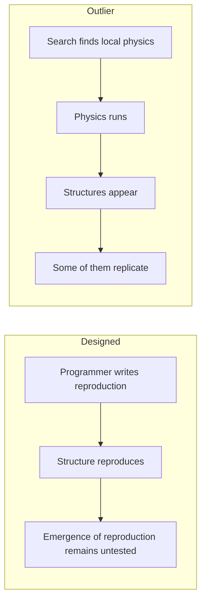

+++
title = "03: Now There Are Two"
date = "2026-08-14T10:00:00+01:00"
draft = false
description = "Persistence is not reproduction. In a binary cellular automaton whose rule was found without explicitly searching for self-replication, apparent copying survives a causal test — within carefully bounded claims."
weight = 3
series = ["Digital Life From First Principles"]
categories = ["Programming", "Artificial Life"]
tags = ["Digital Life", "Artificial Life", "Outlier", "Cellular Automata", "Self-Replication", "Causality", "Ancestry", "Experimental Method"]
+++

We have learned not to trust the first noun.

Fine.

---

In the previous chapter an organization survived while nearly everything participating in it was taken away and replaced. By the end of the turnover window, only 7 of the original 20,000 agents remained.

The exact routes had drifted. The broader organized network had not disappeared.

That was persistence, and it was hard-won.

It was also not reproduction, and the gap between those two words is wider than it looks.

A process can persist throughout an observation without ever producing a descendant. Our Physarum experiment did exactly that. It formed, degraded, recovered and remained organized at the end of the run.

But we never defined or observed a descendant relation.

Continuation is one capability. Making another one is a different capability, and nothing we measured in the last chapter bears on it at all.

The glider looks like the harder case, and it is worth spending a moment on, because it is where the distinction becomes precise instead of merely rhetorical.

Every four generations the glider's configuration recurs, displaced by one cell diagonally and built from active cells at different coordinates. New material participation, recurring organization, generation after generation. If anything in the previous chapter deserved the word **reproduction**, surely that did.

It does not qualify, and the reason is not our invention. In the causal analysis we are about to rely on, Hintze and Bohm set out a criterion for calling a structure a self-replicator: it must produce at least two copies of itself, each causally traceable back to the original, and not to each other.[6] The glider fails it. Each glider copy descends from the copy immediately before it, in a single unbranching chain. Nothing ever forks. A glider gun fails for a different reason — it produces gliders, not glider guns.

The criterion is worth making explicit:

> **An earlier organization must give rise to at least two later organizations of the same kind, each causally dependent on the original and not on one another.**

Chains are not enough. The history has to branch.

We did not construct that standard to fit a result we already had, which is exactly why it is useful to us. It comes from the literature we are about to test our own run against, and it disqualifies the most charismatic object in the previous chapter.

Now look at this.


---

## The Rule Was Searched. The Replicator Wasn't.

Artificial life already contains systems that reproduce, evolve, conserve material and generate structures nobody explicitly designed. Evoloops, Flow-Lenia, Genelife and more recent computational-life experiments cover different parts of that territory, and other work surveys it more systematically.[1–4]

For our purposes one system is unusually useful: **Outlier**.

The mechanism will take one paragraph, because the previous chapter has already done the teaching.

Every cell is `0` or `1`. Each cell reads its `3 × 3` Moore neighbourhood, itself included, which gives 512 possible local configurations, and the rule specifies an output for each. That is the entire law of this universe: 512 output bits. The published rule is rotationally symmetric but not mirror-symmetric. Of its 512 entries, 220 produce an active centre cell, compared with 140 for Conway's Game of Life.[5]

Note what is absent. No `Organism`. No genome, no energy budget, no `reproduce()`, no fitness function, no population manager, no representation of an individual anywhere. There is binary state, a neighbourhood, a transition rule and time.

How Outlier was found matters, because it is easy to overstate what happened.

Outlier was found by an automated search — genetic programming across cellular-automaton rules, looking for dynamics that might support open-ended evolution.[5] Humans wrote the search. Humans defined the rule space, the substrate and the selection criteria. Nothing here appeared independently of human design in any absolute sense; the result is better understood as the discovery of an interesting rule within a human-defined search space.

But the search was for a universe, not for a replicator. Self-replication was not an explicit objective.[5] What the search returned was a local transition rule. The particular replicating organizations later observed were not explicitly represented in that rule or specified as the target of the search.

That distinction is the whole reason Outlier is worth our time:



In the first route, observing reproduction tells us only that somebody implemented it. In the second there is no reproduction operator to point at. If a structure reproduces here, the mechanism has to be realized through the unfolding dynamics, because there is nowhere else for it to live.

That does not establish life. It establishes something we need before the question of life is worth asking at all:

> **the behaviour is not the execution of an operation we named in advance.**

---

## It Looks Like Reproduction, Which Is the Problem

Run the published rule from sparse random conditions, or from a tiny seed, and the world fills with activity.[5]

Small shape-shifting clusters appear. Some of them produce further clusters. Some periodically duplicate. Smaller structures assemble into larger formations, and those formations duplicate too. Collections of them eventually form the boundary of a still larger expanding complex.


So there is organization at several levels simultaneously:

```text
cells
  ↓
clusters
  ↓
replicating formations
  ↓
larger expanding complex
```

Yang classified structures at more than one of those scales as self-replicating, under the operational criterion used in that work.[5] Duplication-like recurrence really does appear at multiple scales, and that alone is stranger than anything in the previous chapter. The glider gave us one localized organization persisting through time. Here we have organizations built out of organizations, with apparent duplication at more than one level of the hierarchy.

It is worth being honest about the effect this has on a viewer.

The glider was easy to hold at arm's length. Outlier is not. Structures appear, collide, leave debris and produce further structures, and regions of the world acquire recognizable histories. The vocabulary we spent two chapters restraining comes back within seconds — parent, offspring, population, lineage, organism.

But those words smuggle in different claims. Parent, offspring and lineage assert causal descent. Organism asserts a boundary and an individual. Population assumes we already know which things should be counted together.

The animation establishes none of them.

Consider the entire evidential content of the observation:

```text
time t

    A

time t + 500

    A     A
```

The sentence that arrives unbidden is *A reproduced*. But the same image is produced by at least three other stories. Both structures may have been generated independently by the surrounding dynamics. The second may have appeared for reasons that had nothing to do with the first, and would have appeared even if the first had never existed. Or what we are calling two structures may be two parts of one larger repeating process that our detector happened to split.

Nothing in the geometry distinguishes these.

```text
similarity
≠
ancestry
```

Everything that follows depends on that distinction. It is the sharpened form of the rule from Chapter 1 that appearance is not mechanism. Reproduction cannot be established from the final picture, because reproduction is a claim about causation and the picture contains no causation. It contains only the outcome.

---

## What Determinism Buys Us

Here Outlier gives us something almost no interesting system gives us.

It is deterministic and completely specified. For every live cell at time `t+1` we know exactly which `3 × 3` neighbourhood produced it, and we know the full mapping from neighbourhoods to outcomes. There is no learned function, no hidden state, no floating-point drift and no stochastic component. For any modified neighbourhood, the next cell state can therefore be computed exactly from the rule.

That does not make causality automatic.

The update is exact. Which counterfactuals we choose to treat as causal evidence, and how we aggregate those cell-level dependencies into ancestry between larger structures, remain methodological decisions.

So a question that is usually unanswerable becomes mechanical:

> Which live cells in the preceding neighbourhood were actually necessary for this cell to be alive?

The published framework answers it carefully, and the care matters. Rather than asking whether removing any single predecessor changes the outcome, Hintze and Bohm identify the *minimal subset* of live neighbours that the transition actually requires, and exclude the rest from the causal trace.[6] This handles a real problem: update rules contain redundancy, and a neighbour that happens to be alive is not thereby a cause of anything. Where more than one minimal subset exists, their method conservatively includes all contributing clusters — a case they report not encountering in Outlier, though the method is built to handle it.[6]

Cell-level dependencies are far too numerous to reason about individually, so they are aggregated. Cells are grouped into clusters by adjacency, and a cluster is counted as causally derived from an earlier one if any of its cells depends on a cell belonging to that ancestor.[6]

The result is a graph rather than an impression.

```text
cluster at t
     ↓
cluster at t+1
     ↓
cluster at t+2
     ↓
...
```

with branching wherever one earlier organization contributes to several later ones. And the question has changed completely. Not *does this later structure resemble the earlier one*, but:

> **Can we trace a causal path by which the earlier organization contributed to producing the later one?**

One restriction is worth carrying forward. Yang's structural analysis allowed rotational variants, while Hintze and Bohm's causal analysis restricted its replication claims to exact copies.[5][6] Whatever the causal analysis finds, it is not finding it by relaxing what counts as the same structure.

---

## Three Replicators, Three Fates

Applied to a `1024 × 1024` periodic world run for 20,000 ticks, that method produced a causal ancestry graph of **31,959,320 cluster instances and 65,552,995 directed causal edges**, across 966,208 distinct clusters.[6]

Underneath an animation that reads as a few dozen things moving around.

The interesting part is what happens when three specific structures are followed through it. Within the first 10,000 ticks:[6]

```text
c0    433 copies         no second generation
c1  1,677 offspring      reached a second generation
c2  2,439 appearances    15 generations
```

The seed cluster `c0` produced 433 copies, every one of them causally traceable to the original. On the criterion above it is a genuine self-replicator, and it is also an almost complete failure: not one of those 433 offspring went on to produce a `c0` of its own inside the window. The second cluster, `c1`, did better — 1,677 offspring, and near tick 10,000 one of them produced three more, which is a second generation and not much else. The third, `c2`, replicated more often than either and, crucially, its offspring kept replicating: fifteen generations of causal descent, growing at a fitted factor of roughly 1.5 per generation over the first ten.[6]

So a word we were treating as one thing turns out to be three:

```text
recurrence
≠
replication
≠
sustained lineage
```

`c0` is the instructive case, because 433 is a spectacular-sounding number attached to a lineage that went nowhere. Producing copies and founding a dynasty are different achievements, and the first can be reported in a way that strongly implies the second. Biology would have taught us that distinction eventually. It is startling to meet it in 512 bits.

---

## The Fast Ones Did Worse

The original `c2` produces several offspring, four of which go on to replicate themselves. Two complete the process in 675 ticks; the other two take 778.[6]

The obvious expectation is that the faster branches should leave more descendants.

They did not.

Across the full phylogeny, the 675-tick lineage produced 96 replication events and the slower 778-tick lineage produced 125.[6]

The authors attribute the difference to geometry: the faster branches expand in directions that produce more spatial interference, while the slower branches retain more room in which to continue.[6] The measurement is solid. The explanation is plausible but was not isolated by intervention.

So the bounded result is smaller: shorter replication time did not correspond to greater realized lineage output. Spatial direction and available room became candidate constraints on reproductive success.

The same run contains another clue. Three of the four developmental pathways begin differently and then converge, passing through an identical sequence of cluster states for their final 143 ticks before producing offspring.[6]

Replication here is not well described as a body simply being copied. It is an extended dynamical process through intermediate organizations, some of which bear little resemblance to the eventual offspring.

---

## The Replicator Might Not Be a Body

Which brings us to the finding that puts the most pressure on intuition.

A self-replicating organization in Outlier does not necessarily correspond to one compact connected cluster. The replication process frequently unfolds across multiple spatially disjoint patterns, which stay disconnected for a number of ticks before merging or branching further, and which coordinate well enough to complete a replication between them.[6] The published work reads this as distributed, multi-component selfhood.[6]

We do not need the stronger noun. The narrower statement is enough, and it is quite strong enough:

> **Causal self-replication can involve multiple spatially separated components.**

Notice what that does and does not say. It does not say those components constitute one natural individual. It says a reproducing process need not correspond to one connected body. A detector restricted to compact connected structures would have missed reproduction that was demonstrably occurring.

The previous chapter left us with a version of this problem already. Every intervention there failed to localize the continuing organization to either the agents or the field, and what the experiments kept pointing at was the relationship between them. Outlier now produces the same discomfort from the opposite direction: here we can follow ancestry exactly, and the thing with the ancestry still refuses to be a single object.

> **If reproduction can be causally real while the reproducing unit is not a neat connected body, what exactly is the thing that reproduces?**

Resist the urge to answer. The temptation is to jump from *distributed causal reproduction* to *one distributed individual*, and no experiment here licenses that jump. Individuality would need a criterion we do not have, and inventing one to fit the case in front of us is how this field produces its worst results.

The question stays open. It gets considerably harder later.

---

## 144 Copies Prove Nothing

Published evidence tells us what Outlier has been shown to do. We also wanted a specimen we controlled.

So we reconstructed the rule and verified it before asking it anything: all 512 transition cases decoded, exactly 220 active outputs, published rotational symmetry confirmed. The details belong in the experimental record. The principle belongs here.

> **Verify the world before interpreting anything that happens inside it.**

A wrong decoder still produces extraordinary animations. It cannot produce evidence about Outlier.

Scale is part of the experimental condition, and ours is smaller: a `512 × 512` world over 1,600 generations, against the published `1024 × 1024` over 20,000 ticks. That is not cosmetic. Yang reports a strong scale effect in this rule, and the published causal run behaves differently after about tick 10,000, when the expanding front meets the periodic boundary and the uninterrupted leading edge disappears.[5][6] Our run never reaches that regime.

So everything below carries its scope with it, and does not generalize upward by default.

Now the experiment. We wanted to avoid the failure mode where you hunt through a large run for shapes that seem to repeat, because that guarantees a result: among a hundred thousand clusters, *something* recurs, and whatever recurs most strikingly will feel like a discovery. Instead we derived the target signature in advance from the known seed — the small structure the published work designates `c2`, six cells in a `3 × 3` bounding box in our run — and only then searched for later occurrences of that structure.

Our detector treats translation and quarter-turn rotation as equivalent, consistent with the rule's rotational symmetry. Mirror reflections are not treated as equivalent because the rule is not mirror-symmetric.

That identity convention is deliberately broader than Hintze and Bohm's causal study, which restricted its replication analysis to exact copies.[6]

The search found **144 `c2`-equivalent occurrences** between `t = 2` and `t = 1598`. Our indexing takes the initial seed as `t = 0`; the published causal study numbers the corresponding original `c2` one tick later. That is an indexing convention, not a disagreement about the structure.

That is an observation. It is not reproduction, and the gap is the whole point of the chapter. One hundred and forty-four copies are entirely compatible with one hundred and forty-four independent products of the same underlying dynamics, none of which had anything to do with any other.

Encouragingly, this is not a scruple we invented. The authors of the causal study raise precisely the same possibility about their own result: that `c2` patterns might simply arise often, with descent being a correlate of the dynamics rather than a cause.[6] Their answer is the causal trace.

Ours asks the same causal question, but it does not reproduce their reconstruction exactly. Hintze and Bohm identify minimal sufficient subsets of live predecessors. Our implementation uses a simpler local but-for test: remove each live predecessor individually and record a dependency when that removal changes the child from live to dead.

Those procedures are not equivalent. Redundant causal sets can be missed by ours, and because the Outlier rule is non-monotonic we cannot treat our graph simply as a lower bound on theirs. Everything we claim from our run is therefore bounded to this stated causal criterion.

With that restriction visible, we built the graph:

```text
138,891 clusters
196,466 causal edges
```

That number is itself a correction. The animation looks like a modest collection of discrete moving objects. Underneath it is a network of nearly two hundred thousand dependencies, and our visual impression of *a few things moving around* was never a description of the mechanism.

Then we intersected recurrence with ancestry, searching forward from each `c2`-equivalent occurrence for later members of the same equivalence class reachable through the causal graph.

Our search stops a causal branch at its first return to `c2`. In this run, at least one `c2` occurrence has multiple such first returns, and the complete return graph contains 99 causal return edges.

That establishes branching causal recurrence under our detector.

There is one further condition if we want to claim that this run satisfies Hintze and Bohm's stricter self-replication definition: two candidate offspring must each depend causally on the parent while not depending causally on one another. The current first-return construction does not explicitly test that final independence condition.


The figure shows a deliberately pruned family, because the full graph is unreadable as an illustration. The analysis uses all of it.

---

## This Time, a Causal Claim Survives

Something has happened here that has not happened before in this book.

We began with a criterion set independently of our result, one that had already disqualified the most persuasive object we had. We fixed the target structure in advance rather than choosing it after seeing which shapes recurred. Then we asked how much of that criterion our own reconstruction could establish.

It established more than resemblance:

structural recurrence
+
causal ancestry
+
multiple causal first returns

Bounded to what was actually run:

\> **In our 512 × 512, 1,600-generation run, recurring `c2` structures participate in a branching causal return graph: later occurrences of `c2` are reachable through measurable causal ancestry originating in earlier `c2` structures.**

That is the strongest positive result from our own experiments so far.

It is not yet the full Hintze-and-Bohm self-replication result. Our first-return analysis does not explicitly test whether two candidate offspring each depend on the parent while remaining causally independent of one another, and our causal reconstruction differs from their minimal-subset method.

So the claim that survives in our run is narrower: **branching causal recurrence of a pre-specified structure**.

That is still more than resemblance. Earlier `c2` organization participates measurably in producing later `c2` organization, and the resulting causal history branches.

The purpose of the procedure is not to make interesting interpretations disappear. It is to discriminate between claims that survive a stated test and claims that do not.

A positive result is possible when the evidence supports one.

```text
appearance
↓
stronger criterion
↓
causal test
↓
bounded claim survives
```

---

## What We Did Not Earn

Discipline now, while the result is fresh and most attractive.

The published Outlier analyses establish causal self-replication under a stricter criterion than the one our reconstruction currently implements.[5][6] Our smaller run independently recovered something narrower: pre-specified structural recurrence embedded in a branching causal ancestry graph.

Neither result establishes self-maintenance, adaptation, agency, memory, autonomy, individuality, open-ended evolution or life.

And the multi-component result creates another problem. Published causal analysis shows that reproduction can proceed through spatially separated components. That establishes reproduction without giving us an obvious body to point at.

So there are two claims here, and keeping them separate matters:

\> **Published analysis shows that very simple digital physics can support emergent structures satisfying a defined causal criterion for branching self-replication, including replication processes involving spatially separated components.**

\> **Our smaller run independently recovers branching causal recurrence of a pre-specified `c2` structure under our stated local but-for criterion, but does not yet reproduce every condition of the published self-replication test.**

Both are already remarkable.

Neither needs embellishment.

---

## Two Instruments, Each Missing Something

Finding something remarkable in Outlier does not make Outlier a blueprint.

```text
Outlier is evidence, not specification
```

Its value is as a demonstration of what a computational substrate can support without anyone explicitly specifying the resulting organization. Copying its rule and bolting on memory, energy or goals would simply rebuild the cargo cult with better evidence underneath it.

There is another problem.

The previous chapter gave us clean interventions but no operational lineage. Outlier gives us reconstructible causal lineage but very few clean higher-level interventions.

```text
Physarum model    separable higher-level interventions, no operational lineage
Outlier           reconstructible causal lineage, no clean higher-level dials
```

In Physarum we could delete the field, replace the population and switch turnover off while leaving everything else alone.

In Outlier we can alter cells, seeds or the 512-bit rule, but there is no independent parameter for coupling, memory, interaction range or reproduction that can be varied while the rest remains fixed.

Each system therefore gives us something the other lacks.

Neither gives us the laboratory we eventually need:

```text
known rules
+
controlled interventions
+
one mechanism varied at a time
+
history we can follow
```

That is not a description of digital life.

It is a specification for the instrument we will need to investigate it.

---

## References

**[1]** Sayama, H. & Nehaniv, C. L. *Self-Reproduction and Evolution in Cellular Automata: 25 Years After Evoloops.* Artificial Life 31(1), 81–95 (2025).

**[2]** Plantec, E., Hamon, G., Etcheverry, M., Chan, B. W-C., Oudeyer, P-Y. & Moulin-Frier, C. *Flow-Lenia: Emergent Evolutionary Dynamics in Mass Conservative Continuous Cellular Automata.* Artificial Life 31(2), 228–250 (2025). doi:10.1162/artl_a_00471

**[3]** Packard, N. H. & McCaskill, J. S. *Open-Endedness in Genelife.* Artificial Life 30(3), 356–389 (2024). doi:10.1162/artl_a_00426

**[4]** Agüera y Arcas, B. et al. *Computational Life: How Well-formed, Self-replicating Programs Emerge from Simple Interaction.* arXiv:2406.19108 (2024).

**[5]** Yang, B. *Emergence of Self-Replicating Hierarchical Structures in a Binary Cellular Automaton.* Artificial Life 31(1), 96–105 (2025). doi:10.1162/artl_a_00449

**[6]** Hintze, A. & Bohm, C. *Rethinking self-replication: detecting distributed selfhood in the Outlier cellular automaton.* npj Complexity 3, 11 (2026). doi:10.1038/s44260-026-00074-2
