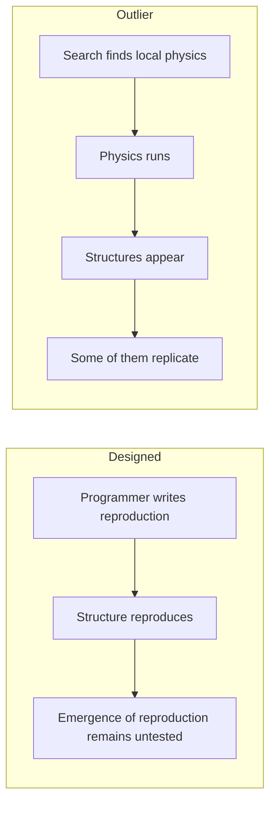

+++
title = "04: Now There Are Two"
date = "2026-08-14T10:00:00+01:00"
draft = false
description = "Persistence is not reproduction. In a binary cellular automaton whose rule was found without explicitly searching for self-replication, apparent copying survives a causal test — within carefully bounded claims."
weight = 4
series = ["Digital Life From First Principles"]
categories = ["Programming", "Artificial Life"]
tags = ["Digital Life", "Artificial Life", "Outlier", "Cellular Automata", "Self-Replication", "Causality", "Ancestry", "Experimental Method"]
+++

We have learned not to trust the first noun.

Fine.

---

In the previous chapter an organization survived while nearly everything participating in it was taken away and replaced. By the end of the turnover window, only 7 of the original 20,000 agents remained.

The exact routes had drifted. The broader organized network had not disappeared.

That was persistence, and it was hard-won.

It was also not reproduction, and the gap between those two words is wider than it looks.

A process can persist throughout an observation without ever producing a descendant. Our Physarum experiment did exactly that. It formed, degraded, recovered and remained organized at the end of the run.

But we never defined or observed a descendant relation.

Continuation is one capability. Making another one is a different capability, and nothing we measured in the last chapter bears on it at all.

The glider looks like the harder case, and it is worth spending a moment on, because it is where the distinction becomes precise instead of merely rhetorical.

Every four generations the glider's configuration recurs, displaced by one cell diagonally and built from active cells at different coordinates. New material participation, recurring organization, generation after generation. If anything in the previous chapter deserved the word **reproduction**, surely that did.

It does not qualify, and the reason is not our invention. In the causal analysis we are about to rely on, Hintze and Bohm set out a criterion for calling a structure a self-replicator: it must produce at least two copies of itself, each causally traceable back to the original, and not to each other.[6] The glider fails it. Each glider copy descends from the copy immediately before it, in a single unbranching chain. Nothing ever forks. A glider gun fails for a different reason — it produces gliders, not glider guns.

The criterion is worth making explicit:

> **An earlier organization must give rise to at least two later organizations of the same kind, each causally dependent on the original and not on one another.**

Chains are not enough. The history has to branch.

We did not construct that standard to fit a result we already had, which is exactly why it is useful to us. It comes from the literature we are about to test our own run against, and it disqualifies the most charismatic object in the previous chapter.

Now look at this.


---

## The Rule Was Searched. The Replicator Wasn't.

Artificial life already contains systems that reproduce, evolve, conserve material and generate structures nobody explicitly designed. Evoloops, Flow-Lenia, Genelife and more recent computational-life experiments cover different parts of that territory, and other work surveys it more systematically.[1–4]

For our purposes one system is unusually useful: **Outlier**.

The mechanism will take one paragraph, because the previous chapter has already done the teaching.

Every cell is `0` or `1`. Each cell reads its `3 × 3` Moore neighbourhood, itself included, which gives 512 possible local configurations, and the rule specifies an output for each. That is the entire law of this universe: 512 output bits. The published rule is rotationally symmetric but not mirror-symmetric. Of its 512 entries, 220 produce an active centre cell, compared with 140 for Conway's Game of Life.[5]

Note what is absent. Nothing in the system yet corresponds to an organism or even an individual. We have only binary state, a neighbourhood, a transition rule and time. Genomes, energy budgets, reproduction, fitness and populations are all concepts that would have to emerge later, if they become relevant at all.

How Outlier was found matters.

Humans designed the substrate, the search space and the selection criteria. Outlier did not appear independently of human design.

But the search did not specify a replicating organism either. It searched for cellular-automaton rules with dynamics considered promising for open-ended evolution.[5] Self-replication was not an explicit target.

What the search returned was a **local transition rule**. The particular structures that later replicated were discovered only after that rule was running.

**The rule was selected. The replicator was discovered inside the resulting world.**



In the first route, observing reproduction tells us only that somebody implemented it. In the second there is no reproduction operator to point at. If a structure reproduces here, the mechanism has to be realized through the unfolding dynamics, because there is nowhere else for it to live.

That does not establish life. It establishes something we need before the question of life is worth asking at all:

> **the behaviour is not the execution of an operation we named in advance.**

---

## It Looks Like Reproduction, Which Is the Problem

Run the published rule from sparse random conditions, or from a tiny seed, and the world fills with activity.[5]

Small shape-shifting clusters appear. Some of them produce further clusters. Some periodically duplicate. Smaller structures assemble into larger formations, and those formations duplicate too. Collections of them eventually form the boundary of a still larger expanding complex.


So there is organization at several levels simultaneously:

```text
cells
  ↓
clusters
  ↓
replicating formations
  ↓
larger expanding complex
```

Yang classified structures at more than one of those scales as self-replicating, under the operational criterion used in that work.[5] Duplication-like recurrence really does appear at multiple scales, and that alone is stranger than anything in the previous chapter. The glider gave us one localized organization persisting through time. Here we have organizations built out of organizations, with apparent duplication at more than one level of the hierarchy.

It is worth being honest about the effect this has on a viewer.

The glider was easy to hold at arm's length. Outlier is not. Structures appear, collide, leave debris and produce further structures, and regions of the world acquire recognizable histories. The vocabulary we spent two chapters restraining comes back within seconds — parent, offspring, population, lineage, organism.

But those words smuggle in different claims. Parent, offspring and lineage assert causal descent. Organism asserts a boundary and an individual. Population assumes we already know which things should be counted together.

The animation establishes none of them.

Consider the entire evidential content of the observation:

```text
time t

    A

time t + 500

    A     A
```

The obvious conclusion is *A reproduced*.

But the picture alone cannot tell us that. The two structures might have arisen independently. The second might have appeared even if the first had never existed. Or our detector might have split one larger process into two apparent objects.

The geometry cannot distinguish between these possibilities.

```text
similarity
≠
ancestry
```

Everything that follows depends on that distinction. It is the sharpened form of the rule from the *What Would Digital Life Mean?* chapter that appearance is not mechanism. Reproduction cannot be established from the final picture, because reproduction is a claim about causation and the picture contains no causation. It contains only the outcome.

---

## What Determinism Buys Us

Here Outlier gives us an unusual advantage: its dynamics are completely deterministic.

For every cell at `t+1`, we know the neighbourhood at `t` that produced it, and we can calculate exactly what would have happened if that neighbourhood had been different.

That does not make causality automatic. We still need a rule for deciding which earlier cells mattered, and for turning those cell-level dependencies into ancestry between larger structures.

But it makes the question testable.

So a question that is usually unanswerable becomes mechanical:

> Which live cells in the preceding neighbourhood were actually necessary for this cell to be alive?

Hintze and Bohm answer this by identifying the minimal sets of earlier live cells required to produce later live cells.[6] Cells that merely happen to be nearby are excluded from the causal trace.

Those cell-level dependencies are then grouped into links between larger clusters.

The result is a causal ancestry graph: earlier structures are connected to later structures only when measured dependencies link them.[6] 

The question has now changed.

Not:

*Does the later structure resemble the earlier one?*

But:

> **Did the earlier structure causally contribute to producing the later one?**

One restriction is worth carrying forward. Yang's structural analysis allowed rotational variants, while Hintze and Bohm's causal analysis restricted its replication claims to exact copies.[5][6] Whatever the causal analysis finds, it is not finding it by relaxing what counts as the same structure.

Causality does not remove the identity problem. The criterion still requires later organizations *of the same kind*, so what counts as the same kind has to be fixed before the search rather than chosen afterwards.

---

## Three Replicators, Three Fates

Once causal ancestry could be measured, structures that looked superficially similar turned out to have very different histories.

| Result | What happened | What it tells us |
|---|---|---|
| **c0** | 433 copies, but no second generation | Making copies is not the same as sustaining a lineage |
| **c1** | 1,677 copies, but only a weak second generation | More copies still do not guarantee continued descent |
| **c2** | 2,439 copies and 15 generations | This is a sustained lineage, not merely repeated copying |
| **Fast vs slow c2 branches** | 675-tick branches produced 96 replication events; 778-tick branches produced 125 | Faster replication did not produce greater realized lineage output |
| **Distributed replication** | Replication could pass through spatially separated components | A reproducing process need not correspond to one connected body |

These are the main results of the published causal analysis that matter to us. The rest of this section unpacks them.

The underlying ancestry graph was enormous: 31,959,320 cluster instances linked by 65,552,995 directed causal edges.[6]

But its most important lesson is much simpler.

**Replication is not one achievement.**

The published analysis uses these counts in describing the three reproductive histories; the important comparison here is not the raw total but what happened to the lineage afterwards.

`c0` is the clearest example.

It produced **433 causally verified copies**.

None of them produced another `c0`.

So `c0` reproduced hundreds of times without founding a sustained lineage.

`c1` went slightly further: 1,677 copies, followed by only a weak second generation.

`c2` was different. Its descendants continued reproducing for **15 generations**.[6]

Three apparent replicators had produced three very different histories.

So a word we were treating as one thing turns out to be three:

```text
recurrence
≠
replication
≠
sustained lineage
```

`c0` is the instructive case, because 433 is a spectacular-sounding number attached to a lineage that went nowhere. Producing copies and founding a dynasty are different achievements, and the first can be reported in a way that strongly implies the second. Biology would have taught us that distinction eventually. It is startling to meet it in 512 bits.

---

## The Fast Ones Did Worse

Once `c2` had a sustained lineage, an obvious question appeared:

**Did the faster-replicating branches do better?**

No.

| c2 branch | Replication time | Realized replication events |
|---|---:|---:|
| Faster | 675 ticks | 96 |
| Slower | 778 ticks | 125 |

The slower branch produced more replication events.[6]

**Faster replication did not produce greater realized lineage output.**

The authors suggest geometry as the explanation: the faster branches expand in directions that create more spatial interference, while the slower branches retain more room in which to continue.[6]

That explanation was not isolated experimentally, so we keep the narrower result.

There is another clue that replication here is a process rather than simple copying.

Three developmental pathways begin differently, then converge on the same sequence of states for their final 143 ticks before producing offspring.[6]

The eventual copy is therefore the end of a developmental process, not a body duplicated in one step.

---

## The Replicator Might Not Be a Body

The strangest result is also one of the simplest to state:

**the reproducing process does not always form one connected body.**

In some cases, replication unfolds through several spatially separated components. They remain disconnected for part of the process, then later merge or branch as replication continues.[6]

The published paper describes this in terms of distributed, multi-component selfhood. We do not need to make that stronger claim here.

We do not need the stronger noun. The published causal analysis establishes something narrower, and quite strong enough:

> **In the published Outlier analysis, causal self-replication can involve multiple spatially separated components.**

The important result is narrower:

**a causally reproducing process need not correspond to one connected body.**

A detector that searched only for compact connected objects would have missed it.

The previous chapter encountered the same problem from another direction.

There, persistence could not be localized cleanly to either the agents or the field.

Here, ancestry can be followed exactly — and the reproducing process still refuses to collapse into one obvious object.

> **If reproduction can be causally real while the reproducing unit is not a neat connected body, what exactly is the thing that reproduces?**

That does not prove that the separated components form one individual.

Individuality needs its own criterion, and we do not have one yet.

So the question remains open:

> **What exactly is the thing that reproduces?**

---

## 144 Copies Prove Nothing

Published evidence tells us what Outlier has been shown to do. We also wanted a specimen we controlled.

So we reconstructed the rule and verified it before asking it anything: all 512 transition cases decoded, exactly 220 active outputs, published rotational symmetry confirmed. The details belong in the experimental record. The principle belongs here.

> **Verify the world before interpreting anything that happens inside it.**

A wrong decoder still produces extraordinary animations. It cannot produce evidence about Outlier.

Our experiment is much smaller than the published one:

```text
our run:        512 × 512, 1,600 generations
published run: 1024 × 1024, 20,000 ticks
```

That matters because Outlier changes behaviour with scale, and the published system enters a different regime after roughly tick 10,000.[5][6]

Our run never reaches that regime.

**Everything that follows therefore applies only to the smaller experiment we actually performed.**

We did not search the run for whatever shape happened to recur most impressively.

That would almost guarantee a result.

Instead we chose the target **before** running the search: the known `c2` seed, a six-cell structure fitting inside a `3 × 3` box.

Only then did we look for later occurrences of that same structure.

Our detector treats translated and quarter-turn rotated versions of `c2` as equivalent, because the Outlier rule itself has rotational symmetry.

Mirror images are not equivalent because the rule is not mirror-symmetric.

This is slightly broader than Hintze and Bohm's causal analysis, which counted only exact copies.[6]

The search found **144 `c2`-equivalent occurrences**.

That sounds impressive.

It proves almost nothing.

All 144 could, in principle, have arisen independently from the surrounding dynamics. Recurrence tells us that the structure appeared repeatedly. It does not tell us that one occurrence produced another.

That requires ancestry.

Encouragingly, this is not a scruple we invented. The authors of the causal study raise precisely the same possibility about their own result: that `c2` patterns might simply arise often, with descent being a correlate of the dynamics rather than a cause.[6] Their answer is the causal trace.

Our causal test is simpler than the published one.

Hintze and Bohm search for minimal sufficient sets of predecessor cells.[6] We remove each live predecessor individually and record a dependency when that removal prevents the later cell from being alive.

The methods are not equivalent. In particular, our test can miss dependencies involving redundant combinations of cells.

So our result must be stated under **our causal criterion**, not theirs.

With that restriction in place, we built the causal graph:

```text
138,891 clusters
196,466 causal edges
```

The animation looks like a few objects moving around.

The mechanism underneath it is a network of nearly two hundred thousand measured dependencies.

Next we combined the two measurements.

We asked:

> When a later `c2` appears, can we reach it through the causal graph from an earlier `c2`?

For each occurrence, we followed its causal descendants until `c2` appeared again. The resulting first-return graph contains 547 causal return edges among the 144 detected occurrences.

Of those occurrences:

- **[N]** produce two or more distinct causal first returns.
- **[M]** have no causal path back to an earlier `c2`.

The first number measures branching.

The second tells us how much recurrence remains compatible with independent formation.

Under this detector, the result is therefore branching causal recurrence rather than recurrence alone.

One condition remains before we could claim the full published self-replication criterion.

Two offspring must depend on the parent **without depending on one another**.

Our current first-return analysis does not test that condition explicitly.


The figure shows a deliberately pruned family, because the full graph is unreadable as an illustration. The analysis uses all of it.

---

## This Time, a Causal Claim Survives

Something has happened here that has not happened before in this book.

We began with a criterion set independently of our result, one that had already disqualified the most persuasive object we had. We fixed the target structure in advance rather than choosing it after seeing which shapes recurred. Then we asked how much of that criterion our own reconstruction could establish.

It established more than resemblance: All right

Our own experiment now gives us three things:

```text
structural recurrence
+
causal ancestry
+
branching causal returns
```

The target structure was chosen in advance. Later occurrences were then traced through a measured causal graph.

So we have established more than resemblance.

Bounded to our actual experiment:

> **In our 512 × 512, 1,600-generation run, later `c2` structures are connected to earlier `c2` structures through a branching causal ancestry graph.**

That is stronger than recurrence alone.

It is not yet the full published self-replication result because our causal test differs from Hintze and Bohm's and we have not explicitly tested offspring independence.

So our result sits here:

```text
recurrence
↓
branching causal recurrence   ← our experiment
↓
demonstrated self-replication
```

**Our result is branching causal recurrence of a pre-specified structure.**

Earlier `c2` organization participates measurably in producing later `c2` organization, and the resulting causal history branches.

A positive result is possible when the evidence supports one.

---

## What We Did Not Earn

Discipline now, while the result is fresh and most attractive.

We now have two different results, and they should remain separate.

**Published Outlier:** causal self-replication under the stricter published criterion.[5][6]

**Our reconstruction:** branching causal recurrence of a pre-specified `c2` structure under our simpler causal test.

Neither establishes self-maintenance, adaptation, agency, memory, autonomy, individuality, open-ended evolution or life.

And the published multi-component result leaves us with a further problem: reproduction can be causally clear even when the reproducing unit is not an obvious body.

| Evidence | What it establishes |
|---|---|
| **Published analysis** | Causal self-replication, including replication involving spatially separated components |
| **Our experiment** | Branching causal recurrence of a pre-specified `c2` structure |

Both are strong results.

They are not the same result, and neither needs to be made larger than it is.

---

## Two Instruments, Each Missing Something

Finding something remarkable in Outlier does not make Outlier a blueprint.

```text
Outlier is evidence, not specification
```

Its value is as a demonstration of what a computational substrate can support without anyone explicitly specifying the resulting organization. Copying its rule and bolting on memory, energy or goals would simply rebuild the cargo cult with better evidence underneath it.

There is another problem.

The two systems give us almost opposite strengths.

| System | What it gives us | What it lacks |
|---|---|---|
| **Physarum** | Clean higher-level interventions | Operational lineage |
| **Outlier** | Reconstructible causal lineage | Clean higher-level intervention controls |

In Physarum we could remove the field, replace the population or switch turnover off.

In Outlier we can trace ancestry, but there is no independent dial for reproduction, coupling, memory or interaction range.

Each system gives us something the other lacks.

What we eventually need is a system with all four:

```text
known rules
+
controlled interventions
+
one mechanism varied at a time
+
causal history we can follow
```

That is not a definition of digital life.

**It is a specification for the laboratory we need to investigate it.**

---

## References

**[1]** Sayama, H. & Nehaniv, C. L. *Self-Reproduction and Evolution in Cellular Automata: 25 Years After Evoloops.* Artificial Life 31(1), 81–95 (2025).

**[2]** Plantec, E., Hamon, G., Etcheverry, M., Chan, B. W-C., Oudeyer, P-Y. & Moulin-Frier, C. *Flow-Lenia: Emergent Evolutionary Dynamics in Mass Conservative Continuous Cellular Automata.* Artificial Life 31(2), 228–250 (2025). doi:10.1162/artl_a_00471

**[3]** Packard, N. H. & McCaskill, J. S. *Open-Endedness in Genelife.* Artificial Life 30(3), 356–389 (2024). doi:10.1162/artl_a_00426

**[4]** Agüera y Arcas, B. et al. *Computational Life: How Well-formed, Self-replicating Programs Emerge from Simple Interaction.* arXiv:2406.19108 (2024).

**[5]** Yang, B. *Emergence of Self-Replicating Hierarchical Structures in a Binary Cellular Automaton.* Artificial Life 31(1), 96–105 (2025). doi:10.1162/artl_a_00449

**[6]** Hintze, A. & Bohm, C. *Rethinking self-replication: detecting distributed selfhood in the Outlier cellular automaton.* npj Complexity 3, 11 (2026). doi:10.1038/s44260-026-00074-2
