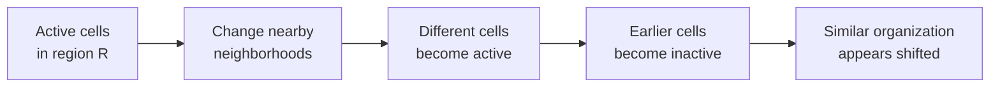
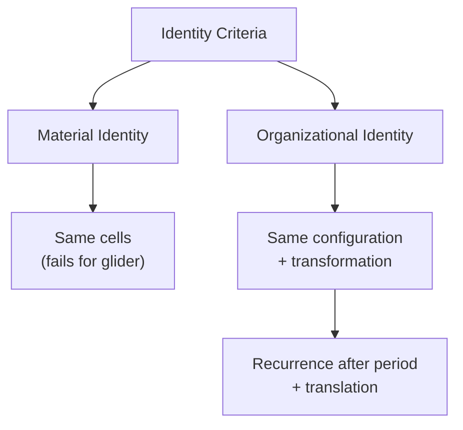
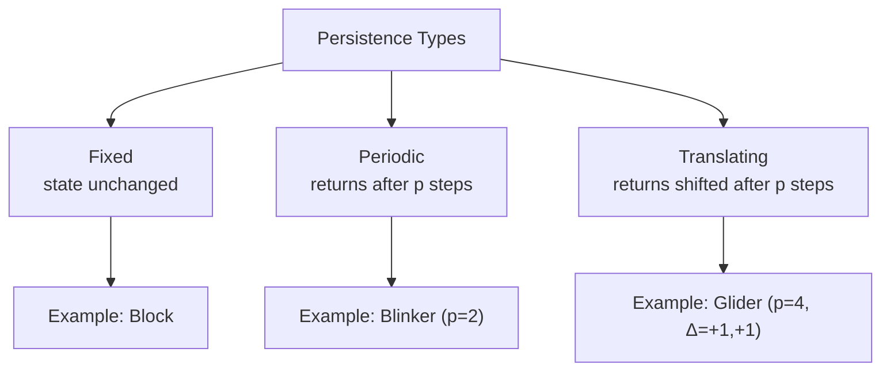
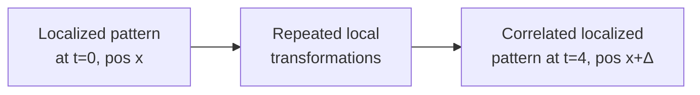

+++
title = "04: When Does a Pattern Become a Thing?"
date = "2026-08-11T01:26:00+01:00"
draft = false
description = "Use Conway's Game of Life to ask when a recurring localized pattern becomes useful to treat as an entity."
categories = ["Programming", "Artificial Life"]
tags = ["Digital Life", "Cellular Automata", "Conway's Game of Life", "Glider", "Emergence", "Pattern Identity"]
+++

Rule 30 gave us structure.

It gave us propagation.

It gave us sensitivity to perturbation.

But it did not obviously give us a **thing**.

The pattern expanded.  
Regions changed.  
Differences spread.

Interesting global behavior appeared.

But if I pointed at one region and asked:

> Is that the same object ten generations later?

the answer was not obvious.

So let's change systems.

Not because Conway's Game of Life is more complicated.  
It isn't.

But because it gives us something Rule 30 does not give us so cleanly:

> **a localized pattern that appears to persist while moving through space**

That creates a harder question.

Not:

> Is it alive?

Much earlier than that:

> **When does it become useful to treat a pattern as a continuing thing?**

---

## Start With Five Cells

Consider this pattern:

```text
.#.
..#
###
```

Five active cells.  
Everything else is empty.

Nothing in those five cells says:

```text
move diagonally
```

There is no velocity.  
No direction variable.  
No object controller.  
No instruction such as:

```python
glider.x += 1
glider.y += 1
```

And yet if we run Conway's Game of Life, something remarkable happens.


A recognizable organization appears to travel diagonally through the grid.

We normally say:

> the glider moved.

But before we accept that sentence, we should ask what actually moved.

---

## The Cells Did Not Move

Game of Life cells occupy fixed coordinates.

A cell does not travel across the lattice.

Instead, cells become active and inactive according to their neighborhoods.

So the underlying process is closer to:

```text
activity in one region
        ↓
changes nearby neighborhoods
        ↓
different cells become active
        ↓
earlier cells become inactive
        ↓
a similar organization appears nearby
```



No material object crosses the grid.  
The **organization** does.

This is the same conceptual problem we encountered with Lenia.  
But Game of Life gives us a much cleaner laboratory.

---

## The Game of Life Rule

Game of Life uses a two-dimensional binary lattice.

Every cell examines its eight immediate neighbors.

An active cell survives if it has:

```text
2 or 3
```

active neighbors.

An inactive cell becomes active if it has:

```text
exactly 3
```

active neighbors.

Usually written:

```text
B3/S23
```

That is the entire rule.

There is no special rule for:

```text
glider
block
blinker
spaceship
```

There is only:

```text
local binary state
+
eight-cell neighborhood
+
B3/S23
+
synchronous update
```

The larger structures are descriptions we introduce after observing what the local dynamics produce.

---

## Build the Rule

A clear implementation is small:

```python
import numpy as np


def life_step(state):
    neighbors = (
        np.roll(np.roll(state,  1, axis=0),  1, axis=1)
        + np.roll(state,  1, axis=0)
        + np.roll(np.roll(state,  1, axis=0), -1, axis=1)
        + np.roll(state,  1, axis=1)
        + np.roll(state, -1, axis=1)
        + np.roll(np.roll(state, -1, axis=0),  1, axis=1)
        + np.roll(state, -1, axis=0)
        + np.roll(np.roll(state, -1, axis=0), -1, axis=1)
    )

    born = (state == 0) & (neighbors == 3)
    survive = (state == 1) & ((neighbors == 2) | (neighbors == 3))

    return (born | survive).astype(np.uint8)
```

Again:

```text
local state
+
local interaction
+
same rule everywhere
```

No global object model.

---

## Put a Glider Into the World

```python
state = np.zeros((20, 20), dtype=np.uint8)

glider = np.array([
    [0, 1, 0],
    [0, 0, 1],
    [1, 1, 1],
], dtype=np.uint8)

state[2:5, 2:5] = glider
```

Now update four times:

```python
for _ in range(4):
    state = life_step(state)
```

After four generations, the same local configuration returns one cell diagonally away.

So we can measure:

```text
period = 4 generations
displacement = (+1, +1)
```

That is already stronger than:

> it looks like it moved.

We have a repeatable relationship.

---

## What Persisted?

Suppose we label the five active cells at the start:

```text
A
B
C
D
E
```

Four generations later, the original active coordinates are mostly no longer active.

The pattern is made from different cells.  
Its coordinates changed.  
Its intermediate shape changed.

Yet we still naturally say:

> the glider is over there now.

So what persisted?

Not:

```text
the same cells
```

Not:

```text
the same coordinates
```

Not even:

```text
the same exact shape at every generation
```

What persisted was something more like:

```text
a recurring sequence of local configurations
+
a stable transformation through time
+
a fixed displacement
```

That is already a much richer notion of identity than material continuity.

---

## Material Identity and Organizational Identity

We can distinguish two rough notions of sameness.

### Material identity

```text
same components
=
same thing
```

That works well for some physical objects.  
But it is a poor description of a glider.

### Organizational identity

```text
same organization
through an allowed transformation
=
usefully treated as the same thing
```

The glider strongly invites this second description.

But there is an important qualification.  
We have not proved:

> every persistent pattern is an entity.

We have shown something narrower:

> **Material continuity is not necessary for a useful operational notion of identity in this system.**

That is enough.



---

## Measure the Motion

We can make this less philosophical.

Take the active coordinates:

```python
positions = np.argwhere(state == 1)
```

and compute their centroid:

```python
centroid = positions.mean(axis=0)
```

Track that through time.


Now:

> the glider moved

can become:

> the centroid of this localized pattern changes systematically through time.

That gives us:

```text
position
displacement
velocity
trajectory
```

as observables.

The noun:

```text
glider
```

starts becoming experimentally useful because several measurable quantities remain coherent through its transformations.

---

## Localization Matters

Why is the glider easier to treat as a thing than Rule 30's expanding history?

One major reason is:

> **localization**

Most of the world is not part of the glider.  
Activity is concentrated in a bounded region.

We can measure:

```python
positions = np.argwhere(state == 1)

minimum = positions.min(axis=0)
maximum = positions.max(axis=0)
```

That gives us a bounding box.

We can define properties such as:

```text
area
active-cell count
centroid
velocity
shape
orientation
period
```

Now we have a candidate operational boundary.

But we should already mark that word:

> candidate.

Later we will encounter systems where connected geometry may not be the correct boundary of the continuing organization.

For now, localization is a useful first approximation.

---

## A Block Persists Differently

Consider:

```text
##
##
```

This is a block.

Under Game of Life it remains unchanged.


It is:

```text
localized
persistent
stationary
```

The glider is:

```text
localized
persistent
translating
periodically transforming internally
```

So:

```text
persistence
```

and:

```text
movement
```

are already separate properties.

---

## A Blinker Persists by Changing

Now consider:

```text
###
```

One generation later:

```text
#
#
#
```

Then back again.

This is a blinker.

Its exact state does not persist.  
Its behavior does.

So persistence itself has several forms.

---

## Three Forms of Persistence

### Fixed persistence

```text
state(t + 1) = state(t)
```

Example: block

### Periodic persistence

```text
state(t + p) = state(t)
```

for some period `p`.

Example: blinker (p=2)

### Translating persistence

For some period `p` and spatial translation Δ:

```text
state(t + p) = translate(state(t), Δ)
```

Example: glider (p=4, Δ=(+1,+1))



That is much better than one vague word.  
We can now specify what kind of persistence we mean.

---

## Identity Depends on Which Changes We Ignore

Suppose the glider at `t = 0` occupies one location.  
At `t = 4`, it occupies the same local configuration shifted by (+1,+1).

A raw whole-grid comparison gives:

```python
np.array_equal(state_t0, state_t4)
```

which returns `False`.

But if we compensate for translation:

```python
shifted = np.roll(
    np.roll(state_t0, 1, axis=0),
    1,
    axis=1,
)
```

the patterns match.

So identity depends partly on what transformations we decide are irrelevant.

Do we care about:

```text
position?
orientation?
scale?
phase?
exact constituent cells?
```

Different choices imply different identity criteria.

This is not merely philosophy.  
It determines the algorithm we use to detect persistent entities.

---

## Identity Requires Invariants

One useful way to think about identity is:

> What survives the transformations we allow?

For the glider:

```text
position          changes
active cells      change
intermediate form changes
```

But after four generations:

```text
local configuration recurs
+
displacement is predictable
```

That relationship is invariant.

So an operational definition might be:

> **A glider is a localized dynamical pattern whose local state recurs after a fixed period up to spatial translation.**

That is testable.

---

## But This Is Only Our First Definition of a Thing

This is important.

Right now we are using:

```text
localized connected geometry
+
recurrence
+
coherent trajectory
```

as evidence that treating something as an entity is useful.

That works beautifully for a glider.

It does not follow that this is the universal definition of a digital individual.

Later we may find:

```text
disconnected components
```

that participate in:

```text
one continuing causal process
```

or:

```text
identical geometries
```

that belong to:

```text
completely different causal histories
```

If that happens, geometry will stop being enough.

So the glider gives us a **working definition**, not a final ontology.

That distinction is going to become important.

---

## The Danger of Naming Things

Game of Life contains named patterns such as:

```text
block
blinker
beacon
glider
lightweight spaceship
pulsar
gun
```

Names are useful.  
Instead of listing coordinates, we can say:

> glider

and reason at a higher level.

But naming has a side effect.  
Once something has a noun, the mind starts treating it as an object automatically.

The noun does not prove the ontology.

Calling a pattern:

```text
spaceship
```

does not make it an engineered vehicle.  
Calling something:

```text
gun
```

does not make it analogous to a physical gun in every meaningful respect.

We will use names.  
But we should remember:

> **Naming compresses description. It does not establish mechanism.**

---

## Can Two Apparent Things Interact?

Now put two localized patterns in the same world.

Depending on their geometry and timing, they may:

```text
pass
collide
destroy one another
produce debris
produce another recognizable pattern
```


Now the entity-level description becomes even more useful.

We can ask:

```text
Did pattern A alter pattern B?

Did either persist?

Was a new localized pattern produced?

Was the collision outcome reproducible?

Would the same outcome occur if one input were removed?
```

That final question is especially important.  
It begins moving us from:

```text
pattern description
```

toward:

```text
causal analysis
```

We will need that later.

---

## Does a Glider Carry Information?

A glider begins in one region.  
Later, a correlated structured state exists somewhere else.

So something about the earlier configuration constrains a later distant configuration.

Operationally:

```text
localized state
      ↓
repeated local transformations
      ↓
correlated localized state elsewhere
```



This is why gliders can be used as signals in computational constructions inside Game of Life.

But we should again avoid saying too much.

We do not need:

> the glider understands information.

We only need:

> **a structured local state can propagate through space while preserving relationships that another mechanism can respond to.**

That is enough to make it useful as a signal.

---

## So Is the Glider a Thing?

Biologically?  
We have shown nothing close to enough.

Philosophically?  
We can argue indefinitely.

Experimentally?  
We can be precise.

The glider is:

```text
localized
dynamically persistent
periodic
translating
reproducible from the same initial condition
describable independently of the exact cells currently active
```

That makes it useful to treat the glider as:

> **a pattern-level entity under a defined persistence criterion**

Notice the wording.

Not:

> the glider is alive.

Not:

> the glider is objectively an organism.

Not even:

> connected glider geometry is the universal meaning of individuality.

Only:

> treating it as a continuing entity is useful because measurable relationships remain coherent across its transformations.

That is the bounded claim.

---

## Now We Have Something We Can Hurt

Rule 30 gave us spreading structure.  
The glider gives us a localized persistent pattern.

That means we can finally perform a stronger experiment.

We can:

```text
remove one cell
remove several cells
alter its phase
collide it with another pattern
```

and ask:

```text
Does the organization continue?

Does it remain recognizable?

Does it return toward its previous form?

Does it become another persistent structure?

Does it disappear?
```

That leads to three ideas that are easy to confuse:

```text
persistence
≠
robustness
≠
regeneration
```

A pattern surviving forever in an undisturbed world tells us much less than a pattern surviving disturbance.

So next, we stop admiring it.  
We damage it.

Next: **Kill It.**
