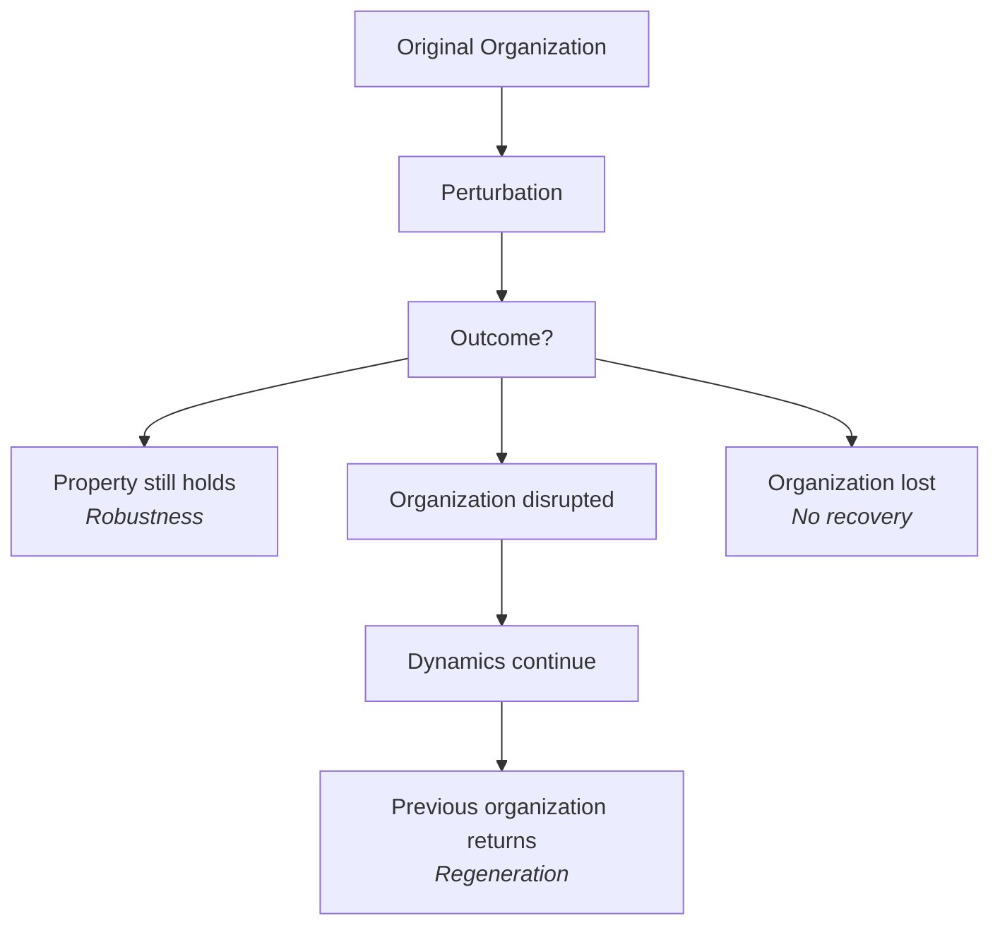
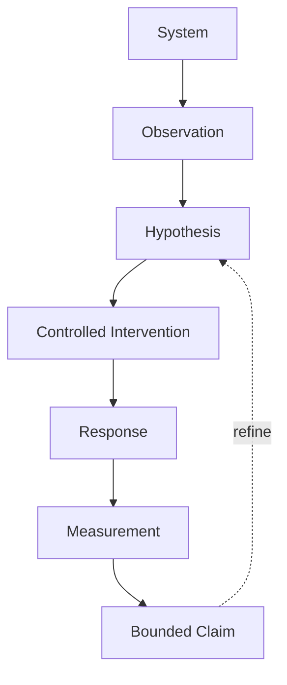

+++
title = "05: Kill It"
date = "2026-08-11T01:34:00+01:00"
draft = false
description = "Damage persistent digital patterns and separate survival, robustness and regeneration into experimentally distinct claims."
categories = ["Programming", "Artificial Life"]
tags = ["Digital Life", "Cellular Automata", "Robustness", "Regeneration", "Perturbation", "Game of Life"]
+++

We have been too kind to our systems.

So far we have:

- initialized them carefully,
- placed them in clean environments,
- watched them evolve,
- selected examples that behave interestingly,
- and mostly left them alone.

That is a dangerous way to understand a mechanism.

A structure that persists under exactly the conditions that produce it tells us something.

But not enough.

If we want to know what is actually maintaining that structure, we need to interfere.

So let's interfere.

---

## Start With the Glider

Our glider:

```text
.#.
..#
###
```

is a dynamically persistent localized pattern.

Under undisturbed Game of Life dynamics, it repeats its local configuration every four generations while translating one cell diagonally.

That gave us a useful operational definition of persistence.

Now remove one cell.

For example:

```text
.#.
...
###
```

One bit changed.  
Same rule.  
Same world.  
Same boundary condition.  
Same update semantics.

Only the state has been perturbed.

Run it.


Several outcomes are possible.

The structure may disappear.  
It may become another Life pattern.  
Some activity may survive.  
Debris may spread.

But one possibility is especially important:

> **the original glider may fail to reconstruct itself**

That immediately separates two claims:

```text
persists when undisturbed
```

from:

```text
returns after disturbance
```

Those are not the same property.

---

## Three Different Claims

We need separate words for separate phenomena.

### Persistence

A structure continues under its ordinary dynamics.

```text
undisturbed state
      ↓
ordinary dynamics
      ↓
organization continues
```

### Robustness

A perturbation occurs, but some defined property continues to hold.

```text
organization
      ↓
perturbation
      ↓
property still holds
```

### Regeneration

A perturbation substantially changes the structure, and subsequent dynamics return it toward a defined previous organization.

```text
organization
      ↓
damage
      ↓
organization disrupted
      ↓
continued dynamics
      ↓
defined organization returns
```



So:

```text
persistence
≠
robustness
≠
regeneration
```

A system can possess one without possessing the others.  
This distinction will matter repeatedly.

---

## A Block Persists Perfectly

Take the Game of Life block:

```text
##
##
```

Under ordinary Life evolution:

```text
t = 0

##
##

t = 1

##
##

t = 2

##
##
```

Perfect persistence.

Now delete one cell:

```text
#.
##
```

Run the dynamics.

The pattern collapses.

So the block has excellent:

```text
undisturbed persistence
```

and poor tolerance to this particular intervention.

The perturbation has exposed something that observation alone did not.

---

## The Perturbation Is the Experiment

Before this chapter, many of our experiments looked like:

```text
initial state
      ↓
evolution
      ↓
observation
```

Now the structure changes:

```text
initial state
      ↓
ordinary behavior
      ↓
controlled intervention
      ↓
response
      ↓
measurement
```

The perturbation is not unwanted noise around the experiment.

> **The perturbation is the experiment.**

We deliberately change something because the response can reveal which mechanisms matter.

This is the beginning of causal experimentation.

---

## Damage Must Be Defined

“Damage the pattern” sounds intuitive.

It is useless experimentally until we specify what we changed.

For a binary cellular automaton, damage could mean:

```text
turn one active cell off
```

or:

```text
flip N randomly selected cells
```

or:

```text
erase everything inside a region
```

or:

```text
replace part of the pattern with random state
```

These are different interventions.

A reproducible protocol might be:

```text
pattern: glider
damage time: t = 20
damage operation: active → inactive
damage amount: one cell
damage positions: every active cell in turn
repetitions: all possible deletions
observation window: 50 generations
```

Now another person can repeat the experiment.  
And now we can meaningfully compare systems.

---

## One Lucky Recovery Proves Very Little

Imagine a structure containing ten active cells.

Delete one particular cell.  
It returns to its previous pattern.

Interesting.

Now delete one of the other nine cells.  
It collapses.

Then the statement:

> the system regenerates after damage

would be far too broad.

A better experiment systematically tests perturbations.

For example:

```python
for cell in active_cells:
    damaged = state.copy()
    damaged[cell] = 0

    result = run(damaged)

    measure_response(result)
```

Now we can ask:

```text
Which perturbations were tolerated?

Which positions were critical?

How much organization remained?

Did the original organization return?

How long did that take?
```

Instead of one anecdote, we obtain a:

> **damage-response profile**

---

## Survival Is Not Recovery

Suppose we damage a structure and some activity remains.

That does not mean the structure regenerated.

Imagine:

```text
before

.###.
##.##
.###.
```

After damage:

```text
.#...
##...
.....
```

Twenty generations later:

```text
##...
##...
.....
```

Something survived.  
But the previous organization did not return.

So:

```text
nonzero activity
```

is not recovery.

Neither is:

```text
localized activity
```

To make a regeneration claim, we need a defined relationship between:

```text
organization before perturbation
```

and:

```text
organization after continued evolution
```

---

## Recovery Forces Us to Define Identity

This connects directly to the previous chapter.

Suppose our target pattern is `T` and the later pattern is `R`.

For a stationary discrete pattern, we might compare them directly:

```python
np.array_equal(T, R)
```

But that fails for a glider.  
A glider could return while shifted in space.

So perhaps recovery means:

```text
same organization
up to translation
```

For an oscillator:

```text
same organization
up to phase
```

For more complicated systems we may need invariance under:

```text
translation
rotation
phase
scale
internal deformation
```

The moment we ask:

> Did it regenerate?

we are forced to answer:

> **What counts as the same entity?**

The philosophical problem has become an engineering requirement.

---

## Exact Equality Is Usually the Wrong Metric

Suppose we compare two whole worlds using:

```python
def similarity(a, b):
    return np.mean(a == b)
```

There is an immediate problem.

If almost every cell is zero, two completely different tiny structures may still score close to 1.0 because the empty background dominates the metric.

So our measurement must focus on the structure we care about.

One simple choice is intersection-over-union.

For active-cell sets A and B:

$$
IoU(A,B) = \frac{|A \cap B|}{|A \cup B|}
$$

Identical active regions produce 1.0.  
Disjoint regions produce 0.0.

In code:

```python
def iou(a, b):
    intersection = np.logical_and(a, b).sum()
    union = np.logical_or(a, b).sum()

    if union == 0:
        return 1.0

    return intersection / union
```

For moving structures, we would first align them under the transformations our identity criterion allows.

Still imperfect.  
But explicit.

---

## Metrics Create Claims

Suppose we define:

```text
recovered =
    IoU >= 0.90
    within 50 generations
    after optimal translation alignment
```

Now we can report:

> Under this perturbation protocol, the pattern returned to at least 0.90 IoU with its pre-damage morphology within 50 updates after translation alignment.

That is much uglier than:

> It healed itself.

Good.

The ugly statement tells us what was actually demonstrated.  
We can always summarize later.  
But the experiment should preserve the operational claim.

---

## Robustness Does Not Require Regeneration

A system may fail to restore its previous shape while preserving something else.

Imagine a future digital system whose behavior is:

```text
move toward a signal source
```

Damage changes its morphology.  
Its shape similarity falls dramatically.  
Yet it continues moving toward the signal.

Then:

```text
morphology failed
```

while:

```text
capability survived
```

So there are at least two questions:

```text
Did the structure recover?
```

and:

```text
Did the capability survive or recover?
```

These are different measurements.

And this is a broader lesson:

> **Robustness always needs an object: robust with respect to what?**

Shape?  
Movement?  
Computation?  
Replication?  
Memory?

A system is not simply “robust.”  
It is robust with respect to some property under some class of perturbations.

---

## Build a Damage Curve

One perturbation gives one data point.

Increase the intervention systematically.

For example:

```text
0% removed
5% removed
10% removed
20% removed
40% removed
60% removed
```

At each level:

1. perturb the pattern,
2. evolve it,
3. measure survival,
4. measure structural similarity,
5. repeat across positions or random seeds.

Then plot:

```text
damage severity
      ↓
response
```


Now we can ask whether degradation is:

```text
gradual
abrupt
threshold-like
position-dependent
```

That tells us much more than one impressive animation.

---

## Damage Location Matters

Suppose a structure contains one hundred active cells.

Removing ten cells from one region might do almost nothing.  
Removing ten elsewhere might destroy the pattern completely.

So:

```text
amount of damage
```

is not enough.

We also need:

```text
location of damage
```

This allows us to search for:

```text
fragile regions
redundant regions
critical structures
distributed organization
```

Eventually this becomes a question about where the system's causal organization actually lives.

Is function concentrated?  
Distributed?  
Redundant?  
Does there even exist a clean spatial location corresponding to the mechanism?

We should not assume the answer in advance.

---

## Repeated Perturbation Is a Stronger Test

Suppose a system survives one intervention.

Damage it again.  
Then again.

```text
damage
  ↓
response
  ↓
damage
  ↓
response
  ↓
damage
  ↓
response
```

A system might survive one perturbation by consuming redundancy that never returns.  
Another might repeatedly reconstruct the lost organization.

Those are different mechanisms.

So repeated intervention lets us distinguish:

```text
one-time tolerance
```

from:

```text
sustained recovery capacity
```

Again, the perturbation reveals structure that clean observation hides.

---

## Damage Does Not Have to Mean Deleting Cells

The deeper idea is not “injury.”  
It is intervention.

We could alter:

```text
state
parameters
environment
resource access
boundary conditions
noise level
update timing
other interacting structures
```

The common pattern is:

```text
hold most things fixed
      ↓
change one defined condition
      ↓
measure the response
```

This matters because a capability becomes much more informative when we know where it fails.

A system that works only under one carefully selected setup may still be interesting.  
But the boundary of the claim is narrow.  
Perturbation helps us find that boundary.

---

## The Glider Fails the Stronger Test

Return to the glider.

It is:

```text
localized
periodic
translating
dynamically persistent
```

But perturb the wrong cell and its characteristic trajectory disappears.

That does not make the glider less interesting.  
It makes our description more precise.

We can say:

> **The glider exhibits translating dynamic persistence under undisturbed Game of Life dynamics.**

We should not infer:

> The glider exhibits robust self-maintenance under damage.

Those are different achievements.  
And now we have an experiment that separates them.

---

## Could Local Dynamics Regenerate Structure?

Now the stronger question becomes interesting.

Can we build a system where:

```text
organized state
      ↓
perturbation
      ↓
organization disrupted
      ↓
local dynamics continue
      ↓
organization returns
```

without a central controller simply storing the desired image and repainting it?

That would be a more interesting mechanism.

If we eventually encounter or construct such a system, the protocol is already waiting for it:

```text
How much perturbation?

Where?

How many trials?

How similar was the recovered organization?

How long did recovery take?

What baseline are we comparing against?

Does recovery generalize to perturbations not used to construct the system?
```

The measurement rules come before the spectacular GIF.

---

## Intervention Is Becoming Part of Our Method

We started the book with:

```text
state
+
local interaction
+
time
```

Then we added observation.  
Now we have added intervention.

Our laboratory increasingly looks like:



This is a major step.

We are no longer merely asking:

> What does the system do?

We can ask:

> **What makes the system able to do it?**

---

## Attack the Capability

This gives us a general rule for the rest of the book.

If a system appears to possess:

```text
memory
persistence
regeneration
adaptation
inheritance
coordination
```

do not only observe the condition in which the capability appears.  
Intervene on the mechanism that supposedly supports it.

For memory:

```text
remove or corrupt candidate stored state
```

For regeneration:

```text
damage the organization
```

For adaptation:

```text
change the environment
```

For inheritance:

```text
compare successors with and without inherited information
```

For coordination:

```text
break communication or alter neighbors
```

Then ask whether the capability survives.

That moves us from association toward mechanism.

---

## And Now Reproduction Enters — Carefully

Damage raises another possibility.

Instead of requiring one organization to persist indefinitely, a system might produce another organization resembling itself.

That would move persistence from:

```text
one continuing instance
```

to something like:

```text
information or organization
continuing across instances
```

Biology uses this strategy extensively.

But we should not therefore assume that digital life must.

A digital system might:

```text
persist indefinitely
repair itself
grow continuously
fork
copy
checkpoint
restore
merge
```

Reproduction is only one possible mechanism among several.

So the next chapter is not asking:

> What must life do next?

It is asking a narrower experimental question:

> **What changes when one persistent pattern can produce another?**

That question brings new traps.

A duplicate is not automatically offspring.  
Similarity is not automatically causal reproduction.  
Variation is not automatically inheritance.  
Mutation is not automatically evolution.

Before we can use any of those words, we need mechanisms and tests.

So next we ask:

> **Can It Make Another One?**
