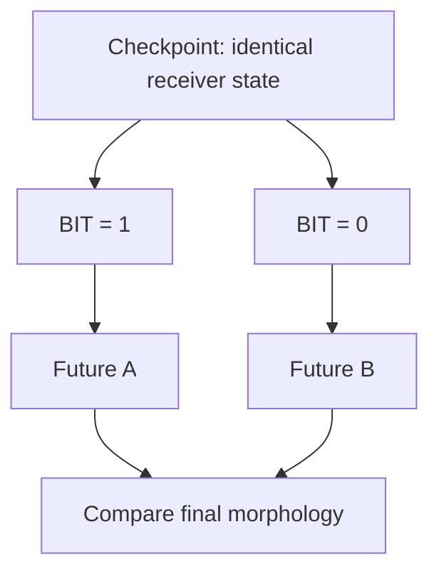
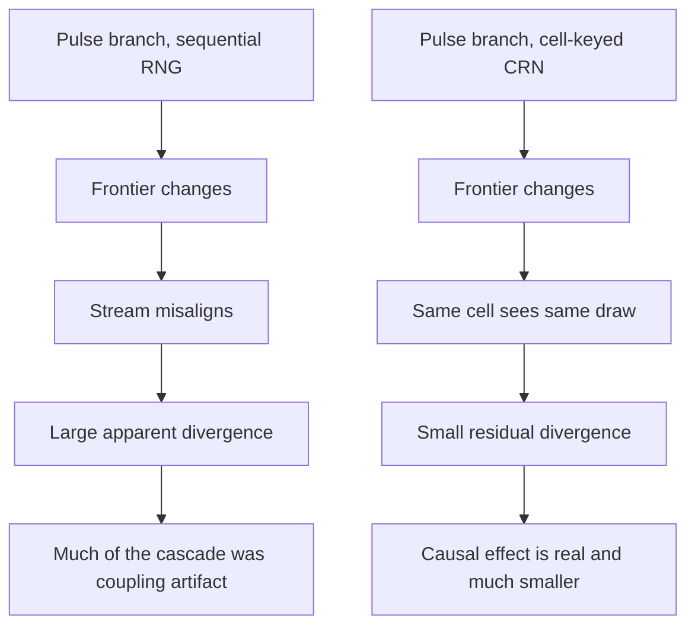

+++
title = "5: The Crystal Gets a Past"
date = "2026-08-14T10:00:00+01:00"
draft = false
description = "A saved state can continue the Digital Crystal exactly, an event history can reconstruct how it formed, and a single received bit can redirect its future. None of that is memory yet."
weight = 5
categories = ["Programming", "Artificial Life"]
tags = ["Digital Life", "Digital Crystal", "State", "History", "Checkpointing", "Causality", "Counterfactuals"]
series = ["Digital Life From First Principles"]
+++

At the end of the last chapter the Digital Crystal could tell us something about the world that formed it.

Hide the forcing process, show only the final shape, and the family of that process could be recovered well above chance.

Then we asked a harder question.

> What happened first?

We took exactly the same environmental values and rearranged them in time. Smooth. Bursting. Periodic. Alternating. Random.

The final morphology could not reliably tell them apart.

```text
SAME VALUES
+
DIFFERENT ORDER
↓
NO RECOVERABLE TEMPORAL SIGNATURE
```

The crystal had accumulated a state. It had not preserved a usable history.

So Chapter 4 ended with an instruction rather than a conclusion: give the process a way to keep what happened.

That sounds like a software problem. It is not. Before we can build storage we have to know what is worth storing, and we do not yet know what a digital past is made of.

So the question for this chapter is deliberately small:

> **What must a computational process preserve before its past can become available to its future?**

Notice that this is not the same as asking how to build memory. We have not earned that word, and we do not yet know what it would mean here. What we can do is take the words that ordinary language collapses into one — state, history, record, influence, signal, message, memory — and pull them apart until each of them names a different computational property.

By the end of this chapter they will be different properties. Some of them the crystal will have. Most of them it will not.

---

## The Present Is Not the Past

The Digital Crystal already has a present. At any moment its occupied set contains the cells that currently exist, and every one of those cells exists because of something that happened earlier.

So the past clearly mattered.

But Chapter 4 taught us a distinction that is easy to state and easy to forget:

> **Past contributed to present does not imply present contains a recoverable record of the past.**

A footprint exists because someone walked there. The footprint is not the walk.

A crater exists because something struck the ground. The crater is not the trajectory of the object that made it.

The crystal's current shape contains consequences. It does not contain the sequence that produced them.

Two ideas are tangled together here, and the rest of the chapter depends on separating them:

```text
STATE
→ what must I know to continue from here?

HISTORY
→ what must I know to reconstruct how I got here?
```

Those are different questions. There is no guarantee that the same information answers both. There is no guarantee that either of them is visible in the picture.

We can test all of that.

---

## Stop It

Begin with state, because state has an operational definition available:

> **A state representation is sufficient if it contains enough information to continue the process faithfully from here.**

That wording is careful. We are not claiming to know the smallest possible state of a Digital Crystal. We are asking whether a particular stored representation is sufficient — a question an experiment can answer.

Take the frozen Digital Crystal from Chapter 4. Do not change the growth rule. Run it for 96 steps, and halfway through, at step 48, serialize whatever we think the running process consists of:

```text
occupied cells
birth-time metadata
current timestep
current signal position
random-number-generator state
model parameters
```

Not a screenshot. Not a rendered image. The actual continuation representation, written to a database and read back into a fresh process.



Then demand something much stronger than visual similarity.

If the checkpoint is sufficient, the restored process should not resemble the uninterrupted one. It should reproduce it:

```text
the same cells
the same attachment decisions
the same population trajectory
the same final process state
```

Exact continuation, or the representation was incomplete.

---

## The State We Had Not Declared

The first attempt failed.

We saved the checkpoint, restored it, continued — and the future changed.

The obvious reading was that something important was missing from the checkpoint. But a second result contradicted that. When the same state was rebuilt *without* passing through serialization, continuation was exact. Whatever was going wrong was happening at the implementation boundary, not in the model.

The culprit was mundane. Candidate attachment sites were held in a Python `set`, and the growth loop walked that set drawing one pseudo-random value per candidate. A set has no scientific ordering. Two sets can contain exactly the same cells and iterate them in different orders after reconstruction.

Which meant that:

```text
same mathematical cells
+
same RNG state
+
same signal
```

could still send random draw #1 to a different candidate in each run, and every draw after it to a different candidate again.

The simulation had quietly acquired an undeclared state variable: the memory layout of a container. That is not a property of the Digital Crystal. It is a property of the program. We removed it by canonicalizing the traversal — candidates are visited in sorted order — and added an invariant that serializing and reconstructing a state must produce both the same one-step continuation and the same complete remaining continuation before any experiment is allowed to run.

The debugging detail belongs to the research layer. The lesson does not:

> **If future behaviour depends on hidden implementation state, that state belongs in the experimental definition whether or not it appears in the visualization.**

Either promote it into the declared model or eliminate it. What you cannot do is leave it hovering between the two, invisible in every figure and decisive in every result.

---

## Start Again

With traversal canonicalized, the checkpoint experiment becomes meaningful.

Save at step 48. Destroy the running process. Load from storage. Continue to step 96.

```text
exact final morphology            True
exact final process state         True
population trajectory identical   True
attachment trajectory identical   True
symmetric-difference cells        0
```



And this was not one lucky run. Repeated across 30 independent runs, the result was 30 out of 30 exact.

So we have earned the first claim of the chapter:

> **The stored checkpoint representation is sufficient for exact continuation of the stochastic process.**

Note what is *not* claimed. We have not shown this is the minimal such representation. Sufficiency is what the experiment tested, so sufficiency is what we get.

It is worth pausing on how strange this would be anywhere else. We stopped a growing thing, wrote it down, deleted it, rebuilt it from the writing, and it grew into precisely the thing it would have grown into. Not approximately. Not statistically. The same cells, in the same order, with the same stochastic decisions.

That is not a biological capability that we have imitated. It is a native property of the substrate we happen to be working in.

---

## What the Picture Cannot Show

Now damage the checkpoint deliberately, one component at a time, and see which damage the future notices.

Every variant gets exactly 48 continuation updates, so that moving the environmental cursor does not accidentally shorten the experiment.

**Remove the random state.** Same morphology, same birth metadata, same timestep, same signal position, different stochastic continuation state:

```text
symmetric-difference cells    28
```

Small, but not zero. Exact continuation fails.

**Move the environmental cursor.** Same morphology, same RNG state, same number of remaining updates, but the process now sits at position 45 in the signal instead of 48:

```text
symmetric-difference cells    27
```

So where the process sits in its environment is part of its continuation conditions, not merely historical context.

**Replace the birth times.** Keep occupied cells, RNG state, signal cursor and timestep; scramble the metadata recording when each cell appeared:

```text
symmetric-difference cells     0
```

Exact. The growth rule never consults birth times when deciding the next attachment, so they can be wrong without the geometry noticing.

**Save only the picture.** Preserve the visible occupied structure and reconstruct everything else incorrectly:

```text
symmetric-difference cells    30
```

The visible shape at the checkpoint was identical. The future was not.



Two distinctions come out of this, and both of them will still be doing work twenty chapters from now.

The first:

```text
VISIBLE FORM
≠
EXECUTABLE STATE
```

Two Digital Crystals can be pixel-for-pixel identical and still be in different states, because the information that decides their futures is not all information that appears in the rendering. Anything looking at the picture — including us, including any classifier we train — is looking at a projection of the state, not the state.

The second is subtler:

```text
HISTORICAL INFORMATION
≠
CAUSALLY ACTIVE CONTINUATION STATE
```

Birth times are real information about the past. They are stored, they are accurate, and the future is entirely indifferent to them. Information about history can sit inside a process without being part of what the process does next.

Hold onto that one. Almost every premature claim about memory in this book will turn out to be a version of forgetting it.

So the useful operational idea is:

> **State is whatever information the future actually needs.**

Not whatever information happens to exist in our data structures, and not whatever information sounds philosophically important.

---

## Replay What Happened

The checkpoint answers *where are we now*. It says nothing about *how did we get here*.

For that we record events. At each growth step we store the step index, the input value, the cells that appeared, the resulting population and a hash of the resulting morphology:

```text
t1 → these cells attached
t2 → these cells attached
t3 → these cells attached
...
```

Then we test the record the way we tested the checkpoint — by demanding that it be sufficient for something.

Do not rerun the growth rule. Instead take the recorded event stream, apply each step's additions to a bare lattice, recompute the morphology hash, and compare it against the hash recorded at the time.

Across 96 recorded steps:

```text
96 / 96 morphology hashes match
```



The second claim of the chapter:

> **The explicit event history is sufficient to reconstruct the exact recorded morphology trajectory.**

And now the two mechanisms can be compared, which is the point of having built both.

The event history does not contain the historical stochastic state. Reconstruct the geometry from the log, hand it forward without the correct RNG continuation state, and exact continuation fails — by the same margin as the morphology-only checkpoint, because that is effectively what it is.

So the two representations answer different questions:

```text
CHECKPOINT
→ sufficient for exact continuation

EVENT HISTORY
→ sufficient for exact reconstruction of recorded morphology
```

or more compactly:

```text
STATE
→ FUTURE

HISTORY
→ PAST
```

They overlap. They are not interchangeable. A process can preserve enough information to reconstruct its past without preserving what it would need to regenerate its exact future from that reconstruction — and, as the birth-time result showed, the reverse holds too.

There is also something worth noticing about *how* we solved this. A biological instinct would have sent us looking for a memory organ: some region of the crystal whose geometry encodes its own formation. We did not build one. We used serialization, logging and replay — affordances the substrate already had.

That is the rule from the beginning of the book doing its job. Do not import a biological mechanism unless the digital substrate actually requires it. The crystal's past does not need to look biological. It needs to be recoverable.

---

## Whose Past Is This?

Here is the moment to be careful, because we have just built an impressive amount of machinery and none of it belongs to the crystal.

We have checkpointing, serialization, event logs, replay, restore, branching. The Digital Crystal has none of these. It does not read the log. It does not ask what happened earlier. Its attachment rule contains no term that consults a stored record, and if we deleted the entire database mid-run the growth would proceed exactly as before.

> **A system having a recorded history is not the same thing as the system possessing that history.**

The distinction to keep is between:

```text
WE CAN RECOVER ITS PAST
```

and:

```text
ITS PAST IS CAUSALLY AVAILABLE TO IT
```

Those are different claims, and only the first is supported. What we have built is instrumentation. Excellent instrumentation — it will carry the next six chapters — but instrumentation is a property of the laboratory, not of the specimen.

So the crystal has a recoverable past. Not memory. Not learning. A past. That is enough for now, and it is more than it had a chapter ago.

---

## Fork the Future

The checkpoint has one more consequence, and it changes what kind of experiments become possible.

Restore the same saved state twice. Both copies begin with identical occupied cells, timestep, signal cursor and stochastic state. Nothing whatsoever differs. Then change what happens next in one of them.

```text
             SAME CHECKPOINT
                  |
          ┌───────┴───────┐
          |               |
     FUTURE A         FUTURE B
```

Biology rarely offers cheap, exact, executable copies of an earlier complete physical state. Digital systems can. That means counterfactual worlds do not have to be searched for or approximated by matching. They can be constructed.

This is the single most valuable thing the checkpoint gives us, and everything in the second half of this chapter depends on it.

But the first time we used it, it also taught us something we should have expected. We restored one checkpoint into two different prescribed future environments and measured how far the resulting morphologies diverged. They diverged. It was tempting to attribute that divergence to the change in environment.

So we built the null: restore the same checkpoint under the *same* future forcing, but with different valid stochastic states, and see how far ordinary randomness moves the crystal on its own.

```text
different future environments    mean divergence 0.003815
different stochastic states      mean divergence 0.005290
```

Ordinary stochastic variation produced *more* divergence than our environmental manipulation did, with a pairwise superiority of only 0.1975 in favour of the treatment.

The branching capability survives. The interpretation that our chosen manipulation dominates the crystal's intrinsic variability does not.

That is a small result with a large moral, and it arrives exactly when we need it: in a stochastic system, a number describing how much two futures differ means nothing until we know how much two futures differ anyway.

We will need that moral twice more before the chapter ends.

---

## Before There Are Messages

Now the machinery gets pointed somewhere new.

Our history is made of events, and until now every event has stayed inside the experimental record. But an event does not have to remain internal. One process can emit one. Another process can receive it.

The temptation is immediate and enormous: two crystals, one event, therefore communication.

That word arrives carrying far more than we have earned. A sender. A receiver. A message. A channel. Meaning. Perhaps intention. We have established none of it.

So we begin with something smaller than a message.

> **Before there are messages, there are events that can alter another process.**

Call it a pulse.

The Digital Crystal itself stays frozen — same lattice, same local growth rule, same dependence on a scalar environmental input. We add exactly one mechanism: a sender crystal can emit a bit, and that bit perturbs the scalar forcing already used by the receiver's growth rule.


The receiver does not get a sentence, a symbol, a sender identifier, a goal or an instruction. It gets a perturbation to a number it was already reading.

That design decision is the whole point. An earlier version of this experiment had coupled auxiliary oscillators to each crystal and looked for synchronization between them — which might have produced a perfectly interesting dynamical system while leaving the growth process we actually care about almost untouched. The question that matters is whether the bit reaches the thing we are studying.

---

## The Sender Does Not Fire on a Clock

It would be easy to build a trivial version of this:

```python
if step % 10 == 0:
    send(1)
```

Then every receiver responds to a programmer-supplied metronome, and the experiment demonstrates the existence of the programmer.

Instead the pulse comes out of the sender's own dynamics. At each step we count how many cells the sender attached and compare that against its recent attachment history. When current growth is unusually high relative to its own recent past, it emits a bit.

The pulse means only:

> an endogenous growth event occurred.

It does not mean danger. It does not mean food. It does not even mean *I grew* — that would already be a semantic claim. At this stage a `1` is a detectable event generated by the sender's own changing state, and nothing more.

One methodological note before the result, because it nearly cost us the experiment. Early runs let the crystals grow until they filled most of the available lattice, and once two very different trajectories both converge on a filled hexagonal disk, the endpoint stops carrying information. The experiment had not discovered convergence; the boundary had erased the differences. So the protocol now computes the capacity of the region, predeclares that endpoint morphology becomes invalid past 85% of it, and finds the longest safe horizon rather than running for a round number of steps. For the sender/receiver run, 90 steps were requested and 76 were valid.

> **The requested horizon is not necessarily the experimentally valid horizon.**

---

## One Bit Changes the Future

Now the intervention, and it is as clean as this book gets.

Take a receiver checkpoint. Fork it. Both branches begin with the same morphology, birth metadata, stochastic state, environmental forcing, timestep and remaining horizon. Change exactly one thing: one branch receives a bit, the other does not.



This is not a correlation. It is an intervention, and it removes nearly every alternative explanation available. If the two futures differ, the difference was caused by the bit.

Repeated 120 times:

```text
paired interventions              120
produced morphology divergence  95.8%
mean normalized difference     0.1633
```

The average symmetric difference was around 158 cells, and saturation played no part — the crystals never exceeded about 13.5% of lattice capacity.

Five of the 120 interventions ended with no morphology difference at all, which is worth stating because it constrains the claim. The result is not *every received bit changes the receiver*. It is:

> **Changing one received bit, while holding receiver state, stochastic state and external forcing fixed, usually altered the receiver's subsequent morphology.**

The bit reaches the actual growth process. A primitive causal channel exists.

---

## The Crystal Can Hear a Pulse

Let that be exciting for a moment, because it should be.

One process generates an event out of its own activity. The event enters a second process. The second process develops differently as a result. Written down like that, it is very hard not to reach for the word communication.

So attack it.

The question we have answered is *can an event cause a change*, and the answer is yes. The question that would justify the stronger word is much harder:

> **Does something specific about the actual sender survive transmission in a way the receiver distinguishes?**

That takes a ladder of controls, each one removing a cheaper explanation than the last.

**Destroy the timing.** Keep the same number of bits, move them to different steps. If sender timing matters, the real stream should win. It does, and comfortably: the mean peak message-to-growth correlation for the real stream exceeded the shuffled stream by about 0.294, with a pairwise superiority near 0.980.

**Replace the sender with randomness.** Preserve the pulse count, place the pulses at random times. Real wins again — a difference of about 0.270, superiority about 0.977. So the receiver is not merely responding to how many bits arrived. Something about their arrangement matters.

At this point the story is going very well. Timing structure is real. The next control is the one that decides the chapter.

**Replace the sender with another sender.** Generate the pulse stream from a different Digital Crystal of the same type, with its own independent environment and its own growth trajectory, then force its pulse count to match the real sender exactly. Now the receiver sees either the actual sender's stream, or a same-class stranger's stream with the same number of pulses.

If anything about the actual sender is surviving transmission, the real stream should win.

```text
real minus unrelated      -0.015
pairwise superiority       0.457
```

It does not win. If anything the stranger is fractionally ahead, and the difference is small enough to be nothing at all.

**Preserve the intervals, destroy their order.** One more turn of the screw. Take the real sender's pulse stream, measure every gap between pulses, keep that exact multiset of intervals and permute their order. Same pulse count, same collection of gaps, same coarse burstiness, different chronology.

```text
real minus surrogate       0.010
pairwise superiority       0.473
```

Again, effectively nothing.

We also tried to rescue the claim with structure rather than statistics. Six crystals in a line, each one's pulses feeding the next, produced source-to-node correlations that looked convincingly like a signal travelling down a chain — until the shuffled-edge control produced almost the same pattern, with a mean absolute real-versus-shuffled difference of about 0.0164. A 6×6 board of thirty-six locally connected crystals told the same story: real minus shuffled neighbour correlation, about 0.0048. We had built connectivity. We had not built coordination.

```text
causal transmission
↓
sender-specific signalling?      NO
↓
chain-specific propagation?      NO
↓
board-level coordination?        NO
```

The bounded result:

> Within Digital Crystal v1, changing one received bit while holding receiver state, stochastic state and external forcing fixed can alter the receiver's subsequent morphology. Real sender-generated pulse timing produces stronger receiver relationships than shuffled or rate-matched random timing, but it does not outperform count-matched same-class sender replay or an interval-preserving surrogate. This supports primitive causal transmission, not sender-specific signalling.

Or, more briefly:

> **The crystal can hear a pulse. It cannot yet tell who spoke.**

---

## What the Failure Was Actually Telling Us

It would be lazy to summarize that as *communication failed*.

Look at what the control ladder actually mapped. The receiver is demonstrably sensitive to some coarse property of the pulse stream — its density, its burstiness, the general shape of its interval distribution — because shuffled and rate-matched controls both lose. And it is demonstrably insensitive to which same-class crystal produced that stream, and to the exact order in which the intervals occurred, because those controls both tie.

The channel has a resolution. We just measured roughly where it sits.

And it rhymes with the chapter before it:

```text
Chapter 4
broad source characteristics survive
exact temporal ordering does not

Chapter 5
broad pulse-stream structure matters
sender identity and exact chronology do not
```

Twice now, in two quite different experimental settings, the same substrate has preserved coarse process structure while discarding fine temporal identity. That is worth naming as a recurring observation — call it the lossy-history behaviour of this substrate — as long as we remember that two instances is not a law.

---

## What Counts as the Same Random World?

There is a problem underneath everything we have just done, and it took us a while to see it.

Digital Crystal growth is stochastic. When we fork a checkpoint into a treated and an untreated branch, we hold the random-number state fixed and assume that gives us two versions of the same random world.

It does not. It gives us two versions of the same random *stream*.

Here is the mechanism. At each step the process builds a frontier of candidate cells, sorts it, and hands each candidate the next value from the stream. Perfectly reproducible — as long as both branches present the same candidates in the same order. But the intervention changes an attachment, which changes the frontier, which changes the sorted list. From that moment the two branches are consuming the same sequence of numbers in different places. Random value 27 lands on a different cell in each world, and every value after it is misassigned relative to its counterpart.

Imagine two identical card tables, each being dealt from an identically ordered deck. Remove one player from one table. That table does not merely lose a player: every card after the gap now lands in a different hand. Compare the two tables afterwards and you will measure an enormous difference — but much of it is not the consequence of the missing player. It is the consequence of the reshuffle you caused by removing them.

That is what our first perturbation experiments were partly measuring. A pulse branch that appeared to be racing toward the divergence level of a completely independent run may have been racing there because its random opportunities had been reassigned, not because the crystal was amplifying the pulse.

```text
SAME RANDOM STREAM
≠
SAME RANDOM OPPORTUNITIES
```

---

## The Cascade Shrinks

The fix is to key randomness to the event rather than to the sequence.

We built a second experimental runner in which each possible attachment opportunity draws its random value from a function of the seed, the absolute step and the cell coordinate. A cell at a given position at a given step then sees the same random value in both branches. If a cell exists in one branch and not the other, only *that* opportunity differs; a change to the frontier somewhere else no longer shifts every subsequent draw.

This is a common-random-number coupling, and it needs a clear label:

> **The cell-keyed runner is an experimental coupling, not a replacement for the canonical Digital Crystal.**

The canonical model remains the sequential stochastic process from Chapter 4. The keyed runner exists only to define a cleaner paired counterfactual — and before using it, we had to check we had not quietly built a different crystal. Across 96 runs per implementation, the omnibus morphology comparison between the two found no evidence of a gross distributional discrepancy (`p ≈ 0.922`), and four predeclared practical-compatibility margins all passed. That is not proof that the two processes are mathematically identical. It is enough to use the instrument for the experiment it was declared for.

Then repeat the pulse experiment under both couplings and compare like with like: how far apart do the two branches drift, relative to the drift you get from two entirely independent stochastic continuations?

```text
sequential RNG coupling      ≈ 87% of independent-divergence scale
cell-keyed CRN coupling      ≈ 11% of independent-divergence scale
```



The pulse did not stop mattering. The intervention remains causal under both couplings. What collapsed was the apparent explosion of consequences that followed it.

This is not a footnote about random-number generators. It changes what a counterfactual trajectory *is* in a stochastic computational system:

```text
CAUSAL EFFECT
≠
COUPLING-INVARIANT PATHWISE DIVERGENCE
```

Two treatment distributions may be identical however you pair their randomness. But the distance between one particular treated world and one particular untreated world can depend enormously on that pairing. Which means the honest form of any such measurement names its coupling, and three things that we had been treating as one now have to be kept apart: the marginal effect between distributions, the paired effect under a declared coupling, and the pathwise distance between particular trajectories.

A related correction belongs here too. Before the coupling was fixed, four-pulse sequences appeared to produce a response that was substantially different from the sum of the individually measured pulse responses — an attractive result, since nonlinear integration of input history would be a genuinely interesting property. After the coupling fix we added a measurement-noise floor: how large a mean feature difference appears when you compare two finite samples drawn from the *same* unperturbed population? The floor came out around 0.045. The superposition residual was around 0.007.

The effect was several times smaller than our ability to see it. So:

```text
OBSERVED DISCREPANCY
≠
RESOLVED MECHANISTIC NONLINEARITY
```

Within the resolution of this experiment, the multi-pulse response stayed compatible with the sum of the isolated responses. Another interesting hypothesis removed by a control, which is the cheapest way to lose one.

---

## Two Histories

Now, finally, the question the chapter has been walking toward.

We know a pulse changes the future. Does the *arrangement* of pulses leave a trace?

The naive comparison is too easy. Compare `11110000` against `10010010` and a classifier might succeed merely because one crystal was perturbed more recently than the other. That would be recency detection, not history retention.

So the confirmatory experiment used two codewords built to remove the cheap cues:

```text
A = 11100001      pulses at {0, 1, 2, 7}
B = 10001101      pulses at {0, 4, 5, 7}
```

Same number of pulses. Same first pulse. Same last pulse. Only the interior arrangement differs.

Everything else was frozen in advance. The stochastic coupling was the cell-keyed runner that had passed its preflight. The codewords were fixed. The primary endpoint was fixed immediately after the final pulse, inside the coherent response window rather than after the trajectories had decorrelated. The primary measurement was fixed as a regularized paired multivariate statistic on a nine-feature angular morphology subspace. Secondary endpoints and a wider 24-feature measurement were recorded, and were explicitly not permitted to rescue the primary test.

That last rule is the one that makes the result mean anything. Without it, every negative outcome becomes an invitation to keep looking until something turns up.

Forty-eight independently generated receiver checkpoints. Two histories each. One question:

> **Does temporal arrangement leave a stable, reproducible morphological signature across independently generated receivers?**

---

## Different Futures, No Stable Signature

The two histories did not produce identical crystals. Immediately after the final pulse, the average normalized symmetric difference between paired futures was about:

```text
0.053     [0.048, 0.059]
```

So the interior arrangement of the pulses had real causal consequences. Rearranging when the bits arrived changed what the receiver became.

The population-level test asked for something stronger, and got nothing.

```text
primary angular test (9 features)     p = 0.7366
secondary test (24 features)          p = 0.9320
```

The primary statistic was not hovering just short of a threshold. It fell below the average statistic produced by the permutation null. The later secondary endpoints showed no delayed effect either; there is no plausible reading in which we simply measured one step too early.

The predeclared experiment failed. Not the software, not the preflight, not the coupling. The hypothesis.

The scope of that failure needs stating precisely, because a sloppy version of it would be false:

> Under the frozen protocol, changing the interior timing of four pulses while holding pulse count, onset and offset fixed did not produce a reproducible population-level morphology signature detectable by the predeclared angular measurement at the primary endpoint.

Status: **FAILED**. Not untested. Not inconclusive. Failed, within a scope we declared before looking.

What we did *not* establish is that temporal arrangement can never matter, or that these histories had no consequences. They plainly had consequences. What we could not do was read back which history had occurred from the shape it produced.

```text
DIFFERENT HISTORY → DIFFERENT PARTICULAR FUTURE
SUPPORTED

DIFFERENT HISTORY → STABLE POPULATION-LEVEL SIGNATURE
FAILED
```

There is a tempting sentence here: *the crystal forgot the sequence*. We cannot say that. Forgetting presupposes something like memory to lose. What we can say is stranger and more useful:

> **A history can contribute causally to the present without remaining legible in the present.**

---

## A Past With Consequences

Put the three experiments side by side and a hierarchy appears that was not visible from any one of them.

```text
CAUSAL CONSEQUENCE
        cheap

PERSISTENT CONSEQUENCE
        harder

SYSTEMATIC SIGNATURE
        harder still

RECOVERABLE INFORMATION
        harder still
```

Every step up that ladder is a separate empirical claim. The Digital Crystal has comfortably reached the first. It has not reached the last, and nothing about reaching the first implies it ever will.

That is the shape of the chapter, and it is worth being clear that this is a chapter with a great deal in it. Several strong interpretations died. The phenomena underneath them did not.

**What survived:**

```text
exact executable continuation from a complete saved state
exact reconstruction of recorded morphology from an event history
continuation-relevant state hidden from the visible form
counterfactual branchability from one saved past
primitive causal transmission between processes
coarse sensitivity to temporal structure
history-dependent particular futures
```

**What did not:**

```text
sender-specific signalling
chain- or board-topology-specific propagation
environmental manipulation dominating stochastic variation
nonlinear integration of multi-pulse history
a stable readable population-level history signature
memory
```

And the distinctions we can now use as tools rather than intuitions:

```text
VISIBLE FORM          ≠  EXECUTABLE STATE
STATE                 ≠  HISTORY
RECORDED HISTORY      ≠  POSSESSED HISTORY
PAST AFFECTS FUTURE   ≠  PAST IS REPRESENTED
CAUSAL TRANSMISSION   ≠  SENDER-SPECIFIC SIGNALLING
PARTICULAR DIVERGENCE ≠  STABLE SIGNATURE
CAUSAL EFFECT         ≠  PATHWISE DIVERGENCE
SHARED RNG STREAM     ≠  SHARED RANDOM WORLD
CAUSAL PAST           ≠  MEMORY
```

The single sentence the chapter has earned:

> **The past has become causally real before it has become memory.**

---

## Evidence Ledger

| Claim | Status | Evidence |
|---|---|---|
| Complete checkpoint resumes the exact trajectory | **SUPPORTED** | `30/30` exact restores; symmetric difference `0` |
| Visible morphology alone is sufficient continuation state | **FAILED** | 30-cell divergence |
| Stochastic continuation state matters for exact continuation | **SUPPORTED** | 28-cell divergence when removed |
| Environmental sequence position matters at fixed horizon | **SUPPORTED** | 27-cell divergence when shifted |
| Birth-time metadata affects occupied-set continuation | **FAILED** | 0 differing cells |
| Event history reconstructs the recorded morphology trajectory | **SUPPORTED** | `96/96` trajectory hashes |
| Event history restores historical stochastic state | **NOT SUPPORTED** | additions alone do not contain it |
| Checkpoint is an executable counterfactual branch point | **SUPPORTED** | controlled alternative continuations |
| Environmental branching dominates stochastic divergence | **NOT SUPPORTED** | treatment mean below stochastic-null mean |
| A received one-bit event can alter receiver morphology | **SUPPORTED** | 120 paired interventions; 95.8% diverged |
| Real pulse timing beats shuffled and rate-matched timing | **SUPPORTED** | differences ≈ `0.294` and `0.270` |
| The actual sender matters more than a same-class sender | **FAILED** | difference `-0.015`; superiority `0.457` |
| Exact chronology matters beyond the same interval multiset | **FAILED** | difference `0.010`; superiority `0.473` |
| Influence propagates specifically through chain topology | **FAILED** | real-vs-shuffled ≈ `0.0164` |
| Local 6×6 topology produces organized signalling | **FAILED** | real-vs-shuffled ≈ `0.0048` |
| Pathwise divergence depends on stochastic coupling | **SUPPORTED** | ≈87% sequential vs ≈11% cell-keyed |
| Multi-pulse response is nonlinear | **FAILED** | residual `0.007` below measurement floor `0.045` |
| Matched pulse histories produce different particular futures | **SUPPORTED** | normalized difference `0.053` |
| Matched pulse histories leave a population-level signature | **FAILED** | `p = 0.7366`; secondary `p = 0.9320` |
| The crystal possesses or consults its recorded history | **NOT CLAIMED** | no mechanism consults the record |
| The crystal remembers, learns, communicates or coordinates | **NOT CLAIMED** | evidence insufficient |

---

## Put the Past Into the Material

So where, exactly, is the crystal's past?

Not in our checkpoint — that belongs to the laboratory. Not in our event log — the growth rule never reads it. Not in the morphology, which turned out to be a projection of the state rather than the state itself, and which could not be made to give up the arrangement of the pulses that shaped it.

And yet the past is unmistakably doing something. One bit, delivered eight steps ago, produced a different crystal. Two histories with the same pulse count, the same onset and the same offset produced measurably different futures. Something was carried forward.

It was carried forward by the ordinary forward motion of the process: a perturbation changed an attachment, that attachment changed a frontier, that frontier changed what could happen next. Consequence propagating through construction. That is a real mechanism and it is enough to produce a causal past — but it is not a mechanism for *keeping* anything. Nothing was stored. Nothing was written. Nothing was available to be read later, by us or by the crystal.

Which suggests the next experiment, and it is smaller than memory and more concrete than history.

The Digital Crystal is made of cells, and so far a cell has exactly one property: it exists. It cannot be marked. It cannot be worn. It cannot hold a state that says *something happened here*.

So suppose we let it.

```text
not in our checkpoint
not in our database
not in our event log

what if experience
changed the material itself?
```

Change the material. Then wait. If the change is still there after the event that caused it is gone, and if the growth rule has to consult it in order to decide what happens next, then the past will finally have somewhere inside the system to live.

That would not be memory either. But it would be the first place a past could be kept by the thing that had it.

> **Can experience change the material itself?**
