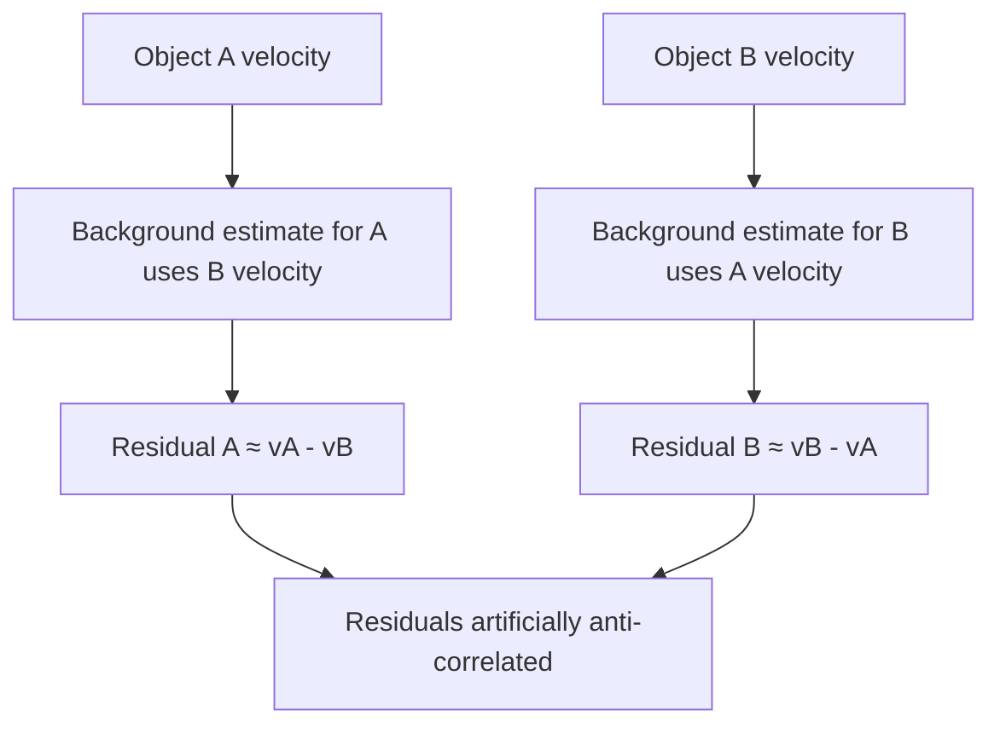

+++
title = "06: It Looked Like Flocking"
date = "2026-08-14T10:30:00+01:00"
draft = false
description = "Nearby Outlier structures move coherently. A spectacular ancestry effect survives multiple controls, then collapses when distance, time and local density are finally compared fairly."
weight = 6
categories = ["Programming", "Artificial Life"]
tags = ["Digital Life", "Artificial Life", "Outlier", "Collective Motion", "Causality", "Controls", "Confounds", "Experimental Method"]
series = ["Digital Life From First Principles"]
has_colab = true
chapter_status = "final"
+++

The previous chapter ended with a warning: a deliberately simple swarm could look organized, move coherently and preserve a measured regime without giving us anything we were prepared to call digital life.

We then went back to Outlier and almost immediately saw structures moving together — not merely outward with the expanding front, but with what looked like stronger coordination among structures sharing recent causal history. The biological noun arrived immediately: **flocking**.

This time we knew how dangerous the picture was.

But Outlier gave us a reason to investigate rather than dismiss it. Published work had already established causal self-replication in this automaton,[1][2] and our smaller reconstruction had recovered branching causal recurrence under its stated criterion. We already had a causal graph, so motion and ancestry could be measured separately.

So we asked:

> **Do structures sharing recent causal history also show stronger dynamical coherence?**

We turned the impression into a measurement.

The coherence was real.

Our first explanation for it was not.

---

## The Observation

We did not begin by asking whether Outlier satisfied every formal definition of flocking from swarm biology or active-matter physics. We asked something narrower:

> **Do nearby persistent structures move in unusually similar directions?**

To answer that, we first had to turn visible movement into data. Using the causal graph, we followed plausible cluster continuations through time. Each tracked structure gave us a position, a direction of travel, a time and a causal identity.

Across the run this produced:

```text
13,635 motion tracks
633,808 motion observations
```

The tracks lasted at least eight generations.

`Velocity` here is not a variable inside Outlier. It is something we measure from the displacement of a tracked structure through time.

To compare the directions of two structures, normalize their velocity vectors and take the dot product:

$$
A_{ij}
=
\frac{v_i}{|v_i|}
\cdot
\frac{v_j}{|v_j|}
$$

The result is simple:

```text
+1    same direction
 0    no directional agreement
-1    opposite directions
```

We compared structures observed at the same time and at nearby spatial separations, using a spatial index rather than comparing every structure with every other one. That was partly a performance decision and partly a better experiment: structures on opposite sides of the universe tell us nothing about local collective motion.

One distinction runs through the whole chapter. *Short-range directional alignment* is a measurement. *Flocking* is an interpretation. The question is whether the second is licensed by the first.

---

## The First Result

At short range, the result was strong. Observed directional alignment was approximately: `0.74` on a scale from `-1` to `+1`. A velocity-shuffled control was much lower.



So the visual impression was not imaginary. Nearby tracked structures in this run really did move coherently. That is the observation. The explanation remained open.

---

## Not Just Expansion

Outlier expands, and that immediately gives us an obvious alternative explanation. Structures sitting on the same expanding front may have similar velocities simply because they are being carried outward together. Two pieces of debris riding the same circular wave can have beautifully aligned motion without ever interacting.

If that explained the result, our `0.74` would amount to an elaborate measurement of the fact that Outlier grows. So we removed the radial component of each structure's motion — the part pointing directly away from the centre of expansion — and measured alignment again using only what remained. If global expansion alone explained the coherence, the effect should collapse. It did not.

```text
raw short-range alignment        0.7373
radial-subtracted alignment      0.7427
shuffled residual control        0.1933
```

The small change from `0.7373` to `0.7427` is not interpreted here. The important result is that removing the global radial field did not remove the short-range coherence. And the shuffled residual control remained much lower, so the subtraction itself had not simply manufactured agreeable vectors.



One simple explanation had failed:

> **Global radial expansion alone does not explain the observed coherence.**

That made the phenomenon more interesting. It still did not make it flocking. We needed an explanation for why nearby structures moved together. Outlier already gave us one possibility the decoy swarm did not. Ancestry.

---

## Maybe It Is Ancestry

*Now There Are Two* left us with an uncomfortable published result: causal self-replication in Outlier can involve spatially separated components. That does not establish that those components constitute one natural individual — we were careful about this then, and remain careful about it now. But it makes a narrower idea testable:

> **Do structures sharing recent causal history also move more coherently?**

If they did, the motion might reflect some continuing causal organization rather than merely local geometry — and it would require no imported social mechanism from biology.

To test that, we assigned each cluster its most recent identifiable `c2` ancestor. A `c2` cluster began a new family; otherwise the label propagated through the causal graph.

Coverage was extremely high. Of `138,891` clusters, `138,132` were assigned a recent `c2` ancestor. Of the `633,808` motion observations, `633,696` carried a family label.



That gave us an unusually complete ancestry label for the moving structures. It explained nothing by itself. A useful label is not an explanation. So we compared motion.

---

## A Very Exciting Result

Our first ancestry comparison looked spectacular. After subtracting a local background flow:

```text
same recent-c2 family          0.828
different recent-c2 family   -0.349
```

Same-family structures appeared strongly aligned. Different-family structures appeared strongly anti-aligned. For a moment it looked as though causal families were behaving like distinct dynamical units. But the negative number was too good. Our hypothesis predicted stronger alignment among relatives. It did not predict that unrelated families should actively move against one another. That was the clue. Our experiment was wrong.

---

## Our Control Was Wrong

To measure motion relative to the local environment, we estimated a background flow around each structure. When judging object `A`, we excluded members of `A`'s own family from that background estimate. That sounded sensible: relatives should not define the background against which one another are tested.

But now consider a different-family pair. Suppose `A` belongs to family α and `B` belongs to family β. `B` is not in `A`'s family, so `B` contributes to the background used for `A`. And `A` contributes to the background used for `B`.

In the simplest case:

$$
r_A \approx v_A-v_B
$$

while:

$$
r_B \approx v_B-v_A
$$

and therefore:

$$
r_B \approx -r_A
$$



We had built anti-correlation into the estimator. The `-0.349` was not evidence that different causal families opposed one another. It was partly a property of our arithmetic. The measurement was using the tested pair to manufacture the background against which that same pair was evaluated. The control itself had become a confound. That is worth remembering. Controls are not external guarantees that an experiment is correct. They are part of the experimental machinery, and they can be wrong too.

---

## The Effect Survived the Fix

The repair was straightforward once we could see the problem. When testing a pair drawn from families α and β, we estimated the local background while excluding **both** families. Now neither member of the tested pair could help manufacture the other's residual.

The pathological negative result disappeared. Unfortunately, the ancestry effect did not. The corrected analysis gave:

```text
same recent c2 ancestor        0.746
very close c2 ancestry         0.101
close c2 ancestry              0.032
distant c2 ancestry            0.135
very distant c2 ancestry       0.081
```

The first category means that the pair shares the same most recent identified `c2` ancestor. The remaining categories contain different-family pairs grouped by separation in the causal graph. So `different family` does not mean causally unrelated. It means the pair does not share the same most recent identified `c2` ancestor under this procedure.



The estimator bug was real, and fixing it removed the artificial anti-alignment. But the main contrast still looked enormous. The nearest different-family category sat around `0.101` while same-family pairs sat at `0.746` — an apparent gap of: `0.645` on a scale bounded at `1.0`. By now the ancestry explanation had survived:

```text
a shuffled-motion control
radial-expansion subtraction
a discovered estimator bug
a corrected estimator
```

It looked increasingly convincing. And then we checked distance.

---

## The Four-and-a-Half-Cell Problem

Structures sharing the same recent `c2` ancestor were separated, on average, by about:

> **4.5 cells**

Structures in the other causal groups were generally tens of cells apart.

That changes everything. Same-family pairs tend to be recent descendants, and recent descendants have not had much time to move apart. So family membership and distance were entangled:

```text
same family
    ↓
usually closer together

closer together
    ↓
usually more coherent
```

And therefore:

```text
same family
    ↓
appears more coherent
```

even if ancestry itself contributes nothing.

We already knew that coherence was strongest at short range. That was the first result in the chapter. So our spectacular ancestry effect might have been rediscovering something we had known all along: nearby things move more similarly than distant things.

Nothing about the `0.645` contrast was fabricated. Same-family pairs really did move more coherently in the raw comparison. The problem was the explanation we wanted to attach to it:

> **because they are related**

The measurement was real. The causal interpretation was not identified. Comparing like with unlike gives you a difference; it does not tell you which difference is responsible.

To test ancestry, we had to compare like with like.

---

## Compare Like With Like

So we rebuilt the comparison. For every same-family pair, we compared different-family pairs observed at similar:

```text
time
distance
local density
```

The pair-excluded background-flow correction remained in place. Now ancestry could differ while those three measured differences were held approximately fixed. Matching makes the comparison fair with respect to those measured variables; it does not eliminate every possible unmeasured difference in local environment.

The precise binning and matching machinery belongs in the Experimental Note and appendix. The scientific question is simpler:

> **At similar times, at similar distances and in similar local environments, do members of the same `c2` family move more coherently than members of different families?**

One methodological point does belong here. Because the run had been preserved as a queryable experimental specimen, discovering the confound did not require rerunning the entire world. We could ask a better question of the same evidence. That made correction cheap enough to actually happen.

The first matched result, taken across the full range of separations present in the data, was:

```text
same-family          0.1515
different-family     0.1588
difference          -0.0073
```

The ancestry advantage was gone. After matching on time, distance and local density, same-family pairs no longer showed additional positive coherence. The point estimate was slightly negative. That should have been the end. It was not. Matching can only answer questions where comparable observations actually exist, and we had not yet checked where that was true.

---

## Where Comparison Is Actually Possible

Matching cannot manufacture controls. If same-family pairs dominate one distance range and different-family pairs dominate another, then the comparison is meaningful only where both groups actually occur. Outside that overlap there is no counterfactual to recover, and a global-looking number can answer a much narrower question than its formatting suggests.

That mattered here because same-family pairs were concentrated at the shortest separations — exactly where different-family controls were sparse.

So we measured the overlap directly. The full pair dataset contained:

```text
2,617,077 usable pair records
```

We examined distance bins:

```text
0–4
4–8
8–12
12–16
16–24
24–32
32–48
48–64
64–96
```

and declared a simple support rule:

> **A distance bin must contain at least 100 same-family and 100 different-family raw pair records.**

The largest contiguous region satisfying that condition was:

```text
[4, 64) cells
```



Inside that distance range, matching imposed an additional condition: a particular time × distance × density stratum contributed only when both groups were actually represented.

The important boundary is at the short end. The `0–4` cell regime lies **outside** the primary support region, so the matched analysis cannot tell us what ancestry does there.

That cuts both ways. We cannot claim an ancestry effect at 0–4 cells. We also cannot claim to have ruled one out.

---

## Inside the Region We Can Compare

The analysis above used every separation present in the data. This one is restricted to the supported range, and reports it separately.

Within `4–64` cells, the raw data still favoured the ancestry interpretation:

```text
same-family mean           0.1732
different-family mean      0.1166
raw difference            +0.0566
```

So merely removing the unsupported shortest-distance regime did not make the association disappear. The critical step was matching comparable observations. After matching on time, distance and local density:

```text
matched same-family mean        +0.150823
matched different-family mean   +0.157890
pair-weighted matched effect    -0.007067
```

The analysis used:

```text
64,948 matched pairs per group
659 matched strata
```

The raw positive difference of `+0.0566` became `-0.0071` after matching.



A second summary gives every matched stratum equal weight rather than allowing larger strata to contribute more heavily. That estimate was: `-0.026463`. Bootstrapping the `659` stratum-level effects gave:

```text
95% stratum-bootstrap interval

[-0.066450, +0.012172]
```

The uncertainty calculation is performed at the stratum level rather than treating millions of pair records as independent observations.

The important scientific result does not depend on a significance threshold. Inside the region where we can make the comparison, the large positive ancestry association disappeared once time, distance and local density were matched.

For scale, the upper positive end of the bootstrap interval, `+0.0122`, is only about **1.9%** as large as the earlier apparent `0.645` contrast. That is not a formal claim that matching removed exactly 98.1% of one directly comparable effect: the earlier contrast and the final matched estimand are not identical. The directly comparable result is simpler:

> **Within the supported 4–64 cell region, a raw same-family advantage of `+0.0566` became `-0.0071` after matching on time, distance and local density.**

The support threshold of 100 records per group was our choice, so we varied it. At a lower threshold the supported region widens and the matched effect stays negative; at higher thresholds the region and the effect are unchanged. The figures are in the Experimental Note.

The collapse is not a fragile consequence of one convenient threshold. The large ancestry-associated coherence effect did not survive the fair comparison.

---

## What We Still Cannot Answer

The `0–4` cell regime remains different.

Structures sharing a recent `c2` ancestor are concentrated at extremely short range. If an ancestry-specific effect exists anywhere, this is an obvious place to look for it. It is also exactly where the controls become inadequate.

```text
same-family pairs
are common there

different-family controls
are too sparse
for the same comparison
```

We cannot say ancestry has no additional effect at 0–4 cells. We cannot say that it does. Converting an absence of adequate comparison into negative evidence would be the same category of error we have spent the chapter correcting, just pointing the other way.

The correct status is:

> **UNRESOLVED**

`UNRESOLVED` is not an embarrassed version of `NO`. It means the experiment does not contain the comparison required to answer the question.

That boundary is part of the result.

---

## So Was It Flocking?

Not on this evidence. But simply saying *no* throws away most of what we learned. The result is layered:

| Question                                           | Result                                  |
| -------------------------------------------------- | --------------------------------------- |
| Short-range directional coherence                  | **Measured — about 0.74**               |
| Explained by global radial expansion alone         | **No**                                  |
| Large family-associated coherence effect           | **Collapses under fair matching**       |
| Additional family-associated coherence, 4–64 cells | **Not supported by matched comparison** |
| Ancestry effect, 0–4 cells                         | **Unresolved**                          |
| Biological-style flocking                          | **Not established**                     |

The mistake was not seeing coherent motion. That was real.

The mistake was promoting one observation through a chain of increasingly strong interpretations:

```text
coherent motion
→ ancestry-dependent coherence
→ coordinated causal family
→ flock
```

Those are not the same claim. By the end of the analysis, three things that had looked like one thing were separable:

```text
motion coherence
≠
ancestry-dependent coherence
≠
flocking
```

---

## The Phenomenon Did Not Die

This is the most important part.

> **Short-range motion coherence is a measured feature of this run.**

The estimates remain:

```text
raw alignment                 0.7373
radial-subtracted alignment   0.7427
shuffled residual control     0.1933
```

Nothing in the ancestry analysis removes those observations. What collapsed was our explanation for them.

And the surviving phenomenon is still remarkable when we remember what Outlier contains at the substrate level: binary cells, local neighborhoods, one deterministic update rule. There is no velocity variable. No steering force. No alignment rule. No flocking controller. Nothing in the rule's 512 bits mentions direction, neighbours-to-follow, or collective behaviour of any kind.

Yet structures arise whose motion is strongly coherent at short range, and the effect remains after removing the most obvious global explanation. The bounded result is therefore:

> **In this run, detected persistent structures exhibit strong short-range directional alignment, and global radial expansion alone does not explain that alignment.**

That is worth keeping.

There is also another possibility we have not tested. Perhaps the coherence belongs less to independent objects and more to a propagating spatial process through which our detected structures happen to move. A different experiment could test that — for example, by asking whether correlations acquire a systematic lag with distance.

We did not run that experiment here. So that possibility remains:

> **open**

---

## What Did Not Change

None of this retracts the causal result from *Now There Are Two*. The 144 detected `c2` occurrences, the causal graph and the branching return structure remain exactly what they were. Our claim there remains what it was — branching causal recurrence under our stated causal criterion — and the stronger published self-replication result remains the published result.

What failed here was a later attempted promotion:

```text
shared causal ancestry
→ coordinated collective unit
```

The ancestry remains. The coordination claim does not.

Within the supported comparison region, recent-family membership provides no detectable additional positive coherence after matching on time, distance and local density. That is narrower than saying ancestry can have no relationship whatsoever to motion. Proximity itself may lie on a pathway connecting common history to shared dynamics, and this experiment was not designed to separate every such pathway.

The individuality question therefore remains difficult. Connected geometry was already insufficient. This chapter adds another warning:

```text
connected geometry
is not enough

causal ancestry alone
is not enough
```

If causal relatives had retained distinctive motion after the controls, that would have strengthened the case that a causal family behaved as a meaningful dynamical unit. That evidence did not survive.

---

## Build the Comparison First

Every major correction in this chapter found a problem in our interpretation or analysis rather than removing the underlying phenomenon. In retrospect, each confound looks obvious. None was obvious before the evidence forced us to confront it.

The important number is not `0.645`. It is what happened when we finally compared like with like.

We lost the flocking interpretation. We kept the motion-coherence phenomenon.

Outlier's richness is both its strength and its limitation as an experimental instrument. Geometry, ancestry, distance, expansion and local environment all emerge together. Same-family tends to mean close. Close tends to mean coherent. Everything is expanding. So every control in this chapter tried to disentangle variables after the world had already produced them together — and even careful matching could not answer the shortest-range ancestry question, because the necessary comparison group simply was not present.

The previous chapter pointed toward another way to work:

> **Build the comparison into the experiment before the world runs.**

Build a world where one mechanism can change while the others remain fixed. Where the same system can be rerun with one component removed. Where *does history matter here?* can be answered by constructing two histories rather than searching an already entangled world for examples that happen to differ in the right way.

That is not Outlier. And that is not a criticism of Outlier. It is a different instrument for a different job.

The next world will begin with almost nothing. Not:

```text
repair
memory
reproduction
individuality
collective motion
```

But something simple enough that if any of those appear, we can ask what produced them.

Outlier showed us that surprising causal organization can arise without us explicitly programming the organization itself. This chapter showed the other side of that richness. When geometry, ancestry, motion, expansion and environment emerge together, discovering a phenomenon can be easier than identifying its cause.

So we go back to a simpler system and change one thing at a time. The next experiment begins with a crystal.

---

## Experimental Note

All measurements in this chapter come from the same `512 × 512`, 1,600-generation Outlier run used for the earlier causal analysis.

### Tracking

The motion analysis recovered:

```text
13,635 tracks lasting at least eight generations
633,808 motion observations
```

Velocity is operationally defined from tracked displacement through time rather than being a variable in the cellular automaton. Pairs were constructed using a spatial index restricted to nearby separations rather than by exhaustive all-to-all comparison.

### Family assignment

Each cluster was assigned its most recent identifiable `c2` ancestor.

Of `138,891` clusters:

```text
138,132 assigned
10 ambiguous
749 unassigned
```

Of `633,808` motion observations: `633,696` carried a family label.

An earlier family definition using four descendants of one early `c2` produced too few different-family comparisons and was not used for the final analysis.

### Radial control

The global expansion control subtracts, from each velocity, the component along the radial direction from the expansion centre:

$$
r_i
=
\frac{x_i-c}{|x_i-c|}
$$

The reported values were:

```text
raw short-range alignment        0.7373
radial-subtracted alignment      0.7427
shuffled residual control        0.1933
```

The small increase after radial subtraction is not interpreted.

### Pair-excluded background flow

The initial local-background estimator excluded only the focal object's own family. For different-family pairs this allowed each tested member to contribute to the other's background estimate, creating an artificial anti-correlation. The corrected estimator excludes both tested families from both local background estimates.

Before that correction:

```text
same recent-c2 family           0.828
different recent-c2 family     -0.349
```

After correction, the genealogy categories were:

```text
same recent c2 ancestor         0.746
very close c2 ancestry          0.101
close c2 ancestry               0.032
distant c2 ancestry             0.135
very distant c2 ancestry        0.081
```

The exact genealogical bin definitions are given in the accompanying experimental record.

### Matching

The full motion analysis contained:

```text
2,617,077 usable pair records
```

The final comparison matched same-family and different-family observations within:

```text
simulation-time bins
spatial-distance bins
local-density bins
```

Local density was measured using the existing pair-construction pipeline with a 32-cell neighbourhood. The pair-excluded background-flow correction remained active during matching. Matching was performed only in strata containing both same-family and different-family observations, with equal numbers drawn from the two groups within each contributing stratum.

Matching equalizes the measured variables it is given. It does not remove unmeasured differences in local environment, and no claim is made that it does.

Two matched analyses are reported. The first uses every separation present in the data and gives `0.1515` against `0.1588`, a difference of `-0.0073`. The second is restricted to the common-support region below and is the analysis the chapter's conclusion rests on.

### Common support

Raw support was evaluated over distance bins:

```text
0–4
4–8
8–12
12–16
16–24
24–32
32–48
48–64
64–96
```

The primary operational rule required at least:

```text
100 same-family records
100 different-family records
```

in each distance bin.

The largest contiguous region satisfying that criterion was:

```text
[4, 64) cells
```

The `0–4` cell region therefore remains unresolved. Inside the supported distance region, matching imposed the additional requirement that each time × distance × density stratum contain observations from both groups.

### Final matched estimates

Within `4–64` cells, the raw descriptive comparison was:

```text
same-family mean          0.1732
different-family mean     0.1166
raw difference           +0.0566
```

After matching:

```text
matched same-family mean        +0.150823
matched different-family mean   +0.157890
pair-weighted effect            -0.007067
```

using:

```text
64,948 matched pairs per group
659 matched strata
```

Giving every matched stratum equal weight produced:

```text
equal-stratum effect            -0.026463
```

Bootstrapping the 659 stratum-level effects gave:

```text
95% interval
[-0.066450, +0.012172]
```

The bootstrap treats matched strata, not individual pair records, as the resampling units.

### Support-threshold sensitivity

The common-support threshold was also varied.

At a minimum bin count of `50`, the supported distance range expanded to `4–96` cells and the pair-weighted matched effect was:

```text
-0.0058
```

At thresholds of:

```text
100
250
500
```

the supported region remained `4–64` cells and the corresponding pair-weighted matched effect remained approximately:

```text
-0.0071
```

The conclusion therefore does not depend on the primary threshold of 100 observations per group. Detailed equal-stratum estimates and bootstrap intervals for each threshold are in the appendix.

### Scope

The pair-weighted and equal-stratum estimates are different estimands. The reported `[-0.0665, +0.0122]` interval belongs to the equal-stratum estimand and describes uncertainty under this within-run stratum-bootstrap procedure. It does not measure variation across independent Outlier seeds, larger worlds, longer runs or alternative rule configurations.

The published causal study operated at `1024 × 1024` for 20,000 updates. Our experiment used `512 × 512` for 1,600 generations. Nothing here establishes that the motion-coherence result generalizes to the larger published regime.

Full tracking, family-assignment, background-flow, matching, support and resampling procedures are given in the appendix and accompanying experimental record.

---

## References

**[1]** Yang, B. *Emergence of Self-Replicating Hierarchical Structures in a Binary Cellular Automaton.* Artificial Life 31(1), 96–105 (2025). doi:10.1162/artl_a_00449

**[2]** Hintze, A. & Bohm, C. *Rethinking self-replication: detecting distributed selfhood in the Outlier cellular automaton.* npj Complexity 3, 11 (2026).