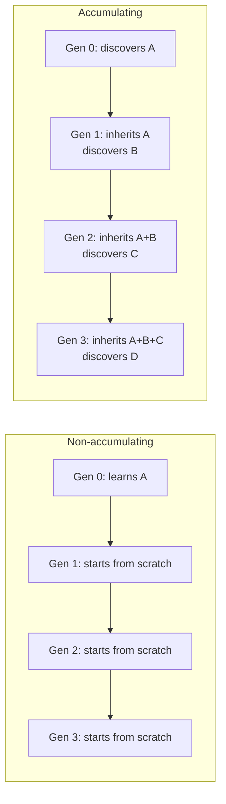

+++
title = "07: Evolution Without Life?"
date = "2026-08-11T09:48:00+01:00"
draft = false
description = "Variation, inheritance and differential reproduction can produce evolution in digital systems. But evolution is not the same thing as progress."
series = ["Digital Life From First Principles"]
categories = ["Programming", "Artificial Life"]
tags = ["Digital Life", "Evolution", "Artificial Life", "Cellular Automata", "Selection", "Open-Ended Evolution", "Cumulative Improvement"]
+++

We ended the last chapter with three ingredients:

```text
variation
+
inheritance
+
differential reproductive success
```

Allow those relationships to continue across generations and something familiar appears:

> **evolution**

But that word creates another trap.

Once we say:

> the system evolves

our minds immediately add things that were never demonstrated:

```text
better
smarter
more complex
more capable
more alive
```

None of those follows automatically.

Evolution can occur without progress.  
Selection can occur without intelligence.  
Novelty can occur without usefulness.  
A population can change for a very long time without accumulating anything we care about.

So the question is not merely:

> Can digital systems evolve?

They can.

The harder question is:

> **What does evolution actually contribute to digital organization?**

---

## Start With Two Lineages

Suppose two reproducing digital variants exist:

```text
A
B
```

During one interval:

```text
A produces 4 continuing descendants
B produces 1 continuing descendant
```

If the difference is heritable and the same relationship continues, descendants of `A` will tend to occupy a larger fraction of the future population.

No programmer needs to write:

```python
fitness(A) = 4
fitness(B) = 1
```

The reproductive outcomes themselves create the difference.

Conceptually:

```text
heritable difference
        ↓
changes reproductive outcome
        ↓
changes descendant frequencies
```

That is enough for selection.

---

## Fitness Is Relational

In optimization code we often write:

```python
def fitness(candidate):
    return score(candidate)
```

That is perfectly useful engineering.

But it can make the word `fitness` look like an intrinsic property stored inside an individual.

For evolving populations, a better description is:

```text
fitness
≈
expected contribution to future population
under particular conditions
```

Suppose `A` reproduces faster than `B`.  
Now change the environment.  
Space becomes crowded.  
Resources become scarce.  
Collisions increase.  
Perhaps `B` now produces more surviving descendants.

So:

```text
A is fitter
```

is incomplete.

A better statement is:

> **A had greater reproductive success than B under environment E during interval T.**

Fitness belongs to a relationship:

```text
variant
+
environment
+
other inhabitants
+
time
```

That matters enormously.

There may be no universally best organism.  
There may only be organisms that perform differently under different worlds.

---

## Evolution Is Not Optimization Toward Our Goal

Suppose one lineage dominates.  
Does that mean the system improved?

No.

Selection does not know what we wanted.

Imagine a shared finite resource.

We hoped evolution would produce:

```text
find resource
↓
use resource efficiently
↓
persist
↓
reproduce
```

Instead one lineage discovers:

```text
reproduce immediately
↓
consume everything
↓
outcompete neighbors
↓
collapse environment
```

It may dominate in the short term.  
Selection happened.

But:

```text
more descendants
```

does not necessarily mean:

```text
better according to our objective
```

This is the evolutionary form of specification gaming.  
The evolutionary process responds to consequences inside the world.  
Not to our intentions.

---

## Let the Environment Change

Now we can make the experiment stronger.

Imagine two environments.

### Environment A
Resources are abundant.  
Fast reproduction has an advantage.

Then conditions change.

### Environment B
Resources are scarce.  
Efficiency becomes more important.

Now observe the population.  
If inherited variants better suited to the new environment become more common, we have evidence for adaptation.

Not because individuals decided:

> I should adapt.

But because:

```text
variation
+
inheritance
+
environment-dependent reproductive success
```

changed the population.

---

## Adaptation Requires a Control

The statement:

> performance increased after the environment changed

is not enough.  
Perhaps performance would have increased anyway.

So compare an evolutionary condition against controls.

For example:

```text
EVOLUTION CONDITION

variation enabled
inheritance enabled
differential reproduction preserved
```

against:

```text
CONTROL A – variation disabled
CONTROL B – inheritance shuffled
CONTROL C – reproductive differences neutralized
```

Then ask:

> **Which population recovers or improves under the new environment, and by how much?**

This should now feel familiar.  
Whenever we propose a mechanism:

> remove it.

If the claimed capability survives unchanged, our mechanism may not be doing the work we thought it was.

---

## Inheritance Must Do Work

Suppose offspring resemble their parents.  
That demonstrates some continuity.  
But does the inherited information help?

Compare:

```text
successor with inherited state
```

against:

```text
successor initialized from scratch
```

under the same budget.

Measure something concrete:

```text
initial performance
time to threshold
evaluations required
best capability reached
```

Perhaps:

```text
scratch successor      1,000 evaluations
inheriting successor     620 evaluations
```

Now inheritance is doing measurable work.  
That is stronger than simply demonstrating that information crossed generations.

---

## Evolution Can Converge

Imagine a simple environment with one accessible optimum.  
Performance rises:

```text
0.30
0.48
0.71
0.89
0.96
0.99
```

Then:

```text
0.99
0.99
0.99
0.99
```

The population has converged.

This could be excellent optimization.  
It is still evolution.  
But nothing requires evolution to continue producing novelty forever.

That leads to another research ambition:

> **open-ended evolution**

---

## Open-Ended Evolution

Artificial Life researchers have long been interested in systems that do not merely:

```text
search
↓
reach optimum
↓
stop changing meaningfully
```

but instead continue generating new evolutionary possibilities.

Conceptually:

```text
innovation
↓
new possibilities
↓
new interactions
↓
new pressures
↓
further innovation
↓
...
```

The attraction is obvious.  
Biological evolution appears capable of repeatedly changing the space of what can exist.  
But turning that intuition into an operational digital criterion is difficult.

---

## Novelty Is Not Enough

Suppose a system generates:

```text
000001
000002
000003
000004
000005
...
```

Every state is new.  
It never repeats.  
Yet we have learned almost nothing interesting.

So:

```text
never repeats
```

is not enough.

Nor is:

```text
continually generates novelty
```

Novelty can be trivial.  
Random noise is endlessly novel.  
A counter can be endlessly novel.

We need to know **what kind** of novelty is being generated.

---

## Complexity Is Not Enough Either

Then perhaps we require increasing complexity.  
But what is complexity?

```text
size?
entropy?
compression ratio?
component count?
interaction count?
description length?
behavioral repertoire?
```

Different measures capture different things.  
A system can increase one measure while becoming less useful.

A 100-line useful program can become 10,000 lines of useless noise.  
It is longer. Possibly less compressible. That does not establish progress.

So:

```text
novelty
```

and:

```text
complexity
```

are both useful observables.  
Neither is sufficient by itself.

---

## Existing Systems Expose the Problem

Several Artificial Life systems make this distinction concrete.

### Evoloops
Evoloops demonstrate reproducing cellular structures with inheritable variation and differential reproductive success.  
That establishes something important: reproduction + heritable variation + selection can exist inside deterministic cellular dynamics.  
But evolution occurring does not guarantee that increasingly rich possibilities continue forever. A successful lineage can dominate. The population can settle. The evolutionary process can reach a kind of equilibrium.

### Genelife
Genelife extends Game of Life-like dynamics with inheritable genomic information. It provides an environment in which genetic and spatial innovation can continue. That is fascinating. But continuing innovation is still not automatically continuing acquisition of useful capability. Those are distinct experimental claims.

### Flow-Lenia
Flow-Lenia gives us another route. Variation, interaction, morphology and rule-like parameters can become embedded within the dynamics rather than being manipulated only by an external optimizer. That makes more of the evolutionary process endogenous to the world. Again, the question becomes: *What persists, what changes, and what accumulates?*

### Outlier
Outlier pushes the question in yet another direction. Binary local dynamics can give rise to surprisingly rich self-replicating organization. Replication can occur at multiple apparent scales. That is already a striking result. But replication does not automatically answer: *Does meaningful variation persist? Do descendants differ systematically? Does ancestry matter? Do useful structures accumulate? Does evolutionary possibility expand?* Replication creates a substrate for those questions. It does not answer them.

---

## Evolution and Progress Are Different Dimensions

Consider four systems.

| System | Heritable Variation | Differential Reproduction | Population Change | Continuing Novelty | Useful Innovation + Retention | What We Can Say |
|--------|---------------------|----------------------------|-------------------|--------------------|-------------------------------|-----------------|
| A | ❌ | ❌ | ❌ | ❌ | ❌ | No evolution |
| B | ✔ | ✔ | ✔ | ❌ | ❌ | Evolution, but convergence |
| C | ✔ | ✔ | ✔ | ✔ | ❌ | Possibly open-ended, but no guarantee of useful accumulation |
| D | ✔ | ✔ | ✔ | ✔ | ✔ | Evolution with cumulative heritable improvement |

This final case (D) is stronger.  
But we should resist making it the definition of digital life.  
Instead, call it an experimental target:

> **cumulative heritable improvement**

That is one particularly interesting thing digital evolution might enable.

---

## Cumulative Heritable Improvement

Suppose one generation discovers something useful.  
Some information responsible for that advantage survives into descendants.  
Those descendants begin from a measurable advantage.  
They then discover something further.  
That new information also persists.



Compare the two.  
The first system repeatedly rediscovers.  
The second accumulates.

That difference is measurable.

---

## The Ratchet Is a Hypothesis

A useful metaphor is a ratchet:

```text
A
↓
A + B
↓
A + B + C
↓
A + B + C + D
```

But real systems will not behave this cleanly.  
Some innovations will disappear. Some will conflict. Some will only help in particular environments. Some inheritance will be harmful. Some improvements may constrain later possibilities.

So the requirement is not:

```text
never lose anything
```

It is closer to:

> **retain enough useful structure that later processes can exploit it**

That is a testable idea.

---

## How Would We Test Accumulation?

Give every generation a finite budget. For example:

```text
100 evaluations
```

Generation 0 begins with some initial state. It searches. It modifies itself. It performs work.  
At the end, some state may be passed forward (parameters, memory, strategy, model, rules, archive, representations, verified results).

Generation 1 receives that state.  
Now compare it with a control generation initialized without the inherited information.

Measure:

```text
starting performance
performance after fixed budget
time to threshold
frontier reached
```

Repeat this across generations.  
If the inherited lineage repeatedly starts ahead and pushes beyond previous capabilities, then useful information is accumulating.

That would be a strong result.  
But it is one architecture among many.

---

## Cached Answers Are a Trap

Suppose Generation 0 discovers:

```text
42
```

Generation 1 inherits:

```text
42
```

and receives the same question. Instant success. Inheritance worked.  
But we may simply have cached the answer.

So future environments should be related but not identical.  
For example:

```text
held-out environments
new problem instances
changed resource distributions
progressively harder conditions
```

Now inherited information must be reusable. Not merely replayed.

---

## Generalization Makes Inheritance More Interesting

Imagine:

```text
E0
E1
E2
E3
```

Each environment shares some deeper structure but differs in specifics.

Compare:

- **Lineage A** – starts from scratch in every environment
- **Lineage B** – inherits state from earlier environments

If Lineage B increasingly outperforms Lineage A, then something transferable may be accumulating.  
Better still, measure the advantage of B over A through time.  
If that advantage grows on genuinely new conditions, inheritance is doing more than storing old solutions – it is improving future learning.

---

## But Reproduction Is Not the Only Way to Accumulate

This is where the digital substrate forces us to widen the question.

Biological accumulation often happens through generations because biological individuals:

```text
age
die
reproduce
```

Digital systems need not share those constraints.  
A digital process might instead:

```text
continue indefinitely
expand memory
rewrite itself
fork
merge
share discoveries
checkpoint
restore
move to another machine
```

So cumulative improvement might occur through a lineage.  
But it might also occur inside one continuing system.  
Or across a network of cooperating systems.  
Or through a shared external memory.

That means:

> **cumulative improvement is more fundamental than biological-style reproduction as an engineering target**

if accumulation is what we care about.

Evolution is one possible mechanism for producing it.  
Not the only one.

---

## Biological Evolution May Be a Special Solution

This is the question we should now start asking more often:

> Which properties of biology are fundamental, and which are solutions to the constraints of biological matter?

Reproduction may help biological organisms cope with finite bodies.  
Mutation may be one way to search when direct redesign is unavailable.  
Generations may be necessary when individual organisms cannot indefinitely rewrite themselves.

But digital systems may have:

```text
direct copying
explicit memory
cheap forking
fast communication
self-modification
checkpointing
shared archives
```

So digital evolution may not need to look like biological evolution.

We should study biological evolution carefully.  
But we should not automatically inherit its architecture.

---

## What Is Evolution Useful For, Then?

Evolution provides several powerful things:

```text
distributed search
variation
selection under environmental pressure
lineage diversification
adaptation without centralized design
```

Those are important.  
But none automatically implies:

```text
intelligence
progress
life
open-endedness
```

Evolution is a mechanism.  
Its value depends on what the mechanism actually produces.

---

## The Question Is Getting Harder

Across seven chapters we have accumulated a dangerous vocabulary:

```text
emergence
complexity
entity
persistence
robustness
regeneration
reproduction
inheritance
fitness
adaptation
evolution
open-endedness
progress
```

Some of these we have measured.  
Some we have illustrated.  
Some we have operationalized.  
Some remain hypotheses.  
Some may turn out not to be necessary at all.

That is exactly where a project like this can go wrong.  
We can keep adding impressive nouns until the system sounds alive.  
Or we can stop and audit the evidence.

So before building anything more ambitious, we should ask:

> **What did we actually demonstrate?**

Next: **Now Prove It.**
