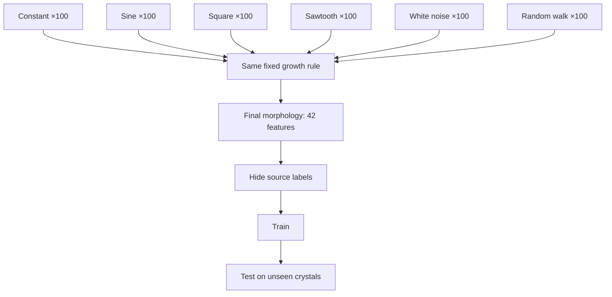
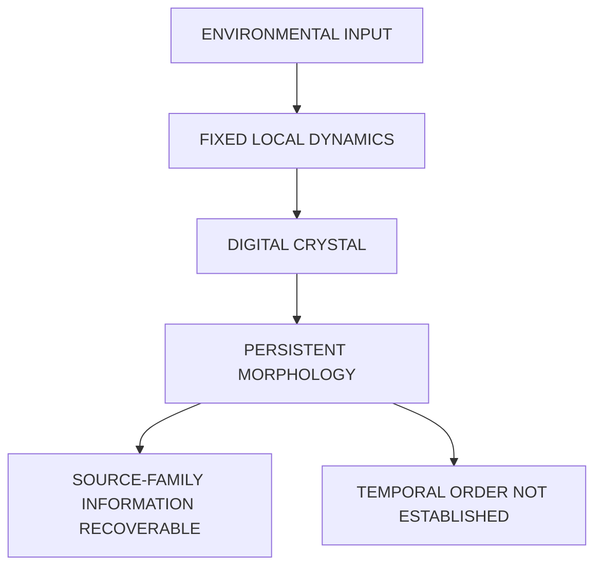

+++
title = "07: The Digital Crystal"
date = "2026-08-14T11:00:00+01:00"
draft = false
description = "We build the smallest laboratory that will hold an experiment: one seed, a hexagonal lattice, local attachment. Then we let an environment touch it and ask what the finished structure still carries."
weight = 7
series = ["Digital Life From First Principles"]
categories = ["Programming", "Artificial Life"]
tags = ["Digital Life", "Artificial Life", "Digital Crystal", "Crystal Growth", "Morphology", "Information", "Experimental Method"]
+++

Outlier was the wrong laboratory for the question we now wanted to ask.

Nothing in the previous chapters is retracted. Outlier had shown us what computation could support.

But by the end of the flocking investigation, another problem had become unmistakable: Outlier was much better at producing phenomena than at isolating them. Geometry, ancestry, distance, expansion and local environment all arose together from the same 512-bit rule.

Matching can recover some comparisons after a world has already run.

Now we want to build the comparison first.

Hold everything we can fixed.

Change one mechanism deliberately.

Measure what changes with it.

There is one idea worth carrying across from Outlier, and it is much smaller than an organism:

```text
local computation
↓
repeated interaction
↓
larger-scale organization
````

That is all we need to import.

Not Outlier's reproduction.

Not its causal families.

Not its geometry.

Only the demonstrated possibility that local rules can generate organization we did not explicitly represent.

What we want from the new system is a short list:

```text
every rule is known
every state can be inspected
one mechanism can be changed at a time
counterfactual worlds can be rerun
the full history can be preserved
```

And an equally important list of what we refuse to build:

```text
organism
memory
repair
reproduction
metabolism
individual
```

We want to leave those concepts out of the machinery entirely.

Then, if anything resembling them appears, we can ask whether the simpler system actually produced it.

**The laboratory must not contain the answer.**

The first laboratory is going to be almost embarrassingly small.

---

## One Seed

A hexagonal lattice.

Every location holds `0` or `1`.

Every location has six immediate neighbours.

At the centre, one occupied location:

```text
●
```

Everything else is empty.

The rule:

> **An empty location becomes occupied if at least one neighbouring location is occupied. Once occupied, it stays occupied.**

That is the entire system.

One seed.

One local attachment condition.

Irreversible occupancy.

Time.

There is no target morphology and no higher-level object directing the growth.

Hexagonal geometry is a convenience rather than a claim. Six equidistant neighbours make local reasoning cleaner than a square grid's awkward distinction between edge and corner adjacency. Using axial coordinates `(q, r)`, the neighbourhood is simply six fixed offsets.

Run the system and the structure grows in expanding hexagonal shells.



Nothing anywhere says *make a hexagon*.

After `t` updates, every location within hexagonal graph distance `t` of the seed is occupied. The global shape follows from neighbourhood topology and uniform local propagation.

No cell holds a blueprint.

No controller measures the radius.

Nobody draws the six sides.

Nothing surprising has happened yet.

That is useful.

The bounded result is simply:

> **Under this rule, one seed produces ordered expanding geometry through repeated local attachment alone.**

The hexagon is not evidence of sophistication.

It is the baseline against which later deviations will become measurable.

---

## Growth Is Cheap

Now measure it rather than admiring it.

For a perfect hexagonal ball of radius `r`:

$$
N(r)=1+3r(r+1)
$$

giving:

```text
r = 0    1
r = 1    7
r = 2   19
r = 3   37
r = 4   61
```

The radius grows linearly with time.

The occupied area grows quadratically.

The measured population follows the closed-form law exactly.



So the structure gets steadily larger and not one bit more interesting.

A million-cell structure produced by this rule is no more conceptually complicated than a seven-cell one. The generative description is identical. Only the number changes.

```text
larger
≠
more complex
```

Size is the cheapest possible impressive-looking result.

A second distinction appears almost for free:

```text
continued construction
≠
reproduction
```

The structure can keep extending from one seed without producing a second independent copy.

That does not tell us whether reproduction matters to digital life.

It tells us that growth and reproduction are separate computational possibilities.

They therefore deserve separate experiments.

That is why this laboratory begins with growth.

We can study **continued process before reproduction** instead of assuming the biological ordering in advance.

---

## The First Temptation

Before adding anything, it is worth seeing how quickly even this system provokes biological language.

Let the structure grow for twenty generations.

Erase a region from its interior.

Resume the same rule.

The empty cells along the edge of the hole touch occupied cells, so they become occupied. Then newly exposed cells become eligible. Soon the hole is gone.



It looks like healing.

It is not.

The system does not distinguish damage from ordinary empty space. There is no target morphology and nothing representing what the structure is supposed to look like.

The same attachment rule that advances the exterior frontier also fills an interior hole.

So the stronger interpretation disappears:

> **The structure refills missing space through ordinary growth.**

That is not yet repair.

We will return to material loss later with a system and controls designed specifically for that question.

Less exciting.

More informative.

And a useful warning: even a laboratory built specifically to avoid biological assumptions begins generating biological-sounding descriptions almost immediately.

The prototype raises other questions too. Obstacles can leave traces. Multiple seeds can merge. Finite worlds eventually impose limits.

We are going to resist following those branches here.

Each deserves a better experiment later.

For now, the prototype has done its job.

It gives us a transparent process that grows, can be perturbed, and contains almost nothing we did not deliberately put there.

---

## Can the Environment Leave a Mark?

The prototype is almost too predictable.

Good.

A laboratory should begin with a baseline we understand.

What we want next is genuinely different:

> **Can changing external conditions influence growth strongly enough to leave a persistent, measurable signature in the finished structure?**

That question is not askable of the prototype.

Its attachment rule is deterministic and saturating. Every available frontier location fills. There is nowhere for an external signal to matter because every locally permitted event already happens.

So the model has to change.

And this needs to be explicit.

```text
PROTOTYPE

binary occupancy
+ hexagonal neighbourhood
+ irreversible growth
+ deterministic local attachment
```

becomes:

```text
DIGITAL CRYSTAL v1

binary occupancy
+ hexagonal neighbourhood
+ irreversible growth
+ stochastic attachment
+ environmental forcing
+ fixed lattice anisotropy
+ crowding penalty
```

These additions are laboratory design, not experimental findings.

Stochastic attachment gives the environment somewhere to act. If attachment is probabilistic, the current environmental value can shift the odds.

Anisotropy gives the lattice persistent directional structure.

The crowding penalty prevents increasingly crowded frontier sites from receiving an unchecked neighbour-count advantage.

Once Digital Crystal v1 is defined, those mechanisms are frozen.

The experiments below vary the input while keeping the growth mechanism fixed.

That distinction matters because none of the prototype's observations automatically transfer:

> **Results from the prototype do not automatically transfer to Digital Crystal v1.**

The hole-filling result tells us nothing about how this stochastic model responds to damage.

Different model.

Different claims.

Everything from here has to be earned again.

This is where the name **Digital Crystal** becomes useful.

The analogy is mechanistic rather than visual: local interactions during formation accumulate into persistent larger-scale structure.

So we can state a hypothesis rather than a definition:

> **Can a local computational growth process turn characteristics of an external input into persistent, measurable morphology?**

If the answer is no, the name has earned nothing.

If the answer is yes, we can decide what the name is worth afterwards.

The hypothesis is deliberately narrow.

It says nothing about life, memory, learning, adaptation, reproduction, intelligence or agency.

---

## Influence, Not Instruction

The prototype was:

$$
C_{t+1}=G(C_t)
$$

Now introduce an environmental forcing signal:

$$
C_{t+1}=G(C_t,E_t)
$$

The distinction that matters is what the signal is *not* allowed to do.

It does not draw.

Nowhere does anything say:

```python
if signal == "sine":
    draw_sine_shape()
```

That would be a strange plotting library with extra steps.

The same growth mechanism operates under every source. The signal changes only the conditions under which local attachment events occur.

For a candidate frontier cell, the frozen implementation is:

$$
P(\text{attach})
=
\sigma\left(
a
+ bn
+ cE_t
+ d\cos(6\theta + \phi E_t)
- q\max(0,n-2)
\right)
$$

where `n` is the number of occupied neighbours, `E_t` is the current environmental value, and `θ` is the outward-facing direction inferred locally from occupied neighbours.

The signal acts in two places. It weakly shifts overall attachment propensity through `cE_t`, and it rotates the phase of the local six-fold anisotropy through `φE_t`.

Both depend only on the **current scalar value**. Neither receives earlier values, the source family, or the future sequence.

The crowding term begins only when more than two neighbours are occupied.

The logistic function `σ` converts the resulting score into an attachment probability.

The parameters remain frozen throughout the experiment.

There is still:

```text
no target morphology
no drawing routine
no source-family instruction
no stored final form
```

The experimental constraint is simple:

> **The growth mechanism remains fixed while the source changes.**

Otherwise recovering the source would tell us only that we changed the machine.

A conventional graph does this:

```text
value
↓
coordinate
↓
pixel
```

The Digital Crystal does this:

```text
value
↓
local attachment conditions
↓
many stochastic local events
↓
persistent morphology
```

The picture is not drawn from the signal.

It is **grown under its influence**.

No local attachment event receives the family label, the future sequence or the desired final form.

It receives the current local state and the environmental value available at that step.

The environment enters the attachment rule explicitly, so showing that it influences growth would establish almost nothing.

The interesting question is what remains recoverable after that influence has passed through many local stochastic events and become final structure.

First, the least interesting possible check.

Set:

$$
E(t)=0
$$

and run the generalized model.

The baseline reached:

```text
occupied cells      5924
maximum hex radius    44
boundary edges       552
```



That proves nothing except that the machine runs.

Which is all it needs to prove.

---

## Six Environments

Now hand exactly the same growth mechanism six kinds of forcing:

```text
constant
sine
square
sawtooth
white noise
random walk
```

The constant condition is:

```text
E(t) = 0
```

Within the other families, individual instances vary: periods, phases, noise realizations and random-walk trajectories.

At each growth step the crystal receives one scalar.

Not the family name.

Not the history.

Not the future.

One number.



Then grow them.



They look different.

So what?

*Different signals generate different-looking crystals* would make an attractive demonstration and establish almost nothing.

Perhaps one stochastic run happened to become larger.

Perhaps one family creates a higher average attachment probability and we are merely looking at area.

Perhaps our eyes are classifying noise.

We need populations, not specimens.

---

## Six Hundred Crystals

One hundred crystals from each source family:

```text
6 forcing families
×
100 crystals
=
600 crystals
```

Every run used the same frozen growth mechanism, the same 72-step horizon and the same morphology measurement.

The source instance and the ordinary stochastic realization varied.

For every finished crystal we measured 42 properties of its final morphology:

```text
area
perimeter
maximum radius
compactness
boundary roughness
bounding-box aspect
centroid displacement
radial structure
angular structure
six-fold angular structure
boundary-radius variation
...
```

The full feature list is fixed in the experimental record.

None of the 42 features contains the source signal, its history or its family label.

Then hide the labels.

The question becomes concrete:

> Given only the final morphology of an unseen crystal, can we identify which forcing family produced it?

Six classes give a chance baseline of:

```text
16.7%
```

Train the classifiers on one subset.

Test them on crystals they have never seen.



The held-out result:

```text
chance                  16.7%

random forest            52.2%
logistic regression      53.9%
```



Both tested classifiers are far above the six-way chance baseline.

The forcing process has left a recoverable morphological signature under this measurement.

Two substantially different classifier families arrive at similar held-out accuracy. That makes an idiosyncratic decision boundary in one classifier a less satisfying explanation for the result.

The confusion matrix also shows that the information is uneven. Some forcing families leave much more distinctive signatures than others.



The claim to keep is smaller than the excitement it produces:

> **The final morphology contains information that makes forcing-process family recoverable substantially above chance.**

Not *the crystal remembers its history*.

Not *the crystal understands the environment*.

Something about the conditions during formation has survived in a form we can read.

---

## Attack the Boring Explanation

The obvious deflation is that the classifier is not detecting anything interesting about the forcing process at all.

Perhaps it is detecting a trivial aggregate.

Maybe square waves simply have a different average value, alter overall attachment probability, and make larger crystals.

Then we have discovered little more than:

```text
different average input
↓
different amount of growth
```

So remove the simplest version of that explanation.

The varying source families are centred to zero mean by construction before scaling: subtract the sampled mean, divide by the maximum absolute value, then bound the result to the allowed forcing range.

The constant condition remains exactly zero.

For the descriptive morphology comparison, each of the 42 feature dimensions is standardized by its standard deviation across the full 600-crystal population. We then measure Euclidean distance between the resulting class centroids.

The varying source populations remain displaced from the constant baseline:

```text
sine           4.45
square        13.82
saw            2.44
white noise    2.40
random walk    1.40
```

These distances are descriptive, not a second classifier result.

But they are enough to tell us that mean forcing alone is not an adequate explanation for the observed morphological separation.

Something else about the forcing is contributing.

Possibilities include:

```text
variance
time near extrema
autocorrelation
transition structure
temporal organization
other distributional statistics
```

The source classifier tells us something survives.

It does not yet tell us what.

There is another obvious worry.

Perhaps source recovery works only at one carefully chosen forcing amplitude.

So vary the forcing amplitude while leaving the local growth mechanism otherwise unchanged.

Each tested amplitude used 24 runs from each source family:

```text
6 families
×
24 runs
=
144 crystals per amplitude
```

The same 70/30 classification procedure left 44 crystals held out at each level.

Held-out random-forest accuracy was:

```text
forcing        RF accuracy     held-out n

0.75              34.1%             44
0.85              43.2%             44
0.95              50.0%             44
1.00              52.3%             44
1.05              52.3%             44
1.15              63.6%             44
1.25              43.2%             44
```

The chance baseline remains:

```text
16.7%
```

throughout.

There is no clean monotonic trend.

`1.15` performs much better than `1.25`.

Seven points do not reveal the shape of a response curve.

We do not know the optimum.

The result we can keep is narrower:

> **Source-family recovery remained above the six-way chance baseline at every tested forcing strength in this sweep.**

A single uniquely lucky forcing amplitude is therefore an inadequate explanation.

That is all the sweep earns.

---

## Maybe It Recorded What Happened

Here is where it becomes tempting.

We have:

```text
a fixed local process
+
an external environment
+
a finished structure
+
recoverable information about that environment
```

The tempting sentence is:

> *the crystal has recorded its environmental history.*

And this time the temptation is not merely visual.

Something about the conditions during formation really is recoverable from the final structure.

But:

> **information about past conditions and a recoverable history are not the same claim.**

The result says information about the *kind* of environment survives.

The stronger claim says the *history* survives.

Those sound close.

They are not.

There is a specific reason for suspicion.

A sine wave and a square wave differ in temporal organization, but they also differ in value distribution, time spent near extrema, autocorrelation and transition structure.

If the classifier is reading broad statistical properties of the values encountered during growth, that remains a real result.

It is simply a different one.

So we test the promotion rather than accepting it.

---

## Destroy Time

Take a source sequence and shuffle it.

```text
0.7   0.2  -0.3   0.9  -0.8  ...

becomes

-0.3   0.9   0.7  -0.8   0.2  ...
```

The shuffled version preserves the sampled values.

It therefore preserves:

```text
mean
variance
minimum
maximum
histogram
```

What it destroys is temporal ordering.

If the finished morphology contains recoverable information about chronology, crystals grown under ordered and shuffled histories should be distinguishable.

For each of the 500 nonconstant source instances we grew both an ordered and a shuffled crystal:

```text
500 ordered
+
500 shuffled
=
1000 crystals
```

The classifier used a stratified 70/30 split:

```text
training                 700
held out                 300
binary chance          50.0%
```

This first temporal test was stratified by order label, but it was **not grouped by underlying source instance**. An ordered history and its shuffled counterpart were therefore not guaranteed to remain on the same side of the split.

That makes this an exploratory temporal control rather than the cleanest test. The exact-multiset experiment that follows fixes that weakness with a group-safe split.

The result:

```text
chance                  50.0%

random forest            51.3%
logistic regression      51.7%
```



The result sits close to chance under both tested classifiers.

Under this morphology representation and split, the experiment did not establish recoverable ordered-versus-shuffled history.

But because paired source instances were not kept together across the split, we should not ask this experiment to carry the final temporal claim.

We can make the comparison cleaner.

This time, value identity itself will be matched exactly, and every set of matched histories will remain entirely on one side of the train/test boundary.

A sine wave and a square wave do not merely differ in ordering. Their distributions differ too.

So remove distribution as well.

---

## Same Values, Different Time

For each matched replicate, generate one base multiset containing exactly 72 values.

Then construct six histories from those **same 72 values**:

```text
RANDOM
random permutation

BLOCK
low values grouped, then high values grouped

ALTERNATING
low, high, low, high ...

SMOOTH
neighbouring values change gradually

BURST
quiet periods interrupted by concentrated excursions

PERIODIC
values arranged into a repeating temporal motif
```

Nothing is added.

Nothing is removed.

The multiset is identical.

Only temporal organization changes.



This is the comparison Outlier could never have given us.

```text
same values
same growth rule
same measurement
different temporal organization
```

The counterfactual is constructed before the world runs.

Now grow the crystals.

No parameter tuning.

No attempts to rescue the hypothesis.



The experiment used ten independent matched value sets:

```text
10 value sets
×
6 temporal organizations
=
60 crystals
```

One safeguard matters enough to state.

All six histories generated from one value set remain together during the train/test split.

```text
ONE VALUE SET
↓
SIX TEMPORAL HISTORIES
↓
ALL SIX GO TO TRAIN
OR
ALL SIX GO TO TEST
```

Seven matched groups went to training.

Three went to the held-out test:

```text
training      42 crystals
held out      18 crystals
```

A value set seen during training therefore cannot reappear in a different temporal arrangement during testing.

The classifier has to generalize to genuinely unseen value sets.

Six-way chance is:

```text
16.7%
```

The result:

```text
random forest            11.1%
logistic regression      11.1%
chance                    16.7%
```

A permutation-label null gives the result scale:

```text
RF null mean             13.3%
RF null std               7.7%
RF null 95th percentile  22.2%
RF null maximum          33.3%
```

The observed random-forest accuracy does not beat the permutation null.

With the Digital Crystal v1 growth rule frozen and input value distributions exactly matched, this experiment did **not** establish recoverable information about temporal organization in final morphology.

The stronger interpretation fails again.

Not because the score is below chance.

With only eighteen held-out crystals, that would be a ridiculous thing to celebrate.

The important point is simpler:

> **The classifier did not beat chance, did not beat its permutation null, and therefore provided no evidence for recoverable temporal organization under this protocol.**

The broader forcing families were readable.

Once the values themselves were fixed and only their ordering changed, no comparable readability was recovered under the tested morphology representation.

---

## A Crystal Is Not a Tape Recorder

This is where the negative result becomes more useful than the idea we started with.

We had imagined:

```text
environmental history
↓
crystal
↓
history written into morphology
```

What the experiments support is narrower:

```text
broad characteristics of forcing
↓
local dynamics
↓
persistent morphology
```

Broad forcing-family differences were recoverable.

Temporal ordering was not established by either temporal control.

```text
SOURCE FAMILY
        RECOVERABLE

ORDERED VS SHUFFLED
        NOT ESTABLISHED

SAME VALUES,
DIFFERENT TEMPORAL ORGANIZATION
        NOT ESTABLISHED
```

That is more precise than saying the sequence was simply *lost*.

Unmeasured temporal information may still exist somewhere in the complete state.

We did not recover it from the final morphology using these measurements.

And, when you look at it, that is strangely appropriate.

Inspect a physical crystal and its structure may reveal a great deal about the conditions under which it formed:

```text
temperature regime
growth rate
impurities
pressure
```

It does not contain a frame-by-frame movie of formation.

Nobody expects to read Tuesday off a quartz sample.

Our Digital Crystal behaves less like a tape recording and more like a compressed consequence of formation.

The analogy should not be pushed further than the experiment earns.

But it captures the distinction nicely:

**formation conditions can remain readable without chronology remaining readable.**

---

## State Is Not History

The crystal has state.

Its present configuration is a consequence of earlier attachment events.

A cell added at step 10 can still be present at step 70.

Changing earlier events can change the final structure.

But:

> **the past affecting the present is not the same as the past remaining recoverable from the present.**

That is the distinction this experiment has forced us to make.

Consider:

```text
A B C D
```

and:

```text
D B A C
```

Both sequences influence growth.

Both can alter the final state.

But if our final-state measurement cannot distinguish which ordering occurred, then the process has accumulated consequences without giving us a readable chronology.

That is where Digital Crystal v1 stands.

```text
past contributed to present
        SUPPORTED

source family recoverable
        SUPPORTED

mean forcing alone explains
source-family separation
        NOT SUPPORTED

ordered-versus-shuffled history
recoverable
        NOT ESTABLISHED

same values, different temporal
organization recoverable
        NOT ESTABLISHED

complete chronology retained
        NOT ESTABLISHED
```

So:

```text
PAST-DEPENDENT
≠
PAST-READABLE
≠
RECOVERABLE HISTORY
```

A process can be thoroughly shaped by its past without being a record of it.

A useful working description for what we measured is **lossy integration**:

```text
external forcing
↓
many irreversible local attachment events
↓
aggregate structural bias
↓
persistent morphology
```

This is a description of the information pattern we observed, not another mechanism added to the model.

Earlier forcing changes later structure.

Broad characteristics of that forcing remain readable from final morphology.

The tested readout does not recover chronology with comparable success.

That suggests a hypothesis worth carrying forward:

> **Irreversible growth may make broad characteristics of formation conditions easier to recover than their temporal ordering.**

Not a law.

Not an information-theoretic impossibility result.

Not a claim that temporal information is absent from the complete state.

It is what these experiments recovered from this substrate.

Nothing here establishes memory, learning or interpretation of the environment.

What the experiment establishes is narrower: a fixed local growth process can turn differences in formation conditions into persistent morphological differences from which some properties of those conditions remain recoverable.

That result does not need a biological noun.

---

## The Digital Crystal

The name was a label at the start.

It has now earned a little weight:

> **A Digital Crystal is a local computational growth process whose persistent morphology carries recoverable information about conditions present during formation.**



The definition is small because the stronger interpretation failed.

We established that formation conditions can leave recoverable morphological information.

We did **not** establish that the final morphology preserves a recoverable chronology of those conditions.

Keeping those statements separate is the result.

And notice what made that possible.

In Outlier, we had to search a finished world for fair comparisons.

Here, the decisive comparison existed before growth began:

```text
same values
same mechanism
different ordering
```

No statistical matching after the fact.

No search for naturally occurring controls.

No region left unanswered because the world failed to generate the comparison we needed.

**The laboratory created the comparison before the world ran.**

That was what we built it for.

---

## Experimental Note

Digital Crystal v1 uses a 72-step growth horizon and a maximum experimental hex radius of `44`.

Its frozen attachment model uses:

```text
base bias                -2.10
neighbour gain            0.78
signal-rate gain          0.28
anisotropy gain           0.95
signal-phase gain         1.15
crowding penalty          0.22
```

The primary source-family experiment contains 600 crystals: 100 each from six forcing families. Each finished crystal is represented by 42 morphology-only features. A stratified 70/30 split produced 420 training crystals and 180 held-out crystals.

Held-out source recovery was:

```text
chance                  16.7%
random forest            52.2%
logistic regression      53.9%
held-out n                180
```

The first ordered-versus-shuffled temporal test contained 1,000 crystals: an ordered and shuffled version of each of 500 nonconstant source instances. Its stratified split produced 700 training and 300 held-out crystals.

```text
chance                  50.0%
random forest            51.3%
logistic regression      51.7%
held-out n                300
```

That first temporal split was not grouped by source instance, so the stronger matched-distribution experiment below is the cleaner temporal test.

The stronger matched-distribution temporal experiment used the frozen Digital Crystal v1 model and ten independent 72-value multisets. Each multiset generated six temporal organizations, producing 60 crystals.

The train/test split was grouped by value set:

```text
42 training crystals
18 held-out crystals
```

Held-out six-way temporal classification was:

```text
chance                  16.7%
random forest            11.1%
logistic regression      11.1%
```

A 30-repeat random-forest permutation null had mean accuracy `13.3%` and a 95th percentile of `22.2%`.

The chapter-level experimental verdict remains:

```text
PARTIALLY_SUPPORTED
```

Source-family information is recoverable from final morphology.

Recoverable temporal organization was not established.

Full feature definitions, signal generators, random seeds, classifier settings, confusion matrices and generated reports are preserved with the experimental record.

---

## Give It a Past

The first experiment could recover something about the conditions under which the crystal formed.

The harder question was whether final morphology could also distinguish the order in which those conditions occurred.

Under the tests we ran, it could not.

That is not a disappointing end to the Digital Crystal.

It identifies the next missing capability with unusual precision.

The crystal has a present.

That present carries information about the conditions that produced it.

What we have not yet given it is a **recoverable past**: enough preserved state that two different histories can remain distinguishable later.

So the next step is smaller than intelligence, goals, reproduction or learning.

Give the process a way to **keep what happened**.

Preserve enough internal consequence that two different histories remain distinguishable later.

We do not need to call that memory yet.

Because before the past can change the future, some distinction from that past has to survive.

That is the next experiment.
