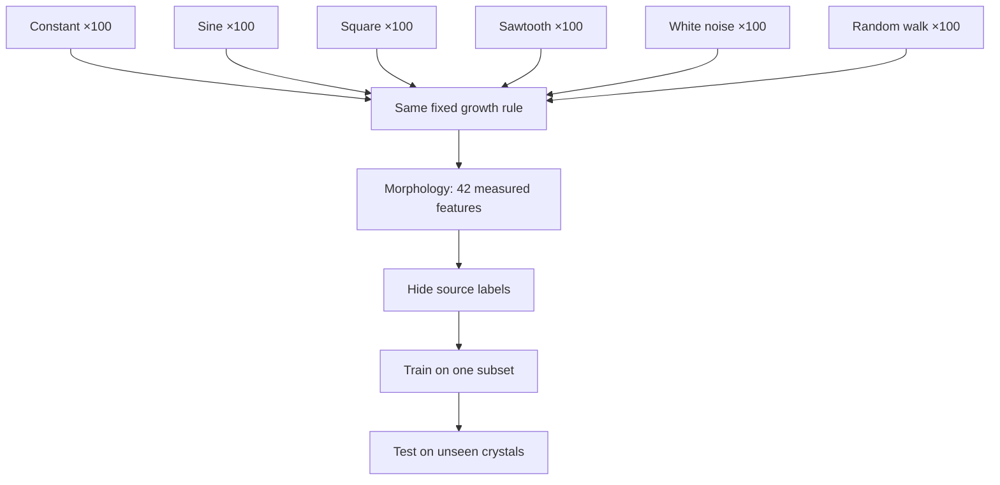

+++
title = "07: The Digital Crystal"
date = "2026-08-14T11:00:00+01:00"
draft = false
description = "We build the smallest laboratory that will hold an experiment: one seed, a hexagonal lattice, local attachment. Then we let an environment touch it and ask what the finished structure still knows."
weight = 7
series = ["Digital Life From First Principles"]
categories = ["Programming", "Artificial Life"]
tags = ["Digital Life", "Digital Crystal", "Crystal Growth", "Hexagonal Lattice", "Morphology", "Information", "Experimental Method"]
+++

Outlier was the wrong laboratory for the question we now wanted to ask.

Nothing in the previous chapters is retracted. Outlier had shown us what computation could support.

But by the end of the flocking investigation, another problem had become unmistakable: Outlier was much better at producing phenomena than at isolating them. Geometry, ancestry, distance, expansion and local environment all arose together from the same 512-bit rule.

Matching can recover some comparisons after a world has already run.

Now we want to build the comparison first.

Hold everything we can fixed. Change one mechanism deliberately. Measure what changes with it.

There is one idea worth carrying across from Outlier, and it is much smaller than an organism:

```text
local computation
↓
repeated interaction
↓
larger-scale organization
```

That is all we need to import.

Not Outlier's reproduction. Not its causal families. Not its geometry.

Only the demonstrated possibility that local rules can generate organization we did not explicitly represent.

What we want from the new system is a short list:

```text
every rule is known
every state can be inspected
one mechanism can be changed at a time
counterfactual worlds can be rerun
the full history can be preserved
```

And an equally important list of what we refuse to build:

```text
organism
memory
repair
reproduction
metabolism
individual
```

We want to leave those concepts out of the machinery entirely.

Then, if anything resembling them appears, we can ask whether the simpler system actually produced it.

The laboratory must not contain the answer.

The first laboratory is going to be almost embarrassingly small.

---

## One Seed

A hexagonal lattice. Every location holds `0` or `1`. Every location has six immediate neighbours.

At the centre, one occupied location:

```text
●
```

Everything else is empty.

The rule:

> **An empty location becomes occupied if at least one neighbouring location is occupied. Once occupied, it stays occupied.**

That is the entire system.

One seed.
One local attachment condition.
Irreversible occupancy.
Time.

There is no target morphology and no higher-level object directing the growth.

Hexagonal geometry is a convenience rather than a claim: six equidistant neighbours make local reasoning cleaner than a square grid's awkward mix of edge and corner adjacency. Represent locations as axial coordinates `(q, r)` and the six directions are just six offsets. The world is a set of occupied coordinates, and one update collects every empty location adjacent to something occupied and fills it.

Run it and the structure grows in expanding hexagonal shells.



Nothing anywhere says *make a hexagon*. After `t` updates, every location within hexagonal graph distance `t` of the seed is occupied, and the global shape follows from the neighbourhood topology plus uniform local propagation. No cell holds a blueprint. No controller measures the radius. Nobody draws the six sides.

Nothing surprising has happened yet, and that is useful.

The bounded result is simply:

> **Under this rule, one seed produces ordered expanding geometry through repeated local attachment alone.**

The hexagon is not evidence of sophistication.

It is the baseline against which later deviations will become measurable.

---

## Growth Is Cheap

Now measure it rather than admiring it, because the population has a closed form. For a perfect hexagonal ball of radius `r`:

$$
N(r) = 1 + 3r(r + 1)
$$

giving 1, 7, 19, 37, 61 for the first five radii. The radius grows linearly with time; the area grows quadratically. The measured population tracks the law exactly.



So the structure gets steadily larger and not one bit more interesting. A million-cell structure from this rule is no more conceptually complicated than a seven-cell one; the generative description is identical, and only the number changes.

```text
larger
≠
more complex
```

Which is useful to establish early, because size is the cheapest possible impressive-looking result.

A second distinction appears almost for free:

continued construction
≠
reproduction

The structure can keep extending from one seed without producing a second independent copy.

That does not tell us whether reproduction matters to digital life.

It tells us only that growth and reproduction are separate computational possibilities, and therefore deserve separate experiments.

That is why this laboratory begins with growth rather than reproduction.

We can study **continued process before reproduction** instead of assuming the biological ordering in advance.

---

## The First Temptation

Before adding anything, it is worth noting how quickly even this system tempts biological language — because it happens within one experiment.

Let the structure grow for twenty generations, then erase a region from its interior. Resume the same rule. The empty cells inside the hole touch occupied cells, so they become occupied; then their neighbours do; and soon the hole is gone.



It looks like healing. It is not.

The system does not distinguish damage from ordinary empty space. There is no target morphology and nothing representing what the structure is supposed to look like.

The same attachment rule that advances the exterior frontier also fills an interior hole.

So the stronger interpretation disappears:

> **The structure refills missing space through ordinary growth.**

That is not yet repair.

We will return to material loss later with a system and controls designed specifically for that question.

Less exciting, more informative, and a good reminder that a laboratory built specifically to avoid biological assumptions will still generate biological-sounding descriptions within about five minutes of being switched on.

The prototype generated other questions too: obstacles could leave traces, multiple seeds could merge, and finite worlds eventually imposed limits.

We are going to resist following those branches here.

Each becomes a much better experiment later.

For now, the prototype has done its job: it gives us a transparent process that grows, can be perturbed, and contains almost nothing we did not deliberately put there.

---

## Can the Environment Leave a Mark?

The prototype is almost too predictable.

Good.

A laboratory should begin with a baseline we understand.

What we want next is genuinely different:

> **Can changing external conditions influence growth strongly enough to leave a persistent, measurable signature in the finished structure?**

That question is not askable of the prototype. Its rule is deterministic and saturating — every available location fills, every time. There is no room for an external signal to change which locally available events actually happen, because all of them happen.

So the model has to change, and this needs stating plainly rather than slipped in:

```text
PROTOTYPE

binary occupancy + hexagonal neighbourhood
+ irreversible growth + deterministic local attachment
```

```text
DIGITAL CRYSTAL v1

binary occupancy + hexagonal neighbourhood
+ irreversible growth + stochastic attachment
+ environmental forcing + fixed lattice anisotropy
+ crowding penalty
```

Each addition earns its place through the experiment we want to run. Stochastic attachment gives the forcing somewhere to act — if attachment is probabilistic, the environment can shift the odds. Anisotropy gives the lattice persistent directional structure. The crowding penalty stops attachment probability rising without bound simply because a location has many occupied neighbours.

These mechanisms are introduced *for* this experiment. They are not discoveries carried over from the prototype, and that has a consequence worth being strict about:

> **Results from the prototype do not automatically transfer to Digital Crystal v1.**

The hole-filling result above tells us nothing about how this stochastic model responds to damage. Different model, different claims, and everything from here has to be earned again.

This is where the name **Digital Crystal** becomes useful.

The analogy is mechanistic rather than visual: local interactions during formation accumulate into persistent larger-scale structure.

So we can state a hypothesis rather than a definition:

> **Can a local computational growth process turn characteristics of an external input into persistent, measurable morphology?**

If the answer is no, the name has earned nothing.

If the answer is yes, we can decide what the name is worth afterwards.

The hypothesis is deliberately narrow. It says nothing about life, memory, learning, adaptation, reproduction, intelligence or agency.

---

## Influence, Not Instruction

The prototype was:

$$
C_{t+1}=G(C_t)
$$

Now introduce an environmental forcing signal:

$$
C_{t+1}=G(C_t,E_t)
$$

The distinction that makes this an experiment rather than a graphics demo is what the signal is *not* allowed to do. It does not draw. Nowhere does anything say:

```python
if signal == "sine":
    draw_sine_shape()
```

That would be a strange plotting library with extra steps. The same growth mechanism operates under every source; the signal only changes the conditions under which individual local attachment events occur.

For a candidate frontier cell, attachment probability takes a form like:

$$
P(\text{attach})
=
\sigma\left(
a + bn + cE_t + dA - q
\right)
$$

where `n` is the occupied-neighbour count, `E_t` is the current environmental value, `A` is the fixed local anisotropy term, `q` is the crowding penalty, and σ maps the result into a probability. The growth parameters stay frozen throughout. There is still no target morphology, no global drawing routine, no stored description of what the structure should become.

The experimental constraint that makes the whole thing work:

> **The growth mechanism remains fixed while the source changes.**

Otherwise recovering the source would tell us nothing except that we had changed the machine.

The contrast with a conventional visualization is the cleanest way to see what is going on. A graph does:

```text
value → coordinate → pixel
```

The Digital Crystal does:

```text
value → local attachment conditions → many stochastic interactions → persistent morphology
```

The picture is not drawn from the signal.

It is **grown under its influence**.

No local attachment event receives the source label, the future sequence or the desired final form. It receives only the current local state and the environmental value available at that step.

Whatever source information survives has to survive through the growth process.

First, the least interesting possible check: does the generalized model still grow? Give it a constant signal, `E(t) = 0`, and run it. The baseline reached approximately 5,924 occupied cells at a maximum hex radius of 44, with 552 boundary edges.



That proves nothing except that the machine runs. Which is all it needs to prove.

---

## Six Environments

Now hand exactly the same growth rule six different kinds of forcing:

```text
constant
sine
square
sawtooth
white noise
random walk
```

Within each family the individual instances vary — periods, phases, noise realizations, random-walk trajectories. At each growth step the structure receives only the scalar value currently presented to it. Not the family name, not the history, not the shape of the signal. One number.



Then grow them.



They look different.

So what?

This is the same trap that has followed us since Chapter 1, and it is no less inviting for being familiar. *Different signals generate different crystals* would make an attractive demonstration and establish nothing. Perhaps one random seed happened to produce a larger structure. Perhaps square waves simply produce a higher mean attachment probability, and we are looking at area. Perhaps our eyes are busily categorizing noise, which they are extremely good at.

We need populations, not specimens.

---

## Six Hundred Crystals

One hundred each of constant, sine, square, sawtooth, white noise and random walk. Six hundred structures, all grown with the same rule, the same experimental horizon and the same measurement system, differing only in source instance and stochastic realization.

For each finished structure, 42 morphological measurements: area, perimeter, maximum radius, compactness, boundary roughness, bounding-box aspect, centroid displacement, radial and angular distributions, six-fold angular structure, boundary-radius variation, and so on.

The source signal is not among them. The measurement describes the finished object and nothing else.

Then hide the labels.

The question becomes concrete and slightly unnerving: hand over one finished crystal, say nothing about what grew it, and ask whether the forcing family can be recovered from morphology alone. Six classes, so random guessing succeeds 16.7% of the time. Train on part of the population, test on structures never seen before.



The held-out result:

```text
chance                 16.7%

random forest           52.2%
logistic regression     53.9%
```



Substantially above the six-way chance baseline on held-out structures.

The forcing process has left a recoverable morphological signature under this measurement.

Two different classifier families give similar held-out accuracy, making the result less dependent on one particular classifier family.

That is reassuring, but not magical. The important result is simpler: unseen crystals contain enough morphological information for source family to be recovered substantially above the six-way chance baseline.

The confusion matrix also shows that the information is uneven. Some forcing families leave much more distinctive signatures than others.



The claim to keep is smaller than the excitement it produces:

> **The final morphology contains information that makes forcing-process family recoverable substantially above chance.**

Not *the crystal remembers its history*. Not *the crystal understands the environment*. Something happened during formation, and the finished structure still carries enough of it to be read.

---

## Attack the Boring Explanation

The obvious deflation is that the classifier is not detecting anything about the *process* at all — merely some trivial aggregate. Square waves might spend more time at high values, raise mean attachment probability, and produce larger structures. Then all we would have discovered is that bigger signals make bigger crystals.

So remove the simplest aggregate explanation among the varying signals: normalize them to approximately the same mean and ask whether their resulting morphology still differs.

The constant-zero condition remains a separate baseline.

Standardized distances from that baseline were:

```text
sine          4.45
square       13.82
saw           2.44
white noise   2.40
random walk   1.40
```

The variable-source populations remain morphologically displaced from the constant baseline after their means are approximately aligned.

So differences in mean forcing are not sufficient to explain those morphological shifts.

Some other property of the forcing — its distribution, temporal structure, or both — is contributing.

Which one?

That is now the interesting question.

One more obvious worry: perhaps recovery works only at one carefully chosen forcing strength, and we happened to find it. Varying the forcing strength while leaving the rest of the growth mechanism untouched, held-out random-forest accuracy was:

```text
forcing         accuracy

0.75             34.1%
0.85             43.2%
0.95             50.0%
1.00             52.3%
1.05             52.3%
1.15             63.6%
1.25             43.2%
```

against a 16.7% chance baseline throughout.

Discipline here, because this sweep is noisy and it would be easy to over-read. There is no clean monotonic trend; 1.15 outperforms 1.25 substantially, and a seven-point sweep cannot tell us the shape of a response curve. We are not entitled to say that increasing forcing predictably increases recoverability, and we do not know the optimum.

What survives is narrow:

> **Source-family recovery remained above the six-way chance baseline at every tested forcing strength in this sweep.**

That makes a single lucky forcing strength an inadequate explanation for the result.

---

## Maybe It Recorded What Happened

Here is where it becomes tempting.

We have a fixed local process, an external environment, and a finished structure from which the character of that environment can be recovered well above chance. The mean does not explain it. The result holds across forcing strengths. It survives on structures the classifier has never seen.

The tempting sentence is:

> *the crystal has recorded its environmental history.*

And this time the temptation is not merely visual.

Something about the conditions during formation really is recoverable from the final structure.

But **information about past conditions** and **a recoverable history** are not the same claim.

Notice how little distance there is between the result we have and the claim we want. The result says information about the *kind* of environment survives. The claim says the *history* survives. Those feel like the same statement, and the whole book so far suggests they are not.

There is also a specific reason for suspicion. Consider sine and square forcing. They differ in temporal ordering — but they also differ in value distribution, time spent near extrema, autocorrelation and transition structure. If the classifier is picking up broad statistical properties of the values experienced during growth, that is still a real result. It is a different result.

So we test the promotion rather than accepting it.

---

## Destroy Time

Take a source sequence and shuffle it.

```text
0.7   0.2  -0.3   0.9  -0.8  ...

becomes

-0.3   0.9   0.7  -0.8   0.2  ...
```

The shuffled version preserves the same values, mean, variance, minimum, maximum and histogram. Only the temporal ordering is destroyed.

If the finished morphology retains recoverable information about chronology, crystals grown from ordered and shuffled sequences should be distinguishable. Binary chance is 50%.

```text
chance                 50.0%

random forest           51.3%
logistic regression     51.7%
```



The result sits essentially at chance under both tested classifiers.

Under this morphology representation and protocol, we found no evidence that the ordered and shuffled histories were recoverably distinguishable.

Be precise about what this does and does not establish. It does not prove that no conceivable measurement could ever recover temporal information from this model. It establishes:

> **Our morphology representation and classifiers provide no evidence of above-chance recovery of ordered-versus-shuffled history under this protocol.**

That is enough to block the stronger claim we were drifting toward.

But the control can be stronger, and should be. A sine wave and a square wave do not merely differ in ordering — their distributions differ too, so the successful source-family classifier may be leaning primarily on distributional structure. We can remove even that.

Construct one fixed multiset of 72 values. Every condition receives **exactly the same values** — not approximately the same distribution, not merely matched mean and variance, the identical multiset. Only the temporal arrangement changes:

```text
RANDOM        random permutation
BLOCK         low values grouped, then high values grouped
ALTERNATING   low, high, low, high...
SMOOTH        neighbouring values change gradually
BURST         quiet periods interrupted by concentrated excursions
PERIODIC      values arranged into a repeating temporal motif
```



This is the comparison Outlier could never have given us. Same values, same growth rule, same everything — one variable changed deliberately, and the counterfactual world constructed rather than found.

Then grow them, with the model frozen. No parameter tuning, no attempts to rescue the hypothesis.



One safeguard matters enough to state. All temporal arrangements built from a single value set stay together during the train/test split, so the classifier cannot train on one ordering of a value set and then be tested on a different ordering of that same set. Held-out value sets are genuinely unseen. Without that, a subtle leakage path would let the model recognize the values rather than the ordering.

With the value multiset held exactly constant, the tested morphology representation and classifiers again provide no evidence of above-chance recovery of temporal organization.

The stronger interpretation fails again.

The values mattered.

Under this test, their exact ordering was not recoverably readable from the final morphology.

---

## A Crystal Is Not a Tape Recorder

This is the point where the result becomes better than the idea we started with.

We had imagined:

```text
environmental history
↓
crystal
↓
history written into morphology
```

What the experiments support is narrower:

```text
environmental statistics
↓
local dynamics
↓
persistent morphology
```

Under the measurements and classifiers we tested, exact temporal organization is not recoverable.

Broader characteristics of the forcing are.

That is a more precise result than saying the sequence was simply "lost," because unmeasured information may still exist in the state.

Which is, when you look at it, strangely appropriate. Inspect a physical crystal and its structure may reveal a great deal about the conditions under which it formed — temperature regime, rate, impurities, pressure. It does not contain a frame-by-frame movie of formation. Nobody expects to read Tuesday off a quartz sample.

Our Digital Crystal turns out to be closer to that than to a recording device. The morphology behaves less like a tape recording and more like a compressed consequence of formation.

The failure therefore narrows the result: this measurement recovers broad properties of the formation conditions more readily than exact temporal organization.

---

## State Is Not History

The crystal has state.

Its present configuration is a consequence of earlier attachment events. A cell added at step 10 can still be present at step 70, and changing earlier events can change the final structure.

But:

> **the past affecting the present is not the same as the past remaining recoverable from the present.**

That is the distinction this experiment has finally forced us to make.

Consider two sequences, `A B C D` and `D B A C`. Both influence the process. Both alter the final state. But if the final state contains no recoverable information distinguishing which ordering occurred, then the process has accumulated consequences without retaining chronology.

That is where Digital Crystal v1 stands, and it separates two things our vocabulary bundles together:

```text
past contributed to present
        SUPPORTED

source family recoverable
        SUPPORTED

mean forcing alone is sufficient
        NOT SUPPORTED

exact temporal order recoverable
        NOT SUPPORTED

complete chronology retained
        NOT ESTABLISHED
```

So:

```text
PAST-DEPENDENT
≠
PAST-READABLE
≠
RECOVERABLE HISTORY

```

A process can be thoroughly shaped by its past without being a record of it.

A useful working description for what we measured is **lossy integration**:

```text
external forcing
↓
many irreversible local attachment events
↓
aggregate structural bias
↓
persistent morphology
```

The process integrates consequences of earlier forcing into persistent form, while our measurements recover broad source characteristics more readily than temporal arrangement.

That suggests a hypothesis worth carrying forward:

> **Irreversible growth may preserve coarse information about formation conditions while making temporal order difficult to recover.**

Not a law.

A result from this substrate, waiting to be attacked by a better experiment.

One boundary statement, once, and then we trust the reader with it: nothing here establishes memory in the strong sense, learning, adaptation, interpretation of the environment, a stored event log, reproduction, individuality, or life. What it establishes is that a fixed local growth process can turn differences in environment into persistent, measurable, recoverable differences in form.

That is a real result. It does not need help.

---

## The Digital Crystal

The name was a label at the start of the experiment. It has now earned a little weight:

> **A Digital Crystal is a local computational growth process in which characteristics of an external input become expressed as persistent, measurable morphology.**


The definition is small because the stronger interpretation failed.

We established that formation conditions can leave recoverable morphological information.

We did **not** establish that the final morphology preserves a recoverable chronology of those conditions.

Keeping those statements separate is the result.

It is worth noticing what just happened procedurally, because it is the thing Outlier could not offer. We wanted to know whether temporal order mattered. So we built two worlds identical in every respect except temporal order, and looked at the difference. No matching. No searching a complicated world for naturally occurring comparisons. No unresolved regime where the data happened not to contain what we needed.

That is what the laboratory was built for.

For its first serious question, the comparison existed because we constructed it.

---

## Give It a Past

The first experiment could recover something about the conditions under which the crystal formed.

The harder question was whether the final morphology could also distinguish the order in which those conditions occurred.

Under the tests we ran, it could not.

That is not a disappointing end to the Digital Crystal. It identifies the next missing capability with unusual precision. The crystal has a present, and that present carries information about the conditions that produced it.

What we have not yet given it is a **recoverable past**: enough preserved state that two different histories can remain distinguishable even when their current visible morphology is otherwise comparable.

So the next step is smaller than intelligence, goals, reproduction or learning.

Give the process a way to **keep what happened**.

Preserve enough internal consequence that two different histories remain distinguishable later.

We do not need to call that memory yet.

Because before the past can change the future, some distinction from that past has to survive.

That is the next experiment.
