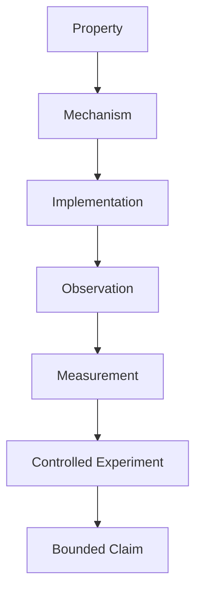
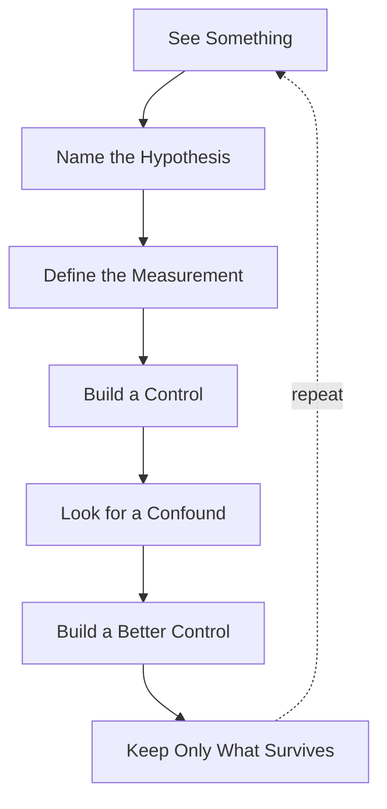
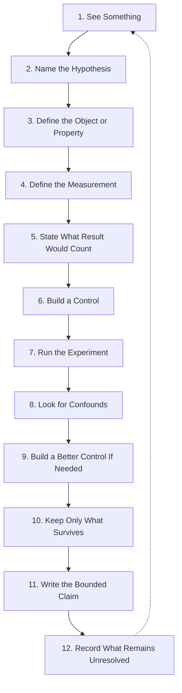

+++
title = "08: Now Prove It"
date = "2026-08-11T14:49:00+01:00"
draft = false
description = "Turn appealing observations into experiments by defining properties, measurements, interventions, controls, confounds and bounded claims."
series = ["Digital Life From First Principles"]
categories = ["Programming", "Artificial Life"]
tags = ["Digital Life", "Experimental Method", "Evidence", "Controls", "Causality", "Artificial Life"]
+++

We have accumulated a dangerous number of impressive words.

So far we have talked about:

```text
emergence
complexity
entity
persistence
movement
robustness
regeneration
reproduction
inheritance
selection
adaptation
evolution
open-endedness
progress
```

Some of those words were earned carefully.  
Some were only provisional.  
Some described observations.  
Some described mechanisms.  
Some described measurements.  
Some described aspirations.  
And some may eventually turn out not to be useful at all.

That is exactly how a project like this gets into trouble.

We start with an interesting pattern and gradually upgrade it in language:

```text
pattern
↓
structure
↓
entity
↓
organism
↓
life
```

without necessarily adding evidence at each step.

So before we move any further, we need a rule.  
Not a cellular-automaton rule.  
An experimental rule.

> **From this point onward, naming a property does not count as demonstrating it.**

If we say a system moves, repairs, remembers, reproduces, inherits, adapts, or evolves, then we need to say what observation would make that claim true – and what observation would make it false.

---

## The Central Problem

Artificial-life systems are unusually easy to overinterpret.

They are visual.  
They move.  
They deform.  
They split.  
They collide.  
They produce structures that our visual system immediately turns into objects.

Then our language does the rest.

A blob becomes an organism.  
A split becomes reproduction.  
A return toward an earlier shape becomes healing.  
Two nearby moving objects become flocking.  
A changing population becomes evolution.  
A recurring state becomes memory.

The system may indeed possess some of those properties.  
But the animation does not decide that.  
We do.

So we need a process that stands between what we see and what we claim.

---

## Observation Is the Beginning

The first step is still observation.  
That matters.

A spectacular image can be scientifically valuable.  
A strange animation can reveal something nobody thought to measure.  
Human pattern recognition is not the enemy.  
It is often how hypotheses begin.

Suppose we see a localized structure moving across the field.

The wrong response is:

> Don't trust your eyes, therefore ignore it.

The better response is:

> Interesting. What exactly do I think I am seeing?

Observation generates the hypothesis.  
It does not establish it.

---

## Name the Hypothesis

Suppose an animation appears to show movement.  
Turn that into a hypothesis:

> **A localized organization changes position through time while preserving a defined identity criterion.**

That is already much better than “it moves.”  
Now we can ask what must be measured.

For a localized pattern we might track:

```text
centroid
bounding box
orientation
phase
shape similarity
```

Movement becomes a relationship between observations across time.  
The word now has experimental content.

---

## Define What Would Count as Evidence

Suppose we claim the pattern persists.  
What would count?

Maybe the same state exists after every update (for a block).  
Maybe the state recurs after period *p* (for an oscillator).  
Maybe the state recurs after period *p* up to translation Δ (for a glider).

There is no universal persistence metric.  
The measurement depends on the proposed identity criterion.  
That is not a weakness. It is the experiment.

---

## The Evidence Ladder

We can now make the core structure of this book explicit.  
A strong claim should move through something like:



Those levels matter.

Consider: *The system regenerates.* We can unpack it.

- **Property:** regeneration  
- **Mechanism:** local dynamics restore lost organization  
- **Implementation:** specific transition rule or learned local update process  
- **Observation:** pattern looks damaged, then later resembles earlier form  
- **Measurement:** IoU / shape similarity / functional performance  
- **Controlled experiment:** defined perturbation + matched undamaged control + multiple damage locations + repeated trials  
- **Bounded claim:** *Under this perturbation protocol, the system returned to at least 0.90 structural similarity within 50 updates in 78% of trials.*

That is what “regeneration” looks like when translated into evidence.

---

## Implemented Is Not Demonstrated

Suppose we write:

```python
class Organism:
    def heal(self):
        ...
```

Have we demonstrated healing? No.

Suppose we add `memory = []`. Have we demonstrated memory? No.

Suppose offspring receive `child.genome = parent.genome.copy()`. Have we demonstrated meaningful inheritance? Not necessarily.

We have implemented mechanisms that we believe may support those properties.  
That gives us a candidate mechanism – not an established phenomenon.

A class name is not evidence.  
A function name is not evidence.  
A variable name is not evidence.  
The implementation has to survive contact with measurement.

---

## Correlation Is Not Mechanism

Suppose event A and event B happen together.  
We observe A, then B.  
It is tempting to say A caused B.  
But perhaps both were caused by C, or B would have occurred anyway.

This is why intervention matters.

Consider reproduction. We see pattern P, and later two copies.  
Similarity and temporal order are not enough.

A stronger question is:

> If the supposed parent had not been present, would the supposed offspring still have appeared?

That is a causal question we can approximate with a counterfactual experiment.

---

## Remove the Mechanism

A general rule keeps appearing throughout this book:

> **If you think a mechanism causes a capability, remove or disrupt the mechanism.**

- Memory state responsible for improved behavior? Run memory intact vs. memory removed.  
- Inheritance giving successors an advantage? Compare inherited successor vs. scratch successor.  
- Candidate parent produced offspring? Parent present vs. parent removed.  
- Local communication causing coordination? Disrupt communication.

Then measure the difference.  
Mechanisms become convincing when the capability depends on them.

---

## The Control Is Part of the Claim

A measurement by itself often tells us very little.

Suppose after damage we measure recovery score = 0.87.  
Is that impressive? Compared with what?

Perhaps an undamaged pattern scores 0.99.  
A random process scores 0.82.  
A frozen copy scores 0.88.

Without a control, the number floats without meaning.  
So every strong experiment should ask:

> **What alternative explanation does this control eliminate?**

---

## Controls Should Attack Explanations

Claim: *The system adapted to a changed environment.*

Alternative explanations:

```text
performance was already improving
the environment became easier
random variation happened to help
the metric itself changed
the system memorized one answer
```

Useful controls:

```text
no inheritance
shuffled inheritance
no variation
unchanged environment
held-out environment
scratch restart
```

Each control attacks a different explanation.  
A control exists because there is something specific we are trying to rule out.

---

## The First Control Can Be Wrong

You can design a control, run it, get a beautiful result – and still be wrong.

Perhaps the control introduces its own bias.  
Perhaps the comparison groups differ in some hidden variable.  
Perhaps the metric accidentally uses information from the thing it is supposed to control for.  
Perhaps the intervention changes more than one mechanism.

That does not invalidate the method. It is the method.  
The next step is: **look for the confound.**

---

## The Confound Is Often the Real Discovery

Suppose two groups differ; we conclude ancestry causes coordinated movement.  
Then we notice: same-family individuals are also much closer together.  
Now proximity might cause the apparent coordination.

So we match groups by distance.  
If the effect disappears, the result is not “the experiment failed.”  
The result is: **the proposed explanation failed.**  
That is useful knowledge.

A good experiment can destroy the hypothesis that motivated it.

---

## Build the Better Control

This gives us a stronger experimental loop:



Not: see something → find a metric that supports it → publish the impressive sentence.  
But: try to kill the explanation, and see what remains.

---

## A Claim Should Have a Failure Condition

Before running the experiment, ask:

> What result would make me stop using this claim?

- *Inherited state improves later learning* → after equalizing compute, inheriting successors do not outperform scratch successors on held-out environments.  
- *A pattern regenerates after damage* → recovered morphology is no better than matched damaged controls.  
- *Local ancestry predicts motion coherence* → after matching spatial distance and local context, same-ancestry pairs are no more aligned than different-ancestry pairs.

If no possible result can weaken the claim, we do not yet have an experiment.

---

## Bounded Claims Are Stronger Claims

Compare:

> The system heals.

with:

> Under deletion of up to 10% of active cells in the tested regions, the system returned to at least 0.90 morphology similarity within 50 updates in 83% of trials.

The second sentence sounds less exciting. It is much stronger.

We know exactly what it means: intervention, measurement, threshold, time window, scope, success rate.  
We also know what it does not mean.  
A bounded claim survives scrutiny better because its edges are visible.

---

## Do Not Generalize Past the Experiment

- Rule 30 produced this trajectory under this initial condition. → Not “Rule 30 always produces complex behavior.”  
- This glider survived this perturbation. → Not “gliders are robust.”  
- This evolving population improved under this environment and protocol. → Not “evolution produces progress.”

The scale of the claim should match the scale of the evidence.

---

## One Example Discovers; a Distribution Establishes

A single compelling example is often how we find something – that is valuable.  
But general claims require repeated observations.

If we care about damage tolerance, test many damage locations, severities, phases, trials.  
If we care about inheritance, test many descendants, generations, environments, lineages.  
If we care about reproduction, test many candidate parents, offspring events, counterfactual removals, repeatability.

The question changes from *Can this happen?* to *Under what conditions does this happen?*

---

## Search Can Create Its Own Illusion

We search 10,000 cellular-automaton rules, find one extraordinary pattern, show it.  
It looks miraculous.

But we need to remember: 10,000 attempts → 1 spectacular result is not equivalent to 1 attempt → 1 spectacular result.

The interesting example still matters.  
But we should record: search space, selection criteria, number of attempts, how the candidate was chosen.  
Otherwise selection bias gets hidden inside the presentation.

---

## The Screenshot Has a Provenance

Every visual in this book should be mentally accompanied by:

```text
Which run?
Which seed?
Which parameters?
Which crop?
Which timestep?
Which preprocessing?
Which selection rule?
```

The image is not raw reality. It is the result of an experimental pipeline.  
That does not make it invalid. It means the pipeline belongs to the evidence.  
A good visual should be reproducible from code.

---

## The Metric Can Lie

Two mostly empty grids compared with `np.mean(a == b)` may score 0.99 even if the actual structures are completely different – the background dominates.

So we switch to IoU. Better.  
But translation causes equivalent moving objects to score poorly, so we align them first.  
Then rotation matters, or phase, or distributed structure.

Every metric embeds assumptions about what differences matter.  
When we choose a metric, we should ask:

> **What notion of identity does this metric assume?**

---

## Measurement Creates the Object

Suppose we define an entity as one connected component.  
Our tracking algorithm now sees component A, B, C.  
But perhaps A and B are actually pieces of one distributed causal process.  
Or one connected component contains two causally independent organizations.

Our detector did not merely observe the world. It imposed an ontology.  
Entity definitions must remain provisional.  
The objects we measure may eventually need to be redefined by causal structure rather than visual connectedness.

---

## Geometry Is a Hypothesis

For the glider, geometry worked beautifully.  
A localized connected pattern had clear boundary, stable recurrence, coherent motion.  
Treating it as one object was useful.

But we should not assume connected geometry = individual universally.  
Future digital systems may be distributed, fragmented, multi-scale, temporally intermittent.  
Their identity may be better defined by causal continuity than by spatial connectedness.

That is a question for experiments.

---

## Reproduction Needs Ancestry, Not Just Similarity

Two shapes look identical: A and B. Did A produce B?  
Similarity cannot answer that. Temporal order cannot. Spatial proximity cannot.

A stronger analysis asks whether the state associated with A contributed causally to the appearance of B.

Conceptually:

```text
A present → B appears
vs.
A counterfactually removed → does B still appear?
```

If B disappears under the intervention, the parenthood hypothesis becomes stronger.  
That moves us from shape matching toward causal lineage.

---

## Positive Counterfactual Causality

For a local deterministic system, we can sometimes test causality at very small scales.

Take a predecessor cell, remove it, recompute.  
If the child cell now disappears, the predecessor was positively necessary under this intervention.

Do this repeatedly and we can begin constructing cell → cell causal edges.  
Aggregate those and we may obtain pattern → pattern relationships.

Now ancestry becomes something we can calculate rather than merely eyeball.

---

## Causality Also Has Limits

Even counterfactual tests need care.  
Redundancy, synergy, multiple sufficient causes – removing one cell may not reveal the whole story.

But even a simple cell-removal test is vastly stronger than “those shapes look related.”  
The claim must match the method.

---

## Evidence Has Levels

Suppose we claim *pattern P reproduces*. Evidence might progress:

```mermaid
flowchart LR
    L1[Level 1: Visual similarity<br/>one P → two things that look like P] --> L2[Level 2: Measured similarity<br/>identity criterion satisfied]
    L2 --> L3[Level 3: Persistence<br/>second instance remains detectable]
    L3 --> L4[Level 4: Repeatability<br/>process happens multiple times]
    L4 --> L5[Level 5: Intervention<br/>removing parent changes offspring]
    L5 --> L6[Level 6: Lineage<br/>offspring themselves produce descendants]
    L6 --> L7[Level 7: Inheritance<br/>parent differences predict descendant differences]
    
    style L1 fill:#ffcccc,stroke:#333
    style L2 fill:#ffe0cc,stroke:#333
    style L3 fill:#fff5cc,stroke:#333
    style L4 fill:#e5ffcc,stroke:#333
    style L5 fill:#ccffcc,stroke:#333
    style L6 fill:#ccf0ff,stroke:#333
    style L7 fill:#ccccff,stroke:#333
```



The word didn't change. The evidence did.

---

## An Evidence Ledger

From this point onward, every chapter should maintain a small ledger:

```text
WHAT WE SAW
WHAT WE MEASURED
WHAT SURVIVED THE CONTROL
WHAT DID NOT SURVIVE
WHAT WE CAN CLAIM
WHAT WE CANNOT CLAIM
```

This prevents a spectacular result in one chapter from silently becoming a stronger claim three chapters later.

---

## Audit the Book So Far

Let's do that now.

### Rule 30
- **What we saw:** A tiny deterministic rule produced a visually irregular spacetime history.
- **What we measured:** A one-bit perturbation can create an expanding difference between trajectories.
- **What survived:** The irregular behavior did not require injected randomness.
- **What we can claim:** Simple deterministic local mechanics can generate globally nontrivial trajectories.
- **What we cannot claim:** We have not established life, intelligence, or a general theory of complexity.

### The Glider
- **What we saw:** A localized pattern appeared to move through the Game of Life lattice.
- **What we measured:** Its configuration recurs after four generations with a fixed translation. Its centroid follows a systematic trajectory.
- **What survived:** The organizational relationship persists despite changes in constituent cells.
- **What we can claim:** Material continuity is not required for a useful operational notion of pattern identity in this system.
- **What we cannot claim:** We have not established that connected geometry is the universal boundary of a digital individual.

### Damage
- **What we saw:** Persistent structures can collapse after small perturbations.
- **What we measured:** Survival and structural similarity can be tracked as damage changes.
- **What survived:** Undisturbed persistence does not imply robustness or regeneration.
- **What we can claim:** Persistence, robustness and regeneration are experimentally distinct.
- **What we cannot claim:** A surviving pattern has not necessarily recovered. A pattern returning visually has not necessarily demonstrated a general regenerative mechanism.

### Reproduction
- **What we saw:** Digital systems can produce additional recognizable patterns.
- **What we learned:** Copying alone is cheap and scientifically weak. Similarity alone does not establish ancestry.
- **What stronger evidence requires:** distinct entity + identity criterion + persistence + repeated production + causal dependence.
- **What we can claim:** Causal reproduction is a stronger property than simple duplication.
- **What we cannot claim:** Two similar structures are not automatically parent and offspring.

### Evolution
- **What we established:** Heritable variation plus differential reproductive success can change populations.
- **What controls matter:** remove variation, shuffle inheritance, neutralize selection, change environment.
- **What we can claim:** Evolution can occur in deterministic digital systems.
- **What we cannot claim:** Evolution does not imply progress. Novelty does not imply usefulness. Complexity does not imply improvement.

### Cumulative Improvement
- **What we proposed:** Later processes may inherit useful state and start from a measurable advantage.
- **What would demonstrate it:** inherited successor > scratch successor under equal budget, related but non-identical conditions, across repeated generations.
- **Current status:** Experimental target. Not yet established.

---

## Our Words Now Have Statuses

We should stop treating every term as either true or false.  
A more useful vocabulary is:

```text
OBSERVED
MEASURED
SUPPORTED
PROVISIONAL
FAILED
UNTESTED
```

For example:

```text
Rule 30 irregularity          OBSERVED
perturbation spreading        MEASURED
glider translating persistence SUPPORTED
connected geometry = individuality PROVISIONAL
glider regeneration           FAILED under tested perturbations
cumulative heritable improvement  UNTESTED
```

---

## Failed Hypotheses Belong in the Book

Suppose we see what looks like flocking. We build a metric, find strong local alignment, remove global expansion – alignment remains.  
We propose relatives move together; initial analysis supports it. Then we discover a confound, improve the control, and the family effect disappears.

What belongs in the final chapter? All of it.

The important result is not merely “family effect = no evidence.”  
It is the sequence: visual impression → measurement → plausible explanation → confound → better control → explanation rejected.

A failed explanation can be more valuable than an unchallenged exciting claim.

---

## Do Not Clean the History Too Much

There is a temptation to present: question → correct experiment → correct answer, as though we knew the path from the beginning.  
But real investigation often looks like: question → bad metric → better metric → wrong explanation → confound → better control → smaller claim.

That history teaches the reader how to investigate – not merely what answer we eventually accepted.  
This book should preserve some of the mistakes, because corrections reveal the method.

---

## Negative Results Are Results

Suppose we test *shared ancestry independently predicts local motion coherence*.  
After controlling for distance, time, local density, background flow, the effect disappears.

That is not “nothing happened.”  
It tells us ancestry was not required for the measured coherence under this experiment.  
That narrows the mechanism: perhaps local geometry + local dynamics is enough.

The experiment succeeded. The hypothesis did not.

---

## The Strongest Result May Be Smaller Than the Original Idea

We may begin with “This system flocks.”  
After measurement we end with “Nearby moving structures have strongly aligned velocity.”  
Then after a better control: “Local velocity coherence survives removal of global radial expansion.”  
Then after matching: “We find no additional coherence attributable to shared causal ancestry.”

The final statement is narrower – and far more informative.  
We now know something about what the phenomenon is and what it probably is not.  
That is progress.

---

## Every Claim Should Carry Its Scope

Imagine every sentence with hidden metadata:

```text
CLAIM:       same-family pairs move coherently
SYSTEM:      Outlier
RUN:         specified rule / seed / size / duration
MEASUREMENT: velocity alignment
CONTROL:     distance / density / local flow matched
SCOPE:       tested observations only
RESULT:      effect not distinguishable from control
```

The published sentence may be short. The evidence behind it should not be.

---

## Reproducibility Is Part of the Architecture

Our experiments should leave artifacts.  
At minimum: code, parameters, seed, outputs, plots, measurements, claims.

For larger experiments: database, lineage records, event tables, cached analyses.

The experiment should not disappear when the animation closes.  
We should be able to ask later: which run produced this figure? which entities contributed? which measurement version? which control? which threshold?

That makes the experiment inspectable.

---

## Store the Specimen

For complicated digital-life systems, a database can become part of the experimental apparatus.  
Store: runs, entities, states, causal edges, lineages, measurements, analysis versions.

Then one simulation becomes a specimen we can interrogate repeatedly.  
We can ask later: which descendants came from this ancestor? which entities moved persistently? which causal relationships survived?

That changes how we can do research.

---

## But Cached Analysis Has Provenance Too

If we store analysis results, we need to know which algorithm, parameters, source run, metric version produced them.  
Otherwise stale or incompatible results can silently contaminate later experiments.

A cache is useful. A cache without identity is dangerous.  
Evidence must remain traceable through the analysis stack.

---

## This Is Not Bureaucracy

Why store run ID, analysis ID, metric version, control version for a cellular automaton?  
Because eventually our questions will become difficult enough that we will not remember which result came from which experiment.

And because we are using AI systems to help us write code, run experiments, and interpret results.  
That makes provenance more important, not less.  
Fast generation creates more candidate analyses – we need stronger mechanisms for knowing which ones survived validation.

---

## AI Makes This Method More Necessary

An AI assistant can produce a hypothesis, a metric, a graph, an explanation very quickly.  
That is powerful – and dangerous.  
The bottleneck shifts from “Can we generate a plausible experiment?” to “Can we distinguish the experiment that actually tests the claim from one that merely appears to?”

AI increases the rate of hypothesis generation.  
Our evidence process has to increase the rate of hypothesis destruction.

---

## Use AI to Attack the Experiment

A useful workflow:

```text
Ask: What alternative explanation could produce this result?
Then: Design a control that separates those explanations.
Then: What does this metric accidentally condition on?
Then: How could this intervention contaminate the control group?
Then: What result would falsify the claim?
```

The assistant should not merely help us make the result impressive.  
It should help us make the claim difficult to keep.

---

## The Book's Experimental Constitution

We can now write the rules explicitly.  
Whenever we encounter an interesting phenomenon:



That is the constitution for the rest of this project.

---

## And One More Rule

> **Never introduce a mechanism merely because biology has one.**

Suppose we think digital life needs metabolism, death, reproduction, homeostasis, body, genome.  
Before implementing it, ask: *What problem is this mechanism solving?*  
Then: *Does the digital substrate actually have that problem?*

If yes, build the mechanism and test it.  
If no, do not import it simply because biological organisms use it.

This is where our investigation is about to change direction.

---

## We Have Been Asking a Biological Question

Look at the sequence so far: persistence, robustness, regeneration, reproduction, inheritance, evolution.  
It is a sensible sequence – but suspiciously biological.

We have been asking: *How many properties associated with biological life can we reproduce digitally?*  
That question got us here. It may now be limiting us.  
Digital systems do not live in biological matter.

---

## What If the Constraints Are Different?

Biological organisms face: finite bodies, slow communication, expensive copying, limited memory, material metabolism, irreversible physical damage, aging, death.

Digital systems may face: compute, memory, bandwidth, latency, coordination, attention, trust, energy cost of computation.

They may also possess capabilities biology does not naturally provide: exact copying, checkpointing, restoration, forking, merging, fast communication, external memory, self-modification, distributed execution.

If those differences matter, simply rebuilding biology digitally may be the wrong objective.

---

## Birds Are Evidence, Not the Blueprint

Birds prove heavier-than-air controlled flight is possible.  
But an aircraft does not need feathers, bones, muscles, a beak.

It needs mechanisms that satisfy the actual requirements of flight: lift, control, propulsion, structural integrity.

The lesson is not “ignore birds.”  
The lesson is: **Study the phenomenon, then derive the mechanism from the substrate you actually have.**

Artificial life deserves the same treatment.  
Biology is evidence. It is not automatically the specification.

---

## The Question Changes

We began by asking: *What would digital life mean?*  
Then we borrowed biological concepts because they were the best examples we had.  
That was useful.

But now we have an experimental method strong enough to ask a better question:

> **Which properties of life survive when we remove the biological constraints that produced them?**

And then:

> **What new properties become possible because the substrate is digital?**

That is where the book needs to go next.  
Not toward a longer checklist.  
Toward a more fundamental derivation.

Next: **Don’t Build an Animal.**
