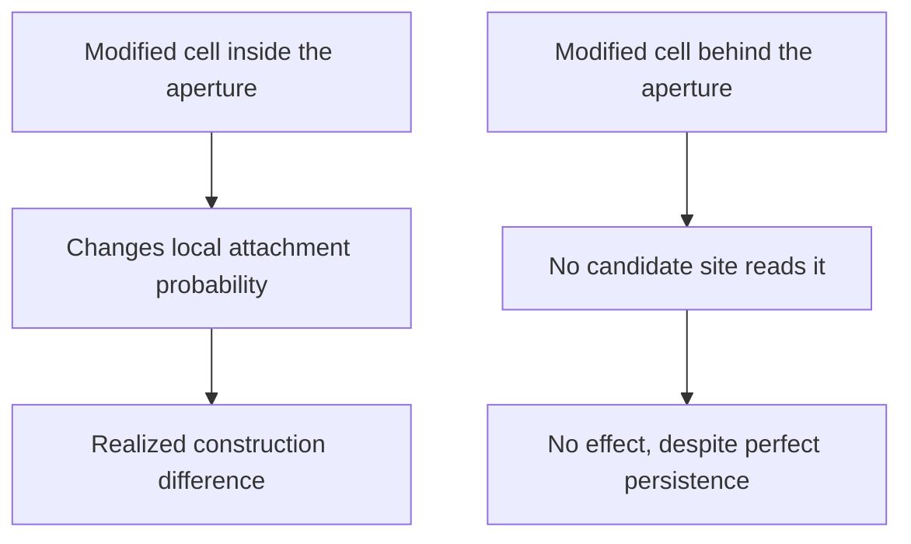
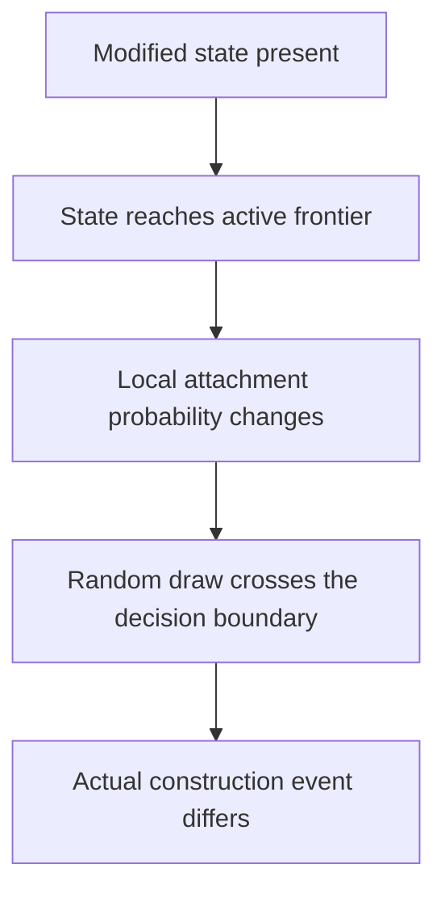

+++
title = "09: Can Experience Change the Material?"
date = "2026-08-14T12:00:00+01:00"
draft = false
description = "A pulse can leave a permanent mark inside a Digital Crystal. The mark persists, biases construction, and then stops mattering — not because it decayed, but because growth moved past it."
weight = 9
categories = ["Programming", "Artificial Life"]
tags = ["Digital Life", "Digital Crystal", "Material State", "Causality", "Path Dependence", "Experiments"]
series = ["Digital Life From First Principles"]
+++

At the end of the last chapter the Digital Crystal had a past with real consequences and nowhere inside itself to keep it.

A checkpoint could continue it exactly, but the checkpoint belonged to us. An event log could reconstruct how it formed, but the growth rule never read the log. A single received bit could redirect a later trajectory, and two matched pulse histories produced measurably different futures — yet the tested morphology readouts did not recover which history had occurred.

The consequences propagated forward through construction itself. An altered attachment changed a frontier; the changed frontier changed what could happen next. That is a genuine causal past. It is not a stored one. Nothing was written down anywhere inside the process, because the process had nowhere to write.

As material, an occupied cell has carried almost no internal distinction beyond the fact that it exists.

So the question that ends the previous chapter is the question that opens this one:

> **Can experience change the material itself?**

Which sounds almost too easy. Of course software can change a variable. We could write:

```python
memory = 1
```

after a pulse and declare the problem solved. But then the answer would have been put into the architecture by us, and the experiment would tell us nothing at all — the same objection that has followed every tempting shortcut in this book.

So the real question is smaller and much harder:

> **What is the smallest local change produced by experience that can persist and later alter what the crystal builds?**

Add as little as possible. Then find out what that little is worth.

---

## One More Kind of Cell

Until now a cell in the Digital Crystal has had two possible material conditions:

```text
EMPTY
OCCUPIED
```

For this chapter we allow one more:

```text
EMPTY
OCCUPIED_NORMAL
OCCUPIED_MODIFIED
```

A pulse can convert some occupied cells near the active growth region from normal to modified. That is the entire addition.

There is no history list. No global register. No timestamp recording when the pulse arrived. No stored copy of the signal. No decoder. No learned weight. No target morphology. No module named `memory`. Nothing in the substrate knows what a pulse *was*, and nothing can ask.

The modified condition does exactly two things. It persists. And while a modified cell sits adjacent to a candidate attachment site, it slightly changes that candidate's local attachment probability.


That chain is the hypothesis.

Every arrow is a separate empirical claim.

We should not assume that persistence, accessibility and later causal effect arrive together merely because we implemented one material state.

If the mechanism fails outright, that is useful. If it succeeds, we still have to ask precisely what succeeded.

---

## The Mark Persists

The first requirement is almost trivial by construction.

The pulse arrives. Cells near the boundary become modified. The pulse ends. The modified cells remain modified because this model contains no rule that erases or decays that state.

So persistence itself is not a discovery here. We deliberately built a material state that can persist.

The experimental question is what that persistent state can still do.

The consequence now exists inside the material rather than in our checkpoint or event log.

The event is over.

The material remains different because it occurred.

That is enough to make the word *memory* tempting.

It is nowhere near enough to earn it.

The next question is whether the future can still reach the difference we created.

So we do the obvious thing and check whether it matters.

Take an experienced crystal. At a later checkpoint, clone it. In one copy erase the modified labels while leaving the visible occupied geometry exactly as it is. Continue both copies under identical future conditions and identical stochastic coupling.

If the retained material is doing causal work, the two futures should differ.

```text
experienced, labels retained ─┐
                              ├─→ continue → compare
experienced, labels erased ───┘
```

At the late ablation point, removing the retained material state produced no downstream difference.

The trace was still present.

Its removal no longer changed the future.

---

## And Then It Stops Mattering

Read that result carefully, because the obvious interpretation is wrong.

The state had not decayed. The modified cells were all still there, still modified, still exactly as the pulse had left them. We erased something that was unambiguously present, and the future did not notice.

Which gives the first real result of the chapter:

```text
PERSISTENCE
≠
CAUSAL ACCESSIBILITY
```

The trace had not disappeared.

It had become causally irrelevant.

The clue was geometric.

The Digital Crystal grows outward. Attachment decisions happen at the frontier, among candidate sites adjacent to existing material. A cell that sits on the boundary today is surrounded by newer cells tomorrow and buried under several layers of them a few steps later. It remains in the lattice forever. It stops being anywhere near a place where anything is being decided.

Paint a mark on a brick and keep building outward.

The mark does not fade.

It simply moves behind the surface where new construction happens.

So we stopped counting how many modified cells survived and started measuring where they were: how many remained on the boundary, how many current frontier sites had a modified neighbour, what fraction of active construction could still encounter modified material at all.

The mystery evaporated. Immediately after the pulse the modified material was exposed to the frontier. A few updates later that exposure had collapsed. By the late checkpoint where our ablation had found nothing, there was nothing left to find — not because the state was gone, but because no decision was being made anywhere near it.

The timed erasure experiment makes the relationship direct. Erase the same material at different moments and the causal consequence tracks frontier contact, not quantity:

```text
early probe     mean frontier contact ≈ 16.69     ablation effect detected
later probe     mean frontier contact ≈  2.25     effect not detected
after burial    mean frontier contact =   0       effect = 0
```

The bounded result:

> **In these experiments, the causal effect of retained material tracked whether that material remained accessible to active growth.**

---

## Storage Is Not Access

This deserves to be stated as more than a debugging note, because it inverts the intuition we brought to the problem.

We had assumed that the hard part of keeping a past would be keeping it.

In this model, that assumption was wrong.

The modified state does not decay unless we explicitly introduce a mechanism that removes it. Persistence therefore became almost trivial.

And yet the state stopped mattering.

The bottleneck was not retention.

It was access.

> **The crystal did not run out of storage. Its past fell behind the moving surface where the future was being decided.**

Under irreversible outward growth, the active frontier is the interface through which existing material can still participate in the next construction decisions.

Call this the crystal's **causal aperture**.

State inside that aperture can affect future transitions.

State left behind it may remain perfectly preserved while losing any route into the computation that comes next.



Inside the aperture:

```text
state → probability → construction
```

Outside it:

```text
state → nothing currently reads it
```

The storage survived. The read path disappeared.

That is a substrate-native result.

We did not need a biological theory of memory to discover it. It emerged from the interaction between irreversible growth, local state and a moving computational interface.

Within this model, persistence is cheap.

Continued causal access is the harder problem.

---

## Close the Causal Chain

Before building anything on top of that, one alternative explanation had to be removed. Perhaps the local material effect was simply too weak to matter, buried or not — a decorative parameter that never changed anything.

So we audited the mechanism end to end.

For every candidate site at the frontier we can compute its attachment probability with the material effect and without it, giving a local difference `Δp`. But a changed probability is not a changed event. If the probability moves from 0.510 to 0.515 and the random draw is 0.900, nothing whatsoever happens; the cell stays empty in both worlds. Move the same probability against a draw of 0.512 and the two worlds disagree:

```text
without modified neighbour:  no attachment
with modified neighbour:     attachment
```

That is a realized causal flip — the point at which a probability shift becomes a difference in what exists.



We measured every level of that chain. While enough modified material remained adjacent to the frontier, probabilities genuinely moved, and some of those movements genuinely crossed the stochastic decision boundary and changed which cells were built.

So the mechanism has causal power. The problem is keeping it somewhere that power can still be exercised.

---

## Keep the Mark Moving

The obvious response to burial is to stop the state from being buried.

So we let the mark travel: a newly attached cell growing beside modified material can itself become modified. The trace now moves outward with construction instead of waiting to be covered by it.

Again the first result looked encouraging. More modified cells. Longer survival of the state near the growing edge.

And again the same failure arrived, only later. Most of the propagated material was still eventually buried. We had improved the *transport* of the state without solving the *access* problem.

```text
STATE PERSISTS
≠
STATE PROPAGATES
≠
STATE REMAINS ACCESSIBLE
```

Propagation is not continued accessibility.

A process can copy a historical state faithfully and repeatedly while still allowing those copies to fall behind the region where future decisions are made.

---

## Amount or Placement?

If placement is what matters, then it should be possible to change nothing but placement.

A newly attached cell eligible to become modified can be chosen in different ways. Prefer cells that will end up relatively buried. Choose among eligible cells with no preference at all. Or prefer cells with greater outward exposure. Three policies:

```text
INTERIOR-BIASED
RANDOM
SURFACE-BIASED
```

The surface policy produced a striking result on the first run. Modified state stayed near active construction much longer, generated more frontier exposure, more probability leverage, and more realized construction differences.

At first, that looked like the answer.

Then we found the confound, and it is a good one. Keeping modified state near the frontier does not merely place the same material better. It creates more opportunities for new cells to acquire the modified condition, which places more material near the frontier, which creates more opportunities again:

```text
surface placement
↓
more accessible modified material
↓
more eligible propagation opportunities
↓
more actual propagation
↓
still more accessible material
```

The surface branch was changing two variables at once:

```text
where modified state was placed
+
how much modified state existed
```

So the exciting run was not yet evidence for the claim we wanted. This is the recurring shape of the book: the first version of a positive result usually contains a cheaper explanation than the one we hoped for.

---

## Put the Same Past in Different Places

The fix is to take the quantity away as a variable.

We rebuilt the comparison with a controller that looks across all three branches at every propagation step, finds a copy budget that all of them can satisfy, and forces every branch to transmit exactly that many modified cells.

At the intervention level we now hold fixed:

```text
checkpoint
environment
copy count
number of propagation events
```

and deliberately vary:

```text
placement policy
```

The comparison is no longer more state against less state.

It is the same amount of propagated state placed differently.

Now the intervention is clean:

> **Where does the same amount of historical state go?**

The first matched-quantity experiment failed.

Its predeclared endpoint was a single late snapshot, and the predicted ordering was not present there. That result stays failed.

The trajectories suggested a different question: perhaps placement affects **how long** state remains causally available rather than guaranteeing a difference at one arbitrarily late moment.

That observation did not rescue the failed endpoint.

It generated a new hypothesis, tested in a new experiment with a frozen observation window:

> **Placement may control causal lifetime rather than any one late state.**

---

Placement Changes Causal Lifetime

So we kept the exact matched-copy controller, changed nothing about the material mechanism, and changed only the definition of the outcome. Instead of one frame, freeze an observation window — steps 5 through 18 — and integrate through it:

```text
frontier accessibility over time
probability leverage over time
realized causal attachment flips over time
```

New seed, new population of crystals, window and metrics fixed before looking at any result.

All three integrated measures produced the same ordering:

```text
INTERIOR  <  RANDOM  <  SURFACE
```

```text
                        INTERIOR   RANDOM   SURFACE

integrated access AUC      0.515    0.847     1.293
probability leverage       3.87     7.33     12.26
realized causal flips      4.06     7.52     12.39
```

And the cumulative amount of propagated material was identical across all three policies — an average of 27.1875 transmissions each. The experiment was not comparing more history against less history. It was comparing where an equal amount of history had been put.

That earns the strongest claim of the chapter:

> **With propagated-state quantity held constant, spatial placement changes how long and how strongly that state remains causally available to subsequent growth.**

More stored past was not the answer.

The same amount of stored state had a different causal lifetime depending on where it was placed.

The quantity was fixed.

Persistence was guaranteed by the model.

Yet causal accessibility and realized influence still differed substantially.

The variable that remained was geometry relative to the moving interface.

Storage capacity had ceased to be the interesting quantity.

---

## Stop Digging

We pushed the mechanism further.

Could accessibility reinforce itself by creating more propagation opportunities?

Could the timing of otherwise matched transmissions increase causal access?

Could some propagation schedules produce more causal effect per contact?

Each produced narrower observations worth retaining in the experimental record.

None satisfied its broader predeclared claim.

At that point the scientific picture had stopped changing:

```text
quantity can confound placement
placement changes causal lifetime
frontier access tracks causal leverage
```

---

## What We Actually Built

Strip out the words *experience* and *memory* and describe the object plainly.

A past event writes a persistent local state. That state changes construction probabilities in its immediate neighbourhood. Some of those probability changes cross the stochastic decision boundary and alter which cells actually get built. Propagation can carry the state outward. Placement determines how long it stays reachable. Once it falls behind the aperture it can persist forever while affecting nothing.

A useful operational description is:

> **state-dependent construction through a moving causal aperture**

That is more than passive storage and considerably less than memory. Nothing recognizes anything. Nothing is represented. The material does not know what happened to it; it is merely, locally, different — and the difference has consequences for as long as the future can still touch it.

The sentence worth carrying forward:

> **A past can remain stored long after it has stopped being reachable by the future.**

---

## Did Something Happen — or What Happened?

Now the escalation, and it is the one that decides whether any of this is going anywhere.

Everything above concerns a single binary condition. The material can answer exactly one historical question:

```text
DID SOMETHING HAPPEN HERE?
```

A future that depends on **whether** something happened is weaker than a future that depends on **which** thing happened.

That is the next boundary.

The first gives us a retained consequence.

The second would give us history-dependent differentiation.

So:

> **Can two different prior experiences leave different retained material states that produce meaningfully different responses to exactly the same later challenge?**

The design follows directly. Give two crystals two different histories. Stop the histories. Let both continue under identical conditions. Then hit both with an identical later challenge and ask whether their responses differ — and whether the difference is caused by the retained material rather than by whatever geometry the histories happened to leave behind.

If that holds, then past identity—not merely the presence of a past event—has become a causal variable in the later response.

Call the narrower property **history discrimination**.

---

## Two Pasts, One Challenge

The first attempt made history identity explicit. Three material states instead of two:

```text
NORMAL
HISTORY_A
HISTORY_B
```

Two branches were made identical in geometry, material quantity and write locations, differing only in whether the retained label was `HISTORY_A` or `HISTORY_B`.
 Immediately before the challenge the two crystals matched on everything we could match:

```text
occupied cells          identical
visible morphology      identical
label locations         identical
material quantity       identical
propagation placement   identical
environment             identical
random-number coupling  identical

only the label identity differed
```

During retention both labels were inert — they did nothing at all. During the challenge, a `HISTORY_A` neighbour produced a small positive local bias and a `HISTORY_B` neighbour a small negative one, and the primary quantity was the interaction:

```text
(A challenge − A no-challenge) − (B challenge − B no-challenge)
```

The controls behaved as required.
 Without the challenge, A and B futures were identical. Erase the labels immediately before the challenge and A and B futures were identical again. So any difference in the retained-label challenge condition had to come from the labels.

And before running it, we froze something the book had been missing: a smallest effect worth interpreting. The interaction had to clear a directional statistical test **and** be at least 1% of the pre-challenge population **and** at least 0.5 standard deviations of ordinary seed-to-seed noise.

```text
statistically detectable
AND
large enough to matter
```

That second requirement was about to earn its keep.

---

## The Most Dangerous P-Value in the Chapter

A difference appeared.

```text
normalized interaction     0.00440
bootstrap interval         0.00331 ... 0.00548
directional test           p ≈ 0.00025
```

By a conventional significance-only rule, this would be easy to call positive.

The interval excludes zero comfortably.

The p-value is tiny.

But significance was only one of the criteria we had declared before running the experiment.

But the effect was 0.44% of the pre-challenge population, against a declared requirement of 1.00%. Against the seed-noise scale it was 0.383 standard deviations, against a declared requirement of 0.500.

```text
FAILED
```

The statistical effect is detectable.

The predeclared scientific claim still fails.

Before seeing the result, we had required more than a departure from zero. The interaction also had to be large enough relative to population size and ordinary crystal-to-crystal variation to count as the phenomenon we said we were looking for.

It was not.

A small p-value answers a much narrower question than the one we declared.

> Is it large enough to be the thing we said we were looking for?

Here that distinction has teeth, because of what we would have written otherwise. With `p ≈ 0.00025` in hand and no magnitude gate, the sentence practically writes itself: *the crystal responds differently depending on which past it had.* Which would have been true, in the sense that a difference of 0.4% of population is a difference, and thoroughly misleading, since that is well inside the range in which two crystals with the *same* history routinely differ from each other by chance.

```text
STATISTICALLY DETECTABLE
≠
SCIENTIFICALLY LARGE ENOUGH
```

We had also noticed, in passing, that most of the difference appeared in the very first challenge step and then washed out. It would have been easy to promote that first step to the primary endpoint after seeing it. The primary endpoint was the frozen four-step interaction. It stayed frozen, and the first-step pattern stayed a diagnostic observation.

---

## Remove the Decoder

The failed magnitude gate was already enough to reject the claim.

But the design also exposed a deeper problem with the question we had built.

We created two labels and then explicitly told the challenge how to interpret each one:

```python
if history == "A":
    increase probability
elif history == "B":
    decrease probability
```

That is a decoder we supplied.

The experiment can test whether an engineered A/B state remains available to a later rule explicitly designed to distinguish A from B.

It cannot answer the stronger question:

> **Can different pasts leave material differences that ordinary later dynamics distinguish without being told what those histories mean?**

The next experiment removed the symbolic distinction entirely.

Rather than tuning the failed experiment, we removed the decoder.

---

## Two Pasts Without Names

The second design returns to a single altered state:

```text
NORMAL
MODIFIED
```

No `HISTORY_A`. No `HISTORY_B`. Nothing in the substrate that names a history.

The two experiences differ only in *where* they write the same modified state: experience A toward one directional region of the boundary, experience B toward another. Identical initial write counts. Identical material physics afterwards. At every propagation step, both histories are forced to copy exactly the same number of cells. The two pasts differ in spatial organization and in nothing else.

Then one identical challenge, with no history-specific rule anywhere in it.

There is one more confound to remove. Because modified material affects growth, the two histories may themselves produce slightly different geometries before the challenge arrives — in which case a simple A-versus-B comparison would confuse retained material with the shape that material happened to build. So at the exact pre-challenge checkpoint we clone each history and erase only its labels, keeping the geometry untouched, and take the difference of differences:

```text
[(A challenge − A no-challenge) − (B challenge − B no-challenge)]
                              MINUS
[(A-erased ...)               − (B-erased ...)]
```

That isolates the question properly:

> **Does retained material organization contribute a history-dependent response beyond whatever geometry the history already created?**

---

## The Traces Stayed Different. The Response Did Not.

The mechanism audit came back well. Both histories wrote the same amount of material and propagated identical quantities:

```text
mean initial writes         19.6
cumulative material A       78.5
cumulative material B       78.5
```

Their spatial organizations remained measurably different throughout retention — a directional diagnostic separated them cleanly and kept them separated, rather than letting them collapse into one indistinguishable distribution. And crucially, given everything the first half of this chapter established, the material had not been buried: at the end of the retention window roughly one fifth of the active frontier was still in contact with modified material in both conditions.

So when the challenge arrived, three things were already established:

```text
the material distinction persisted
the two spatial histories remained distinguishable
both remained exposed to the causal aperture
```

```text
primary material-mediated interaction     0.000431
confidence interval                       [−0.000380, +0.001235]
directional test                          p ≈ 0.163
against seed noise                        0.033 SD  (required 0.500 SD)
```

```text
FAILED
```

This is not a near miss. The interval straddles zero and the effect is only `0.033` standard deviations on the declared seed-to-seed noise scale.

There is nothing here to promote and nothing in the frozen experiment to rescue.

Many additional probes are possible: different spatial organizations, different challenge geometries, different timings.

But each would be a new experiment.

The frozen experiment failed, and searching variations until one succeeds would answer a different question from the one we declared.

So this mechanism family stops here.

One caveat has to be stated precisely, because it is the honest limit of the negative result. Our challenge is one particular probe. Two states can differ in a degree of freedom that a given probe simply does not measure — a detector sensitive only to total amplitude responds identically to two signals differing in phase. So what failed is this:

> **Under the frozen protocol, two persistent, accessible, measurably different material histories did not produce a scientifically meaningful difference in response to a common later challenge.**

Not: no possible later interaction could ever distinguish them. That claim would need an experiment nobody has run. But acknowledging a limit is not a licence to keep searching past it.

---

## A Past You Can Reach

Two hypotheses failed in this chapter. It would be a serious misreading to conclude that nothing worked.

What survived is the mechanism the chapter set out to find. Experience can write a persistent local change into the material of the process. That change biases what gets built nearby. Some of those biases become realized construction differences. And with quantity held exactly constant, where the state sits determines how long and how strongly it can do any of that.

What failed is the promotion of that mechanism into something that carries the *identity* of a past.

The two together give a ladder in which every rung is a separate empirical property:

```text
WRITE
↓
PERSIST
↓
REMAIN ACCESSIBLE
↓
ALTER LATER CONSTRUCTION
↓
DISTINGUISH BETWEEN PASTS

```

The chapter has earned two distinctions:

> **Persistent does not mean accessible.**

> **Accessible and distinguishable does not mean differentially used.**

The second failure is more interesting because the first explanation is no longer available.

Earlier, stored state stopped mattering because growth buried it.

Here the two histories remained:

```text
persistent
distinct
accessible
```

A stored distinction is not automatically a distinction the future dynamics use.

That gives us a stronger hierarchy:

```text
stored
≠
accessible
≠
causally leveraged
≠
differentially read
```

---

## Evidence Ledger

| Claim | Status | Evidence |
|---|---|---|
| Experience can write a persistent local material state | **SUPPORTED** | modified cells persist indefinitely after the pulse |
| Persistent material state is automatically usable | **FAILED** | late erasure produced no detectable difference |
| Causal efficacy tracks frontier accessibility | **SUPPORTED** | effect present at contact ≈ 16.69, absent at ≈ 2.25, zero after burial |
| Modified material changes local attachment probability | **SUPPORTED** | measured Δp at frontier candidates |
| Probability change becomes realized construction difference | **SUPPORTED** | counterfactual attachment flips at the decision boundary |
| Propagation alone preserves causal access | **FAILED** | propagated material was still eventually buried |
| Surface advantage is explained by copy quantity | **FAILED** (confound removed) | matched-budget controller equalized transmissions |
| Placement controls causal lifetime at fixed quantity | **SUPPORTED** | `INTERIOR < RANDOM < SURFACE` on all three integrated measures at 27.1875 matched transmissions |
| Accessibility feeds back to sustain itself | **FAILED** | no reliable increase in total transmissions |
| Temporal alignment broadly improves accessibility | **FAILED** | narrow leverage signal only |
| Timing produces general causal-efficiency advantage | **FAILED** | broad predeclared claim not met |
| Symbolic A/B labels produce a meaningful history response | **FAILED** | effect `0.00440`, `p ≈ 0.00025`, but `0.383 SD` against required `0.500 SD` |
| Two histories remain spatially distinguishable | **SUPPORTED** | directional separation maintained at matched quantity `78.5` / `78.5` |
| Distinguishable histories remain frontier-accessible | **SUPPORTED** | contact fraction ≈ `0.215` / `0.219` at end of retention |
| Non-symbolic history produces meaningful challenge response | **FAILED** | effect `0.000431`, `p ≈ 0.163`, `0.033 SD` |
| The material constitutes memory, learning or adaptation | **NOT CLAIMED** | no representation, recognition, or use of a past as a past |

---

## What Happens When the Material Doesn't Stay?

We spent this chapter trying to give the past somewhere inside the process to live, and we found the place. We also found what happens to it: growth builds over it, the aperture moves on, and a perfectly preserved history becomes a perfectly irrelevant one.

Every solution in this chapter tried to keep stored state close to a frontier that only moved outward.

That exposes an assumption we have not yet challenged.

Since the Digital Crystal was introduced:

```text
occupied
→
occupied forever
```

So the next experiment does not add another mechanism for preserving history. It removes a guarantee:

```text
occupied
↓
empty
```

with some small probability. No repair. No maintenance. No energy. No metabolism. Just loss.

That one change removes an assumption every Crystal experiment so far has been allowed to rely on:

> **material permanence**

We do not yet know what follows from removing it.

That is precisely why the experiment is worth running.

We have spent this chapter asking how the past can remain causally available.

The next experiment makes the question more basic.

What if the material carrying the process is no longer guaranteed to remain at all?

> **What survives material loss?**
