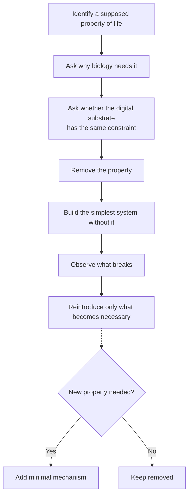
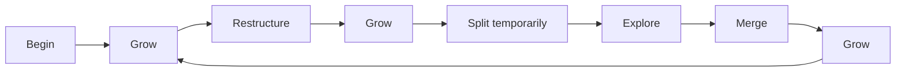
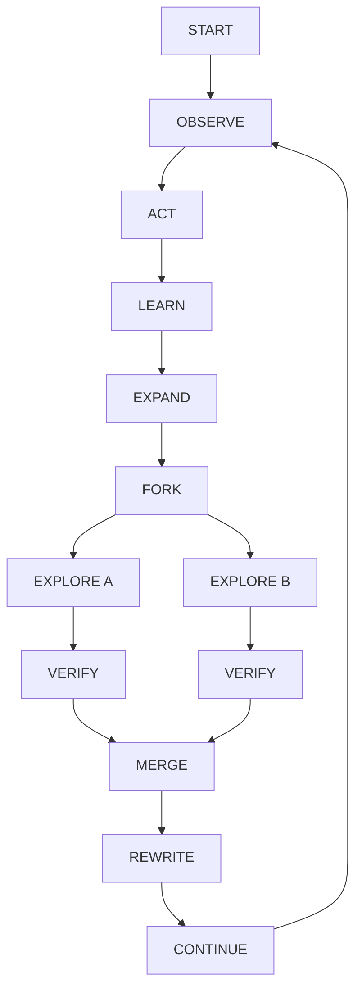
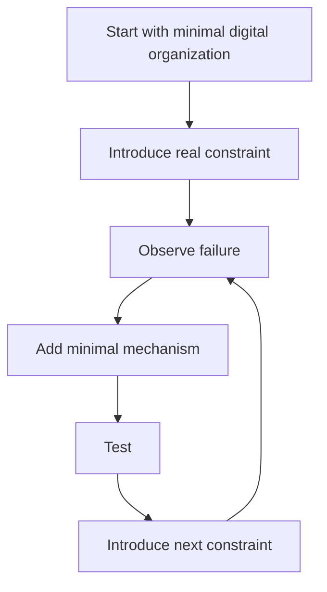
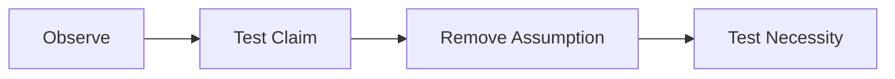

+++
title = "09: Don't Build an Animal"
date = "2026-08-11T14:58:00+01:00"
draft = false
description = "Stop treating biological life as the specification. Remove biological constraints and ask what organization actually requires in a digital substrate."
categories = ["Programming", "Artificial Life"]
tags = ["Digital Life", "Artificial Life", "Digital Substrate", "Life", "Computation", "Experimental Method"]
+++

# Don't Build an Animal

We almost made a serious mistake.

After seven chapters of experiments, it would be very easy to write down a list like this:

```text
boundary
resources
self-maintenance
damage tolerance
regeneration
memory
reproduction
inheritance
variation
selection
learning
finite lifetime
lineage
evolution
```

Then say:

> Build all of those and we will have digital life.

It sounds rigorous.  
We could turn every property into a test.  
We could build a large simulation.  
We could create `class Organism` and give it `energy`, `memory`, `genome`, `age`, `children`.

Then we could spend the rest of the book filling in the methods.

That would be a beautifully engineered mistake.

Because we would have quietly assumed the answer before doing the experiment.  
We would not be discovering digital life.  
We would be constructing a digital imitation of an animal.

---

## Biology Is One Implementation

Biological life is enormously important evidence.

It proves that matter can organize itself into systems capable of:

```text
persistence
adaptation
learning
reproduction
evolution
complex behavior
```

But biology is also constrained by its substrate.

Biological organisms are made from physical matter operating under particular limitations.

They face:

```text
finite bodies
material wear
slow growth
expensive copying
limited communication
local memory
physical transport
irreversible damage
aging
death
```

Many familiar biological mechanisms may be solutions to those constraints – not universal necessities.

A mechanism can be *essential to biological life* without being *essential to organized life in every possible substrate*.  
We need to find out which is which.

---

## Birds Are Not the Aircraft Specification

For a long time, birds were the clearest evidence that controlled heavier-than-air flight was possible.  
Studying birds was useful. Wings mattered. Airflow mattered. Control mattered.

But an aircraft did not ultimately need to recreate feathers, hollow bones, muscle, a beak, or a bird's metabolism.

The engineering problem was not “How do we manufacture a mechanical bird?”  
It was:

> **What principles actually make controlled flight possible?**

Lift. Control. Propulsion. Stability. Structure.

The substrate changed the implementation.

That is the attitude we need here.

> **We are not building a bird. We are trying to discover the aerodynamics of digital life.**

Biological organisms are evidence that the phenomenon is possible.  
They are not automatically the complete engineering specification.

---

## So Invert the Method

Instead of asking:

> Which biological properties should we add next?

ask:

> **Which apparently necessary biological properties can we remove?**

This gives us a new experimental procedure.



The rule is:

> **Never import a biological constraint unless the digital substrate actually requires it.**

---

## Start With Reproduction

Reproduction seems like one of the safest requirements.  
Almost every discussion of life includes it somewhere.

But why does biology reproduce?

One unavoidable reason is that individual biological organisms do not continue indefinitely.  
Bodies accumulate damage, age, lose function, die.

So if biological organization is to continue beyond one body, information must pass into another body:

```text
individual → finite lifetime → reproduction → successor
```

Now remove the finite lifetime.

Suppose a digital entity can continue operating, keep growing, repair damaged state, move between machines, and replace failing hardware underneath itself.

Does it still need to reproduce?  
Maybe. But the answer is no longer obvious.

---

## What If It Just Keeps Growing?

Imagine a digital organization beginning with 1 unit, then 2, 4, 8, 16, 32, 64…

Not copies. One continuing organization.  
Its memory expands. Its computational capacity expands. Its internal structure becomes richer. Its physical execution may become distributed across many machines.

At what point do we say it must create offspring? Why?

Biology cannot generally grow one organism without limit.  
A digital system may face very different limits.

So reproduction might be *one useful strategy* rather than *a fundamental requirement*.  
That is now an experimental question.

---

## Copying Is Suspiciously Cheap

There is another problem. Digital copying is trivial.

```python
copy = original.copy()
```

Files duplicate. Processes fork. Virtual machines clone. Model weights copy. Memory snapshots replicate.

If reproduction is defined too loosely, computers have been reproducing for decades.

So digital life may make copying *less* interesting rather than more.  
The important question may shift from “Can it reproduce?” to “Why would it reproduce?”

What problem does reproduction solve?  
Create independent search branches? Provide fault tolerance? Explore alternatives? Distribute computation? Preserve state? Enable competition?

Now reproduction becomes a mechanism with a purpose rather than a checkbox inherited from biology.

---

## Forking Is Stranger Than Reproduction

Suppose one digital entity reaches state `S`, then executes `fork()`. Now `S₁` and `S₂` both possess the entire history up to the fork.

Which one is the parent? Which one is the child? Are they twins? Are both continuations of the original? Did the original die?

Nothing like this maps cleanly onto ordinary biological reproduction.

The ancestry may look like a simple split, but both branches contain the original’s memories.  
Perhaps the better description is:

> **one process acquired two continuations**

That is a fundamentally digital possibility.

---

## Now Let the Branches Merge

It gets worse.

Suppose `S₁` learns `A`, `S₂` learns `B`, then they exchange state and construct `S₃ = merge(S₁, S₂)`.  
Now ancestry is no longer a tree.

```text
      S
     / \
   S₁   S₂
     \ /
      S₃
```

Biological language struggles. Who are `S₃`’s parents? Both? Did two organisms combine? Did one distributed organism temporarily split and reunite?

The right answer may depend on the mechanism, but one thing is already clear:

> **Digital lineage may naturally be a graph rather than a tree.**

That possibility should change how we think about inheritance.

---

## Acquired State Can Be Inherited Directly

Biological inheritance usually separates much of what an organism learns during life from what its descendants inherit.

Digital systems do not have to work this way.

Suppose an entity begins with knowledge `K`. During operation it discovers `A`, `B`, `C`. Its state becomes `K+A+B+C`. Now it forks. Both successors receive `K+A+B+C`.

The distinction between learning and inheritance has changed.  
Acquired information can become inherited information almost automatically. That could radically alter evolutionary dynamics.

---

## Lamarck Gets Cheap

In biology, inheritance of acquired characteristics is heavily constrained.  
Digitally:

```python
child.state = parent.state
```

makes it trivial.

But trivial implementation does not mean trivial consequence.  
If every acquired state passes forward, descendants may inherit useful discoveries alongside mistakes, noise, obsolete assumptions, and huge amounts of irrelevant history.

So the difficult problem becomes different: not *how do we transmit acquired information?* but **what should survive?**  
The scarce resource may be selection, compression, retrieval, integration – not copying.

---

## Memory May Not Be Scarce

Biological organisms have severe memory limits.  
A digital entity can potentially access gigabytes, terabytes, petabytes, external databases, search engines, vector stores, other agents.

So does digital life need internal memory in the same sense? Perhaps not.

The important distinction becomes:

```text
information exists
vs.
information can be retrieved
vs.
information can be integrated
vs.
information can change behavior
```

An entity with access to the entire internet is not omniscient.  
Access is not understanding. Storage is not memory in the functional sense we care about.

Scarcity may move from *memory capacity* to *attention, retrieval, context, integration, verification*.  
Again, the substrate changes the problem.

---

## Death Becomes Questionable

Our previous design deliberately introduced finite lifetime to make lineage experiments neat.  
But why should a digital entity die?

Biological death results from irreversible damage, aging, resource failure, predation, disease.

Digital state may support checkpoint, restore, replication, migration, redundancy, error correction.

Suppose the hardware running a process fails – the process restores from a checkpoint elsewhere. Did the organism die?  
Suppose ten machines execute parts of one system and one fails. Did the system suffer an injury?  
Suppose every physical machine is replaced gradually while the computation continues. Where exactly would death occur?

The biological concept may need substantial revision.

---

## Checkpointing Changes Identity

Imagine saving a checkpoint at `t=100`. The entity continues to `t=200`, then a catastrophe happens. We restore from `t=100`.

Is this the same entity restored, or a new entity copied from an earlier one? That is not merely philosophy; it affects lineage tracking.

Suppose both versions exist (original continuation and checkpoint continuation).  
One past state has generated multiple futures.  
Digital identity may have branching time built directly into it.

---

## The Body May Be Optional

Biological organisms have bodies. The boundary between organism and environment is often spatially meaningful.

But imagine a digital process distributed across machine A, machine B, database C, model server D, memory store E.

Which pixels belong to the organism? Which machine contains it?  
There may be no single connected geometry.

Its boundary might instead be defined by causal dependence, authorization, state ownership, information flow, control, shared objective.

This connects directly to the warning from Chapter 04: we initially used geometry to define an entity – that worked for a glider – but digital individuality may not be geometric at all.

---

## A Mushroom May Be a Better Analogy Than an Animal

Animals encourage us to think one body, one boundary, one location, one lifetime.

But even biology contains other architectures. Consider a fungal network. Much of the system is distributed. Growth can extend through an environment. The visible mushroom is only one manifestation of a larger organization.

This does not mean digital life should imitate fungi either. The point is that even biology warns us against treating *animal* as synonymous with *life*.  
Our conceptual search space should be wider.

---

## What About a Crystal?

Now push the reduction further.

Consider a crystal growing from a seed. A simple local process can produce organized growth, repetition, spatial structure, defects, continued expansion.

Suppose we build a hexagonal digital growth system. Start with one seed, allow local growth. No resource limit initially. No reproduction. No metabolism. No genome. No finite lifetime.

Just: seed + local rule + growth + time.

What properties appear?  
Can growth continue indefinitely?  
What happens after damage? Does the structure fill a hole? Is that repair or merely continued growth?  
Can defects encode history? Can different growth fronts interact?  
Could the entire history of the system become embedded in its geometry?

These are better questions than “Is a crystal alive?”

---

## Repair Versus Growth

This distinction becomes important immediately.

Suppose a growing structure contains a hole. Later the hole disappears. Did the system repair itself?  
Maybe. But perhaps growth simply continued into empty space. Those are different mechanisms.

A real regeneration claim might require:

```text
target organization exists
↓
damage moves it away from target
↓
dynamics preferentially return toward target
```

Whereas simple growth might be:

```text
empty location
↓
local growth rule activates
↓
location fills
```

No target morphology exists.

So: **repair by continued growth is not necessarily repair toward a target organization**.  
That difference deserves an experiment.

---

## Growth Itself May Be Underestimated

Biology usually gives us birth → growth → maturity → reproduction → death.

Digital organization might instead do: begin → grow → grow → grow → restructure → grow → split temporarily → merge → grow…

Perhaps there is no mature size, no adulthood, no reproductive stage. Perhaps expansion and reorganization are the fundamental dynamics.  
If so, biological lifecycle vocabulary would actively mislead us.



---

## Self-Modification Changes Evolution

Biological organisms cannot usually redesign their own inherited machinery deliberately during life. Digital systems can.

Imagine: system observes its own performance, modifies its update rule, tests modification, keeps or rejects it.

Now adaptation can happen within one continuing entity without waiting for variation across offspring and selection across generations.  
Does that make evolution unnecessary? Not necessarily. Population search may still be useful.

But once again: **a biological mechanism may become one option among several digital mechanisms.**

---

## Evolution May Become Deliberate

Consider ordinary Darwinian search: variation → selection → inheritance → repeat.

Now compare: generate candidate self-modifications → simulate or test them → evaluate consequences → adopt useful modification.

Both explore alternatives. But one operates through populations and generations; the other through internal model-based search.

A sufficiently capable digital entity might combine them: self-modification + forked experiments + population search + shared memory + merging.  
That is not biological evolution reproduced digitally. It is something else.

---

## Scarcity Does Not Disappear

None of this means digital systems are unconstrained. They are.  
But the scarce things may change.

Instead of food, water, oxygen, body mass, a digital entity might face:

```text
compute
memory
bandwidth
latency
energy
storage
attention
context
trust
verification
coordination
```

Those constraints can produce entirely different organizational pressures.

For example, unlimited stored information + limited attention creates a very different problem from limited biological memory.  
Cheap copying + expensive synchronization may make branching easy and merging difficult – that could shape digital organization profoundly.

---

## Communication Changes Individuality

Biological organisms communicate, but communication is relatively slow and low-bandwidth compared with internal neural activity.

Digital systems might exchange rich internal state directly: memories, models, strategies, verified discoveries, internal representations.

What does individuality mean then?  
If two agents synchronize every second, are they really two independent individuals?  
If they share almost all memory but act separately, are they one distributed entity?  
If synchronization stops, when do they become two?

Digital individuality may exist on a continuum. That is another reason not to begin with an assumed membrane.

---

## Information Access Is Not Assimilation

There is also a tempting mistake in the other direction.

Because digital systems can access enormous external information stores, we might imagine they no longer need learning.

But *available information* is not *usable knowledge*.

A system may have access to every scientific paper while lacking the ability to retrieve the relevant one, evaluate its reliability, connect it to the present problem, integrate it with existing models, and act on it correctly.

So learning may still matter enormously. But perhaps digital learning is less about storing facts and more about organizing, compressing, indexing, validating, connecting information.

Again, the property survives while the mechanism changes.

---

## What Should Actually Be Fundamental?

We can now start stripping the old list.

Do we require reproduction? Unknown.  
Finite lifetime? Probably not universally.  
Physical boundary? Probably not.  
Genome? Unknown.  
Metabolism? Only if translated into whatever resource-management problem the substrate actually imposes.  
Individuality? Possibly useful, but perhaps causal rather than geometric.  
Persistence? Probably important if we want to discuss one continuing organization.  
Adaptation? Potentially important, but may occur within one entity, across a lineage, or across a network.  
Memory? Some form of history-dependent state seems important for learning, but it may be external or distributed.

The list is getting shorter. And stranger. Good.

---

## Perhaps the Core Is Organization Under Constraint

Try a different starting point.

Instead of:

```text
life = boundary + metabolism + reproduction + …
```

start with:

```text
organized state
+
continued interaction
+
constraints
+
history
```

Then ask what mechanisms become necessary for that organization to persist, grow, adapt, explore, recover, accumulate useful change.

This does not define life.  
It gives us a smaller experimental starting point.

---

## The Digital Substrate Offers New Primitives

Biology gives us primitives such as cells, chemical gradients, membranes, genes, protein synthesis.

Digital systems offer very different ones:

```text
copy
fork
merge
checkpoint
restore
message
cache
search
execute
rewrite
compress
verify
```

Perhaps digital life should be built from those. Not because computer-science terminology is somehow superior, but because those operations are native capabilities of the substrate.

The equivalent of discovering aerodynamics may require us to understand which of these primitives support stable adaptive organization.

---

## A Different Life Cycle

A digital entity might therefore have a lifecycle like:



No birth. No childhood. No adulthood. No mandatory reproduction. No mandatory death.

Yet potentially history, adaptation, variation, selection, accumulation, persistence.  
That deserves investigation.

---

## Or Perhaps It Does Reproduce

We should not overcorrect.

Maybe experiments reveal that reproduction really is fundamental.  
Perhaps one continuing entity gets trapped in local optima, and forking into independent successors is necessary for useful search.  
Perhaps merge conflicts become too severe. Perhaps distributed individuality becomes unstable. Perhaps bounded lifetimes are necessary to prevent state accumulation. Perhaps some analogue of death turns out to be computationally useful.

Excellent. Then we reintroduce those mechanisms. But now we have earned them.

The method is:

```text
remove
↓
observe failure
↓
identify missing function
↓
reintroduce minimal mechanism
↓
test again
```

Not:

```text
biology has it → therefore add it
```

---

## Constraints Before Names

Suppose we want something metabolism-like.

Don't begin with `class Metabolism`. Begin with a constraint: *continued operation consumes finite compute*.

Then ask: what mechanism allows the system to obtain enough compute to continue?  
Perhaps something metabolism-like emerges as a useful description. Or perhaps the digital mechanism looks nothing like metabolism.

Likewise, instead of `reproduction`, begin with *parallel exploration is advantageous*. Then see whether copying, forking or some completely different mechanism solves it.

Instead of `death`, begin with *unbounded state accumulation becomes harmful*. Then discover whether deletion, compression, replacement, restart or lineage turnover solves the problem.

The constraint should come before the biological name.

---

## This Changes Our Engineering Strategy

The old strategy would have been:

```text
SPECIFY DIGITAL ORGANISM
↓
implement boundary, resource system, metabolism,
memory, reproduction, death, evolution
```

The new strategy is:



This is a much better way to discover what is actually necessary.

---

## The Experiment Now Runs in Both Directions

Earlier, our method was: see a property → test whether it is real.

Now we can also use: remove a supposed requirement → test whether it was necessary.

Those are complementary. One attacks positive claims. The other attacks assumptions.

Together:



That is the new experimental engine of the book.

---

## Start at the Border

So where should we go next?  
Not immediately to “digital animal.”

Start nearer the border between obvious non-life and obvious life.

Things such as crystals, growth fronts, fungal networks, cellular patterns, self-organizing structures.  
Take one property at a time. Strip away biological assumptions. See what remains.

For example: one seed + hexagonal lattice + local growth + time.

No reproduction. No metabolism. No memory variable. No programmed repair.

Then damage it. Interrupt it. Add obstacles. Give it finite resources later. Let competing growth fronts meet. Measure what happens.

Perhaps the simplest digital-life experiment is not an animal.  
Perhaps it is a crystal.

---

## The Old Question and the New Question

The old question was:

> **Can we build software that has enough biological properties to deserve the word life?**

That question got us surprisingly far. But it contains a hidden assumption.

The new question is:

> **What forms of persistent, adaptive, cumulative organization become possible when the substrate itself is digital?**

That is broader. And harder.  
Because we can no longer copy the answer from biology.

We have to discover it.

Next: **Properties of digital life**
