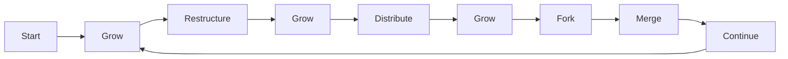
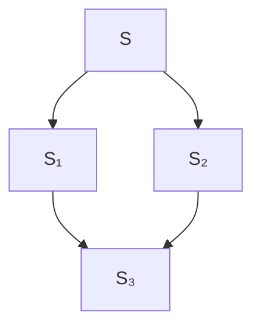
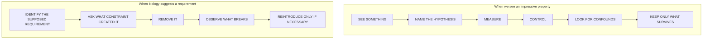

+++
title = "10: Properties of Digital Life"
date = "2026-08-11T10:36:00+01:00"
draft = false
description = "If digital life does not inhabit the same world as biological life, why should it inherit the same limits?"
weight = 10
series = ["Digital Life From First Principles"]
categories = ["Programming", "Artificial Life"]
tags = ["Digital Life", "Artificial Life", "Digital Organisms", "Information", "Growth", "Computation"]
+++

# Properties of Digital Life

We have changed the question.

For several chapters we asked how far simple computational systems could be pushed toward properties associated with life.

That gave us useful concepts:

```text
persistence
identity
robustness
regeneration
reproduction
inheritance
evolution
```

But the previous chapter exposed the assumption underneath them.

> **We were still letting biology choose the architecture.**

A biological organism exists inside one particular substrate.  
It is made from matter.  
Its signals propagate physically.  
Its components decay.  
Its copying is expensive.  
Its memory is limited.  
Its body is finite.  
Its architecture has been shaped by those constraints.

A digital system inhabits a different design space.

So the question becomes:

> **What properties would persistent adaptive organization naturally have if its substrate were computation rather than biology?**

That is the question of this chapter.

---

## Life as It Could Be

Artificial Life has always carried a broader ambition than recreating terrestrial organisms.

The important distinction is between:

```text
life as we know it
```

and:

```text
life as it could be
```

We are not trying to produce:

```text
biology
↓
translated into software
```

We are trying to discover:

```text
computation
↓
organization
↓
persistence
↓
adaptation
↓
new forms of digital organization
```

That difference changes almost everything.

---

## Start From the Substrate

The digital substrate gives us operations biology does not naturally possess.

For example:

```text
copy
fork
merge
checkpoint
restore
message
search
cache
rewrite
compress
verify
distribute
```

Some are trivial operations in software.  
Some are extremely difficult to use well.  
But they are native possibilities.

So before importing a biological mechanism, we should ask:

> **What problem was biology solving, and does the digital substrate have the same problem?**

If yes, perhaps the mechanism survives.  
If not, perhaps something very different should replace it.

---

## Growth May Be Radically Cheaper

Biological organisms cannot grow without limit.  
Growth eventually runs into constraints involving energy, material, transport, heat, structure, signal distance, geometry.

Digital systems are physical too.  
They still consume compute, memory, storage, energy, bandwidth.  
But their logical scale can change by enormous factors before the same kinds of constraints appear.

A digital organization might grow from 1 unit to 10, to 1,000, to 1,000,000 without anything analogous to bones, blood vessels or surface-area limits.

So a first hypothesis is:

> **Continued growth may remain useful across much larger scales digitally than biologically.**

That alone could change what a digital life cycle looks like.

---

## Perhaps There Is No Mature Size

Biology encourages a familiar lifecycle: birth → growth → maturity → reproduction → death.

A digital organization might instead do: start → grow → restructure → grow → distribute → grow → fork → merge → continue.



Perhaps there is no adulthood. No fixed body size. No mandatory reproductive phase. No obvious endpoint.  
If so, biological lifecycle language may actively obscure the system.

---

## Reproduction May Become Optional

Consider why biological reproduction matters so much.  
Individual biological organisms are finite and vulnerable. If organization is to persist beyond one body, information must pass into another.

But suppose a digital entity can continue operating, replace damaged hardware, move between machines, expand its memory, restore from checkpoints, restructure itself.  
Why must it create offspring?

It still might. Reproduction could provide parallel exploration, fault tolerance, competition, distributed search, independent specialization.  
But now reproduction has to justify itself as a mechanism. It is no longer automatically a requirement.

---

## Copying Is Almost Too Easy

Digital copying is cheap. A file can be duplicated. A process can fork. A model can be copied. A machine image can be cloned.

So if we define reproduction as “produce another copy”, the property becomes nearly meaningless.

The interesting questions shift to:

```text
Why copy?
What becomes independent?
What is causally continuous?
What information should transfer?
What should not transfer?
```

The difficult part may not be reproduction. It may be deciding what deserves continuation.

---

## Forking Changes Ancestry

Suppose a system reaches state `S` and forks. Now `S₁` and `S₂` share the entire history before the fork.  
Which one is the original? Perhaps both are continuations. Perhaps neither has a privileged status.

Digital ancestry may naturally begin with:

```text
shared history
↓
branching futures
```

rather than:

```text
parent
↓
child
```

That is already a different concept of lineage.

---

## And Branches May Merge

Now suppose the two branches explore different possibilities. `S₁` discovers `A`, `S₂` discovers `B`. Later a merge produces a state containing useful parts of both discoveries.

Then ancestry becomes:



A tree is no longer enough. We may need **lineage graphs** rather than family trees.  
That changes inheritance too. Information may travel downward, sideways, back together.  
Digital ancestry could be recombinational by default.

---

## Acquired Information Can Cross the Fork

Biological offspring do not usually inherit everything a parent learned. Digital successors potentially can.

Suppose an entity begins with `K` and discovers `A`, `B`, `C`. Its current state becomes `K+A+B+C`.  
If it forks, both branches can begin from `K+A+B+C`.

The distinction between learning and inheritance has now changed.  
Acquired information can become inherited information almost automatically.

---

## But Perfect Inheritance May Be Terrible

Suppose every experience is preserved generation after generation: everything learned, attempted, every failure, every temporary state, every irrelevant detail – accumulating forever.

That is not necessarily progress. It may be informational collapse.

So the hard problem becomes:

> **What should survive?**

The scarce resource may not be storage. It may be attention, retrieval, context, compression, integration, verification.

Digital life may remember almost everything and still fail because it cannot find or use what matters.

---

## External Information Changes Adaptation

Biological organisms mostly learn from inheritance, direct experience, and social transmission.  
A digital entity may also access documents, databases, code, models, historical experiments, other agents, external memory.

That changes the meaning of environment.  
For digital life, the environment may include not only resources, obstacles, other entities, but also **information systems**.

A digital organism may encounter a problem and consult a library before acting.  
That is a genuinely different adaptive strategy.

---

## Access Is Not Understanding

But information access is cheap in another misleading way. A disk can contain a million books. It does not understand them.

So the interesting property is not *information available*, but something closer to:

```text
information
↓
retrieval
↓
interpretation
↓
integration
↓
changed behavior
↓
improved outcome
```

Call that **information assimilation**.

Now we have something testable. Remove access. Corrupt retrieved information. Replace relevant documents with irrelevant ones. Measure whether behavior changes.  
The experimental method survives even when the mechanism becomes new.

---

## Understanding Itself Can Be Inherited

Suppose one system solves a difficult problem. It does not merely store `answer = 42`. It constructs a model, a representation, a strategy, a verified explanation.

Now that compressed understanding can be transferred:

```text
experience
↓
understanding
↓
compressed representation
↓
transmission
↓
successor begins ahead
```

Humans already do a weaker version through culture. Digital systems could potentially transfer much richer internal state with far greater fidelity.  
That may make cumulative improvement much easier, or create completely new failure modes.

---

## Individuality May Become Optional

A biological organism is often spatially compact.  
A digital system might be distributed across machine A, machine B, database C, model server D, memory store E.

Where is the individual?

Perhaps its boundary is not geometric. Maybe individuality is defined by causal continuity, shared state, information flow, control, authorization, coordination.

This echoes the warning from Chapter 04: connected geometry gave us a useful first entity definition.  
Digital systems may force us to replace it.

---

## Communication Can Blur the Individual

Suppose two digital entities exchange memory, models, strategies, internal state continuously.  
At what point are they still two?

If they synchronize nearly everything every second, perhaps “two processes” does not imply “two individuals”.  
If synchronization stops, when do they become separate?

Digital individuality may be graded rather than binary.  
That is another experiment waiting to happen.

---

## Embodiment May Move

A digital process could execute on one machine and later continue on another: serialize, transfer, continue.

Did the entity move? Was it recreated? Does the difference matter?  
The answer may depend on which properties remain causally continuous.  
Again, the digital substrate makes identity a mechanism question rather than a location question.

---

## Death Becomes Informational

If a system can be checkpointed, copied, distributed, restored, then process termination is not necessarily death.

A more useful digital notion might be:

> **irreversible loss of the information necessary to continue the organization**

That definition could survive hardware failure, migration, restart, checkpoint restore while still distinguishing genuine loss.

But even that remains a hypothesis. We should test it rather than legislate it.

---

## Checkpoints Create Branching Time

Suppose state `C` is saved at `t=100`. The entity continues to `t=200`. Then the checkpoint is restored separately. Now two continuations exist:

```text
history through t=100
        ↓
   ┌────┴────┐
   ↓         ↓
original   restored
```

One past can produce multiple futures. Digital identity may naturally contain branching time.

That is not a small philosophical curiosity. It affects lineage, ownership, memory, causal ancestry, responsibility, selection – if we ever build systems rich enough for those questions to matter.

---

## Self-Modification Changes Evolution

Biological evolution usually changes inherited structure through population processes.  
Digital systems may modify themselves directly.

Imagine: current system → inspect behavior → propose modification → test modification → keep or reject.

Now adaptation can happen inside one continuing entity. No offspring are required. No generational turnover is required.  
This does not eliminate evolutionary search, but introduces another mechanism.

---

## Forking Can Make Self-Modification Safer

Self-modification has a problem: a system may destroy itself.  
Forking provides a digital alternative:

```text
current state
↓
fork candidates
├── modification A
├── modification B
└── modification C
↓
test independently
↓
retain useful result
```

Now evolutionary variation and deliberate engineering begin to overlap.  
A digital entity might generate its own variants, evaluate them and integrate successful changes. Evolution could become partly intentional.

---

## Scarcity Does Not Disappear

It would be a mistake to conclude digital systems have no resource constraints. They absolutely do.

The likely change is that **scarcity moves**.

Possible scarce resources include: compute, memory, bandwidth, latency, storage, energy, attention, context, trust, verification, coordination.

Perhaps copying is cheap but synchronizing copies is expensive.  
Perhaps information is abundant but trustworthy information is scarce.  
Perhaps storage is plentiful but retrieval is the bottleneck.  
Perhaps compute is plentiful but serial decision time matters.

Different scarcity creates different organizational pressure.  
That may be where genuinely digital forms of life begin to diverge most strongly from biological ones.

---

## Some Biological Properties May Return

We should not overcorrect.  
Perhaps experiments eventually show that digital organization still benefits from something equivalent to boundaries, resource budgets, death, reproduction, error correction, individuality.

Excellent. Then those mechanisms earn their place.

The important difference is the direction of reasoning:

```text
Not: biology uses it → add it
But: remove it → observe failure → identify missing function → reintroduce minimal mechanism → test again
```

That is the substrate-first method.

---

## A Provisional Comparison

We can now write a hypothesis map.

| Biological constraint or pattern | Digital possibility |
|----------------------------------|---------------------|
| Finite growth | Potentially enormous continued growth |
| Expensive reproduction | Cheap copying and forking |
| Limited inheritance of acquired state | Direct transfer of learned state |
| Slow communication | High-bandwidth state exchange |
| Local information | Access to external information systems |
| Tree-like lineage | Branching and merging graphs |
| Fixed body | Distributed or movable execution |
| Irreversible physical death | Checkpoint, restore and redundancy |
| Blind mutation | Deliberate self-modification |
| Generational adaptation | Continuous adaptation within one process |
| Limited memory | Vast external storage |
| Expensive knowledge transfer | High-fidelity representation transfer |

This is **not** a definition of digital life. It is a map of differences worth testing.

---

## Our Current Hypotheses

We should write them down explicitly – not as findings, but as hypotheses.

- **Hypothesis 1:** Digital growth can remain useful across scales far beyond normal biological growth before resource constraints dominate.
- **Hypothesis 2:** Acquired information can become directly inheritable and may fundamentally alter adaptation.
- **Hypothesis 3:** Copying may be so cheap that reproduction becomes a strategic operation rather than a defining property.
- **Hypothesis 4:** Digital ancestry may naturally form branching and merging graphs rather than simple trees.
- **Hypothesis 5:** Digital death may correspond more closely to irreversible informational discontinuity than process termination.
- **Hypothesis 6:** External information access and assimilation may be basic environmental interactions for digital entities.
- **Hypothesis 7:** Scarcity may shift toward compute, bandwidth, attention, integration, trust and coordination.
- **Hypothesis 8:** Self-modification may allow some evolutionary processes to become deliberate.

None of these is established. That is important.  
They are the next research program.

---

## Start With the Simplest One

We could try to test all eight at once. That would be a disaster.  
Instead, begin with the simplest difference: **growth**.

A biological organism cannot simply grow-grow-grow-grow without radically changing architecture.  
Can a digital structure?

Start with almost nothing. A seed. A lattice. A local growth rule. No metabolism. No reproduction. No death. No genome. No memory variable. No intelligence. No artificial resource scarcity.

Only:

```text
structure
+
local growth
+
time
```

Then watch what becomes necessary.

---

## Why a Crystal?

A crystal is a useful place to begin because it sits near several boundaries we care about.

It has: organization, growth, local interaction, persistence, structural propagation, defects.  
Yet we normally do not call it alive.

Perfect.

We do not need to begin with something that obviously looks like an organism.  
We can begin with something that is obviously organized. Then ask:

> **What is missing?**

---

## One Seed

Imagine a hexagonal lattice. At the center: `●`. One occupied position.

Now use a simple local growth rule. For example:

> An empty location may become occupied when it touches the existing structure.

Then a single seed expands outward. No food. No energy variable. No parent. No child. No metabolism. No programmed repair. Just structural propagation.

Our first question is:

> **What happens if nothing tells it to stop?**

---

## Then Attack It

Once the crystal grows, we can use the method we already developed.

Ask:

```text
Does unlimited growth remain ordered?
What kinds of defects appear?
Do defects persist? Do defects propagate?
What happens if we remove a region?
Does the structure fill the hole?
Is that repair or merely continued growth?
Can two growth fronts coexist? Can one invade another?
Does history become encoded in the structure?
Does increasing scale create new constraints?
```

These are empirical questions. Now the substrate-first theory begins producing experiments.

---

## Growth Is Not Automatically Repair

Suppose we remove a patch from the crystal. Later the hole fills. It is tempting to say “it repaired itself.”

But perhaps the rule simply fills any empty location touching the structure. Then the hole disappeared because growth continued.

That is different from:

```text
target structure
↓
damage
↓
deviation from target
↓
dynamics detect or encode that deviation
↓
return toward target
```

So: **continued growth into a hole is not automatically regeneration toward a target morphology.**

This is exactly the sort of distinction the book is now equipped to make.

---

## The New Method

From here on, we have two complementary experimental moves.



One tests claims.  
The other tests assumptions.  
Together they give us a way to investigate digital life without defining the answer in advance.

Next: **The Crystal**
