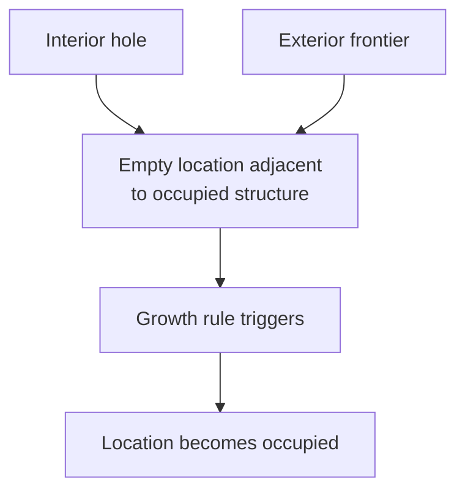
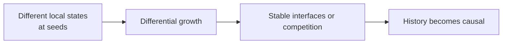
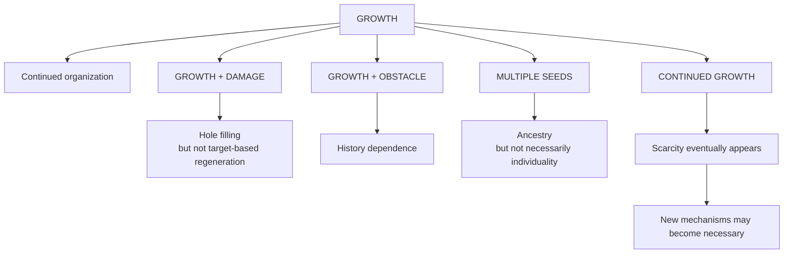

+++
title = "11: The Crystal"
date = "2026-08-11T15:18:00+01:00"
draft = false
description = "Begin with one seed on a hexagonal lattice and ask how far growth, damage, defects and history can take us before anything resembling life is required."
categories = ["Programming", "Artificial Life"]
tags = ["Digital Life", "Cellular Automata", "Crystal Growth", "Hexagonal Grid", "Growth", "Repair", "Emergence"]
+++

We have spent ten chapters making the question harder.

Then we made one important decision.

We are not going to build an animal.

We are not going to start with:

```text
body
energy
hunger
genome
reproduction
age
death
```

and hope that enough biological nouns eventually add up to life.

Instead we are going to begin from the digital substrate.

Remove almost everything.  
Introduce one capability.  
Then discover what becomes necessary.

Our first capability is:

> **growth**

Nothing else.

---

## One Seed

Imagine a hexagonal lattice.

At the center is one occupied location.

```text
●
```

Everything else is empty.

There is no organism.  
No genome.  
No stored target shape.  
No energy.  
No resources.  
No reproduction.  
No death.  
No memory variable.  
No learning.  
No objective.

The state of each location is only `0` or `1`.  
Exactly as in our earlier cellular automata.  
But this time the world is hexagonal.  
Each location has six immediate neighbors.

And our rule will be almost embarrassingly simple:

> **An empty location becomes occupied if at least one neighboring location is occupied.**

Once occupied, it stays occupied.

That is the entire system.

---

## Do Not Call It a Crystal Yet

We are going to call this chapter **The Crystal**.  
But the name is descriptive, not a scientific claim.  
This is not intended to simulate real crystallization.  
Real crystals involve physical processes we are deliberately ignoring.

Our system is merely:

> **an irreversible local growth process on a hexagonal lattice**

We use the crystal analogy because the resulting geometry is useful.

Again:

```text
name
≠
mechanism
```

---

## Build a Hexagonal World

A square array is convenient for images.  
But hexagonal neighborhoods are easier to reason about using **axial coordinates**.

Represent each location using `(q, r)`.  
Its six neighbors are:

```python
HEX_DIRECTIONS = [
    (1, 0),
    (1, -1),
    (0, -1),
    (-1, 0),
    (-1, 1),
    (0, 1),
]
```

So:

```python
def neighbors(q, r):
    for dq, dr in HEX_DIRECTIONS:
        yield q + dq, r + dr
```

Our world can simply be a set containing occupied coordinates.

```python
occupied = {(0, 0)}
```

One seed.

---

## The Growth Rule

Now implement one update.

```python
def step(occupied):
    candidates = set()

    for q, r in occupied:
        for position in neighbors(q, r):
            if position not in occupied:
                candidates.add(position)

    return occupied | candidates
```

That's it.  
Every empty location touching the structure becomes occupied.  
Existing locations remain occupied.

Run it repeatedly:

```python
history = [occupied]

for _ in range(20):
    occupied = step(occupied)
    history.append(occupied)
```

We have not programmed “make a hexagon” anywhere.  
We programmed local adjacency plus irreversible occupation.

What does that produce?

---

## The First Surprise Is Almost No Surprise

Starting from one seed:

```text
t = 0
```

we get one occupied location.  
At `t = 1` its six neighbors become occupied.  
Then their neighbors. Then theirs.

The growing region forms expanding hexagonal shells.



The reason is simple.  
After `t` updates, every location within hexagonal graph distance `t` of the seed has become occupied.  
The global hexagonal shape follows from the hexagonal neighborhood plus uniform local propagation.

No cell contains a blueprint of the final shape.  
No controller measures the radius.  
No one draws the six sides.  
The geometry follows from the neighborhood itself.

---

## What Can We Claim?

Already we need discipline.

We saw organized geometric growth.

Can we say the crystal grew? Yes, operationally – the occupied region becomes larger through local state transitions.  
Can we say it developed? Maybe, but that word suggests more than we have shown.  
Can we say it self-organized? Possibly in a weak sense, but the word can obscure the mechanism.  
Can we say it is alive? Absolutely not.

Our bounded claim is much smaller:

> **A single seed under a uniform local irreversible rule produces ordered growth whose global geometry is determined by the topology of the neighborhood.**

That's enough.

---

## Measure Growth

Instead of merely watching the animation, measure the system.

The simplest observable is population:

```python
def population(occupied):
    return len(occupied)
```

For a perfect hexagonal ball of radius `r` on this lattice, the number of occupied cells is:

$$
N(r) = 1 + 3r(r + 1)
$$

So `r=0` gives 1, `r=1` gives 7, `r=2` gives 19, `r=3` gives 37, `r=4` gives 61.

The radius grows approximately linearly with time.  
The occupied area grows quadratically.



Our visual structure looks increasingly large, but its growth remains almost completely predictable.

---

## Growth Is Not Complexity

This is our first warning.

The structure becomes larger with every generation.  
But larger ≠ more complex.

A million-cell crystal generated by this rule may be no more conceptually complicated than a seven-cell crystal.  
The description remains: seed + hexagonal neighborhood + grow outward + time.

The size increases. The generative explanation barely changes.

So unlimited growth alone does not buy us very much.  
That is already a useful result.

---

## Let It Grow Forever

Our first substrate-first hypothesis was:

> Perhaps digital systems can keep growing where biological organisms cannot.

This system can.  
In the abstract model there is nothing internally forcing growth to stop.  
`t=10`, `t=100`, `t=1,000`, `t=1,000,000` – the structure simply expands.

No mature size appears. No reproduction becomes necessary. No aging emerges. No death occurs.

So at least in this toy world:

> **continued growth does not require a biological lifecycle.**

That does not mean a real digital system can grow without cost.  
Our simulation eventually consumes memory, compute, time.  
But those limits come from the substrate hosting the simulation – they are not currently represented inside the world.  
That distinction is important.

---

## External Scarcity Versus Internal Scarcity

Eventually our computer runs out of resources. But does the crystal know that? No.

From inside our model: `resources = unlimited`.  
From outside: RAM = finite, CPU = finite, wall-clock time = finite.

This gives us an important distinction:

```text
external implementation constraint
```

is not automatically:

```text
environmental constraint experienced by the digital system
```

If we later want resource competition to matter to the crystal, we will have to put that scarcity into the model.  
We should not pretend the Python process slowing down is metabolism.

---

## Now Damage It

Growth by itself is easy. Let's interfere.

Allow the crystal to grow for twenty generations. Then erase a region from its interior.

Now resume the same local rule.

The empty cells inside the hole touch occupied cells, so they become occupied. Then their neighbors do. Soon the hole disappears.



This looks suspiciously like repair. Is it?

---

## Did It Heal?

Our eyes want to say yes. We damaged it. The missing region came back.

But remember Chapter 05. Recovery has to mean something more precise than “empty space became occupied again.”

Our growth rule says: any empty location adjacent to occupied structure becomes occupied. That rule operates outside the crystal and inside a hole in exactly the same way.  
The system does not distinguish damage from ordinary frontier.

So the hole closes, but not because the system contains information about a target morphology.  
It closes because continued growth plus available empty space fills it.



The same mechanism drives both interior filling and exterior expansion.  
There is no special damage response.

That gives us an important distinction:

> **Repair by continued growth is not necessarily repair toward a target organization.**

---

## Build the Control

How do we test that explanation?

Create two empty regions.  
One is a hole inside the crystal. The other is empty space just outside the crystal.  
Give both comparable boundaries of occupied neighbors. Then measure their filling.

If the system treats both identically, there is little evidence for a special repair response.

Define:

- \(F_{\text{damage}}(t)\) – fraction of damaged cells refilled after `t` updates.
- \(F_{\text{control}}(t)\) – fraction of matched ordinary empty cells filled.

Then compute:

$$
R(t) = F_{\text{damage}}(t) - F_{\text{control}}(t)
$$

If \(R(t) \approx 0\), the system shows no preferential response to damage under this measure.  
If \(R(t) > 0\) consistently, then damaged regions may be treated differently.

Our present rule predicts essentially no special repair mechanism. The hole closes. The repair hypothesis does not survive. That's a good experiment.

---

## The Picture Survives; the Explanation Does Not

This is exactly why we built Chapter 08.

The observation remains true: the hole disappeared.  
But our first interpretation – “the crystal repaired itself” – gets weakened.

A better statement is:

> **The same local growth dynamics that expand the exterior also refill newly emptied interior regions.**

Less exciting. More informative. Now we know the mechanism.

---

## Damage the Edge Instead

What if we erase part of the outer frontier?  
The crystal continues growing. Soon the missing edge may become difficult to see.

Again: damage → continued growth → visual disappearance of damage.  
But this still does not establish restoration of a target shape.  
A sufficiently expanding system can simply overwhelm evidence of earlier damage. That is another trap.

---

## Growth Can Hide Failure

Imagine removing half the crystal. The surviving half continues expanding.  
After 1,000 generations, the resulting object may again be enormous.  
If we only inspect the final size, we might conclude “incredible robustness.”  
But perhaps half the original organization was permanently lost. The system merely kept growing.

So: large final structure does not imply recovery of prior organization.  
Again, the metric matters.

---

## Give It a Defect It Cannot Erase

Now introduce something different.  
Mark several locations as permanently blocked. They can never become occupied.

The growth front encounters the obstacle, grows around it, and the obstacle remains.



Now we have something new: a defect that persists inside an otherwise ordered structure.  
The history of an encounter can remain visible.

---

## The Structure Can Contain History

Suppose the obstacle is removed later.  
Our present rule will eventually fill the empty region, so its visible history disappears.  
But while the obstacle remains, the current structure contains evidence of something that happened in its past.

This raises a more interesting question:

> **Can a growing digital structure encode history in persistent morphology?**

Our simplest crystal mostly cannot – its growth tends to erase temporary holes.  
But permanent constraints leave persistent marks.

That distinction suggests a new property: **history dependence** – not yet **memory**.

---

## History Dependence Is Not Memory

Suppose a tree bends around a wall. Years later, its shape reflects the wall's presence.  
Was the wall memorized? Not necessarily in the sense we usually mean by memory.

The current state was shaped by past interaction. That gives us history dependence.  
Memory may require something stronger:

```text
past event
↓
persistent internal state
↓
future behavior changes
```

Our crystal's morphology may preserve traces of the past without using those traces for anything.  
Again:

```text
history encoded
≠
memory demonstrated
```

---

## Remove the Obstacle

This gives us another experiment.

Run two crystals:  
- Experiment A – no obstacle.  
- Experiment B – a temporary obstacle.

After some generations, remove the obstacle. Then continue both systems.

Ask:

```text
Do their states eventually become identical?
Does the temporary event leave a permanent morphological trace?
How long does that difference persist?
```

Now we can use the difference field from Chapter 03 again.

```python
difference = crystal_a ^ crystal_b
```

Conceptually: same seed, same rule, same world → temporary perturbation in one run → remove perturbation → track divergence.

This is the same experimental instrument returning in a new context.

---

## Does the Crystal Forget?

Under our very simple fill-everything rule, something interesting is likely to happen.  
Once the temporary obstacle disappears, the previously blocked region fills. Eventually both worlds may approach the same occupied region for the same growth radius.  
The perturbation can be erased.

In that sense the system *forgets* the temporary obstacle.  
But again, use the word carefully.  
We can say:

> **The state difference caused by a temporary obstacle eventually disappears under the tested growth dynamics.**

That is measurable. Whether we call that forgetting is secondary.

---

## Make Growth Less Trivial

Our first rule is intentionally crude – it produces a nearly perfect expanding hexagon.

What happens if occupation requires more local support? For example, `occupied_neighbor_count >= 2`.  
Or exactly 1 or 3. Or exactly 2.  
Now local geometry matters much more.

Different rules may produce solid growth, branching, holes, frozen fronts, irregular boundaries, fragmentation.  
This becomes a small rule space we can search.

But remember the warning: we should not search thousands of rules and show only the prettiest crystal without recording the search.

---

## Search the Growth Rules

For a six-neighbor binary lattice, a growth-only rule can be defined by deciding whether an empty cell becomes occupied for each possible number of occupied neighbors (0–6).  
If occupation remains irreversible, there are only \(2^7 = 128\) possible neighbor-count growth rules.

That is tiny. We can enumerate all of them. This gives us another complete laboratory.

For every rule, measure: growth rate, density, boundary size, hole count, connected components, symmetry, sensitivity to damage.

Now instead of asking “which one looks crystal-like?” we can ask:

> **What classes of growth dynamics exist?**

That is much stronger.

---

## The First Rule Is Our Control

Our simple `grow if neighbors >= 1` rule is useful precisely because it is boring. It gives us a baseline.  
Any more sophisticated rule has to be compared against it.  
If another rule appears to repair, maintain structure, create branching, or preserve defects, we can ask whether it does anything the trivial growth rule does not.

This is why starting simple matters.

---

## Can Two Crystals Meet?

Now seed two structures.

Both expand. Eventually the fronts meet.

Under our binary model, `occupied` is just `occupied`. Once the fronts touch, the final state does not preserve which seed contributed which region. The two structures merge seamlessly.



Now ask: are there still two crystals?

---

## Our Entity Definition Breaks Again

Before contact, geometry gives us two disconnected components: A and B.  
After contact: one connected component, AB.

Did two entities become one? Did both die? Did one absorb the other? Was there always only one growing field with two seeds?  
Our binary state cannot answer.

This is exactly the problem Chapter 04 warned us about. Connected geometry is useful – but it is not automatically individuality.

---

## Add Ancestry as Measurement, Not Mechanism

We can learn more without changing the growth rule. Keep the binary world exactly the same.  
But during analysis, record which predecessor caused each new cell to become reachable.

For two seeds (A and B) we can assign provenance. Where the fronts meet, a boundary line forms:

```text
A A A A | B B B B
A A A A | B B B B
A A A A | B B B B
```

Important: the labels are not part of the crystal's dynamics. They are our measurement.  
The actual world still contains only `0` or `1`. But our experimental record contains ancestry.

This gives us two views of the same system:

```text
STATE VIEW – one merged crystal
PROVENANCE VIEW – two growth histories meeting
```

Now individuality depends on the question.

---

## The Final Shape Can Erase Ancestry

If we throw away our provenance record and inspect only the binary state (`111111...`), the ancestral boundary may be invisible.  
Two very different histories can produce the same final configuration.  
That is important: **state alone may be insufficient to reconstruct history**.

A digital system's present appearance does not necessarily tell us how it came to exist.  
We will encounter exactly this problem when we start talking about reproduction. Similarity cannot prove ancestry.

---

## The Same Shape Can Have Different Histories

Imagine two experiments:  
- Run A – one seed grows outward.  
- Run B – several seeds grow and merge.

At a sufficiently late time, some region of the binary state may look identical. Yet their histories are different.

Conceptually:

```text
same present state
≠
same causal history
```

This may be one of the most important lessons from our crystal.  
The world can forget. Our experiment does not have to.

---

## Provenance Becomes Part of the Specimen

We therefore might store for every occupied location: cell, birth time, predecessor, seed ancestry.  
Now the crystal is no longer just an image – it becomes a research specimen.

We can ask: when was this cell created? Which seed ultimately caused it? Which growth front reached it? Where did fronts meet? Which historical events remain visible, and which are visible only in provenance?

This connects directly to the experimental architecture we established in Chapter 08.

---

## Is Ancestry a Property of the World?

Be careful. Our provenance database knows *this cell came from seed A*. But does the crystal know that? No.

We have created observer memory, not system memory.  
That distinction is crucial. Just because our instrumentation can reconstruct history does not mean history is available to the digital entity.  
For history to affect future behavior, the system itself would need some state through which ancestry matters.

We have not added that. Yet.

---

## What Happens Without Ancestry?

With the binary rule, two growth fronts are equivalent. After contact, A and B lose their distinction. The world cares only about `occupied` or `empty`.

This gives us a clean result:

> **Distinct historical origins do not necessarily create distinct future behavior.**

Ancestry can exist as a fact about history while being causally irrelevant to future dynamics.  
That's a subtle but important distinction.

---

## Make Ancestry Matter

Now we can imagine a future modification. Suppose different seeds carry different local states (`A` vs `B`) and those states affect growth.  
Then when their fronts meet, the boundary may matter dynamically.

Perhaps A grows faster, B resists invasion, interfaces become stable, one type converts the other.

Now ancestry has entered the mechanism.



This starts moving us toward competition, inheritance, selection.  
But notice the progression: we did not begin by implementing genes.  
The simple crystal encountered a limitation, and then a reason for persistent variation began to appear.  
That is exactly the method we wanted.

---

## Can the Crystal Reproduce?

Our current structure simply expands. One connected region becomes a larger connected region.  
So by the criterion from Chapter 06: growth ≠ reproduction.  
There is no obvious parent plus spatially distinct offspring.

The crystal demonstrates something important:

> **continued persistence and enormous growth can occur without reproduction.**

At least in this toy world. That supports one of our substrate-first hypotheses. Reproduction is not required merely for the structure to continue.

---

## But the Price Is Obvious

The structure occupies more and more space. Eventually growth becomes resource consumption, even if the model does not represent resources explicitly.

Suppose space becomes finite. Then unlimited growth encounters a constraint.  
This is where the experiment becomes interesting.

We did not insert “hunger” because biology has hunger. We allowed growth until it created its own problem. Now the missing mechanism can earn its place.

---

## Introduce Finite Space

Put the crystal inside a bounded world. Eventually it reaches the edge. Growth stops.

Not because the crystal matured. Not because it aged. Not because it decided to stop.  
Because `available space = 0`.

Our first internally meaningful scarcity has appeared.  
Now we can ask: what should a growing digital organization do when expansion is no longer possible?

Possible strategies: restructure internally, compress, stop, compete, move, overwrite, fork elsewhere, obtain more space.  
Now those mechanisms have a reason to exist.

---

## Scarcity Has Emerged From Growth

This is exactly what we hoped the substrate-first method would do.

We began with no artificial resource economy. We allowed growth. And eventually encountered finite space.  
Now scarcity is not a biological decoration – it is a genuine consequence of the model.  
This is a much better reason to introduce resource competition.

---

## Compute Becomes Another Resource

Our implementation has another cost. As the crystal grows, the number of active locations increases. Our simulation must process them. So computational cost increases.

Again, that cost currently exists outside the modeled world. But we could internalize it.

Suppose every entity receives 100 update operations per generation. Now a large structure cannot update every component. Suddenly continued growth creates an internal coordination problem: which parts receive attention? Which parts remain stale? Can the organization maintain coherence?

This is much closer to a genuinely digital scarcity.

---

## Attention May Emerge Before Energy

That is an interesting inversion.

Instead of: food → energy → survival  
Our digital system might encounter: size → too much state → limited update budget → attention allocation → continued coherence.

Perhaps the analogue of metabolism is not an `energy` variable at all.  
Perhaps it is: **allocation of limited computation to the parts of the organization that matter**.

We do not know. But now we have a reason to investigate it.

---

## What Did the Crystal Teach Us?

We deliberately started with something almost too simple to fail.

It:

- grows,
- persists,
- fills holes,
- merges with other growth fronts,
- can preserve or erase traces of history.

But it does not:

- reproduce,
- learn,
- adapt,
- maintain a target morphology,
- distinguish damage from empty space,
- care about ancestry,
- manage internal resources.

That is exactly what we wanted. The experiment has started separating properties that our biological vocabulary tends to bundle together.

### Growth Without Reproduction
The crystal can persist and expand without offspring.  
So continued organization does not automatically require reproduction in this digital model.

### Hole Filling Without Regeneration
The crystal can replace removed cells without representing a target shape.  
So damage disappears does not automatically require regeneration.

### History Without Memory
Temporary events can alter a trajectory. Persistent obstacles can leave structural traces.  
So history dependence does not automatically require memory.

### Collision Without Individuality
Two growing regions can meet and merge into one connected state.  
So spatial components do not automatically give us a stable theory of individuals.

### Ancestry Without Inheritance
Our provenance system can tell us which seed produced which region.  
But if ancestry does not affect future dynamics, ancestry exists historically without inheritance doing causal work.  
That distinction will matter later.

### Scarcity Without Metabolism
Unlimited growth eventually encounters finite space, compute, update budget.  
So scarcity can arise naturally without adding a variable called `energy`.  
That may eventually demand a resource-management mechanism – but now that mechanism will be solving a real problem.

---

## The Substrate-First Method Worked

This was the real experiment. Not “Can we make a pretty hexagon?”  
We wanted to know whether beginning without biological machinery would immediately force us to put it all back.

It did not.

Instead we discovered a more interesting sequence:



The constraints are beginning to generate the architecture. That is exactly what we wanted.

---

## Our First Substrate-First Evidence Ledger

### What We Built
```text
binary state
+
hexagonal lattice
+
one seed
+
local irreversible growth
```
No biological lifecycle was programmed.

### What We Observed
The seed generates ordered expanding structure.  
Interior holes become occupied again.  
Temporary and permanent obstacles affect growth differently.  
Multiple growth fronts can merge.

### What We Measured
```text
occupied population
growth radius
damage refill
state differences
growth-front ancestry
```

### What Survived
Ordered growth arises from local dynamics without a global morphology blueprint.  
Continued expansion does not require reproduction.  
Hole filling does not require a special damage-response mechanism.  
Multiple historical lineages can become geometrically indistinguishable.

### What Did Not Survive
The claim “the crystal heals itself” is too strong for the base rule.  
The same dynamics fill ordinary exterior space and damaged interior space.  
We have no evidence for target-directed regeneration.

### What We Can Claim
> **A minimal irreversible digital growth process can exhibit ordered continued expansion, refill removed regions through ordinary growth, and merge histories without requiring reproduction, memory, a target morphology or a biological lifecycle.**

### What We Cannot Claim
We have not demonstrated:
```text
life
regeneration
learning
adaptation
self-maintenance
reproduction
inheritance
individuality
evolution
```

---

## The Crystal Is Not Alive

Good. That was not the objective.

The crystal is useful because it gives us something simpler.  
It lets us begin separating **growth** from **life** and asking what actually becomes necessary as the system encounters stronger constraints.

That is a much better starting point than assembling a digital animal.

---

## But Now Look at the Gap

Our crystal is intentionally primitive.  
It grows because the rule makes empty neighboring locations become occupied.  
It does not discover how to grow. It does not invent new structures. It does not reproduce itself into persistent descendants. It does not maintain a causal individual. It does not evolve. It does not surprise us for very long.

So perhaps we should now look at the other end.  
Not at our simplest possible construction.  
At the strongest existing examples we can find.

What happens when researchers allow simple local dynamics to run and genuinely unexpected reproducing organization appears?  
How close has Artificial Life actually come?

That is the next question.

Next: **The Closest Thing We Have**
