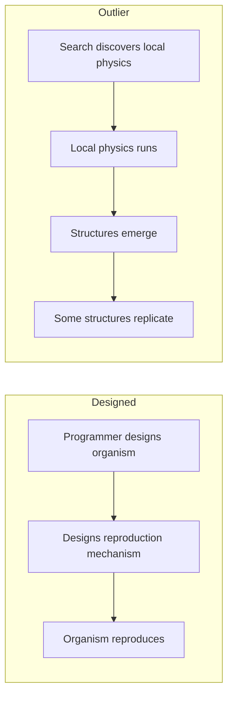
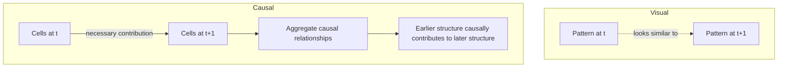

+++
title = "12: The Closest Thing We Have"
date = "2026-08-11T10:43:00+01:00"
draft = false
description = "We examine Outlier, an unusually minimal artificial-life system in which causally verified self-replicating structures emerge from local cellular-automaton dynamics."
categories = ["Programming", "Artificial Life"]
tags = ["Digital Life", "Artificial Life", "Outlier", "Cellular Automata", "Self-Replication", "Causality"]
+++

Before building anything more complicated, we should steal everything we can.

Not code.

Ideas.  
Experiments.  
Failures.  
Mechanisms.

So let's ask an obvious question:

> **How far has computation already gone without us deliberately building the organism?**

There is no objective answer.

Different Artificial Life systems demonstrate different properties.

Evoloops demonstrated Darwinian evolution of self-reproducing structures inside a deterministic cellular automaton.[1]

Flow-Lenia produces spatially localized continuous structures with complex behaviour, conserves mass, and allows parameters governing different pattern dynamics to become localized inside the world itself. Researchers have measured emergent evolutionary activity in the resulting system.[2]

Genelife attaches inheritable genomes to cellular dynamics and has demonstrated continuing genetic and spatial innovation, while its authors explicitly distinguish this from the stronger functional innovation characteristic of biological evolution.[3]

Other computational systems have shown that self-replicating programs can emerge from simple interactions without an explicit fitness landscape.[4]

All of those matter.

But for what we are trying to understand, one system is particularly useful.

It is called:

## Outlier

And initially it looks almost absurdly small.

---

## This Chapter Is an Excursion

Before going further, we need to be precise about what role Outlier plays in this book.

Chapter 11 gave us a deliberately simple system:

```text
one seed
+
one local growth rule
+
one lattice
+
time
````

We built that system ourselves.

We knew exactly why every mechanism was there.

Outlier is different.

It is an independently discovered cellular automaton in which surprisingly complicated structures appeared before anyone had decided what those structures should be.

So:

> **Outlier is not the next version of our crystal.**

We are not replacing our controlled growth model with Outlier.

We are leaving our laboratory temporarily and looking at a frontier system.

Our questions are:

```text
What has simple digital physics already produced?

Which biological-looking interpretations survive
when causality is reconstructed?

Which ideas are worth carrying back
into our controlled experiments?

Which ideas should be discarded?
```

That distinction will become important.

After Outlier, we will return to systems of our own construction.

But we should first learn everything this one can teach us.

---

## Two States

The universe contains cells.

Every cell is either:

```text
0
```

or:

```text
1
```

Dead and alive are convenient names, but unnecessary ones.

We could equally call them:

```text
OFF
ON
```

Each cell examines a `3 × 3` Moore neighborhood:

```text
a b c
d e f
g h i
```

including itself.

Nine bits means:

$$
2^9 = 512
$$

possible neighborhood configurations.

For every configuration, the rule says:

```text
next state = 0 or 1
```

That is the universe.

There is no built-in:

```text
organism
energy
genome
reproduction API
individual
fitness function
```

Just:

```text
binary state
+
local neighborhood
+
transition rule
+
time
```

The published Outlier rule is rotationally symmetric.

Its complete transition table contains:

```text
512 neighborhood cases
220 live outputs
292 dead outputs
```

That is all the local physics.

---

## Nobody Designed the Organism

This distinction matters.

Outlier was discovered during an automated search through cellular-automaton rules intended to find dynamics conducive to open-ended evolution.[5]

The search did not begin by constructing:

```python
class Organism:
    ...

class Reproduction:
    ...
```

Nor was there a hand-designed structure whose reproduction mechanism had been carefully engineered.

Instead the search found:

> **a rule for the universe**

and structures appeared inside that universe.


Conceptually:



The second route does not establish life.

But it removes an enormous amount of cargo cult.

---

## Start Almost From Nothing

The published rule can produce rich behaviour from sparse random initial conditions.

Small shape-changing clusters appear.

Some clusters produce additional clusters.

Some periodically duplicate.

Multiple smaller structures can assemble into larger formations.

Those formations can themselves replicate.

Collections of them can eventually form the boundary of a still larger expanding complex.[5]

So the published system contains organization at multiple scales:

```text
cells
  ↓
clusters
  ↓
replicating formations
  ↓
larger expanding complex
```

Replication appears at more than one scale.


That is already strange.

But we have spent enough of this book learning not to stop at strange.

---

## There Was Still a Problem

Suppose we see:

```text
A
```

and later:

```text
A     A
```

It is tempting to say:

> A reproduced.

But perhaps the first `A` did not cause the second one.

Perhaps the local dynamics simply created another similar-looking configuration nearby.

Those are completely different claims.

```text
visual recurrence
≠
causal reproduction
```

So in 2026, Arend Hintze and Clifford Bohm returned to Outlier with a much stronger question.

They reconstructed **causal ancestry**.[6]

---

## Who Caused Whom?

The method asks something close to:

> Which cells in the previous state were necessary for this later cell to appear?

At cell level:

```text
previous cells
     ↓
causal contribution
     ↓
new cell
```

Those dependencies can then be aggregated into relationships between larger structures:

```text
cluster A
    ↓
cluster B
    ↓
cluster C
```

Now the question is no longer merely:

```text
does this look like that?
```

It becomes:

```text
did this organization
causally contribute to
the existence of that organization?
```

That gives us an ancestry graph.

The 2026 analysis found branching causal reproduction in Outlier: earlier structures could causally produce multiple later structures, which could themselves participate in continuing lineages.[6]

That is a substantially stronger claim than visual similarity.



The distinction will matter enormously in the next chapter.

---

## 433 Copies

The 2026 experiment used a much larger system than the small examples we will run later.

It ran Outlier on:

```text
grid       1024 × 1024
boundary   periodic
duration   20,000 updates
```

The resulting causal analysis contained tens of millions of cluster instances and causal relationships.[6]

Consider the original seed cluster, called `c0`.

Within the first 10,000 updates, the researchers identified:

```text
433
```

copies causally descending from that original seed.[6]

But those descendants did not indefinitely continue the same `c0` lineage.

So we immediately learn something useful:

```text
replication
≠
successful long-term lineage
```

Producing another instance is not the same as founding a persistent dynasty.

---

## Then They Found Better Replicators

Other structures generated branching, multi-generation causal lineages.

One cluster type, `c2`, became particularly useful for tracing reproduction through the causal graph.[6]

The surrounding environment also mattered.

Replicators produced:

```text
debris
collisions
fragments
recombinations
```

and some later replicating structures arose through those interactions.

So the system is not simply doing:

```text
copy parent
```

It is closer to:

```text
replicating process
        ↓
interaction
        ↓
fragments
        ↓
collisions
        ↓
recombination
        ↓
new structures
```

That is much more interesting than simple geometric copying.

But we should still be careful about what words we attach to it.

---

## A Replicator May Not Be Connected

One of the most provocative findings from the causal analysis is that a self-replicating organization does not necessarily have to correspond to one compact connected cluster.

Some causally reproducing structures consisted of multiple spatially separated components whose combined causal dynamics participated in reproduction.[6]

The authors describe this in terms of distributed, multi-component selfhood.

For this book, we will keep the narrower result.

> **Causal self-replication can be distributed across multiple spatial components.**

That does **not** yet establish that those components constitute one natural individual.

Those are different claims.

A system like:

```text
     A
    / \
   B   C
    \ /
     D
```

might form one causally reproducing organization even though its visible components are spatially separated.

So connected geometry is not sufficient as a universal definition of a replicator.

But we should not jump from:

```text
distributed causal reproduction
```

to:

```text
one distributed individual
```

without another experiment.

That distinction is exactly the kind of thing this book is supposed to preserve.

---

## This Is Why Outlier Is Useful to Us

Outlier has an unusually useful combination of properties.

Its underlying world is:

```text
binary
local
deterministic
spatial
small-rule
reproducible
```

Yet the published experiments report:

```text
emergent structures
hierarchical organization
causal self-replication
multiple generations
interaction
recombination
multi-component reproduction
```

The 2026 authors argue for a stronger interpretation involving distributed selfhood.[6]

We are not required to adopt that interpretation.

What matters to us is that causal analysis lets us separate several questions that animations otherwise collapse together:

```text
Did another pattern appear?

Was it similar?

Did the earlier structure cause it?

Did a lineage continue?

Were several components jointly necessary?

Does that causal organization deserve to be called one individual?
```

Those are six different questions.

That makes Outlier an extraordinary reference system for our method.

---

## But Outlier Is Not Life

Nothing above establishes that Outlier is alive.

We have not established:

```text
learning
understanding
self-maintenance
general-purpose adaptation
deliberate self-modification
knowledge assimilation
knowledge transfer
cumulative capability acquisition
open-ended functional improvement
```

Nor does causal self-replication automatically establish any of those things.

The supported result is narrower:

> **Very simple digital physics can support emergent structures for which causal analysis identifies genuine, branching and sometimes multi-component self-replication.**

That is already remarkable.

It does not need embellishment.

---

## What About Flow-Lenia?

It is tempting to choose Flow-Lenia as our main reference system instead.

Visually, Flow-Lenia is much closer to what we intuitively imagine as an organism.

Its mass-conserving continuous dynamics can produce localized structures with complicated behaviour, and parameters governing those structures can themselves become localized within the simulated world. This permits multiple kinds of patterns to coexist and interact under locally different dynamics.[2]

Researchers have also measured evolutionary activity in Flow-Lenia.[2]

For studying:

```text
continuous morphology
movement
mass flow
localized parameters
multispecies interactions
```

Flow-Lenia may be the richer substrate.

But Outlier has an enormous advantage for what we want to do next.

We can almost completely expose its mechanism.

There are only:

```text
two cell states
512 neighborhood cases
one deterministic transition table
```

No neural network.

No hidden controller.

No floating-point organism representation.

That makes it an unusually good object to reproduce and attack.

---

## Let's Implement It

The exact rule is published.

The Outlier paper provides the complete 512-entry rule encoded as a standard `MAP` string.[5]

It also provides a tiny `3 × 3` seed that reproduces the published seed dynamics.

The rule is:

```text
ERETQB4eHWkQ7xD4eYZosBQZFixOBHmtFeehExrKVhURLRAqGxeIlSO1JYZP6DRi69rop7TQCkvWTIag7kAS8g
```

The seed is:

```text
.1.
111
..1
```

That is enough to begin.

---

## Decode the Rule

A Moore neighborhood has nine cells.

We assign them these binary weights:

```text
256 128  64
 32  16   8
  4   2   1
```

A binary `3 × 3` neighborhood therefore maps to an integer from `0` through `511`.

For example:

```text
1 0 0
0 1 0
0 0 1
```

becomes:

```text
256 + 16 + 1 = 273
```

The corresponding entry in the 512-entry transition table determines the next state of the center cell.

The published MAP string contains those rule bits encoded in Base64.

```python
import base64
import numpy as np


OUTLIER_MAP = (
    "ERETQB4eHWkQ7xD4eYZosBQZFixOBHmtFeehExrKVhURLRAq"
    "GxeIlSO1JYZP6DRi69rop7TQCkvWTIag7kAS8g"
)


def decode_map_rule(encoded: str) -> np.ndarray:
    """Decode the published 512-bit MAP rule."""
    padding = "=" * ((4 - len(encoded) % 4) % 4)
    raw = base64.b64decode(encoded + padding)

    bits = np.unpackbits(
        np.frombuffer(raw, dtype=np.uint8)
    )

    if len(bits) < 512:
        raise ValueError(
            "MAP rule contains fewer than 512 bits"
        )

    return bits[:512].astype(np.uint8)


RULE = decode_map_rule(OUTLIER_MAP)
```

At this point it is tempting to continue.

We should not.

Everything that follows depends on us having decoded the correct universe.

So before we trust the simulation, we test the decoder.

---

## Verify Before We Trust It

The paper gives us two properties we can check immediately.

The rule should contain:

```text
512 outputs
220 live outputs
```

So:

```python
assert RULE.shape == (512,)
assert int(RULE.sum()) == 220
```

If either assertion fails, we stop.

But we can do better.

The published rule is rotationally symmetric.[5]

That means rotating a neighborhood through a quarter turn must not change the corresponding rule output.

We can test every possible neighborhood.

```python
def index_to_grid(index: int) -> np.ndarray:
    bits = np.array(
        [
            (index >> shift) & 1
            for shift in range(8, -1, -1)
        ],
        dtype=np.uint8,
    )
    return bits.reshape(3, 3)


def grid_to_index(grid: np.ndarray) -> int:
    value = 0

    for bit in grid.reshape(-1):
        value = (value << 1) | int(bit)

    return value


def verify_rotational_symmetry(
    rule: np.ndarray,
) -> None:
    for index in range(512):
        grid = index_to_grid(index)
        expected = int(rule[index])

        rotated = grid.copy()

        for _ in range(3):
            rotated = np.rot90(rotated)

            rotated_index = grid_to_index(
                rotated
            )

            assert (
                int(rule[rotated_index])
                == expected
            ), (
                index,
                rotated_index,
                expected,
                int(rule[rotated_index]),
            )


verify_rotational_symmetry(RULE)
```

If that completes successfully, we have checked:

```text
decoded entries             512
live outputs                220
quarter-turn symmetry       all 512 neighborhoods
```

This is a tiny piece of verification.

It is also load-bearing.

> **If our MAP decoder or bit ordering is wrong, every later experiment would be about a different cellular automaton.**

The visual output might still look fascinating.

It would simply be irrelevant.

---

## One Update

Now we can implement one step of the universe.

```python
def outlier_step(
    state: np.ndarray,
    rule: np.ndarray,
) -> np.ndarray:

    nw = np.roll(
        np.roll(state, 1, axis=0),
        1,
        axis=1,
    )

    north = np.roll(state, 1, axis=0)

    ne = np.roll(
        np.roll(state, 1, axis=0),
        -1,
        axis=1,
    )

    west = np.roll(state, 1, axis=1)

    centre = state

    east = np.roll(state, -1, axis=1)

    sw = np.roll(
        np.roll(state, -1, axis=0),
        1,
        axis=1,
    )

    south = np.roll(state, -1, axis=0)

    se = np.roll(
        np.roll(state, -1, axis=0),
        -1,
        axis=1,
    )

    neighborhood = (
          (nw.astype(np.uint16) << 8)
        | (north.astype(np.uint16) << 7)
        | (ne.astype(np.uint16) << 6)
        | (west.astype(np.uint16) << 5)
        | (centre.astype(np.uint16) << 4)
        | (east.astype(np.uint16) << 3)
        | (sw.astype(np.uint16) << 2)
        | (south.astype(np.uint16) << 1)
        |  se.astype(np.uint16)
    )

    return rule[neighborhood]
```

Look at what is missing.

There is no:

```python
replicate()
```

No:

```python
organism()
```

No:

```python
find_child()
```

No:

```python
evolve()
```

Only the transition rule.

---

## Add the Published Seed

The seed is:

```python
SEED = np.array(
    [
        [0, 1, 0],
        [1, 1, 1],
        [0, 0, 1],
    ],
    dtype=np.uint8,
)
```

Place it in the center of a periodic world.

```python
def make_world(
    size: int = 512,
) -> np.ndarray:

    world = np.zeros(
        (size, size),
        dtype=np.uint8,
    )

    row = size // 2 - 1
    col = size // 2 - 1

    world[
        row:row + 3,
        col:col + 3,
    ] = SEED

    return world
```

And run:

```python
RULE = decode_map_rule(OUTLIER_MAP)

assert RULE.shape == (512,)
assert int(RULE.sum()) == 220

verify_rotational_symmetry(RULE)

world = make_world(512)

for tick in range(5000):
    world = outlier_step(
        world,
        RULE,
    )

    if tick % 100 == 0:
        print(
            tick,
            int(world.sum()),
        )
```

That gives us a compact implementation of the published local physics.

But there is an important distinction we must make before interpreting anything it produces.

---

## Our Implementation Is Not Yet the Full Published Experiment

The code above reproduces:

```text
the published transition rule
+
the published seed
+
periodic local dynamics
```

That does **not** mean every experiment we run is equivalent to the published experiments.

The 2026 causal study used:

```text
grid       1024 × 1024
boundary   periodic
duration   20,000 updates
```

Our teaching implementation may use smaller worlds or shorter runs.

That difference is not cosmetic.

The earlier Outlier work reports a strong scale effect: sparse random worlds smaller than roughly `512 × 512` did not produce the larger replicating formations seen in the principal experiments.[5]

So we establish a rule now:

> **A result obtained from a smaller or shorter Outlier run is a result about that run. It must not automatically be generalized to the full published Outlier regime.**

This becomes particularly important in the next chapter.

If we run:

```text
512 × 512
for
1,600 generations
```

then our claims apply to:

```text
the structures observable
in that 512 × 512
1,600-generation experiment
```

They do not automatically apply to:

```text
1024 × 1024
20,000-generation
hierarchical Outlier dynamics
```

Scale is part of the experimental condition.

---

## Something Important Has Already Changed

Remember our crystal from Chapter 11.

It grew because we explicitly chose a growth rule.

Outlier is different.

We did not define:

```text
parent
offspring
family
replicator
formation
```

inside its transition law.

Those are descriptions applied after larger organizations appeared.

That makes Outlier useful for a very particular purpose.

It allows us to ask:

> **When does our interpretation outrun the mechanism?**

That is exactly what the next chapter will test.

---

## What We Should Steal

Outlier gives us several ideas worth carrying forward.

### 1. Do not design the organism

We can design or discover local physics and allow candidate structures to arise within it.

### 2. Do not assume one scale

Interesting organization may exist simultaneously at:

```text
cell
cluster
formation
larger structure
```

without one scale automatically being privileged.

### 3. Do not equate connected geometry with causal organization

A causally reproducing structure may involve spatially separated components.

That does not establish individuality.

It tells us only that connectedness is not enough.

### 4. Track causation

Visual resemblance is not sufficient evidence for:

```text
reproduction
inheritance
influence
ancestry
```

Whenever possible, reconstruct the dependencies.

### 5. Let interactions matter

Collision, recombination and environmental interference can generate novelty without us injecting a mutation operator from outside.

Those are useful lessons.

They are not a specification for our next system.

---

## What We Should Not Steal Yet

Outlier also tempts us into vocabulary we have not earned.

Words such as:

```text
organism
individual
family
offspring
self
collective
flocking
```

are extremely seductive once an animation starts moving.

So we are not going to carry those words forward unquestioned.

In particular, causal ancestry creates an obvious hypothesis:

> Structures that share recent causal ancestry may behave as one continuing organization.

Perhaps.

But perhaps what looks like family behaviour is merely:

```text
spatial proximity
shared local flow
common environmental disturbance
```

Perhaps connected clusters are the wrong units.

Perhaps causal families are the wrong units.

Perhaps there is no unique natural unit at all.

Those are experimental questions.

---

## Outlier Is a Reference Case, Not Our Destination

Outlier does not know anything about:

```text
the internet
external knowledge
its own rule
experiments
checkpoints
forking
merging
deliberate modification
```

But that is not a criticism.

Those capabilities are irrelevant to what Outlier has already demonstrated.

For us, Outlier establishes a lower reference point:

> **How much complicated causal organization can appear before anything resembling intelligence is required?**

That is enormously useful.

But we are not going to take Outlier and start bolting capabilities onto it.

That would simply create another cargo cult.

Instead:

```text
OUTLIER
↓
observe
↓
form interpretation
↓
attack interpretation
↓
keep only what survives
↓
return to our controlled laboratory
```

That is the bridge to the rest of the book.

---

## Evidence Ledger

At this point we can separate what is established from what remains open.

| Claim                                                                                  | Status                            | Evidence                         |
| -------------------------------------------------------------------------------------- | --------------------------------- | -------------------------------- |
| The published MAP decodes to 512 binary outputs                                        | **SUPPORTED**                     | exhaustive decode                |
| The decoded rule contains 220 live outputs                                             | **SUPPORTED**                     | direct count                     |
| The decoded rule is invariant under quarter-turn rotations                             | **SUPPORTED**                     | exhaustive 512-neighborhood test |
| Outlier produces self-replicating organization under published experimental conditions | **SUPPORTED FROM PUBLISHED WORK** | Yang 2025                        |
| Causal ancestry identifies genuine branching replication                               | **SUPPORTED FROM PUBLISHED WORK** | Hintze & Bohm 2026               |
| Causal reproduction can span multiple spatial components                               | **SUPPORTED FROM PUBLISHED WORK** | Hintze & Bohm 2026               |
| Multi-component reproduction establishes one natural individual                        | **UNTESTED HERE**                 | requires an additional criterion |
| Shared ancestry causes coordinated motion                                              | **UNTESTED HERE**                 | next chapter                     |
| Our smaller teaching run reproduces the entire published Outlier regime                | **NOT CLAIMED**                   | scale and duration differ        |
| Outlier is alive                                                                       | **NOT CLAIMED**                   | evidence insufficient            |

This ledger matters.

The most interesting entries may eventually be the ones that fail.

---

## What Is the Closest Thing We Have?

So is Outlier digital life?

We will not make that claim.

A narrower statement survives:

> **Outlier is a striking demonstration that extremely compact digital physics can support emergent, hierarchical self-replication, and that causal reconstruction can identify reproduction distributed across multiple spatial components.**

The entire local universe is specified by:

```text
512 bits of transition law
+
initial state
+
space
+
time
```

From that, unexpectedly complicated causal organization can appear.

But the animation gives us more interpretations than the evidence has earned.

So before returning to our own Digital Crystal, we are going to do something more important.

We are going to attack Outlier.

We will ask:

```text
Is recurrence really reproduction?

Can we reconstruct causal descendants?

Does shared ancestry predict shared behaviour?

Does the apparent family effect survive
a better control?

What happens when proximity is separated
from ancestry?

And what can our finite replication
actually tell us about the larger system?
```

Outlier is not the organism from which our later Digital Crystal descends.

It is the **hostile reference case** that teaches us which interpretations survive.

We are not going to copy it.

We are going to try to prove ourselves wrong about it.

Next:

**Is It Really Reproducing?**

---

## References

**[1]** Sayama, H. & Nehaniv, C. L. *Self-Reproduction and Evolution in Cellular Automata: 25 Years After Evoloops.* Artificial Life 31(1), 81–95 (2025).

**[2]** Plantec, E., Hamon, G., Etcheverry, M., Chan, B. W-C., Oudeyer, P-Y. & Moulin-Frier, C. *Flow-Lenia: Emergent Evolutionary Dynamics in Mass Conservative Continuous Cellular Automata.* Artificial Life 31(2), 228–250 (2025). doi:10.1162/artl_a_00471

**[3]** Packard, N. H. & McCaskill, J. S. *Open-Endedness in Genelife.* Artificial Life 30(3), 356–389 (2024). doi:10.1162/artl_a_00426

**[4]** Agüera y Arcas, B. et al. *Computational Life: How Well-formed, Self-replicating Programs Emerge from Simple Interaction.* arXiv:2406.19108 (2024).

**[5]** Yang, B. *Emergence of Self-Replicating Hierarchical Structures in a Binary Cellular Automaton.* Artificial Life 31(1), 96–105 (2025). doi:10.1162/artl_a_00449

**[6]** Hintze, A. & Bohm, C. *Rethinking self-replication: detecting distributed selfhood in the Outlier cellular automaton.* npj Complexity 3, 11 (2026).
