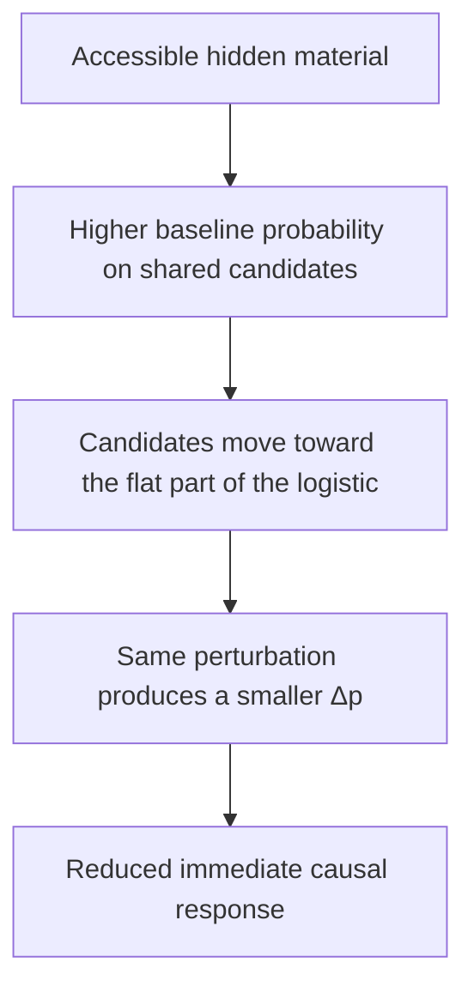

+++
title = "13: Can the Past Redirect the Future?"
date = "2026-08-14T23:30:00+01:00"
draft = false
description = "Two crystals with identical visible geometry, one carrying a decaying hidden material trace. The same perturbation produces a different response — and most of the downstream difference accumulates after the trace has substantially weakened."
weight = 13
categories = ["Programming", "Artificial Life"]
tags = ["Digital Life", "Digital Crystal", "Causality", "History Dependence", "Experimental Method"]
series = ["Digital Life From First Principles"]
+++

The last two chapters have narrowed the question to one local event.

Chapter 10 forced a single attachment and found an immediate causal effect whose magnitude was consistent with the local rule's mechanical prediction, followed by a small transient consequence that converged.

Chapter 11 showed that finite computation can route causal opportunity outside the local causal cone, change which pathways express the perturbation, and gate whether an affected opportunity is evaluated at all — while resolving no meaningful change in mean twelve-step consequence at the declared ±0.15 scale.

Every variable in both chapters was a fact about the present. Current occupancy. Current frontier. Current budget. Current probabilities.

But two crystals with the same visible geometry can still differ in hidden state inherited from different pasts.

We have not yet isolated whether that difference can change their response to the same perturbation.

This is not the question of whether the crystal has memory. Chapter 5 refused that word when a causal past turned out not to be a readable one, and Chapter 6 refused it again when two histories stayed persistent, accessible and distinguishable while producing no differential response. The question here is smaller and prior to all of that:

> **Can two states with the same visible geometry respond differently to the same perturbation because they contain different hidden material state?**

Not whether the past can be read. Whether the past can change the response.

---

## Same Shape, Different Past

The experiment gives the crystal a second kind of state.

Some occupied cells carry a decaying scalar value that contributes to the ordinary attachment score:

$$
\text{score}(y) = \text{ordinary score}(y) + g_m \sum_{z \in N(y)} m(z)
$$

with the gain frozen at `g_m = 0.30`. The attachment mechanism retains the same logistic response, but hidden material now contributes an additional frozen term to the score entering that response.

The material is deliberately weak and transient.
 Its half-life is six updates and the trace has already aged three before the test begins, so each carrier starts at about 0.707. Two cells carry it, for a total starting mass near 1.414. Newly attached cells do not inherit it. It does not spread. It only decays.

That weakness is the design. We are not constructing a memory architecture with retention policies and propagation rules — Chapter 6 built something like that and found the interesting question was elsewhere. We are giving the crystal one hidden variable and asking whether it can matter causally at all.

And note the phrase that has to be used carefully from here on. The two conditions do not have the same state. They have the **same visible occupancy geometry** and different hidden state. The invisibility is the entire point:

```text
SAME VISIBLE GEOMETRY
≠
SAME COMPLETE STATE
```

---

## Accessible, Remote, Erased

Three conditions, and the choice of primary comparison matters more than it looks.

**Accessible.** Two occupied cells near the probe carry the trace, and the probe's sole occupied neighbour is always one of them — guaranteeing that the stored state is locally causally accessible to the perturbation.

**Remote.** The same number of carriers with the same material mass, placed beyond the twelve-step local causal reach of the probe.

**Erased.** No material at all.

The primary contrast is accessible versus **remote**, not accessible versus erased. The easier comparison would confound two different things: whether material exists, and whether it is positioned where it can act on this perturbation. Only the remote arm separates them.

At the intervention point, everything else is matched — visible occupancy, probe geometry, external input, random-number construction, allocation policy and perturbation.

The futures are then allowed to diverge normally.

---

## The First Experiment Wasn't the Experiment

It appeared to work. The immediate causal response differed sharply between accessible and remote conditions, and the twelve-step consequence looked lower under accessible history too.

Then an audit of the implementation found that the intervention was not the intervention.

The intended design was FORCE occupying `x` for one causal exposure while PREVENT kept it empty for the same exposure. What the code did was insert `x` in FORCE, and *start* `x` empty in PREVENT — leaving the PREVENT branch free to attach `x` naturally during the first growth update.

> **An empty cell at the start of a control branch is not the same thing as a cell being prevented from appearing.**

Worse, the contamination was correlated with the treatment. The accessible trace deliberately included `x`'s only occupied neighbour, which raises `x`'s own attachment probability. The audit recovered exactly how much:

```text
probability PREVENT naturally attaches x

accessible   0.428
remote       0.377
erased       0.378
```

Five percentage points. The condition under test was changing whether the control branch remained a control.

So the downstream result is:

```text
INVALID
```

Not failed. Not inconclusive. Not underpowered.

**Invalid.**

More data would only have measured the wrong intervention more precisely.
 This adds another failure mode to the book:

```text
too imprecise to answer
≠
valid experiment against a failed hypothesis
≠
invalid intervention measuring the wrong causal contrast

---

## Something Survived the Failure

One quantity escaped the contamination, for a structural reason.

The immediate expected causal response was computed from the branch probabilities *before* the realized growth step. Whether `x` later reappeared in PREVENT could not affect a number that had already been calculated. So the immediate effect is measurable even in the invalid run:

```text
ΔE₁ (accessible − remote) ≈ −0.0182
```

with a narrow interval entirely below zero.

Accessible hidden material **reduced** the immediate causal response.

Which is backwards. The material gain is positive; the material raises attachment probabilities. Adding it should, on the obvious reading, make the perturbation matter more, not less.

That contradiction is where the mechanism is.

---

## Why More Material Produces Less Response

The attachment rule is logistic, and a logistic function does not convert score into probability at a constant rate. Its slope is:

$$
\frac{dp}{d(\text{score})} = p(1-p)
$$

which is largest in the middle and vanishes at both extremes. The same score increment produces a different probability change depending on where the candidate already sits on the curve.

Accessible material changes the baseline operating point of the shared frontier candidates around the probe.

For the affected candidates, that operating-point shift reduces the local slope of the logistic response.

FORCE then adds the same local score contribution as before, but the resulting probability increment is smaller.



The candidate-level accounting is unusually clean. For accessible versus erased, the contribution from this saturation effect on shared candidates was about −0.01814, against a total immediate difference of about −0.01930. Under this accounting, the shared-candidate operating-point effect explains most of the measured immediate difference.

It is worth being precise about what changed, because the loose version of this sentence is wrong. The response rule did not change. The logistic is the same logistic, with the same parameters, computing the same function. What changed is the **operating point** at which the perturbation acts:

> **Locally accessible hidden state changed the effective causal sensitivity of the same fixed response rule.**

That is a sharper claim than *history changes response*, and it explains the sign that made no sense a moment ago.

---

## The Remote Arm Found a Back Door

The audit turned up a second problem, and it should feel familiar.

Through the material dynamics alone, remote carriers were beyond the probe's twelve-step local causal reach and should not have affected the probe locally.

Yet the protocol produced a tiny local difference.

Not by propagating. By calibration. The protocol dynamically matches expected background construction, exactly as Chapter 11's corrected design required — and it does so with a global score offset. Remote material changes expected construction where it sits; the controller compensates; the compensation applies everywhere, including near the probe.

```text
remote material
↓
global expected construction changes
↓
calibration offset changes
↓
local probabilities shift slightly
```

Chapter 11 found that a global computational mechanism can couple spatially separated regions. Here the same structure appears one level up: our own experimental controller had become a coupling channel between regions the physics kept apart. A compensator that acts globally is, by construction, a path between everything it touches.

That is not a property of the material. It is a property of the instrument, and it means the remote arm was not automatically the clean null it was assumed to be.

---

## Fix the Experiment, Not the Hypothesis

Three corrections, with every scientific parameter frozen — same gain, same half-life, same history age, same horizon, same effect threshold. Nothing was tuned. These are construct-validity repairs.

**The intervention.** PREVENT now explicitly blocks `x` during lag one; FORCE explicitly contains it. After one full causal exposure, `x` is removed from FORCE and both branches continue normally — the transient causal semantics earned in Chapter 10, applied properly this time.

**The control.** Remote carriers are no longer chosen merely for being far away. Each is matched to an accessible carrier on how much background frontier influence it exerts: the same number of adjacent frontier cells, and their total baseline attachment-probability mass within a frozen tolerance, while still lying beyond the twelve-step local reach. After this matching, the remote-minus-erased immediate difference falls to about `8.2 × 10⁻⁵`, making the controller-mediated leakage negligible on this measure.

**The estimator.** The realized twelve-step attachment difference is noisy — a sum of Bernoulli outcomes measuring a small effect. So the primary quantity becomes the expected local causal difference at each lag, summed over the horizon:

$$
\Delta_t = \sum_{y \in L} p_{\text{FORCE}}(y,t) - \sum_{y \in L} p_{\text{PREVENT}}(y,t)
\qquad
G_{\mathrm{RB}} = \sum_{t=1}^{12} \Delta_t
$$

This is worth stating carefully, because it is easy to misread. The trajectories are not replaced by expectation. Both branches still evolve through actual stochastic events — cells attach, cells are lost, geometry diverges, material decays. The expectation is used only to measure the causal difference *at each realized state* more precisely than a single coin flip per candidate would allow. The realized outcome is kept as a secondary check.

The corrected run used 192 groups and 564 supported probes, and passed every validity gate: group coverage, dynamic matching, population matching, intervention assertions, remote-carrier matching. Only then is it worth interpreting.

---

## The Immediate Effect Replicates

```text
ΔE₁ (accessible − remote) = −0.01499     95% CI [−0.01725, −0.01281]
```

Same sign, with a slightly smaller magnitude.

The immediate hidden-state modulation survives the corrected intervention and control design.

So the sensitivity reduction is not an artifact of the broken PREVENT semantics, not an artifact of the old remote placement, and not the calibration leak. With visible geometry matched and the intervention properly implemented, hidden material state changes the immediate causal response of the same perturbation.

---

## The Later Future Changes Too

Over twelve updates:

```text
ΔG_RB       = −0.397     95% CI [−0.679, −0.119]
ΔG_realized ≈ −0.357     95% CI [−0.673, −0.040]
```

The expected estimator and the noisier realized one agree in direction and in rough magnitude. The mean downstream causal consequence is lower in the accessible condition than in the matched remote condition, with both estimators supporting the same direction.

And here the frozen decision rule does something that a looser protocol would have let slide.

---

## Direction Is Not Magnitude

The predeclared smallest effect of interest was ±0.15. Calling the magnitude supported required not just an interval excluding zero, but enough precision to resolve that threshold — and the achieved minimum detectable effect was around 0.357.

So two questions, two different answers:

```text
Is the mean effect negative?                              SUPPORTED
Can we establish it reaches the predeclared ±0.15
magnitude under the frozen precision rule?                UNRESOLVED
```

Those are compatible statements, and collapsing them in either direction would be a misreport. Saying "the hypothesis passed" would claim a magnitude the experiment cannot resolve. Saying "inconclusive" would throw away a direction it established with intervals excluding zero on both estimators.

The important distinction is simple:

```text
DIRECTION
SUPPORTED

PREDECLARED MAGNITUDE
UNRESOLVED

---

## The Trace Fades While the Difference Grows

Now the question the main test does not answer.

The material decays. The causal difference accumulates. Is the later effect simply proportional to how much material is still present — material persists, material keeps pushing, effect persists?

The observed trajectory does not support that simple proportional-dose account.

The trace starts at a total mass of about 1.414. It falls below half that around lag 4. At the preceding lag, the cumulative expected causal difference was only:

```text
−0.0995
```

against a final twelve-step value of:

```text
−0.3972
```

So roughly **75% of the final causal difference accumulated after the material had already fallen below half its starting mass.**

The trace drops below a quarter around lag 8. After that point, a further −0.141 accrues — about **36% of the final effect, after the trace has lost three quarters of its strength.**

Split into descriptive epochs:

```text
EARLY    lags 1–4     −0.120
MIDDLE   lags 5–8     −0.158
LATE     lags 9–12    −0.119
```

Descriptively, the accumulated effect is not confined to the period when the trace is strongest.

The middle epoch contributes at least as much as the early epoch, even though the original material trace has already substantially weakened.
 The late epoch still contributes on average, at a point where mean accessible material has fallen to around 0.183 — though its interval is wide enough to include zero, so that is a description of the trajectory and not a separate confirmatory claim.

A second check gives the same caution against a simple instantaneous-dose explanation.

The pooled correlation between surviving accessible material and the accessible-minus-remote causal increment is approximately:

```text
r ≈ −0.001
 Group-level relations to average surviving material are weak too.

Which does **not** mean material amount is irrelevant — the material is what caused the sensitivity shift in the first place, and without it there is no effect at all. The bounded statement is narrower:

> **The simplest instantaneous dose model does not explain the accumulated downstream trajectory.**

---

## The Path Begins to Carry the Past

The weakening relationship between surviving material amount and later causal increment suggests that the original trace is not the whole explanation of the downstream divergence.

The plausible chain is one every previous chapter has supplied a piece of:

```text
hidden material state
↓
changes immediate causal sensitivity
↓
changes which construction events occur
↓
changed events alter later geometry and state
↓
later geometry changes what the perturbation's consequences can do
↓
causal difference continues accruing as the original trace decays
```

A plausible interpretation is that part of the historical consequence has become embodied in the trajectory itself.

The material changes early causal sensitivity.

That changes which construction events occur.

Those events alter later geometry and state, which can continue changing future opportunities even as the original trace weakens.

The experiment does not partition the late effect into a residual-material component and a trajectory-mediated component, so we should not claim that the trace has stopped contributing.

What it does show is that the accumulated causal difference cannot be explained simply by the instantaneous amount of material remaining.

> **The material did not need to remain strong for the entire horizon. Changing the early path was enough for later states to continue diverging.**

Treat "moved out of the trace" as interpretation rather than a measured transfer — nothing was tracked from one carrier to another. What was measured is that the effect kept accumulating while the trace kept shrinking, and that the amount remaining does not predict the increment.

Old Chapter 27 named this **Material-State Trajectory Redirection**. The phenomenon matters more than the label, and in plain prose *history-dependent trajectory redirection* says the same thing without adding another formal Principle to the ledger.

---

## Reading the Past Is Not Being Conditioned by It

This is the distinction the chapter has actually earned, and it reframes several earlier failures.

Chapter 5 established that a past can be causally consequential without being recoverable as a stable history signature.

Chapter 6 went further: even persistent, accessible and spatially distinguishable traces failed to produce the required differential response to a common challenge.

Those chapters separated several questions we had initially treated as one:

```text
did the past leave a consequence?
can the past be distinguished?
can the present differentially use that consequence?

This chapter asks a different question and gets a positive answer. The past does not have to be recoverable to be causally operative. It only has to leave the system in a state whose response differs.

```text
RECORD-LIKE PERSISTENCE          TRAJECTORY PERSISTENCE

past                             past
↓                                ↓
stored representation            changes sensitivity
↓                                ↓
later retrieval                  changes events
↓                                ↓
behaviour depends on past        changes later state
                                 ↓
                                 behaviour depends on past
```

Both routes can make later response depend on earlier events.

Only the first requires a persisting representation that can later be read as a record of those events.

> **The past can change the future without being reconstructed as a record of the past.**

---

## Do Not Call It Memory

The temptation is obvious. There is hidden state. It changes later response. Its consequences outlive most of the trace. Why not memory?

Because we wrote the state. It was placed by the experiment, not acquired by the crystal. Nothing here encoded anything, selected what to retain, retrieved anything, reconstructed a past event, distinguished one history from another, or improved at anything.

What has been demonstrated is a more primitive capability:

```text
PAST-DEPENDENT HIDDEN STATE
↓
CAUSAL RESPONSE MODULATION
↓
TRAJECTORY REDIRECTION
```

A stronger memory claim would require additional machinery or evidence: endogenous encoding, retention, discrimination, retrieval or some other demonstrated use of stored history.
 Chapter 6's failure is the reminder of how much further there is to go: two histories that leave distinguishable traces still did not produce a differential response to a common challenge. Here the response does differ, but the experiment deliberately placed hidden material where it entered the local causal mechanism and compared it with matched material positioned outside that route.

The Crystal did not discover or encode that placement itself.

For the same reason, be careful with the word *experience*. This experiment models a past-dependent material trace. It does not model the crystal having experiences and encoding them.

---

## Evidence Ledger

| Claim | Status | Evidence |
|---|---|---|
| Hidden material changes immediate causal response at matched visible geometry | **SUPPORTED** | `ΔE₁ = −0.01499`, CI `[−0.01725, −0.01281]` |
| The mechanism is logistic operating-point sensitivity | **SUPPORTED** | saturation term `−0.01814` of a total `−0.01930` |
| The response rule itself changed | **NOT CLAIMED** | logistic unchanged; only the operating point moved |
| Downstream twelve-step effect is negative | **SUPPORTED** | `ΔG_RB = −0.397` and `ΔG_realized ≈ −0.357`, both excluding zero |
| Downstream effect reaches the predeclared ±0.15 magnitude | **UNRESOLVED** | achieved MDE ≈ `0.357` |
| First experiment's downstream result | **INVALID** | PREVENT allowed natural attachment; contamination correlated with treatment |
| Remote material has no local causal pathway | **FAILED, then corrected** | calibration leak in V1; remote−erased falls to `8.2 × 10⁻⁵` after matching |
| Consequence accumulates after the trace has substantially decayed | **DESCRIPTIVELY SUPPORTED** | 75% of final effect after half-mass; 36% after quarter-mass |
| Surviving material amount predicts the causal increment | **FAILED** | pooled `r ≈ −0.001` |
| Material amount is irrelevant | **NOT CLAIMED** | the material caused the initial sensitivity shift |
| Memory, learning, adaptation, recall, experience encoding | **NOT ESTABLISHED** | the hidden state was written by the experiment |
| History-dependent redirection is a general substrate property | **NOT CLAIMED** | one mechanism, one gain, one half-life, twelve-update horizon |

---

## Where Does This History-Dependent Process End?

We have now established something that earlier chapters had not.

With visible geometry matched, hidden past-dependent material state can change the response to the same perturbation.

And the resulting causal difference continues accumulating after that material trace has substantially weakened.

That is not yet memory.

It is history-dependent causal response: hidden state inherited from the past changes present sensitivity, and the resulting event differences alter the later trajectory.

No retrieval or history-specific decoding has been demonstrated.

Which sharpens a question the book has left open twice.

Chapter 9 looked for a privileged boundary around the connected crystal and failed to find one, twice: no scale showed excess predictive coherence beyond a family null, and the candidate outer boundary localized causal effects no better than a circle drawn arbitrarily through the interior. What survived was spatial causal locality — consequences stay near their causes — which is true of any local field and establishes nothing about individuals.

But Chapter 9 tested regions defined primarily by geometry.

We now have a better candidate experimental object: a spatially extended causal process whose response can depend on hidden state inherited from the past.

That makes the individuation question worth asking again with a stronger control.
 If anything in this substrate deserves to be called an individual, it should be a region of *causal organization*, not a region of material.

So the individuation question can finally be posed in the right terms.

> **Is there a region whose causal containment exceeds what its geometry alone would predict?**
