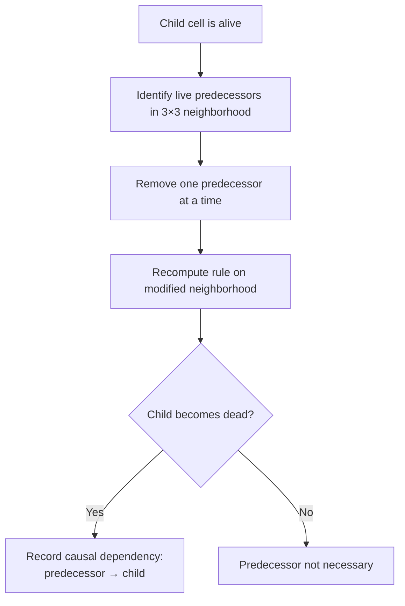
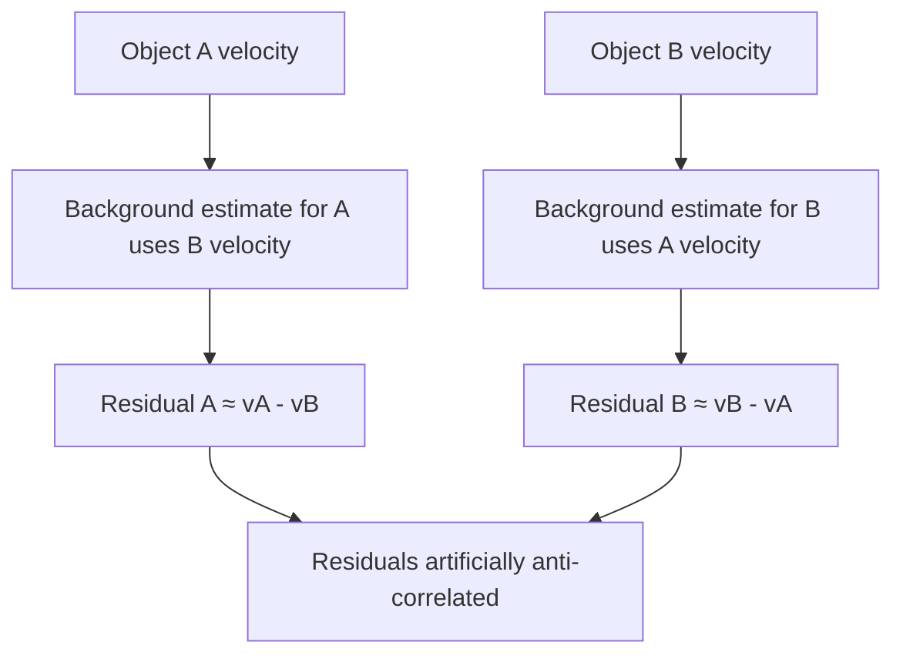
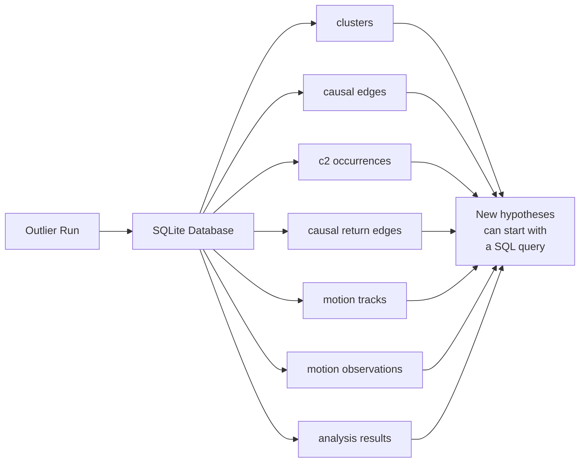

+++
date = '2026-08-11T12:48:00+01:00'
draft = false
title = '13: Is It Really Reproducing?'
categories = ['Programming', 'Artificial Life']
tags = ['Digital Life', 'Artificial Life', 'Cellular Automata', 'Outlier', 'Causality', 'Collective Motion', 'Experiments']
series = ['Digital Life From First Principles']
+++

Something strange happened while we were looking at Outlier.

We had started with a question about reproduction.

Then I watched the simulation.

And I thought:

> That looks like flocking.

That is exactly the kind of observation that can get us into trouble.

Humans are extraordinarily good at seeing things in motion and assigning meaning to them.

We see:

```text
a shape
another shape
movement
coordination
```

and very quickly turn that into:

```text
organisms
offspring
groups
flocks
```

But this book has one rule that matters more than almost any other:

```text
appearance
is not
evidence
```

So instead of calling it flocking, we stopped.  
And measured it.

That led us into a much deeper investigation than I expected.

---

## The Problem With Watching Artificial Life

Here is the Outlier simulation again.



It is very difficult to watch something like this without inventing nouns.

You start saying:

```text
that thing moved
that thing split
those things are travelling together
that one produced another one
```

But every noun contains a hypothesis.

What is a **thing**?  
What counts as the same thing at a later time?  
What makes one structure the parent of another?  
What makes two nearby structures separate individuals rather than components of one larger structure?

These are not philosophical decorations.  
They are experimental questions.

---

## First Question: Is It Really Reproducing?

In the previous chapter we introduced Outlier because it gives us something unusually valuable.

It is extremely simple at the substrate level.  
The world is a binary cellular automaton.  
Each cell sees a `3 × 3` neighborhood.  
That neighborhood gives us one of `512` possible local configurations.  
A fixed rule determines whether the centre cell will be alive or dead on the next step.

There is no class called `Organism`.  
There is no method called `reproduce()`.  
There is no explicit genome object.

And yet large structures appear.  
Some structures recur.  
Some appear to produce more structures.

That makes Outlier ideal for our purposes.  
If reproduction occurs here, it cannot be because the programmer wrote:

```python
if organism.ready:
    organism.reproduce()
```

Something more interesting must be happening.

---

### Similarity Is Not Reproduction

Suppose we see this:

```text
time t

    A

time t + 500

    A     A
```

It is tempting to say:

> A reproduced.

But that observation alone does not establish reproduction.

Perhaps both copies were produced independently by the surrounding environment.  
Perhaps the second structure would have appeared even if the first one had never existed.  
Perhaps what we are calling two structures are actually parts of a larger repeating process.

So reproduction is not merely a question of similarity.  
It is a **causal claim**.

We want something closer to:

```text
parent existed
↓
parent participated causally in a process
↓
later candidate appeared
↓
without the relevant earlier structure,
the later structure would not have appeared in the same way
```

That is a much stronger statement.

---

## Counterfactual Causality

Because Outlier is a cellular automaton, we have an unusually clean opportunity.

For every live cell at time `t + 1`, we know exactly which `3 × 3` neighborhood produced it.  
So we can ask:

> Which live cells in the preceding neighborhood were actually necessary for this cell to become alive?

Our simplified test works like this:  
Take a live child cell.  
Then, one at a time, remove each live predecessor from its local neighborhood.  
Re‑evaluate the cellular automaton rule.  
If removing a predecessor changes the child from `alive` to `dead`, then that predecessor was positively necessary under this counterfactual test.



This is not a complete theory of causality.  
But it gives us something much stronger than visual resemblance.  
It gives us a causal graph.

---

### From Cells to Structures

Cell‑level causality produces a huge amount of information.  
So we aggregate cells into connected clusters.  
Then causal dependencies between cells become causal relationships between clusters.

The result looks approximately like:

```text
cluster at t
     ↓
cluster at t+1
     ↓
cluster at t+2
     ↓
...
```

with branching where one earlier organization contributes to multiple later structures.

For our `512 × 512` experiment over `1600` generations we found:

```text
138,891 clusters
196,466 causal edges
```

That is already a useful warning.  
The visual animation looks as though it contains a collection of fairly obvious moving objects.  
The causal graph tells us that underneath that appearance is a very large network of dependencies.

---

## Finding c2 Again

The published Outlier seed starts as a tiny configuration:

```text
.1.
111
..1
```

After two updates it produces a small structure we call `c2`.  
In our simulation that structure had `area = 6` and `bounding box = 3 × 3`.

Instead of searching for arbitrary repeating shapes, we derived the actual `c2` signature directly from the known initial seed.  
Then we searched the entire run for later occurrences of that structure, allowing translation and rotation.

We found `144 c2 occurrences` between `t = 2` and `t = 1598`.

But recurrence still does not prove reproduction.  
So we combined recurrence with the causal graph.

---

### A Causal Family Tree

For every `c2`, we searched forward through the causal graph for later `c2` structures reachable through that causal history.

The original `c2` at `t = 2` produced a branching causal structure with four later `c2` descendants.  
The complete return graph contained `99` visible `c2` return edges.

The full graph was too complicated to use as an illustration, so the figure shows a deliberately pruned family.



This is much stronger evidence than:

> I saw one shape and later saw several similar shapes.

We can now say something closer to:

> Later occurrences of the c2 structure are reachable through a measurable causal ancestry originating in earlier c2 structures.

That is the kind of evidence we need before using words such as reproduction.

---

## Then I Saw the Flock

While looking at the same simulation, another visual pattern became difficult to ignore.

Groups of structures appeared to move together.  
Not merely outward.  
Together.

It looked remarkably like **flocking**.

But we had just spent several chapters warning ourselves against doing exactly this.  
So we made the visual impression into a hypothesis.

---

### What Would Flocking Mean?

We did not begin by trying to reproduce every formal definition from swarm biology or active‑matter physics.  
We started with a much narrower question:

> Do nearby persistent moving structures travel in unusually similar directions?

That can be measured.

First we needed persistent motion tracks.  
Using the causal graph, we followed plausible continuations of clusters through time.

The run produced `13,635 persistent motion tracks` (minimum length `8` generations).  
Across those tracks we obtained `633,808 motion observations`.

Each observation gave us:

```text
position
velocity
time
causal identity
```

That was enough to perform a first test.

---

### Measuring Directional Alignment

For two velocity vectors \(v_i\) and \(v_j\), we normalize them and take their dot product:

$$
A_{ij} = \frac{v_i}{|v_i|} \cdot \frac{v_j}{|v_j|}
$$

The result lies between −1 and +1:

```text
+1  = same direction
 0  = no directional agreement
−1  = opposite directions
```

Then we compare simultaneously moving structures at different spatial separations.

For performance, we do not compare every object with every other object.  
We use a spatial index and examine nearby pairs.  
That is also a better experiment – structures on opposite sides of the universe are not particularly useful for local collective motion.

---

## The First Result

The first experiment produced a striking result.  
At short distances, observed velocity alignment was approximately `0.74`, while a velocity‑shuffled control was much lower.



So the visual observation was not completely imaginary.  
There really was a measurable short‑range motion coherence.

But this still did not prove flocking.  
We had immediately created another problem.

---

## Maybe Everything Is Simply Moving Outward

Outlier develops as an expanding structure.  
Suppose nearby clusters sit on the same expanding front.  
They might move in similar directions simply because both are being carried outward.

Imagine two pieces of debris on the same expanding circular wave.  
They could have very similar velocity vectors without interacting with one another at all.

So we needed another control.

---

### Removing Radial Expansion

For each position \(x_i\), we calculate its radial direction relative to the centre:

$$
r_i = \frac{x_i-c}{|x_i-c|}
$$

Then decompose its velocity into radial motion + non‑radial motion and remove the radial component.

If the apparent flocking was really just expansion, the alignment should collapse.

Instead we found:

```text
raw short-range alignment        = 0.7373
radial-subtracted alignment      = 0.7427
shuffled residual control        = 0.1933
```

The alignment did not disappear. It barely changed.



So we could rule out one simple explanation:

> The observed coherence is not explained merely by every structure moving radially away from the original seed.

That made the result more interesting.  
And then the causal analysis gave us another possibility.

---

## What If These Are Not Separate Individuals?

This is where digital life starts becoming stranger than our biological intuition.

Several spatially disconnected clusters can participate in the same causal organization.

So what looks like:

```text
thing A
thing B
thing C
```

might actually be:

```text
component A
component B
component C
        ↓
one distributed causal process
```

If those components travel together, calling the behavior flocking may be completely wrong.  
A flock is normally imagined as several individuals moving collectively.  
But these structures might instead be parts of **one distributed individual**.

So we asked another question:

> Do structures belonging to the same causal lineage move more coherently?

---

### Giving Structures Causal Families

Our first family definition was too narrow.  
It started with four branches descending from one early `c2`.  
That produced strong same‑family alignment (`0.768`) but no useful different‑family comparison.

So we strengthened the definition.  
Every cluster was assigned its **most recent identifiable c2 ancestor**.  
If a cluster itself was `c2`, it began a new family.  
Otherwise we propagated ancestry through the causal graph.  
If equally close causal paths disagreed, we marked the assignment ambiguous rather than inventing an answer.

The coverage was remarkable.  
Among `138,891 clusters`, we assigned a recent c2 ancestor to `138,132`.  
Only `10` were ambiguous and `749` were unassigned.

Among our motion observations, `633,696 / 633,808` received a recent‑c2 family label.



That alone tells us something important about this experiment.  
The world is not naturally decomposing into a collection of unrelated particles.  
Almost everything we are tracking belongs to a branching causal history.

---

## A Very Exciting Result

When we compared nearby structures after subtracting a local background flow, we initially found:

```text
same recent-c2 family        = 0.828
different recent-c2 family   = -0.349
```

That looked spectacular.  
Perhaps causal relatives really were moving together.  
Perhaps different families were even moving against one another.

But there was a problem.  
The control itself could create the negative result.

---

### Our Experiment Was Wrong

This is worth slowing down for.

To estimate the local environmental flow around object `A`, we averaged nearby velocity vectors after excluding structures from `A`’s own family.  
When comparing two different families `A` and `B`, `B` could therefore contribute to the estimate of `A`’s background – and `A` could contribute to the estimate of `B`’s background.

In the simplest case:

$$
r_A \approx v_A-v_B
$$

and:

$$
r_B \approx v_B-v_A
$$

which means:

$$
r_B \approx -r_A
$$

We had accidentally built an anti‑correlation into the estimator.  
So the `-0.349` result was not trustworthy.



This is exactly why experiments need controls – and why controls themselves need criticism.

---

### Pair‑Excluded Background Flow

We fixed the problem.

When testing a pair from families `α` and `β`, we estimated local background motion while excluding *both* families from both estimates.  
Now neither member of the tested pair could create the other’s residual.

Using this stronger control we obtained:

```text
Same recent c2 ancestor          0.746
Very close c2 ancestry           0.101
Close c2 ancestry                0.032
Distant c2 ancestry              0.135
Very distant c2 ancestry         0.081
```



That looked like strong evidence for causal individuality.

But there was another problem.

---

### The Four‑and‑a‑Half‑Cell Problem

The structures sharing the same recent `c2` ancestor were also extremely close together.  
Their mean separation was only about `4.5 cells`.  
Other causal groups were typically tens of cells apart.

So we had confounded:

```text
causal relatedness
```

with:

```text
spatial proximity
```

Perhaps structures sharing a family move together because they are parts of the same tiny local formation.  
Perhaps any two structures that close together would show similar motion.

Once again, the exciting interpretation had outrun the evidence.  
So we performed one more experiment.

---

## Distance‑Matched Causal Coherence

We constructed a matched dataset.

For a same‑family pair, we searched for different‑family comparisons occurring under approximately the same conditions.  
We matched on:

```text
simulation time
spatial distance
local density
```

and continued to use the stronger pair‑excluded background‑flow correction.

The question was now very precise:

> At similar times, at similar distances, and in similar local environments, do members of the same c2 causal family move more coherently than members of different families?

We used `2,617,077` usable pair records.  
From those we constructed `65,021` matched pairs per comparison group across `668` matched strata.  
Then we measured the result.

---

### The Effect Disappeared

The final matched means were:

```text
same-family        = 0.1515
different-family   = 0.1588
```

The difference was `-0.0073`.  
The mean matched‑stratum effect was `-0.0148`, with a bootstrap interval of approximately `[-0.0547, +0.0280]`.



The interval crosses zero comfortably.  
So we do **not** have evidence that causal‑family membership independently predicts stronger motion coherence.

The dramatic earlier result disappeared when the spatial confound was controlled.

---

### Look at the Effect by Distance

The matched analysis is even clearer when split by distance.



Some individual bins fluctuate (`0‑4` cells shows +0.769, `4‑8` cells −0.188, etc.), but the extreme bins contain very few matched examples.  
The well‑populated middle ranges show no systematic advantage for shared causal ancestry.

So the simplest current conclusion is:

> The apparent family‑level motion coherence was largely explained by spatial organization.

---

## So Was It Flocking?

Not on the evidence we currently have.

But the original observation was not worthless.  
We learned several things.

1. **Outlier exhibits strong short‑range velocity coherence.** That is measurable.  
2. **The coherence is not explained by simple global radial expansion.**  
3. **Shared c2 ancestry initially appears to predict much stronger coherence.**  
4. **That apparent causal‑family effect disappears after matching spatial context.**

So the bounded claim is:

> **Our Outlier reproduction exhibits strong local velocity coherence, but we do not find evidence in this experiment that shared c2 causal ancestry contributes additional coherence once spatial distance, simulation time, local density and local background motion are controlled.**

That is not as exciting as “We discovered flocking.”  
It is much better – because we have some idea what the evidence actually supports.

---

### What Might the Motion Be?

Our best current interpretation is not:

```text
causal relatives recognize one another and flock
```

It is closer to:

```text
local geometry
+
local cellular dynamics
+
spatial organization
↓
coherent motion
```

That still matters.

Remember what Outlier is.  
There are no explicit moving objects.  
No velocity variable.  
No steering force.  
No alignment rule.  
No flocking controller.

At the substrate level there are only binary cells, local neighborhoods, and one deterministic update rule.  
Yet from those rules emerge structures with coherent local motion.  
That is already remarkable.

We simply should not give that phenomenon a stronger name than our measurements justify.

---

## The Most Important Result May Be Methodological

This investigation began with five words: *That looks like flocking.*

If we had stopped there, we would have had a nice animation and a bad claim.

Instead:

```mermaid
flowchart TD
    A[Visual impression:<br/>"That looks like flocking"] --> B[Operational definition]
    B --> C[Tracking]
    C --> D[Velocity measurement]
    D --> E[Shuffled control]
    E --> F[Radial-flow control]
    F --> G[Causal-family hypothesis]
    G --> H[Local-flow control]
    H --> I[Discover estimator bug]
    I --> J[Pair-excluded control]
    J --> K[Discover spatial confound]
    K --> L[Distance/time/density matching]
    L --> M[Bounded conclusion]
```

This is exactly the process we need if we are going to talk seriously about digital life.  
Interesting pictures are where questions begin. Not where claims end.

---

## The Database Changed How We Could Work

There was another practical lesson.

Our simulation produced:

```text
138,891 clusters
196,466 causal edges
633,808 motion observations
```

Initially we recomputed these quantities every time we asked a new question.  
That quickly became absurd.

So we created a SQLite database.  
The expensive simulation became a reusable experimental dataset.



This matters beyond performance.  
It changes how we investigate these systems.  
The simulation becomes something closer to an experimental specimen.  
We can ask multiple questions of the same run while preserving exactly which data each conclusion came from.

---

## Reproduction Still Survives the Investigation

The flocking hypothesis weakened.  
The reproduction story did not disappear with it.

We still observed `144 c2 occurrences` and constructed causal paths between recurring `c2` structures.  
The original `c2` at `t = 2` lies at the root of a branching causal return structure.

So the evidence for reproduction is not:

> it looks like one object became several

It is:

```text
structural recurrence
+
causal ancestry
+
branching lineage
```

That distinction matters.

One of the deepest lessons from Outlier may therefore be this:

> **Geometry is not enough to tell us what an individual is.**

Two disconnected clusters may participate in the same causal process.  
Two visually similar structures may not share the causal relationship we assume.  
Several nearby structures may move coherently because of local dynamics rather than because they form a flock.

The visible world and the causal world do not have to divide themselves into objects in the same way.

---

## Perhaps Individuality Is Causal

Biology makes physical boundaries extremely salient – skin, cell membranes, shells, bodies.  
So we naturally begin digital life by looking for connected regions.

But a digital substrate does not owe us a membrane.  
An individual might instead be something more like:

> **a persistent causal organization**

whose components can be separated, rearranged, copied, distributed.

That possibility is more interesting than whether Outlier happens to satisfy a biological checklist.  
It asks us to reconsider the primitive concept itself.

Instead of:

> Where is the body?

we may need to ask:

> Which parts of this world participate in the same continuing causal organization?

That question will return later.

---

## What We Did Not Prove

We should be explicit.

We have **not** shown that Outlier is alive.  
We have not shown classical flocking.  
We have not shown that `c2` is necessarily the uniquely correct unit of individuality.  
We have not shown that our counterfactual causal test captures every meaningful dependency.  
We have not shown that connected clusters correspond to organisms.  
And we have not shown open‑ended evolution.

What we have shown in this experiment is narrower.

---

## Bounded Claims

From this chapter we can reasonably claim:

1. **Causal recurrence** – Later `c2` structures can be connected to earlier `c2` structures through measured counterfactual dependencies in our reproduction of Outlier.  
2. **Branching lineage** – The resulting causal return graph contains branching ancestry rather than mere isolated recurrence.  
3. **Local motion coherence** – Persistent moving structures exhibit strong short‑range directional alignment relative to a shuffled‑velocity control.  
4. **Not merely radial expansion** – Removing the global radial component does not eliminate that short‑range coherence.  
5. **No demonstrated independent causal‑family motion effect** – Once pairs are matched for spatial distance, simulation time and local density, we find no detectable additional motion coherence associated with sharing the same recent `c2` ancestor.

That is where the evidence currently stops.

---

## And That Is Enough

There is a temptation in artificial life to treat every surprising pattern as a sign that we are almost there – almost alive, almost intelligent, almost social, almost evolutionary.

But that is backwards.  
The interesting work begins when we stop rewarding the system for looking familiar.

Outlier gave us something that looked like reproduction.  
So we asked whether the apparent descendants were causally connected.

Then it gave us something that looked like flocking.  
So we measured the motion.  
Then we tried to destroy our own explanation. Again. And again.

That is the method.

```text
SEE SOMETHING
↓
NAME THE HYPOTHESIS
↓
DEFINE THE MEASUREMENT
↓
BUILD THE CONTROL
↓
LOOK FOR THE CONFOUND
↓
BUILD A BETTER CONTROL
↓
KEEP ONLY WHAT SURVIVES
```

Digital life will not be discovered by finding the right metaphor.  
It will be discovered by finding which properties survive this process.

---

## The Deeper Question

Outlier has now forced us to distinguish several ideas that initially looked like one:

```text
shape
identity
causal continuity
reproduction
collective motion
individuality
```

They are not the same thing.

A shape can recur without reproducing.  
A structure can reproduce without having an obvious body.  
Several disconnected structures can participate in one causal organization.  
Nearby structures can move together without being a flock.  
And genealogical relatedness does not necessarily determine current dynamical organization.

That suggests a different direction for digital life.

Perhaps we should stop asking:

> Which biological properties can we reproduce digitally?

And instead ask:

> What kinds of persistent causal organization become possible when the substrate is computation?

That is a much larger space.  
And we have barely entered it.
