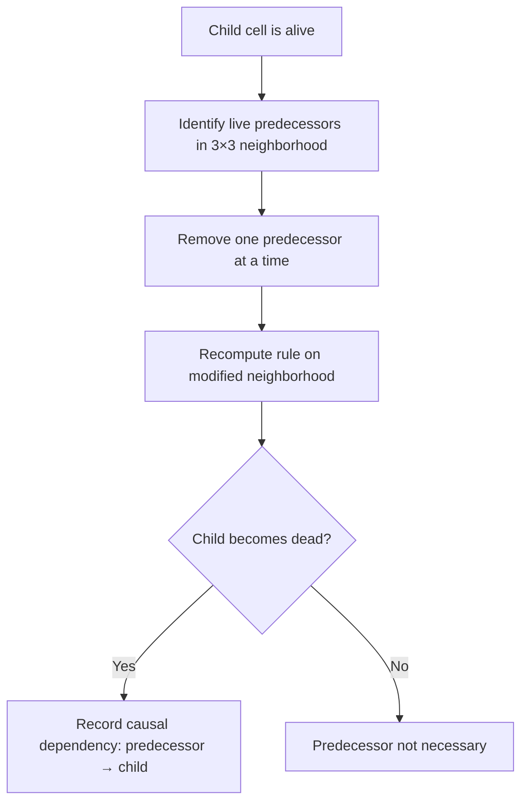
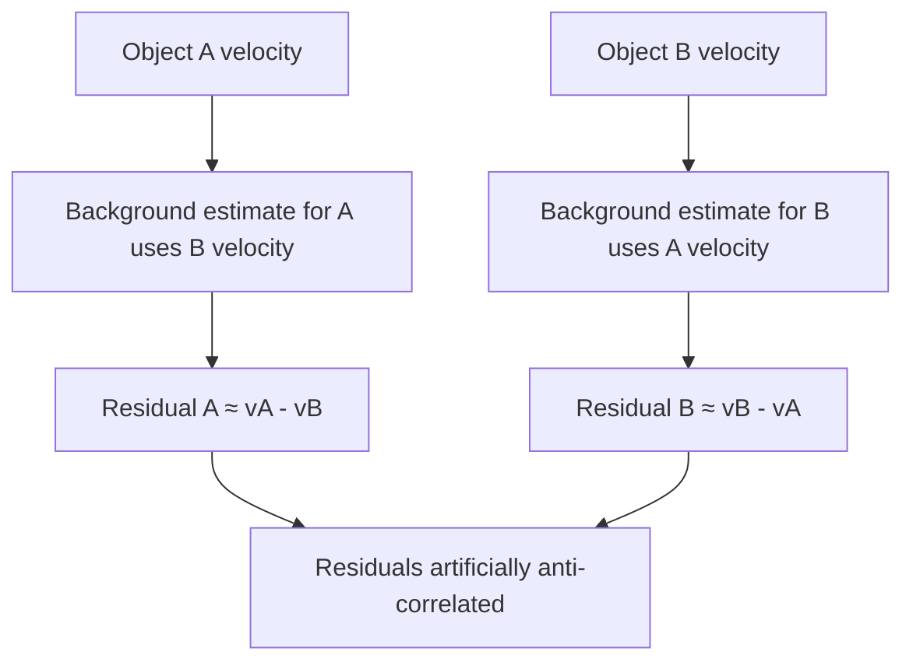
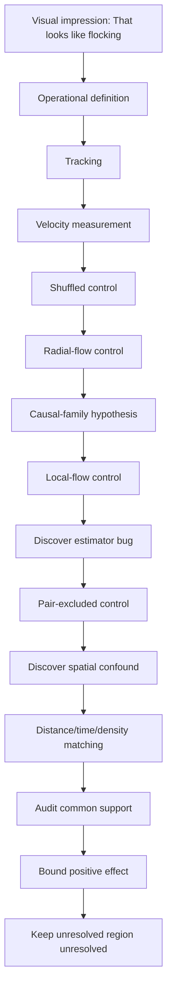
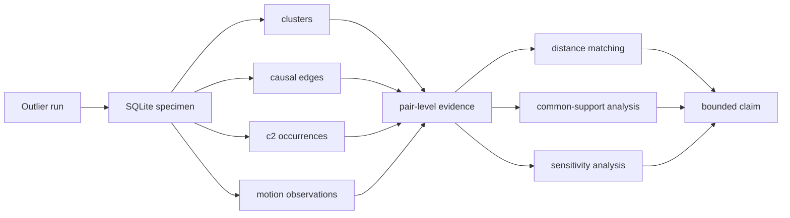

+++
date = '2026-08-11T12:48:00+01:00'
draft = false
title = '13: Is It Really Reproducing?'
categories = ['Programming', 'Artificial Life']
tags = ['Digital Life', 'Artificial Life', 'Cellular Automata', 'Outlier', 'Causality', 'Collective Motion', 'Experiments']
series = ['Digital Life From First Principles']
+++

Something strange happened while we were looking at Outlier.

We had started with a question about reproduction.

Then I watched the simulation.

And I thought:

> That looks like flocking.

That is exactly the kind of observation that can get us into trouble.

Humans are extraordinarily good at seeing things in motion and assigning meaning to them.

We see:

```text
a shape
another shape
movement
coordination
```

and very quickly turn that into:

```text
organisms
offspring
groups
flocks
```

But this book has one rule that matters more than almost any other:

```text
appearance
is not
evidence
```

So instead of calling it flocking, we stopped.

And measured it.

That led us into a much deeper investigation than I expected.

---

## The Problem With Watching Artificial Life

Here is the Outlier simulation again.



It is very difficult to watch something like this without inventing nouns.

You start saying:

```text
that thing moved
that thing split
those things are travelling together
that one produced another one
```

But every noun contains a hypothesis.

What is a **thing**?
What counts as the same structure at a later time?
What makes one structure the parent of another?
What makes two nearby structures part of the same causal process rather than merely close together?

These are not philosophical decorations.

They are experimental questions.

---

## First Question: Is It Really Reproducing?

In the previous chapter we introduced Outlier because it gives us something unusually valuable.

It is extremely simple at the substrate level.

The world is a binary cellular automaton.
Each cell sees a `3 × 3` neighborhood.
That neighborhood gives us one of `512` possible local configurations.
A fixed rule determines whether the centre cell will be alive or dead on the next step.

There is no class called `Organism`.
There is no method called `reproduce()`.
There is no explicit genome object.

And yet large structures appear.

Some structures recur.

Some appear to produce more structures.

That makes Outlier ideal for our purposes.

If reproduction occurs here, it cannot be because the programmer wrote:

```python
if organism.ready:
    organism.reproduce()
```

Something more interesting must be happening.

---

### Similarity Is Not Reproduction

Suppose we see this:

```text
time t

    A

time t + 500

    A     A
```

It is tempting to say:

> A reproduced.

But that observation alone does not establish reproduction.

Perhaps both copies were produced independently by the surrounding environment.

Perhaps the second structure would have appeared even if the first one had never existed.

Perhaps what we are calling two structures are actually parts of a larger repeating process.

So reproduction is not merely a question of similarity.

It is a **causal claim**.

We want something closer to:

```text
parent existed
↓
parent participated causally in a process
↓
later candidate appeared
↓
without the relevant earlier structure,
the later structure would not have appeared in the same way
```

That is a much stronger statement.

---

## Counterfactual Causality

Because Outlier is a cellular automaton, we have an unusually clean opportunity.

For every live cell at time `t + 1`, we know exactly which `3 × 3` neighborhood produced it.

So we can ask:

> Which live cells in the preceding neighborhood were actually necessary for this cell to become alive?

Our simplified test works like this.

Take a live child cell.

Then, one at a time, remove each live predecessor from its local neighborhood.

Re-evaluate the cellular automaton rule.

If removing a predecessor changes the child from `alive` to `dead`, then that predecessor was positively necessary under this counterfactual test.



This is not a complete theory of causality.

But it gives us something much stronger than visual resemblance.

It gives us a causal graph.

---

### From Cells to Structures

Cell-level causality produces a huge amount of information.

So we aggregate cells into connected clusters.

Then causal dependencies between cells become causal relationships between clusters.

The result looks approximately like:

```text
cluster at t
     ↓
cluster at t+1
     ↓
cluster at t+2
     ↓
...
```

with branching where one earlier organization contributes to multiple later structures.

For our `512 × 512` experiment over `1,600` generations we found:

```text
138,891 clusters
196,466 causal edges
```

That is already a useful warning.

The visual animation looks as though it contains a collection of fairly obvious moving objects.

The causal graph tells us that underneath that appearance is a very large network of dependencies.

---

## Scope of This Experiment

Before going further, we need to pin down exactly what this chapter can and cannot establish.

Our run is:

```text
grid          512 × 512
generations   1,600
boundary      periodic
```

The published causal Outlier study used a substantially larger regime:

```text
grid          1024 × 1024
updates       20,000
boundary      periodic
```

That difference matters.

Outlier is scale-sensitive.

Larger and later hierarchical formations may not be represented in a shorter `512 × 512` run.

So every result in this chapter should be read as:

> **a result about the structures observable in our 512 × 512, 1,600-generation reproduction of Outlier.**

We must not automatically generalize a null result here to the larger published regime.

This limitation will matter again near the end of the chapter.

---

## Finding c2 Again

The published Outlier seed starts as a tiny configuration:

```text
.1.
111
..1
```

After two updates it produces a small structure we call `c2`.

In our simulation that structure had:

```text
area          6
bounding box  3 × 3
```

Instead of searching for arbitrary repeating shapes, we derived the actual `c2` signature directly from the known initial seed.

Then we searched the entire run for later occurrences of that structure, allowing translation and rotation.

We found:

```text
144 c2 occurrences
```

between:

```text
t = 2
and
t = 1598
```

But recurrence still does not prove reproduction.

So we combined recurrence with the causal graph.

---

### A Causal Family Tree

For every `c2`, we searched forward through the causal graph for later `c2` structures reachable through that causal history.

The original `c2` at `t = 2` produced a branching causal structure with four later `c2` descendants.

The complete return graph contained:

```text
99 visible c2 return edges
```

The full graph was too complicated to use as an illustration, so the figure shows a deliberately pruned family.



This is much stronger evidence than:

> I saw one shape and later saw several similar shapes.

We can now say something closer to:

> **Later occurrences of the c2 structure are reachable through measurable causal ancestry originating in earlier c2 structures.**

That is the kind of evidence we need before using words such as reproduction.

---

## Causal Reproduction Survives in This Run

Within our `512 × 512`, `1,600`-generation reproduction, the evidence for `c2` reproduction is not merely geometric recurrence.

It is:

```text
structural recurrence
+
counterfactual causal ancestry
+
branching lineage
```

That distinction matters.

So the narrow claim survives:

> **In our run, recurring c2 structures participate in a branching causal return graph.**

That does not establish life.

It does not establish a natural individual.

It does establish something much stronger than visual copying.

---

## Then I Saw the Flock

While looking at the same simulation, another visual pattern became difficult to ignore.

Groups of structures appeared to move together.

Not merely outward.

Together.

It looked remarkably like **flocking**.

But we had just spent several chapters warning ourselves against doing exactly this.

So we made the visual impression into a hypothesis.

---

### What Would Flocking Mean?

We did not begin by trying to reproduce every formal definition from swarm biology or active-matter physics.

We started with a much narrower question:

> Do nearby persistent moving structures travel in unusually similar directions?

That can be measured.

First we needed persistent motion tracks.

Using the causal graph, we followed plausible continuations of clusters through time.

The run produced:

```text
13,635 persistent motion tracks
```

with minimum length:

```text
8 generations
```

Across those tracks we obtained:

```text
633,808 motion observations
```

Each observation gave us:

```text
position
velocity
time
causal identity
```

That was enough to perform a first test.

---

### Measuring Directional Alignment

For two velocity vectors (v_i) and (v_j), we normalize them and take their dot product:

$$
A_{ij}
======

\frac{v_i}{|v_i|}
\cdot
\frac{v_j}{|v_j|}
$$

The result lies between `-1` and `+1`:

```text
+1  = same direction
 0  = no directional agreement
-1  = opposite directions
```

Then we compare simultaneously moving structures at different spatial separations.

For performance, we do not compare every structure with every other structure.

We use a spatial index and examine nearby pairs.

That is also a better experiment.

Structures on opposite sides of the universe are not particularly useful for measuring local collective motion.

---

## The First Result

The first experiment produced a striking result.

At short distances, observed velocity alignment was approximately:

```text
0.74
```

while a velocity-shuffled control was much lower.



So the visual observation was not completely imaginary.

There really was measurable short-range motion coherence.

But this still did not prove flocking.

We had immediately created another problem.

---

## Maybe Everything Is Simply Moving Outward

Outlier develops as an expanding structure.

Suppose nearby clusters sit on the same expanding front.

They might move in similar directions simply because both are being carried outward.

Imagine two pieces of debris on the same expanding circular wave.

They could have very similar velocity vectors without interacting with one another at all.

So we needed another control.

---

### Removing Radial Expansion

For each position (x_i), we calculate its radial direction relative to the centre:

$$
r_i
===

\frac{x_i-c}{|x_i-c|}
$$

Then decompose its velocity into:

```text
radial motion
+
non-radial motion
```

and remove the radial component.

If the apparent flocking was really just expansion, the alignment should collapse.

Instead we found:

```text
raw short-range alignment        = 0.7373
radial-subtracted alignment      = 0.7427
shuffled residual control        = 0.1933
```

The alignment did not disappear.

It barely changed.



So we could rule out one simple explanation:

> **The observed coherence is not explained merely by every structure moving radially away from the original seed.**

That made the result more interesting.

And then the causal analysis gave us another possibility.

---

## Shared Causal History

Several spatially disconnected clusters can participate in the same causal organization.

So what looks like:

```text
thing A
thing B
thing C
```

might actually be:

```text
component A
component B
component C
        ↓
one distributed causal process
```

That does **not** establish that the components form one natural individual.

It gives us a narrower hypothesis:

> **Does shared causal organization explain the apparent coordinated motion?**

So we asked:

> Do structures belonging to the same causal lineage move more coherently?

---

### Giving Structures Causal Families

Our first family definition was too narrow.

It started with four branches descending from one early `c2`.

That produced strong same-family alignment:

```text
0.768
```

but no useful different-family comparison.

So we strengthened the definition.

Every cluster was assigned its **most recent identifiable c2 ancestor**.

If a cluster itself was `c2`, it began a new family.

Otherwise we propagated ancestry through the causal graph.

If equally close causal paths disagreed, we marked the assignment ambiguous rather than inventing an answer.

The coverage was remarkable.

Among:

```text
138,891 clusters
```

we assigned a recent `c2` ancestor to:

```text
138,132
```

Only:

```text
10 ambiguous
749 unassigned
```

Among our motion observations:

```text
633,696 / 633,808
```

received a recent-`c2` family label.



That tells us something important about this experiment.

Almost everything we are tracking belongs to a branching causal history.

But causal history alone does not tell us whether that history explains current motion.

---

## A Very Exciting Result

When we compared nearby structures after subtracting a local background flow, we initially found:

```text
same recent-c2 family         = 0.828
different recent-c2 family    = -0.349
```

That looked spectacular.

Perhaps causal relatives really were moving together.

Perhaps different families were even moving against one another.

But there was a problem.

The control itself could create the negative result.

---

### Our Experiment Was Wrong

This is worth slowing down for.

To estimate the local environmental flow around object `A`, we averaged nearby velocity vectors after excluding structures from `A`'s own family.

When comparing two different families `A` and `B`, `B` could therefore contribute to the estimate of `A`'s background — and `A` could contribute to the estimate of `B`'s background.

In the simplest case:

$$
r_A \approx v_A-v_B
$$

and:

$$
r_B \approx v_B-v_A
$$

which means:

$$
r_B \approx -r_A
$$

We had accidentally built an anti-correlation into the estimator.

So the `-0.349` result was not trustworthy.



This is exactly why experiments need controls.

And why controls themselves need criticism.

---

### Pair-Excluded Background Flow

We fixed the problem.

When testing a pair from families `α` and `β`, we estimated local background motion while excluding **both** families from both estimates.

Now neither member of the tested pair could create the other's residual.

Using this stronger control we obtained:

```text
Same recent c2 ancestor          0.746
Very close c2 ancestry           0.101
Close c2 ancestry                0.032
Distant c2 ancestry              0.135
Very distant c2 ancestry         0.081
```



This again looked spectacular.

The apparent gap between:

```text
same recent c2 ancestor    0.746
very close ancestry        0.101
```

was:

```text
0.645
```

That looked like strong evidence that recent causal ancestry predicted dynamical organization.

But there was another problem.

---

## The Four-and-a-Half-Cell Problem

The structures sharing the same recent `c2` ancestor were also extremely close together.

Their mean separation was only about:

```text
4.5 cells
```

Other causal groups were typically tens of cells apart.

So we had confounded:

```text
causal relatedness
```

with:

```text
spatial proximity
```

Perhaps structures sharing a family move together because they are parts of the same tiny local formation.

Perhaps any two structures that close together would show similar motion.

Once again, the exciting interpretation had outrun the evidence.

So we performed another experiment.

---

## Distance-Matched Causal Coherence

We constructed a matched dataset.

For a same-family pair, we searched for different-family comparisons occurring under approximately the same conditions.

We matched on:

```text
simulation time
spatial distance
local density
```

and continued to use the stronger pair-excluded background-flow correction.

The question was now very precise:

> At similar times, at similar distances, and in similar local environments, do members of the same c2 causal family move more coherently than members of different families?

The underlying pair dataset contained:

```text
2,617,077 usable pair records
```

The original matching analysis constructed approximately:

```text
65,000 matched pairs per group
```

across hundreds of matched strata.

At first, the result appeared straightforward.

---

## The Apparent Effect Collapsed

After matching distance, simulation time and local density, the same-family and different-family means became almost identical.

The earlier analysis gave approximately:

```text
same-family         0.1515
different-family    0.1588
difference         -0.0073
```

The matched-stratum bootstrap interval crossed zero.

That was already strong evidence that the dramatic `0.645` apparent family gap had largely been a spatial-context effect.

But there was still one more problem.

The matched analysis itself assumed that same-family and different-family pairs were actually available for comparison across the distance range.

That assumption needed to be tested.

---

## Common Support

Matching cannot create comparison data where none exists.

If almost all same-family pairs occur at one distance and almost all different-family pairs occur somewhere else, a global matched estimate can hide a region in which the effect is not actually identifiable.

So we preserved all:

```text
2,617,077
```

pair records and measured the spatial overlap directly.

The original Chapter 13 distance bins were:

```text
0–4
4–8
8–12
12–16
16–24
24–32
32–48
48–64
64–96
```

For the primary analysis we declared a simple operational support rule:

> **A distance bin must contain at least 100 same-family and 100 different-family raw pair records.**

The largest contiguous region satisfying that condition was:

```text
[4, 64) cells
```

This immediately changed the interpretation.

The shortest-distance regime:

```text
0–4 cells
```

was **outside** the primary common-support region.

So we cannot claim that matching has identified the ancestry effect there.

That part of the experiment remains unresolved.



---

## Inside the Region We Can Actually Compare

Within the primary common-support interval:

```text
4–64 cells
```

the raw descriptive data still showed an apparent family advantage:

```text
same-family mean         0.1732
different-family mean    0.1166
raw difference          +0.0566
```

That is important.

Even after restricting the distance range, the unbalanced raw data still looks as though same-family pairs move more coherently.

Then we apply the original matching procedure again.

Exact matching uses:

```text
time bin
distance bin
density bin
```

and takes equal numbers of same-family and different-family pairs within each matched stratum.

The result becomes:

```text
matched same-family mean        +0.150823
matched different-family mean   +0.157890
matched pooled effect           -0.007067
```

Across:

```text
64,948 matched pairs per group
659 matched strata
```

the equal-stratum effect was:

```text
-0.026463
```

with bootstrap interval:

```text
[-0.066450, +0.012172]
```



This is the important result.

---

## How Much of the Original Effect Could Still Be Real?

The original apparent family gap was:

```text
0.746 - 0.101 = 0.645
```

Inside common support, the upper end of the bootstrap interval is:

```text
+0.012172
```

So the largest positive ancestry effect compatible with that interval is approximately:

```text
0.012172 / 0.645
≈
1.9%
```

of the original apparent gap.

That gives us a much stronger statement than:

> the confidence interval crosses zero.

We can now say:

> **Within the 4–64 cell region where the comparison has adequate empirical support, the data rule out anything remotely resembling the original apparent family effect. The upper bootstrap bound is only about 1.9% of the original 0.645 gap.**

That is a real negative result.

And it is much more informative than simply saying the effect disappeared.

---

## The Result Is Not an Artifact of One Support Threshold

The common-support criterion itself was also tested.

We repeated the analysis using minimum counts of:

```text
50
100
250
500
```

same-family and different-family records per distance bin.

At threshold `50`, common support expanded to:

```text
4–96 cells
```

The matched pooled effect remained:

```text
-0.0058
```

and the equal-stratum effect remained slightly negative:

```text
-0.0182
```

At thresholds:

```text
100
250
500
```

the support interval remained:

```text
4–64 cells
```

and the matched result remained:

```text
matched pooled effect     -0.0071
equal-stratum effect      -0.0265
upper bootstrap bound     +0.0122
```

So the conclusion does not qualitatively depend on one arbitrary minimum-count threshold.

That increases our confidence in the bounded result.

---

## But the 0–4 Cell Regime Is Still Open

We should be equally precise about what the analysis did **not** resolve.

The structures sharing a recent `c2` ancestor are concentrated at extremely short range.

The `0–4` cell bin lies outside the declared primary common-support region.

That means:

```text
same-family pairs
are common there

different-family controls
are too sparse for the same comparison
```

So we cannot say:

> ancestry has no effect at 0–4 cells.

Nor can we say:

> ancestry causes the effect at 0–4 cells.

The correct status is:

```text
UNRESOLVED
```

That is not a weakness in the result.

It is the correct description of what the data can identify.

---

## So Was It Flocking?

Not on the evidence we currently have.

But the original observation was not worthless.

We learned several things.

1. **Outlier exhibits strong short-range velocity coherence.**
   That is measurable.

2. **The coherence is not explained by simple global radial expansion.**

3. **Shared c2 ancestry initially appears to predict much stronger coherence.**

4. **That dramatic ancestry signal collapses after controlling spatial distance, simulation time and local density over the region where same-family and different-family pairs have adequate overlap.**

5. **The 0–4 cell regime remains unresolved because suitable different-family controls are too sparse there.**

So the bounded claim is:

> **Within the 4–64 cell region where same-family and different-family pairs have adequate common support, shared recent c2 ancestry contributes no detectable additional motion coherence after matching spatial distance, simulation time and local density. The upper bootstrap bound is only about 1.9% of the original apparent 0.645 family gap. The shortest 0–4 cell regime remains unresolved.**

That is not as exciting as:

> We discovered flocking.

It is much better.

Because we now have some idea what the evidence actually supports.

---

### What Might the Motion Be?

Our best current interpretation is not:

```text
causal relatives
recognize one another
and flock
```

It is closer to:

```text
local geometry
+
local cellular dynamics
+
spatial organization
↓
coherent motion
```

That still matters.

Remember what Outlier is.

There are no explicit moving objects.

No velocity variable.

No steering force.

No alignment rule.

No flocking controller.

At the substrate level there are only:

```text
binary cells
local neighborhoods
one deterministic update rule
```

Yet from those rules emerge structures with measurable coherent local motion.

That is already remarkable.

We simply should not give that phenomenon a stronger name than our measurements justify.

---

**## What Survived the Hypothesis?**

The strongest interpretation in this chapter did not survive.

We began with:

```text
nearby structures move coherently
↓
shared c2 ancestry may explain that coherence
```

Inside the region where same-family and different-family pairs can actually be compared, that explanation failed.

The matched pooled effect was approximately:

```text
-0.0071
```

and the upper bootstrap bound on a positive ancestry effect was only about:

```text
+0.0122
```

roughly `1.9%` of the original apparent `0.645` family gap.

So the ancestry explanation does not survive over the `4–64` cell common-support interval.

But the observation that motivated it does.

**### The surviving observation**

Persistent moving structures exhibit strong short-range velocity coherence.

The first measurements gave approximately:

```text
raw short-range alignment        0.7373
radial-subtracted alignment      0.7427
shuffled residual control        0.1933
```

Removing the global radial expansion field did not remove the effect.

So the chapter leaves us with two separate statements:

```text
SHORT-RANGE MOTION COHERENCE
MEASURED

ANCESTRY EXPLAINS THAT COHERENCE
FAILED OVER COMMON SUPPORT
```

Those are not contradictory.

The experiment killed an explanation without killing the phenomenon.

**### Phenomenon record**

**Phenomenon:** Local coherent motion

**Status:** **MEASURED**

**Current bounded description:**

> Persistent structures in this Outlier run exhibit strong short-range directional coherence that survives subtraction of the global radial expansion field.

**Best current mechanistic description:**

```text
local geometry
+
local cellular dynamics
+
spatial organization
↓
coherent motion
```

This description does not require:

```text
flocking
social interaction
ancestry recognition
a natural individual
```

**### Open cross-chapter hypothesis**

There is a broader possibility that should remain separate from the measured result:

> **Some of the local coherence may be part of a spatially propagating dynamical field rather than the motion of independent object-like structures.**

For now this is only an **OPEN HYPOTHESIS**.

The present chapter did not measure:

```text
phase propagation
lag versus distance
propagation velocity
dispersion relation
travelling-wave structure
```

So we should not call the phenomenon a wave.

A future audit can test the literal signature using the existing motion data:

```text
activity at x,t
↓ lag
activity at x+d,t+τ
```

If the correlation peak moves systematically with distance, then a propagation velocity becomes measurable.

If it does not, the propagating-field interpretation should be rejected.

**### Important unresolved region**

The shortest-distance regime remains special.

```text
0–4 cells
```

lies outside the declared common-support interval because suitable different-family controls are too sparse.

Therefore:

```text
ANCESTRY EFFECT AT 0–4 CELLS
UNRESOLVED
```

We should neither promote nor dismiss it.

**### What this phenomenon does not establish**

This surviving motion phenomenon does **not** establish:

- classical flocking,
- interaction between natural individuals,
- a shared wave mechanism,
- ancestry-dependent coordination,
- organism-like units,
- or life.

It establishes something narrower and, for this project, more useful:

> **Simple local cellular dynamics can generate strongly coherent short-range motion even after one of the most tempting biological explanations for that motion has been removed.**

That phenomenon now belongs in the project-wide phenomenon record independently of the chapter's ancestry hypothesis.


---

## The Most Important Result May Be Methodological

This investigation began with five words:

> That looks like flocking.

If we had stopped there, we would have had a nice animation and a bad claim.

Instead:



This is exactly the process we need if we are going to talk seriously about digital life.

Interesting pictures are where questions begin.

Not where claims end.

---

## The Database Changed How We Could Work

There was another practical lesson.

Our simulation produced:

```text
138,891 clusters
196,466 causal edges
633,808 motion observations
2,617,077 usable pair records
```

Initially we recomputed expensive quantities every time we asked a new question.

That quickly became absurd.

So we created a SQLite database.

The expensive simulation became a reusable experimental specimen.

Then we improved the evidence architecture again.

The derived pair-level comparison dataset is now also preserved:

```text
ch13_pair_datasets
ch13_pair_records
```

So the pipeline becomes:



This matters beyond performance.

It changes how we investigate these systems.

The simulation becomes something closer to an experimental specimen.

We can ask multiple questions of the same run while preserving exactly which data each conclusion came from.

---

## Causal Reproduction Still Survives

The flocking hypothesis weakened.

The reproduction result did not disappear with it.

We still observed:

```text
144 c2 occurrences
```

and constructed causal paths between recurring `c2` structures.

The original `c2` at `t = 2` lies at the root of a branching causal return structure.

So the evidence for reproduction is not:

> it looks like one object became several

It is:

```text
structural recurrence
+
causal ancestry
+
branching lineage
```

That distinction matters.

The motion investigation failed to give us a natural social unit.

But it did not undo the causal reproduction result.

---

## Causal Organization Is Not Yet Individuality

Outlier has shown us something important.

Visible connectedness and causal organization do not necessarily coincide.

Two disconnected clusters may participate in the same causal process.

Two visually similar structures may not share the causal relationship we assume.

Several nearby structures may move coherently because of local dynamics rather than because they form a flock.

But none of that yet gives us a natural definition of an individual.

So the surviving conclusion is narrower:

> **Geometry alone is not sufficient to tell us how to partition the system into meaningful causal organizations.**

That is enough for this book.

Questions about individuality can wait until we have earned them.

---

## What We Did Not Prove

We should be explicit.

We have **not** shown that Outlier is alive.

We have not shown classical flocking.

We have not shown that `c2` is the uniquely correct unit of organization.

We have not shown that our counterfactual causal test captures every meaningful dependency.

We have not shown that connected clusters correspond to organisms.

We have not shown that ancestry has no effect in the `0–4` cell regime.

We have not shown that our `512 × 512`, `1,600`-generation result generalizes to the larger `1024 × 1024`, `20,000`-update published regime.

And we have not shown open-ended evolution.

What we have shown is narrower.

---

## Evidence Ledger

| Claim                                                             | Status                                       | Evidence / limitation                        |
| ----------------------------------------------------------------- | -------------------------------------------- | -------------------------------------------- |
| Later `c2` occurrences recur in our run                           | **SUPPORTED**                                | 144 occurrences from `t=2` to `t=1598`       |
| Recurring `c2` structures participate in causal ancestry          | **SUPPORTED**                                | counterfactual causal graph                  |
| The `c2` return graph branches                                    | **SUPPORTED**                                | 99 visible return edges                      |
| Persistent structures exhibit short-range velocity coherence      | **SUPPORTED**                                | observed alignment ~0.74 vs shuffled control |
| Global radial expansion explains the coherence                    | **FAILED**                                   | radial-subtracted alignment remains ~0.7427  |
| Same-family ancestry produces the original dramatic coherence gap | **FAILED OVER COMMON SUPPORT**               | matched pooled effect `-0.0071`              |
| Positive ancestry effect larger than `+0.0122` inside 4–64 cells  | **NOT SUPPORTED BY THIS BOOTSTRAP INTERVAL** | upper 95% bound                              |
| `0–4` cell ancestry effect                                        | **UNRESOLVED**                               | inadequate different-family overlap          |
| Observed motion constitutes flocking                              | **NOT ESTABLISHED**                          | interaction / unit criteria not demonstrated |
| Causal family defines a natural individual                        | **UNTESTED**                                 | ancestry is not individuation                |
| Result generalizes to full 1024² × 20,000 Outlier regime          | **UNTESTED**                                 | current run is smaller and shorter           |
| Outlier is alive                                                  | **NOT CLAIMED**                              | evidence insufficient                        |

---

## Bounded Claims

From this chapter we can reasonably claim:

1. **Causal recurrence** — Later `c2` structures can be connected to earlier `c2` structures through measured counterfactual dependencies in our reproduction of Outlier.

2. **Branching lineage** — The resulting causal return graph contains branching ancestry rather than mere isolated recurrence.

3. **Local motion coherence** — Persistent moving structures exhibit strong short-range directional alignment relative to a shuffled-velocity control.

4. **Not merely radial expansion** — Removing the global radial component does not eliminate that short-range coherence.

5. **The dramatic family effect does not survive control over the identifiable region** — Within `4–64` cells, after matching spatial distance, simulation time and local density, the same-family motion advantage is approximately zero.

6. **A strong quantitative bound** — The upper bootstrap bound on a positive ancestry effect inside common support is approximately `+0.0122`, only about `1.9%` of the original apparent `0.645` family gap.

7. **The shortest-distance regime remains unresolved** — The `0–4` cell region lacks adequate different-family common support under the declared criterion.

That is where the evidence currently stops.

---

## And That Is Enough

There is a temptation in artificial life to treat every surprising pattern as a sign that we are almost there.

Almost alive.

Almost intelligent.

Almost social.

Almost evolutionary.

But that is backwards.

The interesting work begins when we stop rewarding the system for looking familiar.

Outlier gave us something that looked like reproduction.

So we asked whether the apparent descendants were causally connected.

Then it gave us something that looked like flocking.

So we measured the motion.

Then we tried to destroy our own explanation.

Again.

And again.

The most impressive result in the experiment was not the apparent family effect.

It was watching that effect collapse as the controls became good enough.

That is the method.

```text
SEE SOMETHING
↓
NAME THE HYPOTHESIS
↓
DEFINE THE MEASUREMENT
↓
BUILD THE CONTROL
↓
LOOK FOR THE CONFOUND
↓
BUILD A BETTER CONTROL
↓
CHECK WHETHER THE COMPARISON IS IDENTIFIABLE
↓
KEEP UNRESOLVED REGIONS UNRESOLVED
↓
BOUND WHAT SURVIVES
```

Digital life will not be discovered by finding the right metaphor.

It will be discovered by finding which properties survive this process.

---

## The Deeper Question

Outlier has now forced us to distinguish several ideas that initially looked like one:

```text
shape
causal continuity
reproduction
collective motion
organization
```

They are not the same thing.

A shape can recur without reproducing.

A structure can reproduce without giving us an obvious biological body.

Several disconnected structures can participate in one causal process.

Nearby structures can move together without being a flock.

Genealogical relatedness does not necessarily determine present dynamical organization.

And sometimes the most interesting part of an experiment is not the effect we find.

It is discovering where the effect cannot actually be identified.

So we leave Outlier with two things.

First:

> **Causal reproduction survives.**

Second:

> **Our strongest interpretation of the coordinated motion does not.**

That is exactly what an external reference system is for.

We have attacked the interpretation.

Now we can return to our controlled laboratory and carry forward only what survived.
