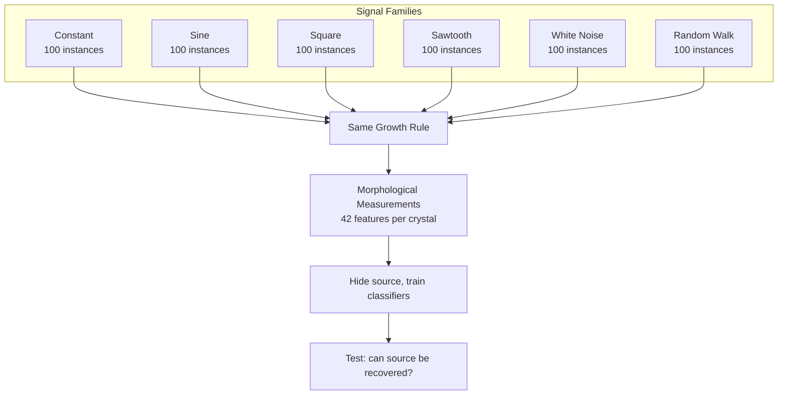
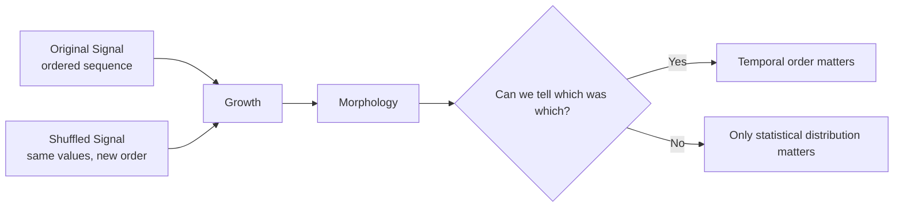
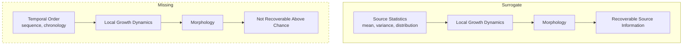
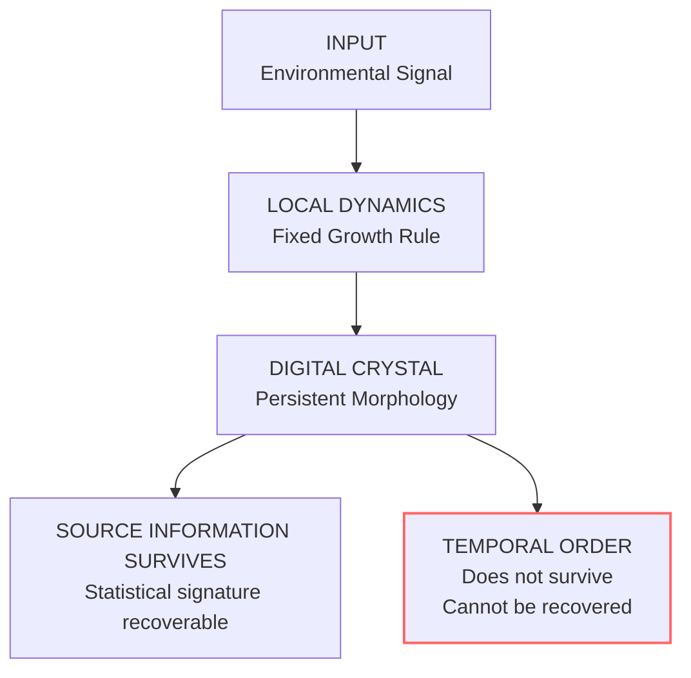

+++
title = "14: The Digital Crystal"
date = "2026-08-11T20:36:00+01:00"
draft = false
description = "Can a local computational growth process turn an external signal into persistent morphology? We build a digital crystal, hide the signal that formed it, and test what the final structure actually remembers."
categories = ["Programming", "Artificial Life"]
tags = ["Digital Life", "Digital Crystal", "Cellular Automata", "Morphology", "Information", "Simulation", "Experiment"]
+++

We gave it a name.  
That was the easy part.

```text
DIGITAL CRYSTAL
```

The harder question is whether the name means anything.

In the previous chapters we kept encountering structured digital phenomena.  
Patterns appeared.  
Patterns propagated.  
Patterns repeated.  
Some looked as if they were reproducing.  
Some looked as if they were moving together.

We attacked those interpretations.  
Some survived.  
Some did not.

In particular, the apparent collective motion was real enough to measure, but one of our stronger explanations for it did not survive better controls.

That left us with something interesting.  
Not a flock.  
Not necessarily an organism.  
Not something we had earned the right to call alive.

But still:

```text
local computation
↓
repeated interaction
↓
characteristic larger-scale structure
```

That sounds familiar.  
It sounds like a crystal.

---

## Not a Crystal Because It Is Hexagonal

This distinction matters.

When we built the crystal earlier in the book, we used a hexagonal lattice.  
That was useful because it gave us an extremely simple growth system.

But a digital crystal cannot mean *a thing that looks like quartz*.  
Nor can it mean *anything arranged on a hexagonal grid*.  
Those would be visual definitions.  
We want a computational one.

A physical crystal acquires its structure through repeated local interactions during formation.  
Its macroscopic form is the consequence of those interactions.

So let us try the analogous idea digitally.

Our first working definition will be:

> **A Digital Crystal is a local computational growth process in which characteristics of an external input become expressed as persistent, measurable morphology.**

That is deliberately narrow.  
It says nothing about:

```text
life
memory
learning
adaptation
reproduction
intelligence
agency
```

It gives us something much better: a test.

---

## Give the Crystal an Environment

Our earlier crystal could be written approximately as:

\[
C_{t+1} = G(C_t)
\]

where \(C_t\) is the current crystal and \(G\) is the local growth rule.

Now we add one thing: \(E_t\), an external signal.  
The new system becomes:

\[
C_{t+1} = G(C_t, E_t)
\]

The signal does not draw the crystal.  
It does not say:

```python
if signal == "sine":
    draw_sine_shape()
```

That would merely be a strange plotting library.  
Instead the same local rule operates for every experiment.  
The external signal only perturbs the conditions under which local growth occurs.

```mermaid
flowchart LR
    subgraph External
    E[Environmental Signal<br/>E(t)]
    end
    subgraph Local Growth
    D[Local Dynamics<br/>G(C,E)] --> C[Current Crystal State<br/>C(t)]
    C --> D
    end
    D --> M[Final Morphology]
    E --> D
```

Different input. Same rule. Different result?  
That is our first question.

---

## The Local Rule

We retain the hexagonal lattice.  
Every cell has six possible neighbors.

```python
HEX_DIRECTIONS = (
    (1, 0),
    (1, -1),
    (0, -1),
    (-1, 0),
    (-1, 1),
    (0, 1),
)
```

Growth remains local.  
A candidate frontier cell is influenced by:

- number of occupied neighbours
- fixed lattice anisotropy
- current environmental signal
- stochastic attachment

There is no target morphology.  
There is no global drawing routine.  
There is no stored answer telling the crystal what it should become.

The signal only changes the probability that particular local growth events occur.  
One convenient form is a logistic attachment function:

\[
P(\text{attach}) = \sigma(a + bn + cE_t + dA + q)
\]

where:
- \(n\) is occupied-neighbor count,
- \(E_t\) is the current signal,
- \(A\) is a fixed local anisotropy term,
- \(q\) is a crowding penalty,
- \(\sigma\) maps the result into a probability.

The exact parameters are less important than one constraint:

> **The rule must remain fixed while the source changes.**

Otherwise the experiment would be meaningless.

---

## First Make Sure the Crystal Still Grows

Before giving it interesting inputs, we give it the least interesting input possible:

\[
E(t) = 0
\]

Constant. No oscillation. No changing environment.

The generalized model should still produce an ordinary growing structure.  
It did. In our full run the baseline crystal reached:

```text
occupied cells       5,924
maximum hex radius      44
boundary edges         552
```



This proves almost nothing.  
But it prevents a more embarrassing failure: we have not replaced the crystal with a completely different system merely to make the later experiment work.

---

## Six Environments

Now we give the same crystal six different kinds of input:

```text
constant
sine
square
sawtooth
white noise
random walk
```

The individual signals vary between runs.  
Periods vary.  
Phases vary.  
Noise varies.  
Random walks vary.

The model receives only the scalar value at the current growth step.  
For example, \(E_t = \sin(\omega t + \phi)\) for one crystal.  
Another receives a square wave.  
Another receives noise.  
Another receives a random walk.



Then we grow the crystals.  
Same model. Different environment.



And immediately we face the problem that has followed us through this entire book.

They look different.  
So what?

---

## Pretty Pictures Are Cheap

It would be easy to stop here.

We could say: *Look. Different signals generate different crystals.*  
And the chapter would make a very attractive demo.

But we have spent thirteen chapters learning not to do that.  
A picture can suggest a hypothesis.  
It cannot establish the explanation.

Perhaps one random seed happened to generate a larger crystal.  
Perhaps the square wave simply increased average growth.  
Perhaps our eyes are categorizing noise.  
Perhaps the signal classes differ in some trivial statistical property that the crystal converts into total area.

So we need populations. Not examples.

---

## Six Hundred Crystals

For the full experiment we generated:

```text
100 constant
100 sine
100 square
100 saw
100 white noise
100 random walk
```

A total of **600 crystals**.

Each uses:

- same Digital Crystal rule
- same experimental horizon
- same measurement system
- different source instance
- different random growth realization

Now we stop looking at them one by one.  
We measure them.



---

## Measure the Morphology

For each final crystal we extracted 42 morphological measurements.  
They included:

```text
area
perimeter
maximum radius
compactness
boundary roughness
bounding-box aspect
centroid displacement
radial distribution
angular distribution
six-fold angular structure
boundary-radius variation
```

The measurements deliberately do not include the source signal.  
The analysis is allowed to see **the crystal**, not **the crystal plus the answer**.



Already this tells us something useful.  
The morphology is not merely visually different.  
Some measurable characteristics differ systematically.

But even that is not enough.

---

## Hide the Source

Now we perform the more interesting test.

Imagine I give you a completed crystal.  
I do not tell you whether its environment was sine, square, noise, random walk…

Can you recover the source from morphology alone?

With six classes, random guessing succeeds at \( \frac{1}{6} \approx 16.7\% \).  
That gives us a clean baseline.

We train classifiers on part of the crystal population.  
Then we give them crystals they have never seen.

---

## Can We Recover the Source?

The result was:

```text
chance               16.7%

random forest         52.2%
logistic regression   53.9%
```



Two rather different classifiers arrive at approximately the same result.  
That matters.  
We are not relying on one exotic model finding one accidental decision boundary.

The confusion matrix also tells us where the information is and where it is not.



This is the first result I am willing to call evidence for the Digital Crystal idea.

Not because classification is perfect.  
It is not.

But because:

```text
source
↓
local growth
↓
morphology
↓
source information remains recoverable
```

The source has left a persistent statistical signature in the structure.

---

## But What Exactly Survived?

This question is more important than the positive result.

Consider two signals: sine and square.  
They differ in many ways.  
Their temporal organization differs. Their distributions differ. Their frequencies may differ. The amount of time spent near extreme values differs.

Perhaps the classifier is not recovering *the process that generated the crystal*.  
Perhaps it is recovering something much simpler: the statistical distribution of environmental conditions experienced during growth.

That would still be interesting.  
But it would be a different claim.

So now we attack the result.

---

### The Same-Mean Control

All varying signals were normalized to approximately the same mean.  
The constant control was zero.

Yet the morphology-class centroids still differed.  
For example, their standardized distances from the constant crystal population were approximately:

```text
sine          4.45
square       13.82
saw           2.44
white noise   2.40
random walk   1.40
```

The square-wave crystals were particularly distinct.  
So the classifier is not merely recovering *average environmental value*.  
Variation itself is doing something.

But that still does not tell us whether **time order** matters.

---

## Destroy Time

Here is the more dangerous control.

Take one signal:

```text
0.7
0.2
-0.3
0.9
-0.8
...
```

Now shuffle it:

```text
-0.3
0.9
0.7
-0.8
0.2
...
```

The shuffled signal contains:

- the same values
- the same mean
- the same variance
- the same minimum
- the same maximum
- the same histogram

Only one thing has been destroyed: **temporal order**.

If the crystal really records something about its history, this should matter.



---

### Ordered or Shuffled?

We now hide whether a crystal came from the original temporal order or the shuffled version.  
Binary chance is \(50\%\).

Our result:

```text
chance               50.0%

random forest         51.3%
logistic regression   51.7%
```



That is not evidence. That is chance.

The confusion matrix tells the same story.



This is the first major correction to our idea.

The Digital Crystal remembers something about the conditions under which it formed.  
But apparently not the order in which those conditions occurred.  
At least not in a form that our measurements can recover.

---

### Maybe Our Control Is Still Too Weak

There is another problem.  
A sine wave and a square wave do not merely differ in ordering.  
They also contain different distributions of values.

So perhaps the source-classification success comes almost entirely from those distributional differences.

We can test that much more brutally.  
We construct one set of values, for example:

\[
V = \{ v_1, v_2, v_3, \dots, v_{72} \}
\]

Then every source receives **exactly those same values**.  
Not approximately the same distribution. Exactly the same multiset.  
We only rearrange them.

---

## Six Ways to Arrange the Same World

From the same values we construct several temporal organizations:

```text
RANDOM       – random permutation
BLOCK        – low values grouped together, then high values grouped together
ALTERNATING  – low, high, low, high…
SMOOTH       – neighboring values change gradually
BURST        – quiet periods interrupted by concentrated high-amplitude excursions
PERIODIC     – the same values arranged into a repeating temporal motif
```

Every one contains exactly the same samples.



Then we grow crystals again.  
Frozen model. No parameter tuning. No attempt to rescue the hypothesis.



This experiment contains another important safeguard: all six arrangements created from one value set stay together during train/test splitting.  
The classifier cannot see one ordering of value set A during training and then classify another ordering of value set A during testing.  
The held-out value sets are genuinely unseen.

---

### The Stronger Temporal Experiment Fails Too

Once the input distributions are held exactly constant, temporal organization is not recoverable above chance.  
The result falls to chance-level behavior.

That gives us a much sharper conclusion than the original source-classification experiment.  
Our Digital Crystal is not behaving like a chronological recorder.  
It is behaving more like a **morphological statistic**.

---

## A Crystal Is Not a Tape Recorder

This is where the result becomes more interesting than the idea we started with.

We originally imagined:

```text
environmental history
↓
crystal
↓
history written into morphology
```

That was too strong.

What we actually found looks more like:

```text
environmental statistics
↓
local dynamics
↓
persistent morphology
```

The exact sequence is largely lost.  
Some broader characteristics survive.

That is strangely crystal-like.  
If we inspect a physical crystal, its structure may tell us something about the conditions under which it formed.  
It does not necessarily contain a frame-by-frame movie of its formation.

Our digital version appears to behave similarly.

---

## Robustness

There is still another danger.  
Perhaps source recovery works only at exactly one carefully chosen forcing strength.

So we vary the strength of the environmental influence while keeping the local growth mechanism otherwise unchanged.  
The held-out random-forest source-classification accuracies were:

```text
forcing        accuracy

0.75            34.1%
0.85            43.2%
0.95            50.0%
1.00            52.3%
1.05            52.3%
1.15            63.6%
1.25            43.2%
```

Chance remains \(16.7\%\).



The magnitude changes. That is expected.  
But the phenomenon does not immediately disappear when we move the forcing parameter.  
So this is not obviously a one-point artifact.

---

## What Have We Actually Built?

We started with a metaphor: DIGITAL CRYSTAL.

Then we gave it a provisional operational meaning:

> A local computational growth process in which characteristics of an external input become expressed as persistent, measurable morphology.

That definition survives.  
The stronger version does not.

We cannot say: *The crystal records its temporal history.*  
We tried. It failed.

---

## A Better Computational Definition

We can now write the model more carefully.

Let \(C_t\) be the crystalline state, \(E_t\) the environmental forcing, and \(G\) the fixed local growth dynamics.

\[
C_{t+1} = G(C_t, E_t)
\]

After a finite experimental horizon \(T\), we observe:

\[
M_T = \Phi(C_T)
\]

where \(M_T\) is the measured morphology.

Our experiment establishes that, for this model, \(M_T\) contains enough information to predict some properties of the source family substantially better than chance.

But when source-value distributions are held fixed and only their ordering changes, we do not find evidence that \(M_T\) contains recoverable temporal-order information.

So the useful relationship is currently:

```text
SOURCE STATISTICS
       ↓
LOCAL DYNAMICS
       ↓
MORPHOLOGY
```

not:

```text
COMPLETE HISTORY
       ↓
MORPHOLOGY
```



That distinction matters enormously for what comes next.

---

## A Picture Made by a Process

There is also a practical side to this.

A Digital Crystal can be used simply as a generative visualization.  
Feed it:

```text
software metrics
network traffic
model activity
market data
music
weather
sensor data
mathematical functions
```

and let those signals influence formation.

The result is not a conventional graph.  
A conventional graph does something like:

```text
value → coordinate → pixel
```

The Digital Crystal does:

```text
value → local growth conditions → many stochastic interactions → persistent morphology
```

The image is therefore not drawn directly from the data.  
It is **grown under the influence of the data**.

That can make it useful as art.  
It may make it useful as telemetry.  
It may make it useful for detecting statistical regimes.

But those are applications. They are not the scientific claim.

---

## Could a Software System Grow a Crystal?

Imagine a running service emits one health measurement every few seconds:

```text
latency
errors
test state
queue depth
memory pressure
```

Instead of drawing another dashboard, we allow those measurements to perturb a Digital Crystal.  
At the end of the day we have **the day's crystal**.

Periods with different statistical characteristics may leave different morphology.  
A healthy day may look unlike an unstable day.  
A noisy application may generate a different structure from one experiencing a persistent drift.

We now have experimental reason to believe this is at least plausible.  
But we should also know its limitation: if two days contain essentially the same values in different order, Digital Crystal v1 may fail to distinguish them.

That is not a bug in our conclusion. It is part of the model we have discovered.

---

## The Crystal Has State

There is one subtle point.  
The crystal obviously has a state.

At step \(t\), \(C_t\) depends on earlier growth.  
A cell added at step 10 is still there at step 70.  
So past events have contributed causally to the present structure.

But that is not the same as having a useful record of history.

This experiment gives us a distinction we are going to need:

> **Past contributed to present** does not necessarily imply **present preserves the order of the past**.

That sounds obvious once stated.  
It was not obvious before we tested it.

---

## State Is Not History

Consider two sequences:

```text
A B C D
```

and:

```text
D B A C
```

They may both influence the final state.  
But if the final state contains no recoverable information about which sequence occurred, then the process has accumulated consequences without retaining chronology.

That is exactly where our current Digital Crystal appears to be.  
It has **state**, but not yet an experimentally demonstrated **history**.

```mermaid
flowchart LR
    subgraph Crystal Process
    A[Past Events] -->|causal influence| B[Current State C(t)]
    end
    B --> C{Can we recover<br/>the order of past events?}
    C -->|Yes| D[State contains history]
    C -->|No| E[State without history]
    style E stroke:#f66,stroke-width:2px
```

That difference gives us our next problem.

---

## Evidence Ledger

### What We Saw

Different forcing processes produced visibly and measurably different Digital Crystal morphologies.  
Across 600 crystals, source-family classification from morphology alone reached:

```text
random forest         52.2%
logistic regression   53.9%
chance                 16.7%
```

The effect remained above the predeclared margin across all seven tested forcing strengths.

### What Survived

This claim survived:

> A fixed local computational growth process can transform differences in its forcing environment into persistent morphological differences containing recoverable information about the source family.

This is enough to justify using **Digital Crystal** as an operational model in this book.

### What Did Not Survive

This claim did not survive:

> The final morphology preserves the temporal ordering of the input.

Ordered-versus-shuffled classification produced:

```text
random forest         51.3%
logistic regression   51.7%
chance                 50.0%
```

A stronger matched-distribution experiment also failed to establish recovery of temporal organization when exactly the same environmental values were presented in different orders.

### What We Can Claim

For this model and experimental horizon:

> The Digital Crystal converts statistical characteristics of an external forcing process into persistent morphology from which source information can be recovered substantially above chance.

We can also say:

> The resulting morphology is not merely determined by the mean forcing value.

And:

> The source-family effect survives moderate changes in forcing strength.

### What We Cannot Claim

We cannot claim that:

```text
the crystal remembers the input sequence
the temporal history can be reconstructed
the crystal learns
the crystal adapts
the crystal understands the source
the crystal has goals
the crystal is alive
```

And we should not quietly promote *source information* into *memory*.  
They are not the same result.

---

## The Useful Failure

This may be the most important result in the chapter.

We wanted the crystal to tell us: *What happened to you?*  
It could answer something weaker: *I can tell you something about the kind of conditions under which I formed.*

Then we asked: *Fine. What happened first?*  
And the answer was effectively: *I don't know.*

That is not the end of the Digital Crystal.  
It tells us exactly what capability is missing.

The crystal has a present.  
It does not yet have a usable past.

So perhaps the next step is not to make it smarter.  
Perhaps the next step is much smaller.

We give it a way to **keep what happened**.  
Not learn from it. Not reason about it. Not change itself because of it.  
Just keep it.

Because before anything can learn from history, there has to be some history left to learn from.

---

## The Digital Crystal

We began this chapter with a name.  
Now the name has earned a little more weight.

A Digital Crystal is not a crystalline picture.  
It is not a cellular automaton merely because it grows on a lattice.  
And it is not a primitive organism.

For now:

> **A Digital Crystal is a local computational growth process in which characteristics of an external input become expressed as persistent, measurable morphology.**

The definition is small. That is intentional.  
The experiments support it. The stronger claims failed.  
And that gives us somewhere to go.



The crystal can tell us something about the world that formed it.  
It cannot tell us what happened first.

**So next, we give the crystal a past.**
