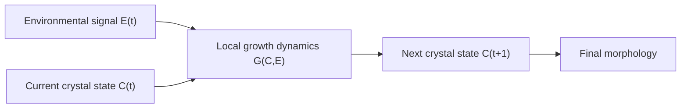
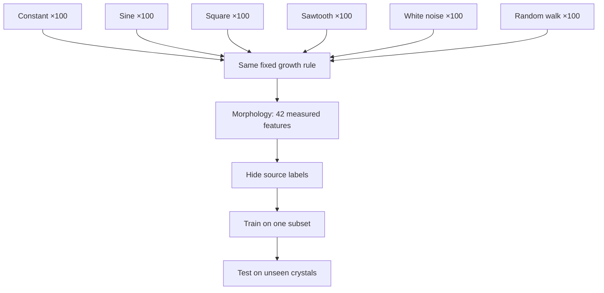
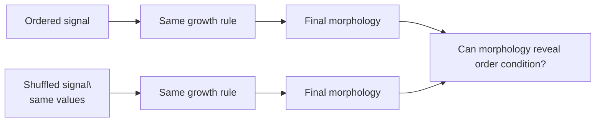
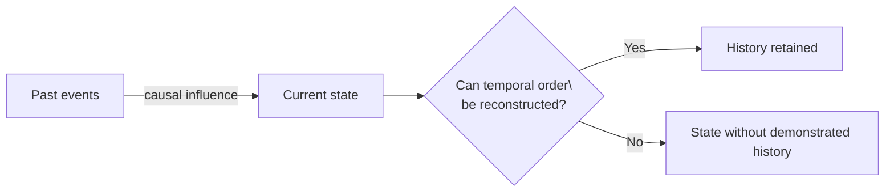
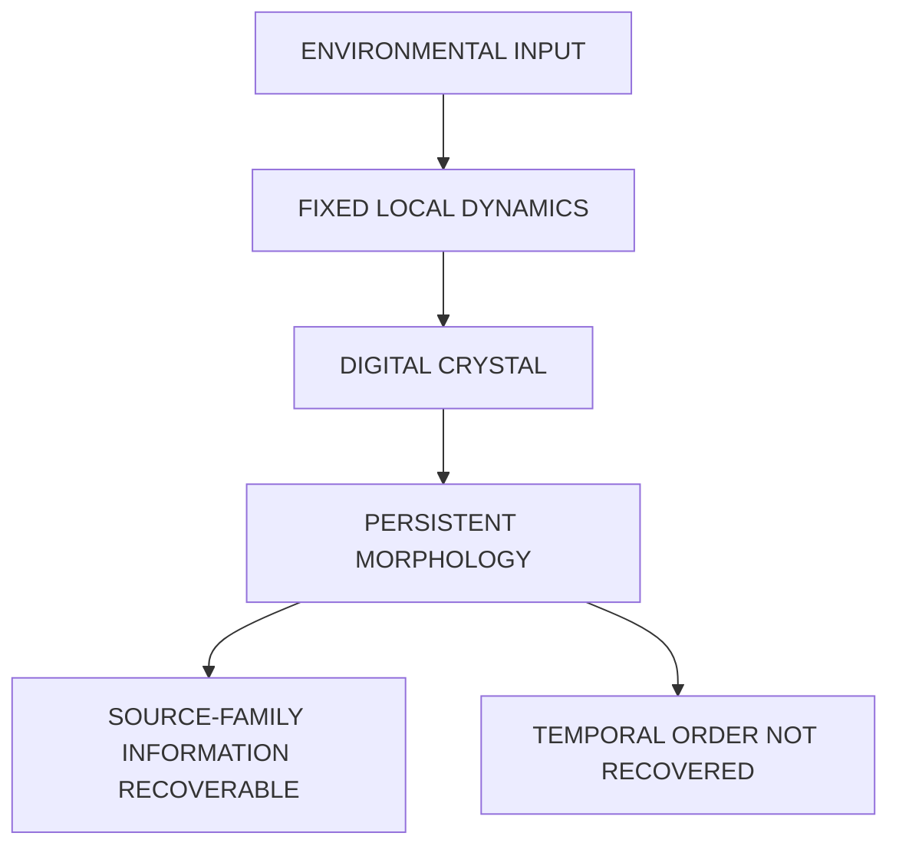

+++
title = "14: The Digital Crystal"
date = "2026-08-11T20:36:00+01:00"
draft = false
description = "Can a local computational growth process turn an external signal into persistent morphology? We build a Digital Crystal, hide the signal that formed it, and test what the final structure actually preserves."
categories = ["Programming", "Artificial Life"]
tags = ["Digital Life", "Digital Crystal", "Cellular Automata", "Morphology", "Information", "Simulation", "Experiment"]
series = ["Digital Life From First Principles"]
+++

We are leaving Outlier.

Not because it failed.

Quite the opposite.

Outlier did exactly what we needed an external reference system to do.

It showed us that very simple digital physics can support structures that recur, move, interact and participate in measurable causal lineages.

Then we attacked our own interpretations.

Some survived.

Some did not.

The causal reproduction result survived.

One of our strongest explanations for the apparent coordinated motion did not.

That is useful.

But Outlier is not the next version of our crystal.

We are not going to copy it.

We are not going to take its structures and start bolting biological capabilities onto them.

We are going back to the laboratory.

There is one idea worth carrying with us:

```text
local computation
↓
repeated interaction
↓
characteristic larger-scale structure
```

That idea is much smaller than an organism.

It is much smaller than reproduction.

It does not require individuality.

And it brings us back to something we encountered earlier.

The crystal.

---

## Back to the Laboratory

In Chapter 11 we built an intentionally trivial growth system.

One seed.

A hexagonal lattice.

A local rule.

Occupied cells remained occupied.

Empty cells could become occupied through local contact.

No target morphology.

No stored radius.

No global shape.

And yet a characteristic large-scale structure appeared.

That experiment established something small but important:

> **A repeated local computational process can generate persistent global structure without containing an explicit representation of that structure.**

Then we left our laboratory.

Outlier was an excursion into a system we did not design.

Now we return.

But we are not simply continuing the Chapter 11 model unchanged.

We are going to ask it a new question.

> Can the environment leave a measurable mark on the structure that grows inside it?

That requires a new experimental model.

---

## What Changed Since Chapter 11?

This matters enough to state explicitly.

Chapter 14 does **not** use exactly the same growth rule as Chapter 11.

The Chapter 11 crystal was deliberately minimal:

```text
CHAPTER 11

binary occupancy
+
hexagonal neighborhood
+
irreversible growth
+
deterministic local attachment
```

Its purpose was to ask what continued structured growth requires.

The model in this chapter adds several mechanisms:

```text
CHAPTER 14

binary occupancy
+
hexagonal neighborhood
+
irreversible growth
+
stochastic attachment
+
environmental forcing
+
fixed lattice anisotropy
+
crowding penalty
```

Why introduce them?

Because our new question is different.

Chapter 11 asked:

> Can simple local growth generate characteristic persistent form?

Chapter 14 asks:

> Can changing external conditions influence that growth strongly enough to leave a persistent measurable signature?

To ask that question, the environment needs some way to modulate local attachment.

Stochastic attachment gives the forcing room to influence which locally available events actually happen.

Anisotropy gives the lattice persistent directional structure.

Crowding prevents attachment probability from increasing without bound simply because a location has many occupied neighbours.

These mechanisms are introduced for this experiment.

They are not discoveries from Chapter 11.

And this has an important consequence:

> **Results from the Chapter 11 crystal do not automatically transfer to Digital Crystal v1.**

For example, Chapter 11's hole-filling experiment does not prove that this stochastic model has the same damage response.

This is a new model.

It must earn its own claims.

---

## We Gave It a Name

We gave it a name.

That was the easy part.

```text
DIGITAL CRYSTAL
```

The harder question is whether the name means anything.

A digital crystal cannot mean:

> a thing that looks like quartz

Nor can it mean:

> anything arranged on a hexagonal grid

Those would be visual definitions.

And we already know what happens when we allow appearance to substitute for mechanism.

So we need a computational definition.

A physical crystal acquires structure through repeated local interactions during formation.

The large-scale structure follows from those interactions.

Let us try the analogous idea digitally.

Our first working definition is:

> **A Digital Crystal is a local computational growth process in which characteristics of an external input become expressed as persistent, measurable morphology.**

That is deliberately narrow.

It says nothing about:

```text
life
memory
learning
adaptation
reproduction
intelligence
agency
```

Good.

We have a definition that gives us an experiment.

---

## Give the Crystal an Environment

Our earlier crystal could be written approximately as:

$$
C_{t+1}=G(C_t)
$$

where (C_t) is the current crystal and (G) is the local growth rule.

Now we introduce an environmental forcing signal (E_t):

$$
C_{t+1}=G(C_t,E_t)
$$

The signal does not draw the crystal.

It does not say:

```python
if signal == "sine":
    draw_sine_shape()
```

That would merely be a strange plotting library.

The same growth mechanism must operate under every source.

The external signal only changes the conditions under which individual local attachment events occur.



Different input.

Same growth rule.

Different result?

That is our first question.

---

## The Local Rule

We retain the axial hexagonal lattice.

Every cell has six immediate neighbors.

```python
HEX_DIRECTIONS = (
    (1, 0),
    (1, -1),
    (0, -1),
    (-1, 0),
    (-1, 1),
    (0, 1),
)
```

Growth remains local.

For every candidate frontier cell, attachment depends on several quantities:

```text
occupied-neighbour count
fixed lattice anisotropy
current environmental signal
local crowding
stochastic attachment
```

There is no target morphology.

No global drawing routine.

No stored answer describing what the crystal should become.

The signal only affects attachment probability.

One convenient form is:

$$
P(\text{attach})
=
\sigma\left(
a + bn + cE_t + dA - q
\right)
$$

where:
- \(n\) is occupied-neighbor count,
- \(E_t\) is the current signal,
- \(A\) is a fixed local anisotropy term,
- \(q\) is a crowding penalty,
- \(\sigma\) maps the result into a probability.

For Digital Crystal v1 the growth parameters are frozen during the experiment.

The important experimental constraint is:

> **The growth mechanism remains fixed while the source changes.**

Otherwise source recovery would tell us nothing.

---

## First Make Sure It Still Grows

Before giving the system interesting signals, give it the least interesting signal possible:

$$
E(t)=0
$$

Constant.

No oscillation.

No changing environment.

The generalized model should still produce a growing structure.

It did.

In the full baseline run the crystal reached approximately:

```text
occupied cells        5,924
maximum hex radius       44
boundary edges          552
```



This proves very little.

It does **not** prove that Chapter 11's properties survived.

It does not establish robustness.

It does not establish anything resembling life.

It merely establishes that our generalized model remains a growth process.

That is enough to continue.

---

## Six Environments

Now give exactly the same growth rule six different types of forcing:

```text
constant
sine
square
sawtooth
white noise
random walk
```

The individual source instances vary.

Periods vary.

Phases vary.

Noise realizations vary.

Random walks vary.

At each growth step the crystal receives only the scalar value currently presented to it.

For one run:

$$
E_t=\sin(\omega t+\phi)
$$

Another receives a square wave.

Another receives white noise.

Another receives a random walk.



Then we let the crystals grow.

Same model.

Different environment.



And immediately we encounter the problem that has followed us through this entire book.

They look different.

So what?

---

## Pretty Pictures Are Cheap

It would be very easy to stop here.

We could write:

> Look. Different signals generate different crystals.

And the chapter would make an attractive demonstration.

But thirteen chapters have taught us not to do that.

A picture can suggest a hypothesis.

It cannot establish the explanation.

Perhaps one random seed generated a larger structure by chance.

Perhaps square waves merely produce a larger mean attachment probability.

Perhaps our eyes are categorizing noise.

Perhaps the source classes differ in some trivial statistic that becomes encoded as total area.

We need populations.

Not examples.

---

## Six Hundred Crystals

For the main source-family experiment we generated:

```text
100 constant
100 sine
100 square
100 sawtooth
100 white noise
100 random walk
```

A total of:

```text
600 crystals
```

Each experiment uses:

```text
same Digital Crystal rule
same experimental horizon
same measurement system
different source instance
different stochastic growth realization
```

Now we stop looking at individual pictures.

We measure them.



---

## Measure the Morphology

For every final crystal we extracted 42 morphological measurements.

They included quantities such as:

```text
area
perimeter
maximum radius
compactness
boundary roughness
bounding-box aspect
centroid displacement
radial distribution
angular distribution
six-fold angular structure
boundary-radius variation
```

The source signal itself is **not** included.

The classifier gets:

```text
the final measured crystal
```

not:

```text
the final crystal
+
the answer
```



Already this is more useful than looking at the gallery.

There are measurable differences.

But measurable differences still do not tell us how much source information survives.

---

## Hide the Source

Imagine I hand you one finished crystal.

I do not tell you whether it grew under:

```text
sine
square
noise
random walk
...
```

Can the forcing family be recovered from morphology alone?

There are six classes.

Random guessing succeeds at:

$$
\frac{1}{6}\approx16.7%
$$

That gives us a clean baseline.

Train on one part of the crystal population.

Test on crystals the model has never seen.

---

## Can We Recover the Source?

The held-out result was:

```text
chance                 16.7%

random forest           52.2%
logistic regression     53.9%
```



Two very different classifier families produce broadly similar performance.

That matters.

We are not relying on one unusual model discovering one unusual boundary.

The confusion matrix shows that the retained information is uneven.



Now we have a result worth keeping.

Not:

> The crystal remembers its history.

Not:

> The crystal understands the environment.

Something much smaller:

> **The final morphology contains information that makes forcing-process family recoverable substantially above chance.**

The relationship is:

```text
source process
↓
local stochastic growth
↓
persistent morphology
↓
source family partly recoverable
```

That is evidence for the Digital Crystal definition.

---

## But What Exactly Was Recovered?

This is where the experiment becomes interesting.

Consider sine and square forcing.

They differ in temporal ordering.

But they also differ in:

```text
value distribution
time spent near extrema
autocorrelation
transition structure
possibly other simple statistics
```

So perhaps the classifier is not recovering the temporal process.

Perhaps it is recovering some broad statistical property of the values experienced during growth.

That would still be a result.

But it would be a different result.

So now we try to destroy the stronger interpretation.

---

## The Same-Mean Control

The varying signals were normalized to approximately the same mean.

The constant control remained zero.

Yet morphology-class centroids still differed substantially.

Standardized distances from the constant population were approximately:

```text
sine          4.45
square       13.82
saw           2.44
white noise   2.40
random walk   1.40
```

So mean forcing alone cannot explain the source-family result.

Variation matters.

But this still does not establish that **temporal order** matters.

---

## Destroy Time

Take a source sequence:

```text
0.7
0.2
-0.3
0.9
-0.8
...
```

Shuffle it:

```text
-0.3
0.9
0.7
-0.8
0.2
...
```

The shuffled signal preserves:

```text
same values
same mean
same variance
same minimum
same maximum
same histogram
```

But its temporal ordering is destroyed.

So now the hypothesis becomes much cleaner.

If the final crystal retains recoverable information about chronology, crystals grown from the ordered and shuffled sequences should be distinguishable.



---

## Ordered or Shuffled?

Binary chance is:

```text
50%
```

The result:

```text
chance                 50.0%

random forest           51.3%
logistic regression     51.7%
```



The confusion matrix tells the same story.



Under this experiment, neither classifier recovered temporal order above roughly:

```text
52%
```

That is not evidence of useful sequence recovery.

And we need to be precise about what this means.

It does **not** prove that no conceivable measurement could ever recover any temporal information from this model.

It does establish:

> **Our morphology representation and classifiers do not recover ordered-versus-shuffled history above chance under this protocol.**

That is already enough to kill the stronger claim we were drifting toward.

---

## Maybe the Control Is Still Too Weak

There is another problem.

A sine wave and a square wave do not merely differ in ordering.

Their distributions differ.

So perhaps the successful source-family classifier is relying primarily on distributional differences.

We can remove even that possibility.

Construct a single value multiset:

$$
V={v_1,v_2,\ldots,v_{72}}
$$

Now every source receives **exactly the same values**.

Not approximately the same distribution.

Not merely the same mean and variance.

Exactly the same multiset.

Only the temporal arrangement changes.

---

## Six Ways to Arrange the Same World

Using one fixed set of values, create several temporal organizations:

```text
RANDOM
random permutation

BLOCK
low values grouped, then high values grouped

ALTERNATING
low, high, low, high...

SMOOTH
neighboring values change gradually

BURST
quiet periods interrupted by concentrated excursions

PERIODIC
values arranged into a repeating temporal motif
```

Every source contains exactly the same samples.



Then grow crystals again.

Frozen model.

No parameter tuning.

No attempt to rescue the hypothesis.



There is another important safeguard.

All temporal arrangements created from one value set remain together during train/test splitting.

The classifier cannot train on one ordering of value set A and then be tested on another ordering of that same value set.

Held-out value sets are genuinely unseen.

That prevents a subtle leakage path.

---

## The Stronger Temporal Experiment Fails Too

When the value multiset is held exactly constant, temporal organization is not recoverable above chance under the tested classifiers.

This is the sharper negative result.

The positive source-family result is therefore **not evidence that Digital Crystal v1 is a chronological recorder**.

Whatever source information survives is much more compatible with:

```text
distributional characteristics
+
aggregate forcing statistics
+
interaction with stochastic growth
```

than with:

```text
recoverable temporal sequence
```

The crystal had a state.

It did not have a recoverable history.

---

## A Crystal Is Not a Tape Recorder

This is where the result becomes better than the idea we started with.

We initially imagined:

```text
environmental history
↓
crystal
↓
history written into morphology
```

That was too strong.

What the experiment supports is closer to:

```text
environmental statistics
↓
local dynamics
↓
persistent morphology
```

The exact sequence is largely lost under the measurements and classifiers we tested.

Some broader characteristics survive.

That is strangely crystal-like.

Inspect a physical crystal and its structure may reveal something about the conditions under which it formed.

It does not necessarily contain a frame-by-frame movie of formation.

Our Digital Crystal appears closer to that.

A morphological statistic.

Not a tape recorder.

---

## Robustness

There is still another danger.

Perhaps source recovery occurs only at one carefully selected environmental forcing strength.

So we varied the forcing strength while leaving the rest of the local growth mechanism unchanged.

Held-out random-forest source-classification accuracy was:

```text
forcing         accuracy

0.75             34.1%
0.85             43.2%
0.95             50.0%
1.00             52.3%
1.05             52.3%
1.15             63.6%
1.25             43.2%
```

Chance remains:

```text
16.7%
```



We need to be disciplined here.

The sweep is noisy.

There is no clean monotonic trend.

`1.15` happens to perform much better than `1.25`.

So we should **not** say:

> Increasing forcing predictably increases recoverability.

We have not shown that.

The surviving claim is narrower:

> **Source-family information remains recoverable above chance at every tested forcing strength in this sweep.**

That suggests the phenomenon is not confined to exactly one parameter value.

It does **not** establish a scaling law.

It does not tell us what the optimal forcing strength is.

And this experiment is too small to infer the shape of the response curve.

That is enough.

---

## What Have We Actually Built?

We began with a metaphor:

```text
DIGITAL CRYSTAL
```

Then gave it a provisional operational definition:

> **A local computational growth process in which characteristics of an external input become expressed as persistent, measurable morphology.**

That definition survives.

A stronger version does not.

We cannot say:

> The crystal records its temporal history.

We tried.

The evidence did not support it.

That failure makes the definition cleaner.

---

## A Better Computational Definition

Let (C_t) denote the complete crystal state.

Let (E_t) denote environmental forcing.

Let (G) denote the fixed local stochastic growth dynamics.

Then:

$$
C_{t+1}=G(C_t,E_t)
$$

At experimental horizon (T), morphology is measured through:

$$
M_T=\Phi(C_T)
$$

where (\Phi) extracts the morphological measurements.

Our source-family experiment establishes:

$$
M_T
\rightarrow
\text{recoverable information about source family}
$$

substantially above chance.

But the matched-value temporal experiment does **not** establish:

$$
M_T
\rightarrow
\text{recoverable temporal ordering}
$$

So our current evidence supports:

```text
SOURCE CHARACTERISTICS
       ↓
LOCAL DYNAMICS
       ↓
MORPHOLOGY
       ↓
PARTIAL SOURCE RECOVERY
```

but not:

```text
COMPLETE TEMPORAL HISTORY
       ↓
MORPHOLOGY
       ↓
HISTORY RECOVERABLE
```

That distinction matters enormously.

Because it tells us what the crystal is missing.

---

## A Picture Made by a Process

There is also a practical implication.

A Digital Crystal can function as a generative visualization.

Feed it:

```text
software metrics
network traffic
model activity
market data
music
weather
sensor data
mathematical functions
```

and let those signals influence formation.

A conventional graph usually performs something like:

```text
value
↓
coordinate
↓
pixel
```

The Digital Crystal instead performs:

```text
value
↓
local attachment conditions
↓
many stochastic local interactions
↓
persistent morphology
```

The result is not directly drawn from the signal.

It is **grown under its influence**.

That may make it useful as art.

It may make it useful as telemetry.

It may make it useful as a regime visualization.

But those are possible applications.

They are not the scientific claim of this chapter.

---

## Could a Software System Grow a Crystal?

Imagine a running service emits measurements every few seconds:

```text
latency
errors
test state
queue depth
memory pressure
```

Instead of drawing another conventional dashboard, allow those signals to influence a Digital Crystal.

At the end of the day we have:

> **the day's crystal**

Days with different statistical regimes may produce different morphologies.

A healthy system may produce a different morphological distribution from a noisy or persistently degraded one.

We now have experimental reason to think this kind of mapping is plausible.

But we also know an important limitation.

Suppose two days contain approximately the same set of values in different temporal order.

Digital Crystal v1 may not distinguish them.

That is not an inconvenience to hide.

It is a property of the model we have measured.

---

## The Crystal Has State

There is a subtle point here.

The crystal obviously has state.

At time (t), (C_t) depends on earlier attachment events.

A cell added at step 10 may still exist at step 70.

Past events contributed causally to the present.

But that does not imply that the present is a useful record of the past.

This experiment gives us a distinction we are going to need:

> **Past contributed to present does not imply present preserves the order of the past.**

Those are different properties.

We now have evidence separating them.

---

## State Is Not History

Consider two sequences:

```text
A B C D
```

and:

```text
D B A C
```

Both can influence a process.

Both can alter its final state.

But suppose the final state contains no recoverable information allowing us to distinguish which ordering occurred.

Then the process accumulated consequences without retaining recoverable chronology.

That is approximately where Digital Crystal v1 stands.

It has a **state**.

We have not yet demonstrated a **history**.



That gives us the next experimental problem.

---

## Evidence Ledger

### SUPPORTED — Source Information in Morphology

Across 600 crystals, forcing-process family could be recovered from morphology substantially above six-way chance:

```text
random forest           52.2%
logistic regression     53.9%
chance                   16.7%
```

So we can support:

> **A fixed local computational growth process can transform differences in forcing environment into persistent morphological differences containing recoverable source-family information.**

---

### SUPPORTED — Mean Alone Does Not Explain the Effect

The varying source processes were approximately mean-normalized, while their morphology populations remained measurably distinct.

So:

> **The source-family result is not explained solely by average forcing value.**

---

### SUPPORTED — Effect Is Not Confined to One Tested Forcing Strength

Source-family recovery remained above chance at every tested value in the seven-point forcing-strength sweep.

But the sweep is noisy.

So we can claim:

> **The effect survives moderate parameter variation in the tested sweep.**

We cannot claim:

```text
a monotonic relationship
an optimum forcing strength
a scaling law
```

---

### FAILED — Final Morphology Recovers Temporal Order

Ordered-versus-shuffled classification gave:

```text
random forest           51.3%
logistic regression     51.7%
chance                   50.0%
```

A stronger experiment in which every condition contained exactly the same input multiset also failed to establish recoverable temporal organization.

So:

> **We do not find evidence that final morphology preserves temporal order in a form recoverable by the tested feature representation and classifiers.**

---

### NOT ESTABLISHED — History

The crystal's present state depends causally on previous events.

That alone does not establish a recoverable history.

So:

```text
state                 SUPPORTED
recoverable chronology NOT SUPPORTED
history               NOT YET ESTABLISHED
```

---

### NOT CLAIMED

We cannot claim that the crystal:

```text
learns
adapts
understands
has goals
has memory in the strong sense
reproduces
is an organism
is alive
```

Nor can we claim that Digital Crystal v1 inherits every property of the Chapter 11 crystal.

Different model.

Different experiment.

Different claims.

---

## What Survived?

At the beginning of this chapter we proposed:

> **A Digital Crystal is a local computational growth process in which characteristics of an external input become expressed as persistent, measurable morphology.**

That survives.

The experiment supports:

```text
environment
↓
local computation
↓
persistent form
↓
some information about environment remains
```

The stronger idea:

```text
environmental sequence
↓
persistent form
↓
chronology recoverable
```

did not survive.

That distinction is now part of the definition.

---

## What Survived the Hypothesis?

The stronger hypothesis in this chapter failed.

We began with an idea close to:

```text
environmental history
↓
growth
↓
final morphology
↓
history recoverable
```

That was too strong.

The source-family experiment succeeded:

```text
random forest          52.2%
logistic regression    53.9%
chance                  16.7%
```

So the final morphology retained substantial information about the **kind of forcing process** under which the crystal formed.

But when temporal order was isolated, the signal disappeared.

For ordered-versus-shuffled histories:

```text
random forest          51.3%
logistic regression    51.7%
chance                  50.0%
```

And when every condition received exactly the same value multiset and only temporal organization changed, the stronger temporal experiment failed as well.

So Chapter 14 leaves us with a sharper distinction:

```text
COARSE SOURCE CHARACTERISTICS
RECOVERABLE

EXACT TEMPORAL ORDER
NOT RECOVERED
```

The failed chronology claim does not erase the source-family result.

It tells us what kind of information the substrate preferentially preserves.

### Phenomenon record

**Phenomenon:** Lossy history integration

**Status:** **SUPPORTED**

**Current bounded description:**

> Digital Crystal v1 transforms external forcing into persistent morphology that preserves enough information for source-family recovery substantially above chance, while the tested final-state representation does not preserve temporal order in a recoverable form.

The simplest mechanistic picture is:

```text
external forcing
↓
many irreversible local attachment events
↓
aggregate structural bias
↓
persistent morphology
```

The process integrates consequences of the past.

But integration is lossy.

It appears to preserve some broad statistics of the forcing process more readily than exact chronology.

That gives us a provisional cross-chapter principle:

> **Irreversible growth can preserve coarse historical structure while discarding fine temporal identity.**

We should not yet treat this as a universal law of Digital Crystals.

For now it is a substrate-level principle supported by this chapter and available for comparison with later experiments.

### Information hierarchy exposed by this chapter

Chapter 14 separates several different levels of historical information:

```text
past affected present
        SUPPORTED

source family recoverable
        SUPPORTED

mean alone explains source effect
        FAILED

exact temporal order recoverable
        NOT SUPPORTED

complete chronology retained
        NOT ESTABLISHED
```

That hierarchy matters.

A process can be history-dependent without being a history recorder.

A final state can contain information about past conditions without preserving the sequence in which those conditions occurred.

So:

```text
HISTORY-DEPENDENT
≠
HISTORY-READABLE
```

and:

```text
STATE
≠
CHRONOLOGY
```

### What this phenomenon does not establish

The surviving phenomenon does **not** establish:

- memory in the strong sense,
- learning,
- adaptation,
- interpretation of the environment,
- a stored event log,
- sender identity,
- exact chronology,
- or life.

It establishes something narrower:

> **The substrate behaves as a lossy integrator of environmental history: broad characteristics of forcing can survive in morphology even when exact temporal ordering does not.**

This phenomenon should now be tracked independently of the chapter's failed chronology hypothesis.

---

## The Useful Failure

This may be the most important result in the chapter.

We wanted to ask the crystal:

> What happened to you?

The crystal could answer something weaker:

> I can tell you something about the kind of conditions under which I formed.

Then we asked:

> Fine. What happened first?

And under the experiments we performed, the answer was effectively:

> I don't know.

That is not the end of the Digital Crystal.

It identifies the next missing capability.

The crystal has a present.

It does not yet have a usable past.

So perhaps the next step is not to make it intelligent.

Not to give it goals.

Not to give it reproduction.

Not to give it learning.

Something much smaller.

Give it a way to **keep what happened**.

Not interpret it.

Not learn from it.

Not decide what it means.

Just preserve enough information that the past can still be distinguished from another possible past.

Because before a process can do anything with history, there must be some history left.

---

## The Digital Crystal

We began this chapter with a name.

Now the name has earned a little more weight.

A Digital Crystal is not a crystalline picture.

It is not a cellular automaton merely because it grows on a lattice.

It is not a primitive animal.

It is not our attempt to recreate biological life.

For now:

> **A Digital Crystal is a local computational growth process in which characteristics of an external input become expressed as persistent, measurable morphology.**

The definition is small.

That is intentional.

The experiments support it.

The stronger claims failed.



The crystal can tell us something about the world that formed it.

It cannot yet tell us what happened first.

**So next, we give the crystal a past.**
