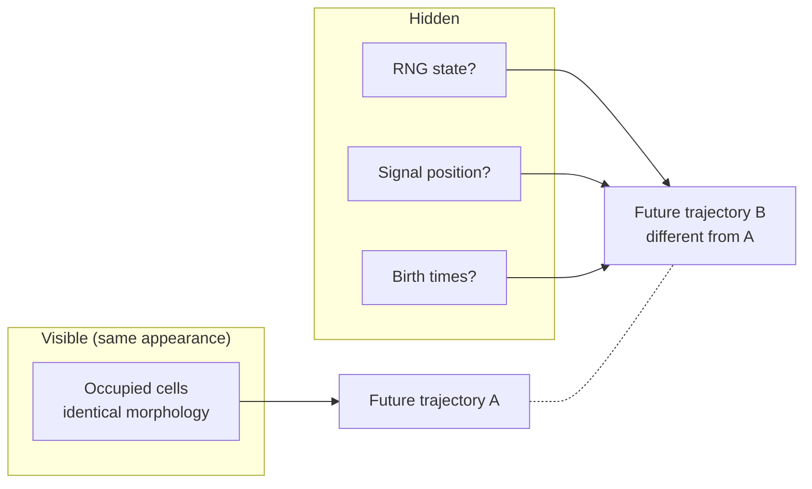
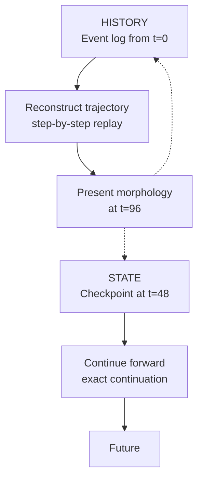
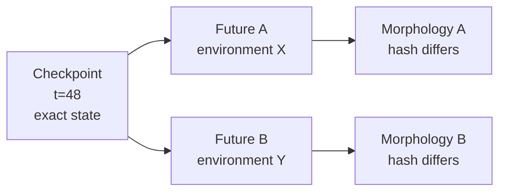
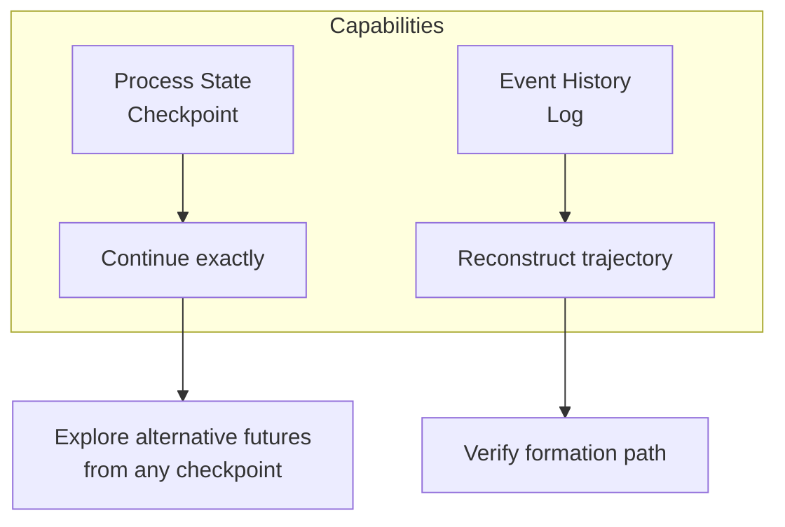

+++
title = "15: The Crystal Gets a Past"
date = "2026-08-11T21:52:00+01:00"
draft = false
description = "A Digital Crystal can preserve source statistics in its morphology, but not temporal order. We add exact state, event history, replay and branching to discover what a recoverable digital past actually requires."
categories = ["Programming", "Artificial Life"]
tags = ["Digital Life", "Digital Crystal", "State", "History", "Checkpointing", "Replay", "Counterfactuals"]
+++

At the end of the last chapter, our Digital Crystal could tell us something about the world that formed it.  
But not enough.

Different forcing processes produced different morphologies.  
We could hide the source and recover its family substantially better than chance.  
But then we asked a much harder question: *What happened first?*

We took exactly the same environmental values and rearranged them in time — smooth, bursting, periodic, alternating, random.  
The final crystal could not reliably tell them apart.

```text
SAME VALUES
+
DIFFERENT ORDER
↓
NO RECOVERABLE TEMPORAL SIGNATURE
```

The crystal had accumulated a state.  
It had not preserved a usable history.

That gives us the next experiment.  
Not intelligence. Not learning. Not adaptation.  
Something much smaller.

> **What must a digital process preserve if we want its past to survive?**

---

## The Present Is Not the Past

Our Digital Crystal already has a state.  
At any moment, \(C_t\) contains the cells that currently exist.  
Those cells are the accumulated consequence of earlier growth.  
So the past clearly matters.

But Chapter 14 showed us an important distinction:

> *Past contributed to present* does not imply *present contains a recoverable record of the past*.

That distinction is easy to miss.  
A footprint exists because someone walked there. The footprint is not the walk.  
A crater exists because something struck the ground. The crater is not a complete trajectory of the object that made it.

Our crystal is similar. Its current shape contains consequences.  
That does not mean it contains the sequence that produced them.

So we need to separate two concepts.

---

## State

We begin with an operational definition.

> **State is enough information to continue from here.**

That sounds simple. But what exactly counts as state?  
Perhaps *current occupied cells* is enough. Maybe the picture is the state.

We can test that.

Our Digital Crystal is stochastic. Its future depends on random attachment decisions.  
Its future also depends on where we currently are in the input stream.

So a candidate process state might include:

```text
occupied cells
birth times
current timestep
current signal position
random-number-generator state
model parameters
```

But we should not define those as necessary because they sound reasonable.  
We should discover what is necessary by removing them.

First we need a reference.

---

## Run the Crystal Continuously

We take the frozen Digital Crystal v1 from Chapter 14.  
No changes to its local growth rule.  
The input is a composite signal containing several interacting temporal components.

We run for **96 steps** and save a checkpoint halfway through at **t = 48**.

At the checkpoint: `occupied cells = 2,532`  
At the end: `occupied cells = 9,553`



The final morphology receives a hash: `2934f8715636efbcaaa9ec99`  
The complete process state receives another: `6fb30c5aa8147112a7f94cb9`

Now we can demand something much stronger than visual similarity.  
If we restore the crystal correctly, we want **exactly the same future**.

---

## Stop It

At step 48 we serialize the process.  
Not a screenshot. Not a rendered image.  
The actual operating state.

Then we kill the running simulation.  
Load the saved state from SQLite.  
Continue.

If our definition of state is complete, the restored crystal should not merely resemble the uninterrupted crystal.  
It should become the same crystal — cell for cell, step for step, random decision for random decision.

---

## Save, Restore, Continue

The result is exact.

```text
exact final morphology           True
exact final process state        True
population trajectory identical  True
attachment trajectory identical  True
symmetric-difference cells       0
```

The hashes match:

```text
REFERENCE   2934f8715636efbcaaa9ec99
RESTORED    2934f8715636efbcaaa9ec99
```

And the full process-state hashes match too.



This was not a one-run accident.  
We repeated the checkpoint experiment across **30 independent runs**.

Result: `30 / 30 exact`

So we have earned our first claim:

> **A complete Digital Crystal state can be serialized and resumed without changing the future trajectory of the stochastic process.**

That is a useful definition of digital state.  
But now we make it harder.

---

## What Actually Belongs to State?

Suppose we save only what we can see — the current morphology.  
Surely that is the crystal.

Maybe not.

We take the exact checkpoint and deliberately damage it in several ways.

---

### Remove the Random State

First we restore: same cells, same birth map, same timestep, same signal position — but replace the random-number-generator state.

The crystal still looks identical at the restore point.  
Then we continue.

The final result differs:

```text
final population              9,569
symmetric-difference cells       26
normalized difference       0.002716
```

A tiny change. But not zero.  
The future has changed.

So the random state is not merely implementation plumbing.  
For exact continuation: **it is part of the process state**.

---

### Move the Signal Cursor

Next we restore everything correctly except the position in the environmental input.  
We move it three steps backward.

Again the checkpoint looks identical. Again the future changes.

```text
final population              9,577
symmetric-difference cells       24
normalized difference       0.002506
```

So current shape does not tell us where we are in the world.  
The external sequence position is also part of continuation state.

---

### Save Only the Morphology

Now we become more brutal.  
We preserve the occupied cells but discard the proper process details.  
We reconstruct birth times crudely. Reset the random generator.  
Then continue from the same visible shape.

Result:

```text
final population              9,576
symmetric-difference cells       23
normalized difference       0.002402
```



This gives us a result that reaches back through the entire book.  
We have repeatedly learned not to confuse appearance with mechanism.

Now we have another version:

> **Appearance is not state.**

A system can look identical and still possess a different future.



---

## State Is Whatever the Future Needs

This suggests a stronger operational definition:

> **The process state is the minimum information required to continue the system faithfully from the present moment.**

For Digital Crystal v1, that includes more than geometry.  
At least: morphology, birth information, current timestep, signal position, RNG state, growth parameters.

Not because we declared these philosophically fundamental.  
Because changing them changed the continuation.

That is a much better reason.

---

## Now Give It History

Checkpointing gives us a present we can resume.  
But Chapter 14's problem remains: *How did we get here?*

For that we record an event stream.

At every step we preserve:

```text
step
input value
cells added
population
resulting state hash
```

So the history becomes something like:

```text
STEP 1
input = ...
added = [...]
state hash = ...

STEP 2
input = ...
added = [...]
state hash = ...

STEP 3
...
```

This is not yet memory in any cognitive sense.  
The crystal does not inspect it. It does not learn from it.  
It is simply an explicit formation record.

Now we ask whether the record is sufficient.

---

## Replay the Process

There are two ways to reconstruct the past.

The first is procedural: start from the original seed, use the same input, same local growth rule, same stochastic state, and run again.

If the process is reproducible, we should end in exactly the same place.

We do:

```text
exact final morphology    True
exact process state       True
```

That proves the simulation itself is reproducible.  
But it is not yet enough to prove that our stored history is complete.

So we perform a second replay.

---

### Replay the Events

This time we do not rerun the growth mechanism.  
We take the recorded history itself.  
At each recorded step, apply exactly the cells that were recorded as appearing.

After every event we compute the state hash.  
We compare it with the hash recorded during the original run.

There are **96 steps**.

Result: `96 / 96 hashes match`  
Final morphology: exact.



Now we have earned a second claim:

> **An explicit Digital Crystal history can reconstruct the exact trajectory by which the present morphology was formed.**

And this finally gives us the distinction we needed.

---

## State Is Not History

A checkpoint and a history log can both contain information about the same crystal.  
But they serve different purposes.



- The checkpoint answers: *Where are we now, and what do I need to continue?*
- The history answers: *How did we reach here?*

Our experiment makes this operational.

```text
STATE   = enough information to continue from here
HISTORY = enough information to reconstruct how here was reached
```

The history can reconstruct the checkpoint morphology.  
The checkpoint can continue exactly.  
But the checkpoint does not contain an explicit ordered event sequence.  
And history-reconstructed geometry without the original stochastic continuation state does not produce the exact same future.

So neither is merely another representation of the other.  
They overlap. But they are different tools.

---

## A Strange Digital Advantage

Now something peculiar becomes possible.

In biology, the past is usually gone.  
You may preserve records of it. You may infer it.  
But you cannot ordinarily return an organism to its exact earlier complete physical state and ask: *What if the future had been different?*

Digital systems can.  
Our checkpoint is executable.

That means the past can become an experimental branch point.

---

## Restore the Same Past Twice

We take the exact checkpoint at step 48.  
We restore it twice.

Both copies begin with: same morphology, same birth times, same RNG state, same timestep, same signal cursor.  
Nothing differs.

Then we expose them to two different futures.

```text
              ┌── FUTURE A
SAVED PAST ───┤
              └── FUTURE B
```

Future A receives one forcing process.  
Future B receives another.  
That is the only intentional difference.

---

### One Past, Two Futures

At the end:

```text
Future A hash   42584efb0aa4e27bda19cc9a
Future B hash   b4daa3b8155d04917b307c21
```

Their final occupied sets differ by **48 cells**.  
Normalized difference: `0.005012`.



And we can watch that divergence develop over time.



This changes what a saved state means.  
It is not merely a backup.  
It is an experimental branch point — a place from which alternative futures can be generated under controlled conditions.



---

## This Is Not Reproduction

We should resist that word.

We can restore the same checkpoint many times. That resembles copying.  
But nothing in this experiment establishes autonomous reproduction.  
The copying is performed by our experimental infrastructure.

The useful property is narrower:

> **Digital state can be duplicated as an exact starting condition for counterfactual futures.**

That is already powerful enough.

---

## The Crystal Now Has a Recoverable Past

Chapter 14 ended with:

```text
PRESENT MORPHOLOGY → SOME SOURCE INFORMATION SURVIVES
BUT TEMPORAL ORDER → LOST
```

We did not repair that by changing the morphology.  
We added a separate historical mechanism.

Now:

```text
CURRENT PROCESS STATE
+
EVENT HISTORY
```

gives us two complementary capabilities.

- State → Continue  
- History → Reconstruct

Together: **past → present → alternative futures**

That is something the Chapter 14 crystal did not possess.



---

## Evidence Ledger

### What We Saw

A Digital Crystal checkpoint saved at step 48 resumed to exactly the same final state as uninterrupted execution.  
Across 30 independent runs: `30 / 30` restored exactly.

The reference and restored runs matched in: final morphology, process-state hash, population trajectory, attachment trajectory, with 0 differing cells.

### What Survived

- A complete Digital Crystal state can be serialized and resumed without altering its future trajectory.  
- An explicit event history can reconstruct the exact sequence of recorded crystal states (96/96 trajectory hashes matched).  
- The same exact saved state can be used as a controlled branch point for different future environments.

### What Did Not Survive

- The idea that visible morphology is the complete state was false — removing hidden continuation information changed the future.  
- History and state are not the same thing — the experiment separates them operationally.

### What We Can Claim

For Digital Crystal v1:

> **State is sufficient information for faithful continuation.**  
> **History is sufficient information for reconstruction of the formation trajectory.**  
> **A complete checkpoint can act as an executable counterfactual branch point.**

Together, these establish a recoverable digital past.

### What We Cannot Claim

We cannot claim:

```text
the crystal understands its history
the crystal uses its history
the crystal learns from its history
the crystal evaluates its past
the crystal chooses between futures
the crystal adapts
the crystal is alive
```

Everything we have built remains passive with respect to the stored past.  
The record exists. The process does not yet consult it.  
That distinction will matter later.

---

## A Past Without Memory

It is tempting to call this memory.  
I do not think we have earned that yet.

We have certainly built storage.  
We have built checkpointing, history, replay, restore, branching.

But the crystal itself does not act differently because it remembers something.  
The history is available. It is not yet part of the crystal's decision mechanism.

So for now:

> **The Digital Crystal has a recoverable past.**

That is enough.

---

## Something Else Has Happened

There is one more consequence.

Our history is composed of events.  
Until now those events remain inside the experimental record.  
One crystal grows. One history accumulates.  
Nothing outside the crystal needs to know.

But events do not have to stay inside.

A process can emit one. Another process can receive it.  
The event does not need to contain a sentence.  
It may contain almost nothing: a pulse, a value, a few bits.

And if several Digital Crystals are allowed to affect one another through those events, something new becomes possible.

The output of one crystal can become part of another crystal's environment.

```text
CRYSTAL A
↓
EVENT
↓
CRYSTAL B
```

For the first time, the environment does not have to come entirely from outside our system.  
The crystals themselves can begin creating it.

That is where we go next.

**The crystal has a past. Next, we let the crystals hear each other.**
