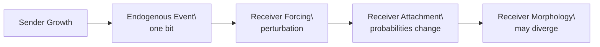
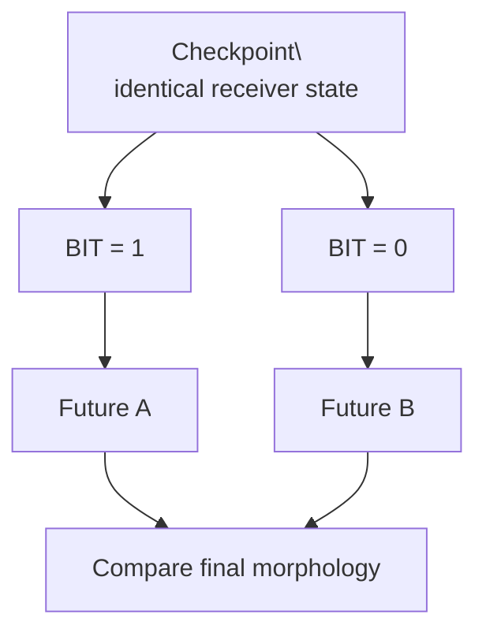
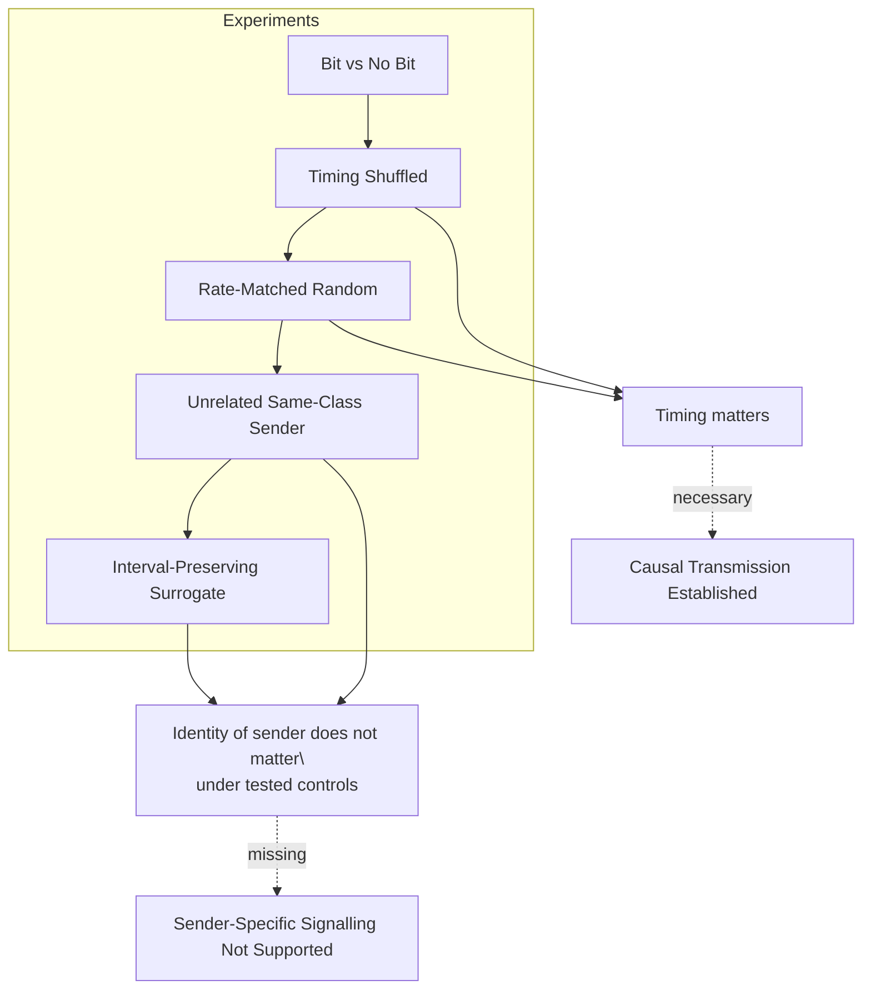
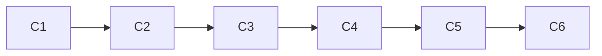

+++
title = "16: Before There Are Messages"
date = "2026-08-12T02:38:00+01:00"
draft = false
description = "A Digital Crystal can causally alter another through a one-bit event, but causal transmission is not yet sender-specific signalling."
categories = ["Programming", "Artificial Life"]
tags = ["Digital Life", "Digital Crystal", "Signalling", "Causality", "Information", "Experiments"]
series = ["Digital Life From First Principles"]
+++

In the last chapter, the crystal acquired a past.  
Not memory in the biological sense.  
Not recollection.  
Not understanding.  
A recoverable past.

We learned that a complete checkpoint could continue the process exactly, that an event history could reconstruct the route by which the present morphology had formed, and that the same checkpoint could be used as a branch point for controlled alternative futures.

That gave us something new:

- A present that could be resumed.
- A past that could be reconstructed.
- A future that could be forked.

The next temptation was obvious.  
If one Digital Crystal can preserve state and history, perhaps two crystals can communicate.

That word is dangerous.  
“Communication” arrives carrying far more assumptions than we have earned.

A sender.  
A receiver.  
A message.  
A channel.  
Meaning.  
Perhaps even intention.

We have established none of those things.  
So we begin with something smaller.  
Not a message.  
A pulse.

> **Before there are messages, there are events that can alter another process.**

That is the whole experiment.  
Can one Digital Crystal produce a one‑bit event that changes another Digital Crystal?  
If the answer is no, there is no reason to discuss communication.  
If the answer is yes, we still have a long way to go.

---

## The Smallest Possible Channel

We keep the Digital Crystal itself unchanged.  
Its growth rule remains the frozen Digital Crystal v1 model from the previous chapters.  
A crystal grows locally across a hexagonal lattice. Its attachment probability depends on its local neighbourhood and on an external scalar input.

We add only one new mechanism: a sender crystal can emit a bit.

The bit is either `0` or `1`.

The receiver does not receive a sentence.  
It does not receive a symbol.  
It does not receive an identifier saying who sent the event.

The bit simply perturbs the scalar environmental input used by the receiver’s existing growth rule.



There is no separate oscillator.  
There is no artificial coordination layer.  
The pulse reaches the Digital Crystal itself.

That distinction matters because an earlier version of this experiment had done something weaker: it coupled auxiliary oscillators and looked for synchronization. That could have produced an interesting dynamical system while leaving the crystal’s actual growth almost untouched.

This experiment asks a harder question:

> **Does the bit reach the thing we are actually studying?**

---

## The Sender Does Not Fire on a Clock

A trivial signalling system would be easy to construct.

We could write:

```python
if step % 10 == 0:
    send(1)
```

Then every receiver could respond to a programmer‑supplied metronome.  
That would establish almost nothing.

Instead, the pulse must come from the sender’s own dynamics.  
At each step we count how many new cells the sender attaches.  
We compare that value with its recent attachment history.  
When current growth is unusually high relative to that recent history, the sender emits a one‑bit pulse.

The rule is deliberately simple.  
The pulse means only:

> an endogenous growth event occurred.

It does not mean danger.  
It does not mean food.  
It does not mean move left.  
It does not even mean “I grew.”  
Those would already be semantic claims.

At this stage, `1` is merely a detectable event generated by the sender’s own changing state.

---

## A Problem We Discovered Before the Real Experiment

The first versions of this experiment produced a misleading endpoint.  
The crystals eventually filled almost the entire hard‑radius region available to them.  
Once that happened, very different trajectories converged on the same final shape: a filled hexagonal disk.

The experiment had not discovered convergence.  
The boundary condition had erased the differences.

This is exactly the kind of failure the method of this book is supposed to catch.  
A final picture can become uninformative even while the process that produced it was different.

So the experiment now contains a saturation guard.  
For a hexagonal disk of radius (r), the maximum number of cells is:

$$
N(r) = 1 + 3r(r+1)
$$

The full experiment uses radius 56, so the hard maximum is 9,577 cells.  
We predeclare that endpoint morphology becomes invalid once a crystal reaches 85% of that capacity.

The experiment therefore does not blindly run for a fixed number of steps.  
Instead it finds the longest safe interval before the boundary starts dominating the result.

For the full sender/receiver run, 90 steps were requested.  
The common safe horizon was 76.

At step 76 the sender occupied 7,723 cells (~80.6% of capacity). The receiver occupied 8,026 cells (~83.8%).  
Step 77 would have crossed the guard.  
So we stop at 76.

That is not an inconvenience. It is part of the experiment.

> **The requested horizon is not necessarily the experimentally valid horizon.**

---

## The First Real Test: One Bit Versus No Bit

Before asking whether a sender’s pulse stream matters, we need to know whether a single received bit matters at all.

Chapter 15 gave us exactly the tool we need: checkpointing.

We take one receiver state and fork it.  
Both futures begin with the same morphology, birth‑time metadata, RNG state, environmental forcing, timestep, and future horizon.

Then we change exactly one thing: one branch receives a bit; the other does not.



This is the strongest experiment in the chapter because it removes almost every obvious alternative explanation.  
If the two futures differ, the difference was caused by the intervention.

In the full run we repeated this 120 times.

The result was not subtle.  
In **95.8%** of interventions, the final morphologies differed.  
The mean normalized final difference was **0.1633**, with an average symmetric difference of about **158 cells**.  
The maximum observed capacity fraction in these experiments was only about 13.5%, so saturation played no role.

The bit did not always produce a difference; five of the 120 interventions ended with no morphology difference under the measured horizon.  
That matters.

The correct claim is not “every received bit necessarily changes the receiver.”  
The claim is:

> Under this protocol, changing one received bit while holding receiver state, stochastic state and environmental forcing fixed usually altered the receiver’s subsequent morphology.

That is enough to establish a primitive causal channel.

---

## The Pulse Has an Immediate Effect

We can also measure the receiver’s attachment response after the intervention.  
Across the 120 full‑profile replicates, the mean attachment difference between the bit and no‑bit branches began:

```text
+1.81
 0.00
-0.34
-0.08
-0.30
-0.32
-0.39
-0.35
-0.61
-0.26
-0.25
-0.75
```

The largest average effect occurs immediately.  
That is useful, but we should not turn it into a latency law.  
This is a finite‑horizon impulse response; the downstream differences depend on the crystal’s subsequent stochastic and morphological evolution.

We have shown that the perturbation enters the growth process and can persist through later divergence.  
We have not measured channel capacity.  
We have not identified a universal response time.  
We have not discovered a communication protocol.

---

## Transmission Is Not Signalling

At this point it would be easy to overclaim.  
One crystal emits a bit. Another crystal changes. Therefore they communicate.

No.

All we have established is causal transmission.  
A light switch also changes a circuit.  
A voltage spike changes a transistor.  
A falling rock changes whatever it hits.

Causal influence is necessary for signalling. It is not sufficient.

To move beyond transmission we need to ask a more difficult question:

> Does the actual sender‑generated event stream matter, or would almost any similarly structured pulse stream produce the same receiver response?

That question requires controls.

---

## Destroy the Timing

The first control keeps the same number of bits but shuffles when they occur.  
If exact sender timing matters, the real stream should outperform the shuffled stream.

It does.

Across 60 full‑profile replicates, the mean peak message‑to‑growth correlation for the real stream exceeded the shuffled stream by about **0.294**.  
The probability that a randomly selected real replicate exceeded a randomly selected shuffled replicate was about **0.980**.

So timing structure matters.  
That is already more than generic bit injection.

---

## Replace the Sender With Randomness

Next we preserve the number of pulses but place them at random times.

Again the real sender wins strongly.  
The real‑minus‑random difference was about **0.270**, with pairwise superiority around **0.977**.

So the receiver is not merely responding to message count; a burst pattern matters.

But this is still not enough.  
The strongest control is not randomness. It is another sender.

---

## The Unrelated Sender

We now generate a pulse stream from another Digital Crystal of the same type.  
It has its own independent environment and its own independent growth trajectory.  
Then we force its pulse count to match the real sender exactly.

This removes a simple explanation: perhaps the real sender looked better only because it emitted more or fewer pulses.

Now the receiver sees either the actual sender stream or a same‑class unrelated sender stream with the same pulse count.

If the actual sender carries something specific, it should win.  
It does not.

The real‑minus‑unrelated difference was **-0.015**.  
Pairwise superiority was **0.457**.

The unrelated sender was, if anything, fractionally ahead under this metric. That difference is tiny.  
The important fact is that the receiver cannot distinguish the actual sender from another crystal producing the same general class of pulse activity.

This is the result that stops us using the word “communication” casually.

> **The receiver is sensitive to a kind of event stream, but not to which same‑class crystal produced it.**

---

## Preserve the Pulse Intervals, Destroy Their Order

We can make the control harder still.  
Take the real sender’s pulse stream. Measure every gap between pulses.

Suppose the gaps were: `1, 1, 2, 1, 4, 1, 1, 3, …`

Now preserve that exact multiset of intervals but permute their order.  
The surrogate has the same number of pulses, the same collection of inter‑pulse intervals, the same coarse burst statistics — but a different chronology.

If the exact sequence carries important information, the real stream should outperform this surrogate.  
It does not.

The real‑minus‑surrogate difference was only **0.010**.  
Pairwise superiority was **0.473**.

Again, effectively no advantage.

This suggests that much of the receiver’s response is driven by coarse temporal structure rather than a uniquely informative chronology.  
That is not yet a theorem, but it is the strongest interpretation supported by this experiment.

> **The receiver appears to respond to the form of the pulse stream rather than the identity of its source.**



---

## The Chain

Once we had a causal one‑bit channel, we tried a simple extension.  
Six crystals in a line:



Each crystal evolves independently. A pulse from one becomes an input to the next. If that input changes the receiver enough, the receiver’s own dynamics may later generate another pulse.

At first glance the result looks impressive. The full run produced source‑to‑node pulse correlations of approximately:

```text
C1  1.000
C2  0.537
C3  0.477
C4  0.462
C5  0.462
C6  0.458
```

It would be easy to draw a picture of a signal propagating down the chain.  
So we destroy the topology.

The shuffled‑edge control produced:

```text
C1  1.000
C2  0.498
C3  0.461
C4  0.478
C5  0.471
C6  0.461
```

The mean absolute real‑versus‑shuffled difference by distance was only about **0.0164**.

So the chain does not establish topology‑specific propagation.  
The high correlations are real observations. The interpretation “information travelled down this particular chain” is not supported.

---

## The Board

Finally we built a 6×6 Crystal Board.  
Thirty‑six independent Digital Crystals, each connected locally to neighbouring crystals through one‑bit events.

```mermaid
graph TD
    subgraph 6x6 Board
    A1---A2---A3---A4---A5---A6
    |    |    |    |    |    |
    B1---B2---B3---B4---B5---B6
    |    |    |    |    |    |
    C1---C2---C3---C4---C5---C6
    |    |    |    |    |    |
    D1---D2---D3---D4---D5---D6
    |    |    |    |    |    |
    E1---E2---E3---E4---E5---E6
    |    |    |    |    |    |
    F1---F2---F3---F4---F5---F6
    end
```

No target. No game. No shape to construct. No collective objective. Just local event transmission.

Again, real and shuffled topologies were run from matched conditions.  
Again, both were stopped at a common safe horizon before saturation (requested horizon 90 steps, average safe horizon ~73 steps).

The real topology did not produce a meaningful advantage over shuffled topology.  
The final real‑minus‑shuffled neighbour‑correlation difference was only about **0.0048**.

So the board does not yet contain evidence of organized local signalling.  
We have created connectivity. We have not created coordination.

---

## What Survived

Chapter 16 began with a word we did not deserve: communication.  
After the experiments, most of that word has been stripped away. What survives is smaller and more precise.

- A one‑bit event can enter another Digital Crystal’s actual growth dynamics and alter its future morphology.
- Real pulse timing matters relative to shuffled or random timing.
- But the actual sender does not yet matter.
- An unrelated same‑class sender performs essentially as well.
- An interval‑preserving surrogate performs essentially as well.
- Local chain structure does not outperform shuffled structure convincingly.
- The 6×6 board does not outperform shuffled topology convincingly.

So the result is not:

```text
THE CRYSTALS COMMUNICATE
```

It is:

```text
CAUSAL TRANSMISSION IS SUPPORTED
while
SENDER-SPECIFIC SIGNALLING IS NOT SUPPORTED
```

---

## What Survived the Hypothesis?

The strongest interpretation in this chapter did not survive.

We began with the possibility that one Digital Crystal might do something meaningfully like communicate with another.

The first intervention gave us a real causal result:

```text
one received bit
↓
receiver growth dynamics change
↓
future morphology often diverges
```

Across 120 paired checkpoint interventions, `95.8%` produced a morphology difference.

That established something important:

```text
CAUSAL TRANSMISSION
SUPPORTED
```

But transmission was not the whole hypothesis.

The harder controls asked whether something specific about the actual sender survived into the receiver.

That is where the stronger interpretation failed.

### The hierarchy exposed by the controls

The control ladder produced a very clear information hierarchy:

```text
BIT VERSUS NO BIT
        strong effect

REAL TIMING VERSUS SHUFFLED
        real wins

REAL TIMING VERSUS RATE-MATCHED RANDOM
        real wins

REAL SENDER VERSUS COUNT-MATCHED
UNRELATED SAME-CLASS SENDER
        no meaningful advantage

REAL CHRONOLOGY VERSUS
IPI-PRESERVING SURROGATE
        no meaningful advantage
```

So the receiver is sensitive to more than pulse count.

Some temporal structure matters.

But the information that survives is not fine enough, under these controls, to identify the sender or the exact chronology of its pulse intervals.

That gives us a much sharper distinction:

```text
COARSE TEMPORAL STRUCTURE
MATTERS

SENDER IDENTITY
NOT RECOVERED

EXACT INTERVAL ORDER
NOT RECOVERED
```

### Phenomenon record

**Phenomenon:** Lossy transmission of temporal structure

**Status:** **SUPPORTED**

**Current bounded description:**

> A one-bit event can causally alter another Digital Crystal, and receiver response depends on coarse timing structure, but the tested channel does not preserve enough information for sender-specific discrimination or exact interval-order discrimination.

This is not merely a communication failure.

It tells us something about the substrate's information resolution.

The receiver appears sensitive to broad temporal form such as:

```text
pulse density
burstiness
interval distribution
coarse timing regime
```

while being comparatively insensitive to:

```text
which same-class sender produced the stream
exact ordering of the same interval collection
```

That pattern connects directly to Chapter 14.

There, final morphology preserved enough information to recover forcing-process family while exact temporal ordering failed.

Here, receiver response distinguishes real timing from shuffled or rate-random controls, but does not distinguish the actual sender from an unrelated same-class sender or the exact chronology from an interval-preserving surrogate.

Together they support a provisional cross-chapter principle:

> **Digital Crystal dynamics preserve coarse process structure more readily than exact chronology or source identity.**

This is the **Lossy-History Principle** appearing in a different experimental role.

Chapter 14 observed it in final morphology.

Chapter 16 observes it during causal transmission.

### Transmission is not identity preservation

The distinction can be written as:

```text
CAUSE
≠
IDENTITY

TIMING EFFECT
≠
CHRONOLOGY RECOVERY

CHANNEL
≠
MESSAGE

RECEIVER RESPONSE
≠
SENDER-SPECIFIC SIGNALLING
```

The pulse absolutely reaches the receiver.

The receiver absolutely changes.

But what survives transmission is coarse.

The channel carries causal influence without yet carrying enough discriminating structure to make the source operationally identifiable.

### The topology experiments reinforce the same lesson

The chain and board experiments initially looked like stronger communication results.

But their topology-specific interpretations failed.

The six-crystal chain produced high correlations, yet shuffled edges produced nearly the same pattern.

The 6×6 board also failed to outperform shuffled topology meaningfully.

So again:

```text
OBSERVATION
high correlation / local influence

STRONG INTERPRETATION
information propagated specifically through
the intended communication topology

STATUS
FAILED
```

The measured relationships survive.

The topology-specific explanation does not.

### What this phenomenon does not establish

The surviving phenomenon does **not** establish:

- semantic communication,
- sender recognition,
- channel capacity,
- message identity,
- coordinated behaviour,
- topology-specific information propagation,
- intention,
- agency,
- or life.

It establishes something narrower:

> **Digital Crystal dynamics can transmit causal perturbations and preserve coarse temporal structure while discarding finer information about exact chronology and source identity under the tested controls.**

That phenomenon now belongs in the project-wide phenomenon record independently of the chapter's failed sender-specific signalling hypothesis.

---

## Evidence Ledger

| Claim | Status | Evidence |
|---|---|---|
| A received one‑bit event can alter receiver morphology | **SUPPORTED** | 120 paired checkpoint interventions; 95.8% produced morphology divergence |
| The pulse reaches the actual Digital Crystal growth process | **SUPPORTED** | Intervention directly changes receiver forcing used by frozen growth rule |
| Real pulse timing differs from shuffled timing in receiver response | **SUPPORTED** | Real strongly outperformed shuffled control |
| Real pulse timing differs from rate‑matched random timing | **SUPPORTED** | Real strongly outperformed random timing |
| The actual sender matters more than another same‑class sender | **FAILED** | Count‑matched unrelated sender performed essentially the same |
| Exact chronology matters beyond the same inter‑pulse intervals | **FAILED** | IPI‑permutation surrogate performed essentially the same |
| Influence propagates specifically through the six‑crystal chain topology | **FAILED** | Shuffled‑edge control was nearly identical |
| Local 6×6 topology produces measurable organised signalling | **FAILED** | Real and shuffled boards were nearly identical |
| The channel carries semantics | **UNTESTED** | No semantic task was introduced |
| The crystals coordinate toward a shared objective | **UNTESTED** | No shared objective was introduced |
| Channel capacity has been measured | **UNTESTED** | No information‑theoretic capacity experiment was run |
| Digital Crystal life has been established | **UNTESTED** | This experiment addresses only primitive causal transmission |

---

## The Bounded Claim

The strongest claim supported by this chapter is:

> Within Digital Crystal v1, changing one received bit while holding receiver state, stochastic state and external forcing fixed can alter the receiver’s subsequent morphology. Real sender‑generated pulse timing produces stronger receiver relationships than shuffled or rate‑matched random timing, but it does not outperform count‑matched same‑class sender replay or an inter‑pulse‑interval‑preserving surrogate. This supports primitive causal transmission, not sender‑specific signalling.

That boundary matters.  
If we had stopped after the first positive result, we might have written “the crystals communicate.”  
After controls, the claim is much better:

> **The crystal can hear a pulse. It cannot yet tell who spoke.**

---

## The Next Question

Not: can we send more bits?  
But: what would make one pulse stream carry something specific about its source?

A channel that merely perturbs another process is not enough.  
To become signalling, something about the sender must survive transmission in a way the receiver can detect.

The pulse exists.  
The channel exists.  
The sender does not yet exist **in the signal**.

**Next, we ask how does the crystal respond to perturbation.**
