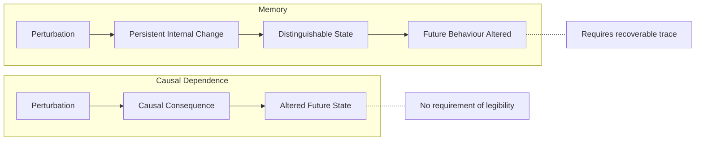
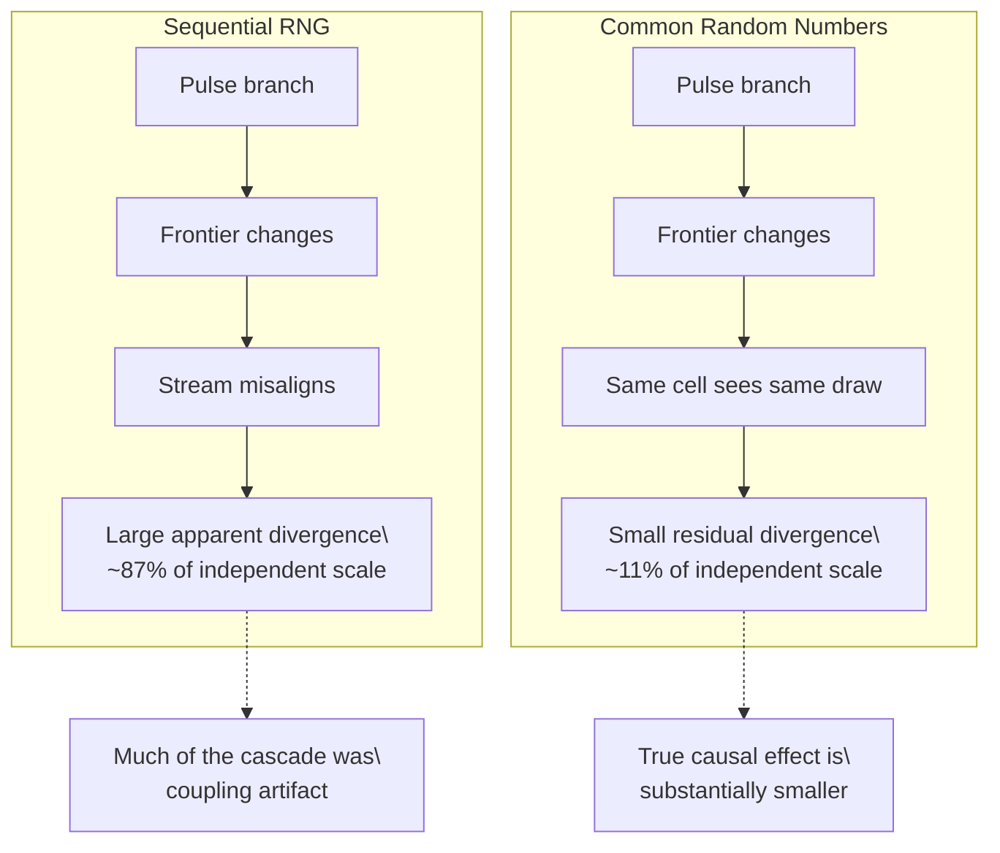
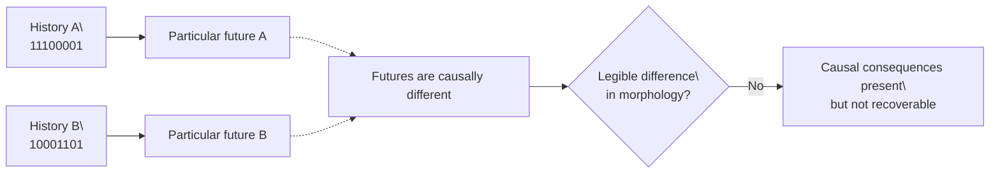
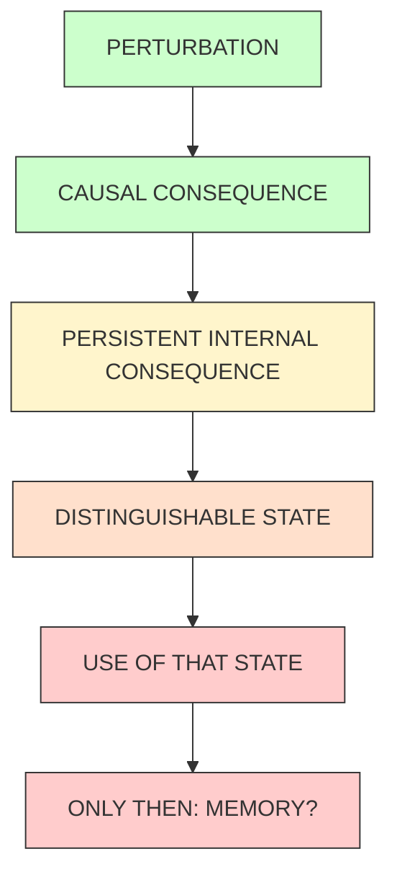

+++
title = "17: How Does the Crystal Respond to Perturbation"
date = "2026-08-13T12:38:00+01:00"
draft = false
description = "A Digital Crystal has a causal past. Chapter 17 asks whether that past remains legible, and discovers that even the way randomness is held fixed changes the answer."
weight = 17
categories = ["Programming", "Artificial Life"]
tags = ["Digital Life", "Digital Crystal", "Causality", "Stochastic Systems", "Counterfactuals", "Memory", "Experiments"]
series = ["Digital Life From First Principles"]
+++

The crystal could hear a pulse.

That much we already knew.

In the previous experiment, a single received bit was inserted into the continuation of a Digital Crystal. Everything else was held as closely as possible to the same conditions.  
The resulting crystal changed.

Not metaphorically.  
Not because a classifier happened to prefer one label.  
The intervention altered the subsequent growth of the receiver.

That gave us one of the weakest but most useful forms of causality available to an experimental system:

> Change one thing. Hold the rest fixed. Observe a different future.

It was tempting to move immediately from there to communication.  
Could one crystal send a pattern to another?  
Could the receiver distinguish one temporal pattern from another?  
Could a sequence of pulses survive inside the crystal long enough to become information?

Those were attractive questions.  
They were also premature.

Before asking whether the crystal could preserve a message, we first needed to understand something simpler.

**What does a perturbation actually do to it?**

---

## A Past Is Not Yet a Memory

Suppose we tap a glass.  
The vibration changes the glass.  
For a short time, its future is different because we touched it.  
That does not mean the glass remembers being tapped.

The distinction matters.  
A system can be causally dependent on its history without containing any useful representation of that history.

A dropped stone depends on the height from which it fell.  
A cooling pan depends on its earlier temperature.  
A crack in a crystal depends on the force that produced it.

History is everywhere.  
Memory is a much stronger claim.

Our Digital Crystal already had a past. Chapter 15 established that its exact continuation depended on more than its visible morphology. A complete checkpoint could reproduce its future, while morphology alone could not.  
Chapter 16 then showed that an incoming pulse could change that future.

The next question was therefore not:

> Does the crystal have memory?

It was:

> **What happens to the consequence of a perturbation after it occurs?**

That is a smaller question.  
And that made it testable.



---

## One Pulse, Two Futures

We began with a simple intervention.  
Grow a crystal to a checkpoint.  
Clone the checkpoint.  
Give one continuation a pulse.  
Give the other no pulse.

Then compare them after one step, two steps, four steps and beyond.

The original result looked dramatic.  
Immediately after the pulse, the two crystals differed only slightly.  
A few steps later, they were very different.

By roughly ten to sixteen updates after the intervention, the pulse branch was approaching the level of divergence we saw when two crystals were simply given independently seeded random continuations.

It looked as though a tiny event had triggered a rapidly expanding cascade.  
That seemed interesting.  
Perhaps the crystal amplified tiny events.  
Perhaps one pulse threw it onto a different developmental trajectory.  
Perhaps this was a primitive form of historical persistence.

But there was another possibility.  
The crystal itself might not have been doing all of the amplification.

**Our random-number generator might have been doing it for us.**

---

## The Random Numbers Were Part of the Experiment

The original Digital Crystal uses a conventional pseudorandom-number stream.  
At each growth step it constructs a frontier of possible cells.  
The frontier is sorted.  
Then each candidate consumes the next random value:

```text
candidate 1 → random number 1
candidate 2 → random number 2
candidate 3 → random number 3
...
```

This is perfectly reproducible.  
If two crystal states are identical, the same cells encounter the same random values.

But now perturb one branch.  
A single extra attachment changes its frontier.  
That changes which cells appear in the sorted list.

Now random number 27 may be applied to a different cell in each branch.  
After the next difference, the streams misalign again.

Soon the two runs are no longer asking:

> What happens to the same cell under the same random opportunity?

They are asking:

> What happens to two increasingly different frontiers while each consumes the same sequential stream in a different way?

The distinction is subtle.  
It is also enormous.

We had treated identical initial random-number states as though they created identical random worlds.  
They did not.  
They created identical **streams**.

Once the two branches consumed those streams differently, the correspondence between their stochastic opportunities collapsed.  
That meant our apparent perturbation amplification could partly be an artifact of how we coupled the two counterfactual worlds.

---

## Holding Randomness Still

To test this, we built a second experimental runner.  
We did not replace the frozen Digital Crystal. The original sequential‑RNG model remained unchanged.

Instead, we introduced a different way of pairing randomness between two counterfactual runs.  
Each possible random event received its random value from:

```text
seed
+
absolute step
+
cell coordinate
```

Conceptually:

[
U(\text{seed}, \text{step}, q, r)
]

A cell at coordinate `(q,r)` therefore sees the same random value at the same step in both branches.  
If the cell exists in one branch but not the other, only that opportunity differs.  
A different frontier somewhere else no longer shifts every subsequent random draw.

This is a common‑random‑number coupling.  
It does not make the system deterministic.  
It makes the comparison more precise.

Before relying on it, however, we had to check that we had not quietly created a different crystal.  
The confirmatory preflight compared the original sequential‑RNG implementation with the cell‑keyed runner.  
Both reproduced exactly when rerun.

Across 96 runs per implementation, the omnibus morphology comparison found no evidence of a gross distributional discrepancy (`p ≈ 0.922`).  
We also predeclared practical compatibility margins for population, maximum radius, attachment rate and covariance anisotropy.  
All four checks passed.

This did not prove that the two stochastic processes were mathematically identical. That was not the claim.  
It gave us enough evidence to use the keyed system as a counterfactual coupling without pretending that it had become the canonical substrate.

Then we repeated the pulse experiment.

---

## The Divergence Collapsed

The result was immediate.

Under the original sequential RNG, a pulse branch rapidly approached the spread produced by independent stochastic continuations.  
Under cell‑keyed common random numbers, it did not.

The intervention still caused a real difference.  
But the difference remained much smaller.

In the exploratory run, by elapsed step 20 the sequentially coupled pulse branch had reached about 87% of the symmetric‑difference scale of independently reseeded continuations.  
Under common random numbers, it remained at only about 11%.



The pulse had not stopped mattering.  
What disappeared was most of the apparent explosion of divergence.

This changed the interpretation of the earlier experiment.  
We could no longer say:

> The crystal rapidly forgets which branch it is on.

What we had actually established was:

> **Pathwise divergence depends strongly on how randomness is coupled between counterfactual branches.**

That is not a minor statistical detail.  
It changes what a counterfactual trajectory means in a stochastic computational system.

Two treatment distributions may be identical regardless of how we pair their randomness.  
But the apparent distance between one particular treated world and one particular untreated world can depend enormously on that pairing.

The intervention was real.  
The size of its pathwise aftermath was not coupling‑invariant.

---

## The Additivity Surprise

This correction also forced us to revisit another apparent result.

Earlier experiments had suggested that four pulses interacted nonlinearly.  
We measured the average response to each isolated pulse.  
Then we added those responses together.

The predicted response to the four‑pulse sequence differed substantially from the observed response.  
The relative error looked large.  
That could have meant that the crystal integrated its input history in some nonlinear way.

But after fixing the randomness coupling, we added another control.  
We estimated the size of a mean feature difference that could appear even when comparing two finite samples from the same no‑pulse population.  
That gave us a measurement‑noise floor.

At the first matched observation, this floor was approximately `0.045`.  
The superposition residuals were only around `0.007`.

The discrepancy that had previously looked mechanistically interesting was substantially smaller than ordinary uncertainty in estimating a population mean at this sample size.

The actual and predicted response vectors were also well aligned.  
The earlier claim therefore did not survive the better control.

We did **not** establish nonlinear integration.  
Instead, the more defensible statement became:

> Within the resolution of this experiment, the average multi‑pulse response remained compatible with the sum of the measured isolated‑pulse responses.

That was a failure of an interesting hypothesis.  
It was also progress.  
The control removed something we had been in danger of inventing.

---

## Now Ask About History

With the perturbation dynamics better understood, we could finally return to the question that had motivated the chapter.

Can two different temporal histories leave distinguishable present states?

The obvious comparison would be weak.  
Consider:

```text
11110000
```

and:

```text
10010010
```

Even if both contain the same number of pulses, their final pulses occur at different times.  
A classifier could distinguish the crystals simply because one had been perturbed more recently.  
That would be recency detection.  
Not temporal‑history retention.

So we constructed two shorter sequences:

```text
A = 11100001
B = 10001101
```

Their pulse positions were:

```text
A = {0, 1, 2, 7}
B = {0, 4, 5, 7}
```

They had the same number of pulses.  
The same first pulse.  
The same last pulse.  
Only the interior arrangement differed.

The first measurement occurred immediately after the final pulse.  
Further measurements followed one, two and four steps later.  
This placed the experiment inside the coherent response window rather than waiting until the stochastic trajectories had largely decorrelated.

The final confirmation used 48 independently generated receiver checkpoints.  
The counterfactual coupling was frozen in advance.  
The codewords were frozen.  
The primary endpoint was frozen at step 8.  
The primary measurement was frozen as a regularized paired multivariate statistic applied to a nine‑feature angular morphology subspace.  
Secondary endpoints and the larger 24‑feature measurement were allowed to be recorded.  
They were not allowed to rescue the primary experiment.

That rule mattered.  
Without it, every negative result could become another invitation to search.

---

## Different Futures

The two pulse histories did not produce identical crystals.

Immediately after the complete sequence, their average normalized symmetric difference was approximately `0.053`, with a bootstrap interval of approximately `[0.048, 0.059]`.

So changing the interior timing changed particular futures.  
That was real.

But particular difference was not the claim we were testing.  
The question was whether one temporal arrangement left a **consistent morphological signature** across the population.

The answer was no.

The frozen primary angular test returned `p = 0.7366`.  
Its observed statistic was not hovering just below some significance threshold.  
It was below the average statistic generated by the permutation null.

The secondary 24‑feature test was even less suggestive: `p = 0.9320`.

The later observations did not reveal a hidden delayed effect.  
The angular test remained unconvincing at every measured secondary endpoint.  
There was no plausible story in which we had simply measured one step too early.

The predeclared experiment had failed.  
Not the software.  
Not the preflight.  
Not the random‑number coupling.  
The hypothesis.

---

## What Failed?

Precision matters especially when a result is negative.

We did **not** establish that temporal arrangement can never matter.  
We did not test every sequence, every timescale, every observable, every crystal rule.

We also did not establish that the two histories had no causal consequences.  
They plainly produced different particular states.

What failed was this specific claim:

> **Under the frozen Digital Crystal protocol, changing the interior timing of four pulses while holding pulse count, onset and offset fixed did not produce a reproducible population‑level morphology signature detectable by the predeclared angular measurement at the primary endpoint.**

The formal status was therefore: **FAILED**.  
Not untested. Not inconclusive. Failed within the declared experimental scope.

That distinction is one of the reasons for doing the experiment this way.  
A negative result becomes scientifically useful only when we have made it difficult to escape.

---

## Did the Crystal Forget?

There is a tempting sentence:

> The crystal forgot the sequence.

We cannot quite say that.  
Forgetting assumes there was something equivalent to memory in the first place.

What we can say is stranger.  
The past mattered. Different histories produced different particular futures.  
But we could not reliably recover which history occurred from the morphology we measured.

So:

> **A history can contribute causally to the present without remaining legible in the present.**



That distinction turns out to be central.  
The crystal has history. But history is not automatically state.  
It has causal consequences. But causal consequences are not automatically recoverable information.  
It can be changed. But being changed is not the same as remembering what changed it.

---

## Why This Matters for Digital Life

At first glance, this looks like a dead end.  
We want digital life. We built a primitive growing process. We perturbed it.  
We asked whether its present retained something distinguishable about that past.  
And the confirmatory experiment failed.

But this is exactly the kind of failure we need.

The goal of this project is not to assemble a creature by giving classes biological names.  
We are trying to discover which mechanisms become necessary.

A living organism carries its history forward in many ways.  
Damage changes later behaviour.  
Chemical concentrations alter future reactions.  
Development constrains later development.  
Past environments alter regulatory state.  
Mutations persist into descendants.

None of those mechanisms are present simply because “history happened.”  
They require physical state that survives long enough to matter.

Our crystal has exposed the same distinction in a much simpler setting.  
The growth process is history‑dependent.  
But the morphology we have built does not reliably expose the internal temporal arrangement of recent perturbations.

That tells us something concrete about the next design.  
We should not add a variable called `memory` and declare the problem solved.

We should ask:

> **What is the smallest additional mechanism by which a past event can alter a future event in a way that remains distinguishable?**

That mechanism might be local.  
Perhaps a recently attached cell changes the probability of neighbouring attachment for several steps.  
Perhaps cells can occupy more than one persistent internal state.  
Perhaps exposure changes a local threshold.  
Perhaps an event leaves a slowly decaying field.  
Perhaps the growth material itself becomes modified.

We do not yet know.  
That is the experiment.

---

## Not a Memory Register

The easiest implementation would be:

```python
state.last_signal = signal
```

That would work.  
It would also teach us almost nothing.

The challenge is not to store information in Python.  
Computers already do that extremely well.

The challenge is to discover the equivalent of a **material consequence** inside the digital substrate.  
We want a mechanism where history persists because the system’s own dynamics make it persist.  
Not because an external programmer created a history variable.

The distinction is the same one we have followed throughout this project.  
Do not build an animal.  
Find the digital aerodynamics.

---

## What Survived the Hypothesis?

The confirmatory history-signature hypothesis failed.

The two matched pulse histories:

```text
A = 11100001
B = 10001101
```

produced different particular futures.

Immediately after the sequence, their average normalized symmetric difference was about:

```text
0.053
```

So temporal arrangement had a real causal consequence.

But the frozen population-level test asked something stronger:

> Does one temporal arrangement leave a reproducible morphological signature that can be distinguished across independently generated receiver checkpoints?

The answer was no.

The primary angular statistic returned:

```text
p = 0.7366
```

and the secondary 24-feature statistic returned:

```text
p = 0.9320
```

So the chapter leaves us with a crucial separation:

```text
DIFFERENT HISTORY
→ DIFFERENT PARTICULAR FUTURE
SUPPORTED

DIFFERENT HISTORY
→ STABLE POPULATION-LEVEL SIGNATURE
FAILED
```

The causal effect survived.

The readable signature did not.

### Phenomenon record

**Phenomenon:** Causal history without recoverable signature

**Status:** **SUPPORTED**

**Current bounded description:**

> Different recent pulse histories can causally produce different particular Digital Crystal futures while failing to produce a reproducible population-level morphology signature under the frozen measurement protocol.

This gives us an important substrate distinction:

```text
CAUSAL DIFFERENCE
≠
SYSTEMATIC SIGNATURE
```

and:

```text
PAST CONTRIBUTED TO PRESENT
≠
PAST IS LEGIBLE IN PRESENT
```

That extends the Lossy-History Principle from Chapters 14 and 16.

Chapter 14 showed that coarse forcing family survives more readily than exact temporal order.

Chapter 16 showed that coarse pulse-stream structure matters more than sender identity or exact interval chronology.

Chapter 17 now shows that even when two temporal arrangements causally alter particular futures, those differences need not organize themselves into a stable readable signature across a population.

The hierarchy is becoming clearer:

```text
causal consequence
        cheap

persistent consequence
        harder

systematic signature
        harder still

recoverable information
        harder still
```

### A second phenomenon: counterfactual coupling matters

Chapter 17 also exposed a different and extremely important effect.

Under sequential RNG coupling, a tiny perturbation caused the two branches to consume the shared random stream differently.

That made:

```text
same random stream
```

look like:

```text
same random world
```

when those are not equivalent.

Once a perturbation altered the frontier, random draws became reassigned to different cells and large apparent divergence followed.

With cell-keyed common random numbers, the same cell at the same step received the same random opportunity in both branches.

The apparent cascade then collapsed dramatically:

```text
sequential RNG
~87% of independent-divergence scale

cell-keyed CRN
~11% of independent-divergence scale
```

The intervention remained causal.

What changed was the measured pathwise aftermath.

So:

```text
CAUSAL EFFECT
≠
COUPLING-INVARIANT PATHWISE DIVERGENCE
```

### Phenomenon record

**Phenomenon:** Coupling-dependent counterfactual divergence

**Status:** **SUPPORTED**

**Current bounded description:**

> In a stochastic Digital Crystal, the measured pathwise distance between treated and untreated counterfactual branches depends strongly on how stochastic opportunities are coupled between those branches.

This is not a detail about one random-number generator.

It is a general experimental warning for stochastic computational systems:

> **A counterfactual comparison is partly defined by how shared randomness is aligned across possible worlds.**

That means future experiments must distinguish:

```text
MARGINAL EFFECT
average difference between treatment distributions

PAIRED EFFECT
difference under a declared coupling

PATHWISE DIVERGENCE
distance between particular paired trajectories
```

Those are different scientific objects.

### The failed nonlinearity result belongs here too

An apparent multi-pulse nonlinearity also disappeared after introducing a measurement-noise floor.

The superposition residual was about:

```text
0.007
```

while the finite-sample measurement floor was about:

```text
0.045
```

So the putative interaction was smaller than ordinary uncertainty in estimating the mean response.

Again:

```text
OBSERVED DISCREPANCY
≠
RESOLVED MECHANISTIC NONLINEARITY
```

The better bounded conclusion is that the measured multi-pulse response remained compatible with the sum of isolated-pulse responses at the resolution of this experiment.

### What this phenomenon does not establish

The surviving phenomena do **not** establish:

- memory,
- learning,
- temporal decoding,
- nonlinear integration,
- universal perturbation amplification,
- or a coupling-independent measure of causal distance.

They establish something more useful:

> **A causal past is cheap. A persistent, systematic and recoverable consequence of that past is a separate property that must be demonstrated.**

And they add a methodological rule:

> **In stochastic systems, counterfactual path distance is meaningful only relative to an explicit stochastic coupling.**

Both should now be tracked independently of the failed temporal-signature hypothesis.

---

## What Chapter 17 Gave Us

The experiment began with a simple question:

> How does the crystal respond to perturbation?

It ended by separating several things that initially looked like one phenomenon.

- A pulse can causally change a future.
- A stochastic counterfactual can look dramatically different depending on how randomness is coupled.
- An apparent failure of additivity can disappear once measurement noise is controlled.
- Two different histories can produce different particular trajectories without producing a stable population‑level signature.
- And history dependence does not automatically give us a usable past.

Those are not failures of the project.  
They are constraints on any digital life we eventually claim to have built.

The evidence now supports a sharper progression:



We have reached the second step.  
The third remains open.

---

## The Boundary

The Digital Crystal reacts.  
It is changed by what happens to it.  
Its future depends on its past.

But within the experiment we just completed, the exact internal arrangement of that past did not become a reliably readable property of its later morphology.

That is the boundary of the current system.  
We should not push language past it.

Whatever the crystal has, we have not earned the word memory.  
What it has given us is something more useful:

**a reason to build the next mechanism.**

The next question is no longer:

> Can we decode yesterday from today’s crystal?

It is:

> **What is the smallest piece of digital matter that can be changed by experience, keep that change, and allow the retained change to alter what happens next?**

That would not yet be life.  
But it would be one mechanism closer.
