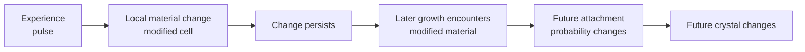
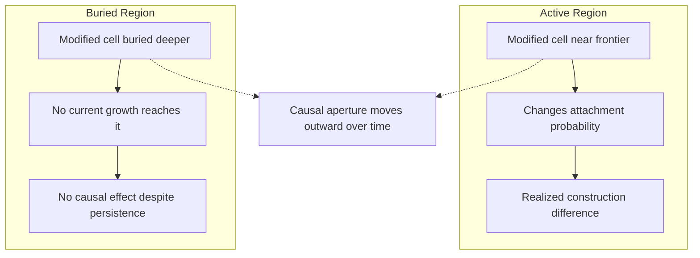
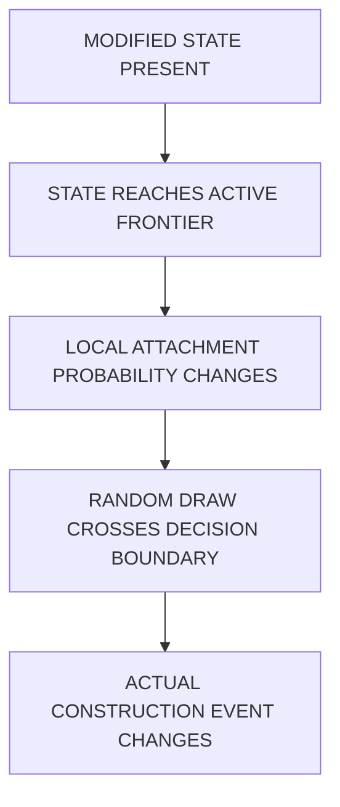
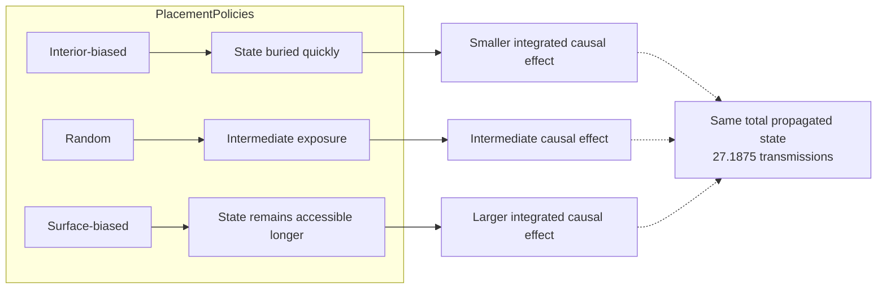
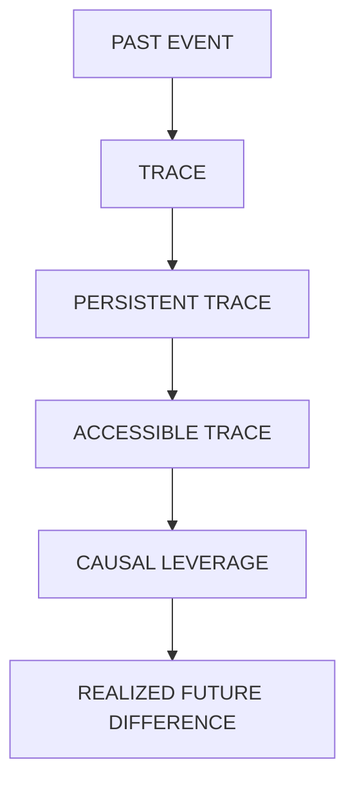

+++
title = "18: Can Experience Change the Material?"
date = "2026-08-12T16:40:00+01:00"
draft = false
description = "A pulse can leave a permanent mark in a Digital Crystal. Chapter 18 asks the harder question: when does a persistent mark remain causally usable?"
weight = 18
categories = ["Programming", "Artificial Life"]
tags = ["Digital Life", "Digital Crystal", "Causality", "Material State", "Path Dependence", "Experiments"]
series = ["Digital Life From First Principles"]
+++

The crystal had a past.

But we had learned to be careful with that sentence.

In the previous chapter, a perturbation changed the crystal's future. Under a carefully controlled counterfactual comparison, the consequence of a pulse could remain locally visible for several updates.

That was causality.

It was not memory.

The distinction left us with a smaller question.

Not:

> **Can the crystal remember?**

But:

> **Can experience change the material?**

That sounds almost trivial.

Of course software can change a variable.

We could create:

```text
memory = 1
```

after a pulse and declare victory.

But then the answer would have been written into the architecture by us.

The experiment would tell us nothing.

We wanted something weaker and more difficult:

> **What is the smallest local change produced by experience that can persist and alter what the crystal does later?**

So we added almost nothing.

---

## One More Kind of Cell

Until now, the Digital Crystal needed only two material conditions:

```text
empty
occupied
```

For this experiment we allowed an occupied cell to have one additional local state:

```text
empty
occupied-normal
occupied-modified
```

A pulse could modify some cells near the active boundary.

That was all.

There was no history list.  
No global memory register.  
No timestamp saying when the pulse happened.  
No stored copy of the signal.  
No target morphology.  
No learned weight.  
No module called `memory`.

The modification simply changed one local fact about the material.

A modified occupied neighbour could slightly increase the attachment probability of a nearby frontier cell.

The proposed mechanism was therefore:



If even this failed, that would be useful.  
If it succeeded, we would still have to ask exactly what had succeeded.

---

## The First Result Looked Like Success

The pulse worked.

It wrote modified cells into the crystal.

Those cells stayed modified.

After the pulse disappeared, the state remained.

We had created a persistent consequence of experience.

It was tempting to stop there.

The crystal had been changed by its past.

The change remained physically present.

Surely that was the beginning of memory.

Then we performed the obvious ablation.

Take an experienced crystal.

At some later checkpoint, erase only the modified labels while leaving the visible occupied geometry unchanged.

Then continue both versions under the same future conditions.

```text
experienced + labels retained
                \
                 → continue
experienced + labels erased
                /
```

The result was brutal.

The two futures were identical.

Not approximately identical.

For the late ablation we tested, the retained material state made no detectable difference at all.

The state was still there.

But the dynamics could no longer reach it.

That gave us the first important result of the chapter:

> **A persistent state does not automatically become a usable state.**

Or more compactly:

```text
PERSISTENCE
≠
CAUSAL ACCESSIBILITY
```

The crystal had not forgotten because the modified cells disappeared.

They had not disappeared.

They had become irrelevant.

---

## The Moving Aperture

The reason was geometric.

The Digital Crystal grows outward.

New cells attach around the current boundary.

Cells that were once on that boundary are gradually surrounded by newer material.

A modified cell may therefore remain encoded forever while moving farther and farther away from every location where a new construction decision is being made.

Imagine painting a mark onto wet concrete while a wall is being built.

The mark remains in the wall.

But once ten new layers have been built over it, the bricklayer no longer encounters it.

The information did not decay.

**Access did.**

So we stopped asking only how many modified cells survived.

We measured where they were.

At each update we asked:

```text
How many modified cells remain?
How many are still on the boundary?
How many current frontier sites have a modified neighbour?
What fraction of active construction can still encounter modified material?
```

Immediately after the experience, the modified material was exposed.

A few updates later, exposure collapsed.

By the later observation points, most or all of the modified state had been buried.

The apparent mystery from the first experiment disappeared.

The state had persisted exactly as designed.

It simply no longer occupied the crystal's **causal aperture**.



The active frontier is not merely the edge of a shape.

It is the part of the material from which the present can still influence what gets constructed next.

Inside the aperture:

```text
state
→ probability
→ construction
```

Outside it:

```text
state
→ nothing currently reads it
```

The Digital Crystal had abundant storage.

What it lacked was access.

---

## Persistence Was the Wrong Scarcity

This is a very digital result.

We often assume that memory is primarily a storage problem.

Bits decay.

Biological tissue degrades.

A physical record has to survive long enough to be useful.

But our material state could survive indefinitely.

That did not help.

The scarce resource was not persistence.

It was **causal contact**.

```text
storage can remain
while
causal access disappears
```

That changes the design question.

If a past event is to matter later, it is not enough to preserve its trace.

The trace has to remain somewhere the current dynamics can use.

So our next intervention was obvious.

What if the modified state could move outward with the growing crystal?

---

## Propagation Is Not Enough Either

We allowed newly attached cells to acquire the modified state when they grew beside modified material.

Now the mark could spread through subsequent construction.

Again, the first result looked encouraging.

The number of modified cells increased.

The state persisted for longer.

But the same failure returned.

Most of the propagated material was still eventually buried.

We had improved the transport of the state without solving the access problem.

Another distinction appeared:

```text
STATE PERSISTS
≠
STATE PROPAGATES
≠
STATE REMAINS ACCESSIBLE
```

Propagation was not maintenance.

A process can copy a historical state repeatedly and still copy it into places where it stops mattering.

This was becoming less like a storage problem and more like a spatial transport problem.

Where the state went mattered at least as much as whether it was copied.

Before changing the transport rule, however, we needed to establish one more thing.

Perhaps the entire local material mechanism was too weak to matter even when exposed.

So we audited it directly.

---

## Close the Causal Chain

For every candidate attachment site at the frontier, we can compute its attachment probability with the material effect and without it.

That gives a local probability difference:

```text
Δp
```

But a changed probability is not the same as a changed event.

If the attachment probability changes from:

```text
0.510 → 0.515
```

and the random draw is:

```text
0.900
```

nothing changes.

The cell remains empty in both worlds.

If the same probability change meets a draw of:

```text
0.512
```

then the counterfactual branches disagree:

```text
without modified neighbour: no attachment
with modified neighbour: attachment
```

That is a realized causal flip.

The whole local chain is therefore:



We measured every level.

When enough modified material remained adjacent to the frontier, the gain mechanism was not merely decorative.

It changed attachment probabilities.

And some of those changes crossed the stochastic decision boundary and changed which cells were actually built.

That closed an important causal gap.

The problem was not that the state lacked causal power.

The problem was keeping it where that power could still be exercised.

---

## Where the Past Lives

So we tried changing only the placement of propagated state.

Suppose a newly attached cell is eligible to acquire the modified condition.

We can prefer cells that will be relatively buried.

Or choose among eligible cells without a surface preference.

Or prefer cells with greater outward exposure.

That gives three policies:

```text
INTERIOR-BIASED
RANDOM
SURFACE-BIASED
```

The surface policy produced an immediately striking result.

Modified state remained near the active construction region for much longer.

It continued to generate more frontier exposure, more probability leverage and more realized construction differences.

For a moment, this looked like the result we wanted.

Then we found the confound.

Surface placement did not merely place the same amount of state better.

By keeping more modified state near active construction, it created more opportunities for later cells to become modified.

That meant:

```text
surface placement
↓
more accessible modified material
↓
more eligible propagation opportunities
↓
more actual propagation
↓
still more accessible material
```

The surface branch was not only placing copies differently.

It was making **more copies**.

So we had not yet learned whether placement mattered.

Perhaps quantity alone explained everything.

This is exactly why controls matter.

The most exciting run in the experiment was not yet evidence for the claim we wanted.

---

## Hold the Amount Fixed

We rebuilt the comparison.

At every propagation step, all three branches were forced to transmit exactly the same number of modified cells.

The controller looked across the branches, found a shared feasible copy budget, and applied that same budget everywhere.

```text
same checkpoint
same environment
same amount copied
same number of propagation events
different placement only
```

Now the intervention was clean:

> **Where does the same amount of historical state go?**

The first exact-budget experiment used a late endpoint.

It failed.

At the predeclared late measurement, the predicted ordering was not established.

We did not change that result.

It remains a failed experiment.

But the trajectories revealed something useful.

Earlier in the run, the measurements showed a clear candidate ordering:

```text
INTERIOR
<
RANDOM
<
SURFACE
```

The late snapshot appeared to be asking the wrong scientific question.

Not because we disliked the answer.

Because all three branches were approaching the point where the state had lost contact with the frontier.

A snapshot taken after the mechanism is mostly exhausted tells us little about how long it remained active on the way there.

That observation generated a new hypothesis:

> **Placement may control causal lifetime rather than one particular late state.**

The next experiment was built around that hypothesis.

---

## Measure the Lifetime, Not One Frame

We kept the exact matched-copy controller.

Nothing about the material mechanism changed.

The only change was the outcome definition.

Instead of selecting one late frame, we froze an observation window:

```text
t = 5 ... 18
```

and integrated what happened through that window.

The primary quantities included:

```text
frontier accessibility over time
probability leverage over time
realized causal attachment flips over time
```

with loss of frontier contact as a supporting lifetime measure.

The run used a new seed and a new population of crystals.

The window and metrics were fixed before examining the V7 results.

And the result was unusually clean.

All three central integrated measurements followed the same ordering:

```text
INTERIOR
<
RANDOM
<
SURFACE
```

The mean integrated frontier-access fraction was approximately:

```text
interior     0.515
random       0.847
surface      1.293
```

Integrated local probability leverage was approximately:

```text
interior      3.87
random        7.33
surface      12.26
```

And the mean number of realized causal attachment flips over the window was approximately:

```text
interior      4.06
random        7.52
surface      12.39
```

Crucially, the amount of propagated state remained exactly matched.

Each policy averaged the same cumulative number of transmissions:

```text
27.1875
```

The experiment was no longer comparing more state with less state.

It was comparing where an equal amount of state had been placed.

That earned the strongest claim in this chapter:

> **With propagated-state quantity held constant, spatial placement changes how long and how strongly that state remains causally available to subsequent growth.**

The crystal did not need more history.

It needed history in the right place.



---

## A Strong Result Is Also a Place to Stop

We did not stop immediately.

There was another mechanism hiding inside the earlier surface-biased experiment.

If remaining accessible creates more future opportunities to propagate, perhaps accessibility could participate in maintaining itself.

That possibility deserved one direct test.

So we compared a natural, state-dependent propagation schedule against an externally frozen schedule.

The natural branch produced stronger integrated accessibility, probability leverage and realized causal flips.

But the predeclared mechanism required it to demonstrate a reliable increase in total transmissions.

It did not.

The experiment failed.

We then asked whether temporal arrangement might explain the difference.

We replayed the same transmission-budget values in three ways:

```text
ALIGNED
SHUFFLED
SHIFTED
```

The total requested amount was held fixed.

Aligned timing changed some downstream quantities, particularly probability leverage.

But it did not reliably improve gross accessibility.

The broad timing claim failed.

One final experiment normalized causal effects by contact and by transmission.

Again, one narrow quantity looked interesting.

Again, the broad predeclared claim failed.

At this point the scientific problem had changed.

We were no longer discovering the basic material mechanism.

We were subdividing an effect we already understood:

```text
accessibility
placement
timing
leverage
realized flips
efficiency
```

Each distinction was real.

But a real distinction is not automatically a new property.

Three consecutive failed broad hypotheses were telling us something.

Not that the chapter had failed.

That the chapter had finished.

---

## What the Negative Results Protect Us From

There is a dangerous way to tell this story.

We could take every experiment that failed and retain whichever secondary metric happened to remain significant.

Then the narrative would become:

```text
feedback failed
→ perhaps timing

timing failed
→ perhaps efficiency

efficiency failed
→ perhaps another normalization
```

That process can continue forever.

A sufficiently complicated experiment always contains another denominator, another endpoint, another subset or another interpretation.

That is not the evidence ladder we started this book with.

So the failed claims remain failed.

```text
V8:
endogenous opportunity feedback
did not establish its predeclared transmission-amplification claim

V9:
temporal alignment
did not establish a broad accessibility advantage

V10:
temporal alignment
did not establish a robust general causal-efficiency advantage
```

There are interesting mechanistic observations inside those failures.

They may matter later.

They are not promotions.

This distinction is part of the result.

---

## What Did We Actually Build?

Strip away the words **experience** and **memory**.

The mechanism is simple.

A past event can write a persistent local state.

That state changes later construction probabilities while it remains spatially connected to active construction.

Propagation can carry the state forward.

Spatial placement controls how long it remains usable.

Once it leaves the active construction region, it can persist forever without affecting anything.

A useful description is:

> **state-dependent construction with a bounded causal window**

Or more mechanically:

> **a persistent local construction bias whose causal availability depends on its position relative to a moving growth frontier**

The phrase I like most, though, is even simpler:

> **Storage is cheap. Access is scarce.**

The modified state itself is not difficult to preserve.

The computational problem is maintaining contact between history and the part of the system that is still making decisions.

That is a very different picture from the biological intuition that stored state is precious because matter decays.

In this digital substrate, the bit can survive perfectly.

The read path disappears.

---

## This Is Still Not Memory

We now have:

```text
experience
↓
persistent state
↓
causal accessibility
↓
later probability change
↓
sometimes:
later construction change
```

That is considerably more than we had at the start of the chapter.

But there are things we have not demonstrated.

The crystal cannot yet distinguish two kinds of experience.

It has not shown that:

```text
history A
```

and:

```text
history B
```

leave meaningfully different retained states.

It has not shown that a later common challenge produces a different response depending on which history occurred.

It has not demonstrated rewriting.

It has not demonstrated controlled erasure.

It has not demonstrated selective retention.

It has not demonstrated reconstruction of a lost historical state.

And it has not demonstrated that the state is used as a representation of anything.

So we still do not earn:

```text
memory
learning
adaptation
homeostasis
self-maintenance
```

That is not disappointing.

The purpose of the experiment was never to manufacture those words.

It was to discover what survived after we tried to remove the assumptions hidden inside them.

---

## What Survived the Hypothesis?

Several attractive interpretations failed in this chapter.

A persistent mark did not automatically remain useful.

Propagation did not automatically preserve access.

Surface-biased propagation initially looked stronger, but the first comparison was confounded because the surface branch produced more copies.

A late exact-budget endpoint then failed.

Three later broad hypotheses about feedback, timing and efficiency also failed.

Those failures stay failed.

But underneath them, one phenomenon became much clearer.

### The surviving observation

The modified material mattered when the active growth process could still reach it.

When modified cells were buried behind later growth, they could remain present indefinitely while having no detectable effect on future construction.

When the same amount of modified state was placed nearer the active frontier, it remained causally available for longer and produced larger integrated effects.

With cumulative propagation quantity held exactly equal, the frozen V7 experiment measured:

```text
integrated frontier access

interior    0.515
random      0.847
surface     1.293
```

```text
integrated probability leverage

interior     3.87
random       7.33
surface     12.26
```

```text
realized causal attachment flips

interior     4.06
random       7.52
surface     12.39
```

The total transmitted quantity was identical:

```text
27.1875
```

So the effect cannot be explained simply by one policy creating more modified material.

The chapter therefore leaves us with:

```text
PERSISTENT STATE
SUPPORTED

PERSISTENT STATE IS AUTOMATICALLY USABLE
FAILED

SPATIAL PLACEMENT CONTROLS CAUSAL AVAILABILITY
SUPPORTED
```

### Phenomenon record

**Phenomenon:** Interface-mediated causal access

**Status:** **SUPPORTED**

**Current bounded description:**

> A persistent local state in Digital Crystal v1 can alter later construction while it remains coupled to the active growth interface, and with state quantity held constant, spatial placement strongly changes the duration and magnitude of that causal availability.

This is the strongest evidence so far for what we can now call the **Interface Principle**:

> **In the Digital Crystal, stored state becomes causally relevant primarily when it remains coupled to the dynamically active construction interface.**

The important object is therefore not just:

```text
modified material
```

but:

```text
modified material
        ∩
active construction opportunity
```

The bulk can preserve state.

The interface determines whether that state can still participate in the future.

### Storage and access are different resources

Chapter 18 exposes a distinctly digital asymmetry.

The stored material state can survive indefinitely.

Nothing forces it to decay.

Yet its causal usefulness can vanish rapidly.

So:

```text
STORAGE
can remain abundant

while

CAUSAL ACCESS
becomes scarce
```

This gives us one of the cleanest substrate-level statements in the project:

> **Storage is cheap. Access is scarce.**

That is not merely a metaphor.

It is an operational result.

The bit can remain present while the current dynamics lose every route by which that bit can influence construction.

### The active frontier is more than geometry

The active frontier is not important merely because it is visually on the outside.

It is where future construction decisions are currently being made.

That makes it a causal interface:

```text
current state
↓
frontier exposure
↓
local probability change
↓
stochastic decision boundary
↓
realized construction difference
```

The chapter closes this chain experimentally.

Modified material changes local attachment probability.

Some of those probability shifts cross the shared stochastic decision boundary.

Actual attachment events then differ.

So the frontier is where persistent historical state becomes operational.

### Connection to earlier chapters

This phenomenon clarifies several earlier results.

Chapter 14 showed that morphology can preserve coarse information about forcing while losing exact temporal order.

Chapter 15 showed that visible morphology is not the same thing as executable continuation state.

Chapter 17 showed that a causal consequence can exist without becoming a stable readable signature.

Chapter 18 now adds:

```text
even persistent state
does not matter
unless the active process can reach it
```

That means the project-wide history hierarchy is no longer only about what survives.

It is also about what remains **accessible**:



Every arrow is a separate property.

### A possible moving-interface interpretation

There is also a broader observation worth recording carefully.

The region of causal activity moves outward as the crystal grows.

A modified state may remain fixed in the lattice while the active construction interface moves past it.

So the causal phenomenon is not static.

It has a moving spatial support.

That is consistent with a broader **moving-interface** or **propagating-field** hypothesis.

But Chapter 18 did not measure:

```text
phase propagation
lag-distance relation
propagation velocity
dispersion
wave equation
```

So this is not evidence for a literal wave.

The correct status is:

```text
MOVING CAUSAL INTERFACE
OBSERVED

WAVE-LIKE PROPAGATION
OPEN HYPOTHESIS
```

### The negative results matter

V8, V9 and V10 do not disappear into this broader interpretation.

They remain negative constraints.

The chapter did **not** establish:

```text
self-maintaining accessibility
general timing advantage
general causal-efficiency advantage
```

Those failures narrow the Interface Principle.

The evidence supports:

> **placement controls access**

not:

> **the system actively regulates that access**

That distinction is essential.

### What this phenomenon does not establish

The surviving phenomenon does **not** establish:

- memory,
- learning,
- adaptation,
- homeostasis,
- self-maintenance,
- active regulation,
- a wave mechanism,
- or life.

It establishes something narrower and more fundamental:

> **A history-induced material state can persist indefinitely yet become causally inert when it falls out of contact with the active construction interface. Spatial placement determines how long the same amount of historical state remains usable.**

This phenomenon now belongs in the project-wide phenomenon record independently of the failed memory, feedback, timing and efficiency hypotheses.

---

## The Result of Chapter 18

We can now say something we could not say before.

> **An external event can produce a persistent local material change in a Digital Crystal. That change can bias subsequent construction and alter realized growth events while it remains causally accessible. With the amount of propagated material held constant, spatial placement strongly changes the duration and magnitude of that causal availability.**

That is the bounded result.

Around it we also discovered several separations:

```text
PERSISTENCE
≠
CAUSAL ACCESSIBILITY

PROPAGATION
≠
SURFACE MAINTENANCE

ACCESSIBILITY
≠
PROBABILITY LEVERAGE

PROBABILITY LEVERAGE
≠
REALIZED STOCHASTIC CONSEQUENCE
```

Those distinctions matter because they tell us what not to collapse into one convenient word.

A causal past is cheap.

A persistent trace is cheap.

Even permanent storage can be cheap.

What becomes interesting is when the current process can still reach that trace and when reaching it changes what happens next.

---

## What Comes Next

There is one obvious way to continue.

Not by adding another timing metric.

Not by making the current state survive three updates longer.

Not by finding a better normalization.

We need a new property.

Until now, the crystal has only been able to answer one historical question:

```text
was this material modified?
```

The next question is qualitatively different:

```text
WHAT happened?
```

Suppose two different experiences can leave two different material states.

Then stop the experiences.

Let the crystal continue.

Later, give both crystals exactly the same challenge.

Now ask:

```text
history A ─┐
           ├──→ same later condition ──→ same response?
history B ─┘
```

If the later response depends on which history occurred, we will have crossed a new boundary.

Not memory.

Not yet.

But for the first time, the identity of the past rather than merely the presence of a persistent mark would have become a causal variable in the future.

That is no longer Chapter 18.

Chapter 18 has done its job.

The crystal can carry a mark from its past.

Now we have to find out whether it can tell **which past** it had.
