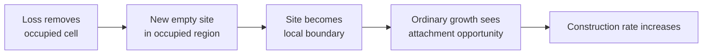
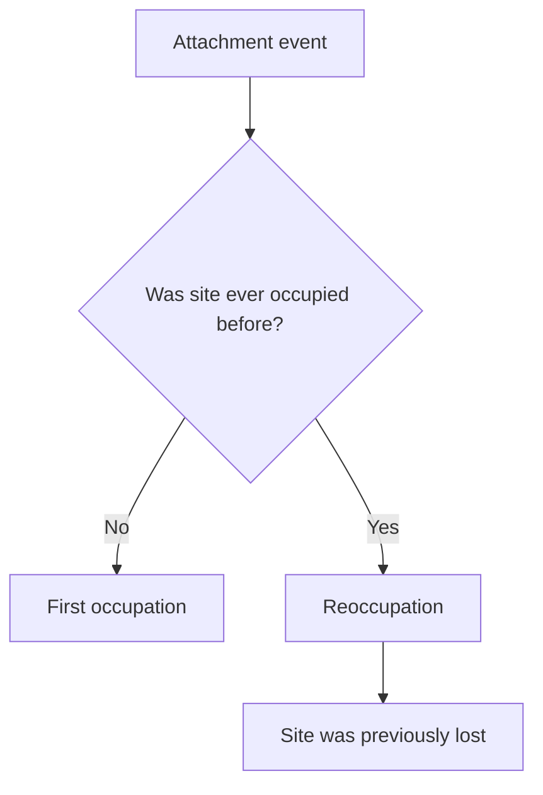
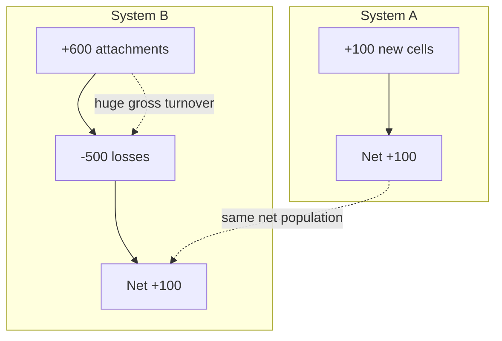
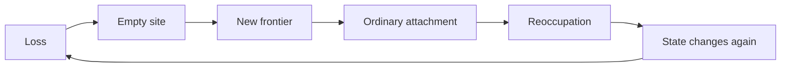
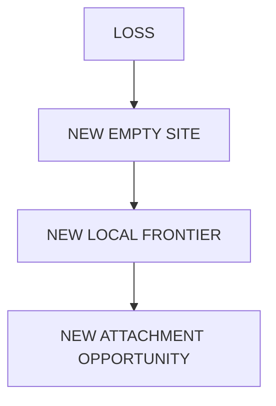

+++
title = "20: What Happens When the Crystal Can Lose Material?"
date = "2026-08-12T18:49:00+01:00"
draft = false
description = "The Digital Crystal had always lived in a world where occupied material lasted forever. Chapter 20 removes that assumption and discovers that loss creates new construction opportunity."
weight = 20
categories = ["Programming", "Artificial Life"]
tags = ["Digital Life", "Digital Crystal", "Causality", "Material Loss", "Reoccupation", "Experiments"]
series = ["Digital Life From First Principles"]
+++

Until now, the crystal had lived in an impossible world.

Once a cell became occupied, it stayed occupied.

Forever.

The frontier moved outward.

Old material accumulated behind it.

Nothing eroded.

Nothing vanished.

Nothing exposed the interior again.

That assumption had quietly shaped almost every result since Chapter 11.

So Chapter 20 removed it.

We added one rule:

```text
occupied
↓
empty
```

with some small probability.

Nothing else.

No repair mechanism.

No resource system.

No maintenance controller.

No energy variable.

No metabolism.

No target morphology.

Just loss.

Then we asked what broke.

---

## The Obvious Prediction

The first prediction seemed almost embarrassingly simple.

Suppose the crystal has an effective radius \(r\).

If new construction happens mainly around the outside boundary, then construction opportunity should scale roughly like perimeter:

$$
\text{construction} \sim r
$$

But if every occupied cell can disappear, then total expected loss should scale roughly like occupied area:

$$
\text{loss} \sim r^2
$$

That gives a natural prediction.

At small size:

```text
construction > loss
```

At larger size:

```text
loss > construction
```

So there ought to be some scale where the two balance.

Perhaps the crystal would stop expanding.

Perhaps it would hover around a finite size.

Perhaps above some loss rate it would collapse.

It was exactly the kind of candidate scaling law we wanted.

And because it sounded so plausible, we wrote the failure condition before running the experiment.

A finite dynamic regime had to satisfy all of these:

```text
late population slope approximately zero

population still substantially above zero

world far from simulation capacity

population meaningfully smaller than decay-off baseline
```

A plateau caused by extinction would not count.

A plateau caused by reaching the edge of the world would not count.

We wanted a genuine balance between construction and loss.

---

## First Establish the Baseline

With no loss, the crystal still behaved exactly as expected.

The decay-off baseline had a late normalized population slope around:

```text
0.037 per update
```

and late net growth around:

```text
154 cells per update
```

The crystal was nowhere near world capacity.

So we had a clean expanding reference.

Then we turned on loss.

The sweep was:

```text
δ = 0.00
δ = 0.02
δ = 0.04
δ = 0.06
δ = 0.08
δ = 0.12
δ = 0.16
```

The prediction was straightforward:

```text
higher δ
↓
more material removed
↓
growth slows
↓
eventually slope approaches zero
```

That is not what happened.

---

## Loss Did Not Stop the Expansion

The late normalized population slopes stayed remarkably similar.

Across the entire sweep they remained close to:

```text
0.036 – 0.038
```

Even at the highest tested loss rate, the crystal was still expanding.

The late mean population did fall.

At `δ = 0.16`, it was roughly one third smaller than the decay-off baseline.

But the slope did not flatten.

No non-zero loss rate met the predeclared finite-regime condition.

So the primary result was:

```text
FAILED
```

The obvious perimeter-versus-area argument had not survived contact with the substrate.

That failure was already useful.

But the reason was much more interesting.

---

## Look at the Gross Construction Rate

At first glance, increasing loss should simply subtract material from the crystal.

If the crystal ordinarily adds around 150 cells per update, then adding loss ought to produce something like:

```text
+150 construction
-80 loss
= +70 net
```

Then perhaps:

```text
+150 construction
-150 loss
= 0 net
```

But the construction rate itself did not remain fixed.

It exploded.

Late averages looked approximately like this:

| δ | attachments | losses | net growth |
|---|-------------|--------|------------|
| 0.00 | 152 | 0 | +152 |
| 0.02 | 227 | 81 | +146 |
| 0.04 | 299 | 158 | +141 |
| 0.06 | 358 | 227 | +131 |
| 0.08 | 430 | 303 | +127 |
| 0.12 | 530 | 420 | +110 |
| 0.16 | 632 | 531 | +101 |

At `δ = 0.16`, the crystal was losing more than five hundred cells per update.

But it was also attaching more than six hundred.

Loss had made the crystal build faster.

That was not in the prediction.

---

## The Missing Variable Was Frontier

The original scaling argument treated the crystal as if it had one meaningful boundary.

Something like:

```text
solid interior
+
outer perimeter
```

But random loss changes the geometry.

Every time an occupied site disappears, it can create a new empty location surrounded by occupied material.

That location becomes part of the set that ordinary growth can potentially fill.



So:

```text
loss
↓
new empty site
↓
new local boundary
↓
new attachment opportunity
```

The loss process was manufacturing frontier.

And the boundary measurements showed it dramatically.

Approximate late mean boundary counts were:

| δ | boundary count |
|---|----------------|
| 0.00 | 372 |
| 0.02 | 807 |
| 0.04 | 1167 |
| 0.06 | 1430 |
| 0.08 | 1695 |
| 0.12 | 1940 |
| 0.16 | 2068 |

So our original statement:

```text
construction opportunity ~ outer perimeter
```

was simply the wrong geometry.

Once material can disappear, the crystal develops internal construction surfaces.

The active boundary is no longer only outside.

That destroys the naive scaling law.

---

## Where You Lose Material Matters

V1 contained another test.

Suppose the total number of removed cells is held exactly equal.

Does it matter whether they are removed from the surface or the interior?

We synchronized the loss count.

Every update:

```text
surface branch removes K cells
interior branch removes K cells
```

The total removal budget was identical.

The only difference was placement.

The result was strong.

Late population was about:

```text
11.1%
```

higher under interior-biased loss than under surface-biased loss.

That cleared the predeclared 10% effect threshold.

And the hole counts were dramatically different:

```text
surface loss      ~2.7 late holes
interior loss    ~29.8 late holes
```

So equal loss did not have equal consequences.

Where the missing material appeared mattered.

At this point we had a plausible explanation.

Perhaps interior loss creates high-neighbour-count vacancies that ordinary growth rapidly fills.

But that was still only an interpretation.

We needed to measure it directly.

---

## V2: Separate New Construction from Reoccupation

Until loss existed, every attachment meant the same thing.

A cell had never been occupied before.

Then it became occupied.

So:

```text
attachment = new construction
```

But after material loss, that equivalence breaks.

A cell can now follow this path:

```text
occupied
↓
lost
↓
empty
↓
occupied again
```

So V2 introduced an observer-only occupancy ledger.

It did not change the crystal.

It merely remembered whether each lattice position had ever been occupied before.

Now every attachment could be classified as one of two things:

```text
FIRST OCCUPATION
a site is occupied for the first time ever

REOCCUPATION
a previously occupied site was lost
and later becomes occupied again
```



This distinction immediately changes how we should read the V1 numbers.

`632 attachments per update` does not mean:

```text
632 new places added
```

It means:

```text
first occupations
+
reoccupations
```

The crystal may be doing enormous internal turnover while net population grows much more slowly.

---

## Verify the Null First

With no material loss, reoccupation must be impossible.

Nothing ever becomes empty again.

So V2 first ran a structural null.

Across 96 no-loss runs:

```text
reoccupation count = 0
```

exactly.

All attachments were first occupations.

Good.

Now we could trust the ledger.

---

## The Exact-Count Loss Experiment

We returned to the matched surface-versus-interior design.

Again:

```text
surface loss count = interior loss count
```

on every update.

The mean cumulative loss count in each branch was about:

```text
890 cells
```

Then we asked:

> What fraction of those losses later became reoccupations?

The answer was much larger than expected.

---

## Almost Everything Came Back

For surface-biased loss:

```text
reoccupation per loss ≈ 0.936
```

For interior-biased loss:

```text
reoccupation per loss ≈ 0.956
```

Another way to measure the same phenomenon is to ask what fraction of unique lost sites were ever reoccupied.

Again:

```text
surface     ≈ 93.6%
interior    ≈ 95.7%
```

That is the central mechanistic result of Chapter 20.

Under these conditions, most removed sites did not remain empty.

They came back.

And usually quickly.

Mean reoccupation delay:

```text
surface     ≈ 1.56 updates
interior    ≈ 1.09 updates
```

So a typical lost site was often empty for only one or two steps.

---

## But the Primary V2 Hypothesis Still Failed

V2 had not merely predicted that reoccupation would occur.

It made a stronger claim.

We predicted that interior loss would produce a much larger reoccupation rate than surface loss.

The predeclared minimum difference was:

```text
0.15 additional reoccupations per loss
```

The observed difference was only:

```text
0.0198
```

It was statistically clear.

The interval was narrow.

The directional test was extremely small.

But it was nowhere near the effect size we had said would matter.

So the primary V2 result was:

```text
FAILED
```

Again.

And again the failure corrected the interpretation.

Interior loss was not special in the way we expected.

The much larger phenomenon was shared by both conditions.

---

## Almost Every Loss Creates Frontier

V2 also measured how much new frontier was created per removed cell.

The numbers were:

```text
surface     ~0.995 new frontier sites per loss
interior    ~1.000 new frontier sites per loss
```

That is almost one-for-one.

So the more general mechanism is:

```text
LOCAL MATERIAL LOSS
↓
NEW EMPTY LOCATION
↓
NEW ATTACHMENT OPPORTUNITY
```

not:

```text
INTERIOR LOSS ONLY
↓
SPECIAL ATTACHMENT OPPORTUNITY
```

Interior sites were somewhat more rapidly and completely reoccupied.

But that was a second-order difference.

The major effect was universal.

Removing a cell almost always creates a site ordinary growth can see again.

---

## Reoccupation Is Not Repair

This is where the language matters.

It is tempting to say:

> The crystal repairs itself.

We have not earned that.

There is no:

```text
damage detector
```

No:

```text
repair objective
```

No:

```text
desired target morphology
```

No:

```text
special reconstruction pathway
```

The exact same local growth rule runs whether the empty site is:

```text
new territory
```

or:

```text
a place that used to exist
```

The crystal does not know the difference.

The observer does.

So the bounded claim is:

> **Material removal creates attachment opportunities that the ordinary Digital Crystal growth rule rapidly reuses.**

That is enough.

And it is more interesting than calling it repair too early.

---

## Population Was Hiding Turnover

The biggest conceptual change in this chapter is not about loss.

It is about measurement.

A population graph shows:

```text
occupied cells at time t
```

But that is only a net stock.

Once material can disappear and reappear, the same population can conceal very different underlying traffic.

Imagine two systems.

System A:

```text
+100 new cells
0 lost
```

System B:

```text
+600 attachments
-500 losses
```

Both end the update at:

```text
+100 net
```

A population curve treats them as equivalent.

They are not.

System B is undergoing enormous internal turnover.



So another distinction joins our evidence ladder:

```text
NET POPULATION CHANGE
≠
GROSS CONSTRUCTION ACTIVITY
```

and:

```text
ATTACHMENT
≠
FIRST OCCUPATION
```

Those distinctions did not exist before material could disappear.

Now they are essential.

---

## The Hole Paradox

There was one result that initially looked contradictory.

Interior-biased loss produced many more visible holes:

```text
surface     ~3.2
interior    ~37.6
```

Yet interior lost sites were reoccupied slightly more often and much faster.

How can a process with faster refill have more holes?

Because a snapshot counts how many holes exist now.

It does not tell us how long each hole survives.

Imagine:

```text
lose A
lose B
refill A
lose C
refill B
lose D
refill C
...
```

A snapshot can show many holes even if individual holes are short-lived.

The process may be generating vacancies faster than any one vacancy persists.

Again:

> **State is not dynamics.**

A single picture of the crystal cannot reveal how much material is cycling underneath it.

We keep rediscovering this lesson.

---

## What Happened to the Scaling Law?

We began Chapter 20 with a candidate law:

```text
growth ~ boundary
loss ~ occupied area
```

therefore:

```text
loss eventually wins
```

The experiment rejected that reasoning under this substrate.

Why?

Because loss is not an external subtraction from a fixed geometry.

Loss changes the geometry that determines construction opportunity.

The real relationship is closer to:

```text
loss
↓
changes active boundary
↓
changes future construction rate
```

So loss and construction are dynamically coupled.

That means the original scaling argument treated:

```text
construction rate
```

as independent of:

```text
loss rate
```

when it is not.

That was the mistake.

And finding that mistake is more valuable than confirming the original prediction would have been.

---

## A Different Kind of Compensation

There is another tempting word here:

```text
maintenance
```

We should not use it yet.

But something important has appeared.

A perturbation that removes material automatically creates conditions under which the ordinary growth process tends to replace much of that material.

Conceptually:

```text
loss
↓
creates opportunity for the mechanism
that counteracts loss
```

That is a form of **structural compensation**.

Not because the crystal senses damage.

Not because it allocates resources.

Not because it prefers preservation.

But because the geometry of removal feeds directly into the geometry of construction.



That is a substrate-level feedback.

The word `feedback` is justified here only in the mechanistic sense:

```text
loss changes state
state changes future construction opportunities
construction changes state again
```

We do not need to make it biological.

---

## What Survived the Hypothesis?

Both primary hypotheses in this chapter failed.

The first predicted a finite near-stationary regime in which loss would eventually balance growth.

That did not happen.

The second predicted that interior-biased loss would produce a scientifically large reoccupation advantage over surface-biased loss.

That also did not happen.

Those failures remain failures.

But underneath them, the experiment exposed a much broader mechanism.

### Loss changed the geometry of opportunity

The original scaling argument treated growth and loss almost as independent processes:

```text
growth
~ outer boundary

loss
~ occupied area
```

That picture failed because material loss changes the very geometry that determines where growth can occur.

A removed cell becomes empty, and if occupied neighbours remain around it, that location becomes an ordinary attachment opportunity.



The experiment measured this almost one-for-one:

```text
surface loss
~0.995 new frontier sites per loss

interior loss
~1.000 new frontier sites per loss
```

The crystal did not merely suffer loss.

Loss manufactured frontier.

### Phenomenon record

**Phenomenon:** Loss-generated construction opportunity

**Status:** **SUPPORTED**

**Current bounded description:**

> Under the tested Digital Crystal loss conditions, removing occupied material almost always creates a new local frontier opportunity that the ordinary frozen growth rule can potentially reuse.

This extends the Interface Principle from Chapter 18.

Chapter 18 showed that historical state matters when it remains coupled to the active construction interface.

Chapter 20 shows that the interface itself can be **created by loss**.

So the active interface is not just something the crystal carries outward.

It can also be regenerated internally whenever material disappears.

### Reoccupation is the dominant shared phenomenon

Under exact-count matched loss:

```text
surface unique lost sites reoccupied
≈ 93.6%

interior unique lost sites reoccupied
≈ 95.7%
```

and mean reoccupation delay was approximately:

```text
surface
1.56 updates

interior
1.09 updates
```

The predeclared interior-minus-surface difference failed because the shared effect was already close to saturation.

The stronger surviving observation is therefore:

> **Sparse material loss is usually converted into a new attachment opportunity that ordinary growth rapidly reuses.**

This is not repair.

No damage detector exists.

No target state is reconstructed.

No special pathway distinguishes:

```text
new territory
```

from:

```text
territory that used to be occupied
```

The observer knows a site is being reoccupied.

The crystal does not.

So:

```text
REOCCUPATION
≠
REPAIR
```

### Phenomenon record

**Phenomenon:** Rapid reuse of lost material

**Status:** **SUPPORTED**

**Current bounded description:**

> Under the tested exact-count conditions, more than 93% of lost sites were subsequently reoccupied, typically within one or two updates, through the same local growth rule used for ordinary expansion.

This is a substrate-level consequence of geometry, not evidence of biological maintenance.

### The Flux Principle

Chapter 20 also exposes a second major phenomenon.

Before loss existed:

```text
attachment
=
first occupation
```

After loss exists:

```text
attachment
=
first occupation
+
reoccupation
```

That means population becomes an incomplete description of the process.

A crystal can have modest net growth while undergoing enormous gross material traffic.

For example:

```text
+632 attachments
-531 losses
----------------
+101 net
```

A population curve sees:

```text
+101
```

but the process actually executed:

```text
1163 gross material events
```

So the chapter establishes:

```text
NET POPULATION CHANGE
≠
GROSS MATERIAL TURNOVER
```

This gives us the **Flux Principle**:

> **Static population or morphology can conceal large ongoing construction, loss and reoccupation flows.**

The active process may be much more dynamic than its net state suggests.

### State is not dynamics

The hole paradox reinforces the same point.

Interior-biased loss can show more holes in a snapshot while individual lost sites are also being reoccupied faster.

That is possible because:

```text
number of holes now
```

is not the same thing as:

```text
lifetime of each hole
```

A system can create and close vacancies rapidly while maintaining many vacancies at any one instant.

So again:

```text
SNAPSHOT
≠
PROCESS
```

This is the Flux Principle in another form.

### Structural compensation, not maintenance

The chapter also reveals a bounded feedback loop:

```text
loss
↓
changes local geometry
↓
creates attachment opportunity
↓
ordinary growth reoccupies sites
↓
changes local geometry again
```

That is legitimate mechanistic feedback.

But it is not evidence for:

```text
damage sensing
goal-directed preservation
repair objective
self-maintenance
```

The correct term is **structural compensation**.

The system counteracts some loss because the geometry of loss creates opportunities for the same process that fills empty sites.

### Connection to earlier phenomena

The cross-chapter picture is now becoming much tighter.

Chapter 18:

```text
causal relevance
lives at active interface
```

Chapter 19:

```text
accessible difference
does not guarantee readout
```

Chapter 20:

```text
loss creates interface
```

So the interface is no longer merely:

```text
the outer boundary of a growing object
```

It is better understood as:

> **the dynamically generated set of locations where the process currently has an opportunity to change state.**

That definition will matter later.

### What this phenomenon does not establish

The surviving phenomena do **not** establish:

- repair,
- homeostasis,
- self-maintenance,
- energy use,
- metabolism,
- a finite sustainable size,
- or life.

They establish something narrower and more fundamental:

> **Material loss dynamically generates new construction opportunity, and ordinary Digital Crystal growth rapidly reuses most lost sites. At the same time, large gross turnover can remain hidden beneath relatively modest net population change.**

Those phenomena should now be tracked independently of the failed finite-regime and interior-superiority hypotheses.

---

## What Chapter 20 Established

The primary V1 hypothesis failed.

The primary V2 hypothesis failed.

That sounds disastrous if experiments are supposed to confirm what we hoped.

It is exactly what we wanted from this book.

V1:

> Background loss did **not** produce the predicted finite near-stationary regime across the tested sweep.

V2:

> Interior loss did **not** increase reoccupation over surface loss by the predeclared scientifically meaningful amount.

But together they exposed a stronger mechanism:

> **Material loss creates new attachment opportunity, and under the tested exact-count conditions more than 93% of lost sites were subsequently reoccupied, typically within one or two updates, by the ordinary frozen growth rule.**

That statement is measured.

It does not require the failed hypotheses to become true.

---

## The New Ladder

The crystal now has a new causal chain:

```text
MATERIAL PRESENT
↓
MATERIAL LOST
↓
EMPTY SITE
↓
NEW FRONTIER
↓
ORDINARY ATTACHMENT
↓
REOCCUPATION
```

And we can distinguish:

```text
LOSS
≠
PERMANENT LOSS

ATTACHMENT
≠
NEW CONSTRUCTION

REOCCUPATION
≠
REPAIR

NET GROWTH
≠
GROSS MATERIAL TURNOVER
```

Those are the results of Chapter 20.

---

## Why We Stop Here

We could continue.

Measure exact hole lifetime distributions.

Sweep the placement fraction.

Try different loss schedules.

Separate one-neighbour from six-neighbour vacancies.

Increase the number of groups.

But none of those would cross a new conceptual boundary.

We know the essential mechanism now.

Loss makes reusable frontier.

Ordinary growth reuses it.

The crystal can therefore undergo large material turnover without net population collapse.

That is enough.

No V3.

---

## The Question We Have Now Earned

There is still something artificial about this world.

The crystal currently gets unlimited opportunities to act.

Every update, the growth rule can evaluate every eligible frontier site.

It does not have to choose between:

```text
expanding outward
```

and:

```text
reoccupying lost material
```

It can attempt both everywhere.

So rebuilding what vanished is almost free.

That is why Chapter 20 should not end with:

```text
repair
```

It should end with a constraint.

Suppose the crystal can perform only:

```text
B
```

construction updates per step.

Now every action has an opportunity cost.

For the first time:

```text
OUTWARD CONSTRUCTION
        competes with
REOCCUPATION
```

And then a genuinely new question appears:

> **When computational action is limited, what gets built and what gets preserved?**

That is no longer a question about loss alone.

It is a question about allocation under scarcity.


The crystal did not learn to repair itself.

We merely discovered that, while computation was unlimited, rebuilding what disappeared was almost free.

Next, we remove that luxury.
