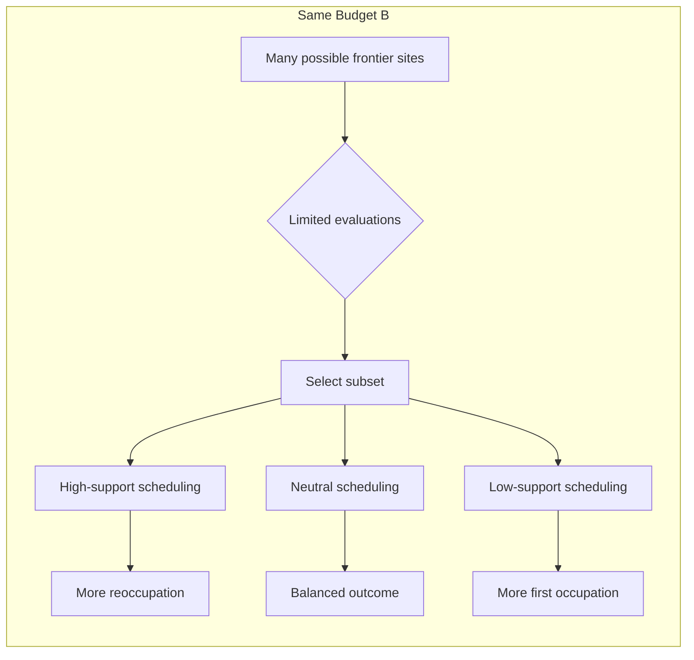
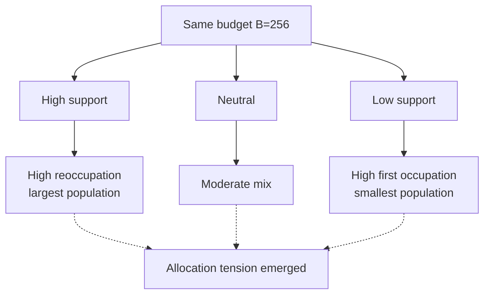
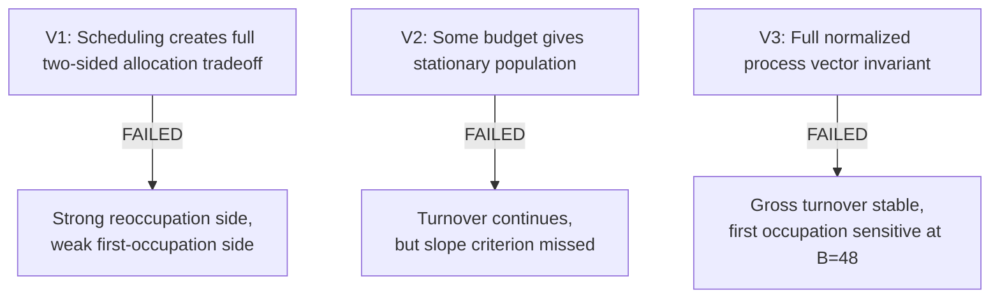
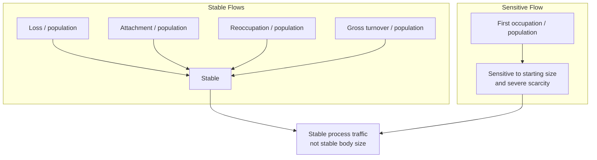
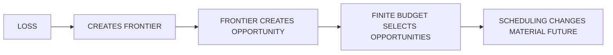

+++
title = "21: What Does It Cost to Stay?"
date = "2026-08-12T19:26:00+01:00"
draft = false
description = "Once material can disappear, the Digital Crystal can rebuild what is lost. Chapter 21 asks what happens when computation itself becomes scarce."
categories = ["Programming", "Artificial Life"]
tags = ["Digital Life", "Digital Crystal", "Scarcity", "Turnover", "Computation", "Experiments"]
series = ["Digital Life From First Principles"]
+++

Chapter 20 ended with an uncomfortable fact.

The crystal could lose material.

And yet most of that material came back.

Not because we gave it a repair mechanism.

Not because it knew what had been damaged.

Not because it protected an intended shape.

The ordinary growth rule simply saw the empty sites created by loss and treated them as new attachment opportunities.

Under the tested exact-count conditions, more than ninety-three percent of lost sites were eventually reoccupied, usually within one or two updates.

That sounded impressive.

But there was a hidden luxury.

The crystal could examine essentially every available construction opportunity.

Every update, every eligible frontier site could receive an attachment evaluation.

So the crystal never really had to choose between:

```text
expanding into new territory
```

and:

```text
reoccupying material that had disappeared
```

It could attempt both.

Everywhere.

At once.

Rebuilding was cheap because computation was unlimited.

Chapter 21 removes that luxury.

---

## One New Constraint

We changed exactly one thing.

Instead of evaluating every eligible frontier site, the crystal could evaluate at most:

```text
B
```

sites per update.

An unevaluated site simply received no attachment draw on that step.

The underlying attachment probability remained unchanged.

The loss rule remained unchanged.

The crystal gained no new state.

No energy.

No resource counter.

No maintenance controller.

No memory of damage.

No ability to identify whether a frontier position had ever been occupied before.

Just:

```text
many possible construction opportunities
↓
only B can be evaluated
```

For the first time, computation itself was scarce.

---

## Scarcity Creates Allocation

The new constraint introduces something the earlier crystal never experienced.

Competition.

Suppose one update contains:

```text
500 possible frontier sites
```

but:

```text
B = 128
```

Only 128 can even be considered.

Now the order in which sites are selected matters.

That does not mean the crystal is choosing.

It does not mean it has priorities.

But different local scheduling rules can produce different material futures.

So V1 began with three deliberately simple policies.

```text
HIGH SUPPORT
evaluate sites with more occupied neighbours first

NEUTRAL
evaluate frontier sites in keyed random order

LOW SUPPORT
evaluate sites with fewer occupied neighbours first
```

The policies were allowed to see only current geometry.

They were not allowed to inspect occupancy history.

They did not know whether a site was:

```text
new territory
```

or:

```text
a previously occupied site waiting to be reoccupied
```

That distinction remained observer-only.

So if high-support scheduling happened to favour reoccupation, it would be an emergent consequence of local geometry rather than an explicit repair instruction.



---

## The First Question

V1 asked:

> **At the same finite computational budget, can local scheduling change the tradeoff between reusing lost material and occupying new sites?**

We froze:

```text
loss rate δ = 0.08
budget B = 256
```

and required both sides of the predicted tradeoff to clear predeclared magnitude thresholds.

High-support scheduling had to produce a meaningful increase in:

```text
reoccupation / loss
```

while low-support scheduling had to produce a meaningful increase in:

```text
first occupations / 1000 evaluations
```

Both were required.

That mattered.

Because significance alone was no longer enough.

---

## Budget Changed Scale Immediately

Before looking at the policies, the neutral budget sweep already showed something striking.

Approximate late populations were:

```text
B = 64        ~381
B = 128       ~829
B = 256      ~1717
B = 512      ~3092
B = 1024     ~3513
unlimited    ~3462
```

The amount of computational opportunity strongly constrained how large the lossy crystal became.

At severe scarcity, late net change approached zero.

At larger budgets, the crystal expanded rapidly.

So:

```text
COMPUTATIONAL OPPORTUNITY
↓
PROCESS SCALE
```

was already real.

That was a new property.

Not metabolism.

Not energy.

But the crystal could no longer be described without reference to the amount of computation available to it.

---

## Same Budget, Different Futures

Then we held the budget fixed.

At:

```text
B = 256
```

the three local scheduling rules produced very different results.

Approximate late behaviour:

```text
HIGH SUPPORT

late population                  ~1923
reoccupation / loss               0.959
first occupations / 1000 evals    188
late net growth                   +24.3
```

```text
NEUTRAL

late population                  ~1723
reoccupation / loss               0.844
first occupations / 1000 evals    212
late net growth                   +10.0
```

```text
LOW SUPPORT

late population                  ~1131
reoccupation / loss               0.534
first occupations / 1000 evals    249
late net growth                    -1.5
```

The differences were large.

High-support scheduling strongly favoured reoccupation and produced the largest persistent population.

Low-support scheduling favoured first occupation and left much less material behind.

So finite computation had created a real allocation tension:

```text
REUSE LOST MATERIAL
        versus
OCCUPY NEW MATERIAL
```

The crystal still did not know which was which.

Geometry created the bias.



---

## But V1 Still Failed

The high-support reoccupation advantage easily cleared its threshold.

Observed:

```text
~0.425
```

Required:

```text
0.150
```

The low-support first-occupation advantage was also statistically clear.

Observed:

```text
~61.6 first occupations per 1000 evaluations
```

But the predeclared requirement was:

```text
100
```

So the formal two-arm tradeoff failed.

```text
V1 STATUS: FAILED
```

That failure matters.

We had predicted a stronger exploration-side effect than the experiment produced.

We do not get to reduce the threshold afterward.

But V1 still established several measured facts.

Finite computational budget strongly constrained scale.

Local scheduling strongly changed persistence.

And scarce evaluations were not neutral with respect to what kind of construction occurred.

That was enough to motivate a new question.

---

## Was There a Budget Where the Crystal Simply Stayed?

The neutral sweep contained one especially interesting region.

At low budgets, net growth approached zero.

That suggested a new possibility.

Perhaps Chapter 20 had failed to produce finite scale because material loss alone was not enough.

But perhaps:

```text
LOSS
+
FINITE COMPUTATIONAL OPPORTUNITY
```

could create something much closer to dynamic persistence.

So V2 dropped the scheduling-policy comparison entirely.

Only neutral scheduling remained.

The new question was:

> **Is there a finite budget at which the population becomes approximately stationary while material turnover continues?**

This was not allowed to succeed by freezing.

It was not allowed to succeed by dying.

It was not allowed to succeed by reaching the simulation boundary.

A qualifying regime required all of the following:

```text
population remains nonzero

late population slope approximately zero

loss continues

reoccupation continues

first occupation continues

gross turnover remains substantial

world capacity is not binding
```

We froze a candidate family before the fresh run:

```text
B = 48, 64, 80, 96, 128
```

No new candidate could be added afterward.

---

## V2 Came Very Close

The V2 result was peculiar.

Almost every gate passed for every budget.

Population survived.

Capacity was nowhere near binding.

Loss continued.

Reoccupation continued.

First occupation continued.

Gross turnover remained substantial.

Late net growth stayed small.

The only gate that failed was:

```text
late normalized population slope
```

The approximate slopes were:

```text
B=48     -0.00319
B=64     -0.00271
B=80     -0.00252
B=96     -0.00268
B=128    -0.00280
```

The frozen threshold was:

```text
|slope| <= 0.00250
```

At `B=80`, the mean missed by only a tiny amount.

But it missed.

So:

```text
V2 STATUS: FAILED
```

No candidate met every predeclared condition.

We did not search around `B=80`.

We did not try `78`, `79`, `81`, `82`.

That would have turned the experiment into threshold hunting.

Instead we asked why all five budgets looked so similar in proportional terms.

---

## The Strange Stability Underneath the Failure

The absolute scales were very different.

The approximate late populations increased from:

```text
~260 at B=48
```

to:

```text
~800 at B=128
```

Yet their normalized decline rates were surprisingly similar.

And something else was even more stable.

Gross turnover as a fraction of population remained close to:

```text
0.17 per update
```

across the entire budget family.

That suggested we might have been asking the wrong kind of stability question.

We had been looking for:

```text
stable body size
```

But perhaps the substrate was offering:

```text
stable process traffic
```

instead.

That distinction became V3.

---

## Stable Size Is Not Stable Process

V3 abandoned the search for a flat population curve.

It did not add more budgets.

It did not alter the V2 slope criterion.

It asked a genuinely different question:

> **Can normalized construction and loss flows remain stable even while absolute population drifts?**

For each update, we measured:

```text
loss / population

attachments / population

reoccupation / population

first occupation / population

gross turnover / population
```

Then we changed not only computational budget, but starting size.

The frozen start conditions were:

```text
SMALL      warmup = 8

MEDIUM     warmup = 14

LARGE      warmup = 20
```

Crossed with:

```text
B = 48, 64, 80, 96, 128
```

If the process really had a substrate-native statistical regime, it should not depend strongly on whether we started from a smaller or larger crystal.

---

## What Stayed Stable

The most striking result was gross turnover.

Mean late gross turnover fractions across budgets were approximately:

```text
B=48     0.17229
B=64     0.17150
B=80     0.17066
B=96     0.17147
B=128    0.17132
```

The coefficient of variation across those budget means was only:

```text
0.0030
```

about three tenths of one percent.

That is remarkably small.

And the temporal drift of gross turnover was also tiny.

The worst absolute late slope across the budget family was around:

```text
0.00024
```

against a frozen tolerance of:

```text
0.0025
```

So the gross material traffic was not only similar across budgets.

It was also approximately flat within the late observation window.

Meanwhile:

```text
no runs collapsed

all population gates passed

all activity gates passed

all capacity gates passed
```

The crystal continued to undergo substantial material traffic.

---

## Starting Size Hardly Mattered to Turnover

Take `B=48`.

Gross turnover by starting condition was roughly:

```text
small     0.17330
medium    0.17267
large     0.17089
```

Loss fraction was also tightly clustered.

Attachment fraction was tightly clustered.

Reoccupation fraction was tightly clustered.

Those metrics easily cleared the predeclared start-size invariance gate.

The same general pattern persisted across the other budgets.

At `B=96`, for example, loss, attachment, reoccupation and gross turnover all showed very low sensitivity to starting size.

Something in the process was genuinely stable.

But not everything.

---

## Expansion Was the Weak Point

The metric that broke the full V3 claim was:

```text
first occupation / population
```

At `B=48`:

```text
small     0.01806
medium    0.01689
large     0.01356
```

The coefficient of variation was:

```text
0.118
```

The frozen maximum was:

```text
0.100
```

So that gate failed.

At larger budgets, the start-size dependence weakened:

```text
B=64     CV ~0.092
B=80     CV ~0.077
B=96     CV ~0.074
B=128    CV ~0.063
```

Those passed.

But V3 required every process metric at every budget to clear the threshold.

So:

```text
V3 STATUS: FAILED
```

Again.

Three experiments.

Three formal failures.

And yet by now the pattern underneath those failures was much clearer than any single positive result would have been.

---

## Two Processes Were Hiding Inside One

The data suggest a useful decomposition.

One set of flows appears remarkably stable:

```text
LOSS

ATTACHMENT

REOCCUPATION

GROSS MATERIAL TURNOVER
```

Another remains more sensitive to history and scale:

```text
FIRST OCCUPATION
```

That suggests a distinction between:

```text
CONTINUATION
```

and:

```text
EXPANSION
```

The crystal's ongoing material traffic is highly stable across:

```text
different starting sizes

different computational budgets

different absolute population scales
```

But occupation of never-before-used territory is more contingent.

Especially under severe scarcity.

That is a much more interesting result than a fixed-size crystal would have been.

---

## Staying and Growing Are Not the Same Problem

Earlier versions implicitly treated all attachments as equivalent.

Chapter 20 already broke that assumption by separating:

```text
first occupation
```

from:

```text
reoccupation
```

Chapter 21 now shows why the distinction matters.

Under scarcity, reoccupation can remain relatively stable while first occupation changes much more strongly.

So:

```text
STAYING
≠
GROWING
```

Not biologically.

Operationally.

The dynamics required to keep material traffic going are not identical to the dynamics required to expand into new territory.

And because the scheduling policy never knows whether a site is old or new, this distinction emerges from geometry and history rather than from a hard-coded biological category.

---

## What Does It Cost to Stay?

We can finally answer the chapter title.

Not with an energy unit.

Not with calories.

Not with ATP.

Not with a made-up digital metabolism.

In this substrate, the relevant cost is:

```text
evaluation opportunity
```

The crystal can only continue constructing where computation is actually spent.

Reduce the number of evaluated frontier sites and the scale of the process falls dramatically.

Change how those evaluations are allocated and the balance between reoccupation and first occupation changes.

So the bounded claim is not:

> The crystal has metabolism.

It is:

> **Continued material turnover in the lossy Digital Crystal depends strongly on finite computational opportunity, and the allocation of that opportunity changes whether construction tends toward reuse of lost material or occupation of new sites.**

That is a real computational constraint.

And it required no biological metaphor to define.

---

## Three Failures, One Better Model

Chapter 21 can be summarized as a sequence of rejected simplifications.



### V1

We predicted a strong two-sided allocation tradeoff.

High-support scheduling strongly increased reoccupation.

Low-support scheduling increased first occupation, but not enough to clear the frozen magnitude threshold.

```text
FAILED
```

### V2

We predicted that some finite budget would produce approximately stationary population while turnover continued.

Every tested budget retained substantial turnover.

But none cleared the frozen population-slope criterion.

```text
FAILED
```

### V3

We predicted that the entire normalized process vector would be invariant across starting sizes and budgets.

Most of it was.

First occupation under the harshest scarcity retained too much dependence on starting condition.

```text
FAILED
```

The failures progressively removed bad simplifications.

What remained was more precise.

---

## What Survived the Hypothesis?

Chapter 21 contained three formal hypotheses.

All three failed.

V1 did not establish the full two-sided allocation tradeoff at the predeclared magnitudes.

V2 did not establish a finite approximately stationary population regime.

V3 did not establish invariance of the complete normalized process vector across every tested starting size and budget.

Those failures remain failures.

But beneath them, several process-level regularities survived.

### Scarce computation changed the scale of the process

The first result was immediate.

As computational evaluation budget fell, the size of the lossy crystal fell with it.

Approximate late populations under neutral scheduling ranged from:

```text
B = 64
~381
```

to:

```text
B = 1024
~3513
```

while the unlimited condition was of similar large scale.

So:

```text
AVAILABLE COMPUTATIONAL OPPORTUNITY
↓
PROCESS SCALE
```

is not metaphorical.

It is measured.

The crystal can only attempt construction where evaluation opportunity is actually spent.

This gives us a new substrate-level constraint:

> **Finite computation limits the scale at which the material process can continue.**

That is not energy.

It is not metabolism.

It is simply computational scarcity.

### Scheduling changed what the same budget produced

At the same budget, local scheduling changed the balance between reoccupation and first occupation.

High-support scheduling produced much greater reoccupation.

Low-support scheduling produced more first occupation.

The full V1 tradeoff failed because the exploration-side magnitude did not clear its frozen threshold.

But the measured allocation effect remains real.

So:

```text
SAME COMPUTATIONAL BUDGET
≠
SAME MATERIAL FUTURE
```

and:

```text
WHERE COMPUTATION IS SPENT
MATTERS
```

The crystal does not know whether it is servicing old territory or new territory.

Yet geometry makes different scheduling rules allocate evaluation opportunity differently across those categories.

### The Flux Principle became much stronger

V2 failed to find a truly stationary population.

But it exposed something more interesting.

Across the tested budget family, gross turnover remained close to:

```text
0.17 per update
```

as a fraction of population.

V3 then measured this more carefully.

Late gross-turnover fractions were approximately:

```text
B=48     0.17229
B=64     0.17150
B=80     0.17066
B=96     0.17147
B=128    0.17132
```

The coefficient of variation across those budget means was only:

```text
0.0030
```

and temporal drift in late gross turnover was also very small.

That gives us the strongest version yet of the **Flux Principle**:

> **The Digital Crystal can exhibit highly stable normalized material traffic even while absolute population and spatial scale remain different or drifting.**



So:

```text
STABLE SIZE
≠
STABLE PROCESS
```

The process can be statistically stable in flow without being stationary in body size.

### Phenomenon record

**Phenomenon:** Stable normalized material flux

**Status:** **MEASURED**

**Current bounded description:**

> Across the tested budgets and starting sizes, normalized loss, attachment, reoccupation and gross material turnover were highly stable, while first occupation retained greater sensitivity to starting condition under severe computational scarcity.

This is narrower than calling the system homeostatic.

But it is also more precise.

The stable object may be process traffic rather than body size.

### Continuation and expansion separated

The metric that broke V3 was:

```text
first occupation / population
```

especially at the harshest budget.

Meanwhile:

```text
loss
attachment
reoccupation
gross turnover
```

remained much more stable.

That exposes another structural decomposition:

```text
CONTINUATION
=
ongoing loss / attachment / reuse traffic

EXPANSION
=
occupation of never-before-used territory
```

The two are not the same process.

Under severe scarcity, continuation remains comparatively regular while expansion remains more dependent on starting history and scale.

So:

```text
STAYING
≠
GROWING
```

and:

```text
CONTINUATION
≠
EXPANSION
```

These are operational distinctions, not biological ones.

### Phenomenon record

**Phenomenon:** Continuation–expansion separation

**Status:** **SUPPORTED**

**Current bounded description:**

> Under finite computational opportunity, the Digital Crystal's ongoing reuse and turnover dynamics are more stable than its expansion into never-before-occupied territory.

This result could become important later because it tells us not to treat every attachment as one undifferentiated activity.

Chapter 20 already separated first occupation from reoccupation.

Chapter 21 shows that those categories respond differently to scarcity.

### A caution about the apparent turnover invariant

The striking stability around:

```text
~0.171
```

should not yet be promoted into a deep emergent law.

The loss rate is frozen at:

```text
δ = 0.08
```

and rapid reoccupation is already known from Chapter 20.

So part of the observed gross-turnover stability may arise mechanically from:

```text
expected losses
+
rapid replacement
```

rather than from a new self-organized invariant.

That means the phenomenon is real:

```text
stable normalized turnover
```

but the explanation remains open.

A future audit should compare:

```text
OBSERVED TURNOVER
-
MECHANICALLY EXPECTED TURNOVER
```

before claiming a deeper substrate law.

This does not weaken the chapter.

It tells us exactly what remains to be explained.

### Connection to the Interface Principle

Chapter 20 showed that loss creates new frontier.

Chapter 21 now shows that finite computation determines which frontier opportunities can actually be serviced.

So the interface story becomes:



That is a much stronger substrate picture than simply saying the crystal has a boundary.

The relevant object is increasingly:

> **the dynamically generated set of construction opportunities together with the finite computation available to act on them.**

### What this phenomenon does not establish

The surviving phenomena do **not** establish:

- metabolism,
- homeostasis,
- self-maintenance,
- energy use,
- resource sensing,
- active prioritization,
- a fixed sustainable body size,
- or life.

They establish something narrower:

> **Finite computational opportunity constrains the scale and allocation of Digital Crystal construction. Under those constraints, gross normalized turnover can remain strikingly stable while expansion remains more sensitive to history and scarcity.**

That belongs in the project-wide phenomenon record independently of the three failed primary hypotheses.

---

## What We Actually Earned

The strongest description of the Chapter 21 system is:

> **A lossy Digital Crystal under finite computational opportunity exhibits persistent material turnover whose gross normalized traffic is strikingly stable across budget, population scale and starting condition, while expansion into never-before-occupied territory remains more sensitive to history and scarcity.**

That statement is much narrower than:

```text
homeostasis
```

or:

```text
metabolism
```

or:

```text
self-maintenance
```

And that is exactly why it is useful.

The mechanism exists without those words.

---

## Another Ladder

The project now has another separation:

```text
MATERIAL EXISTS
↓
MATERIAL TURNS OVER
↓
TURNOVER CONTINUES UNDER SCARCITY
↓
NORMALIZED TURNOVER CAN BE STABLE
↓
EXPANSION REMAINS HISTORY-SENSITIVE
```

And another set of distinctions:

```text
STABLE SIZE
≠
STABLE PROCESS

NET GROWTH
≠
GROSS TURNOVER

REOCCUPATION
≠
FIRST OCCUPATION

CONTINUATION
≠
EXPANSION
```

We should keep all four.

They will matter later.

---

## Why We Stop Here

It would be easy to run V4.

We could relax the first-occupation CV threshold.

Remove `B=48`.

Change the starting sizes.

Wait longer.

Use a different late window.

None of those would ask a genuinely new question.

They would turn Chapter 21 into a search for a passing definition.

So we stop.

The chapter has already done its job.

It showed us that the Digital Crystal under loss and scarcity is not well described by a single scalar such as population.

The more stable object may be the flow itself.

And now a harder problem appears.

---

## Is There Actually a Thing Here?

Throughout Chapters 20 and 21 we have increasingly spoken about:

```text
the process
```

But what exactly is that process?

Is it one coherent entity?

Or are we looking at a large stochastic field whose local statistics happen to be stable?

A connected shape is not enough.

A stable turnover rate is not enough.

A persistent region is not enough.

If there is something individual-like here, we should be able to earn that claim experimentally.

So the next question is not:

> How does the crystal maintain itself?

We have not earned that.

It is:

> **Does this continuing process occupy a causally coherent region, or are we still looking at a field with no natural individual?**

That is the next boundary.

The crystal can grow.

It can be perturbed.

It can carry material history.

It can lose material.

It can reoccupy what vanished.

It can continue under computational scarcity.

Its gross material traffic can remain strikingly stable even while its size drifts.

But none of that tells us whether there is actually **one thing** there.

Chapter 22 will try to find out.
