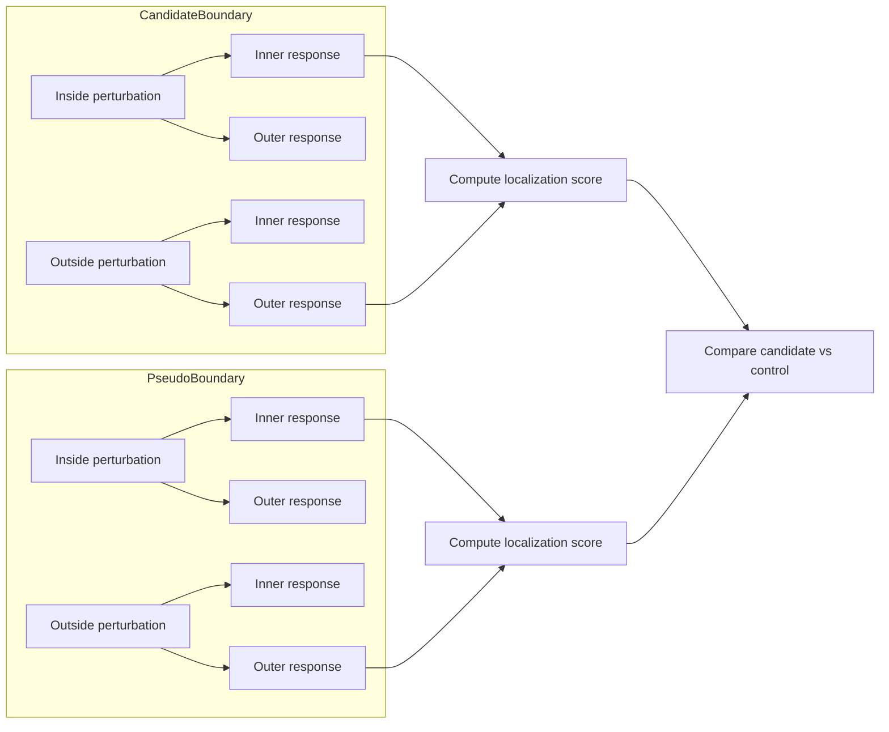
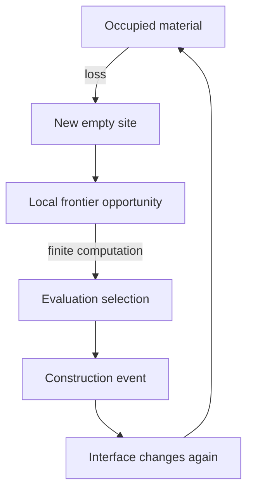
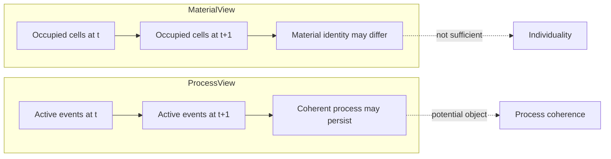
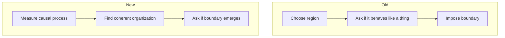
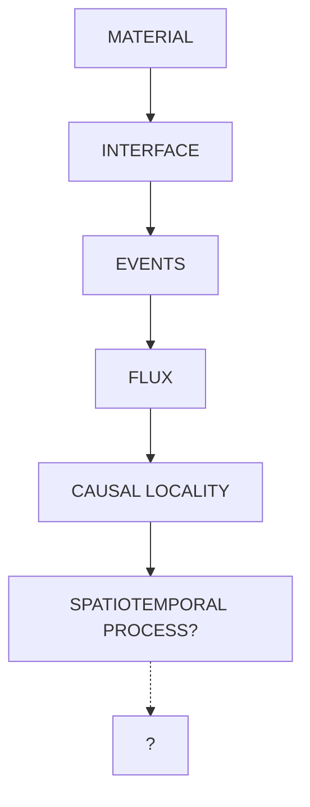

+++
title = "22: Is the Crystal a Thing or a Flow?"
date = "2026-08-12T21:47:00+01:00"
draft = false
description = "After finding stable turnover, causal locality and dynamically generated interfaces, Chapter 22 asks whether the Digital Crystal is best understood as a bounded thing or as a coherent process in space and time."
categories = ["Programming", "Artificial Life"]
tags = ["Digital Life", "Digital Crystal", "Causality", "Process", "Interfaces", "Flux", "Experiments"]
series = ["Digital Life From First Principles"]
+++

Chapter 21 ended with a question that sounded obvious.

Is there actually one thing here?

For most of the book, we had spoken naturally about:

```text
the crystal
```

as though the noun had already been earned.

There was a connected occupied structure.

It grew.

It could be perturbed.

It could carry historical material.

It could lose material.

Lost sites could be reoccupied.

Under finite computational opportunity, large amounts of material could turn over while the process continued.

And in Chapter 21, normalized gross turnover became strikingly stable even while absolute population and scale changed.

That made the question harder, not easier.

A stable process is not automatically an individual.  
A connected shape is not automatically an individual.  
A region that persists is not automatically an individual.  
And a system with local causal relationships is not automatically an individual.

So Chapter 22 began with a very cautious question:

> **Does the continuing Digital Crystal occupy a causally coherent region that is meaningfully different from the surrounding field?**

That was already weaker than asking whether the crystal was an organism.

It was weaker than asking whether it had a self.

It was weaker than asking whether it was autonomous.

But after the experiments in this chapter, even that framing needs revision.

The most interesting object may not be a bounded region of occupied material at all.

It may be the process moving through it.

---

## The Temptation to Draw a Boundary

We have a strong habit of looking for boundaries.

If something is alive, we expect an inside and an outside.

A bacterium has a membrane.  
A cell has a boundary.  
An animal has skin.  
Even a machine usually has a chassis.

So when the Digital Crystal began to exhibit:

```text
persistent turnover
local causal effects
history-dependent material
loss
reoccupation
scarce computation
```

the natural question was:

```text
where does the thing end?
```

But that question already contains a hypothesis.

It assumes there is a privileged spatial boundary to discover.

The crystal may not work that way.

Chapter 18 had already shown that causally useful historical state lives near the active construction frontier.  
Chapter 20 showed that loss can create new frontier inside previously occupied material.  
Chapter 21 showed that finite computation determines which frontier opportunities are actually serviced.

So the active region is not a fixed shell.  
It is dynamically generated.

A site can be:

```text
inert bulk
```

at one moment and become:

```text
active construction opportunity
```

after nearby material disappears.

That should have made us suspicious of any definition based only on a centered radius.

But we tried one anyway.

---

## V1: Look for Predictive Coherence

The first Chapter 22 experiment asked a deliberately modest question.

Not:

> Is this region an individual?

But:

> **Does any predeclared spatial scale contain predictive information about its own future beyond what is already available from the surrounding lattice?**

The substrate was frozen:

```text
Digital Crystal v1
loss rate δ = 0.08
neutral evaluation budget B = 96
```

We tested five candidate scales:

```text
R / R_eff

0.30
0.45
0.60
0.75
0.90
```

At each measurement point, we divided the system into:

```text
S_t
candidate region

E_t
surrounding active environment
```

and asked whether adding the current candidate-region state improved prediction of that region's later state.

The state representation was process-oriented.

It included measurements such as:

```text
population
frontier density
recent attachment
loss
reoccupation
first occupation
gross turnover
angular process structure
```

rather than occupancy alone.

The central quantity was:

```text
Δ_self
=
prediction using S_t + E_t
-
prediction using E_t alone
```

Then we compared that with an observer-only spatial null.

The hope was simple.

If one scale contained unusually strong information about its own future, perhaps we had found a candidate process boundary.

```mermaid
flowchart TD
    A[Candidate region S(t)] --> B[Predict future state of S]
    C[Environment E(t)] --> B
    B --> D[Prediction using S + E]
    C --> E[Prediction using E alone]
    D - E --> F[Excess self-coherence Δ_self]
    F --> G[Compare with spatial null]
```

---

## At First, V1 Looked Promising

The excess predictive-coherence values were:

```text
R = 0.30    0.1691
R = 0.45    0.0447
R = 0.60    0.0611
R = 0.75    0.1666
R = 0.90    0.2906
```

The largest value occurred at:

```text
0.90 R_eff
```

and it was far above the frozen minimum effect of:

```text
0.02
```

Looking only at the observed statistic, this seemed spectacular.

A large outer region appeared to contain substantial additional information about its own future.

But we had predeclared a family-level permutation test for exactly this reason.

We were allowed to look across all five frozen scales.

So the null had to preserve that search.

The observed family maximum was:

```text
0.2906
```

The permutation-null mean was approximately:

```text
0.2569
```

and its 95th percentile was approximately:

```text
0.2947
```

The one-sided permutation result was:

```text
p ≈ 0.0849
```

So the formal result was:

```text
FAILED
```

The observed maximum did not beat the frozen family-level null at the required threshold.

We did not tune the radius.

We did not add more scales.

We did not increase decoder complexity.

The prediction had failed.

---

## A Large Statistic Can Still Be a Weak Boundary

This result is useful because the raw number looked so convincing.

A value near:

```text
0.29 excess R²
```

feels large.

But the null also generated large apparent predictive coherence.

That tells us something important.

The Digital Crystal contains strong shared process structure.

Large regions of the system can predict later large-region state simply because they share:

```text
growth phase
population scale
frontier geometry
turnover regime
global stochastic context
```

Predictability alone does not isolate a thing.

It may only reveal that the field is structured.

So:

```text
PREDICTIVE COHERENCE
≠
INDIVIDUATION
```

and even:

```text
LARGE PREDICTIVE COHERENCE
≠
PRIVILEGED BOUNDARY
```

That was already enough to weaken the original framing.

But there was another problem.

---

## The V1 Audit

After running V1, we examined the experimental geometry more carefully.

Several issues made the test less clean than we wanted.

First, the candidate system was defined as a centered region.

But the earlier chapters increasingly suggest that the causally active object lives near dynamically generated interfaces rather than at the geometric center.

Second, the observer-null environment was not exactly the same geometry as the real annular environment.

That makes the real-versus-null comparison harder to interpret.

Third, the construction of the measurement support used future extent in part of the bookkeeping.

Even if that did not create the entire result, future-dependent geometry should not be allowed into a clean present-state predictor.

And fourth, the scrambled region was generated independently at different times, so the null did not preserve a stable temporal identity for the candidate region.

These are not reasons to rescue V1.

They are reasons to record it as:

```text
PRIMARY PREDICTIVE HYPOTHESIS
FAILED

PROTOCOL
ALSO NOT CLEAN ENOUGH
TO SUPPORT A STRONG BOUNDARY CLAIM
```

That distinction matters.

A failed experiment can still be informative while also teaching us how not to formulate the next one.

---

## V2: Stop Predicting and Perturb the Boundary

If predictive coherence was too indirect, perhaps causality could give us a stronger test.

So V2 asked:

> **Does the V1 carry-forward boundary at 0.90 R_eff localize causal consequences more strongly than an ordinary interior pseudo-boundary at 0.60 R_eff?**

The test was intervention-based.

At a checkpoint, we removed exactly:

```text
K = 16
```

occupied cells either just inside or just outside a boundary.

The intervention cells were matched on:

```text
occupied-neighbour count
absolute distance from boundary
exact intervention count
```

and the future evolution used the cell-keyed common-random-number coupling developed in Chapter 17.

For each boundary we measured whether:

```text
inside perturbation
affected inner region more

and

outside perturbation
affected outer region more
```

The localization score was:

```text
(inside → inner - outside → inner)
+
(outside → outer - inside → outer)
```

Then we compared:

```text
candidate boundary
0.90 R_eff
```

with:

```text
interior pseudo-boundary
0.60 R_eff
```

If the outer candidate boundary was privileged, its causal localization should be stronger.



---

## V2 Had a Serious Practical Limitation

The experiment requested:

```text
96 groups
```

but only:

```text
25
```

produced usable matched interventions.

That is a usable fraction of approximately:

```text
0.260
```

Seventy-one groups were skipped because the frozen matching conditions could not be satisfied.

That is a real limitation.

It means the confirmatory sample is much smaller than intended.

But it does not rescue the hypothesis.

Because the direction of the result was not merely weak.

It was opposite.

---

## The Candidate Boundary Was Not Special

The candidate localization mean was approximately:

```text
0.03772
```

The interior pseudo-boundary localization mean was approximately:

```text
0.04497
```

So:

```text
candidate - control
=
-0.00724
```

with a 95% interval of approximately:

```text
[-0.01399, -0.00020]
```

The one-sided test for candidate superiority gave:

```text
p ≈ 0.9693
```

The candidate boundary was not more causally privileged.

The interior pseudo-boundary localized causal effects slightly more strongly under this protocol.

So:

```text
PRIVILEGED OUTER CAUSAL BOUNDARY
FAILED
```

Again.

That is a much stronger negative result than V1.

V1 could be criticized as an observational prediction problem.

V2 directly intervened.

And the boundary still did not win.

---

## But Something Else Was Clearly There

Now look at the component measurements.

For the candidate boundary:

```text
inside perturbation → inner response     0.02709
outside perturbation → inner response    0.00896

inside perturbation → outer response     0.00508
outside perturbation → outer response    0.02467
```

For the interior control boundary:

```text
inside perturbation → inner response     0.02869
outside perturbation → inner response    0.00359

inside perturbation → outer response     0.00545
outside perturbation → outer response    0.02530
```

That is extremely informative.

At **both** boundaries:

```text
inside perturbations
affected the inside more

and

outside perturbations
affected the outside more
```

So although the outer candidate boundary was not privileged, causal influence was spatially localized.

The failed boundary hypothesis exposed a different phenomenon.

---

## What Survived the Hypothesis?

The strongest interpretation failed.

We did not find:

```text
A SPECIAL OUTER BOUNDARY
THAT LOCALIZES CAUSAL EFFECTS
MORE STRONGLY THAN
AN INTERIOR PSEUDO-BOUNDARY
```

But we did find:

```text
SPATIAL CAUSAL LOCALITY
```

Perturbations preferentially affected nearby regions on the same side of either tested boundary.

That gives us a clean phenomenon record.

### Phenomenon record

**Phenomenon:** Spatial causal locality

**Status:** **MEASURED**

**Current bounded description:**

> Under the frozen Chapter 22 V2 intervention, local material removal produced spatially localized causal consequences across both the outer candidate boundary and the interior pseudo-boundary, but the outer candidate boundary was not preferentially privileged.

This is not individuality.

It is not causal closure.

It is not autonomy.

It is a local property of the field.

And that changes how we should understand the Digital Crystal.

---

## The Backward Audit Changes Chapter 22

At this point we went back through the previous chapters.

That changed the interpretation of Chapter 22 more than another radius sweep would have.

Several phenomena that had appeared separately now line up.

Chapter 18 showed:

```text
persistent historical state
matters while coupled to
active construction interface
```

Chapter 20 showed:

```text
loss
creates new frontier
```

Chapter 21 showed:

```text
finite computation
selects which frontier opportunities
are serviced
```

And Chapter 22 now shows:

```text
causal consequences
are spatially local
```

Put those together and the important object begins to look less like:

```text
a centered occupied body
```

and more like:

```text
a dynamically generated field
of active construction opportunities
```

That is a major change.

---

## The Interface Principle

The previous chapters now support a recurring principle.

> **In the Digital Crystal, causal relevance is concentrated around dynamically active interfaces where state changes can influence future construction.**

The interface is not merely the visual outside edge.

Chapter 20 destroyed that simplification.

Loss can create new empty sites inside the existing structure.

Those sites become active local boundaries.

So the interface is better described as:

> **the dynamically generated set of locations where the process currently has an opportunity to change material state.**

That definition does not care whether the opportunity is:

```text
outside the old crystal
```

or:

```text
inside a vacancy created by loss
```

It cares whether the process can act there.



---

## The Flux Principle

Chapter 20 also taught us that a snapshot can hide enormous activity.

A population might change by only:

```text
+100
```

while the same update contains:

```text
+600 attachments
-500 losses
```

Chapter 21 then showed that normalized gross material traffic can remain extremely stable even while:

```text
population differs
scale differs
first occupation differs
absolute size drifts
```

That gives us another principle:

> **The dynamically stable object may be the flow of construction and loss rather than the stock of occupied material.**

This matters enormously for Chapter 22.

If we define the system using:

```text
occupied cells inside radius R
```

we may be measuring accumulated residue rather than the active process.

The bulk is what remains.

The flux is what is happening.

---

## The Lossy-History Principle

The history experiments also point in the same direction.

Across Chapters 14, 16, 17 and 19, the Digital Crystal repeatedly preserved coarse process structure more easily than fine identity.

We saw:

```text
source family
recoverable

exact temporal ordering
not recoverable
```

Then:

```text
coarse pulse timing
matters

sender identity
not recovered
```

Then:

```text
different histories
cause different particular futures

stable history signature
not recovered
```

Then:

```text
different traces
remain persistent
remain accessible
remain distinguishable

yet
common-challenge readout fails
```

The process does not behave like an event tape.

It integrates history in a lossy way.

That suggests that looking for a persistent object with a clean internal record may again be the wrong abstraction.

---

## Maybe the Crystal Is a Process First

The accumulating picture is now:

```text
LOCAL RULE
↓
ATTACHMENT / LOSS EVENTS
↓
DYNAMICALLY GENERATED INTERFACES
↓
FINITE COMPUTATIONAL SELECTION
↓
MATERIAL TURNOVER
↓
NEW INTERFACES
↓
MORE EVENTS
```

The occupied crystal is produced by that process.

But it may not be the best representation of the process.

A useful analogy is a flame.

A flame is not identical to a fixed collection of molecules.

Material enters.

Material leaves.

The shape can persist while the constituents change.

But we should be careful.

The Digital Crystal is not a flame.

It has no chemistry.

No combustion.

No energy claim.

The analogy is useful only for one distinction:

```text
persistent process
≠
persistent material identity
```

That is exactly the distinction Chapter 22 now forces us to consider.



---

## A Thing or a Flow?

The title question can now be answered only partially.

Is the crystal a thing?

We have not established that.

Is it a flow?

We have strong evidence that flow is an important part of the correct description.

But even that can be overclaimed.

A stable statistical field is not automatically a coherent process.

A fluid can have stable local statistics without containing a natural individual.

A reaction-diffusion system can have persistent patterns without those patterns being autonomous entities.

So the new question is not:

```text
IS THIS AN INDIVIDUAL?
```

It is:

> **Can the causally active process itself be localized and tracked through space-time more successfully than a static occupied region can?**

That is a different experiment.

And it is the one Chapter 22 has now earned.

---

## The Moving Causal Interface

Chapter 18 gave us another clue.

Historical material became irrelevant when the growth frontier moved away from it.

The material could remain forever.

Its causal availability moved.

That means the active locus of the process itself has spatial motion.

Not cell motion.

The cells are fixed to the lattice.

What moves is:

```text
where causal construction is happening
```

Chapter 20 then made this more complicated.

Loss creates new local active regions.

So the active process can:

```text
move outward
appear internally
split across multiple interfaces
collapse locally
reappear after loss
```

That begins to look like a spatiotemporal field.

Again, we must not call it a wave.

We have not measured:

```text
phase
lag-distance relation
propagation velocity
dispersion
wave equation
```

But we can state:

```text
ACTIVE CAUSAL SUPPORT
CHANGES POSITION THROUGH TIME
```

That is already enough to motivate a new representation.

---

## The Propagating-Field Hypothesis Remains Open

Chapter 13 gave us strong short-range coherent motion after removing global radial expansion.

Chapter 18 exposed a moving causal aperture.

Chapter 19 produced persistent directional material traces.

Chapter 22 now gives us spatial causal locality.

Those observations may eventually connect.

A broader hypothesis is:

> **Some of the apparent object-like or coordinated behavior may arise from a spatially propagating dynamical field rather than from independent bounded objects.**

For now:

```text
PROPAGATING-FIELD HYPOTHESIS
OPEN
```

It should remain open until we measure something literal.

For example:

```text
activity at position x,t
↓
predictable lag
activity at position x+d,t+τ
```

If the lag peak changes systematically with distance, then a propagation velocity becomes measurable.

If not, the field interpretation should weaken.

No metaphor should substitute for that test.

---

## What Chapter 22 Did Not Establish

We should be explicit.

Chapter 22 did **not** establish:

```text
individuality
autonomy
causal closure
self
organism
agency
life
```

It also did not establish:

```text
a privileged outer boundary
a unique predictive scale
a wave
a coherent moving entity
```

And V2 had an important protocol limitation:

```text
25 usable groups
out of 96 requested
```

That means we should not generalize its magnitude carelessly.

But the direction of the boundary comparison does not support the original hypothesis.

The correct bounded result remains negative.

---

## Evidence Ledger

| Claim | Status | Evidence / limitation |
|---|---|---|
| One predeclared spatial scale shows excess predictive coherence large enough to beat the full frozen family null | **FAILED** | family maximum `0.2906`, permutation `p ≈ 0.0849` |
| `0.90 R_eff` is a privileged predictive boundary | **NOT ESTABLISHED** | V1 failed family test; post-run audit also identified protocol weaknesses |
| `0.90 R_eff` preferentially localizes causal effects relative to `0.60 R_eff` pseudo-boundary | **FAILED** | candidate-minus-control `≈ -0.00724`; one-sided `p ≈ 0.9693` |
| Causal effects are spatially localized across the tested boundaries | **MEASURED** | same-side intervention responses exceed opposite-side responses at both candidate and control boundaries |
| Spatial causal locality implies individuality | **NOT ESTABLISHED** | locality also occurs at interior pseudo-boundary |
| Active frontier/interface is repeatedly causally important across the Digital Crystal experiments | **SUPPORTED ACROSS CHAPTERS** | Chapters 18, 20 and 21 provide independent mechanisms |
| Stable normalized flux defines a natural individual | **UNTESTED** | flow stability is not individuation |
| The active process propagates as a wave | **UNTESTED / OPEN** | no phase, velocity or dispersion measurement |
| The Digital Crystal is alive | **NOT CLAIMED** | evidence insufficient |

---

## What Survived the Hypothesis?

The most important result of Chapter 22 is not a new boundary.

It is the collapse of the assumption that a boundary is necessarily the right object.

We tried:

```text
PREDICTIVE REGION
```

and failed.

We tried:

```text
PRIVILEGED CAUSAL BOUNDARY
```

and failed.

What survived was:

```text
SPATIAL CAUSAL LOCALITY
```

combined with the cross-chapter observation that:

```text
causal relevance repeatedly follows
dynamically generated interfaces
```

and:

```text
stable process flux
can survive without stable size
```

So the current phenomenon record becomes:

### Phenomenon record

**Phenomenon:** Spatial causal locality

**Status:** **MEASURED**

> Local perturbations have stronger consequences in nearby regions of the Digital Crystal, but the tested outer candidate boundary is not more privileged than an ordinary interior pseudo-boundary.

### Cross-chapter phenomenon

**Phenomenon:** Interface-mediated process organization

**Status:** **SUPPORTED / PROVISIONAL AS A GENERAL PRINCIPLE**

> Across the tested Digital Crystal mechanisms, causal activity repeatedly concentrates around dynamically generated construction interfaces: historical state matters while coupled to them, material loss creates them, and finite computation determines which of their opportunities are serviced.

### Cross-chapter phenomenon

**Phenomenon:** Flux-dominated process description

**Status:** **MEASURED / OPEN INTERPRETATION**

> Gross construction, loss and reoccupation flows can remain highly structured and comparatively stable even when occupied population and spatial scale do not, suggesting that process traffic may be a more informative state variable than static material stock.

None of these establish an individual.

Together they tell us what to measure next.

---

## The New Experimental Object

The next representation should not begin with:

```text
all cells inside radius R
```

Instead we should construct something like:

```text
ACTIVE PROCESS FIELD
```

where each local region records quantities such as:

```text
attachment opportunity
actual attachment
loss
reoccupation
frontier creation
evaluation allocation
recent causal influence
```

Then ask whether the active field at one time predicts or causes the active field at later times through a coherent spatiotemporal path.

Conceptually:


The scientific question becomes:

> **Does active causal organization persist through space-time as a coherent process even when the material participating in it changes?**

That is much closer to the phenomena the previous chapters actually exposed.

And it avoids pretending we already know what the individual is.

---

## A Better Boundary Question

If a coherent active process is eventually found, boundaries can return later.

But then the boundary should be discovered from the process.

Not imposed as:

```text
radius = 0.90
```

A future boundary might be defined by where:

```text
predictive influence falls
causal influence falls
event flux separates
local future becomes conditionally independent
```

or some combination of those.

The important reversal is:



```text
OLD APPROACH

choose region
↓
ask whether it behaves like a thing
```

becomes:

```text
NEW APPROACH

measure causal process
↓
find coherent organization
↓
only then ask whether a boundary emerges
```

That is a much more defensible route.

---

## Where Chapter 22 Stops

It would be easy to build V3 immediately.

Choose a new interface thickness.

Choose a new activity threshold.

Choose a new field representation.

Run another experiment.

We should not do that yet.

The backfill changed the ontology of the problem.

Before another confirmatory run, the next experiment needs a genuinely new frozen object:

```text
not occupied body

not centered radius

not hand-chosen boundary

but

spatiotemporal active process
```

That design deserves to be specified separately.

So Chapter 22 ends with two failed boundary hypotheses and one much better question.

The crystal may not be a thing with a process inside it.

The process may be the thing we have been trying to see.

Not an organism.

Not yet an individual.

Not even necessarily one coherent entity.

But finally, perhaps, the right experimental object.



That final question mark stays.

It has earned the right to.
