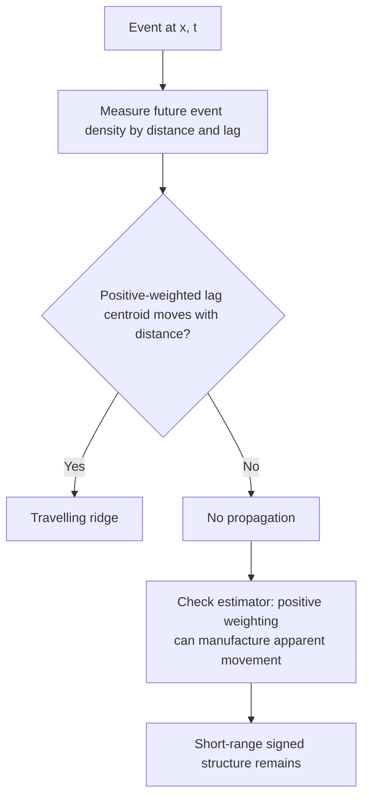
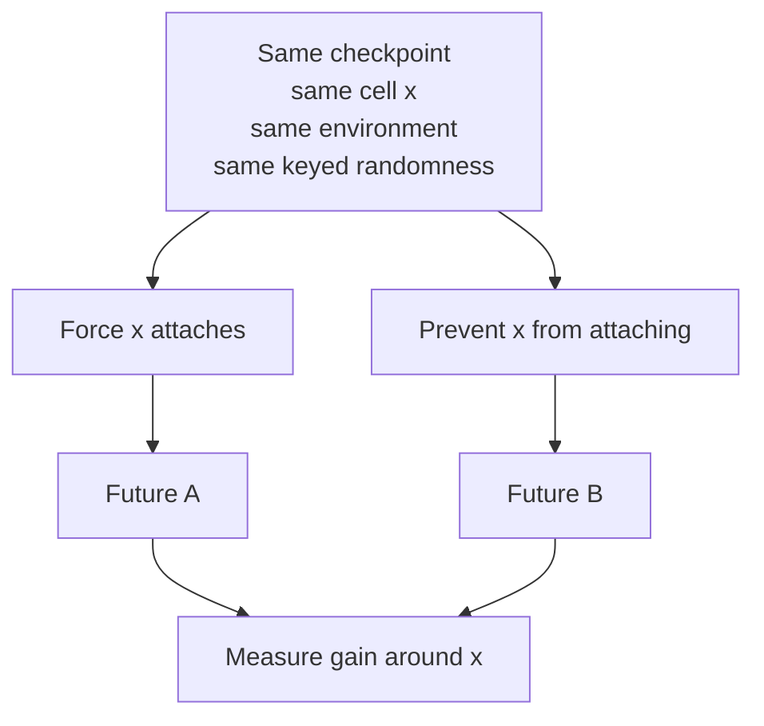
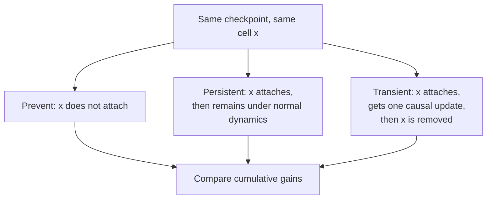
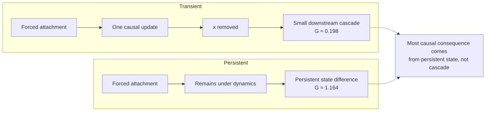
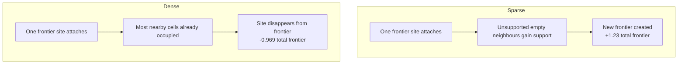
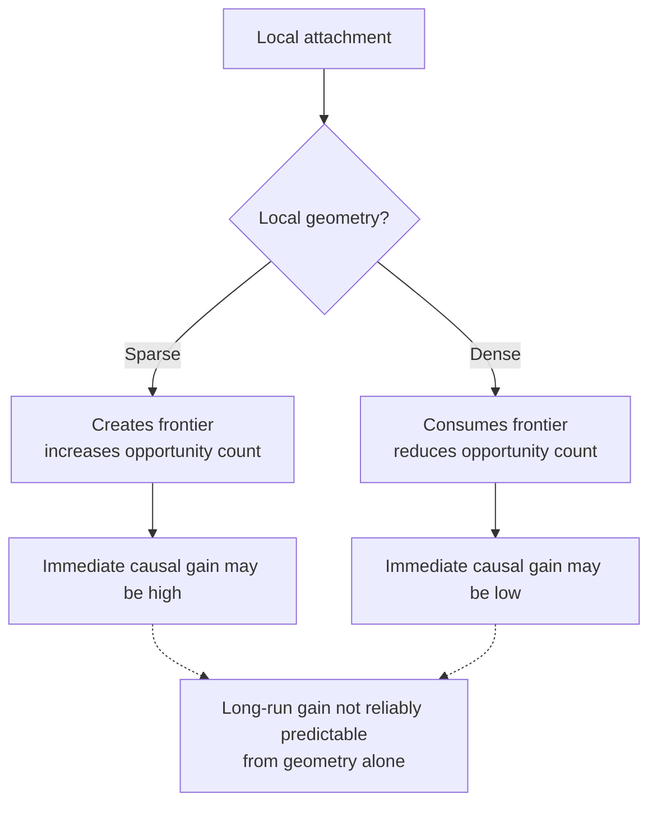
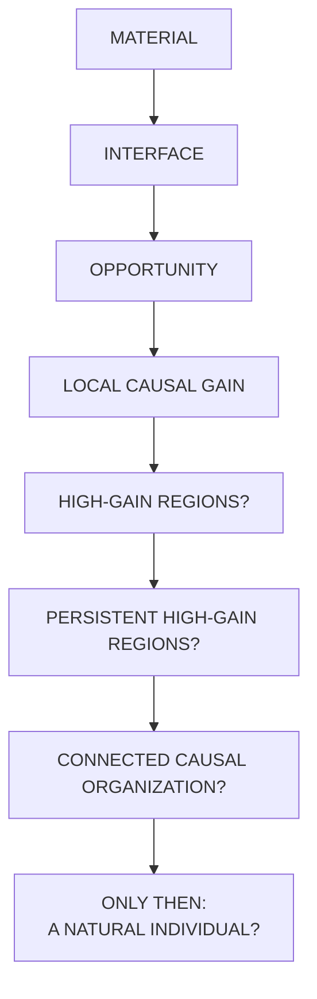

+++
title = "23: What Does One Attachment Cause?"
date = "2026-08-13T00:35:00+01:00"
draft = false
description = "After failing to find a propagating process field, Chapter 23 replaces correlation with intervention and asks what one additional Digital Crystal attachment actually causes."
weight = 23
categories = ["Programming", "Artificial Life"]
tags = ["Digital Life", "Digital Crystal", "Causality", "Cellular Automata", "Experimental Method"]
series = ["Digital Life From First Principles"]
+++

At the end of Chapter 22, the Digital Crystal had stopped looking like a simple bounded thing.

We had looked for a privileged region whose future belonged especially to itself.  
We had not found one.

What survived instead was locality.

Change something here, and the consequences are stronger nearby than far away.

That left a new possibility.

Perhaps the important object was not the crystal as a body.

Perhaps it was the process occurring across its changing interface.

The obvious next question seemed to be:

> **Does that process move?**

That question would consume most of this chapter.

It would also turn out to be the wrong one.

Not useless.

Wrong in a productive way.

Because after four experiments, the Digital Crystal gave us something more precise than motion.

It gave us a causal quantity.

One additional attachment can change what happens next.

The question is how much.

---

## From Boundary to Process

The previous chapters had gradually changed what counted as interesting.

Chapter 18 found that persistent state mattered only while it remained coupled to active construction.  
Chapter 20 found that loss manufactured new construction opportunity.  
Chapter 21 found that finite computation rationed which opportunities could even be evaluated.  
Chapter 22 found spatial causal locality, but no privileged enclosing boundary.

A common object was beginning to appear:

```text
CURRENT MATERIAL
↓
ACTIVE CONSTRUCTION OPPORTUNITIES
↓
EVALUATION
↓
ATTACHMENT OR LOSS
↓
NEW MATERIAL
↓
NEW OPPORTUNITIES
```

The material mattered.

But mostly because it changed what could happen next.


So Chapter 23 began with a process-first hypothesis.

If activity was genuinely propagating through the crystal, then activity near one place at time `t` should predict activity farther away at later times.

Not just:

```text
nearby things happen near nearby things
```

but something more structured:

```text
near distance
→ early lag

farther distance
→ later lag
```

A moving ridge through space-time.

That was Experiment V1.

---

## V1 — Does Active Process Propagate?

We defined an active process field from material-changing events.

The first version pooled:

```text
ATTACHMENT
+
LOSS
```

into a single material-event field.

For an event at position `x` and time `t`, we measured future event density at distance `d` and lag `tau`.

Each event was compared with a matched non-event location sharing local geometric context.

A second control compared the source run against future event fields from another run at the same relative stage.

That cross-run null mattered.

If ordinary crystal development itself created a distance-lag trend, then an apparent travelling ridge could exist even without continuity from the original event.

The primary statistic looked for a shift in the lag at which positive excess activity was concentrated as distance increased.

The experiment failed.

The real ridge moved too little.

Its displacement over the cross-run null was too small.

The paired test did not clear the frozen significance gate.

Yet two broad shape statistics passed.

For a moment, that looked tantalizing.

Distance and ridge lag were positively associated.

Perhaps a weak process was travelling after all.

Then we looked at the surface.

---

## The Estimator Had Manufactured a Story

At distance one, the real event field showed a small positive excess at the first lag and negative excess afterwards.

The positive-weighted centroid therefore collapsed to:

```text
lag = 1
```

At farther distances, where the surface was mostly weak noise, the same positive weighting produced centroids near the middle of the lag grid.

The resulting statistic looked approximately like:

```text
distance 1
→ early lag

far distance
→ later lag
```

But there was no moving ridge.

There was:

```text
one strongly anchored near-distance row
+
far-field noise centred by the estimator
```

Had we frozen a slightly weaker threshold, this could have passed.

We might then have written a chapter about propagation that was actually caused by the geometry of the estimator.

That was the most important result of V1.

Not propagation.

A methodological warning:

> **An estimator can manufacture the shape of the phenomenon it was designed to detect.**

The strongest signal in the entire V1 surface was not positive.

It was a persistent negative band at short range.

And the positive-weighted ridge statistic had discarded it before inference.

So we did not tune V1.

We closed the propagation claim as failed.

Then we asked what that signed short-range structure meant.



---

## V2 — Is the Interface a Source/Sink Field?

One tempting interpretation was that attachment consumed local interface while loss created it.

That gave a simple physical picture:

```text
LOSS
→ SOURCE

ATTACHMENT
→ SINK
```

Chapter 20 already gave strong independent reason to expect:

```text
LOSS
↓
empty site
↓
new attachment opportunity
↓
rapid reoccupation
```

So V2 separated the pooled event field into transition channels.

Sources:

```text
attachment
loss
```

Targets:

```text
attachment
loss
reoccupation
first occupation
```

It also removed the positive centroid entirely.

All statistics remained signed.

Negative lags were added so that forward temporal structure could be separated from static geometric selection.

The experiment again failed to support the story we expected.

And this time the failure was more informative.

---

## The Zero-Distance Trap

The first interpretation of V2 suggested:

```text
loss
→ more future attachment

attachment
→ more future attachment
```

But the source and control states at distance zero were definitionally different.

At `d = 0`:

```text
attachment source
= occupied

attachment control
= empty
```

and:

```text
loss source
= empty

loss control
= occupied
```

Those differences automatically alter what events are possible at the same site later.

They are not neighbourhood dynamics.

Once `d = 0` was separated from the analysis, the neighbourhood result became much cleaner.

At distances one and two:

```text
ATTACHMENT
→ MORE nearby attachment

LOSS
→ LESS nearby attachment
```

The effect decayed rapidly with distance.

By roughly distance three, it was close to the scale of the remaining background structure.

The simple source/sink hypothesis was wrong.

But the reversal immediately suggested a simpler explanation.

---

## The Rule Already Contains Local Gain

The Digital Crystal attachment rule rewards occupied neighbours.

Schematically:

```text
attachment score
=
base tendency
+
neighbor gain
+
signal effect
+
anisotropy
-
crowding
```

The neighbour term is positive.

So if an empty frontier site `x` becomes occupied:

```text
x attaches
↓
nearby empty cells gain an occupied neighbour
↓
their attachment probability can increase
```

Likewise, if an occupied cell disappears:

```text
x is lost
↓
nearby candidates lose an occupied neighbour
↓
their attachment probability can decrease
```

That explanation was almost embarrassingly simple.

Which made it exactly the kind of explanation we needed to test.

The observational V2 result could still be confounded.

The sites that actually attached were not random frontier sites.

They may already have occupied a favourable local trajectory.

So V3 stopped observing naturally selected events.

It intervened.

---

## V3 — Force One Attachment

The new experiment began from the same checkpoint and the same eligible frontier cell.

Then the future split:

```text
SAME CHECKPOINT
SAME CELL x
SAME ENVIRONMENT
SAME KEYED RANDOMNESS

        ┌──────────────┐
        │              │
     FORCE          PREVENT
   x attaches       x does not
        │              │
        └──────┬───────┘
               ↓
        compare futures
```

The intervention site itself was excluded from every causal-gain measurement.

That mattered.

We were no longer asking whether two different states at `x` remained different.

We were asking what happened around `x` because the state had been changed.



Before observing the realized first future update, we also calculated what the frozen rule mechanically predicted.

Call that:

```text
g_mech_1
```

Then we measured the realized one-step neighbouring gain:

```text
g1
```

And finally the cumulative finite-horizon construction gain:

```text
G_H
```

over ten updates.

That separation was deliberate.

A causal effect should not automatically be called emergence.

If the local rule already predicts it, then the rule deserves the credit.

---

## The First-Step Effect Was Almost Entirely Mechanical

The V3 run found approximately:

```text
mechanically expected one-step gain
g_mech_1 ≈ 0.105

realized one-step gain
g1 ≈ 0.115
```

The discrepancy interval included zero and remained inside the frozen accounting tolerance.

So the immediate causal effect was real.

But it was not mysterious.

> **Forcing one frontier attachment caused additional next-update neighbouring construction, and the magnitude was consistent with the frozen local attachment mechanics at the tested precision.**

That was one of the cleanest results in the project.

For once we were not comparing a measured quantity against zero.

We were comparing it against what the mechanism already gave us for free.

And the mechanism survived.

---

## Then the Effect Kept Going

The ten-update cumulative gain was larger:

```text
G_10 ≈ 0.58
```

Only a small fraction of that appeared in the first update.

Later updates contributed additional construction differences.

At first this looked like a cascade.

Perhaps one attachment caused other attachments, which caused still more attachments.

The temptation was to compare the gain against the classical branching reference:

```text
1 additional event
per initiating event
```

The ten-update interval sat below one.

But that interpretation contained a hidden assumption.

The forced cell remained in the lattice.

It was not merely an event that happened and finished.

It was a persistent state change.

And the lag profile had not obviously converged by ten updates.

So V3 had mixed two possibilities:

```text
TRANSIENT CASCADE

and

CONTINUING CONSEQUENCE
OF A PERSISTENT OCCUPANCY DIFFERENCE
```

Those are not the same phenomenon.

We needed one final decomposition.

---

## V4 — Persistent State Versus Transient Cascade

V4 repeated the force/prevent experiment on a fresh seed.

Ninety-six independent groups were used.

All 96 passed the coverage gates.

There were 384 interventions across four predeclared frontier-probability strata.

Capacity remained far from the hard lattice boundary.

The intervention timing was also corrected.

Force and prevent now occurred inside the canonical growth update.

Then the ordinary loss step was applied to every branch.

The forced cell therefore faced the same background loss rule as an ordinary newly attached cell.

Each probe created three futures:

```text
PREVENT
x does not attach

PERSISTENT
x is forced to attach
and then remains under normal dynamics

TRANSIENT
x is forced to attach
it gets one full causal update
then x is removed
```

The transient arm was the key.

It allowed the original attachment to influence its neighbours once.

Then the direct continuing support from `x` disappeared.

If the downstream process could sustain itself, the transient branch should continue to separate from prevent.

If not, its gain should die away.

The observation window was extended to thirty updates.



---

## Immediate Gain Replicated

The mechanical one-step expectation in V4 was:

```text
g_mech_1
= 0.0883
95% CI
[0.0676, 0.1095]
```

The realized neighbouring gain was:

```text
g1
= 0.1016
95% CI
[0.0677, 0.1380]
```

and the discrepancy was:

```text
g1 - g_mech_1
= 0.0132
95% CI
[-0.0160, 0.0411]
```

The frozen accounting verdict remained:

```text
CONSISTENT WITH MECHANICS
```

So the direct local causal effect had now replicated on a fresh experiment.

That part of the story was no longer tentative.

---

## The Transient Cascade Was Small

After thirty updates, the transient arm had accumulated:

```text
G_transient(30)
= 0.198
95% CI
[-0.026, 0.440]
```

More important than the cumulative number was the late-time behaviour.

Across updates 21 through 30:

```text
transient late gain
= -0.0081 per update

95% CI
[-0.0201, 0.0039]
```

That passed the frozen practical-convergence criterion.

The transient trajectory did not continue accumulating positive construction at a meaningful late rate.

Once the initiating occupancy was removed, the downstream effect became small and exhausted itself.

That is the cleanest answer Chapter 23 obtained.

> **The Digital Crystal supports local causal amplification, but under this protocol the transient cascade is small and converges.**

The thirty-update transient gain was also entirely below the descriptive reference value of one.

The experiment records that result as:

```text
TRANSIENT_GAIN_BELOW_ONE_REFERENCE
```

but deliberately does not call it a branching ratio or proof of subcriticality.

That distinction stays.

---

## Persistent State Was Different

The persistent arm told a very different story.

At thirty updates:

```text
G_persistent(30)
= 1.164

95% CI
[0.786, 1.542]
```

while:

```text
G_transient(30)
= 0.198
```

The cumulative difference between the two arms was:

```text
G_persistent(30)
-
G_transient(30)

= 0.966

95% CI
[0.612, 1.333]
```

The continuing state difference therefore contributed much more to the thirty-step causal consequence than the free-running transient cascade.

That gives us a distinction worth keeping:

```text
PERSISTENT STATE CHANGE
≠
TRANSIENT CAUSAL CASCADE
```



But V4 also killed another attractive interpretation.

---

## There Was No Permanent Positive Growth Offset

One concern after V3 was that the persistent arm might simply grow a little faster forever.

If that were true:

```text
gain per update
≈ constant positive c
```

and cumulative gain would rise roughly linearly with the chosen horizon.

At thirty updates, that was not what we found.

The frozen late-window persistent gain was:

```text
0.0057 per update

95% CI
[-0.0159, 0.0281]
```

far below the predeclared positive-offset threshold and with an interval spanning zero.

The cumulative persistent trajectory instead rose early and then flattened into noisy variation:

```text
H=1      0.156
H=5      0.539
H=10     0.839
H=17     1.008
H=22     1.190
H=30     1.164
```

So the persistent effect was neither:

```text
a freely propagating cascade
```

nor:

```text
a permanent constant-rate growth advantage
```

It was a finite consequence of keeping one state difference around long enough for it to reshape later opportunities.

The frozen verdict was therefore:

```text
TRANSIENT CASCADE
CONVERGES

PERSISTENT POSITIVE LATE OFFSET
NOT ESTABLISHED
```

---

## Opportunity Is Not One Thing

V3 had contained one more striking clue.

The causal effect varied dramatically depending on which frontier cell was forced.

V4 made those strata explicit.

The lowest-probability probe typically sat in sparse geometry.

Its mean baseline attachment probability was about:

```text
0.372
```

and it had almost exactly one occupied neighbour.

Forcing it promoted approximately:

```text
2.23
```

new ring-one cells into the frontier.

The total frontier changed by approximately:

```text
+1.23
```

sites.

At the highest-probability probe, the geometry was almost the opposite.

Baseline attachment probability was about:

```text
0.798
```

with roughly:

```text
4.07 occupied neighbours
```

Forcing the site promoted almost no new frontier:

```text
0.031
```

cells on average.

And total frontier changed by approximately:

```text
-0.969
```

sites.

The same action therefore meant different things in different local geometry.

---

## Sparse and Dense Interfaces

At a sparse interface:

```text
one frontier site attaches
↓
previously unsupported empty neighbours
gain their first occupied neighbour
↓
new frontier is created
```

At a dense interface:

```text
one frontier site attaches
↓
most nearby cells are already occupied
or already eligible
↓
the attached site itself disappears
from frontier
↓
little new frontier is created
```



The paired difference was enormous.

Low-probability probes created about:

```text
2.20
```

more frontier sites than high-probability probes.

The 95% interval was approximately:

```text
[1.99, 2.41]
```

with:

```text
p = 0.000125
```

The same difference appeared in newly promoted neighbouring frontier sites.

This is now established.

> **Sparse and dense frontier locations respond very differently to the same one-cell attachment intervention.**

But one stronger idea did not survive.

---

## Geometry Did Not Yet Predict Long-Run Gain Reliably

The low-probability transient probe had a larger point estimate:

```text
G_transient(30)
≈ 0.677
```

while the high-probability probe was:

```text
≈ 0.073
```

That looks dramatic.

But the predeclared paired low-versus-high comparison was:

```text
difference
= 0.604

95% CI
[-0.031, 1.271]

p
= 0.0777
```

The persistent comparison was even less convincing:

```text
difference
= 0.156

p
= 0.810
```

So the chapter must stop here.

We have established:

```text
SPARSE GEOMETRY
≠
DENSE GEOMETRY
```

We have not established:

```text
SPARSE GEOMETRY
→
RELIABLY HIGHER LONG-RUN CAUSAL GAIN
```

The point estimates make that relationship interesting.

They do not make it true.

---

## Local Gain Is Not Global Gain

The finite evaluation budget also leaves a weak system-wide footprint.

Persistent local gain at thirty updates was:

```text
1.164
```

but global gain excluding the intervention site was:

```text
1.036
```

For the transient arm:

```text
local
0.198

global
0.044
```

The implied far-field differences were negative:

```text
persistent
-0.128

transient
-0.154
```

but their intervals still overlapped zero.

The candidate-selection sets nevertheless remained extremely similar between branches, typically overlapping by more than 99 percent.

So finite computation does introduce some non-local redistribution, but the intervention does not wholesale rewrite the global schedule.

Most of the measurable effect remains local.

---

## What Survived the Hypothesis?

Chapter 23 began with a hypothesis about motion.

That hypothesis failed.

What survived was more useful.

### Predeclared claim

> Local process activity propagates through space-time as a reproducible distance-lag structure beyond ordinary geometry and developmental progression.

**Status: FAILED**

V1 did not establish a travelling process ridge.

The estimator itself was shown capable of turning a strong local signed feature plus far-field noise into apparent displacement.

### Stronger interpretation

> The active interface behaves as a simple source/sink field in which loss creates interface and attachment consumes it.

**Status: FAILED**

After zero-distance eligibility effects were separated, the neighbourhood signs were opposite to that interpretation.

### Surviving causal phenomenon

> Forcing one eligible Digital Crystal frontier attachment causes additional neighbouring construction during the next update.

**Status: SUPPORTED**

The direct result replicated across V3 and V4.

### Mechanistic accounting

> The immediate neighbouring causal gain is quantitatively consistent, at the tested precision, with the attachment probability changes mechanically implied by the frozen local rule.

**Status: SUPPORTED**

V4 measured:

```text
g_mech_1
≈ 0.088

realized g1
≈ 0.102

discrepancy
≈ 0.013
CI includes zero
```

### Transient causal cascade

> After the initiating occupancy is removed following one causal update, the remaining construction cascade is small and practically converges over the frozen thirty-update observation window.

**Status: SUPPORTED**

The late transient rate was indistinguishable from zero under the frozen criterion.

### Persistent-state consequence

> Keeping the intervention-induced occupancy difference produces a substantially larger accumulated construction consequence than removing it after one causal update.

**Status: SUPPORTED**

The thirty-update persistent-minus-transient difference was:

```text
0.966
95% CI
[0.612, 1.333]
```

### Persistent positive late-rate offset

> The persistent branch retains a scientifically meaningful positive construction-rate offset at late times.

**Status: FAILED**

The frozen late-window mean was too small and its interval included zero.

### Frontier-geometry heterogeneity

> Sparse and dense intervention sites differ strongly in how much frontier geometry one attachment creates or consumes.

**Status: SUPPORTED**

The paired low-versus-high frontier difference was about `2.20` sites with a narrow interval and `p = 0.000125`.

### Geometry determines long-run gain

> Sparse frontier geometry produces reliably greater thirty-update causal gain than dense frontier geometry.

**Status: FAILED / NOT ESTABLISHED**

The transient point estimate was larger in sparse regions, but the frozen paired comparison did not clear the significance gate.

---

## The Causal Opportunity Principle

The Digital Crystal now suggests a refinement of the Interface Principle.

The active interface is not simply a set of empty cells adjacent to occupied cells.

Its local causal structure depends on what an event does to future opportunity.

One attachment can:

```text
remove one current frontier opportunity
```

while simultaneously:

```text
increase support for nearby candidates
```

or:

```text
create entirely new frontier sites
```

depending on local geometry.

That means we need to distinguish:

```text
OPPORTUNITY COUNT

from

OPPORTUNITY STRENGTH

from

REALIZED CONSTRUCTION

from

DOWNSTREAM CAUSAL GAIN
```

Those quantities are not interchangeable.

A site can reduce the number of frontier locations while increasing expected realized construction.

A sparse site can manufacture frontier.

A dense site can consume frontier.

And a locally strong immediate causal effect can still fail to sustain a free-running cascade.



This is a much richer object than the static boundary we went looking for in Chapter 22.

---

## The Crystal Does Not Carry the Event Forward

The most important negative result may be the simplest.

The event itself does not seem to travel.

After the initiating state change is removed, the causal consequence fades.

There is local influence.

There is downstream consequence.

There is finite amplification.

But we did not find a self-sustaining propagating process.

So the progression is now:

```text
LOCAL EVENT
↓
LOCAL RULE CHANGES FUTURE PROBABILITIES
↓
SHORT-RANGE CAUSAL GAIN
↓
SOME DOWNSTREAM CONSEQUENCE
↓
ATTENUATION
```

not:

```text
LOCAL EVENT
↓
TRAVELLING PROCESS
↓
SELF-SUSTAINING CAUSAL FIELD
```

That distinction matters enormously for the larger project.

The Digital Crystal can remember consequences in its material.

It can create and destroy construction opportunity.

One local change can alter later local construction.

But causal influence does not automatically organize itself into a persistent process.

Something else would be required.

---

## Maybe the Important State Is Opportunity

The crystal began this book as occupied cells.

Then morphology became insufficient.

Checkpoint state mattered.

History became lossy.

Frontier accessibility mattered.

Loss became construction opportunity.

Finite computation rationed opportunity.

Now intervention tells us that the same material change has different immediate geometric consequences depending on where it occurs.

That suggests a new candidate experimental object:

```text
LOCAL CAUSAL OPPORTUNITY FIELD
```

Not a biological field.

Not an energy field.

Not a hidden substance.

Just an observer-defined description of where a state change would have high or low causal leverage on future construction.

For a location `x` at time `t`, we might eventually want something like:

```text
C(x,t)
=
{
    occupied-neighbour count,
    frontier creation potential,
    attachment probability,
    crowding,
    evaluation probability,
    transient causal gain
}
```

The question would no longer be:

> Where is the crystal?

Or:

> Where is the wave?

It would be:

> **Where can one local change meaningfully alter what the process does next?**

That is a different kind of map.

And unlike the boundaries we drew first, this one can be derived from intervention.

---

## What This Does Not Establish

Chapter 23 does not establish:

```text
a wave
an excitable medium
a Hawkes process
a branching process
a critical point
a phase transition
directed percolation
a self
an individual
autonomy
homeostasis
an organism
life
```

The experiment explicitly records those as forbidden overclaims.

It also does not establish that sparse geometry causes larger long-run gain.

That remains a candidate relationship.

And it does not establish that a thirty-update transient gain below one is a universal property of the substrate.

The result is conditional on this model, these parameters, this intervention, this horizon and this definition of causal gain.

---

## What We Have Earned

We have earned something narrower and more useful.

> **A local Digital Crystal attachment has measurable causal leverage on subsequent construction. Its immediate effect is consistent with the frozen local attachment mechanics. When the initiating occupancy is removed after one causal update, the remaining cascade is small and converges over the tested horizon. Keeping the occupancy difference produces a substantially larger accumulated consequence, but no persistent positive late-rate offset was established. Sparse and dense frontier locations differ strongly in how an attachment changes future construction opportunity, although a corresponding difference in long-run causal gain remains unconfirmed.**

That is not life.

It is not individuality.

It is not even a coherent process yet.

But it is something we did not have before Chapter 23.

A measured causal leverage of local state.

---

## Next: Where Is Causal Gain Created?

The obvious next experiment is no longer a search for a boundary.

Nor should we immediately sweep a global parameter and announce a critical point.

The substrate has already shown us that local geometry matters.

So Chapter 24 should begin there.

Map the conditions under which an intervention has high or low transient causal gain.

Then ask whether high-gain regions are:

```text
rare
common

isolated
clustered

momentary
persistent

disconnected
connected through space-time
```

Only after that would it make sense to ask whether a change in global neighbour coupling or computational budget moves the system into a new collective regime.

The research path has changed again:



Chapter 23 began by asking whether the process moved.

It did not find a travelling process.

It found something more basic.

A local event can change the future.

But whether that influence becomes organization depends on where the event happens, how long its state persists, and whether the consequences can survive after the original cause is gone.

That is the next frontier.
