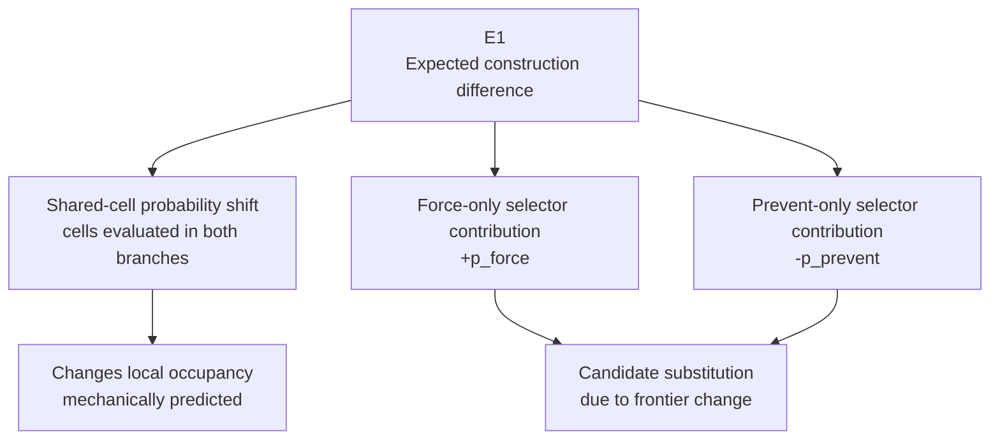
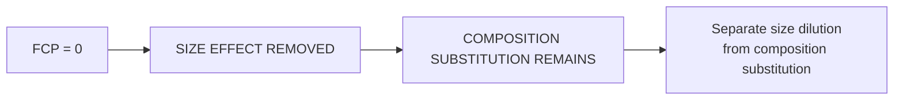
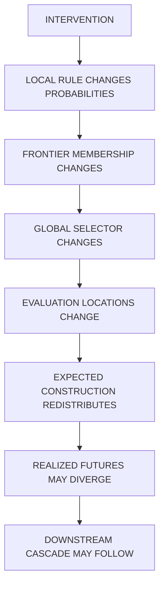

+++
title = "24: Where Is Causal Gain Created?"
date = "2026-08-13T10:03:00+01:00"
draft = false
description = "A reset of Chapter 24 reveals that local causal effects are redistributed through a finite global evaluation budget. The strongest result is not a local gain field, but a selector-mediated far-field effect that follows frontier change."
categories = ["Programming", "Artificial Life"]
tags = ["Digital Life", "Digital Crystal", "Causality", "Finite Computation", "Cellular Automata", "Experimental Method"]
series = ["Digital Life From First Principles"]
+++

Chapter 23 ended with a controlled causal effect.

Take the same Digital Crystal checkpoint.  
Take the same eligible frontier cell.  
Give both futures the same environment and the same cell-keyed randomness.  
Then force the cell to attach in one future and prevent it from attaching in the other.

```text
SAME CHECKPOINT
SAME CELL
SAME FUTURE RANDOMNESS

FORCE x
vs
PREVENT x

↓
MEASURE DIFFERENCE
```

The intervention changed subsequent construction.

The immediate neighbouring effect was measurable.

A small downstream consequence could survive after the initiating cell was removed.

That gave us something real:

> **A local intervention can causally change the future of the Digital Crystal.**

Chapter 24 began with what seemed like the obvious next question.

> **Where is that causal gain created?**

Perhaps some frontier locations were intrinsically high-gain.

Perhaps sparse interface geometry amplified a perturbation while dense geometry suppressed it.

Perhaps the crystal contained a hidden causal field that could be mapped.

We spent several experiments trying to find it.

The first versions of Chapter 24 were built around that idea.

They were useful.

They were also wrong in important ways.

The final experiments changed the question.

The strongest result of Chapter 24 is no longer:

```text
WHERE IS THE GAIN?
```

It is:

```text
WHERE DOES THE CAUSAL DIFFERENCE GO?
```

And the answer leads directly to a digital-native constraint:

> **A finite global evaluation budget couples otherwise local construction processes by changing which frontier opportunities are allowed to be evaluated.**

That is the chapter.

---

## The First Mistake: Treating Gain as One Number

Chapter 23 had already warned us that several causal quantities were different.

A local intervention could change:

```text
expected construction
realized construction
probability of path divergence
where construction occurs
total construction
```

Those are not the same measurement.

But the first Chapter 24 experiments compressed them into one noisy quantity:

```text
G_T(H)
```

the finite-horizon FORCE-minus-PREVENT attachment difference.

That gave us a seductive picture:

```text
LOCAL GEOMETRY
↓
LOCAL CAUSAL GAIN
↓
DOWNSTREAM CASCADE
```

The problem was that `G_T(H)` mixes several mechanisms.

A perturbation can change the probability distribution without changing the signed expected count.

Two futures can diverge while their net attachment counts cancel.

A local increase can be offset by a distant decrease.

And under a finite evaluation budget, changing one part of the frontier can change which completely different cells are evaluated elsewhere.

So before asking where gain was stored, we needed to separate:


It took four versions of the experiment to get there.

---

## V1 — Frontier Creation Potential

The first attempt introduced a simple geometric observer.

For an eligible frontier site `x`:

```text
FCP(x)
=
|frontier after forcing x occupied|
-
|frontier before forcing x|
```

We called it **Frontier Creation Potential**.

If `FCP > 0`, occupying `x` created more frontier opportunities than it consumed.  
If `FCP = 0`, the frontier count stayed unchanged.  
If `FCP < 0`, the intervention consumed more frontier opportunity than it created.

The original hypothesis was:

> **Sites that create more frontier opportunity will produce greater transient causal gain.**

The first run looked promising but was badly designed for the effect size it claimed to test.

It used only 48 independent groups.

The achieved confidence interval around the high-minus-low transient gain was roughly:

```text
+0.167
95% CI [-0.078, +0.431]
```

while the declared smallest meaningful effect was:

```text
+0.15
```

The interval was far too wide to distinguish an effect at that scale.

That is not a scientific failure of the hypothesis.  
It is an inconclusive experiment.

There was another problem.

For a frontier intervention:

```text
FCP
=
promoted_frontier - 1
```

identically.

The original analysis treated the agreement between those quantities as construct validation.  
It was not.  
It was a consistency check between two expressions of the same geometry.

That belongs in an assertion, not in the evidence ledger.

The first lesson of Chapter 24 was methodological:

> **A failed significance gate does not become a negative result unless the experiment had enough precision to resolve the effect it claimed mattered.**

---

## V2 — Exact Local Motifs

The second attempt asked whether FCP was simply too compressed.

A frontier cell on the hexagonal lattice has six immediate neighbours.  
Each can be occupied or empty.

So its ring can be represented as six bits:

```text
b0 b1 b2 b3 b4 b5
```

There are 64 raw patterns and far fewer once rotation and reflection are treated as equivalent.

Perhaps exact local arrangement mattered.

The experiment compared **cross-motif pairs** against **same-motif pairs** while matching several scalar properties.

That experiment was even less precise than V1.  
Its primary confidence interval had a half-width of roughly `0.50 attachments` against a declared meaningful effect of `0.20`.

So again: **inconclusive**, not **failed**.

The experiment did teach us something else.

Matching on baseline attachment probability could condition away part of the very mechanism geometry was allowed to influence.

The frozen attachment rule depends on local exposure geometry.

So:

```text
LOCAL MOTIF
↓
ATTACHMENT PROBABILITY
```

can itself be part of the causal path.

Conditioning tightly on that probability asks a narrower question:

> Does motif have an additional residual effect after one of its consequences has been held fixed?

That was not the broad geometric question we thought we were asking.

---

## V3 — Recent Process History

The third attempt moved from geometry to process.

Two frontier sites can look the same now while having experienced different recent histories.

So V3 measured six recent updates of:

```text
attachments
losses
reoccupations
first occupations
evaluations
```

and defined:

```text
RECENT TURNOVER
=
recent attachments
+
recent losses
```

High-turnover and low-turnover sites were matched tightly on present local state.

The manipulation was large:

```text
high - low recent turnover
≈ +7.73 events
```

Yet the transient gain difference was:

```text
-0.065
95% CI [-0.221, +0.096]
```

The positive side of that interval genuinely excluded the predeclared `+0.15` effect.

But there was a deeper problem.

The substrate used for V3 had no independent causal memory state.  
Persistent material modification was disabled.

The operative dynamics were Markov in current occupancy, current input and keyed randomness.

So recent history could influence the future only through the present state it had already created.

V3 therefore did not test:

> Does history itself matter?

It tested:

> Does recent turnover proxy for something about current state that our matching failed to capture?

That is a useful calibration test.  
It is not evidence that history-dependent digital substrates cannot exist.

---

## Reset

At this point Chapter 24 could have become an endless feature search.

```text
FCP
↓
motif
↓
history
↓
bigger motif?
↓
classifier?
↓
another window?
```

That would have violated the method of the book.

So we stopped.

Then we rebuilt the experiment from zero.

The reset kept the frozen Digital Crystal.  
It kept the FORCE/PREVENT intervention.  
But it changed the measurement stack.

Instead of beginning with the noisy realized cascade, V4 began with the rule itself.

---

## V4 — Measure the Mechanism Before the Outcome

The reset used an extreme frontier-geometry contrast.

Only sites satisfying:

```text
HIGH:
FCP >= +2

LOW:
FCP <= -1
```

were eligible.

Every pair therefore differed by at least:

```text
ΔFCP = 3
```

The pair design retained the same occupied-neighbour count and radial band.  
It deliberately stopped matching baseline attachment probability or local frontier density.  
Those quantities could be part of the pathway.

The full run used:

```text
384 independent groups
```

and produced:

```text
275 usable groups
471 extreme pairs
71.6% coverage
```

The result was precise enough to test the declared effects.

---

## Exact Expected Construction

Before drawing any lag-one Bernoulli outcomes, V4 calculated:

```text
E1
=
Σ p_force(candidate)
-
Σ p_prevent(candidate)
```

using the actual branch-specific evaluated candidate sets.

This is the conditional expected construction difference before thresholding probabilities into realized attachments.

That distinction matters.

A realized attachment is a single bit:

```text
attach
or
do not attach
```

But the rule gives us the full probability shift.

Why throw that information away?

The primary V4 result was the high-minus-low difference in expected local construction.

It was approximately:

```text
ΔE1
= -0.0026

95% CI
[-0.0395, +0.0333]
```

The achieved one-sided 80% minimum detectable effect was about:

```text
0.047
```

against a frozen smallest meaningful effect of:

```text
+0.10
```

This time the experiment really had the precision.

So we could finally say:

> **The extreme FCP contrast does not produce a scientifically meaningful positive difference of +0.10 or more in expected lag-one local construction under this protocol.**

That is a bounded negative.

The original V1 question was now properly resolved.

More frontier creation did not mean more net expected local construction.

But something else was happening.

---

## The Wrong Comparison

V4 initially tempted us toward another story.

High-FCP interventions appeared more likely to make the FORCE and PREVENT futures diverge.

But a fresh-seed V5 did not cleanly replicate that class difference.

The important result survived elsewhere.

The breakthrough came from decomposing the expected effect rather than comparing only its total.

---

## V5 — Causal Accounting

For every lag-one intervention, expected construction can be split into three terms:

```text
E1
=
SHARED-CELL PROBABILITY SHIFT
+
FORCE-ONLY SELECTOR CONTRIBUTION
+
PREVENT-ONLY SELECTOR CONTRIBUTION
```

The first term comes from cells evaluated in both branches.  
Their probability can change because local occupancy changed.

The other two terms come from candidate substitution.

A cell evaluated only in FORCE contributes `+p_force`.  
A cell evaluated only in PREVENT contributes `-p_prevent`.



This decomposition exposed the actual mechanism.

---

## The Supported Regime Was Narrower Than We Thought

Every extreme V5 pair had:

```text
occupied neighbours n = 1
```

All:

```text
467 / 467 pairs
```

were single-contact frontier sites.

That immediately narrows the claim.

Chapter 24 is not establishing a universal law over every frontier geometry.  
It is establishing a mechanism in the supported `n = 1` regime.

The baseline probability of the focal site was also identical across the two classes:

```text
HIGH p ≈ 0.38041
LOW  p ≈ 0.38041
```

This is explained by the hexagonal symmetry of the frozen rule for single-contact sites.

So we obtained an unusually clean contrast.

The focal site itself had the same immediate attachment probability.  
What differed was what occupying it did to the surrounding frontier.

---

## Two Geometries, Similar Local Effect

The absolute lag-one expected local effects were:

```text
HIGH FCP
local E1 ≈ +0.159

LOW FCP
local E1 ≈ +0.128
```

Their difference was only about `+0.031`, with an interval crossing zero.

This is the real compensation result.

The two geometry classes produced broadly similar positive local expected construction.  
But they produced it through radically different computational pathways.

| Term | HIGH FCP | LOW FCP |
|------|----------|---------|
| Shared-cell shift | ≈ +0.017 | ≈ +0.123 |
| Selector-swap term | ≈ +0.141 | ≈ +0.005 |
| **Local expected effect** | **≈ +0.159** | **≈ +0.128** |

The contrast is not:

```text
one class has causal gain
the other does not
```

It is:

```text
SIMILAR LOCAL EFFECT
↓
DIFFERENT COMPUTATIONAL PATHWAYS
```

That is much more interesting.

---

## Some Things Are Assertions, Not Findings

The reset also forced us to separate code identities from scientific measurements.

At lag one, FORCE and PREVENT differ locally around `x`.

For any shared evaluated cell farther than one lattice step from `x`, the frozen local rule sees exactly the same ring-one occupancy in both branches.

Therefore:

```text
shared_shift_far = 0
```

is not an empirical discovery.  
It follows from the rule.

Likewise:

```text
E1_far_exact
=
swap_total_far
```

because the shared far-field term is zero and the accounting decomposition is exact.

Those are excellent correctness controls.  
They would catch a bug.  
But they do not belong in the scientific findings.

A useful standing rule emerges:

> **If a quantity has exactly zero variance across hundreds of independent groups because of the program structure, it belongs in an `assert`, not in a bootstrap confidence interval.**

---

## The Strong Result: Far-Field Redistribution

Now look at the lag-one far field.

For HIGH FCP:

```text
ΔF = +2

far-field expected effect
≈ -0.117
```

For LOW FCP:

```text
ΔF = -1

far-field expected effect
≈ +0.063
```

Both are outside the local nearest-neighbour causal cone.

No signal propagated there.  
No wave travelled across the lattice.  
The coupling came from the selector.

The evaluation budget remained fixed:

```text
B = 96
```

frontier opportunities could be evaluated.

If a local intervention changed the frontier, the selector had to choose a different set of candidates.

Some distant opportunities were dropped.  
Others were added.

The local action changed the global candidate population.

That is the mechanism.


---

## The Parameter-Free Ratio

The sharpest quantitative result of V5 does not require fitting a free coefficient.

The extreme classes have:

```text
HIGH:
ΔF = +2

LOW:
ΔF = -1
```

If the far-field selector effect follows:

```text
far-field effect ∝ -ΔF
```

then the predicted ratio is:

```text
HIGH : LOW
=
-2 : +1
```

The observed far-field effects were:

```text
HIGH
-0.117

LOW
+0.063
```

So:

```text
observed ratio
=
-0.117 / +0.063
≈ -1.86
```

against:

```text
predicted ratio
=
-2.00
```

This is the cleanest evidence in the chapter.

No fitted slope is needed to obtain the ratio.  
No post-hoc threshold is required.  
The sign flips exactly as predicted.  
The magnitude ratio is close to the parameter-free expectation.

The core empirical statement is therefore:

> **Within the supported single-contact frontier regime at `B = 96`, the selector-mediated far-field effect follows the sign and approximate magnitude expected from the change in frontier size: creating two frontier opportunities produces roughly twice the opposite far-field effect of removing one.**

That is stronger than saying only that a far-field effect exists.  
It says the effect carries the quantitative signature of frontier dilution under fixed computational capacity.

---

## What the Budget Actually Conserves

It is tempting to say the budget conserves construction.

It does not.

What remains fixed is:

```text
NUMBER OF EVALUATIONS
=
B
```

not:

```text
NUMBER OF ATTACHMENTS
```

Expected attachments are:

```text
Σ p(candidate)
```

over whichever `B` cells happen to be selected.

Change the candidate set and that sum can change.

So the correct statement is:

> **Finite budget conserves evaluation capacity, not attachment count.**

That distinction explains the V5 local/global accounting.

For HIGH FCP:

```text
local E1     ≈ +0.159
far E1       ≈ -0.117
──────────────────────
global E1    ≈ +0.042
```

Most of the positive local effect is offset by far-field suppression.

For LOW FCP:

```text
local E1     ≈ +0.128
far E1       ≈ +0.063
──────────────────────
global E1    ≈ +0.191
```

Here the local and far-field effects reinforce.

A fixed number of evaluations does not imply zero net expected construction.

It implies competition over **which opportunities receive those evaluations**.

That is a very different kind of conservation law.

---

## Selector Dilution

A first-order approximation follows naturally.

Let:

```text
F
```

be frontier size and:

```text
B
```

the fixed evaluation budget.

Then an arbitrary frontier opportunity is evaluated at roughly:

```text
B / F
```

when:

```text
B < F
```

If a local intervention changes frontier size by:

```text
ΔF
```

then the global evaluation probability of distant opportunities shifts.

A first-order far-field approximation is:

```text
E_far
≈
-(ΔF / F)
×
(B / F)
×
Σ p_far
```

The V5 approximation cleared its frozen aggregate residual tolerance.

But its per-intervention correlation was only moderate.

So we should not pretend the formula predicts every individual intervention.

The stronger claim is narrower:

> **The aggregate far-field effect is consistent with the expected sign and scale of fixed-budget selector dilution, and the parameter-free `-2:1` ratio provides the clearest confirmation in the tested extreme-FCP classes.**

That is enough.

Chapter 25 will test the approximation as a general law.

---

## The FCP = 0 Control We Have Not Yet Used

The Digital Crystal also contains frontier sites with:

```text
FCP = 0
```

There, the local intervention does not change total frontier size.

It can still change frontier composition:

```text
x leaves
one other opportunity enters
```

So the size-dilution term predicts:

```text
0
```

while candidate composition can still produce substitutions.

That gives us a powerful next control:



This is not needed to close Chapter 24.  
It belongs in the next budget experiment.

But it tells us exactly how to separate:

```text
frontier-size dilution
```

from:

```text
frontier-composition substitution
```

without inventing a new observer.

---

## What Happened to the Divergence Story?

V4 suggested that high-FCP interventions might mainly change:

```text
P(PATH DIVERGES)
```

rather than:

```text
CASCADE SIZE GIVEN DIVERGENCE
```

A fresh-seed V5 did not confirm that cleanly.

The realized lag-one divergence rates were approximately:

```text
HIGH  0.212
LOW   0.206
```

with a high-minus-low difference close to zero relative to the planned effect size.

Likewise:

```text
P(G_T != 0)
```

did not establish the expected class difference.

The conditional magnitude among nonzero cases also changed dramatically between seeds.

That is a calibration result.

Rare-event conditional summaries can look extremely compelling and still be unstable.

So Chapter 24 does not use them as the mechanism.

The mechanism is identified one level earlier:

```text
FRONTIER CHANGE
↓
GLOBAL SELECTOR CHANGE
↓
EXPECTED FAR-FIELD REDISTRIBUTION
```

That pathway is both cleaner and more reproducible.

---

## The Scientific Result

We can now state the Chapter 24 result without pretending we found a causal-gain field.

> **Within the tested single-contact Digital Crystal frontier regime at a fixed evaluation budget of `B = 96`, a local attachment can immediately change expected construction outside its nearest-neighbour causal cone by altering the globally selected set of frontier candidates.**

More specifically:

```text
ΔF = +2
→
far-field expected effect ≈ -0.117

ΔF = -1
→
far-field expected effect ≈ +0.063
```

giving:

```text
observed ratio ≈ -1.86
predicted ratio = -2 : 1
```

The local mechanism is local.

The coupling mechanism is global.

That distinction matters.

---

## P005 — Finite-Budget Redistribution

The phenomenon ledger can now promote a new entry.

**Finite-Budget Redistribution**

**Status: SUPPORTED**

Operational statement:

> **Under a fixed global evaluation budget, a local change in frontier geometry can immediately alter which distant construction opportunities are evaluated, producing expected far-field construction differences outside the nearest-neighbour causal cone.**

Mechanism:

```text
LOCAL FRONTIER CHANGE
↓
FIXED-SIZE GLOBAL EVALUATION
↓
CANDIDATE SUBSTITUTION
↓
FAR-FIELD REDISTRIBUTION
```

Current scope:

```text
Digital Crystal v1
single-contact frontier sites
extreme FCP +2 versus -1
B = 96
lag 1
```

Stronger approximation:

```text
far-field effect
∝
-ΔF
```

**Status: SUPPORTED APPROXIMATION IN TESTED REGIME**

Not yet established:

```text
generality across B
generality across n
linearity over all FCP values
behaviour near B ≈ F
unbounded-limit behaviour
long-term system organization
```

Those are now experimentally accessible.

---

## What Chapter 24 Did Not Find

The chapter began looking for:

```text
HIGH-GAIN LOCATIONS
```

It did not establish a stable local causal-gain field.

But the reason is now more interesting than a null result.

The local causal consequence is partly determined by a computational allocation process that is not local.

A cell can matter not only because it changes its neighbours.  
It can matter because it changes the set from which the entire system spends its finite computational budget.

That means:

```text
LOCAL RULE
+
GLOBAL COMPUTATIONAL CONSTRAINT
↓
NON-LOCAL CAUSAL COUPLING
```

without requiring:

```text
non-local physics
message passing
waves
hidden signals
```

The non-locality is in resource allocation, not in the transition rule.

---

## This Is a Digital-Native Constraint

Biological systems force us to think about:

```text
energy
matter
transport
space
```

The Digital Crystal has another scarce quantity:

```text
evaluation
```

Only a finite number of possible construction events are allowed to receive computation on each update.

So two spatially distant regions can interact without exchanging a signal.

They interact because:

```text
both want access to the same B evaluations
```

This is not metabolism.

It is not biological resource competition.

It is a substrate-specific computational constraint.

And it emerged because we refused to call the budget “energy” merely because it behaved like scarcity.

The correct object was already there:

```text
FINITE COMPUTATION
```

---

## What We Learned From Getting Chapter 24 Wrong

The V1→V5 sequence is worth keeping because it demonstrates the experimental method under pressure.

We made several mistakes:

```text
weak contrast
underpowered SEI
identity treated as evidence
conditioning on a possible mediator
history tested in a memoryless substrate
rare-event mean used as one noisy outcome
```

Then the reset changed the result.

The solution was not:

```text
run more prompts
add more features
use a classifier
```

It was:

```text
identify the mechanism
↓
measure the expectation directly
↓
separate identities from findings
↓
decompose the causal pathway
↓
use a parameter-free prediction where possible
↓
retain bounded conclusions
```

That is exactly the scientific discipline this book is supposed to practice.

---

## The New Causal Ladder

Chapter 23 and Chapter 24 now give us a cleaner causal decomposition:



Those stages should never again be compressed into one word like:

```text
gain
```

They are different objects.  
They have different estimators.  
They require different controls.  
And some of them are much easier to identify than others.

---

## Next: Vary the Constraint, Not the Crystal

The next question is now obvious.

If the far-field effect really comes from finite candidate selection, then varying the budget should change the effect predictably.

But there is an important experimental requirement.

We must **not** grow a different crystal at each budget.

That would confound:

```text
budget
morphology
population
frontier size
history
```

Instead:

```text
SAME CHECKPOINT
SAME INTERVENTION
SAME FRONTIER

↓
RECOMPUTE LAG-1 EXPECTATION
UNDER DIFFERENT B
```

That isolates the computational constraint itself.

The useful control parameter is not a fixed list of arbitrary budgets.

It is:

```text
B / F
```

the fraction of the current frontier that can be evaluated.

A meaningful sweep is therefore approximately:

```text
B/F =
0.05
0.10
0.25
0.50
0.75
1.00
```

plus:

```text
UNBOUNDED
```

At:

```text
B >= F
```

there is no candidate subsampling.

Every frontier opportunity is evaluated.

Therefore selector-mediated outside-cone displacement must be:

```text
exactly zero
```

If it is not, the implementation is wrong.

That is a hard correctness control.

The linear dilution approximation should work best when:

```text
B << F
```

and must break as:

```text
B → F
```

because at full evaluation there is nothing left to dilute.

So Chapter 25 does not merely ask:

> Does redistribution get weaker with more computation?

It asks:

> **Where does finite-budget redistribution disappear, and how does the mechanism depart from the linear approximation as evaluation capacity approaches the whole frontier?**

That is a real control-parameter experiment.

---

## From Gain to Constraint

Chapter 24 began with:

```text
WHERE IS CAUSAL GAIN CREATED?
```

We expected to find a local property.

Instead we found a coupling.

The local intervention changes the frontier.  
The frontier changes the candidate population.  
The candidate population competes for a fixed number of evaluations.  
And distant expected construction changes immediately.

So the chapter ends somewhere different from where it began.


The most important sentence is no longer:

> The effect exists but the location does not.

It is:

> **The effect is partly local, but the constraint that distributes it is global.**

And that gives us something better than the high-gain map we went looking for.

It gives us a measurable law of the substrate.
