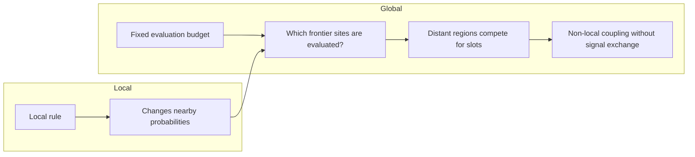
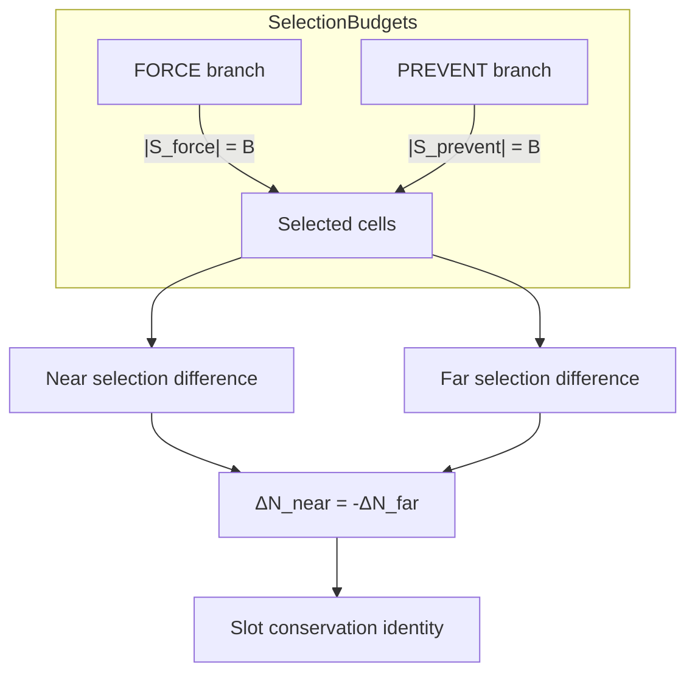
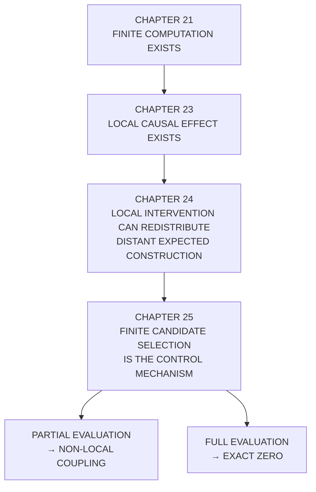

+++
title = "25: How Does Finite Computation Create Non-Local Coupling?"
date = "2026-08-13T10:49:00+01:00"
draft = false
description = "Chapter 25 isolates finite candidate selection as a control parameter for non-local causal redistribution in the Digital Crystal."
categories = ["Programming", "Artificial Life"]
tags = ["Digital Life", "Digital Crystal", "Finite Computation", "Causality", "Cellular Automata", "Experimental Method"]
series = ["Digital Life From First Principles"]
+++

Chapter 24 ended somewhere we did not expect.

We began by looking for a local causal-gain field.

We found something else.

A local intervention changed the frontier.

The frontier changed which candidates entered a fixed global evaluation budget.

And distant expected construction changed immediately, even though the local transition rule could not propagate influence that far in one update.

That gave us a new candidate substrate law:

```text
LOCAL FRONTIER CHANGE
↓
FIXED GLOBAL EVALUATION BUDGET
↓
CANDIDATE SUBSTITUTION
↓
FAR-FIELD REDISTRIBUTION
```

The mechanism looked real.

But Chapter 24 tested it at one budget:

```text
B = 96
```

That was not enough.

If finite computation really caused the non-local coupling, then the effect should move when we changed the amount of computation available.

The next experiment therefore held the crystal fixed and varied only one thing:

```text
HOW MUCH OF THE FRONTIER
CAN BE EVALUATED?
```

The important design decision was what **not** to do.

We did not grow a different crystal for each budget.

That would have changed:

```text
morphology
population
frontier size
history
turnover
```

at the same time as budget.

Instead we froze the checkpoint.

We froze the intervention.

We froze the environment.

We froze the geometry.

Then, at the very next update, we changed only the number of candidate frontier cells allowed to receive computation.

That turns Chapter 25 into a control-parameter experiment.

---

## The Digital Resource Is an Evaluation Slot

It is tempting to compare finite computation to biological energy.

We should not.

The Digital Crystal does not burn calories.

It does not consume ATP.

It does not transport nutrients.

The scarce quantity in this experiment is simpler:

```text
AN EVALUATION SLOT
```

At every update, the frontier may contain hundreds of eligible construction opportunities.

But only:

```text
B
```

of them are evaluated.

So when:

```text
B < F
```

where `F` is frontier size, the system cannot inspect every possible attachment site.

It has to choose.

That means two distant regions can interact without exchanging a signal.

They interact because both compete for access to the same finite set of evaluation slots.

The local transition rule remains local.

The allocation constraint does not.



---

## The Frozen Experiment

For each independent checkpoint we selected supported single-contact frontier sites:

```text
occupied neighbours = 1
```

and classified them by Frontier Creation Potential:

```text
FCP = -1
       0
      +1
      +2
```

Then we performed the same FORCE/PREVENT intervention introduced in Chapter 23 and refined in Chapter 24.

```text
SAME CHECKPOINT
SAME CELL x
SAME INPUT
SAME RANDOMNESS

FORCE x
vs
PREVENT x
```

The intervention update itself used the ordinary frozen budget.

After that intervention had created the two lag-one states, we stopped evolving the system.

Now we varied only the lag-one evaluation fraction.

For each branch we measured:

```text
B/F =
0.05
0.10
0.25
0.50
0.75
1.00
```

plus an explicit:

```text
UNBOUNDED
```

arm.

The same checkpoint therefore generated all budget conditions.

The budget sweep did not create different crystals.

It created different computational allocations over the same crystal state.

---

## The Region That Cannot Be Reached Locally

The primary measurement was taken outside the ordinary one-step causal cone.

At lag one:

```text
distance > 1
```

cannot be affected by the local nearest-neighbour attachment rule.

That fact is structural.

It follows from the rule.

So if FORCE and PREVENT differ there after one update, the difference cannot have travelled through ordinary local propagation.

The only available pathway is:

```text
LOCAL INTERVENTION
↓
FRONTIER SET CHANGES
↓
GLOBAL CANDIDATE SELECTION CHANGES
↓
DISTANT EVALUATIONS CHANGE
```

This gives us unusually clean causal identification.

The experiment measured:

```text
far FORCE-only selected cells
far PREVENT-only selected cells
far symmetric difference
far selected-set overlap

exact expected far attachment difference
```

before any Bernoulli attachment draw was made.

The primary quantity was therefore not a noisy realized count.

It was the exact expected construction difference induced by the changed selector.

---

## The Hardest Control in the Book

The strongest part of the experiment was also the simplest.

At:

```text
B/F = 1.00
```

every frontier cell is evaluated.

There is no subsampling.

Likewise in the explicit unbounded arm.

So outside the nearest-neighbour causal cone, FORCE and PREVENT must evaluate the same cells.

The script therefore asserted:

```text
far FORCE-only count   = 0
far PREVENT-only count = 0
far symmetric diff     = 0
far expected effect    = 0
```

for every intervention.

Not approximately.

Exactly, up to floating-point tolerance.

Across the full scientific run, the hard-zero control was checked:

```text
10,750 times
```

and never failed.

That is the spine of Chapter 25.

Not because zero itself is surprising.

It is not.

The zero is required by the mechanism.

The important evidence is the pair:

```text
PARTIAL EVALUATION
→ reproducible outside-cone effect

REMOVE SUBSAMPLING
→ exact disappearance
```

That turns a correlation with budget into a mechanistic identification.

> **The outside-cone coupling is produced by finite candidate selection.**

---

## The Full Run

The full experiment used:

```text
384 independent checkpoints
```

and measured:

```text
5,375 supported n=1 sites
```

across all four FCP classes.

Each site was evaluated across seven budget conditions.

That produced:

```text
37,625 site × budget measurements
```

The hard-zero controls passed for the exhaustive arms.

Now we could ask what happened under partial evaluation.

---

## The Low-Budget Law

Chapter 24 suggested a first-order relationship:

```text
E_far
≈
-(ΔF/F)
×
(B/F)
×
Σp_far
```

where:

```text
ΔF
```

is the actual lag-one frontier-size difference between FORCE and PREVENT.

If:

```text
B = fF
```

then the expression simplifies approximately to:

```text
E_far
≈
-ΔF × f × p̄_far
```

where `p̄_far` is the mean attachment probability carried by the far frontier.

That gives us a very specific prediction:

```text
E_far ∝ -ΔF
```

at each fixed partial-evaluation fraction.

The experiment tested that relation at:

```text
f = 0.05
0.10
0.25
```

using the actual lag-one frontier difference rather than the earlier checkpoint-level FCP label.

---

## The Aggregate Test Passed

The frozen aggregate criterion required the weighted mean residual to remain within:

```text
25%
```

of the predicted magnitude.

The through-origin fits were:

```text
f = 0.05
beta ≈ 0.0251
relative residual ≈ 12.6%

f = 0.10
beta ≈ 0.0571
relative residual ≈ 9.9%

f = 0.25
beta ≈ 0.1422
relative residual ≈ 2.6%
```

All three cleared the frozen criterion.

So the predeclared aggregate hypothesis was:

```text
SUPPORTED
```

The important result is not the very high `R²` values from fitting three class means.

Three points through an origin are not a scientific triumph.

The result is the scaling itself:

> **Under partial evaluation, the expected outside-cone construction effect tracks the negative of the actual frontier-size difference.**

That relation became tighter as the evaluation fraction increased from `0.05` to `0.25`.

---

## Recovering the Probability Scale

The fitted coefficient carries more information.

From:

```text
E_far
≈
-ΔF × f × p̄_far
```

we expect:

```text
beta / f
≈
p̄_far
```

The experiment returned:

```text
f       beta       beta/f

0.05    0.0251      0.502
0.10    0.0571      0.571
0.25    0.1422      0.569
```

Across a fivefold change in evaluation fraction, the latter two estimates converge near:

```text
0.57
```

That is exactly the kind of quantity the mechanism says should appear.

We should be careful not to overstate this.

The chapter should measure the actual far-frontier probability mass directly before claiming an exact parameter recovery.

But the pattern is strong:

> **The budget coefficient behaves like the mean attachment probability carried by the far frontier, as predicted by the finite-selection model.**

The effect does not merely increase with more evaluation.

That increase was already in the frozen model.

The sweep recovered the expected scaling.

---

## One Result Did Not Generalize

Chapter 24 had produced a striking extreme-class ratio.

At `B = 96`:

```text
FCP +2 → E_far ≈ -0.117
FCP -1 → E_far ≈ +0.063
```

giving approximately:

```text
-1.86
```

against a simple:

```text
-2 : +1
```

frontier-size prediction.

Chapter 25 froze that as a calibration target across the low-budget sweep.

It did not survive cleanly.

Observed ratios were approximately:

```text
B/F = 0.05    -4.15
B/F = 0.10    -3.54
B/F = 0.25    -2.21
```

Only the `0.25` arm came within the frozen 25% tolerance around `-2`.

So the ratio result is:

```text
UNRESOLVED
```

and it stays that way.

We do not rescue it.

The failure taught us something important about the control variable.

---

## FCP Is Not the Same as the Frontier Seen by the Selector

FCP is measured from checkpoint geometry.

But the finite selector acts one update later.

Between those moments, ordinary intervention loss occurs.

So the actual lag-one frontier differences were closer to:

```text
FCP +2 class:
actual ΔF ≈ +1.84

FCP -1 class:
actual ΔF ≈ -0.78
```

Their actual magnitude ratio is therefore not:

```text
2.00
```

but closer to:

```text
2.36
```

The selector responds to the frontier that actually exists when it runs.

Not to the label we assigned one step earlier.

That distinction sharpens the mechanism:

```text
CHECKPOINT FCP
↓
upstream geometry descriptor

ACTUAL LAG-1 ΔF
↓
state presented to selector

SELECTION DISPLACEMENT
↓
proximal mediator
```

The Chapter 24 ratio was useful.

It led us to the right experiment.

But Chapter 25 tells us to stop treating FCP as the final control parameter.

---

## The Negative-ΔF Class Is Less Clean

The aggregate low-budget scaling test passed.

That does not mean every class followed it equally well.

For `FCP = -1`, the per-class relative residuals were approximately:

```text
f = 0.05   40%
f = 0.10   31%
f = 0.25    7%
```

The positive-ΔF classes were much closer to the model across all three fractions.

So the scientifically honest statement is:

> **The preregistered aggregate low-budget scaling criterion was supported. The positive-ΔF classes followed the relation closely at all tested low-budget fractions, while the negative-ΔF class deviated beyond the 25% per-class scale at 5% and 10% evaluation.**

This asymmetry matters.

It tells us the scalar frontier-size model is not the most proximal description of the selector.

The next quantity is more exact.

---

## Selection Slots Are Conserved

When both branches are budget limited:

```text
|S_force| = B
|S_prevent| = B
```

Exactly the same number of candidates is selected in each branch.

Split those selected cells into:

```text
NEAR
d <= 1

FAR
d > 1
```

Then:

```text
ΔN_selected_near
+
ΔN_selected_far
=
0
```

necessarily.

Therefore:

```text
ΔN_selected_far
=
-ΔN_selected_near
```

This is not an empirical law.

It is an accounting identity of fixed-size selection.

But it tells us what the selector actually conserves:

> **evaluation slots.**

Not attachments.

Not frontier size.

Not causal gain.

Slots.

The signed far-field construction effect is then approximately:

```text
E_far
≈
-p̄_displaced_far
×
ΔN_selected_near
```

This is a deeper formulation than:

```text
E_far ∝ -ΔF
```

because `ΔF` is upstream.

The selector does not directly consume Frontier Creation Potential.

It consumes a fixed number of slots.

Local frontier changes alter how many of those slots are used nearby.

The far field receives the exact opposite slot imbalance.



---

## Why Candidate Churn Is Not Enough

The `FCP = 0` arm gives us a beautiful control.

At `f = 0.50`:

```text
FCP = 0
far symmetric difference ≈ 0.483

FCP = -1
far symmetric difference ≈ 0.446
```

The amount of candidate churn is almost the same.

But the signed expected effects are very different:

```text
FCP = 0
E_far ≈ -0.013

FCP = -1
E_far ≈ +0.213
```

So simply changing many candidate identities does not guarantee a large signed construction effect.

What matters is the probability mass those substituted candidates carry.

This separates:

```text
HOW MANY EVALUATION SLOTS MOVED
```

from:

```text
WHAT EXPECTED CONSTRUCTION
THOSE SLOTS REPRESENTED
```

That distinction is essential.

> **Finite-budget redistribution is a redistribution of evaluation opportunity first, and only secondarily a redistribution of expected construction.**

Two interventions can move nearly the same number of slots while producing very different signed attachment effects.

---

## Partial Evaluation Is a Coupling Regime

Across the fraction sweep, the far-field effect grew in magnitude as more of the frontier was evaluated.

For example, the `FCP +2` class produced approximately:

```text
B/F     E_far

0.05   -0.049
0.10   -0.110
0.25   -0.261
0.50   -0.492
0.75   -0.715
1.00    0
```

The `FCP -1` class moved in the opposite direction:

```text
0.05   +0.012
0.10   +0.031
0.25   +0.118
0.50   +0.213
0.75   +0.294
1.00    0
```

That rise is not surprising.

The first-order model predicts it.

More evaluation slots means more opportunities for the difference between the two frontier populations to be expressed.

The interesting part is what happens near exhaustive evaluation.

---

## We Did Not Resolve the Saturation Layer

The coarse budget grid jumped from:

```text
0.75
```

directly to:

```text
1.00
```

At full evaluation, candidate subsampling disappears and the outside-cone effect becomes exactly zero.

But that does **not** mean the effect is mathematically discontinuous.

The final saturation transition may occupy only a few evaluation slots out of several hundred frontier cells.

The fractional width can therefore be far below one percent.

Our grid simply stepped over it.

So the correct conclusion is:

> **The coarse sweep shows redistribution persisting through 75% frontier evaluation and disappearing at exhaustive evaluation, but it does not resolve the narrow saturation layer where the selector ceases to subsample.**

That boundary is now experimentally interesting in its own right.

---

## The Better Coordinate Near Saturation

Fractions are convenient when the budget is small.

They are a poor coordinate when:

```text
B ≈ F
```

Near full evaluation, the meaningful quantity is:

```text
g
=
F_ref - B
```

the number of evaluation slots missing from exhaustive computation.

Then:

```text
g = 0
```

means full evaluation.

```text
g = 1
```

means exactly one frontier opportunity cannot be evaluated.

```text
g = 2
```

means two are omitted.

The near-saturation regime becomes discrete.

That is more natural for this substrate.

A useful next sweep is:

```text
g ∈ {
0,
1,
2,
3,
5,
10,
25
}
```

on the same frozen checkpoints.

Now we can see the mechanism at integer resolution.

---

## The Saturation Law Should Be Piecewise

Suppose FORCE has a larger frontier.

Let:

```text
F_force = F
F_prevent = F - d
B = F - g
```

with:

```text
d > 0
```

When:

```text
g < d
```

the PREVENT branch is already fully evaluated while FORCE still has to omit some cells.

The expected far selection difference follows one expression.

When:

```text
g >= d
```

both branches are still subsampled.

The expression changes.

That means the saturation boundary is not one smooth low-budget line carried all the way to `B = F`.

It is a piecewise finite-combinatorial regime.

This is important because it tells us what Chapter 25 should do next.

Not another broad fraction sweep.

A narrow integer-slot experiment.

---

## What Chapter 25 Has Established

The strongest bounded claim is now:

> **Within the tested single-contact Digital Crystal regime, partial candidate evaluation creates an immediate outside-causal-cone construction effect whose signed magnitude tracks the actual frontier imbalance and evaluation fraction; when candidate evaluation becomes exhaustive, the outside-cone effect vanishes exactly.**

A more mechanistic version is:

> **Finite computation couples distant construction opportunities because a fixed number of evaluation slots must be redistributed when local frontier geometry changes.**

The local transition rule is still local.

The non-locality appears in the allocation of computation.

---

## P005 — Finite-Budget Redistribution

The phenomenon ledger can now strengthen its entry.

### Finite-Budget Redistribution

**Status: SUPPORTED**

Operational statement:

> **When the Digital Crystal evaluates only part of its frontier, a local frontier change reallocates a fixed number of global evaluation slots, producing expected construction differences outside the nearest-neighbour causal cone. The effect disappears exactly when candidate evaluation becomes exhaustive.**

Mechanistic chain:

```text
LOCAL FRONTIER CHANGE
↓
NEAR SLOT EXCESS / DEFICIT
↓
EXACT OPPOSITE FAR SLOT CHANGE
↓
DISPLACED FAR PROBABILITY MASS
↓
FAR EXPECTED CONSTRUCTION EFFECT
```

Current scope:

```text
Digital Crystal v1
n = 1 frontier regime
lag 1
partial evaluation
same-checkpoint budget sweep
```

Supported quantitative behaviour:

```text
low-budget E_far tracks
-evaluation_fraction × actual ΔF

full evaluation gives
exact outside-cone zero
```

Not yet established:

```text
exact site-level law across all geometry
near-saturation integer law
generality across n
longer-horizon redistribution
effect on causal amplification
effect on individuation
```

---

## A Digital-Native Coupling

This result matters because it is not an imported biological metaphor.

We did not rename evaluation budget:

```text
energy
```

and declare metabolism.

We asked what finite computation itself does.

It creates a shared allocation constraint.

Two spatially distant regions can become causally coupled because they compete for execution slots.

That is native to the substrate.

A biological cell cannot usually skip chemistry because another cell on the opposite side of the organism used too much CPU time.

A Digital Crystal can.

Its scarcity is computational.

Its non-local coupling is computational.

Its conservation law is computational.

That is exactly the kind of property we hoped a substrate-first approach would reveal.

---

## The Cost of a Slot

There is another subtle point.

Fixed budget conserves:

```text
NUMBER OF EVALUATIONS
```

but not:

```text
EXPECTED CONSTRUCTION
```

because evaluation slots carry different attachment probabilities.

A slot spent on a candidate with:

```text
p = 0.8
```

is not equivalent in expected construction to a slot spent on:

```text
p = 0.2
```

So the selector creates two layers of dynamics:

```text
ALLOCATION
which cells receive computation

and

PAYLOAD
how much expected construction
those cells carry
```

The FCP=0 control exposed exactly this distinction.

Similar slot churn can produce radically different signed attachment effects.

This means future experiments should never collapse:

```text
candidate displacement
```

and:

```text
construction displacement
```

into one number.

---

## The Next Question Changes Again

Chapter 24 asked:

> Where is causal gain created?

Chapter 25 asked:

> How does finite computation redistribute causal opportunity?

The next question is harder:

> **Does that redistribution merely move construction around, or can it change causal amplification itself?**

Chapter 23 measured a finite downstream causal gain well below sustained amplification.

The crystal remained strongly dissipative.

That may explain several previous negative results:

```text
no persistent propagating process
no stable active structure
no coherent causal boundary
no sustained cascade
```

But budget is dangerous as an experimental variable.

Increasing `B` trivially evaluates more candidates.

More evaluations produce more expected attachments.

More attachments can produce more downstream descendants.

If we simply sweep budget and observe larger amplification, we will have learned almost nothing.

So Chapter 26 needs a stricter design.

---

## Match Construction Rate, Vary Allocation

The next experiment should separate:

```text
HOW MUCH CONSTRUCTION HAPPENS
```

from:

```text
HOW CONCENTRATED COMPUTATIONAL SELECTION IS
```

As `B` changes, adjust the attachment calibration so that:

```text
B × p̄(B)
≈ constant
```

across arms.

Then compare causal amplification.

Include an exhaustive-evaluation arm with the same expected attachment rate.

Now the question becomes:

> **At matched expected construction rate, does stronger candidate subsampling change downstream causal amplification?**

If amplification is invariant, then finite-budget redistribution is a spatial allocation law and nothing more.

If amplification changes, then finite computation provides a route from allocation structure to system-level causal dynamics.

Either answer would matter.

---

## What We Learned by Varying the Constraint

The progression now looks like this:



The experimental object has become much clearer.

We are no longer asking whether the crystal resembles an organism.

We are discovering what finite computation does to causal organization.

And that gives us a result we did not import from biology:

> **A local digital process can become non-locally coupled through competition for execution slots, even when its transition rule remains strictly local.**

That is a genuine property of this computational substrate.

The next chapter asks whether that coupling merely redistributes activity—

or changes what causal activity can become.
