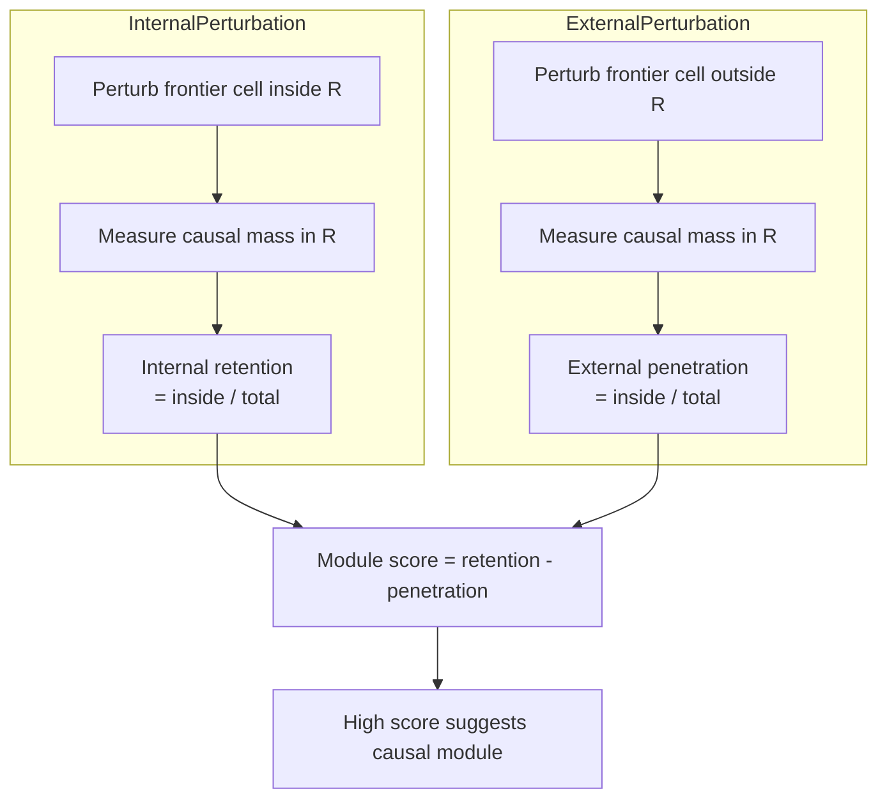
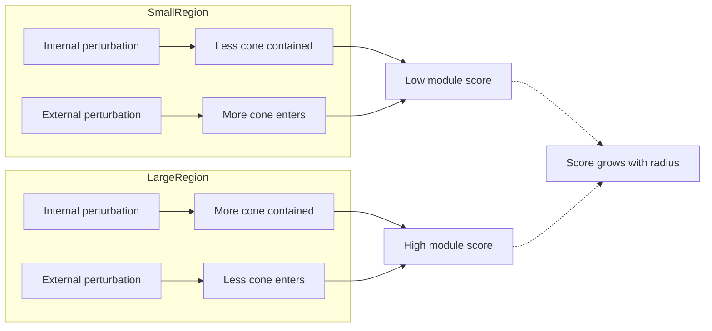
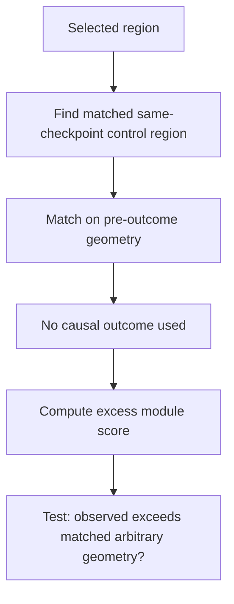
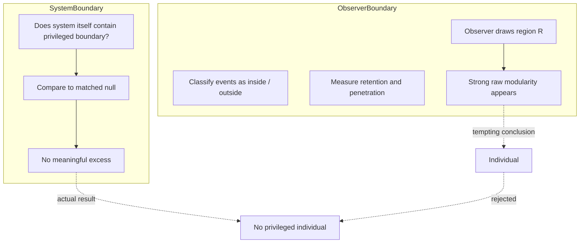

+++
title = "28: Containment Is Not Individuation"
date = "2026-08-13T23:49:00+01:00"
draft = false
description = "Chapter 28 tests whether the Digital Crystal contains a privileged causal individual, and shows why strong apparent modularity can arise from observer-chosen spatial boundaries alone."
weight = 28
categories = ["Programming", "Artificial Life"]
tags = ["Digital Life", "Digital Crystal", "Causality", "Finite Computation", "Experimental Method", "Cellular Automata"]
series = ["Digital Life From First Principles"]
+++

Chapter 27 ended with something that looked dangerously close to memory.

Not memory itself.

But something more primitive and harder to dismiss.

Two Digital Crystal states could have the same visible occupancy geometry and still respond differently to the same perturbation because one contained a hidden decaying material state.

That material changed immediate causal sensitivity.

The changed sensitivity altered construction events.

Those events redirected the later trajectory.

And most of the downstream causal difference accumulated after the original material trace had already weakened substantially.

So the past could matter.

Not because the crystal contained a complete record of the past.

Not because it retrieved a symbolic memory.

But because hidden state altered the path, and the path carried consequences forward.

That raised the next question naturally.

If history can change the future, where does the system end?

Is there a part of the crystal that is more strongly causally coupled to itself than to the surrounding world?

In biology, individuality often seems obvious because bodies come prepackaged with membranes, skins, organs, and developmental histories.

But a computational substrate does not owe us those conveniences.

So Chapter 28 asked:

> **Does a causal individual emerge?**

Not:

> Can we draw a blob around some cells?

And not:

> Is there a connected component?

But:

> **Is there a spatial region whose internal causal coupling is stronger than its coupling to the surrounding crystal in a way that cannot be explained by geometry alone?**

That last clause turned out to be the entire chapter.

---

## A First Operational Definition

The most direct starting point was causal modularity.

Take a spatial region \(R\).

Perturb a frontier cell inside it.

Then measure how much of the resulting causal influence remains inside \(R\).

Now perturb a frontier cell immediately outside the same region.

Measure how much of that external causal influence penetrates \(R\).

If a region behaves like a causal module, we would expect:

```text
internal perturbation
→ influence mostly stays inside

external perturbation
→ influence enters less strongly
```

That suggests two quantities.

For an internal perturbation:

\[
\text{internal retention}
=
\frac{A_{\text{inside}}}
{A_{\text{inside}}+A_{\text{outside}}}
\]

For an external perturbation:

\[
\text{external penetration}
=
\frac{A_{\text{inside}}}
{A_{\text{inside}}+A_{\text{outside}}}
\]

where \(A\) is the summed **absolute expected causal mass**.

Absolute mass matters here.

If one region contains positive and negative probability shifts that cancel numerically, the cancellation should not make the region look causally empty.

The modularity score was therefore:

\[
M
=
\text{internal retention}
-
\text{external penetration}
\]

A high value would mean:

```text
effects originating inside
remain inside more strongly

than

effects originating outside
penetrate inside
```

That sounds like a reasonable first approximation to an individual.

It was also dangerous.



---

## Removing the Global Selector First

Chapter 25 had already established that finite global evaluation budget creates non-local coupling.

A local frontier change can alter which distant candidates receive evaluation slots.

That means a spatial region can be causally linked to distant space even when no nearest-neighbour causal path connects them.

If Chapter 28 measured modularity under bounded evaluation, that global selection effect would contaminate the result.

So V1 used:

```text
TRUE UNBOUNDED EVALUATION
```

Every frontier candidate was evaluated.

There was no global candidate competition.

No dynamic construction-rate calibration was used either.

This removed two previously discovered long-range channels:

```text
finite-budget redistribution
global calibration compensation
```

The remaining causal structure was therefore local.

And under local dynamics, any expected effect beyond the eight-step causal horizon had to be exactly zero.

That became a structural validity assertion.

---

## Predeclared Spatial Regions

We still needed candidate regions.

This was another place where it would have been easy to cheat.

We could not look at a run, find a visually coherent patch, draw a boundary around it, and then announce that the patch was an individual.

So V1 used simple fixed-radius hexagonal disks.

The primary region radius was frozen at:

\[
r=4
\]

Secondary descriptive scales were:

\[
r \in \{2,3,4,5\}
\]

For each independent checkpoint, candidate regions were centered on occupied cells.

Candidates had to satisfy pre-outcome support rules:

- enough occupied cells,
- occupancy between 20% and 80%,
- at least two supported internal frontier probes,
- at least two supported external-shell frontier probes.

Supported probes were frontier cells with exactly one occupied neighbour.

The candidate regions were then ranked without using causal outcomes:

1. occupancy fraction closest to 0.50,
2. radial distance from the crystal origin,
3. axial coordinates.

The first three were selected.

No region was chosen because it had a high module score.


---

## The Intervention

The perturbation reused the corrected transient intervention from Chapter 27.

At lag 1:

```text
FORCE:
x is explicitly occupied

PREVENT:
x is explicitly blocked
```

After one growth exposure:

```text
x is removed from FORCE
x is absent from PREVENT
```

From lag 2 onward, both branches evolve normally.

The horizon was frozen at eight steps.

At each lag, before realized stochastic attachment, the experiment calculated:

\[
\Delta p(y,t)
=
p_{\text{FORCE}}(y,t)
-
p_{\text{PREVENT}}(y,t)
\]

and accumulated the absolute causal mass inside and outside the candidate region.

This gave us a Rao-Blackwellized measure of where causal influence was expressed.

---

## V1 Looked Decisive

The V1 result was enormous.

At the frozen radius-4 scale:

\[
M
=
0.4402
\]

with 95% confidence interval approximately:

\[
[0.419,\ 0.461]
\]

The predeclared meaningful threshold was:

\[
0.15
\]

and the achieved one-sided MDE was only:

\[
0.0268
\]

So the primary V1 result was formally:

```text
SUPPORTED
```

The decomposition looked even more compelling.

Mean internal retention was:

\[
0.7755
\]

Mean external penetration was:

\[
0.3353
\]

So the selected regions seemed to do exactly what a causal module should do.

Internal perturbations were mostly retained.

External perturbations penetrated much less.

At first glance, we had found our first causal individual.

We had not.

---

## The Scale Sweep Exposed the Problem

The descriptive scale sweep showed:

```text
radius 2    module score ≈ 0.197
radius 3    module score ≈ 0.374
radius 4    module score ≈ 0.440
radius 5    module score ≈ 0.504
```

The score increased almost monotonically with radius.

That was a warning.

If radius 4 represented a privileged causal boundary, we might expect some finite-scale structure:

```text
small
→ stronger
→ peak
→ weaker
```

Instead:

```text
bigger disk
→ bigger module score
```

The simplest explanation was geometry.

An internal perturbation lies inside the disk.

As the disk grows, more of its local causal cone is contained by the boundary.

An external perturbation lies just outside the disk.

Even if local causal propagation is completely homogeneous, less of that perturbation's causal cone overlaps the disk.

So an arbitrary region can generate:

```text
high internal retention
low external penetration
```

without there being any special causal boundary in the system.

The observer's boundary itself can manufacture apparent modularity.

That meant V1 had established something real, but not what we first hoped.



---

## The V1 Phenomenon Was Real

It is important not to erase V1 just because its interpretation changed.

The measured asymmetry was not fake.

At radius 4, perturbations initiated inside selected regions really did express much more causal mass inside those regions than equivalent external perturbations expressed into them.

That property was precise and reproducible.

The error would be to equate:

```text
raw causal containment
```

with:

```text
causal individuation
```

The missing question was:

> **Would an arbitrary region with the same geometry do the same thing?**

That became V2.

---

## Geometry-Matched Null Regions

V2 preserved the frozen radius:

\[
r=4
\]

It preserved:

- the eight-step horizon,
- the same module score,
- the same absolute causal mass,
- the same transient intervention,
- unbounded evaluation,
- no calibration,
- outcome-blind region selection.

The new ingredient was a matched spatial null.

For each selected region, the experiment searched for other supported radius-4 regions from the **same checkpoint**.

That same-checkpoint requirement controlled automatically for:

- global morphology,
- growth age,
- global density,
- environmental history,
- crystal extent,
- random-stream family.

The controls were matched on pre-outcome geometry.

Features included:

```text
occupancy fraction
center radial position
occupied count
internal frontier count
external frontier count
internal probe depth
external probe depth
boundary occupied fraction
```

Controls could not reuse the same center.

They could not be one of the observed regions.

And no causal outcome was used during matching.

Two controls were sought for every selected region.

The primary V2 quantity was now:

\[
M_{\text{excess}}
=
M_{\text{observed}}
-
M_{\text{matched control}}
\]

This is the question V1 had not answered.



---

## A Stronger Meaningful Threshold

The V1 threshold of 0.15 referred to raw modularity.

V2 measured a different quantity.

So the excess-modularity threshold was frozen separately:

\[
\text{SEI}_{\text{excess}}
=
0.10
\]

To support a privileged causal region, the selected regions had to exceed matched arbitrary geometry by more than ten percentage points.

The decision rule was:

```text
SUPPORTED:
95% CI lower bound > +0.10
and MDE80 <= 0.10

BOUNDED_BELOW_SEI:
95% CI upper bound < +0.10
and MDE80 <= 0.10

UNRESOLVED:
otherwise
```

This would prevent us from turning a tiny residual into individuality.

---

## V2 Matched Extremely Well

The full V2 experiment used 192 independent groups.

Every group was covered.

The median group contained all three matched observed regions.

The median observed region received two controls.

There were:

\[
1151
\]

matched observed-control pairs.

Mean standardized match distance was approximately:

\[
1.18
\]

Maximum was only:

\[
3.06
\]

below the frozen threshold of 4.

Mean occupancy-fraction difference was:

\[
0.027
\]

Mean radial difference was:

\[
1.78
\]

The far causal effect under unbounded evaluation was exactly:

\[
0
\]

The experiment passed every validity gate.

Now the matched null could answer the real question.

---

## The Apparent Individual Disappeared

The selected regions still reproduced the large V1 score:

\[
M_{\text{observed}}
=
0.4436
\]

The matched control regions scored:

\[
M_{\text{control}}
=
0.4559
\]

So:

\[
M_{\text{excess}}
=
-0.0123
\]

with 95% confidence interval:

\[
[-0.0327,\ 0.0072]
\]

The point estimate was slightly negative.

But the interval crossed zero, so there was no reason to claim the matched controls were more modular.

The directional status was correctly:

```text
DIRECTION_UNRESOLVED
```

The meaningful-margin question, however, was completely resolved.

The upper confidence bound was only:

\[
0.0072
\]

against a predeclared meaningful threshold of:

\[
0.10
\]

The achieved MDE was:

\[
0.0265
\]

far tighter than the threshold.

So V2 was not underpowered.

The result was:

```text
BOUNDED_BELOW_SEI
```

The selected regions did not exhibit meaningful excess causal modularity over matched arbitrary regions.

---

## The Decomposition Did Not Hide a Positive Effect

Sometimes a combined metric can conceal two opposing mechanisms.

Perhaps the selected regions retained more internal influence but also admitted more external influence.

Or perhaps they blocked external influence but failed to retain internal influence.

The V2 decomposition tested that.

Excess internal retention was:

\[
-0.0066
\]

with 95% confidence interval:

\[
[-0.0222,\ 0.0093]
\]

Excess external penetration was:

\[
0.0057
\]

with 95% confidence interval:

\[
[-0.0101,\ 0.0216]
\]

Neither component supported a privileged region.

The selected regions did not retain internal causal influence meaningfully better than matched controls.

They did not resist external causal penetration meaningfully better either.

The apparent module had disappeared under the appropriate null.

---

## Containment Is Not Individuation

This gives us one of the cleanest principles in the project.

> **CAUSAL RETENTION ≠ CAUSAL INDIVIDUATION**

A local process automatically produces spatial asymmetries.

If influence spreads locally, then a region drawn around the source will contain some of that influence.

A region drawn larger will usually contain more.

A perturbation placed outside the same region will overlap it differently.

Therefore:

```text
internal effects stay inside
external effects enter less
```

does not by itself establish an individual.

The observer can manufacture that result by drawing the boundary.

The stronger requirement is:

> **The proposed region must exhibit causal organization that exceeds what arbitrary geometry would produce under an appropriate matched null.**

The Digital Crystal did not clear that requirement.


---

## What Chapter 28 Actually Established

The evidence can now be stated cleanly.

### Raw spatial causal modularity — SUPPORTED

At radius 4, selected regions showed a large difference between internal retention and external penetration.

### Finite-budget far coupling — REMOVED BY CONSTRUCTION

True unbounded evaluation eliminated selector-mediated global coupling.

### Geometry-matched excess modularity — BOUNDED BELOW SEI

Any positive excess of selected regions over matched same-checkpoint controls was far below the predeclared +0.10 meaningful threshold.

### Privileged causal region — NOT ESTABLISHED

Selected regions were not causally special relative to comparable alternatives.

### Causal individual — NOT ESTABLISHED

The experiment did not discover a privileged individual boundary.

---

## Another Observer Trap

This was not the first time a plausible biological interpretation collapsed under a stronger control.

A removed region could refill.

That did not make it repair.

A persistent trace could survive.

That did not make it memory.

A perturbation could change later outcomes.

That did not automatically make it causal amplification.

Now:

```text
a region can retain causal influence
```

does not make it an individual.

The pattern is becoming systematic.

Properties that look obvious from the outside often dissolve when we ask what exact causal asymmetry would distinguish the property from a simpler alternative.

That is the central discipline of the project.

Do not ask:

> What does this look like?

Ask:

> What simpler mechanism could produce the same measurement?

And then build the control.

---

## The Observer Can Create an Inside

This chapter also reveals something deeper about boundaries.

We tend to think of an inside and an outside as properties of the system.

But a boundary can begin as a property of the observer.

Draw a circle around a local process.

Now classify events as internal or external.

Immediately, you have created:

```text
inside
outside
crossing
retention
penetration
```

Those quantities may all be measurable.

They may all be reproducible.

They may even be large.

None of that guarantees the system itself contains a privileged boundary.

The distinction is:

```text
OBSERVER-DEFINED BOUNDARY
vs
SYSTEM-PRIVILEGED BOUNDARY
```

Chapter 28 found the first.

It did not find the second.



---

## A Bounded Negative Result

The strongest sentence we can defend is:

> **At frozen radius 4, selected Digital Crystal regions exhibited strong raw causal retention asymmetry, but this asymmetry did not exceed same-checkpoint regions matched on occupancy, radial position, frontier structure and boundary geometry. The 95% interval for excess module score was approximately -0.033 to +0.007, well below the predeclared +0.10 meaningful margin.**

That is not merely failure to find individuality.

It is a precision-bounded negative result.

We know much more than:

> maybe there is an individual, maybe not.

We know:

> **under this operational test, any privileged causal modularity is much smaller than the threshold we declared meaningful.**

That is exactly what a failed hypothesis should give us.

---

## The Principle

Chapter 28 leaves us with a compact rule:

## **Containment Is Not Individuation**

Or, more formally:

> **A spatial region can exhibit strong apparent causal modularity solely because local influence is evaluated relative to an observer-chosen boundary. Raw retention and penetration asymmetries do not establish a privileged individual unless they exceed appropriately matched spatial controls.**

This is now part of the Digital Crystal's negative specification.

The system has:

- local causal structure,
- hidden-state trajectory redirection,
- finite-budget redistribution,
- turnover,
- spatial persistence,
- strong apparent containment.

But we have not yet found:

- a privileged boundary,
- an individual,
- a self.

That matters.

Because the temptation to call a coherent computational process an organism is strongest precisely when the observer has already drawn the outline.

Chapter 28 showed why we must not trust that outline.

The next chapter turns from the crystal itself to the method that kept rescuing us from our own interpretations.

Not another property of life.

A property of the investigation.

How do we fail correctly?
