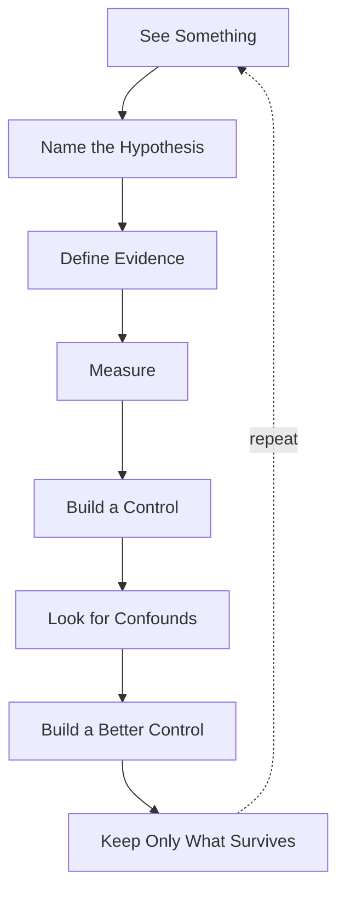

+++
title = "00: What Would Digital Life Mean?"
date = "2026-08-14T09:00:00+01:00"
draft = false
description = "If digital life is possible, why assume it must look like biological life? The intellectual constitution of the book: names are not evidence, biology is evidence rather than specification, and every claim must survive a control."
weight = 0
series = ["Digital Life From First Principles"]
categories = ["Programming", "Artificial Life"]
tags = ["Digital Life", "Cellular Automata", "Artificial Life", "Emergence", "Experimental Method"]
+++

Suppose we wanted to build life in software.

What would we actually build?

The honest answer is that we do not know yet, and that is the reason for the book. The goal is not a graphical creature, an animated agent, or a personality-driven assistant. It is a computational system whose own internal operation produces some of the properties we associate with living things — produces them, rather than declares them.

That sounds simple until we try to say what those properties are.

We reach immediately for a familiar vocabulary:

```text
structure
persistence
response
adaptation
repair
memory
reproduction
inheritance
evolution
```

Those words are useful.

They are also dangerous.

Because the easiest way to build something that looks like digital life is to put the vocabulary of life directly into the program. We can write:

```python
class Metabolism:
    ...

class Memory:
    ...

class Reproduction:
    ...

class Organism:
    ...
```

and within an afternoon produce software that is unmistakably biologically inspired, and from which we have learned almost nothing.

Calling a method `reproduce()` does not establish reproduction.

Calling a number `energy` does not establish metabolism.

Writing state to disk does not establish memory. Copying a configuration does not establish inheritance. Running an optimizer does not establish evolution.

The names are ours.

The evidence has to come from the system.

That is where this book begins.

---

## The Cargo Cult of Life

A cargo cult copies the visible form of something without reproducing the mechanism that made the original work.

Artificial life has an obvious version of this problem. We can borrow the vocabulary of biology — cell, organism, energy, fitness, birth, death, memory, inheritance, evolution — and then build software structures carrying those names. The result may be complicated. It may be beautiful. It may even be useful.

But the terminology proves nothing.

So we will work under a stricter rule.

> **We do not get to claim a life-like property merely because we implemented something with the same name.**

If we claim persistence, we must measure persistence.

If we claim regeneration, we must damage the system and measure what returns.

If we claim learning, some measurable performance must change because of experience.

If we claim inheritance, something useful must pass from one continuation or successor to another.

If we claim reproduction, visual resemblance between an earlier structure and a later one is not enough. We need evidence that the earlier organization participated causally in producing the later one.

And if we claim evolution, we will have to be precise about what varies, what persists, what is selected, and what actually changes through time.

The goal is not to make software sound alive. The goal is to find out how far the evidence takes us.

---

## But There Is a Second Trap

Avoiding biological vocabulary is not enough, because there is a mistake available in the opposite direction.

We could decide in advance what life must contain:

```text
boundary
metabolism
death
reproduction
inheritance
selection
```

and then spend the rest of the book manufacturing those properties one at a time.

That would be better than naming classes after them. It would still smuggle in an assumption:

> that digital life must solve the same problems, in the same way, that biological life does.

Why should it?

Biological organisms exist under very particular constraints. They occupy physical bodies. Matter is expensive to rearrange. Copying an organism is difficult and slow. Bodies degrade. Individuals die. Acquired knowledge is only partially transferable to a successor. Lineages branch and generally do not merge.

A computational substrate has a different set of possibilities and a different set of costs. Copies can be nearly free. State can be checkpointed and restored. A process can move between machines. Two lineages can fork and later merge. Acquired information can, at least in principle, be transferred directly. One organization can be distributed across many locations. A digital system might simply grow, and never reproduce at all.

None of that means the digital substrate is unconstrained. It means its constraints are not the ones biology adapted to, and we do not yet know what they are.

So this book will not open with a checklist called `REQUIREMENTS FOR LIFE`.

We do not know the requirements.

Discovering them is the experiment.

---

## Biology Is Evidence, Not Specification

For centuries people watched birds and tried to understand flight.

Birds have feathers, wings, hollow bones, flight muscles, flapping motion. All of that was worth studying, and studying it was how the problem became tractable at all. But successful aircraft did not require us to manufacture an artificial bird. The important discoveries were underneath the anatomy:

```text
lift
drag
thrust
stability
control
```

Birds were evidence that flight was possible. They were not the engineering specification.

Life may be similar.

Biology gives us one extraordinarily successful implementation, and the only one we can currently examine. But an organism is a solution shaped by the medium it is made from, and many of its most familiar features may be consequences of that medium rather than universal requirements for organized, persistent, adaptive systems.

So the task of this book is not:

> Build a digital animal.

It is:

> **Discover the aerodynamics of digital life.**

Which mechanisms actually matter? Which properties arise on their own? Which biological constraints simply vanish in a computational substrate — and what new constraints appear in their place? Which things we assume are fundamental turn out to be solutions biology found for the specific problem of living in the physical world?

We should not answer any of that in advance.

---

## Do Not Trust What Looks Alive

There is a further problem, and it is not in the software. It is in us.

A complicated-looking simulation can be mesmerizing. We can generate a beautiful animation and immediately feel that something profound is happening. Maybe it is. Maybe it is not. Random noise can look complicated. A short-lived transient can look extraordinary in the moment just before it disappears. A periodic system can look chaotic if we watch too small a window. A pattern can resemble an organism while possessing no property beyond its geometry.

Surprise is cheap.

And humans are extremely good at turning motion into nouns.

We see a shape move, and start saying *it travelled*. We see one shape become two, and start saying *it reproduced*. We see several structures move together, and start saying *they flocked*. The upgrade happens in under a second, and it happens before any measurement has been taken.

Those words may eventually be justified. The animation does not justify them.

So the book insists throughout on a distinction that is easy to state and surprisingly hard to maintain:

> **what happened** is not the same as **what we call what happened**.

Calling something memory does not establish memory. Calling something reproduction does not establish reproduction. Calling a region an individual does not establish individuality. Calling a number energy does not establish metabolism.

Which gives us a second rule:

> **Look first. Then try to destroy your own interpretation.**

---

## Even Our Nouns Will Have to Earn Their Place

This applies to the small words as well as the impressive ones.

Suppose a pattern persists while moving through a lattice. Is it an object? Perhaps. Suppose the visible pattern disappears and an equivalent pattern reappears elsewhere. Is it the same object? Perhaps not. Suppose two disconnected regions participate in one continuing causal process — are they two things, or one distributed thing? Suppose two structures look identical but have entirely independent histories. Are they the same kind of object? Yes. Are they the same individual? Probably not.

We will begin with simple geometric definitions, because they are measurable and because we have to begin somewhere. But we should hold them loosely.

> **The visible boundary of a pattern may not be the true boundary of a digital individual.**

The same caution applies to persistence. A program can persist indefinitely by doing nothing:

```python
while True:
    pass
```

It persists. That tells us almost nothing. A cellular automaton can settle into a frozen configuration and remain there forever. So persistence only becomes interesting when we ask a sharper question: what exactly persists? A geometry? A relationship? A process? A causal organization? An ability? A piece of information?

And what happens when the system is disturbed? Later we will deliberately damage structures that appear persistent. Some will survive. Some will vanish. Some will continue without ever restoring their previous form. Those are three different properties, and collapsing them into one word costs us the distinction.

Reproduction deserves the same suspicion. Biology makes it look unavoidable: organisms die, matter must be gathered, bodies must be rebuilt, lineages persist by producing new organisms. A digital system need not face that constraint in the same form. A process could simply continue. Or grow. Or fork. Or checkpoint itself. Or merge with another process. Or hand its acquired state directly to a successor. So the useful question is not *does it reproduce?* but:

> **Under what computational conditions does reproduction become useful, or necessary, at all?**

And the same is true of evolution, which is among the most powerful mechanisms known anywhere. But in a computational substrate a successor might inherit acquired knowledge, learned parameters, search history, external memory, or modifications to its own code — directly. Two branches might exchange what they learned. Several lineages might merge. Variation might be deliberate rather than random. Selection might be external, internal, or unnecessary. So rather than assuming that copying biological evolution is the only route to cumulative change, we ask:

> **How can useful organization accumulate through time in a computational substrate?**

Biological evolution is one answer. It may not be the only one.

Behind all of these sit questions the book keeps returning to, and does not resolve early:

What if the visible object is not the important unit?

What if digital scarcity is nothing like biological energy?

What if history matters without anything we would recognize as memory?

What if reproduction is not fundamental?

What if computation offers primitives that biology never had available?

Those are open. They stay open until something measurable closes them.

---

## How This Book Will Find Out

The visual system gives us hypotheses. The experiment decides what survives.

So the same cycle runs through the entire book:

```text
SEE SOMETHING
↓
NAME THE HYPOTHESIS
↓
DEFINE WHAT WOULD COUNT AS EVIDENCE
↓
MEASURE IT
↓
BUILD A CONTROL
↓
LOOK FOR A CONFOUND
↓
BUILD A BETTER CONTROL
↓
KEEP ONLY WHAT SURVIVES
```



That repetition is deliberate. When a later chapter opens with an observation, names a hypothesis, defines a measurement, builds a control and then attacks it, that is not a formatting habit or a house style. It is the instrument. Reading the same shape for the twentieth time should feel like watching a procedure being applied, not like watching a template being filled.

Three parts of the cycle do most of the work.

**Intervention.** Correlation is easy to obtain and hard to interpret. If we think a mechanism produces a capability, the strongest available move is to remove or disrupt that mechanism and measure what changes. If the capability does not depend on the mechanism, the explanation was wrong, however satisfying it looked.

**Controls.** A number alone means very little. A recovery score of 0.87 is impressive or unremarkable depending entirely on what an undamaged system scores, what a random process scores, and what a frozen copy scores. So every control in this book exists because there is a specific alternative explanation we are trying to eliminate — and the first control is often not good enough. Discovering the confound in your own experiment is not a setback. It is usually the moment the real structure becomes visible.

**Bounded claims.** Compare *the system heals* with *under deletion of up to 10% of active cells in the tested regions, the system returned to at least 0.90 morphology similarity within 50 updates in 83% of trials*. The second sentence is less exciting and much stronger. We know precisely what it asserts, and precisely what it does not. A bounded claim survives scrutiny because its edges are visible.

One consequence needs stating plainly, because it is where investigations usually go wrong.

The standard of evidence does not change when a hypothesis becomes attractive. It does not relax because the result would be exciting, and it does not tighten because the result is inconvenient. A beautiful animation generates a hypothesis. It never establishes an interpretation. If the strongest honest conclusion is smaller than the idea that motivated the experiment, then the smaller conclusion is the result.

---

## Expect Us to Be Wrong

This deserves to be explicit, because it is not a disclaimer. It is a description of what actually happened while the book was being written.

We form hypotheses that fail. We design controls that turn out to be inadequate. We produce measurements that look spectacular and then collapse when a confound appears. Sometimes we discover that a question we had been asking for three chapters was really two different questions wearing one name.

The recurring shape is roughly this:

```text
we expect X
↓
the experiment does not support X
↓
something else appears
↓
we investigate that
↓
the new interpretation may fail too
↓
a smaller or stranger phenomenon survives
```

That last line is the point. This is not a book in which each chapter proves the thing proposed at its start, and the reader should not read a failed hypothesis as a wasted chapter. Quite often the failure is what exposes the phenomenon that turns out to matter — a phenomenon nobody would have thought to look for while the original explanation still seemed to be working.

Which leads to one of the intellectual promises of this book:

> **An explanation can die without the phenomenon dying.**

Something real can be happening in the system while the story we told about it is completely wrong. Separating those two things — the measurement that survives and the interpretation that does not — is most of the work.

We are not trying to prove that digital life exists.

We are trying to find out which claims remain standing after we attack them.

---

## How to Read the Experiments

The book operates at several depths, and not every reader needs all of them at once.

Some material is **concept**: the intellectual step in the argument, the reason a question is being asked at all. Some is **evidence**: the experiment, the measurement, the numbers that support the step. Some is **control and confound**: the attack on the interpretation, including the attacks that succeeded. Some is a **claim boundary**: an explicit statement of what the evidence permits and what it does not. And some is a **deep dive** — protocols, thresholds, discarded designs, seeds, implementation failures, the forensic record — which mostly lives in the appendices.

A reader following the conceptual journey can stay with the argument and the claim boundaries, and skip the detailed protocols without losing the thread.

A reader who wants to know why a claim was earned should read the evidence and the controls, because that is where the claim is actually made.

A reader who wants to audit or reproduce the work can go to the appendices, where the experimental record is kept deliberately unclean: the wrong metric before the better metric, the control that failed, the run that had to be discarded.

This is not a simplified version and a real version. The evidence is the same evidence. The book simply declines to march every reader through every forensic detail in order to make a point that one measurement and one control already establish.

---

## There Is No Biological Ladder Here

We will meet many familiar properties along the way:

```text
structure
persistence
identity
damage tolerance
repair
reproduction
inheritance
adaptation
evolution
```

They should not be read as a ranking:

```text
LEVEL 1
↓
LEVEL 2
↓
LEVEL 3
↓
ALIVE
```

They are experimental questions, and each is allowed to fail. Some may turn out to be deeply important. Some may turn out to be consequences of biological constraints that a computational substrate does not have. Some may have digital equivalents that look nothing like their biological namesakes. Some may disappear from the final picture entirely.

The order in which we study them is a way to learn.

It is not a definition, and nothing accumulates into a badge.

---

## The Question We Are Actually Asking

At the end of this book we may still decline to say that anything we built is alive.

That would be an acceptable result. It might even be the correct one.

What matters is whether we can say things like:

```text
this structure persists under these conditions

this pattern fails under this perturbation

this organization restores part of its form after this damage

this later structure is causally descended from that earlier one

this information changes future behaviour

this effect survives this control

this apparent behaviour disappears when this confound is removed
```

Those are modest sentences. They are also somewhere solid to stand, which is more than most of the vocabulary we started with can offer.

And if enough surprising properties survive enough attempts to explain them away, a different question eventually becomes unavoidable. Not:

> Does this look alive?

But:

> **What kind of thing is actually here?**

Which is another way of asking what computation gives us when we stop telling it in advance what life is supposed to contain.

---

## Where to Start

To ask any of this, we need a world simple enough that we can see what is happening.

Small computational systems — a lattice, a local rule, a clock — are almost ideal for this, and not because they resemble organisms. They do not. They are useful because they remove excuses. If something interesting happens inside a very large model, the explanation can disappear into millions of parameters and never be found. In a system with a handful of ingredients we can inspect every state, replay every step, flip one bit, run the counterfactual, compare neighbouring rules, and measure exactly what the perturbation did.

When a claim fails there, it has almost nowhere to hide.

That is what makes these systems worth beginning with. They are not models of life.

They are **experimental microscopes for emergence**.

---

In the next chapter we are going to do something slightly perverse.

Before building the smallest system in the book, we are going to look at some of the most spectacular artificial-life systems anyone has built. We will watch them properly. We will let ourselves be impressed, because the impression is real data about how quickly a moving pattern becomes a creature in the mind of the person watching it.

And then we will start taking things away — until almost nothing is left, and we can find out how astonishingly little computation is required before organization, identity, causality and the temptation to say *organism* all start getting confused with one another.
