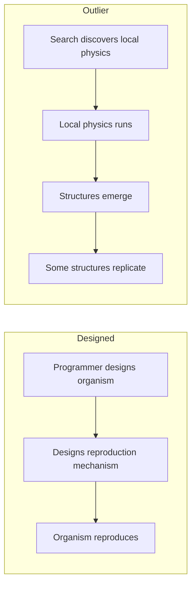
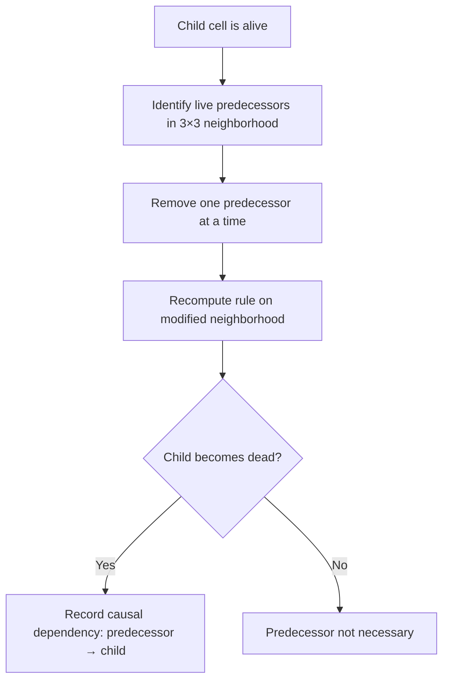

+++
title = "02: The Closest Thing We Have"
date = "2026-08-14T10:00:00+01:00"
draft = false
description = "We point the calibrated microscope at Outlier, a binary cellular automaton in which nobody designed the organism, and ask whether its apparent reproduction survives a causal test."
weight = 2
series = ["Digital Life From First Principles"]
categories = ["Programming", "Artificial Life"]
tags = ["Digital Life", "Artificial Life", "Outlier", "Cellular Automata", "Self-Replication", "Causality", "Ancestry"]
+++

We have learned not to trust the first noun.

Fine.

Now look at this.

---

The previous chapter used systems small enough that nobody needed persuading. Five cells crossing a lattice is a lovely demonstration of organizational persistence, and precisely nobody is tempted to call it an organism. That was the point: calibrate the instrument on something where the answer is not in doubt.

So the honest next question is what happens when the answer *is* in doubt.

> **How far has computation already gone without anyone deliberately building the organism?**

There is no single answer, because different artificial-life systems demonstrate different things. Evoloops showed Darwinian evolution of self-reproducing structures inside a deterministic cellular automaton.[1] Flow-Lenia produces localized continuous structures with complex behaviour under mass conservation, and allows the parameters governing those dynamics to become localized inside the world itself; researchers have measured emergent evolutionary activity in the result.[2] Genelife attaches inheritable genomes to cellular dynamics and has demonstrated continuing genetic and spatial innovation, while its authors carefully distinguish this from the stronger functional innovation of biological evolution.[3] Other work has shown self-replicating programs emerging from simple interactions with no explicit fitness landscape at all.[4]

All of those matter. But for what this book is trying to do, one system is unusually useful.

It is called **Outlier**, and at the substrate level it is almost absurdly small.

---

## A Universe in 512 Bits

Every cell is `0` or `1`. Dead and alive are convenient names and entirely unnecessary ones; `OFF` and `ON` would do.

Each cell examines its `3 × 3` Moore neighbourhood, itself included. Nine binary cells means 2⁹ = 512 possible local configurations, and for each one the rule specifies whether the centre cell will be `0` or `1` on the next step.

That is the entire universe. The published Outlier rule is rotationally symmetric, and its complete transition table contains 512 cases, of which 220 produce a live output.[5]

Note what is not in there. No `Organism`. No energy budget. No genome. No `reproduce()`. No fitness function, no individual, no population manager, no reproduction API. There is binary state, a local neighbourhood, a transition rule and time — and 512 bits is the total budget for all the physics this world will ever have.

The rule and a tiny `3 × 3` seed are both published, so anyone can run the system.[5] Reproducing it faithfully requires some care, and the decoding and verification work is set out in the appendix rather than here, because it is audit material rather than argument. One line of it does belong in the argument, though, and we will come back to it: if the decoder is wrong, every experiment afterwards is about a different cellular automaton, and the animations will look just as fascinating while being entirely irrelevant.

---

## Nobody Designed the Organism

This is the part that changes the temperature, and it needs stating precisely, because the sloppy version of it is false.

Outlier was discovered through an automated search across cellular-automaton rules, looking for dynamics conducive to open-ended evolution.[5] Humans wrote the search. Humans defined the space of rules, the substrate, the criteria and the experimental setup. Nothing here appeared independently of human design in any absolute sense, and anyone claiming otherwise is selling something.

What the search produced was a rule for a universe. What appeared *inside* that universe was not specified anywhere.

Compare the two routes:



In the first route, reproduction happens because someone implemented reproduction. Anything the system then does is, in the strictest sense, a restatement of the programmer's intention with extra steps. This is the cargo cult from Chapter 00, and it is very hard to learn anything from.

In the second route, there is no reproduction mechanism to point at. There is a transition table. Whatever replicates does so because 512 bits of local physics happen to permit it.

That difference does not establish life. It removes an enormous amount of cargo cult, which is a different and more useful thing.


---

## What Happens When You Run It

The published rule produces rich behaviour from sparse random initial conditions, and from the tiny seed.[5]

Small shape-changing clusters appear. Some clusters produce additional clusters. Some periodically duplicate. Several smaller structures can assemble into larger formations — and those formations can themselves replicate. Collections of them eventually form the boundary of a still larger expanding complex.


So the system contains organization at several levels at once:

```text
cells
  ↓
clusters
  ↓
replicating formations
  ↓
larger expanding complex
```

Replication appears at more than one scale, which is already stranger than anything in the previous chapter. The glider gave us one localized organization persisting through time. Here we have organizations built out of organizations, and duplication occurring at more than one level of that hierarchy.

It is worth being honest about how this feels to watch. The glider was interesting. This is unsettling. Structures appear, interact, leave debris, produce further structures; regions of the world develop histories; the population changes character over time. Every instinct trained by biology starts firing at once.

Which is exactly the condition under which our method has to do some work.

---

## Why This Is Harder Than a Glider

In Chapter 1 the tracking problem was tractable because geometry recurred. A glider is a configuration that returns to itself after four steps, displaced by one cell. Localized, periodic, translating — and once we had defined the identity criterion, the detection algorithm followed from it.

Outlier presents a qualitatively harder problem:

```text
structures
↓
interactions
↓
descendants
↓
lineages
↓
population history
```

Each arrow in that chain is a place where an interpretation can be smuggled in. Calling something a *structure* presumes we know where it ends. Calling one structure a *descendant* of another presumes we know what produced what. Calling a set of related structures a *lineage* presumes both of the previous things and adds a claim about continuity.

Chapter 1 established the general rule:

```text
appearance
≠
mechanism
```

Applied here, it has a sharper form:

```text
similarity
≠
ancestry
```

Suppose we see this:

```text
time t

    A

time t + 500

    A     A
```

The sentence that arrives unbidden is *A reproduced*. But consider what else could produce that image. Perhaps both structures were produced independently by the surrounding dynamics. Perhaps the second would have appeared even if the first had never existed. Perhaps what we are calling two structures are two parts of one larger repeating process, and our detector split them.

Every one of those is consistent with the picture. Reproduction is not a claim about resemblance. It is a **causal** claim:

```text
parent existed
↓
parent participated causally in a process
↓
later candidate appeared
↓
without the earlier structure, the later structure
would not have appeared in the same way
```

That is a much stronger statement, and — critically — it is one we can test.

---

## Counterfactual Causality

Because Outlier is a deterministic cellular automaton, we have an unusually clean opportunity. For every live cell at time `t+1`, we know exactly which `3 × 3` neighbourhood produced it. Nothing is hidden. There is no learned function, no floating-point state, no stochastic component.

So we can ask a question that is usually impossible to ask of a complex system:

> Which live cells in the preceding neighbourhood were actually necessary for this cell to become alive?

The test is mechanical. Take a live child cell. Remove one live predecessor from its neighbourhood. Re-evaluate the rule. If the child is now dead, that predecessor was necessary under this intervention. Repeat for every live predecessor, then for every live cell in the world, at every step.



This is not a complete theory of causality, and we should say so plainly. Where several predecessors are jointly sufficient, removing any one of them may change nothing, and the test will under-report. Redundancy and synergy are real, and a single-removal test does not see them.

But compare it with what it replaces. *Those two shapes look related* is not evidence of anything. *Removing this cell prevents that cell from existing* is a measurement, repeatable, and mechanically checkable across an entire run.

Cell-level dependencies are far too numerous to reason about directly, so they are aggregated: cells into connected clusters, and cell-level causal dependencies into causal relationships between clusters.

```text
cluster at t
     ↓
cluster at t+1
     ↓
cluster at t+2
     ↓
...
```

with branching wherever one earlier organization contributes to several later ones.

The question has now changed shape entirely. Not *does this look like that?* but:

> **did this organization causally contribute to the existence of that organization?**

The answer to that question is a graph.

---

## What the Graph Contained

In 2026, Arend Hintze and Clifford Bohm returned to Outlier and reconstructed causal ancestry at scale, on a `1024 × 1024` periodic world run for 20,000 updates.[6] The resulting analysis contained tens of millions of cluster instances and causal relationships.

Three things from that work matter here.

**Reproduction is causally real, and it branches.** Earlier structures could causally produce multiple later structures, which themselves participated in continuing lineages. This is a substantially stronger result than visual recurrence, and it is the one the rest of this chapter depends on.

**Replication is not the same as a successful lineage.** Consider the original seed cluster, `c0`. Within the first 10,000 updates the researchers identified 433 copies causally descending from it. Four hundred and thirty-three — and yet those descendants did not indefinitely continue the `c0` lineage. Other structures turned out to be the better replicators; one cluster type, `c2`, proved particularly useful for tracing reproduction through the causal graph.

That gives us a distinction worth keeping:

```text
replication
≠
successful long-term lineage
```

Producing another instance is not the same as founding a dynasty. It is a distinction biology would have taught us eventually, but it is striking to meet it in 512 bits of physics.

**The environment participates.** Replicators produced debris, collisions, fragments and recombinations, and some later replicating structures arose *through* those interactions. So the process is not:

```text
copy parent
```

It is closer to:

```text
replicating process
        ↓
interaction
        ↓
fragments
        ↓
collisions
        ↓
recombination
        ↓
new structures
```

Novelty is being generated by the system's own mess. Nobody installed a mutation operator; the interactions supply the variation. That is a considerably more interesting mechanism than geometric copying, and it is one to remember when we later find ourselves tempted to inject variation from outside.

---

## The Replicator Might Not Be a Body

Here is the finding that puts the most pressure on intuition.

A self-replicating organization in Outlier does not necessarily correspond to one compact connected cluster. Some causally reproducing structures consisted of multiple spatially separated components whose combined causal dynamics participated in reproduction.[6] The authors describe this in terms of distributed, multi-component selfhood.

We will keep the narrower version:

> **Causal self-replication can be distributed across multiple spatial components.**

Notice what that does and does not say. It does not say those components constitute one natural individual. It says connectedness is not a sufficient criterion for finding the reproducing unit — that if you had gone looking only for compact bodies, you would have missed reproduction that was demonstrably occurring.

Chapter 1 ended with connected geometry as a *candidate* boundary, explicitly flagged as provisional. This is the first evidence that the flag was warranted, arriving considerably earlier than expected.

And it leaves us with a question the chapter is not going to answer:

> **If reproduction can be causally real while the reproducing unit is not a neat connected body, what exactly is the thing that reproduces?**

Resist the urge to resolve that. The temptation is to leap from *distributed causal reproduction* to *one distributed individual*, and there is no experiment here that licenses the jump. Individuality would require a criterion we do not yet have, and inventing one to fit the case we are looking at is how this field generates its worst results.

The question stays open. It gets much more difficult later, and much more interesting.

---

## Running It Ourselves

Reading published results is not the same as having evidence in your hands, so the next step is to reproduce the system and put the causal test to work on a run we control.

Two disciplines apply before any result is allowed to count.

**Verify the universe before trusting anything in it.** The published paper gives two properties that can be checked immediately: the decoded rule should contain 512 entries, of which 220 are live. It also states that the rule is rotationally symmetric, which is a far stronger check — rotating any neighbourhood through a quarter turn must not change the output, and every one of the 512 cases can be tested exhaustively. If those three checks pass, the decoder is almost certainly producing the intended universe.

This is a small piece of verification and it is entirely load-bearing:

> **If our MAP decoder or bit ordering is wrong, every later experiment would be about a different cellular automaton.**

The output would still be beautiful. It would simply be about nothing.

**Scale is part of the experimental condition.** Our runs use a `512 × 512` world over 1,600 generations. The published causal study used `1024 × 1024` over 20,000 updates. That difference is not cosmetic: the earlier Outlier work reports a strong scale effect, with sparse random worlds smaller than roughly `512 × 512` failing to produce the larger replicating formations seen in the principal experiments.[5]

So we adopt a rule now, because it will matter enormously later:

> **A result obtained from a smaller or shorter Outlier run is a result about that run. It must not automatically be generalized to the full published regime.**

Everything that follows in this chapter, and everything in the next, should be read as a statement about the structures observable in a `512 × 512`, 1,600-generation reproduction of Outlier. Not about Outlier in general. The distinction will become uncomfortable at exactly the moment it is most tempting to ignore.

---

## Finding c2 Again

Now we can ask our own version of the reproduction question.

The published seed is:

```text
.1.
111
..1
```

After two updates it produces a small structure — the one designated `c2` — which in our run had an area of 6 cells in a `3 × 3` bounding box.

The methodological choice here is worth pausing on. We did not go hunting for arbitrary shapes that seemed to repeat. That approach quietly guarantees a result: in a run containing over a hundred thousand clusters, *something* will recur, and whatever recurs most strikingly will feel like a discovery. Instead we derived the `c2` signature directly from the known initial seed, and only then searched the run for later occurrences of that specific structure, allowing translation and rotation.

The search found **144 `c2` occurrences** between `t = 2` and `t = 1598`.

Which establishes recurrence, and nothing more. A structure appearing 144 times could be 144 independent products of the surrounding dynamics.

So we combined recurrence with the causal graph. For our run, that graph contained:

```text
138,891 clusters
196,466 causal edges
```

That number is itself a warning. The animation looks like a modest collection of discrete moving objects. Underneath the appearance is a network of nearly two hundred thousand dependencies, and our visual impression of "a few things moving around" was never a description of the mechanism.

For every `c2`, we then searched forward through the causal graph for later `c2` structures reachable through that causal history. The original `c2` at `t = 2` produced a branching causal structure with four later `c2` descendants, and the complete return graph contained 99 visible `c2` return edges.


The figure shows a deliberately pruned family, because the full graph is unreadable as an illustration. The analysis uses the whole thing.

---

## This Time, the Interpretation Survives

It is worth being clear about what just happened, because it does not happen every time.

We began with an observation that looked like reproduction. We refused it, on the grounds that resemblance is not ancestry. We built a stronger test — counterfactual necessity at cell level, aggregated into a causal graph. We applied it to a structure whose identity was fixed in advance rather than chosen after the fact. And the reproduction claim did not collapse.

Within our run, the evidence for `c2` reproduction is not merely geometric recurrence. It is:

```text
structural recurrence
+
counterfactual causal ancestry
+
branching lineage
```

The bounded claim:

> **In our 512 × 512, 1,600-generation run, recurring `c2` structures participate in a branching causal return graph. Later occurrences of `c2` are reachable through measurable causal ancestry originating in earlier `c2` structures.**

That sentence is narrow, hedged and specific. It is also the strongest positive result in the book so far, and it deserves to be stated without apology.

Something in this system is causally reproducing. Not resembling. Reproducing — in the sense that the earlier organization measurably participated in producing the later one, and that the relationship branches and continues. The programmer who found this rule did not write reproduction into it. Reproduction is a consequence of 512 bits of local physics and the passage of time.

That is a real result about what computation can support, and it was obtained by refusing the interpretation until it survived a test rather than by admiring the animation.

The method is not only a way of destroying claims. Sometimes a claim survives, and the survival means something precisely because the destruction was attempted seriously.

---

## What This Does Not Establish

Discipline now, while the result is fresh and most attractive.

Causal self-replication does not establish learning, understanding, self-maintenance, general adaptation, deliberate self-modification, knowledge transfer, cumulative capability, or open-ended functional improvement. It does not establish metabolism, autonomy or agency. It does not establish that any structure in Outlier is an individual in the full sense, and it certainly does not establish that Outlier is alive.

Note also what the multi-component finding did to our vocabulary. We can say reproduction occurred. We cannot yet say *what* reproduced, because the reproducing organization need not correspond to any object our eyes or our connected-component detector would isolate.

The supported result is narrower than any of the words we might reach for:

> **Very simple digital physics can support emergent structures for which causal analysis identifies genuine, branching and sometimes multi-component self-replication.**

That is already remarkable. It does not need embellishment, and embellishing it would cost us the only thing that makes it worth reporting.

---

## What We Should Take From This

Several lessons follow naturally from what we have just seen, and they will shape everything we build afterwards.

**Do not design the organism.** Define or discover local physics, then let candidate structures arise within it. The moment we implement `Organism.reproduce()`, any reproduction we subsequently observe is our own assumption returned to us.

**Do not assume one scale.** Interesting organization appeared at the level of cells, clusters, formations and larger complexes simultaneously, with replication at more than one of them. No scale announced itself as the privileged one.

**Do not equate connected geometry with causal organization.** A causally reproducing structure may involve spatially separated components. Connectedness is convenient, not fundamental — and convenience is exactly the sort of thing that quietly becomes an assumption.

**Track causation.** Visual resemblance is not sufficient evidence for reproduction, inheritance, influence or ancestry. Where the substrate permits, reconstruct the dependencies. Outlier permits it completely, which is much of why it is so valuable.

**Let interactions matter.** Collision, fragmentation and recombination generated novelty without any externally injected mutation operator. Richness came from the system interacting with its own debris.

---

## Evidence, Not Specification

There is a failure mode available here, and it is worth naming before we walk into it.

Having found a system that does something remarkable, the obvious move is to take that system and start bolting capabilities onto it. Give Outlier a memory. Give it an energy budget. Give it goals. See what happens.

That would simply build a new cargo cult on a more respectable foundation.

Chapter 00 established the principle in its biological form:

```text
biology is evidence, not specification
```

The same discipline applies now:

```text
Outlier is evidence, not specification
```

Outlier is not the ancestor of anything we build later. We are not going to copy its rule, its structures, its reproduction machinery, its geometry or its dynamics. Its value is entirely as a demonstration of what is possible — a lower reference point answering the question:

> **How much complicated causal organization can appear before anything resembling intelligence is required?**

The answer, apparently, is quite a lot. That is the useful part. The specific 512 bits that produced it are not.

We should be equally careful with the vocabulary Outlier invites. Words like *organism*, *individual*, *family*, *offspring*, *self* and *collective* become almost irresistible once an animation starts moving, and causal ancestry makes them feel newly legitimate. It has, after all, given us real ancestry. But real ancestry between clusters does not license a claim about individuals, and we should notice that the strongest result in this chapter — reproduction distributed across separate components — actively undermines the most natural reading of those words rather than supporting it.

---

## Why We Will Eventually Need a Smaller Laboratory

There is one more thing to take from Outlier, and it is a problem rather than a lesson.

Outlier is extraordinary evidence precisely because it is rich. Structures interact, recombine, produce debris, build hierarchies. That richness is what makes it convincing.

The same richness makes mechanistic questions very hard to isolate.

Our modest run produced 138,891 clusters and 196,466 causal edges from a rule we did not design, in a regime whose behaviour changes with world size. Suppose we now want to know *why* some structures replicate successfully and others do not. Or what happens if the coupling between neighbouring regions is weakened. Or whether history matters — whether what happened earlier in a region changes what that region does later, independently of its current configuration.

To answer questions like that, we would need to change one mechanism at a time. Outlier does not offer separable mechanisms. It offers 512 bits that either produce this universe or a different one; there is no dial marked *coupling*, no parameter governing how far influence travels, nothing to hold fixed while varying something else. We can observe it and reconstruct its causality in complete detail, and we cannot intervene on its physics in any graded way.

So there is a laboratory we are eventually going to need. One where:

```text
we know every rule
we control every intervention
we can change one mechanism at a time
we can preserve the full experimental history
```

Not because Outlier is inadequate — as evidence it is close to ideal — but because evidence that something is possible is a different instrument from a system in which we can find out *why*.

That need is going to become considerably more acute in the next chapter.

---

## And Then We Noticed Something Else

We had just earned a result. The reproduction claim had been attacked properly and had survived, and there is a specific feeling that comes with that — a sense that the method works, that the instrument is trustworthy, and that we can perhaps relax slightly.

That feeling is where the next chapter begins.

Watching the same simulation, another pattern became difficult to ignore. Groups of structures appeared to move together. Not merely outward, as an expanding front would. Together — with what looked unmistakably like coordination between structures that had recently shared a causal history.

It looked remarkably like **flocking**.

And we had just spent two chapters warning ourselves against exactly this: seeing motion, inventing a noun, and believing it. But we had also just watched a strong interpretation survive a serious test, which makes the next one much easier to believe.

So we did the only defensible thing. We turned the impression into a hypothesis, defined what would count as evidence, and started measuring.

That led somewhere considerably stranger than expected.

---

## References

**[1]** Sayama, H. & Nehaniv, C. L. *Self-Reproduction and Evolution in Cellular Automata: 25 Years After Evoloops.* Artificial Life 31(1), 81–95 (2025).

**[2]** Plantec, E., Hamon, G., Etcheverry, M., Chan, B. W-C., Oudeyer, P-Y. & Moulin-Frier, C. *Flow-Lenia: Emergent Evolutionary Dynamics in Mass Conservative Continuous Cellular Automata.* Artificial Life 31(2), 228–250 (2025). doi:10.1162/artl_a_00471

**[3]** Packard, N. H. & McCaskill, J. S. *Open-Endedness in Genelife.* Artificial Life 30(3), 356–389 (2024). doi:10.1162/artl_a_00426

**[4]** Agüera y Arcas, B. et al. *Computational Life: How Well-formed, Self-replicating Programs Emerge from Simple Interaction.* arXiv:2406.19108 (2024).

**[5]** Yang, B. *Emergence of Self-Replicating Hierarchical Structures in a Binary Cellular Automaton.* Artificial Life 31(1), 96–105 (2025). doi:10.1162/artl_a_00449

**[6]** Hintze, A. & Bohm, C. *Rethinking self-replication: detecting distributed selfhood in the Outlier cellular automaton.* npj Complexity 3, 11 (2026).
