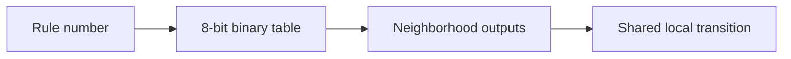

+++
date = '2026-08-10T18:22:00+01:00'
draft = false
title = 'Cellular Automata From First Principles 02: Encode All 256 Elementary Rules'
categories = ['Programming', 'Simulation']
tags = ['Cellular Automata', 'Python', 'Rule 30', 'Rule 110']
series = ['Cellular Automata From First Principles']
+++

# Cellular Automata From First Principles 02: Encode All 256 Elementary Rules

An elementary cellular automaton has only three inputs per cell:

```text
left centre right
```

Each input is one bit.

That means there are only eight possible neighborhoods:

```text
111 110 101 100 011 010 001 000
```

For each neighborhood the rule chooses either `0` or `1`.

Eight binary choices means:

```text
2^8 = 256
```

possible rules.

The elegant part is that we can store one complete rule table in one byte.

---

## Rule numbers are lookup tables

Take Rule 30.

Thirty in eight-bit binary is:

```text
00011110
```

Read those bits against the neighborhoods in descending order:

| Neighborhood | Output |
|---|---:|
| 111 | 0 |
| 110 | 0 |
| 101 | 0 |
| 100 | 1 |
| 011 | 1 |
| 010 | 1 |
| 001 | 1 |
| 000 | 0 |

So the rule number is not a mysterious label.

It is the transition table encoded as an integer.



---

## Turn a neighborhood into an index

A three-bit neighborhood already has a natural integer value:

```text
000 -> 0
001 -> 1
010 -> 2
011 -> 3
100 -> 4
101 -> 5
110 -> 6
111 -> 7
```

We can compute that without strings:

```python
def neighborhood_index(left, centre, right):
    return (left << 2) | (centre << 1) | right
```

Then extract the corresponding bit from the rule number:

```python
def elementary_rule(rule_number, left, centre, right):
    index = neighborhood_index(left, centre, right)
    return (rule_number >> index) & 1
```

That one function can execute any elementary rule from `0` to `255`.

There is a useful consistency check here. For Rule 30, neighborhood `100` has index `4`, so:

```text
(30 >> 4) & 1 = 1
```

which matches the table above.

---

## A complete simulator

```python
import numpy as np


def step(state, rule_number):
    next_state = np.zeros_like(state)

    for i in range(len(state)):
        left = state[(i - 1) % len(state)]
        centre = state[i]
        right = state[(i + 1) % len(state)]
        next_state[i] = elementary_rule(
            rule_number, left, centre, right
        )

    return next_state


def run(rule_number, width=101, generations=100):
    state = np.zeros(width, dtype=np.uint8)
    state[width // 2] = 1

    history = [state.copy()]

    for _ in range(generations - 1):
        state = step(state, rule_number)
        history.append(state.copy())

    return np.array(history)
```

Now exploring a different automaton is just:

```python
history = run(30)
```

or:

```python
history = run(110)
```

or:

```python
history = run(184)
```

The engine stays fixed.

Only the local law changes.

---

## Generate every rule

```python
import matplotlib.pyplot as plt

fig, axes = plt.subplots(16, 16, figsize=(16, 16))

for rule_number, ax in enumerate(axes.flat):
    history = run(rule_number, width=63, generations=40)
    ax.imshow(history, cmap="binary", interpolation="nearest")
    ax.set_title(str(rule_number), fontsize=6)
    ax.axis("off")

plt.tight_layout()
plt.show()
```

The book's reproducible figure script generates the same experiment as a canonical asset:

```bash
python scripts/figures/cellular-automata/part01_foundations.py 02
```


This is one of the best experiments in the subject.

The rules have exactly the same:

- grid,
- state space,
- neighborhood,
- initial condition,
- execution engine.

Only eight output bits differ.

Yet the resulting systems look radically different.

That is emergence in a form we can inspect directly.

---

## Compare rules by measurements, not just pictures

A visual catalog is useful, but we can also measure the histories.

### Density

```python
def density(history):
    return history.mean(axis=1)
```

This tells us what fraction of cells are active at each generation.

### Change rate

```python
def change_rate(history):
    return np.mean(history[1:] != history[:-1], axis=1)
```

This measures how much each generation differs from the previous one.

### Spatial entropy

For a binary row with active-cell probability `p`:

```python
import numpy as np


def binary_entropy(row):
    p = row.mean()
    if p in (0.0, 1.0):
        return 0.0
    return -(p * np.log2(p) + (1 - p) * np.log2(1 - p))
```

This quantity measures the balance between zeros and ones in one row. It does **not** by itself measure spatial organization: two rows with the same density have the same binary entropy even if one contains long blocks and the other alternates rapidly.

That limitation is useful. It teaches us to ask what a metric actually observes rather than giving a number more meaning than it has.

These are crude measurements, but they change the question from:

> Which rule looks complicated?

to:

> Which observable properties distinguish one dynamical regime from another?

That is a much stronger habit.

---

## Initial conditions matter too

A single central cell is convenient, but it is not the whole story.

Try a random state:

```python
rng = np.random.default_rng(42)
state = rng.integers(0, 2, size=101, dtype=np.uint8)
```

Or a repeating pattern:

```python
state = np.resize(np.array([1, 0, 0], dtype=np.uint8), 101)
```

A cellular automaton is a dynamical system.

The behavior belongs to the combination:

```text
rule + initial state + boundary conditions + update scheme
```

not to the rule number alone.

---

## The important abstraction

We can now separate the system into three pieces:

```text
encoding
  rule number -> transition table

runtime
  neighborhood -> update -> next generation

experiment
  initial state + duration + measurements
```

That is already enough to build a serious exploration tool.

In the next chapter we will focus on one of the most famous rules in the catalog: **Rule 30**.

Its local rule is tiny.

Its global pattern looks anything but tiny.