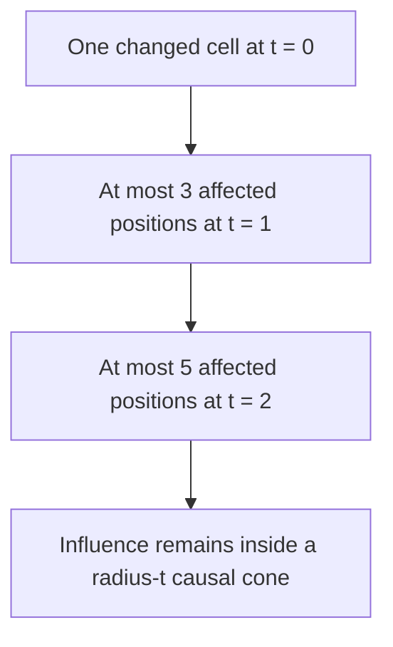

+++
date = '2026-08-10T18:23:00+01:00'
draft = false
title = 'Cellular Automata From First Principles 03: Rule 30 and the Surprise of Complexity'
categories = ['Programming', 'Simulation']
tags = ['Cellular Automata', 'Python', 'Rule 30', 'Emergence']
series = ['Cellular Automata From First Principles']
+++

# Cellular Automata From First Principles 03: Rule 30 and the Surprise of Complexity

Rule 30 is a perfect demonstration of why cellular automata are worth studying.

Its transition table contains eight bits:

```text
111 110 101 100 011 010 001 000
 0   0   0   1   1   1   1   0
```

Start from one active cell and repeatedly apply that rule.

The result rapidly stops looking like something generated by a tiny deterministic program.

One side develops visible structure.

The centre produces repeated motifs.

Large parts of the pattern look irregular.

The important lesson is not that Rule 30 is "random."

It is completely deterministic.

The lesson is that **determinism does not imply simple-looking behavior**.

---

## Generate Rule 30

Using the simulator from the previous chapter:

```python
history = run(rule_number=30, width=241, generations=120)

import matplotlib.pyplot as plt

plt.figure(figsize=(12, 8))
plt.imshow(history, cmap="binary", interpolation="nearest")
plt.title("Rule 30")
plt.xlabel("cell")
plt.ylabel("generation")
plt.show()
```

The canonical book figure is generated with:

```bash
python scripts/figures/cellular-automata/part01_foundations.py 03
```


The initial state contains almost no information:

```text
one active cell
```

The rule contains only one byte of choices.

Yet the history becomes visually rich.

---

## Follow one column through time

A useful experiment is to treat one cell position as a sensor.

```python
centre_column = history[:, history.shape[1] // 2]
print("".join(map(str, centre_column)))
```

We can inspect any vertical slice:

```python
for offset in (-20, -10, 0, 10, 20):
    column = history[:, history.shape[1] // 2 + offset]
    print(offset, "".join(map(str, column)))
```

This changes our perspective.

The image view asks:

> What spatial structure does the automaton produce?

The column view asks:

> What signal does a fixed location experience through time?

The same automaton can therefore be studied as both pattern generator and signal generator.

---

## Sensitivity to initial conditions

Let's compare two worlds that differ by one cell.

```python
width = 241

a = np.zeros(width, dtype=np.uint8)
a[width // 2] = 1

b = a.copy()
b[width // 2 + 7] = 1
```

Run both:

```python
def run_from_state(initial_state, rule_number, generations):
    state = initial_state.copy()
    history = [state.copy()]

    for _ in range(generations - 1):
        state = step(state, rule_number)
        history.append(state.copy())

    return np.array(history)

ha = run_from_state(a, 30, 100)
hb = run_from_state(b, 30, 100)
```

Now measure their disagreement:

```python
difference = ha != hb
fraction_different = difference.mean(axis=1)
```

Plot it:

```python
plt.plot(fraction_different)
plt.xlabel("generation")
plt.ylabel("fraction of different cells")
plt.show()
```


A one-cell change can propagate through the light cone permitted by the local neighborhood.

That phrase matters: **local causality constrains the speed of influence**.

With radius-one neighborhoods, information cannot jump arbitrarily far in one update.

---

## Draw the causal cone

Suppose a perturbation starts at position `i` at time `t = 0`.

After one step, only these cells can have been affected:

```text
i-1  i  i+1
```

After two steps:

```text
i-2 ... i+2
```

After `t` steps, no effect can exist outside:

```text
[i - t, i + t]
```



So even when the resulting pattern looks chaotic, it is still governed by strict local propagation.

This is a useful theme in distributed systems too: locality constrains causality even when the aggregate behavior becomes difficult to predict.

---

## Complexity is not the same as randomness

We can compare Rule 30 with genuinely independent random bits.

```python
rng = np.random.default_rng(7)
random_history = rng.integers(
    0, 2, size=history.shape, dtype=np.uint8
)
```

Both may look irregular.

But Rule 30 contains spatial and temporal dependencies because every cell is produced from a specific local predecessor state.

A good exploration therefore asks more than whether two images "look random."

We can compare:

- cell density,
- run lengths,
- neighborhood frequencies,
- autocorrelation,
- compressibility,
- perturbation growth.

For example, crude compression gives us a quick diagnostic:

```python
import zlib


def compression_ratio(array):
    raw = array.tobytes()
    compressed = zlib.compress(raw)
    return len(compressed) / len(raw)
```

This is not a formal complexity measure. It depends on the compressor, representation and sample size, but it is still a useful diagnostic when those choices are held constant.

---

## A vectorized Rule 30 step

The loop implementation is ideal for learning.

NumPy lets us express the same neighborhood operation over the whole row:

```python
def step_vectorized(state, rule_number):
    left = np.roll(state, 1)
    centre = state
    right = np.roll(state, -1)

    index = (left << 2) | (centre << 1) | right
    return ((rule_number >> index) & 1).astype(np.uint8)
```

Now:

```python
state = step_vectorized(state, 30)
```

The conceptual model has not changed.

We merely moved the cell loop into array operations.

This gives us a recurring performance principle for the book:

> **First make the local rule obvious. Then make the execution fast.**

---

## What Rule 30 teaches us

Rule 30 gives us several important ideas in one small system:

```text
simple deterministic law
        +
minimal initial state
        |
        v
rich global history
```

It also teaches us to separate three claims:

```text
hard to predict
!= random
!= nondeterministic
```

A deterministic local system can be difficult to summarize globally.

That gap between local simplicity and global behavior is the territory cellular automata let us explore.

In the next chapter we will look at a different kind of surprise: an elementary cellular automaton whose dynamics can support universal computation—**Rule 110**.