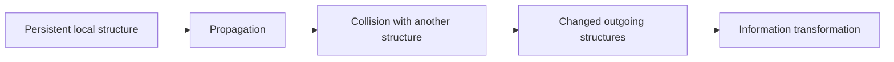

+++
date = '2026-08-10T18:24:00+01:00'
draft = false
title = 'Cellular Automata From First Principles 04: Rule 110 and Computation in a Grid'
categories = ['Programming', 'Simulation']
tags = ['Cellular Automata', 'Python', 'Rule 110', 'Computation']
series = ['Cellular Automata From First Principles']
+++

# Cellular Automata From First Principles 04: Rule 110 and Computation in a Grid

Rule 110 looks like another one-byte transition table.

```text
111 110 101 100 011 010 001 000
 0   1   1   0   1   1   1   0
```

But its behavior gives us a much deeper idea: a cellular automaton can become a computational medium.

The important shift is this:

```text
pattern generator
      ->
signal system
      ->
computation
```

Rule 110 is computationally universal. Matthew Cook published the universality proof in *Complex Systems* in 2004, showing that this elementary one-dimensional automaton can emulate universal computation.

The proof is much more elaborate than anything we need in this chapter. We are not going to pretend that a visually interesting Rule 110 run somehow proves universality.

Instead, we will study the mechanism that makes the result plausible: structured backgrounds, localized disturbances, propagation and interaction.

Primary reference: [Matthew Cook, “Universality in Elementary Cellular Automata”](https://doi.org/10.25088/ComplexSystems.15.1.1).

---

## Run Rule 110

A single-cell seed is useful for comparing elementary rules, but Rule 110's characteristic mixture of domains and disturbances is easier to see from a richer initial state.

```python
rng = np.random.default_rng(110)
initial = rng.integers(0, 2, size=241, dtype=np.uint8)

history = run_from_state(
    initial_state=initial,
    rule_number=110,
    generations=160,
)
```

Visualize it:

```python
import matplotlib.pyplot as plt

plt.figure(figsize=(12, 8))
plt.imshow(history, cmap="binary", interpolation="nearest")
plt.title("Rule 110")
plt.xlabel("cell")
plt.ylabel("generation")
plt.show()
```

The canonical book figure is generated with:

```bash
python scripts/figures/cellular-automata/part01_foundations.py 04
```


The important observation is not simply that the image is complicated.

Look for the coexistence of:

```text
repeating domains
localized defects
moving boundaries
interactions between structures
```

That mixture is much more interesting computationally than visual irregularity alone.

---

## Patterns can act like signals

Imagine a repeating background with a localized defect moving through it.

Conceptually:

```text
background background [defect] background background
                           --->
```

If the defect persists, its position and type can carry information.

If two defects collide and the collision produces another persistent pattern, the interaction can transform information.



That gives us the ingredients from which computation can be constructed:

```text
persistent structures
        +
controlled movement
        +
interactions
        =
computational substrate
```

This idea appears again in Conway's Game of Life, where gliders make the signal interpretation especially visual.

---

## Detect local activity

We can start analyzing Rule 110 without knowing the names of every structure.

One simple tool is a temporal activity map:

```python
activity = history[1:] != history[:-1]

plt.figure(figsize=(12, 8))
plt.imshow(activity, cmap="binary", interpolation="nearest")
plt.title("Cells that changed")
plt.show()
```

Another is neighborhood frequency:

```python
from collections import Counter


def neighborhood_counts(row):
    counts = Counter()
    for i in range(len(row)):
        n = (
            int(row[(i - 1) % len(row)]),
            int(row[i]),
            int(row[(i + 1) % len(row)]),
        )
        counts[n] += 1
    return counts
```

These tools do not identify Cook's computational construction for us.

They do something more basic and reusable: they turn the automaton into a system we can interrogate rather than merely watch.

---

## Computation does not need a CPU-shaped machine

Programmers are used to computation looking like this:

```text
instruction
register
memory
branch
instruction
```

Cellular automata show another possibility:

```text
local state
local interaction
propagating pattern
collision
new pattern
```

The computation is embodied in the dynamics.

There is no separate processor walking over passive memory. The state of the world and the process transforming that state are intertwined.

That is one reason cellular automata connect naturally to distributed and unconventional computing.

---

## Build a perturbation experiment

Start from the same random world twice, then flip one bit.

```python
rng = np.random.default_rng(4)
base = rng.integers(0, 2, size=201, dtype=np.uint8)
changed = base.copy()
changed[100] ^= 1

ha = run_from_state(base, 110, 120)
hb = run_from_state(changed, 110, 120)

diff = ha != hb
```

Visualize the difference:

```python
plt.imshow(diff, cmap="binary", interpolation="nearest")
plt.title("Propagation of one-bit perturbation")
plt.show()
```

This experiment gives us a visual map of causal influence.

The broader lesson is useful:

> A computation can be studied as the propagation and transformation of distinctions in state.

That statement alone does not prove that a system is universal. It gives us a practical lens for looking for information-bearing dynamics.

---

## Rule 30 versus Rule 110

It is useful to place the two famous rules side by side.

```text
Rule 30
- strong visual irregularity
- excellent example of simple rule -> complex history

Rule 110
- regular domains plus interacting local structures
- proven capable of universal computation
```

Neither label tells the whole story.

The point is to learn to inspect a dynamical system in terms of:

- persistent structures,
- information propagation,
- perturbation growth,
- collisions,
- attractors,
- and measurable state change.

---

## From one dimension to two

One-dimensional automata are wonderful because time gives us the second visual axis.

But two-dimensional grids let structures move *inside the world itself*.

That is where one cellular automaton became iconic.

In the next chapter we move to **Conway's Game of Life** and build its complete rule from first principles.