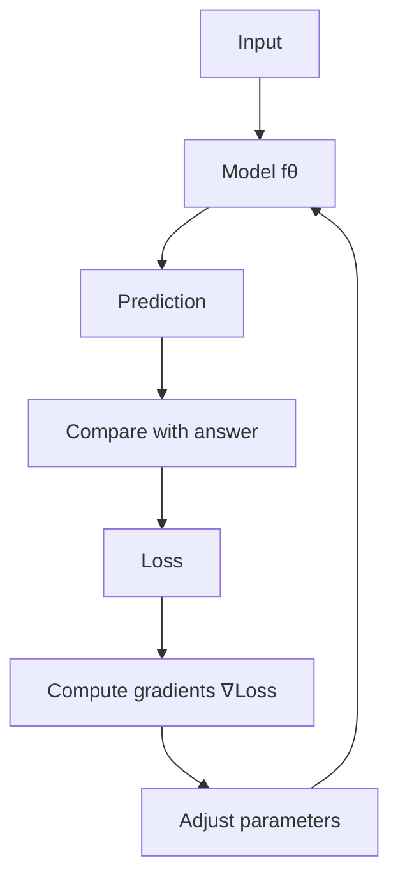
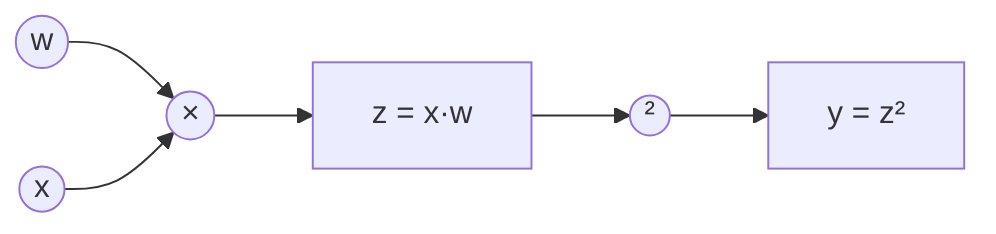

+++
date = '2026-08-08T12:40:00+01:00'
draft = false
title = 'PyTorch Zero to Hero 00: What Are We Actually Doing?'
categories = ['AI', 'PyTorch']
tags = ['pytorch', 'deep learning', 'machine learning', 'neural networks', 'AI']
series = ['PyTorch: Zero to Hero']
+++

## PyTorch: Zero to Hero

This is **Step 0** of a practical PyTorch series that starts with tensors and ends with building a small language model from scratch.

The goal is not to learn a collection of PyTorch commands.

The goal is to understand what the framework is doing well enough that the commands stop looking like magic.

By the end of the series we will have moved through tensors, gradients, neural networks, data pipelines, convolutional networks, attention, transformers, training, performance, and finally a small language model.

But before writing a neural network, there is a more important question:

> **What are we actually doing when we train one?**

---

## The shortest possible explanation

A neural network is a function with adjustable numbers.

We give it some input.

It produces an output.

We measure how wrong that output is.

Then we adjust the numbers so that next time it is slightly less wrong.

That is the core loop.



Deep learning becomes complicated because modern models may contain billions of those adjustable numbers and enormous chains of mathematical operations.

The underlying idea does not change.

PyTorch helps us represent the numbers, perform the calculations, remember how those calculations were connected, calculate the gradients, and update the parameters efficiently.

That is what we are going to unpack in this series.

---

## Start with a function

Forget neural networks for a moment.

Suppose the world follows this simple rule:

```text
y = 3x
```

If `x` is `2`, the answer is `6`.

But imagine we do not know that the multiplier is `3`.

We only know that our model looks like this:

```text
y = wx
```

The value `w` is a parameter we want to learn.

Start with a bad guess:

```text
w = 1
```

For `x = 2`, our model predicts:

```text
2 × 1 = 2
```

The correct answer is `6`, so the model is wrong.

Now we need some way of measuring *how wrong* it is.

One simple loss function is squared error:

```text
loss = (prediction - answer)²
```

For our prediction:

```text
loss = (2 - 6)²
     = 16
```

Training means finding a change to `w` that reduces that loss.

We could try random values until something works, but there is a much better method.

We can calculate the **gradient**.

The gradient tells us how the loss changes when we change a parameter.

That is the first major idea behind training neural networks.

---

## Now do it in PyTorch

Install PyTorch using the installation command appropriate for your operating system and hardware from the official PyTorch site, then open Python and try this:

```python
import torch

x = torch.tensor([2.0])
w = torch.tensor([1.0], requires_grad=True)   # we want to learn w
target = torch.tensor([6.0])

prediction = x * w
loss = (prediction - target) ** 2

loss.backward()   # magic happens here

print("prediction:", prediction.item())
print("loss:", loss.item())
print("gradient:", w.grad.item())
```

You should get:

```text
prediction: 2.0
loss: 16.0
gradient: -16.0
```

There is a lot happening in those few lines.

The most important line is:

```python
loss.backward()
```

PyTorch works backwards through the operations that produced `loss` and calculates how the loss changes with respect to `w`.

That value ends up here:

```python
w.grad
```

For this example the gradient is `-16`.

The negative sign tells us that increasing `w` will reduce the loss.

So we can change `w` slightly in that direction.

---

## Take one learning step

Let's update the parameter manually.

```python
learning_rate = 0.1

with torch.no_grad():   # we don't want to track this update as part of the graph
    w -= learning_rate * w.grad

print(w)
```

The new value of `w` is:

```text
tensor([2.6000], requires_grad=True)
```

Our original guess was `1`. After one step PyTorch has moved it toward the correct value, `3`.

Run the calculation again with `w = 2.6`:

```text
prediction = 2 × 2.6
           = 5.2
```

The prediction has moved from `2` to `5.2`.

The correct answer is `6`.

One gradient step made the model much better.

That is training.

Not metaphorically.

That is the mechanism we will keep scaling up.

---

## A complete training loop

Now repeat the process – and wrap it in a proper loop.

```python
import torch

x = torch.tensor([2.0])
target = torch.tensor([6.0])
w = torch.tensor([1.0], requires_grad=True)

learning_rate = 0.1

for step in range(10):
    prediction = x * w
    loss = (prediction - target) ** 2

    loss.backward()                       # compute gradients

    with torch.no_grad():                 # don't track the parameter update
        w -= learning_rate * w.grad

    w.grad.zero_()                        # reset gradients for next step

    print(
        f"step={step:02d} "
        f"w={w.item():.6f} "
        f"prediction={prediction.item():.6f} "
        f"loss={loss.item():.6f}"
    )
```

You should see `w` rapidly approach `3` and the loss approach zero.

Notice the sequence:

```text
predict → measure error → calculate gradients → update parameters
```

Those operations contain the skeleton of a real neural-network training loop.

Later we will replace the single parameter `w` with thousands, millions, or potentially billions of parameters.

We will replace `x * w` with layers of matrix multiplication, nonlinear activations, convolutions, attention and transformer blocks.

We will replace the manual parameter update with an optimizer such as Adam.

Conceptually, though, we will still be doing the same thing.

---

## Visualising progress: tracking the loss

A plain list of numbers is fine, but seeing the loss drop on a curve makes the story even clearer.  
Here’s the same loop that stores the loss values and plots them at the end:

```python
import torch
import matplotlib.pyplot as plt

x = torch.tensor([2.0])
target = torch.tensor([6.0])
w = torch.tensor([1.0], requires_grad=True)
lr = 0.1
num_steps = 20
losses = []

for step in range(num_steps):
    prediction = x * w
    loss = (prediction - target) ** 2
    loss.backward()

    with torch.no_grad():
        w -= lr * w.grad
    w.grad.zero_()

    losses.append(loss.item())

plt.plot(range(num_steps), losses, marker='o')
plt.xlabel('Step')
plt.ylabel('Loss')
plt.title('Learning w = 3 with one data point')
plt.grid(True)
plt.show()
```

You’ll see the loss plunge toward zero as `w` approaches `3`.  
Add this visual habit early – a learning curve often tells you more than a single number.

---

## So what is a tensor?

You may have noticed that we did not use ordinary Python numbers.

Instead we wrote:

```python
x = torch.tensor([2.0])
```

A tensor is the fundamental data structure in PyTorch.

A scalar can be represented as a zero-dimensional tensor.

A list of numbers is a one-dimensional tensor.

A table of numbers is a two-dimensional tensor.

Images, batches of images, audio, token embeddings and model parameters can all be represented as higher-dimensional tensors.

```python
scalar = torch.tensor(5.0)               # 0‑D
vector = torch.tensor([1.0, 2.0, 3.0])   # 1‑D
matrix = torch.tensor([                  # 2‑D
    [1.0, 2.0],
    [3.0, 4.0],
])

print(scalar.shape)  # torch.Size([])
print(vector.shape)  # torch.Size([3])
print(matrix.shape)  # torch.Size([2, 2])
```

Almost every difficult-looking problem in PyTorch eventually becomes a question about tensors and their shapes.

That is why **Step 1 of this series is entirely about tensors**.

---

## Why not just use NumPy?

At first glance, much of PyTorch looks like NumPy.

You can perform familiar operations such as:

```python
x + y
x * y
x @ y
x.mean()
x.sum()
x.reshape(...)
```

But PyTorch adds several capabilities that are essential for deep learning.

### Automatic differentiation

If a tensor has:

```python
requires_grad=True
```

PyTorch can track the operations involving that tensor and calculate derivatives later.

That is what allowed this to work:

```python
loss.backward()
```

### Accelerators

The same tensor operations can run on CPUs and supported accelerators.

Conceptually, code can move a tensor to another device and perform the same mathematical operation there.

### Neural-network building blocks

PyTorch provides layers, loss functions, optimizers and other components in packages such as:

```python
import torch.nn as nn
import torch.optim as optim
```

We are deliberately **not** starting with those abstractions.

If we started with:

```python
optimizer.step()
```

without understanding gradients, the optimizer would appear to be a magic box.

By the time we introduce it, you should already understand what job it is doing for us.

---

## What PyTorch remembers

Consider this:

```python
x = torch.tensor([2.0])
w = torch.tensor([3.0], requires_grad=True)

z = x * w
y = z ** 2
```

We can think of this as a chain:



To determine how changing `w` changes `y`, PyTorch needs to know how the operations connect.

When gradient tracking is enabled, PyTorch records the information needed for automatic differentiation while the forward computation happens.

Then:

```python
y.backward()
```

works backwards through that computation – effectively reversing the arrows above and passing gradients backward.

For now, remember this:

> **PyTorch does not merely store numbers. It can also track the mathematical relationships between operations on those numbers.**

That capability is what makes this tiny example and an enormous neural network part of the same programming model.

---

## Neural networks are the same idea at a different scale

A neuron can be written roughly as:

```text
output = activation(inputs × weights + bias)
```

A layer performs many such operations together.

A network stacks layers.

Training calculates how much each weight contributed to the final error and changes the weights accordingly.

So when you eventually see:

```python
class Model(nn.Module):
    def __init__(self):
        super().__init__()
        self.fc1 = nn.Linear(784, 128)
        self.fc2 = nn.Linear(128, 10)
```

I do not want that code to mean:

> "PyTorch neural-network incantation."

I want you to see collections of learnable tensors being used in mathematical operations whose gradients PyTorch can calculate.

That is the difference between learning an API and learning the system.

---

## CPU, GPU and device

Eventually our computations will become large enough that execution hardware matters.

PyTorch tensors live on a device.

```python
x = torch.tensor([1.0, 2.0, 3.0])
print(x.device)
```

For a normal CPU tensor you will see:

```text
cpu
```

PyTorch can also execute tensor operations on supported accelerators.

For this first article, stay on the CPU.

Our model has one parameter. A GPU is not going to rescue us from multiplying two numbers.

Later, device placement will matter a great deal.

---

## Three things to understand before moving on

You do **not** need to understand all of calculus before using PyTorch.

But three ideas from this article should be clear.

### 1. A model contains parameters

These are numbers whose values can change during training.

In our tiny model, `w` was the parameter.

### 2. A loss measures error

The loss converts "how good was the prediction?" into a quantity we can optimize.

Our loss was:

```text
(prediction - target)²
```

### 3. Gradients tell us how to change the parameters

PyTorch's automatic differentiation lets us calculate these efficiently.

Then an optimization rule uses them to update the model.

Everything else we build will elaborate on these three ideas.

---

## Challenge: make PyTorch discover another number

Before moving to Step 1, change the problem.

Suppose:

```text
y = 5x
```

Create training examples such as:

```text
x = 1 → y = 5
x = 2 → y = 10
x = 3 → y = 15
x = 4 → y = 20
```

Start `w` at a deliberately bad value and train it.

Can you get PyTorch to discover that:

```text
w ≈ 5
```

Then try changing the learning rate:

```text
0.001
0.01
0.1
1.0
```

Don’t just look for the value that works.

**Watch what happens to the loss.**  
Here’s a small experiment to help you see the difference:

```python
import torch
import matplotlib.pyplot as plt

X = torch.tensor([1.0, 2.0, 3.0, 4.0])
Y = 5.0 * X

learning_rates = [0.001, 0.01, 0.1, 1.0]
num_steps = 30

plt.figure(figsize=(10, 4))

for lr in learning_rates:
    w = torch.tensor([0.5], requires_grad=True)   # bad initial guess
    losses = []
    for _ in range(num_steps):
        pred = X * w
        loss = ((pred - Y) ** 2).mean()
        loss.backward()
        with torch.no_grad():
            w -= lr * w.grad
        w.grad.zero_()
        losses.append(loss.item())
    plt.plot(range(num_steps), losses, label=f'lr={lr}')

plt.yscale('log')
plt.xlabel('Step')
plt.ylabel('Loss (log scale)')
plt.title('Effect of learning rate')
plt.legend()
plt.grid(True)
plt.show()
```

A learning rate that is too large can make the loss explode or oscillate.  
A learning rate that is too small makes progress painfully slow.  
We will return to this question later when we introduce optimisers.

---

## Where the series goes next

```text
Step 00 — What Are We Actually Doing?
Step 01 — Tensors: The Language of PyTorch
Step 02 — Gradients: How PyTorch Learns
Step 03 — Build a Neural Network Without nn.Module
Step 04 — Now Let PyTorch Do the Plumbing
Step 05 — Real Data: Dataset, DataLoader and Training Loops
Step 06 — CNNs: Teaching PyTorch to See
Step 07 — Attention and Transformers From Scratch
Step 08 — Train Something Real
Step 09 — Performance, Compilation and Scale
Step 10 — Build a Small Language Model From Scratch
```

In the next post we will slow down and properly examine the object underneath almost everything PyTorch does:

**the tensor.**
