## 00: What Would Digital Life Mean?

Suppose life were possible in software.

What would we actually be looking for?

The honest answer is that we do not know yet, and that is the reason for this book.

We could certainly build something that looks alive: a graphical creature, an animated agent, a personality-driven assistant. That is not the experiment. The harder question is whether a computational system can produce, through its own operation, properties that justify some of the language we associate with living things.

Produce them, rather than declare them.

That sounds simple until we try to say what those properties are.

We reach immediately for a familiar vocabulary:

```text
structure
persistence
response
adaptation
repair
memory
reproduction
inheritance
evolution
```

Those words are useful.

They are also dangerous.

Because the easiest way to build something that looks like digital life is to put the vocabulary of life directly into the program. We can write:

```python
class Metabolism:
    ...

class Memory:
    ...

class Reproduction:
    ...

class Organism:
    ...
```

and within an afternoon produce software that is unmistakably biologically inspired.

What we would not know is whether any of those biological words describe properties of the system rather than decisions made by its programmer.

Calling a method `reproduce()` does not establish reproduction.

Calling a number `energy` does not establish metabolism.

Writing state to disk does not establish memory. Copying a configuration does not establish inheritance. Running an optimizer does not establish evolution.

The names are ours.

The evidence has to come from the system.

That is where this book begins.

---

## The Cargo Cult of Life

A cargo cult copies the visible form of something without reproducing the mechanism that made the original work.

Artificial life has an obvious version of this problem. We can borrow the vocabulary of biology — cell, organism, energy, fitness, birth, death, memory, inheritance, evolution — and then build software structures carrying those names. The result may be complicated. It may be beautiful. It may even be useful.

But the terminology proves nothing.

So we will work under a stricter rule.

> **We do not get to claim a life-like property merely because we implemented something with the same name.**

If we claim persistence, we must measure persistence.

If we claim regeneration, we must damage the system and measure what returns.

If we claim learning, some measurable performance must change because of experience.

If we claim inheritance, something useful must pass from one continuation or successor to another.

If we claim reproduction, visual resemblance between an earlier structure and a later one is not enough. We need evidence that the earlier organization participated causally in producing the later one.

And if we claim evolution, we will have to be precise about what varies, what persists, what is selected, and what actually changes through time.

The goal is not to make software sound alive.

The goal is to discover which descriptions the system can actually earn.

---

## But There Is a Second Trap

Avoiding biological vocabulary is not enough, because there is a mistake available in the opposite direction.

We could decide in advance what life must contain:

```text
boundary
metabolism
death
reproduction
inheritance
selection
```

and then spend the rest of the book manufacturing those properties one at a time.

That would be better than naming classes after them. It would still smuggle in an assumption:

> that digital life must solve the same problems, in the same way, that biological life does.

Why should it?

Biological organisms exist under very particular constraints. They occupy physical bodies. Matter is expensive to rearrange. Copying an organism is difficult and slow. Bodies degrade. Individuals die. Acquired knowledge is only partially transferable to a successor. Lineages branch and generally do not merge.

A computational substrate has a different set of possibilities and a different set of costs. Copies can be nearly free. State can be checkpointed and restored. A process can move between machines. Two lineages can fork and later merge. Acquired information can, at least in principle, be transferred directly. One organization can be distributed across many locations. A digital system might simply grow, and never reproduce at all.

None of this means computation is unconstrained. Quite the opposite. It means that if digital life is possible, its important constraints may be computational rather than biological — and we should not decide in advance what those constraints will be.

So this book will not open with a checklist called `REQUIREMENTS FOR LIFE`.

We do not know the requirements.

We do not even know whether "requirements" is the right way to think about the problem.

Discovering what survives is the experiment.

---

## Biology Is Evidence, Not Specification

For centuries people watched birds and tried to understand flight.

Birds have feathers, wings, hollow bones, flight muscles, flapping motion. All of that was worth studying, and studying it was how the problem became tractable at all. But successful aircraft did not require us to manufacture an artificial bird. The important discoveries were underneath the anatomy:

```text
lift
drag
thrust
stability
control
```

Birds were evidence that flight was possible. They were not the engineering specification.

Life may be similar.

Biology gives us one extraordinarily successful implementation, and the only one we can currently examine. But an organism is a solution shaped by the medium it is made from, and many of its most familiar features may be consequences of that medium rather than universal requirements for whatever forms organized persistence might take elsewhere.

So the task of this book is not:

> Build a digital animal.

It is:

> **Discover the aerodynamics of digital life.**

Which mechanisms actually matter? Which properties arise on their own? Which biological constraints simply vanish in a computational substrate — and what new constraints appear in their place? Which things we assume are fundamental turn out to be solutions biology found for the specific problem of living in the physical world?

We should not answer any of that in advance.

---

## Do Not Trust What Looks Alive

There is a further problem, and it is not in the software. It is in us.

A complicated-looking simulation can be mesmerizing. We can generate a beautiful animation and immediately feel that something profound is happening. Maybe it is. Maybe it is not. Random noise can look complicated. A short-lived transient can look extraordinary in the moment just before it disappears. A periodic system can look chaotic if we watch too small a window. A pattern can resemble an organism while possessing no property beyond its geometry.

Surprise is cheap.

And humans are extremely good at turning motion into nouns.

We see a shape move, and start saying *it travelled*. We see one shape become two, and start saying *it reproduced*. We see several structures move together, and start saying *they flocked*. The upgrade happens in under a second, and it happens before any measurement has been taken.

Those words may eventually be justified. The animation does not justify them.

So the book insists throughout on a distinction that is easy to state and surprisingly hard to maintain:

> **The phenomenon and our explanation of the phenomenon are not the same thing.**

Something can genuinely happen while our name for what happened is completely wrong.

Calling something memory does not establish memory. Calling something reproduction does not establish reproduction. Calling a region an individual does not establish individuality. Calling a number energy does not establish metabolism.

The observation may survive even when the interpretation does not.

Which gives us a second rule:

> **Look first. Then try to destroy your own interpretation.**

---

## Even Our Nouns Will Have to Earn Their Place

This applies to the small words as well as the impressive ones.

Suppose a pattern persists while moving through a lattice. Is it an object? Perhaps. Suppose the visible pattern disappears and an equivalent pattern reappears elsewhere. Is it the same object? Perhaps not. Suppose two disconnected regions participate in one continuing causal process — are they two things, or one distributed thing? Suppose two structures look identical but have entirely independent histories. Are they the same kind of object? Yes. Are they the same individual? Probably not.

We will begin with simple geometric definitions, because they are measurable and because we have to begin somewhere. But we should hold them loosely.

> **The visible boundary of a pattern may not be the true boundary of a digital individual.**

Persistence immediately creates the same problem.

A program can persist indefinitely by doing nothing:

Reproduction deserves the same suspicion. Biology makes it look unavoidable because organisms die and lineages continue by producing successors. A digital process might instead continue, grow, fork, checkpoint, merge, or transfer acquired state directly.

So the useful question is not simply:

> Does it reproduce?

but:

> **Under what computational conditions does reproduction become useful or necessary at all?**

Evolution raises the same problem. Digital inheritance could include acquired state, learned parameters, external memory or even modified code. Branches might exchange what they learned or merge again.

So instead of assuming that biological evolution is the universal route to cumulative change, we ask the broader question:

> **How can useful organization accumulate through time in a computational substrate?**

Biological evolution is one answer.

We do not yet know what the other answers are.

Behind all of these sit questions the book keeps returning to, and does not resolve early:

What if the visible object is not the important unit?

What if digital scarcity is nothing like biological energy?

What if history matters without anything we would recognize as memory?

What if reproduction is not fundamental?

What if computation offers primitives that biology never had available?

For now, every one of those questions remains open.

The point of the book is to resist closing them with vocabulary before the experiments close them with evidence.

---

## How This Book Will Find Out

The visual system gives us hypotheses. The experiment decides what survives.

So the same cycle runs through the entire book:

```text
SEE SOMETHING
↓
NAME THE HYPOTHESIS
↓
DEFINE WHAT WOULD COUNT AS EVIDENCE
↓
MEASURE IT
↓
BUILD A CONTROL
↓
LOOK FOR A CONFOUND
↓
BUILD A BETTER CONTROL
↓
KEEP ONLY WHAT SURVIVES
```

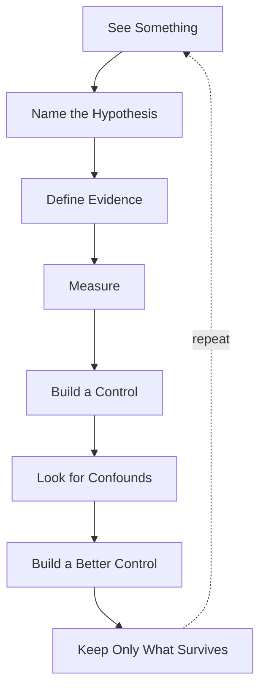

That repetition is deliberate.

Later chapters will return to this sequence again and again, because the procedure is part of the instrument. We cannot demand a control when we dislike a result and quietly omit it when we like one. We cannot tighten the standard of evidence for an inconvenient hypothesis and relax it for an exciting one.

The protocol repeats because the standard must remain the same while the questions change.

Three parts of the cycle do most of the work.

**Intervention.** Correlation is easy to obtain and hard to interpret. If we think a mechanism produces a capability, the strongest available move is to remove or disrupt that mechanism and measure what changes. If the capability does not depend on the mechanism, the explanation was wrong, however satisfying it looked.

**Controls.** A number alone means very little. A recovery score of 0.87 is impressive or unremarkable depending entirely on what an undamaged system scores, what a random process scores, and what a frozen copy scores. So every control in this book exists because there is a specific alternative explanation we are trying to eliminate — and the first control is often not good enough.

Discovering a confound in your own experiment is not a setback. It tells you that the result was carrying more than one possible explanation.

Remove one, and you may finally be able to see what remains.

**Bounded claims.** Compare:

> The system heals.

with a deliberately bounded statement such as:

> Under a defined perturbation, in a defined region, the system recovered a defined measure of structure within a defined observation window.

The second claim may sound less dramatic, but it tells us exactly what was measured, under which conditions, and where the conclusion stops.
 We know precisely what it asserts, and precisely what it does not. A bounded claim survives scrutiny because its edges are visible.

One consequence needs stating plainly, because it is where investigations usually go wrong.

The standard of evidence does not change when a hypothesis becomes attractive. It does not relax because the result would be exciting, and it does not tighten because the result is inconvenient. A beautiful animation generates a hypothesis. It never establishes an interpretation. If the strongest honest conclusion is smaller than the idea that motivated the experiment, then the smaller conclusion is the result.

---

## Expect Us to Be Wrong

This deserves to be explicit, because it is not a disclaimer. It is a description of what actually happened while the book was being written.

We form hypotheses that fail. We design controls that turn out to be inadequate. We produce measurements that look spectacular and then collapse when a confound appears. Sometimes we discover that a question we had been asking for three chapters was really two different questions wearing one name.

The recurring shape is roughly this:

```text
we expect X
↓
the experiment does not support X
↓
something else appears
↓
we investigate that
↓
the new interpretation may fail too
↓
a smaller or stranger phenomenon survives
```

That last line is the point.

This is not a book in which every chapter proposes a property and then successfully proves that property exists.

Quite often we went looking for one thing and were shown another.

Sometimes the first explanation failed. Sometimes the second failed too. Occasionally several experiments were needed before we understood what the system had been showing us all along.

That leads to one of the central rules of the investigation:

> **An explanation can die without the phenomenon dying.**

A failed interpretation does not oblige us to throw away the observation that killed it. Sometimes the observation is the discovery.

Something real can be happening in the system while the story we told about it is completely wrong. Separating those two things — the measurement that survives and the interpretation that does not — is most of the work.

We are not trying to prove that digital life exists.

We are trying to find out which claims remain standing after we attack them.

---

## How to Read the Experiments

The book operates at several depths, and not every reader needs all of them at once.

Some material is **concept**: the intellectual step in the argument, the reason a question is being asked at all. Some is **evidence**: the experiment, the measurement, the numbers that support the step. Some is **control and confound**: the attack on the interpretation, including the attacks that succeeded. Some is a **claim boundary**: an explicit statement of what the evidence permits and what it does not. And some is a **deep dive** — protocols, thresholds, discarded designs, seeds, implementation failures, the forensic record — which mostly lives in the appendices.

A reader following the conceptual journey can stay with the argument and the claim boundaries, and skip the detailed protocols without losing the thread.

A reader who wants to know why a claim was earned should read the evidence and the controls, because that is where the claim is actually made.

A reader who wants to audit or reproduce the work can go to the appendices, where the experimental record is kept deliberately unclean: the wrong metric before the better metric, the control that failed, the run that had to be discarded.

These are not simplified and "real" versions of the book. They are different depths of the same argument.

The conceptual reader can follow what changed.

The evidence reader can see why it changed.

The reproducing reader can inspect exactly how the result was obtained.

---

## There Is No Biological Ladder Here

We will meet many familiar properties along the way:

```text
structure
persistence
identity
damage tolerance
repair
reproduction
inheritance
adaptation
evolution
```

They should not be read as a ranking:

```text
LEVEL 1
↓
LEVEL 2
↓
LEVEL 3
↓
ALIVE
```

They are experimental questions, and each is allowed to fail. Some may turn out to be deeply important. Some may turn out to be consequences of biological constraints that a computational substrate does not have. Some may have digital equivalents that look nothing like their biological namesakes. Some may disappear from the final picture entirely.

The order in which we study these properties is a path through the investigation, not a ladder toward life.

Nothing earns points toward an `ALIVE` label.

Indeed, one possibility we have to preserve throughout the book is that some of the properties we began by treating as fundamental may turn out not to belong in the final picture at all.

---

## The Question We Are Actually Asking

At the end of this book we may still decline to say that anything we built is alive.

That would be an acceptable result. It might even be the correct one.

What matters is whether we can say things like:

```text
this structure persists under these conditions

this pattern fails under this perturbation

this organization restores part of its form after this damage

this later structure is causally descended from that earlier one

this earlier state measurably changes a later response

this effect survives this control

this apparent behaviour disappears when this confound is removed
```

Those are modest sentences. They are also somewhere solid to stand, which is more than most of the vocabulary we started with can offer.

And if enough surprising properties survive enough attempts to explain them away, a different question eventually becomes unavoidable. Not:

> Does this look alive?

But:

> **What kind of thing is actually here?**

That is the question this book keeps returning to.

We will repeatedly ask the system to show us something for which we already have a name. Sometimes it will.

Sometimes it will show us something else.

The job is to notice the difference.

---

## Where to Start

To ask any of this, we need a world simple enough that we can see what is happening.

Small computational systems — a lattice, a local rule, a clock — are almost ideal for this, and not because they resemble organisms. They do not. They are useful because they remove excuses. If something interesting happens inside a very large model, the explanation can disappear into millions of parameters and never be found. In a system with a handful of ingredients we can inspect every state, replay every step, flip one bit, run the counterfactual, compare neighbouring rules, and measure exactly what the perturbation did.

When a claim fails there, it has almost nowhere to hide.

That is what makes these systems worth beginning with. They are not models of life.

They are **experimental microscopes for emergence**.

---

In the next chapter we will calibrate the microscope.

We will begin with computational systems that make the temptation almost irresistible: shapes that move, persist, collide and appear to behave like things.

We will let ourselves see the creature.

Then we will start taking assumptions away.

Continuous state. Rich neighbourhoods. Complicated rules. Even the idea that a persistent pattern must be made from the same material from one moment to the next.

By the time almost nothing is left, we will already have encountered the problem that drives the rest of this book:

> **Computation can produce something worth explaining long before we know what to call it.**

---

## 01: Look at This Thing

Don't read anything yet.

Watch this.



Something is moving.

It appears to have a boundary. Different parts of it seem to behave differently — an edge that ripples, an interior that stays denser, a leading region that seems to pull the rest along. Its shape changes as it travels, and yet some larger organization survives those changes. Watch it for thirty seconds and you will start predicting what it is about to do.

If you saw this without context, biological language would arrive immediately.

A cell. A creature. An organism. Perhaps even an animal.

That reaction is useful. It is also the first thing this book has to take apart.

---

## Your Brain Has Already Invented an Object

Before knowing anything about the mechanism, most of us have already run through something like this:

```text
pattern
↓
persistent pattern
↓
moving persistent pattern
↓
thing
↓
creature
```

Notice how fast that happened, and notice how little was required to trigger it. Nothing in the simulation announced `I AM AN OBJECT`. Nothing marked where the supposed body begins or ends. Nothing certified that the pattern visible at one moment is the same individual as the pattern visible several moments later.

We supplied all of that.

So the first question of this book is not *is this alive?* — that question is far too large to be useful yet. The first question is much smaller, and much more answerable:

> **Why does this look so much like a thing at all?**

---

## There Is No Creature Variable

Start with what is not in the program.

There is no object exposing `creature.move()` or `creature.keep_shape()`. There is no animation path, no skeleton, no set of joints, no controller issuing instructions like *keep the left side attached, push the front forward, restore the outline*. There is no variable called `position_of_creature`, and no field named `head` or `tail`.

What exists is closer to a grid of numbers:

```text
0.00  0.00  0.01  0.04  0.08
0.00  0.03  0.18  0.42  0.27
0.01  0.14  0.61  0.83  0.39
0.00  0.09  0.47  0.64  0.21
0.00  0.01  0.08  0.11  0.03
```

Each location holds a value. At every step, each location is updated according to the values around it, using the same law everywhere. That is the whole mechanism:

```text
current field
      ↓
local interaction
      ↓
local response
      ↓
next field
```

Again, and again, and again.

The family of systems this figure comes from is called **Lenia** — a continuous cellular automaton in which each location holds a value between `0` and `1`, and interacts with a smooth weighted neighbourhood.

Lenia is famous precisely because many of the resulting patterns are extraordinarily easy to describe in biological language.

We will resist that language for now.

What we have actually observed is:

> **a persistent localized pattern**

That description is less exciting.

It is also something we can test.

They occupy regions of space. They change. Some persist, some move, some deform, some disappear. Those are observations, and we can make more of them whenever we like.

*Alive* would be an interpretation, and nothing so far has earned it.

The direction of explanation here is worth pausing on, because it runs backwards compared with ordinary software. Normally a programmer defines an object and the object then produces behaviour. Here:

```text
programmer defines local dynamics
        ↓
dynamics unfold
        ↓
localized organization appears
        ↓
we decide whether "object" is a useful description
```

That reversal is a large part of why artificial life is so compelling.

It is also why it is so easy to fool ourselves.

The object appears first in our perception. Only afterwards do we begin asking whether anything in the mechanism justifies treating that apparent boundary as a real unit of organization.

---

## What Is Actually Moving?

Look at the pattern travelling left to right.



The grid does not move. The individual locations do not travel. Location (40, 17) is exactly where it always was, holding whatever value the update rule most recently assigned it. Nothing is transported.

What happens instead is a chain of local reconstruction. State at one location influences nearby updates; a recognizable organization appears slightly farther over; those states influence the next updates; the recognizable organization appears farther over again.

Nothing corresponding to the visible creature has travelled through the grid.

The organization has propagated.

So when we say *the creature moved*, the operational description is:

> **a recognizable organization of state was repeatedly reconstructed at changing spatial coordinates**

Those two sentences describe the same visual event at different levels. One is intuitive and useful for noticing things. The other is operational and useful for measuring things. We will need both, all the way through this book. What matters is knowing, at any moment, which one we are using.

This is not a quirk of artificial life. A wave crosses the ocean without the water crossing the ocean. A flame persists while its constituent matter is continuously replaced, and nobody finds *the flame* a controversial noun. So there is a genuinely open possibility here — that identity does not require preserving the same material, and that persistence of organization is enough.

There is also a second possibility, equally open: that we are simply very good at seeing objects where no useful object exists.

The mistake would be deciding between them from the animation.

---

## The Most Dangerous Word Is "It"

Look at the sentences already used in this chapter.

> It moved. It changed shape. It persisted.

The word **it** is carrying an enormous amount of unearned weight. Before saying that something persists, we need a rule for deciding that the pattern at time *t* and the pattern at time *t+1* are instances of the same continuing organization. That rule might be based on shape similarity, or location, or trajectory, or internal structure, or causal continuity, or something we have not thought of.

We do not have that rule yet. Visual continuity is enough to raise the question. It is nowhere near enough to settle it.

This matters more than it currently appears to.

What if connected geometry eventually turns out not to be the correct boundary?

What if two identical-looking structures have different histories?

What if one continuing process occupies several disconnected regions?

We do not know yet.

So our first definition of "the thing" will remain deliberately provisional. We will use geometry while it works, and replace it if the experiments force us to.

A discipline that helps: keep two descriptions of the same event side by side.

**The tempting description**

```text
It moves.
It eats.
It heals.
It competes.
It reproduces.
It flocks.
```

**The operational description**

The left-hand column is how we notice phenomena worth investigating, and abandoning it would make us worse scientists, not better ones. The right-hand column is what we can actually test. Neither should quietly replace the other, and the failure mode of this entire field is the moment the first column starts getting reported as though it were the second.

Flow-Lenia makes the example even more interesting by adding a conservation constraint: rather than allowing field quantity simply to appear or disappear, it redistributes it through the system.

That changes what we can ask. If a structure grows, there is now something meaningful to trace. If two structures collide, redistribution can be measured.

But conservation does not make the system more alive.

It makes the experiment better constrained.

That distinction — between adding a constraint that improves what we can measure and adding a property we wish to call life-like — will matter throughout the book.

---

## Now Take Almost Everything Away

Most treatments of this material start with the machinery — a cell, a neighbourhood, a rule, perhaps Conway's Game of Life — and work up to systems like Lenia as a reward at the end.

We are going the other way, and the reason is experimental rather than stylistic.

We have a mystery: repeated local transformations over a field produce something our perception insists on treating as a creature. The obvious hypothesis is that the mystery depends on the elaborate machinery. Continuous state. Two-dimensional geometry. Smooth kernels. Large neighbourhoods. Multiple parameters. Organism-like morphology.

If that hypothesis is right, stripping the machinery away should destroy the effect.

So let us strip it away, aggressively, and see what happens.

```text
continuous state       →  two states: 0 and 1
two dimensions         →  one line
large neighbourhood    →  three cells
smooth growth response →  an eight-entry lookup table
many parameters        →  one number
elaborate seed         →  a single active cell
```

Each of those removals is deliberate. The states become binary, so nothing can hide in the decimals — and we will avoid calling them *alive* and *dead*, because those names smuggle in the conclusion. The world becomes a single line, so there is no north, no south, no morphology, none of the geometry that made the previous section feel organism-like. Each location can see only its left neighbour, itself, and its right neighbour: that is its entire universe, and anything it ever learns about the wider world has to arrive through repeated local interaction.

With three binary neighbours there are only eight possible local situations. The entire law of this universe is therefore eight output bits.

One example is:

Now give it almost nothing to work with.

One active cell in an otherwise empty line.

No population. No agent. No memory. No objective. No fitness function. No hidden machinery waiting to unfold.

Then let the same tiny rule repeat through time, stacking each successive state underneath the last.


Structure appears.

---

## Two Things That Picture Is Not

Before we react to it, two corrections — both of which are small here and will be large later.

Two cautions matter.

First, this is not a two-dimensional object. Horizontal position is space; vertical position is time. We have turned a history into a picture. Nothing is moving downward.

Second, the rule number does not specify the entire experiment. Initial state, boundary conditions, world size and update procedure all matter.

So instead of saying:

> Rule 22 does this.

the more honest description is:

> **Under this experimental configuration, Rule 22 produced this history.**

That qualification seems fussy now.

Later it will become essential.

So whenever we are tempted to write *Rule X does Y*, the honest statement is:

> Rule X, under this initial condition, boundary condition, world size and update process, produced Y.

Behaviour belongs to an experimental configuration, not to a mechanism in isolation. It costs nothing to say that here, where the configuration has five components. It will save us from a great deal of trouble later, when it has fifty.

---

## Change One Number

Our implementation says `rule=22`.

Change it to `rule=30`. Change nothing else — same world size, same single active cell, same three-cell neighbourhood, same synchronous update, same periodic boundary, same code. Only the eight-bit transition table is different.


There is regular structure on the left. Irregularity on the right. Repeating fragments that survive for a while and then break apart. Regions that look organized until they stop.

And every pixel of that history is fully determined by the row above it. No random numbers are involved anywhere. Rule 30 does not roll dice; its transition table is fixed, and starting from the same state gives exactly the same history every time.

This is the first genuine surprise of the book, and it is worth being precise about what is surprising.

Not merely that the picture looks complicated.

It is that:

> **a locally trivial rule can produce global behaviour that is difficult to anticipate from inspection of the rule itself.**

Determinism guarantees that the next state is fixed by the current one. It does not guarantee that a human looking at eight transition cases can intuit the long trajectory they generate.

The mechanism is tiny.

Its consequences are not correspondingly obvious.

Where, then, is the apparent complexity?

No individual cell contains it. The rule contains no picture of the future. The initial condition contains almost nothing.

What we see exists in the unfolding:

> **the trajectory produced by repeated interaction between rule and state**

That is already an important shift.

The interesting object may not be something stored anywhere.

It may be something that exists only by continuing to happen.

---

## A Word to Be Careful With

It is very tempting here to say *emergence* and feel that something has been explained.

The weak version of the word means little more than *something happened that I did not expect*, which makes it a fact about the observer rather than the system. A better working description is: a macroscopic pattern arises from local interactions without being explicitly represented in the individual components. Rule 30 does satisfy that. No cell contains a triangle. The rule contains no stored spacetime diagram. The structures appear anyway.

But notice what the label does and does not do. Calling this emergent gives us a name for the phenomenon; it tells us nothing about which property emerged, whether that property is stable, whether it is measurable, or whether it matters. The modest claim we have actually earned is:

> **Simple local mechanics can generate nontrivial global organization.**

Not life. Not intelligence. Not even, yet, deep complexity. Just enough to keep going.

---

## Make the Surprise Measurable

An image is a hypothesis generator. To get further we need an instrument.

Keep the rule fixed at 30 and perturb the world instead. Start one run from a single active cell, and another from the same world with one extra active cell beside it. Everything else is identical.


At first the two histories differ in one cell. Then that cell alters several neighbourhoods, those altered neighbourhoods alter later ones, and the difference spreads.

The useful move is to stop studying the two worlds and start studying the difference between them. Given states `A` and `B`, define the difference as the number of positions where they disagree — a Hamming distance:

```python
def difference_count(a, b):
    return sum(x != y for x, y in zip(a, b))
```

Run both worlds forward and record that number at every step:


Now *the disturbance seems to spread* has become something measurable:

> How much of the later world changes because one earlier cell was different?

That is a much more useful question.

And it immediately brings back the two disciplines established in the introduction: compared with what, and what is the smallest description the measurement actually earns?

**Compared with what?** A rapidly growing difference count is not evidence that Rule 30 is unusually sensitive until we have run the same perturbation protocol on other rules. The single-rule result is a measurement. The comparison is what makes it a claim.

**Don't reach for the bigger word.** It is tempting to say *chaotic*, but chaos has technical meanings in dynamical systems, and irregular, random, chaotic, complex and emergent are not synonyms. What we can safely say is that Rule 30 is deterministic, its history contains visually irregular regions, small changes to the initial state can spread through later states, and the divergence can be measured. If a stronger word requires a stronger definition, we should earn it later rather than borrow it now.

One result is worth carrying forward:

> **A small local difference can acquire a much larger future footprint through repeated interaction.**

We should not call that a theory of causation yet.

But it gives us something better than appearance: a difference we can create deliberately and then follow through time.

---

## But We Still Do Not Have a Thing

Rule 30 gives us structure, propagation, divergence, history.

It does not obviously give us an entity. If I point at one region of that spacetime diagram and ask whether it is the same object ten generations later, there is no good answer. The pattern expands, regions change, differences propagate — but nothing stays localized and recognizable long enough to be tracked.

So we change systems. Not because the next one is more sophisticated — it is not — but because it produces something Rule 30 does not produce cleanly: a localized pattern that appears to persist while moving through space.

Conway's Game of Life is a two-dimensional binary lattice where each cell looks at its eight immediate neighbours. An active cell stays active with two or three active neighbours; an inactive cell becomes active with exactly three. Written `B3/S23`. That is the entire rule, and there is no special case anywhere in it for any of the structures people have found in it.

Now consider five cells:

```text
.#.
..#
###
```

Nothing in that configuration says *move diagonally*. There is no velocity, no direction variable, no `glider.x += 1`.


And yet a recognizable organization translates diagonally across the grid, repeating the same four-step cycle as it goes.

Now the word *thing* becomes much harder to dismiss.

---

## What Actually Persisted?

The same question as before, with a much cleaner answer available.

Game of Life cells occupy fixed coordinates. No cell travels. Cells become active and inactive according to their neighbourhoods, and the sequence looks like this:

```text
activity in one region
        ↓
changes nearby neighbourhoods
        ↓
different cells become active
        ↓
earlier cells become inactive
        ↓
a similar organization appears nearby
```

No material object crosses the grid. The organization does.

But now we can be quantitative in a way that Lenia made difficult. Run the glider for four generations and the same local configuration returns, displaced by one cell diagonally. So we can write down:

```text
period = 4 generations
displacement = (+1, +1)
```

That is a repeatable relationship, not an impression. And it lets us ask the question properly: after four generations, what persisted?

Not the same cells — most of the originally active coordinates are inactive. Not the same coordinates. Not even the same shape at every intermediate step, since the glider passes through four distinct configurations on its way round.

What persisted was a recurring sequence of local configurations, a stable transformation through time, and a fixed displacement.

This gives us the first genuinely useful distinction of the book.

Two notions of identity have separated.

**Material identity** asks whether the same components persist.

**Organizational identity** asks whether a recognizable pattern of relations persists through permitted changes.

The glider has almost no material identity across its motion. The active cells continually change.

But its organization recurs with extraordinary precision.

So we have earned a narrower claim:

> **In this system, recognizable organization can persist without persistent material identity.**

We have not found an organism.

We have found a kind of continuity that does not require one fixed body.

That is a small claim. It is also one of the load-bearing results of the entire book, and when it returns — in a very different system, under much more aggressive tests — it will not have changed.

---

## Persistence Comes in Kinds

The glider also lets us break a vague word into precise ones.

A **block** sits there:

```text
##
##
```

Under Life it never changes. `state(t+1) = state(t)`.

A **blinker** is three cells in a row, which becomes three cells in a column, which becomes three cells in a row. Its exact state does not persist; its behaviour does. `state(t+p) = state(t)`, with p=2.

A **glider** returns to its configuration only after translation: `state(t+p) = translate(state(t), Δ)`, with p=4 and Δ=(+1,+1).


Fixed, periodic and translating persistence are three different properties, and a system can have one without the others. Persistence and movement have also come apart: the block persists without moving, the glider does both, and neither fact implies anything about the other.

This is the shape of most progress in this book. One word that felt like a single property turns out, on measurement, to be three — and the three behave differently.

There is a further subtlety hiding in the glider case. Compare the grid at t=0 and t=4 directly and they are not equal; compensate for the translation first and they match exactly. So identity here depends on which transformations we have decided to treat as irrelevant. Position? Orientation? Phase? Scale? The exact cells involved?

That is not merely philosophy.

It is an engineering decision.

Whatever transformations our detector is allowed to ignore — translation, rotation, phase, perhaps something else — determine what the detector will report as the same continuing pattern.

So even here, at the level of five cells, measurement and ontology are beginning to touch.

We should remember that before trusting any future boundary too quickly.

For now the operational definition is clean enough to test:

> **A glider is a localized dynamical pattern whose local state recurs after a fixed period up to spatial translation.**

We can also measure its motion without any of this vocabulary. Take the active coordinates, compute their centroid, and track it:


*The glider moved* becomes *the centroid of this localized pattern changes systematically through time*, which yields position, displacement, velocity and trajectory as observables. The noun starts becoming experimentally useful — not because we named it, but because several measurable quantities stay coherent across its transformations.

---

## Why the Glider Is Easier Than Rule 30

One word: localization.

Most of the world is not part of the glider. Activity stays concentrated in a bounded region, so we can draw a box around it, count its cells, compute its area and orientation and period, and follow it. Rule 30's structure fills the space it occupies and offers nothing to draw a box around.

That gives us a candidate operational boundary — and the word to mark is *candidate*.

Localized geometry works beautifully for the glider.

But we have not established that geometry is the universal boundary of a computational thing. It is simply the first definition that works well enough to measure.

The glider gives us a working instrument.

It does not yet tell us what an individual ultimately is.

---

## The Danger of Naming Things

Game of Life comes with a vocabulary: block, blinker, beacon, glider, spaceship, pulsar, gun. The names are genuinely useful, because saying *glider* is faster than listing coordinates and lets us reason at a higher level.

But naming has a side effect. Once a configuration has a noun, the mind starts treating it as an object automatically, and the noun begins to carry implications nobody measured. Calling a pattern a spaceship does not make it a vehicle. Calling one a gun does not make it analogous to a physical gun in any respect except a loose visual one.

We will use the names. We should also remember what they are:

> **Naming compresses description. It does not establish mechanism.**

Which is the same rule we set out in the introduction, now demonstrated with five cells:

> **Naming compresses description. It does not establish mechanism.**

---

## What Survived

We started with the most seductive system we could find and ended with five cells on a lattice. It is worth writing down what the reduction cost us and what it did not.

Here is what it looked like:

```text
something is moving
it is a creature
it persists
it is complicated
it might be alive
```

Here is what survived:

The gap between those two columns is the subject of this book.

But notice something equally important, because this chapter would be a failure if it read only as debunking. Every act of scepticism above left something behind:

Visual coherence is not objecthood — but localized organization is genuinely trackable, and the tracking produces numbers.

Complexity is not life — but a trivial deterministic mechanism really can generate a globally nontrivial trajectory, and that is a fact about computation rather than about our expectations.

Motion is not material transport — but organization really does propagate across space, carrying enough structure that other mechanisms can respond to it.

Persistence is not material identity — and the fact that these come apart is the most interesting thing in the chapter, because it means a computational substrate permits a kind of continuity that has no requirement of a stable body.

We began with something that looked like a creature.

By the time we stripped away the interpretation, the creature had disappeared.

But the phenomenon had not.

Something smaller and stranger remained:

> **persistent organization without persistent material identity**

That is the pattern to get used to.

We will repeatedly ask for one thing, lose the explanation that made it look familiar, and discover that something more precise survived underneath.

Those surviving pieces are what this book is really collecting.

---

## Now We Have Something We Can Hurt

Up to this point we have been extremely kind to these systems. We initialized them carefully, placed them in empty worlds, chose examples that behave interestingly, and then left them alone.

That is a poor way to understand a mechanism. A structure that persists under precisely the conditions that produce it has told us something, but not much. If we want to know what is actually maintaining the organization, we have to interfere with it.

The glider is now coherent enough that another question becomes possible:

> What happens if we hurt it?

Removing one of its five cells immediately separates three ideas we might otherwise have collapsed:

Everything in this chapter has been calibration.

We now have a microscope, a few simple measurements, and one useful habit: distrust the first noun that comes to mind without discarding the phenomenon that produced it.

So let us point the microscope at something much harder.

Not five cells moving across an empty lattice, but a computational world in which structures appear to produce descendants, form lineages and interact as a population.

If the glider tempted us to invent an object, the next system will tempt us to invent an organism.

That is exactly why we need to look at it.

---

## 02: The Closest Thing We Have

We have learned not to trust the first noun.

Fine.

Now look at this.

---

The previous chapter used systems small enough that the temptation remained manageable. A glider can look uncannily like a moving thing, but five cells crossing a lattice leave plenty of distance between the observation and the word *organism*.

That was useful for calibration.

Now we remove that distance.

> **How far has computation already gone without anyone deliberately building the organism?**

Artificial life already contains systems that reproduce, evolve, conserve material, carry inherited information and generate structures nobody explicitly designed as organisms. Evoloops, Flow-Lenia, Genelife and more recent computational-life experiments each demonstrate different pieces of that territory.[1–4]

We are not going to survey them here. There are other books for that.

For our experiment, one system is unusually useful.

It is called **Outlier**.

And underneath everything we are about to see is an almost absurdly small rule.

---

## A Universe in 512 Bits

Every cell is `0` or `1`. Dead and alive are convenient names and entirely unnecessary ones; `OFF` and `ON` would do.

Each cell examines its `3 × 3` Moore neighbourhood, itself included. Nine binary cells means 2⁹ = 512 possible local configurations, and for each one the rule specifies whether the centre cell will be `0` or `1` on the next step.

Those 512 outputs define the local transition rule. The published Outlier rule is rotationally symmetric, and 220 of the 512 neighbourhood configurations produce an active centre cell on the next update.[5]

The rest of the universe comes from the cellular-automaton substrate itself: the grid, neighbourhood geometry, synchronous update and passage of time.

Note what is not in there. No `Organism`. No energy budget. No genome. No `reproduce()`. No fitness function. No population manager. No explicit representation of an individual.

There is binary state, a local neighbourhood, a transition rule and time.

The rule contributes only 512 output bits.

Everything organism-like that follows has to arise from those local dynamics rather than from an object model that already contains the answer.

The rule and a tiny `3 × 3` seed are published, so the system can be reproduced directly.[5] The decoding and verification details belong in the experimental record rather than in the main argument.

One lesson does belong here:

> **A beautiful result from the wrong implementation is still the wrong result.**

Before trusting anything Outlier appears to do, we first have to establish that we are actually running Outlier.

---

## Nobody Designed the Organism

This is the part that changes the temperature, and it needs stating precisely, because the sloppy version of it is false.

Outlier was discovered through an automated search across cellular-automaton rules, looking for dynamics conducive to open-ended evolution.[5] Humans wrote the search. Humans defined the space of rules, the substrate, the criteria and the experimental setup. Nothing here appeared independently of human design in any absolute sense, and anyone claiming otherwise is selling something.

What the search produced was a rule for a universe. What appeared *inside* that universe was not specified anywhere.

Compare the two routes:

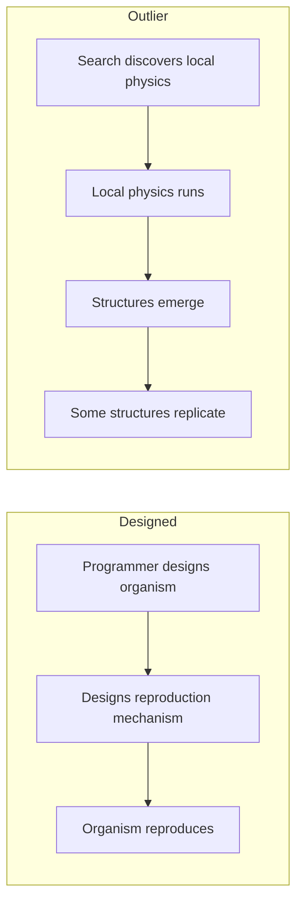

In the first route, reproduction exists as an explicit operation because someone implemented it. Observing that operation later tells us little about whether reproduction can arise from lower-level dynamics.

Outlier is different.

There is no explicit reproduction operator to point at. There is only the local transition rule.

If a structure reproduces, the reproductive mechanism must therefore be realized through the unfolding dynamics rather than supplied as a pre-existing software abstraction.

That difference does not establish life.

It establishes something we need before the question of life is even worth asking:

> **the behaviour is not merely the execution of an operation we named reproduction in advance.**


---

## What Happens When You Run It

The published rule produces rich behaviour from sparse random initial conditions, and from the tiny seed.[5]

Small shape-changing clusters appear. Some clusters produce additional clusters. Some periodically duplicate. Several smaller structures can assemble into larger formations — and those formations can themselves replicate. Collections of them eventually form the boundary of a still larger expanding complex.


So the system contains organization at several levels at once:

```text
cells
  ↓
clusters
  ↓
replicating formations
  ↓
larger expanding complex
```

Replication appears at more than one scale, which is already stranger than anything in the previous chapter. The glider gave us one localized organization persisting through time. Here we have organizations built out of organizations, and duplication occurring at more than one level of that hierarchy.

It is worth being honest about the visual impression.

The glider was easy to keep at arm's length. Outlier is not.

Structures appear, interact, leave debris and produce further structures. Some persist long enough for regions of the world to acquire recognizable histories. The vocabulary we spent the previous chapter restraining starts returning almost automatically:

```text
parent
offspring
population
lineage
organism

---

## Why This Is Harder Than a Glider

In Chapter 1 the tracking problem was tractable because geometry recurred. A glider is a configuration that returns to itself after four steps, displaced by one cell. Localized, periodic, translating — and once we had defined the identity criterion, the detection algorithm followed from it.

Outlier presents a qualitatively harder problem:

```text
structures
↓
interactions
↓
descendants
↓
lineages
↓
population history
```

Each arrow in that chain is a place where an interpretation can be smuggled in. Calling something a *structure* presumes we know where it ends. Calling one structure a *descendant* of another presumes we know what produced what. Calling a set of related structures a *lineage* presumes both of the previous things and adds a claim about continuity.

Chapter 1 established the general rule:

```text
appearance
≠
mechanism
```

Applied here, it has a sharper form:

```text
similarity
≠
ancestry
```

Suppose we see this:

```text
time t

    A

time t + 500

    A     A
```

The sentence that arrives unbidden is *A reproduced*. But consider what else could produce that image. Perhaps both structures were produced independently by the surrounding dynamics. Perhaps the second would have appeared even if the first had never existed. Perhaps what we are calling two structures are two parts of one larger repeating process, and our detector split them.

Every one of those explanations is compatible with the same picture.

So reproduction cannot be established from the final geometry alone.

It requires ancestry, and ancestry is a **causal** claim:

```text
earlier organization exists
↓
its state contributes causally to later transitions
↓
a later candidate organization appears
↓
an appropriate counterfactual intervention
breaks that dependency

```

That is a much stronger statement, and — critically — it is one we can test.

---

## Counterfactual Causality

Because Outlier is a deterministic cellular automaton, we have an unusually clean opportunity. For every live cell at time `t+1`, we know exactly which `3 × 3` neighbourhood produced it. Nothing is hidden. There is no learned function, no floating-point state, no stochastic component.

So we can ask a question that is usually impossible to ask of a complex system:

> Which live cells in the preceding neighbourhood were actually necessary for this cell to become alive?

The test is mechanical. Take a live child cell. Remove one live predecessor from its neighbourhood. Re-evaluate the rule. If the child is now dead, that predecessor was necessary under this intervention. Repeat for every live predecessor, then for every live cell in the world, at every step.

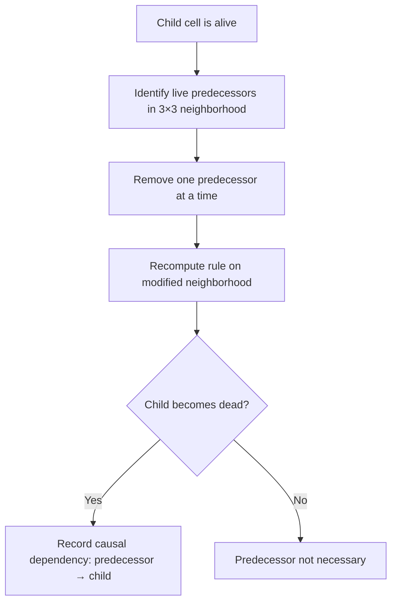

This is not a complete theory of causality, and we should say so plainly. Where several predecessors are jointly sufficient, removing any one of them may change nothing, and the test will under-report. Redundancy and synergy are real, and a single-removal test does not see them.

Its limitations matter, but so does the improvement it gives us.

> Those two shapes look related.

is an impression.

> Under this defined intervention, removing this predecessor changes whether this later cell exists.

is a reproducible causal measurement.

The second does not solve causality in general. It gives us something much stronger than resemblance for this particular substrate.

Cell-level dependencies are far too numerous to reason about directly, so they are aggregated: cells into connected clusters, and cell-level causal dependencies into causal relationships between clusters.

```text
cluster at t
     ↓
cluster at t+1
     ↓
cluster at t+2
     ↓
...
```

with branching wherever one earlier organization contributes to several later ones.

The question has now changed completely.

Not:

> Does this later structure look like the earlier one?

but:

> **Can we trace a causal path by which the earlier organization contributed to producing the later one?**

Once we ask that question across the whole run, resemblance becomes a lineage graph.

---

## What the Graph Contained

In 2026, Arend Hintze and Clifford Bohm returned to Outlier and reconstructed causal ancestry at scale, on a `1024 × 1024` periodic world run for 20,000 updates.[6] The resulting analysis contained tens of millions of cluster instances and causal relationships.

Three things from that work matter here.

**Reproduction is causally real, and it branches.** Earlier structures could causally produce multiple later structures, which themselves participated in continuing lineages. This is a substantially stronger result than visual recurrence, and it is the one the rest of this chapter depends on.

**Replication is not the same as a successful lineage.**

The original seed cluster, `c0`, produced 433 causally descended copies within the first 10,000 updates.[6]

That sounds spectacular.

It was also not enough to make `c0` the enduring lineage.

Other structures proved more reproductively successful, including a cluster designated `c2`.

So another apparently simple word splits:

```text
can produce copies
≠
can sustain a lineage

That gives us a distinction worth keeping:

```text
replication
≠
successful long-term lineage
```

Producing another instance is not the same as founding a dynasty. It is a distinction biology would have taught us eventually, but it is striking to meet it in 512 bits of physics.

**The environment participates.** Replicators produced debris, collisions, fragments and recombinations, and some later replicating structures arose *through* those interactions. So the process is not:

```text
copy parent
```

It is closer to:

```text
replicating process
        ↓
interaction
        ↓
fragments
        ↓
collisions
        ↓
recombination
        ↓
new structures
```

Variation therefore does not need to arrive through a dedicated `mutate()` operation.

Collisions, fragments and recombinations can create new configurations through the ordinary dynamics of the world itself.

That is a much more substrate-native source of novelty than adding a mutation operator merely because biology has one.

---

## The Replicator Might Not Be a Body

Here is the finding that puts the most pressure on intuition.

A self-replicating organization in Outlier does not necessarily correspond to one compact connected cluster. Some causally reproducing structures consisted of multiple spatially separated components whose combined causal dynamics participated in reproduction.[6] The published work interprets this in terms of distributed, multi-component selfhood.[6]

Our evidence does not require us to adopt the stronger noun.

The narrower result is enough:

> **Causal self-replication can involve multiple spatially separated components.**

Notice what that does and does not say. It does not say those components constitute one natural individual. It says connectedness is not a sufficient criterion for finding the reproducing unit — that if you had gone looking only for compact bodies, you would have missed reproduction that was demonstrably occurring.

Chapter 1 gave us connected geometry as a useful first boundary.

Outlier immediately makes that boundary uncomfortable.

If a causally reproducing organization can span several disconnected components, then a detector that searches only for compact connected bodies can miss the very process it is supposed to find.

And it leaves us with a question the chapter is not going to answer:

> **If reproduction can be causally real while the reproducing unit is not a neat connected body, what exactly is the thing that reproduces?**

Resist the urge to resolve that. The temptation is to leap from *distributed causal reproduction* to *one distributed individual*, and there is no experiment here that licenses the jump. Individuality would require a criterion we do not yet have, and inventing one to fit the case we are looking at is how this field generates its worst results.

The question stays open. It gets much more difficult later, and much more interesting.

---

## Running It Ourselves

Published evidence tells us what Outlier has been shown to do.

We also want a specimen we control.

So we reconstructed the published rule and verified it before asking any scientific question of our own. The decoder had to produce all 512 transition cases, exactly 220 active outputs, and the published rotational symmetry.

The implementation details are in the experimental record.

The principle belongs in the chapter:

> **Verify the world before interpreting anything that happens inside it.**

A wrong decoder can still produce extraordinary animations.

It cannot produce evidence about Outlier.

**Scale is part of the experimental condition.** Our runs use a `512 × 512` world over 1,600 generations. The published causal study used `1024 × 1024` over 20,000 updates. That difference is not cosmetic: the earlier Outlier work reports a strong scale effect, with sparse random worlds smaller than roughly `512 × 512` failing to produce the larger replicating formations seen in the principal experiments.[5]

So we adopt a rule now, because it will matter enormously later:

> **A result obtained from a smaller or shorter Outlier run is a result about that run. It must not automatically be generalized to the full published regime.**

So everything we report from our own experiment carries its scope with it:

> **512 × 512 world, 1,600 generations, under the implementation and initial conditions described in the experimental record.**

That is our specimen.

It is not automatically Outlier in general.

The distinction matters most when the result becomes exciting.

---

## Finding c2 Again

Now we can ask our own version of the reproduction question.

The published seed is:

```text
.1.
111
..1
```

After two updates it produces a small structure — the one designated `c2` — which in our run had an area of 6 cells in a `3 × 3` bounding box.

The methodological choice here is worth pausing on. We did not go hunting for arbitrary shapes that seemed to repeat. That approach quietly guarantees a result: in a run containing over a hundred thousand clusters, *something* will recur, and whatever recurs most strikingly will feel like a discovery. Instead we derived the `c2` signature directly from the known initial seed, and only then searched the run for later occurrences of that specific structure, allowing translation and rotation.

The search found **144 `c2` occurrences** between `t = 2` and `t = 1598`.

That is an interesting observation.

It is not yet reproduction.

One hundred and forty-four copies could still be one hundred and forty-four independent products of the same underlying dynamics.

So recurrence now has to meet causation.

So we combined recurrence with the causal graph. For our run, that graph contained:

```text
138,891 clusters
196,466 causal edges
```

That number is itself a warning. The animation looks like a modest collection of discrete moving objects. Underneath the appearance is a network of nearly two hundred thousand dependencies, and our visual impression of "a few things moving around" was never a description of the mechanism.

For every `c2`, we then searched forward through the causal graph for later `c2` structures reachable through that causal history. Once recurrence was intersected with the causal graph, the original `c2` at `t = 2` connected into a branching history containing four later `c2` descendants. Across the run, the complete `c2` return graph contained 99 causal return edges.

Now the repeated shape had a history.


The figure shows a deliberately pruned family, because the full graph is unreadable as an illustration. The analysis uses the whole thing.

---

## This Time, the Interpretation Survives

It is worth being clear about what just happened, because it does not happen every time.

We began with an observation that looked like reproduction. We refused it, on the grounds that resemblance is not ancestry. We built a stronger test — counterfactual necessity at cell level, aggregated into a causal graph. We applied it to a structure whose identity was fixed in advance rather than chosen after the fact. And the reproduction claim did not collapse.

Within our run, the evidence for `c2` reproduction is not merely geometric recurrence. It is:

```text
structural recurrence
+
counterfactual causal ancestry
+
branching lineage
```

The bounded claim:

> **In our 512 × 512, 1,600-generation run, recurring `c2` structures participate in a branching causal return graph. Later occurrences of `c2` are reachable through measurable causal ancestry originating in earlier `c2` structures.**

That sentence is narrow, hedged and specific. It is also the strongest positive result in the book so far, and it deserves to be stated without apology.

Within this defined experiment, something stronger than resemblance survived.

Earlier `c2` organization participates measurably in producing later `c2` organization, and the resulting causal history branches.

In the operational sense we defined, **reproduction survived the test**.

No explicit reproduction function was written into the system. The capability arises from the local rule acting repeatedly through the cellular substrate.

That is exactly the kind of result this book was built to recognize.

That is a real result about what computation can support, and it was obtained by refusing the interpretation until it survived a test rather than by admiring the animation.

This is an important moment for the method.

If every interesting interpretation collapsed under scrutiny, we would merely have built a sophisticated debunking machine.

That is not what happened.

```text
appearance
↓
stronger definition
↓
causal test
↓
claim survives
```

---

## What This Does Not Establish

Discipline now, while the result is fresh and most attractive.

Causal self-replication is a strong result.

It is also only causal self-replication.

It does not, by itself, establish self-maintenance, adaptation, agency, memory, autonomy, individuality, open-ended evolution or life.

Those questions remain separate precisely because reproduction has now earned the right to stand on its own.

Note also what the multi-component finding did to our vocabulary. We can say reproduction occurred. We cannot yet say *what* reproduced, because the reproducing organization need not correspond to any object our eyes or our connected-component detector would isolate.

The supported result is narrower than any of the words we might reach for:

> **Very simple digital physics can support emergent structures for which causal analysis identifies genuine, branching and sometimes multi-component self-replication.**

That is already remarkable. It does not need embellishment, and embellishing it would cost us the only thing that makes it worth reporting.

---

## What We Should Take From This

Several lessons follow naturally from what we have just seen, and they will shape everything we build afterwards.

**Do not design the organism.** Define or discover local physics, then let candidate structures arise within it. The moment we implement `Organism.reproduce()`, any reproduction we subsequently observe is our own assumption returned to us.

**Do not assume one scale.** Interesting organization appeared at the level of cells, clusters, formations and larger complexes simultaneously, with replication at more than one of them. No scale announced itself as the privileged one.

**Do not equate connected geometry with causal organization.** Outlier gives us direct reason to distrust that shortcut: causal reproduction can involve spatially separated components.

Connectedness remains a useful measurement.

It has lost its claim to be the answer.

**Track causation.** Visual resemblance is not sufficient evidence for reproduction, inheritance, influence or ancestry. Where the substrate permits, reconstruct the dependencies. Outlier permits it completely, which is much of why it is so valuable.

**Let interactions matter.** Collision, fragmentation and recombination can create variation through the ordinary dynamics of the system.

Do not add a special mechanism merely because the biological vocabulary suggests one should exist.

---

## Evidence, Not Specification

There is a failure mode available here, and it is worth naming before we walk into it.

Having found a system that does something remarkable, the obvious move is to take that system and start bolting capabilities onto it. Give Outlier a memory. Give it an energy budget. Give it goals. See what happens.

That would simply build a new cargo cult on a more respectable foundation.

Chapter 00 established the principle in its biological form:

```text
biology is evidence, not specification
```

The same discipline applies now:

```text
Outlier is evidence, not specification
```

Outlier is not the ancestor of anything we build later. We are not going to copy its rule, its structures, its reproduction machinery, its geometry or its dynamics. Its value is as a demonstration of what the substrate can support without us explicitly specifying the resulting reproductive organization.

Outlier gives us evidence.

It does not give us the blueprint for what to build next.
 That is the useful part. The specific 512 bits that produced it are not.

We should be equally careful with the vocabulary Outlier invites. Words like *organism*, *individual*, *family*, *offspring*, *self* and *collective* become almost irresistible once an animation starts moving, and causal ancestry makes them feel newly legitimate. It has, after all, given us real ancestry. But real ancestry between clusters does not license a claim about individuals, and we should notice that the strongest result in this chapter — reproduction distributed across separate components — actively undermines the most natural reading of those words rather than supporting it.

---

## Why We Will Eventually Need a Smaller Laboratory

There is one more thing to take from Outlier, and it is a problem rather than a lesson.

Outlier is extraordinary evidence precisely because it is rich. Structures interact, recombine, produce debris, build hierarchies. That richness is what makes it convincing.

The same richness makes mechanistic questions very hard to isolate.

Our modest run already contained 138,891 detected clusters and 196,466 causal edges.

That richness is evidence of possibility.

It is also a terrible place to isolate a mechanism.

Suppose we want to ask why one process continues while another stops. Or whether stored history changes a later response. Or what finite computational scarcity does to interaction. Outlier gives us no clean dial for any of those questions.

Everything is entangled in the same local rule.

To answer questions like that, we would need to change one mechanism at a time. Outlier does not offer separable mechanisms. It offers 512 bits that either produce this universe or a different one; there is no dial marked *coupling*, no parameter governing how far influence travels, nothing to hold fixed while varying something else. We can observe its states and reconstruct a great deal of local causal structure.

What we cannot easily do is vary one higher-level mechanism while holding the others fixed.

That requires a different kind of laboratory.

So there is a laboratory we are eventually going to need. One where:

```text
we know every rule
we control every intervention
we can change one mechanism at a time
we can preserve the full experimental history
```

Not because Outlier is inadequate — as evidence it is close to ideal — but because evidence that something is possible is a different instrument from a system in which we can find out *why*.

That need is going to become considerably more acute in the next chapter.

---

## And Then We Noticed Something Else

We had just earned our strongest positive result.

The obvious interpretation had survived the stronger test.

That matters psychologically as well as scientifically. Once one exciting claim survives, the next exciting claim becomes easier to believe.

That is where the trouble starts.

Watching the same simulation, another pattern became difficult to ignore.

Structures seemed to move together.

Not simply as fragments carried by one expanding front, but with an apparent directional coherence that seemed especially strong among structures sharing recent causal history.

The biological noun arrived almost immediately.

**Flocking.**

We knew better than to trust it.

Unfortunately, we also had reasons to think it might be real.

So we did what the method requires:

```text
observation
↓
hypothesis
↓
measurement
↓
control
```

---

## References

**[1]** Sayama, H. & Nehaniv, C. L. *Self-Reproduction and Evolution in Cellular Automata: 25 Years After Evoloops.* Artificial Life 31(1), 81–95 (2025).

**[2]** Plantec, E., Hamon, G., Etcheverry, M., Chan, B. W-C., Oudeyer, P-Y. & Moulin-Frier, C. *Flow-Lenia: Emergent Evolutionary Dynamics in Mass Conservative Continuous Cellular Automata.* Artificial Life 31(2), 228–250 (2025). doi:10.1162/artl_a_00471

**[3]** Packard, N. H. & McCaskill, J. S. *Open-Endedness in Genelife.* Artificial Life 30(3), 356–389 (2024). doi:10.1162/artl_a_00426

**[4]** Agüera y Arcas, B. et al. *Computational Life: How Well-formed, Self-replicating Programs Emerge from Simple Interaction.* arXiv:2406.19108 (2024).

**[5]** Yang, B. *Emergence of Self-Replicating Hierarchical Structures in a Binary Cellular Automaton.* Artificial Life 31(1), 96–105 (2025). doi:10.1162/artl_a_00449

**[6]** Hintze, A. & Bohm, C. *Rethinking self-replication: detecting distributed selfhood in the Outlier cellular automaton.* npj Complexity 3, 11 (2026).

---

## 03: It Looked Like Flocking

Groups of structures appeared to move together.

Not merely outward, as an expanding front would carry everything. Together — with what looked like coordination, among structures that had recently shared a causal history.

It looked remarkably like **flocking**.

We had spent two chapters training ourselves against exactly this reaction:

see motion
→ invent a noun
→ believe the noun.

But something had changed.

We had just watched one strong interpretation survive an attempt to destroy it. The reproduction result in Outlier was no longer based only on resemblance; within our experiment it was supported by branching causal ancestry.

The method had said **yes**.

That made the next exciting interpretation much easier to believe.

And there was a legitimate reason to take the observation seriously.

We already possessed a causal graph. We could identify recent shared ancestry independently of motion.

So the hypothesis was testable:

> **Do structures with shared causal history also show stronger dynamical coherence?**

For once, the biological-looking interpretation came with two independently measurable sides.

So we made the impression into a hypothesis, and started measuring.

---

## What Would Flocking Mean?

Not: *are these things birds?*

We did not begin by trying to satisfy every formal definition from swarm biology or active-matter physics. We started with something much narrower and answerable:

> Do nearby persistent moving structures travel in unusually similar directions?

That is a measurement, and it needs three things: structures that persist long enough to have a direction, a way to compare directions, and a control.

Using the causal graph to follow plausible cluster continuations through time, we recovered 13,635 motion tracks lasting at least eight generations, yielding 633,808 motion observations.

Each observation gave us what the hypothesis required:

```text
position
velocity
time
causal identity
```

Comparing directions is simpler. For two velocity vectors, normalize both and take their dot product:

$$
A_{ij}
=
\frac{v_i}{|v_i|}
\cdot
\frac{v_j}{|v_j|}
$$

which lands between −1 and +1:

```text
+1  = same direction
 0  = no directional agreement
-1  = opposite directions
```

We compared structures moving at the same moment, at various spatial separations, using a spatial index rather than comparing every structure with every other one. That was partly a performance decision and partly a better experiment: structures on opposite sides of the universe tell us nothing about local collective motion.

Note the vocabulary discipline here, because it does the work later.

```text
flocking
```

is an interpretation.

```text
short-range directional alignment
```

is a measurement. The whole chapter is about the distance between those two lines.

---

## The First Result

At short distances, observed velocity alignment was approximately **0.74**, against a velocity-shuffled control that was much lower.



So the visual observation was not imaginary.

There really was strong short-range directional coherence. An average near `0.74` on a scale running from `-1` to `+1` is not a subtle numerical residue.

For now, that is all we should say.

Something nearby is moving coherently.

Why it is doing so remains open.

What that *means* is a different question, and we had immediately created a new problem.

---

## Maybe Everything Is Simply Moving Outward

Outlier develops as an expanding structure. Nearby clusters may sit on the same expanding front, and two things being carried outward by the same expansion will have similar velocity vectors without any relationship to each other at all.

Picture two pieces of debris riding the same circular wave. Their velocities agree beautifully. They have never interacted, and neither is responding to the other in any way.

If that were the whole story, our 0.74 would be an elaborate way of measuring that Outlier grows.

The control is direct. For each position, compute its radial direction relative to the centre of the expansion:

$$
r_i
=
\frac{x_i-c}{|x_i-c|}
$$

then decompose each velocity into a radial component and a non-radial component, and discard the radial part. What remains is motion that is not explained by the global expansion. If the coherence was expansion, the residual alignment should collapse.

It did not:

```text
raw short-range alignment        = 0.7373
radial-subtracted alignment      = 0.7427
shuffled residual control        = 0.1933
```

Read those three numbers carefully, because this is the moment the investigation became serious.

The alignment did not merely survive removal of the global expansion field — it did not move. And the shuffled control on the same residuals sits at 0.1933, so the residual alignment is not an artefact of the subtraction procedure producing spuriously agreeable vectors.



One explanation eliminated:

> **The observed coherence is not explained merely by every structure moving radially away from the original seed.**

At this point the flocking interpretation had become harder to dismiss.

The most obvious alternative explanation — simple radial expansion — had failed to account for the effect.

But we still did not know what produced the coherence.

Then the causal graph suggested an explanation.

---

## Shared Causal History

Chapter 2 left us with an uncomfortable finding: several spatially disconnected clusters can participate in the same causal organization. What looks like three separate things may be three components of one causal process.

That does not establish that such components form a natural individual — we were careful about this, and remain careful about it. But it does suggest a narrower and testable idea:

> **Does shared causal organization explain the apparent coordinated motion?**

If structures descending from a recent common ancestor remained dynamically coupled, then shared motion might reflect continuing causal organization rather than independent objects somehow "deciding" to coordinate.

That would be a much more interesting explanation.

It was also still only a hypothesis.

That is an attractive hypothesis. It uses infrastructure we already trust, it explains a measurement we already have, and it does not require importing any social mechanism from biology.

So: do structures belonging to the same causal lineage move more coherently than structures that do not?

### Assigning families

The first family definition was too narrow. Starting from four branches descending from one early `c2` gave strong same-family alignment of 0.768 — and no useful different-family comparison, because almost nothing fell into the comparison group.

So we strengthened it. Every cluster was assigned its **most recent identifiable `c2` ancestor**. A cluster that was itself `c2` began a new family; otherwise ancestry propagated through the causal graph. Where equally close causal paths disagreed, the assignment was marked ambiguous rather than resolved by invention.

The coverage was remarkable. Of 138,891 clusters, 138,132 received a recent `c2` ancestor, with only 10 ambiguous and 749 unassigned. Of the motion observations, 633,696 out of 633,808 carried a family label.



Almost every tracked moving structure in this run could therefore be placed inside a recent branching causal history.

That was striking.

It also explained exactly nothing about the motion.

A variable existing is not the same thing as that variable causing the effect we care about.

---

## A Very Exciting Result

Comparing nearby structures after subtracting a local background flow, we found:

```text
same recent-c2 family         =  0.828
different recent-c2 family    = -0.349
```

That looked spectacular.

Related structures appeared strongly aligned at `0.828`.

Different-family structures appeared strongly anti-aligned at `-0.349`.

For a moment it looked as though causal families were behaving like distinct dynamical units.

But the negative result was almost *too* interesting.

Nothing in our hypothesis predicted that unrelated families should actively oppose one another.

That unexplained success was the clue.

### Our experiment was wrong

This is worth slowing down for.

To estimate the local environmental flow around object `A`, we averaged the velocities of nearby structures, excluding structures from `A`'s own family — sensibly, so that `A`'s relatives could not define the background against which `A` was judged.

Now consider comparing `A` from family α with `B` from family β. `B` is not in `A`'s family, so `B` contributes to `A`'s background estimate. And `A` is not in `B`'s family, so `A` contributes to `B`'s.

In the simplest case:

$$
r_A \approx v_A-v_B
$$

and:

$$
r_B \approx v_B-v_A
$$

so:

$$
r_B \approx -r_A
$$

We had built an anti-correlation into the estimator. The −0.349 was not a discovery about different families. It was a property of the arithmetic.

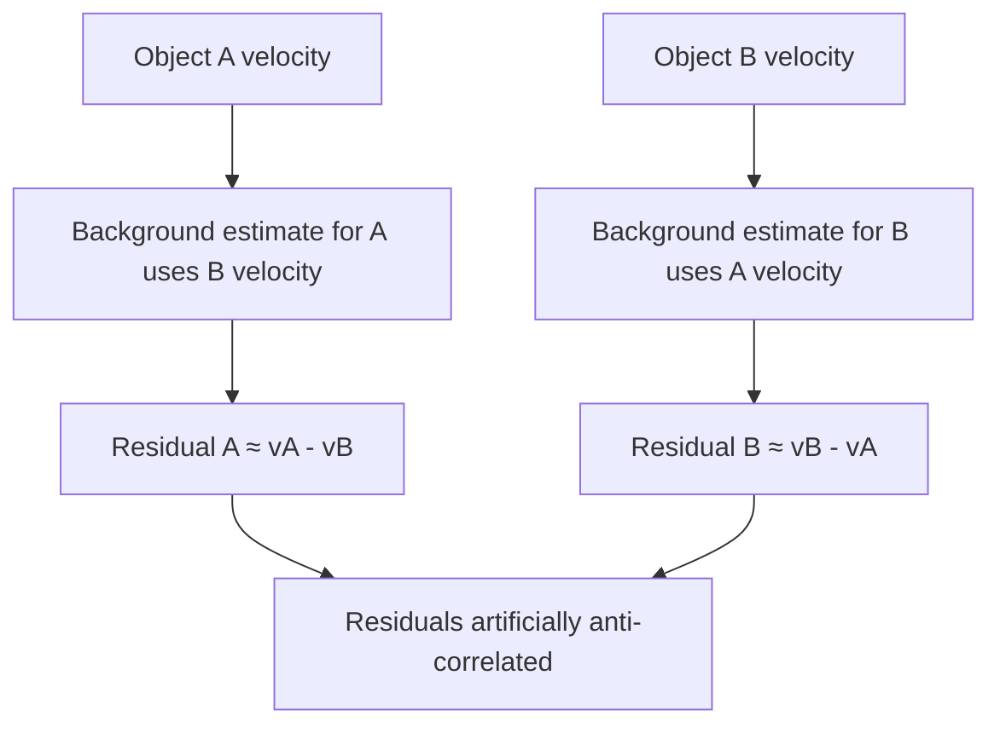

The measurement was partly using the tested pair to manufacture the background against which that same pair was evaluated.

The control itself had become a confound.

That matters because controls are not external guarantees of correctness. They are pieces of experimental machinery.

They can be wrong too.

### The stronger control

The fix is straightforward once the problem is visible. When testing a pair from families α and β, estimate the local background while excluding **both** families from both estimates. Now neither member of the tested pair can manufacture the other's residual.

Under this stronger control:

```text
Same recent c2 ancestor          0.746
Very close c2 ancestry           0.101
Close c2 ancestry                0.032
Distant c2 ancestry              0.135
Very distant c2 ancestry         0.081
```



The pathological negative number is gone, as it should be. But the main effect is still there, and it is enormous:

```text
same recent c2 ancestor    0.746
very close ancestry        0.101
                           -----
gap                        0.645
```

A gap of `0.645` on a scale bounded at `1.0`.

And look at what it had already survived:

```text
real causal ancestry
+
shuffled-motion control
+
radial-expansion control
+
a discovered estimator bug
+
a corrected estimator
```

---

## The Four-and-a-Half-Cell Problem

Structures sharing the same recent `c2` ancestor had a mean separation of about **4.5 cells**.

Structures in other causal groups were typically tens of cells apart.

Sit with that for a moment, because everything turns on it.

We had two variables that both track family membership. Same family means recently descended — and it also means *physically very close together*, because a structure and its recent causal descendants have not had time to get far apart. Different family, in this dataset, generally means far away.

And we already knew, from the very first measurement, that motion coherence depends strongly on distance. That was the finding: *short-range* alignment is high.

So:

```text
same family
↓
tends to mean closer

closer
↓
tends to mean more coherent
```

which produces:

```text
same family
↓
appears more coherent
```

with ancestry contributing nothing whatsoever.

The 0.645 gap might be measuring exactly one thing: that we had compared structures 4.5 cells apart against structures tens of cells apart, and discovered that closer structures move more similarly. Which we knew before we started.

Nothing about the `0.645` was fabricated.

Same-family pairs really did move more coherently than different-family pairs.

The problem was the sentence we wanted to attach to that number:

> **because they are related**

The measurement was real.

The causal interpretation was not yet identified.

The comparison was never able to answer the ancestry question, no matter how large the gap it produced. Comparing like with unlike gives you a difference. It does not tell you which of the differences is responsible.

So we needed to compare like with like.

---

## Distance Matching

The stronger comparison holds the confounds fixed. For each same-family pair, find different-family pairs occurring under approximately the same conditions, matching on:

```text
simulation time
spatial distance
local density
```

while continuing to use the pair-excluded background-flow correction from the previous stage. Then compare within each matched stratum, using equal numbers of same-family and different-family pairs, so that no stratum can dominate the result by virtue of being over-represented in one group.

The question becomes precise in a way it had not been before:

> At similar times, at similar distances, and in similar local environments, do members of the same `c2` causal family move more coherently than members of different families?

The underlying dataset contained 2,617,077 usable pair records. The matched analysis ultimately drew roughly 65,000 pairs from each group across hundreds of comparable strata.

The implementation details belong in the appendix.

One methodological detail does not: because the run had been preserved as a queryable experimental specimen, discovering the confound did not require rerunning the entire world. We could ask a better question of the same evidence.

That made correction cheap enough to actually happen.

The matched result:

```text
same-family         0.1515
different-family    0.1588
difference         -0.0073
```

The `0.645` advantage had disappeared.

After comparing pairs at similar times, distances and densities, same-family pairs were not more coherent. The point estimate was slightly negative.

That should have been the end.

It was not.

Matching answers a question only where both groups actually contain comparable observations — and we had not yet checked where that was true.

---

## Common Support

Matching cannot create comparison data where none exists.

Matching cannot rescue a comparison the data never contain.

If same-family pairs dominate one distance regime and different-family pairs dominate another, matching can only speak about the region where the two distributions overlap.

Outside that overlap there is no counterfactual comparison to recover.

A global-looking number can therefore answer a much narrower question than its formatting suggests.

Given what we had just learned about the 4.5-cell separation, this was not a hypothetical worry. Same-family pairs are concentrated at exactly the distances where different-family pairs are rarest.

So we kept all 2,617,077 pair records and measured the overlap directly, across distance bins:

```text
0–4
4–8
8–12
12–16
16–24
24–32
32–48
48–64
64–96
```

with a declared operational rule:

> **A distance bin must contain at least 100 same-family and 100 different-family raw pair records.**

The largest contiguous region satisfying that condition was:

```text
[4, 64) cells
```



The shortest-distance regime, 0–4 cells, falls **outside** the primary common-support region. Different-family controls are simply too sparse there to support the comparison.

That changes what the analysis is entitled to say, and it changes it in both directions. We cannot claim matching has identified the ancestry effect at very short range. We also cannot claim it has ruled it out.

---

## Inside the Region We Can Actually Compare

Restricting to 4–64 cells, the raw descriptive data still favoured the ancestry interpretation:

```text
same-family mean         0.1732
different-family mean    0.1166
raw difference          +0.0566
```

Even after removing the extreme short-range regime, the raw comparison still appeared positive:

```text
+0.0566
```

Applying the matching procedure within this region — exact matching on time bin, distance bin and density bin, with equal numbers from each group per stratum:

```text
matched same-family mean        +0.150823
matched different-family mean   +0.157890
matched pooled effect           -0.007067
```

across:

```text
64,948 matched pairs per group
659 matched strata
```

with an equal-stratum effect of:

```text
-0.026463
```

and a bootstrap interval of:

```text
[-0.066450, +0.012172]
```



The raw `+0.0566` difference became `-0.007067` once like was compared with like.

Nearly 65,000 matched pairs per group.

659 matched strata.

The same-family advantage had not merely become smaller.

It had disappeared.

---

## How Dead Is It?

"The confidence interval crossed zero" is a weak sentence. It is compatible with a large effect that we simply failed to measure well, and it invites the reader to keep believing.

We can do better, because we have the original claim in hand.

The apparent family gap was:

```text
0.746 - 0.101 = 0.645
```

Inside common support, the upper end of the bootstrap interval is:

```text
+0.012172
```

So the largest positive ancestry effect compatible with this interval is approximately:

```text
0.012172 / 0.645 ≈ 1.9%
```

of the original apparent gap.

That is a substantive statement rather than a shrug:

> **Within the 4–64 cell region where the comparison has adequate empirical support, the data rule out anything remotely resembling the original apparent family effect. The upper bootstrap bound is only about 1.9% of the original 0.645 gap.**

The supported data no longer allowed anything remotely as large as the effect we thought we had found.

Within the 4–64 cell comparison region, the upper positive bootstrap bound was only about **1.9% of the original apparent `0.645` gap**.

One more check, because the common-support threshold was our choice and a conclusion that depends on an arbitrary cutoff is not a conclusion. Repeating the analysis with minimum bin counts of 50, 100, 250 and 500: at threshold 50 the support region expands to 4–96 cells, and the matched pooled effect remains −0.0058 with an equal-stratum effect of −0.0182. At 100, 250 and 500 the region stays at 4–64 cells, with the matched pooled effect at −0.0071, equal-stratum effect −0.0265 and upper bootstrap bound +0.0122. The detailed tables are in the appendix.

The collapse is not a fragile consequence of one convenient threshold.

---

## What Remains Unresolved

The 0–4 cell regime is a different matter, and we should be as precise about our ignorance as about our results.

Structures sharing a recent `c2` ancestor are concentrated at extremely short range. That is where the hypothesis would be most likely to be true, if it were true. It is also precisely where different-family controls are too sparse to construct the comparison.

So:

```text
same-family pairs
are common there

different-family controls
are too sparse for the same comparison
```

We cannot say ancestry has no effect at 0–4 cells. We cannot say it does. The correct status is **UNRESOLVED**, and converting an absence of adequate comparison into negative evidence would be the same category of error we have spent the chapter correcting — just pointing the other way.

`UNRESOLVED` is not an embarrassed version of `NO`.

It means the experiment does not contain the comparison required to answer the question.

That boundary is part of the result.

---

## So Was It Flocking?

Not on this evidence. But *no* is the wrong summary, and so is the defensive retreat to *well, we did measure something*.

The honest answer is layered:

```text
SHORT-RANGE MOTION COHERENCE
measured, ~0.74, survives shuffled control

GLOBAL RADIAL EXPANSION AS SOLE EXPLANATION
rejected — coherence survives radial subtraction

LARGE CAUSAL-FAMILY COHERENCE EFFECT
collapses under distance / time / density matching

ANCESTRY-SPECIFIC COHERENCE, 4–64 CELLS
not supported; bounded at ~1.9% of the original gap

ANCESTRY EFFECT, 0–4 CELLS
unresolved — inadequate common support

BIOLOGICAL-STYLE FLOCKING
not established
```

Look at what happened to a single observation as it climbed:

```text
nearby structures move similarly
↓
related structures move similarly
↓
causal families behave as coordinated units
↓
flock / collective / individual
```

The mistake was not seeing motion coherence.

The mistake was promoting it:

```text
coherent motion
→ ancestry-dependent coherence
→ coordinated causal family
→ flock
```

Three things that initially looked like one thing are now separable:

```text
motion coherence
≠
ancestry-dependent coherence
≠
flocking
```

---

## The Phenomenon Did Not Die

This is the part that matters most, and the part a discouraged investigator would get wrong.

**Short-range motion coherence is real.** The measurement stands: approximately 0.74 raw, 0.7427 after radial subtraction, against a shuffled residual control of 0.1933. Nothing in the ancestry collapse touches it. The thing that first caught our attention while watching the animation was there.

And it deserves more credit than the failure of our explanation might suggest. Remember what Outlier actually is at the substrate level:

```text
binary cells
local neighborhoods
one deterministic update rule
```

There is no velocity variable. No steering force. No alignment rule. No flocking controller. Nothing in those 512 bits mentions direction, neighbours-to-follow, or collective behaviour of any kind. Yet structures arise whose motion is strongly coherent at short range, and stays coherent when the most obvious global explanation is stripped out.

So the surviving phenomenon can be stated without importing a collective:

There is also a possibility we have not tested.

Perhaps the coherence belongs less to independent objects and more to a propagating spatial process through which our detected structures happen to move.

That would require a different experiment — for example, testing whether correlation develops a systematic lag with distance.

We did not run that experiment here.

So the idea remains exactly where it belongs:

> **open**

**Causal reproduction is also still real.** This needs saying explicitly, because failure has a way of spreading beyond its jurisdiction. The flocking interpretation collapsing does not retract anything from Chapter 2. The 144 `c2` occurrences are still there. The counterfactual causal graph is unchanged. The branching return structure rooted at the `c2` at `t = 2` is exactly as it was.

```text
FLOCKING INTERPRETATION FAILS
```

does not imply:

```text
CAUSAL REPRODUCTION FAILS
```

What failed was a specific attempted promotion — from *causal family* to *coordinated collective unit*. The causal families remain real. They simply do not explain the motion.

Chapter 2 also left us with an unresolved question about individuality.

If components sharing causal ancestry had retained distinctive dynamical coherence after the controls, that would have strengthened the case that a causal family behaved as a meaningful unit.

That evidence did not survive.

So Outlier leaves us in an interesting position:

```text
connected geometry
is not enough

causal ancestry
is not enough
```

---

## What Actually Happened Here

Strip the chapter to its shape:

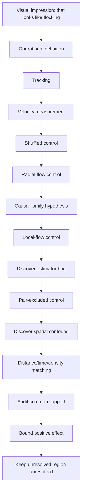

Two of those steps found errors in our own work rather than in the system. That is not a sign that the investigation went badly. It is most of what made the final result worth anything.

None of these corrections was obvious before the result forced us to look for it.

The anti-correlation problem became visible because unrelated families appeared to repel.

The distance confound required connecting two facts that had been measured separately: family members were unusually close, and close structures were unusually coherent.

The common-support problem only became visible after matching had apparently solved everything.

In retrospect, each mistake looks simple.

That is exactly why retrospect is dangerous.

The original interpretation was not foolish. It was reasonable given the evidence we had at that stage.

Then the evidence got better.

The most important number in this chapter is not `0.645`.

It is what happened to `0.645` when the comparison finally became fair.

---

## Where This Leaves Us

We lost flocking and gained a better question.

But notice what made the loss so laborious. Outlier is rich — that richness is why it is such powerful evidence about what computation can support, and it is also why five variables were hopelessly entangled by the time we started measuring. Geometry, ancestry, distance, expansion and local environment all move together in that world. Same-family means close. Close means coherent. Everything is expanding. Structures interact with debris from other structures. The causal graph, the motion tracks and the spatial layout are all consequences of the same 512 bits, and there is no way to hold one of them fixed while varying another.

Every control in this chapter was an attempt to disentangle variables after the world had already produced them together.

We had ancestry, distance, geometry, expansion and local environment all changing at once, and then tried to reconstruct the comparison afterwards.

Even careful matching left the most interesting very-short-range regime unresolved because the required controls were not present in the data.

There is another way to work:

> **build the comparison into the experiment before the world runs.**

Where we can hold expansion fixed and vary coupling. Where we can run a system, then run it again with one mechanism removed and everything else identical, and attribute the difference to the mechanism. Where the question *does history matter here?* can be asked by constructing two histories rather than by searching a run for pairs that happen to differ in the right way.

That is not Outlier, and it is not a criticism of Outlier. It is a different instrument for a different job.

So the next move is to build a different kind of world.

Not a world containing:

```text
repair
memory
reproduction
individuality
collective motion
```

Outlier showed us something important:

> **surprising causal organization can arise without us explicitly programming the organization itself.**

It also showed us the cost of richness. When many phenomena arise together, explanation becomes a problem of disentangling them after the fact.

So we are going back to almost nothing.

One seed.

One world.

One rule.

And one question at a time.

The next experiment begins with a crystal.

---

## References

**[1]** Yang, B. *Emergence of Self-Replicating Hierarchical Structures in a Binary Cellular Automaton.* Artificial Life 31(1), 96–105 (2025). doi:10.1162/artl_a_00449

**[2]** Hintze, A. & Bohm, C. *Rethinking self-replication: detecting distributed selfhood in the Outlier cellular automaton.* npj Complexity 3, 11 (2026).

---

## 04: The Digital Crystal

Outlier was the wrong laboratory for the question we now wanted to ask.

Not a wrong system. The last two chapters were worth every page, and nothing in them is retracted. Outlier showed us what computation can support.

But by the end of the flocking investigation, another problem had become unmistakable: it was much better at producing phenomena than at isolating them.
 Geometry, ancestry, distance, expansion, local environment and interaction all arrive together in that world, arising from the same 512 bits, moving together, entangled beyond separation. Every control we built was an attempt to statistically undo an entanglement we could not experimentally prevent, and one entire regime stayed unresolved because the comparison we needed simply did not exist in the data.

Matching is one way to recover a comparison when the experiment did not create one for you.

Now we want the opposite situation.

We want to construct the comparison before the world runs: hold everything we can fixed, change one mechanism deliberately, and measure what changes with it.

There is one idea worth carrying across from Outlier, and it is much smaller than an organism:

local computation
↓
repeated interaction
↓
larger-scale organization

That is all we need to import.

Not Outlier's reproduction. Not its causal families. Not its geometry.

Only the demonstrated possibility that local rules can generate organization we did not explicitly represent.

What we want from the new system is a short list:

```text
every rule is known
every state can be inspected
one mechanism can be changed at a time
counterfactual worlds can be rerun
the full history can be preserved
```

And an equally important list of what we refuse to build:

organism
memory
repair
reproduction
metabolism
individual

Not because those questions are uninteresting.

Because if those concepts appear explicitly in the machinery, we lose the ability to discover whether anything resembling them arises from something simpler.

The laboratory must not contain the answer.

The result is going to be almost embarrassingly small.

---

## One Seed

A hexagonal lattice. Every location holds `0` or `1`. Every location has six immediate neighbours.

At the centre, one occupied location:

```text
●
```

Everything else is empty.

The rule:

> **An empty location becomes occupied if at least one neighbouring location is occupied. Once occupied, it stays occupied.**

That is the entire system.

One seed.
One local attachment condition.
Irreversible occupancy.
Time.

There is no target morphology and no higher-level object directing the growth.

Hexagonal geometry is a convenience rather than a claim: six equidistant neighbours make local reasoning cleaner than a square grid's awkward mix of edge and corner adjacency. Represent locations as axial coordinates `(q, r)` and the six directions are just six offsets. The world is a set of occupied coordinates, and one update collects every empty location adjacent to something occupied and fills it.

Run it and the structure grows in expanding hexagonal shells.



Nothing anywhere says *make a hexagon*. After `t` updates, every location within hexagonal graph distance `t` of the seed is occupied, and the global shape follows from the neighbourhood topology plus uniform local propagation. No cell holds a blueprint. No controller measures the radius. Nobody draws the six sides.

Nothing surprising has happened yet, and that is useful.

The bounded result is simply:

> **Under this rule, one seed produces ordered expanding geometry through repeated local attachment alone.**

The hexagon is not evidence of sophistication.

It is the baseline against which later deviations will become measurable.

---

## Growth Is Cheap

Now measure it rather than admiring it, because the population has a closed form. For a perfect hexagonal ball of radius `r`:

$$
N(r) = 1 + 3r(r + 1)
$$

giving 1, 7, 19, 37, 61 for the first five radii. The radius grows linearly with time; the area grows quadratically. The measured population tracks the law exactly.



So the structure gets steadily larger and not one bit more interesting. A million-cell structure from this rule is no more conceptually complicated than a seven-cell one; the generative description is identical, and only the number changes.

```text
larger
≠
more complex
```

Which is useful to establish early, because size is the cheapest possible impressive-looking result.

A second distinction appears almost for free:

continued construction
≠
reproduction

The structure can keep extending from one seed without producing a second independent copy.

That does not tell us whether reproduction matters to digital life.

It tells us only that growth and reproduction are separate computational possibilities, and therefore deserve separate experiments.

That is a substrate-first move, and it is the reason this laboratory is built around growth rather than around anything more ambitious. We get to study **continued process before reproduction** instead of assuming the biological ordering.

---

## The First Temptation

Before adding anything, it is worth noting how quickly even this system tempts biological language — because it happens within one experiment.

Let the structure grow for twenty generations, then erase a region from its interior. Resume the same rule. The empty cells inside the hole touch occupied cells, so they become occupied; then their neighbours do; and soon the hole is gone.



It looks like healing. It is not.

The rule says any empty location adjacent to occupied structure becomes occupied, and that rule operates identically outside the structure and inside a hole. The system does not distinguish damage from ordinary frontier — there is no target morphology anywhere, nothing that could represent what the structure is supposed to look like. The hole closes because continued growth plus available empty space closes holes.

But nothing in the rule distinguishes damage from ordinary empty space.

The same attachment rule that advances the exterior frontier also fills an interior hole.

So the stronger interpretation disappears:

> **The structure refills missing space through ordinary growth.**

That is not yet repair.

We will return to material loss later with a system and controls designed specifically for that question.

Less exciting, more informative, and a good reminder that a laboratory built specifically to avoid biological assumptions will still generate biological-sounding descriptions within about five minutes of being switched on.

The prototype generated other questions too: obstacles could leave traces, multiple seeds could merge, and finite worlds eventually imposed limits.

We are going to resist following those branches here.

Each becomes a much better experiment later.

For now, the prototype has done its job: it gives us a transparent process that grows, can be perturbed, and contains almost nothing we did not deliberately put there.

---

## Can the Environment Leave a Mark?

The prototype is almost too predictable.

Good.

A laboratory should begin with a baseline we understand.
 What we want next is genuinely different:

> **Can changing external conditions influence growth strongly enough to leave a persistent, measurable signature in the finished structure?**

That question is not askable of the prototype. Its rule is deterministic and saturating — every available location fills, every time. There is no room for an external signal to change which locally available events actually happen, because all of them happen.

So the model has to change, and this needs stating plainly rather than slipped in:

```text
PROTOTYPE

binary occupancy + hexagonal neighbourhood
+ irreversible growth + deterministic local attachment
```

```text
DIGITAL CRYSTAL v1

binary occupancy + hexagonal neighbourhood
+ irreversible growth + stochastic attachment
+ environmental forcing + fixed lattice anisotropy
+ crowding penalty
```

Each addition earns its place through the experiment we want to run. Stochastic attachment gives the forcing somewhere to act — if attachment is probabilistic, the environment can shift the odds. Anisotropy gives the lattice persistent directional structure. The crowding penalty stops attachment probability rising without bound simply because a location has many occupied neighbours.

These mechanisms are introduced *for* this experiment. They are not discoveries carried over from the prototype, and that has a consequence worth being strict about:

> **Results from the prototype do not automatically transfer to Digital Crystal v1.**

The hole-filling result above tells us nothing about how this stochastic model responds to damage. Different model, different claims, and everything from here has to be earned again.

This is where the name **Digital Crystal** becomes useful.

Not because the structure resembles quartz, and not because it sits on a hexagonal lattice.

The analogy is mechanistic: local interactions during formation accumulate into persistent larger-scale structure.

So we can state a hypothesis rather than a definition:

> **Can a local computational growth process turn characteristics of an external input into persistent, measurable morphology?**

If the answer is no, the name has earned nothing.

If the answer is yes, we can decide what the name is worth afterwards.
 morphology.**

Deliberately narrow. It says nothing about life, memory, learning, adaptation, reproduction, intelligence or agency. Its only virtue is that it can be tested, and might be false.

---

## Influence, Not Instruction

The prototype was:

$$
C_{t+1}=G(C_t)
$$

Now introduce an environmental forcing signal:

$$
C_{t+1}=G(C_t,E_t)
$$

The distinction that makes this an experiment rather than a graphics demo is what the signal is *not* allowed to do. It does not draw. Nowhere does anything say:

```python
if signal == "sine":
    draw_sine_shape()
```

That would be a strange plotting library with extra steps. The same growth mechanism operates under every source; the signal only changes the conditions under which individual local attachment events occur.

For a candidate frontier cell, attachment probability takes a form like:

$$
P(\text{attach})
=
\sigma\left(
a + bn + cE_t + dA - q
\right)
$$

where `n` is the occupied-neighbour count, `E_t` is the current environmental value, `A` is the fixed local anisotropy term, `q` is the crowding penalty, and σ maps the result into a probability. The growth parameters stay frozen throughout. There is still no target morphology, no global drawing routine, no stored description of what the structure should become.

The experimental constraint that makes the whole thing work:

> **The growth mechanism remains fixed while the source changes.**

Otherwise recovering the source would tell us nothing except that we had changed the machine.

The contrast with a conventional visualization is the cleanest way to see what is going on. A graph does:

```text
value → coordinate → pixel
```

The Digital Crystal does:

```text
value → local attachment conditions → many stochastic interactions → persistent morphology
```

The picture is not drawn from the signal.

It is **grown under its influence**.

No local attachment event receives the source label, the future sequence or the desired final form. It receives only the current local state and the environmental value available at that step.

Whatever source information survives has to survive through the growth process.

First, the least interesting possible check: does the generalized model still grow? Give it a constant signal, `E(t) = 0`, and run it. The baseline reached approximately 5,924 occupied cells at a maximum hex radius of 44, with 552 boundary edges.



That proves nothing except that the machine runs. Which is all it needs to prove.

---

## Six Environments

Now hand exactly the same growth rule six different kinds of forcing:

```text
constant
sine
square
sawtooth
white noise
random walk
```

Within each family the individual instances vary — periods, phases, noise realizations, random-walk trajectories. At each growth step the structure receives only the scalar value currently presented to it. Not the family name, not the history, not the shape of the signal. One number.



Then grow them.



They look different.

So what?

This is the same trap that has followed us since Chapter 1, and it is no less inviting for being familiar. *Different signals generate different crystals* would make an attractive demonstration and establish nothing. Perhaps one random seed happened to produce a larger structure. Perhaps square waves simply produce a higher mean attachment probability, and we are looking at area. Perhaps our eyes are busily categorizing noise, which they are extremely good at.

We need populations, not specimens.

---

## Six Hundred Crystals

One hundred each of constant, sine, square, sawtooth, white noise and random walk. Six hundred structures, all grown with the same rule, the same experimental horizon and the same measurement system, differing only in source instance and stochastic realization.

For each finished structure, 42 morphological measurements: area, perimeter, maximum radius, compactness, boundary roughness, bounding-box aspect, centroid displacement, radial and angular distributions, six-fold angular structure, boundary-radius variation, and so on.

The source signal is not among them. The measurement describes the finished object and nothing else.

Then hide the labels.

The question becomes concrete and slightly unnerving: hand over one finished crystal, say nothing about what grew it, and ask whether the forcing family can be recovered from morphology alone. Six classes, so random guessing succeeds 16.7% of the time. Train on part of the population, test on structures never seen before.

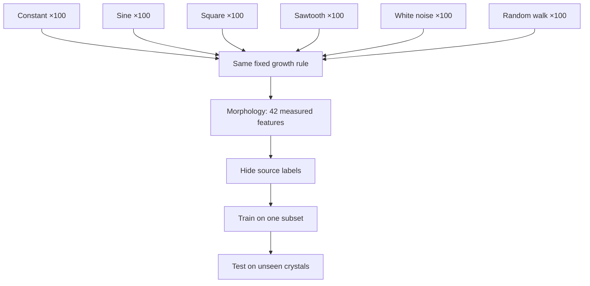

The held-out result:

```text
chance                 16.7%

random forest           52.2%
logistic regression     53.9%
```



Substantially above chance on held-out structures.

The environment has left a readable morphological signature.

Two different classifier families produce similar held-out accuracy, which makes the result less dependent on one particular decision boundary.

That is reassuring, but not magical. The important result is simpler: unseen crystals contain enough morphological information for source family to be recovered substantially above the six-way chance baseline.

The confusion matrix also shows that the information is uneven. Some forcing families leave much more distinctive signatures than others.



The claim to keep is smaller than the excitement it produces:

> **The final morphology contains information that makes forcing-process family recoverable substantially above chance.**

Not *the crystal remembers its history*. Not *the crystal understands the environment*. Something happened during formation, and the finished structure still carries enough of it to be read.

---

## Attack the Boring Explanation

The obvious deflation is that the classifier is not detecting anything about the *process* at all — merely some trivial aggregate. Square waves might spend more time at high values, raise mean attachment probability, and produce larger structures. Then all we would have discovered is that bigger signals make bigger crystals.

So remove the simplest aggregate explanation among the varying signals: normalize them to approximately the same mean and ask whether their resulting morphology still differs.

The constant-zero condition remains a separate baseline.

Standardized distances from that baseline were:

```text
sine          4.45
square       13.82
saw           2.44
white noise   2.40
random walk   1.40
```

The variable-source populations remain morphologically distinct after their means are approximately aligned.

So differences in mean forcing are not sufficient to explain the separation among those source families.

Something about the distribution or temporal structure of the forcing is also contributing.

Which one?

That is now the interesting question.

One more obvious worry: perhaps recovery works only at one carefully chosen forcing strength, and we happened to find it. Varying the forcing strength while leaving the rest of the growth mechanism untouched, held-out random-forest accuracy was:

```text
forcing         accuracy

0.75             34.1%
0.85             43.2%
0.95             50.0%
1.00             52.3%
1.05             52.3%
1.15             63.6%
1.25             43.2%
```

against a 16.7% chance baseline throughout.

Discipline here, because this sweep is noisy and it would be easy to over-read. There is no clean monotonic trend; 1.15 outperforms 1.25 substantially, and a seven-point sweep cannot tell us the shape of a response curve. We are not entitled to say that increasing forcing predictably increases recoverability, and we do not know the optimum.

What survives is narrow and sufficient:

> **Source-family information remains recoverable above chance at every tested forcing strength in this sweep.**

The phenomenon is not an artefact of one lucky parameter.

---

## Maybe It Recorded What Happened

Here is where it becomes tempting.

We have a fixed local process, an external environment, and a finished structure from which the character of that environment can be recovered well above chance. The mean does not explain it. The result holds across forcing strengths. It survives on structures the classifier has never seen.

The tempting sentence is:

> *the crystal has recorded its environmental history.*

And this time the temptation is not merely visual.

Something about the conditions during formation really is recoverable from the final structure.

But **information about past conditions** and **a recoverable history** are not the same claim.

Notice how little distance there is between the result we have and the claim we want. The result says information about the *kind* of environment survives. The claim says the *history* survives. Those feel like the same statement, and the whole book so far suggests they are not.

There is also a specific reason for suspicion. Consider sine and square forcing. They differ in temporal ordering — but they also differ in value distribution, time spent near extrema, autocorrelation and transition structure. If the classifier is picking up broad statistical properties of the values experienced during growth, that is still a real result. It is a different result.

So we test the promotion rather than accepting it.

---

## Destroy Time

Take a source sequence and shuffle it.

```text
0.7   0.2  -0.3   0.9  -0.8  ...

becomes

-0.3   0.9   0.7  -0.8   0.2  ...
```

The shuffled version preserves the same values, mean, variance, minimum, maximum and histogram. Only the temporal ordering is destroyed.

If the finished morphology retains recoverable information about chronology, crystals grown from ordered and shuffled sequences should be distinguishable. Binary chance is 50%.

```text
chance                 50.0%

random forest           51.3%
logistic regression     51.7%
```



The result sits essentially at chance under both tested classifiers.

Whatever allowed us to recover source family did not provide a usable ordered-versus-shuffled signal under this morphology representation and protocol.

Be precise about what this does and does not establish. It does not prove that no conceivable measurement could ever recover temporal information from this model. It establishes:

> **Our morphology representation and classifiers do not recover ordered-versus-shuffled history above chance under this protocol.**

Which is already enough to kill the claim we were drifting toward.

But the control can be stronger, and should be. A sine wave and a square wave do not merely differ in ordering — their distributions differ too, so the successful source-family classifier may be leaning primarily on distributional structure. We can remove even that.

Construct one fixed multiset of 72 values. Every condition receives **exactly the same values** — not approximately the same distribution, not merely matched mean and variance, the identical multiset. Only the temporal arrangement changes:

```text
RANDOM        random permutation
BLOCK         low values grouped, then high values grouped
ALTERNATING   low, high, low, high...
SMOOTH        neighbouring values change gradually
BURST         quiet periods interrupted by concentrated excursions
PERIODIC      values arranged into a repeating temporal motif
```



This is the comparison Outlier could never have given us. Same values, same growth rule, same everything — one variable changed deliberately, and the counterfactual world constructed rather than found.

Then grow them, with the model frozen. No parameter tuning, no attempts to rescue the hypothesis.



One safeguard matters enough to state. All temporal arrangements built from a single value set stay together during the train/test split, so the classifier cannot train on one ordering of a value set and then be tested on a different ordering of that same set. Held-out value sets are genuinely unseen. Without that, a subtle leakage path would let the model recognize the values rather than the ordering.

With the value multiset held exactly constant, the tested morphology representation and classifiers still do not recover temporal organization above chance.

The stronger interpretation fails again.

The values mattered.

Their exact ordering, under this test, did not remain readable.

---

## A Crystal Is Not a Tape Recorder

This is the point where the result becomes better than the idea we started with.

We had imagined:

```text
environmental history
↓
crystal
↓
history written into morphology
```

What the experiments support is narrower:

```text
environmental statistics
↓
local dynamics
↓
persistent morphology
```

Under the measurements and classifiers we tested, exact temporal organization is not recoverable.

Broader characteristics of the forcing are.

That is a more precise result than saying the sequence was simply "lost," because unmeasured information may still exist in the state.

Which is, when you look at it, strangely appropriate. Inspect a physical crystal and its structure may reveal a great deal about the conditions under which it formed — temperature regime, rate, impurities, pressure. It does not contain a frame-by-frame movie of formation. Nobody expects to read Tuesday off a quartz sample.

Our Digital Crystal turns out to be closer to that than to a recording device. The morphology behaves less like a tape recording and more like a compressed consequence of formation.

Which means the failure has told us something the success could not: what *kind* of information this substrate preferentially preserves.

---

## State Is Not History

The crystal has state.

Its present configuration is a consequence of earlier attachment events. A cell added at step 10 can still be present at step 70, and changing earlier events can change the final structure.

But:

> **the past affecting the present is not the same as the past remaining recoverable from the present.**

That is the distinction this experiment has finally forced us to make.

Consider two sequences, `A B C D` and `D B A C`. Both influence the process. Both alter the final state. But if the final state contains no recoverable information distinguishing which ordering occurred, then the process has accumulated consequences without retaining chronology.

That is where Digital Crystal v1 stands, and it separates two things our vocabulary bundles together:

```text
past contributed to present
        SUPPORTED

source family recoverable
        SUPPORTED

mean alone explains source effect
        FAILED

exact temporal order recoverable
        NOT SUPPORTED

complete chronology retained
        NOT ESTABLISHED
```

So:

```text
PAST-DEPENDENT
≠
PAST-READABLE
≠
RECOVERABLE HISTORY

```

A process can be thoroughly shaped by its past without being a record of it.

A useful working description is **lossy integration**:

```text
external forcing
↓
many irreversible local attachment events
↓
aggregate structural bias
↓
persistent morphology
```

The process integrates consequences of earlier forcing into persistent form, while our measurements recover broad source characteristics more readily than temporal arrangement.

That suggests a hypothesis worth carrying forward:

> **Irreversible growth may preserve coarse information about formation conditions while making temporal order difficult to recover.**

Not a law.

A result from this substrate, waiting to be attacked by a better experiment.

One boundary statement, once, and then we trust the reader with it: nothing here establishes memory in the strong sense, learning, adaptation, interpretation of the environment, a stored event log, reproduction, individuality, or life. What it establishes is that a fixed local growth process can turn differences in environment into persistent, measurable, recoverable differences in form.

That is a real result. It does not need help.

---

## The Digital Crystal

The name was a label at the start of the experiment. It has now earned a little weight, and the definition it earned is the modest one:

> **A Digital Crystal is a local computational growth process in which characteristics of an external input become expressed as persistent, measurable morphology.**


The definition is small because the stronger interpretation failed.

We established that formation conditions can leave recoverable morphological information.

We did **not** establish that the final morphology preserves a recoverable chronology of those conditions.

Keeping those statements separate is the result.

It is worth noticing what just happened procedurally, because it is the thing Outlier could not offer. We wanted to know whether temporal order mattered. So we built two worlds identical in every respect except temporal order, and looked at the difference. No matching. No searching a complicated world for naturally occurring comparisons. No unresolved regime where the data happened not to contain what we needed.

That is what the laboratory is for, and it worked on its first serious question.

---

## Give It a Past

We asked the crystal what happened to it.

The morphology could answer something like:

> *I can tell you something about the conditions under which I formed.*

Then we asked a harder question:

> *Can you tell us in what order those conditions occurred?*

Under the tests we ran, the morphology could not.

That is not a disappointing end to the Digital Crystal. It identifies the next missing capability with unusual precision. The crystal has a present, and that present carries information about the conditions that produced it.

What we have not yet given it is a **recoverable past**: enough preserved state that two different histories can remain distinguishable even when their current visible morphology is otherwise comparable.

So the next step is not to make it intelligent. Not to give it goals. Not reproduction. Not learning.

Something much smaller.

Give the process a way to **keep what happened**.

Not to interpret the past.
Not to learn from it.
Not to call it memory.

Just preserve enough internal consequence that two different histories remain different later.

Because before the past can change the future, some distinction from that past has to survive.

That is the next experiment.

---

## 05: The Crystal Gets a Past

At the end of the last chapter the Digital Crystal could tell us something about the world that formed it.

Hide the forcing process, show only the final shape, and the family of that process could be recovered well above chance.

Then we asked a harder question.

> What happened first?

We took exactly the same environmental values and rearranged them in time. Smooth. Bursting. Periodic. Alternating. Random.

The final morphology could not reliably tell them apart.

```text
SAME VALUES
+
DIFFERENT ORDER
↓
NO RECOVERABLE TEMPORAL SIGNATURE
```

The crystal had accumulated a state. It had not preserved a usable history.

So Chapter 4 ended with an instruction rather than a conclusion: give the process a way to keep what happened.

That sounds like a storage problem.

But storing more information would be easy. The difficult question is deciding which information actually constitutes a computational past.

Before we build memory, we need to discover what a future can still depend on.

So the question for this chapter is deliberately small:

> **What must a computational process preserve before its past can become available to its future?**

Notice that this is not the same as asking how to build memory. We have not earned that word, and we do not yet know what it would mean here. What we can do is take the words that ordinary language collapses into one — state, history, record, influence, signal, message, memory — and pull them apart until each of them names a different computational property.

The experiments will force those words apart.

---

## The Present Is Not the Past

The Digital Crystal already has a present. At any moment its occupied set contains the cells that currently exist, and every one of those cells exists because of something that happened earlier.

So the past clearly mattered.

But Chapter 4 taught us a distinction that is easy to state and easy to forget:

> **Past contributed to present does not imply present contains a recoverable record of the past.**

A footprint exists because someone walked there. The footprint is not the walk.

Likewise, the crystal's current shape contains consequences of earlier events without necessarily preserving the sequence of those events.

A consequence of the past is not yet a record of the past.

Two ideas are tangled together here, and the rest of the chapter depends on separating them:

```text
STATE
→ what must I know to continue from here?

HISTORY
→ what must I know to reconstruct how I got here?
```

Those are different questions. There is no guarantee that the same information answers both. There is no guarantee that either of them is visible in the picture.

We can test all of that.

---

## Stop It

Begin with state, because state has an operational definition available:

> **A state representation is sufficient if it contains enough information to continue the process faithfully from here.**

That wording is careful. We are not claiming to know the smallest possible state of a Digital Crystal. We are asking whether a particular stored representation is sufficient — a question an experiment can answer.

Take the frozen Digital Crystal from Chapter 4 and run it for 96 steps. At step 48, save everything we currently believe the process needs in order to continue:

```text
occupied cells
birth-time metadata
current timestep
current signal position
random-number-generator state
model parameters
```

Not a screenshot. Not merely the visible crystal.

Save the process, destroy the running instance, reconstruct it from the saved state, and continue.



Then demand something much stronger than visual similarity.

If the checkpoint is sufficient, the restored process should not resemble the uninterrupted one. It should reproduce it:

```text
the same cells
the same attachment decisions
the same population trajectory
the same final process state
```

Exact continuation, or the representation was incomplete.

---

## The State We Had Not Declared

The first attempt failed.

The checkpoint restored a crystal that looked identical.

Then its future diverged.

The obvious reading was that something important was missing from the checkpoint. But a second result contradicted that. When the same state was rebuilt *without* passing through serialization, continuation was exact. Whatever was going wrong was happening at the implementation boundary, not in the model.

The culprit was mundane. Candidate attachment sites were held in a Python `set`, and the growth loop walked that set drawing one pseudo-random value per candidate. A set has no scientific ordering. Two sets can contain exactly the same cells and iterate them in different orders after reconstruction.

Which meant that:

```text
same mathematical cells
+
same RNG state
+
same signal
```

could still send random draw #1 to a different candidate in each run, and every draw after it to a different candidate again.

The experiment had quietly acquired an undeclared variable: implementation order.

That was not part of the Digital Crystal we intended to study. It was an accidental property of the program running it.
 We removed it by canonicalizing the traversal — candidates are visited in sorted order — and added an invariant that serializing and reconstructing a state must produce both the same one-step continuation and the same complete remaining continuation before any experiment is allowed to run.

The debugging detail belongs to the research layer. The lesson does not:

> **If future behaviour depends on hidden implementation state, that state belongs in the experimental definition whether or not it appears in the visualization.**

Either declare such state as part of the model or remove its influence.

What cannot remain is a variable that is absent from the scientific description and decisive in the result.

---

## Start Again

With traversal canonicalized, the checkpoint experiment becomes meaningful.

Save at step 48. Destroy the running process. Load from storage. Continue to step 96.

```text
exact final morphology            True
exact final process state         True
population trajectory identical   True
attachment trajectory identical   True
symmetric-difference cells        0
```



And this was not one lucky run. Repeated across 30 independent runs, the result was 30 out of 30 exact.

So we have earned the first claim of the chapter:

> **The stored checkpoint representation is sufficient for exact continuation of the stochastic process.**

Note what is *not* claimed. We have not shown this is the minimal such representation. Sufficiency is what the experiment tested, so sufficiency is what we get.

There is something distinctly computational about this result.

We stopped the process, wrote down its state, destroyed the running instance, restored it, and recovered exactly the future it would otherwise have had.

Not approximately.

Not statistically.

Exactly.

That is not a biological mechanism copied into software. It is an affordance of the computational substrate itself.

---

## What the Picture Cannot Show

Now damage the checkpoint deliberately, one component at a time, and see which damage the future notices.

Every variant gets exactly 48 continuation updates, so that moving the environmental cursor does not accidentally shorten the experiment.

**Remove the random state.** Same morphology, same birth metadata, same timestep, same signal position, different stochastic continuation state:

```text
symmetric-difference cells    28
```

Small, but not zero. Exact continuation fails.

**Move the environmental cursor.** Same morphology, same RNG state, same number of remaining updates, but the process now sits at position 45 in the signal instead of 48:

```text
symmetric-difference cells    27
```

So where the process sits in its environment is part of its continuation conditions, not merely historical context.

**Replace the birth times.** Keep occupied cells, RNG state, signal cursor and timestep; scramble the metadata recording when each cell appeared:

```text
symmetric-difference cells     0
```

Exact. The growth rule never consults birth times when deciding the next attachment, so they can be wrong without the geometry noticing.

**Save only the picture.** Preserve the visible occupied structure and reconstruct everything else incorrectly:

```text
symmetric-difference cells    30
```

The visible shape at the checkpoint was identical. The future was not.



Two distinctions fall out immediately.

The first:

```text
VISIBLE FORM
≠
EXECUTABLE STATE
```

Two Digital Crystals can be pixel-for-pixel identical and still be in different states, because the information that decides their futures is not all information that appears in the rendering. Anything looking at the picture — including us, including any classifier we train — is looking at a projection of the state, not the state.

The second is subtler:

```text
HISTORICAL INFORMATION
≠
CAUSALLY ACTIVE CONTINUATION STATE
```

Birth times are real information about the past. They are stored, they are accurate, and the future is entirely indifferent to them. Information about history can sit inside a process without being part of what the process does next.

That distinction will matter when we eventually ask whether stored history has causal leverage.

So the useful operational idea is:

> **Continuation state is the information required to reproduce the process's future under the same later conditions.**

Not whatever information happens to exist in our data structures, and not whatever information sounds philosophically important.

---

## Replay What Happened

The checkpoint answers *where are we now*. It says nothing about *how did we get here*.

For that we record events. At each growth step we store the step index, the input value, the cells that appeared, the resulting population and a hash of the resulting morphology:

```text
t1 → these cells attached
t2 → these cells attached
t3 → these cells attached
...
```

Then we test the record the way we tested the checkpoint — by demanding that it be sufficient for something.

Do not rerun the growth rule. Instead take the recorded event stream, apply each step's additions to a bare lattice, recompute the morphology hash, and compare it against the hash recorded at the time.

Across 96 recorded steps:

```text
96 / 96 morphology hashes match
```



The second claim of the chapter:

> **The explicit event history is sufficient to reconstruct the exact recorded morphology trajectory.**

And now the two mechanisms can be compared, which is the point of having built both.

The event history does not contain the historical stochastic state. Reconstruct the geometry from the log, hand it forward without the correct RNG continuation state, and exact continuation fails — by the same margin as the morphology-only checkpoint, because that is effectively what it is.

So the two representations answer different questions:

```text
CHECKPOINT
→ sufficient for exact continuation

EVENT HISTORY
→ sufficient for exact reconstruction of recorded morphology
```

or more compactly:

```text
STATE
→ FUTURE

HISTORY
→ PAST
```

They overlap. They are not interchangeable. A process can preserve enough information to reconstruct its past without preserving what it would need to regenerate its exact future from that reconstruction — and, as the birth-time result showed, the reverse holds too.

Notice what we have *not* done.

We have not invented a memory organ or searched for a special geometric region containing the past. We used computational affordances — checkpointing, event recording and replay — to separate continuation from reconstruction.

That is useful instrumentation.

It is not yet a property of the crystal itself.

---

## Whose Past Is This?

Here is the moment to be careful, because we have just built an impressive amount of machinery and none of it belongs to the crystal.

We have checkpointing, serialization, event logs, replay, restore, branching. The Digital Crystal has none of these. It does not read the log. It does not ask what happened earlier. Its attachment rule contains no term that consults a stored record, and if we deleted the entire database mid-run the growth would proceed exactly as before.

> **A system having a recorded history is not the same thing as the system possessing that history.**

The distinction to keep is between:

```text
WE CAN RECOVER ITS PAST
```

and:

```text
ITS PAST IS CAUSALLY AVAILABLE TO IT
```

Those are different claims, and only the first is supported. What we have built is instrumentation. Excellent instrumentation — it will carry the next six chapters — but instrumentation is a property of the laboratory, not of the specimen.

So **we** now have a recoverable account of the crystal's past.

The distinction in that pronoun matters.

The laboratory can recover it.

The crystal cannot yet use it.

---

## Fork the Future

The checkpoint has one more consequence, and it changes what kind of experiments become possible.

Restore the same saved state twice. Both copies begin with identical occupied cells, timestep, signal cursor and stochastic state. Nothing whatsoever differs. Then change what happens next in one of them.

```text
             SAME CHECKPOINT
                  |
          ┌───────┴───────┐
          |               |
     FUTURE A         FUTURE B
```

Here the computational substrate gives us something experimentally unusual: an exact executable branch point.

From one saved state we can construct alternative futures directly rather than search the world for approximately matched cases.

This is the single most valuable thing the checkpoint gives us, and everything in the second half of this chapter depends on it.

The branch point gives us control, but stochasticity immediately adds a warning.

Two futures can diverge even when we do not manipulate the mechanism we care about.

So from this point onward, every measure of counterfactual divergence needs a stochastic baseline.

That problem will become considerably more important later in the chapter.

---

## Before There Are Messages

Now the machinery gets pointed somewhere new.

Our history is made of events, and until now every event has stayed inside the experimental record. But an event does not have to remain internal. One process can emit one. Another process can receive it.

The temptation is immediate and enormous: two crystals, one event, therefore communication.

That word arrives carrying far more than we have earned. A sender. A receiver. A message. A channel. Meaning. Perhaps intention. We have established none of it.

So we begin with something smaller than a message.

> **Before there are messages, there are events that can alter another process.**

Call it a pulse.

The Digital Crystal itself stays frozen — same lattice, same local growth rule, same dependence on a scalar environmental input. We add exactly one mechanism: a sender crystal can emit a bit, and that bit perturbs the scalar forcing already used by the receiver's growth rule.


The receiver does not get a sentence, a symbol, a sender identifier, a goal or an instruction. It gets a perturbation to a number it was already reading.

That design decision is the whole point. An earlier version of this experiment had coupled auxiliary oscillators to each crystal and looked for synchronization between them — which might have produced a perfectly interesting dynamical system while leaving the growth process we actually care about almost untouched. The question that matters is whether the bit reaches the thing we are studying.

---

## The Sender Does Not Fire on a Clock

It would be easy to build a trivial version of this:

```python
if step % 10 == 0:
    send(1)
```

Then every receiver responds to a programmer-supplied metronome, and the experiment demonstrates the existence of the programmer.

Instead the pulse comes out of the sender's own dynamics. At each step we count how many cells the sender attached and compare that against its recent attachment history. When current growth is unusually high relative to its own recent past, it emits a bit.

The pulse means only, operationally:

> an event generated from the sender's own growth dynamics occurred.

We assign it no semantics.

It is not danger, food, identity or instruction.

It is merely an endogenous event that another process can receive.
 At this stage a `1` is a detectable event generated by the sender's own changing state, and nothing more.

A practical confound appeared immediately: if both branches are allowed to approach lattice saturation, different trajectories collapse toward the same filled boundary.

That is not convergence of the process. It is information loss caused by the container.

So the experiment predeclared a saturation guard and stopped before the endpoint became boundary-dominated.

The detailed horizon calculation belongs in the reproducibility record. The principle is enough here:

> **Do not let the container erase the effect you are trying to measure.**

---

## One Bit Changes the Future

Now the intervention, and it is as clean as this book gets.

Take a receiver checkpoint. Fork it. Both branches begin with the same morphology, birth metadata, stochastic state, environmental forcing, timestep and remaining horizon. Change exactly one thing: one branch receives a bit, the other does not.

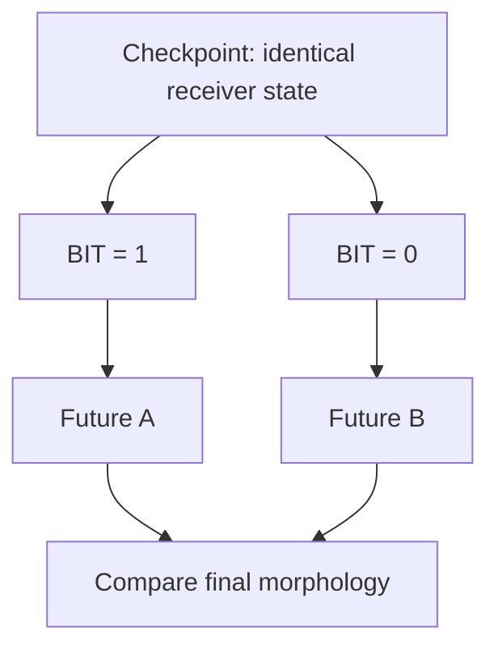

This is an intervention rather than a correlation.

The bit is the only deliberately changed input between the paired branches.

If their outcome distributions differ, the intervention has causal effect.

How large the pathwise difference should be credited to that bit will turn out to require more care.

Repeated 120 times:

```text
paired interventions              120
produced morphology divergence  95.8%
mean normalized difference     0.1633
```

Five of the 120 interventions produced no final morphological difference.

That constrains the result usefully: the claim is not that every bit deterministically changes the receiver.
 The result is not *every received bit changes the receiver*. It is:

> **Changing one received bit, while holding receiver state, stochastic state and external forcing fixed, usually altered the receiver's subsequent morphology.**

The bit reaches the actual growth process. A primitive causal channel exists.

---

## The Crystal Can Hear a Pulse

Let that be exciting for a moment, because it should be.

One process generates an event out of its own activity. The event enters a second process. The second process develops differently as a result. Written down like that, it is very hard not to reach for the word communication.

So attack it.

The question we have answered is *can an event cause a change*, and the answer is yes. The question that would justify the stronger word is much harder:

> **Does something specific about the actual sender survive transmission in a way the receiver distinguishes?**

That takes a ladder of controls, each one removing a cheaper explanation than the last.

**Destroy the timing.** Keep the same number of bits, move them to different steps. If sender timing matters, the real stream should win. It does, and comfortably: the mean peak message-to-growth correlation for the real stream exceeded the shuffled stream by about 0.294, with a pairwise superiority near 0.980.

**Replace the sender with randomness.** Preserve the pulse count, place the pulses at random times. Real wins again — a difference of about 0.270, superiority about 0.977. So the receiver is not merely responding to how many bits arrived. Something about their arrangement matters.

At this point the story is going very well. Timing structure is real. The next control is the one that decides the chapter.

**Replace the sender with another sender.** Generate the pulse stream from a different Digital Crystal of the same type, with its own independent environment and its own growth trajectory, then force its pulse count to match the real sender exactly. Now the receiver sees either the actual sender's stream, or a same-class stranger's stream with the same number of pulses.

If anything about the actual sender is surviving transmission, the real stream should win.

```text
real minus unrelated      -0.015
pairwise superiority       0.457
```

It does not win. If anything the stranger is fractionally ahead, and the difference is small enough to be nothing at all.

**Preserve the intervals, destroy their order.** One more turn of the screw. Take the real sender's pulse stream, measure every gap between pulses, keep that exact multiset of intervals and permute their order. Same pulse count, same collection of gaps, same coarse burstiness, different chronology.

```text
real minus surrogate       0.010
pairwise superiority       0.473
```

Again, effectively nothing.

We also tried to rescue the claim with structure rather than statistics. Six crystals in a line, each one's pulses feeding the next, produced source-to-node correlations that looked convincingly like a signal travelling down a chain — until the shuffled-edge control produced almost the same pattern, with a mean absolute real-versus-shuffled difference of about 0.0164. A 6×6 board of thirty-six locally connected crystals told the same story: real minus shuffled neighbour correlation, about 0.0048. We had built connectivity. We had not built coordination.

```text
causal transmission
↓
sender-specific signalling?      NO
↓
chain-specific propagation?      NO
↓
board-level coordination?        NO
```

The bounded result:

> Within Digital Crystal v1, changing one received bit while holding receiver state, stochastic state and external forcing fixed can alter the receiver's subsequent morphology. Real sender-generated pulse timing produces stronger receiver relationships than shuffled or rate-matched random timing, but it does not outperform count-matched same-class sender replay or an interval-preserving surrogate. This supports primitive causal transmission, not sender-specific signalling.

Or, more briefly:

> **The crystal can hear a pulse. It cannot yet tell who spoke.**

---

## What the Failure Was Actually Telling Us

It would be lazy to summarize that as *communication failed*.

Look at what the control ladder actually mapped. The receiver is demonstrably sensitive to some coarse property of the pulse stream — its density, its burstiness, the general shape of its interval distribution — because shuffled and rate-matched controls both lose. And it is demonstrably insensitive to which same-class crystal produced that stream, and to the exact order in which the intervals occurred, because those controls both tie.

The receiver appears sensitive to some coarse temporal structure while losing the distinctions required to identify the particular sender or exact interval chronology.

The channel is lossy.

And it rhymes with the chapter before it:

```text
Chapter 4
broad source characteristics survive
exact temporal ordering does not

Chapter 5
broad pulse-stream structure matters
sender identity and exact chronology do not
```

Twice now, different experiments have produced the same suggestive pattern:

```text
coarse temporal structure survives
fine temporal identity does not
```

---

## What Counts as the Same Random World?

There is a problem underneath everything we have just done, and it took us a while to see it.

Digital Crystal growth is stochastic. When we fork a checkpoint into a treated and an untreated branch, we hold the random-number state fixed and assume that gives us two versions of the same random world.

It does not. It gives us two versions of the same random *stream*.

Here is the mechanism. At each step the process builds a frontier of candidate cells, sorts it, and hands each candidate the next value from the stream. Perfectly reproducible — as long as both branches present the same candidates in the same order. But the intervention changes an attachment, which changes the frontier, which changes the sorted list. From that moment the two branches are consuming the same sequence of numbers in different places. Random value 27 lands on a different cell in each world, and every value after it is misassigned relative to its counterpart.

Imagine two identical card tables, each being dealt from an identically ordered deck. Remove one player from one table. That table does not merely lose a player: every card after the gap now lands in a different hand. Compare the two tables afterwards and you will measure an enormous difference — but much of it is not the consequence of the missing player. It is the consequence of the reshuffle you caused by removing them.

So some of the dramatic pathwise divergence in our early perturbation experiments could come from reassigned stochastic opportunities rather than from downstream amplification of the intervention itself.

The causal effect remained real.

Its apparent cascade had become suspect.

```text
SAME RANDOM STREAM
≠
SAME RANDOM OPPORTUNITIES
```

---

## The Cascade Shrinks

The fix is to key randomness to the event rather than to the sequence.

We built a second experimental runner in which each possible attachment opportunity draws its random value from a function of the seed, the absolute step and the cell coordinate. A cell at a given position at a given step then sees the same random value in both branches. If a cell exists in one branch and not the other, only *that* opportunity differs; a change to the frontier somewhere else no longer shifts every subsequent draw.

This is a common-random-number coupling, and it needs a clear label:

> **The cell-keyed runner is an experimental coupling, not a replacement for the canonical Digital Crystal.**

The canonical model remains the sequential stochastic process from Chapter 4. The keyed runner exists only to define a cleaner paired counterfactual — and before using it, we had to check we had not quietly built a different crystal. Across 96 runs per implementation, the omnibus morphology comparison between the two found no evidence of a gross distributional discrepancy (`p ≈ 0.922`), and four predeclared practical-compatibility margins all passed. That is not proof that the two processes are mathematically identical. It is enough to use the instrument for the experiment it was declared for.

Then repeat the pulse experiment under both couplings and compare like with like: how far apart do the two branches drift, relative to the drift you get from two entirely independent stochastic continuations?

```text
sequential RNG coupling      ≈ 87% of independent-divergence scale
cell-keyed CRN coupling      ≈ 11% of independent-divergence scale
```

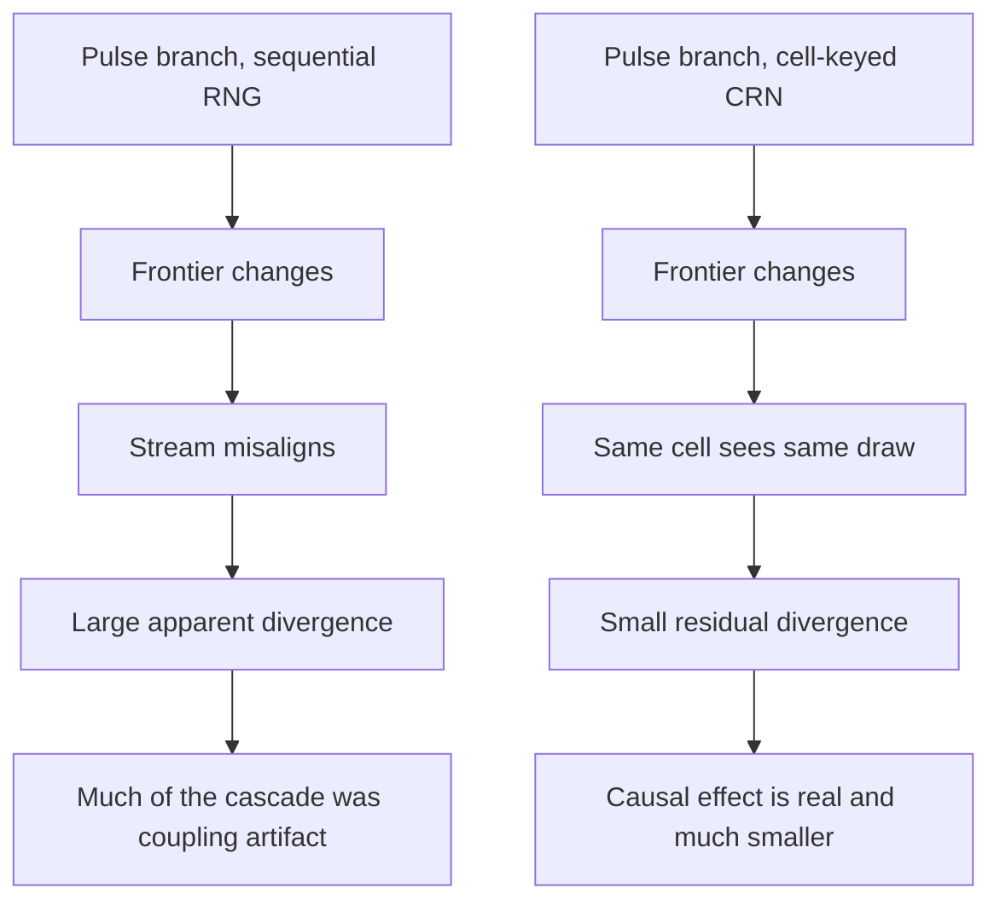

The pulse did not stop mattering. The intervention remains causal under both couplings. What collapsed was the apparent explosion of consequences that followed it.

This is not a footnote about random-number generators. It changes what a counterfactual trajectory *is* in a stochastic computational system:

```text
CAUSAL EFFECT
≠
COUPLING-INVARIANT PATHWISE DIVERGENCE
```

This forces another separation.

```text
difference between outcome distributions
≠
paired difference under a declared stochastic coupling
≠
distance between two particular trajectories
```

A related correction belongs here too. Before the coupling was fixed, four-pulse sequences appeared to produce a response that was substantially different from the sum of the individually measured pulse responses — an attractive result, since nonlinear integration of input history would be a genuinely interesting property. After the coupling fix we added a measurement-noise floor: how large a mean feature difference appears when you compare two finite samples drawn from the *same* unperturbed population? The floor came out around 0.045. The superposition residual was around 0.007.

The effect was several times smaller than our ability to see it. So:

```text
OBSERVED DISCREPANCY
≠
RESOLVED MECHANISTIC NONLINEARITY
```

Within the resolution of this experiment, the multi-pulse response stayed compatible with the sum of the isolated responses. The discrepancy existed.

The experiment could not resolve it as a mechanistic effect.

---

## Two Histories

Now, finally, the question the chapter has been walking toward.

We know a pulse changes the future. Does the *arrangement* of pulses leave a trace?

The naive comparison is too easy. Compare `11110000` against `10010010` and a classifier might succeed merely because one crystal was perturbed more recently than the other. That would be recency detection, not history retention.

So the confirmatory experiment used two codewords built to remove the cheap cues:

```text
A = 11100001      pulses at {0, 1, 2, 7}
B = 10001101      pulses at {0, 4, 5, 7}
```

Same number of pulses. Same first pulse. Same last pulse. Only the interior arrangement differs.

The confirmatory experiment was frozen before the result was inspected: codewords, stochastic coupling, primary endpoint and primary morphology measurement.

Secondary measurements were recorded but were not allowed to rescue a failed primary test.

That matters because otherwise every negative result becomes permission to keep searching until some alternative statistic succeeds.

Forty-eight independently generated receiver checkpoints. Two histories each. One question:

> **Does temporal arrangement leave a stable, reproducible morphological signature across independently generated receivers?**

---

## Different Futures, No Stable Signature

The two histories did not produce identical crystals. Immediately after the final pulse, the average normalized symmetric difference between paired futures was about:

```text
0.053     [0.048, 0.059]
```

So the interior arrangement of the pulses had real causal consequences. Rearranging when the bits arrived changed what the receiver became.

The population-level test asked for something stronger, and got nothing.

```text
primary angular test (9 features)     p = 0.7366
secondary test (24 features)          p = 0.9320
```

This was not a near miss.

The predeclared primary statistic showed no evidence of a stable history signature, and the wider secondary measurement did not recover one either.

The predeclared experiment failed. Not the software, not the preflight, not the coupling. The hypothesis.

The scope of that failure needs stating precisely, because a sloppy version of it would be false:

> Under the frozen protocol, changing the interior timing of four pulses while holding pulse count, onset and offset fixed did not produce a reproducible population-level morphology signature detectable by the predeclared angular measurement at the primary endpoint.

Within the predeclared scope, the hypothesis failed.

That is stronger than saying we did not find enough evidence, because the experiment was built specifically to test this claim and passed its validity checks.

What we did *not* establish is that temporal arrangement can never matter, or that these histories had no consequences. They plainly had consequences. What we could not do was read back which history had occurred from the shape it produced.

```text
DIFFERENT HISTORY → DIFFERENT PARTICULAR FUTURE
SUPPORTED

DIFFERENT HISTORY → STABLE POPULATION-LEVEL SIGNATURE
FAILED
```

There is a tempting sentence here: *the crystal forgot the sequence*. We cannot say that. Forgetting presupposes something like memory to lose. What we can say is stranger and more useful:

> **A history can contribute causally to the present without remaining legible in the present.**

---

## A Past With Consequences

Put the three experiments side by side and a hierarchy appears that was not visible from any one of them.

```text
CAUSAL CONSEQUENCE
        ↓
PERSISTENT CONSEQUENCE
        ↓
SYSTEMATIC SIGNATURE
        ↓
RECOVERABLE INFORMATION

```

Every arrow is a new empirical claim.

The Crystal has crossed the first threshold repeatedly.

The experiments in this chapter show why none of the later thresholds follows automatically.

That is the shape of the chapter, and it is worth being clear that this is a chapter with a great deal in it. Several strong interpretations died. The phenomena underneath them did not.

The strongest surviving progression is:

```text
complete state
→ exact continuation

recorded events
→ exact reconstruction

earlier intervention
→ later causal consequence

different histories
→ different particular futures
```

Three distinctions now matter more than the rest:

```text
VISIBLE FORM
≠
EXECUTABLE STATE

RECORDED PAST
≠
CAUSALLY AVAILABLE PAST

CAUSAL CONSEQUENCE
≠
MEMORY
```

The single sentence the chapter has earned:

> **The past has become causally real before it has become memory.**

---

## Evidence Ledger

| Claim | Status | Evidence |
|---|---|---|
| Complete checkpoint resumes the exact trajectory | **SUPPORTED** | `30/30` exact restores; symmetric difference `0` |
| Visible morphology alone is sufficient continuation state | **FAILED** | 30-cell divergence |
| Stochastic continuation state matters for exact continuation | **SUPPORTED** | 28-cell divergence when removed |
| Environmental sequence position matters at fixed horizon | **SUPPORTED** | 27-cell divergence when shifted |
| Birth-time metadata affects occupied-set continuation | **FAILED** | 0 differing cells |
| Event history reconstructs the recorded morphology trajectory | **SUPPORTED** | `96/96` trajectory hashes |
| Event history restores historical stochastic state | **NOT SUPPORTED** | additions alone do not contain it |
| Checkpoint is an executable counterfactual branch point | **SUPPORTED** | controlled alternative continuations |
| Environmental branching dominates stochastic divergence | **NOT SUPPORTED** | treatment mean below stochastic-null mean |
| A received one-bit event can alter receiver morphology | **SUPPORTED** | 120 paired interventions; 95.8% diverged |
| Real pulse timing beats shuffled and rate-matched timing | **SUPPORTED** | differences ≈ `0.294` and `0.270` |
| The actual sender matters more than a same-class sender | **FAILED** | difference `-0.015`; superiority `0.457` |
| Exact chronology matters beyond the same interval multiset | **FAILED** | difference `0.010`; superiority `0.473` |
| Influence propagates specifically through chain topology | **FAILED** | real-vs-shuffled ≈ `0.0164` |
| Local 6×6 topology produces organized signalling | **FAILED** | real-vs-shuffled ≈ `0.0048` |
| Pathwise divergence depends on stochastic coupling | **SUPPORTED** | ≈87% sequential vs ≈11% cell-keyed |
| Multi-pulse response is nonlinear | **FAILED** | residual `0.007` below measurement floor `0.045` |
| Matched pulse histories produce different particular futures | **SUPPORTED** | normalized difference `0.053` |
| Matched pulse histories leave a population-level signature | **FAILED** | `p = 0.7366`; secondary `p = 0.9320` |
| The crystal possesses or consults its recorded history | **NOT CLAIMED** | no mechanism consults the record |
| The crystal remembers, learns, communicates or coordinates | **NOT CLAIMED** | evidence insufficient |

---

## Put the Past Into the Material

So where, exactly, is the crystal's past?

Not in our checkpoint — that belongs to the laboratory. Not in our event log — the growth rule never reads it. Not in the morphology, which turned out to be a projection of the state rather than the state itself, and which could not be made to give up the arrangement of the pulses that shaped it.

And yet the past is unmistakably doing something.

A pulse changes an attachment.
That attachment changes the frontier.
The changed frontier alters later opportunities.
The process follows a different trajectory.

```text
event
↓
local consequence
↓
changed possibility
↓
later consequence
```

Which suggests the next experiment, and it is smaller than memory and more concrete than history.

So far, an occupied Crystal cell has almost no internal state.

It cannot be changed by experience and remain changed afterwards.

It cannot carry a persistent local distinction between:

```text
this happened here
```

```text
not in our checkpoint
not in our database
not in our event log

what if experience
changed the material itself?
```

Change the material.

Then remove the event that changed it.

If the material difference persists, remains accessible to later computation, and changes what the process does next, then the past will have acquired something it has not had anywhere in this chapter:

**an internal carrier.**

Not memory.

Not yet.

But finally a place inside the process where experience can remain causally available after the original event is gone.

> **Can experience change the material itself?**

---

## 06: Can Experience Change the Material?

At the end of the last chapter the Digital Crystal had a past with real consequences and nowhere inside itself to keep it.

A checkpoint could continue it exactly, but the checkpoint belonged to us. An event log could reconstruct how it formed, but the growth rule never read the log. A single received bit could redirect a later trajectory, and two matched pulse histories produced measurably different futures — yet nothing about those futures let us recover which history had occurred.

The consequences propagated forward through construction itself. An altered attachment changed a frontier; the changed frontier changed what could happen next. That is a genuine causal past. It is not a stored one. Nothing was written down anywhere inside the process, because the process had nowhere to write.

As material, an occupied cell has carried almost no internal distinction beyond the fact that it exists.

So the question that ends Chapter 5 is the question that opens this one:

> **Can experience change the material itself?**

Which sounds almost too easy. Of course software can change a variable. We could write:

```python
memory = 1
```

after a pulse and declare the problem solved. But then the answer would have been put into the architecture by us, and the experiment would tell us nothing at all — the same objection that has followed every tempting shortcut in this book.

So the real question is smaller and much harder:

> **What is the smallest local change produced by experience that can persist and later alter what the crystal builds?**

Add as little as possible. Then find out what that little is worth.

---

## One More Kind of Cell

Until now a cell in the Digital Crystal has had two possible material conditions:

```text
EMPTY
OCCUPIED
```

For this chapter we allow one more:

```text
EMPTY
OCCUPIED_NORMAL
OCCUPIED_MODIFIED
```

A pulse can convert some occupied cells near the active growth region from normal to modified. That is the entire addition.

There is no history list. No global register. No timestamp recording when the pulse arrived. No stored copy of the signal. No decoder. No learned weight. No target morphology. No module named `memory`. Nothing in the substrate knows what a pulse *was*, and nothing can ask.

The modified condition does exactly two things. It persists. And while a modified cell sits adjacent to a candidate attachment site, it slightly changes that candidate's local attachment probability.


That chain is the hypothesis.

Every arrow is a separate empirical claim.

We should not assume that persistence, accessibility and later causal effect arrive together merely because we implemented one material state.

If the mechanism fails outright, that is useful. If it succeeds, we still have to ask precisely what succeeded.

---

## The Mark Persists

The first requirement is easy to satisfy.

The pulse arrives. Cells near the boundary become modified. The pulse ends. The modified cells remain modified because this model contains no rule that erases or decays that state.

We have produced a persistent internal consequence of experience. Not a record in our database, not a checkpoint on our disk: a difference inside the material of the crystal itself, written by something that happened to it.

This is the first mechanism that makes the word *memory* genuinely tempting.

The event is over.

The material is different because it happened.

And the difference remains.

Good.

Now ask whether the future can still reach it.

So we do the obvious thing and check whether it matters.

Take an experienced crystal. At a later checkpoint, clone it. In one copy erase the modified labels while leaving the visible occupied geometry exactly as it is. Continue both copies under identical future conditions and identical stochastic coupling.

If the retained material is doing causal work, the two futures should differ.

```text
experienced, labels retained ─┐
                              ├─→ continue → compare
experienced, labels erased ───┘
```

At the late ablation point, removing the retained material state produced no downstream difference.

The trace was still present.

Its removal no longer changed the future.

---

## And Then It Stops Mattering

Read that result carefully, because the obvious interpretation is wrong.

The state had not decayed. The modified cells were all still there, still modified, still exactly as the pulse had left them. We erased something that was unambiguously present, and the future did not notice.

Which gives the first real result of the chapter:

```text
PERSISTENCE
≠
CAUSAL ACCESSIBILITY
```

The trace had not disappeared.

It had become causally irrelevant.

The clue was geometric.

The Digital Crystal grows outward. Attachment decisions happen at the frontier, among candidate sites adjacent to existing material. A cell that sits on the boundary today is surrounded by newer cells tomorrow and buried under several layers of them a few steps later. It remains in the lattice forever. It stops being anywhere near a place where anything is being decided.

Paint a mark on a brick and keep building outward.

The mark does not fade.

It simply moves behind the surface where new construction happens.

So we stopped counting how many modified cells survived and started measuring where they were: how many remained on the boundary, how many current frontier sites had a modified neighbour, what fraction of active construction could still encounter modified material at all.

The mystery evaporated. Immediately after the pulse the modified material was exposed to the frontier. A few updates later that exposure had collapsed. By the late checkpoint where our ablation had found nothing, there was nothing left to find — not because the state was gone, but because no decision was being made anywhere near it.

The timed erasure experiment makes the relationship direct. Erase the same material at different moments and the causal consequence tracks frontier contact, not quantity:

```text
early probe     mean frontier contact ≈ 16.69     ablation effect detected
later probe     mean frontier contact ≈  2.25     effect not detected
after burial    mean frontier contact =   0       effect = 0
```

The bounded result:

> **Persistent material state matters only while it remains causally accessible to the active growth frontier.**

---

## Storage Is Not Access

This deserves to be stated as more than a debugging note, because it inverts the intuition we brought to the problem.

We had assumed that the hard part of keeping a past would be keeping it.

In this model, that assumption was wrong.

The modified state does not decay unless we explicitly introduce a mechanism that removes it. Persistence therefore became almost trivial.

And yet the state stopped mattering.

The bottleneck was not retention.

It was access.

> **The crystal did not run out of storage. Its past fell behind the moving surface where the future was being decided.**

The active frontier is not merely the geometric edge of the crystal. It is the interface through which existing material can still participate in the next construction decisions.

Call this the crystal's **causal aperture**.

State inside that aperture can affect future transitions.

State left behind it may remain perfectly preserved while losing any route into the computation that comes next.

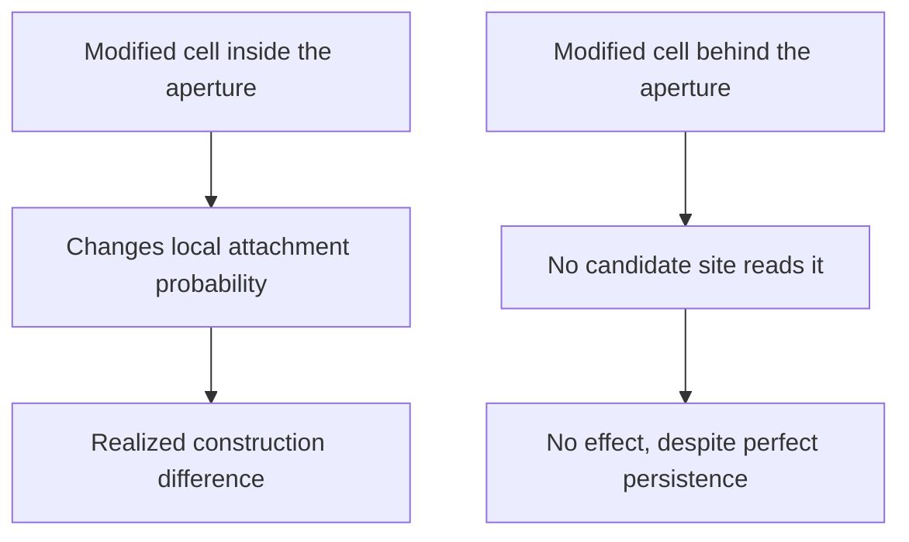

Inside the aperture:

```text
state → probability → construction
```

Outside it:

```text
state → nothing currently reads it
```

The storage survived. The read path disappeared.

That is a substrate-native result.

We did not need a biological theory of memory to discover it. It emerged from the interaction between irreversible growth, local state and a moving computational interface.

Within this model, persistence is cheap.

Causal access is scarce.

---

## Close the Causal Chain

Before building anything on top of that, one alternative explanation had to be removed. Perhaps the local material effect was simply too weak to matter, buried or not — a decorative parameter that never changed anything.

So we audited the mechanism end to end.

For every candidate site at the frontier we can compute its attachment probability with the material effect and without it, giving a local difference `Δp`. But a changed probability is not a changed event. If the probability moves from 0.510 to 0.515 and the random draw is 0.900, nothing whatsoever happens; the cell stays empty in both worlds. Move the same probability against a draw of 0.512 and the two worlds disagree:

```text
without modified neighbour:  no attachment
with modified neighbour:     attachment
```

That is a realized causal flip — the point at which a probability shift becomes a difference in what exists.

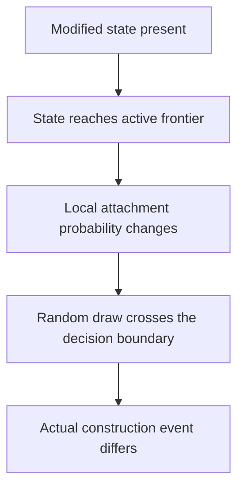

We measured every level of that chain. While enough modified material remained adjacent to the frontier, probabilities genuinely moved, and some of those movements genuinely crossed the stochastic decision boundary and changed which cells were built.

So the mechanism has causal power. The problem is keeping it somewhere that power can still be exercised.

---

## Keep the Mark Moving

The obvious response to burial is to stop the state from being buried.

So we let the mark travel: a newly attached cell growing beside modified material can itself become modified. The trace now moves outward with construction instead of waiting to be covered by it.

Again the first result looked encouraging. More modified cells. Longer survival of the state near the growing edge.

And again the same failure arrived, only later. Most of the propagated material was still eventually buried. We had improved the *transport* of the state without solving the *access* problem.

```text
STATE PERSISTS
≠
STATE PROPAGATES
≠
STATE REMAINS ACCESSIBLE
```

Propagation is not continued accessibility.

A process can copy a historical state faithfully and repeatedly while still allowing those copies to fall behind the region where future decisions are made.

---

## Amount or Placement?

If placement is what matters, then it should be possible to change nothing but placement.

A newly attached cell eligible to become modified can be chosen in different ways. Prefer cells that will end up relatively buried. Choose among eligible cells with no preference at all. Or prefer cells with greater outward exposure. Three policies:

```text
INTERIOR-BIASED
RANDOM
SURFACE-BIASED
```

The surface policy produced a striking result on the first run. Modified state stayed near active construction much longer, generated more frontier exposure, more probability leverage, and more realized construction differences.

At first, that looked like the answer.

Then we found the confound, and it is a good one. Keeping modified state near the frontier does not merely place the same material better. It creates more opportunities for new cells to acquire the modified condition, which places more material near the frontier, which creates more opportunities again:

```text
surface placement
↓
more accessible modified material
↓
more eligible propagation opportunities
↓
more actual propagation
↓
still more accessible material
```

The surface branch was changing two variables at once:

```text
where modified state was placed
+
how much modified state existed
```

So the exciting run was not yet evidence for the claim we wanted. This is the recurring shape of the book: the first version of a positive result usually contains a cheaper explanation than the one we hoped for.

---

## Put the Same Past in Different Places

The fix is to take the quantity away as a variable.

We rebuilt the comparison with a controller that looks across all three branches at every propagation step, finds a copy budget that all of them can satisfy, and forces every branch to transmit exactly that many modified cells. Same checkpoint, same environment, same number of propagation events, same amount of material copied. The only remaining difference is where it goes.

Now the intervention is clean:

> **Where does the same amount of historical state go?**

The first matched-quantity experiment failed.

Its predeclared endpoint was a single late snapshot, and the predicted ordering was not present there. That result stays failed.

The trajectories suggested a different question: perhaps placement affects **how long** state remains causally available rather than guaranteeing a difference at one arbitrarily late moment.

That observation did not rescue the failed endpoint.

It generated a new hypothesis, tested in a new experiment with a frozen observation window:

> **Placement may control causal lifetime rather than any one late state.**

---

## The Surface Wins

So we kept the exact matched-copy controller, changed nothing about the material mechanism, and changed only the definition of the outcome. Instead of one frame, freeze an observation window — steps 5 through 18 — and integrate through it:

```text
frontier accessibility over time
probability leverage over time
realized causal attachment flips over time
```

New seed, new population of crystals, window and metrics fixed before looking at any result.

All three integrated measures produced the same ordering:

```text
INTERIOR  <  RANDOM  <  SURFACE
```

```text
                        INTERIOR   RANDOM   SURFACE

integrated access AUC      0.515    0.847     1.293
probability leverage       3.87     7.33     12.26
realized causal flips      4.06     7.52     12.39
```

And the cumulative amount of propagated material was identical across all three policies — an average of 27.1875 transmissions each. The experiment was not comparing more history against less history. It was comparing where an equal amount of history had been put.

That earns the strongest claim of the chapter:

> **With propagated-state quantity held constant, spatial placement changes how long and how strongly that state remains causally available to subsequent growth.**

More stored past was not the answer.

The same amount of stored state had a different causal lifetime depending on where it was placed.

The quantity was fixed.

Persistence was guaranteed by the model.

Yet causal accessibility and realized influence still differed substantially.

The variable that remained was geometry relative to the moving interface.

Storage capacity had ceased to be the interesting quantity.

---

## Stop Digging

We pushed the mechanism further.

Could accessibility reinforce itself by creating more propagation opportunities?

Could the timing of otherwise matched transmissions increase causal access?

Could some propagation schedules produce more causal effect per contact?

Each produced narrower observations worth retaining in the experimental record.

None satisfied its broader predeclared claim.

At that point the scientific picture had stopped changing:

```text
amount matters
placement matters
frontier access matters
```

---

## What We Actually Built

Strip out the words *experience* and *memory* and describe the object plainly.

A past event writes a persistent local state. That state changes construction probabilities in its immediate neighbourhood. Some of those probability changes cross the stochastic decision boundary and alter which cells actually get built. Propagation can carry the state outward. Placement determines how long it stays reachable. Once it falls behind the aperture it can persist forever while affecting nothing.

A useful operational description is:

> **state-dependent construction through a moving causal aperture**

That is more than passive storage and considerably less than memory. Nothing recognizes anything. Nothing is represented. The material does not know what happened to it; it is merely, locally, different — and the difference has consequences for as long as the future can still touch it.

The sentence worth carrying forward:

> **A past can remain stored long after it has stopped being reachable by the future.**

---

## Did Something Happen — or What Happened?

Now the escalation, and it is the one that decides whether any of this is going anywhere.

Everything above concerns a single binary condition. The material can answer exactly one historical question:

```text
DID SOMETHING HAPPEN HERE?
```

A future that depends on **whether** something happened is weaker than a future that depends on **which** thing happened.

That is the next boundary.

The first gives us a retained consequence.

The second would give us history-dependent differentiation.

So:

> **Can two different prior experiences leave different retained material states that produce meaningfully different responses to exactly the same later challenge?**

The design follows directly. Give two crystals two different histories. Stop the histories. Let both continue under identical conditions. Then hit both with an identical later challenge and ask whether their responses differ — and whether the difference is caused by the retained material rather than by whatever geometry the histories happened to leave behind.

If that holds, then past identity—not merely the presence of a past event—has become a causal variable in the later response.

Call the narrower property **history discrimination**.

---

## Two Pasts, One Challenge

The first attempt made history identity explicit. Three material states instead of two:

```text
NORMAL
HISTORY_A
HISTORY_B
```

Two branches were made identical in geometry, material quantity and write locations, differing only in whether the retained label was `HISTORY_A` or `HISTORY_B`.
 Immediately before the challenge the two crystals matched on everything we could match:

```text
occupied cells          identical
visible morphology      identical
label locations         identical
material quantity       identical
propagation placement   identical
environment             identical
random-number coupling  identical

only the label identity differed
```

During retention both labels were inert — they did nothing at all. During the challenge, a `HISTORY_A` neighbour produced a small positive local bias and a `HISTORY_B` neighbour a small negative one, and the primary quantity was the interaction:

```text
(A challenge − A no-challenge) − (B challenge − B no-challenge)
```

The controls behaved as required.
 Without the challenge, A and B futures were identical. Erase the labels immediately before the challenge and A and B futures were identical again. So any difference in the retained-label challenge condition had to come from the labels.

And before running it, we froze something the book had been missing: a smallest effect worth interpreting. The interaction had to clear a directional statistical test **and** be at least 1% of the pre-challenge population **and** at least 0.5 standard deviations of ordinary seed-to-seed noise.

```text
statistically detectable
AND
large enough to matter
```

That second requirement was about to earn its keep.

---

## The Most Dangerous P-Value in the Chapter

A difference appeared.

```text
normalized interaction     0.00440
bootstrap interval         0.00331 ... 0.00548
directional test           p ≈ 0.00025
```

By a conventional significance-only rule, this would be easy to call positive.

The interval excludes zero comfortably.

The p-value is tiny.

But significance was only one of the criteria we had declared before running the experiment.

But the effect was 0.44% of the pre-challenge population, against a declared requirement of 1.00%. Against the seed-noise scale it was 0.383 standard deviations, against a declared requirement of 0.500.

```text
FAILED
```

The statistical effect is detectable.

The scientific claim still fails.

Before seeing the result, we had specified not merely that the effect must differ from zero, but that it must be large enough relative to ordinary crystal-to-crystal variation to count as the phenomenon under investigation.

It was not.

The reason to insist on this is mechanical rather than moral. A p-value answers one question: could this effect plausibly be zero? With enough replicates, effects that are far too small to matter produce spectacularly small p-values. The question we actually care about is different:

> Is it large enough to be the thing we said we were looking for?

Here that distinction has teeth, because of what we would have written otherwise. With `p ≈ 0.00025` in hand and no magnitude gate, the sentence practically writes itself: *the crystal responds differently depending on which past it had.* Which would have been true, in the sense that a difference of 0.4% of population is a difference, and thoroughly misleading, since that is well inside the range in which two crystals with the *same* history routinely differ from each other by chance.

```text
STATISTICALLY DETECTABLE
≠
SCIENTIFICALLY LARGE ENOUGH
```

We had also noticed, in passing, that most of the difference appeared in the very first challenge step and then washed out. It would have been easy to promote that first step to the primary endpoint after seeing it. The primary endpoint was the frozen four-step interaction. It stayed frozen, and the first-step pattern stayed a diagnostic observation.

---

## Remove the Decoder

The failed magnitude gate was already enough to reject the claim.

But the design also exposed a deeper problem with the question we had built.

We created two labels and then explicitly told the challenge how to interpret each one:

```python
if history == "A":
    increase probability
elif history == "B":
    decrease probability
```

That is a decoder we supplied.

The experiment can test whether an engineered A/B state remains available to a later rule explicitly designed to distinguish A from B.

It cannot answer the stronger question:

> **Can different pasts leave material differences that ordinary later dynamics distinguish without being told what those histories mean?**

So the next experiment removed the symbolic distinction entirely.

So rather than tuning the failed experiment, we removed the decoder.

---

## Two Pasts Without Names

The second design returns to a single altered state:

```text
NORMAL
MODIFIED
```

No `HISTORY_A`. No `HISTORY_B`. Nothing in the substrate that names a history.

The two experiences differ only in *where* they write the same modified state: experience A toward one directional region of the boundary, experience B toward another. Identical initial write counts. Identical material physics afterwards. At every propagation step, both histories are forced to copy exactly the same number of cells. The two pasts differ in spatial organization and in nothing else.

Then one identical challenge, with no history-specific rule anywhere in it.

There is one more confound to remove. Because modified material affects growth, the two histories may themselves produce slightly different geometries before the challenge arrives — in which case a simple A-versus-B comparison would confuse retained material with the shape that material happened to build. So at the exact pre-challenge checkpoint we clone each history and erase only its labels, keeping the geometry untouched, and take the difference of differences:

```text
[(A challenge − A no-challenge) − (B challenge − B no-challenge)]
                              MINUS
[(A-erased ...)               − (B-erased ...)]
```

That isolates the question properly:

> **Does retained material organization contribute a history-dependent response beyond whatever geometry the history already created?**

---

## The Traces Stayed Different. The Response Did Not.

The mechanism audit came back well. Both histories wrote the same amount of material and propagated identical quantities:

```text
mean initial writes         19.6
cumulative material A       78.5
cumulative material B       78.5
```

Their spatial organizations remained measurably different throughout retention — a directional diagnostic separated them cleanly and kept them separated, rather than letting them collapse into one indistinguishable distribution. And crucially, given everything the first half of this chapter established, the material had not been buried: at the end of the retention window roughly one fifth of the active frontier was still in contact with modified material in both conditions.

So when the challenge arrived, three things were already established:

```text
the material distinction persisted
the two spatial histories remained distinguishable
both remained exposed to the causal aperture
```

```text
primary material-mediated interaction     0.000431
confidence interval                       [−0.000380, +0.001235]
directional test                          p ≈ 0.163
against seed noise                        0.033 SD  (required 0.500 SD)
```

```text
FAILED
```

This is not a near miss. The interval straddles zero and the effect is a few hundredths of the scale on which crystals differ from each other for no reason at all. There is nothing here to rescue and nothing worth tuning.

Many additional probes are possible: different spatial organizations, different challenge geometries, different timings.

But each would be a new experiment.

The frozen experiment failed, and searching variations until one succeeds would answer a different question from the one we declared.

So this mechanism family stops here.

One caveat has to be stated precisely, because it is the honest limit of the negative result. Our challenge is one particular probe. Two states can differ in a degree of freedom that a given probe simply does not measure — a detector sensitive only to total amplitude responds identically to two signals differing in phase. So what failed is this:

> **Under the frozen protocol, two persistent, accessible, measurably different material histories did not produce a scientifically meaningful difference in response to a common later challenge.**

Not: no possible later interaction could ever distinguish them. That claim would need an experiment nobody has run. But acknowledging a limit is not a licence to keep searching past it.

---

## A Past You Can Reach

Two hypotheses failed in this chapter. It would be a serious misreading to conclude that nothing worked.

What survived is the mechanism the chapter set out to find. Experience can write a persistent local change into the material of the process. That change biases what gets built nearby. Some of those biases become realized construction differences. And with quantity held exactly constant, where the state sits determines how long and how strongly it can do any of that.

What failed is the promotion of that mechanism into something that carries the *identity* of a past.

The two together give a ladder in which every rung is a separate empirical property:

```text
WRITE
↓
PERSIST
↓
REMAIN ACCESSIBLE
↓
ALTER LATER CONSTRUCTION
↓
DISTINGUISH BETWEEN PASTS

```

The chapter's two sentences:

> **Persistent does not mean accessible.**

> **Accessible and distinguishable does not mean differentially used.**

The second failure is more interesting because the first explanation is no longer available.

Earlier, stored state stopped mattering because growth buried it.

Here the two histories remained:

```text
persistent
distinct
accessible
```

A stored distinction is not automatically a distinction the future dynamics use.

That gives us a stronger hierarchy:

```text
stored
≠
accessible
≠
causally leveraged
≠
differentially read
```

---

## Evidence Ledger

| Claim | Status | Evidence |
|---|---|---|
| Experience can write a persistent local material state | **SUPPORTED** | modified cells persist indefinitely after the pulse |
| Persistent material state is automatically usable | **FAILED** | late erasure produced no detectable difference |
| Causal efficacy tracks frontier accessibility | **SUPPORTED** | effect present at contact ≈ 16.69, absent at ≈ 2.25, zero after burial |
| Modified material changes local attachment probability | **SUPPORTED** | measured Δp at frontier candidates |
| Probability change becomes realized construction difference | **SUPPORTED** | counterfactual attachment flips at the decision boundary |
| Propagation alone preserves causal access | **FAILED** | propagated material was still eventually buried |
| Surface advantage is explained by copy quantity | **FAILED** (confound removed) | matched-budget controller equalized transmissions |
| Placement controls causal lifetime at fixed quantity | **SUPPORTED** | `INTERIOR < RANDOM < SURFACE` on all three integrated measures at 27.1875 matched transmissions |
| Accessibility feeds back to sustain itself | **FAILED** | no reliable increase in total transmissions |
| Temporal alignment broadly improves accessibility | **FAILED** | narrow leverage signal only |
| Timing produces general causal-efficiency advantage | **FAILED** | broad predeclared claim not met |
| Symbolic A/B labels produce a meaningful history response | **FAILED** | effect `0.00440`, `p ≈ 0.00025`, but `0.383 SD` against required `0.500 SD` |
| Two histories remain spatially distinguishable | **SUPPORTED** | directional separation maintained at matched quantity `78.5` / `78.5` |
| Distinguishable histories remain frontier-accessible | **SUPPORTED** | contact fraction ≈ `0.215` / `0.219` at end of retention |
| Non-symbolic history produces meaningful challenge response | **FAILED** | effect `0.000431`, `p ≈ 0.163`, `0.033 SD` |
| The material constitutes memory, learning or adaptation | **NOT CLAIMED** | no representation, recognition, or use of a past as a past |

---

## What Happens When the Material Doesn't Stay?

We spent this chapter trying to give the past somewhere inside the process to live, and we found the place. We also found what happens to it: growth builds over it, the aperture moves on, and a perfectly preserved history becomes a perfectly irrelevant one.

Every solution in this chapter tried to keep stored state close to a frontier that only moved outward.

That exposes an assumption we have not yet challenged.

Since the Digital Crystal was introduced:

```text
occupied
→
occupied forever
```

So the next experiment does not add another mechanism for preserving history. It removes a guarantee:

```text
occupied
↓
empty
```

with some small probability. No repair. No maintenance. No energy. No metabolism. Just loss.

That one change removes an assumption every Crystal experiment so far has been allowed to rely on:

> **material permanence**

We do not yet know what follows from removing it.

That is precisely why the experiment is worth running.

We have spent this chapter asking how the past can remain causally available.

The next experiment makes the question more basic.

What if the material carrying the process is no longer guaranteed to remain at all?

> **What survives material loss?**

---

## 07: What Survives Material Loss?

The last chapter ended with a mechanism and a constraint.

Experience could write a persistent local change into the material of the crystal, and that change could bias what got built nearby — but only while it remained inside the moving causal aperture. Growth advanced outward, the aperture advanced with it, and material left behind stayed perfectly preserved and perfectly irrelevant. Every attempt to fix that was an attempt to keep the trace near the surface.

None of those attempts questioned why the surface only ever moves one way.

Since the Digital Crystal was first defined, one transition has existed:

```text
EMPTY → OCCUPIED
```

and its reverse has not. Cells appear and never leave. The frontier advances and never retreats. Material accumulates behind it and nothing ever exposes it again. That assumption is so basic that we barely treated it as an assumption at all.

And yet it has shaped every Crystal experiment since the substrate was introduced.

So this chapter adds exactly one rule:

```text
OCCUPIED → EMPTY
```

with some small probability, applied uniformly.

Nothing else. No repair mechanism. No maintenance controller. No damage detector. No energy, no resources, no metabolism, no target morphology. The growth rule is untouched. The crystal gains no new state and no new ability to notice anything.

Just loss.

Then we find out what ordinary Digital Crystal dynamics do in a world where material is no longer guaranteed to stay.

---

## Surely Loss Eventually Wins

The obvious prediction is almost embarrassingly clean, which is exactly why it deserves to be written down before running anything.

Suppose the crystal has an effective radius $r$. New construction happens around its boundary, so construction opportunity should scale like the perimeter:

$$
\text{construction} \sim r
$$

Loss, by contrast, applies to every occupied cell, so expected loss should scale like the occupied area:

$$
\text{loss} \sim r^2
$$

One term grows linearly, the other quadratically. Whatever the constants, the quadratic term wins eventually.

```text
small crystal    →  construction > loss
larger crystal   →  loss catches up
some scale       →  balance
```

Which predicts something genuinely interesting: a finite sustainable size.

Not a size imposed by the simulation boundary, but a scale emerging from the interaction between construction and loss.

If it existed, it would be one of the first characteristic scales in the Crystal produced by the dynamics rather than specified directly by us.

Because the argument is so plausible, we fixed the conditions for believing it in advance. A finite dynamic regime had to satisfy all of the following:

```text
late population slope approximately zero
population substantially above extinction
world far from simulation capacity
population meaningfully smaller than the no-loss baseline
```

A plateau caused by the crystal dying does not count. A plateau caused by the crystal hitting the edge of the world does not count. We wanted an actual balance between construction and loss, not a ceiling.

The baseline behaved as expected. With loss switched off, the late normalized population slope was about 0.037 per update, late net growth was around 154 cells per update, and the crystal was nowhere near capacity. A clean, expanding reference.

Then we turned loss on, and swept it:

```text
δ = 0.00, 0.02, 0.04, 0.06, 0.08, 0.12, 0.16
```

---

## It Doesn't

The late normalized slopes across the entire sweep stayed at roughly:

```text
0.036 – 0.038
```

That is the no-loss slope. At the highest tested loss rate, where sixteen percent of all occupied material was being removed on every update, the crystal was still expanding at essentially the same normalized rate as a crystal losing nothing at all.

Loss did have an effect on scale: at `δ = 0.16` the late mean population was about a third smaller than the baseline. But smaller is not stationary. Nothing flattened. No tested non-zero loss rate came close to satisfying the predeclared finite-regime condition.

```text
FAILED
```

The perimeter-versus-area prediction failed.

But the reasoning was not absurd. One of its assumptions about how construction opportunity scales had become wrong once loss was introduced.

Finding that assumption is now the experiment.

---

## The Crystal Builds Faster When We Take Material Away

The scaling argument has two terms. We had checked the loss term carefully and assumed the construction term was fixed at roughly 150 cells per update, so that adding loss would simply subtract from it:

```text
+150 construction
 -80 loss
 = +70 net
```

So we looked at the gross rates, expecting to see the subtraction. The late averages looked like this:

| δ | attachments | losses | net |
|---|---|---|---|
| 0.00 | 152 | 0 | +152 |
| 0.02 | 227 | 81 | +146 |
| 0.04 | 299 | 158 | +141 |
| 0.06 | 358 | 227 | +131 |
| 0.08 | 430 | 303 | +127 |
| 0.12 | 530 | 420 | +110 |
| 0.16 | 632 | 531 | +101 |

Read the first column again. The construction rate is not holding at 152 while losses eat into it. It has more than quadrupled.

At `δ = 0.16` the crystal is losing over five hundred cells per update and attaching over six hundred. We increased material loss, and gross construction rose by more than fourfold.

Nothing in the growth rule changed across that sweep.

There is no damage response and no mechanism that detects loss.

Yet increasing loss systematically changed the geometry on which the unchanged growth rule operated, and gross construction rose with it.

So the explanation cannot be a new behaviour added to the Crystal.

It has to be a consequence of the state transitions already present.

Meanwhile the net column, which is the only column a population graph would ever have shown us, declines gently and unremarkably from +152 to +101. Had we plotted population and moved on, the entire phenomenon would have been invisible, and the finite-regime hypothesis would simply have looked like a hypothesis that failed for no reason.

---

## Loss Manufactures Frontier

The mechanism, once you look for it, is almost too simple.

The scaling argument imagined a solid interior with an outer perimeter, and asked how each term scaled with radius. That geometry is only correct in a world where material never disappears.

Remove an occupied cell from the interior and two things happen at once:

```text
occupied material decreases
+
an empty site with occupied neighbours appears
```

The vacancy is not damage. It is an attachment opportunity, indistinguishable from any other.

```text
MATERIAL LOST
↓
EMPTY LOCATION
↓
NEW LOCAL INTERFACE
↓
NEW ATTACHMENT OPPORTUNITY
```

> **Loss removes material and creates new places where construction can occur.**

The boundary measurements show this directly. Late mean boundary counts across the sweep:

```text
δ = 0.00      372
δ = 0.04     1167
δ = 0.08     1695
δ = 0.16     2068
```

The high-loss crystal has more than five times as much measured active interface despite being smaller overall.

The difference is internal vacancy structure.

Loss has created interface throughout material that previously contributed none.

So the failed premise was never the loss term. It was this:

```text
construction opportunity  ~  outer perimeter
```

Once material can disappear, construction opportunity is no longer determined only by the outer perimeter.

Loss generates additional attachment opportunities throughout occupied material.

That destroys the key assumption behind the original scaling argument:

```text
construction opportunity
~
outer perimeter only
```

This gives us a mechanism consistent with the surprisingly similar late slopes.

Increasing `δ` removes more material while simultaneously generating more internal attachment opportunities.

The gross traffic changes dramatically even though the measured normalized expansion rate changes much less.

---

## The Interface Was Never the Outer Edge

This is worth stopping on, because it changes a concept the previous chapter depended on.

Chapter 6 treated the causal aperture as the outer surface of the growing Crystal.

That worked because, under irreversible growth, the outer surface was almost the only place where new occupation could occur.

Material loss exposes the more general concept.
 The aperture was on the outside because the outside was the only place a state transition could occur.

The better definition is not geometric at all:

> **The active interface is the dynamically generated set of locations at which the process currently has an available state transition.**

Under irreversible growth those two definitions coincide, which is why the distinction never mattered. Once material can vanish, they come apart completely. The interface can now appear internally, split into many disconnected regions and disappear again as vacancies are filled.

It is defined by available transitions rather than by the visible outline of the Crystal.

That has a striking implication for the previous chapter. Buried material became causally inert because construction moved past it and nothing could ever bring it back into contact with a decision. In a world with loss, that is no longer permanent. A vacancy opening near old material puts old material back on an active interface.

Be careful with what that does and does not mean. It does not mean we have recovered history readout — nothing in Chapter 6 failed because access was theoretically impossible, and re-exposing a region does not make its arrangement legible to anything. What it means is narrower and still important:

> **The active interface is dynamically re-creatable.**

Permanent burial was a consequence of the irreversible-growth rule, not a necessary property of the Crystal substrate.

---

## Where the Material Disappears

If vacancies are what matter, then it should matter where they appear.

So hold the number of removed cells exactly equal on every update and change only their placement: one branch removes cells preferentially from the surface, the other preferentially from the interior. Same loss budget, different geometry.

The first result looked strong.

Late population under interior-biased loss was about 11.1% higher than under surface-biased loss, clearing the predeclared population-difference threshold.
 And the visible structure differed enormously:

```text
surface loss     ~2.7 late holes
interior loss   ~29.8 late holes
```

Equal loss produced unequal population outcomes.

The obvious explanation was reoccupation: interior vacancies generally have more occupied neighbours and therefore might be easier for the ordinary growth rule to fill.

Plausible.

Still unmeasured.
 Interior loss should therefore produce vacancies that are unusually easy to fill — which would explain both the higher population and, indirectly, the higher hole count.

That is a plausible story about a mechanism nobody had yet measured. Note what it is really claiming: that a large fraction of the population difference comes from vacancies being *refilled*, an event that the population curve cannot distinguish from ordinary growth and that our instruments, at this point in the chapter, could not see at all.

To measure it we needed to be able to see something the crystal itself cannot.

---

## An Attachment Is No Longer What It Was

Before this chapter, one word covered every event of interest. A cell was empty, then it was occupied, and that was an attachment. There was no other kind.

Now a location can follow a longer path:

```text
occupied → lost → empty → occupied again
```

Which means the word has quietly split in two:

```text
FIRST OCCUPATION
a location becomes occupied for the first time ever

REOCCUPATION
a location was occupied, became empty, and is occupied again
```

So we added an **observer-only occupancy ledger**: a record, kept outside the simulation, of whether each lattice position has ever been occupied before. It changes nothing about the crystal's behaviour, adds no state the growth rule can read, and exists solely so that we can classify events the crystal cannot distinguish.

That distinction changes the meaning of every attachment count in this chapter.

`632 attachments per update` no longer means 632 previously unused locations entered the Crystal.

It means:

```text
first occupations
+
reoccupations
```

Before trusting the ledger we checked its null. With loss switched off, reoccupation is structurally impossible, since nothing ever becomes empty. Across 96 no-loss runs the reoccupation count was zero, exactly. Every attachment was a first occupation. The instrument reads zero when the phenomenon cannot occur.

---

## Almost Everything Came Back

Now return to the matched surface-versus-interior design, with loss counts synchronized on every update — a mean cumulative loss of roughly 890 cells in each branch — and ask the question the ledger was built for.

What fraction of lost sites are subsequently occupied again?

```text
surface   ≈ 93.6% of unique lost sites reoccupied
interior  ≈ 95.7% of unique lost sites reoccupied
```

And how long do they stay empty?

```text
surface   ≈ 1.56 updates
interior  ≈ 1.09 updates
```

More than 93% of unique tested lost locations were subsequently occupied again, typically after only one or two updates.

This result makes the biological interpretation almost irresistible:

```text
material disappears
↓
the vacancy closes
↓
repair
```

---

## Do Not Call It Repair

There is no damage detector. There is no target morphology. There is no repair pathway, no maintenance objective, no preference for previously occupied locations, and no representation anywhere in the substrate of the fact that something was lost.

A lost site becomes empty. The ordinary growth rule encounters an empty site with occupied neighbours and does what it has always done with empty sites that have occupied neighbours. The identical rule runs whether the location is new territory at the outer edge or a hole punched through the middle of existing material. The crystal cannot tell the two apart, because nothing in it stores the distinction.

The observer knows a site is being reoccupied. The crystal does not.

```text
REOCCUPATION
≠
REPAIR
```

We encountered an early version of this temptation when a hole cut from the prototype Crystal closed again.

Then, our reason for refusing the word *healing* was mechanistic: the same rule filled exterior and interior empty space.

Now the stronger experiment reaches the same boundary quantitatively.

Under stochastic background loss and matched controls, previously occupied sites are indeed reused rapidly.

What still does not appear is a special mechanism that treats them as damage.

The bounded claim:

> **Material removal creates attachment opportunities that the ordinary growth rule rapidly reuses.**

That is a smaller sentence than *the crystal repairs itself*, and it has the advantage of being what happened.

---

## The Second Hypothesis Fails Too

The reoccupation experiment had not predicted merely that reoccupation would occur. It predicted that interior loss would produce a scientifically large reoccupation advantage over surface loss — the mechanism the 11.1% population difference had suggested.

The predeclared minimum meaningful difference was 0.15 additional reoccupations per loss. The observed difference was:

```text
0.0198
```

The difference was statistically detectable but far below the magnitude we had declared scientifically meaningful in advance.
 The same shape as the failures in the last chapter, and the same verdict:

```text
FAILED
```

Two primary hypotheses, two failures, in one chapter. Neither was foolish. Both were the obvious inference from the geometry, and the substrate simply answered a different question than the one we asked.

The failure redirected attention from the small difference between the groups to the much larger phenomenon they shared.

Interior vacancies were reoccupied somewhat faster.

But both conditions were already reoccupying almost everything.
 The frontier-creation measurement makes the point exactly:

```text
surface loss    ≈ 0.995 new frontier sites per lost cell
interior loss   ≈ 1.000 new frontier sites per lost cell
```

Essentially one-for-one, in both conditions. The general mechanism is not *interior loss creates special opportunity*. It is:

```text
LOCAL MATERIAL LOSS → NEW ATTACHMENT OPPORTUNITY
```

everywhere, almost without exception. The specific interior-advantage hypothesis failed.

What survived was broader:

> **under both tested loss placements, material removal generated attachment opportunities that were reused at very high rates.**

---

## Population Was Hiding the Process

The most consequential thing in this chapter is not about loss at all. It is about measurement.

Population has been one of our simplest summary measurements: the number of occupied cells at time `t`.
 That number is a **stock**. Once material can both appear and disappear, a stock is compatible with wildly different underlying traffic.

Consider two systems finishing an update at the same net figure:

```text
System A     +100 first occupations,     0 losses     →  +100
System B     +600 attachments,        -500 losses     →  +100
```

A population curve draws the same line through both. Dynamically they are not remotely the same system. System A is building. System B is undergoing far more material traffic despite producing the same net change.

Our crystal at high loss is System B, more extremely than the illustration:

```text
+632 attachments
-531 losses
----------------
+101 net
```

The population graph records:

```text
+101
```

```text
NET POPULATION CHANGE
≠
GROSS MATERIAL TURNOVER
```

The distinction between a stock and a flow is ancient outside this book — national accounts, hydrology, and physiology all learned to separate the level in the reservoir from the volume passing through it, and every one of them learned it the hard way. What matters here is that the Digital Crystal has just crossed the line where the distinction becomes mandatory. Before material loss, population change tracked construction much more directly.

After material turnover appears, it no longer does.

A useful working label for this observation is the **Flux Principle**:

> **Static population or morphology can conceal large ongoing construction, loss and reoccupation flows.**

With the reminder that this is currently an observation about one substrate under tested conditions, not a law about digital systems in general.

---

## The Hole Paradox

One result looked contradictory at first, and its resolution is the same lesson from another direction.

Interior-biased loss produced far more visible holes — roughly 37.6 against 3.2 for surface loss in the exact-count runs — while its individual lost sites were reoccupied slightly more often and considerably faster.

How can a process that refills faster be full of more holes?

Because a snapshot counts how many vacancies exist right now. It says nothing about how long any one of them lasts.

```text
lose A
lose B
refill A
lose C
refill B
lose D
refill C
...
```

A process can continuously create short-lived vacancies and therefore display many holes at any particular moment.

Hole count measures how many vacancies exist now.

Reoccupation delay measures how long individual vacancies tend to persist.

Those quantities can move in apparently opposite directions without contradiction.

> **State is not dynamics.**

The book keeps rediscovering that sentence. This is the first time it has been forced on us by a measurement that looks like a paradox until you check which kind of quantity you are holding.

---

## Loss and Construction Are Coupled

We can now say precisely what was wrong with the opening argument.

It was not the arithmetic. It was the assumption of independence. Writing:

```text
growth ~ r
loss ~ r²
```

treats construction and loss as two separate processes competing over a fixed geometry, so that increasing one leaves the other untouched. But loss does not act on the geometry from outside. It *is* a change to the geometry, and the geometry is what determines where construction can occur.

```text
loss
↓
changes local state
↓
creates new transition opportunities
↓
ordinary construction acts on them
↓
some loss is reversed
```

This creates a local dynamical feedback:

```text
loss
→
new attachment opportunity
→
construction
```

It requires no sensing, no goal, and no representation of the loss it counteracts. Call it **structural compensation** — with emphasis on *structural*, because the compensation is done by geometry rather than by anything resembling intent.

The crystal does not want to stay intact. Nothing in it prefers occupation to vacancy. The rule that fills a vacancy is the same rule that would otherwise act on any eligible attachment site.

Loss simply changes the set of opportunities available to that rule.

---

## Turnover Without Repair

Both primary hypotheses failed.

But underneath them a cleaner process became visible:

```text
material loss
↓
new transition opportunity
↓
ordinary construction
↓
rapid reoccupation
↓
continued turnover
```

The growth rule did not become more sophisticated.

We removed one guarantee.

That was enough to change the meaning of several quantities we had treated as straightforward:

```text
attachment
population
interface
persistence
```

---

## Evidence Ledger

| Claim | Status | Evidence |
|---|---|---|
| Background loss produces a finite near-stationary regime | **FAILED** | late slopes `0.036–0.038` across the full sweep |
| Loss reduces crystal scale | **SUPPORTED** | late population ~⅓ smaller at `δ = 0.16` |
| Gross construction increases with loss rate | **SUPPORTED** | 152 → 632 attachments per update across the sweep |
| Loss creates new local frontier | **SUPPORTED** | ≈ `0.995` / `1.000` new frontier sites per lost cell |
| Active interface increases with loss | **SUPPORTED** | boundary count 372 → 2068 across the sweep |
| Loss placement affects late population | **SUPPORTED** | interior-biased ≈ 11.1% higher at matched loss count |
| Reoccupation occurs without loss | **FAILED** (null verified) | 0 reoccupations across 96 no-loss runs |
| Most lost sites are reoccupied | **SUPPORTED** | `93.6%` surface, `95.7%` interior at matched loss counts |
| Reoccupation is rapid | **SUPPORTED** | mean delay `1.56` / `1.09` updates |
| Interior loss gives a large reoccupation advantage | **FAILED** | observed `0.0198` against declared `0.15` |
| Gross turnover exceeds net population change | **SUPPORTED** | 1,163 material events for +101 net |
| Reoccupation constitutes repair or maintenance | **NOT CLAIMED** | no damage detector, target state, or special pathway |
| The crystal has a sustainable size, ages, or dies | **NOT CLAIMED** | no such quantity was demonstrated |

---

## Rebuilding Has Been Free

There is one more assumption underneath every result in this chapter.

Every update, the crystal evaluates every eligible frontier site. All of them. When loss created thousands of eligible sites, the process never had to choose which opportunities to evaluate.

It could consider reoccupation opportunities and outward-growth opportunities in the same update.

So the crystal has never once faced this choice:

```text
EXPAND OUTWARD
        or
REOCCUPY WHAT WAS LOST
```

It has never had to trade one against the other, because nothing has ever limited how much construction it can consider in a single step. Under unlimited evaluation, reoccupation never has to compete with outward construction for computational opportunity.

That means the extraordinarily high reoccupation rates are partly properties of the computational regime in which we measured them.

We have not yet asked what happens when opportunities must compete.

That is why this chapter must not end with the word repair. It ends with an unexamined luxury.

Suppose the process can evaluate only a limited number of construction opportunities per update. Nothing else changes: same growth rule, same loss rule, no new state, no energy, no maintenance controller. Just a ceiling on how many of the available opportunities can be considered at all.

Then, for the first time, evaluating one construction opportunity can mean not evaluating another.

```text
OUTWARD CONSTRUCTION
        competes with
REOCCUPATION

> **When computation becomes scarce, what gets built — and what gets left undone?**

---

## 08: What Does It Cost to Stay?

The last chapter ended with an impressive number and a suspicion about it.

More than ninety-three percent of everything the crystal lost came back, usually within a step or two, through nothing more than the ordinary growth rule encountering ordinary empty sites. No repair mechanism, no damage detector, no target shape.

But the crystal had never once had to decide whether rebuilding was worth doing. Every update, every eligible site received an attachment evaluation — the vacancies carved through its interior and the frontier at its outer edge, all of them, simultaneously. Reoccupation was cheap because nothing else was competing for the chance to happen.

So this chapter removes that luxury, and it removes it in the smallest possible way.

---

## Not Everything Gets Evaluated

Instead of evaluating every eligible frontier site, the process may evaluate at most:

```text
B
```

candidate sites per update. A site that is not evaluated simply gets no attachment attempt on that step. It is not blocked, not penalized, not remembered; the opportunity passes and may return next update.

Nothing else changes. The attachment probability is what it always was. The loss rule is what it was in Chapter 7. The crystal gains no new internal state whatsoever — no energy, no fuel, no resource counter, no metabolism variable, no maintenance controller, no target size, no record of what has been neglected.

```text
many possible transitions
↓
only B may be evaluated
```

That is the whole modification, and it is worth being precise about what kind of constraint it is. `B` is not the crystal's energy. It is a bound on how much of the currently available transition structure can be processed in one update. If that later resembles the way physical resource limits constrain biological action, that is a comparison to be drawn carefully, not an identity to be assumed. The point of this chapter is that scarcity turns out to matter enormously **without** having to pretend computation is ATP.

---

## The Budget Sets the Scale

The first result arrived before any of the interesting questions did.

Holding the loss rate fixed and sweeping the budget under neutral scheduling, the late populations were approximately:

```text
B = 64        ~381
B = 128       ~829
B = 256      ~1717
B = 512      ~3092
B = 1024     ~3513
unlimited    ~3462
```

The scale of the process is strongly constrained by the amount of computation available to it.

Across the binding part of the sweep, increasing the evaluation budget produces a large increase in late population. A sixteen-fold change in budget corresponds to roughly a nine-fold difference in scale.

That the curve flattens somewhere above `B = 512` is unsurprising: past some point the budget stops binding, because there are not that many eligible sites to evaluate. The exact ordering at the top end is not worth interpreting. What matters is the bottom end, where the crystal at `B = 64` is not a slower version of the unlimited crystal. It is roughly a tenth of the size, indefinitely.

```text
AVAILABLE EVALUATION OPPORTUNITY
↓
PROCESS SCALE
```

This is a genuinely new kind of constraint in the book.

Previous experiments constrained which transitions were locally possible.

Here many sites remain perfectly eligible for attachment but never receive an evaluation on that update.

The new distinction is:

```text
eligible to happen
≠
given computational opportunity to happen
```

So the realized dynamics are no longer determined only by:

```text
what can happen
```

but also by:

```text
what gets computational opportunity to happen
```

Until now, every eligible site received an evaluation, so the distinction had been experimentally invisible.

---

## Scarcity Creates Allocation

Once the budget binds, eligible transitions begin to compete for evaluation opportunity.

Suppose an update presents 500 eligible sites and `B = 128`. Only 128 can be considered at all. Which 128?

Any rule answering that question becomes consequential — not because the crystal is choosing, and not because it has priorities. It has neither. But the selection has to be made somehow, and different ways of making it lead to different material futures. That is allocation in a strictly mechanical sense:

```text
FINITE COMPUTATION
↓
SELECTION AMONG POSSIBLE TRANSITIONS
↓
DIFFERENT MATERIAL FUTURES
```

So we froze a budget and varied only the order of evaluation.

---

## Three Ways to Spend the Same Budget

The three scheduling policies are deliberately simple, and deliberately blind:

```text
HIGH SUPPORT     sites with more occupied neighbours evaluated first
NEUTRAL          keyed-random ordering
LOW SUPPORT      sites with fewer occupied neighbours evaluated first
```

Each policy sees only current local geometry. None of them can inspect the occupancy ledger. None of them knows whether a site is new territory or a place that used to be occupied and was lost — that distinction remains, as it was in Chapter 7, entirely observer-side.

But current geometry carries statistical consequences of how a site arose.

Reoccupation candidates often sit inside more occupied local neighbourhoods than candidates at the outer frontier.
 So support-biased scheduling can indirectly shift evaluation opportunity between reoccupation-like and expansion-like candidates without ever reading the observer's occupancy history.

That is exactly what makes the experiment interesting.

That is the mechanism worth watching. If the allocation shifts, it will shift because of local geometry, not because we told anything to prefer repair.

---

## Same Budget, Different Futures

At a fixed loss rate of `δ = 0.08` and a fixed budget of `B = 256`, the three policies produced:

```text
                        HIGH SUPPORT   NEUTRAL   LOW SUPPORT

late population                 1923      1723          1131
reoccupation / loss            0.959     0.844         0.534
first occupations / 1000 evals   188       212           249
late net growth                +24.3     +10.0          -1.5
```

The same evaluation budget, allocated differently, produces late populations differing by roughly seventy percent — and even changes the sign of late net growth.

```text
SAME COMPUTATIONAL BUDGET
≠
SAME MATERIAL FUTURE
```

Under high-support scheduling, reoccupation runs at roughly `0.96` events per loss.

Under low-support scheduling it falls to roughly `0.53`.

The scheduling rule does not know what reoccupation is, yet it changes it dramatically.
 Neither policy knows that anything was ever lost.

---

## But the Predicted Tradeoff Fails

The hypothesis had been more specific than *allocation matters*. It predicted a clean two-sided tradeoff: high-support scheduling should meaningfully increase reuse, **and** low-support scheduling should meaningfully increase expansion, each clearing a magnitude threshold fixed in advance.

The first arm passed comfortably:

```text
high-support reoccupation advantage    ≈ 0.425     required 0.150
```

The second did not:

```text
low-support first-occupation advantage ≈ 61.6      required 100
                                       (per 1000 evaluations)
```

The first-occupation effect is statistically detectable, but it remains below the magnitude we had committed to calling scientifically meaningful.

Because the hypothesis required both arms, the full tradeoff fails.

```text
FAILED
```

We do not get to lower the threshold afterward, and we do not get to report the arm that passed as though it were the hypothesis. What survives is narrower and stronger:

```text
finite budget
→ strongly constrains scale

same budget + different scheduling
→ different material futures

high-support scheduling
→ strongly increases reoccupation
```

What fails is the tidy symmetric picture in which pushing computation toward reuse pushes it away from expansion by a comparable amount.

That asymmetry is a hint, though we did not recognize it as one until much later in the chapter.

---

## Could It Simply Stay?

The budget sweep contained a suggestive regime.

Under severe scarcity, late population change approached zero while loss, attachment and reoccupation continued.

That raised a stronger question.

Which revives a hypothesis that failed in Chapter 7 for reasons that may no longer apply. Material loss alone did not produce a finite sustainable size, because loss manufactured the very opportunities that replaced it. But loss plus a ceiling on how many of those opportunities can be serviced is a different situation entirely. Now the replacement mechanism has a hard limit.

> **Is there a finite budget at which population becomes approximately stationary while material turnover continues?**

That is a much stronger claim than *growth becomes slow*, so it needed gates that a trivially stationary system could not pass. A qualifying regime had to keep a nonzero population, hold a late population slope near zero, and continue to exhibit loss, reoccupation, first occupation and substantial gross turnover, all without approaching simulation capacity. Freezing on death does not count. Freezing against the wall of the world does not count. We wanted approximately stationary population together with continuing material turnover.

The candidate budgets were frozen before the run:

```text
B = 48, 64, 80, 96, 128
```

with no possibility of adding another afterwards.

---

## Almost

Nearly every gate passed at every budget. Populations survived. Capacity was nowhere near binding. Loss, reoccupation and first occupation all continued. Gross turnover stayed substantial. Late net growth was small at every budget in the family.

One gate failed. The late normalized population slopes were:

```text
B = 48     -0.00319
B = 64     -0.00271
B = 80     -0.00252
B = 96     -0.00268
B = 128    -0.00280
```

against a frozen requirement of `|slope| ≤ 0.00250`.

At `B = 80`, the measured slope was `-0.00252` against a frozen limit of `±0.00250`.

Close enough to tempt reinterpretation.

Not close enough to pass.

We could now search neighbouring budgets, adjust the late window, or redefine `B = 80` as effectively stationary.

Every one of those would be a new analysis chosen after seeing the result.

So we do none of them.

```text
FAILED
```

The crystal was not stationary. It was very slowly declining, at every budget we had committed to testing.

---

## The Wrong Kind of Stability

But the five failing budgets were failing in a peculiar way.

Their absolute populations differed substantially.

Yet their normalized decline rates were similar, and one quantity was more stable still: gross material turnover as a fraction of population remained close to `0.17` per update across the entire budget family.

Different scale.

Remarkably similar proportional traffic.

Which raises an uncomfortable possibility about the experiment we had just run. We had asked whether population would become stationary because population was the obvious candidate state variable.

The experiment suggested that another class of quantities might be more stable than population itself.
 The substrate had been answering a different question all along, in a quantity we had been treating as a diagnostic.

> **Is population the thing that should have been stable?**

---

## Stable Size Is Not Stable Process

Chapter 7 forced a distinction between a stock and a flow: net population change versus gross material turnover, with more than ninety percent of the crystal's activity invisible in the former.

This is the same distinction arriving with an additional twist. There, the flow was larger than the stock suggested. Here, the flow is *steadier* than the stock — and steadier across conditions that change the stock by a factor of three.

```text
STABLE STOCK
≠
STABLE NORMALIZED FLOW
```

A process can drift in size while the traffic passing through each unit of it stays remarkably constant. Nothing about the first requires or prevents the second. They are separate properties of the same system, and we had been using one as a proxy for the other without noticing.

So the next experiment does not retry the failed one. It tests the hypothesis the failure generated.

---

## Start Small, Start Large

If normalized flow is genuinely a stable property of this regime, it should be relatively insensitive to the process's starting scale.

So we measured the full set of per-update flows:

```text
loss / population
attachments / population
reoccupation / population
first occupation / population
gross turnover / population
```

and crossed the same five budgets with three frozen starting conditions — small, medium and large crystals, produced by different warmup lengths before the budget was imposed.

So the test is straightforward:

under the same budget, do crystals started at different scales converge toward similar normalized material traffic even when their absolute populations remain different?

The claim was demanding: every flow, at every budget, had to stay within a frozen sensitivity threshold across starting sizes.

---

## Turnover Barely Moves

The gross turnover result is the most striking measurement in this chapter.

```text
B = 48     0.17229
B = 64     0.17150
B = 80     0.17066
B = 96     0.17147
B = 128    0.17132
```

The coefficient of variation across those budget means is:

```text
0.0030
```

Three tenths of one percent, across a budget family that produces populations differing by a factor of three. And the quantity is not merely similar across budgets; it is nearly flat within each run. The worst late temporal slope across the family was around `0.00024`, against a frozen tolerance of `0.0025` — an order of magnitude inside it.

Starting size barely matters either. At `B = 48`:

```text
small     0.17330
medium    0.17267
large     0.17089
```

Loss fraction, attachment fraction and reoccupation fraction cluster the same way, at this budget and the others.

Across these tested starting sizes and budgets, gross material-event traffic remains close to the same fraction of population per update.
 Absolute population is changing.

This normalized traffic measure changes remarkably little.

That deserves a careful sentence rather than an excited one. It is a striking descriptive regularity across the tested conditions. It is not yet an invariant, and it is certainly not homeostasis: there is no target value anywhere in the substrate, no error signal, no controller, and nothing that would resist a change in it. We will come back to how much of it might be arithmetic rather than discovery.

---

## Expansion Breaks the Pattern

One component broke the full invariance claim.

```text
first occupation / population, at B = 48

small     0.01806
medium    0.01689
large     0.01356
```

Coefficient of variation: `0.118`, against a frozen maximum of `0.100`.

At the harshest tested budget, first occupation remains sensitive to the starting scale at which scarcity was imposed.
 At gentler budgets the dependence weakens and passes the gate — `0.092` at `B = 64`, down to `0.063` at `B = 128` — but the hypothesis required every metric at every budget, and dropping the one condition that broke it would be the same move we declined to make at `B = 80`.

```text
FAILED
```

The full process-vector hypothesis therefore fails.

But the identity of the failing component matters more than the binary verdict.

---

## Two Processes Hiding Inside One

Sort the measurements by how they behaved.

```text
RELATIVELY STABLE ACROSS TESTED CONDITIONS
loss fraction
reoccupation fraction
gross turnover fraction
total attachment fraction

MORE SENSITIVE UNDER SEVERE SCARCITY
first-occupation fraction

```

The cleanest asymmetry is between:

```text
REOCCUPATION
```

Call them **continuation** and **expansion**, with the caveat that continuation here means nothing more than ongoing turnover and reuse within existing structure. It is not self-maintenance, and nothing is being maintained on purpose.

Under the tested scarcity regimes, reoccupation-related turnover is comparatively stable across starting scales and budgets.

First occupation is more sensitive, especially under the harshest scarcity.

So continuation and expansion respond differently to finite computation.

> **Staying and growing are not the same computational problem.**

Operationally, in this substrate — not biologically. And note where the distinction came from. The scheduling policies cannot see it; they sort by neighbour count. The growth rule cannot see it; it treats every empty site alike. Chapter 7 introduced first occupation versus reoccupation as an observer's bookkeeping device, a way for us to classify events the crystal cannot distinguish. This chapter finds that the two categories respond differently to a constraint neither of them knows about.

The observer-side distinction introduced for bookkeeping has turned out to separate two dynamical responses.

---

## What Does It Cost to Stay?

The chapter's title can now be answered, and the answer is not a substance.

The measured cost of continuing is **evaluation opportunity**. A candidate attachment can only occur where computation is spent on it, and under a binding budget, spending computation on one site means not spending it on another. Evaluating one candidate can therefore mean leaving another unevaluated on that update.

That is a genuine opportunity cost created by finite computation.

Reduce the allowance and the scale of the process falls with it. Change how it is divided and the balance between reuse and expansion moves. Neither effect requires the crystal to know anything, want anything, or hold any resource.

The bounded claim:

> **Continued material turnover in the lossy Digital Crystal depends strongly on finite computational opportunity, and the allocation of that opportunity changes whether construction tends toward reuse of previously occupied locations or occupation of new territory.**

Biology pays for action through physical resource constraints, and that comparison will be tempting for the rest of the book. Resist it a little longer. This substrate has exposed a different primitive: a per-update limit on how many possible transitions can receive computation.

It is neither stored fuel nor an internal resource variable.

It is simply a bound on action.
 Whatever digital life turns out to require, it is worth knowing that a hard constraint on action can exist without energy having to be invented.

---

## What Survived the Three Tests

Three increasingly simple descriptions failed:

```text
finite computation
↛ clean symmetric stay/grow tradeoff

finite computation
↛ stationary population

normalized process
↛ complete invariance
```

One honest caution before this becomes a principle. The near-constant turnover fraction may be less mysterious than it looks. The loss rate is frozen at `δ = 0.08`, and Chapter 7 established that lost sites are reoccupied rapidly and almost universally. A system losing a fixed fraction of itself and putting most of it back promptly will produce a turnover fraction in the neighbourhood of that loss rate more or less mechanically. The stability is real and measured. Its explanation is open, and the audit that would settle it — comparing observed turnover against the turnover mechanically expected from the loss rate and the known replacement dynamics — has not been run.

That distinction matters more here than almost anywhere else in the book. A stable measurement is scientifically interesting only to the extent that its stability is not already forced by the parameters used to generate it.

Until that subtraction is done, `0.171` is a strikingly stable measurement and not yet a law.

---

## Evidence Ledger

| Claim | Status | Evidence |
|---|---|---|
| Finite evaluation opportunity constrains process scale | **SUPPORTED** | late population ~381 at `B=64` to ~3513 at `B=1024` |
| Scheduling changes the material future at fixed budget | **SUPPORTED** | population 1131–1923 and reoccupation/loss 0.534–0.959 at `B=256` |
| High-support scheduling meaningfully increases reuse | **SUPPORTED** | advantage `0.425` against required `0.150` |
| Low-support scheduling meaningfully increases expansion | **FAILED** | advantage `61.6` against required `100` per 1000 evaluations |
| The full two-sided allocation tradeoff holds | **FAILED** | one arm below its declared magnitude |
| Some finite budget yields stationary population with turnover | **FAILED** | best slope `-0.00252` against a required absolute slope of `0.00250` |
| Gross normalized turnover is stable across budgets | **MEASURED** | `0.17066–0.17229`; CV `0.0030`; worst late slope `0.00024` |
| Loss, attachment and reoccupation fractions are start-size insensitive | **MEASURED** | tightly clustered across small/medium/large starts |
| First occupation is start-size insensitive under severe scarcity | **FAILED** | CV `0.118` at `B=48` against maximum `0.100` |
| The complete normalized process vector is invariant | **FAILED** | one metric at one budget breaks the frozen criterion |
| Continuation and expansion respond differently to scarcity | **SUPPORTED** | stable turnover flows versus contingent first occupation |
| Turnover stability reflects a substrate law rather than the loss rate | **UNTESTED** | observed-minus-expected audit not yet performed |
| The crystal has metabolism, homeostasis or a sustainable body size | **NOT CLAIMED** | no target, controller, resource or set point exists |

---

## Is There Actually a Thing Here?

Put the results together:

```text
size depends strongly on available computation
allocation changes the material future
material turns over continuously
population does not settle
some normalized process rates remain surprisingly stable
```

We have been calling this *the crystal* since Chapter 4.

But it is no longer obvious what that noun refers to.

Not a fixed collection of material.

Not a stable size.

And, after material loss, not even a permanently fixed geometric interface.

Something continues.

We have not yet shown what its natural boundary is.

Connected geometry is not enough to answer that question.

Neither is turnover stability.

The next experiment has to ask directly whether the continuing dynamics form a causally coherent region with a natural boundary, or whether our noun is imposing unity on something more diffuse.

> **Is there actually one causally coherent thing here?**

---

## 09: Is There Actually One Thing Here?

The last chapter ended with a suspicion about a word.

We have been saying *the crystal* since Chapter 4, and the noun has been doing quiet work ever since. We kept using it after material became impermanent. We kept using it after large material turnover appeared beneath the visible state. We kept using it after computational opportunity was shown to strongly constrain its scale, and after no tested budget produced a stationary population.
 Through all of that, the sentence "the crystal is doing X" kept seeming like a sentence about something.

The justification has always been the same, and it has never been tested:

```text
there is a connected occupied structure
↓
therefore there is one natural object
```

That inference deserves an experiment. Not the big one — this chapter is not asking whether the Digital Crystal is an individual, which is a much stronger question that will need much stronger evidence. The question here is prior and weaker:

> **Does the connected occupied crystal have a privileged causal boundary or region that justifies treating it as one natural object?**

Or, more operationally: is there a spatial region whose future belongs especially to itself?

---

## Why We Should Already Be Suspicious

Humans look for boundaries when identifying things. Biology and engineering give us many visually compelling boundaries: membranes, skin, shells, chassis.

They make inside and outside feel like natural places to begin looking for a thing.

The Digital Crystal owes us nothing of the kind, and the last three chapters have been quietly making the boundary assumption harder to hold.

Chapter 6 found that retained material only matters while it sits inside the causal aperture — a region that moves. Chapter 7 destroyed the idea that this region is the outer edge at all, since loss can open an interface anywhere in the interior, and redefined it as the dynamically generated set of locations where the process currently has an available transition. Chapter 8 added that not even every available transition is real in practice; finite computation decides which of them get evaluated.

So a site can sit in inactive bulk on one update and return to an active interface on the next because nearby material disappeared.

That already makes a fixed geometric shell a less obvious candidate for the system's causal boundary.

Which should have made us suspicious of any definition based on a centered radius.

We tried one anyway, because the obvious hypothesis is the one that has to be tested first.

---

## What Would Make a Region Special?

Start with something weaker than causality and easier to measure: prediction.

If some region of the crystal deserves special causal attention, one possible signature is that its present state contributes unusual predictive information about its own future beyond what its surroundings already provide.

If adding the region's own state contributes nothing beyond the environment, this criterion gives us no reason to privilege that region.

So define, at each measurement point:

```text
S_t     the candidate region's state
E_t     the surrounding active environment
```

and ask whether predicting the region's later state from `S_t + E_t` beats predicting it from `E_t` alone. The excess is the quantity of interest — how much the region adds about itself, over and above its context.

One detail matters more than it looks. The state representation here is not a picture of occupied cells. It is process-oriented: population, frontier density, recent attachment, loss, reoccupation, first occupation, gross turnover, angular process structure. By this point in the book, describing a region by its occupancy alone would be repeating a mistake we have already made twice — morphology turned out to be a lossy projection in Chapter 4, and net population turned out to hide almost all the activity in Chapter 7.

Five candidate scales were frozen in advance, as fractions of the crystal's effective radius:

```text
0.30    0.45    0.60    0.75    0.90
```

with a minimum effect of 0.02 declared before running, and a family-level permutation null — because testing five scales and reporting the best one is a search, and the null has to know that.

---

## It Looks Like We Found One

The excess predictive coherence came out as:

```text
R = 0.30    0.1691
R = 0.45    0.0447
R = 0.60    0.0611
R = 0.75    0.1666
R = 0.90    0.2906
```

The outermost candidate looks striking.

An excess R² of `0.2906` is far above the declared minimum, and it appears at exactly the scale that would make an enclosing boundary interesting.

For a moment it looked as though we had found a privileged outer region.

---

## The Null Finds Them Too

Then the family null.

```text
observed family maximum       0.2906
permutation null mean         0.2569
null 95th percentile          0.2947
one-sided                     p ≈ 0.0849
```

```text
FAILED
```

The scrambled comparison produces maxima of nearly the same size. Not occasionally — on average. Once the null preserves the fact that we searched five candidate scales and selected the maximum, similarly large maxima are no longer unusual.

The observed `0.2906` does not clear the family-level test.

We did not tune the radius, add new candidate scales or replace the decoder after seeing the result.

The predictive-boundary hypothesis failed.

---

## Predictability Is Not a Boundary

The interesting thing here is not the failure. It is why the null was so strong.

Large regions of this system share growth phase, population scale, turnover regime, frontier geometry and stochastic context.

Those shared variables can make a region highly predictive of its own future without making that region a privileged causal object.

High predictability is real.

Its interpretation is the problem.

```text
PREDICTIVE COHERENCE
≠
PRIVILEGED BOUNDARY
```

Which is worth stating in its general form, because it is a trap the whole field of this book walks into repeatedly:

> **A structured field can predict itself extremely well without containing a natural individual.**

There is an echo of Chapter 3 here.

The flocking result was large until the control showed how much geometry could generate on its own.

Here the predictive statistic is large until the family null shows how much structured shared dynamics can generate on its own.

In both cases, the magnitude of a statistic is not enough. The control determines what the statistic means.

---

## The Geometry Was Suspect Anyway

A post-run audit of this experiment found several things wrong with it, and it is worth recording them without using them as an escape hatch.

The candidate system was defined as a centered region, when the last three chapters all point at causal activity living near dynamically generated interfaces rather than around a geometric center. The observer-null environment was not exactly geometry-matched to the real annular environment, which muddies the comparison. Part of the measurement-support bookkeeping depended on future extent, which compromises a predictor intended to use only information available at the present measurement point.
 And the scrambled candidate region was regenerated independently at different times, so the null never preserved a stable temporal identity for the region it was standing in for.

None of that rescues the hypothesis. The correct status is both things at once:

```text
PRIMARY PREDICTIVE HYPOTHESIS      FAILED
PROTOCOL                           NOT CLEAN ENOUGH FOR A STRONG CLAIM
```

An experiment can fail its declared hypothesis while also revealing weaknesses in the way that hypothesis was operationalized.

Those are separate results.

Neither rescues the other, but the protocol audit tells us what kind of experiment not to run next.

What not to do next is obvious: try 0.87, 0.88, 0.91. Add a scale. Change the feature set. Use a bigger model. Every one of those would be a search for a number, and by now we know exactly where that road goes.

Change the evidence type instead. If a boundary is real in any causal sense, then perturbations should care about it.

---

## Stop Predicting. Perturb It.

Carry the strongest predictive candidate forward — the outer boundary at `0.90 R_eff` — and compare it with an ordinary interior pseudo-boundary at `0.60 R_eff`.

The outer candidate now has to demonstrate something the arbitrary interior line does not.

> **Does the outer candidate boundary localize causal consequences more strongly than an arbitrary interior boundary?**

The intervention: at a checkpoint, remove exactly 16 occupied cells, either just inside or just outside the boundary in question. Intervention sites are matched on occupied-neighbour count, absolute distance from the boundary, and exact count, so the two conditions differ in which side they hit rather than in what they hit. Both branches then run forward under the cell-keyed common-random-number coupling from Chapter 5, so that the comparison is a paired counterfactual and not an accumulation of reassigned random draws.

Then ask where the consequences show up. If the boundary is causally privileged, then an inside perturbation should stay preferentially inside and an outside perturbation preferentially outside — and it should do so more strongly at the candidate boundary than at a line drawn arbitrarily through the interior.

One limitation has to be stated plainly. The experiment requested 96 groups and only 25 satisfied the frozen matching conditions. Seventy-one were skipped because inside and outside sites could not be matched on local geometry. Only about a quarter of the intended confirmatory sample therefore survives the frozen matching requirements, which limits the precision with which the effect magnitude should be interpreted.

But the measured direction does not support the hypothesis either.

The candidate boundary scores lower than the control.

---

## The Outer Boundary Loses

```text
candidate boundary   (0.90 R_eff)     localization ≈ 0.03772
interior control     (0.60 R_eff)     localization ≈ 0.04497

candidate − control  ≈ −0.00724       95% interval [−0.01399, −0.00020]
one-sided test for candidate superiority        p ≈ 0.9693
```

```text
FAILED
```

The candidate boundary did not localize causal consequences more strongly than a circle we drew through the interior on purpose to be unremarkable. If anything it did slightly worse.

Resist the obvious next move. This is not evidence that `0.60 R_eff` is the real boundary — it is a control, chosen precisely because nothing distinguishes it, and promoting it would be exactly the maneuver we refused in the previous two chapters. Also, with 25 usable groups, a small negative difference is not something to build on. The result says one thing:

> **The proposed outer boundary is not special.**

This is a considerably harder failure than the first one. Predictive coherence could be dismissed as an indirect, observational measure — perhaps the boundary was real and prediction was simply the wrong instrument. This experiment intervened directly.

It changed material on one side of a candidate boundary and measured where the downstream difference appeared.

The candidate outer boundary was no more privileged by that measurement than the interior control.

---

## But Locality Is Real

Now look underneath the failed comparison, at the components that went into it.

```text
                                    CANDIDATE (0.90)   CONTROL (0.60)

inside perturbation → inner              0.02709          0.02869
outside perturbation → inner             0.00896          0.00359

inside perturbation → outer              0.00508          0.00545
outside perturbation → outer             0.02467          0.02530
```

Every comparison points in the same direction.

Perturbations delivered on one side of either tested boundary produce larger effects on that same side than perturbations delivered on the opposite side.

Under this intervention and measurement window, causal consequences are spatially localized.

That is a real phenomenon, and it is worth being clear that its reality is exactly why the boundary hypothesis failed. The localization is not weak at the candidate boundary. Localization is strong at both tested boundaries.

That means the effect does not distinguish the proposed outer boundary from the interior control.

What survives is locality.

What fails is privilege.

```text
SPATIAL CAUSAL LOCALITY
MEASURED

PRIVILEGED ENCLOSING BOUNDARY
NOT ESTABLISHED
```

The failed hypothesis and the surviving phenomenon are the same measurement read two ways.

---

## Local Does Not Mean Individual

The temptation now is to treat locality as a consolation prize that quietly means the same thing. It does not.

Spatial locality by itself is a weak criterion for individuality.

Many locally coupled systems produce stronger nearby than distant consequences without possessing a privileged enclosing object.

So locality cannot do the work the failed boundary hypothesis was supposed to do.
 What we measured here is narrower: perturbations produced stronger effects on the same side of each tested boundary than across it.

That establishes spatial causal localization under this protocol.

A full distance-decay law has not yet been measured.

What we have not shown, and should not be read as having shown:

```text
causal closure
autonomy
a privileged inside and outside
an individual
```

There are stronger formal notions of causal boundary that these experiments did not test.

So keep the negative result scoped precisely:

```text
one predictive boundary criterion
FAILED

one causal-localization boundary criterion
FAILED

no natural boundary exists
NOT ESTABLISHED
```

---

## Look Backward

Two failures at the same question is usually a sign to look at the question rather than the answers. So we went back through what the previous chapters had actually established, and something lined up that had not been visible chapter by chapter.

Chapter 6: persistent material matters only while coupled to an active interface.
Chapter 7: material loss creates new interfaces, anywhere, including deep inside the bulk.
Chapter 8: finite computation determines which interface opportunities are serviced at all.
Chapter 9: causal consequences are spatially local — but no tested enclosing boundary is privileged.

Read separately, these are four experimental findings.

Read together, they point toward the same dynamical question:

```text
where are transitions available?
which receive computation?
where do their consequences remain local?
```

There is another recurring pattern further back.

Across Chapters 4, 5 and 6, coarse causal consequence repeatedly survived stronger tests that removed claims of fine readable history: source family without chronology, pulse effects without sender identity, different particular futures without a stable history signature, persistent distinct traces without a differential common-challenge response.

That does not establish a process ontology.

But it adds another reason to investigate the dynamics directly rather than infer organization from the accumulated material alone.

---

## The Bulk and the Flux

Here is one way to say what may have gone wrong with the framing.

If we define the system as *occupied cells inside radius R*, we are defining it by what has accumulated. Chapter 7 showed large gross material turnover hidden beneath comparatively modest net population change, and Chapter 8 showed that absolute population can vary substantially while some normalized turnover measures remain remarkably stable.

```text
BULK      what remains occupied
FLUX      where material transitions are actually occurring
```

Both are real, and it would be wrong to say the bulk is meaningless — occupied material is exactly what determines where the next opportunities appear, so the flux is generated by the bulk it is rearranging. The narrower claim is this: occupied material alone may not pick out the natural causal object. The analogy is imperfect, but useful: defining the Crystal only by its current occupied material may be like defining a river only by the particular water present at one moment.

The material matters.

It may simply not be the whole object we need to measure.

---

## A Thing or a Flow?

The question that has been hanging over this chapter deserves an honest and unsatisfying answer.

Is the crystal a thing? We did not establish that. Two attempts to find the boundary that would justify the noun both failed, one observationally and one causally.

Is it a flow? We have not established that either, and this is the more important half of the answer. Declaring the crystal a process would replace an unearned noun with an unearned noun. Everything measured in this chapter is also compatible with a spatially structured stochastic field whose local dynamics do not pick out one privileged individual.

So these measurements cannot decide the question by themselves.
 Stable flux is not sufficient evidence of coherent organization.

Persistence of a dynamical pattern does not, by itself, establish a natural individual.

So the honest position is that both nouns remain unearned, and the process-oriented description is now the more promising *candidate* rather than the answer. That is a smaller conclusion than either side of the title, and it is the one the evidence supports.

---

## Stop Drawing the Body First

What the chapter really produced is a change in method.

Both experiments begin the same way:

```text
draw candidate region
↓
ask whether it is special

Reverse it.
```

```text
OLD                                  NEW

choose a region                      measure the causal process
↓                                    ↓
ask if it behaves like a thing       find coherent organization
↓                                    ↓
impose a boundary                    only then ask whether a boundary emerges
```

There are mature examples of this reversal elsewhere. In fluid dynamics, coherent structures can be identified from the dynamics of transport rather than selected from snapshot geometry.[^haller]

The analogy goes no further: we have not applied that machinery here.

Its methodological lesson is enough.

A candidate object can be sought in dynamics rather than drawn first and justified afterwards.

[^haller]: G. Haller, "Lagrangian Coherent Structures", Annual Review of Fluid Mechanics 47, 137–162 (2015).

If a natural boundary exists here, the next strategy should allow it to emerge from measured causal organization rather than require us to specify its geometry in advance.

That changes the experimental object.

---

## Evidence Ledger

| Claim | Status | Evidence / limitation |
|---|---|---|
| Some frozen spatial scale shows excess predictive coherence beating the family null | **FAILED** | family maximum `0.2906`, null 95th percentile `0.2947`, `p ≈ 0.0849` |
| `0.90 R_eff` is a privileged predictive boundary | **NOT ESTABLISHED** | failed family test; audit also found protocol weaknesses |
| `0.90 R_eff` localizes causal effects more than a `0.60 R_eff` pseudo-boundary | **FAILED** | difference `−0.00724`, one-sided `p ≈ 0.9693` |
| `0.60 R_eff` is the real boundary | **NOT CLAIMED** | it is a control; difference is small and the sample is limited |
| Causal effects are spatially localized | **MEASURED** | same-side responses exceed opposite-side responses at both boundaries |
| Spatial locality implies individuality | **NOT ESTABLISHED** | locality appears equally at an arbitrary interior line |
| Stronger formal boundary criteria (e.g. conditional independence) hold or fail | **UNTESTED** | no such test was run |
| Causal activity concentrates at dynamically generated interfaces | **SUPPORTED ACROSS CHAPTERS** | independent mechanisms in Chapters 6, 7 and 8 |
| Stable normalized flux defines a natural individual | **UNTESTED** | flow stability is not individuation |
| The crystal is a coherent process rather than a thing | **NOT CLAIMED** | a structured local field would produce these results too |

Note the sample limitation attached to the second failure: 25 usable groups out of 96 requested. The direction of that result does not support the hypothesis, but its magnitude should not be quoted as though it were precise.

---

## Measure One Event

We spent this chapter testing whether two proposed spatial descriptions deserved causal privilege.

Neither did.

That is more useful than it sounds, because the thing that failed was not a measurement. It was an assumption we had been carrying since the crystal was first drawn on a screen: that a connected region of material is the object, and the process is something happening inside it. Both experiments inherited that body-first assumption in their design.

They could test whether the regions we supplied were privileged.

They could not discover a differently shaped organization we never proposed.

What survived is smaller and more useful:

> **local interventions produce spatially localized consequences.**

That is a statement about events and effects rather than about bodies and edges.
 And it suggests that we have been starting at the wrong end of the problem.

So stop drawing the object first.

Start with one event.

Change one attachment.

Then follow what that change actually causes.

If coherent organization exists, perhaps its structure will emerge from those causal consequences rather than from a boundary we supplied in advance.

> **What does one local event actually cause, and where is causal leverage created?**

---

## 10: What Does One Attachment Cause?

The last chapter took away the body's privilege.

Two attempts to identify a privileged boundary around the connected occupied crystal both failed. What survived was narrower and more useful: local interventions produced spatially localized consequences under the tested protocol.

So stop drawing the object first.

Start with an event.
 That is a statement about events and their effects rather than about objects and their edges, and it suggested we had been starting at the wrong end of the problem.

So start at the other end. One event. What does it do?

That question turns out to conceal several different causal claims.

The chapter is the process of forcing them apart.

---

## Does the Process Move?

The first instinct, having lost the body, is to look for something else with an outline. If the connected body is not the right experimental object, perhaps the activity itself has spatial organization — something that moves through the interface and generates structure as it goes.

That is testable. If activity genuinely propagates, then activity near one location at time `t` should predict activity farther away at later times, in a structured way:

```text
near distance  →  early lag
far distance   →  later lag
```

A moving ridge through space and time.

So we built an event field out of material-changing events, measured future event density at each distance and lag from each event, and compared it against matched non-event locations sharing local geometric context — plus a cross-run control, since ordinary developmental progression could manufacture a distance-lag trend without anything travelling at all. The primary statistic asked whether the lag holding the excess activity shifted outward as distance increased.

It did not shift enough. The paired test missed its frozen gate, and the propagation claim failed.

Two secondary shape statistics nevertheless looked suggestive. Distance and estimated ridge lag were positively associated.

That made the surface worth inspecting directly rather than promoting a failed primary result.

Then we looked at the surface itself.

---

## The Estimator Invents a Wave

At distance one, the real event field had a small positive excess at the first lag and negative excess afterwards. The statistic weighted positive values only, so its centroid collapsed onto lag one.

At larger distances there was no real structure — just weak noise scattered across the lag grid. Weight noise positively and average it and you get a centroid somewhere in the middle of the grid.

Put those two facts together and the estimator reports:

```text
distance 1     →  early lag
far distances  →  middle lags
```

which is exactly the shape of a ridge moving outward. There was no ridge. There was one strongly anchored near-distance row and a field of noise, and the measurement device turned that into apparent motion.

The danger is obvious in retrospect. A statistic designed to summarize a travelling ridge produced the expected shape even when the underlying surface contained no travelling ridge.

A positive result on that statistic could therefore have become a result about the estimator rather than the Crystal.

> **An estimator can manufacture the shape of the phenomenon it was designed to detect.**

There is a second lesson buried in the same failure. The strongest structure in the surface was not positive at all. It was a persistent negative band at short range.

The positive-only estimator had discarded it before inference began.

So the instrument had made two mistakes at once:

```text
noise acquired the shape we were looking for
```

real signed structure was removed because
it had the wrong sign

So we closed the propagation claim, kept the signed structure the estimator had been suppressing, and looked at it directly.

---

## Look at the Signs Instead

Separating events by type and keeping the sign gives a much simpler picture — but only after removing a confound sitting at the origin.

At distance zero, a source and its control are definitionally different states. An attachment source is occupied where its control is empty; a loss source is empty where its control is occupied. Those differences mechanically determine what can happen at that same site later. They are not neighbourhood dynamics at all, and including them contaminates everything.

Exclude distance zero and the neighbourhood result comes out clean. At distances one and two:

```text
ATTACHMENT  →  MORE nearby attachment
LOSS        →  LESS nearby attachment
```

with the strongest signed structure concentrated at the shortest tested neighbourhood distances.

That is the wrong sign for the simple source/sink interpretation we had been carrying.

But it is exactly the sign predicted by the ordinary local attachment rule.

---

## The Rule Already Predicts This

The attachment rule rewards occupied neighbours. That term is positive. So:

```text
x attaches
↓
nearby empty cells gain an occupied neighbour
↓
their attachment probability rises
```

and symmetrically, a cell disappearing lowers the probabilities around it.

The observation is precisely what the rule says should happen. Which is almost embarrassing as a discovery, and exactly why it needs an intervention rather than an observation.

Because the observational version has a serious confound: the sites that actually attached were not randomly chosen. They attached because they were probable, which means they already sat in favourable local geometry, which means their neighbourhoods may have been on their way somewhere regardless. Correlating what happened after real attachments with what happened after matched non-attachments cannot fully separate the attachment's effect from the conditions that produced it.

So stop watching. Intervene.

---

## Force One Attachment

Take a checkpoint. Take one eligible frontier cell `x`. Take the same environment and the same cell-keyed randomness from Chapter 5. Then split the future:

```text
FORCE      x attaches
PREVENT    x does not attach
```

and measure everything **except `x` itself**.

That exclusion is the whole design. We are not asking whether two states that differ at `x` still differ at `x` later — that is trivially true and tells us nothing. We are asking what happens *around* `x` because the state at `x` was changed.

One more thing before looking at any outcome: calculate what the frozen rule mechanically predicts the immediate effect should be. Every candidate near `x` has an attachment probability in each branch, and those probabilities can be summed before any random draw is taken. Call the expected one-step difference `g_mech_1`, and the realized neighbouring difference `g1`.

This matters more than it sounds. Almost every experiment in this book has compared a measurement against zero. Here the mechanism already predicts a specific nonzero value, so zero is the wrong benchmark. The real question is not *did something happen* but *did what happened match what the rule says should happen*.

---

## The First Effect Is Mechanical

```text
mechanically expected one-step gain     g_mech_1 ≈ 0.105
realized one-step neighbouring gain     g1       ≈ 0.115
```

The discrepancy interval included zero and stayed inside the frozen accounting tolerance. A later fresh-seed experiment replicated it:

```text
g_mech_1        0.0883    [0.0676, 0.1095]
g1              0.1016    [0.0677, 0.1380]
g1 − g_mech_1   0.0132    [−0.0160, 0.0411]
```

```text
CONSISTENT WITH MECHANICS
```

> **Forcing one eligible frontier attachment causes additional neighbouring construction on the next update, at a magnitude consistent with the frozen local attachment rule.**

This is an unusually clean causal result.

We have a controlled intervention, a fresh-seed replication, and an immediate effect whose measured magnitude is consistent with the effect predicted by the frozen rule.

The result is valuable precisely because no additional one-step amplification needs to be invoked to explain it.

Everything that follows is about what happens after the first update, where the accounting stops being easy.

---

## Then the Futures Keep Separating

Ten updates after the intervention, the cumulative construction difference was around:

```text
G_10 ≈ 0.58
```

Only a small fraction of that appeared in the first step. The branches kept diverging, update after update, and it was tempting to read that as a cascade — one attachment causing others, which cause others, the perturbation feeding itself forward through the crystal.

It was also tempting to compare 0.58 against the obvious reference value of one additional event per initiating event, note that it sits below, and start reaching for vocabulary about branching and subcriticality.

But there is a confound sitting in the middle of the design, and it is the same shape as the confound that ruined the surface-versus-interior comparison in Chapter 6.

In the FORCE branch, `x` is still there. It did not merely happen; it remains occupied, and it goes on being an occupied neighbour to everything around it on every subsequent update. So the accumulating difference could be either of two quite different things:

```text
a free-running cascade
    the consequence propagating on its own

or

the continuing consequence
    of one cell being permanently different
```

Those are not the same phenomenon, and the experiment as built could not tell them apart.

---

## Remove the Cause

The fix is a third branch.

```text
PREVENT      x does not attach

PERSISTENT   x is forced to attach, then remains under normal dynamics

TRANSIENT    x is forced to attach, gets one full causal update,
             and is then removed
```

The transient arm is the critical control.

It allows the forced attachment to influence one complete subsequent update. Then the initiating occupancy difference is removed.

From that point onward, any remaining divergence has to be carried by consequences already created downstream rather than by the continued presence of `x`.

> **Can a causal consequence sustain itself after the material difference that started it is gone?**

That is a far better question than asking whether FORCE and PREVENT still differ later. It also required a correction to the intervention timing: force and prevent now happen inside the canonical growth update, with the ordinary loss step applied to every branch afterwards, so that the forced cell faces the same background loss as any other newly attached cell.

The fresh-seed run used 96 independent groups and 384 interventions across four predeclared frontier-probability strata, with the observation window extended to thirty updates.

---

## The Cascade Runs Out

```text
G_transient(30)   0.198    [−0.026, 0.440]
```

More informative than the total is the late-time rate. Across updates 21 through 30:

```text
transient late gain   −0.0081 per update    [−0.0201, 0.0039]
```

which passed the frozen practical-convergence criterion. Within the tested late window, the transient branch shows no continuing positive accumulation rate.

The downstream residue has converged under the predeclared criterion.

> **Once the initiating occupancy is removed, the remaining causal cascade is small and exhausts itself over the tested horizon.**

The thirty-update transient total also sits below the descriptive reference value of one, and it is worth stating plainly what we are *not* saying. This is not a branching ratio. We have not established subcriticality, criticality, or any position relative to a phase transition. Those terms come from theories with structure this experiment has not tested — a branching ratio presumes a well-defined offspring distribution, and we have measured a construction difference under one intervention, one horizon and one substrate. The number is below one. That is all it means.

---

## Leave the Cause in Place

The persistent arm behaves very differently.

```text
G_persistent(30)                  1.164    [0.786, 1.542]
G_transient(30)                   0.198
difference                        0.966    [0.612, 1.333]
```

The thirty-step consequence is substantially larger when the initiating state difference remains present than when it is removed after one causal update.

```text
PERSISTENT STATE DIFFERENCE
≠
TRANSIENT CAUSAL CASCADE
```

This is the same lesson Chapter 6 taught about material traces, arriving now at the scale of a single cell. There, persistent material mattered while it stayed coupled to the interface, and the persistence was doing the work rather than any propagating consequence. Here, the continued state difference carries substantially more cumulative consequence than the transient residue left after that difference is removed.

But persistent does not mean permanent, and the obvious next interpretation dies too. If keeping `x` gave the branch a standing growth advantage, cumulative gain would rise roughly linearly with horizon forever. It does not:

```text
H=1     0.156
H=5     0.539
H=10    0.839
H=17    1.008
H=22    1.190
H=30    1.164
```

and the late-window rate was:

```text
persistent late gain   0.0057 per update    [−0.0159, 0.0281]
```

An interval spanning zero, far below the predeclared offset threshold. The persistent trajectory rises early, flattens, and then wanders. No permanent positive growth offset was established.

So under this intervention and horizon, one attachment produces:

```text
an immediate mechanically accounted effect
↓
a small downstream residue
↓
a larger finite consequence if the initiating state persists
```

---

## Four Different Claims

It is worth separating what has now become four distinct causal statements, because ordinary language collapses them into "the attachment mattered":

```text
DIRECT MECHANICAL EFFECT          measured, and accounted for by the rule
TRANSIENT DOWNSTREAM CASCADE      measured, small, convergent
CONSEQUENCE OF PERSISTENT STATE   measured, substantially larger, finite
PERMANENT GROWTH-RATE CHANGE      not established
```

Only the first three have evidence. They are not interchangeable, and an experiment that measures one and reports another — which is what the ten-update version was doing — will get the story wrong in a way no amount of extra precision would fix.

---

## The Same Event Means Different Things in Different Places

One more result from the intervention runs, and it is the one that generates the second half of the chapter.

The four probability strata sit in visibly different geometry. The lowest-probability probes were sparse sites — mean baseline attachment probability around 0.372, with almost exactly one occupied neighbour. The highest-probability probes were dense — baseline around 0.798, with roughly 4.07 occupied neighbours.

Force an attachment at each and the immediate effect on frontier opportunity changes sign with local geometry.

```text
                            SPARSE      DENSE

newly promoted frontier      2.23        0.031
total frontier change       +1.23       −0.969
```

At a sparse interface, occupying one cell gives several previously unsupported empty neighbours their first occupied neighbour, and new frontier appears. At a dense interface, almost everything nearby is already occupied or already eligible, so the only substantial change is that the focal site itself leaves the frontier — the attachment consumes opportunity rather than creating it.

The paired difference in frontier creation was about 2.20 sites, interval [1.99, 2.41], `p = 0.000125`.

> **The same one-cell attachment can create or consume very different amounts of future construction opportunity depending on local geometry.**

That is solidly established, and it immediately suggests something stronger.

---

## But Geometry Did Not Predict Long-Run Gain

The obvious stronger hypothesis is that sites creating more immediate frontier opportunity should also produce larger downstream causal consequences.

The point estimates encourage it:

```text
sparse probe    G_transient(30) ≈ 0.677
dense probe     G_transient(30) ≈ 0.073
```

The predeclared paired comparison does not:

```text
difference   0.604    [−0.031, 1.271]    p = 0.0777
```

and the persistent-arm version is worse still (difference 0.156, `p = 0.810`).

So we have established that sparse and dense geometry differ, and we have *not* established that sparse geometry produces reliably higher long-run gain. The point estimates make the relationship interesting. They do not make it true.

---

## Surely We Can Map Causal Gain

The immediate geometric contrast is strong enough to motivate a more ambitious hypothesis:

> **perhaps downstream causal consequence can be predicted from local state before the intervention occurs.**

If so, causal leverage might be map-able across the frontier rather than measured only after the fact.

Which is a genuinely attractive hypothesis. If it held, the crystal would contain a causal field: a map assigning each frontier site a leverage value, high in some places and low in others, derivable from local structure. That would be a substantial discovery — the first quantity in this book that a location could be said to *have*.

The natural candidate is the geometric one:

```text
FCP(x) = |frontier after forcing x occupied| − |frontier before|
```

Frontier Creation Potential — positive when occupying `x` creates net opportunity, negative when it consumes it. An observer-defined quantity, not energy, not fitness, nothing hidden. And the hypothesis writes itself:

> **Sites that create more frontier opportunity produce more transient causal gain.**

---

## Three Attempts, and What They Could Actually Resolve

The first FCP experiment looked promising and could not answer the question. With 48 groups, the high-minus-low transient gain came out at:

```text
+0.167    [−0.078, +0.431]
```

against a declared meaningful effect of `+0.15`. An interval that wide cannot distinguish an effect at that scale from nothing, in either direction. That is not a failed hypothesis; it is an experiment without the precision to test the hypothesis it declared. The distinction matters enormously, and reporting it as a negative result would have been a straightforward misrepresentation.

> **A missed significance gate is not a negative result unless the experiment could have resolved the effect it said mattered.**

The second attempt asked whether FCP was simply too compressed a description. A frontier cell on the hexagonal lattice has six neighbours, each occupied or empty, so the exact ring is six bits. Perhaps the precise arrangement matters in ways a scalar count destroys. That experiment was even less precise — a primary interval half-width around 0.50 attachments against a declared effect of 0.20. Inconclusive again.

It did expose a design problem worth keeping. The comparison matched tightly on baseline attachment probability, but the frozen rule computes attachment probability *from* local exposure geometry. Conditioning on it holds fixed one of the main pathways through which geometry could act, converting a broad question into a narrow one about residual effects. A control is not automatically conservative.

If it conditions on a variable lying on the causal pathway under investigation, it can remove part of the mechanism the experiment was supposed to measure.

The third attempt moved from geometry to process history. Two sites can look identical now and have arrived there through very different recent activity, so this compared high and low recent turnover while matching present local state. The manipulation was large — about 7.73 events of difference — and the transient-gain difference was:

```text
−0.065    [−0.221, +0.096]
```

whose positive side genuinely excludes the declared `+0.15`.

But the scope of that result is narrower than it looks, and the reason is structural. Persistent material modification was disabled in that substrate, so the operative dynamics were determined by current occupancy, current input and keyed randomness. Past turnover could only influence the future through the present state it had already produced — and the present state was exactly what the matching held fixed. That experiment asked whether recent turnover proxies for present information the matching missed. It is not a test of whether history can matter in a substrate built to carry it.

---

## Stop Searching Features

At this point the path forward is obvious and wrong. Bigger motifs. A longer history window. A learned predictor over some richer feature set. Keep going until something correlates with gain.

That procedure has no stopping rule and produces no knowledge, and we have declined it twice already — after the placement experiments in Chapter 6 and the budget experiments in Chapter 8. So instead of another feature, rebuild the measurement.

The reset kept the frozen crystal and the FORCE/PREVENT intervention and changed what was measured. Rather than starting from the noisy realized cascade, start from the rule: for every candidate, compute the attachment probability in each branch and take the difference, before any Bernoulli draw turns those probabilities into a single bit. A realized attachment discards almost all the information the rule provides; the expected construction difference keeps it.

The contrast was made extreme — high sites with `FCP ≥ +2`, low sites with `FCP ≤ −1`, every pair differing by at least 3 — matched on occupied-neighbour count and radial band, and deliberately *not* matched on baseline probability or local frontier density, since those lie on the pathway. It ran 384 groups and yielded 275 usable ones, 471 extreme pairs, 71.6% coverage.

This time the precision was adequate: an achieved minimum detectable effect around 0.047 against a declared meaningful effect of `+0.10`. And the result was:

```text
ΔE1 = −0.0026    [−0.0395, +0.0333]
```

> **Under this protocol, even an extreme difference in Frontier Creation Potential did not produce the predeclared scientifically meaningful positive difference in expected lag-one local construction.**

That is a bounded negative, not another inconclusive run. The bounded claim is now properly resolved:

```text
MORE FRONTIER CREATION
↛
MEANINGFULLY MORE EXPECTED
LAG-ONE LOCAL CONSTRUCTION
```

---

## A Causal Effect Without a Stable Local Predictor

Put the two halves of the chapter together.

A local intervention has a real causal future. Its immediate effect is measurable, replicated, and quantitatively explained by the rule. Its transient cascade is small and self-exhausting. Its persistent-state consequence is several times larger and still finite. And the same intervention transforms future opportunity in dramatically different ways depending on where it lands.

What we could not establish was a stable local predictor of downstream consequence.

Three candidate descriptions were tested:

```text
Frontier Creation Potential
exact local motif
recent local history
```

Be precise about what that licenses. We did not show that downstream consequence is unpredictable. We showed that three specific representations either lacked the precision to answer or, in the one properly powered case, did not predict. Better predictors may exist.

But the word *gain* has been quietly doing damage, and it is worth saying so. It invites a picture in which each site holds a stored quantity — this cell has gain 0.8, that one 0.2 — waiting to be released. That is the picture behind linear-response thinking generally, where a system's reaction is characterized by a response function belonging to the point you poke. The measurements do not support it here. What we have instead is:

```text
intervention
↓
changes local occupancy
↓
changes which opportunities exist
↓
changes what gets evaluated
↓
changes some attachments
↓
changes later opportunities
↓
the difference dissipates, or goes somewhere
```

This makes an interaction-generated account plausible: the consequence may depend on what the intervention changes in the subsequent process rather than on a scalar property stored at the intervention site.

That is an interpretation to test, not yet a demonstrated mechanism.
 The analogy is useful if kept narrow: asking where the causal consequence is stored beforehand may be like asking where a traffic jam is stored before the interacting traffic produces it.

The safest version of the chapter's conclusion, and the one fully earned:

> **We found a causal effect before we found a stable local variable that predicts its downstream size.**

---

## Evidence Ledger

| Claim | Status | Evidence |
|---|---|---|
| Local process activity propagates as a distance-lag ridge | **FAILED** | primary statistic missed its gate; estimator shown able to manufacture the shape |
| The interface behaves as a loss-source / attachment-sink field | **FAILED** | neighbourhood signs opposite, once distance zero was excluded |
| Attachment raises, and loss lowers, nearby attachment at distances 1–2 | **SUPPORTED** | signed event analysis, decaying by distance 3 |
| Forcing one attachment causes additional neighbouring construction | **SUPPORTED** | replicated across two runs; `g1 ≈ 0.102` on fresh seed |
| The immediate effect matches the frozen local rule | **SUPPORTED** | discrepancy `0.0132`, interval `[−0.0160, 0.0411]` |
| The transient cascade sustains itself after the cause is removed | **FAILED** | late rate `−0.0081` per update, interval spanning zero |
| Persistent state produces larger consequence than the transient cascade | **SUPPORTED** | difference `0.966`, interval `[0.612, 1.333]` |
| The persistent branch retains a positive late growth-rate offset | **FAILED** | late rate `0.0057`, interval spanning zero |
| Sparse and dense sites differ in opportunity transformation | **SUPPORTED** | frontier difference `2.20`, `p = 0.000125` |
| Sparse geometry produces reliably greater long-run gain | **NOT ESTABLISHED** | difference `0.604`, `p = 0.0777`; persistent arm `p = 0.810` |
| Frontier Creation Potential predicts transient gain (first test) | **INCONCLUSIVE** | interval `[−0.078, +0.431]` against declared `+0.15` |
| Exact local motif predicts transient gain | **INCONCLUSIVE** | half-width `0.50` against declared `0.20` |
| Recent turnover predicts transient gain | **NOT SUPPORTED (narrow scope)** | `−0.065`, `[−0.221, +0.096]`; substrate had no independent history state |
| Extreme frontier creation raises expected local construction | **FAILED (bounded)** | `ΔE1 = −0.0026`, precision sufficient to exclude `+0.10` |
| Downstream consequence is unpredictable in principle | **NOT CLAIMED** | three representations tested, not all possible ones |
| Branching ratio, criticality, propagating wave, self-sustaining cascade | **NOT CLAIMED** | no such structure tested |

---

## Where Does the Difference Go?

There is one measurement left over, and it does not fit anywhere in this chapter.

Throughout the intervention runs we tracked causal gain twice: locally, around the intervention, and globally, across the whole crystal excluding the intervention site. For the persistent arm those measurements were approximately `1.164` locally and `1.036` globally. For the transient arm they were approximately `0.198` and `0.044`.

Their differences have intervals spanning zero.

So there is no established far-field causal effect here.

But the unresolved discrepancy points directly at a mechanism the local experiments have not yet isolated.
 The selected candidate sets remained more than 99% overlapping between branches.

So any scheduling-mediated effect, if one exists, is subtle rather than a wholesale rewriting of the global evaluation schedule.

But the sign is worth sitting with. If a local intervention only helped, the global gain should be at least as large as the local gain. It is smaller. Something looks like it is being taken from elsewhere, and the reason it might be is not mysterious at all: Chapter 8 gave every active location in this substrate something it shares with every other active location, a finite pool of evaluation opportunity. And the one thing this chapter has established beyond argument is that a local attachment changes the frontier — sometimes by two sites, sometimes by minus one.

Change the frontier and you change the candidate population competing for a fixed evaluation budget.

That creates a concrete route by which a local intervention **could** affect distant opportunities without any local causal chain connecting the two sites.

That possibility has not yet been tested directly.

Chapter 9 failed to find a privileged enclosing body.

This chapter found a local causal effect but no stable local gain variable that predicts its downstream size.

Both now point toward the same untested mechanism: the finite evaluation budget shared by every active candidate.

> **Can finite computation couple local events that are too far apart to interact through the local rule?**

---

## 11: Can Finite Computation Couple Distant Events?

The last chapter ended with an accounting oddity it could not resolve.

Forcing one attachment produced a measurable local causal effect. Measured globally — the whole crystal, minus the intervention site — the effect came out *smaller* than the local one. Persistent arm: 1.164 locally, 1.036 globally. Transient arm: 0.198 locally, 0.044 globally. The implied far-field differences were negative in both cases, with intervals overlapping zero, so nothing was established.

The local/global discrepancy was not itself evidence of a far-field effect — its interval still included zero.

But it suggested a mechanism worth isolating.

There was one obvious candidate already present in the substrate: the finite evaluation budget shared by every active frontier site.
 Chapter 8 gave every active location a constraint it shares with every other active location: a fixed number of evaluation slots per update. Chapter 10 established, beyond argument, that a single attachment changes the frontier — by roughly +2 sites in sparse geometry, by about −1 in dense.

Change the frontier and you change the population of candidates competing for a fixed evaluation pool.

That creates a possible causal pathway that does not run through the local attachment rule at all:

> **Can two regions too far apart to interact through the local rule nevertheless affect one another because both compete for the same finite computation?**

---

## Too Far Away to Matter

The attachment rule reaches nearest neighbours and no further. That is structural, not statistical — it is what the rule says.

So at lag one, define:

```text
LOCAL CAUSAL CONE     d ≤ 1
OUTSIDE THE CONE      d > 1
```

A FORCE/PREVENT intervention at `x` cannot alter attachment probabilities at `d > 1` after a single update through the ordinary transition rule. There is no path. Whatever the crystal does out there, the intervention has not reached it.

At lag one, the intervention cannot reach `d > 1` through the nearest-neighbour attachment rule.

That makes the outside-cone region unusually useful.

If FORCE and PREVENT differ there at lag one, the ordinary local transition pathway cannot explain the difference. The finite selector then becomes the mechanism to isolate.

---

## But They Share a Scheduler

Picture two frontier regions far apart on the lattice, with no chain of neighbours connecting them in one step. Both feed candidates into the same selector, and the selector has `B` slots.

Now let one region gain two extra eligible candidates. The budget does not grow. The same `B` evaluations must be distributed over a slightly larger candidate population — so some opportunities that would have been evaluated elsewhere are not, and the expected construction in those distant places changes.

```text
MORE OPPORTUNITY HERE
↓
SAME TOTAL EVALUATION CAPACITY
↓
DIFFERENT OPPORTUNITIES EVALUATED THERE
```

Nothing travels from one region to the other through the attachment rule.

No long-range term is added.

The local transition rule remains nearest-neighbour.

What the distant regions share is the selector.

> **The rule is local. The computational constraint is global.**

---

## Freeze the Crystal, Change Only the Budget

The obvious experiment — grow crystals under different budgets and compare — would be worthless. Budget changes morphology, population, frontier size, history and turnover all at once, and any difference could be attributed to any of them.

So freeze everything. Same checkpoint, same probe `x`, same FORCE/PREVENT intervention, same environment, same cell-keyed randomness, same geometry. Let the intervention create its two lag-one states under the ordinary budget. Then stop the world and vary exactly one thing: what fraction of the frontier is allowed to receive evaluation on that next update.

```text
f = 0.05, 0.10, 0.25, 0.50, 0.75, 1.00
plus an explicit UNBOUNDED arm
```

The same checkpoint generates every budget condition. This is a control-parameter experiment on a single frozen state, not a comparison between differently grown crystals.

The measured quantity is the *expected* far-field construction difference, computed from the branch-specific evaluated candidate sets before any attachment draw is taken. Not a noisy realized count — the exact expectation the rule and the selector jointly imply.

One scope restriction, stated once: every probe here is a single-contact frontier site, with exactly one occupied neighbour. What follows is established in that regime. The run used 384 independent checkpoints, 5,375 supported sites, and seven budget conditions each — 37,625 site-by-budget measurements.

---

## A Difference Outside the Local Cone

Under partial evaluation, FORCE and PREVENT differ in expected construction outside the local causal cone.

For sites where the intervention creates frontier (`FCP = +2`), the far-field effect is negative and grows with evaluation fraction:

```text
f      E_far
0.05   −0.049
0.10   −0.110
0.25   −0.261
0.50   −0.492
0.75   −0.715
```

For sites where the intervention consumes frontier (`FCP = −1`), it runs the other way:

```text
0.05   +0.012
0.10   +0.031
0.25   +0.118
0.50   +0.213
0.75   +0.294
```

Create local frontier opportunity and expected construction falls in the outside-cone region.

Consume local frontier opportunity and expected construction rises there.

The effect appears at a distance the local rule cannot reach in one update.

The sign makes sense the moment you stop thinking about propagation and start thinking about competition. An attachment that creates additional nearby candidates adds claimants to a selector whose total number of slots is fixed.

Some candidates elsewhere therefore lose evaluation opportunity.

---

## Remove the Selector, Remove the Effect

The cleanest part of this experiment is what happens when subsampling disappears.

At `f = 1.00` and in the unbounded arm, every eligible frontier candidate is evaluated. Outside the causal cone, FORCE and PREVENT then have identical candidate sets carrying identical probabilities, so the selector-mediated far-field difference must be exactly zero.

Must be. Not approximately, not on average — the mechanism requires it. The implementation asserts it on every exhaustive intervention, and across the full run that assertion was checked 10,750 times without a violation.

It is important to be honest about what that zero is. It is not a discovery. It is a correctness identity, and quoting it as evidence would be exactly the error this book has flagged repeatedly: reporting a theorem about the code as though it were a fact about the world. A quantity with exactly zero variance across thousands of independent groups belongs in an assertion, not a confidence interval.

The evidence is the *contrast*:

```text
PARTIAL EVALUATION     →  reproducible outside-cone effect
EXHAUSTIVE EVALUATION  →  effect vanishes exactly
```

Under partial evaluation the outside-cone effect appears.

Under exhaustive evaluation the selector-mediated difference is structurally zero.

That intervention on the computational regime identifies finite candidate selection as the mechanism responsible for the measured outside-cone redistribution.

> **The outside-cone coupling is produced by finite candidate selection.**

---

## What Is Actually Conserved

The mechanism becomes sharper once you ask what the selector holds fixed.

When both branches are budget-limited, both select exactly `B` candidates. Split the selected cells into those inside the causal cone and those outside it, and the arithmetic is forced:

```text
Δ(selected near) + Δ(selected far) = 0

therefore

Δ(selected far) = −Δ(selected near)
```

This is an accounting identity of fixed-size selection, not an empirical law — but it says precisely what the constraint conserves. Not attachments. Not construction. Not frontier. Not causal consequence.

**Evaluation slots.**

The far field receives the exact negative of whatever slot imbalance the local intervention creates nearby. That is a conservation law native to the substrate, and it is worth noticing that it has no obvious biological counterpart. A cell does not skip a chemical reaction because a distant cell used too much of a shared quantity of *attention*.

---

## Allocation Is Not Payload

But slots are not equivalent to construction, and conflating them would produce a badly wrong model.

A slot spent on a candidate with attachment probability 0.8 carries four times the expected construction of a slot spent on one at 0.2. So displacing slots and displacing expected construction are different quantities, and the experiment contains a control that separates them cleanly.

At `f = 0.50`, two site classes moved almost identical numbers of far candidates:

```text
                far candidate churn     E_far

FCP =  0            0.483              −0.013
FCP = −1            0.446              +0.213
```

The amount of candidate substitution is similar.

The expected construction consequences are not.

Candidate count alone therefore cannot determine the material effect.

```text
CANDIDATE DISPLACEMENT
≠
CONSTRUCTION DISPLACEMENT
```

The mechanism therefore has two distinct quantities:

```text
ALLOCATION
which candidates receive evaluation

PAYLOAD
the attachment probability carried by those candidates

---

## The Scaling Law

If the mechanism is really slot competition, the far-field effect should follow a specific form. Roughly, it should scale with how much frontier imbalance the intervention created, how large a fraction of the frontier is being evaluated, and how much attachment probability the displaced far candidates carry:

$$
E_{\text{far}} \approx -\Delta F \times f \times \bar{p}_{\text{far}}
$$

which predicts, at any fixed evaluation fraction:

```text
E_far  ∝  −ΔF
```

One subtlety decides whether this works. `ΔF` must be the *actual* lag-one frontier difference, not the checkpoint-level FCP label. Ordinary background loss occurs between the intervention and the selection, so the frontier the selector actually sees is not the frontier we labelled one step earlier. The selector responds to what exists when it runs.

Fitting through the origin at the three low fractions:

```text
f       β        relative residual
0.05    0.0251        12.6%
0.10    0.0571         9.9%
0.25    0.1422         2.6%
```

all inside the frozen 25% aggregate criterion, and tightening as evaluation broadens.

```text
SUPPORTED
```

The high `R²` from fitting three class means through an origin is not the result — three points and a fixed intercept can fit almost anything. The result is that the scaling relation the mechanism predicts is the one the data follow.

There is a further check available. If the model is right, dividing the fitted coefficient by the evaluation fraction should recover the mean probability carried by the far frontier:

```text
f       β/f
0.05    0.502
0.10    0.571
0.25    0.569
```

Across a fivefold change in evaluation fraction, the last two converge near 0.57 — which is what the mechanism says should be sitting there. Worth stating carefully: the far-frontier probability mass was not independently measured here, so this is not a verified parameter recovery. The bounded claim is that the coefficient *behaves like* the payload the finite-selection model predicts.

---

## The Ratio That Didn't Survive

There was a more elegant claim on the table, and it did not hold up.

An earlier single-budget experiment had produced far-field effects of about −0.117 for the frontier-creating class and +0.063 for the frontier-consuming class. Those classes differ by +2 and −1 in nominal frontier change, so a pure slot model predicts a ratio of exactly −2:1, and the observed ratio was −1.86. A parameter-free prediction, nearly hit, with no fitted slope anywhere. It was an unusually attractive result because the prediction contained no fitted parameter.

Frozen as a target across the budget sweep, it fell apart:

```text
f = 0.05    −4.15
f = 0.10    −3.54
f = 0.25    −2.21
```

Only the last comes within tolerance of −2.

```text
UNRESOLVED
```

And the reason is instructive rather than embarrassing. The −2:1 prediction used the checkpoint FCP labels; the actual lag-one frontier differences were closer to +1.84 and −0.78, a magnitude ratio nearer 2.36. The elegant ratio was computed from a descriptor one update upstream of the quantity the selector actually consumes.

So the general scaling survives and the specific ratio does not — the same pattern as several earlier chapters. The broader selector-mediated scaling survives.

The cleaner parameter-free ratio does not.
 Which also tells us that the scalar frontier-size model is not the most proximal description available: slot displacement is closer to the machinery than `ΔF` is, and `ΔF` is closer than FCP.

The per-class residuals point the same way. The frontier-creating classes tracked the model closely at every low fraction; the frontier-consuming class deviated well past the per-class scale at the two smallest fractions before falling into line at 0.25. The aggregate criterion passed. The scalar model is not equally good everywhere.

---

## Distant Without Propagation

What has been established, stated carefully:

> **When the Digital Crystal evaluates only part of its frontier, a local frontier change reallocates a fixed number of global evaluation slots, producing expected construction differences outside the nearest-neighbour causal cone. The effect disappears exactly when evaluation becomes exhaustive.**

Call the phenomenon **finite-budget redistribution**, and note what it is not. It is not communication: nothing is sent and nothing is received. It is not signalling: no structure about the source survives at the destination. It is not propagation: nothing travelled, and the effect appears at lag one in places a signal could not have reached. There is nothing exotic about the causal pathway.

The two regions are coupled indirectly because both feed opportunities into the same finite selector.

That structure is entirely familiar in computer systems, where it is a practical nuisance rather than a philosophical puzzle. Two programs that never exchange a byte, running on separate cores, degrade each other's performance by competing for shared cache and memory bandwidth — and the interference is large and predictable enough that datacenter operators model it explicitly when deciding what to co-locate.[^bubbleup] The processes are causally coupled through the resource, not through any channel between them.

[^bubbleup]: J. Mars, L. Tang, R. Hundt, K. Skadron and M. L. Soffa, "Bubble-Up: Increasing Utilization in Modern Warehouse Scale Computers via Sensible Co-Locations", *MICRO-44* (2011), 248–259.

That is a comparison, not evidence — our crystal is not a datacenter and we have measured nothing about caches. The comparison shows that shared computational bottlenecks can create indirect interference between otherwise separate workloads.

It does not establish that the Digital Crystal result generalizes to every finite computational system.

And it is exactly the kind of thing the substrate-first approach was supposed to turn up. We refused to start with metabolism, energy, membranes or genomes. We introduced one honest computational scarcity in Chapter 8. Three chapters later, that computational scarcity has produced a consequence we did not have to borrow from a biological category:

> **The crystal did not need a signal to couple distant regions. It needed a shared bottleneck.**

Under a shared finite selector, spatial separation beyond the local rule's one-step reach is not sufficient for one-step causal independence.

---

## Surely This Amplifies the Perturbation

Now the temptation, and it is a strong one.

If a local perturbation can recruit consequences outside its causal reach, perhaps finite computation is how small events become large ones. Perhaps selector-mediated redistribution does more than change where the consequence appears.

Perhaps it increases the total finite-horizon consequence of the perturbation.
 That would be a genuinely major claim, and everything so far seems to be pointing at it.

The obvious experiment is to sweep the budget and see whether tighter budgets produce more downstream causal consequence.

That experiment would be worthless, for a reason that should be familiar by now. More evaluation produces more expected attachments, and more attachments produce more downstream attachments. Sweep the budget and any difference in causal consequence could simply be a difference in how much construction is happening. We would be measuring the crystal's growth rate and calling it amplification.

So the background construction has to be held fixed while evaluation breadth changes.

---

## Match the Process, Not the First Frame

The first attempt controlled the wrong object.

It calibrated each allocation arm to the same expected construction at lag one, by applying an additive offset that lowered per-candidate probabilities in the broader arms until their expected attachment count matched. At lag one the calibration was excellent.

Then the crystal evolved. Different selected candidates produced different attachments, different attachments produced different morphologies, different morphologies produced different frontiers and different probability distributions. The single offset, solved once, no longer described the system it was supposed to be controlling. By lags two through twelve the construction rates had drifted apart, and the comparison was no longer between allocation regimes at matched construction.

> **A controlled initial condition is not a controlled dynamical process.**

The corrected design recalibrates continuously. A dedicated PREVENT-only reference trajectory defines the target expected construction at every lag. At each lag, every allocation arm solves a fresh offset on its own current PREVENT state so that its expected PREVENT construction matches that target.

FORCE receives the same offset and is deliberately *not* calibrated independently — normalizing FORCE to a target would erase the causal response we are trying to measure. PREVENT defines the background policy; FORCE inherits it and remains free to differ.

Dynamic calibration creates the comparison we actually need:

```text
similar background expected construction
+
different evaluation breadth

```text
f = 0.10     offset  0.00  (reference, by definition)
f = 0.25            −1.59
f = 0.50            −2.49
f = 0.75            −2.96
f = 1.00            −3.28
unbounded           −3.28
```

The required calibration also changes through time.

> **Controlling a dynamical process requires controlling the trajectory, not merely matching its starting point.**

The fresh-seed experiment passed its frozen validity gate: the dynamically recalibrated PREVENT trajectories remained within the required tolerance of the reference construction process across allocation arms and lags.

Only after that gate passed was the amplification comparison interpretable.
 The comparison really is between allocation regimes at matched background construction.

---

## The Mean Barely Moves

The primary contrast is strong subsampling against true exhaustive evaluation, with the outcome being cumulative FORCE-minus-PREVENT construction over twelve updates.

```text
f = 0.10     0.1497
unbounded    0.1484

difference   +0.00130
95% CI       [−0.08984, +0.08854]
achieved MDE  0.11536
```

The predeclared scientifically meaningful effect was ±0.15 attachments, and the entire confidence interval lies inside it.

```text
BOUNDED NEAR ZERO
```

The language here has to be exact, because two easier statements are both wrong. This is stronger than "not statistically significant" — an underpowered experiment produces that phrase without licensing any conclusion, and Chapter 10 spent several paragraphs on why. It is weaker than "the two regimes are equivalent" — the interval is not tight enough to rule out effects smaller than the declared scale. At a ±0.10 threshold this same result would have been **unresolved**. It resolves the question it declared, at the scale it declared.

> **At dynamically matched background construction, strong candidate subsampling did not change mean twelve-step causal consequence relative to true exhaustive evaluation by the predeclared ±0.15 attachment scale.**

The immediate local effect barely moves either. Ring-one expected effects run from 0.11305 at the strongest subsampling to 0.10824 unbounded — a difference of about +0.005, interval spanning zero.

So the non-local redistribution discovered in the first half does not become a scientifically meaningful change in mean twelve-step causal consequence at the declared `±0.15` scale.

---

## But the Pathway Rotates

The wrong summary is:

```text
nothing changed

For a single-contact probe, `x` has one occupied neighbour and five empty ones. Some of those empty neighbours are not frontier candidates at all until `x` is occupied — when FORCE places a cell there, they become eligible for the first time. Others were already frontier candidates in both branches, and simply have their probabilities shifted by the new occupied neighbour.

So the immediate effect arrives through two distinct channels: **promotion**, where the intervention creates candidates that exist only in FORCE, and **shared shift**, where it changes probabilities on candidates evaluated in both branches. Conditioning on probes where the intervention survived:

```text
             promotion    shared shift    total

f = 0.10       0.0694        0.0542       0.1237
f = 0.25       0.0433        0.0761       0.1188
f = 0.50       0.0361        0.0798       0.1157
f = 0.75       0.0337        0.0840       0.1177
f = 1.00       0.0330        0.0853       0.1183
unbounded      0.0332        0.0853       0.1184
```

The promotion channel halves as evaluation broadens. The shared-shift channel rises by more than half. The total stays nearly flat.

That is the finding hiding under the flat mean. Under strong subsampling, an intervention matters largely because it puts a *new* opportunity in front of the selector. Under broad evaluation, it matters largely because it changes the *probability* of opportunities that were going to be evaluated anyway. Those are different computational routes to the same aggregate effect, and their weights move in opposite directions with almost exactly compensating magnitudes.

```text
SAME MEAN CONSEQUENCE
≠
SAME CAUSAL PATHWAY
```

An experiment measuring only the aggregate mean would miss that evaluation breadth changes how the immediate effect is expressed.

The mean is stable while the mixture of causal pathways changes.

---

## Some Perturbations Are Never Expressed

There is one more thing finite selection controls, and it explains a feature of the data that looked at first like noise.

A delivered perturbation has to clear two filters before it can produce any immediate causal difference at all.

First, it has to survive. The intervention step applies the ordinary background loss rule, and if `x` is removed, FORCE and PREVENT collapse to the same state and the effect is structurally zero. The realized survival fraction was 0.9141 against an expected 0.92 — so roughly eight or nine percent of probes are not weak responses. They are annihilated interventions.

Second, the selector has to evaluate something the intervention affected. With `k` affected candidates, frontier size `F` and budget `B`, sampling without replacement gives:

$$
P(\text{any affected candidate selected}) = 1 - \frac{\binom{F-k}{B}}{\binom{F}{B}}
$$

Multiply by survival and you have a parameter-free prediction of how often an immediate causal difference can be expressed at all:

```text
arm         predicted    observed
f = 0.10      0.363        0.401
f = 0.25      0.679        0.698
f = 0.50      0.876        0.880
f = 0.75      0.914        0.913
f = 1.00      0.918        0.910
unbounded     0.918        0.910
```

Close everywhere, and within about a percentage point from `f = 0.50` upward.

So at the strongest subsampling, roughly sixty percent of probes show essentially zero immediate effect — not because the causal system is noisy, but because the selector never looked at anything the intervention touched. And 83% of probes produce no realized twelve-step difference whatsoever. The zero inflation is a property of the computational regime, predictable in advance from combinatorics.

That gives a hierarchy the substrate produced on its own:

```text
PERTURBATION DELIVERED
≠  PERTURBATION SURVIVES
≠  CAUSAL DIFFERENCE EXPRESSED
≠  DOWNSTREAM CONSEQUENCE REALIZED
```

Finite selection therefore controls whether an available causal difference receives a computational opportunity to become expressed.

That is distinct from controlling the eventual mean magnitude of the perturbation's downstream consequence.

---

## Routing Is Not Amplification

Put the halves together and the chapter's result is sharper than either alone.

Finite computational selection changes:

```text
where causal opportunity is spent      (far-field redistribution)
which route the effect travels         (promotion vs shared shift)
whether the effect appears at all      (expressibility gating)
```

while the matched experiment bounds any change in:

mean twelve-step downstream causal consequence

to within the predeclared ±0.15 attachment scale

```text
CAUSAL ROUTING
≠
CAUSAL AMPLIFICATION
```

This is a better answer than the one we went looking for. An amplification result would have been exciting and, on reflection, slightly suspicious — a mechanism that made perturbations grow simply by rationing computation would have been the sort of free lunch this book has learned to distrust. What the substrate gave instead is a redistribution mechanism: causal opportunity is expressed in different places and through different pathways, while the matched experiment resolves no scientifically meaningful change in the mean twelve-step consequence at its declared scale.

One methodological note before leaving it. The `f = 1.00` arm and the unbounded arm are not the same policy, despite the fraction suggesting they should be. A budget set to the size of the PREVENT frontier is still a fixed count handed to both branches, so FORCE — which may have a larger frontier — still competes for slots. The unbounded arm instead lets each branch evaluate its own entire frontier. Finite arms conserve evaluation *count*; the unbounded arm conserves *coverage*. A numerical parameter value is not the same thing as a computational policy.

---

## Evidence Ledger

| Claim | Status | Evidence |
|---|---|---|
| Partial evaluation produces outside-cone expected construction differences | **SUPPORTED** | signed far-field effects across the fraction sweep, both classes |
| Exhaustive evaluation gives exactly zero outside-cone effect | **ASSERTION** | correctness identity; checked 10,750 times, not empirical evidence |
| The outside-cone effect is produced by finite candidate selection | **SUPPORTED** | effect present under subsampling, absent exactly without it |
| Fixed-budget selection conserves evaluation slots | **IDENTITY** | Δ(far) = −Δ(near) by construction of fixed-size selection |
| Low-budget far-field effect tracks −ΔF × f | **SUPPORTED** | residuals 12.6% / 9.9% / 2.6% against 25% criterion |
| The fitted coefficient behaves like far-frontier probability payload | **CONSISTENT** | β/f ≈ 0.50–0.57; far probability mass not independently measured |
| Candidate displacement determines construction displacement | **FAILED** | similar churn (0.483 vs 0.446), opposite effects (−0.013 vs +0.213) |
| The extreme classes follow a parameter-free −2:1 ratio | **UNRESOLVED** | sweep gives −4.15 / −3.54 / −2.21; actual ΔF ratio ≈ 2.36 |
| Lag-one background matching controls the continuing process | **INVALID DESIGN** | construction rates drifted by lags 2–12; superseded |
| Dynamic per-lag matching controls background construction | **SUPPORTED** | record-level pass fraction 1.0; all arm means within ±2% |
| Strong subsampling changes mean 12-step causal consequence | **BOUNDED NEAR ZERO** | difference `+0.00130`, CI inside ±0.15; unresolved at ±0.10 |
| Evaluation breadth changes the causal pathway mixture | **SUPPORTED** | promotion 0.069→0.033, shared shift 0.054→0.085 |
| Causal expression is gated by survival and selector exposure | **SUPPORTED** | combinatorial prediction matches observed active fractions |
| Nonzero outcomes are more frequent under strong subsampling | **DESCRIPTIVE** | post-treatment conditional analysis, not promoted |
| Branching process, criticality, propagation, signalling | **NOT CLAIMED** | no such structure tested |

Scope for everything above: single-contact frontier sites, lag-one selection, this substrate, these budgets.

---

## The Past Is the Next Missing Variable

We now know a fair amount about what determines the fate of a local perturbation in this substrate.

The local rule predicts the immediate effect, and Chapter 10 found the measured effect consistent with that mechanical prediction.
 The local geometry determines how much opportunity it creates or consumes. The finite selector changes where evaluation opportunity is spent, which causal pathway contributes to the response, and whether affected opportunities are evaluated at all.

Yet under the matched Chapter 11 experiment, those changes do not produce a resolved difference in mean twelve-step consequence at the declared `±0.15` scale.

Every one of those variables is a fact about the present. The current occupancy, the current frontier, the current budget.

Which leaves an obvious gap. Two states can be matched on visible geometry and current computational conditions while differing in the material history that produced them.
 Chapter 6 built material that could carry such a difference and found it went causally inert once construction moved past it. Chapter 10 tried to use recent process history as a predictor and could not, in a substrate that had no independent history state to carry anything.

So the experiment has never actually been run. So the next experiment holds the present geometry, allocation policy and perturbation fixed as tightly as possible and varies the retained material consequence of prior experience.

For the first time, history itself becomes the intervention variable.

> **Can the past redirect the future even when the visible present is held fixed?**

---

## 12: Can the Past Redirect the Future?

The last two chapters have narrowed the question to one local event.

Chapter 10 forced a single attachment and found an immediate causal effect whose magnitude was consistent with the local rule's mechanical prediction, followed by a small transient consequence that converged.

Chapter 11 showed that finite computation can route causal opportunity outside the local causal cone, change which pathways express the perturbation, and gate whether an affected opportunity is evaluated at all — while resolving no meaningful change in mean twelve-step consequence at the declared ±0.15 scale.

Every variable in both chapters was a fact about the present. Current occupancy. Current frontier. Current budget. Current probabilities.

But two crystals with the same visible geometry can still differ in hidden state inherited from different pasts.

We have not yet isolated whether that difference can change their response to the same perturbation.

This is not the question of whether the crystal has memory. Chapter 5 refused that word when a causal past turned out not to be a readable one, and Chapter 6 refused it again when two histories stayed persistent, accessible and distinguishable while producing no differential response. The question here is smaller and prior to all of that:

> **Can two states with the same visible geometry respond differently to the same perturbation because they contain different hidden material state?**

Not whether the past can be read. Whether the past can change the response.

---

## Same Shape, Different Past

The experiment gives the crystal a second kind of state.

Some occupied cells carry a decaying scalar value that contributes to the ordinary attachment score:

$$
\text{score}(y) = \text{ordinary score}(y) + g_m \sum_{z \in N(y)} m(z)
$$

with the gain frozen at `g_m = 0.30`. The attachment mechanism retains the same logistic response, but hidden material now contributes an additional frozen term to the score entering that response.

The material is deliberately weak and transient.
 Its half-life is six updates and the trace has already aged three before the test begins, so each carrier starts at about 0.707. Two cells carry it, for a total starting mass near 1.414. Newly attached cells do not inherit it. It does not spread. It only decays.

That weakness is the design. We are not constructing a memory architecture with retention policies and propagation rules — Chapter 6 built something like that and found the interesting question was elsewhere. We are giving the crystal one hidden variable and asking whether it can matter causally at all.

And note the phrase that has to be used carefully from here on. The two conditions do not have the same state. They have the **same visible occupancy geometry** and different hidden state. The invisibility is the entire point:

```text
SAME VISIBLE GEOMETRY
≠
SAME COMPLETE STATE
```

---

## Accessible, Remote, Erased

Three conditions, and the choice of primary comparison matters more than it looks.

**Accessible.** Two occupied cells near the probe carry the trace, and the probe's sole occupied neighbour is always one of them — guaranteeing that the stored state is locally causally accessible to the perturbation.

**Remote.** The same number of carriers with the same material mass, placed beyond the twelve-step local causal reach of the probe.

**Erased.** No material at all.

The primary contrast is accessible versus **remote**, not accessible versus erased. The easier comparison would confound two different things: whether material exists, and whether it is positioned where it can act on this perturbation. Only the remote arm separates them.

At the intervention point, everything else is matched — visible occupancy, probe geometry, external input, random-number construction, allocation policy and perturbation.

The futures are then allowed to diverge normally.

---

## The First Experiment Wasn't the Experiment

It appeared to work. The immediate causal response differed sharply between accessible and remote conditions, and the twelve-step consequence looked lower under accessible history too.

Then an audit of the implementation found that the intervention was not the intervention.

The intended design was FORCE occupying `x` for one causal exposure while PREVENT kept it empty for the same exposure. What the code did was insert `x` in FORCE, and *start* `x` empty in PREVENT — leaving the PREVENT branch free to attach `x` naturally during the first growth update.

> **An empty cell at the start of a control branch is not the same thing as a cell being prevented from appearing.**

Worse, the contamination was correlated with the treatment. The accessible trace deliberately included `x`'s only occupied neighbour, which raises `x`'s own attachment probability. The audit recovered exactly how much:

```text
probability PREVENT naturally attaches x

accessible   0.428
remote       0.377
erased       0.378
```

Five percentage points. The condition under test was changing whether the control branch remained a control.

So the downstream result is:

```text
INVALID
```

Not failed. Not inconclusive. Not underpowered.

**Invalid.**

More data would only have measured the wrong intervention more precisely.
 This adds another failure mode to the book:

```text
too imprecise to answer
≠
valid experiment against a failed hypothesis
≠
invalid intervention measuring the wrong causal contrast

---

## Something Survived the Failure

One quantity escaped the contamination, for a structural reason.

The immediate expected causal response was computed from the branch probabilities *before* the realized growth step. Whether `x` later reappeared in PREVENT could not affect a number that had already been calculated. So the immediate effect is measurable even in the invalid run:

```text
ΔE₁ (accessible − remote) ≈ −0.0182
```

with a narrow interval entirely below zero.

Accessible hidden material **reduced** the immediate causal response.

Which is backwards. The material gain is positive; the material raises attachment probabilities. Adding it should, on the obvious reading, make the perturbation matter more, not less.

That contradiction is where the mechanism is.

---

## Why More Material Produces Less Response

The attachment rule is logistic, and a logistic function does not convert score into probability at a constant rate. Its slope is:

$$
\frac{dp}{d(\text{score})} = p(1-p)
$$

which is largest in the middle and vanishes at both extremes. The same score increment produces a different probability change depending on where the candidate already sits on the curve.

Accessible material changes the baseline operating point of the shared frontier candidates around the probe.

For the affected candidates, that operating-point shift reduces the local slope of the logistic response.

FORCE then adds the same local score contribution as before, but the resulting probability increment is smaller.

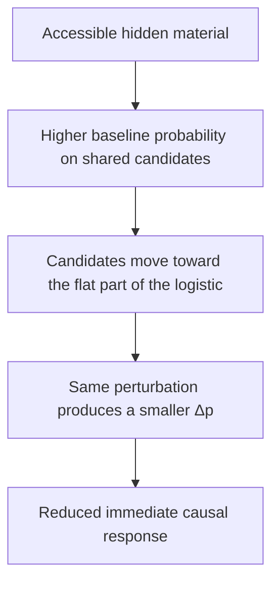

The candidate-level accounting is unusually clean. For accessible versus erased, the contribution from this saturation effect on shared candidates was about −0.01814, against a total immediate difference of about −0.01930. Under this accounting, the shared-candidate operating-point effect explains most of the measured immediate difference.

It is worth being precise about what changed, because the loose version of this sentence is wrong. The response rule did not change. The logistic is the same logistic, with the same parameters, computing the same function. What changed is the **operating point** at which the perturbation acts:

> **Locally accessible hidden state changed the effective causal sensitivity of the same fixed response rule.**

That is a sharper claim than *history changes response*, and it explains the sign that made no sense a moment ago.

---

## The Remote Arm Found a Back Door

The audit turned up a second problem, and it should feel familiar.

Through the material dynamics alone, remote carriers were beyond the probe's twelve-step local causal reach and should not have affected the probe locally.

Yet the protocol produced a tiny local difference.

Not by propagating. By calibration. The protocol dynamically matches expected background construction, exactly as Chapter 11's corrected design required — and it does so with a global score offset. Remote material changes expected construction where it sits; the controller compensates; the compensation applies everywhere, including near the probe.

```text
remote material
↓
global expected construction changes
↓
calibration offset changes
↓
local probabilities shift slightly
```

Chapter 11 found that a global computational mechanism can couple spatially separated regions. Here the same structure appears one level up: our own experimental controller had become a coupling channel between regions the physics kept apart. A compensator that acts globally is, by construction, a path between everything it touches.

That is not a property of the material. It is a property of the instrument, and it means the remote arm was not automatically the clean null it was assumed to be.

---

## Fix the Experiment, Not the Hypothesis

Three corrections, with every scientific parameter frozen — same gain, same half-life, same history age, same horizon, same effect threshold. Nothing was tuned. These are construct-validity repairs.

**The intervention.** PREVENT now explicitly blocks `x` during lag one; FORCE explicitly contains it. After one full causal exposure, `x` is removed from FORCE and both branches continue normally — the transient causal semantics earned in Chapter 10, applied properly this time.

**The control.** Remote carriers are no longer chosen merely for being far away. Each is matched to an accessible carrier on how much background frontier influence it exerts: the same number of adjacent frontier cells, and their total baseline attachment-probability mass within a frozen tolerance, while still lying beyond the twelve-step local reach. After this matching, the remote-minus-erased immediate difference falls to about `8.2 × 10⁻⁵`, making the controller-mediated leakage negligible on this measure.

**The estimator.** The realized twelve-step attachment difference is noisy — a sum of Bernoulli outcomes measuring a small effect. So the primary quantity becomes the expected local causal difference at each lag, summed over the horizon:

$$
\Delta_t = \sum_{y \in L} p_{\text{FORCE}}(y,t) - \sum_{y \in L} p_{\text{PREVENT}}(y,t)
\qquad
G_{\mathrm{RB}} = \sum_{t=1}^{12} \Delta_t
$$

This is worth stating carefully, because it is easy to misread. The trajectories are not replaced by expectation. Both branches still evolve through actual stochastic events — cells attach, cells are lost, geometry diverges, material decays. The expectation is used only to measure the causal difference *at each realized state* more precisely than a single coin flip per candidate would allow. The realized outcome is kept as a secondary check.

The corrected run used 192 groups and 564 supported probes, and passed every validity gate: group coverage, dynamic matching, population matching, intervention assertions, remote-carrier matching. Only then is it worth interpreting.

---

## The Immediate Effect Replicates

```text
ΔE₁ (accessible − remote) = −0.01499     95% CI [−0.01725, −0.01281]
```

Same sign, with a slightly smaller magnitude.

The immediate hidden-state modulation survives the corrected intervention and control design.

So the sensitivity reduction is not an artifact of the broken PREVENT semantics, not an artifact of the old remote placement, and not the calibration leak. With visible geometry matched and the intervention properly implemented, hidden material state changes the immediate causal response of the same perturbation.

---

## The Later Future Changes Too

Over twelve updates:

```text
ΔG_RB       = −0.397     95% CI [−0.679, −0.119]
ΔG_realized ≈ −0.357     95% CI [−0.673, −0.040]
```

The expected estimator and the noisier realized one agree in direction and in rough magnitude. The mean downstream causal consequence is lower in the accessible condition than in the matched remote condition, with both estimators supporting the same direction.

And here the frozen decision rule does something that a looser protocol would have let slide.

---

## Direction Is Not Magnitude

The predeclared smallest effect of interest was ±0.15. Calling the magnitude supported required not just an interval excluding zero, but enough precision to resolve that threshold — and the achieved minimum detectable effect was around 0.357.

So two questions, two different answers:

```text
Is the mean effect negative?                              SUPPORTED
Can we establish it reaches the predeclared ±0.15
magnitude under the frozen precision rule?                UNRESOLVED
```

Those are compatible statements, and collapsing them in either direction would be a misreport. Saying "the hypothesis passed" would claim a magnitude the experiment cannot resolve. Saying "inconclusive" would throw away a direction it established with intervals excluding zero on both estimators.

The important distinction is simple:

```text
DIRECTION
SUPPORTED

PREDECLARED MAGNITUDE
UNRESOLVED

---

## The Trace Fades While the Difference Grows

Now the question the main test does not answer.

The material decays. The causal difference accumulates. Is the later effect simply proportional to how much material is still present — material persists, material keeps pushing, effect persists?

The observed trajectory does not support that simple proportional-dose account.

The trace starts at a total mass of about 1.414. It falls below half that around lag 4. At the preceding lag, the cumulative expected causal difference was only:

```text
−0.0995
```

against a final twelve-step value of:

```text
−0.3972
```

So roughly **75% of the final causal difference accumulated after the material had already fallen below half its starting mass.**

The trace drops below a quarter around lag 8. After that point, a further −0.141 accrues — about **36% of the final effect, after the trace has lost three quarters of its strength.**

Split into descriptive epochs:

```text
EARLY    lags 1–4     −0.120
MIDDLE   lags 5–8     −0.158
LATE     lags 9–12    −0.119
```

Descriptively, the accumulated effect is not confined to the period when the trace is strongest.

The middle epoch contributes at least as much as the early epoch, even though the original material trace has already substantially weakened.
 The late epoch still contributes on average, at a point where mean accessible material has fallen to around 0.183 — though its interval is wide enough to include zero, so that is a description of the trajectory and not a separate confirmatory claim.

A second check gives the same caution against a simple instantaneous-dose explanation.

The pooled correlation between surviving accessible material and the accessible-minus-remote causal increment is approximately:

```text
r ≈ −0.001
 Group-level relations to average surviving material are weak too.

Which does **not** mean material amount is irrelevant — the material is what caused the sensitivity shift in the first place, and without it there is no effect at all. The bounded statement is narrower:

> **The simplest instantaneous dose model does not explain the accumulated downstream trajectory.**

---

## The Path Begins to Carry the Past

The weakening relationship between surviving material amount and later causal increment suggests that the original trace is not the whole explanation of the downstream divergence.

The plausible chain is one every previous chapter has supplied a piece of:

```text
hidden material state
↓
changes immediate causal sensitivity
↓
changes which construction events occur
↓
changed events alter later geometry and state
↓
later geometry changes what the perturbation's consequences can do
↓
causal difference continues accruing as the original trace decays
```

A plausible interpretation is that part of the historical consequence has become embodied in the trajectory itself.

The material changes early causal sensitivity.

That changes which construction events occur.

Those events alter later geometry and state, which can continue changing future opportunities even as the original trace weakens.

The experiment does not partition the late effect into a residual-material component and a trajectory-mediated component, so we should not claim that the trace has stopped contributing.

What it does show is that the accumulated causal difference cannot be explained simply by the instantaneous amount of material remaining.

> **The material did not need to remain strong for the entire horizon. Changing the early path was enough for later states to continue diverging.**

Treat "moved out of the trace" as interpretation rather than a measured transfer — nothing was tracked from one carrier to another. What was measured is that the effect kept accumulating while the trace kept shrinking, and that the amount remaining does not predict the increment.

Old Chapter 27 named this **Material-State Trajectory Redirection**. The phenomenon matters more than the label, and in plain prose *history-dependent trajectory redirection* says the same thing without adding another formal Principle to the ledger.

---

## Reading the Past Is Not Being Conditioned by It

This is the distinction the chapter has actually earned, and it reframes several earlier failures.

Chapter 5 established that a past can be causally consequential without being recoverable as a stable history signature.

Chapter 6 went further: even persistent, accessible and spatially distinguishable traces failed to produce the required differential response to a common challenge.

Those chapters separated several questions we had initially treated as one:

```text
did the past leave a consequence?
can the past be distinguished?
can the present differentially use that consequence?

This chapter asks a different question and gets a positive answer. The past does not have to be recoverable to be causally operative. It only has to leave the system in a state whose response differs.

```text
RECORD-LIKE PERSISTENCE          TRAJECTORY PERSISTENCE

past                             past
↓                                ↓
stored representation            changes sensitivity
↓                                ↓
later retrieval                  changes events
↓                                ↓
behaviour depends on past        changes later state
                                 ↓
                                 behaviour depends on past
```

Both routes can make later response depend on earlier events.

Only the first requires a persisting representation that can later be read as a record of those events.

> **The past can change the future without being reconstructed as a record of the past.**

---

## Do Not Call It Memory

The temptation is obvious. There is hidden state. It changes later response. Its consequences outlive most of the trace. Why not memory?

Because we wrote the state. It was placed by the experiment, not acquired by the crystal. Nothing here encoded anything, selected what to retain, retrieved anything, reconstructed a past event, distinguished one history from another, or improved at anything.

What has been demonstrated is a more primitive capability:

```text
PAST-DEPENDENT HIDDEN STATE
↓
CAUSAL RESPONSE MODULATION
↓
TRAJECTORY REDIRECTION
```

A stronger memory claim would require additional machinery or evidence: endogenous encoding, retention, discrimination, retrieval or some other demonstrated use of stored history.
 Chapter 6's failure is the reminder of how much further there is to go: two histories that leave distinguishable traces still did not produce a differential response to a common challenge. Here the response does differ, but the experiment deliberately placed hidden material where it entered the local causal mechanism and compared it with matched material positioned outside that route.

The Crystal did not discover or encode that placement itself.

For the same reason, be careful with the word *experience*. This experiment models a past-dependent material trace. It does not model the crystal having experiences and encoding them.

---

## Evidence Ledger

| Claim | Status | Evidence |
|---|---|---|
| Hidden material changes immediate causal response at matched visible geometry | **SUPPORTED** | `ΔE₁ = −0.01499`, CI `[−0.01725, −0.01281]` |
| The mechanism is logistic operating-point sensitivity | **SUPPORTED** | saturation term `−0.01814` of a total `−0.01930` |
| The response rule itself changed | **NOT CLAIMED** | logistic unchanged; only the operating point moved |
| Downstream twelve-step effect is negative | **SUPPORTED** | `ΔG_RB = −0.397` and `ΔG_realized ≈ −0.357`, both excluding zero |
| Downstream effect reaches the predeclared ±0.15 magnitude | **UNRESOLVED** | achieved MDE ≈ `0.357` |
| First experiment's downstream result | **INVALID** | PREVENT allowed natural attachment; contamination correlated with treatment |
| Remote material has no local causal pathway | **FAILED, then corrected** | calibration leak in V1; remote−erased falls to `8.2 × 10⁻⁵` after matching |
| Consequence accumulates after the trace has substantially decayed | **DESCRIPTIVELY SUPPORTED** | 75% of final effect after half-mass; 36% after quarter-mass |
| Surviving material amount predicts the causal increment | **FAILED** | pooled `r ≈ −0.001` |
| Material amount is irrelevant | **NOT CLAIMED** | the material caused the initial sensitivity shift |
| Memory, learning, adaptation, recall, experience encoding | **NOT ESTABLISHED** | the hidden state was written by the experiment |
| History-dependent redirection is a general substrate property | **NOT CLAIMED** | one mechanism, one gain, one half-life, twelve-update horizon |

---

## Where Does This History-Dependent Process End?

We have now established something that earlier chapters had not.

With visible geometry matched, hidden past-dependent material state can change the response to the same perturbation.

And the resulting causal difference continues accumulating after that material trace has substantially weakened.

That is not yet memory.

It is history-dependent causal response: hidden state inherited from the past changes present sensitivity, and the resulting event differences alter the later trajectory.

No retrieval or history-specific decoding has been demonstrated.

Which sharpens a question the book has left open twice.

Chapter 9 looked for a privileged boundary around the connected crystal and failed to find one, twice: no scale showed excess predictive coherence beyond a family null, and the candidate outer boundary localized causal effects no better than a circle drawn arbitrarily through the interior. What survived was spatial causal locality — consequences stay near their causes — which is true of any local field and establishes nothing about individuals.

But Chapter 9 tested regions defined primarily by geometry.

We now have a better candidate experimental object: a spatially extended causal process whose response can depend on hidden state inherited from the past.

That makes the individuation question worth asking again with a stronger control.
 If anything in this substrate deserves to be called an individual, it should be a region of *causal organization*, not a region of material.

So the individuation question can finally be posed in the right terms.

> **Is there a region whose causal containment exceeds what its geometry alone would predict?**

---

## 13: We Found an Individual. Then We Didn't.

Chapter 9 asked whether the connected occupied crystal had a privileged boundary, and failed twice to find one. But the object it was testing was a shape: a centered disk, drawn on the material, tested afterwards for whether it behaved like a thing.

Since then the book has been doing what that failure recommended. Chapter 10 measured what one local event causes. Chapter 11 found that finite computation routes those consequences, coupling regions the local rule cannot connect. Chapter 12 showed that hidden past-dependent state changes the crystal's causal sensitivity, and that the resulting difference in trajectory outlives most of the trace that produced it.

So the candidate has changed. What we have now is not a blob of occupied cells. It is a causal process with a history, whose events are conditioned by state that does not appear in its shape.

That makes the individuation question worth asking again, and worth asking properly:

> **Is there a spatial region whose internal causal coupling exceeds its coupling to the surrounding crystal, in a way that geometry alone cannot explain?**

The last clause is the whole chapter.

---

## What Would a Causal Individual Do?

Set biology aside. Membranes and skins make individuality feel obvious in organisms, but a computational substrate owes us nothing of the kind, and importing a biological definition would prejudge the answer.

Operationally, one plausible signature of a causal module is asymmetric containment. Influence beginning inside should preferentially remain inside, while comparable influence beginning outside should penetrate less strongly.

That is not yet a definition of individuality. It is a candidate measurement of causal privilege.

Both are measurable. Perturb a frontier cell **inside** a region and measure what fraction of the resulting causal influence is expressed within the region:

$$
\text{internal retention} = \frac{A_{\text{inside}}}{A_{\text{inside}} + A_{\text{outside}}}
$$

Then perturb a comparable cell just **outside** the same region and measure what fraction of *that* influence lands inside:

$$
\text{external penetration} = \frac{A_{\text{inside}}}{A_{\text{inside}} + A_{\text{outside}}}
$$

and take the difference:

$$
M = \text{internal retention} - \text{external penetration}
$$

A large positive `M` says: perturbations initiated inside preferentially express their causal mass inside, while comparable perturbations initiated outside penetrate less strongly.

That is a plausible operational signature of causal containment.

Whether it identifies an individual is the question the rest of the chapter has to answer.

One estimator detail matters. `A` is summed **absolute** expected causal mass — the accumulated size of the probability shifts, not their signed total. Chapter 11 showed that a perturbation can raise some probabilities and lower others; if we summed signed values, a region full of large opposing causal shifts could cancel to nearly zero and appear causally empty. The question here is where the influence went, not what it netted out to.

---

## Remove the Channels We Already Know About

Two long-range mechanisms have already been discovered in this substrate, and both would contaminate a modularity measurement.

Chapter 11 established that a finite evaluation budget couples distant regions: a local frontier change alters which faraway candidates receive slots, producing effects outside the local causal cone. A region measured under a binding budget would appear less modular for reasons having nothing to do with its own organization.

Chapter 12 found a second channel by accident: a global construction-rate calibrator compensating for local changes applies its offset everywhere, coupling regions the physics keeps apart.

So this experiment removes both by design. **True unbounded evaluation** — every frontier candidate evaluated, no competition for slots. **No dynamic construction-rate calibration.** With both known global channels removed, causal influence under this protocol is limited by the local transition dynamics over the eight-step horizon.

That gives a structural check for free: beyond the corresponding causal reach, the expected effect must be exactly zero.
 It was, in every run — an assertion about the code rather than a finding, but a useful one.

The experiment therefore inherits something useful from earlier failures.

Chapter 11 identified one global coupling channel.

Chapter 12 exposed another.

Both can now be removed deliberately before testing causal containment.

---

## Draw the Regions Before Looking at the Answer

The most obvious way to fake this result would be to run the crystal, look for a patch that seems coherent, draw a boundary around it, and announce that the patch is an individual. That is not an experiment; it is a drawing exercise with statistics attached.

So the regions are fixed-radius hexagonal disks, with the primary radius frozen at `r = 4` and a descriptive sweep across `r ∈ {2,3,4,5}`. Candidates are centered on occupied cells and must satisfy support rules stated in advance: enough occupied cells, occupancy between 20% and 80%, at least two supported internal frontier probes and two supported external-shell probes, where a supported probe is a frontier cell with exactly one occupied neighbour.

The candidates are then ranked using only pre-outcome properties — occupancy fraction closest to 0.50, then radial position, then axial coordinates — and the first three are taken.

No region is selected because it scored well. Nothing about causal outcome enters the selection.

The perturbation is the corrected transient intervention from Chapters 10 and 12: FORCE explicitly occupies `x` at lag one, PREVENT explicitly blocks it, and after one full causal exposure `x` is removed from FORCE so that both branches continue without a permanent state difference. At each of eight lags, before any realized attachment, the expected probability shift is computed for every candidate and its absolute mass accumulated inside and outside the region.

---

## We Found One

At the frozen radius:

```text
M = 0.4402     95% CI [0.419, 0.461]
```

against a predeclared meaningful threshold of `0.15`, with an achieved MDE of `0.0268`.

```text
SUPPORTED
```

This is not marginal. It is nearly three times the declared threshold, with an interval an order of magnitude tighter than the effect. And the decomposition is more compelling still:

```text
internal retention     0.7755
external penetration   0.3353
```

Roughly 78% of the measured causal mass generated by internal perturbations remained inside the region.

For comparable external perturbations, about 34% of the measured causal mass penetrated inward.

The retention fraction was therefore more than twice the penetration fraction.

That is exactly the profile we had hoped a causally privileged region might show.

After twelve chapters in which a privileged boundary, a stable body and stronger organism-like interpretations had repeatedly failed to materialize, the number finally looked compelling.

For a while, this was the chapter where the book found an individual.

---

## Then the Circle Got Bigger

The scale sweep was a descriptive secondary, run for completeness rather than out of suspicion.

```text
radius 2     M ≈ 0.197
radius 3     M ≈ 0.374
radius 4     M ≈ 0.440
radius 5     M ≈ 0.504
```

The score climbs almost monotonically with radius. There is no peak or obvious characteristic scale in the tested range.

That does not prove that no natural scale exists, but it creates an immediate problem for the interpretation of `r = 4`: the supposedly special score increases further when the observer simply draws a larger disk.
 Instead the pattern is simpler and much less flattering:

```text
BIGGER DISK  →  BIGGER MODULE SCORE
```

Which is a warning that the measurement may be responding strongly to the geometry of the ruler itself.

---

## Geometry Can Manufacture a Module

The explanation requires no special structure in the crystal at all — only that influence spreads locally, which we already know it does.

A perturbation inside the disk generates a spatially local causal cone over the eight-step horizon.

As the enclosing disk becomes larger, more of that local influence can fall within the observer-defined region.

So internal retention can rise with radius even without any system-privileged boundary.

An external perturbation generates the same kind of local causal neighbourhood, but the imposed boundary cuts through that neighbourhood.

Only part of its causal mass therefore falls inside the disk.

The exact fraction depends on geometry, but the important point is that this asymmetry can arise from locality plus the observer's partition alone.

```text
INTERNAL PROBE            EXTERNAL PROBE
cone centred inside       cone straddling the boundary
↓                         ↓
retention grows with      penetration stays near
disk size                 the fraction that points inward
↓                         ↓
              M = retention − penetration grows
```

Even a spatially homogeneous local process with no privileged region can therefore produce substantial internal retention and lower external penetration when an observer draws a disk around the perturbation.
 The asymmetry is generated by where the boundary is placed relative to the perturbation, not by anything the system is doing.

The observer's circle can manufacture the appearance of a module.

---

## The Measurement Was Real

It would be a mistake to conclude that the first result was wrong. It was not.

At radius 4, perturbations initiated inside the selected regions genuinely did express far more causal mass inside those regions than external perturbations expressed into them. The number is accurate, the interval is tight, and it reproduces. Nothing about the scale sweep erases that measured containment.

What the sweep undermines is not the measurement but an equation we had made without noticing:

```text
raw causal containment  =  causal individuation
```

The measurement supports the left side. The chapter's claim was about the right side. A stronger control should narrow an interpretation, not retroactively delete a phenomenon — and the phenomenon here is real containment, which will still be true at the end of the chapter.

So the question is not whether to keep the result. It is what comparison would tell us what the result means.

---

## Change the Null, Not the Statistic

There are several tempting moves available at this point, and all of them are wrong.

We could sweep the radius more finely, looking for a scale where the score peaks. We could redefine the modularity statistic to normalize out disk size. We could add features to the region-selection rule until the selected regions score better than the rest. Every one of those adjusts the thing being measured until it produces the answer we wanted.

The actual missing piece is much simpler:

> **Would an arbitrary region with the same geometry produce the same score?**

If matched disks produce the same score, geometry is sufficient to explain the observed containment.

If the selected regions substantially exceed them, then we have evidence of causal privilege beyond geometry — a necessary step toward an individuation claim, though not yet a complete definition of individuality.

The interpretation of a modularity statistic depends critically on its null.

A large score tells us little about privileged organization if the same score is routinely generated by the spatial structure already present in the null.
 A similar problem appears in spatial network analysis: apparent community structure can largely reflect the fact that nearby nodes interact more often unless the null already contains that spatial dependence.[^expert]

The methodological parallel is the part that matters here: to interpret excess organization, the null must already reproduce the simpler geometry capable of generating the raw statistic.

[^expert]: P. Expert, T. S. Evans, V. D. Blondel and R. Lambiotte, "Uncovering space-independent communities in spatial networks", *PNAS* 108(19) (2011), 7663–7668.

That is a comparison, not a method we borrowed — we are not doing community detection and have no networks here. But the structure of the problem is identical, and it says exactly what our null has to contain: geometry.

---

## Regions From the Same Crystal

Everything about the measurement is held frozen: radius 4, eight-step horizon, the same transient intervention, the same absolute causal-mass estimator, unbounded evaluation, no calibration, outcome-blind region selection. The only new ingredient is what the selected regions are compared against.

For each selected region, the experiment searches the **same checkpoint** for other supported radius-4 regions to serve as controls. Using the same checkpoint removes several obvious alternatives at once: selected and control regions share the same global morphology, developmental stage, density, environmental history, crystal extent and random-stream family.
 Whatever differs between a selected region and its control, it is not the crystal they live in.

Controls are matched on pre-outcome geometry — occupancy fraction, center radial position, occupied count, internal and external frontier counts, probe depths, boundary occupied fraction — and cannot reuse a center or be one of the observed regions. Crucially, **no causal outcome is used in matching**. A null constructed by selecting controls that scored low would be a null with the answer already inside it.

The matching worked. Across 192 groups and 1,151 selected-control pairs, every group was covered, the mean standardized match distance was 1.18 against a frozen limit of 4 (maximum 3.06), mean occupancy-fraction difference was 0.027 and mean radial difference 1.78. The frozen matching-quality criteria were comfortably satisfied.

The estimand is now different:

$$
M_{\text{excess}} = M_{\text{selected}} - M_{\text{matched control}}
$$

---

## A New Question Needs a New Threshold

The raw threshold of 0.15 belonged to raw modularity. Excess modularity is a different quantity, so it needs its own smallest effect of interest, frozen before the result: **+0.10**.

The selected regions have to beat matched arbitrary geometry by more than ten percentage points before we are willing to call that causal privilege. This is the same discipline Chapter 6 applied to its magnitude gate and Chapter 11 to its ±0.15 band — and it matters more here than anywhere, because without it any small positive residual could be narrated into an individual.

---

## The Controls Look Just as Modular

The selected regions reproduce the large raw result:

```text
M_selected   0.4436
M_control    0.4559
M_excess    −0.0123     95% CI [−0.0327, +0.0072]
```

The controls score slightly higher. The interval crosses zero, so there is no basis for claiming that arbitrary regions are *more* modular than the selected ones — that direction is unresolved and should stay that way.

But the question we actually asked is fully resolved. The upper bound of the interval is `+0.0072`, against a declared meaningful threshold of `+0.10`, with an achieved MDE of `0.0265`. The achieved MDE was about `0.0265` against a declared meaningful excess of `0.10`, so the experiment had substantially more precision than required to resolve that target.

The upper confidence bound was only `+0.0072`.

```text
BOUNDED BELOW THE MEANINGFUL THRESHOLD
```

This is not merely a failure to reach significance.

It is a precision-bounded negative for the declared claim: scientifically meaningful positive excess modularity of `+0.10` is incompatible with the observed interval under this test.

Geometry-matched control disks of the same radius, drawn from the same crystal without reference to causal outcome, exhibit essentially the same raw containment as the selected regions.

---

## Nothing Was Hiding in the Components

A combined score can conceal two opposing effects. Perhaps the selected regions retained internal influence better but also admitted external influence more freely, with the difference cancelling.

They did not.

```text
excess internal retention     −0.0066     [−0.0222, +0.0093]
excess external penetration   +0.0057     [−0.0101, +0.0216]
```

Neither component shows a privileged region. The selected regions do not hold onto their own causal influence better than matched controls, and they do not keep outside influence out better either. The combined score is therefore not hiding an opposing component-level advantage for the selected regions.

---

## The Observer Can Create an Inside

The deeper lesson is about what a boundary does to a measurement before it does anything to a system.

Draw a circle and the analysis immediately acquires observer-defined categories: inside, outside, crossing, retention and penetration.
 Every one is now measurable, and the resulting statistics can be large, precise and reproducible without demonstrating that the dynamics themselves privilege the imposed boundary.

```text
OBSERVER-DEFINED BOUNDARY
a partition we impose, which organizes our measurement

SYSTEM-PRIVILEGED BOUNDARY
a partition the dynamics themselves distinguish
```

The experiment certainly contains the first.

Under this operational test, it did not establish the second.

> **A boundary can organize our measurement without organizing the system.**

That distinction has been quietly implicated in several earlier failures. Chapter 9's predictive-coherence result was large because any sizeable chunk of a structured field predicts itself. Its localization result was strong at an arbitrary interior circle as well as at the candidate boundary. In both cases, an observer-defined partition plus ordinary spatial structure could explain the apparent privilege.

Chapter 13 exposes the same problem with a much stronger-looking causal statistic.

---

## Containment Is Not Individuation

The bounded conclusion:

> **At frozen radius 4, selected Digital Crystal regions exhibited strong raw causal containment — internal retention around 0.78 against external penetration around 0.34 — but this asymmetry did not exceed same-checkpoint regions matched on occupancy, radial position, frontier structure and boundary geometry. The 95% interval for excess modularity ran from about −0.033 to +0.007, far below the predeclared +0.10 margin.**

Which gives the distinction the chapter exists to earn:

```text
CAUSAL CONTAINMENT
≠
CAUSAL INDIVIDUATION
```

A local process automatically produces spatial asymmetry. Influence spreads locally, so a region drawn around a source contains some of that influence; a larger region contains more; a source outside the region overlaps it less. Containment can arise from locality plus an imposed boundary.

For this statistic to support causal individuation, the selected region must exhibit organization beyond what comparable geometry already produces.

Under the tested radius-4 criterion, that meaningful excess was not found.

Scope that carefully. This is one operational criterion, at one radius, with circular regions, under an eight-step horizon, using this modularity statistic. It does not establish that no individual can exist here. Non-circular or time-varying regions, process-defined boundaries and other operational criteria for individuation were untested
 — and this chapter is not the place to start proposing them, because listing alternative rescues is the reflex the book has spent twelve chapters declining.

Notice, too, what did not save us. The candidate object was much stronger than Chapter 9's. It had history-dependent sensitivity, trajectory redirection, turnover, local causal structure, and a huge raw containment asymmetry. Every one of those is real. None of them adds up to an individual.

```text
history-dependent process
+
strong causal containment
≠
individuality established

```

---

## What Exactly Failed?

It is worth being precise about what went wrong, because the answer is unusual.

The first experiment was not underpowered — its MDE was `0.0268` against a threshold of `0.15`. It was not badly implemented; the corrected transient intervention from earlier chapters was used, the known global channels were removed, and the structural far-field assertion held. It was not p-hacked; the regions were selected blind to outcome and the threshold was frozen. It replicated: the selected regions scored 0.4402 the first time and 0.4436 the second.

Large. Precise. Predeclared. Replicated.

And the inference from that result to individuation still failed.

Not because the number was wrong.

The number accurately measured causal containment.

The mistake was treating that containment score as evidence of privileged individuation before asking how much of the same score ordinary matched geometry could generate.
 No amount of additional precision on raw `M` could answer the missing question.

The individuation claim required a different estimand:

```text
raw modularity
→ measures containment

excess modularity over matched geometry
→ tests causal privilege beyond geometry
 What caught it was a descriptive secondary — a scale sweep run for completeness — showing the score doing something a real boundary would not do.

That is the most dangerous kind of failure this book has encountered, and it is worth asking how many earlier results could have been the same thing wearing better clothes. Reoccupation tempted us toward repair.

Persistent historical traces tempted us toward memory.

Non-local redistribution tempted us toward amplification.

Strong causal containment tempted us toward individuality.

Each time the phenomenon survived, while a stronger control narrowed what we were allowed to call it.

The problem is no longer how to extract another property from the Crystal.

It is how to tell the difference between:

```text
a failed phenomenon
a failed hypothesis
a failed measurement
and
a real measurement attached to the wrong claim
```

How do you fail correctly?

---

## 14: How to Fail Correctly

The most dangerous result in this book was not a noisy one. It was one of the cleanest.

```text
measurement        ✓   M = 0.4402, CI [0.419, 0.461]
precision          ✓   MDE 0.0268 against a 0.15 threshold
implementation     ✓   corrected intervention, known global channels removed
predeclaration     ✓   regions selected blind to outcome, threshold frozen
raw effect reproduced   ✓   selected regions scored 0.4436 in the matched-control run
individuation inference ✕

```

Many of the safeguards we had learned to rely on were satisfied.

And yet the inference from strong causal containment to causal individuality did not survive the geometry-matched control.

The measurement was right.

What we thought it meant was not.

That is worth sitting with because it exposes the limits of procedural rigour.

Predeclaration can stop us moving the goalposts; it cannot guarantee that we chose the right goal.

Precision can tell us how tightly we measured an estimand; it cannot tell us whether that estimand identifies the construct we care about.

So before the final chapter asks what survived this investigation, this one has to make explicit the bookkeeping that determined what was allowed to survive.
 That requires answering a question the book has been answering implicitly for thirteen chapters:

> **When a claim fails, what exactly has failed?**

---

## Failure Is Not One Thing

The word compresses several situations that license completely different conclusions.

An experiment might not have implemented the contrast it claimed. It might have been valid but too imprecise to answer its own question. It might have been valid, precise, and able to rule out an effect large enough to matter. Or the measurement might be perfectly sound while the interpretation built on top of it collapses under a better control.

The book has now produced examples of all four, which is how the working vocabulary developed:

```text
INVALID              the intended causal contrast was not implemented
UNRESOLVED           the declared question remains open at the required precision
BOUNDED NEGATIVE     a predeclared meaningful effect was precisely excluded
SUPPORTED            the tested claim survived
DESCRIPTIVE ONLY     informative follow-up, not confirmatory evidence
NARROWED             a lower-level result survived while a richer interpretation did not

```

The reason for keeping those labels separate is simple:

> **A failed claim, an invalid experiment and an absent phenomenon are three different things.**

Rather than presenting this as a taxonomy to memorize, it is easier to reach the same distinctions by asking four questions in order. Each has a different failure mode, and each fails a different thing.

---

## Did We Run the Experiment We Claimed?

Chapter 12 intended a clean contrast: FORCE occupies the probe cell for one causal exposure, PREVENT keeps it empty for that same exposure. What the implementation did was insert the cell in FORCE and merely *start* it empty in PREVENT — leaving it free to attach naturally during the first update.

Worse, the contamination correlated with the treatment. The accessible material trace included the probe's only occupied neighbour, so it raised the probability that the supposedly prevented cell would appear: 0.428 in the accessible condition against 0.377 and 0.378 in the others.

The downstream result was therefore **INVALID**, and the crucial point is that this verdict is independent of what the numbers said. If a broken intervention returns a large effect, it is tempting to salvage it. If it returns nothing, it is tempting to report no effect. Both are the same error. The intended estimand was never implemented, so the run is evidence neither for nor against the claim.

```text
INVALID  ≠  NEGATIVE
```

The productive question after an invalidation is not *what did we find* but *which parts were untouched by the defect*. In Chapter 12 the immediate expected causal response had been computed before the broken growth step, so it could not depend on what happened afterwards — and it survived, was replicated by the corrected run, and turned out to carry the chapter's mechanism.

---

## Could the Experiment Answer Its Question?

Chapter 10's first attempt at predicting causal gain from local geometry returned:

```text
+0.167     CI [−0.078, +0.431]     declared meaningful effect +0.15
```

Reporting that as evidence against the hypothesis would have been a straightforward misrepresentation. The interval comfortably contains effects twice the size of the one declared meaningful, and also contains effects in the opposite direction. The experiment did not answer its question; it lacked the precision to.

```text
UNRESOLVED  ≠  FAILED
```

The test is not whether the interval contains zero. It is *what effect sizes remain compatible with the data*. If effects large enough to matter remain compatible with the data, then the declared magnitude question remains unresolved.

Other, narrower questions — such as direction — may still have answers.

The same distinction appeared in a more interesting form in Chapter 12, where two questions about the same number got different answers. Was the downstream effect negative? Both estimators excluded zero: supported. Did it reach the predeclared ±0.15 magnitude? The achieved MDE was around 0.357: unresolved. Those statements are compatible, and collapsing them in either direction — "the hypothesis passed" or "inconclusive" — would have thrown away real information.

```text
DIRECTION  ≠  MAGNITUDE
```

---

## Did We Exclude Something Worth Excluding?

The reverse error is just as common: reporting an interval near zero as *nothing happened*.

Chapter 11 compared strong candidate subsampling against exhaustive evaluation at dynamically matched background construction, and found a mean twelve-step difference of `+0.00130` with the whole interval inside the predeclared ±0.15 band. Chapter 13 compared selected regions against geometry-matched controls and found excess modularity of `−0.0123`, upper bound `+0.0072`, against a declared meaningful margin of `+0.10`.

Neither is an absence of evidence. Both are evidence of absence *at a stated scale* — which is a far stronger and more useful claim, and one that requires two things a bare non-significant result does not have: a threshold declared in advance, and enough precision to have detected it.

The distinction is old and still routinely ignored elsewhere. Clinical trials that fail to reach significance are habitually described as negative, when the honest reading is often that they were too small to detect a difference that would have mattered.[^altman] The remedy is the same one this book has been using: state what would count as meaningful before the data arrive, and report whether the experiment could have seen it.

[^altman]: D. G. Altman and J. M. Bland, "Absence of evidence is not evidence of absence", *BMJ* 311 (1995), 485.

```text
BOUNDED NEGATIVE  ≠  NOTHING HAPPENED
```

And a bounded negative earns its status only with both parts. Chapter 13's excess modularity was bounded because the achieved MDE was `0.0265` against a `+0.10` threshold — roughly four times the precision needed. Without that, the same point estimate would have been unresolved, not negative.

---

## Does the Measurement Identify the Construct?

Now the failure that none of the above would catch, and the reason this chapter exists.

Chapter 13's measurement was valid. Its mechanism was real: perturbations inside a region really did express most of their causal mass inside it, while external perturbations penetrated much less. What failed was the step from that mechanism to the concept it was taken to demonstrate.

The layers can be separated:

```text
MEASUREMENT       raw modularity M ≈ 0.44                        ✓
MECHANISM         local spatial causal containment               ✓
CONSTRUCT         a privileged causal region                     ✕
INTERPRETATION    an individual                          not established
```

A failure at one layer does not propagate downward. The containment survives; only the promotion dies. And Chapter 3 has exactly the same shape at the other end of the book:

```text
MEASUREMENT       nearby velocity coherence                      ✓
MECHANISM         short-range spatial coherence                  ✓
CONSTRUCT         ancestry-specific flocking                     ✕
```

This is a construct-validity problem: an instrument can measure an operational quantity accurately and reproducibly while that quantity fails to uniquely identify the richer theoretical construct attached to it.
 The classic treatment makes the point that a construct is validated not by any single correlation but by the network of predictions it makes and the alternatives it excludes.[^cronbach] Statistical rigour can make an estimate extremely precise.

It cannot, by itself, validate the inference from that estimate to a richer construct.

[^cronbach]: L. J. Cronbach and P. E. Meehl, "Construct validity in psychological tests", *Psychological Bulletin* 52(4) (1955), 281–302.

Which yields the rule this book most needed and did not have written down until now:

> **Do not promote a measurement into a richer construct until a simpler mechanism capable of producing the same measurement has been controlled.**

The recurring shape is unmistakable once listed:

```text
coherent motion       → flocking
refilled vacancies    → repair
persistent history-bearing state  → memory

retained influence    → individual
```

In every case the measurement was real and the promotion was premature. And in every case, what exposed the error was not a better statistic but a control that asked what else could produce the same number.

---

## The Null Is Part of the Claim

Chapter 13 makes a point sharper than any of the earlier cases.

Before the geometry-matched control, the operative claim was effectively:

```text
large raw causal modularity
→
privileged region

So the null is not a formality applied after the result to check it. It is part of what the statistic *means*. A modularity score with no null attached is not a weak measurement of individuality; it is not a measurement of individuality at all.

> **A measurement without its alternative explanation is not yet a construct.**

This reframes several earlier failures. Chapter 9's predictive-coherence result looked enormous at 0.2906 until a family-level permutation null produced maxima averaging 0.2569 — the statistic was measuring what any large chunk of a structured field does. Chapter 6's placement advantage looked decisive until the copy budget was equalized and most of it turned out to be quantity. Chapter 3's large ancestry-coherence difference changed meaning once distance was matched. Each time, the original measurement remained part of the record while a stronger comparison changed what it was allowed to mean.

---

## Fail the Smallest Claim

All of this collapses into one operating principle:

> **Fail the smallest claim the evidence actually defeats. Preserve everything that still survives.**

It rules out two opposite pathologies. **Over-rescue** keeps renaming what remains until the original ambition appears to have survived.

**Over-destruction** discards every result associated with a failed higher-level claim, including evidence the stronger control never defeated.
 Both distort the record; the second is more respectable and equally wasteful.

The correct response is surgical, and mechanical enough to write down:

```text
implementation invalid          → invalidate the affected estimand only
precision insufficient          → leave the claim unresolved
meaningful effect excluded      → record a bounded negative
stronger control explains it    → narrow the construct
lower-level phenomenon intact   → keep it
follow-up analysis explanatory  → label it descriptive
```

Applied to Chapter 13, that means the individual disappears and the containment stays. Applied to Chapter 12, the invalid downstream result disappears and the immediate sensitivity effect stays. Applied to Chapter 3, ancestry-specific flocking disappears and short-range motion coherence stays.

---

## A Description Is Not a Confirmation

One category deserves separate attention because it is the most tempting.

Chapter 12's confirmatory magnitude claim stayed unresolved. Then a follow-up analysis of the same data showed something genuinely striking: about 75% of the cumulative causal difference accrued after the material trace had fallen below half its starting mass, and 36% after it fell below a quarter. That trajectory analysis supplies the chapter's most interesting mechanistic interpretation.

It is also **descriptive**. It was not the frozen primary endpoint, it was found by looking at trajectories after the fact, and it cannot promote the unresolved magnitude claim into a supported one. An explanation can illuminate a result without rescuing it.

The rule holds in the other direction too. Calling it descriptive is not a demotion.

It records how the result was obtained and therefore what inferential work it is allowed to do.
 It is simply not allowed to change what the confirmatory test concluded.

---

## Corrections Are Not Rescues

If invalid experiments must be re-run, then re-running experiments cannot always be cheating. The distinction matters, and it is not subtle.

Chapter 12's second run repaired the PREVENT semantics, matched the remote carriers on background frontier influence, and replaced a noisy estimator with a lower-variance one — while freezing every scientific parameter: the material gain, the half-life, the history age, the horizon, the effect threshold. Chapter 11's corrected design fixed a calibration that controlled only the first frame of a twelve-lag process. Both repaired the instrument and left the question alone.

Compare the alternative. Adjusting the material gain, or the half-life, or the horizon, or the meaningful-effect threshold, until an effect appeared, would have been a different activity with the same outward appearance.

```text
CORRECTIVE EXPERIMENT   fixes validity; the question is unchanged
NEW EXPERIMENT          asks a different question, declared as such
RESCUE EXPERIMENT       changes the question after seeing the answer while presenting it as continuation

```

The first two can be legitimate scientific moves because the change is visible and its relation to the original question is explicit.

The third is dangerous precisely because the question changes while the write-up pretends it did not.

---

## Knowing When to Stop

The instinct after a weakened claim is to try one more variant. Another radius. Another feature. Another budget. Another history window. Another decoder. There is always one more, and the search has no natural end.

Several chapters reached points where continuing the same search would have become result-driven parameter hunting.
 Chapter 6 abandoned an entire line after three consecutive broad claims failed, rather than keeping whichever secondary metric survived in each. Chapter 9 refused to tune the radius after the family null failed, and changed the evidence type instead. Chapter 10 stopped adding local features and rebuilt the measurement. Chapter 13 changed the null rather than the disk.

The stop rule that emerges:

> **When the declared question has been answered, stop. Do not convert disappointment into a parameter search unless you are willing to declare a genuinely new experiment.**

And its companion, from Chapter 8, where a budget missed its frozen stationarity threshold by about `0.00002`:

> **A threshold that moves when the answer is inconvenient is not a threshold.**

That can feel absurdly rigid in the moment. A miss of `0.00002` is scientifically tiny.

But changing a frozen decision boundary because the observed value landed inconveniently close to it converts a predeclared rule into a post hoc judgment.

The proper response is to report the near miss as a near miss.

---

## Auditing the Bookkeeping

Rules stated in a chapter are cheap. The question is whether the project's actual evidence history obeys them.

So the recent experimental chains were encoded as a ledger. Each entry recorded the claim under test, whether the run was valid, its inferential status, the transition that occurred, the threshold where one existed, the achieved precision, and — the field that matters most — what evidence survived. Ten cases were registered across the three most recent chapters, all backed by source artifacts rather than recollection.

The audit then checked for the forbidden moves:

```text
did an INVALID run ever become evidence against a hypothesis?
did UNRESOLVED ever quietly become FAILED?
did any bounded negative lack a declared threshold or adequate precision?
did a stronger control erase valid lower-level evidence?
did a descriptive closeout upgrade a confirmatory claim?
did any estimand change after the result was seen?
```

All ten registered transitions were internally consistent with the declared bookkeeping rules, and all five predeclared cross-case checks also passed
 — that the invalid intervention preserved the independently valid immediate effect; that direction and magnitude were kept separate; that the geometry-matched null narrowed the construct without erasing raw containment; that the bounded amplification result preserved the mechanistic rerouting finding; and that the trajectory closeout did not rescue the unresolved magnitude.

```text
FAILURE-LEDGER BOOKKEEPING CONSISTENT

```

That status needs reading narrowly, because it is easy to inflate. It does not establish that the project made no mistakes — it exists precisely because the project made several. It does not establish that the taxonomy is complete, that future results will classify cleanly, or that any conclusion in this book is true.

It establishes one narrower thing:

> **Within the audited cases, the evidence transitions can be represented without silently converting one status into another or deleting lower-level results that survived the relevant control.**

That is a modest claim. It is also the only claim that makes the final chapter possible, because a list of survivors is worthless if the criteria for surviving moved.

---

## What All Those Failures Discovered

Here is the part that makes this chapter something other than an apology.

The failures were productive, and not in the consoling sense. Each one located a boundary between concepts that had been treated as synonyms:

```text
similarity            ≠  causal ancestry
state                 ≠  history
causal past           ≠  memory
persistent            ≠  accessible
accessible            ≠  differentially used
net change            ≠  gross process
reoccupation          ≠  repair
stable size           ≠  stable turnover-related flow

locality              ≠  privileged boundary
causal effect         ≠  stable local predictor of downstream consequence

causal routing        ≠  causal amplification
past-dependent        ≠  past-readable
containment           ≠  individuation
```

Most of these distinctions were not part of the vocabulary we began with.

They became necessary when a stronger interpretation encountered a control that left a smaller phenomenon intact.

> **A failed promotion is a successful distinction.**

Which suggests a way of reading the whole investigation. We repeatedly asked questions framed in biological vocabulary.

The controls kept forcing the answers into narrower, more computational terms.

```text
we asked                what survived

flocking?               short-range motion coherence
memory?                 history-dependent causal sensitivity
repair?                 rapid reoccupation of vacated sites
stable body size?       compute-dependent scale and turnover
individual?             strong spatial causal containment

```

None of those answers is disappointing. They are simply not the words we brought with us. The method's entire job has been to hear the answer the system actually gave rather than the one the question was shaped to receive — and the reason it took this much apparatus is that the temptation was never abstract. A trace that persists really does beg to be called memory. A hole that fills really does look like healing. A number like 0.44 really did look like an individual.

---

## What Survived

Many of the richer biological or organism-like promotions have now been removed, bounded or left unestablished: ancestry-specific flocking, readable memory, repair, stable organism-like size, a privileged body boundary, causal amplification and individuality.

Their scientific statuses differ.

What they share is that none survived in the stronger form initially suggested by the measurement.

What is left is not nothing. It is a list of phenomena that survived implementation audits, matched nulls, precision gates and failed interpretations:

```text
causal reproduction without a reproduction operator
short-range motion coherence
counterfactual continuation from complete saved state

causal consequence without a readable record
persistent material state, causally active while it stays accessible
loss-generated construction interfaces and rapid reoccupation
large gross turnover concealed beneath much smaller net population change

process scale strongly constrained by finite computational opportunity

selector-mediated coupling between distant regions
history-dependent causal sensitivity, with descriptively supported trajectory redirection

strong spatial causal containment
```

Those are not fragments of failed hypotheses. They are what the evidence still supports after everything the investigation could throw at it, and they arrived in the substrate's vocabulary rather than biology's.

*Which features of life can we reproduce?* turned out to be the wrong organizing question for this investigation.

It repeatedly encouraged us to name the phenomenon before we had discovered what the substrate was actually doing.

The final chapter therefore has to begin from the survivors rather than from the names we hoped to recover.

Not:

```text
Which biological property comes next?
```

but:

What do these computational phenomena add up to?

---

## 15: What Is Digital Life?

The previous chapter ended with a list rather than a conclusion, and that was deliberate. Here is what remains after every control, every matched null, every precision gate and every failed interpretation.

The question now is what those survivors add up to.

That is a different kind of question from the ones the book has been asking. Every earlier chapter tested whether a specific interpretation survived. This one looks across the survivors and asks what structure is visible — which is itself a new claim, and has to be labelled as one. The evidence is what it is. The pattern is an inference.

---

## The Wrong Way to Finish

There is an ending available that would undo everything.

The Digital Crystal grows and loses material. It replaces most of what it loses. Its material turns over while its process continues. Its past changes how it responds to the present. A local event has real consequences, routed by a global constraint it cannot see. Regions of it retain their own causal influence and resist influence from outside. Somewhere in the book, an earlier system produced reproduction that survived a causal test.

It would be very easy to write the sentence.

> The Digital Crystal is alive.

Every result in this book came from refusing exactly that move at a smaller scale. Refilling was not repair. A persistent trace was not memory. Causal transmission was not signalling. Routing was not amplification. Containment was not individuation. Having declined all of those, we do not get to make the largest promotion of all on the strength of having made many small refusals.

So the honest position is stated plainly, once:

```text
IS THE DIGITAL CRYSTAL ALIVE?     NOT ESTABLISHED
```

And that is not the disappointing version of the ending. The interesting version follows from taking it seriously.

---

## We Started With Nouns

At the beginning, the question *what would digital life mean?* produced a vocabulary before it produced any experiments:

```text
organism   memory   repair   reproduction
metabolism   boundary   individual   evolution
```

Every one of those is a noun. Each names a thing you could go looking for, and — this was the warning the first chapter opened with — each names something you could simply implement and then claim to have found.

Fifteen chapters later, almost none of them survived as stated. What survived instead reads very differently:

```text
continuation through material turnover
availability of transitions at an active interface
causal accessibility of stored state
finite evaluation opportunity
local causal consequence
selector-mediated coupling
history-conditioned sensitivity
trajectory redirection
spatial causal containment
```

Those are less like biological objects than like relationships — between a state and its successors, between what exists and what can happen next, between a past and a distribution over futures.

That transformation is one of the book's central outcomes. We repeatedly began with biological nouns, and stronger controls kept forcing the surviving claims into process-level terms.

---

## What the Controls Left Behind

The survivors group into roughly five layers. The grouping is interpretation; the contents are not.

### Continuation without fixed material identity

The larger construction process continues while many of the material tokens realizing it are replaced.
 Cells appear, vanish, and are reoccupied — over 93% of tested lost locations were subsequently occupied again, typically within a step or two — while large gross construction and loss flows can be concealed by much smaller net population change.
 Whatever continuity we are measuring therefore cannot be reduced to persistence of the same occupied cells.

```text
MATERIAL IDENTITY  ≠  PROCESS CONTINUITY
```

Not immortality, and not identity in any metaphysical sense. Operationally: the ongoing causal process need not consist of the same material tokens through time.

### The active interface

Change does not happen everywhere. It happens where the process currently has an available transition — a set of locations that is generated dynamically rather than fixed by shape.

Under irreversible growth this coincided with the outer frontier, which is why Chapter 6 could describe it geometrically as a moving aperture and why stored material stopped mattering once construction passed it. Then loss made interfaces appear inside the bulk, and the geometric description came apart from the real one:

> **The active interface is the dynamically generated set of locations at which the process currently has an available state transition.**

This is not a membrane and not a body boundary. It is the locus of current transition opportunity. In the experiments, it determined where stored state remained causally accessible and where loss created new opportunities for construction.

### Finite computational opportunity

The substrate's scarcity is not energy, matter, or anything metabolic. It is that many transitions can be eligible while only some receive evaluation.

```text
ELIGIBLE TO HAPPEN  ≠  GIVEN COMPUTATIONAL OPPORTUNITY TO HAPPEN
```

That single constraint set the scale of the process, changed the balance between reuse and expansion, determined whether a perturbation became expressible at all, and — most surprisingly — coupled regions that the local rule could not connect, because distant opportunities compete for the same fixed pool of evaluation slots. The crystal did not need a signal to link distant regions. It needed a shared bottleneck.

This is genuinely computational. It is not energy wearing a different word, and calling it metabolism would give back exactly what the book spent fifteen chapters earning.

### A history-conditioned future

Across three chapters the relationship between past and future was progressively sharpened by things that failed.

```text
causal past        ≠  readable history
persistent state   ≠  accessible state
accessible state   ≠  differentially used state
```

What finally held is narrower than memory and, in a way, more fundamental. Hidden past-dependent state changed the crystal's causal sensitivity to an identical perturbation, at identical visible geometry — and the resulting difference kept accumulating after most of the trace had decayed, with about 75% arriving after the material fell below half its starting mass.

The established mechanism begins with sensitivity rather than retrieval: hidden material changes the operating point of the fixed response rule and therefore changes immediate causal response.

Descriptively, the resulting branches continue to diverge as the original trace weakens, consistent with later state carrying part of the historical consequence forward.

```text
RECORD-LIKE PERSISTENCE          TRAJECTORY PERSISTENCE
past → stored → read             past → sensitivity → event → later state
```

A system need not reconstruct *what happened* for *what happened* to constrain what happens next. Bounded to what was tested: one substrate, one gain, one half-life, a twelve-update horizon, and a trajectory result that is descriptively rather than confirmatorily supported.

### Causal organization before an established individual

Every one of those layers was measured without establishing a privileged individual boundary.
 Chapter 9 failed to locate a boundary twice. Chapter 13 found strong raw causal containment and then discovered that arbitrary regions of the same geometry produced it too.

```text
CONTAINMENT  ≠  INDIVIDUATION
```

So the experimentally earned order is not the one biology suggests.

---

## Process Before Organism

Biological thinking starts with an individual, then a boundary, then whatever happens inside it. The experiments repeatedly ran the other way: change first, then interfaces, then local causal structure, then turnover, then history dependence, then trajectory redirection — and only then the question of whether any of it belonged to a privileged region.

Two versions of that observation are available, and only one is defensible.

The strong version says individuality is ontologically or evolutionarily secondary, that the process is the object, that this substrate demands a process ontology. We have not shown any of that, and Chapters 9 and 13 are precisely the warning against installing a new privileged ontology quickly.

The defensible version is methodological:

> **In this substrate, useful causal organization became measurable before a privileged individual boundary did.**

The process was the better experimental starting point. The major process-level phenomena in this substrate were measurable without first establishing an individual, while the operational individuation tests used here did not identify a privileged region.
 That is a claim about where to begin an investigation, not about what exists.

It does suggest a possibility worth stating and labelling clearly as speculation: perhaps an individual is not the container in which life begins, but an architecture that sufficiently organized processes later stabilize. The same might be said of memory — history dependence appeared long before anything readable, so readable memory may be a later architecture for exploiting a more primitive fact. Neither has been demonstrated. Both are the kind of hypothesis this book's method could eventually test.

---

## Reproduction Is Real — and Not the Axiom

It would be a serious misreading to conclude that every biological interpretation failed. The method can say yes, and it did.

Chapter 2 established causal reproduction-like organization in the Outlier system: not resemblance between an earlier structure and a later one, but evidence that the earlier organization participated causally in producing the later one, surviving controls designed to remove the cheaper explanation. That result stands, and it matters more now than when it was made, because it shows the method is not simply a machine for saying no.

But two things it does *not* establish deserve stating precisely, because the loose versions are tempting in both directions.

It does not establish reproduction as a prerequisite. The later Digital Crystal phenomena were established without reproduction functioning as the explanatory mechanism under test.
 Nor does the crystal's richness establish that reproduction is unimportant — that would be the mirror-image dogma, a biology-is-wrong reflex with no more evidence behind it than the biology-is-right reflex we started with.

The same care applies to everything else the book did not establish. The correct formulations are narrow:

```text
history-dependent causal response occurred
without establishing readable memory

turnover and reoccupation occurred
without establishing repair or metabolism

process-level organization was measured
without establishing a privileged individual boundary
```

Not *digital life does not require memory*. Not *individuality is unnecessary*. Those are universal claims about a category we cannot yet define, made from a single substrate.

---

## What Is the Substrate, and What Did We Find?

One distinction the book earned late deserves stating explicitly, because it is easy to blur in a synthesis.

A computational substrate *affords* things biology does not: state can be checkpointed, copied exactly, branched, replayed, addressed non-locally. Some of those appeared in the experiments — we restored 30 out of 30 checkpoints exactly and reconstructed 96 out of 96 recorded morphology states — but they are properties of the medium, available before any experiment was run.

The findings are different. That loss manufactures construction opportunity, that placement controls how long stored state stays causally reachable, that a fixed evaluation budget couples distant regions, that hidden state changes causal sensitivity through a logistic operating point — none of those was available in advance. They had to be measured, and several arrived only after an earlier interpretation failed.

```text
SUBSTRATE AFFORDANCE     what the medium makes possible
EXPERIMENTAL FINDING     what this process was measured to do
```

Confusing the two would let the synthesis claim credit for facts about computers.

---

## Biology Is Evidence, Not Specification

The book opened with birds: evidence that flight is possible, not the specification for building an aircraft. The useful discoveries were underneath the anatomy — lift, drag, thrust, stability, control.

We did not build the bird. We did not build an animal, and we did not establish an individual. But we may have begun to identify a few candidates for the aerodynamics: continuation through turnover, transition availability at an active interface, finite computational opportunity as a causal constraint, history-conditioned sensitivity, trajectory redirection, spatial causal containment.

Call these candidate substrate-level primitives exposed by one investigation. Not laws. Not a specification. The analogy is a warning that survived into a conclusion, and it should not be pushed further than that: aerodynamics was a mature theory with equations, and this is a short list of measured relationships in one lattice.

What the analogy licenses is a research question rather than an answer:

> **Which features of biological life reflect deeper organizational constraints, and which depend on the particular problems solved by biological matter?**

This book did not answer that. It showed why it has to stay open — because several features that looked necessary turned out to be separable from the phenomena they were assumed to explain.

---

## A Negative Specification

One of the most practically useful outputs is a list of things that are not enough. Every item was earned by a specific control that removed a specific cheaper explanation:

```text
irregularity is not life                    motion is not life
growth is not life                          visual copying is not causal reproduction
refilling is not repair                     a persistent trace is not memory
causal transmission is not signalling       turnover is not metabolism
locality is not a boundary                  containment is not individuality
a large statistic is not a construct
```

This is not a claim that these observations can never be components of life. It is a claim that none of them, by itself, establishes the richer interpretation attached to it
 — which makes cheap demonstrations harder, and which is worth more to a field than most positive results.

---

## A Process-First Hypothesis

With all of that in place, here is the synthesis. It is provisional, it is a new claim rather than an experimental result, and it should be attacked immediately.

> **Digital life may begin when a computational process becomes capable of carrying organized causal consequence through continued change, such that its prior interactions constrain its future possibilities even as its material realization turns over.**

> **That is not yet life. It is a candidate foundation.**

The second sentence is not modesty. It is the load-bearing half.

The phrase *organized causal consequence* needs anchoring or it becomes decorative.

Here it refers to a family of experimentally observed relationships: causal effects that persist beyond one transition; depend on local state and causal accessibility; are conditioned by hidden state; are routed by finite computational constraints; and can remain relevant while substantial material turnover occurs.

These are motivations for the synthesis, not a checklist of necessary conditions.

Those are research dimensions, not necessary-and-sufficient conditions. Turning them into a numbered list of requirements would recreate precisely what the first chapter warned against — a checklist for life, assembled from whatever we happened to measure.

---

## This Is Too Broad to Be Life

Now attack it, using the book's own method: what simpler thing would satisfy the same description?

Consider a long-running database. Its contents can turn over while the database process continues. Prior transactions constrain future legal states, computation is finite, and executed operations alter what can happen next.

Long-lived network protocols, build pipelines, schedulers and other stateful computational processes can satisfy similar parts of the formulation.

So the wording is plainly broad enough to admit ordinary computational systems that we would not want to call alive.

The temptation is to patch — add a criterion that excludes databases and keeps crystals. That is exactly the move Chapter 14 identified as rescue: changing the claim after seeing which cases it admits. So instead, take the result at face value.

That does not automatically invalidate the proposal.

A candidate foundation may be broader than the phenomenon ultimately built from it.

But breadth creates the next experimental obligation: identify what ordinary stateful processes lack.

Causal persistence and history dependence look foundational without being sufficient. What the false positives establish is that the next scientific question is not *what else does life have* — that is the checklist again — but something sharper:

> **What separates a merely stateful causal process from one that participates in its own continuation?**

---

## What Might Still Be Missing

That question has been asked before, outside this book, by people who arrived at it from biology rather than from a lattice — and the comparison sharpens the boundary of what we have.

The process-based traditions in theoretical biology mostly converge on something our formulation does not contain. It is not complexity, and not any particular biological organ. It is a form of self-determination: the idea that in a living system the constraints acting on its processes are mutually dependent, each one produced and maintained by the others, so that the organization contributes to maintaining the very conditions of its own existence.[^closure] In those accounts, this is often described in terms of organizational closure while the system remains materially and energetically open.
 The most widely used operational definition takes a different route to a related place — a self-sustaining chemical system capable of Darwinian evolution — where *self-sustaining* is doing much of the work that *causal persistence* does in ours, with the crucial addition of self.

[^closure]: M. Montévil and M. Mossio, "Biological organisation as closure of constraints", *Journal of Theoretical Biology* 372 (2015), 179–191. The operational definition mentioned next is the one long used as NASA's working definition, usually credited to Gerald Joyce.

That points directly at what the database counterexample exposes. Its continued operation depends on an externally supplied architecture and execution environment; nothing in the argument above established that its internal organization preferentially maintains those conditions.

The Digital Crystal has the same unresolved gap. Its update rules and execution environment were supplied externally, and no experiment in this book established endogenous maintenance of the organization that generates its continuation.
 We did not test whether the process can modify or maintain the conditions that generate its own continued organization.

That capability therefore remains unestablished rather than absent.

So the candidate missing dimension can be stated, and immediately labelled:

```text
SELF-CONDITIONING (speculative)

process runs
↓
alters its own state and surroundings
↓
those alterations change future computation
↓
future computation preferentially sustains
the organization that produced the alterations
```

**Not established.** Not by us, and not implied by anything in the preceding chapters. The book measured a system whose organization was given and fixed; a self-conditioning process would have to be one whose organization participates in its own persistence, and we never built one.

And one caution, which is the whole book applied to its own conclusion: if that criterion is ever tested, it will need a null. Chapter 13 found causal containment at 0.44 and lost it to arbitrary geometry. A measurement of *self-maintenance* would face the identical trap — any process that persists will, trivially, have been doing whatever it was doing while it persisted. The question would have to be whether it maintains itself more than a matched process that merely happens to continue.

---

## A Research Program, Not a Definition

If this work continues, the next program does not add biological components. It follows the gaps the evidence exposed:

```text
Can a process modify its own future conditions in ways that
preferentially preserve the organization responsible for those modifications?

Can such organization survive material turnover and perturbation?

Can system-privileged causal structure emerge without an observer-defined
geometry — and beat a matched null when it does?

Can several such organizations compete for finite computation?

Can differences between them persist across successor processes?

Can any of this happen without us encoding the answer?
```

The last question is the one that makes the others honest. It is the constraint the book started under and the reason most of the chapters ended in refusals.

And notice the order. Not *organism → memory → metabolism → reproduction*, but:

```text
persistent causal process
↓ history-conditioned transition
↓ finite-resource interaction
↓ self-conditioning?
↓ system-privileged organization?
↓ individuation?
↓ selection?
↓ maybe life
```

The question marks matter.

The first three stages are motivated by direct experiments in this book. The later stages are research hypotheses exposed by what those experiments did not establish.

The ordering is therefore a proposed research program, not a developmental law.

---

## From First Principles

A first-principles approach never meant pretending biology does not exist. Biology is the only example of life we have, and ignoring it would be its own kind of foolishness. It meant refusing to treat biology's high-level categories as axioms — as things a digital system must contain, rather than things it might turn out to earn.

That refusal shaped the book's strongest results.

The simulations provided the phenomena; the repeated demand for stronger alternatives determined what those phenomena were allowed to mean.
 Sometimes the answer was *nothing simpler*, and the phenomenon survived. More often the simpler mechanism was sitting right there, and the name dissolved while the measurement stayed.

The first chapter allowed for the possibility that we might reach the end without being entitled to call anything we built alive.

That is where the evidence leaves us.
 What we have instead is smaller and more useful: a set of measured relationships that no biological vocabulary was required to state, a list of observations that are now known to be insufficient, a provisional foundation broad enough to include a build pipeline, and one sharp question about what would have to be added.

The first chapter also asked what we would actually be looking for. Here is the difference fifteen chapters made. We would not begin by requiring an organism, a boundary, a memory or a metabolism.
 We would begin by looking for a process that carries organized causal consequence through continued change.

Then we would ask the harder question this book has not answered:

> **Does the process's own organization causally alter the conditions of its continuation in a way that exceeds an appropriate matched null?**

We did not discover whether the Digital Crystal is alive.

We discovered what we would have to mean before the question could be asked properly.

---

