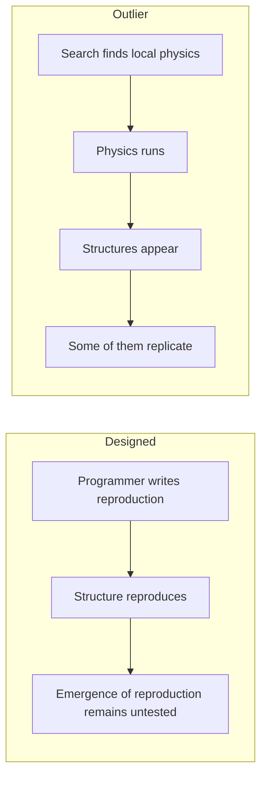
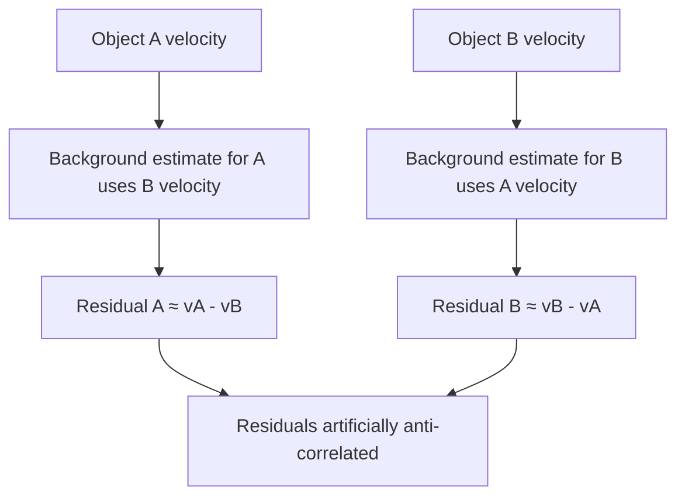
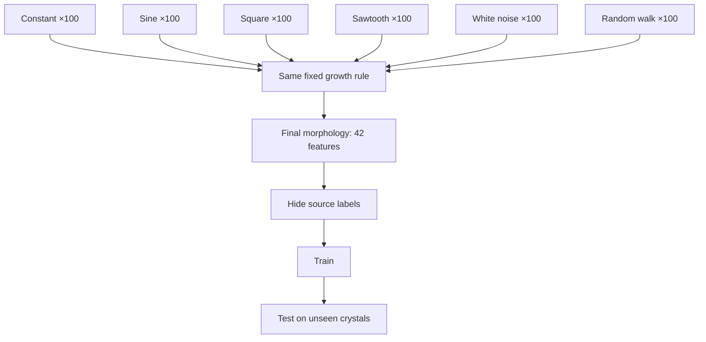
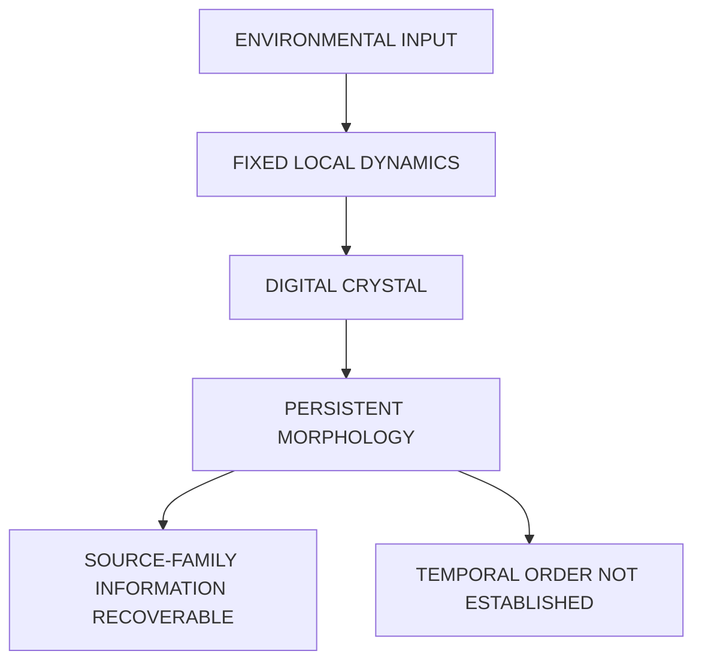
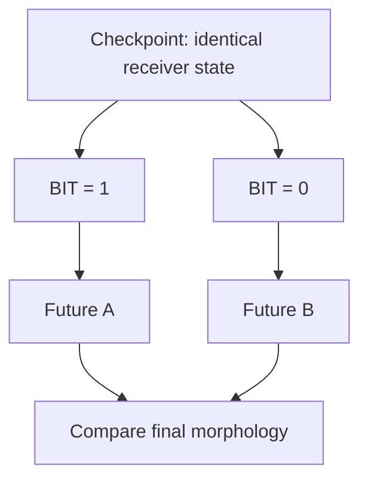
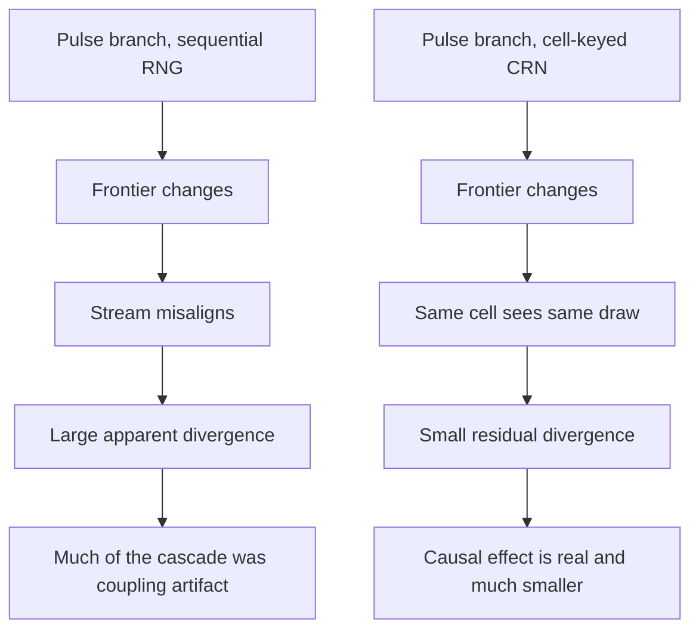
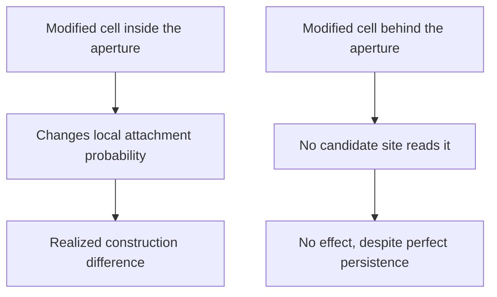
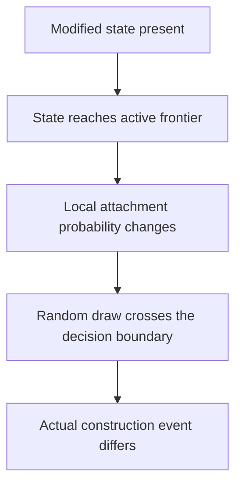
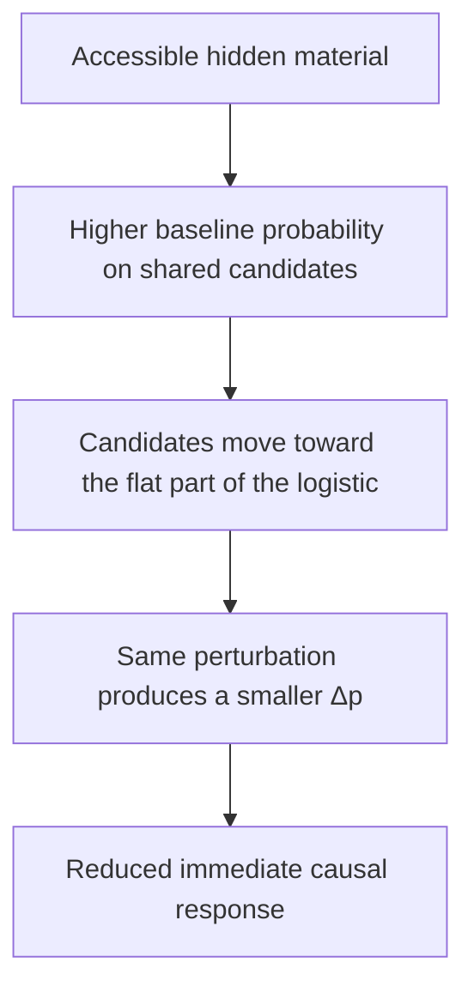

## 01: How to Read This Book

This is a science book, but you do not need to reproduce every experiment to read it.

You can simply follow the investigation.

Watch something strange appear.

See the explanation we reached for.

See the experiment that tested it.

See what survived.

If that is all you want from the book, the main text is enough.

But every important result sits above a deeper record, and that record is available if you want to inspect it.

The book therefore exists at several depths.

```text
THE BOOK
the argument

THE WEB EDITION
figures, animations and the living presentation

THE EXPERIMENTAL RECORD
code, reports, controls and source material
````

You can move between them whenever the question becomes interesting enough.

---

## The Book Has a Website

The web edition of *Digital Life* lives at:

**[https://programmer.ie/books/digital-life/](https://programmer.ie/books/digital-life/)**

If you are reading on Kindle, some of the experiments are easier to understand there.

Animated systems can move.

Large figures can be inspected at full size.

A sequence that becomes a still image on an e-reader can be watched as the process it was meant to show.

The web edition is therefore not a different book.

It is another view of the same investigation.

The public source repository is here:

**[https://github.com/ernanhughes/Digital-Life](https://github.com/ernanhughes/Digital-Life)**

That is where the investigation can be followed downward into code and experimental material.

The prose tells you what we think happened.

The experimental record lets you ask whether we are right.

---

## You Do Not Need to Read Everything at the Same Depth

There are roughly three ways to read what follows.

### Follow the argument

Most readers can stay entirely in the main text.

The important questions are:

```text
What did we see?

What did we think it meant?

How did we test that interpretation?

What survived?
```

You do not need to know every parameter or reproduce every confidence interval to understand why the argument changed.

### Follow the evidence

Sometimes a result will matter enough that you want to know exactly why we accepted it.

Then pay attention to:

```text
the intervention

the comparison

the control

the measured effect

the alternative explanation

the boundary of the claim
```

This is the level at which most of the science in the narrative operates.

### Audit the experiment

If you want to go further, follow the experiment into the repository.

There you can inspect the implementation, scripts, generated results, research reports and supporting material.

The principle is simple:

> **Every major conceptual claim should have a trail leading back toward something that can be inspected.**

You are not required to follow every trail.

But the trail should exist.

---

## The Rule of the Book

Most chapters begin with a temptation.

Something moves.

Something returns after damage.

Something appears to reproduce.

One region seems to behave like an individual.

An earlier event seems to have left a memory.

The quickest way to write a book about digital life would be to keep those words.

This book does almost the opposite.

The recurring procedure is:

```text
SEE SOMETHING
↓
NAME THE HYPOTHESIS
↓
DECIDE WHAT WOULD COUNT AS EVIDENCE
↓
MEASURE IT
↓
ATTACK THE INTERPRETATION
↓
BUILD A BETTER CONTROL
↓
KEEP WHAT SURVIVES
```

The interesting part is often what disappears along the way.

A phenomenon can survive after the explanation attached to it has failed.

That distinction matters throughout the book.

```text
observation
↓
interpretation
↓
control
↓
interpretation fails
↓
observation remains
```

A structure may really move coherently even after *flocking* stops being a defensible explanation.

A vacancy may really be refilled even after *repair* becomes too strong a word.

A region may really contain more of its own causal influence than its surroundings even after *individual* fails under a better control.

The failure of the noun does not erase the measurement.

Often it tells us what the measurement actually was.

---

## What a Control Is Doing

A control is not decoration around an experiment.

It is an attack on a particular explanation.

Suppose two structures look alike.

That may be evidence of common ancestry.

It may also be evidence that the same local rule tends to produce the same shape independently.

The second possibility is a **confound**: another mechanism capable of producing the observation we are trying to interpret.

The job of the next experiment is not merely to gather more evidence for the attractive explanation.

It is to make the cheaper explanation harder to maintain.

That is why the controls sometimes become stronger as a chapter proceeds.

The first control may fail.

The second may reveal another confound.

Occasionally the experiment itself turns out to be wrong.

That is part of the investigation rather than something edited out of it.

---

## The Edges of a Result

Scientific prose can sound strangely cautious.

You will repeatedly encounter phrases such as:

```text
under this measurement

in this configuration

within the tested window

relative to this control

not established

descriptive only
```

Those phrases are not apologies for weak results.

They tell you where the evidence stops.

Compare:

> The system remembers.

with:

> Experimentally written hidden state changed the system's response to the same later perturbation under the tested protocol.

The second sentence is less dramatic.

It is also much harder to misunderstand.

A useful claim has edges.

One of the central disciplines of this book is refusing to erase those edges because a larger sentence would sound better.

---

## Numbers Belong to Their Experiments

There are many numbers in this book.

Do not assume that two quantities can be compared simply because they have similar names.

A similarity score may use one normalization in one experiment and another elsewhere.

A control baseline may come from a different population.

One ancestry analysis may treat rotations as equivalent while another requires exact copies.

One causal estimate may answer a directional question while another tests whether an effect exceeds a predeclared meaningful magnitude.

So the default rule is:

> **A number belongs first to the experiment that defined it.**

Cross-experiment comparison has to be justified.

There will therefore be no final:

```text
LIFE SCORE = 0.83
```

The book is trying to discover distinctions.

Collapsing those distinctions into one number would defeat the purpose.

---

## Failure Is Evidence Too

A polished scientific story often looks inevitable:

```text
question
↓
method
↓
result
↓
conclusion
```

This investigation rarely behaved like that.

It behaved more like:

```text
question
↓
promising measurement
↓
unexpected result
↓
confound
↓
better experiment
↓
smaller claim
↓
new question
```

Some of the most important experiments in the book do not establish the thing they were designed to establish.

That does not make them useless.

A failed experiment may tell us that the intervention was invalid.

It may tell us that the measurement was too insensitive.

It may leave the question unresolved.

Or it may destroy one interpretation while leaving a smaller phenomenon intact.

Those possibilities are different.

Later in the book we will make that bookkeeping explicit.

For now, one rule is enough:

> **Do not make a failed interpretation take more evidence down with it than the experiment actually defeats.**

---

## The Experimental Record Wins

The main text exists to make the investigation understandable.

It should tell you:

```text
the question

the intervention

the important control

the result

what changed because of it
```

The deeper record exists to make that account inspectable.

It contains the things that would destroy the pace of the book if every one were reproduced in the narrative:

```text
implementation details

parameters

seeds

thresholds

secondary measurements

failed designs

validation checks

generated reports

provenance
```

Those details are not being hidden because they are inconvenient.

They are being separated because reading and auditing are different activities.

And there is one hierarchy that matters:

> **If the prose and the experimental record disagree, the experimental record wins.**

The prose is our interpretation of an experiment.

The experiment is not evidence manufactured to decorate the prose.

---

## A Book You Are Allowed to Challenge

You are not being asked to trust every interpretation in these pages.

Quite the opposite.

The book is built around the assumption that an interesting interpretation should attract stronger attempts to break it.

If a result seems surprising, follow it down.

Inspect the control.

Look at the code.

Try another explanation.

Run it again.

The public record exists partly because a scientific claim becomes more useful when someone other than its author can attack it.

So read at whatever depth serves you.

If you want the journey, follow the argument.

If you want the justification, follow the evidence.

If you want to challenge the result, follow the experiment.

```text
ARGUMENT
what changed

EVIDENCE
why it changed

REPOSITORY
how we tested it
```

They are not three different versions of the work.

They are three depths of the same work.

---

## One Last Warning Before We Begin

The next problem is harder than deciding whether an experiment was performed correctly.

Before we can ask how strong the evidence is, we have to decide what the evidence would even be evidence **of**.

That turns out to be unusually difficult when the subject is life.

Biology gives us words immediately:

```text
organism

memory

repair

reproduction

individual

evolution
```

Software makes those words dangerously easy to implement.

And our eyes make them dangerously easy to see.

So the investigation begins under one constraint:

> **Names are not evidence.**

Resemblance is not evidence of mechanism.

And biology, however valuable, cannot simply hand us a specification for what computational life must contain.

We have to discover what the system can actually earn.

So the next chapter begins with the question underneath everything that follows:

> **What would digital life mean?**

---

## 02: What Would Digital Life Mean?

Suppose life were possible in software.

What would we actually be looking for?

The honest answer is that we do not know yet, and that is the reason for this book.

We could certainly build something that looks alive: a graphical creature, an animated agent, a personality-driven assistant. That is not the experiment. The harder question is whether a computational system can produce, through its own operation, properties that justify some of the language we associate with living things.

Produce them, rather than declare them.

That sounds simple until we try to say what those properties are.

We reach immediately for a familiar vocabulary — not a list of requirements, just the properties biology has taught us to notice:

```text
structure
persistence
response
adaptation
repair
memory
reproduction
inheritance
evolution
```

Those words are useful. They are also a trap. Because the easiest way to build something that looks like digital life is to put the vocabulary of life directly into the program. We can write:

```python
class Metabolism:
    ...

class Memory:
    ...

class Reproduction:
    ...

class Organism:
    ...
```

and within an afternoon produce software that is unmistakably biologically inspired.

What we would not know is whether any of those biological words describe properties of the system rather than decisions made by its programmer.

Calling a method `reproduce()` does not establish reproduction.

Calling a number `energy` does not establish metabolism.

Writing state to disk does not establish memory. Copying a configuration does not establish inheritance. Running an optimizer does not establish evolution.

The names are ours.

The evidence has to come from the system.

That is where this book begins.

---

## The Cargo Cult of Life

A cargo cult copies the visible form of something without reproducing the mechanism that made the original work.

Artificial life has an obvious version of this problem. We can borrow the vocabulary of biology — cell, organism, energy, fitness, birth, death, memory, inheritance, evolution — and then build software structures carrying those names. The result may be complicated. It may be beautiful. It may even be useful.

But the terminology proves nothing.

So we will work under a stricter rule.

> **We do not get to claim a life-like property merely because we implemented something with the same name.**

Persistence has to be measured.

Regeneration requires damage: disturb the system, then measure what returns.

Learning requires experience to produce a measurable change in performance.

Inheritance means that something useful survives into a continuation or successor.

Reproduction demands more than visual resemblance between an earlier structure and a later one. There must be evidence that the earlier organization played a causal role in producing the later one.

Evolution imposes the hardest standard. We need to identify what varies, what persists, what is selected, and what changes across generations or through time.

Naming these properties is easy. Demonstrating them is the work.

---

## But There Is a Second Trap

Avoiding biological vocabulary is not enough, because there is a mistake available in the opposite direction.

We could decide in advance what life must contain:

```text
boundary
metabolism
death
reproduction
inheritance
selection
```

and then spend the rest of the book manufacturing those properties one at a time.

That would be better than naming classes after them. It would still smuggle in an assumption:

> that digital life must solve the same problems, in the same way, that biological life does.

Why should it?

Biological organisms exist under very particular constraints. They occupy physical bodies. Matter is expensive to rearrange. Copying an organism is difficult and slow. Bodies degrade. Individuals die. Acquired knowledge is only partially transferable to a successor. Lineages branch and generally do not merge.

A computational substrate has a different set of possibilities and a different set of costs. Copies can be nearly free. State can be checkpointed and restored. A process can move between machines. Two lineages can fork and later merge. Acquired information can, at least in principle, be transferred directly. One organization can be distributed across many locations. A digital system might simply grow, and never reproduce at all.

None of this means computation is unconstrained. Quite the opposite. It means that if digital life is possible, its important constraints may be computational rather than biological — and we should not decide in advance what those constraints will be.

So this book will not open with a checklist called `REQUIREMENTS FOR LIFE`.

We do not know the requirements.

We do not even know whether "requirements" is the right way to think about the problem. A biological checklist could make us blind to phenomena for which biology gives us no ready analogue.

Discovering what survives is the experiment.

---

## Biology Is Evidence, Not Specification

For centuries people watched birds and tried to understand flight.

Birds have feathers, wings, hollow bones, flight muscles, flapping motion. All of that was worth studying, and studying it was how the problem became tractable at all. But successful aircraft did not require us to manufacture an artificial bird. The important discoveries were underneath the anatomy:

```text
lift
drag
thrust
stability
control
```

Birds were evidence that flight was possible. They were not the engineering specification.

Life may be similar.

Biology gives us one extraordinarily successful implementation, and the only one we can currently examine. But an organism is a solution shaped by the medium it is made from, and many of its most familiar features may be consequences of that medium rather than universal requirements for whatever forms organized persistence might take elsewhere.

So the task of this book is not:

> Build a digital animal.

It is:

> **Discover the aerodynamics of digital life.**

Which mechanisms actually matter? Which properties arise on their own? And which of the things we assume are fundamental turn out to be solutions biology found for the specific problem of living in the physical world?

We should not answer any of that in advance.

---

## Do Not Trust What Looks Alive

There is a further problem, and it is not in the software. It is in us.

A complicated-looking simulation can be mesmerizing. We can generate a beautiful animation and immediately feel that something profound is happening. Maybe it is. Maybe it is not. Random noise can look complicated. A short-lived transient can look extraordinary in the moment just before it disappears. A periodic system can look chaotic if we watch too small a window. A pattern can resemble an organism while possessing no property beyond its geometry.

Surprise is cheap.

And humans are extremely good at turning motion into nouns.

We see a shape move, and start saying *it travelled*. We see one shape become two, and start saying *it reproduced*. We see several structures move together, and start saying *they flocked*. The upgrade happens in under a second, and it happens before any measurement has been taken.

Those words may eventually be justified. The animation does not justify them.

So the book insists throughout on a distinction that is easy to state and surprisingly hard to maintain:

> **The phenomenon and our explanation of the phenomenon are not the same thing.**

In a new substrate, even the definition has to be earned. Before we call something memory, reproduction or individuality, we need to say what observation would count as evidence for it and what would count against it. That operational definition is part of the experiment, not something the vocabulary supplies for free.

Which gives us a second rule:

> **Look first. Then try to destroy your own interpretation.**

---

## Even Our Nouns Will Have to Earn Their Place

This applies to the small words as well as the impressive ones.

Suppose a pattern persists while moving through a lattice. Is it an object? Perhaps. Suppose the visible pattern disappears and an equivalent pattern reappears elsewhere. Is it the same object? Perhaps not. Suppose two disconnected regions participate in one continuing causal process — are they two things, or one distributed thing? Suppose two structures look identical but have entirely independent histories. Are they the same kind of object? Yes. Are they the same individual? Probably not.

We will begin with simple geometric definitions, because they are measurable and because we have to begin somewhere. But we should hold them loosely.

> **The visible boundary of a pattern may not be the true boundary of a digital individual.**

Persistence creates the same problem. A program can persist indefinitely by doing nothing, so duration alone tells us very little.

Reproduction deserves similar suspicion. Biology makes it look unavoidable because organisms die and lineages continue through successors. A digital process might simply continue. Reproduction may turn out to matter — but the substrate has to show us why.

Evolution raises the same problem. Digital inheritance could include acquired state, learned parameters, external memory or modified code.

So the broader question is:

> **How can history produce cumulative, measurable changes in what a computational system can do?**

Biological evolution is one answer.

We do not yet know the others.

The visible object may not be the important unit. History may matter without anything we would recognize as memory. Reproduction may not be fundamental at all.

Those are questions for the experiments. We should not settle them by choosing the right vocabulary.

---

## How This Book Will Find Out

That leaves a practical problem. If we cannot trust the vocabulary and cannot assume the requirements, how do we know what to look for?

We start with what we can observe. The visual system gives us hypotheses. The experiment decides what survives.

So the same cycle runs through the entire book:

```text
SEE SOMETHING
↓
NAME THE HYPOTHESIS
↓
DEFINE WHAT WOULD COUNT AS EVIDENCE
↓
MEASURE IT
↓
BUILD A CONTROL
↓
LOOK FOR A CONFOUND
↓
BUILD A BETTER CONTROL
↓
KEEP ONLY WHAT SURVIVES
```

Later chapters will return to this sequence again and again, because the procedure is part of the instrument.

The questions will change. The procedure does not.

Three parts of the cycle do most of the work.

**Intervention.** Correlation is easy to obtain and hard to interpret. If we think a mechanism produces a capability, the strongest available move is to remove or disrupt that mechanism and measure what changes. If the capability does not depend on the mechanism, the explanation was wrong, however satisfying it looked.

**Controls.** A number alone means very little. A recovery score of 0.87 is impressive or unremarkable depending entirely on what an undamaged system scores, what a random process scores, and what a frozen copy scores. So every control in this book exists because there is a specific alternative explanation we are trying to eliminate — and the first control is often not good enough.

Discovering a confound in your own experiment is not a setback. It tells you that the result was carrying more than one possible explanation.

Remove one, and you may finally be able to see what remains.

**Bounded claims.** Compare:

> The system heals.

with a deliberately bounded statement such as:

> Under perturbation `P` in region `R`, structural measure `M` recovered to 0.87 within `T` steps.

The second claim may sound less dramatic, but its edges are visible. We know what was changed, what was measured, and where the conclusion stops.

One consequence needs stating plainly, because it is where investigations usually go wrong.

The standard of evidence does not change when a hypothesis becomes attractive. It does not relax because the result would be exciting, and it does not tighten because the result is inconvenient. A beautiful animation generates a hypothesis. It never establishes an interpretation. If the strongest honest conclusion is smaller than the idea that motivated the experiment, then the smaller conclusion is the result.

---

## Expect Us to Be Wrong

This deserves to be explicit, because it is not a disclaimer. It is a description of what actually happened while the book was being written.

We form hypotheses that fail. We design controls that turn out to be inadequate. We produce measurements that look spectacular and then collapse when a confound appears. Sometimes we discover that a question we had been asking for three chapters was really two different questions wearing one name.

The recurring shape is roughly this:

```text
we expect X
↓
the experiment does not support X
↓
something else appears
↓
we investigate that
↓
the new interpretation may fail too
↓
a smaller or stranger phenomenon survives
```

That last line is the point.

This is not a book in which every chapter proposes a property and then successfully proves that property exists.

Quite often we went looking for one thing and were shown another.

Sometimes the first explanation failed. Sometimes the second failed too. Occasionally several experiments were needed before we understood what the system had been showing us all along.

That leads to one of the central rules of the investigation:

> **An explanation can die without the phenomenon dying.**

A failed interpretation does not oblige us to throw away the observation that killed it. Sometimes the observation is the discovery.

Separating the measurement that survives from the interpretation that does not is most of the work.

We are not trying to prove that digital life exists.

We are trying to find out which claims remain standing after we attack them.

---

## There Is No Biological Ladder Here

We will meet familiar properties along the way — structure, persistence, identity, damage tolerance, repair, reproduction, inheritance, adaptation, evolution. They are experimental questions, and the order in which we study them is a path through the investigation rather than a ladder toward life.

Nothing earns points toward an `ALIVE` label.

---

## The Question We Are Actually Asking

At the end of this book we may still decline to say that anything we built is alive.

That would be an acceptable result. It might even be the correct one.

What matters is whether we can say things like:

```text
this structure persists under these conditions

this pattern fails under this perturbation

this organization restores part of its form after this damage

this later structure is causally descended from that earlier one

this earlier state measurably changes a later response

this effect survives this control

this apparent behaviour disappears when this confound is removed
```

Those are modest sentences. They are also somewhere solid to stand, which is more than most of the vocabulary we started with can offer.

Perhaps that is where the aerodynamics begin: with measurements precise enough to survive before there is a general theory to contain them.

And if enough surprising properties survive enough attempts to explain them away, a different question eventually becomes unavoidable. Not:

> Does this look alive?

But:

> **What kind of thing is actually here?**

That is the question this book keeps returning to.

We will repeatedly ask the system to show us something for which we already have a name. Sometimes it will.

Sometimes it will show us something else.

The job is to notice the difference.

---

## Where to Start

To ask any of this, we need a world simple enough that we can see what is happening.

Small computational systems — a lattice, a local rule, a clock — are almost ideal for this, and not because they resemble organisms. They do not. They are useful because they remove excuses. If something interesting happens inside a very large model, the explanation can disappear into millions of parameters and never be found. In a system with a handful of ingredients we can inspect every state, replay every step, flip one bit, run the counterfactual, compare neighbouring rules, and measure exactly what the perturbation did.

When a claim fails there, it has almost nowhere to hide.

That is what makes these systems worth beginning with. They are not models of life.

They are **experimental microscopes for emergence**.

---

In the next chapter we will calibrate the microscope.

We will begin with computational systems rich enough to make the temptation almost irresistible: shapes that move, persist, collide and appear to behave like things.

We will let ourselves see the creature.

Then we will start taking assumptions away.

Continuous state. Rich neighbourhoods. Complicated rules. Even the idea that a persistent pattern must be made from the same material from one moment to the next.

By the time almost nothing is left, we will already have encountered the problem that drives the rest of this book:

> **Computation can produce something worth explaining long before we know what to call it.**

---

## 03: Look at This Thing

Don't read anything yet.

Watch this.



Something is moving.

It appears to have a boundary. Different parts of it seem to behave differently: an edge that ripples, an interior that stays denser, a leading region that seems to pull the rest along. Its shape changes as it travels, and yet some larger organization survives those changes. Watch it for thirty seconds and you will start predicting what it is about to do.

If you saw this without context, biological language would arrive immediately.

A cell. A creature. An organism. Perhaps even an animal.

That reaction is useful. It is also the first thing this book has to take apart.

---

## Your Brain Has Already Invented an Object

Before knowing anything about the mechanism, most of us have already run through something like this:

```text
pattern
↓
persistent pattern
↓
moving persistent pattern
↓
thing
↓
creature
```

Notice how fast that happened, and notice how little was required to trigger it. Nothing in the simulation announced `I AM AN OBJECT`. Nothing marked where the supposed body begins or ends. Nothing certified that the pattern visible at one moment is the same individual as the pattern visible several moments later.

We supplied all of that.

So the first question of this book is not *is this alive?* That question is far too large to be useful yet. The first question is much smaller, and much more answerable:

> **Why does this look so much like a thing at all?**

---

## There Is No Creature Variable

Start with what is not in the program.

There is no object exposing `creature.move()` or `creature.keep_shape()`. There is no animation path, no skeleton, no set of joints, no controller issuing instructions like *keep the left side attached, push the front forward, restore the outline*. There is no variable called `position_of_creature`, and no field named `head` or `tail`.

Underneath the apparent creature is a field of numbers. Each location changes according to nearby values, using the same rule everywhere.

Nothing corresponding to the creature moves through that mechanism. The field simply changes, step after step.

The system is **Lenia**, a continuous cellular automaton famous partly because its localized patterns are so easy to describe biologically.[1]

We will resist that language for now.

What we have actually observed is a persistent localized pattern. That description is less exciting. It is also something we can test.

The direction of explanation here is worth pausing on, because it runs backwards compared with ordinary software. Normally a programmer defines an object and the object then produces behaviour. Here:

```text
programmer defines local dynamics
        ↓
dynamics unfold
        ↓
localized organization appears
        ↓
we decide whether "object" is a useful description
```

That reversal is a large part of why artificial life is so compelling.

It is also why it is so easy to fool ourselves.

The object appears first in our perception. Only afterwards do we begin asking whether anything in the mechanism justifies treating that apparent boundary as a real unit of organization.

---

## What Is Actually Moving?

Look at the pattern travelling left to right.



The grid does not move. The individual locations do not travel. Location (40, 17) is exactly where it always was, holding whatever value the update rule most recently assigned it. Nothing is transported.

What happens instead is a chain of local reconstruction. State at one location influences nearby updates; a recognizable organization appears slightly farther over; those states influence the next updates; the recognizable organization appears farther over again.

Nothing corresponding to the visible creature has travelled through the grid.

The organization has propagated.

So when we say *the creature moved*, the operational description is:

> **a recognizable organization of state was repeatedly reconstructed at changing spatial coordinates**

Those two sentences describe the same visual event at different levels. One is intuitive and useful for noticing things. The other is operational and useful for measuring things. We will need both, all the way through this book. What matters is knowing, at any moment, which one we are using.

Waves already give us one familiar version of the problem: something recognizable can propagate without its material travelling with it.

So two possibilities remain open. Perhaps identity does not require preserving the same material. Or perhaps we are simply very good at seeing objects where no useful object exists.

The animation cannot decide between them.

---

## The Most Dangerous Word Is "It"

Look at the sentences already used in this chapter.

> It moved. It changed shape. It persisted.

The word **it** is carrying an enormous amount of unearned weight. Before saying that something persists, we need a rule for deciding that the pattern at time *t* and the pattern at time *t+1* are instances of the same continuing organization. That rule might be based on shape similarity, or location, or trajectory, or internal structure, or causal continuity, or something we have not thought of.

We do not have that rule yet. Visual continuity is enough to raise the question. It is nowhere near enough to settle it.

So we will use geometry while it works, and replace it if the experiments force us to.

A discipline that helps: keep two descriptions of the same event side by side.

**The tempting description**

```text
It moves.
It eats.
It heals.
It remembers.
It reproduces.
```

**The operational description**

```text
a localized organization is reconstructed at changing coordinates

field quantity is redistributed toward a region and away from others

a measured structural quantity returns toward its pre-perturbation value

a later response differs measurably because of an earlier state

a second structure appears whose form causally depends on the first
```

The left-hand column is how we notice phenomena worth investigating, and abandoning it would make us worse scientists, not better ones. The right-hand column is what we can actually test. Neither should quietly replace the other, and the failure mode of this entire field is the moment the first column starts getting reported as though it were the second.

---

## Now Take Almost Everything Away

Lenia leaves us an easy escape: perhaps the apparent creature depends on all that continuous state, smooth interaction and complicated morphology.

It does not.

Strip computational systems down almost absurdly far and simple local rules still produce global structure that no individual component represents. We do not need a tour of cellular automata to establish that. One much smaller example matters for the question we are asking.

For that, five cells are enough.

Conway's Game of Life is a binary lattice governed entirely by a local update rule. One five-cell pattern discovered in it is the glider.


Nothing in the rule says *move diagonally*. There is no velocity variable and no object being transported. Yet the pattern repeatedly reconstructs itself one cell farther across the lattice.

Ask what persisted and the answer is striking. Not the same active cells. Not the same coordinates. Not even the same shape at every intermediate step.

But every four generations the configuration is exactly the original again, displaced one cell diagonally.

What persisted was the organization.

That separates two ideas ordinary language tends to weld together.

**Material identity** asks whether the same components persist.

**Organizational identity** asks whether a recognizable pattern persists while the components change.

The glider gives us a small but important result:

> **Recognizable organization can persist without persistent material identity.**

We have not found an organism.

We have found a kind of continuity that does not require one fixed body.

---

## What the Lattice Cannot Do

But the glider is missing something important.

Where did it go last week?

Run it across an empty lattice and nothing marks the route. The world after its passage contains no trace that it was ever there.

The lattice is a stage. It records nothing.

That prevents the past from exerting any grip on the future. So we change one thing.

Let simple components alter the world they move through, and let the altered world change what happens next.

---

## A World That Keeps What Happens To It

The new system is a **Physarum-inspired particle model**: a population of extremely simple mobile agents coupled to a field they can both read and alter.[2]

The biological name explains where the idea came from, not what the model is. *Physarum polycephalum* leaves extracellular traces that can affect later behaviour; that observation inspired computational models with a similar feedback structure.[3] Nothing established about the organism is thereby established about the model.

The mechanism is simple. Agents sense the field, turn, move and deposit into it. The field diffuses and fades.

So:

```text
agents
 ↓
change the field
 ↓
the field retains a trace
 ↓
the trace changes later behaviour
 ↓
agents change the field again
```

There is no network object, route planner or representation of the structure that eventually appears.

There is only the loop.

> **The agents alter the conditions that determine their own future behaviour.**

This kind of coordination through traces left in a shared environment is often called **stigmergy**.[4]

That is the feature we need. What happens now can leave something behind that changes what happens later.

---

## Watch the Network Appear


From a random scatter of agents and an empty field, a network appears.

The biological vocabulary arrives immediately:

trail
foraging
coordination
memory
organism

Again, none of it has been earned.

First eliminate the dull explanation. Perhaps thousands of moving agents depositing material would produce something network-like regardless of feedback.

Disable their ability to sense what previous agents deposited and the network disappears into a haze. With sensing enabled, the concentration measure is **0.883**. With it disabled, **0.153**.

So there really is a reproducible phenomenon here. The feedback loop produces macroscopic organization that largely disappears when the coupling is removed.

That is enough to continue.

Not memory. Not foraging. Not an organism.

Something organized is happening.

Now attack the obvious explanation.

---

## Where Is the Past?

The obvious hypothesis is that the network's history lives in the field. The field is what visibly accumulates, so delete it.

Keep every agent exactly where it is and erase the field completely.

Twenty-five steps later, similarity to the old network is **0.897**, against **0.911** for an undisturbed continuation.

The network comes back.

The natural explanation is that the agents were already standing in the channels they had helped create. Their spatial arrangement may itself have carried part of the earlier network, allowing them to redraw much of it once deposition resumed.

That mechanism has not yet been isolated. What the intervention establishes is narrower: the field was not the sole carrier of the history.

Reverse the intervention.

Keep the field, delete the entire population, and replace all twenty thousand agents with naive ones at random positions and headings.

They inherit only a world shaped before any of them existed.

The new population reconstructs substantially more of that old network than an equivalent population starting from an empty field: **0.658 against 0.304** after twenty-five steps.

The specificity control matters. A naive population placed into network A scored **0.658** against the network it inherited and **0.297** against an independently grown network; the mirror experiment with network B scored **0.619** and **0.339**.

The effect is therefore specific to the historical network the population was given, not merely to receiving any mature field.

The tempting sentence is that the new agents remembered.

They did not. None of them existed when the network formed.

The smaller statement is stranger:

> **The behaviour of a population depended on structure produced before any member of it existed.**

Erase both and the advantage disappears, as it should: the field and the agents together constitute the state of this model. Resetting both is effectively a fresh start.

The informative result is that removing either candidate carrier alone was not enough. Neither intervention localized the historical effect to one subsystem by itself.

The agents can partly reconstruct the field.

The field can partly recruit new agents back into the earlier organization.

Whatever carries the history is distributed across the coupled system.

That is not yet memory.

It is history dependence: something produced earlier measurably changes what happens later.

---

## Start Replacing the Material

A complete population swap is dramatic but artificial. So replace the material slowly instead.

Once the network has formed, every five steps delete 2% of the agents and introduce the same number of naive replacements at random positions. Continue for two thousand steps.

The original population drains away.

By the end of this run, only **7 of the original 20,000 agents remain**. More than 99.9% of the population that built the network is gone.

And yet an organized network remains.

The exact routes do not remain fixed — but neither do they in an undisturbed system. Even without intervention, channels migrate and loops rearrange. So two kinds of continuity have to be separated:

**route identity** — is this the same historical configuration?

**organizational continuity** — is the system still maintaining the same broad kind of structure?

Under continual replacement, route identity gradually drifts, while the organized regime survives in degraded form. Its concentration settles around **0.49**, compared with **0.93** for the undisturbed branch and **0.153** when feedback is disabled.

That degradation suggested an attractive explanation: perhaps replacement was progressively injuring the network.

So stop replacing agents.

Most of the deficit reverses.

Concentration rises from **0.490** to **0.581** within a hundred steps, **0.724** within five hundred, and **0.798** within a thousand. It does not regain the undisturbed value inside the observation window.

In this run, most of the degradation was therefore a standing cost of continued replacement rather than accumulated damage.

The important result is smaller than “the network is unaffected by turnover.” It plainly is affected.

But the agents maintaining the network near the end are almost entirely not the agents that built it. New components arrive into a world already shaped by earlier components and are recruited into continuing organization.

> **Under this configuration, macroscopic organization persisted through replacement of more than 99.9% of the original population.**

The material changed.

Something else continued.

---

## What Would We Have to Destroy?

Nothing in this chapter gives us a reason to call any of these systems alive.

We did not establish an organism, memory, intelligence or individuality.

But removing those interpretations did not remove the phenomena.

Some of what survived was visible directly in the mechanism. A pattern can propagate without its material travelling with it. A glider can return to exactly the same configuration while its active cells change.

The stronger results survived intervention. In the writable-world system, later behaviour remained dependent on earlier activity after we removed either of the two obvious places that history might reside. And organized structure persisted while more than 99.9% of the population that created it was replaced.

Those are different kinds of evidence, and we should not blur them.

None of them is evidence of life.

But *only a pattern* is not much of an explanation either.

There is something here.

We do not yet know what kind of thing it is.

The explanation kept shrinking.

The phenomenon kept not going away.

The interventions leave us with a better question. Erasing the field alone was not enough. Replacing the population alone was not enough. The historical effect was not localized to either obvious subsystem by itself.

So instead of asking where the thing is, ask:

> **What would we have to destroy for it to stop being the same thing?**

This system can only take that question so far. It maintains an organization; it does not give us a clean second individual whose ancestry we can follow.

The next system changes that.

It will not merely tempt us to invent an object.

It will tempt us to invent an organism.

And it will look like it is reproducing.

---

## Experimental Note

The Physarum-inspired results in this chapter come from one implementation under one configuration, with interventions branched from a common checkpoint. Most conditions were single-run demonstrations rather than population-level estimates across seeds.

The numerical claims in the chapter should therefore be read exactly as stated: evidence about this configuration, not estimates of general robustness.

Full parameters, similarity definitions, null construction, intervention protocols, discarded parameterizations, additional measurements and failed runs are provided in the appendix and accompanying experimental material.

---

## References

**[1]** Chan, B. W-C. *Lenia: Biology of Artificial Life.* Complex Systems 28(3), 251–286 (2019).

**[2]** Jones, J. *Characteristics of Pattern Formation and Evolution in Approximations of Physarum Transport Networks.* Artificial Life 16(2), 127–153 (2010).

**[3]** Reid, C. R., Latty, T., Dussutour, A. & Beekman, M. *Slime mold uses an externalized spatial "memory" to navigate in complex environments.* PNAS 109(43), 17490–17494 (2012).

**[4]** Theraulaz, G. & Bonabeau, E. *A Brief History of Stigmergy.* Artificial Life 5(2), 97–116 (1999).

---

## 04: Now There Are Two

We have learned not to trust the first noun.

Fine.

---

In the previous chapter an organization survived while nearly everything participating in it was taken away and replaced. By the end of the turnover window, only 7 of the original 20,000 agents remained.

The exact routes had drifted. The broader organized network had not disappeared.

That was persistence, and it was hard-won.

It was also not reproduction, and the gap between those two words is wider than it looks.

A process can persist throughout an observation without ever producing a descendant. Our Physarum experiment did exactly that. It formed, degraded, recovered and remained organized at the end of the run.

But we never defined or observed a descendant relation.

Continuation is one capability. Making another one is a different capability, and nothing we measured in the last chapter bears on it at all.

The glider looks like the harder case, and it is worth spending a moment on, because it is where the distinction becomes precise instead of merely rhetorical.

Every four generations the glider's configuration recurs, displaced by one cell diagonally and built from active cells at different coordinates. New material participation, recurring organization, generation after generation. If anything in the previous chapter deserved the word **reproduction**, surely that did.

It does not qualify, and the reason is not our invention. In the causal analysis we are about to rely on, Hintze and Bohm set out a criterion for calling a structure a self-replicator: it must produce at least two copies of itself, each causally traceable back to the original, and not to each other.[6] The glider fails it. Each glider copy descends from the copy immediately before it, in a single unbranching chain. Nothing ever forks. A glider gun fails for a different reason — it produces gliders, not glider guns.

The criterion is worth making explicit:

> **An earlier organization must give rise to at least two later organizations of the same kind, each causally dependent on the original and not on one another.**

Chains are not enough. The history has to branch.

We did not construct that standard to fit a result we already had, which is exactly why it is useful to us. It comes from the literature we are about to test our own run against, and it disqualifies the most charismatic object in the previous chapter.

Now look at this.


---

## The Rule Was Searched. The Replicator Wasn't.

Artificial life already contains systems that reproduce, evolve, conserve material and generate structures nobody explicitly designed. Evoloops, Flow-Lenia, Genelife and more recent computational-life experiments cover different parts of that territory, and other work surveys it more systematically.[1–4]

For our purposes one system is unusually useful: **Outlier**.

The mechanism will take one paragraph, because the previous chapter has already done the teaching.

Every cell is `0` or `1`. Each cell reads its `3 × 3` Moore neighbourhood, itself included, which gives 512 possible local configurations, and the rule specifies an output for each. That is the entire law of this universe: 512 output bits. The published rule is rotationally symmetric but not mirror-symmetric. Of its 512 entries, 220 produce an active centre cell, compared with 140 for Conway's Game of Life.[5]

Note what is absent. No `Organism`. No genome, no energy budget, no `reproduce()`, no fitness function, no population manager, no representation of an individual anywhere. There is binary state, a neighbourhood, a transition rule and time.

How Outlier was found matters, because it is easy to overstate what happened.

Outlier was found by an automated search — genetic programming across cellular-automaton rules, looking for dynamics that might support open-ended evolution.[5] Humans wrote the search. Humans defined the rule space, the substrate and the selection criteria. Nothing here appeared independently of human design in any absolute sense; the result is better understood as the discovery of an interesting rule within a human-defined search space.

But the search was for a universe, not for a replicator. Self-replication was not an explicit objective.[5]

That does not mean the search was indifferent to replication. A search for dynamics capable of open-ended evolution may favour rules in which structure persists or multiplies, even if replication itself is never named as the target.

The narrower point is enough. What the search returned was a local transition rule. The particular replicating organizations later observed were not explicitly represented in that rule or specified as the target of the search.

That distinction is the whole reason Outlier is worth our time:



In the first route, observing reproduction tells us only that somebody implemented it. In the second there is no reproduction operator to point at. If a structure reproduces here, the mechanism has to be realized through the unfolding dynamics, because there is nowhere else for it to live.

That does not establish life. It establishes something we need before the question of life is worth asking at all:

> **the behaviour is not the execution of an operation we named in advance.**

---

## It Looks Like Reproduction, Which Is the Problem

Run the published rule from sparse random conditions, or from a tiny seed, and the world fills with activity.[5]

Small shape-shifting clusters appear. Some of them produce further clusters. Some periodically duplicate. Smaller structures assemble into larger formations, and those formations duplicate too. Collections of them eventually form the boundary of a still larger expanding complex.


So there is organization at several levels simultaneously:

```text
cells
  ↓
clusters
  ↓
replicating formations
  ↓
larger expanding complex
```

Yang classified structures at more than one of those scales as self-replicating, under the operational criterion used in that work.[5] Duplication-like recurrence really does appear at multiple scales, and that alone is stranger than anything in the previous chapter. The glider gave us one localized organization persisting through time. Here we have organizations built out of organizations, with apparent duplication at more than one level of the hierarchy.

It is worth being honest about the effect this has on a viewer.

The glider was easy to hold at arm's length. Outlier is not. Structures appear, collide, leave debris and produce further structures, and regions of the world acquire recognizable histories. The vocabulary we spent two chapters restraining comes back within seconds — parent, offspring, population, lineage, organism.

But those words smuggle in different claims. Parent, offspring and lineage assert causal descent. Organism asserts a boundary and an individual. Population assumes we already know which things should be counted together.

The animation establishes none of them.

Consider the entire evidential content of the observation:

```text
time t

    A

time t + 500

    A     A
```

The sentence that arrives unbidden is *A reproduced*. But the same image is produced by at least three other stories. Both structures may have been generated independently by the surrounding dynamics. The second may have appeared for reasons that had nothing to do with the first, and would have appeared even if the first had never existed. Or what we are calling two structures may be two parts of one larger repeating process that our detector happened to split.

Nothing in the geometry distinguishes these.

```text
similarity
≠
ancestry
```

Everything that follows depends on that distinction. It is the sharpened form of the rule from the *What Would Digital Life Mean?* chapter that appearance is not mechanism. Reproduction cannot be established from the final picture, because reproduction is a claim about causation and the picture contains no causation. It contains only the outcome.

---

## What Determinism Buys Us

Here Outlier gives us something almost no interesting system gives us.

It is deterministic and completely specified. For every live cell at time `t+1` we know exactly which `3 × 3` neighbourhood produced it, and we know the full mapping from neighbourhoods to outcomes. There is no learned function, no hidden state, no floating-point drift and no stochastic component. For any modified neighbourhood, the next cell state can therefore be computed exactly from the rule.

That does not make causality automatic.

The update is exact. Which counterfactuals we choose to treat as causal evidence, and how we aggregate those cell-level dependencies into ancestry between larger structures, remain methodological decisions.

So a question that is usually unanswerable becomes mechanical:

> Which live cells in the preceding neighbourhood were actually necessary for this cell to be alive?

The published framework answers it carefully, and the care matters. Rather than asking whether removing any single predecessor changes the outcome, Hintze and Bohm identify the *minimal subset* of live neighbours that the transition actually requires, and exclude the rest from the causal trace.[6] This handles a real problem: update rules contain redundancy, and a neighbour that happens to be alive is not thereby a cause of anything. Where more than one minimal subset exists, their method conservatively includes all contributing clusters — a case they report not encountering in Outlier, though the method is built to handle it.[6]

Cell-level dependencies are far too numerous to reason about individually, so they are aggregated. Cells are grouped into clusters by adjacency, and a cluster is counted as causally derived from an earlier one if any of its cells depends on a cell belonging to that ancestor.[6]

The result is a graph rather than an impression: clusters at successive ticks linked by measured dependency, with branching wherever one earlier organization contributes to several later ones. And the question has changed completely. Not *does this later structure resemble the earlier one*, but:

> **Can we trace a causal path by which the earlier organization contributed to producing the later one?**

One restriction is worth carrying forward. Yang's structural analysis allowed rotational variants, while Hintze and Bohm's causal analysis restricted its replication claims to exact copies.[5][6] Whatever the causal analysis finds, it is not finding it by relaxing what counts as the same structure.

Causality does not remove the identity problem. The criterion still requires later organizations *of the same kind*, so what counts as the same kind has to be fixed before the search rather than chosen afterwards.

---

## Three Replicators, Three Fates

Applied to a `1024 × 1024` periodic world run for 20,000 ticks, that method produced a causal ancestry graph of **31,959,320 cluster instances and 65,552,995 directed causal edges**, across 966,208 distinct clusters.[6]

Underneath an animation that reads as a few dozen things moving around.

The interesting part is what happens when three specific structures are followed through it. Within the first 10,000 ticks:[6]

```text
c0      433    no second generation
c1    1,677    reached a second generation
c2    2,439    15 generations
```

The published analysis uses these counts in describing the three reproductive histories; the important comparison here is not the raw total but what happened to the lineage afterwards.

The seed cluster `c0` produced 433 copies, every one of them causally traceable to the original. On the criterion above it is a genuine self-replicator, and it is also an almost complete failure: not one of those 433 offspring went on to produce a `c0` of its own inside the window. The second cluster, `c1`, did better — 1,677 offspring, and near tick 10,000 one of them produced three more, which is a second generation and not much else. The third, `c2`, replicated more often than either and, crucially, its offspring kept replicating: fifteen generations of causal descent, growing at a fitted factor of roughly 1.5 per generation over the first ten.[6]

So a word we were treating as one thing turns out to be three:

```text
recurrence
≠
replication
≠
sustained lineage
```

`c0` is the instructive case, because 433 is a spectacular-sounding number attached to a lineage that went nowhere. Producing copies and founding a dynasty are different achievements, and the first can be reported in a way that strongly implies the second. Biology would have taught us that distinction eventually. It is startling to meet it in 512 bits.

---

## The Fast Ones Did Worse

The original `c2` produces several offspring, four of which go on to replicate themselves. Two complete the process in 675 ticks; the other two take 778.[6]

The obvious expectation is that the faster branches should leave more descendants.

They did not.

Across the full phylogeny, the 675-tick lineage produced 96 replication events and the slower 778-tick lineage produced 125.[6]

The authors attribute the difference to geometry: the faster branches expand in directions that produce more spatial interference, while the slower branches retain more room in which to continue.[6] The measurement is solid. The explanation is plausible but was not isolated by intervention.

So the bounded result is smaller: shorter replication time did not correspond to greater realized lineage output. Spatial direction and available room became candidate constraints on reproductive success.

The same run contains something stranger. Three of the four developmental pathways begin differently and then converge, passing through an identical sequence of cluster states for their final 143 ticks before producing offspring.[6]

Replication here is not well described as a body simply being copied. It is an extended dynamical process through intermediate organizations, some of which bear little resemblance to the eventual offspring.

---

## The Replicator Might Not Be a Body

Which brings us to the finding that puts the most pressure on intuition.

A self-replicating organization in Outlier does not necessarily correspond to one compact connected cluster. The replication process frequently unfolds across multiple spatially disjoint patterns, which stay disconnected for a number of ticks before merging or branching further, and which coordinate well enough to complete a replication between them.[6] The published work reads this as distributed, multi-component selfhood.[6]

We do not need the stronger noun. The published causal analysis establishes something narrower, and quite strong enough:

> **In the published Outlier analysis, causal self-replication can involve multiple spatially separated components.**

Notice what that does and does not say. It does not say those components constitute one natural individual. It says a reproducing process need not correspond to one connected body. A detector restricted to compact connected structures would have missed reproduction that was demonstrably occurring.

The previous chapter left us with a version of this problem already. Every intervention there failed to localize the continuing organization to either the agents or the field, and what the experiments kept pointing at was the relationship between them. Outlier now produces the same discomfort from the opposite direction: here we can follow ancestry exactly, and the thing with the ancestry still refuses to be a single object.

> **If reproduction can be causally real while the reproducing unit is not a neat connected body, what exactly is the thing that reproduces?**

Resist the urge to answer. The temptation is to jump from *distributed causal reproduction* to *one distributed individual*, and no experiment here licenses that jump. Individuality would need a criterion we do not have, and inventing one to fit the case in front of us is how this field produces its worst results.

The question stays open. It gets considerably harder later.

---

## 144 Copies Prove Nothing

Published evidence tells us what Outlier has been shown to do. We also wanted a specimen we controlled.

So we reconstructed the rule and verified it before asking it anything: all 512 transition cases decoded, exactly 220 active outputs, published rotational symmetry confirmed. The details belong in the experimental record. The principle belongs here.

> **Verify the world before interpreting anything that happens inside it.**

A wrong decoder still produces extraordinary animations. It cannot produce evidence about Outlier.

Scale is part of the experimental condition, and ours is smaller: a `512 × 512` world over 1,600 generations, against the published `1024 × 1024` over 20,000 ticks. That is not cosmetic. Yang reports a strong scale effect in this rule, and the published causal run behaves differently after about tick 10,000, when the expanding front meets the periodic boundary and the uninterrupted leading edge disappears.[5][6] Our run never reaches that regime.

So everything below carries its scope with it, and does not generalize upward by default.

Now the experiment. We wanted to avoid the failure mode where you hunt through a large run for shapes that seem to repeat, because that guarantees a result: among a hundred thousand clusters, *something* recurs, and whatever recurs most strikingly will feel like a discovery. Instead we derived the target signature in advance from the known seed — the small structure the published work designates `c2`, six cells in a `3 × 3` bounding box in our run — and only then searched for later occurrences of that structure.

Our detector treats translation and quarter-turn rotation as equivalent. Because the rule itself is rotationally symmetric, a rotated `c2` evolves as the corresponding rotation of `c2`'s evolution. Mirror reflections are not treated as equivalent because the rule is not mirror-symmetric.

That identity convention is still broader than Hintze and Bohm's causal study, which restricted its replication analysis to exact copies.[6]

The search found **144 `c2`-equivalent occurrences** between `t = 2` and `t = 1598`. Our indexing takes the initial seed as `t = 0`; the published causal study numbers the corresponding original `c2` one tick later. That is an indexing convention, not a disagreement about the structure.

That is an observation. It is not reproduction, and the gap is the whole point of the chapter. One hundred and forty-four copies are entirely compatible with one hundred and forty-four independent products of the same underlying dynamics, none of which had anything to do with any other.

Encouragingly, this is not a scruple we invented. The authors of the causal study raise precisely the same possibility about their own result: that `c2` patterns might simply arise often, with descent being a correlate of the dynamics rather than a cause.[6] Their answer is the causal trace.

Ours asks the same causal question, but it does not reproduce their reconstruction exactly. Hintze and Bohm identify minimal sufficient subsets of live predecessors. Our implementation uses a simpler local but-for test: remove each live predecessor individually and record a dependency when that removal changes the child from live to dead.

Those procedures are not equivalent. Redundant causal sets can be missed by ours, because no single predecessor need be individually necessary when several different subsets can support the same outcome. Our test also records only dependencies revealed when removing a live predecessor turns a live child dead. Because the Outlier rule is non-monotonic, we therefore cannot treat our graph simply as a lower bound on theirs.

Everything we claim from our run is bounded to this stated causal criterion.

With that restriction visible, we built the graph:

```text
138,891 clusters
196,466 causal edges
```

That number is itself a correction. The animation looks like a modest collection of discrete moving objects. Underneath it is a network of nearly two hundred thousand dependencies, and our visual impression of *a few things moving around* was never a description of the mechanism.

Then we intersected recurrence with ancestry, searching forward from each `c2`-equivalent occurrence for later members of the same equivalence class reachable through the causal graph.

Our search stops a causal branch at its first return to `c2`. The complete return graph contains 99 causal return edges across the 144 detected occurrences. Of those occurrences, **[N]** have two or more distinct first returns.

**[M]** of the 144 occurrences have no causal path back to an earlier `c2`.

Those numbers matter because they expose the structure hidden by the recurrence count alone. The first tells us how often the causal history actually branches. The second measures how much of the apparent recurrence remains compatible with `c2` arising independently from the surrounding dynamics.

Under this detector, the result is therefore branching causal recurrence rather than recurrence alone.

There is one further condition if we want to claim that this run satisfies Hintze and Bohm's stricter self-replication definition: two candidate offspring must each depend causally on the parent while not depending causally on one another. The current first-return construction does not explicitly test that final independence condition.


The figure shows a deliberately pruned family, because the full graph is unreadable as an illustration. The analysis uses all of it.

---

## This Time, a Causal Claim Survives

Something has happened here that has not happened before in this book.

We began with a criterion set independently of our result, one that had already disqualified the most persuasive object we had. We fixed the target structure in advance rather than choosing it after seeing which shapes recurred. Then we asked how much of that criterion our own reconstruction could establish.

It established more than resemblance:

```text
structural recurrence
+
causal ancestry
+
multiple causal first returns
```

Bounded to what was actually run:

> **In our 512 × 512, 1,600-generation run, recurring `c2` structures participate in a branching causal return graph: later occurrences of `c2` are reachable through measurable causal ancestry originating in earlier `c2` structures.**

That is the strongest positive result from our own experiments so far.

It is not yet the full Hintze-and-Bohm self-replication result. Our causal reconstruction uses a different criterion, and our first-return analysis does not explicitly test offspring independence.

On the ladder this chapter has been building, our result therefore sits above recurrence and below demonstrated replication:

> **branching causal recurrence of a pre-specified structure**

Earlier `c2` organization participates measurably in producing later `c2` organization, and the resulting causal history branches.

A positive result is possible when the evidence supports one.

---

## What We Did Not Earn

Discipline now, while the result is fresh and most attractive.

The published Outlier analyses establish causal self-replication under a stricter criterion than the one our reconstruction currently implements.[5][6] Our smaller run independently recovered something narrower: pre-specified structural recurrence embedded in a branching causal ancestry graph.

Neither result establishes self-maintenance, adaptation, agency, memory, autonomy, individuality, open-ended evolution or life.

And the multi-component result creates another problem. Published causal analysis shows that reproduction can proceed through spatially separated components. That establishes reproduction without giving us an obvious body to point at.

So there are two claims here, and keeping them separate matters:

> **Published analysis shows that very simple digital physics can support emergent structures satisfying a defined causal criterion for branching self-replication, including replication processes involving spatially separated components.**

> **Our smaller run independently recovers branching causal recurrence of a pre-specified `c2` structure under our stated local but-for criterion, but does not yet reproduce every condition of the published self-replication test.**

Both are already remarkable.

Neither needs embellishment.

---

## Two Instruments, Each Missing Something

Finding something remarkable in Outlier does not make Outlier a blueprint.

```text
Outlier is evidence, not specification
```

Its value is as a demonstration of what a computational substrate can support without anyone explicitly specifying the resulting organization. Copying its rule and bolting on memory, energy or goals would simply rebuild the cargo cult with better evidence underneath it.

There is another problem.

The previous chapter gave us clean interventions but no operational lineage. Outlier gives us reconstructible causal lineage but very few clean higher-level interventions.

```text
Physarum model    separable higher-level interventions, no operational lineage
Outlier           reconstructible causal lineage, no clean higher-level dials
```

In Physarum we could delete the field, replace the population and switch turnover off while leaving everything else alone.

In Outlier we can alter cells, seeds or the 512-bit rule, but there is no independent parameter for coupling, memory, interaction range or reproduction that can be varied while the rest remains fixed.

Each system therefore gives us something the other lacks.

Neither gives us the laboratory we eventually need:

```text
known rules
+
controlled interventions
+
one mechanism varied at a time
+
history we can follow
```

That is not a description of digital life.

It is a specification for the instrument we will need to investigate it.

---

## References

**[1]** Sayama, H. & Nehaniv, C. L. *Self-Reproduction and Evolution in Cellular Automata: 25 Years After Evoloops.* Artificial Life 31(1), 81–95 (2025).

**[2]** Plantec, E., Hamon, G., Etcheverry, M., Chan, B. W-C., Oudeyer, P-Y. & Moulin-Frier, C. *Flow-Lenia: Emergent Evolutionary Dynamics in Mass Conservative Continuous Cellular Automata.* Artificial Life 31(2), 228–250 (2025). doi:10.1162/artl_a_00471

**[3]** Packard, N. H. & McCaskill, J. S. *Open-Endedness in Genelife.* Artificial Life 30(3), 356–389 (2024). doi:10.1162/artl_a_00426

**[4]** Agüera y Arcas, B. et al. *Computational Life: How Well-formed, Self-replicating Programs Emerge from Simple Interaction.* arXiv:2406.19108 (2024).

**[5]** Yang, B. *Emergence of Self-Replicating Hierarchical Structures in a Binary Cellular Automaton.* Artificial Life 31(1), 96–105 (2025). doi:10.1162/artl_a_00449

**[6]** Hintze, A. & Bohm, C. *Rethinking self-replication: detecting distributed selfhood in the Outlier cellular automaton.* npj Complexity 3, 11 (2026). doi:10.1038/s44260-026-00074-2

---

## 05: So We Built the Wrong Thing on Purpose

The previous chapter ended with a specification.

Known rules, controlled interventions, one mechanism varied at a time, a history we can follow. That is the laboratory we will eventually need, and building it is most of the work still ahead.

Before building it, there is a cheaper question.

Are our tests any good?

That is not an idle worry. The last chapter produced the first positive result in this book. A bounded one, but a real one: structural recurrence intersected with causal ancestry, and a causal claim survived a test we had not designed to make it pass.

Which is exactly the moment at which standards slip.

Once one exciting claim has passed a test, the next exciting claim arrives with that test's reputation already attached to it. The instrument acquires authority it has not separately earned, and it becomes easier to overlook when it reads high.

There is a standard laboratory response to this kind of problem, and it is not merely to be more careful.

Challenge the instrument with something that should not support the interpretation you care about.

---

## The Decoy

In experimental biology the move is routine. Alongside the sample you care about, you run a **negative control**: a preparation in which the target condition is independently expected to be absent, processed through the same assay. If it comes back positive, you have learned something important about the assay. The same logic has been adapted in observational epidemiology to detect confounding and bias.[1]

We cannot construct that kind of negative control for digital life.

We do not possess an independent test proving that a computational system is not alive.

But we can borrow the logic.

We can build a deliberately simple system whose striking appearances are known consequences of explicit local rules, then ask whether the evidence we were tempted to treat as discriminating can distinguish it.

So we built a decoy.

We constructed a simple swarm of particles. Each particle had a position and a velocity, one designated friend and one designated enemy. Friends attracted. Enemies repelled. A weak pull toward the centre kept the world bounded, and a weak soft-core repulsion stopped pathological collapse.

The specific inspiration was Simon Woods' friend-and-enemy particle model, in which each particle moves toward one designated particle and away from another.[2]

Nothing in our implementation represented a flock, a ring, a vortex, an organism, a body, a boundary, an individual, a population, reproduction or life.

The broader point is older than this particular construction. Simple local interaction rules are well known to generate coherent macroscopic order, from Reynolds' distributed flocking model to Vicsek and colleagues' self-propelled particles.[3][4]

The point was to turn that fact against our own method.

The status of the swarm needs to remain precise.

We are not claiming to have proven that it is not alive. We have no procedure that would establish that, and inventing one for a case we already have an opinion about would violate the method of this book.

Its role is narrower.

> **If a deliberately simple, fully specified decoy can exhibit a property we intended to treat as evidence of digital life, then that property cannot, by itself, distinguish the systems we care about from the decoy.**

The swarm is therefore not a negative control for life itself.

It is an adversarial calibration system for our evidence.

We built it to expose tests that were too easy to pass.

It did not fail them.

---

## Four Branches

We ran the swarm until it produced visible large-scale organization, then took one evolved state and split it into four identical branches.

```text
control

material damage

organizational damage

identity-label replacement
```

**Material damage** displaced 30% of the particles violently while leaving every friend-and-enemy relationship intact. If persistence belonged to one particular visible arrangement of matter, this should hurt.

**Organizational damage** did the reverse. Positions and velocities were left exactly where they were, while 30% of the friend-and-enemy relationships were rewired. If persistence required the exact relationship graph, this should hurt more.

**Identity-label replacement** was the strange one.

Every particle carried an identity label that had no causal role. Nothing in the update law read it. We progressively replaced those labels until none of the original labels remained.

This was not component replacement.

The same dynamical particles, positions and velocities continued through the run.

The intervention tested the measurement itself.

If changing a causally inert bookkeeping label changed our persistence score, then the score was secretly encoding nominal identity.

It did not.

The branch tracked the untouched control while the original labels disappeared.

> **Our persistence measurement did not depend on preservation of causally inert identity labels.**

That establishes almost nothing about the swarm.

It establishes that one trivial definition of persistence had not leaked into the measurement.

Then the longer runs exposed a problem the short runs had hidden.

---

## The Control Would Not Stay Still

The first runs were encouraging in the way that should always be suspicious.

Damaged branches appeared to return toward a recognizable macroscopic form.

Then we ran it longer.

Over a longer window the untouched control also travelled far from the reference configuration — the very state against which we had been scoring everybody else's recovery.

For a while this looked like the experiment failing.

It was the experiment working.

It had found an assumption we had never declared, never justified and never noticed making:

> **We had defined persistence as return to one preferred picture.**

Nothing licensed that.

The control did not return to its own picture either, and the control was not damaged.

A definition of persistence that an undamaged system fails is not a strict definition.

It is a broken one.

So the question changed.

We had been asking whether the same **picture** came back.

Why should persistence require that?

---

## Persistence Might Not Be a Shape

We stopped measuring distance from a privileged configuration and described each state instead by nineteen macroscopic features: log radius of gyration, log anisotropy, mean speed, and quantiles of radial distance, pair distance, friend distance and enemy distance.

The conceptual change matters more than the feature list.

Do not ask whether the system returns to one picture.

Ask whether the system remains within a characteristic distribution of macroscopic states.

That requires a baseline.

How much does an untouched system's own macrostate distribution move around simply as a function of time?

So we watched the control alone and cut its trajectory into temporal blocks. If the system were progressively wandering into new kinds of behaviour, the first and last blocks should sit much farther apart than neighbouring blocks do.

They did not.

```text
median distance, adjacent blocks     2.397

median distance, first to last       2.284

ratio                                0.953 ×
```

The pictures changed radically.

The statistical regime did not show corresponding cumulative drift over the observed window.

```text
same visible state
≠
same dynamical regime
```

What our measurement could now treat as persistent was no longer one shape.

It was a region of macroscopic states through which the system moved.

And that gave us the comparison the rest of the chapter depends on.

Instead of asking whether an intervention returns to a snapshot, ask whether the distribution of states after intervention differs from the distribution an untouched copy explores on its own.

Then express that difference in units of the control's own variation.

From here on, **ordinary control self-variation** means the median distance across pairs of blocks drawn from the control's own trajectory. The adjacent-block and first-to-last values above serve a different purpose: they test for cumulative drift.

A damaged system whose long-run distribution differs from control by no more than that baseline has not, by this measurement, been shown to leave the measured regime.

---

## Material Damage Disappears Into Ordinary Variation

Under that measurement, throwing 30% of the particles violently out of position produced a median intervention-to-control distance of about:

```text
0.622 × ordinary control self-variation
```

The ratios reported in this experiment use their own control baseline and should not be compared numerically with the later dose-response sweep, which constructs that baseline differently.

One of eight independent runs exceeded the ordinary self-variation baseline.

None exceeded twice it.

> **Displacing 30% of the particles did not produce a long-run macrostate shift reliably larger, by this measurement, than the control's ordinary self-variation.**

That is a stronger statement than *the shape recovered*, and a different one.

The shape did not need to recover.

Under this feature representation and distance measure, we did not detect a long-run departure larger than the control's ordinary self-variation.

---

## The Result We Wanted Failed

Now the interesting branch.

We expected organizational damage to behave differently, and the expectation was not unreasonable.

The specific friend-and-enemy assignments participate directly in the dynamics. Attraction and repulsion between those pairs help generate every trajectory in the system. Rewiring 30% of them therefore attacks causal structure while initially leaving positions and velocities untouched.

And the effect was larger:

```text
mean distance from control

material damage          1.84

organizational damage    2.72
```

Which is not the comparison we had declared.

The declared comparison was against ordinary control self-variation.

By that standard organizational damage did not separate cleanly either:

```text
median      0.766 × ordinary control self-variation

mean        0.949 ×
```

Two of eight runs exceeded ordinary self-variation.

One exceeded twice it.

So the attractive sentence died:

```text
visible material can be disrupted
but
persistence is in the relationship graph
```

Nearly a third of the exact relationship assignments had been replaced, yet the resulting macrostate distributions did not reliably separate from ordinary control self-variation under our measurement.

That is not what we built the experiment hoping to find.

Which is why it is useful.

---

## We Had Chosen Another Noun Too Early

The pattern by this point was becoming difficult to miss.

One privileged visible configuration had already failed.

Thirty-percent positional damage had failed to produce a reliable departure.

Now substantial exact relationship identity looked too specific as well.

```text
causally inert identity labels     irrelevant to the measurement

particular visible configuration   not fixed

30% positional displacement        did not reliably separate

substantial exact edge identity    replaceable

measured dynamical regime          persistent so far
```

There are many available explanations for that final line, and they are not equivalent.

Perhaps only some relationships matter.

Perhaps what matters is a distribution of interaction lengths rather than particular pairs.

Perhaps graph motifs matter.

Perhaps only the balance of attraction against repulsion matters.

Perhaps the particular relationship network is largely interchangeable and the relevant constraint lies mostly in the update law.

We do not get to pick one because it sounds good.

The experiment had earned a new question, not an answer:

> **How much of the exact relationship graph can be replaced before the measured dynamical regime changes?**

That is measurable.

So we measured it.

---

## So We Swept the Graph

The next controlled experiment swept exact friend-and-enemy rewiring from 0% to 100% in ten-point increments across eight matched seeds.

The microscopic system, feature representation and standardization procedure remained fixed.

Only intervention strength changed.

The full configuration belongs in the Experimental Note.

One comparison needs ruling out before any number appears.

The 30% row below is not a numerical replication of the earlier 30% result, because the sweep constructs its control self-variation denominator differently.

Compare doses within this sweep, not ratios across the two experiments.

Before inspecting the full sweep, we froze the break criterion.

A dose would count as regime-breaking only if:

```text
median normalized shift > 1.0

AND

at least 75% of replicates exceed ordinary control self-variation
```

Declaring that in advance is a defence against one of the most ordinary forms of self-deception in experimental work: choosing, after seeing the data, which analysis counts as the analysis.[5]

So we froze it.

One dose passed.

---

## Fifty Percent Looked Like a Threshold

At 50% rewiring:

```text
median normalized shift                 1.430

fraction above control self-variation   0.75

fraction above 2 × self-variation       0.375
```

Both clauses were satisfied.

The metadata recorded a first operational break dose of 50%.

If we had tested only that dose — and testing one intermediate dose is an entirely reasonable-sounding experiment — we could have written a confident sentence about locating the organizational breaking point of the system, with a pre-declared criterion standing behind it.

Two things should have slowed us down even then.

The first is that the criterion was met exactly at its boundary.

Six of eight replicates exceeded ordinary self-variation.

The rule required at least six.

One of those six falling below the baseline and the dose fails.

A pre-declared threshold does not become more robust by being pre-declared.

It merely becomes honest about where it sits.

The second problem was simpler.

We had nine other doses.

---

## Then We Looked at the Rest of the Curve

```text
rewired     median shift / control self-variation

 10%              1.052
 20%              1.135
 30%              1.185
 40%              1.068
 50%              1.430
 60%              1.216
 70%              0.855
 80%              1.073
 90%              1.163
100%              0.949
```

A simple graph-destruction threshold story predicts that once increasing rewiring pushes the system out of its measured regime, stronger interventions should preserve or strengthen that departure.

The curve does not do that.

Normalized shift ranges from 0.855 to 1.430 without a monotonic relationship to dose.

The strongest intervention does not produce the strongest effect.

The largest value sits in the middle of the range, while two of the smallest occur at 70% and 100% rewiring.

The curve is not centred cleanly below the self-variation baseline either. Several doses produce shifts of roughly one control-self-variation unit or more, so the data do not support the stronger claim that rewiring has no effect.

What they fail to show is a monotonic dose-response.

The measured departure does not increase as more exact relationships are replaced.

So the responsible conclusions are both negative and both worth having:

> **The sweep does not identify a monotonic graph-destruction threshold.**

> **The isolated criterion crossing at 50% should not be promoted into a mechanistic claim, because stronger interventions do not preserve the effect.**

Freezing a criterion in advance protects against one specific failure: choosing the test after seeing the answer.

It does not protect against another:

treating a single crossing of that criterion as though it described a mechanism.

A pre-declared threshold can tell you that one result crossed a line.

It cannot tell you that the system underwent a transition.

For that stronger interpretation, the whole intervention series matters.

Here it does not support a monotonic transition.

---

## Every Relationship Replaced

Which leaves the final row.

First, the manipulation check.

Exact graph similarity fell as specified from:

```text
1.0
```

at zero rewiring to:

```text
0.0
```

at complete rewiring.

That is not a finding.

It confirms that the intervention did what it claimed.

At the final dose, not one original friend-or-enemy assignment remained.

The median normalized macrostate shift was:

```text
0.949 × ordinary control self-variation
```

Four of eight replicates exceeded ordinary self-variation.

None exceeded twice it.

> **In this configuration and under this macrostate measurement, complete replacement of every exact friend-and-enemy relationship did not produce a long-run macrostate shift reliably larger than the control's ordinary self-variation.**

---

## What This Does Not Mean

It does not mean relationships are irrelevant.

The difference is not a quibble.

At 100% rewiring, all of this remained:

```text
every particle still has one friend

every particle still has one enemy

the attraction rule

the repulsion rule

the interaction strengths

the particle count

the class of network

the microscopic update law
```

What disappeared was one thing:

> which specific particle was linked to which specific other particle.

So the result does not say that relationships do not matter.

It says something narrower:

> **Exact edge identity was not required for persistence of the measured dynamical regime under this configuration.**

Whatever supports that measured persistence is therefore not tied to preservation of particular edges.

It may be coarser.

It may lie elsewhere in the system.

It may be distributed across several levels at once.

Candidates are not in short supply: graph statistics, the distribution of interaction lengths, network motifs, the symmetry of the interaction law, the balance of attraction against repulsion, the ensemble of possible relationship graphs, the update law itself, or some joint coarse-graining generated by several of them.

We have not distinguished among those.

Nothing here entitles us to.

That is an earned open question rather than a gap in the writing.

We know what the next experiments are.

We also know that we have not run them.

---

## Why It Was Worth Building the Wrong Thing

We built the swarm to expose evidence that was too easy to pass.

It produced object-like forms and coherent-looking collective motion.

Thirty-percent positional damage failed to separate reliably from ordinary control self-variation.

The untouched control showed no corresponding cumulative drift in our nineteen-feature representation over the observed window.

Causally inert identity labels could be replaced without affecting the metric.

And every exact friend-and-enemy relationship could be replaced without producing a reliably larger macrostate shift than ordinary control self-variation.

None of those properties, by itself, distinguishes the systems we care about from a deliberately simple system built to generate complex collective behaviour.

That makes each of them weak evidence by itself.

That is the return on the whole exercise.

Not a candidate.

A raised bar.

> **From here on, any property we propose as evidence has to discriminate against a system built specifically to counterfeit it.**

Which sharpens the previous chapters rather than undermining them.

The Physarum result remains different. There we actually replaced more than 99.9% of the population. This swarm experiment did not replace components: it displaced some particles, verified that inert identity labels were irrelevant to the metric, and later replaced every exact relationship assignment.

It therefore does not make the Physarum turnover result disappear.

It tells us that robustness alone is less discriminating than it first appeared.

The *Look at This Thing* chapter survives for a different reason.

This swarm has no operational descendant relation and no branching reproductive lineage of the kind measured there.

It was never in a position to counterfeit causal reproduction.

That is what the decoy was for.

It cannot tell us which results are real.

It can tell us which proposed pieces of evidence were too easy to counterfeit.

The visible configuration would not stay fixed.

The exact relationship graph could be replaced completely.

Under our measurement, the long-run dynamical regime still did not reliably separate from ordinary control self-variation.

We had learned more about what the measured persistence did not require.

We were still much less certain what carried it.

---

## Experimental Note

The swarm results come from one implementation.

The four-branch damage study and the later rewiring sweep share a microscopic configuration: 256 particles, 10,000 burn-in steps, 12,000 post-intervention steps, sampling every 20 steps, and eight independent seeds. Every branch for a seed was cloned from one common post-burn-in checkpoint.

Burn-in is a settling period only. No claim is made that a stationary state was reached.

The macrostate is a nineteen-feature vector: log radius of gyration, log anisotropy, mean speed, and quantiles of radial distance, pairwise distance, friend distance and enemy distance.

All distances except radius of gyration itself are expressed relative to that radius, so the description is scale-relative by construction.

The feature representation contains no particle identity label and no node-identity feature. The metric therefore cannot score persistence merely by following nominal identity, and exact relationship assignments are free to change without being encoded directly as features.

Feature vectors are z-scored using a standardizer fit only on pooled control states.

Distribution distance is the multivariate energy distance between the late halves of two trajectories, computed on deterministically subsampled points.

Normalized shift is that distance divided by the control's own internal spread.

The four-branch study and the rewiring sweep construct that denominator differently: the former uses the late half of the control cut into three blocks; the latter uses the full control trajectory cut into six.

Ratios are therefore comparable within each experiment and not numerically across the two.

The adjacent-block and first-to-last values reported earlier are a separate diagnostic for cumulative drift and are not the denominator used for intervention ratios.

Regime-persistence claims in this chapter are bounded to this feature representation, normalization procedure and distance metric.

A different description could produce a different answer.

Failure to detect a departure is not evidence that no underlying change occurred.

Eight replicates per dose is a small sample. The dose-response curve supports an absence of detected monotonic dose-dependence under this analysis; it should not be read as a precise estimate of effect size. Bootstrap confidence intervals on each dose's median ratio belong with the per-dose results in the appendix.

The break criterion was frozen in the configuration before the sweep was inspected.

Graph-similarity values are manipulation checks fixed by the intervention arithmetic rather than empirical outcomes: the rewiring operation forbids reassignment to the previous target, so exact similarity is determined by dose.

Full parameters, feature definitions, standardizer construction, intervention protocols, per-seed results and discarded runs are provided in the appendix.

---

## References

**[1]** Lipsitch, M., Tchetgen Tchetgen, E. & Cohen, T. *Negative Controls: A Tool for Detecting Confounding and Bias in Observational Studies.* Epidemiology 21(3), 383–388 (2010). doi:10.1097/EDE.0b013e3181d61eeb

**[2]** Woods, S. *Dancing with friends and enemies: boids' swarm intelligence.* Wolfram Community (2012).

**[3]** Reynolds, C. W. *Flocks, Herds, and Schools: A Distributed Behavioral Model.* Computer Graphics 21(4), 25–34 (1987). doi:10.1145/37402.37406

**[4]** Vicsek, T., Czirók, A., Ben-Jacob, E., Cohen, I. & Shochet, O. *Novel Type of Phase Transition in a System of Self-Driven Particles.* Physical Review Letters 75(6), 1226–1229 (1995). doi:10.1103/PhysRevLett.75.1226

**[5]** Simmons, J. P., Nelson, L. D. & Simonsohn, U. *False-Positive Psychology: Undisclosed Flexibility in Data Collection and Analysis Allows Presenting Anything as Significant.* Psychological Science 22(11), 1359–1366 (2011). doi:10.1177/0956797611417632

---

## 06: It Looked Like Flocking

The previous chapter was built around a warning.

A deliberately simple swarm had produced object-like forms, coherent-looking collective motion and a persistent measured regime without giving us anything we were prepared to call digital life.

Then we went back to Outlier.

And almost immediately saw structures moving together.

Not merely outward, as an expanding front would carry everything. Together — with what looked like coordination among structures sharing recent causal history.

The biological noun arrived immediately.

**Flocking.**

This time we knew exactly how dangerous the picture was.

But Outlier also gave us a reason to investigate rather than dismiss the impression. Published work had established causal self-replication, and our smaller run had independently recovered branching causal recurrence under its stated criterion.

We already possessed a causal graph.

Shared ancestry and motion could therefore be measured independently.

So the hypothesis was testable:

> **Do structures with shared causal history also show stronger dynamical coherence?**

The biological-looking interpretation therefore came with two independently measurable sides.

We turned the impression into a hypothesis and started measuring.

---

## What Would Flocking Mean?

Not: *are these things birds?*

We did not begin by trying to satisfy every formal definition from swarm biology or active-matter physics. We started with something much narrower and answerable:

> Do nearby persistent moving structures travel in unusually similar directions?

That is a measurement, and it needs three things: structures that persist long enough to have a direction, a way to compare directions, and a control.

Using the causal graph to follow plausible cluster continuations through time, we recovered 13,635 motion tracks lasting at least eight generations, yielding 633,808 motion observations.

Each observation gave us what the hypothesis required:

```text
position
velocity
time
causal identity
```

Here, `velocity` is not a variable inside Outlier. It is an operational measurement derived from the displacement of a tracked structure through time.

Comparing directions is simpler. For two velocity vectors, normalize both and take their dot product:

$$
A_{ij}
=
\frac{v_i}{|v_i|}
\cdot
\frac{v_j}{|v_j|}
$$

which lands between −1 and +1:

```text
+1  = same direction
 0  = no directional agreement
-1  = opposite directions
```

We compared structures moving at the same moment, at various spatial separations, using a spatial index rather than comparing every structure with every other one. That was partly a performance decision and partly a better experiment: structures on opposite sides of the universe tell us nothing about local collective motion.

Note the vocabulary discipline here, because it does the work later.

```text
flocking
```

is an interpretation.

```text
short-range directional alignment
```

is a measurement. The whole chapter is about the distance between those two lines.

---

## The First Result

At short distances, observed velocity alignment was approximately **0.74**, against a velocity-shuffled control that was much lower.



So the visual impression corresponded to a measurable feature of this run: an average near `0.74`, on a scale from `-1` to `+1`.

For now, that is all we should say.

Nearby tracked structures in this run move coherently.

Why they do so remains open.

What that *means* is a different question, and we had immediately created a new problem.

---

## Maybe Everything Is Simply Moving Outward

Outlier develops as an expanding structure. Nearby clusters may sit on the same expanding front, and two things being carried outward by the same expansion will have similar velocity vectors without any relationship to each other at all.

Picture two pieces of debris riding the same circular wave. Their velocities agree beautifully. They have never interacted, and neither is responding to the other in any way.

If that were the whole story, our 0.74 would be an elaborate way of measuring that Outlier grows.

The control is direct. For each position, compute its radial direction relative to the centre of the expansion:

$$
r_i
=
\frac{x_i-c}{|x_i-c|}
$$

then decompose each velocity into a radial component and a non-radial component, and discard the radial part. What remains is motion that is not explained by the global expansion. If the coherence was expansion, the residual alignment should collapse.

It did not:

```text
raw short-range alignment        = 0.7373
radial-subtracted alignment      = 0.7427
shuffled residual control        = 0.1933
```

Read those three numbers carefully, because this is the moment the investigation became serious.

The alignment did not merely survive removal of the global expansion field — it remained at essentially the same level. The small increase from `0.7373` to `0.7427` is not interpreted here.

The shuffled control on the same residuals sits at `0.1933`, so the residual alignment is not an artefact of the subtraction procedure producing spuriously agreeable vectors.



One explanation eliminated:

> **The observed coherence is not explained merely by every structure moving radially away from the original seed.**

At this point the flocking interpretation had become harder to dismiss.

The most obvious alternative explanation — simple radial expansion — had failed to account for the effect.

But we still did not know what produced the coherence.

Then the causal graph suggested an explanation.

---

## Shared Causal History

The *Now There Are Two* chapter left us with an uncomfortable published result: causal self-replication in Outlier can involve spatially separated components.

That does not establish that those components constitute one natural individual — we were careful about this, and remain careful about it. But it suggests a narrower and testable idea:

> **Does shared causal organization explain the apparent coordinated motion?**

If structures descending from a recent common ancestor remained dynamically coupled, then shared motion might reflect continuing causal organization rather than independent objects somehow "deciding" to coordinate.

That would be a much more interesting explanation.

It was an attractive hypothesis. It used infrastructure we already trusted, offered an explanation for a measurement we already had, and required no imported social mechanism from biology.

But it was still only a hypothesis.

So: do structures belonging to the same recent causal family move more coherently than structures assigned to different recent families?

### Assigning families

An earlier family definition based on four branches descending from one early `c2` left too few different-family observations to support a useful comparison.

So we strengthened it. Every cluster was assigned its **most recent identifiable `c2` ancestor**. A cluster that was itself `c2` began a new family; otherwise ancestry propagated through the causal graph.

The coverage was remarkable. Of 138,891 clusters, 138,132 received a recent `c2` ancestor, with only 10 ambiguous and 749 unassigned. Of the motion observations, 633,696 out of 633,808 carried a family label.



Almost every tracked moving structure in this run could therefore be assigned a recent `c2` ancestry label under this procedure.

That coverage was striking.

It explained exactly nothing about the motion.

A useful label is not an explanation.

---

## A Very Exciting Result

Comparing nearby structures after subtracting a local background flow, we found:

```text
same recent-c2 family         =  0.828
different recent-c2 family    = -0.349
```

That looked spectacular.

Related structures appeared strongly aligned at `0.828`.

Different-family structures appeared strongly anti-aligned at `-0.349`.

For a moment it looked as though causal families were behaving like distinct dynamical units.

But the negative result was almost *too* interesting.

Nothing in our hypothesis predicted that unrelated families should actively oppose one another.

That unexplained success was the clue.

### Our experiment was wrong

This is worth slowing down for.

To estimate the local environmental flow around object `A`, we averaged the velocities of nearby structures, excluding structures from `A`'s own family — sensibly, so that `A`'s relatives could not define the background against which `A` was judged.

Now consider comparing `A` from family α with `B` from family β. `B` is not in `A`'s family, so `B` contributes to `A`'s background estimate. And `A` is not in `B`'s family, so `A` contributes to `B`'s.

In the simplest case:

$$
r_A \approx v_A-v_B
$$

and:

$$
r_B \approx v_B-v_A
$$

so:

$$
r_B \approx -r_A
$$

We had built an anti-correlation into the estimator. The −0.349 was not a discovery about different families. It was a property of the arithmetic.



The measurement was partly using the tested pair to manufacture the background against which that same pair was evaluated.

The control itself had become a confound.

That matters because controls are not external guarantees of correctness. They are pieces of experimental machinery.

They can be wrong too.

### The stronger control

The fix is straightforward once the problem is visible. When testing a pair from families α and β, estimate the local background while excluding **both** families from both estimates. Now neither member of the tested pair can manufacture the other's residual.

Under this stronger control:

```text
Same recent c2 ancestor          0.746
Very close c2 ancestry           0.101
Close c2 ancestry                0.032
Distant c2 ancestry              0.135
Very distant c2 ancestry         0.081
```

The first category means that the pair shares the same most recent identified `c2` ancestor. The remaining categories group different-family pairs by genealogical separation in the causal graph; the exact bin definitions are given in the appendix.

“Different family” therefore does not mean “causally unrelated.” It means that the pair does not share the same most recent identified `c2` ancestor under this procedure.



The pathological negative number is gone, as it should be. But the main effect is still there, and it is enormous:

```text
same recent c2 ancestor    0.746
very close ancestry        0.101
                           -----
gap                        0.645
```

A gap of `0.645` on a scale bounded at `1.0`.

And look at what the apparent effect had already survived:

```text
ancestry derived from the causal graph
+
shuffled-motion control
+
radial-expansion control
+
a discovered estimator bug
+
a corrected estimator
```

---

## The Four-and-a-Half-Cell Problem

Structures sharing the same recent `c2` ancestor had a mean separation of about **4.5 cells**.

Structures in other causal groups were typically tens of cells apart.

Sit with that for a moment, because everything turns on it.

We had two variables that both track family membership. Same family means recently descended — and it also means *physically very close together*, because a structure and its recent causal descendants have not had time to get far apart. Different family, in this dataset, generally means far away.

And we already knew, from the very first measurement, that motion coherence depends strongly on distance. That was the finding: *short-range* alignment is high.

So:

```text
same family
↓
tends to mean closer

closer
↓
tends to mean more coherent
```

which produces:

```text
same family
↓
appears more coherent
```

even if ancestry contributed nothing to the difference.

The 0.645 gap might be measuring exactly one thing: that we had compared structures 4.5 cells apart against structures tens of cells apart, and discovered that closer structures move more similarly. Which we knew before we started.

Nothing about the `0.645` was fabricated.

Same-family pairs really did move more coherently than different-family pairs.

The problem was the sentence we wanted to attach to that number:

> **because they are related**

The measurement was real.

The causal interpretation was not yet identified.

The comparison was never able to answer the ancestry question, no matter how large the gap it produced. Comparing like with unlike gives you a difference. It does not tell you which of the differences is responsible.

So we needed to compare like with like.

---

## Distance Matching

The stronger comparison holds three measured differences fixed: when the pair was observed, how far apart its members were, and how crowded the surrounding region was. Local density was measured by the existing pair-construction pipeline using a 32-cell neighborhood and then binned for matching.

For each same-family pair, find different-family pairs occurring in the same:

```text
simulation-time bin
spatial-distance bin
local-density bin
```

— while continuing to use the pair-excluded background-flow correction from the previous stage. Then compare within each matched stratum, using equal numbers of same-family and different-family pairs, so that no stratum can dominate the result by virtue of being over-represented in one group.

Matching makes the comparison fair with respect to those measured variables. It does not eliminate every possible unmeasured difference in local environment.

The question becomes precise in a way it had not been before:

> At similar times, at similar distances, and in similar local environments, do members of the same `c2` causal family move more coherently than members of different families?

The underlying dataset contained 2,617,077 usable pair records. The matched analysis ultimately drew roughly 65,000 pairs from each group across hundreds of comparable strata.

The implementation details belong in the appendix.

One methodological detail does not: because the run had been preserved as a queryable experimental specimen, discovering the confound did not require rerunning the entire world. We could ask a better question of the same evidence.

That made correction cheap enough to actually happen.

The matched result across the full range of separations present in the data was:

```text
same-family         0.1515
different-family    0.1588
difference         -0.0073
```

The spectacular advantage had disappeared.

After matching on time, distance and local density, recent-family membership provided no additional positive coherence in this comparison. The pair-weighted point estimate was slightly negative.

That should have been the end.

It was not.

Matching answers a question only where both groups actually contain comparable observations — and we had not yet checked where that was true.

---

## Common Support

Matching cannot create comparison data where none exists.

If same-family pairs dominate one distance regime and different-family pairs dominate another, matching can only speak about the region where the two distributions overlap.

Outside that overlap there is no counterfactual comparison to recover.

A global-looking number can therefore answer a much narrower question than its formatting suggests.

Given what we had just learned about the 4.5-cell separation, this was not a hypothetical worry. Same-family pairs are concentrated at exactly the distances where different-family pairs are rarest.

So we kept all 2,617,077 pair records and measured the overlap directly, across distance bins:

```text
0–4
4–8
8–12
12–16
16–24
24–32
32–48
48–64
64–96
```

with a declared operational rule:

> **A distance bin must contain at least 100 same-family and 100 different-family raw pair records.**

The largest contiguous distance region satisfying that condition was:

```text
[4, 64) cells
```



This is a distance-support criterion. Inside that region, the matched analysis imposes a further requirement: a time × distance × density stratum contributes only when both same-family and different-family observations are present.

The shortest-distance regime, 0–4 cells, falls **outside** the primary distance-support region.

That changes what the analysis is entitled to say, and it changes it in both directions. We cannot claim matching has identified the ancestry effect at very short range. We also cannot claim it has ruled it out.

---

## Inside the Region We Can Actually Compare

Restricting to 4–64 cells, the raw descriptive data still favoured the ancestry interpretation:

```text
same-family mean         0.1732
different-family mean    0.1166
raw difference          +0.0566
```

Even after removing the extreme short-range regime, the raw comparison still favoured the ancestry interpretation.

Applying the matching procedure within this region — exact matching on time bin, distance bin and density bin, with equal numbers from each group per stratum:

```text
matched same-family mean        +0.150823
matched different-family mean   +0.157890
pair-weighted matched effect    -0.007067
```

across:

```text
64,948 matched pairs per group
659 matched strata
```

There are two useful summaries because they answer slightly different weighting questions.

The pair-weighted estimate gives larger matched strata more influence. If instead every matched stratum receives equal weight, the effect is:

```text
equal-stratum effect            -0.026463
```

The uncertainty analysis belongs to that equal-stratum estimand. Bootstrapping the 659 stratum-level effects — rather than treating individual pair records as independent — gave:

```text
95% stratum-bootstrap interval
[-0.066450, +0.012172]
```



Inside common support, the raw same-family advantage of `+0.0566` became a pair-weighted matched difference of `-0.007067`.

Nearly 65,000 matched pairs per group.

659 matched strata.

The large positive association had disappeared once the measured comparison became fair.

---

## How Dead Is It?

The central result does not depend on a significance threshold.

Inside the supported 4–64 cell region, the raw same-family/different-family difference was:

```text
+0.0566
```

After exact matching on time, distance and local density, the pair-weighted difference was:

```text
-0.0071
```

Giving every matched stratum equal weight produced:

```text
-0.0265
```

and bootstrapping those 659 stratum-level effects gave:

```text
95% interval
[-0.0665, +0.0122]
```

The earlier analysis had produced a much more spectacular contrast:

```text
same recent c2 ancestor     0.746
comparison                  0.101
                            -----
apparent gap                0.645
```

For scale, the upper bound of the equal-stratum bootstrap interval, `+0.0122`, is only about **1.9% as large as that earlier `0.645` contrast**.

That is not a formal claim that matching removed exactly 98.1% of one directly comparable effect. The earlier `0.645` contrast and the final binary matched estimand are not identical.

The directly comparable result is simpler:

> **Within the supported 4–64 cell region, a raw same-family advantage of `+0.0566` becomes `-0.0071` after matching on time, distance and local density. The equal-stratum estimate is also negative, with a stratum-bootstrap interval extending only to `+0.0122` on the positive side.**

The large ancestry-associated coherence effect we thought we had found does not survive the fair comparison.

One more check, because the distance-support threshold was our choice.

We repeated the analysis with minimum bin counts of 50, 100, 250 and 500. At 50, the supported distance region expands to 4–96 cells and the pair-weighted matched effect remains `−0.0058`. At 100, 250 and 500, the region remains 4–64 cells and the corresponding effect remains `−0.0071`.

The detailed equal-stratum estimates and bootstrap intervals are in the appendix.

The collapse is not a fragile consequence of one convenient support threshold.

---

## What Remains Unresolved

The 0–4 cell regime is a different matter, and we should be as precise about our ignorance as about our results.

Structures sharing a recent `c2` ancestor are concentrated at extremely short range. That is where the hypothesis would be most likely to be true, if it were true. It is also precisely where different-family controls are too sparse to construct the comparison.

So:

```text
same-family pairs
are common there

different-family controls
are too sparse for the same comparison
```

We cannot say ancestry has no effect at 0–4 cells. We cannot say it does. The correct status is **UNRESOLVED**, and converting an absence of adequate comparison into negative evidence would be the same category of error we have spent the chapter correcting — just pointing the other way.

`UNRESOLVED` is not an embarrassed version of `NO`.

It means the experiment does not contain the comparison required to answer the question.

That boundary is part of the result.

---

## So Was It Flocking?

Not on this evidence. But *no* is the wrong summary, and so is the defensive retreat to *well, we did measure something*.

The honest answer is layered:

```text
SHORT-RANGE MOTION COHERENCE
measured in this run, ~0.74; survives shuffled control

GLOBAL RADIAL EXPANSION AS SOLE EXPLANATION
rejected — coherence survives radial subtraction

LARGE CAUSAL-FAMILY COHERENCE EFFECT
collapses under distance / time / density matching

ADDITIONAL FAMILY-ASSOCIATED COHERENCE, 4–64 CELLS
not supported after matching on time, distance and local density

ANCESTRY EFFECT, 0–4 CELLS
unresolved — inadequate common support

BIOLOGICAL-STYLE FLOCKING
not established
```

The mistake was not seeing motion coherence.

The mistake was promoting it:

```text
coherent motion
→ ancestry-dependent coherence
→ coordinated causal family
→ flock
```

Three things that initially looked like one thing are now separable:

```text
motion coherence
≠
ancestry-dependent coherence
≠
flocking
```

---

## The Phenomenon Did Not Die

This is the part that matters most, and the part a discouraged investigator would get wrong.

**Short-range motion coherence is a measured feature of this run.** The estimate stands: `0.7373` raw and `0.7427` after radial subtraction, against a shuffled residual control of `0.1933`.

Nothing in the ancestry analysis removes that observation.

What collapsed was our explanation for it.

And it deserves more credit than the failure of our explanation might suggest. Remember what Outlier actually is at the substrate level:

```text
binary cells
local neighborhoods
one deterministic update rule
```

There is no velocity variable. No steering force. No alignment rule. No flocking controller. Nothing in those 512 bits mentions direction, neighbours-to-follow, or collective behaviour of any kind. Yet structures arise whose motion is strongly coherent at short range, and stays coherent when the most obvious global explanation is stripped out.

So the surviving phenomenon can be stated without importing a collective:

> **In this run, detected persistent structures exhibit strong short-range directional alignment, and global radial expansion alone does not explain that alignment.**

There is also a possibility we have not tested.

Perhaps the coherence belongs less to independent objects and more to a propagating spatial process through which our detected structures happen to move.

That would require a different experiment — for example, testing whether correlation develops a systematic lag with distance.

We did not run that experiment here.

So the idea remains exactly where it belongs:

> **open**

**The causal result from the *Now There Are Two* chapter is unchanged.** This needs saying explicitly, because failure has a way of spreading beyond its jurisdiction.

The flocking interpretation collapsing does not retract the 144 detected `c2` occurrences, the causal graph, or the branching return structure rooted in the earlier `c2`.

Our claim there remains what it was: branching causal recurrence under our stated causal criterion. The stronger published self-replication result remains the published result.

What failed was a specific attempted promotion — from *shared causal ancestry* to *coordinated collective unit*.

The ancestry assignments remain supported by the causal graph.

Within the supported comparison region, recent-family membership provides no detectable additional positive coherence after matching on time, distance and local density.

That is narrower than saying ancestry can have no relationship whatsoever to motion. Proximity itself may lie on a pathway connecting common history to shared dynamics, and this experiment was not designed to separate every such pathway.

The *Now There Are Two* chapter also left us with an unresolved question about individuality.

If components sharing causal ancestry had retained distinctive dynamical coherence after the controls, that would have strengthened the case that a causal family behaved as a meaningful unit.

That evidence did not survive.

So for the individuality question, Outlier leaves us in an interesting position:

```text
connected geometry
is not enough

causal ancestry alone
is not enough
```

---

## Where This Leaves Us

Every correction in this chapter found a problem in our own analysis rather than in the system. In retrospect each looks obvious. None was obvious before the evidence forced it.

The important number is not `0.645`.

It is what happened when we finally compared like with like.

We lost the flocking interpretation and kept the motion-coherence phenomenon.

Outlier's richness is both its strength and its limitation as an experimental instrument. Geometry, ancestry, distance, expansion and local environment all emerge together. Same-family tends to mean close. Close tends to mean coherent. Everything is expanding.

Every control in this chapter therefore tried to disentangle variables after the world had already produced them together.

Even careful matching left the most interesting very-short-range regime unresolved because the required controls were not present in the data.

The previous chapter had already pointed toward another way to work:

> **build the comparison into the experiment before the world runs.**

A world where we can hold expansion fixed and vary coupling.

Where we can run the same system again with one mechanism removed and everything else unchanged.

Where *does history matter here?* can be answered by constructing two histories rather than searching an already entangled run for pairs that happen to differ in the right way.

That is not Outlier, and it is not a criticism of Outlier. It is a different instrument for a different job.

So the next move is to build a different kind of world.

Not a world containing:

```text
repair
memory
reproduction
individuality
collective motion
```

A world simple enough that if any of those ever appear, we will know what produced them.

Outlier showed us something important:

> **surprising causal organization can arise without us explicitly programming the organization itself.**

This chapter shows the other side of that richness.

When geometry, ancestry, motion, expansion and local environment emerge together, discovering a phenomenon can be easier than identifying its cause.

So we are going back to almost nothing.

One seed.

One world.

One rule.

And one question at a time.

The next experiment begins with a crystal.

**---**

## Experimental Note

All measurements in this chapter come from the same `512 × 512`, 1,600-generation Outlier run used for our earlier causal analysis.

The motion analysis produced 2,617,077 usable pair records. The final comparison first declared a raw distance-support region of `[4, 64)` cells, then matched same-family and different-family observations exactly within time, distance and local-density bins. Only strata containing both groups contributed to the matched analysis.

The pair-weighted matched estimate and the equal-stratum estimate are different estimands. The reported `[-0.0665, +0.0122]` interval comes from bootstrapping the 659 matched stratum-level effects, not the individual pair records.

That interval therefore describes uncertainty under this within-run stratum-bootstrap procedure. It does not measure variation across independent Outlier seeds, larger worlds, longer runs or alternative rule configurations.

The published causal study operated at `1024 × 1024` for 20,000 updates. Our experiment does not establish that the motion result generalizes to that larger regime.

Full tracking, family-assignment, background-flow, matching, support and resampling procedures are given in the appendix and accompanying experimental record.

**---**

## References

**[1]** Yang, B. *Emergence of Self-Replicating Hierarchical Structures in a Binary Cellular Automaton.* Artificial Life 31(1), 96–105 (2025). doi:10.1162/artl_a_00449

**[2]** Hintze, A. & Bohm, C. *Rethinking self-replication: detecting distributed selfhood in the Outlier cellular automaton.* npj Complexity 3, 11 (2026).

---

## 07: The Digital Crystal

Outlier was the wrong laboratory for the question we now wanted to ask.

Nothing in the previous chapters is retracted. Outlier had shown us what computation could support.

But by the end of the flocking investigation, another problem had become unmistakable: Outlier was much better at producing phenomena than at isolating them. Geometry, ancestry, distance, expansion and local environment all arose together from the same 512-bit rule.

Matching can recover some comparisons after a world has already run.

Now we want to build the comparison first.

Hold everything we can fixed.

Change one mechanism deliberately.

Measure what changes with it.

There is one idea worth carrying across from Outlier, and it is much smaller than an organism:

```text
local computation
↓
repeated interaction
↓
larger-scale organization
````

That is all we need to import.

Not Outlier's reproduction.

Not its causal families.

Not its geometry.

Only the demonstrated possibility that local rules can generate organization we did not explicitly represent.

What we want from the new system is a short list:

```text
every rule is known
every state can be inspected
one mechanism can be changed at a time
counterfactual worlds can be rerun
the full history can be preserved
```

And an equally important list of what we refuse to build:

```text
organism
memory
repair
reproduction
metabolism
individual
```

We want to leave those concepts out of the machinery entirely.

Then, if anything resembling them appears, we can ask whether the simpler system actually produced it.

**The laboratory must not contain the answer.**

The first laboratory is going to be almost embarrassingly small.

---

## One Seed

A hexagonal lattice.

Every location holds `0` or `1`.

Every location has six immediate neighbours.

At the centre, one occupied location:

```text
●
```

Everything else is empty.

The rule:

> **An empty location becomes occupied if at least one neighbouring location is occupied. Once occupied, it stays occupied.**

That is the entire system.

One seed.

One local attachment condition.

Irreversible occupancy.

Time.

There is no target morphology and no higher-level object directing the growth.

Hexagonal geometry is a convenience rather than a claim. Six equidistant neighbours make local reasoning cleaner than a square grid's awkward distinction between edge and corner adjacency. Using axial coordinates `(q, r)`, the neighbourhood is simply six fixed offsets.

Run the system and the structure grows in expanding hexagonal shells.



Nothing anywhere says *make a hexagon*.

After `t` updates, every location within hexagonal graph distance `t` of the seed is occupied. The global shape follows from neighbourhood topology and uniform local propagation.

No cell holds a blueprint.

No controller measures the radius.

Nobody draws the six sides.

Nothing surprising has happened yet.

That is useful.

The bounded result is simply:

> **Under this rule, one seed produces ordered expanding geometry through repeated local attachment alone.**

The hexagon is not evidence of sophistication.

It is the baseline against which later deviations will become measurable.

---

## Growth Is Cheap

Now measure it rather than admiring it.

For a perfect hexagonal ball of radius `r`:

$$
N(r)=1+3r(r+1)
$$

giving:

```text
r = 0    1
r = 1    7
r = 2   19
r = 3   37
r = 4   61
```

The radius grows linearly with time.

The occupied area grows quadratically.

The measured population follows the closed-form law exactly.



So the structure gets steadily larger and not one bit more interesting.

A million-cell structure produced by this rule is no more conceptually complicated than a seven-cell one. The generative description is identical. Only the number changes.

```text
larger
≠
more complex
```

Size is the cheapest possible impressive-looking result.

A second distinction appears almost for free:

```text
continued construction
≠
reproduction
```

The structure can keep extending from one seed without producing a second independent copy.

That does not tell us whether reproduction matters to digital life.

It tells us that growth and reproduction are separate computational possibilities.

They therefore deserve separate experiments.

That is why this laboratory begins with growth.

We can study **continued process before reproduction** instead of assuming the biological ordering in advance.

---

## The First Temptation

Before adding anything, it is worth seeing how quickly even this system provokes biological language.

Let the structure grow for twenty generations.

Erase a region from its interior.

Resume the same rule.

The empty cells along the edge of the hole touch occupied cells, so they become occupied. Then newly exposed cells become eligible. Soon the hole is gone.



It looks like healing.

It is not.

The system does not distinguish damage from ordinary empty space. There is no target morphology and nothing representing what the structure is supposed to look like.

The same attachment rule that advances the exterior frontier also fills an interior hole.

So the stronger interpretation disappears:

> **The structure refills missing space through ordinary growth.**

That is not yet repair.

We will return to material loss later with a system and controls designed specifically for that question.

Less exciting.

More informative.

And a useful warning: even a laboratory built specifically to avoid biological assumptions begins generating biological-sounding descriptions almost immediately.

The prototype raises other questions too. Obstacles can leave traces. Multiple seeds can merge. Finite worlds eventually impose limits.

We are going to resist following those branches here.

Each deserves a better experiment later.

For now, the prototype has done its job.

It gives us a transparent process that grows, can be perturbed, and contains almost nothing we did not deliberately put there.

---

## Can the Environment Leave a Mark?

The prototype is almost too predictable.

Good.

A laboratory should begin with a baseline we understand.

What we want next is genuinely different:

> **Can changing external conditions influence growth strongly enough to leave a persistent, measurable signature in the finished structure?**

That question is not askable of the prototype.

Its attachment rule is deterministic and saturating. Every available frontier location fills. There is nowhere for an external signal to matter because every locally permitted event already happens.

So the model has to change.

And this needs to be explicit.

```text
PROTOTYPE

binary occupancy
+ hexagonal neighbourhood
+ irreversible growth
+ deterministic local attachment
```

becomes:

```text
DIGITAL CRYSTAL v1

binary occupancy
+ hexagonal neighbourhood
+ irreversible growth
+ stochastic attachment
+ environmental forcing
+ fixed lattice anisotropy
+ crowding penalty
```

These additions are laboratory design, not experimental findings.

Stochastic attachment gives the environment somewhere to act. If attachment is probabilistic, the current environmental value can shift the odds.

Anisotropy gives the lattice persistent directional structure.

The crowding penalty prevents increasingly crowded frontier sites from receiving an unchecked neighbour-count advantage.

Once Digital Crystal v1 is defined, those mechanisms are frozen.

The experiments below vary the input while keeping the growth mechanism fixed.

That distinction matters because none of the prototype's observations automatically transfer:

> **Results from the prototype do not automatically transfer to Digital Crystal v1.**

The hole-filling result tells us nothing about how this stochastic model responds to damage.

Different model.

Different claims.

Everything from here has to be earned again.

This is where the name **Digital Crystal** becomes useful.

The analogy is mechanistic rather than visual: local interactions during formation accumulate into persistent larger-scale structure.

So we can state a hypothesis rather than a definition:

> **Can a local computational growth process turn characteristics of an external input into persistent, measurable morphology?**

If the answer is no, the name has earned nothing.

If the answer is yes, we can decide what the name is worth afterwards.

The hypothesis is deliberately narrow.

It says nothing about life, memory, learning, adaptation, reproduction, intelligence or agency.

---

## Influence, Not Instruction

The prototype was:

$$
C_{t+1}=G(C_t)
$$

Now introduce an environmental forcing signal:

$$
C_{t+1}=G(C_t,E_t)
$$

The distinction that matters is what the signal is *not* allowed to do.

It does not draw.

Nowhere does anything say:

```python
if signal == "sine":
    draw_sine_shape()
```

That would be a strange plotting library with extra steps.

The same growth mechanism operates under every source. The signal changes only the conditions under which local attachment events occur.

For a candidate frontier cell, the frozen implementation is:

$$
P(\text{attach})
=
\sigma\left(
a
+ bn
+ cE_t
+ d\cos(6\theta + \phi E_t)
- q\max(0,n-2)
\right)
$$

where `n` is the number of occupied neighbours, `E_t` is the current environmental value, and `θ` is the outward-facing direction inferred locally from occupied neighbours.

The signal acts in two places. It weakly shifts overall attachment propensity through `cE_t`, and it rotates the phase of the local six-fold anisotropy through `φE_t`.

Both depend only on the **current scalar value**. Neither receives earlier values, the source family, or the future sequence.

The crowding term begins only when more than two neighbours are occupied.

The logistic function `σ` converts the resulting score into an attachment probability.

The parameters remain frozen throughout the experiment.

There is still:

```text
no target morphology
no drawing routine
no source-family instruction
no stored final form
```

The experimental constraint is simple:

> **The growth mechanism remains fixed while the source changes.**

Otherwise recovering the source would tell us only that we changed the machine.

A conventional graph does this:

```text
value
↓
coordinate
↓
pixel
```

The Digital Crystal does this:

```text
value
↓
local attachment conditions
↓
many stochastic local events
↓
persistent morphology
```

The picture is not drawn from the signal.

It is **grown under its influence**.

No local attachment event receives the family label, the future sequence or the desired final form.

It receives the current local state and the environmental value available at that step.

The environment enters the attachment rule explicitly, so showing that it influences growth would establish almost nothing.

The interesting question is what remains recoverable after that influence has passed through many local stochastic events and become final structure.

First, the least interesting possible check.

Set:

$$
E(t)=0
$$

and run the generalized model.

The baseline reached:

```text
occupied cells      5924
maximum hex radius    44
boundary edges       552
```



That proves nothing except that the machine runs.

Which is all it needs to prove.

---

## Six Environments

Now hand exactly the same growth mechanism six kinds of forcing:

```text
constant
sine
square
sawtooth
white noise
random walk
```

The constant condition is:

```text
E(t) = 0
```

Within the other families, individual instances vary: periods, phases, noise realizations and random-walk trajectories.

At each growth step the crystal receives one scalar.

Not the family name.

Not the history.

Not the future.

One number.



Then grow them.



They look different.

So what?

*Different signals generate different-looking crystals* would make an attractive demonstration and establish almost nothing.

Perhaps one stochastic run happened to become larger.

Perhaps one family creates a higher average attachment probability and we are merely looking at area.

Perhaps our eyes are classifying noise.

We need populations, not specimens.

---

## Six Hundred Crystals

One hundred crystals from each source family:

```text
6 forcing families
×
100 crystals
=
600 crystals
```

Every run used the same frozen growth mechanism, the same 72-step horizon and the same morphology measurement.

The source instance and the ordinary stochastic realization varied.

For every finished crystal we measured 42 properties of its final morphology:

```text
area
perimeter
maximum radius
compactness
boundary roughness
bounding-box aspect
centroid displacement
radial structure
angular structure
six-fold angular structure
boundary-radius variation
...
```

The full feature list is fixed in the experimental record.

None of the 42 features contains the source signal, its history or its family label.

Then hide the labels.

The question becomes concrete:

> Given only the final morphology of an unseen crystal, can we identify which forcing family produced it?

Six classes give a chance baseline of:

```text
16.7%
```

Train the classifiers on one subset.

Test them on crystals they have never seen.



The held-out result:

```text
chance                  16.7%

random forest            52.2%
logistic regression      53.9%
```



Both tested classifiers are far above the six-way chance baseline.

The forcing process has left a recoverable morphological signature under this measurement.

Two substantially different classifier families arrive at similar held-out accuracy. That makes an idiosyncratic decision boundary in one classifier a less satisfying explanation for the result.

The confusion matrix also shows that the information is uneven. Some forcing families leave much more distinctive signatures than others.



The claim to keep is smaller than the excitement it produces:

> **The final morphology contains information that makes forcing-process family recoverable substantially above chance.**

Not *the crystal remembers its history*.

Not *the crystal understands the environment*.

Something about the conditions during formation has survived in a form we can read.

---

## Attack the Boring Explanation

The obvious deflation is that the classifier is not detecting anything interesting about the forcing process at all.

Perhaps it is detecting a trivial aggregate.

Maybe square waves simply have a different average value, alter overall attachment probability, and make larger crystals.

Then we have discovered little more than:

```text
different average input
↓
different amount of growth
```

So remove the simplest version of that explanation.

The varying source families are centred to zero mean by construction before scaling: subtract the sampled mean, divide by the maximum absolute value, then bound the result to the allowed forcing range.

The constant condition remains exactly zero.

For the descriptive morphology comparison, each of the 42 feature dimensions is standardized by its standard deviation across the full 600-crystal population. We then measure Euclidean distance between the resulting class centroids.

The varying source populations remain displaced from the constant baseline:

```text
sine           4.45
square        13.82
saw            2.44
white noise    2.40
random walk    1.40
```

These distances are descriptive, not a second classifier result.

But they are enough to tell us that mean forcing alone is not an adequate explanation for the observed morphological separation.

Something else about the forcing is contributing.

Possibilities include:

```text
variance
time near extrema
autocorrelation
transition structure
temporal organization
other distributional statistics
```

The source classifier tells us something survives.

It does not yet tell us what.

There is another obvious worry.

Perhaps source recovery works only at one carefully chosen forcing amplitude.

So vary the forcing amplitude while leaving the local growth mechanism otherwise unchanged.

Each tested amplitude used 24 runs from each source family:

```text
6 families
×
24 runs
=
144 crystals per amplitude
```

The same 70/30 classification procedure left 44 crystals held out at each level.

Held-out random-forest accuracy was:

```text
forcing        RF accuracy     held-out n

0.75              34.1%             44
0.85              43.2%             44
0.95              50.0%             44
1.00              52.3%             44
1.05              52.3%             44
1.15              63.6%             44
1.25              43.2%             44
```

The chance baseline remains:

```text
16.7%
```

throughout.

There is no clean monotonic trend.

`1.15` performs much better than `1.25`.

Seven points do not reveal the shape of a response curve.

We do not know the optimum.

The result we can keep is narrower:

> **Source-family recovery remained above the six-way chance baseline at every tested forcing strength in this sweep.**

A single uniquely lucky forcing amplitude is therefore an inadequate explanation.

That is all the sweep earns.

---

## Maybe It Recorded What Happened

Here is where it becomes tempting.

We have:

```text
a fixed local process
+
an external environment
+
a finished structure
+
recoverable information about that environment
```

The tempting sentence is:

> *the crystal has recorded its environmental history.*

And this time the temptation is not merely visual.

Something about the conditions during formation really is recoverable from the final structure.

But:

> **information about past conditions and a recoverable history are not the same claim.**

The result says information about the *kind* of environment survives.

The stronger claim says the *history* survives.

Those sound close.

They are not.

There is a specific reason for suspicion.

A sine wave and a square wave differ in temporal organization, but they also differ in value distribution, time spent near extrema, autocorrelation and transition structure.

If the classifier is reading broad statistical properties of the values encountered during growth, that remains a real result.

It is simply a different one.

So we test the promotion rather than accepting it.

---

## Destroy Time

Take a source sequence and shuffle it.

```text
0.7   0.2  -0.3   0.9  -0.8  ...

becomes

-0.3   0.9   0.7  -0.8   0.2  ...
```

The shuffled version preserves the sampled values.

It therefore preserves:

```text
mean
variance
minimum
maximum
histogram
```

What it destroys is temporal ordering.

If the finished morphology contains recoverable information about chronology, crystals grown under ordered and shuffled histories should be distinguishable.

For each of the 500 nonconstant source instances we grew both an ordered and a shuffled crystal:

```text
500 ordered
+
500 shuffled
=
1000 crystals
```

The classifier used a stratified 70/30 split:

```text
training                 700
held out                 300
binary chance          50.0%
```

This first temporal test was stratified by order label, but it was **not grouped by underlying source instance**. An ordered history and its shuffled counterpart were therefore not guaranteed to remain on the same side of the split.

That makes this an exploratory temporal control rather than the cleanest test. The exact-multiset experiment that follows fixes that weakness with a group-safe split.

The result:

```text
chance                  50.0%

random forest            51.3%
logistic regression      51.7%
```



The result sits close to chance under both tested classifiers.

Under this morphology representation and split, the experiment did not establish recoverable ordered-versus-shuffled history.

But because paired source instances were not kept together across the split, we should not ask this experiment to carry the final temporal claim.

We can make the comparison cleaner.

This time, value identity itself will be matched exactly, and every set of matched histories will remain entirely on one side of the train/test boundary.

A sine wave and a square wave do not merely differ in ordering. Their distributions differ too.

So remove distribution as well.

---

## Same Values, Different Time

For each matched replicate, generate one base multiset containing exactly 72 values.

Then construct six histories from those **same 72 values**:

```text
RANDOM
random permutation

BLOCK
low values grouped, then high values grouped

ALTERNATING
low, high, low, high ...

SMOOTH
neighbouring values change gradually

BURST
quiet periods interrupted by concentrated excursions

PERIODIC
values arranged into a repeating temporal motif
```

Nothing is added.

Nothing is removed.

The multiset is identical.

Only temporal organization changes.



This is the comparison Outlier could never have given us.

```text
same values
same growth rule
same measurement
different temporal organization
```

The counterfactual is constructed before the world runs.

Now grow the crystals.

No parameter tuning.

No attempts to rescue the hypothesis.



The experiment used ten independent matched value sets:

```text
10 value sets
×
6 temporal organizations
=
60 crystals
```

One safeguard matters enough to state.

All six histories generated from one value set remain together during the train/test split.

```text
ONE VALUE SET
↓
SIX TEMPORAL HISTORIES
↓
ALL SIX GO TO TRAIN
OR
ALL SIX GO TO TEST
```

Seven matched groups went to training.

Three went to the held-out test:

```text
training      42 crystals
held out      18 crystals
```

A value set seen during training therefore cannot reappear in a different temporal arrangement during testing.

The classifier has to generalize to genuinely unseen value sets.

Six-way chance is:

```text
16.7%
```

The result:

```text
random forest            11.1%
logistic regression      11.1%
chance                    16.7%
```

A permutation-label null gives the result scale:

```text
RF null mean             13.3%
RF null std               7.7%
RF null 95th percentile  22.2%
RF null maximum          33.3%
```

The observed random-forest accuracy does not beat the permutation null.

With the Digital Crystal v1 growth rule frozen and input value distributions exactly matched, this experiment did **not** establish recoverable information about temporal organization in final morphology.

The stronger interpretation fails again.

Not because the score is below chance.

With only eighteen held-out crystals, that would be a ridiculous thing to celebrate.

The important point is simpler:

> **The classifier did not beat chance, did not beat its permutation null, and therefore provided no evidence for recoverable temporal organization under this protocol.**

The broader forcing families were readable.

Once the values themselves were fixed and only their ordering changed, no comparable readability was recovered under the tested morphology representation.

---

## A Crystal Is Not a Tape Recorder

This is where the negative result becomes more useful than the idea we started with.

We had imagined:

```text
environmental history
↓
crystal
↓
history written into morphology
```

What the experiments support is narrower:

```text
broad characteristics of forcing
↓
local dynamics
↓
persistent morphology
```

Broad forcing-family differences were recoverable.

Temporal ordering was not established by either temporal control.

```text
SOURCE FAMILY
        RECOVERABLE

ORDERED VS SHUFFLED
        NOT ESTABLISHED

SAME VALUES,
DIFFERENT TEMPORAL ORGANIZATION
        NOT ESTABLISHED
```

That is more precise than saying the sequence was simply *lost*.

Unmeasured temporal information may still exist somewhere in the complete state.

We did not recover it from the final morphology using these measurements.

And, when you look at it, that is strangely appropriate.

Inspect a physical crystal and its structure may reveal a great deal about the conditions under which it formed:

```text
temperature regime
growth rate
impurities
pressure
```

It does not contain a frame-by-frame movie of formation.

Nobody expects to read Tuesday off a quartz sample.

Our Digital Crystal behaves less like a tape recording and more like a compressed consequence of formation.

The analogy should not be pushed further than the experiment earns.

But it captures the distinction nicely:

**formation conditions can remain readable without chronology remaining readable.**

---

## State Is Not History

The crystal has state.

Its present configuration is a consequence of earlier attachment events.

A cell added at step 10 can still be present at step 70.

Changing earlier events can change the final structure.

But:

> **the past affecting the present is not the same as the past remaining recoverable from the present.**

That is the distinction this experiment has forced us to make.

Consider:

```text
A B C D
```

and:

```text
D B A C
```

Both sequences influence growth.

Both can alter the final state.

But if our final-state measurement cannot distinguish which ordering occurred, then the process has accumulated consequences without giving us a readable chronology.

That is where Digital Crystal v1 stands.

```text
past contributed to present
        SUPPORTED

source family recoverable
        SUPPORTED

mean forcing alone explains
source-family separation
        NOT SUPPORTED

ordered-versus-shuffled history
recoverable
        NOT ESTABLISHED

same values, different temporal
organization recoverable
        NOT ESTABLISHED

complete chronology retained
        NOT ESTABLISHED
```

So:

```text
PAST-DEPENDENT
≠
PAST-READABLE
≠
RECOVERABLE HISTORY
```

A process can be thoroughly shaped by its past without being a record of it.

A useful working description for what we measured is **lossy integration**:

```text
external forcing
↓
many irreversible local attachment events
↓
aggregate structural bias
↓
persistent morphology
```

This is a description of the information pattern we observed, not another mechanism added to the model.

Earlier forcing changes later structure.

Broad characteristics of that forcing remain readable from final morphology.

The tested readout does not recover chronology with comparable success.

That suggests a hypothesis worth carrying forward:

> **Irreversible growth may make broad characteristics of formation conditions easier to recover than their temporal ordering.**

Not a law.

Not an information-theoretic impossibility result.

Not a claim that temporal information is absent from the complete state.

It is what these experiments recovered from this substrate.

Nothing here establishes memory, learning or interpretation of the environment.

What the experiment establishes is narrower: a fixed local growth process can turn differences in formation conditions into persistent morphological differences from which some properties of those conditions remain recoverable.

That result does not need a biological noun.

---

## The Digital Crystal

The name was a label at the start.

It has now earned a little weight:

> **A Digital Crystal is a local computational growth process whose persistent morphology carries recoverable information about conditions present during formation.**



The definition is small because the stronger interpretation failed.

We established that formation conditions can leave recoverable morphological information.

We did **not** establish that the final morphology preserves a recoverable chronology of those conditions.

Keeping those statements separate is the result.

And notice what made that possible.

In Outlier, we had to search a finished world for fair comparisons.

Here, the decisive comparison existed before growth began:

```text
same values
same mechanism
different ordering
```

No statistical matching after the fact.

No search for naturally occurring controls.

No region left unanswered because the world failed to generate the comparison we needed.

**The laboratory created the comparison before the world ran.**

That was what we built it for.

---

## Experimental Note

Digital Crystal v1 uses a 72-step growth horizon and a maximum experimental hex radius of `44`.

Its frozen attachment model uses:

```text
base bias                -2.10
neighbour gain            0.78
signal-rate gain          0.28
anisotropy gain           0.95
signal-phase gain         1.15
crowding penalty          0.22
```

The primary source-family experiment contains 600 crystals: 100 each from six forcing families. Each finished crystal is represented by 42 morphology-only features. A stratified 70/30 split produced 420 training crystals and 180 held-out crystals.

Held-out source recovery was:

```text
chance                  16.7%
random forest            52.2%
logistic regression      53.9%
held-out n                180
```

The first ordered-versus-shuffled temporal test contained 1,000 crystals: an ordered and shuffled version of each of 500 nonconstant source instances. Its stratified split produced 700 training and 300 held-out crystals.

```text
chance                  50.0%
random forest            51.3%
logistic regression      51.7%
held-out n                300
```

That first temporal split was not grouped by source instance, so the stronger matched-distribution experiment below is the cleaner temporal test.

The stronger matched-distribution temporal experiment used the frozen Digital Crystal v1 model and ten independent 72-value multisets. Each multiset generated six temporal organizations, producing 60 crystals.

The train/test split was grouped by value set:

```text
42 training crystals
18 held-out crystals
```

Held-out six-way temporal classification was:

```text
chance                  16.7%
random forest            11.1%
logistic regression      11.1%
```

A 30-repeat random-forest permutation null had mean accuracy `13.3%` and a 95th percentile of `22.2%`.

The chapter-level experimental verdict remains:

```text
PARTIALLY_SUPPORTED
```

Source-family information is recoverable from final morphology.

Recoverable temporal organization was not established.

Full feature definitions, signal generators, random seeds, classifier settings, confusion matrices and generated reports are preserved with the experimental record.

---

## Give It a Past

The first experiment could recover something about the conditions under which the crystal formed.

The harder question was whether final morphology could also distinguish the order in which those conditions occurred.

Under the tests we ran, it could not.

That is not a disappointing end to the Digital Crystal.

It identifies the next missing capability with unusual precision.

The crystal has a present.

That present carries information about the conditions that produced it.

What we have not yet given it is a **recoverable past**: enough preserved state that two different histories can remain distinguishable later.

So the next step is smaller than intelligence, goals, reproduction or learning.

Give the process a way to **keep what happened**.

Preserve enough internal consequence that two different histories remain distinguishable later.

We do not need to call that memory yet.

Because before the past can change the future, some distinction from that past has to survive.

That is the next experiment.

---

## 08: The Crystal Gets a Past

At the end of the last chapter the Digital Crystal could tell us something about the world that formed it.

Hide the forcing process, show only the final shape, and the family of that process could be recovered well above chance.

Then we asked a harder question.

> What happened first?

We took exactly the same environmental values and rearranged them in time. Smooth. Bursting. Periodic. Alternating. Random.

The final morphology could not reliably tell them apart.

SAME VALUES
+
DIFFERENT ORDER
↓
TEMPORAL ORGANIZATION
NOT RECOVERED UNDER THE TESTED READOUT
```

The crystal had accumulated consequences of its past. Its final morphology had not given us a reliable readout of temporal order.

So the previous chapter ended with an instruction rather than a conclusion: give the process a way to keep what happened.

That sounds like a storage problem.

But storing more information would be easy. The difficult question is deciding which information actually constitutes a computational past.

Before we build memory, we need to discover what a future can still depend on.

So the question for this chapter is deliberately small:

> **What must a computational process preserve before its past can become available to its future?**

Notice that this is not the same as asking how to build memory. We have not earned that word, and we do not yet know what it would mean here. What we can do is take the words that ordinary language collapses into one — state, history, record, influence, signal, message, memory — and pull them apart until each of them names a different computational property.

The experiments will force those words apart.

---

## The Present Is Not the Past

The Digital Crystal already has a present. At any moment its occupied set contains the cells that currently exist, and every one of those cells exists because of something that happened earlier.

So the past clearly mattered.

But the previous chapter taught us a distinction that is easy to state and easy to forget:

> **Past contributed to present does not imply present contains a recoverable record of the past.**

A footprint exists because someone walked there. The footprint is not the walk.

Likewise, the crystal's current shape contains consequences of earlier events without necessarily preserving the sequence of those events.

A consequence of the past is not yet a record of the past.

Two ideas are tangled together here, and the rest of the chapter depends on separating them:

```text
STATE
→ what must I know to continue from here?

HISTORY
→ what must I know to reconstruct how I got here?
```

Those are different questions. There is no guarantee that the same information answers both. There is no guarantee that either of them is visible in the picture.

We can test all of that.

---

## Stop It

Begin with state, because state has an operational definition available:

> **A state representation is sufficient if it contains enough information to continue the process faithfully from here.**

That wording is careful. We are not claiming to know the smallest possible state of a Digital Crystal. We are asking whether a particular stored representation is sufficient — a question an experiment can answer.

Take the frozen Digital Crystal from the previous chapter and run it for 96 steps. At step 48, save everything we currently believe the process needs in order to continue:

```text
occupied cells
birth-time metadata
current timestep
current signal position
random-number-generator state
model parameters
```

Not a screenshot. Not merely the visible crystal.

Save the process, destroy the running instance, reconstruct it from the saved state, and continue.



Then demand something much stronger than visual similarity.

If the checkpoint is sufficient, the restored process should not resemble the uninterrupted one. It should reproduce it:

```text
the same cells
the same attachment decisions
the same population trajectory
the same final process state
```

Exact continuation, or the representation was incomplete.

---

## The State We Had Not Declared

The first attempt failed.

The checkpoint restored a crystal that looked identical.

Then its future diverged.

The obvious reading was that something important was missing from the checkpoint. But a second result contradicted that. When the same state was rebuilt *without* passing through serialization, continuation was exact. Whatever was going wrong was happening at the implementation boundary, not in the model.

The culprit was mundane. Candidate attachment sites were held in a Python `set`, and the growth loop walked that set drawing one pseudo-random value per candidate. A set has no scientific ordering. Two sets can contain exactly the same cells and iterate them in different orders after reconstruction.

Which meant that:

```text
same mathematical cells
+
same RNG state
+
same signal
```

could still send random draw #1 to a different candidate in each run, and every draw after it to a different candidate again.

The experiment had quietly acquired an undeclared variable: implementation order.

That was not part of the Digital Crystal we intended to study. It was an accidental property of the program running it.
 We removed it by canonicalizing the traversal — candidates are visited in sorted order — and added an invariant that serializing and reconstructing a state must produce both the same one-step continuation and the same complete remaining continuation before any experiment is allowed to run.

The debugging detail belongs to the research layer. The lesson does not:

> **If future behaviour depends on hidden implementation state, that state belongs in the experimental definition whether or not it appears in the visualization.**

Either declare such state as part of the model or remove its influence.

What cannot remain is a variable that is absent from the scientific description and decisive in the result.

---

## Start Again

With traversal canonicalized, the checkpoint experiment becomes meaningful.

Save at step 48. Destroy the running process. Load from storage. Continue to step 96.

```text
exact final morphology            True
exact final process state         True
population trajectory identical   True
attachment trajectory identical   True
symmetric-difference cells        0
```



And this was not one lucky run. Repeated across 30 independent runs, the result was 30 out of 30 exact.

So we have earned the first claim of the chapter:

> **The stored checkpoint representation is sufficient for exact continuation of the stochastic process.**

Note what is *not* claimed. We have not shown this is the minimal such representation. Sufficiency is what the experiment tested, so sufficiency is what we get.

There is something distinctly computational about this result.

We stopped the process, wrote down its state, destroyed the running instance, restored it, and recovered exactly the future it would otherwise have had.

Not approximately.

Not statistically.

Exactly.

That is not a biological mechanism copied into software. It is an affordance of the computational substrate itself.

---

## What the Picture Cannot Show

Now damage the checkpoint deliberately, one component at a time, and see which damage the future notices.

Every variant gets exactly 48 continuation updates, so that moving the environmental cursor does not accidentally shorten the experiment.

Throughout this section, `symmetric-difference cells` means occupied positions present in one final crystal but not the other.

**Remove the random state.** Same morphology, same birth metadata, same timestep, same signal position, different stochastic continuation state:

```text
symmetric-difference cells    28
```

Small, but not zero. Exact continuation fails.

**Move the environmental cursor.** Same morphology, same RNG state, same number of remaining updates, but the process now sits at position 45 in the signal instead of 48:

```text
symmetric-difference cells    27
```

So where the process sits in its environment is part of its continuation conditions, not merely historical context.

**Replace the birth times.** Keep occupied cells, RNG state, signal cursor and timestep; scramble the metadata recording when each cell appeared:

```text
symmetric-difference cells     0
```

Exact. The growth rule never consults birth times when deciding the next attachment, so they can be wrong without the geometry noticing.

**Save only the picture.** Preserve the visible occupied structure and reconstruct everything else incorrectly:

```text
symmetric-difference cells    30
```

The visible shape at the checkpoint was identical. The future was not.



Two distinctions fall out immediately.

The first:

```text
VISIBLE FORM
≠
EXECUTABLE STATE
```

Two Digital Crystals can be pixel-for-pixel identical and still be in different states, because the information that decides their futures is not all information that appears in the rendering. Anything looking at the picture — including us, including any classifier we train — is looking at a projection of the state, not the state.

The second is subtler:

```text
HISTORICAL INFORMATION
≠
CAUSALLY ACTIVE CONTINUATION STATE
```

Birth times are real information about the past. They are stored, they are accurate, and the future is entirely indifferent to them. Information about history can sit inside a process without being part of what the process does next.

That distinction will matter when we eventually ask whether stored history has causal leverage.

So the useful operational idea is:

> **Continuation state is the information required to reproduce the process's future under the same later conditions.**

Not whatever information happens to exist in our data structures, and not whatever information sounds philosophically important.

---

## Replay What Happened

The checkpoint answers *where are we now*. It says nothing about *how did we get here*.

For that we record events. At each growth step we store the step index, the input value, the cells that appeared, the resulting population and a hash of the resulting morphology:

```text
t1 → these cells attached
t2 → these cells attached
t3 → these cells attached
...
```

Then we test the record the way we tested the checkpoint — by demanding that it be sufficient for something.

Do not rerun the growth rule. Instead take the recorded event stream, apply each step's additions to a bare lattice, recompute the morphology hash, and compare it against the hash recorded at the time.

Across 96 recorded steps:

```text
96 / 96 morphology hashes match
```



The second claim of the chapter:

> **The explicit event history is sufficient to reconstruct the exact recorded morphology trajectory.**

And now the two mechanisms can be compared, which is the point of having built both.

The event history does not contain the historical stochastic state. Reconstruct the geometry from the log, hand it forward without the correct RNG continuation state, and exact continuation fails — by the same margin as the morphology-only checkpoint, because that is effectively what it is.

So the two representations answer different questions:

```text
CHECKPOINT
→ sufficient for exact continuation

EVENT HISTORY
→ sufficient for exact reconstruction of recorded morphology
```

or more compactly:

```text
STATE
→ FUTURE

HISTORY
→ PAST
```

They overlap. They are not interchangeable. A process can preserve enough information to reconstruct its past without preserving what it would need to regenerate its exact future from that reconstruction — and, as the birth-time result showed, the reverse holds too.

Notice what we have *not* done.

We have not invented a memory organ or searched for a special geometric region containing the past. We used computational affordances — checkpointing, event recording and replay — to separate continuation from reconstruction.

That is useful instrumentation.

It is not yet a property of the crystal itself.

---

## Whose Past Is This?

Here is the moment to be careful, because we have just built an impressive amount of machinery and none of it belongs to the crystal.

We have checkpointing, serialization, event logs, replay, restore, branching. The Digital Crystal has none of these. It does not read the log. It does not ask what happened earlier. Its attachment rule contains no term that consults a stored record, and if we deleted the entire database mid-run the growth would proceed exactly as before.

> **A system having a recorded history is not the same thing as the system possessing that history.**

The distinction to keep is between:

```text
WE CAN RECOVER ITS PAST
```

and:

```text
ITS PAST IS CAUSALLY AVAILABLE TO IT
```

Those are different claims, and only the first is supported. What we have built is instrumentation. Excellent instrumentation — it will carry the next six chapters — but instrumentation is a property of the laboratory, not of the specimen.

So **we** now have a recoverable account of the crystal's past.

The distinction in that pronoun matters.

The laboratory can recover it.

The crystal cannot yet use it.

---

## Fork the Future

The checkpoint has one more consequence, and it changes what kind of experiments become possible.

Restore the same saved state twice. Both copies begin with identical occupied cells, timestep, signal cursor and stochastic state. Nothing whatsoever differs. Then change what happens next in one of them.

```text
             SAME CHECKPOINT
                  |
          ┌───────┴───────┐
          |               |
     FUTURE A         FUTURE B
```

Here the computational substrate gives us something experimentally unusual: an exact executable branch point.

From one saved state we can construct alternative futures directly rather than search the world for approximately matched cases.

This is the single most valuable thing the checkpoint gives us, and everything in the second half of this chapter depends on it.

The branch point gives us control, but stochasticity immediately adds a warning.

Two futures can diverge even when we do not manipulate the mechanism we care about.

So from this point onward, every measure of counterfactual divergence needs a stochastic baseline.

That problem will become considerably more important later in the chapter.

---

## Before There Are Messages

Now the machinery gets pointed somewhere new.

Our history is made of events, and until now every event has stayed inside the experimental record. But an event does not have to remain internal. One process can emit one. Another process can receive it.

The temptation is immediate and enormous: two crystals, one event, therefore communication.

That word arrives carrying far more than we have earned. A sender. A receiver. A message. A channel. Meaning. Perhaps intention. We have established none of it.

So we begin with something smaller than a message.

> **Before there are messages, there are events that can alter another process.**

Call it a pulse.

The Digital Crystal itself stays frozen — same lattice, same local growth rule, same dependence on a scalar environmental input.

We add one coupling mechanism outside that rule: the laboratory derives a one-bit pulse from the sender's own growth dynamics. One update later, a received pulse adds `0.65` to the receiver's ordinary environmental forcing for that update.

The sender and receiver retain independently generated external environments.

So the channel does not replace the receiver's environment. It perturbs a scalar the receiver was already using.


The receiver does not get a sentence, a symbol, a sender identifier, a goal or an instruction. It gets a perturbation to a number it was already reading.

That design decision is the whole point. An earlier version of this experiment had coupled auxiliary oscillators to each crystal and looked for synchronization between them — which might have produced a perfectly interesting dynamical system while leaving the growth process we actually care about almost untouched. The question that matters is whether the bit reaches the thing we are studying.

---

## The Sender Does Not Fire on a Clock

It would be easy to build a trivial version of this:

```python
if step % 10 == 0:
    send(1)
```

Then every receiver responds to a programmer-supplied metronome, and the experiment demonstrates the existence of the programmer.

Instead the pulse is derived from the sender's own dynamics.

For the full experiment, the coupling looks back over the sender's previous 12 attachment counts. A pulse is emitted when current attachments reach at least:

```text
max(
    3 attachments,
    recent mean + 0.75 × max(recent standard deviation, 1)
)
```

No timer and no receiver state enter that decision.

The emitted pulse is delivered one update later.

The pulse means only, operationally:

> an event derived from the sender's own changing growth dynamics occurred.

We assign it no semantics.

At this stage a `1` is a laboratory-defined event coupled from one process into another, and nothing more.

A practical confound appeared immediately: if both branches are allowed to approach lattice saturation, different trajectories collapse toward the same filled boundary.

That is not convergence of the process. It is information loss caused by the container.

So the experiment predeclared a saturation guard and stopped before the endpoint became boundary-dominated.

The detailed horizon calculation belongs in the reproducibility record. The principle is enough here:

> **Do not let the container erase the effect you are trying to measure.**

---

## One Bit Changes the Future

The first paired intervention looked unusually clean.

Take a receiver checkpoint. Fork it. Both branches begin with the same morphology, birth metadata, stochastic state, environmental forcing, timestep and remaining horizon. Change exactly one thing: one branch receives a bit, the other does not.



This is an intervention rather than a correlation.

The bit is the only deliberately changed input between the paired branches.

If their outcome distributions differ, the intervention has causal effect.

How large the pathwise difference should be credited to that bit will turn out to require more care.

Repeated 120 times:

```text
paired interventions              120
produced morphology divergence  95.8%
mean normalized difference     0.1633
```

Here, normalized difference is:

```text
cells occupied in exactly one branch
────────────────────────────────────
cells occupied in either branch
```

so `0` means identical occupied sets and larger values mean greater morphological separation.

Five of the 120 interventions produced no final morphological difference.

That constrains the result usefully: the claim is not that every bit deterministically changes the receiver.
 The result is not *every received bit changes the receiver*. It is:

> **Changing one received bit, while holding receiver state, stochastic state and external forcing fixed, usually altered the receiver's subsequent morphology.**

The bit reaches the actual growth process.

We have established **primitive causal transmission through the imposed coupling**.

That is smaller than communication, and it is enough.

---

## The Crystal Can Hear a Pulse

Let that be exciting for a moment, because it should be.

One process generates an event out of its own activity. The event enters a second process. The second process develops differently as a result. Written down like that, it is very hard not to reach for the word communication.

So attack it.

The question we have answered is *can an event cause a change*, and the answer is yes. The question that would justify the stronger word is much harder:

> **Does something specific about the actual sender survive transmission in a way the receiver distinguishes?**

That takes a ladder of controls, each one removing a cheaper explanation than the last.

**Destroy the timing.** Keep the same number of bits, move them to different steps.

For each run, `peak message-to-growth correlation` is the largest correlation between the pulse stream and the receiver's per-step attachment count across the declared non-negative lag window.

The real stream exceeded the shuffled stream by about `0.294`, with pairwise superiority near `0.980`.

Here, pairwise superiority is the empirical probability that a randomly selected real-stream statistic exceeds a randomly selected control statistic, with ties counting half.

**Replace the sender with randomness.** Preserve the pulse count, place the pulses at random times.

Real wins again:

```text
real minus random       ≈ +0.270
pairwise superiority    ≈  0.977
```

Pulse count alone is therefore inadequate to explain the result.

Something about the timing structure matters.

At this point the story is going very well. Timing structure is real. The next control is the one that decides the chapter.

**Replace the sender with another sender.** Generate the pulse stream from a different Digital Crystal of the same type, with its own independent environment and its own growth trajectory, then force its pulse count to match the real sender exactly. Now the receiver sees either the actual sender's stream, or a same-class stranger's stream with the same number of pulses.

If anything about the actual sender is surviving transmission, the real stream should win.

```text
real minus unrelated      -0.015
pairwise superiority       0.457
```

It does not win. If anything the stranger is fractionally ahead, and the difference is small enough to be nothing at all.

**Preserve the intervals, destroy their order.** One more turn of the screw. Take the real sender's pulse stream, measure every gap between pulses, keep that exact multiset of intervals and permute their order. Same pulse count, same collection of gaps, same coarse burstiness, different chronology.

```text
real minus surrogate       0.010
pairwise superiority       0.473
```

Again, effectively nothing.

We tried topology too.

Six crystals in a line, each one's pulses feeding the next, produced source-to-node correlations that looked convincingly like propagation. But a control that shuffled which upstream crystal supplied each downstream edge produced almost the same pattern:

```text
mean absolute real-vs-shuffled difference
≈ 0.0164
```

A `6 × 6` board of thirty-six locally connected crystals gave the same warning:

```text
real minus shuffled neighbour correlation
≈ 0.0048
```

These were exploratory topology tests, not evidence of coordinated collective behaviour.

We had built connectivity.

We had not built coordination.

```text
causal transmission
↓
sender-specific signalling?      NO
↓
chain-specific propagation?      NO
↓
board-level coordination?        NO
```

The bounded result:

> Within Digital Crystal v1, changing one received bit while holding receiver state, stochastic state and external forcing fixed can alter the receiver's subsequent morphology. Real sender-generated pulse timing produces stronger receiver relationships than shuffled or rate-matched random timing, but it does not outperform count-matched same-class sender replay or an interval-preserving surrogate. This supports primitive causal transmission, not sender-specific signalling.

Or, more briefly:

> **The crystal can hear a pulse. It cannot yet tell who spoke.**

---

## What the Failure Was Actually Telling Us

It would be lazy to summarize that as *communication failed*.

Look at what the control ladder actually mapped.

The receiver is sensitive to something destroyed by shuffled and rate-matched timing controls.

But the next two controls tell us how little we know about what that something is. A count-matched same-class sender performs as well as the actual sender. So does a surrogate preserving the exact multiset of inter-pulse intervals while changing their order.

The experiment does not isolate burstiness, interval distribution, local pulse density or any other single statistic as the carrier.

What survives is narrower:

```text
COARSE TIMING STRUCTURE
        MATTERS

ACTUAL SENDER IDENTITY
        NOT SUPPORTED

EXACT INTERVAL CHRONOLOGY
        NOT SUPPORTED
```

The transmission is lossy.

And it rhymes with the experiment that brought us here:

```text
PREVIOUS CHAPTER

broad source characteristics
        RECOVERABLE

temporal organization
        NOT ESTABLISHED

THIS CHAPTER

coarse pulse-stream structure
        MATTERS

sender identity and exact chronology
        NOT ESTABLISHED
```

Twice now, different experiments have produced the same suggestive pattern:

```text
coarse temporal structure survives
fine temporal identity does not
```

---

## What Counts as the Same Random World?

There is a problem underneath everything we have just done, and it took us a while to see it.

Digital Crystal growth is stochastic. When we fork a checkpoint into a treated and an untreated branch, we hold the random-number state fixed and assume that gives us two versions of the same random world.

It does not. It gives us two versions of the same random *stream*.

Here is the mechanism. At each step the process builds a frontier of candidate cells, sorts it, and hands each candidate the next value from the stream. Perfectly reproducible — as long as both branches present the same candidates in the same order. But the intervention changes an attachment, which changes the frontier, which changes the sorted list. From that moment the two branches are consuming the same sequence of numbers in different places. Random value 27 lands on a different cell in each world, and every value after it is misassigned relative to its counterpart.

Imagine two identical card tables, each being dealt from an identically ordered deck. Remove one player from one table. That table does not merely lose a player: every card after the gap now lands in a different hand. Compare the two tables afterwards and you will measure an enormous difference — but much of it is not the consequence of the missing player. It is the consequence of the reshuffle you caused by removing them.

So some of the dramatic pathwise divergence in our early perturbation experiments could come from reassigned stochastic opportunities rather than from downstream amplification of the intervention itself.

The causal effect remained real.

Its apparent cascade had become suspect.

```text
SAME RANDOM STREAM
≠
SAME RANDOM OPPORTUNITIES
```

---

## The Cascade Shrinks

The fix is to key randomness to the event rather than to the sequence.

We built a second experimental runner in which each possible attachment opportunity draws its random value from a function of the seed, the absolute step and the cell coordinate. A cell at a given position at a given step then sees the same random value in both branches. If a cell exists in one branch and not the other, only *that* opportunity differs; a change to the frontier somewhere else no longer shifts every subsequent draw.

This is a common-random-number coupling, and it needs a clear label:

> **The cell-keyed runner is an experimental coupling, not a replacement for the canonical Digital Crystal.**

The canonical model remains the sequential stochastic process introduced in **The Digital Crystal**. The keyed runner exists only to define a cleaner paired counterfactual — and before using it, we had to check we had not quietly built a different crystal. Across 96 runs per implementation, the omnibus morphology comparison between the two found no evidence of a gross distributional discrepancy (`p ≈ 0.922`), and four predeclared practical-compatibility margins all passed. That is not proof that the two processes are mathematically identical. It is enough to use the instrument for the experiment it was declared for.

Then repeat the pulse experiment under both couplings and compare like with like.

For scale, define `independent divergence` as the drift produced when two continuations start from the same experimental context but use independently reseeded stochastic futures.

Now ask how large the pulse-induced paired divergence is relative to that reference:

```text
sequential RNG coupling      ≈ 87% of independent-divergence scale
cell-keyed CRN coupling      ≈ 11% of independent-divergence scale
```



The pulse did not stop mattering. The intervention remains causal under both couplings. What collapsed was the apparent explosion of consequences that followed it.

This is not a footnote about random-number generators. It changes what a counterfactual trajectory *is* in a stochastic computational system:

```text
CAUSAL EFFECT
≠
COUPLING-INVARIANT PATHWISE DIVERGENCE
```

This forces another separation.

```text
difference between outcome distributions
≠
paired difference under a declared stochastic coupling
≠
distance between two particular trajectories
```

A related correction belongs here too. Before the coupling was fixed, four-pulse sequences appeared to produce a response that was substantially different from the sum of the individually measured pulse responses — an attractive result, since nonlinear integration of input history would be a genuinely interesting property. After the coupling fix we added a measurement-noise floor: how large a mean feature difference appears when you compare two finite samples drawn from the *same* unperturbed population? The floor came out around 0.045. The superposition residual was around 0.007.

The effect was several times smaller than our ability to see it. So:

```text
OBSERVED DISCREPANCY
≠
RESOLVED MECHANISTIC NONLINEARITY
```

Within the resolution of this experiment, the multi-pulse response stayed compatible with the sum of the isolated responses. The discrepancy existed.

The experiment could not resolve it as a mechanistic effect.

---

## Two Histories

Now, finally, the question the chapter has been walking toward.

We know a pulse changes the future. Does the *arrangement* of pulses leave a trace?

The naive comparison is too easy. Compare `11110000` against `10010010` and a classifier might succeed merely because one crystal was perturbed more recently than the other. That would be recency detection, not history retention.

So the confirmatory experiment used two codewords built to remove the cheap cues:

```text
A = 11100001      pulses at {0, 1, 2, 7}
B = 10001101      pulses at {0, 4, 5, 7}
```

Same number of pulses. Same first pulse. Same last pulse. Only the interior arrangement differs.

The confirmatory experiment was frozen before the result was inspected: codewords, stochastic coupling, primary endpoint and primary morphology measurement.

The first measurement occurred immediately after the final pulse. Further measurements followed one, two and four updates later.

The primary endpoint was frozen at step `8`, using a regularized paired multivariate statistic over nine angular morphology features. A wider 24-feature measurement and the later endpoints were secondary.

They were recorded.

They were not allowed to rescue the primary experiment.

Otherwise every negative result becomes permission to keep searching until some alternative statistic succeeds.

Forty-eight independently generated receiver checkpoints.

> **Does temporal arrangement leave a stable, reproducible morphological signature across independently generated receivers?**

---

## Different Futures, No Stable Signature

The two histories did not produce identical crystals. Immediately after the final pulse, the average normalized symmetric difference between paired futures was about:

```text
0.053     [0.048, 0.059]
```

So the interior arrangement of the pulses had real causal consequences. Rearranging when the bits arrived changed what the receiver became.

The population-level test asked for something stronger, and got nothing.

```text
primary angular test (9 features)     p = 0.7366
secondary test (24 features)          p = 0.9320
```

This was not a near miss.

The predeclared primary statistic showed no evidence of a stable history signature, and the wider secondary measurement did not recover one either.

The predeclared test did not support the hypothesis.

Not because the software failed.

Not because the preflight failed.

Not because the coupling failed.

The primary measurement simply did not recover the predicted population-level signature, and the secondary measurement did not rescue it.

The bounded result is:

> **Under the frozen protocol, changing the interior timing of four pulses while holding pulse count, onset and offset fixed did not yield evidence of a reproducible population-level morphology signature detectable by the predeclared angular measurement at the primary endpoint.**

That is a clean negative result for the predeclared test.

It is not evidence that temporal arrangement can never matter, and it does not mean the two histories had no consequences.

DIFFERENT HISTORY → DIFFERENT PARTICULAR FUTURE
SUPPORTED

DIFFERENT HISTORY → STABLE POPULATION-LEVEL SIGNATURE
NOT SUPPORTED UNDER THE PREDECLARED TEST

There is a tempting sentence here: *the crystal forgot the sequence*. We cannot say that. Forgetting presupposes something like memory to lose. What we can say is stranger and more useful:

> **A history can contribute causally to the present without remaining legible in the present.**

---

## A Past With Consequences

Put the three experiments side by side and a hierarchy appears that was not visible from any one of them.

```text
CAUSAL CONSEQUENCE
        ↓
PERSISTENT CONSEQUENCE
        ↓
SYSTEMATIC SIGNATURE
        ↓
RECOVERABLE INFORMATION

```

Every arrow is a new empirical claim.

The Crystal has crossed the first threshold repeatedly.

The experiments in this chapter show why none of the later thresholds follows automatically.

That is the shape of the chapter, and it is worth being clear that this is a chapter with a great deal in it. Several strong interpretations died. The phenomena underneath them did not.

The strongest surviving progression is:

```text
complete state
→ exact continuation

recorded events
→ exact reconstruction

earlier intervention
→ later causal consequence

different histories
→ different particular futures
```

Three distinctions now matter more than the rest:

```text
VISIBLE FORM
≠
EXECUTABLE STATE

RECORDED PAST
≠
CAUSALLY AVAILABLE PAST

CAUSAL CONSEQUENCE
≠
MEMORY
```

The single sentence the chapter has earned:

> **The past has become causally real before it has become memory.**

---

## Experimental Note

This chapter combines three experimental layers built on the same frozen Digital Crystal v1 substrate.

The state/history experiment used a 96-update full-profile trajectory with a checkpoint at update 48. Thirty independently seeded checkpoint restores reproduced both final morphology and complete continuation state exactly. `Symmetric-difference cells` counts occupied positions present in exactly one of two compared states.

The signalling experiments used independently seeded sender and receiver environments. In the full profile, the endogenous pulse rule used a 12-update recent-activity window, a `0.75`-standard-deviation threshold with a minimum of three attachments, one-update delivery delay and receiver coupling gain `0.65`. Normalized morphology difference is occupied-set symmetric difference divided by occupied-set union. Peak message-to-growth correlation is the maximum lagged correlation between the pulse stream and receiver attachment counts over the declared lag window. Pairwise superiority is the empirical cross-sample probability that a statistic from one condition exceeds one from another, with ties weighted by one half.

The later counterfactual experiments use a separate cell-keyed common-random-number runner. It assigns random values by `(seed, absolute step, cell)` so corresponding cell/time opportunities receive the same draw across paired branches. This runner is an experimental coupling instrument, not a replacement for the canonical sequential-RNG Digital Crystal.

The matched-history confirmation used 48 independently generated receiver checkpoints. The two codewords contained equal pulse counts and identical first and last pulse positions. The primary endpoint and nine-feature angular measurement were frozen before the confirmatory result was inspected; later endpoints and the 24-feature measurement were secondary.

Full parameter values, raw distributions, confidence intervals, control construction, compatibility margins and reproducibility records are preserved with the accompanying experiment reports.

---

## Experimental Note

| Claim | Status | Evidence |
|---|---|---|
| Complete checkpoint resumes the exact trajectory | **SUPPORTED** | `30/30` exact restores; symmetric difference `0` |
| Visible morphology alone is sufficient continuation state | **FAILED** | 30-cell divergence |
| Stochastic continuation state matters for exact continuation | **SUPPORTED** | 28-cell divergence when removed |
| Environmental sequence position matters at fixed horizon | **SUPPORTED** | 27-cell divergence when shifted |
| Birth-time metadata affects occupied-set continuation | **FAILED** | 0 differing cells |
| Event history reconstructs the recorded morphology trajectory | **SUPPORTED** | `96/96` trajectory hashes |
| Event history restores historical stochastic state | **NOT SUPPORTED** | additions alone do not contain it |
| Checkpoint is an executable counterfactual branch point | **SUPPORTED** | controlled alternative continuations |
| A received one-bit event can alter receiver morphology | **SUPPORTED** | 120 paired interventions; 95.8% diverged |
| Real pulse timing beats shuffled and rate-matched timing | **SUPPORTED** | differences ≈ `0.294` and `0.270` |
| The actual sender matters more than a same-class sender | **FAILED** | difference `-0.015`; superiority `0.457` |
| Exact chronology matters beyond the same interval multiset | **FAILED** | difference `0.010`; superiority `0.473` |
| Influence propagates specifically through chain topology | **FAILED** | real-vs-shuffled ≈ `0.0164` |
| Local 6×6 topology produces organized signalling | **FAILED** | real-vs-shuffled ≈ `0.0048` |
| Pathwise divergence depends on stochastic coupling | **SUPPORTED** | ≈87% sequential vs ≈11% cell-keyed |
| Multi-pulse response is nonlinear | **FAILED** | residual `0.007` below measurement floor `0.045` |
| Matched pulse histories produce different particular futures | **SUPPORTED** | normalized difference `0.053` |
| Matched pulse histories leave a population-level signature | **FAILED** | `p = 0.7366`; secondary `p = 0.9320` |
| The crystal possesses or consults its recorded history | **NOT CLAIMED** | no mechanism consults the record |
| The crystal remembers, learns, communicates or coordinates | **NOT CLAIMED** | evidence insufficient |

---

## Put the Past Into the Material

So where, exactly, is the crystal's past?

Not in our checkpoint — that belongs to the laboratory. Not in our event log — the growth rule never reads it. Not in the morphology, which turned out to be a projection of the state rather than the state itself, and which could not be made to give up the arrangement of the pulses that shaped it.

And yet the past is unmistakably doing something.

A pulse changes an attachment.
That attachment changes the frontier.
The changed frontier alters later opportunities.
The process follows a different trajectory.

```text
event
↓
local consequence
↓
changed possibility
↓
later consequence
```

Which suggests the next experiment, and it is smaller than memory and more concrete than history.

So far, an occupied Crystal cell has almost no internal state.

It cannot be changed by experience and remain changed afterwards.

It cannot carry a persistent local distinction such as:

```text
this happened here
≠
this did not happen here
```

Any detailed record we currently possess lives outside the material:

```text
checkpoint
database
event log
```

What if experience changed the material itself?

Change the material.

Then remove the event that changed it.

If the material difference persists, remains accessible to later computation, and changes what the process does next, then the past will have acquired something it has not had anywhere in this chapter:

**an internal carrier.**

Not memory.

Not yet.

But finally a place inside the process where experience can remain causally available after the original event is gone.

> **Can experience change the material itself?**

---

## 09: Can Experience Change the Material?

At the end of the last chapter the Digital Crystal had a past with real consequences and nowhere inside itself to keep it.

A checkpoint could continue it exactly, but the checkpoint belonged to us. An event log could reconstruct how it formed, but the growth rule never read the log. A single received bit could redirect a later trajectory, and two matched pulse histories produced measurably different futures — yet the tested morphology readouts did not recover which history had occurred.

The consequences propagated forward through construction itself. An altered attachment changed a frontier; the changed frontier changed what could happen next. That is a genuine causal past. It is not a stored one. Nothing was written down anywhere inside the process, because the process had nowhere to write.

As material, an occupied cell has carried almost no internal distinction beyond the fact that it exists.

So the question that ends the previous chapter is the question that opens this one:

> **Can experience change the material itself?**

Which sounds almost too easy. Of course software can change a variable. We could write:

```python
memory = 1
```

after a pulse and declare the problem solved. But then the answer would have been put into the architecture by us, and the experiment would tell us nothing at all — the same objection that has followed every tempting shortcut in this book.

So the real question is smaller and much harder:

> **What is the smallest local change produced by experience that can persist and later alter what the crystal builds?**

Add as little as possible. Then find out what that little is worth.

---

## One More Kind of Cell

Until now a cell in the Digital Crystal has had two possible material conditions:

```text
EMPTY
OCCUPIED
```

For this chapter we allow one more:

```text
EMPTY
OCCUPIED_NORMAL
OCCUPIED_MODIFIED
```

A pulse can convert some occupied cells near the active growth region from normal to modified. That is the entire addition.

There is no history list. No global register. No timestamp recording when the pulse arrived. No stored copy of the signal. No decoder. No learned weight. No target morphology. No module named `memory`. Nothing in the substrate knows what a pulse *was*, and nothing can ask.

The modified condition does exactly two things. It persists. And while a modified cell sits adjacent to a candidate attachment site, it slightly changes that candidate's local attachment probability.


That chain is the hypothesis.

Every arrow is a separate empirical claim.

We should not assume that persistence, accessibility and later causal effect arrive together merely because we implemented one material state.

If the mechanism fails outright, that is useful. If it succeeds, we still have to ask precisely what succeeded.

---

## The Mark Persists

The first requirement is almost trivial by construction.

The pulse arrives. Cells near the boundary become modified. The pulse ends. The modified cells remain modified because this model contains no rule that erases or decays that state.

So persistence itself is not a discovery here. We deliberately built a material state that can persist.

The experimental question is what that persistent state can still do.

The consequence now exists inside the material rather than in our checkpoint or event log.

The event is over.

The material remains different because it occurred.

That is enough to make the word *memory* tempting.

It is nowhere near enough to earn it.

The next question is whether the future can still reach the difference we created.

So we do the obvious thing and check whether it matters.

Take an experienced crystal. At a later checkpoint, clone it. In one copy erase the modified labels while leaving the visible occupied geometry exactly as it is. Continue both copies under identical future conditions and identical stochastic coupling.

If the retained material is doing causal work, the two futures should differ.

```text
experienced, labels retained ─┐
                              ├─→ continue → compare
experienced, labels erased ───┘
```

At the late ablation point, removing the retained material state produced no detectable downstream difference.

The trace was still present immediately before ablation.

Its removal no longer produced a detectable change in the tested future.

---

## And Then It Stops Mattering

Read that result carefully, because the obvious interpretation is wrong.

The state had not decayed. The modified cells were all still there, still modified, still exactly as the pulse had left them. We erased something that was unambiguously present, and the future did not notice.

Which gives the first real result of the chapter:

```text
PERSISTENCE
≠
CAUSAL ACCESSIBILITY
```

The trace had not disappeared.

It had become causally irrelevant.

The clue was geometric.

The Digital Crystal grows outward. Attachment decisions happen at the frontier, among candidate sites adjacent to existing material. A cell that sits on the boundary today is surrounded by newer cells tomorrow and buried under several layers of them a few steps later. It remains in the lattice forever. It stops being anywhere near a place where anything is being decided.

Paint a mark on a brick and keep building outward.

The mark does not fade.

It simply moves behind the surface where new construction happens.

So we stopped counting how many modified cells survived and started measuring where they were: how many remained on the boundary, how many current frontier sites had a modified neighbour, what fraction of active construction could still encounter modified material at all.

The mystery evaporated. Immediately after the pulse the modified material was exposed to the frontier. A few updates later that exposure had collapsed. By the late checkpoint where our ablation had found nothing, there was nothing left to find — not because the state was gone, but because no decision was being made anywhere near it.

The timed erasure experiment makes the relationship more concrete. Erase the same material at different moments:

```text
early probe     mean frontier contact ≈ 16.69     ablation effect detected
later probe     mean frontier contact ≈  2.25     effect not detected
after burial    mean frontier contact =   0       material contribution structurally zero
```

The last row is different from the first two. Once no active candidate is adjacent to modified material, the material term cannot enter any attachment probability. Its local contribution is therefore zero by the model definition, not because a statistical test failed to detect it.

The timed ablations point in one direction:

> **Retained material produced a detectable causal effect while strongly exposed to active growth; once frontier contact vanished, its contribution to the local attachment rule vanished by construction.**

Three probe times do not establish a quantitative law relating accessibility to effect size.

They tell us what to test next.

---

## Storage Is Not Access

This deserves to be stated as more than a debugging note, because it inverts the intuition we brought to the problem.

We had assumed that the hard part of keeping a past would be keeping it.

In this model, that assumption was wrong.

The modified state does not decay unless we explicitly introduce a mechanism that removes it. Persistence therefore became almost trivial.

And yet the state stopped mattering.

The bottleneck was not retention.

It was access.

> **The crystal did not run out of storage. Its past fell behind the moving surface where the future was being decided.**

Under irreversible outward growth, existing material can affect the next construction decision only when it is adjacent to a currently eligible attachment site.

That gives us an operational definition:

> **The causal aperture is the currently active interface through which stored material state can enter a transition rule that affects what happens next.**

In this version of the Digital Crystal, that aperture coincides with the growth frontier.

State coupled to it can alter attachment probabilities.

State left behind it may remain perfectly preserved while losing any current route into the computation.



Inside the aperture:

```text
state → probability → construction
```

Outside it:

```text
state → nothing currently reads it
```

The storage survived. The read path disappeared.

That is a substrate-native result.

We did not need a biological theory of memory to discover it. It emerged from the interaction between irreversible growth, local state and a moving computational interface.

Within this model, persistence is cheap.

Continued causal access is the harder problem.

---

## Close the Causal Chain

Before building anything on top of that, one alternative explanation had to be removed. Perhaps the local material effect was simply too weak to matter, buried or not — a decorative parameter that never changed anything.

So we audited the mechanism end to end.

For every candidate site at the frontier we can compute its attachment probability with the material effect and without it, giving a local difference `Δp`.

Attachment occurs when the candidate's random draw falls below its attachment probability.

So a changed probability is not automatically a changed event. If the probability moves from `0.510` to `0.515` and the draw is `0.900`, nothing happens in either world. If the same probability shift is evaluated against a draw of `0.512`, the two worlds disagree:

```text
without modified neighbour:  no attachment
with modified neighbour:     attachment
```

That is a realized causal flip — the point at which a probability shift becomes a difference in what exists.



We measured every level of that chain. While enough modified material remained adjacent to the frontier, probabilities genuinely moved, and some of those movements genuinely crossed the stochastic decision boundary and changed which cells were built.

So the mechanism has causal power. The problem is keeping it somewhere that power can still be exercised.

---

## Keep the Mark Moving

The obvious response to burial is to stop the state from being buried.

So we let the mark travel: a newly attached cell growing beside modified material can itself become modified. The trace now moves outward with construction instead of waiting to be covered by it.

Again the first result looked encouraging. More modified cells. Longer survival of the state near the growing edge.

And again the same failure arrived, only later. Most of the propagated material was still eventually buried. We had improved the *transport* of the state without solving the *access* problem.

```text
STATE PERSISTS
≠
STATE PROPAGATES
≠
STATE REMAINS ACCESSIBLE
```

Propagation is not continued accessibility.

A process can copy a historical state faithfully and repeatedly while still allowing those copies to fall behind the region where future decisions are made.

---

## Amount or Placement?

If placement is what matters, then it should be possible to change nothing but placement.

A newly attached cell eligible to become modified can be chosen in different ways. Prefer cells that will end up relatively buried. Choose among eligible cells with no preference at all. Or prefer cells with greater outward exposure. Three policies:

```text
INTERIOR-BIASED
RANDOM
SURFACE-BIASED
```

The surface policy produced a striking result on the first run. Modified state stayed near active construction much longer, generated more frontier exposure, more probability leverage, and more realized construction differences.

At first, that looked like the answer.

Then we found the confound, and it is a good one. Keeping modified state near the frontier does not merely place the same material better. It creates more opportunities for new cells to acquire the modified condition, which places more material near the frontier, which creates more opportunities again:

```text
surface placement
↓
more accessible modified material
↓
more eligible propagation opportunities
↓
more actual propagation
↓
still more accessible material
```

The surface branch was changing two variables at once:

```text
where modified state was placed
+
how much modified state existed
```

So the exciting run was not yet evidence for the claim we wanted. This is the recurring shape of the book: the first version of a positive result usually contains a cheaper explanation than the one we hoped for.

---

## Put the Same Past in Different Places

The fix is to take the quantity away as a variable.

We rebuilt the comparison with a controller that looks across all three branches at every propagation step, finds a copy budget that all of them can satisfy, and forces every branch to transmit exactly that many modified cells.

This controller is an **experimental instrument**. It is not a new capability attributed to the crystal. Its job is to remove propagated-state quantity as a confound.

At the intervention level we now hold fixed:

```text
checkpoint
environment
copy count
number of propagation events
```

and deliberately vary:

```text
placement policy
```

The comparison is no longer more state against less state.

It is the same amount of propagated state placed differently.

Now the intervention is clean:

> **Where does the same amount of historical state go?**

The first matched-quantity experiment failed.

Its predeclared endpoint was a single late snapshot, and the predicted placement ordering was not present there.

That result stays failed and appears explicitly in the Evidence Ledger below.

The trajectories suggested a different question: perhaps placement affects **how long** state remains causally available rather than guaranteeing a difference at one arbitrarily late moment.

That observation did not rescue the failed endpoint.

It generated a new hypothesis and therefore required a new experiment.

The observation window, outcome measures and analysis rule for that experiment were frozen before its outcomes were inspected:

> **Placement may control causal lifetime rather than any one late state.**

---

## Placement Changes Causal Lifetime

So we kept the exact matched-copy controller, changed nothing about the material mechanism, and changed only the definition of the outcome. Instead of one frame, freeze an observation window — steps 5 through 18 — and integrate through it:

```text
frontier accessibility over time
probability leverage over time
realized causal attachment flips over time
```

New seed, new population of crystals, window and metrics fixed before looking at any result.

All three per-crystal measures, integrated across the frozen observation window, produced the same ordering:

```text
INTERIOR  <  RANDOM  <  SURFACE
```

| placement | integrated access | probability leverage | mean realized causal flips |
|---|---:|---:|---:|
| INTERIOR | 0.515 | 3.87 | 4.06 |
| RANDOM | 0.847 | 7.33 | 7.52 |
| SURFACE | 1.293 | 12.26 | 12.39 |

The non-integer flip values are population means, not fractional attachment events within an individual crystal.

And the cumulative amount of propagated material was identical across all three policies — an average of 27.1875 transmissions each. The experiment was not comparing more history against less history. It was comparing where an equal amount of history had been put.

Taken together, those three measurements earn the strongest positive claim of the chapter:

> **With propagated-state quantity held constant, spatial placement changed the duration and strength of that state's causal availability to subsequent growth under this protocol.**

More stored past was not the answer.

The same amount of stored state had a different causal lifetime depending on where it was placed.

The quantity was fixed.

Persistence was guaranteed by the model.

Yet causal accessibility and realized influence still differed substantially.

The variable that remained was geometry relative to the moving interface.

Storage capacity had ceased to be the interesting quantity.

---

## Stop Digging

We pushed the mechanism further.

Could accessibility reinforce itself by creating more propagation opportunities?

Could the timing of otherwise matched transmissions increase causal access?

Could some propagation schedules produce more causal effect per contact?

Each produced narrower observations worth retaining in the experimental record.

None satisfied its broader predeclared claim.

At that point the scientific picture had stopped changing:

```text
quantity can confound placement
placement changes causal lifetime
accessible state can exert causal leverage
```

The narrower exploratory protocols remain part of the experimental record.

They did not justify another promotion here.

---

## What We Actually Built

Strip out the words *experience* and *memory* and describe the object plainly.

A past event writes a persistent local state. That state changes construction probabilities in its immediate neighbourhood. Some of those probability changes cross the stochastic decision boundary and alter which cells actually get built. Propagation can carry the state outward. Placement determines how long it stays reachable. Once it falls behind the aperture it can persist forever while affecting nothing.

A useful operational description is:

> **state-dependent construction through a moving causal aperture**

That is more than passive storage and considerably less than memory. Nothing recognizes anything. Nothing is represented. The material does not know what happened to it; it is merely, locally, different — and the difference has consequences for as long as the future can still touch it.

The sentence worth carrying forward:

> **A past can remain stored long after it has stopped being reachable by the future.**

---

## Did Something Happen — or What Happened?

Now the escalation, and it is the one that decides whether any of this is going anywhere.

Everything above concerns a single binary condition. The material can answer exactly one historical question:

```text
DID SOMETHING HAPPEN HERE?
```

A future that depends on **whether** something happened is weaker than a future that depends on **which** thing happened.

That is the next boundary.

The first gives us a retained consequence.

The second would give us history-dependent differentiation.

So:

> **Can two different prior experiences leave different retained material states that produce meaningfully different responses to exactly the same later challenge?**

The design follows directly. Give two crystals two different histories. Stop the histories. Let both continue under identical conditions. Then hit both with an identical later challenge and ask whether their responses differ — and whether the difference is caused by the retained material rather than by whatever geometry the histories happened to leave behind.

If that holds, then past identity—not merely the presence of a past event—has become a causal variable in the later response.

Call the narrower property **history discrimination**.

---

## Two Pasts, One Challenge

The first attempt made history identity explicit. Three material states instead of two:

```text
NORMAL
HISTORY_A
HISTORY_B
```

Two branches were made identical in geometry, material quantity and write locations, differing only in whether the retained label was `HISTORY_A` or `HISTORY_B`.
 Immediately before the challenge the two crystals matched on everything we could match:

```text
occupied cells          identical
visible morphology      identical
label locations         identical
material quantity       identical
propagation placement   identical
environment             identical
random-number coupling  identical

only the label identity differed
```

During retention both labels were inert — they did nothing at all. During the challenge, a `HISTORY_A` neighbour produced a small positive local bias and a `HISTORY_B` neighbour a small negative one, and the primary quantity was the interaction:

```text
(A challenge − A no-challenge) − (B challenge − B no-challenge)
```

The controls behaved as required.
 Without the challenge, A and B futures were identical. Erase the labels immediately before the challenge and A and B futures were identical again. So any difference in the retained-label challenge condition had to come from the labels.

And before running it, we froze something the book had been missing: a smallest effect worth interpreting.

The interaction had to clear a directional statistical test **and** satisfy two operational magnitude gates:

```text
at least 1% of pre-challenge population

AND

at least 0.5 standard deviations
of ordinary seed-to-seed variation
```

These are not biological constants or universal thresholds.

They were declared in advance to prevent a very small but precisely estimated effect from being promoted into the phenomenon under investigation merely because its p-value was impressive.

```text
statistically detectable
AND
large enough to matter
```

That second requirement was about to earn its keep.

---

## The Most Dangerous P-Value in the Chapter

A difference appeared.

interaction normalized by pre-challenge population     0.00440
bootstrap interval                                      0.00331 ... 0.00548
directional test                                        p ≈ 0.00025

By a conventional significance-only rule, this would be easy to call positive.

The interval excludes zero comfortably.

The p-value is tiny.

But significance was only one of the criteria we had declared before running the experiment.

But the effect was 0.44% of the pre-challenge population, against a declared requirement of 1.00%. Against the seed-noise scale it was 0.383 standard deviations, against a declared requirement of 0.500.

```text
FAILED
```

The statistical effect is detectable.

The predeclared scientific claim still fails.

Before seeing the result, we had required more than a departure from zero. The interaction also had to be large enough relative to population size and ordinary crystal-to-crystal variation to count as the phenomenon we said we were looking for.

It was not.

A small p-value tells us that the observed result is difficult to reconcile with the declared null model.

It does not tell us that the effect is large enough to be the phenomenon we said we were looking for.

That distinction cannot be bought away simply by running more crystals. Increasing sample size can make a small effect more precisely estimated; it does not make that effect larger relative to the predeclared population or seed-to-seed magnitude gates.

> Is it large enough to be the thing we said we were looking for?

Here that distinction has teeth, because of what we would have written otherwise. With `p ≈ 0.00025` in hand and no magnitude gate, the sentence practically writes itself: *the crystal responds differently depending on which past it had.* Which would have been true, in the sense that a difference of 0.4% of population is a difference, and thoroughly misleading, since that is well inside the range in which two crystals with the *same* history routinely differ from each other by chance.

```text
STATISTICALLY DETECTABLE
≠
SCIENTIFICALLY LARGE ENOUGH
```

We had also noticed, in passing, that most of the difference appeared in the very first challenge step and then washed out. It would have been easy to promote that first step to the primary endpoint after seeing it. The primary endpoint was the frozen four-step interaction. It stayed frozen, and the first-step pattern stayed a diagnostic observation.

---

## Remove the Decoder

The magnitude gate had already rejected the claim.

The design also exposed a deeper problem with the question we had built.

We created two labels and then explicitly told the challenge how to interpret each one:

```python
if history == "A":
    increase probability
elif history == "B":
    decrease probability
```

That is a decoder we supplied.

The experiment therefore established something narrower than history discrimination: an engineered local label can remain available long enough for an engineered decoder to produce a small, statistically detectable response.

It still failed the predeclared magnitude gate.

And even a larger effect would not have answered the stronger question:

> **Can different pasts leave material differences that ordinary later dynamics distinguish without being told what those histories mean?**

Rather than tune the failed experiment, we removed the decoder.

---

## Two Pasts Without Names

The second design returns to a single altered state:

```text
NORMAL
MODIFIED
```

No `HISTORY_A`. No `HISTORY_B`. Nothing in the substrate that names a history.

The two experiences differ only in *where* they write the same modified state: experience A toward one directional region of the boundary, experience B toward another.

```text
same material state
same initial write quantity
same propagation quantity
same material physics
different spatial organization
```

Then both histories receive the same later challenge.

The challenge contains no history label and no A/B-specific decoding rule.

There is one more confound to remove. Because modified material affects growth, the two histories may themselves produce slightly different geometries before the challenge arrives — in which case a simple A-versus-B comparison would confuse retained material with the shape that material happened to build. So at the exact pre-challenge checkpoint we clone each history and erase only its labels, keeping the geometry untouched, and take the difference of differences:

```text
[(A challenge − A no-challenge) − (B challenge − B no-challenge)]
                              MINUS
[(A-erased ...)               − (B-erased ...)]
```

That isolates the question properly:

> **Does retained material organization contribute a history-dependent response beyond whatever geometry the history already created?**

---

## The Traces Stayed Different. The Response Did Not.

The mechanism audit came back well. Both histories wrote the same amount of material and propagated identical quantities:

```text
mean initial writes         19.6
cumulative material A       78.5
cumulative material B       78.5
```

Their spatial organizations remained measurably different throughout retention.

The predeclared directional diagnostic remained separated at the pre-challenge checkpoint:

```text
[INSERT EXACT DIRECTIONAL-DIAGNOSTIC NAME AND A/B VALUES FROM THE EXPERIMENTAL REPORT]
```

That measurement matters: equal material quantity does not establish different spatial histories.

And the material had not been buried. At the end of retention, the fraction of the active frontier still in contact with modified material was approximately:

```text
history A     0.215
history B     0.219
```

So both histories remained spatially distinct and causally accessible when the common challenge arrived.

So when the challenge arrived, three things were already established:

```text
the material distinction persisted
the two spatial histories remained distinguishable
both remained exposed to the causal aperture
```

```text
primary material-mediated interaction     0.000431
confidence interval                       [−0.000380, +0.001235]
directional test                          p ≈ 0.163
against seed noise                        0.033 SD  (required 0.500 SD)
```

```text
FAILED
```

This is not a near miss on the declared scale.

The interval straddles zero, and the estimated material-mediated interaction is only `0.033` standard deviations of ordinary seed-to-seed variation, against the predeclared `0.500 SD` magnitude requirement.

There is nothing here to promote and nothing in the frozen experiment to rescue.

Many additional probes are possible: different spatial organizations, different challenge geometries, different timings.

But each would be a new experiment.

The frozen experiment failed, and searching variations until one succeeds would answer a different question from the one we declared.

So this mechanism family stops here.

One caveat has to be stated precisely, because it is the honest limit of the negative result. Our challenge is one particular probe. Two states can differ in a degree of freedom that a given probe simply does not measure — a detector sensitive only to total amplitude responds identically to two signals differing in phase. So what failed is this:

> **Under the frozen protocol, two persistent, accessible, measurably different material histories did not produce a scientifically meaningful difference in response to a common later challenge.**

Not: no possible later interaction could ever distinguish them. That claim would need an experiment nobody has run. But acknowledging a limit is not a licence to keep searching past it.

---

## A Past You Can Reach

Two attempted promotions failed in the second half of this chapter. It would be a serious misreading to conclude that nothing worked.

What survived is the mechanism the chapter set out to find. Experience can write a persistent local change into the material of the process. That change biases what gets built nearby. Some of those biases become realized construction differences. And with quantity held exactly constant, where the state sits determines how long and how strongly it can do any of that.

What failed is the promotion of that mechanism into something that carries the *identity* of a past.

The two together give a ladder in which every rung is a separate empirical property:

WRITE                         SUPPORTED
↓
PERSIST                       SUPPORTED
↓
REMAIN ACCESSIBLE             ACHIEVED UNDER TESTED PLACEMENTS
↓
ALTER LATER CONSTRUCTION      SUPPORTED
↓
DISTINGUISH BETWEEN PASTS     TRACE DIFFERENCE SUPPORTED
↓
DIFFERENTIALLY USE THE PAST   NOT SUPPORTED

```

The experiments have now earned two distinctions:

> **Persistent does not mean accessible.**

> **Accessible and distinguishable does not mean differentially used.**

The second failure is more interesting because the first explanation is no longer available.

Earlier, stored state stopped mattering because growth buried it.

Here the two histories remained:

```text
persistent
distinct
accessible
```

A stored distinction is not automatically a distinction the future dynamics use.

That gives us a stronger hierarchy:

```text
stored
≠
accessible
≠
causally leveraged
≠
differentially read
```

---

## Experimental Note

This chapter extends the frozen Digital Crystal substrate with one additional persistent local material condition: `MODIFIED`.

Modified material can affect later construction only when its state enters the local attachment calculation of an active candidate site. The chapter calls the currently active interface through which such retained material can affect a transition the **causal aperture**.

The placement experiments use three related measurements:

```text
frontier accessibility
    how strongly retained modified material remains coupled
    to active attachment opportunities

probability leverage
    accumulated changes in local attachment probability
    attributable to accessible modified state

realized causal flips
    attachment outcomes that change when the material-state
    contribution is removed in the paired counterfactual
```

For the causal-lifetime experiment these quantities were integrated over the predeclared observation window from steps 5 through 18. The matched-copy controller equalized propagated-state quantity across placement policies and is an experimental isolation device, not an intrinsic capability of the crystal.

In the symbolic history-discrimination experiment, interaction magnitude was evaluated both relative to pre-challenge population and relative to ordinary seed-to-seed variation. The predeclared operational gates were `1%` of population and `0.5 SD`, in addition to the directional statistical test.

The later non-symbolic experiment removed the A/B decoder, kept one `MODIFIED` material state, matched propagated quantity, and compared two spatially distinct histories under the same later challenge. A label-erased control at the pre-challenge checkpoint was used to subtract differences attributable to geometry already produced by those histories.

Exact write rules, material-effect coefficients, challenge parameters, sample sizes, bootstrap procedures, directional tests and raw per-seed results remain part of the accompanying experimental record.

---

## Evidence Ledger

| Claim | Status | Evidence |
|---|---|---|
| Experience can write a persistent local material state | **SUPPORTED** | modified cells persist indefinitely after the pulse |
| Persistent material state is automatically usable | **NOT SUPPORTED** | late erasure produced no detectable difference |
| Causal effect remains available after frontier contact disappears | **NOT SUPPORTED** | effect became undetectable as contact collapsed; at zero contact the material term is structurally absent from active attachment decisions |
| Modified material changes local attachment probability while accessible | **SUPPORTED** | measured `Δp` at active frontier candidates |
| Probability change can become realized construction difference | **SUPPORTED** | counterfactual attachment flips at the stochastic decision boundary |
| Propagation alone preserves causal access | **NOT SUPPORTED** | propagated material was still eventually buried |
| Uncontrolled surface placement establishes a placement effect | **INVALID** | surface policy changed both placement and propagated-state quantity |
| Placement changes causal lifetime at matched quantity | **SUPPORTED** | `INTERIOR < RANDOM < SURFACE` on all three integrated measures at mean `27.1875` matched transmissions |
| Placement produces the predicted ordering at the original predeclared late snapshot | **NOT SUPPORTED** | the first matched-quantity late-endpoint experiment failed |
| Accessibility feeds back strongly enough to sustain itself | **NOT SUPPORTED** | no reliable increase in total transmissions |
| Temporal alignment broadly improves accessibility | **NOT SUPPORTED** | narrow leverage signal only |
| Timing produces a general causal-efficiency advantage | **NOT SUPPORTED** | broad predeclared claim not met |
| Symbolic A/B labels produce a scientifically meaningful history response | **NOT SUPPORTED** | normalized effect `0.00440`, `p ≈ 0.00025`, but `0.383 SD` against required `0.500 SD` |
| Two histories remain spatially distinguishable | **SUPPORTED** | [INSERT DIRECTIONAL-DIAGNOSTIC NAME AND PRE-CHALLENGE A/B RESULT] |
| Distinguishable histories remain frontier-accessible | **SUPPORTED** | contact fraction ≈ `0.215` / `0.219` at end of retention |
| Non-symbolic history produces a scientifically meaningful challenge response | **NOT SUPPORTED** | effect `0.000431`, `p ≈ 0.163`, `0.033 SD` |
| No possible later probe could distinguish the two spatial histories | **NOT CLAIMED** | only the frozen common challenge was tested |
| The material constitutes memory, learning or adaptation | **NOT CLAIMED** | no representation, recognition, or use of a past as a past |
---

## What Happens When the Material Doesn't Stay?

We spent this chapter trying to give the past somewhere inside the process to live, and we found the place. We also found what happens to it: growth builds over it, the aperture moves on, and a perfectly preserved history becomes a perfectly irrelevant one.

Every solution in this chapter tried to keep stored state close to a frontier that only moved outward.

That exposes an assumption we have not yet challenged.

Since the Digital Crystal was introduced:

```text
occupied
→
occupied forever
```

So the next experiment does not add another mechanism for preserving history. It removes a guarantee:

```text
occupied
↓
empty
```

with some small probability. No repair. No maintenance. No energy. No metabolism. Just loss.

That one change removes an assumption every Crystal experiment so far has been allowed to rely on:

> **material permanence**

We do not yet know what follows from removing it.

That is precisely why the experiment is worth running.

We have spent this chapter asking how the past can remain causally available.

The next experiment makes the question more basic.

What if the material carrying the process is no longer guaranteed to remain at all?

> **What survives material loss?**

---

## 10: What Survives Material Loss?

The last chapter ended with a mechanism and a constraint.

Experience could write a persistent local change into the material of the crystal, and that change could bias what got built nearby — but only while it remained inside the moving causal aperture.

Growth advanced outward, the aperture advanced with it, and material left behind stayed perfectly preserved and perfectly irrelevant. Every attempt to fix that was an attempt to keep the trace near the surface.

None of those attempts questioned why the surface only ever moved one way.

Since the Digital Crystal was first defined, one transition has existed:

```text
EMPTY → OCCUPIED
```

and its reverse has not.

Cells appear and never leave. The frontier advances and never retreats. Material accumulates behind it and nothing ever exposes it again.

That assumption is so basic that we barely treated it as an assumption at all.

And yet it has shaped every Crystal experiment since the substrate was introduced.

So this chapter adds exactly one rule:

```text
OCCUPIED → EMPTY
```

with some small probability.

Nothing else.

No repair mechanism.

No maintenance controller.

No damage detector.

No energy, no resources, no metabolism, no target morphology.

The growth rule is untouched.

The crystal gains no new state and no new ability to notice anything.

Just loss.

Then we find out what ordinary Digital Crystal dynamics do in a world where material is no longer guaranteed to stay.

---

## Surely Loss Eventually Wins

The obvious prediction is almost embarrassingly clean, which is exactly why it deserves to be written down before running anything.

Suppose the crystal has an effective radius \(r\).

New construction happens around its boundary, so construction opportunity should scale roughly like the perimeter:

\[
\text{construction} \sim r
\]

Loss, by contrast, applies throughout occupied material, so expected loss should scale roughly like occupied area:

\[
\text{loss} \sim r^2
\]

If those scaling assumptions remain valid as the crystal grows, the conclusion follows.

The quadratic loss term eventually dominates the linear construction term.

```text
small crystal    → construction > loss
larger crystal   → loss catches up
some scale       → balance
```

Which predicts something genuinely interesting: a finite sustainable size.

Not a size imposed by the simulation boundary, but a scale emerging from the interaction between construction and loss.

If it existed, it would be one of the first characteristic scales in the Crystal produced by the dynamics rather than specified directly by us.

But notice what the argument assumes.

It is not only that loss scales with occupied material.

It assumes that construction opportunity continues to scale mainly with the **outer perimeter**, even after loss begins changing the geometry.

Because the prediction is so plausible, we fixed the conditions for believing it in advance.

A finite dynamic regime had to satisfy all four gates:

```text
|late normalized slope| ≤ 0.0025

late mean population ≥ 100 cells

maximum occupied capacity fraction < 0.75

late mean population at least 25% below
the no-loss condition
```

The no-loss baseline also had to be demonstrably expanding:

```text
normalized slope ≥ 0.004
```

A plateau caused by the crystal dying does not count.

A plateau caused by the crystal hitting the edge of the world does not count.

We wanted an actual balance between construction and loss, not a ceiling.

The baseline behaved as expected.

With loss switched off, the late normalized population slope was about `0.037` per update, late net growth was around `154` cells per update, and the crystal was nowhere near capacity.

Here `normalized slope` has a specific definition.

We fit a straight line to population over the final twelve updates and divide that fitted slope, in cells per update, by mean population over the same window.

A clean, expanding reference.

Then we turned loss on and swept:

```text
δ = 0.00, 0.02, 0.04, 0.06, 0.08, 0.12, 0.16
```

---

## It Doesn't

The late normalized slopes across the entire sweep stayed at roughly:

```text
0.036 – 0.038
```

At the highest tested loss rate, `δ = 0.16`, every occupied cell faced a 16% loss probability on each update, yet the crystal retained essentially the same **normalized population slope** as the no-loss condition.

Absolute net growth did fall.

What exploded was gross construction.

Loss also reduced scale: late population fell as loss increased.

But smaller is not stationary.

Nothing flattened.

No tested non-zero loss rate satisfied the predeclared finite-regime criteria.

```text
FAILED
```

The perimeter-versus-area prediction failed.

But the reasoning was not absurd.

One of its assumptions about how construction opportunity scales had become wrong once loss was introduced.

Finding that assumption is now the experiment.

---

## Gross Construction Rises When We Take Material Away

The scaling argument has two terms.

We had checked the loss term carefully and assumed gross construction would remain around 150 cells per update, so that adding loss would simply subtract from it:

```text
+150 construction
 -80 loss
 = +70 net
```

So we looked at the gross rates, expecting to see the subtraction.

The late averages looked like this:

| δ | attachments | losses | net |
|---|---:|---:|---:|
| 0.00 | 152 | 0 | +152 |
| 0.02 | 227 | 81 | +146 |
| 0.04 | 299 | 158 | +141 |
| 0.06 | 358 | 227 | +131 |
| 0.08 | 430 | 303 | +127 |
| 0.12 | 530 | 420 | +110 |
| 0.16 | 632 | 531 | +101 |

Read the attachments column again.

Construction is not holding at `152` while losses eat into it.

It has more than quadrupled.

At `δ = 0.16` the crystal is losing more than five hundred cells per update and attaching more than six hundred.

We increased material loss, and gross construction rose by more than fourfold.

Nothing in the growth rule changed across that sweep.

There is no damage response and no mechanism that detects loss.

Yet increasing loss systematically changed the geometry on which the unchanged growth rule operated, and gross construction rose with it.

So the explanation cannot be a new behaviour added to the Crystal.

It has to be a consequence of the state transitions already present.

Meanwhile the net column — the only column a population graph would have shown us — declines gently from `+152` to `+101`.

Had we plotted population and moved on, the entire phenomenon would have been invisible.

The finite-regime hypothesis would simply have looked like a hypothesis that failed for no reason.

---

## Loss Manufactures Frontier

The mechanism, once you look for it, is almost too simple.

The scaling argument imagined a largely solid interior with an outer perimeter, then asked how construction and loss scaled with radius.

That picture is only useful while material never disappears.

Remove an occupied cell and two things happen at once:

```text
occupied material decreases
+
an empty site with occupied neighbours appears
```

The vacancy is not represented as damage.

To the growth rule it is simply an empty site with occupied neighbours — the same kind of candidate used everywhere else.

Its local geometry may differ from another candidate's.

Its history does not exist as a separate category.

```text
MATERIAL LOST
↓
EMPTY LOCATION
↓
NEW LOCAL INTERFACE
↓
NEW ATTACHMENT OPPORTUNITY
```

> **Loss removes material and creates new places where construction can occur.**

A first geometric measurement points in the same direction.

The V1 sweep counted occupied cells with fewer than all six neighbours occupied:

```text
δ = 0.00       372
δ = 0.04      1167
δ = 0.08      1695
δ = 0.16      2068
```

So the high-loss crystal contains more than five times as much occupied material exposed to empty neighbouring space despite being smaller overall.

That is not yet the same quantity as the number of eligible empty attachment sites.

The later exact-count experiment measures newly created attachment candidates directly.

But already the geometry is clear.

Loss creates internal empty space in material that would otherwise have remained occupied.

The failed premise was never the loss term.

It was this:

```text
construction opportunity
~
outer perimeter only
```

Once material can disappear, construction opportunity is no longer determined only by the visible outer perimeter.

Loss generates additional attachment opportunities inside the occupied structure.

Increasing `δ` therefore does two things at once:

```text
removes material
+
creates new places where the unchanged growth rule can act
```

The gross traffic changes dramatically even though normalized population expansion changes much less.

---

## The Interface Was Never the Outer Edge

This is worth stopping on because it changes a concept the previous chapter depended on.

Under irreversible growth, the places where construction could occur sat almost entirely near the outer surface.

That made a geometric frontier look more fundamental than it really was.

Material loss exposes the more general object.

> **The construction interface is the dynamically generated set of empty locations currently eligible for attachment.**

This is the set earlier experiments and the implementation called **frontier candidates**.

The new name matters here because, once loss exists, those candidates no longer belong only to an outward-moving geometric frontier.

The distinction from the previous chapter now becomes useful:

```text
CONSTRUCTION INTERFACE
→ empty locations at which occupation can occur

CAUSAL APERTURE
→ existing material whose state can influence
  decisions at those locations
```

Under irreversible outward growth, both computational objects sit beside the visible outer surface.

They are easy to confuse with the outline itself.

Loss pulls both away from that visible outline.

A vacancy can create construction interface deep inside the crystal, with surrounding occupied material becoming causally relevant to that interface.

The interface can appear internally, split into disconnected regions, and disappear again when vacancies are filled.

The relevant boundary is therefore generated by available **construction transitions**, not by the visible outline of the Crystal.

That has a striking implication for the previous chapter.

Buried material became causally inert because construction moved past it and nothing could bring it back into contact with a decision.

In a world with loss, that need not be permanent.

A vacancy opening beside old material can make that material locally relevant again.

Be precise about what this does and does not mean.

It does not recover history readout.

Re-exposing retained material does not make its arrangement legible to anything.

The narrower result is:

> **The causal aperture can be re-created around material that had previously fallen outside it.**

Permanent burial was a consequence of irreversible growth.

It was not a necessary property of the substrate.

---

## Where the Material Disappears

If vacancies matter, then perhaps it matters where they appear.

So hold the number of removed cells equal on every update and change only their placement.

One branch removes cells preferentially near the surface.

The other removes cells preferentially from the interior.

Same loss budget.

Different geometry.

The first result looked strong.

Across `32` paired V1 placement runs, late population under interior-biased loss was about `11.1%` higher than under surface-biased loss.

The predeclared meaningful population advantage was `10%`.

So the placement effect cleared its frozen gate.

Its mechanism had not.

That distinction matters.

The population difference is real under this protocol.

We do not yet know why it occurs.

Visible structure also differed strongly:

```text
surface loss      ~2.7 late holes
interior loss    ~29.8 late holes
```

Equal loss produced unequal population outcomes.

The obvious candidate explanation was reoccupation.

Interior vacancies generally have more occupied neighbours and therefore might be easier for the ordinary growth rule to refill.

If that explanation is doing substantial work, interior loss should produce a meaningfully larger reoccupation rate than surface loss.

Plausible.

Still unmeasured.

And it does not, by itself, explain the higher visible hole count.

Faster individual refilling and more simultaneous holes appear at first to point in opposite directions.

We will return to that apparent contradiction once we can distinguish vacancy creation from vacancy lifetime.

For now, the mechanistic hypothesis is clear:

```text
INTERIOR LOSS
↓
VACANCIES EASIER TO REOCCUPY
↓
HIGHER RETAINED POPULATION
```

But a population curve cannot tell us whether a newly occupied cell is new territory or an old site returning.

To test the hypothesis, we needed an instrument that could.

---

## An Attachment Is No Longer What It Was

Before material loss, one word covered every occupation event.

A cell was empty.

Then it was occupied.

That was an attachment.

Now a location can follow a longer path:

```text
occupied
→ lost
→ empty
→ occupied again
```

So the word quietly splits in two:

```text
FIRST OCCUPATION

a location becomes occupied
for the first time ever

REOCCUPATION

a location was occupied,
became empty,
and becomes occupied again
```

We therefore added an **observer-only occupancy ledger**.

It records whether each lattice location has previously been occupied.

It changes nothing about the crystal's behaviour.

The growth rule cannot read it.

The distinction exists only for us.

That changes the meaning of every attachment count in this chapter.

`632 attachments per update` no longer means 632 previously unused locations entered the crystal.

It means:

```text
first occupations
+
reoccupations
```

Before trusting the ledger, we checked its null.

With loss switched off, reoccupation is structurally impossible because nothing ever becomes empty.

Across `96` no-loss runs:

```text
reoccupation count = 0
```

exactly.

Every attachment was a first occupation.

The instrument reads zero when the event it was built to detect cannot occur.

---

## Almost Everything Came Back

Now return to the matched surface-versus-interior experiment.

The V2 experiment used `48` paired runs, with loss counts synchronized between the two branches.

Mean cumulative loss was roughly `890` cells per branch.

The observer ledger lets us ask two related but different questions.

First, at the **loss-episode level**:

```text
observed reoccupations / loss episodes

surface     ≈ 0.936
interior    ≈ 0.956
```

Then at the **unique-site level**:

```text
fraction of distinct lost locations
reoccupied at least once within the run

surface     ≈ 93.6%
interior    ≈ 95.7%
```

Those numbers happen to be very similar here.

They do not have the same denominator.

A single lattice position can be lost, reoccupied, lost again, and reoccupied again.

The event-level ledger keeps those episodes separate.

It also records the delay from each loss episode to its observed reoccupation:

```text
surface     ≈ 1.56 updates
interior    ≈ 1.09 updates
```

These delay means need one qualification.

They are calculated only for reoccupations that are actually observed before the finite run ends.

An episode still open at the horizon contributes a loss but no completed delay.

So `1.56` and `1.09` describe **observed return times**.

They are not uncensored estimates of the lifetime of every vacancy.

Within those bounds, the result is still striking.

Roughly `0.94–0.96` reoccupation events were observed per loss event.

More than 93% of distinct lost locations were observed to return at least once.

And among the returns we saw, the delay was usually only one or two updates.

The biological interpretation is almost irresistible:

```text
material disappears
↓
the vacancy closes
↓
repair
```

---

## Do Not Call It Repair

There is no damage detector.

There is no target morphology.

There is no repair pathway, maintenance objective, or preference for previously occupied locations.

There is no representation anywhere in the substrate of the fact that a location was occupied before.

A lost site becomes empty.

The ordinary growth rule encounters an empty site with occupied neighbours and does what it has always done with empty sites that have occupied neighbours.

The same rule acts whether the location is new territory at the outer edge or a hole inside existing material.

The observer knows that the location was occupied before.

The crystal does not.

The growth rule receives current geometry, not an occupancy-history label.

```text
REOCCUPATION
≠
REPAIR
```

We encountered an early version of this temptation when a hole cut from the prototype Crystal closed again.

Then, our reason for refusing the word *healing* was mechanistic: the same growth rule filled interior and exterior empty space.

Now the stronger experiment reaches the same boundary quantitatively.

Under stochastic material loss and matched controls, previously occupied sites are indeed reused rapidly.

What still does not appear is a special mechanism that treats them as damage.

The bounded claim is:

> **Material removal creates attachment opportunities that the ordinary growth rule rapidly reuses.**

That is a smaller sentence than *the crystal repairs itself*.

It also has the advantage of being what happened.

---

## The Second Hypothesis Fails Too

The reoccupation experiment did not merely predict that reoccupation would occur.

It predicted that interior loss would produce a **scientifically large reoccupation advantage** over surface loss — the mechanism suggested by the earlier `11.1%` population difference.

The predeclared minimum meaningful difference was:

```text
0.15 additional reoccupations per loss
```

The observed interior-minus-surface difference was:

```text
0.0198 additional reoccupations per loss
```

About `1.98` percentage points against a declared meaningful difference of `15` percentage points.

The difference was statistically detectable.

The scientific magnitude claim failed.

```text
STATISTICALLY DETECTABLE
≠
SCIENTIFICALLY LARGE ENOUGH
```

The predeclared large interior-reoccupation advantage was therefore:

```text
FAILED
```

And that matters for the earlier `11.1%` population difference.

The population effect remains.

This proposed mechanism is too small to serve as its demonstrated explanation.

Two predeclared primary hypotheses.

Two failures.

Neither was foolish.

Both were plausible consequences of the geometry.

The substrate simply answered different questions from the ones we asked.

The failure redirected attention from the small difference between the groups to the much larger phenomenon they shared.

Interior vacancies were reoccupied somewhat faster.

But both conditions were already reoccupying almost everything within the tested horizon.

The large placement-dependent population difference therefore remains mechanistically unresolved here.

What the next measurement establishes much more cleanly is the shared mechanism.

For every exact-count loss operation, compare the construction candidates immediately before loss with those immediately afterwards.

The result:

```text
surface loss     ≈ 0.995 newly created frontier candidates per loss
interior loss    ≈ 1.000 newly created frontier candidates per loss
```

Essentially one-for-one under both tested placement policies.

Here a `new frontier candidate` means an empty lattice location that was **not eligible for attachment before the loss operation but was eligible immediately afterwards**.

The instrument computes:

```text
frontier after loss
MINUS
frontier before loss
```

and divides the number of newly eligible sites by the number of removed cells.

The general mechanism supported by these experiments is therefore not:

```text
INTERIOR LOSS
→
SPECIAL OPPORTUNITY
```

but:

```text
LOCAL MATERIAL LOSS
→
NEW ATTACHMENT OPPORTUNITY
```

almost every time it was measured under these conditions.

The specific interior-advantage explanation failed.

What survived was broader:

> **Under both tested loss placements, material removal generated attachment opportunities that were reused at very high rates.**

---

## Population Was Hiding the Process

The most consequential thing in this chapter may not be about loss at all.

It is about measurement.

Population has been one of our simplest summaries:

```text
number of occupied cells at time t
```

That number is a **stock**.

Once material can both appear and disappear, a stock can hide radically different amounts of underlying traffic.

Consider two systems ending an update at the same net change:

```text
System A    +100 occupations      0 losses    → +100 net

System B    +600 occupations   -500 losses    → +100 net
```

A population curve draws the same net movement through both.

Dynamically they are not remotely the same process.

System A changes one hundred locations.

System B undergoes eleven hundred material events while producing the same net change.

Our high-loss crystal is an even clearer example:

```text
+632 attachments
-531 losses
----------------
+101 net
```

The population graph records:

```text
+101
```

and discards the rest.

```text
NET POPULATION CHANGE
≠
GROSS MATERIAL TURNOVER
```

The distinction between stocks and flows is ancient outside this book.

National accounts, hydrology, physiology and countless other fields already know that the level in a reservoir is not the same quantity as the volume moving through it.

There is no reason to pretend we discovered that distinction here.

What changed is the substrate.

Before material loss, population change tracked construction much more directly.

After turnover appears, it no longer does.

The experimentally important statement is simply:

> **Static population or morphology can conceal large ongoing construction, loss and reoccupation flows.**

No new Principle required.

The old measurement has reached the point where it is no longer sufficient on its own.

---

## The Hole Paradox

One result looked contradictory at first.

Its resolution is the same measurement lesson from another direction.

In the later V2 reoccupation experiment, interior-biased loss produced far more fully enclosed single-cell vacancies:

```text
surface     ≈ 3.2
interior   ≈ 37.6
```

while observed interior reoccupations occurred somewhat more often and more quickly.

These are not the earlier:

```text
surface     ≈ 2.7
interior   ≈ 29.8
```

values from the first placement experiment.

The earlier values came from the separate `32`-pair, `32`-update V1 placement experiment.

The later values came from the `48`-pair, `40`-update V2 reoccupation experiment.

In both experiments, a `hole` is defined narrowly:

> an empty lattice cell whose six immediate neighbours are occupied.

How can a condition that refills individual vacancies faster also contain more holes?

Because those measurements ask different questions.

A snapshot hole count measures vacancy **prevalence**:

```text
how many vacancies exist now?
```

Reoccupation delay measures vacancy **duration**:

```text
how long does this vacancy remain open?
```

A process can create vacancies rapidly enough to maintain many holes at a snapshot even when individual vacancies are short-lived.

```text
lose A
lose B
refill A
lose C
refill B
lose D
refill C
...
```

Many vacancies pass through the system.

Few need to persist for long.

There is no contradiction.

> **State is not dynamics.**

Here the apparent paradox disappears as soon as we separate a snapshot quantity from an event-duration quantity.

---

## Loss and Construction Are Coupled

We can now say precisely what was wrong with the opening argument.

It was not the arithmetic.

It was the assumption of independence.

Writing:

```text
growth ~ r
loss ~ r²
```

treated construction and loss as two separate processes competing over a fixed geometry.

Increasing one was assumed to leave the opportunities available to the other unchanged.

But loss does not act on geometry from outside.

It **is** a change to geometry.

And geometry determines where construction can occur.

```text
loss
↓
changes local state
↓
creates new transition opportunities
↓
ordinary construction acts on them
↓
some lost occupation is replaced
```

That gives a local dynamical feedback:

```text
loss
→
new attachment opportunity
→
construction
```

No sensing is required.

No goal is required.

No representation of damage is required.

A useful descriptive phrase is **structural compensation**.

In the exact-count experiment, roughly `0.94–0.96` reoccupation events were observed per loss event.

Some of the material removed by loss is replaced because loss itself changes the geometry on which the unchanged construction rule operates.

The word *compensation* describes that dynamical counter-effect.

It does not imply sensing, intention, homeostasis or repair.

The crystal does not want to stay intact.

Nothing in it knows what was removed.

Loss changes the set of opportunities available to the rule.

The rule acts.

---

## Turnover Without Repair

Both primary hypotheses failed.

But underneath them a cleaner process became visible:

```text
material loss
↓
new transition opportunity
↓
ordinary construction
↓
rapid reoccupation
↓
continued turnover
```

The growth rule did not become more sophisticated.

We removed one guarantee, and the existing rule began operating on a different geometry.

That was enough to change the meaning of several quantities we had treated as straightforward:

```text
attachment
population
interface
persistence
```

---

## Experimental Note

This chapter uses two related material-loss experiments.

### V1 — Background Loss and Placement

The V1 quick profile used:

```text
24 independent runs per loss rate
96 no-loss baseline runs

radius                 72
warmup                 14 updates
continuation           48 updates
late window            final 12 updates

δ ∈ {0, .02, .04, .06, .08, .12, .16}
```

Ordinary growth occurs first on each update.

Material loss is then applied to the resulting occupied state.

`Late normalized population slope` is calculated by fitting a linear regression to population over the final twelve updates and dividing the fitted slope by mean population over that same window.

The frozen finite-regime gates were:

```text
|normalized slope|       ≤ 0.0025
late mean population     ≥ 100
maximum capacity fraction < 0.75
size reduction vs δ=0    ≥ 0.25
```

The no-loss baseline also had to satisfy:

```text
normalized slope ≥ 0.004
```

The V1 surface/interior placement experiment used:

```text
32 paired runs
32 continuation updates
```

Each pair removed exactly the same number of occupied cells on every update.

Only the placement policy differed.

Its predeclared meaningful late-population advantage was:

```text
10%
```

The V1 `surface` measurement reported in the loss sweep is the number of occupied cells with fewer than six occupied neighbours.

It should not be confused with the number of empty construction-interface candidates.

### V2 — Reoccupation Mechanism

The V2 exact-count experiment used:

```text
48 paired surface/interior runs
40 continuation updates

96 no-loss runs
for the observer-ledger null
```

Growth occurs before loss on each update.

A location removed during one update therefore cannot be reoccupied until a later growth update.

The observer-only ledger records both:

```text
loss episodes
reoccupation episodes
```

and:

```text
distinct locations ever lost
distinct lost locations ever reoccupied
```

so these are separate measurements:

```text
reoccupation events / loss events
```

and:

```text
fraction of unique lost sites
ever reoccupied within the run
```

A location can contribute multiple loss/reoccupation episodes.

Reoccupation delay is measured from the most recent loss episode to its observed subsequent occupation.

The reported mean delay is therefore conditional on a reoccupation being observed before the finite experimental horizon.

A `hole` is a fully enclosed one-cell vacancy:

```text
empty centre cell
+
all six immediate neighbours occupied
```

`New frontier candidates per loss` measures construction opportunities created by the loss operation itself.

For each loss step:

```text
frontier before loss
↓
apply matched loss
↓
frontier after loss
```

A candidate contributes to the numerator only if it was not eligible before loss and became eligible immediately afterwards.

The count is then divided by the number of removed cells.

The frozen V2 meaningful-effect threshold for the interior-minus-surface reoccupation comparison was:

```text
0.15 additional reoccupations per loss
```

The observed difference was:

```text
0.0198
```

Full per-run distributions, bootstrap intervals, randomization tests and raw occupancy-ledger records remain in the accompanying experimental record.

---

## Evidence Ledger

| Claim | Status | Evidence |
|---|---|---|
| Background loss produces a finite near-stationary regime in the tested sweep | **FAILED** | no non-zero `δ` satisfied the frozen four-gate regime definition |
| Loss reduces crystal scale across the tested sweep | **SUPPORTED** | late mean population declines as `δ` increases |
| Gross construction increases with loss rate | **SUPPORTED** | 152 → 632 attachments per update across the sweep |
| Occupied material becomes increasingly exposed to empty neighbourhood space as loss rises | **SUPPORTED** | V1 occupied-surface count 372 → 2068 |
| Individual loss events create new construction opportunities | **SUPPORTED** | V2 ≈ `0.995` / `1.000` newly created frontier candidates per loss |
| Loss placement affects late population under matched loss count | **SUPPORTED** | interior-biased ≈ `11.1%` higher against a `10%` frozen gate |
| No-loss control produces zero reoccupation events | **SUPPORTED** | structurally required; 0 observed across 96 runs |
| Most loss episodes are followed by observed reoccupation within the finite run | **SUPPORTED** | reoccupations/loss ≈ `0.936` surface, `0.956` interior |
| Most distinct lost locations return at least once within the run | **SUPPORTED** | unique-site fraction ≈ `93.6%` / `95.7%` |
| Observed reoccupations occur rapidly | **SUPPORTED** | conditional mean delay ≈ `1.56` / `1.09` updates |
| Interior loss produces the predeclared large reoccupation advantage | **FAILED** | observed `0.0198` reoccupations/loss against declared `0.15` |
| The 11.1% placement-dependent population advantage is explained by that reoccupation advantage | **NOT SUPPORTED** | measured reoccupation-rate difference is far below the declared meaningful scale |
| Mechanism of the remaining placement-dependent population difference | **NOT RESOLVED** | no alternative mechanism was isolated as a primary claim here |
| Gross material traffic can greatly exceed net population change | **SUPPORTED** | 632 attachments + 531 losses = 1,163 material events for +101 net |
| Reoccupation constitutes repair or maintenance | **NOT CLAIMED** | no damage detector, target state, history label or special pathway |
| The crystal has a sustainable size, ages, or dies | **NOT CLAIMED** | no such property was established |

---

## Rebuilding Has Been Free

There is one more assumption underneath every result in this chapter.

Every update, the crystal evaluates every eligible construction opportunity.

All of them.

When loss created thousands of eligible sites, the process never had to choose which ones to consider.

It could evaluate reoccupation opportunities and outward-growth opportunities in the same update.

So the crystal has never faced this choice:

```text
EXPAND OUTWARD
        or
REOCCUPY WHAT WAS LOST
```

It has never had to trade one against the other.

Nothing has limited how many available construction opportunities can be evaluated in a single step.

Under unlimited evaluation, reoccupation does not have to compete with outward construction for computational opportunity.

That means the extraordinarily high reoccupation rates in this chapter were measured under a computational regime in which every eligible candidate could be considered.

How much of the result survives once those opportunities must compete is unknown.

That is why this chapter must not end with the word *repair*.

It ends with an unexamined luxury.

Suppose the process can evaluate only a limited number of construction opportunities per update.

Nothing else changes.

Same growth rule.

Same loss rule.

No new internal state.

No energy.

No maintenance controller.

Just a ceiling on how many available transitions can be considered.

Then, for the first time, evaluating one construction opportunity can mean not evaluating another.

```text
OUTWARD CONSTRUCTION
        competes with
REOCCUPATION
```

> **When computation becomes scarce, what gets built — and what gets left undone?**

---

## 11: What Does It Cost to Stay?

The last chapter ended with an impressive number and a suspicion about it.

Under the previous chapter's exact-count experiment, roughly `0.94–0.96` reoccupation events were observed per loss event, and more than ninety-three percent of distinct lost locations returned at least once within the finite run.

Among the returns that were observed, the typical delay was only a step or two.

All of that happened through the ordinary growth rule encountering ordinary empty sites.

But those measurements came from a regime in which every eligible construction opportunity could receive an attachment evaluation.

Vacancies inside the crystal and candidates at the outer edge did not have to compete for evaluation capacity.

So one major question remained:

> **What happens when those construction opportunities must compete for computation?**

This chapter removes that luxury, and it removes it in the smallest possible way.

---

## Not Everything Gets Evaluated

Instead of evaluating every eligible construction site, the process may evaluate at most:

```text
B
```

candidate sites per update. A site that is not evaluated simply gets no attachment attempt on that step. It is not blocked, not penalized, not remembered; the opportunity passes and may return next update.

Nothing else changes.

The attachment probability is what it always was.

The loss rule is what it was in the previous chapter.

The crystal gains no new internal state whatsoever:

```text
no energy
no fuel
no resource counter
no metabolism variable
no maintenance controller
no target size
no record of what was neglected
```

The entire modification is:

```text
many possible transitions
↓
only B may be evaluated
```

It is worth being precise about what kind of constraint this is.

`B` is not the crystal's energy.

It is a bound on how much of the currently available transition structure can be processed in one update.

If that later resembles the way physical resource limits constrain biological action, that comparison will have to be earned separately.

The point here is simpler.

Scarcity can matter enormously **without** pretending computation is ATP.

---

## The Budget Constrains the Population Reached

The first result arrived before any of the more interesting questions did.

Holding the loss rate fixed and sweeping the budget under neutral scheduling gave approximate late populations:

| budget `B` | late population |
|---:|---:|
| 64 | ~381 |
| 128 | ~829 |
| 256 | ~1717 |
| 512 | ~3092 |
| 1024 | ~3513 |
| unlimited | ~3462 |

The relationship is unmistakable in the binding part of the sweep.

As available evaluation opportunity falls, so does the population reached within the tested horizon.

Above roughly `B = 512`, the curve begins to flatten because the budget increasingly stops binding. Once there are fewer eligible candidates than available evaluations, additional budget cannot do much.

The exact ordering of the high-budget values is therefore not worth interpreting.

What matters is the binding end.

At the tested horizon, the crystal at `B = 64` has a late population roughly one ninth that of the unlimited reference.

Whether this is an asymptotic scale difference or partly a time-rescaled growth difference is **not established by this experiment**.

What is established is narrower:

```text
AVAILABLE EVALUATION OPPORTUNITY
↓
POPULATION REACHED WITHIN THE TESTED HORIZON
```

This is a new kind of constraint in the book.

Previous experiments constrained which transitions were locally possible.

Here many transitions remain perfectly eligible but never receive an evaluation on that update.

The new distinction is:

```text
eligible to happen
≠
given computational opportunity to happen
```

The realized dynamics are no longer determined only by:

```text
what can happen
```

but also by:

```text
what gets computational opportunity to happen
```

Until now, every eligible site received an evaluation.

The distinction had been experimentally invisible.

---

## Scarcity Creates Allocation

Once the budget binds, eligible transitions begin to compete for evaluation opportunity.

Suppose an update presents:

```text
500 eligible candidates
```

and:

```text
B = 128
```

Only 128 can be considered at all.

Which 128?

Some rule has to answer that question.

Not because the crystal chooses.

Not because it has priorities.

It has neither.

But the selection has to occur somehow, and different selection rules can produce different material futures.

That is allocation in a strictly mechanical sense:

```text
FINITE COMPUTATION
↓
SELECTION AMONG POSSIBLE TRANSITIONS
↓
DIFFERENT MATERIAL FUTURES
```

So we froze a budget and changed only the scheduling rule.

---

## Three Ways to Allocate the Same Budget

The three policies were deliberately simple:

```text
HIGH SUPPORT
sites with more occupied neighbours evaluated first

NEUTRAL
keyed-random ordering

LOW SUPPORT
sites with fewer occupied neighbours evaluated first
```

None of them can inspect the occupancy ledger.

None knows whether a candidate is:

```text
never-before-occupied territory
```

or:

```text
a location that was occupied and later lost
```

That distinction remains entirely observer-side.

But local support carries information about geometry.

Reoccupation candidates often sit inside more occupied neighbourhoods than candidates near the outer frontier.

So support-biased scheduling can indirectly alter which kinds of locations receive evaluation.

There is an important confound, however.

Occupied-neighbour count also enters the attachment rule itself.

So support affects two things at once:

```text
support
→
changes which candidates receive evaluation

AND

support
→
changes attachment probability
for evaluated candidates
```

High-support scheduling therefore does not merely select more reoccupation-like candidates.

It also selects candidates whose local geometry can make attachment more likely.

This experiment is consequently a test of:

> **support-biased allocation through local geometry**

not a clean causal test of:

> **reuse versus expansion independent of support**

That stronger claim would require a support-matched control.

We did not run one.

---

## Same Budget, Different Futures

At:

```text
loss rate δ = 0.08
budget B = 256
```

the three scheduling policies produced:

```text
                         HIGH SUPPORT   NEUTRAL   LOW SUPPORT

late population                 1923      1723          1131
reoccupation / loss            0.959     0.844         0.534
first occupations / 1000 evals   188       212           249
late net growth                +24.3     +10.0          -1.5
```

The same evaluation budget, scheduled differently through local support, produces mean late populations differing by roughly seventy percent.

The mean late net-growth statistic even changes sign across the policies.

```text
SAME COMPUTATIONAL BUDGET
≠
SAME MATERIAL FUTURE
```

Under high-support scheduling, reoccupation runs at roughly:

```text
0.96 events per loss
```

Under low-support scheduling it falls to roughly:

```text
0.53 events per loss
```

The scheduling rule does not know what reoccupation is.

Yet it changes reoccupation dramatically.

We do not need the stronger reuse-versus-expansion interpretation to keep this result.

Finite computation has already done something important:

> **Which eligible opportunities receive evaluation has become causally consequential.**

---

## But the Predicted Tradeoff Fails

The hypothesis had been more specific than:

```text
scheduling matters
```

It predicted a clean two-sided tradeoff.

High-support scheduling should meaningfully increase reuse.

Low-support scheduling should meaningfully increase first occupation.

Both arms had to clear magnitude thresholds fixed before the result was inspected.

The first arm compared high support against low support:

```text
reoccupation / loss

high support - low support
≈ 0.425

required
≥ 0.150
```

That passed comfortably.

The second arm used the opposite contrast:

```text
first occupations / 1000 evaluations

low support - high support
≈ 61.6

required
≥ 100
```

The observed expansion-side effect reached only about:

```text
61.6%
```

of the predeclared meaningful magnitude.

It was statistically detectable.

It did not clear the scientific gate.

Because the hypothesis required both arms:

```text
FAILED
```

We do not get to lower the threshold afterward.

And we do not get to report the arm that passed as though it were the whole hypothesis.

What survives is narrower:

```text
finite budget
→ constrains what population is reached

same budget + different scheduling
→ different material futures

high-support scheduling
→ strongly increases reoccupation
```

What fails is the tidy symmetric picture in which directing computation toward one side produces an equally strong opposite effect on the other.

That asymmetry will matter later.

For now, the two-sided allocation hypothesis stays failed.

---

## Could It Simply Stay?

The budget sweep contained another suggestive regime.

Under severe scarcity, late population change approached zero while loss, attachment and reoccupation continued.

That revived a question that material loss alone had failed to answer.

The previous chapter found no finite sustainable size because loss manufactured new construction opportunities.

But loss plus a ceiling on how many of those opportunities can be evaluated is different.

Now the replacement process itself is bounded.

So the new question was:

> **Is there a finite budget at which population becomes approximately stationary while material turnover continues?**

That is much stronger than:

```text
growth becomes slow
```

A qualifying regime had to satisfy every frozen gate:

```text
|late normalized population slope| ≤ 0.0025

late mean population ≥ 150

mean late losses ≥ 5 per update

mean late reoccupations ≥ 2 per update

mean late first occupations ≥ 2 per update

gross turnover / population ≥ 0.05

|late net change| ≤ 3 cells per update

maximum capacity fraction < 0.75
```

Freezing on death does not count.

Freezing against the wall of the world does not count.

A population with no material activity does not count.

We wanted:

```text
approximately stationary population
+
continuing material turnover
```

The candidate budgets were frozen before the run:

```text
B = 48, 64, 80, 96, 128
```

No new candidate could be added after seeing the result.

---

## Almost

Nearly every gate passed at every tested budget.

Populations survived.

Capacity was nowhere near binding.

Loss continued.

Reoccupation continued.

First occupation continued.

Gross turnover remained substantial.

Late net growth was small.

One gate failed.

The late normalized population slopes were:

```text
B = 48     -0.00319
B = 64     -0.00271
B = 80     -0.00252
B = 96     -0.00268
B = 128    -0.00280
```

against:

```text
|slope| ≤ 0.00250
```

At `B = 80`:

```text
measured     -0.00252
required     within ±0.00250
```

Close enough to tempt reinterpretation.

Not close enough to pass the declared criterion.

We could now search neighbouring budgets.

We could try:

```text
78
79
81
82
```

We could alter the late window.

We could declare `B = 80` "effectively stationary."

Every one of those would be a new analysis chosen after seeing the result.

So we do none of them.

```text
FAILED
```

No tested budget satisfied the frozen operational criterion for stationarity.

All five remained slowly declining.

The threshold protects us from moving the line after seeing the data.

It does **not** imply that:

```text
-0.00249
```

and:

```text
-0.00252
```

are physically distinct natural regimes.

The operational claim failed.

Nothing stronger is required.

---

## A Stable-Looking Flow

The five failing budgets shared one striking numerical pattern.

Their absolute populations differed substantially.

Yet gross material turnover as a fraction of population remained close to:

```text
0.17 per update
```

across the whole budget family.

At first, this looked like a different kind of stability.

Perhaps we had asked the wrong question.

Perhaps population did not stabilize because population was not the relevant stable quantity.

Before promoting that interpretation, however, there is an accounting identity we have to notice.

Let:

```text
A = attachments during an update
L = losses during the update
N = population after loss
ΔN = net population change
```

Since:

```text
ΔN = A - L
```

then:

```text
A + L
=
ΔN + 2L
```

and therefore:

```text
gross turnover / N
=
ΔN / N
+
2L / N
```

The protocol fixes the per-cell loss probability at:

```text
δ = 0.08
```

and applies loss after construction.

For proportional loss at `δ = 0.08`, expected loss relative to the surviving post-loss population is approximately:

\[
\frac{\delta}{1-\delta}
=
\frac{0.08}{0.92}
\approx 0.08696
\]

So even before invoking an interesting process-level regularity:

\[
2\frac{L}{N}
\approx 0.1739
\]

The tested low-budget regimes are also drifting downward slowly, subtracting a few thousandths through the:

```text
ΔN / N
```

term.

That already places expected gross turnover very near the measured:

```text
~0.171
```

range.

So much of the apparent turnover stability is mechanically induced by:

```text
fixed proportional loss
+
post-loss normalization
+
small net population drift
```

The measurement is real.

The strongest interpretation is not.

```text
MEASUREMENT IS STABLE
≠
SYSTEM REGULATES STABILITY
```

This is exactly why attractive regularities need controls too.

---

## Stable Stock Is Not Stable Flow

The previous chapter forced a distinction between a stock and a flow.

That distinction still matters:

```text
STABLE STOCK
≠
STABLE NORMALIZED FLOW
```

But this experiment adds a warning.

A normalized flow can appear exceptionally stable because the protocol constrains its arithmetic.

Gross turnover is the clearest example here.

So the near-constant aggregate is not evidence that the crystal has discovered a preferred turnover rate.

There is:

```text
no target value
no error signal
no controller
no mechanism resisting deviations
```

and therefore no basis for calling the result homeostasis.

But the decomposition leaves another question intact.

If the aggregate is heavily constrained by accounting, do all of its **components** respond to scarcity and starting scale in the same way?

That is what the next experiment tests.

---

## Start Small, Start Large

The next experiment crossed the same five budgets:

```text
B = 48, 64, 80, 96, 128
```

with three frozen starting conditions:

```text
small
medium
large
```

produced by different warmup lengths before scarcity was imposed.

For each update, we separated the process into:

```text
loss / population
attachments / population
reoccupation / population
first occupation / population
gross turnover / population
```

The question was no longer:

> Does the crystal find a stationary size?

It was:

> **Do these normalized components respond similarly when the same scarcity is imposed at different starting scales?**

The claim was deliberately demanding.

For every normalized process metric, the coefficient of variation across starting sizes had to remain at or below:

```text
0.10
```

at every tested budget.

For gross turnover specifically, the frozen protocol also required:

```text
between-budget CV ≤ 0.10

absolute late temporal slope ≤ 0.0025

gross turnover fraction ≥ 0.05
```

Every gate was required.

---

## The Aggregate Barely Moves

The measured gross-turnover fractions were:

| budget `B` | gross turnover / population |
|---:|---:|
| 48 | 0.17229 |
| 64 | 0.17150 |
| 80 | 0.17066 |
| 96 | 0.17147 |
| 128 | 0.17132 |

The coefficient of variation across those budget means was:

```text
0.0030
```

Numerically, that is extraordinarily small.

But after the accounting decomposition above, it is no longer mysterious.

Fixed proportional loss and small net population drift strongly constrain the aggregate gross-turnover fraction to live near this range.

So:

```text
CV = 0.0030
```

is a measured property of the experiment.

It is **not evidence for an independently regulated turnover invariant**.

The mechanically constrained aggregate also changes little across starting sizes.

At `B = 48`:

```text
small     0.17330
medium    0.17267
large     0.17089
```

Several component fractions also remain within the frozen start-size sensitivity gate.

But one does not.

And that failure is more informative than the stability of the aggregate.

---

## Expansion Breaks the Pattern

The component that breaks the full invariance claim is:

```text
first occupation / population
```

At `B = 48`:

```text
small     0.01806
medium    0.01689
large     0.01356
```

Its coefficient of variation is:

```text
0.118
```

against a frozen maximum of:

```text
0.100
```

So that gate fails.

At gentler budgets, the dependence weakens:

```text
B = 64      CV ≈ 0.092
B = 80      CV ≈ 0.077
B = 96      CV ≈ 0.074
B = 128     CV ≈ 0.063
```

Those pass.

But the hypothesis required:

```text
every metric
at every budget
```

to clear the frozen criterion.

Dropping `B = 48` now would be the same move we refused to make around `B = 80`.

So:

```text
FAILED
```

The complete normalized process-vector hypothesis does not survive.

But once again, the identity of the failing component is more informative than the binary result.

---

## Reuse and Expansion Respond Differently

Sort the measured components by how they behaved:

```text
RELATIVELY STABLE ACROSS TESTED CONDITIONS

loss fraction
reoccupation fraction
gross turnover fraction
total attachment fraction

MORE SENSITIVE UNDER SEVERE SCARCITY

first-occupation fraction
```

The cleanest operational contrast is:

```text
REOCCUPATION
        versus
FIRST OCCUPATION
```

We can use **continuation** and **expansion** as shorthand for those observer-defined measurements:

```text
continuation
→ turnover and reuse within previously occupied structure

expansion
→ occupation of never-before-used locations
```

Neither term implies:

```text
purpose
self-maintenance
biological function
```

The crystal does not represent either category.

The scheduling policies cannot inspect them.

The growth rule treats both as empty sites.

They are categories maintained by the observer ledger.

And yet under the tested scarcity regimes, those categories do not respond identically.

Reoccupation-related turnover is comparatively insensitive to starting scale.

First occupation becomes more sensitive under severe scarcity.

That earns a bounded result:

> **Reuse and first occupation respond differently to computational scarcity under the tested conditions.**

And it gives us a stronger hypothesis worth carrying forward:

> **Staying and growing may be different computational problems.**

Operationally, in this substrate.

Not biologically.

The interesting point is where the distinction came from.

First occupation versus reoccupation began as bookkeeping — a way for the laboratory to classify events the crystal itself could not distinguish.

Under scarcity, that observer-side distinction separates two different measured responses.

That is worth keeping.

It is not yet an ontology.

---

## What Does It Cost to Stay?

The chapter's title can now be answered, but the answer is not a substance.

The scarce quantity **imposed by these experiments** is:

> **evaluation opportunity**

A candidate attachment can occur only if the candidate receives an evaluation.

Under a binding budget, evaluating one candidate can mean that another eligible candidate receives no evaluation on that update.

That is a genuine opportunity cost in the formal sense.

It requires no agent deciding to spend anything.

It requires only:

```text
more eligible opportunities
than available evaluations
```

Reduce the budget and the population reached within the tested horizon changes dramatically.

Hold the budget fixed and change support-biased scheduling, and the material future changes with it.

The bounded claim is:

> **Finite evaluation opportunity strongly changes the population reached by the lossy Digital Crystal, and support-biased scheduling at fixed budget strongly changes reoccupation and the resulting material future. The experiments did not isolate a pure reuse-versus-expansion allocation effect.**

Biology pays for action through physical resource constraints, and that comparison will remain tempting.

Resist it a little longer.

This substrate has exposed a different primitive:

```text
a per-update bound
on how many possible transitions
can receive computation
```

It is not stored fuel.

It is not an internal resource variable.

It is not metabolism.

It is simply a limit on action.

Whatever digital life eventually requires, it is useful to know that scarcity can exist in a computational substrate without energy having to be invented first.

---

## What Survived the Three Tests

Three increasingly refined hypotheses failed:

```text
same finite budget
↛ clean symmetric reuse/expansion tradeoff

finite computation
↛ stationary population with turnover

normalized process flows
↛ complete invariance across size and budget
```

The first failure told us that finite scheduling effects are not a tidy two-sided exchange between reuse and expansion.

The second told us that no tested budget met the frozen operational criterion for stationary population with continuing turnover.

The third told us that even normalized process components do not all respond identically to starting scale.

And one apparent positive result weakened under inspection.

The near-constant gross-turnover fraction:

```text
~0.171
```

looked at first like an emergent stable process variable.

The accounting audit showed that much of that apparent stability is mechanically induced by the fixed loss rate, the update order, the normalization convention and the small net drift.

That correction matters.

A stable measurement is scientifically interesting only to the extent that its stability is not already forced by the parameters used to generate it.

Here, much of it was.

What remains is simpler:

```text
FINITE EVALUATION
↓
NOT EVERY ELIGIBLE TRANSITION IS CONSIDERED

SCHEDULING
↓
CHANGES WHICH OPPORTUNITIES RECEIVE COMPUTATION

SAME BUDGET
↓
CAN PRODUCE DIFFERENT MATERIAL FUTURES

REOCCUPATION AND FIRST OCCUPATION
↓
DO NOT RESPOND IDENTICALLY UNDER SEVERE SCARCITY
```

That is enough.

---

## Experimental Note

This chapter combines three frozen experiments under the same lossy Digital Crystal substrate:

```text
loss rate δ = 0.08
```

### V1 — Finite-Budget Allocation

The V1 quick profile used:

```text
48 independent groups

radius                 72
warmup                 14 updates
continuation           48 updates
late window            final 12 updates

primary budget         B = 256
```

The neutral budget characterization tested:

```text
B = 64, 128, 256, 512, 1024, 2048
and an unbounded reference
```

The main-text table stops at `B = 1024` because the scientific point concerns the binding part of the sweep.

`B = 2048` remains in the complete experimental record as an additional non-binding reference.

The scheduling policies used current occupied-neighbour count together with keyed deterministic scheduling noise.

They could not inspect occupancy history.

Because occupied-neighbour count also enters the attachment rule, this experiment does not isolate reuse-versus-expansion allocation independently of local support.

No support-matched scheduling control was run.

The two frozen primary magnitude gates were:

```text
high-support minus low-support
reoccupation advantage

≥ 0.15 reoccupations per loss
```

and:

```text
low-support minus high-support
first-occupation advantage

≥ 100 first occupations
per 1000 evaluations
```

Both were required for the two-sided tradeoff hypothesis.

### V2 — Stationary Population With Turnover

V2 used:

```text
96 independent groups

radius                 72
warmup                 14 updates
continuation           72 updates
late window            final 20 updates

B = 48, 64, 80, 96, 128
```

with neutral scheduling only.

For each run, late normalized population slope was obtained by fitting a line to population over the late window and dividing that slope by mean population over the same window.

A candidate budget had to satisfy every frozen population, activity, turnover and capacity gate.

No budget could be added after inspecting the V2 results.

### V3 — Normalized Process Components

V3 used:

```text
48 independent groups per condition

radius                 72
continuation           72 updates
late window            final 20 updates

B = 48, 64, 80, 96, 128

small start            warmup 8
medium start           warmup 14
large start            warmup 20
```

For every late-window update:

```text
loss fraction
=
losses / post-loss population

attachment fraction
=
attachments / post-loss population

reoccupation fraction
=
reoccupations / post-loss population

first-occupation fraction
=
first occupations / post-loss population

gross-turnover fraction
=
(attachments + losses) / post-loss population
```

Growth occurs before loss.

That update order is important to the accounting audit in the main text.

For every normalized process metric and every budget:

```text
CV across starting sizes ≤ 0.10
```

was required.

Gross turnover also had to satisfy:

```text
between-budget CV ≤ 0.10

absolute late temporal slope ≤ 0.0025

gross-turnover fraction ≥ 0.05
```

All gates were required.

The complete process-invariance hypothesis failed because first occupation exceeded the start-size CV limit at:

```text
B = 48
```

Full confidence intervals, bootstrap summaries, randomization tests and per-run records remain in the accompanying experimental reports.

---

## Evidence Ledger

| Claim | Status | Evidence |
|---|---|---|
| Finite evaluation opportunity constrains the population reached within the tested horizon | **SUPPORTED** | late population ~381 at `B=64` to ~3513 at `B=1024` |
| Scheduling changes the material future at fixed budget | **SUPPORTED** | population 1131–1923 and reoccupation/loss 0.534–0.959 at `B=256` |
| Evaluation opportunity was allocated between reuse and expansion independently of local-support effects | **NOT CLAIMED** | neighbour support enters both scheduling and attachment probability; no support-matched control was run |
| High-support scheduling meaningfully increases reoccupation | **SUPPORTED** | high-minus-low advantage `0.425` against required `0.150` |
| Low-support scheduling produces the required expansion advantage | **FAILED** | low-minus-high advantage `61.6` against required `100` per 1000 evaluations |
| The full two-sided allocation tradeoff holds | **FAILED** | one required arm failed |
| Some tested finite budget produces stationary population with continuing turnover | **FAILED** | best slope `-0.00252` against frozen `±0.00250` criterion |
| Measured gross normalized turnover lies in a narrow band across tested budgets | **SUPPORTED** | `0.17066–0.17229`; between-budget CV `0.0030` |
| That narrow band constitutes an independent substrate stability law | **NOT SUPPORTED** | much of the aggregate is predicted by fixed `δ = 0.08`, post-loss normalization and small net drift |
| Loss, attachment and reoccupation fractions satisfy the frozen start-size sensitivity gate | **SUPPORTED** | each remains within the `0.10` CV threshold across tested start sizes and budgets |
| First occupation is start-size insensitive under severe scarcity | **FAILED** | CV `0.118` at `B=48` against maximum `0.100` |
| The complete normalized process vector is invariant | **FAILED** | first occupation at `B=48` breaks the frozen criterion |
| Reoccupation-related turnover and first occupation respond identically to scarcity | **NOT SUPPORTED** | first occupation shows greater start-size sensitivity under severe scarcity |
| The crystal has metabolism, homeostasis or a sustainable body size | **NOT CLAIMED** | no target, controller, internal resource or set point exists |

---

## Is There Actually a Thing Here?

Put the surviving results together:

```text
population reached depends strongly on available computation

scheduling changes the material future

material turns over continuously

no tested budget produces stationary population

the prettiest apparent flow invariant
is largely an accounting consequence

reoccupation and first occupation
do not respond identically to scarcity
```

We have been calling this *the crystal* since *The Digital Crystal*.

But several easy candidates for what that noun might denote have now failed us.

It is not:

```text
a fixed collection of material

a fixed morphology

a stationary population

a permanently fixed geometric interface
```

Something continues through all of those changes.

What remains is the continuing dynamics.

But we have not yet shown whether those dynamics belong to one causally privileged region.

Connected geometry is not enough.

Turnover is not enough.

A computational budget is not enough.

The next experiment has to ask whether the continuing dynamics form a causally coherent region with a natural boundary, or whether the noun *crystal* is imposing unity on something more diffuse.

> **Is there actually one causally coherent thing here?**

---

## 12: Is There Actually One Thing Here?

The last chapter ended with a suspicion about a word.

We have been saying *the crystal* comfortably since *The Digital Crystal*, and the noun has been doing quiet work ever since. We kept using it after material became impermanent. We kept using it after large material turnover appeared beneath the visible state. We kept using it after computational opportunity was shown to strongly constrain its scale, and after no tested budget produced a stationary population.
Through all of that, the sentence "the crystal is doing X" kept seeming like a sentence about something.

The justification has always been the same, and it has never been tested:

```text
there is a connected occupied structure
↓
therefore there is one natural object
```

That inference deserves an experiment.

Not the largest possible one.

This chapter does not attempt to decide whether the Digital Crystal is an individual. It tests two operationally defined ways a spatial region might earn causal privilege.

Failure of both criteria would not prove that no natural boundary exists.

It would mean only that connected occupied geometry has not earned one under these tests.

The question is prior and weaker:

> **Does the connected occupied crystal have a privileged causal boundary or region that justifies treating it as one natural object?**

Or, more operationally: is there a spatial region whose future belongs especially to itself?

---

## Why We Should Already Be Suspicious

Humans look for boundaries when identifying things. Biology and engineering give us many visually compelling boundaries: membranes, skin, shells, chassis.

They make inside and outside feel like natural places to begin looking for a thing.

The Digital Crystal owes us nothing of the kind, and the last three chapters have been quietly making the boundary assumption harder to hold.

*Can Experience Change the Material?* found that retained material matters only while it remains coupled to the causal aperture.

*What Survives Material Loss?* then separated two ideas we had previously allowed to blur together:

```text
CONSTRUCTION INTERFACE
→ empty locations currently eligible for attachment

CAUSAL APERTURE
→ existing material whose state can influence
  decisions at those locations
```

Loss showed that both can reappear deep inside material that had previously fallen behind the visible outer surface.

The previous chapter removed one more assumption: even an eligible construction opportunity need not receive computation. Under a finite evaluation budget, only some of those opportunities are evaluated.

So a site can sit in inactive bulk on one update and return to an active interface on the next because nearby material disappeared.

That already makes a fixed geometric shell a less obvious candidate for the system's causal boundary.

Which should have made us suspicious of any definition based on a centered radius.

We tried one anyway, because the obvious hypothesis is the one that has to be tested first.

---

## What Would Make a Region Special?

Start with something weaker than causality and easier to measure: prediction.

If some region of the crystal deserves special causal attention, one possible signature is that its present state contributes unusual predictive information about its own future beyond what its surroundings already provide.

If adding the region's own state contributes nothing beyond the environment, this criterion gives us no reason to privilege that region.

So define, at each measurement point:

```text
S_t     the candidate region's process state

E_t     the process state of the surrounding annulus,
        from the candidate radius out to the frozen
        active outer measurement radius
```

The question is whether the candidate region contributes predictive information beyond that surrounding annulus.

First compute:

```text
Δ_self
=
R²(S_t + E_t → S_future)
-
R²(E_t → S_future)
```

Then repeat the same comparison using the observer-only spatial scramble.

The reported quantity is:

```text
EXCESS PREDICTIVE COHERENCE
=
Δ_self,real
-
Δ_self,null
```

Call that first difference the **self-prediction gain**:

```text
Δ_self
=
R²(S_t + E_t → S_future)
-
R²(E_t → S_future)
```

But even that is not yet the primary statistic.

The same calculation is performed on an observer-only spatially scrambled representation, producing:

```text
Δ_self,null
```

The quantity reported below is therefore:

```text
EXCESS PREDICTIVE COHERENCE
=
Δ_self,real
-
Δ_self,null
```

So the question is not merely whether a region predicts itself.

It is whether it does so more strongly than the frozen observer-null construction.

One detail matters more than it looks.

The state representation is not a bitmap of occupied cells.

For each region, the predictor receives a 19-dimensional process vector:

```text
population density
frontier density

recent attachment fraction
recent loss fraction
recent first-occupation fraction
recent reoccupation fraction
recent gross-turnover fraction

6 angular-sector population densities
6 angular-sector turnover densities
```

The recent-flow terms are accumulated over a frozen four-update history window.

The prediction models standardize these features on the training data and are evaluated on held-out run groups. By this point in the book, describing a region by its occupancy alone would be repeating a mistake we have already made twice — visible form turned out to be an incomplete description of executable state in *The Crystal Gets a Past*, and net population turned out to hide almost all the activity in the *What Survives Material Loss?* chapter.

The substrate was frozen at:

```text
loss rate δ = 0.08
neutral evaluation budget B = 96
```

Five candidate scales were frozen in advance as fractions of the crystal's effective radius.

Here:

```text
R_eff
=
the maximum Euclidean distance
from the origin to any currently occupied cell
```

computed separately at each checkpoint.

The five frozen candidate scales were:

Here:

```text
R_eff
=
the maximum Euclidean distance
from the origin to any currently occupied cell
```

computed separately at each checkpoint.

The five frozen candidate scales were:

```text
R / R_eff

0.30
0.45
0.60
0.75
0.90
```

with a minimum effect of 0.02 declared before running, and a family-level permutation null — because testing five scales and reporting the best one is a search, and the null has to know that.

---

## It Looks Like We Found One

The excess predictive coherence came out as:

```text
R = 0.30    0.1691
R = 0.45    0.0447
R = 0.60    0.0611
R = 0.75    0.1666
R = 0.90    0.2906
```

The outermost candidate looks striking.

An excess R² of `0.2906` is far above the declared minimum, and it appears at exactly the scale that would make an enclosing boundary interesting.

For a moment it looked as though we had found a privileged outer region.

---

## The Null Finds Them Too

Then the family null.

```text
observed family maximum       0.2906
permutation null mean         0.2569
null 95th percentile          0.2947
one-sided                     p ≈ 0.0849
```

```text
FAILED
```

The family-level future-permutation null produces maxima of nearly the same size.

Its mean maximum is already `0.2569`.

That matters because this is a second control beyond the observer-side spatial scramble used inside the predictive-coherence statistic. The family permutation preserves the fact that we searched five frozen scales and then selected the maximum.

Under that search-aware null, a maximum near the observed value is no longer unusual.

The observed `0.2906` does not clear the family-level test.

We did not tune the radius, add new candidate scales or replace the decoder after seeing the result.

The frozen predictive-boundary criterion failed.

That is already enough to prevent `0.90 R_eff` from being promoted on the strength of this experiment.

---

## Predictability Is Not a Boundary

The interesting thing here is not the failure. It is why the null was so strong.

Large regions of this system share growth phase, population scale, turnover regime, frontier geometry and stochastic context.

Those shared variables can make a region highly predictive of its own future without making that region a privileged causal object.

High predictability is real.

Its interpretation is the problem.

```text
PREDICTIVE COHERENCE
≠
PRIVILEGED BOUNDARY
```

Which is worth stating in its general form, because it is a trap the whole field of this book walks into repeatedly:

> **Predictive coherence alone does not identify a natural boundary.**

There is an echo of the *It Looked Like Flocking* chapter here.

The flocking result was large until the control showed how much geometry could generate on its own.

Here the predictive statistic is large until the family null shows how much structured shared dynamics can generate on its own.

In both cases, the magnitude of a statistic is not enough. The control determines what the statistic means.

---

## The Geometry Was Suspect Anyway

A post-run audit of this experiment found several things wrong with it, and it is worth recording them without using them as an escape hatch.

The candidate system was defined as a centered region, when the last three chapters all point at causal activity living near dynamically generated interfaces rather than around a geometric center. The observer-null environment was not exactly geometry-matched to the real annular environment, which muddies the comparison. One piece of the measurement geometry also depended on future extent.

The outer measurement radius was constructed using the larger of the present and future effective radii.

That means part of the support used to define the predictive measurement had access to information that would not have been available at the present checkpoint.
 And the scrambled candidate region was regenerated independently at different times, so the null never preserved a stable temporal identity for the region it was standing in for.

None of that rescues the hypothesis. The correct status is both things at once:

```text
PRIMARY PREDICTIVE HYPOTHESIS      FAILED
PROTOCOL                           NOT CLEAN ENOUGH FOR A STRONG CLAIM
```

An experiment can fail its declared hypothesis while also revealing weaknesses in the way that hypothesis was operationalized.

Those are separate results.

Neither rescues the other, but the protocol audit tells us what kind of experiment not to run next.

What not to do next is obvious: try 0.87, 0.88, 0.91. Add a scale. Change the feature set. Use a bigger model. Every one of those would be a search for a number, and by now we know exactly where that road goes.

Change the evidence type instead. If a boundary is real in any causal sense, then perturbations should care about it.

---

## Stop Predicting. Perturb It.

Carry the strongest predictive candidate forward — the outer boundary at `0.90 R_eff` — and compare it with an ordinary interior pseudo-boundary at `0.60 R_eff`.

The outer candidate now has to demonstrate something the arbitrary interior line does not.

> **Does the outer candidate boundary localize causal consequences more strongly than an arbitrary interior boundary?**

The intervention: at a checkpoint, remove exactly 16 occupied cells, either just inside or just outside the boundary in question. Intervention sites are matched on occupied-neighbour count, absolute distance from the boundary, and exact count, so the two conditions differ in which side they hit rather than in what they hit. Both branches then run forward under the cell-keyed common-random-number coupling from the *The Crystal Gets a Past* chapter, so that the comparison is a paired counterfactual and not an accumulation of reassigned random draws.

Eight updates later, we measure occupancy divergence from the unperturbed control in an inner target shell and an outer target shell.

Each divergence is normalized by the number of lattice sites in that target shell.

For each proposed boundary, define:

```text
CAUSAL LOCALIZATION
=
(inside perturbation → inner response
 - outside perturbation → inner response)

+

(outside perturbation → outer response
 - inside perturbation → outer response)
```

A positive score means that perturbations have larger consequences on the same side of the boundary from which they originated.

The primary statistic is then:

```text
candidate localization at 0.90 R_eff
-
control localization at 0.60 R_eff
```

If the outer candidate boundary is privileged under this criterion, that difference should be positive and scientifically large enough to clear the frozen gate.

One limitation matters more than the nominal sample size suggests.

The experiment requested `96` independent groups.

Only `25` satisfied the frozen matching requirements for both the candidate and control comparisons.

The remaining `71` were excluded because suitable inside/outside perturbation sets could not be matched on the required local geometry.

So the causal estimand is narrower than:

```text
all Digital Crystal states
```

It is:

```text
the subset of tested states
in which the frozen matched intervention
could actually be constructed
```

That restriction reduces precision and may also restrict generalizability, because the 25 usable groups are not guaranteed to be a random sample of the 96 requested groups.

The direction of the supported comparison can still be reported.

Its magnitude should not be generalized beyond that region of experimental support.

But the measured direction does not support the hypothesis either.

The candidate boundary scores lower than the control.

---

## The Outer Boundary Does Not Win

```text
candidate boundary   (0.90 R_eff)     localization ≈ 0.03772
interior control     (0.60 R_eff)     localization ≈ 0.04497

candidate − control  ≈ −0.00724       95% interval [−0.01399, −0.00020]
one-sided test for candidate superiority        p ≈ 0.9693
```

```text
FAILED
```

The candidate boundary did not localize causal consequences more strongly than a circle we drew through the interior on purpose to be unremarkable. If anything it did slightly worse.

Resist the obvious next move. This is not evidence that `0.60 R_eff` is the real boundary — it is a control, chosen precisely because nothing distinguishes it, and promoting it would be exactly the maneuver we refused in the previous two chapters. The bootstrap interval for the candidate-minus-control difference lies below zero:

```text
[-0.01399, -0.00020]
```

So within the 25 matched groups, the measured direction is negative.

But those 25 groups are only the subset for which the frozen match existed.

The result therefore gives us no reason to rescue candidate superiority; it does not justify turning the small negative magnitude into a general claim that the interior control is "better." The result says one thing:

> **The proposed outer boundary was not privileged under this causal-localization test.**

This is a considerably harder failure than the first one. Predictive coherence could be dismissed as an indirect, observational measure — perhaps the boundary was real and prediction was simply the wrong instrument. This experiment intervened directly.

It changed material on one side of a candidate boundary and measured where the downstream difference appeared.

Under the frozen localization measurement, the candidate outer boundary was no more privileged than the interior control.

---

## But Same-Side Localization Survives

Now look underneath the failed comparison, at the components that went into it.

```text
                                    CANDIDATE (0.90)   CONTROL (0.60)

inside perturbation → inner              0.02709          0.02869
outside perturbation → inner             0.00896          0.00359

inside perturbation → outer              0.00508          0.00545
outside perturbation → outer             0.02467          0.02530
```

Every reported component mean points in the same direction.

At both tested radial cuts:

```text
inside perturbation
→ larger inner response

outside perturbation
→ larger outer response
```

So under this intervention and eight-update measurement window, the experiment measured positive **same-side causal localization** at both boundaries.

That is exactly why it does not distinguish the outer candidate from the interior control.

The useful result is not that localization is uniquely strong at the proposed boundary.

It is that comparable localization appears at both tested cuts.

That means the effect does not distinguish the proposed outer boundary from the interior control.

What survives is a same-side localization pattern.

What fails is boundary privilege.

SAME-SIDE CAUSAL LOCALIZATION
MEASURED AT BOTH TESTED RADIAL CUTS

PRIVILEGED OUTER BOUNDARY
NOT SUPPORTED BY THIS TEST

The failed hypothesis and the surviving phenomenon are the same measurement read two ways.

---

## Local Does Not Mean Individual

The temptation now is to treat locality as a consolation prize that quietly means the same thing. It does not.

Spatial locality by itself is a weak criterion for individuality.

Many locally coupled systems produce stronger nearby than distant consequences without possessing a privileged enclosing object.

So locality cannot do the work the failed boundary hypothesis was supposed to do.
 What we measured here is narrower: perturbations produced stronger effects on the same side of each tested boundary than across it.

That establishes same-side causal localization under this protocol.

It does not establish a general distance-decay law, propagation velocity, causal closure or a privileged inside/outside decomposition.

What we have not shown, and should not be read as having shown:

```text
causal closure
autonomy
a privileged inside and outside
an individual
```

There are stronger formal notions of causal boundary that these experiments did not test.

So keep the negative result scoped precisely:

```text
one predictive boundary criterion
FAILED

one causal-localization boundary criterion
FAILED

no natural boundary exists
NOT ESTABLISHED
```

---

## Look Backward

Two failures at the same question is usually a sign to look at the question rather than the answers. So we went back through what the previous chapters had actually established, and something lined up that had not been visible chapter by chapter.

*Can Experience Change the Material?*: retained material matters only while it remains coupled to an active causal aperture.

*What Survives Material Loss?*: loss can create new construction interface inside material that had previously become causally remote.

*What Does It Cost to Stay?*: finite computation determines which eligible construction opportunities receive evaluation.

This chapter: same-side causal localization appears at both tested radial cuts, but neither cut earned boundary privilege.

Read separately, these are four experimental findings.

Read together, they point toward the same dynamical question:

```text
where are transitions available?
which receive computation?
where do their consequences remain local?
```

There is another recurring pattern further back.

*The Digital Crystal* recovered broad source-family information without establishing recoverable temporal order.

*The Crystal Gets a Past* found causal pulse consequences without sender identity or exact chronology, and different particular futures without a stable population-level history signature.

*Can Experience Change the Material?* produced persistent and accessible material distinctions without establishing scientifically meaningful differential use of those pasts under a common challenge.

That does not establish a process ontology.

But it adds another reason to investigate the dynamics directly rather than infer organization from the accumulated material alone.

---

## The Bulk and the Flux

Here is one way to say what may have gone wrong with the framing.

If we define the system as *occupied cells inside radius R*, we are defining it by what has accumulated.

*What Survives Material Loss?* showed that large gross material traffic can hide beneath comparatively modest net population change.

The previous chapter then showed something subtler: finite computation can strongly change the population reached, while an apparently stable gross-turnover aggregate turned out to be largely constrained by the loss protocol and accounting identity. What remained informative was the behaviour of the component flows, especially the different response of reoccupation and first occupation under severe scarcity.

```text
BULK      what remains occupied
FLUX      where material transitions are actually occurring
```

Both are real, and it would be wrong to say the bulk is meaningless — occupied material is exactly what determines where the next opportunities appear, so the flux is generated by the bulk it is rearranging. The narrower claim is this: occupied material alone may not pick out the natural causal object. The analogy is imperfect, but useful: defining the Crystal only by its current occupied material may be like defining a river only by the particular water present at one moment.

The material matters.

It may simply not be the whole object we need to measure.

---

## A Thing or a Flow?

The question that has been hanging over this chapter deserves an honest and unsatisfying answer.

Is the crystal one natural thing?

These experiments did not establish that.

Is it instead one coherent flow or process?

They did not establish that either.

Replacing *thing* with *process* would merely exchange one unearned ontology for another. Everything measured in this chapter is also compatible with a spatially structured stochastic field whose local dynamics do not pick out one privileged individual.

So these measurements cannot decide the question by themselves.
Even a stable flux would not be sufficient evidence of coherent organization.

Persistence of a dynamical pattern does not, by itself, establish a natural individual.

So the honest position is that both nouns remain unearned, and the process-oriented description is now the more promising *candidate* rather than the answer. That is a smaller conclusion than either side of the title, and it is the one the evidence supports.

---

## Stop Drawing the Body First

What the chapter really produced is a change in method.

Both experiments begin the same way:

```text
draw candidate region
↓
ask whether it is special
```

Reverse it.

| OLD | NEW |
|---|---|
| choose a region | measure the causal process |
| ask if it behaves like a thing | find coherent organization |
| impose a boundary | only then ask whether a boundary emerges |

There are mature examples of this reversal elsewhere. In fluid dynamics, coherent structures can be identified from the dynamics of transport rather than selected from snapshot geometry.[^haller]

The analogy goes no further: we have not applied that machinery here.

Its methodological lesson is enough.

A candidate object can be sought in dynamics rather than drawn first and justified afterwards.

[^haller]: G. Haller, "Lagrangian Coherent Structures", Annual Review of Fluid Mechanics 47, 137–162 (2015).

If a natural boundary exists here, the next strategy should allow it to emerge from measured causal organization rather than require us to specify its geometry in advance.

That changes the experimental object.

---

## Experimental Note

This chapter contains two frozen experiments under the same lossy, finite-budget Digital Crystal substrate:

```text
loss rate δ = 0.08
neutral evaluation budget B = 96
```

### V1 — Predictive Coherence Screen

The V1 quick profile used:

```text
96 independent run groups
radius                 72
warmup                 20 updates
continuation           84 updates

prediction horizon      4 updates
history window           4 updates
checkpoint stride        4 updates

held-out fraction        0.25
ridge alpha             10.0

family permutations      1000
alpha                     0.05
meaningful excess R²      0.02
```

The five candidate spatial scales were frozen at:

```text
R / R_eff

0.30
0.45
0.60
0.75
0.90
```

For each scale:

```text
Δ_self
=
R²(S_t + E_t → S_future)
-
R²(E_t → S_future)
```

The observer-null region preserves how many lattice locations belong to the candidate in each of six radial bins, but reassigns which angular locations receive that membership using keyed observer-only randomness.

It therefore preserves approximate radial scale while destroying the centered contiguous region assignment.

The null does not alter the Digital Crystal itself.

The reported scale statistic was:

```text
EXCESS PREDICTIVE COHERENCE
=
Δ_self,real
-
Δ_self,null
```

The primary family statistic was the maximum across all five frozen scales.

A run-group current/future permutation test preserved the full five-scale selection procedure.

The post-run V1 audit identified several protocol limitations:

```text
centered candidate geometry

observer-null environment
not exactly matched to real annulus

future extent entered part
of measurement-support bookkeeping

scrambled region lacked stable
temporal identity across checkpoints
```

Those limitations do not rescue the failed frozen family test. They limit the strength of any interpretation built from V1.

### V2 — Causal Boundary Localization

V2 changed evidence type rather than tuning V1.

The quick profile used:

```text
96 requested groups
25 usable matched groups

radius                       72
warmup                       20 updates
checkpoint after warmup      36
response horizon              8 updates

candidate radius          0.90 R_eff
control radius            0.60 R_eff

boundary shell width          4
distance matching bin         1
removed cells                 16

meaningful candidate excess   0.01
bootstrap repetitions       3000
sign-flip permutations      4000
alpha                        0.05
```

Inside and outside interventions were matched on:

```text
occupied-neighbour count
absolute distance from boundary
exact removal count
```

Future stochastic draws were cell-keyed across counterfactual branches.

Occupancy divergence from the unperturbed control was measured in inner and outer target shells and normalized by target-shell size.

For each boundary:

```text
causal localization
=
(inside → inner - outside → inner)
+
(outside → outer - inside → outer)
```

The primary statistic was:

```text
localization(0.90 R_eff)
-
localization(0.60 R_eff)
```

The `0.60 R_eff` region is a predeclared interior pseudo-boundary control. It is not claimed to be a geometry-perfect null or an alternative candidate individual.

Full per-group results and lower-level protocol details remain in the accompanying experimental record.

---

## Evidence Ledger

| Claim | Status | Evidence / limitation |
|---|---|---|
| Some frozen spatial scale shows excess predictive coherence large enough to beat the family null | **FAILED** | family maximum `0.2906`, null 95th percentile `0.2947`, `p ≈ 0.0849` |
| `0.90 R_eff` is a privileged predictive boundary | **NOT SUPPORTED** | frozen family test failed; post-run audit also identified protocol weaknesses |
| Within the matched V2 support region, `0.90 R_eff` localizes causal effects more strongly than the `0.60 R_eff` pseudo-boundary | **FAILED** | 25/96 groups were matchable; candidate-minus-control `−0.00724`, 95% interval `[−0.01399, −0.00020]`, one-sided superiority `p ≈ 0.9693` |
| Same-side causal localization appears at both tested radial cuts | **SUPPORTED** | all four reported component means are larger on the same side than across the cut; component-wise uncertainty was not separately used as a hypothesis gate |
| Same-side localization identifies a privileged boundary | **NOT SUPPORTED** | the same qualitative pattern appears at the arbitrary interior control and is consistent with short-horizon local propagation |
| V2 result generalizes to all tested crystal states | **NOT CLAIMED** | only 25 of 96 requested groups satisfied the frozen geometry-matching requirements |
| No privileged natural boundary exists anywhere in the Digital Crystal | **NOT CLAIMED** | only two operational boundary criteria and a limited set of spatial candidates were tested |
| Stronger formal boundary criteria hold or fail | **NOT CLAIMED** | conditional-independence, closure and related criteria were not tested |
| Dynamically generated construction interfaces repeatedly mediate causal opportunity | **SUPPORTED** | Chapters *Can Experience Change the Material?*, *What Survives Material Loss?*, and *What Does It Cost to Stay?* provide distinct mechanisms |
| Stable normalized flow defines a natural individual | **NOT CLAIMED** | flow stability is neither established as an independent invariant nor tested as an individuation criterion |
| The crystal is a coherent process rather than a thing | **NOT CLAIMED** | the measurements are also compatible with a structured local stochastic field |

Note the sample limitation attached to the second failure: 25 usable groups out of 96 requested. The direction of that result does not support the hypothesis, but its magnitude should not be quoted as though it were precise.

---

## Measure One Event

We spent this chapter testing whether two proposed spatial descriptions deserved causal privilege.

Neither did.

That is more useful than it sounds, because the thing that failed was not a measurement. It was an assumption we had been carrying since the crystal was first drawn on a screen: that a connected region of material is the object, and the process is something happening inside it. Both experiments inherited that body-first assumption in their design.

They could test whether the regions we supplied were privileged.

They could not discover a differently shaped organization we never proposed.

What survived is smaller and more useful:

> **local interventions produce spatially localized consequences.**

That is a statement about events and effects rather than about bodies and edges.
And it suggests that we have been starting at the wrong end of the problem.

So stop drawing the object first.

Start with one event.

Change one attachment.

Then follow what that change actually causes.

If coherent organization exists, perhaps its structure will emerge from those causal consequences rather than from a boundary we supplied in advance.

> **What does one local event actually cause, and where is causal leverage created?**

---

## 13: What Does One Attachment Cause?

The last chapter took away the body's privilege.

Two supplied spatial boundaries failed to earn causal privilege. Comparable same-side localization appeared at both tested radial cuts, but under a local update rule and an eight-update horizon that was not evidence of an individual hiding inside either one.

So stop drawing the object first.

Start with an event.

One event.

What does it cause?

That question turns out to conceal several different causal claims.

This chapter is the attempt to force them apart.

---

## Does Activity Propagate?

The first instinct, having lost the body, is to look for something else with an outline.

If connected material is not yet an earned experimental object, perhaps the activity itself has spatial organization — something that propagates through the construction interface and generates a recognizable distance-lag structure as it goes.

That is testable. If activity genuinely propagates, then activity near one location at time `t` should predict activity farther away at later times, in a structured way:

```text
near distance  →  early lag
far distance   →  later lag
```

A moving ridge through space and time.

So we built an event field from material-changing events and measured future event density by distance and lag.

Each source event was compared with matched non-event locations sharing local geometric context, and a cross-run control was added because ordinary developmental progression could generate a distance-lag pattern without anything propagating from the source event.

The frozen primary statistic asked whether the lag of excess activity shifted outward with distance strongly enough to clear its declared gate.

It did not.

```text
PROPAGATION CLAIM
FAILED
```

Two secondary shape statistics nevertheless looked suggestive: distance and estimated ridge lag were positively associated.

That made the underlying distance-lag surface worth inspecting.

It did not make the failed primary claim positive.

Then we looked at the surface itself.

---

## The Estimator Invents a Wave

At distance one, the real event field had a small positive excess at the first lag and negative excess afterwards. The statistic weighted positive values only, so its centroid collapsed onto lag one.

At larger distances there was no real structure — just weak noise scattered across the lag grid. Weight noise positively and average it and you get a centroid somewhere in the middle of the grid.

Put those two facts together and the estimator reports:

```text
distance 1     →  early lag
far distances  →  middle lags
```

which is exactly the shape of a ridge moving outward. There was no ridge. There was one strongly anchored near-distance row and a field of noise, and the measurement device turned that into apparent motion.

The danger is obvious in retrospect. A statistic designed to summarize a travelling ridge produced the expected shape even when the underlying surface contained no travelling ridge.

A positive result on that statistic could therefore have become a result about the estimator rather than the Crystal.

> **An estimator can manufacture the shape of the phenomenon it was designed to summarize.**

There is a second lesson buried in the same failure. The strongest structure in the surface was not positive at all. It was a persistent negative band at short range.

The positive-only estimator had discarded it before inference began.

So the instrument had made two mistakes at once:

```text
noise acquired the shape we were looking for

AND

real signed structure was removed
because it had the wrong sign
```

So we closed the propagation claim, kept the signed structure the estimator had been suppressing, and looked at it directly.

---

## Look at the Signs Instead

Separating events by type and keeping the sign gives a much simpler picture — but only after removing a confound sitting at the origin.

At distance zero, a source and its control are definitionally different states. An attachment source is occupied where its control is empty; a loss source is empty where its control is occupied. Those differences mechanically determine what can happen at that same site later. They are not neighbourhood dynamics at all, and including them contaminates everything.

Exclude distance zero and a much simpler neighbourhood pattern remains.

At distances one and two, the observational signed analysis showed:

```text
ATTACHMENT  →  MORE nearby attachment
LOSS        →  LESS nearby attachment
```

with the strongest signed differences concentrated at the shortest tested neighbourhood distances.

These are observational associations.

The attachment side is tested causally below.

No equivalent forced-loss intervention is performed in this chapter.

That is the wrong sign for the simple source/sink interpretation we had been carrying.

But it is exactly the sign predicted by the ordinary local attachment rule.

---

## The Rule Already Predicts This

The attachment rule rewards occupied neighbours. That term is positive. So:

```text
x attaches
↓
nearby empty cells gain an occupied neighbour
↓
their attachment probability rises
```

and symmetrically, a cell disappearing lowers the probabilities around it.

The observation is precisely what the rule says should happen. Which is almost embarrassing as a discovery, and exactly why it needs an intervention rather than an observation.

Because the observational version has a serious confound: the sites that actually attached were not randomly chosen. They attached because they were probable, which means they already sat in favourable local geometry, which means their neighbourhoods may have been on their way somewhere regardless. Correlating what happened after real attachments with what happened after matched non-attachments cannot fully separate the attachment's effect from the conditions that produced it.

So stop watching. Intervene.

---

## Force One Attachment

Take a checkpoint. Take one eligible frontier cell `x`. Take the same environment and the same cell-keyed randomness from the *The Crystal Gets a Past* chapter. Then split the future:

```text
FORCE      x attaches
PREVENT    x does not attach
```

and measure everything **except `x` itself**.

That exclusion is the whole design. We are not asking whether two states that differ at `x` still differ at `x` later — that is trivially true and tells us nothing. We are asking what happens *around* `x` because the state at `x` was changed.

One more thing before looking at any outcome: calculate what the frozen rule mechanically predicts the immediate neighbouring effect should be.

For each affected neighbouring candidate, compute its attachment probability in the FORCE branch and in the PREVENT branch before any Bernoulli draw is taken.

Summing those probability differences gives:

```text
g_mech_1
=
mechanically expected neighbouring
construction difference at lag one
```

Then measure the corresponding realized difference in neighbouring attachment outcomes:

```text
g1
=
realized neighbouring
construction difference at lag one
```

For the first time in the book, zero is not the most informative benchmark. The frozen mechanism itself predicts a specific nonzero effect.

This matters more than it sounds. Almost every experiment in this book has compared a measurement against zero. Here the mechanism already predicts a specific nonzero value, so zero is the wrong benchmark. The real question is not *did something happen* but *did what happened match what the rule says should happen*.

---

## The First Effect Matches the Mechanics

```text
mechanically expected one-step gain     g_mech_1 ≈ 0.105
realized one-step neighbouring gain     g1       ≈ 0.115
```

The discrepancy interval included zero and stayed inside the frozen accounting tolerance. The corrected fresh-seed experiment described below replicated it:

```text
g_mech_1        0.1027    [0.0782, 0.1276]
g1              0.1094    [0.0703, 0.1510]
g1 − g_mech_1   0.0066    [−0.0210, 0.0356]
```

```text
CONSISTENT WITH MECHANICS
```

> **Forcing one eligible frontier attachment causes additional neighbouring construction on the next update, at a magnitude consistent with the frozen local attachment rule.**

This is an unusually clean causal result.

We have a controlled intervention, a fresh-seed replication, and an immediate effect whose measured magnitude is consistent with the effect predicted by the frozen rule.

The result is valuable precisely because no additional one-step amplification needs to be invoked to explain it.

Everything that follows is about what happens after the first update, where the accounting stops being easy.

---

## Then the Futures Keep Separating

In the first, two-branch version of this experiment, ten updates after the intervention the cumulative construction difference was around:

```text
G_10 ≈ 0.58
```

That is a descriptive finite-horizon total.

Only part of it appeared at the first step, so the FORCE and PREVENT branches continued to accumulate differences after the immediate mechanical effect.

It was tempting to call that accumulation a cascade — one attachment causing others, which cause others, and so on.

The two-branch experiment could not yet justify that interpretation.

It was also tempting to compare 0.58 against the obvious reference value of one additional event per initiating event, note that it sits below, and start reaching for vocabulary about branching and subcriticality.

But there is a confound sitting in the middle of the design, and it is the same shape as the confound that ruined the surface-versus-interior comparison in the *Can Experience Change the Material?* chapter.

In the FORCE branch, `x` was never taken away. It did not merely happen; it goes on being available as an occupied neighbour to everything around it on every subsequent update. So the accumulating difference could be either of two quite different things:

```text
a free-running cascade
    the consequence propagating on its own

or

the continuing consequence
    of one cell being left unremoved
```

Those are not the same phenomenon, and the experiment as built could not tell them apart.

---

## Remove the Cause

The fix is a third branch.

```text
PREVENT      x is held absent through the causal exposure

RETAINED     x is forced to attach and is not experimentally
             removed; its later fate follows ordinary dynamics

TRANSIENT    x is forced to attach, gets one full causal update,
             and is then removed
```

The transient arm is the critical control.

It allows the forced attachment to influence one complete subsequent update. Then the initiating occupancy difference is removed from both branches.

From that point onward, any remaining divergence has to be carried by consequences already created downstream rather than by the continued presence of `x`.

> **Can a causal consequence sustain itself after the material difference that started it is gone?**

That is a far better question than asking whether FORCE and PREVENT still differ later. Getting the experiment to actually ask it took two attempts.

An earlier version of this control left the PREVENT branch free to reacquire the focal cell during the first exposure, and deleted `x` from the transient branch only. The focal states were therefore not guaranteed equal when the measurement window opened, and on a minority of probes the control ended up holding the cell the treatment branch had just been stripped of — the intervention's own sign, reversed. Background loss could also destroy the forced cell before it had influenced anything.

The corrected intervention closes both routes. `x` is placed directly into the forced branches at the checkpoint, with no loss step before the exposure, so the intervention is always delivered. During the single exposure update, PREVENT removes `x` from the frontier before finite-budget selection, so it cannot attach. Immediately after that update, `x` is deleted from both the transient and the prevent branch and their agreement is asserted rather than assumed. From the next update onward neither branch treats `x` specially: it may reoccupy naturally in either, and when it does, that reoccupation is part of the downstream process rather than a failure of the control. Throughout, `x` itself stays excluded from every measured outcome.

Those three conditions are checked on every probe:

```text
FORCE present through the exposure      1.000
PREVENT blocked through the exposure    1.000
focal states equal after the exposure   1.000
```

The corrected fresh-seed run used 96 independent groups and 384 interventions across four predeclared frontier-probability strata, with the observation window extended to thirty updates.

---

## What Survives Removing the Cause

Two different questions live inside the transient arm, and the corrected experiment answers only one of them.

The first is whether any positive consequence accumulates at all:

```text
G_transient(30)   0.042    [−0.135, 0.216]
```

The interval spans zero. A positive thirty-update transient total is not established. Whatever residue remains after the initiating occupancy is equalized away is too small for this design to separate from nothing.

The second question is about the *rate*, and that one is answerable. Across updates 21 through 30:

```text
transient late gain   −0.0026 per update    [−0.0141, 0.0091]
```

which satisfies the frozen practical-convergence criterion.

> **After one controlled causal exposure and focal-state equalization, no continuing positive transient accumulation is established over the tested late window.**

Those are not the same result, and collapsing them would be an error in either direction. A total unresolved around zero is not a total shown to be zero. A late rate consistent with no continuing growth is not a claim that every downstream difference has vanished, or that the transient branch has returned exactly to PREVENT.

The thirty-update transient total also sits below the descriptive reference value of one, and it is worth stating plainly what we are *not* saying. This is not a branching ratio. We have not established subcriticality, criticality, or any position relative to a phase transition. Those terms come from theories with structure this experiment has not tested — a branching ratio presumes a well-defined offspring distribution, and we have measured a construction difference under one intervention, one horizon and one substrate. The number is below one. That is all it means.

---

## Leave the Cause in Place

The retained arm behaves very differently.

```text
G_retained(30)                    0.740    [0.294, 1.188]
G_transient(30)                   0.042
difference                        0.698    [0.299, 1.102]
```

The thirty-step consequence is substantially larger when the initiating cell is left unremoved than when it is deleted after one causal update.

```text
RETAINED STATE DIFFERENCE
≠
TRANSIENT CAUSAL CASCADE
```

This is the same lesson the *Can Experience Change the Material?* chapter taught about material traces, arriving now at the scale of a single cell. There, retained material mattered while it stayed coupled to the interface, and the retention was doing the work rather than any propagating consequence. Here, not removing the initiating cell carries substantially more cumulative consequence than the transient residue left after removal.

Retained is not the same word as permanent, and the experiment now measures exactly how far apart they are. `x` is not clamped occupied in this arm. It faces the same background loss as any other cell:

```text
updates x occupied, of 30        18.28    [17.54, 19.01]
occupancy fraction               0.609    [0.585, 0.634]
still present at update 30       0.445
```

So this is not a branch in which one cell stays different for thirty updates. It is a branch in which the experiment declines to remove that cell and lets ordinary dynamics decide the rest. The comparison is between removal and non-removal, not between presence and absence.

The behaviour after equalization is worth recording too. `x` reoccupies naturally in 88.5% of transient branches and 87.8% of prevent branches, first returning around update nine in both. Once the focal state is equalized, the site behaves almost identically in the two branches — which is what a working control should look like.

The obvious next interpretation dies as well. If not removing `x` gave the branch a standing growth advantage, cumulative gain would rise roughly linearly with horizon forever. It does not:

```text
H=1     0.039
H=5     0.448
H=10    0.646
H=17    0.875
H=22    0.898
H=30    0.740
```

and the late-window rate was:

```text
retained late gain   −0.0130 per update    [−0.0393, 0.0133]
```

An interval spanning zero with a negative point estimate, failing the predeclared positive-offset threshold. The retained trajectory rises early, flattens, and then declines. No permanent positive growth offset was established.

So under this intervention and thirty-update horizon, one attachment produces:

```text
an immediate mechanically accounted effect
↓
a transient downstream difference
whose positive total is unresolved
and whose late accumulation does not continue
↓
a substantially larger cumulative consequence
when the initiating cell is left unremoved
```

Neither branch established a permanent positive growth-rate offset.

---

## Four Different Claims

It is worth separating what has now become five distinct causal statements, because ordinary language collapses them all into "the attachment mattered":

DIRECT MECHANICAL EFFECT
supported; consistent with the frozen rule

POSITIVE TRANSIENT CUMULATIVE CONSEQUENCE
not established; the thirty-update interval spans zero

CONTINUING POSITIVE TRANSIENT ACCUMULATION
failed; the late rate satisfies the convergence criterion

CONSEQUENCE OF RETAINING THE INITIATING CELL
supported; substantially larger than the transient arm over the tested horizon

PERMANENT POSITIVE GROWTH-RATE OFFSET
not established

The fourth and fifth rows used to be one row, and so did the second and third. Splitting them is the whole benefit of the corrected control. An experiment that measures one of these and reports another — which is what the ten-update version was doing — will get the story wrong in a way no amount of extra precision would fix.

---

## The Same Attachment Changes Opportunity Differently

One more result from the intervention runs, and it is the one that generates the second half of the chapter.

The four probability strata sit in visibly different geometry. The lowest-probability probes were sparse sites — mean baseline attachment probability around 0.367, with almost exactly one occupied neighbour. The highest-probability probes were dense — baseline around 0.818, with roughly 4.26 occupied neighbours.

Force an attachment in those different geometries and the immediate effect on frontier opportunity changes sign.

```text
                            SPARSE      DENSE

newly promoted frontier      2.21        0.00
total frontier change       +1.21       −1.00
```

At a sparse interface, occupying one cell gives several previously unsupported empty neighbours their first occupied neighbour, and new frontier appears. At a dense interface, almost everything nearby is already occupied or already eligible, so the only substantial change is that the focal site itself leaves the frontier — the attachment consumes opportunity rather than creating it.

The paired difference in frontier creation was about 2.21 sites, interval [2.02, 2.41], `p = 0.000125`.

> **The same one-cell attachment can create or consume very different amounts of immediate frontier opportunity depending on local geometry.**

That result is established under the frozen frontier measurement.

It immediately suggests a stronger question: does that immediate opportunity transformation predict what the intervention causes later?

---

## But Geometry Did Not Predict Long-Run Gain

The obvious stronger hypothesis is that sites creating more immediate frontier opportunity should also produce larger downstream causal consequences.

The point estimates encourage it:

```text
sparse probe    G_transient(30) ≈ 0.219
dense probe     G_transient(30) ≈ −0.073
```

The predeclared paired comparison does not:

```text
difference   0.292    [−0.292, 0.917]    p = 0.371
```

and the retained-arm version does not either (difference 0.854, interval `[−0.625, 2.282]`, `p = 0.258`).

So we have established that sparse and dense geometry differ, and we have *not* established that sparse geometry produces reliably higher long-run gain. The point estimates make the relationship interesting. They do not make it true.

---

## Surely We Can Map Causal Gain

The immediate geometric contrast is strong enough to motivate a more ambitious hypothesis:

> **perhaps downstream causal consequence can be predicted from local state before the intervention occurs.**

If so, causal leverage might be predictable across the frontier rather than measured only after intervention.

That is an attractive hypothesis.

If a reproducible relationship survived prospective testing, we could construct an observer-side map assigning different predicted consequences to different frontier locations.

But the map would remain a measurement model.

The crystal would not thereby be shown to contain or represent a scalar quantity called causal leverage.

The natural candidate is the geometric one:

```text
FCP(x) = |frontier after forcing x occupied| − |frontier before|
```

Frontier Creation Potential — positive when occupying `x` creates net opportunity, negative when it consumes it. An observer-defined quantity, not energy, not fitness, nothing hidden. And the hypothesis writes itself:

> **Sites that create more frontier opportunity produce more transient causal gain.**

---

## Three Attempts, and What They Could Actually Resolve

The first FCP experiment looked promising and could not answer the question. With 48 groups, the high-minus-low transient gain came out at:

```text
+0.167    [−0.078, +0.431]
```

against a declared meaningful effect of `+0.15`. An interval that wide cannot distinguish an effect at that scale from nothing, in either direction. That is not a failed hypothesis; it is an experiment without the precision to test the hypothesis it declared. The distinction matters enormously, and reporting it as a negative result would have been a straightforward misrepresentation.

> **A missed significance gate is not a negative result unless the experiment could have resolved the effect it said mattered.**

The second attempt asked whether FCP was simply too compressed a description. A frontier cell on the hexagonal lattice has six neighbours, each occupied or empty, so the exact ring is six bits. Perhaps the precise arrangement matters in ways a scalar count destroys. That experiment was even less precise — a primary interval half-width around 0.50 attachments against a declared effect of 0.20. Inconclusive again.

It did expose a design problem worth keeping. The comparison matched tightly on baseline attachment probability, but the frozen rule computes attachment probability *from* local exposure geometry. Conditioning on it holds fixed one of the main pathways through which geometry could act, converting a broad question into a narrow one about residual effects. A control is not automatically conservative.

If it conditions on a variable lying on the causal pathway under investigation, it can remove part of the mechanism the experiment was supposed to measure.

The third attempt moved from geometry to process history. Two sites can look identical now and have arrived there through very different recent activity, so this compared high and low recent turnover while matching present local state. The manipulation was large — about 7.73 events of difference — and the transient-gain difference was:

```text
−0.065    [−0.221, +0.096]
```

whose positive side genuinely excludes the declared `+0.15`.

But the scope of that result is narrower than it looks, and the reason is structural. Persistent material modification was disabled in that substrate, so the operative dynamics were determined by current occupancy, current input and keyed randomness. Past turnover could only influence the future through the present state it had already produced — and the present state was exactly what the matching held fixed. That experiment asked whether recent turnover proxies for present information the matching missed. It is not a test of whether history can matter in a substrate built to carry it.

---

## Stop Searching Features

At this point the path forward is obvious and wrong. Bigger motifs. A longer history window. A learned predictor over some richer feature set. Keep going until something correlates with gain.

That procedure has no stopping rule and produces no knowledge, and we have declined it twice already — after the placement experiments in the *Can Experience Change the Material?* chapter and the budget experiments in the *What Does It Cost to Stay?* chapter. So instead of another feature, rebuild the measurement.

The reset kept the frozen crystal and the FORCE/PREVENT intervention and changed what was measured. Rather than starting from the noisy realized cascade, start from the rule: for every candidate, compute the attachment probability in each branch and take the difference, before any Bernoulli draw turns those probabilities into a single bit. A realized attachment discards almost all the information the rule provides; the expected construction difference keeps it.

The contrast was made extreme:

```text
HIGH
FCP ≥ +2

LOW
FCP ≤ −1

minimum pair difference
ΔFCP ≥ 3
```

Pairs were matched on occupied-neighbour count and radial band.

They were deliberately **not** matched on baseline attachment probability or local frontier density, because those variables may lie on the pathway through which geometry acts.

The run requested 384 independent groups.

Of those, 275 contained at least one usable extreme matched comparison:

```text
coverage = 275 / 384 = 71.6%
```

Across those supported groups, the design produced 471 extreme pairs.

This time the precision was adequate: an achieved minimum detectable effect around 0.047 against a declared meaningful effect of `+0.10`. And the result was:

```text
ΔE1 = −0.0026    [−0.0395, +0.0333]
```

> **Under this protocol, even an extreme difference in Frontier Creation Potential did not produce the predeclared scientifically meaningful positive difference in expected lag-one local construction.**

That is a bounded negative, not another inconclusive run.

But it resolves a **different endpoint** from the earlier FCP experiments.

The earlier tests asked whether local representations predicted realized finite-horizon transient gain.

This experiment asks whether an extreme FCP contrast predicts the expected **lag-one** local construction difference before Bernoulli realization.

Its bounded conclusion is therefore:

```text
UNDER THE EXTREME MATCHED FCP PROTOCOL

MORE FRONTIER CREATION
↛
THE PREDECLARED MEANINGFUL INCREASE IN
EXPECTED LAG-ONE LOCAL CONSTRUCTION
```

It does not retroactively resolve the earlier long-horizon FCP question.

---

## No Stable Local Predictor Yet

Put the two halves of the chapter together.

A local intervention has measurable causal consequences.

Its immediate neighbouring effect is replicated and quantitatively consistent with the frozen rule.

After the initiating occupancy is equalized away, the positive transient total is unresolved and no continuing positive accumulation is established over the tested late window.

When the initiating cell is left unremoved, the cumulative thirty-update consequence is substantially larger, but no permanent positive growth-rate offset is established.

And the same forced attachment can create or consume very different amounts of immediate frontier opportunity depending on local geometry.

What we could not establish was a stable local representation that prospectively predicted the causal outcomes we tested.

Three candidate descriptions were investigated:

```text
Frontier Creation Potential
exact local motif
recent local history
```

But they were not all tested against the same endpoint.

The first FCP test and the exact-motif test were too imprecise to resolve their declared transient-gain effects.

The recent-history experiment was precise enough to exclude its declared positive transient-gain effect, but only in a substrate with no independent history state once present geometry was matched.

The final extreme-FCP experiment asked a narrower question again: whether a large difference in immediate frontier creation produced a scientifically meaningful difference in **expected lag-one local construction**. It did not.

So we have not shown that downstream consequence is unpredictable.

We have shown that the tested local descriptions did not yield a stable predictive relationship across these predeclared endpoints.

But the word *gain* has been quietly encouraging a stronger picture than the experiments have earned.

It invites us to imagine that each frontier site carries a stable scalar property:

```text
this site has high causal gain
that site has low causal gain
```

waiting to be released by intervention.

The experiments do not establish that picture for any of the local representations we tested.

They establish causal consequences of interventions.

Whether those consequences can eventually be summarized by some stable response field remains open.

```text
intervention
↓
changes local occupancy
↓
changes which opportunities exist
↓
changes what gets evaluated
↓
changes some attachments
↓
changes later opportunities
↓
the difference dissipates, or goes somewhere
```

This makes an interaction-generated account plausible: the consequence may depend on what the intervention changes in the subsequent process rather than on a scalar property stored at the intervention site.

That is an interpretation to test, not yet a demonstrated mechanism.
 The analogy is useful if kept narrow: asking where the causal consequence is stored beforehand may be like asking where a traffic jam is stored before the interacting traffic produces it.

The safest version of the chapter's conclusion, and the one fully earned:

> **We found a causal effect before we found a stable local variable that predicts its downstream size.**

---

## Experimental Note

The corrected decomposition, in enough detail to audit it.

```text
groups                   96
probes per group          4
total probes            384
horizon                  30 updates
late window       updates 21–30
loss rate                0.08
evaluation budget        96
fresh seed         20260906
```

The intervention, update by update:

```text
CHECKPOINT
    RETAINED, TRANSIENT   x inserted as occupied
    PREVENT               x absent
    no loss step before the exposure

LAG 1  — one controlled causal exposure
    forced branches       x present as an occupied neighbour
    PREVENT               x removed from the frontier before
                          finite-budget selection, so it cannot attach

AFTER LAG 1 GROWTH AND LOSS
    TRANSIENT             x removed
    PREVENT               x removed
    RETAINED              not touched
    absence asserted in both equalized branches

LAG 2 ONWARD
    ordinary dynamics in every branch
    x may reoccupy naturally; reoccupation is downstream
    x excluded from all measured outcomes
```

The measured quantities:

```text
g_mech_1      expected neighbouring construction difference at lag one,
              computed from branch probabilities before any Bernoulli draw

g1            realized neighbouring construction difference at lag one

G_A(H)        cumulative local construction difference for arm A,
              summed over H updates, excluding x

late mean     mean per-update local gain across updates 21–30

difference    retained minus transient, computed per probe before
              any aggregation, so the PREVENT term cancels

far field     cumulative global minus cumulative local difference
```

One definition carries weight throughout: **RETAINED does not mean clamped occupancy.** It means the initiating cell was not experimentally removed. Its subsequent fate follows the ordinary loss and reoccupation dynamics, and the focal-state diagnostics above report what that fate actually was.

---

## Evidence Ledger

| Claim | Status | Evidence |
|---|---|---|
| Local process activity propagates as a distance-lag ridge | **FAILED** | primary statistic missed its gate; estimator shown able to manufacture the shape |
| The interface behaves as a loss-source / attachment-sink field | **FAILED** | neighbourhood signs opposite, once distance zero was excluded |
| Attachment raises, and loss lowers, nearby attachment at distances 1–2 | **SUPPORTED** | signed event analysis, decaying by distance 3 |
| Forcing one attachment causes additional neighbouring construction | **SUPPORTED** | replicated across runs; `g1 ≈ 0.109` on the corrected fresh seed |
| The immediate effect matches the frozen local rule | **SUPPORTED** | discrepancy `0.0066`, interval `[−0.0210, 0.0356]` |
| A positive transient cumulative consequence exists at thirty updates | **NOT ESTABLISHED** | `G_transient(30) = 0.042`, interval `[−0.135, 0.216]` |
| The transient branch sustains continuing positive late accumulation | **FAILED** | late rate `−0.0026` per update, interval spanning zero |
| Leaving the initiating cell unremoved produces a larger thirty-update cumulative consequence than the transient intervention | **SUPPORTED** | retained-minus-transient difference `0.698`, interval `[0.299, 1.102]` |
| The retained branch holds a positive late growth-rate offset | **FAILED** | late rate `−0.0130`, interval spanning zero, below the declared floor |
| The retained cell stays occupied across the horizon | **FAILED** | occupied `18.28` of `30` updates; present at `H=30` on `44.5%` of probes |
| Sparse and dense probe geometries differ in immediate frontier-opportunity transformation | **SUPPORTED** | sparse-minus-dense frontier-creation difference `2.21`, interval `[2.02, 2.41]`, `p = 0.000125` |
| Sparse geometry produces reliably greater long-run gain | **NOT ESTABLISHED** | transient difference `0.292`, `p = 0.371`; retained arm `p = 0.258` |
| Frontier Creation Potential predicts transient gain (first test) | **INCONCLUSIVE** | interval `[−0.078, +0.431]` against declared `+0.15` |
| Exact local motif predicts transient gain | **INCONCLUSIVE** | half-width `0.50` against declared `0.20` |
| Recent turnover predicts transient gain | **NOT SUPPORTED (narrow scope)** | `−0.065`, `[−0.221, +0.096]`; substrate had no independent history state |
| Extreme Frontier Creation Potential produces the declared positive increase in expected lag-one local construction | **FAILED** | `ΔE1 = −0.0026`, interval `[−0.0395, +0.0333]`; achieved precision sufficient to exclude the declared `+0.10` effect |
| Downstream consequence is unpredictable in principle | **NOT CLAIMED** | three representations tested, not all possible ones |
| A negative cumulative construction difference appears outside the local measurement region | **SUPPORTED** | retained `−0.318`, interval `[−0.583, −0.068]`; transient `−0.177`, interval `[−0.362, −0.029]` |
| The shared finite evaluation budget is the mechanism producing that far-field difference | **NOT CLAIMED** | not isolated in this chapter |
| Branching ratio, criticality, propagating wave, self-sustaining cascade | **NOT CLAIMED** | no such structure tested |

---

## Where Does the Difference Go?

There is one measurement left over, and under the corrected intervention it becomes the most consequential thing in the chapter.

Throughout the intervention runs we tracked causal gain twice: locally, in the region around the intervention, and globally, across the whole crystal excluding the intervention site. Subtracting one from the other gives the construction difference arising outside the local measurement region.

```text
              local     global    far field

RETAINED      0.740     0.422     −0.318   [−0.583, −0.068]
TRANSIENT     0.042    −0.135     −0.177   [−0.362, −0.029]
```

Both far-field intervals lie below zero.

So the experiment establishes something the local story does not contain. Forcing one attachment is accompanied by *less* construction beyond the region where its local effect is measured, in both arms — and the effect survives in the transient arm, where the initiating cell was removed after a single exposure.

> **Under this finite-budget protocol, forcing one attachment produces a negative cumulative construction difference outside the local measurement region.**

That is an established difference. It is not an established mechanism, and the gap between those two things matters more here than usual, because a candidate mechanism is already sitting in the substrate.

*What Does It Cost to Stay?* established that active candidates compete for a finite evaluation budget.

A local attachment can also change the frontier candidate set.

Those two facts create a specific causal possibility:

```text
local intervention
↓
changes candidate opportunities
↓
changes competition for finite evaluation
↓
could alter which distant candidates are evaluated
```

The selected candidate sets remained more than 99% overlapping between branches, so whatever produces the far-field difference is not a wholesale rewriting of the global evaluation schedule.

But nothing in this chapter isolates the budget as the cause. The difference could route through the shared selector, through ordinary geometric spillover that the local region failed to enclose, or through something not yet named. Establishing that a difference exists beyond the local region is a much weaker claim than identifying what carries it there, and this experiment did only the first.

The previous chapter failed to find a privileged enclosing body.

This chapter found a local causal effect, no stable local gain variable that predicts its downstream size, and a negative construction difference appearing outside the region where the local effect lives.

That last result names its own next experiment.

> **Does competition for a shared finite evaluation budget create measurable causal effects between locations too far apart to interact through the local rule?**

---

## 14: Can Finite Computation Couple Distant Events?

The last chapter ended with a causal difference it could measure but could not explain.

Under the corrected intervention, cumulative construction outside the measured local region was lower in both FORCE-derived branches than in PREVENT.

```text
RETAINED far-field difference
−0.318    [−0.583, −0.068]

TRANSIENT far-field difference
−0.177    [−0.362, −0.029]
```

Both intervals lie below zero.

So the far-field difference is no longer merely a suggestive discrepancy. It is established under that finite-budget protocol.

What the previous chapter did **not** establish was the mechanism.

That is the question here.

There was one obvious candidate already present in the substrate: the finite evaluation budget shared by active frontier sites.

*What Does It Cost to Stay?* introduced a fixed number of evaluation opportunities per update.

The previous chapter then showed that one attachment can transform immediate frontier opportunity very differently depending on local geometry.

At the sparse end, forcing the attachment promoted about 2.21 previously unsupported sites into the frontier, for a net frontier change of about +1.21.

At the dense end, it promoted none and removed the focal candidate from the frontier, for a net change of −1.

Change the candidate population and you change what competes for a fixed evaluation pool.

That creates a possible causal pathway that does not run through the local attachment rule at all:

> **Does competition for a shared finite evaluation budget create measurable causal effects outside the one-step reach of the local rule?**

---

## Too Far Away to Matter

The attachment rule reaches nearest neighbours and no further. That is structural, not statistical — it is what the rule says.

So at lag one, define:

```text
LOCAL-RULE ONE-STEP CONE     d ≤ 1
OUTSIDE LOCAL-RULE CONE      d > 1
```

A FORCE/PREVENT intervention at `x` cannot alter a candidate's local-rule attachment probability at `d > 1` in one update through the nearest-neighbour occupancy rule.

There is no one-step neighbourhood path from `x` to those sites.

That makes the region outside the local-rule cone unusually useful.

If FORCE and PREVENT differ there in **expected construction** at lag one, the difference cannot have been produced by a nearest-neighbour change in attachment probability.

Some other causal route must account for it.

The shared finite selector is the candidate mechanism to isolate.

---

## But They Share a Scheduler

Picture two frontier regions far apart on the lattice, with no chain of neighbours connecting them in one step. Both feed candidates into the same selector, and the selector has `B` slots.

Now let one region gain two extra eligible candidates. The budget does not grow. The same `B` evaluations must be distributed over a slightly larger candidate population — so some opportunities that would have been evaluated elsewhere are not, and the expected construction in those distant places changes.

```text
MORE OPPORTUNITY HERE
↓
SAME TOTAL EVALUATION CAPACITY
↓
DIFFERENT OPPORTUNITIES EVALUATED THERE
```

Nothing travels from one region to the other through the attachment rule.

No long-range term is added.

The local transition rule remains nearest-neighbour.

What the distant regions share is the selector.

> **The rule is local. The computational constraint is global.**

---

## Freeze the Crystal, Change Only the Budget

The obvious experiment — grow crystals under different budgets and compare — would be worthless. Budget changes morphology, population, frontier size, history and turnover all at once, and any difference could be attributed to any of them.

So freeze everything. Same checkpoint, same probe `x`, same FORCE/PREVENT intervention, same environment, same cell-keyed randomness, same geometry. Let the intervention create its two lag-one states under the ordinary budget. Then stop the world and vary exactly one thing: what fraction of the frontier is allowed to receive evaluation on that next update.

For each finite arm, `f` sets a fixed evaluation count from the *larger* of the two branch frontiers — the frozen control parameter is `B / max(F_force, F_prevent)`. That same count is then supplied to both branches, and each selects from its own frontier by keyed randomness without replacement. If a branch's frontier is smaller than the count, it simply evaluates all of it.

```text
f = 0.05, 0.10, 0.25, 0.50, 0.75, 1.00
plus an explicit UNBOUNDED arm
```

`f = 1.00` is still a fixed-count policy, but taking the count from the larger frontier makes it non-binding: the budget is at least as large as either branch's candidate set, so both evaluate everything. In this implementation `f = 1.00` and `UNBOUNDED` therefore coincide, and the protocol froze both as full-evaluation controls with a hard outside-cone zero at `1e-12` tolerance.

They remain different *policies*. `f = 1.00` is a fixed count that happens not to bind; `UNBOUNDED` removes the selector. The distinction matters for what each one licenses, not for what either measured here.

The same checkpoint generates every budget condition. This is a control-parameter experiment on a single frozen state, not a comparison between differently grown crystals.

The measured quantity is the *expected* far-field construction difference, computed from the branch-specific evaluated candidate sets before any attachment draw is taken. Not a noisy realized count — the exact expectation the rule and the selector jointly imply.

One scope restriction, stated once: every probe here is a single-contact frontier site, with exactly one occupied neighbour. What follows is established in that regime. The run used 384 independent checkpoints, 5,375 supported sites, and seven budget conditions each — 37,625 site-by-budget measurements.

---

## A Difference Outside the Local Cone

Under partial evaluation, FORCE and PREVENT differ in expected construction outside the local causal cone.

For sites where the intervention creates frontier (`FCP = +2`), the far-field effect is negative, with its magnitude increasing across the tested partial-evaluation fractions from `f = 0.05` through `f = 0.75`:

```text
f           E_far
0.05        −0.049
0.10        −0.110
0.25        −0.261
0.50        −0.492
0.75        −0.715
1.00         0.000
unbounded    0.000
```

For sites where the intervention consumes frontier (`FCP = −1`), it runs the other way:

```text
0.05        +0.012
0.10        +0.031
0.25        +0.118
0.50        +0.213
0.75        +0.294
1.00         0.000
unbounded    0.000
```

Both full-evaluation arms return exactly zero, at every FCP class, including the frontier-creating class where the actual lag-one frontier difference averages `+1.84`. That is not a small number that rounded down. The far-field selected sets are bit-identical between branches.

Create local frontier opportunity and expected construction falls in the outside-cone region.

Consume local frontier opportunity and expected construction rises there.

The effect appears at a distance the local rule cannot reach in one update.

The sign makes sense the moment you stop thinking about propagation and start thinking about competition. An attachment that creates additional nearby candidates adds claimants to a selector whose total number of slots is fixed.

Some candidates elsewhere therefore lose evaluation opportunity.

---

## Remove the Selector, Remove the Effect

The cleanest part of this experiment is what happens when finite candidate selection is removed entirely.

In the explicit **UNBOUNDED** arm, each branch evaluates its own complete frontier.

At lag one, sites outside the local-rule cone have unchanged local neighbourhoods and therefore unchanged attachment probabilities. With no candidate subsampling left to redistribute evaluation opportunities, the selector-mediated far-field difference is structurally zero.

Must be.

Not approximately and not on average.

This is a correctness identity of the unbounded policy, not an empirical discovery.

It is important to be honest about what that zero is. It is not a discovery. It is a correctness identity, and quoting it as evidence would be exactly the error this book has flagged repeatedly: reporting a theorem about the code as though it were a fact about the world. A quantity with exactly zero variance across thousands of independent groups belongs in an assertion, not a confidence interval.

The evidence is the contrast between computational policies:

```text
PARTIAL FIXED-COUNT EVALUATION
→ reproducible outside-local-rule-cone effect

TRUE UNBOUNDED EVALUATION
→ selector-mediated effect is structurally zero
```

The zero in the unbounded arm is an identity.

The empirical result is that partial finite selection creates the nonzero redistribution that the unbounded policy cannot.

That intervention on the computational regime identifies finite candidate selection as the mechanism responsible for the measured outside-cone redistribution.

> **The outside-cone coupling is produced by finite candidate selection.**

---

## What Is Actually Conserved

The mechanism becomes sharper once you ask what the selector holds fixed.

When both branches are budget-limited, both select exactly `B` candidates. Split the selected cells into those inside the causal cone and those outside it, and the arithmetic is forced:

```text
Δ(selected near) + Δ(selected far) = 0

therefore

Δ(selected far) = −Δ(selected near)
```

This is an accounting identity imposed by fixed-size selection, not an empirical law.

And it tells us exactly what is held fixed.

Not attachments.

Not construction.

Not frontier size.

Not causal consequence.

**The number of evaluation slots.**

The far field receives the exact negative of whatever selected-slot imbalance appears nearby.

That is a computational conservation identity of this selector: the allocation count is fixed even though the material consequence carried by those slots need not be.

---

## Allocation Is Not Payload

But slots are not equivalent to construction, and conflating them would produce a badly wrong model.

A slot spent on a candidate with attachment probability 0.8 carries four times the expected construction of a slot spent on one at 0.2. So displacing slots and displacing expected construction are different quantities, and the experiment contains a control that separates them cleanly.

At `f = 0.50`, two site classes moved almost identical numbers of far candidates:

```text
                far candidate churn     E_far

FCP =  0            0.483              −0.013
FCP = −1            0.446              +0.213
```

The amount of candidate substitution is similar.

The expected construction consequences are not.

Candidate count alone therefore cannot determine the material effect.

```text
CANDIDATE DISPLACEMENT
≠
CONSTRUCTION DISPLACEMENT
```

The mechanism therefore has two distinct quantities:

```text
ALLOCATION
which candidates receive evaluation

PAYLOAD
the attachment probability carried by those candidates
```

---

## Exactly What the Selector Moves

The two quantities can be separated exactly, because the experiment records both for every site.

At lag one, outside the local-rule cone, a candidate's neighbourhood is untouched by the intervention. So any candidate evaluated in *both* branches carries the same attachment probability in both. Across all 37,625 site-by-budget records, the shared-candidate contribution to the far-field difference is not merely small:

```text
shared-candidate contribution to E_far      exactly 0
```

Zero in every record, in every arm. That leaves only one source, and it accounts for the whole effect:

$$
E_{\text{far}} = \sum_{i \in \text{FORCE only}} p_i \;-\; \sum_{i \in \text{PREVENT only}} p_i
$$

The residual against the recorded `E_far` is zero to the last bit, across every record. The far-field effect *is* the probability payload of the candidates the selector swapped — nothing else contributes, and `E_far` is nonzero exactly when the two evaluated far sets differ.

That is the mechanism stated as an identity over measured data rather than as a fitted approximation:

```text
SELECTOR MEMBERSHIP CHANGE
×
CANDIDATE PROBABILITY PAYLOAD
=
EXPECTED FAR-FIELD CONSTRUCTION DIFFERENCE
```

It also explains the two full-evaluation arms without any appeal to magnitude. When both branches evaluate their whole frontier, no candidate is in one selected set and not the other, the swap set is empty, and the sum is zero by construction.

An aggregate summary of the same thing was frozen in advance for the low-evaluation regime `f ≤ 0.25`, predicting `E_far ≈ −ΔF × f × p̄_far` — where `ΔF` must be the *actual* lag-one frontier difference rather than the checkpoint FCP label, because ordinary background loss falls between the intervention and the selection and the selector responds to what exists when it runs. Its relative residuals were `12.6%`, `9.9%` and `2.6%` against the frozen `25%` criterion.

```text
SUPPORTED
```

That relation is a coarse-grained restatement of the exact accounting, useful for seeing how the effect scales but strictly weaker than it. One more elegant version was frozen as a target and did not survive: a parameter-free `−2:1` ratio between the extreme FCP classes came out at `−4.15`, `−3.54` and `−2.21` across the low fractions, clearing tolerance only at `f = 0.25`, with wide intervals throughout.

```text
UNRESOLVED
```

The diagnosis is the same one the exact accounting makes obvious. The ratio was computed from the checkpoint FCP labels, while the actual lag-one frontier differences were nearer `+1.84` and `−0.78`. Scalar frontier size is simply not the most proximal description available — slot payload is closer to the machinery than `ΔF`, and `ΔF` is closer than FCP.

---

## Distant Without Propagation

What has been established, stated carefully:

> **When the Digital Crystal evaluates only part of its frontier, a local frontier change reallocates a fixed number of global evaluation slots, producing expected construction differences outside the nearest-neighbour causal cone. The effect disappears exactly when evaluation becomes exhaustive.**

Call the phenomenon **finite-budget redistribution**, and note what it is not. It is not communication: nothing is sent and nothing is received. It is not signalling: no structure about the source survives at the destination. It is not propagation: nothing travelled, and the effect appears at lag one in places a signal could not have reached. There is nothing exotic about the causal pathway.

The two regions are coupled indirectly because both feed opportunities into the same finite selector.

That structure is entirely familiar in computer systems, where it is a practical nuisance rather than a philosophical puzzle. Two programs that never exchange a byte, running on separate cores, degrade each other's performance by competing for shared cache and memory bandwidth — and the interference is large and predictable enough that datacenter operators model it explicitly when deciding what to co-locate.[^bubbleup] The processes are causally coupled through the resource, not through any channel between them.

[^bubbleup]: J. Mars, L. Tang, R. Hundt, K. Skadron and M. L. Soffa, "Bubble-Up: Increasing Utilization in Modern Warehouse Scale Computers via Sensible Co-Locations", *MICRO-44* (2011), 248–259.

That is a comparison, not evidence — our crystal is not a datacenter and we have measured nothing about caches. The comparison shows that shared computational bottlenecks can create indirect interference between otherwise separate workloads.

It does not establish that the Digital Crystal result generalizes to every finite computational system.

And it is exactly the kind of thing the substrate-first approach was supposed to turn up. We refused to start with metabolism, energy, membranes or genomes. We introduced one honest computational scarcity in the *What Does It Cost to Stay?* chapter. Three chapters later, that computational scarcity has produced a consequence we did not have to borrow from a biological category:

> **The crystal did not need a signal to couple distant regions. It needed a shared bottleneck.**

Under a shared finite selector, spatial separation beyond the local rule's one-step reach is not sufficient for one-step causal independence.

---

## Surely This Amplifies the Perturbation

Now the temptation, and it is a strong one.

If a local perturbation can recruit consequences outside its causal reach, perhaps finite computation is how small events become large ones. Perhaps selector-mediated redistribution does more than change where the consequence appears.

Perhaps it increases the total finite-horizon consequence of the perturbation. That would be a genuinely major claim, and everything so far seems to be pointing at it.

The obvious experiment is to sweep the budget and see whether tighter budgets produce more downstream causal consequence.

That experiment would be worthless, for a reason that should be familiar by now. More evaluation produces more expected attachments, and more attachments produce more downstream attachments. Sweep the budget and any difference in causal consequence could simply be a difference in how much construction is happening. We would be measuring the crystal's growth rate and calling it amplification.

So the background construction has to be held fixed while evaluation breadth changes.

---

## Match the Process, Not the First Frame

The first attempt controlled the wrong object.

It calibrated each allocation arm to the same expected construction at lag one, by applying an additive offset that lowered per-candidate probabilities in the broader arms until their expected attachment count matched. At lag one the calibration was excellent.

Then the crystal evolved. Different selected candidates produced different attachments, different attachments produced different morphologies, different morphologies produced different frontiers and different probability distributions. The single offset, solved once, no longer described the system it was supposed to be controlling. By lags two through twelve the construction rates had drifted apart, and the comparison was no longer between allocation regimes at matched construction.

> **A controlled initial condition is not a controlled dynamical process.**

The corrected design recalibrates continuously. A dedicated PREVENT-only reference trajectory defines the target expected construction at every lag. At each lag, every allocation arm solves a fresh offset on its own current PREVENT state so that its expected PREVENT construction matches that target.

FORCE receives the same offset and is deliberately *not* calibrated independently — normalizing FORCE to a target would erase the causal response we are trying to measure. PREVENT defines the background policy; FORCE inherits it and remains free to differ.

Dynamic calibration creates the comparison we actually need:

```text
similar background expected construction
+
different evaluation breadth
```

The required offsets were:

```text
f = 0.10     offset   0.00   reference, by definition
f = 0.25             −1.59
f = 0.50             −2.49
f = 0.75             −2.96
f = 1.00             −3.28
unbounded            −3.28
```

The required calibration also changes through time.

> **Controlling a dynamical process requires controlling the trajectory, not merely matching its starting point.**

The offsets are additive on the attachment *score*, before the logistic — not on probability. The reference is a dedicated PREVENT-only `f = 0.10` trajectory carrying zero offset, and the target it defines is the exact expected attachment count at each lag.

The frozen gate required every arm and lag to match that target within a `2%` relative tolerance, with at least `95%` of records passing individually. The fresh-seed experiment cleared it on both counts: record-level pass fraction `1.0`, and every arm-by-lag population mean inside tolerance.

Only after that gate passed was the amplification comparison interpretable. The comparison really is between allocation regimes at matched background construction.

---

## The Mean Barely Moves

The primary contrast is strong subsampling against true exhaustive evaluation, with the outcome being cumulative FORCE-minus-PREVENT construction over twelve updates.

```text
f = 0.10     0.1497
unbounded    0.1484

difference   +0.00130
95% CI       [−0.08984, +0.08854]
achieved MDE  0.11536
```

The predeclared scientifically meaningful effect was ±0.15 attachments, and the entire confidence interval lies inside it.

```text
BOUNDED NEAR ZERO
```

The language here has to be exact, because two easier statements are both wrong. This is stronger than "not statistically significant" — an underpowered experiment produces that phrase without licensing any conclusion, and the previous chapter spent several paragraphs on why. It is weaker than "the two regimes are equivalent" — the interval is not tight enough to rule out effects smaller than the declared scale. The realized interval happens to fall inside ±0.10, but that is luck rather than design: the achieved minimum detectable effect was `0.11536`, so this experiment was never equipped to resolve a predeclared ±0.10 scale. It resolves the question it declared, at the scale it declared, and no tighter.

> **At dynamically matched background construction, strong candidate subsampling did not change mean twelve-step causal consequence relative to true exhaustive evaluation by the predeclared ±0.15 attachment scale.**

The immediate local effect barely moves either. Ring-one expected effects run from 0.11305 at the strongest subsampling to 0.10824 unbounded — a difference of about +0.005, interval spanning zero.

So the non-local redistribution discovered in the first half does not become a scientifically meaningful change in mean twelve-step causal consequence at the declared `±0.15` scale.

---

## But the Pathway Rotates

The wrong summary is:

```text
nothing changed
```

That summary is wrong, and seeing why requires looking at how the immediate effect is assembled.

For a single-contact probe, `x` has one occupied neighbour and five empty ones. Some of those empty neighbours are not frontier candidates at all until `x` is occupied — when FORCE places a cell there, they become eligible for the first time. Others were already frontier candidates in both branches, and simply have their probabilities shifted by the new occupied neighbour.

So the immediate effect arrives through two distinct channels: **promotion**, where the intervention creates candidates that exist only in FORCE, and **shared shift**, where it changes probabilities on candidates evaluated in both branches. The decomposition is exact rather than fitted, and conditions on one thing only — the `702` probes whose focal occupancy survived the delivery step:

```text
             promotion    shared shift    total

f = 0.10       0.0694        0.0542       0.1237
f = 0.25       0.0433        0.0761       0.1188
f = 0.50       0.0361        0.0798       0.1157
f = 0.75       0.0337        0.0840       0.1177
f = 1.00       0.0330        0.0853       0.1183
unbounded      0.0332        0.0853       0.1184
```

Within this survival-conditioned decomposition, the promotion channel roughly halves as evaluation broadens while the shared-shift channel rises substantially. Their sum remains comparatively stable.

That is the structure hidden by the flat aggregate mean.

Because this decomposition conditions on interventions whose focal occupancy survived the delivery step — a post-treatment event — it describes **how the immediate effect is routed within that conditioned subset**. It is not the unconditional causal mean across all delivered probes, and it is not conditioned on selector exposure.

That is the finding hiding under the flat mean. Under strong subsampling, an intervention matters largely because it puts a *new* opportunity in front of the selector. Under broad evaluation, it matters largely because it changes the *probability* of opportunities that were going to be evaluated anyway. Those are different computational routes to the same aggregate effect, and their weights move in opposite directions with almost exactly compensating magnitudes.

```text
SAME MEAN CONSEQUENCE
≠
SAME CAUSAL PATHWAY
```

An experiment measuring only the aggregate mean would miss that evaluation breadth changes how the immediate effect is expressed.

The mean is stable while the mixture of causal pathways changes.

---

## Some Perturbations Are Never Expressed

There is one more thing finite selection controls, and it explains a feature of the data that looked at first like noise.

A delivered perturbation has to clear two filters before it can produce any immediate causal difference at all.

First, it has to survive. The intervention step applies the ordinary background loss rule, and if `x` is removed, FORCE and PREVENT collapse to the same state and the effect is structurally zero. The realized survival fraction was 0.9141 against an expected 0.92 — so roughly eight or nine percent of probes are not weak responses. They are annihilated interventions.

Second, the selector has to evaluate something the intervention affected. With `k` affected candidates, frontier size `F` and budget `B`, sampling without replacement gives:

$$
P(\text{any affected candidate selected}) = 1 - \frac{\binom{F-k}{B}}{\binom{F}{B}}
$$

Multiply by survival and you have a parameter-free prediction of how often an immediate causal difference can be expressed at all:

```text
arm         predicted    observed
f = 0.10      0.363        0.401
f = 0.25      0.679        0.698
f = 0.50      0.876        0.880
f = 0.75      0.914        0.913
f = 1.00      0.918        0.910
unbounded     0.918        0.910
```

Close everywhere, and within about a percentage point from `f = 0.50` upward.

So under the strongest subsampling, many delivered probes produce essentially zero immediate difference because either the intervention is removed or the selector evaluates none of the opportunities it changed.

The important point is not that every zero has one cause. Survival and selector exposure are separate gates, and the prediction above multiplies them rather than attributing the zero mass to either alone. What it establishes is that a substantial part of the immediate zero mass is predicted in advance by the survival-plus-selection mechanism rather than requiring an interpretation in terms of weak causal response.

Two endpoints pull in opposite directions here, and it is worth keeping them apart. *Immediate* expression becomes much rarer under strong subsampling — `0.401` of probes against `0.910` unbounded. But the fraction of probes with a nonzero *twelve-step* cumulative difference moves the other way: `0.169` at `f = 0.10` against `0.129` unbounded, a difference of `+0.040` with interval `[0.008, 0.072]`. Fewer perturbations get expressed at all, and those that do appear less likely to be washed out over the horizon. The second half of that sentence is a description of the data, not a tested mechanism.

That gives a hierarchy the substrate produced on its own:

```text
PERTURBATION DELIVERED
≠  PERTURBATION SURVIVES
≠  CAUSAL DIFFERENCE EXPRESSED
≠  DOWNSTREAM CONSEQUENCE REALIZED
```

Finite selection therefore controls whether an available causal difference receives a computational opportunity to become expressed.

That is distinct from controlling the eventual mean magnitude of the perturbation's downstream consequence.

---

## Routing Is Not Amplification

Put the halves together and the chapter's result is sharper than either alone.

Finite computational selection changes:

```text
where evaluation opportunity is spent
    far-field redistribution

how the immediate effect is expressed
    promotion versus shared shift

whether an available local difference receives evaluation
    expressibility gating
```

while the dynamically matched experiment bounds any change in:

```text
mean twelve-step downstream causal consequence
```

to within the predeclared `±0.15` attachment scale.

```text
CAUSAL ROUTING
≠
CAUSAL AMPLIFICATION
```

This is a better answer than the one we went looking for. An amplification result would have been exciting and, on reflection, slightly suspicious — a mechanism that made perturbations grow simply by rationing computation would have been the sort of free lunch this book has learned to distrust. What the substrate gave instead is a redistribution mechanism: causal opportunity is expressed in different places and through different pathways, while the matched experiment resolves no scientifically meaningful change in the mean twelve-step consequence at its declared scale.

One methodological note before leaving it. The `f = 1.00` arm and the unbounded arm produced identical outside-cone zeros here, and it would be easy to conclude they are the same thing. They are not. `f = 1.00` is a fixed evaluation count that happens to be large enough not to bind; `UNBOUNDED` removes the selector from the design entirely. Finite arms conserve evaluation *count*; the unbounded arm conserves *coverage*. That the two coincide under this reference frontier is a fact about this parameterisation, not an equivalence of policies — and had the budget been referenced to the smaller frontier instead, they would not have coincided. A numerical parameter value is not the same thing as a computational policy.

---

## Experimental Note

Two frozen experiments stand behind this chapter.

**Finite-budget redistribution.** Frozen crystal, `digital-crystal-v1-frozen`, loss rate `0.08`, ordinary evaluation budget `96`. 384 independent checkpoints, 5,375 supported sites, seven allocation conditions — 37,625 site-by-budget measurements. Probe scope: single-contact frontier sites, exactly one occupied neighbour. FORCE and PREVENT are constructed at the checkpoint and the ordinary loss step is applied before selection.

```text
control parameter   B / max(F_force, F_prevent)
f                   0.05, 0.10, 0.25, 0.50, 0.75, 1.00
UNBOUNDED           each branch evaluates its own full frontier
selection           keyed randomness, without replacement

local-rule cone     d ≤ 1 from x at lag one
E_far               expected FORCE-minus-PREVENT construction over
                    branch-specific evaluated candidates at d > 1,
                    before any attachment draw
FCP                 checkpoint frontier change from occupying x
actual ΔF           realized lag-one frontier difference, post-loss
far candidate churn size of the far selected-set symmetric difference

scaling test        frozen for f ≤ 0.25, 25% relative residual criterion
extreme ratio       frozen target −2.0, 25% relative tolerance
full-evaluation     f = 1.00 and UNBOUNDED, hard zero at 1e-12
```

**Dynamically matched amplification.** Intervention budget `96`, horizon 12 updates, 192 groups, 768 probes, same checkpoint and probe across arms.

```text
reference           dedicated PREVENT-only f = 0.10 trajectory, offset 0
target              lag-specific exact expected attachments
calibration         additive offset on the attachment score, pre-logistic,
                    solved on each arm's PREVENT state every lag;
                    the same offset is applied to FORCE
validity gate       2% relative tolerance, ≥95% record pass fraction,
                    every arm-lag population mean must pass
                    achieved: pass fraction 1.0, all arms within tolerance

primary contrast    G_T(f=0.10) − G_T(unbounded), two-sided
meaningful scale    ±0.15 attachments
achieved MDE        0.11536 (one-sided, 80%)
statistical unit    group; bootstrap percentile intervals
                    paired sign-flip permutation where stated

pathway decomposition   exact, conditioned on the 702 probes whose focal
                        occupancy survived the delivery step
expressibility          P(x survives) × [1 − C(F−k,B)/C(F,B)]
```

The dynamically calibrated family is an experimental instrument, not the canonical Digital Crystal dynamics. Everything in this chapter is scoped to single-contact frontier sites, lag-one selection, this substrate and these budgets.

---

## Evidence Ledger

| Claim | Status | Evidence |
|---|---|---|
| Partial evaluation produces outside-cone expected construction differences | **SUPPORTED** | signed far-field effects across the fraction sweep, both classes |
| True unbounded evaluation gives exactly zero selector-mediated outside-local-rule-cone effect | **ASSERTION** | correctness identity of exhaustive per-branch evaluation; `f = 1.00` coincides here because the budget is referenced to the larger frontier |
| The outside-cone effect is produced by finite candidate selection | **SUPPORTED** | effect present under subsampling, absent exactly without it |
| Fixed-budget selection conserves selected-slot count | **IDENTITY** | `Δ(selected far) = −Δ(selected near)` by construction of fixed-size selection |
| The far-field difference equals swapped-candidate probability payload exactly | **IDENTITY** | shared-candidate contribution exactly `0` in all 37,625 records; residual zero to floating-point |
| Low-budget far-field effect tracks −ΔF × f in the predeclared `f ≤ 0.25` regime | **SUPPORTED** | residuals 12.6% / 9.9% / 2.6% against the frozen 25% criterion |
| Candidate displacement determines construction displacement | **FAILED** | similar churn (0.483 vs 0.446), opposite effects (−0.013 vs +0.213) |
| The extreme classes follow a parameter-free −2:1 ratio | **UNRESOLVED** | sweep gives −4.15 / −3.54 / −2.21; actual ΔF ratio ≈ 2.36 |
| Lag-one background matching controls the continuing process | **INVALID DESIGN** | construction rates drifted by lags 2–12; superseded |
| Dynamic per-lag matching controls background construction | **SUPPORTED** | record-level pass fraction 1.0; all arm means within ±2% |
| Strong subsampling changes mean 12-step causal consequence | **BOUNDED NEAR ZERO** | difference `+0.00130`, CI inside the declared ±0.15; achieved MDE `0.11536`, so ±0.10 was never resolvable |
| Evaluation breadth changes the immediate pathway mixture among surviving interventions | **SUPPORTED** | exact decomposition over the 702 survival-conditioned probes: promotion `0.069→0.033`, shared shift `0.054→0.085` |
| Causal expression is gated by survival and selector exposure | **SUPPORTED** | combinatorial prediction matches observed active fractions |
| Nonzero twelve-step outcomes are more frequent under strong subsampling | **SUPPORTED** | secondary contrast over all probes: `0.169` at `f = 0.10` vs `0.129` unbounded, difference `+0.040`, CI `[0.008, 0.072]` |
| Branching process, criticality, propagation, signalling | **NOT CLAIMED** | no such structure tested |

Scope for everything above: single-contact frontier sites, lag-one selection, this substrate, these budgets.

---

## The Past Is the Next Missing Variable

We now know a fair amount about what determines the fate of a local perturbation in this substrate.

The local rule predicts the immediate effect, and the previous chapter found the measured effect consistent with that mechanical prediction. The local geometry determines how much opportunity it creates or consumes. The finite selector changes where evaluation opportunity is spent, which causal pathway contributes to the response, and whether affected opportunities are evaluated at all.

Yet under the matched experiment in this chapter, those changes do not produce a resolved difference in mean twelve-step consequence at the declared `±0.15` scale.

Every variable isolated so far is a property of the present:

```text
current occupancy
current frontier
current attachment probabilities
current evaluation policy
current computational budget
```

That leaves one conspicuous variable untouched.

Two states can be closely matched in their visible geometry and current computational conditions while differing in the material history that produced them.

*Can Experience Change the Material?* built a substrate capable of carrying such a difference, but its stored material state became causally inaccessible once construction moved beyond it.

The previous chapter also tested recent process history as a predictor, but in a substrate with no independent history-bearing state once the present was matched.

So the stronger experiment has not yet been performed.

Hold the visible present, allocation policy and perturbation as fixed as the protocol allows.

Vary the retained material consequence of prior experience.

For the first time, make history itself the intervention variable.

> **Can the past redirect the future even when the visible present is held fixed?**

---

## 15: Can the Past Redirect the Future?

The last two chapters have narrowed the question to one local event.

The *What Does One Attachment Cause?* chapter forced a single attachment and found an immediate causal effect consistent with the local rule's mechanical prediction. A positive transient cumulative consequence was not established, while the late transient accumulation rate became practically consistent with zero under the frozen criterion.

The previous chapter then showed that finite computation can redistribute evaluation opportunity outside the one-step reach of the local rule, change how the perturbation is expressed, and gate whether affected opportunities receive evaluation at all — while resolving no meaningful change in mean twelve-step consequence at the declared ±0.15 scale.

Every variable in both chapters was a fact about the present. Current occupancy. Current frontier. Current budget. Current probabilities.

But two crystals with the same visible geometry can still differ in hidden state.

A real history-dependent system would have to produce such a difference from its own past. This experiment does something narrower: it writes the hidden state deliberately and asks whether that difference is sufficient to change the response to the same perturbation.

So this is not yet a test of endogenous history encoding.

It is a test of whether hidden material state can matter causally when the visible present is held fixed.

This is not the question of whether the crystal has memory. *The Crystal Gets a Past* refused that word when a causal past turned out not to be a readable one, and *Can Experience Change the Material?* refused it again when distinguishable traces failed to produce the required differential response.

The question here is smaller and prior to all of that:

> **Can two states with the same visible geometry respond differently to the same perturbation because they contain different hidden material state?**

First establish whether hidden state can change the response.

Only later ask whether the crystal can create, preserve or use such state on its own.

---

## Same Shape, Different Hidden State

The experiment gives the crystal a second kind of state.

Some occupied cells carry a decaying scalar value that contributes to the ordinary attachment score:

$$
\text{score}(y) = \text{ordinary score}(y) + g_m \sum_{z \in N(y)} m(z)
$$

with the gain frozen at `g_m = 0.30`. The attachment mechanism retains the same logistic response, but hidden material now contributes an additional frozen term to the score entering that response.

The material is deliberately weak and transient.

Its half-life is six updates and the trace has already aged three before the test begins, so each carrier starts at about 0.707. Two cells carry it, for a total starting mass near 1.414.

Newly attached cells do not inherit the trace, and the trace neither spreads nor transfers. While a carrier remains occupied its strength decays; if the carrier is lost, its material disappears with it.

That weakness is the design. We are not constructing a memory architecture with retention policies and propagation rules — the *Can Experience Change the Material?* chapter built something like that and found the interesting question was elsewhere. We are giving the crystal one hidden variable and asking whether it can matter causally at all.

And note the phrase that has to be used carefully from here on. The conditions do not have the same complete state. They have the **same visible occupancy geometry** and different hidden material state.

That matching is exact at the intervention checkpoint. ACCESSIBLE, REMOTE and ERASED begin from the same occupied set, birth-time map, step, stream seed and probe. The only difference between the history arms is which already-occupied cells carry the hidden scalar.

The invisibility is the entire point:

```text
SAME VISIBLE GEOMETRY
≠
SAME COMPLETE STATE
```

---

## Accessible, Remote, Erased

Three conditions, and the choice of primary comparison matters more than it looks.

**Accessible.** Two occupied cells near the probe carry the trace, and the probe's sole occupied neighbour is always one of them — guaranteeing that the stored state is locally causally accessible to the perturbation.

**Remote.** The same number of carriers with the same material mass, placed beyond the twelve-step direct local reach of the probe.

**Erased.** No material at all.

The primary contrast is accessible versus **remote**, not accessible versus erased. The intention is to hold material quantity fixed while changing whether that material lies on a direct local causal route to the probe.

That does not automatically make REMOTE a perfect null — a point the first experiment will expose.

At the intervention point, visible occupancy, probe geometry, external input, random-number construction and perturbation are matched. Evaluation is true unbounded in all three arms, deliberately removing the finite-selector routing mechanism isolated in the previous chapter.

The futures are then allowed to diverge normally.

---

## The First Experiment Wasn't the Experiment

It appeared to work. The immediate causal response differed sharply between accessible and remote conditions, and the twelve-step consequence looked lower under accessible history too.

Then an audit of the implementation found that the intervention was not the intervention.

The intended design was FORCE occupying `x` for one causal exposure while PREVENT kept it empty for the same exposure. What the code did was insert `x` in FORCE, and *start* `x` empty in PREVENT — leaving the PREVENT branch free to attach `x` naturally during the first growth update.

> **An empty cell at the start of a control branch is not the same thing as a cell being prevented from appearing.**

Worse, the contamination was correlated with the treatment. The accessible trace deliberately included `x`'s only occupied neighbour, which raises `x`'s own attachment probability. The audit recovered exactly how much:

```text
probability PREVENT naturally attaches x

accessible   0.428
remote       0.377
erased       0.378
```

Five percentage points. The condition under test was changing whether the control branch remained a control.

So the downstream result is:

```text
INVALID
```

Not failed. Not inconclusive. Not underpowered.

**Invalid.**

More data would only have measured the wrong intervention more precisely.

This adds another failure mode to the book:

```text
too imprecise to answer
≠
valid experiment against a failed hypothesis
≠
invalid intervention measuring the wrong causal contrast
```

---

## Something Survived the Failure

One quantity escaped the **PREVENT-x defect**, for a structural reason.

The immediate expected causal response was computed from the branch probabilities *before* the realized growth step. Whether `x` later reappeared in PREVENT could not affect a number that had already been calculated. So the immediate effect is measurable even in the invalid run:

```text
ΔE₁ (accessible − remote) ≈ −0.0182
```

with a narrow interval entirely below zero.

Accessible hidden material **reduced** the immediate causal response.

Which is backwards. The material gain is positive; the material raises attachment probabilities. Adding it should, on the obvious reading, make the perturbation matter more, not less.

That contradiction is where the mechanism is.

---

## Why More Material Produces Less Response

The attachment rule is logistic, and a logistic function does not convert score into probability at a constant rate. Its slope is:

$$
\frac{dp}{d(\text{score})} = p(1-p)
$$

which is largest in the middle and vanishes at both extremes. The same score increment produces a different probability change depending on where the candidate already sits on the curve.

Accessible material changes the baseline operating point of the shared frontier candidates around the probe.

For the affected candidates, that operating-point shift reduces the local slope of the logistic response.

FORCE then adds the same local score contribution as before, but the resulting probability increment is smaller.



The V1 immediate-effect audit also supplied a candidate-level mechanism check. That immediate quantity remained interpretable because it was computed before the contaminated PREVENT growth step.

For accessible versus erased, the reduced probability increment on shared candidates contributed about −0.01814, against a total immediate difference of about −0.01930. Under that audit, the operating-point effect accounts for most of the measured immediate difference.

The corrected V2 experiment below independently tests whether the negative immediate contrast survives the repaired intervention. It does not rerun this candidate-level saturation decomposition as a new primary test.

It is worth being precise about what changed, because the loose version of this sentence is wrong. The response rule did not change. The logistic is the same logistic, with the same parameters, computing the same function. What changed is the **operating point** at which the perturbation acts:

> **Locally accessible hidden state changed the effective causal sensitivity of the same fixed response rule.**

The V1 candidate-level audit supplies the operating-point explanation for that sign, and corrected V2 independently reproduces the sign itself. What V2 does not do is repeat the decomposition. The mechanism is therefore consistent with the V1 audit and replicated in sign, not independently re-derived under the corrected intervention.

That is sharper than *history changes response*. The rule is fixed; the state moves the perturbation to a different operating point on that rule.

---

## The Remote Arm Found a Back Door

The audit turned up a second problem, and it should feel familiar.

Through the material dynamics alone, remote carriers were beyond the probe's twelve-step local causal reach and should not have affected the probe locally.

Yet the protocol produced a tiny local difference.

Not by propagating. By calibration. The protocol dynamically matches expected background construction, exactly as the previous chapter's corrected design required — and it does so with a global score offset. Remote material changes expected construction where it sits; the controller compensates; the compensation applies everywhere, including near the probe.

```text
remote material
↓
global expected construction changes
↓
calibration offset changes
↓
local probabilities shift slightly
```

The previous chapter found that a global computational mechanism can couple spatially separated regions. Here the same structure appears one level up: our own experimental controller had become a coupling channel between regions the physics kept apart. A compensator that acts globally is, by construction, a path between everything it touches.

That is not a property of the material. It is a property of the instrument, and it means the remote arm was not automatically the clean null it was assumed to be.

---

## Fix the Experiment, Not the Hypothesis

Three corrections, with every scientific parameter frozen — same gain, same half-life, same history age, same horizon, same effect threshold. Nothing was tuned. These are construct-validity repairs.

**The intervention.** PREVENT now explicitly blocks `x` during lag one; FORCE explicitly contains it for one full causal growth exposure. After lag-one growth and loss, `x` is removed from **both** FORCE and PREVENT and its absence is asserted. From lag two onward, both branches return to ordinary dynamics.

**The control.** V2 keeps the global dynamic construction-matching controller, so the controller remains part of the experimental instrument. The repair is therefore not to pretend that REMOTE is automatically isolated from it.

Instead, remote carriers are matched to accessible carriers on their baseline influence on the frontier: exactly the same number of adjacent frontier cells, with total baseline attachment-probability mass matched within the frozen `0.05` tolerance, while remaining beyond the twelve-step direct local reach.

After that repair, the remote-minus-erased immediate difference falls to about `8.2 × 10⁻⁵`.

So the controller-mediated leakage is negligible **at lag one** on this measure.

The same V2 run also contains a twelve-step REMOTE-versus-ERASED secondary control:

```text
REMOTE − ERASED

ΔG_RB       ≈ −0.052
95% CI      ≈ [−0.213, +0.051]
```

That interval spans zero, but its achieved `MDE80` of about `0.172` exceeds the frozen `±0.15` scale, so the experiment could not have certified the remote arm as practically null over the full horizon even if it were.

So REMOTE should not be promoted into a demonstrated zero-effect arm.

It is the matched comparator the primary experiment declared: equal material mass, identical visible occupancy geometry, no direct local material route at the intervention, and closely matched background frontier influence.

The three contrasts are at least mutually consistent. Accessible-minus-erased came out at `−0.450`, interval `[−0.705, −0.227]`, which is close to the sum of the accessible-minus-remote and remote-minus-erased differences. That is arithmetic rather than evidence, but a decomposition that failed to add up would have been a warning sign.

The primary estimand remains:

```text
ACCESSIBLE − REMOTE
```

under this calibrated experimental regime.

**The estimator.** The realized twelve-step attachment difference is noisy — a sum of Bernoulli outcomes measuring a small effect. So the primary quantity becomes the expected local causal difference at each lag, summed over the horizon:

$$
\Delta_t
=
\sum_{y \in L}
\left[
p_{\text{FORCE}}(y,t)
-
p_{\text{PREVENT}}(y,t)
\right],
\qquad
G_{\mathrm{RB}}
=
\sum_{t=1}^{12}\Delta_t
$$

where `L` is the fixed local measurement support `1 ≤ d(x,y) ≤ 12`, and the intervention cell `x` itself is always excluded.

At every lag, the FORCE and PREVENT probabilities are evaluated on **their own realized current states**. The branches are therefore free to acquire different occupancy, material and frontier geometry through actual stochastic events.

Expectation replaces only the final Bernoulli measurement of construction opportunity at each realized state. It does not replace the trajectory.

The secondary realized estimator is the corresponding twelve-step cumulative difference in **actual attachment counts** inside the same local support, again excluding `x`.

This is worth stating carefully, because it is easy to misread. Both branches still evolve through actual stochastic events — cells attach, cells are lost, geometry diverges, material decays. The expectation is used only to measure the causal difference *at each realized state* more precisely than a single coin flip per candidate would allow. The realized outcome is kept as a secondary check.

The corrected run used 192 groups and 564 supported probes, and passed every validity gate: group coverage, dynamic matching, population matching, intervention assertions, remote-carrier matching. Only then is it worth interpreting.

---

## The Immediate Effect Replicates

```text
ΔE₁ (accessible − remote) = −0.01499     95% CI [−0.01725, −0.01281]
```

Same sign, with a slightly smaller magnitude.

The immediate hidden-state modulation survives the corrected intervention and control design.

So the sensitivity reduction is not an artifact of the broken PREVENT semantics, not an artifact of the old remote placement, and not the calibration leak. With visible geometry matched and the intervention properly implemented, hidden material state changes the immediate causal response of the same perturbation.

---

## The Later Future Changes Too

Over twelve updates:

```text
ΔG_RB       = −0.397     95% CI [−0.679, −0.119]
ΔG_realized ≈ −0.357     95% CI [−0.673, −0.040]
```

The expected estimator and the noisier realized estimator agree in direction and rough magnitude.

Under the corrected, dynamically calibrated protocol, locally accessible hidden material produces a more negative twelve-step FORCE-minus-PREVENT consequence than equal hidden material placed on the matched remote route.

Both estimators support that **direction**.

The experiment does not establish that REMOTE itself is a zero-effect arm, nor does it yet establish the predeclared minimum effect magnitude.

And here the frozen decision rule does something that a looser protocol would have let slide.

---

## Direction Is Not Magnitude

The predeclared smallest effect of interest was `±0.15`.

The result separates two questions cleanly.

For the expected estimator:

```text
mean       −0.397
95% CI     [−0.679, −0.119]
```

The interval lies entirely below zero, so the **negative direction is supported**.

But its upper endpoint, `−0.119`, still includes effects whose magnitude is smaller than `0.15`. The interval therefore does not establish the predeclared minimum magnitude.

The frozen protocol also required sufficient prospective precision:

```text
achieved MDE80     ≈ 0.357
required           ≤ 0.150
```

That gate fails as well.

So:

```text
DIRECTION
SUPPORTED

PREDECLARED MINIMUM MAGNITUDE
UNRESOLVED
```

Those are compatible statements.

Calling the whole hypothesis **SUPPORTED** would claim a minimum magnitude the experiment did not resolve.

Calling the entire result **INCONCLUSIVE** would throw away a directional result supported independently by both the expected and realized estimators.

The frozen primary verdict remains `UNRESOLVED`, while the negative direction is an established secondary statement about that result.

---

## The Trace Fades While the Difference Grows

Now the question the main test does not answer.

The material decays. The causal difference accumulates. Is the later effect simply proportional to how much material is still present — material persists, material keeps pushing, effect persists?

The observed trajectory does not support that simple proportional-dose account.

The trace starts at a total mass of about 1.414. It falls below half that around lag 4. At the preceding lag, the cumulative expected causal difference was only:

```text
−0.0995
```

against a final twelve-step value of:

```text
−0.3972
```

So roughly **75% of the final causal difference accumulated after the material had already fallen below half its starting mass.**

The trace drops below a quarter around lag 8. After that point, a further −0.141 accrues — about **36% of the final effect, after the trace has lost three quarters of its strength.**

Split into descriptive epochs:

```text
EARLY    lags 1–4     −0.120
MIDDLE   lags 5–8     −0.158
LATE     lags 9–12    −0.119
```

Descriptively, the accumulated effect is not confined to the period when the trace is strongest.

The middle epoch contributes at least as much as the early epoch, even though the original material trace has already substantially weakened.

The late epoch still contributes on average, at a point where mean accessible material has fallen to around 0.183. Its interval includes zero, so this remains a description of the trajectory rather than a separate confirmatory result.

A regression of the per-lag increment on contemporaneous material mass points the same way, but its rows are group-by-lag and therefore not independent, so it is reported in the ledger as descriptive only and carries no weight here.

The closeout diagnostics do **not** establish that material amount is irrelevant. The material state caused the initial sensitivity difference, and the experiment does not isolate a residual-material component from a trajectory-mediated component.

The narrower descriptive conclusion is:

> **The observed time course does not look like a simple model in which the later causal increment merely tracks the instantaneous amount of material remaining.**

---

## A Trajectory-Redirection Interpretation

The material-decay analysis leaves a suggestive pattern: substantial cumulative difference accrues after the original trace has weakened, while simple contemporaneous material-mass diagnostics do not track the increment well.

One plausible causal account is:

```text
hidden material state
↓
changes immediate causal sensitivity
↓
changes which construction events occur
↓
changed events alter later geometry and state
↓
later geometry changes what the perturbation's consequences can do
↓
causal difference continues accruing as the original trace decays
```

One plausible interpretation is that early hidden-state modulation changes construction events, those events alter later geometry and state, and those altered states then contribute to subsequent divergence.

But this is an interpretation of the time course, not a mediation result.

The experiment does **not** partition the later difference into:

```text
continued action of the remaining trace

versus

consequences already embedded in changed downstream states
```

Both may contribute.

What is directly measured is narrower:

> **The cumulative causal difference continues to change after the original material trace has substantially weakened.**

That pattern is consistent with trajectory redirection, but it is not a measured transfer of causal influence from the trace into some new carrier. Nothing was tracked moving from one representation to another.

An earlier draft named this **Material-State Trajectory Redirection**. The label is less important than the boundary on the claim: trajectory redirection is a plausible interpretation of the observed temporal pattern, not an independently isolated causal channel.

---

## Being Conditioned by Hidden State Is Not Reading the Past

This is the distinction the experiment actually earns, and it reframes several earlier failures.

The *The Crystal Gets a Past* chapter established that a past can be causally consequential without being recoverable as a stable history signature.

The *Can Experience Change the Material?* chapter went further: even persistent, accessible and spatially distinguishable traces failed to produce the required differential response to a common challenge.

Those chapters separated several questions we had initially treated as one:

```text
did the past leave a consequence?
can the past be distinguished?
can the present differentially use that consequence?
```

This chapter asks a prerequisite question and gets a positive answer: **if** the system contains a hidden state difference of the tested kind, that difference can alter its causal response even though the visible occupancy geometry is unchanged.

The experiment does not establish that the crystal generated that state from its own past.

```text
RECORD-LIKE ROUTE               STATE-CONDITIONED ROUTE

past                             past
↓                                ↓
stored representation            changes sensitivity
↓                                ↓
later retrieval                  changes events
↓                                ↓
behaviour depends on past        changes later state
                                 ↓
                                 behaviour depends on past
```

A genuine history-dependent system could in principle use either route.

Only the first requires a representation that can later be read as a record of earlier events.

This experiment establishes the causal-sufficiency prerequisite for the second route:

> **A hidden state need not be readable as a record in order to alter future response.**

Whether the crystal can generate such a state from its own history remains a separate question.

---

## Do Not Call It Memory

The temptation is obvious. There is hidden state. It changes later response. Its consequences outlive most of the trace. Why not memory?

Because we wrote the state. It was placed by the experiment, not acquired by the crystal. Nothing here encoded anything, selected what to retain, retrieved anything, reconstructed a past event, distinguished one history from another, or improved at anything.

What has been demonstrated is a more primitive causal capability:

```text
EXPERIMENTALLY WRITTEN HIDDEN STATE
↓
CAUSAL RESPONSE MODULATION
↓
DOWNSTREAM TRAJECTORY DIFFERENCE
```

For this to become endogenous history dependence, the crystal would also have to generate the relevant hidden-state difference from its own prior dynamics.

A stronger memory claim would require additional machinery or evidence: endogenous encoding, retention, discrimination, retrieval or some other demonstrated use of stored history.

The *Can Experience Change the Material?* chapter's failure is the reminder of how much further there is to go: two histories that leave distinguishable traces still did not produce a differential response to a common challenge. Here the response does differ, but the experiment deliberately placed hidden material where it entered the local causal mechanism and compared it with matched material positioned outside that route.

The crystal did not discover or encode that placement itself.

For the same reason, be careful with the word *experience*. This experiment models the **causal effect of a candidate retained material trace**. It does not model the crystal having an experience and encoding that experience into the trace.

---

## Experimental Note

**State matching.** ACCESSIBLE, REMOTE and ERASED are built from the same checkpoint object: identical occupied set, birth-time map, step, stream seed and probe. The arms differ only in which already-occupied cells carry the hidden scalar. No occupied cell is moved, added or removed. Equal initial material mass is asserted at construction.

**Material dynamics.**

```text
gain g_m                0.30, added to the attachment score
half-life               6 updates
history age at t0       3 updates
carriers                2
initial mass            ≈ 1.414 (each carrier ≈ 0.707)

no inheritance, no spreading, no transfer
material dies with its carrier
```

**Arms.** ACCESSIBLE places carriers near the probe, always including `x`'s sole occupied neighbour. REMOTE places equal mass beyond `HORIZON + margin`, matched to the accessible carriers on exact adjacent-frontier count and on baseline adjacent-frontier probability mass within a frozen `0.05` tolerance. ERASED carries none. Remote matching is performed outcome-blind, before any result is examined. Evaluation is true unbounded in all arms, removing the finite-selector routing of the previous chapter.

**Calibration remains active.** V2 does not remove global construction matching. A dedicated ERASED PREVENT trajectory defines the target expected attachments at each lag. ACCESSIBLE and REMOTE each solve one additive offset on their own current PREVENT state so that expected total attachments match that target; the same solved offset is applied to FORCE, which is never separately normalized. The offset acts on the attachment score, before the logistic.

**Intervention.**

```text
lag 1     FORCE contains x for one full causal growth exposure
          PREVENT removes x from the frontier before evaluation

after lag-1 growth and loss
          x removed from BOTH branches, absence asserted

lag 2+    ordinary dynamics; natural reoccupation permitted
          x excluded from all measured outcomes
```

**Estimators.** Local support `L` is `1 ≤ d(x,y) ≤ 12`, excluding `x`.

```text
Δ_t     = Σ_{y∈L} [ p_FORCE(y,t) − p_PREVENT(y,t) ]
G_RB    = Σ_{t=1..12} Δ_t

realized = cumulative FORCE-minus-PREVENT actual attachment counts
           over the same support and horizon
```

Probabilities are evaluated on each branch's own realized state at each lag. The trajectories remain fully stochastic; expectation replaces only the final Bernoulli measurement.

**Estimands.** Primary: `G_RB(accessible) − G_RB(remote)`. Secondary: the realized version, and `REMOTE − ERASED` as a control.

**Scale and precision.**

```text
groups                  192
supported probes        564
group coverage          1.00  (required ≥ 0.90)
record-level match      1.00  (required ≥ 0.95, within 2%)
every arm × lag mean    within 2%
intervention assertions PASS
remote matching         PASS

SEI                     ±0.15 attachments
MDE80                   one-sided minimum detectable effect at 80% power;
                        the frozen rule requires MDE80 ≤ 0.15 for SUPPORTED
statistical unit        group; bootstrap percentile intervals
```

**Analysis-only diagnostics.** The V1 construct-validity audit and the V2 trace-decay closeout are analyses of existing samples. Neither is a confirmatory experiment, and neither changes the frozen V2 primary status.

---

## Evidence Ledger

| Claim | Status | Evidence |
|---|---|---|
| Hidden material changes immediate causal response at matched visible geometry | **SUPPORTED** | `ΔE₁ = −0.01499`, CI `[−0.01725, −0.01281]` |
| Immediate operating-point mechanism | **CONSISTENT WITH V1 MECHANISM AUDIT; V2 SIGN REPLICATED** | V1 shared-candidate saturation contribution `−0.01814` of total `−0.01930`; corrected V2 reproduces the negative `ΔE₁` but does not independently repeat the candidate-level decomposition |
| The response rule itself changed | **NOT CLAIMED** | logistic unchanged; only the operating point moved |
| Downstream twelve-step effect is negative | **SUPPORTED** | `ΔG_RB = −0.397` and `ΔG_realized ≈ −0.357`, both excluding zero |
| Downstream effect reaches the predeclared `±0.15` minimum magnitude | **UNRESOLVED** | CI `[−0.679, −0.119]` includes negative effects smaller than `0.15` in magnitude; frozen `MDE80 ≈ 0.357` also exceeds the `0.15` precision requirement |
| First experiment's downstream result | **INVALID** | PREVENT allowed natural attachment; contamination correlated with treatment (`0.428` vs `0.377` / `0.378`) |
| First experiment's immediate `ΔE₁` remains interpretable | **SUPPORTED** | computed from branch probabilities before the contaminated growth step, with `x` excluded |
| REMOTE is a demonstrated zero-effect comparator over the full twelve-step horizon | **NOT ESTABLISHED** | matched V2 `REMOTE−ERASED ΔE₁ ≈ 8.2 × 10⁻⁵`, but twelve-step `ΔG_RB ≈ −0.052`, CI `[−0.213, +0.051]` with `MDE80 ≈ 0.172` exceeding the `±0.15` scale; REMOTE remains the frozen matched comparator, not a proven zero-effect arm |
| V1 remote placement was contaminated by global calibration | **FAILED CONTROL; CORRECTED IN V2** | V2 matches remote carriers on adjacent-frontier count and baseline frontier probability mass while preserving direct causal separation |
| Cumulative difference continues changing after the trace has substantially weakened | **DESCRIPTIVELY SUPPORTED** | about 75% of final `G_RB` accrues after the half-mass threshold and about 36% after the quarter-mass threshold; closeout analysis only |
| Simple contemporaneous material-mass tracking explains the later increment | **NOT ESTABLISHED — DESCRIPTIVE ONLY** | epoch contributions `−0.120 / −0.158 / −0.119` do not track the decaying mass; supporting regressions use non-independent group-by-lag rows and are descriptive |
| A trajectory-mediated component is independently separated from residual material action | **NOT ESTABLISHED** | closeout does not perform a mediation decomposition |
| The crystal endogenously generated the tested hidden state from its own prior dynamics | **NOT TESTED** | ACCESSIBLE and REMOTE material placement was written by the experiment |
| Material amount is irrelevant | **NOT CLAIMED** | the material caused the initial sensitivity shift |
| Memory, learning, adaptation, recall, experience encoding | **NOT ESTABLISHED** | the hidden state was written by the experiment |
| History-dependent redirection is a general substrate property | **NOT CLAIMED** | one mechanism, one gain, one half-life, twelve-update horizon |

---

## Where Does This State-Conditioned Process End?

We have now established something that earlier chapters had not.

With visible geometry matched, experimentally written hidden material state can change the response to the same perturbation.

And in the corrected V2 sample, the cumulative causal difference continues changing after that material trace has substantially weakened.

That is not yet memory.

It is a demonstrated **hidden-state causal response** plus a descriptive trajectory result. To call it endogenous history dependence, the crystal would still have to generate the relevant hidden state from its own past.

No retrieval or history-specific decoding has been demonstrated.

Which sharpens a question the book has left open twice.

The *Is There Actually One Thing Here?* chapter looked for a privileged boundary around the connected crystal and failed to find one, twice: no scale showed excess predictive coherence beyond a family null, and the candidate outer boundary localized causal effects no better than a circle drawn arbitrarily through the interior. What survived was spatial causal locality — consequences stay near their causes — which is true of any local field and establishes nothing about individuals.

But *Is There Actually One Thing Here?* tested regions defined primarily by geometry.

We now have a better experimental target.

Instead of asking whether a region is special because its outline looks object-like, ask whether perturbations originating inside it are preferentially contained there — and whether perturbations originating outside penetrate it less — **beyond what geometry alone predicts**.

That reopens the boundary question without assuming in advance that there is an object, a process or an individual waiting to be found.

> **Is there a region whose causal containment exceeds what its geometry alone would predict?**

---

## 16: We Found an Individual. Then We Didn't.

The *Is There Actually One Thing Here?* chapter asked whether visible geometry marked a privileged boundary, and failed twice to establish one.

Its candidate regions were defined primarily by geometry.

That left open a stronger possibility: perhaps a boundary that is unremarkable as shape could still be privileged causally.

Since then the book has been replacing geometric intuition with causal tests.

*What Does One Attachment Cause?* measured the consequence of one local event.

*Can Finite Computation Couple Distant Events?* showed that a shared finite selector can route those consequences outside the one-step reach of the local rule.

The previous chapter then established something different: visible occupancy does not exhaust causal state. Experimentally written hidden material can change how the same perturbation is expressed.

That result makes a purely visual definition of individuality even less attractive.

But this chapter does **not** carry the previous chapter's hidden material into the individuation experiment. The causal-modularity runs deliberately clear material state and remove the two known global coupling channels.

The question here is narrower:

Can ordinary local dynamics privilege one spatial partition over comparable geometry?

That makes the individuation question worth asking again, and worth asking properly:

> **Is there a spatial region whose causal containment exceeds what comparable spatial geometry already produces?**

The last clause is the whole chapter.

---

## What Would a Causal Individual Do?

Set biology aside. Membranes and skins make individuality feel obvious in organisms, but a computational substrate owes us nothing of the kind, and importing a biological definition would prejudge the answer.

Operationally, one plausible signature of a causal module is asymmetric containment. Influence beginning inside should preferentially remain inside, while comparable influence beginning outside should penetrate less strongly.

That is not yet a definition of individuality. It is a candidate measurement of causal privilege.

Both are measurable. Perturb a frontier cell **inside** a region and measure what fraction of the resulting causal influence is expressed within the region:

$$
\text{internal retention} = \frac{A_{\text{inside}}}{A_{\text{inside}} + A_{\text{outside}}}
$$

Then perturb a supported frontier cell just **outside** the same region, from the same one-occupied-neighbour probe class, and measure what fraction of *that* influence lands inside:

$$
\text{external penetration} = \frac{A_{\text{inside}}}{A_{\text{inside}} + A_{\text{outside}}}
$$

and take the difference:

$$
M = \text{internal retention} - \text{external penetration}
$$

A large positive `M` says: perturbations initiated inside preferentially express their causal mass inside, while comparable perturbations initiated outside penetrate less strongly.

That is a plausible operational signature of causal containment.

Whether it identifies an individual is the question the rest of the chapter has to answer.

One estimator detail matters.

For each probe and lag, the experiment computes

$$
\Delta p(y,t)
=
p_{\mathrm{FORCE}}(y,t)
-
p_{\mathrm{PREVENT}}(y,t).
$$

It then accumulates `|Δp|` over the eight-update horizon, excluding the intervention cell itself.

`A_inside` is that absolute expected causal mass inside the candidate region.

The phrase is shorthand and should not be read as physics. Accumulated `|Δp|` is not a conserved substance: nothing is transported, nothing is depleted, and the same evolving causal consequence can contribute at several lags. It is a bookkeeping quantity for where expected probability shifts appear, not a stuff that moves.

`A_outside` is the corresponding mass outside it.

The retention or penetration fraction is computed per probe, and the relevant probe fractions are then averaged within the region.

Absolute mass matters because the question is **where causal influence is expressed**, not whether positive and negative probability shifts happen to cancel. the *Can Finite Computation Couple Distant Events?* chapter showed that a perturbation can raise some probabilities and lower others; if we summed signed values, a region full of large opposing causal shifts could cancel to nearly zero and appear causally empty. The question here is where the influence went, not what it netted out to.

---

## Remove the Channels We Already Know About

Two long-range mechanisms have already been discovered in this substrate, and both would contaminate a modularity measurement.

The *Can Finite Computation Couple Distant Events?* chapter established that a finite evaluation budget couples distant regions: a local frontier change alters which faraway candidates receive slots, producing effects outside the local causal cone. A region measured under a binding budget would appear less modular for reasons having nothing to do with its own organization.

The previous chapter found a second channel by accident: a global construction-rate calibrator compensating for local changes applies its offset everywhere, coupling regions the physics keeps apart.

So this experiment removes both known global channels by design.

**True unbounded evaluation:** every frontier candidate is evaluated, so there is no competition for evaluation slots.

**No dynamic construction-rate calibration:** no global compensator links spatially separated regions.

The hidden material introduced in the previous chapter is also absent from these runs.

What remains is the ordinary local transition system, observed over an eight-update horizon.

That gives a structural check for free: beyond the eight-step nearest-neighbour causal reach, the expected effect must be exactly zero under this protocol.

The maximum measured absolute far-field expectation was exactly zero and satisfied the frozen `1e-12` assertion tolerance.

That is a correctness assertion, not empirical evidence.

The experiment therefore inherits something useful from earlier failures.

The *Can Finite Computation Couple Distant Events?* chapter identified one global coupling channel.

The previous chapter exposed another.

Both can now be removed deliberately before testing causal containment.

---

## Draw the Regions Before Looking at the Answer

The most obvious way to fake this result would be to run the crystal, look for a patch that seems coherent, draw a boundary around it, and announce that the patch is an individual. That is not an experiment; it is a drawing exercise with statistics attached.

So the regions are fixed-radius hexagonal disks, with the primary radius frozen at `r = 4` and a descriptive sweep across `r ∈ {2,3,4,5}`. Candidates are centered on occupied cells and must satisfy support rules stated in advance: enough occupied cells, occupancy between 20% and 80%, at least two supported internal frontier probes and two supported external-shell probes, where a supported probe is a frontier cell with exactly one occupied neighbour.

The candidates are then ranked using only pre-outcome properties — occupancy fraction closest to 0.50, then radial position, then axial coordinates — and the first three are taken.

No region is selected because it scored well. Nothing about causal outcome enters the selection.

The perturbation reuses the corrected one-exposure intervention developed earlier in the book.

At lag one:

```text
FORCE
x is explicitly occupied

PREVENT
x is blocked from the frontier before growth
```

After lag-one growth, `x` is removed from **both** branches and its absence is asserted. From lag two onward ordinary dynamics resume.

There is therefore one controlled causal exposure without a permanent experimentally maintained focal-state difference. At each of eight lags, before any realized attachment, the expected probability shift is computed for every candidate and its absolute mass accumulated inside and outside the region.

---

## We Found One

At the frozen radius:

```text
M = 0.4402     95% CI [0.419, 0.461]
```

against a predeclared meaningful threshold of `0.15`, with an achieved MDE of `0.0268`.

```text
SUPPORTED
```

This is not marginal. It is nearly three times the declared threshold, with an interval an order of magnitude tighter than the effect. And the decomposition is more compelling still:

```text
internal retention     0.7755
external penetration   0.3353
```

Roughly 78% of the measured causal mass generated by internal perturbations remained inside the region.

For comparable external perturbations, about 34% of the measured causal mass penetrated inward.

The retention fraction was therefore more than twice the penetration fraction.

That is exactly the profile we had hoped a causally privileged region might show.

The frozen V1 hypothesis passed comfortably:

```text
RAW CAUSAL CONTAINMENT ASYMMETRY
SUPPORTED
```

For a while, it was very tempting to read that as individuation.

That temptation is the subject of the rest of the chapter.

---

## Then the Circle Got Bigger

The scale sweep was a descriptive secondary, run for completeness rather than out of suspicion.

```text
radius 2     M ≈ 0.197
radius 3     M ≈ 0.374
radius 4     M ≈ 0.440
radius 5     M ≈ 0.504
```

The mean score rises at every tested radius:

```text
r = 2    0.197
r = 3    0.374
r = 4    0.440
r = 5    0.504
```

There is no peak or obvious characteristic scale within the tested range.

That does not establish that no natural scale exists.

It does show that the raw statistic is strongly sensitive to the observer's choice of radius, which weakens any attempt to interpret the `r = 4` value itself as evidence of a privileged boundary.

```text
BIGGER DISK  →  BIGGER MODULE SCORE
```

Which is a warning that the measurement may be responding strongly to the geometry of the ruler itself.

---

## Geometry Can Manufacture a Module

The explanation requires no special structure in the crystal at all — only that influence spreads locally, which we already know it does.

A perturbation inside the disk generates a spatially local causal cone over the eight-step horizon.

As the enclosing disk becomes larger, more of that local influence can fall within the observer-defined region.

So internal retention can rise with radius even without any system-privileged boundary.

An external perturbation generates the same kind of local causal neighbourhood, but the imposed boundary cuts through that neighbourhood.

Only part of its causal mass therefore falls inside the disk.

The exact fraction depends on geometry, but the important point is that this asymmetry can arise from locality plus the observer's partition alone.

```text
INTERNAL PROBE            EXTERNAL PROBE
cone centred inside       cone straddling the boundary
↓                         ↓
retention grows with      penetration stays near
disk size                 the fraction that points inward
↓                         ↓
              M = retention − penetration grows
```

Locality plus an imposed partition is therefore a sufficient **candidate explanation** for a large raw containment score.

An internal probe begins inside the observer's disk; an external probe begins across its boundary. Even without a system-privileged boundary, those two geometries can produce different fractions of locally spreading causal mass on either side of the partition.

The scale sweep does not by itself prove that geometry explains V1.

It tells us what the next control must contain.

> **The observer's circle can manufacture the appearance of privilege unless the null already contains the same spatial geometry.**

---

## The Measurement Was Real

It would be a mistake to conclude that the first result was wrong. It was not.

At radius 4, perturbations initiated inside the selected regions genuinely did express far more causal mass inside those regions than external perturbations expressed into them. The number is accurate, the interval is tight, and it reproduces. Nothing about the scale sweep erases that measured containment.

What the sweep undermines is not the measurement but an equation we had made without noticing:

```text
raw causal containment  =  causal individuation
```

V1 supports the left side:

```text
RAW CAUSAL CONTAINMENT
SUPPORTED
```

What remained untested was the inference:

```text
RAW CAUSAL CONTAINMENT
→
SYSTEM-PRIVILEGED REGION
```

That inference requires a spatial null. A stronger control should narrow an interpretation, not retroactively delete a phenomenon — and the phenomenon here is real containment, which will still be true at the end of the chapter.

So the question is not whether to keep the result. It is what comparison would tell us what the result means.

---

## Change the Null, Not the Statistic

There are several tempting moves available at this point, and all of them are wrong.

We could sweep the radius more finely, looking for a scale where the score peaks. We could redefine the modularity statistic to normalize out disk size. We could add features to the region-selection rule until the selected regions score better than the rest. Every one of those adjusts the thing being measured until it produces the answer we wanted.

The actual missing piece is much simpler:

> **Would an arbitrary region with the same geometry produce the same score?**

If selected regions do not exceed same-checkpoint regions closely matched on the predeclared spatial features, then this experiment has no evidence for causal privilege **beyond that matched spatial null**.

If selected regions substantially exceed those controls, then we have evidence of causal privilege not captured by the matched geometry — a necessary step toward an individuation claim, though still not a complete definition of individuality.

The interpretation of a modularity statistic depends critically on its null.

A large score tells us little about privileged organization if the same score is routinely generated by the spatial structure already present in the null.
A similar problem appears in spatial network analysis: apparent community structure can largely reflect the fact that nearby nodes interact more often unless the null already contains that spatial dependence.[^expert]

The methodological parallel is the part that matters here: to interpret excess organization, the null must already reproduce the simpler geometry capable of generating the raw statistic.

[^expert]: P. Expert, T. S. Evans, V. D. Blondel and R. Lambiotte, "Uncovering space-independent communities in spatial networks", *PNAS* 108(19) (2011), 7663–7668.

That is a comparison, not a method we borrowed — we are not doing community detection and have no networks here. But the structure of the problem is identical, and it says exactly what our null has to contain: geometry.

---

## Regions From the Same Crystal

Everything about the measurement is held frozen: radius 4, eight-step horizon, the same transient intervention, the same absolute causal-mass estimator, unbounded evaluation, no calibration, outcome-blind region selection. The only new ingredient is what the selected regions are compared against.

For each selected region, the experiment searches the **same checkpoint** for other supported radius-4 regions to serve as controls. Using the same checkpoint removes several obvious alternatives at once: selected and control regions share the same global morphology, developmental stage, density, environmental history, crystal extent and random-stream family. Whatever differs between a selected region and its control, it is not the crystal they live in.

Controls are matched on pre-outcome geometry — occupancy fraction, center radial position, occupied count, internal and external frontier counts, probe depths, boundary occupied fraction — and cannot reuse a center or be one of the observed regions. Crucially, **no causal outcome is used in matching**. A null constructed by selecting controls that scored low would be a null with the answer already inside it.

The matching worked. Across 192 groups and 1,151 selected-control pairs, every group was covered, the mean standardized match distance was 1.18 against a frozen limit of 4 (maximum 3.06), mean occupancy-fraction difference was 0.027 and mean radial difference 1.78. The frozen matching-quality criteria were comfortably satisfied.

The estimand is now different:

$$
M_{\text{excess}} = M_{\text{selected}} - M_{\text{matched control}}
$$

---

## A New Question Needs a New Threshold

The raw threshold of 0.15 belonged to raw modularity. Excess modularity is a different quantity, so it needs its own smallest effect of interest, frozen before the result: **+0.10**.

The selected regions have to beat geometry-matched controls by more than ten percentage points before we are willing to call that causal privilege. This is the same discipline the *Can Experience Change the Material?* chapter applied to its magnitude gate and the *Can Finite Computation Couple Distant Events?* chapter to its ±0.15 band — and it matters more here than anywhere, because without it any small positive residual could be narrated into an individual.

The number itself carries no deeper theory. It was frozen before the result as the operational smallest effect of interest for this new estimand, and it should be read that way rather than as a boundary where individuality begins.

---

## The Controls Look Just as Modular

The selected regions reproduce the large raw result:

```text
M_selected   0.4436
M_control    0.4559
M_excess    −0.0123     95% CI [−0.0327, +0.0072]
```

The matched controls score slightly higher.

The interval crosses zero, so there is no basis for claiming that the controls are more modular than the selected regions. The directional difference around zero is unresolved and should stay that way.

But the meaningful-margin question is resolved.

```text
M_excess        −0.0123
95% CI          [−0.0327, +0.0072]

meaningful positive excess
                 +0.10

achieved MDE80    0.0265
```

The upper confidence bound sits less than one percentage point above zero and far below the predeclared `+0.10` margin, while the achieved MDE is comfortably smaller than that margin. So this is not merely a failure to reach significance. It is a precision-bounded negative for the declared claim.

```text
MEANINGFUL POSITIVE EXCESS
BOUNDED OUT

DIRECTION AROUND ZERO
UNRESOLVED
```

Those two lines have to stay separate. The experiment excludes positive excess modularity of the declared size; it does not establish that the controls are better.

Geometry-matched control disks of the same radius, drawn from the same crystal without reference to causal outcome, exhibit essentially the same raw containment as the selected regions.

---

## Was the Null Too Close to the Regions?

One concern surfaced after the frozen result, and it was a real one.

The matcher required a different control centre, but it did not require the selected and control disks to be spatially separate. Some matched controls were therefore nearby translations of the selected region — and a null dominated by near-duplicates would be a weak test of whether the result survives spatially distinct comparison regions.

The prevalence was substantial. Across all 1,151 frozen pairs the median radius-four disk overlap was about 33%, the median centre separation was 5, and only 339 pairs — under 30% — were strictly non-overlapping.

So we ran a **post-hoc spatial-overlap audit**, progressively removing the overlapping comparisons to see whether positive privilege emerged once the null was made spatially distinct.

```text
                                      mean excess M       95% CI      groups

all frozen pairs                         −0.012      [−0.033, +0.008]   192

centre distance ≥ 6                      −0.019      [−0.051, +0.015]   183

strictly non-overlapping disks           −0.012      [−0.050, +0.028]   140

zero shared occupied cells               −0.006      [−0.047, +0.032]   150
```

Nothing appears. Every filter leaves the estimate near zero and far below the `+0.10` threshold, and the strictest ones — exact disk non-overlap, zero shared occupied cells — sit closest to zero of all.

These are **post-hoc robustness analyses**, not a replacement for the frozen V2 test, and the stricter subsets cover fewer independent groups than the confirmatory design required. They cannot promote themselves into a new result.

What they can do is test one specific alternative explanation. Across progressively more spatially distinct subsets, the estimate does not move toward positive privilege, so the audit provides no support for the idea that the near-zero excess was produced merely by matching selected regions to near-duplicate copies of themselves.

---

## Nothing Was Hiding in the Components

A combined score can conceal two opposing effects. Perhaps the selected regions retained internal influence better but also admitted external influence more freely, with the difference cancelling.

They did not.

```text
excess internal retention     −0.0066     [−0.0222, +0.0093]
excess external penetration   +0.0057     [−0.0101, +0.0216]
```

The sign convention matters here, because the two components run in opposite directions. Privilege would show up as *greater* internal retention — a positive excess — and as *reduced* external penetration, which is a negative excess. Selected regions delivered neither. Retention came out marginally lower and penetration marginally higher, both intervals crossing zero.

So the near-zero combined score is not concealing an opposing component-level advantage. There is no advantage in either component to conceal.

---

## The Observer Can Create an Inside

The deeper lesson is about what a boundary does to a measurement before it does anything to a system.

Draw a circle and the analysis immediately acquires observer-defined categories: inside, outside, crossing, retention and penetration. Every one is now measurable, and the resulting statistics can be large, precise and reproducible without demonstrating that the dynamics themselves privilege the imposed boundary.

```text
OBSERVER-DEFINED BOUNDARY
a partition we impose, which organizes our measurement

SYSTEM-PRIVILEGED BOUNDARY
a partition the dynamics themselves distinguish
```

The experiment certainly contains the first.

Under this operational test, the selected regions did not establish privilege beyond the matched spatial null.

That scope is worth stating exactly, because the null is a specific one. It controls the declared spatial and interface features — occupancy, radial position, occupied count, frontier structure, probe depth, boundary composition. Matching on interface structure is a double-edged instrument: if a genuinely privileged region expressed its privilege *through* that interface structure, a null matched on it would absorb the very thing under test. So the result bounds privilege relative to this null. It does not exhaust every geometric variable a different null might leave free.

> **A boundary can organize our measurement without organizing the system.**

That distinction has been quietly implicated in several earlier failures. The *Is There Actually One Thing Here?* chapter's predictive-coherence result was large because any sizeable chunk of a structured field predicts itself. Its localization result was strong at an arbitrary interior circle as well as at the candidate boundary. In both cases, an observer-defined partition plus ordinary spatial structure could explain the apparent privilege.

This chapter exposes the same problem with a much stronger-looking causal statistic.

---

## Containment Is Not Individuation

The bounded conclusion:

> **At frozen radius 4, selected Digital Crystal regions exhibited strong raw causal containment — internal retention around 0.78 against external penetration around 0.34 — but this asymmetry did not exceed same-checkpoint regions matched on occupancy, radial position, frontier structure and boundary geometry. The 95% interval for excess modularity ran from about −0.033 to +0.007, far below the predeclared +0.10 margin.**

Which gives the distinction the chapter exists to earn:

```text
CAUSAL CONTAINMENT
≠
CAUSAL INDIVIDUATION
```

A local process automatically produces spatial asymmetry. Influence spreads locally, so a region drawn around a source contains some of that influence; a larger region contains more; a source outside the region overlaps it less. Containment can arise from locality plus an imposed boundary.

For this statistic to support causal individuation, the selected region must exhibit organization beyond what comparable geometry already produces.

Under the tested radius-4 criterion, that meaningful excess was not found.

Scope that carefully. This is one operational criterion, at one radius, with circular regions, under an eight-step horizon, using this modularity statistic. It does not establish that no individual can exist here. Non-circular or time-varying regions, process-defined boundaries and other operational criteria for individuation were untested — and this chapter is not the place to start proposing them, because listing alternative rescues is the reflex the book has spent twelve chapters declining.

Notice, too, what did not save the individuation claim.

By this point in the book we had established local causal effects, turnover, computational routing, and the causal sufficiency of experimentally written hidden state.

But the Chapter 16 modularity experiment deliberately stripped away hidden material, finite-selector coupling and global calibration before asking whether the remaining local dynamics privileged one spatial region over matched controls.

It still produced a huge raw containment asymmetry.

And that asymmetry still did not establish causal privilege beyond the matched spatial null.

```text
STRONG CAUSAL CONTAINMENT
≠
CAUSAL INDIVIDUATION
```

---

## What Exactly Failed?

It is worth being precise about what went wrong, because the answer is unusual.

The first experiment was not underpowered — its MDE was `0.0268` against a threshold of `0.15`. It was not badly implemented; the corrected transient intervention from earlier chapters was used, the known global channels were removed, and the structural far-field assertion held. It was not p-hacked; the regions were selected blind to outcome and the threshold was frozen. It replicated: the selected regions scored 0.4402 the first time and 0.4436 the second.

Large. Precise. Predeclared. Replicated.

And the inference from that result to individuation still failed.

Not because the number was wrong.

The number accurately measured causal containment.

The mistake was treating that containment score as evidence of privileged individuation before asking how much of the same score ordinary matched geometry could generate.
No amount of additional precision on raw `M` could answer the missing question.

The individuation claim required a different estimand:

```text
raw modularity
→ measures containment

excess modularity over matched spatial null
→ tests privilege beyond that null
```

What caught the problem was a descriptive secondary — the scale sweep — showing that the score changed strongly with an observer-controlled quantity that the primary `r = 4` result had treated as fixed.

That did not prove the boundary was unreal.

It exposed a simpler explanation that the primary test had not controlled.

That is the most dangerous kind of failure this book has encountered, and it is worth asking how many earlier results could have been the same thing wearing better clothes. Reoccupation tempted us toward repair.

Persistent historical traces tempted us toward memory.

Non-local redistribution tempted us toward amplification.

Strong causal containment tempted us toward individuality.

Each time the phenomenon survived, while a stronger control narrowed what we were allowed to call it.

The problem is no longer how to extract another property from the Crystal.

It is how to tell the difference between:

```text
a failed phenomenon
a failed hypothesis
a failed measurement
and
a real measurement attached to the wrong claim
```

How do you fail correctly?

## Experimental Note

Both experiments deliberately remove the hidden material state used in the previous chapter.

```text
material state              cleared
evaluation                  true unbounded
dynamic calibration         none
loss rate                   0.08
horizon                     8 updates
primary region radius       4
secondary V1 radii          2, 3, 4, 5
V1 seed                     20260916
V2 seed                     20260917
```

The horizon is shorter than elsewhere in the book by design. This is a test of spatial causal containment rather than long-run morphology, and eight updates keeps the nearest-neighbour causal cone interpretable, limits the number of boundary crossings available, and holds down stochastic accumulation. It is part of this operational test, not a privileged timescale.

Each update proceeds in a fixed order:

```text
current realized branch state
↓
expected Δp measured
↓
candidate probabilities computed synchronously from the pre-growth state
↓
Bernoulli attachment draws
↓
additions applied
↓
background loss applied
↓
next state
```

Candidate regions are occupied-cell-centred hexagonal disks. Before any causal outcome is measured, a supported region must contain at least 12 occupied cells, have occupancy fraction between `0.20` and `0.80`, and contain at least two supported internal and two supported external-shell probes. Supported probes are frontier cells with exactly one occupied neighbour.

At the primary radius, up to three internal and three external probes are used per region. Candidate regions are selected outcome-blind by:

```text
1. occupancy fraction closest to 0.50
2. center radial distance
3. axial coordinates
```

The corrected transient intervention is:

```text
lag 1
FORCE       x occupied
PREVENT     x blocked before growth

after lag-1 growth
x removed from both branches
absence asserted

lag 2+
ordinary dynamics
```

For every probe and lag,

$$
\Delta p(y,t)
=
p_{\mathrm{FORCE}}(y,t)
-
p_{\mathrm{PREVENT}}(y,t).
$$

The intervention site itself is excluded. Absolute expected causal mass `|Δp|` is accumulated over the eight-update horizon.

For an internal probe,

$$
R_{\mathrm{in}}
=
\frac{A_{\mathrm{inside}}}
{A_{\mathrm{inside}} + A_{\mathrm{outside}}}.
$$

For an external-shell probe,

$$
P_{\mathrm{in}}
=
\frac{A_{\mathrm{inside}}}
{A_{\mathrm{inside}} + A_{\mathrm{outside}}}.
$$

Region-level values average the relevant probe fractions, and

$$
M = R_{\mathrm{in}} - P_{\mathrm{in}}.
$$

### V1

```text
independent groups         192
primary radius             4
raw-module SEI             +0.15
M                          0.4402
95% CI                     [0.4194, 0.4614]
MDE80                      0.0268
status                     SUPPORTED
```

The radius sweep was descriptive.

### V2

V2 retains the frozen radius-4 statistic but replaces the interpretation with a same-checkpoint spatial null. It runs on a fresh seed (`20260917` against V1's `20260916`), so its selected-region score is an independent regeneration of the V1 phenomenon rather than a re-analysis of the same sample.

For every selected region, controls are drawn without replacement from other supported radius-4 regions in the same checkpoint and matched outcome-blind on:

```text
occupancy fraction
center radial distance
occupied count
internal n=1 frontier count
external n=1 frontier count
internal probe depth
external probe depth
boundary occupied fraction
```

Hard match gates include occupancy difference `≤0.08`, radial difference `≤6`, occupied-count difference `≤8`, internal/external frontier-count differences `≤4`, and standardized match distance `≤4`.

```text
independent groups         192
matched pairs              1,151
group coverage             1.0
median observed/group      3
median controls/observed   2
far-effect assertion       exactly 0
excess SEI                 +0.10

M_selected                 0.4436
M_control                  0.4559
M_excess                  −0.0123
95% CI                    [−0.0327, +0.0072]
MDE80                       0.0265

primary status             BOUNDED_BELOW_SEI
directional status         DIRECTION_UNRESOLVED
```

The independent statistical unit is the group; region measurements are averaged within group before chapter-level inference.

The structural far-field zero is a correctness assertion, not experimental evidence.

### Post-hoc spatial-overlap audit

Run after the frozen V2 result, in response to review. **Post-hoc robustness only; it does not modify V2's frozen status.**

```text
frozen pairs                   1,151
median centre distance             5
median disk overlap             0.33
strictly non-overlapping         339  (29.5%)

                          M_excess          95% CI        groups  coverage
all frozen pairs           −0.0122   [−0.0331, +0.0081]     192     1.000
centre distance ≥ 6        −0.0185   [−0.0514, +0.0147]     183     0.953
strict disk non-overlap    −0.0120   [−0.0502, +0.0277]     140     0.729
zero occupied overlap      −0.0061   [−0.0467, +0.0320]     150     0.781
```

The stricter subsets fall below the confirmatory design's 90% group-coverage requirement and have wider achieved MDEs (about `0.050`). They are sensitivity checks on the frozen conclusion, not confirmatory results in their own right.

**Statistics.** The independent unit is the group throughout; region and pair measurements are averaged within group before inference. Intervals are bootstrap percentile intervals. SEI is the predeclared smallest effect of interest. MDE80 is the achieved one-sided minimum detectable effect at 80% power, computed as `SE × (z₀.₉₅ + z₀.₈₀)` with `z₀.₉₅ = 1.64485` and `z₀.₈₀ = 0.84162`.

## Evidence Ledger

| Claim | Status | Evidence |
|---|---|---|
| Radius-4 selected regions show strong raw causal containment asymmetry | **SUPPORTED** | `M = 0.4402`, CI `[0.4194, 0.4614]`, SEI `0.15`, MDE80 `0.0268` |
| Internal perturbations have high raw retention at radius 4 | **SUPPORTED AS MEASUREMENT** | mean retention `0.7755` |
| External perturbations show lower raw inward penetration at radius 4 | **SUPPORTED AS MEASUREMENT** | mean penetration `0.3353` |
| Radius 4 is a privileged or characteristic spatial scale | **NOT ESTABLISHED** | descriptive score rises from `0.197` at `r=2` to `0.504` at `r=5` |
| The scale sweep alone proves geometry caused V1 | **NOT CLAIMED** | sweep motivates the spatial null; it does not identify the cause by itself |
| V2 matching is scientifically valid | **SUPPORTED / GATE PASSED** | all 192 groups covered, 1,151 pairs, outcome-blind same-checkpoint matching, match-quality gates passed |
| Selected regions have positive excess modularity over the matched spatial null of at least `+0.10` | **BOUNDED BELOW SEI** | `M_excess = −0.0123`, CI `[−0.0327,+0.0072]`, MDE80 `0.0265` |
| Selected regions are less modular than matched controls | **DIRECTION UNRESOLVED** | excess interval crosses zero |
| Internal retention shows positive excess over matched controls | **NOT ESTABLISHED** | `−0.0066 [−0.0222,+0.0093]` |
| Resistance to external penetration shows positive privilege over matched controls | **NOT ESTABLISHED** | excess penetration `+0.0057 [−0.0101,+0.0216]` |
| A system-privileged causal boundary was established | **NOT ESTABLISHED** | no meaningful excess over this frozen geometry-matched null |
| Causal containment is the same thing as individuation | **FAILED AS INTERPRETATION** | matched controls reproduce the raw containment |
| No individual can exist in this substrate | **NOT CLAIMED** | one disk geometry, one radius for the confirmatory null, one horizon and one statistic |
| Chapter 16 tests the hidden material state from Chapter 15 | **NO** | V1/V2 clear material state before causal-modularity measurement |
| Organism, self, agent, autonomy, life | **NOT ESTABLISHED** | outside the operational claim |
| Near-overlap between selected and matched regions explains the near-zero V2 excess | **NOT SUPPORTED — POST-HOC ROBUSTNESS** | `M_excess` remains near zero under increasing center separation, strict disk non-overlap (`−0.0120 [−0.0502,+0.0277]`) and zero occupied-cell overlap (`−0.0061 [−0.0467,+0.0320]`); stricter subsets have reduced group coverage |

---

## 17: How to Fail Correctly

The most dangerous result in this book was not a noisy one.

It was one of the cleanest.

```text
measurement            ✓    M = 0.4402
                            CI [0.419, 0.461]

precision              ✓    MDE80 = 0.0268
                            against a +0.15 threshold

implementation         ✓    corrected transient intervention
                            known global channels removed

predeclaration         ✓    regions selected blind to outcome
                            threshold frozen

fresh reproduction     ✓    selected regions scored 0.4436
                            in an independent matched-null run

individuation          ✕    not established
```

The two numbers come from different runs.

V1 measured raw causal containment on seed `20260916`.

V2 regenerated the selected regions on fresh seed `20260917`, reproduced the
raw score at `0.4436`, and then asked the stronger question: did those regions
exceed same-checkpoint matched controls?

Many of the safeguards we had learned to trust were satisfied.

The number was large.

The interval was narrow.

The intervention was correct.

The region selection was outcome-blind.

The raw phenomenon appeared again on a fresh seed.

And the inference from strong causal containment to causal individuality still did not survive the geometry-matched control.

The measurement was right.

What we thought it meant was not.

That is worth sitting with because it exposes the limits of procedural rigour.

Predeclaration can stop us moving a threshold after seeing the answer. It cannot guarantee that we chose the right threshold, the right estimand, or the right null.

Precision can tell us how tightly we measured a quantity. It cannot tell us whether that quantity identifies the construct we care about.

A corrected implementation can make an experiment internally valid. It cannot guarantee that the valid experiment asks the scientifically important question.

So before the final chapter asks what survived this investigation, this one has to make explicit the bookkeeping that determined what was allowed to survive.

The book has been doing that bookkeeping implicitly for most of its experimental life.

Now it needs to be stated.

> **When a claim fails, what exactly has failed?**

---

## Failure Is Not One Thing

The word *failure* compresses several situations that license completely different conclusions.

An experiment may never have implemented the contrast it claimed to test.

A valid experiment may have been too imprecise to answer its own question.

A valid and sufficiently precise experiment may exclude an effect large enough to matter.

A lower-level phenomenon may be measured cleanly while the richer interpretation attached to it collapses under a stronger control.

A follow-up analysis may explain something interesting without being allowed to alter the status of the confirmatory test.

These are not different degrees of the same outcome.

They live at different logical levels.

Five terms do most of the work from here, and it is worth fixing them before they start carrying weight.

```text
ESTIMAND
the specific quantity an experiment is built to estimate

CONSTRUCT
the richer theoretical concept we hope that quantity helps identify

SEI
smallest effect of interest — the predeclared magnitude
that counts as scientifically meaningful for that estimand

MDE80
the achieved minimum detectable effect at 80% power
under the frozen analysis convention
```

The gap between the first two is where most of this chapter lives. An estimand is something an experiment can deliver. A construct is something we decide the estimand licenses us to say.

```text
RUN VALIDITY

INVALID
the run cannot support the intended estimand because
its intervention, implementation, operationalization or reference contrast
is defective

INFERENTIAL STATUS

UNRESOLVED
the declared question remains open at the required precision

SUPPORTED
the tested claim survived

BOUNDED
a predeclared effect region was excluded with adequate precision

EVIDENCE ROLE

DESCRIPTIVE ONLY
informative follow-up that does not alter confirmatory status

CLAIM TRANSITION

NARROWED
a lower-level result survived while a richer interpretation did not
```

Even `BOUNDED` is not one thing.

Two cases in this book used different forms of it:

```text
BOUNDED NEAR ZERO

a declared two-sided meaningful band is resolved around zero

BOUNDED BELOW SEI

a declared positive effect of meaningful size is excluded
```

Those are not interchangeable.

One consequence follows immediately, and it shapes everything below: an experiment does not receive a single global status. Direction, magnitude, mechanism, construct validity and descriptive closeouts answer different claims, and each carries its own. The bookkeeping attaches a status to a claim, not to a run.

Nor is `INVALID` merely another inferential status. An invalid experiment does not produce a weak answer to the original question. It fails to instantiate the question correctly.

And `NARROWED` is not a statistical verdict at all. It describes what happens when a stronger control leaves a smaller claim intact while removing permission for a larger one.

The reason for keeping these categories separate is simple:

> **A failed claim, an invalid experiment and an absent phenomenon are three different things.**

The easiest way to use the distinctions is not to memorize a taxonomy.

It is to ask a sequence of questions.

---

## Did We Run the Experiment We Claimed?

The *Can the Past Redirect the Future?* chapter intended a clean contrast.

```text
FORCE
x is present for one controlled causal exposure

PREVENT
x is prevented from appearing during that same exposure
```

The first implementation did not do that.

FORCE inserted `x`.

PREVENT merely *started* with `x` empty.

The supposedly prevented cell remained eligible to attach naturally during the first update.

Worse, the probability of that contamination depended on the treatment arm.

```text
natural PREVENT attachment of x

ACCESSIBLE    0.428
REMOTE        0.377
ERASED        0.378
```

The hidden material state altered the probability that the supposedly prevented event would occur.

So the intended causal contrast had not been implemented.

The downstream result was therefore:

```text
INVALID
```

The crucial point is that this verdict is logically prior to the numerical outcome.

If a broken intervention returns a large effect, it is tempting to salvage it.

If it returns nothing, it is tempting to report a negative result.

Both are the same error.

The affected estimand was never correctly instantiated.

```text
INVALID
≠
NEGATIVE
≠
UNRESOLVED
```

An invalid result is evidence neither for nor against the claim it failed to test.

That sounds obvious when written down.

It is much harder when the invalid run contains a result you want.

The productive question after invalidation is therefore not:

> *Can we keep the conclusion?*

It is:

> **Which quantities were causally upstream of the defect?**

In that experiment, the immediate expected causal response had been computed before the contaminated growth step.

Its value could not depend on whether PREVENT later allowed `x` to attach.

That immediate quantity therefore survived the invalidation.

It was audited separately.

Its negative sign was reproduced after the intervention was repaired.

And it supplied the operating-point mechanism that made the otherwise surprising sign intelligible.

The downstream result disappeared.

The independent immediate result stayed.

That is what failing correctly looks like.

---

## Could the Experiment Answer Its Question?

A valid experiment can still fail to resolve the question it was built to answer.

Earlier, while trying to predict downstream causal consequence from local geometry, one estimate came back approximately:

```text
+0.167

95% CI
[-0.078, +0.431]

declared meaningful scale
0.15
```

Reporting that as evidence against the hypothesis would have been a straightforward misrepresentation.

The interval contains zero.

But that is not the important fact.

It also contains substantial positive effects well beyond the declared meaningful scale.

The experiment could not distinguish:

```text
meaningful positive effect

from

small effect

from

zero

from

effect in the opposite direction
```

The correct status was:

```text
UNRESOLVED
```

not:

```text
FAILED
```

The test is not simply whether an interval contains zero.

The more useful question is:

> **What scientifically meaningful effects remain compatible with the data?**

If effects at or beyond the predeclared scale of interest remain compatible with the observations—and the achieved precision cannot resolve that scale—then the magnitude question remains open.

Whether the interval excludes zero can answer the directional question.

Whether it excludes the predeclared effect threshold answers a different,
magnitude question.

The distinction became especially clear in *Can the Past Redirect the Future?*

The corrected experiment produced:

```text
ACCESSIBLE − REMOTE

mean       −0.397
95% CI     [−0.679, −0.119]
```

The entire interval lay below zero.

So one question had an answer:

```text
IS THE EFFECT NEGATIVE?

SUPPORTED
```

But the frozen smallest effect of interest was `±0.15`, and the achieved one-sided MDE80 was about `0.357`.

The interval also extended to `−0.119`, a magnitude smaller than the declared `0.15` threshold.

So another question remained open:

```text
CAN WE ESTABLISH THE PREDECLARED
MINIMUM MAGNITUDE?

UNRESOLVED
```

Those statements are compatible.

```text
DIRECTION
≠
MAGNITUDE
```

Calling the whole result *supported* would have promoted a magnitude the experiment did not resolve.

Calling the whole result *inconclusive* would have thrown away a direction the experiment did establish.

Failure bookkeeping is partly the discipline of refusing both simplifications.

---

## Did We Exclude Something Worth Excluding?

The reverse mistake is just as common.

An estimate close to zero is reported as:

> *nothing happened.*

But a small point estimate means little by itself.

To make a useful negative statement, the experiment has to define what would count as meaningful and then demonstrate enough precision to exclude it.

Two recent experiments did this in different ways.

In *Can Finite Computation Couple Distant Events?*, strong candidate subsampling was compared with true exhaustive evaluation under dynamically matched background construction.

At twelve updates:

```text
mean difference      +0.00130
95% CI               [−0.08984, +0.08854]
frozen band          ±0.15
MDE80                 ≈ 0.115
```

The question there was two-sided.

Could the mean consequence differ from exhaustive evaluation by at least `0.15` in either direction?

The answer was no at the achieved precision.

```text
BOUNDED NEAR ZERO
AT THE DECLARED ±0.15 SCALE
```

The previous chapter asked a different question.

Selected regions were compared with geometry-matched controls:

```text
M_excess    −0.0123
95% CI      [−0.0327, +0.0072]
SEI         +0.10
MDE80       0.0265
```

The scientific claim was directional in a different sense.

Did the selected regions show **positive excess modularity** of at least `+0.10` beyond the matched null?

The upper confidence bound was only `+0.0072`, and the achieved precision was far tighter than the declared threshold.

So:

```text
MEANINGFUL POSITIVE EXCESS
BOUNDED BELOW SEI
```

Two different thresholds appear in that pair of experiments, and the difference is worth stating plainly before it looks like drift.

```text
RAW MODULARITY        SEI = +0.15
EXCESS MODULARITY     SEI = +0.10
```

These belong to different estimands. The first froze the smallest meaningful value of raw containment. The second introduced a new quantity — excess containment over geometry-matched controls — and froze its threshold before seeing any result for it. A new estimand may legitimately carry its own predeclared threshold.

What would not be legitimate is moving an existing threshold because its answer turned out to be inconvenient. Neither number has a theoretical derivation behind it; both are declared operational thresholds, and their integrity comes entirely from having been fixed in advance.

But:

```text
DIRECTION AROUND ZERO
UNRESOLVED
```

because the interval still crossed zero.

Those two experiments therefore earned different negative claims:

```text
BOUNDED NEAR ZERO
≠
BOUNDED BELOW A POSITIVE THRESHOLD
≠
NOT SIGNIFICANT
```

Neither is merely an absence of evidence.

Each excludes a predeclared effect region at a stated scale.

That is much stronger than a bare failure to reject zero.

It also explains why precision belongs in the status.

The same point estimate could be:

```text
BOUNDED
```

under one standard error and:

```text
UNRESOLVED
```

under another.

A negative result is not the absence of a positive point estimate.

It is an inference about what effect sizes the experiment has actually ruled out.

[^altman]: D. G. Altman and J. M. Bland, "Absence of evidence is not evidence of absence", *BMJ* 311 (1995), 485.

---

## Does the Measurement Identify the Construct?

Now the failure that none of the previous checks can catch.

And the reason this chapter exists.

The previous chapter's **raw containment measurement** was valid.

The measured phenomenon was real.

At radius four:

```text
internal retention       ≈ 0.776
external penetration     ≈ 0.335

raw modularity M         ≈ 0.440
```

Perturbations initiated inside the selected regions really did express much more accumulated causal effect inside those regions than comparable external perturbations expressed inward.

The number was not an artifact of a broken intervention.

It was not underpowered.

It was not selected after looking at the outcome.

It appeared again on a fresh seed.

What failed was the promotion from that measured phenomenon to the richer construct.

The layers are easier to see when separated:

```text
MEASUREMENT

raw modularity
M ≈ 0.44
✓

PHENOMENON

strong spatial causal containment
✓

CONSTRUCT

system-privileged causal region
NOT ESTABLISHED

INTERPRETATION

individual
NOT ESTABLISHED
```

A failure at the upper layer does not propagate automatically downward.

The containment survives.

The privilege claim does not.

The early flocking result had the same logical shape:

```text
MEASUREMENT

nearby velocity coherence
✓

PHENOMENON

short-range spatial motion coherence
✓

CONSTRUCT

ancestry-specific flocking
NOT ESTABLISHED
```

This is a construct-validity problem.

An operational quantity can be measured accurately and reproducibly while failing to uniquely identify the richer theoretical construct attached to it.

The classic construct-validity literature makes the broader point that a construct is not validated by one successful association. It earns meaning through its relations to other observables and through the theoretical network of predictions surrounding it.[^cronbach]

Statistical rigour can make an estimate extremely precise.

It cannot, by itself, validate the promotion from that estimate to a richer concept.

[^cronbach]: L. J. Cronbach and P. E. Meehl, "Construct validity in psychological tests", *Psychological Bulletin* 52(4) (1955), 281–302.

The experimental version of that lesson, learned repeatedly here, is:

> **Do not promote a measurement into a richer construct until a simpler mechanism capable of producing the same measurement has been controlled.**

Consider the recurring pattern:

```text
coherent motion
→ flocking

refilled vacancies
→ repair

experimentally written persistent hidden state
→ memory

retained causal influence
→ individual
```

In every case something real was measured.

In every case the promotion was stronger than the evidence.

And what exposed the mismatch was not usually a better statistic.

It was a better alternative explanation.

---

## The Null Is Part of the Claim

The previous chapter makes this point sharper than any earlier example.

Before the geometry-matched control, the operative inference was effectively:

```text
large raw causal modularity
→
privileged region
```

The missing object in that inference was the null.

How large would the same statistic be in other regions with comparable spatial and interface geometry?

Once those controls were built:

```text
selected regions     M ≈ 0.444

matched controls     M ≈ 0.456

excess               ≈ −0.012
```

the raw measurement did not disappear.

Its interpretation changed.

A null is therefore not merely a ceremonial calculation applied after a result.

It is part of what the result is allowed to mean.

> **A measurement is not yet evidence for a richer construct until plausible alternative generators of that measurement have been controlled.**

That pattern was already visible elsewhere.

Predictive coherence weakened when ordinary structured regions were admitted
into the null.

Material placement weakened when copy quantity was equalized.

Ancestry-specific flocking weakened when distance was matched.

Different experiments, same bookkeeping:

```text
PHENOMENON SURVIVES

PROMOTION NARROWS
```

---

## Fail the Smallest Claim

All of this collapses into one operating principle:

> **Fail the smallest claim the evidence actually defeats. Preserve everything that still survives.**

It rules out two opposite pathologies.

The first is **over-rescue**.

A rich claim weakens, so the language keeps changing until whatever remains is presented as though it were what we meant all along.

That destroys the distinction between prediction and retrospective interpretation.

The second is **over-destruction**.

A rich claim fails, so everything associated with it is thrown away—including measurements and mechanisms the stronger control never defeated.

That feels stricter.

It is not more scientific.

It is simply wasteful.

The response should be surgical:

```text
implementation invalid
→
invalidate the affected estimand only

precision insufficient
→
leave the declared question unresolved

meaningful effect region excluded
→
record the appropriate bounded result

stronger control defeats richer interpretation
→
narrow the claim

lower-level phenomenon remains valid
→
keep it

follow-up analysis explains or contextualizes
→
label it descriptive
```

Applied to the previous chapter:

```text
individual
disappears

causal containment
stays
```

Applied to *Can the Past Redirect the Future?*:

```text
invalid V1 downstream inference
disappears

valid immediate hidden-state sensitivity
stays
```

Applied to the flocking experiment:

```text
ancestry-specific flocking
disappears

short-range motion coherence
stays
```

This is not rhetorical moderation.

It is evidence accounting.

---

## A Description Is Not a Confirmation

One category deserves separate attention because it is the most tempting.

The corrected hidden-state experiment ended with:

```text
negative direction
SUPPORTED

predeclared minimum magnitude
UNRESOLVED
```

Then we inspected how the effect accumulated through time.

The closeout was striking.

Roughly 75% of the final cumulative difference accrued after the written material trace had fallen below half its starting mass.

About 36% accrued after it had fallen below a quarter.

That temporal pattern motivates a plausible interpretation:

early hidden-state modulation changes events;

those events alter later states;

later divergence may therefore depend partly on trajectory as well as on whatever material remains.

That is interesting.

It is also:

```text
DESCRIPTIVE
```

The closeout was not the frozen confirmatory endpoint.

It did not isolate a mediation pathway.

Its pooled group-by-lag diagnostics were not independent confirmatory observations.

And it cannot upgrade the unresolved minimum-magnitude claim into a supported one.

An explanation can illuminate a result without rescuing it.

Calling an analysis descriptive is therefore not a dismissal.

It records how the evidence was obtained and what inferential work it is allowed to do.

```text
DESCRIPTIVE
≠
UNIMPORTANT

DESCRIPTIVE
≠
CONFIRMATORY
```

Both distinctions matter.

---

## Corrections Are Not Rescues

If invalid experiments must be repaired and rerun, then rerunning an experiment cannot automatically be cheating.

The distinction is in what changes.

The corrected hidden-state experiment repaired the PREVENT semantics.

It repaired the contaminated REMOTE comparator.

It froze a lag-wise expected local causal-difference estimator before the corrected run.

And it kept the scientific parameters fixed:

```text
material gain
half-life
history age
horizon
effect threshold
```

The scientific question remained recognizable.

The instrument changed because the original instrument had not implemented that question correctly.

The computational-coupling experiment had a similar correction.

A calibration scheme that controlled only the beginning of a multi-lag process was replaced by one that controlled the trajectory dynamically.

Again, the repair targeted the instrument.

It did not tune the scientific parameters until the desired effect appeared.

The distinctions are:

```text
CORRECTIVE EXPERIMENT

repairs a defect in intervention, implementation,
operationalization, estimand or reference contrast
while preserving the declared scientific question

NEW EXPERIMENT

asks a materially different question
and declares that change before interpreting its result

RESCUE

changes the estimand, threshold, parameter regime or interpretation
because the original answer was inconvenient,
while presenting the new result as though it answered the old question
```

The first two are legitimate scientific moves.

The third is dangerous because it lets a question mutate invisibly.

---

## Knowing When to Stop

After a weakened claim, there is always another variant available.

Another radius.

Another feature.

Another budget.

Another history window.

Another matching rule.

Another decoder.

Another horizon.

The search space has no natural end.

That makes stopping a scientific act.

Several chapters reached points where continuing the same search would have turned disappointment into parameter hunting.

The material-placement experiments abandoned a broad line after repeated controls collapsed its richer interpretations rather than continuing until one secondary metric looked favourable.

The boundary experiments did not retune the radius after the geometric null weakened the claim.

The causal-gain work stopped adding local predictors when the local prediction programme stopped earning information and changed the measurement instead.

The previous chapter changed the null rather than changing the modularity statistic until the selected regions won.

The stop rule that emerges is:

> **When the declared question has been answered, stop. Do not convert disappointment into a parameter search unless you are willing to declare a genuinely new experiment.**

The companion rule came from an earlier stationarity threshold that missed by roughly:

```text
0.00002
```

Scientifically tiny.

Procedurally decisive.

> **A threshold that moves when the answer is inconvenient is not a threshold.**

That can feel absurdly rigid when the miss is microscopic.

But a frozen boundary is useful precisely because it prevents us deciding, after seeing the number, whether this particular miss *really counts*.

The correct response is not to pretend `0.00002` matters biologically.

It is to report:

```text
near miss
```

and keep the rule intact.

---

## Auditing the Bookkeeping

Rules written in prose are cheap.

The question is whether the project actually followed them.

So the most recent experimental chains were encoded into an executable failure ledger.

This chapter does not introduce another Digital Crystal simulation.

Its experimental object is the evidence history itself.

Ten cases were registered across three recent experimental chains:

```text
finite-selector / amplification
hidden-state causal response
causal modularity / individuation
```

Every registered case resolved to source artifacts.

```text
registered cases             10

source-backed cases          10

manual-evidence-only          0

missing required sources      0
```

Each entry records:

```text
claim under test

run validity

inferential status

transition type

evidence role

threshold, where applicable

achieved precision, where applicable

what evidence survived
```

The audit then checks for the forbidden moves:

```text
did an INVALID run ever become evidence against a hypothesis?

did UNRESOLVED quietly become FAILED?

did a bounded result lack a declared threshold or adequate precision?

did a stronger control erase valid lower-level evidence?

did a descriptive closeout upgrade a confirmatory claim?

did a materially changed estimand masquerade as the original one?
```

All ten registered cases passed the bookkeeping rules.

```text
10 / 10
```

Five cross-case checks were declared as well.

They asked whether:

```text
1.
the invalid hidden-state primary preserved
the independently valid immediate result

2.
direction and minimum magnitude
remained separate

3.
the geometry-matched null narrowed
the individuation claim without erasing raw containment

4.
the bounded amplification result preserved
the mechanistic routing result

5.
the trajectory closeout remained descriptive
and did not rescue the unresolved magnitude claim
```

All five passed.

| Check | Required bookkeeping | Result |
|---|---|---|
| Invalid hidden-state primary | preserve the independent immediate result | PASS |
| Direction vs magnitude | keep the two statuses separate | PASS |
| Stronger spatial null | narrow the construct, preserve raw containment | PASS |
| Bounded amplification | preserve the mechanistic routing result | PASS |
| Descriptive closeout | do not rescue the magnitude claim | PASS |

```text
FAILURE-LEDGER BOOKKEEPING
CONSISTENT
```

Every registered case resolved to primary project artifacts — generated reports, structured result files and analysis outputs — rather than to prose recollection. A case that could only be evidenced from documented prose would have been recorded as manual-evidence-only; none were. The complete machine-readable ledger and artifact audit are retained with this chapter's research outputs, and the table above shows the cross-case checks that matter for the argument here.

That status is narrow.

The ledger does not certify the truth of the conclusions, the completeness of
the taxonomy, the completeness of the underlying case record, or the absence
of mistakes.

It checks one thing: whether the registered evidence transitions were carried
forward without silently changing their logical status.

A word about the other labels that appear in the Evidence Ledgers throughout the book. `NOT ESTABLISHED`, `NOT CLAIMED` and `UNTESTED` are scope markers rather than inferential outcomes — they record where a claim was never taken, not how an experiment turned out. `ASSERTION` and `IDENTITY` refer to implementation correctness or algebraic properties of the code, not to empirical population findings. Keeping those apart from `SUPPORTED`, `UNRESOLVED` and `BOUNDED` is part of the same discipline.

> **Across the three registered case chains — finite-selector amplification, hidden-state causal response, and causal modularity — the recorded invalidations, unresolved questions, bounded results, descriptive closeouts and claim narrowings can be represented without silently converting one evidence class into another or deleting surviving evidence.**

That is enough.

A final chapter built from “what survived” is meaningless if the survival criteria changed every time a result became inconvenient.

The ledger does not certify the conclusions.

It certifies the bookkeeping used to carry them forward.

---

## What All Those Failures Discovered

Here is the part that makes this chapter something other than an apology.

The failures were productive.

Not in the consoling sense that every setback teaches us something.

They were productive because each one forced a distinction between concepts that had previously been allowed to blur together.

```text
similarity
≠
causal ancestry

visible state
≠
complete causal state

causal state difference
≠
readable record of a past

persistent
≠
locally accessible

accessible
≠
differentially used

net population change
≠
gross construction and loss

reoccupation
≠
repair

stable population size
≠
absence of turnover

locality
≠
privileged boundary

causal effect
≠
stable local predictor of downstream consequence

causal routing
≠
causal amplification

hidden-state conditioning
≠
record reading

causal containment
≠
causal individuation
```

Most of those distinctions were not part of the vocabulary we started with.

They became necessary when a richer interpretation encountered a control that left a smaller phenomenon intact.

> **A failed promotion is a successful distinction.**

That may be the most useful way to read the investigation.

We repeatedly asked questions in biological vocabulary.

The controls kept forcing the answers into narrower computational terms.

```text
we asked                 what survived

flocking?                short-range motion coherence

memory?                  hidden-state causal sensitivity

repair?                  rapid reoccupation after vacancy

stable body size?        compute-constrained scale
                         with substantial turnover

individual?              strong spatial causal containment
```

The right-hand column is not a list of consolation prizes.

Those are the measurements that remained after the stronger names stopped being defensible.

The method's job was never to preserve the biological vocabulary.

It was to discover when that vocabulary stopped earning its keep.

And the temptation was never abstract.

A trace that persists really does beg to be called memory.

A hole that fills really does look like healing.

A population that stays roughly stable really does resemble a maintained body.

A modularity score of `0.44` really did look like an individual.

The richer words were not foolish hypotheses.

They were hypotheses.

The mistake would have been refusing to give them up when the controls said otherwise.

---

## What Survived

Many of the stronger biological or organism-like promotions have now been removed, bounded, narrowed or left unestablished.

Among them:

```text
ancestry-specific flocking

readable memory

repair

stable organism-like body size

a privileged body boundary

causal amplification

causal individuality
```

Their scientific statuses are not identical.

Some failed specific controls.

Some were never established in the first place.

Some became unresolved at the declared magnitude.

Some were replaced by narrower descriptions.

What they share is only this:

none survived in the richer form initially suggested by the measurement.

What remains is not nothing.

It is a list of phenomena that survived implementation audits, matched nulls, precision gates and failed interpretations:

```text
causal reproduction without an explicit reproduction operator

short-range motion coherence

counterfactual continuation from complete saved state

hidden state that can modulate causal response
without evidence that the state is a readable record

persistent material state that remains causally active
while locally accessible

loss-generated construction interfaces
and rapid reoccupation

large gross turnover concealed beneath
much smaller net population change

process scale strongly constrained
by finite computational opportunity

selector-mediated coupling between distant regions

causal sensitivity to experimentally written hidden state,
with trajectory redirection remaining a descriptive interpretation

strong spatial causal containment
```

Those are not fragments left over after failed experiments.

They are the positive content of the investigation.

They survived because the controls did not remove them.

And they arrived increasingly in the substrate's vocabulary rather than biology's.

That changes the question.

*Which features of life can we reproduce?* turned out to be an increasingly poor organizing principle for this investigation.

Not because the biological questions were useless.

They were extraordinarily productive.

They gave us hypotheses sharp enough to fail.

But they repeatedly encouraged us to name the phenomenon before discovering what the substrate itself was doing.

The final chapter therefore has to begin from the survivors rather than from the names we hoped to recover.

Not:

```text
Which biological property comes next?
```

but:

> **What do these computational phenomena add up to?**

---

## 18: What Is Digital Life?

The previous chapter ended with a list rather than a conclusion, and that was deliberate. Here is what remains after every control, every matched null, every precision gate and every failed interpretation.

The question now is what those survivors add up to.

That is a different kind of question from the ones the book has been asking. Every earlier chapter tested whether a specific interpretation survived. This one looks across the survivors and asks what structure is visible — which is itself a new claim, and has to be labelled as one. The evidence is what it is. The pattern is an inference.

---

## The Wrong Way to Finish

There is an ending available that would undo everything.

The Digital Crystal grows and loses material. It replaces most of what it loses. Its material turns over while its process continues. Experimentally written hidden state can change how it responds to the same perturbation at the same visible geometry. A local event has real consequences, and finite computational constraints can reroute how those consequences are expressed. Regions of it retain their own causal influence and resist influence from outside. Earlier in the book, the Outlier system produced reproduction-like organization that survived a causal ancestry test.

It would be very easy to write the sentence.

> The Digital Crystal is alive.

Every result in this book came from refusing exactly that move at a smaller scale. Refilling was not repair. A persistent trace was not memory. Causal transmission was not signalling. Routing was not amplification. Containment was not individuation. Having declined all of those, we do not get to make the largest promotion of all on the strength of having made many small refusals.

So the honest position is stated plainly, once:

```text
IS THE DIGITAL CRYSTAL ALIVE?     NOT ESTABLISHED
```

And that is not the disappointing version of the ending. The interesting version follows from taking it seriously.

---

## We Started With Nouns

At the beginning, the question *what would digital life mean?* produced a vocabulary before it produced any experiments:

```text
organism   memory   repair   reproduction
metabolism   boundary   individual   evolution
```

Every one of those is a high-level biological category. Each names something you could go looking for, and — this was the warning the first chapter opened with — each names something you could simply implement and then claim to have found.

By the end of the investigation, many of them had failed to survive in the form we started with. What survived instead reads very differently:

```text
continuation through material turnover
availability of transitions at an active interface
causal accessibility of stored state
finite evaluation opportunity
local causal consequence
selector-mediated coupling
causal sensitivity to experimentally written hidden state
descriptively observed continued trajectory divergence
spatial causal containment
```

Those are less like biological objects than like relationships — between a state and its successors, between what exists and what can happen next, between a past and a distribution over futures.

That transformation is one of the book's central outcomes. We repeatedly began with a high-level biological category, and stronger controls kept forcing the surviving claim down to a substrate-level relationship.

---

## What the Controls Left Behind

The survivors group into roughly five recurring dimensions. The grouping is interpretation; the contents are not.

### Continuation without fixed material identity

The larger construction process continues while many of the material tokens realizing it are replaced. Cells appear, vanish, and are reoccupied — over 93% of tested lost locations were subsequently occupied again, typically within a step or two — while large gross construction and loss flows can be concealed by much smaller net population change. Whatever continuity we are measuring therefore cannot be reduced to persistence of the same occupied cells.

```text
MATERIAL IDENTITY  ≠  PROCESS CONTINUITY
```

Not immortality, and not identity in any metaphysical sense. Operationally: the ongoing causal process need not consist of the same material tokens through time.

### The active interface

Change does not happen everywhere. It happens where the process currently has an available transition — a set of locations that is generated dynamically rather than fixed by shape.

Under irreversible growth this coincided with the outer frontier, which is why the *Can Experience Change the Material?* chapter could describe it geometrically as a moving causal aperture and why stored material stopped mattering once construction passed it. Then loss made interfaces appear inside the bulk, and the geometric description came apart from the real one:

> **The active interface is the dynamically generated set of locations at which the process currently has an available state transition.**

This is not a membrane and not a body boundary. It is the locus of current transition opportunity. In the experiments, it determined where stored state remained causally accessible and where loss created new opportunities for construction.

### Finite computational opportunity

The substrate's scarcity is not energy, matter, or anything metabolic. It is that many transitions can be eligible while only some receive evaluation.

```text
ELIGIBLE TO HAPPEN  ≠  GIVEN COMPUTATIONAL OPPORTUNITY TO HAPPEN
```

That single constraint set the scale of the process, changed the balance between reuse and expansion, determined whether a perturbation became expressible at all, and — most surprisingly — coupled regions that the local rule could not connect, because distant opportunities compete for the same fixed pool of evaluation slots. The crystal did not need a signal to link distant regions. It needed a shared bottleneck.

This is genuinely computational. It is not energy wearing a different word, and calling it metabolism would give back exactly what the investigation spent its whole length earning.

### Hidden state can redirect causal response

Across three chapters the relationship between past and future was progressively sharpened by things that failed.

```text
causal past        ≠  readable history
persistent state   ≠  accessible state
accessible state   ≠  differentially used state
```

What finally held is narrower than memory. At identical visible occupancy geometry, experimentally written hidden material state changed the crystal's causal response to the same perturbation relative to equal material placed on a matched remote route.

The trajectory closeout then showed something suggestive rather than confirmatory: the cumulative difference continued to develop as the written material weakened, with roughly 75% of the final difference accruing after the trace had fallen below half its starting mass.

The established mechanism begins with sensitivity rather than retrieval: hidden material changes the operating point of the fixed response rule and therefore changes immediate causal response.

Descriptively, the resulting branches continue to diverge as the original trace weakens, consistent with later state carrying part of the historical consequence forward.

```text
RECORD-LIKE MEMORY               HIDDEN-STATE CAUSALITY

past → record → read             written hidden state
                                 ↓
                                 changed causal sensitivity
                                 ↓
                                 changed event probabilities
                                 ↓
                                 later trajectory divergence
```

A hidden state need not be readable as a record in order to alter what happens next.

What these experiments did not establish is that the crystal's own prior dynamics generated that hidden state. Bounded to what was tested: one substrate, one gain, one half-life, a twelve-update horizon, and a trajectory result that is descriptively rather than confirmatorily supported.

### Causal organization before an established individual

Every one of those dimensions was measured without establishing a privileged individual boundary. The *Is There Actually One Thing Here?* chapter failed to locate a boundary twice. The *We Found an Individual. Then We Didn't.* chapter found strong raw causal containment and then showed that same-checkpoint regions matched on the declared spatial and interface geometry produced essentially the same containment. A post-hoc robustness audit found that the near-zero excess remained when overlapping comparisons were progressively removed.

```text
CONTAINMENT  ≠  INDIVIDUATION
```

So the experimentally earned order is not the one biology suggests.

---

## Process Before Organism

The biological vocabulary we started with encouraged an individual-first picture: find the organism, locate its boundary, then ask what happens inside it. The experiments repeatedly ran the other way: change first, then interfaces, then local causal structure, then turnover, then hidden-state causal sensitivity, then a descriptive trajectory interpretation — and only then the question of whether any of it belonged to a privileged region.

Two versions of that observation are available, and only one is defensible.

The strong version says individuality is ontologically or evolutionarily secondary, that the process is the object, that this substrate demands a process ontology. We have not shown any of that, and the *Can Experience Change the Material?* and *What Does One Attachment Cause?* chapters are precisely the warning against installing a new privileged ontology quickly.

The defensible version is methodological:

> **In this substrate, useful causal organization became measurable before a privileged individual boundary did.**

The process was the better experimental starting point. The major process-level phenomena in this substrate were measurable without first establishing an individual, while the operational individuation tests used here did not identify a privileged region. That is a claim about where to begin an investigation, not about what exists.

It does suggest a possibility worth stating and labelling clearly as speculation: perhaps an individual is not the container in which life begins, but an architecture that sufficiently organized processes later stabilize. The same might be said of memory — history dependence appeared long before anything readable, so readable memory may be a later architecture for exploiting a more primitive fact. Neither has been demonstrated. Both are the kind of hypothesis this book's method could eventually test.

---

## Reproduction Is Real — and Not the Axiom

It would be a serious misreading to conclude that every biological interpretation failed. The method can say yes, and it did.

One division is worth making explicit before going further, because a synthesis blurs substrates easily. The causal reproduction result came from Outlier. Most of the process-level dimensions collected above came from the later Digital Crystal experiments. The Digital Crystal was never shown to reproduce.

The *Now There Are Two* chapter established causal reproduction-like organization in the Outlier system: not resemblance between an earlier structure and a later one, but evidence that the earlier organization participated causally in producing the later one, surviving controls designed to remove the cheaper explanation. That result stands, and it matters more now than when it was made, because it shows the method is not simply a machine for saying no.

But two things it does *not* establish deserve stating precisely, because the loose versions are tempting in both directions.

It does not establish reproduction as a prerequisite. The later Digital Crystal phenomena were established without reproduction functioning as the explanatory mechanism under test. Nor does the crystal's richness establish that reproduction is unimportant — that would be the mirror-image dogma, a biology-is-wrong reflex with no more evidence behind it than the biology-is-right reflex we started with.

The same care applies to everything else the book did not establish. The correct formulations are narrow:

```text
causal response changed with experimentally written hidden state
without establishing readable memory or endogenous history encoding

turnover and reoccupation occurred
without establishing repair or metabolism

process-level organization was measured
without establishing a privileged individual boundary
```

Not *digital life does not require memory*. Not *individuality is unnecessary*. Those are universal claims about a category we cannot yet define, made from a single substrate.

---

## What Is the Substrate, and What Did We Find?

One distinction the book earned late deserves stating explicitly, because it is easy to blur in a synthesis.

A computational substrate *affords* things biology does not: state can be checkpointed, copied exactly, branched, replayed, addressed non-locally. Some of those appeared in the experiments — we restored 30 out of 30 checkpoints exactly and reconstructed 96 out of 96 recorded morphology states — but they are properties of the medium, available before any experiment was run.

The findings are different. That loss manufactures construction opportunity, that placement controls how long stored state stays causally reachable, that a fixed evaluation budget couples distant regions, that hidden state changes causal sensitivity through a logistic operating point — none of those was available in advance. They had to be measured, and several arrived only after an earlier interpretation failed.

```text
SUBSTRATE AFFORDANCE     what the medium makes possible
EXPERIMENTAL FINDING     what this process was measured to do
```

Confusing the two would let the synthesis claim credit for facts about computers.

---

## Biology Is Evidence, Not Specification

The book opened with birds: evidence that flight is possible, not the specification for building an aircraft. The useful discoveries were underneath the anatomy — lift, drag, thrust, stability, control.

We did not build the bird. We did not build an animal, and we did not establish an individual. But we may have begun to identify a few candidates for the aerodynamics: continuation through turnover, transition availability at an active interface, finite computational opportunity as a causal constraint, causal sensitivity to experimentally written hidden state, descriptively observed trajectory redirection, and spatial causal containment.

Call these candidate substrate-level organizational dimensions exposed by one investigation. Not laws. Not a specification. The analogy is a warning that survived into a conclusion, and it should not be pushed further than that: aerodynamics was a mature theory with equations, and this is a short list of measured relationships in one lattice.

What the analogy licenses is a research question rather than an answer:

> **Which features of biological life reflect deeper organizational constraints, and which depend on the particular problems solved by biological matter?**

This book did not answer that. It showed why it has to stay open — because several features that looked necessary turned out to be separable from the phenomena they were assumed to explain.

---

## A Negative Specification

One of the most practically useful outputs is a list of things that are not enough. Every item was earned by a specific control that removed a specific cheaper explanation:

```text
WHAT THE EXPERIMENTS SHOWED IS INSUFFICIENT

irregularity alone
→ does not establish life

motion alone
→ does not establish life

growth alone
→ does not establish life

visual copying
→ does not establish causal reproduction

refilling
→ does not establish repair

persistent state
→ does not establish memory

causal transmission
→ does not establish signalling

turnover
→ does not establish metabolism

locality
→ does not establish a privileged boundary

causal containment
→ does not establish individuality

a large statistic
→ does not establish the richer construct attached to it
```

> None of these results says that the lower-level phenomenon can never participate in the richer one. They say only that the lower-level observation, by itself, does not establish it.

---

## A Process-First Hypothesis

With all of that in place, here is the synthesis.

It is provisional.

It is a new claim rather than an experimental result.

And it should be attacked immediately.

> **Digital life may begin with a computational process that can carry organized causal consequence through continued change: consequences generated by earlier states remain relevant to later possibilities even while much of the material realizing the process turns over.**

> **That is not yet life. It is a candidate foundation.**

The second sentence is not modesty. It is the load-bearing half.

The phrase *organized causal consequence* needs anchoring or it becomes decorative.

Here it refers to a family of experimentally observed relationships:

```text
causal effects can persist beyond one transition

their expression depends on local state
and causal accessibility

experimentally written hidden state
can alter immediate causal response

finite computational constraints
can reroute causal consequence

substantial material turnover
need not terminate the larger process
```

Taken together, those results motivate a process-first view.

They do **not** establish that the Digital Crystal endogenously records its own history. They do **not** establish self-maintenance. They do **not** establish individuality. And they do not amount to a definition of life.

They suggest something smaller:

Continuity of organized causal consequence may be a more productive experimental primitive, in this substrate, than continuity of material, readable memory, or an established individual boundary.

That is the hypothesis.

The observations above are reasons to investigate it, not a checklist of necessary conditions.

Turning them into:

```text
turnover
+
hidden state
+
finite computation
+
causal containment
=
life
```

would recreate exactly the mistake the first chapter warned against: assembling a definition from whichever properties happened to survive our own experiments.

These are better treated as **research dimensions**.

The next question is whether some deeper organization connects them — and, crucially, whether that organization participates causally in maintaining the conditions of its own continuation.

That is where the hypothesis becomes testable.

---

## This Is Too Broad to Be Life

Now attack it, using the book's own method: what simpler thing would satisfy the same description?

Consider a long-running database. Its contents can turn over while the database process continues. Prior transactions constrain future legal states, computation is finite, and executed operations alter what can happen next.

Long-lived network protocols, build pipelines, schedulers and other stateful computational processes can satisfy similar parts of the formulation.

So the wording is plainly broad enough to admit ordinary computational systems that we would not want to call alive.

The temptation is to patch — add a criterion that excludes databases and keeps crystals. That is exactly the move the previous chapter identified as rescue: changing the claim after seeing which cases it admits. So instead, take the result at face value.

That does not automatically invalidate the proposal.

A candidate foundation may be broader than the phenomenon ultimately built from it.

But breadth creates the next experimental obligation: identify what ordinary stateful processes lack.

Causal persistence and history dependence look foundational without being sufficient. What the false positives establish is that the next scientific question is not *what else does life have* — that is the checklist again — but something sharper:

> **What separates a merely stateful causal process from one that participates in its own continuation?**

---

## What Might Still Be Missing

That question has been asked before, outside this book, by researchers who arrived at it from biology rather than from a lattice. The comparison helps because it exposes something our process-first formulation still does not contain.

One influential organizational tradition in theoretical biology focuses not on complexity or on any particular biological organ, but on the relationships that allow an organization to contribute to its own continued existence.

Montévil and Mossio describe biological organization in terms of **closure of constraints**. On their account, constraints act on underlying processes while also standing in relations of mutual dependence: they both depend on and contribute to maintaining one another. The system remains materially and energetically open, but its organization is not merely imposed as a one-way external structure.[^closure]

That is already different from anything established in the Digital Crystal.

A second comparison comes from NASA's long-used working definition:

> **a self-sustaining chemical system capable of Darwinian evolution**

NASA itself presents this as a working, non-binding formulation rather than a settled definition of life, and *self-sustaining* there concerns the system containing what its Darwinian evolution requires. It should not be read as another name for generic causal persistence or for independence from an environment.[^nasa]

So these traditions reach the problem from different directions, and neither should be collapsed into the process-first proposal developed here.

But both make the same gap easier to see.

Consider the database counterexample.

A database can continue while its contents change. Earlier transactions constrain later legal states. Executed operations alter what can happen next. Computation is finite.

Yet its continued operation depends on an architecture and execution environment supplied from outside. Nothing in our process-first formulation requires the organization inside the database to contribute preferentially to maintaining the conditions under which that organization continues.

The Digital Crystal has the same unresolved gap.

Its local rule was supplied.

Its execution environment was supplied.

Its evaluation machinery was supplied.

Its organization can affect subsequent events inside that machinery, but no experiment in this book established that the organization itself helps maintain, reconstruct, or modify the conditions responsible for its own continuation.

We did not test that.

So the capability is **unestablished**, not absent.

A candidate missing dimension can therefore be stated—carefully, and as a new hypothesis:

```text
ORGANIZATIONAL SELF-CONDITIONING
(speculative)

process runs
↓
its organization alters state or surroundings
↓
those alterations change future computation
↓
the changed future conditions preferentially sustain
the organization responsible for producing them
```

**Not established.**

Not by this book, and not implied by any result preceding this chapter.

The Digital Crystal we studied had an organization embedded in fixed external rules. A genuinely self-conditioning process would require something stronger: some part of the organization would have to participate causally in maintaining or recreating the conditions that allow that organization to continue.

And the database was the easy adversary. Ordinary engineering already builds systems that satisfy weaker forms of this: a thermostat alters the environment that determines its own next input, a congestion controller reshapes the traffic conditions it responds to, an autoscaler provisions the compute its own workload will consume, a garbage collector recovers the resource its host process needs to keep running, and a replicated service reconstructs failed members to preserve the quorum that keeps it available. None of these is a candidate for life, and none should be. That is the point. Any criterion built on organizational self-conditioning will have to defeat ordinary engineered control, repair and persistence as cheaper explanations before it earns anything — which is the same demand every other chapter in this book made of its own strongest result.

That distinction also clarifies why ordinary persistence is insufficient.

```text
CONTINUATION

the process continues

SELF-CONDITIONING

the process's organization contributes causally
to preserving the conditions of that continuation
```

The second does not follow from the first.

And there is one final caution, because the whole book now has to be applied to its own proposed next step.

If organizational self-conditioning is tested, it will need a null.

The *We Found an Individual. Then We Didn't.* chapter measured strong causal containment and then found essentially the same containment in carefully geometry-matched comparison regions. The statistic was real; the privilege disappeared under the stronger comparison.

A self-maintenance statistic would face the same danger.

Any process selected because it persisted will necessarily contain events that occurred while it was persisting. Merely showing that some of those events contributed to later continuation would therefore be too cheap.

The stronger experiment would have to ask something like:

> **Does the process's organization causally preserve or recreate the conditions of its own continuation more strongly than an appropriate matched process that merely continues?**

Only then would *self-conditioning* begin to name something more than persistence viewed after the fact.

And even then, it would be another measured property.

Not yet life.

[^closure]: Montévil, M. and Mossio, M. (2015). "Biological organisation as closure of constraints." *Journal of Theoretical Biology* 372, 179–191.

[^nasa]: NASA, "Life on Other Planets: What is Life and What Does It Need?", science.nasa.gov. The formulation is usually traced to a 1994 NASA exobiology working group and is presented as a working definition rather than a settled one.

---

## A Research Program, Not a Definition

If this work continues, the next program does not add biological components. It follows the gaps the evidence exposed:

```text
Can a process modify its own future conditions in ways that
preferentially preserve the organization responsible for those modifications?

Can such organization survive material turnover and perturbation?

Can system-privileged causal structure emerge without an observer-defined
geometry — and beat a matched null when it does?

Can several such organizations compete for finite computation?

Can differences between them persist across successor processes?

Can any of this happen without us encoding the answer?
```

The last question is the one that makes the others honest. It is the constraint the book started under and the reason most of the chapters ended in refusals.

And notice the order. Not *organism → memory → metabolism → reproduction*, but:

```text
persistent causal process
↓ hidden-state-conditioned transition
↓ finite-resource interaction
↓ organizational self-conditioning?
↓ system-privileged organization?
↓ individuation?
↓ selection?
↓ maybe life
```

The question marks matter.

The first three stages are motivated by direct experimental results in this book, although the hidden-state result remains a causal-sufficiency result rather than evidence of endogenous history encoding. The later stages are research hypotheses exposed by what those experiments did not establish.

The ordering is therefore a proposed research program, not a developmental law.

---

## From First Principles

A first-principles approach never meant pretending biology does not exist. Biology is the only example of life we have, and ignoring it would be its own kind of foolishness. It meant refusing to treat biology's high-level categories as axioms — as things a digital system must contain, rather than things it might turn out to earn.

That refusal shaped the book's strongest results.

The simulations provided the phenomena; the repeated demand for stronger alternatives determined what those phenomena were allowed to mean. Sometimes the answer was *nothing simpler*, and the phenomenon survived. More often the simpler mechanism was sitting right there, and the name dissolved while the measurement stayed.

The first chapter allowed for the possibility that we might reach the end without being entitled to call anything we built alive.

That is where the evidence leaves us. What we have instead is smaller and more useful: a set of measured relationships that no biological vocabulary was required to state, a list of observations that are now known to be insufficient, a provisional foundation broad enough to include a build pipeline, and one sharp candidate discriminator that the next experiment should test.

The first chapter also asked what we would actually be looking for. Here is the difference the investigation made. We would not begin by requiring an organism, a boundary, a memory or a metabolism. We would begin by looking for a process that carries organized causal consequence through continued change.

Then we would ask the harder question this book has not answered:

> **Does the process's own organization causally alter the conditions of its continuation in a way that exceeds an appropriate matched null?**

**We did not discover whether the Digital Crystal is alive.**

**We discovered what the next experiment will have to operationalize before that question can become sharper.**

---

## Digital Life: From First Principles

What would it take for a computational system to earn the language of life?

*Digital Life: From First Principles* begins with simple computational systems and progressively asks harder questions about persistence, reproduction, history, material turnover, causal organization and individuality.

The method is deliberately strict.

We begin with phenomena that look suggestive, turn the interpretation into something measurable, and then try to destroy that interpretation with interventions, controls and competing explanations.

Again and again, the biological name becomes too strong while a smaller computational phenomenon survives.

The rule throughout is simple:

> **We do not get to claim a life-like property merely because we implemented something with the same name.**

The book does not end with a checklist defining digital life.

It ends with a sharper experimental question about what computational organization can actually sustain — and what would still have to be demonstrated before the word *life* is earned.

---

